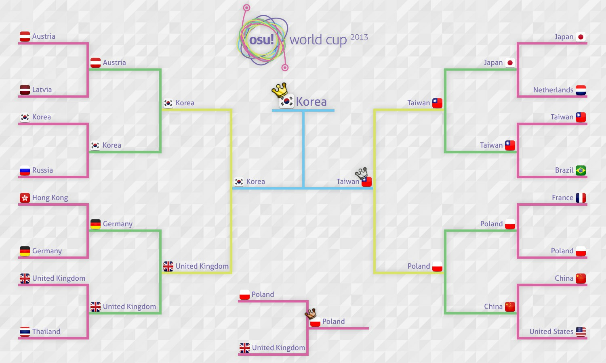

---
tags:
  - OWC 2013
  - OWC2013
  - 世界杯
---

# osu! 2013 世界杯

**osu! 世界杯 2013** (***OWC 2013***) 是由 [osu! 团队](/wiki/People/osu!_team)举办的，基于国家/地区的 osu! 锦标赛。本届 osu! 世界杯是第四届。

## 赛程

| 阶段 | 时间 |
| --: | :-- |
| 报名 | 2013-10-15/2013-10-28 |
| 直播抽签 | 2013-10-31 (16:00 UTC) |
| 小组赛 | 2013-11-08/2013-11-10 |
| 十六强赛 | 2013-11-16/2013-11-17 |
| 四分之一决赛 | 2013-11-24 |
| 半决赛 | 2013-11-30 |
| 决赛 | 2013-12-07/2013-12-08 |

## 奖品

| 名次 | 奖品 |
| :-: | :-- |
|  | 6 个月的 osu!supporter 标签、个人主页徽章、OWC 奖杯、[osu!tablet](https://osu.ppy.sh/community/forums/topics/169139) |
|  | 3 个月的 osu!supporter 标签 |
|  | 1 个月的 osu!supporter 标签 |

## 组织

osu! 2013 世界杯由众多社区成员举办。

| 职位 | 成员 |
| :-- | :-- |
| 比赛管理 | ::{ flag=US }:: [dkun](https://osu.ppy.sh/users/154400), ::{ flag=DE }:: [Loctav](https://osu.ppy.sh/users/71366), ::{ flag=DE }:: [p3n](https://osu.ppy.sh/users/123703) |
| 选图 | ::{ flag=IT }:: [Chewin](https://osu.ppy.sh/users/617323), ::{ flag=AR }:: [Darksonic](https://osu.ppy.sh/users/570042), ::{ flag=AR }:: [Wishy](https://osu.ppy.sh/users/495477) |
| 直播 | ::{ flag=US }:: [Makar](https://osu.ppy.sh/users/686389), ::{ flag=CA }:: [Nyquill](https://osu.ppy.sh/users/682935), ::{ flag=AU }:: [peppy](https://osu.ppy.sh/users/2), ::{ flag=AU }:: [Zallius](https://osu.ppy.sh/users/55) |
| 解说 | ::{ flag=US }:: [Agnes](https://osu.ppy.sh/users/136982), ::{ flag=NZ }:: [deadbeat](https://osu.ppy.sh/users/128370), ::{ flag=NO }:: [kriers](https://osu.ppy.sh/users/333241), ::{ flag=AU }:: [LaVolpe024](https://osu.ppy.sh/users/597796), ::{ flag=NO }:: [MillhioreF](https://osu.ppy.sh/users/941094), ::{ flag=FR }:: [Mr Color](https://osu.ppy.sh/users/116078), ::{ flag=US }:: [ztrot](https://osu.ppy.sh/users/6347) |
| 统计 | ::{ flag=PL }:: [Marcin](https://osu.ppy.sh/users/722665) |

## 链接

- [讨论帖（英文）](https://osu.ppy.sh/community/forums/topics/160181)
- [讨论帖（中文）](https://osu.ppy.sh/community/forums/topics/160371)
- [直播](https://www.twitch.tv/osulive/profile/pastBroadcasts)
- **[统计表](https://docs.google.com/spreadsheet/ccc?key=0AsjrK0nkPsOfdGZmZ2VKZ05KV1pjdUE5VlpHYVlwZWc&usp=drive_web#gid=17)**

## 参赛者

|  | 国家/地区 | 选手 |
| :-: | :-: | :-- |
| ::{ flag=AR }:: | 阿根廷 | **[Metro](https://osu.ppy.sh/users/306737)**, [CBA-ES-CAB](https://osu.ppy.sh/users/1875237), [druidxd](https://osu.ppy.sh/users/841441), [Fabi](https://osu.ppy.sh/users/173114), [Glazbom](https://osu.ppy.sh/users/608277), [Hernan](https://osu.ppy.sh/users/516680), [Mikumiku97](https://osu.ppy.sh/users/503749), [Salvage](https://osu.ppy.sh/users/242119) |
| ::{ flag=AU }:: | 澳大利亚 | **[JappyBabes](https://osu.ppy.sh/users/697783)**, [Bauxe](https://osu.ppy.sh/users/1881685), [flow](https://osu.ppy.sh/users/636660), [kamiyo-sama](https://osu.ppy.sh/users/557197), [Lach](https://osu.ppy.sh/users/2108620), [Melt3dCheeze](https://osu.ppy.sh/users/634837), [smoogipoo](https://osu.ppy.sh/users/1040328), [TimmyTimTims](https://osu.ppy.sh/users/1254926) |
| ::{ flag=AT }:: | 奥地利 | **[Omgforz](https://osu.ppy.sh/users/578943)**, [Alumetorz](https://osu.ppy.sh/users/1145984), [Jin\_Back7](https://osu.ppy.sh/users/1238524), [M3tr01d](https://osu.ppy.sh/users/887921), [SunBurn](https://osu.ppy.sh/users/1654811), [WhitePhoenixLP](https://osu.ppy.sh/users/1426098) |
| ::{ flag=BE }:: | 比利时 | **[DrakRainbow](https://osu.ppy.sh/users/1320231)**, [GoldenWolf](https://osu.ppy.sh/users/1612624), [Sakisan](https://osu.ppy.sh/users/1011389), [larshmellow](https://osu.ppy.sh/users/2140973), [Friendzone King](https://osu.ppy.sh/users/2930903), [KinkehW](https://osu.ppy.sh/users/2064831), [Mithrane](https://osu.ppy.sh/users/839509) |
| ::{ flag=BR }:: | 巴西 | **[fabriciorby](https://osu.ppy.sh/users/209664)**, [AdRon Zh3Ro](https://osu.ppy.sh/users/150978), [antsu](https://osu.ppy.sh/users/92953), [Blue Dragon](https://osu.ppy.sh/users/19048), [Ghost Princess](https://osu.ppy.sh/users/4895448), [nouk](https://osu.ppy.sh/users/1515238), [powerstream89](https://osu.ppy.sh/users/2293274), [Shott](https://osu.ppy.sh/users/965354) |
| ::{ flag=BG }:: | 保加利亚 | **[Scrublord](https://osu.ppy.sh/users/869307)**, [Angeloid\_Alpha](https://osu.ppy.sh/users/578108), [-Arthus-](https://osu.ppy.sh/users/1869492), [b1o](https://osu.ppy.sh/users/1158340), [Defacer](https://osu.ppy.sh/users/1159024), [Hardatyou](https://osu.ppy.sh/users/2070768), [Supbads](https://osu.ppy.sh/users/2017338) |
| ::{ flag=CA }:: | 加拿大 | **[Azer](https://osu.ppy.sh/users/2155578)**, [erotik](https://osu.ppy.sh/users/1698304), [FunOrange](https://osu.ppy.sh/users/2051389), [hoozimajiget](https://osu.ppy.sh/users/215567), [Kairi](https://osu.ppy.sh/users/1586237), [Layne](http://osu.ppy.sh/users/1537722), [Mariya](http://osu.ppy.sh/users/763872), [mochi](https://osu.ppy.sh/users/379423) |
| ::{ flag=CN }:: | 中国 | **[Furudo\_Erika](https://osu.ppy.sh/users/169878)**, [5231\_Kinoko](https://osu.ppy.sh/users/181057), [Dsan](https://osu.ppy.sh/users/1266166), [GGBY](https://osu.ppy.sh/users/629717), [GunS\_N\_Rose](http://osu.ppy.sh/users/1349849), [InabaTewi](http://osu.ppy.sh/users/1078004), [N a n o](https://osu.ppy.sh/users/694114), [wobeinimacao](https://osu.ppy.sh/users/350723) |
| ::{ flag=CL }:: | 智利 | **[Innocent Steps](https://osu.ppy.sh/users/2233351)**, [BoopMos](https://osu.ppy.sh/users/791477), [cofla](https://osu.ppy.sh/users/12774688), [Cristian](https://osu.ppy.sh/users/194345), [Mesita](https://osu.ppy.sh/users/201459), [Neab](https://osu.ppy.sh/users/916693), [Revengexsoyah](https://osu.ppy.sh/users/123938), [SwENeMbO](https://osu.ppy.sh/users/652793) |
| ::{ flag=EE }:: | 爱沙尼亚 | **[Noriko](https://osu.ppy.sh/users/1942522)**, [Kafaru](https://osu.ppy.sh/users/2281284), [MaDBoY94](https://osu.ppy.sh/users/235224), [Manzz](https://osu.ppy.sh/users/1869429), [ShinseinaTenshi](https://osu.ppy.sh/users/912518), [YellowManul](https://osu.ppy.sh/users/614413), [Yumz](https://osu.ppy.sh/users/1619062) |
| ::{ flag=FI }:: | 芬兰 | **[Soarezi](http://osu.ppy.sh/users/2097622)**, [ethox](https://osu.ppy.sh/users/441380), [fabbbyyy v2](https://osu.ppy.sh/users/1637452), [Juzaa](https://osu.ppy.sh/users/620661), [Souko](https://osu.ppy.sh/users/417431), [Subbie](https://osu.ppy.sh/users/1590138) |
| ::{ flag=FR }:: | 法国 | **[-Kamui-](https://osu.ppy.sh/users/835808)**, [Kynan](https://osu.ppy.sh/users/1093361), [Musty](https://osu.ppy.sh/users/251683), [My Not](https://osu.ppy.sh/users/1572405), [NerO](https://osu.ppy.sh/users/1545031), [The\_badin](https://osu.ppy.sh/users/1567646), [Timal75](https://osu.ppy.sh/users/1570253), [Worne](https://osu.ppy.sh/users/1019489) |
| ::{ flag=DE }:: | 德国 | **[ShadowSoul](https://osu.ppy.sh/users/494970)**, [BDDav](https://osu.ppy.sh/users/1164526), [CookEasy](https://osu.ppy.sh/users/453226), [cptnXn](https://osu.ppy.sh/users/495272), [dukambe](https://osu.ppy.sh/users/880002), [Dustice](https://osu.ppy.sh/users/754565), [Imamoto](http://osu.ppy.sh/users/1201224), [Michi](https://osu.ppy.sh/users/932342) |
| ::{ flag=HK }:: | 香港 | **[SiLviZ](https://osu.ppy.sh/users/1687524)**, [Akiko-](https://osu.ppy.sh/users/1226106), [auweichun](https://osu.ppy.sh/users/979729), [Fir3k0](https://osu.ppy.sh/users/1643913), [galen1922](https://osu.ppy.sh/users/745133), [HineX](https://osu.ppy.sh/users/13854), [K47](https://osu.ppy.sh/users/1730835), [Yakumo Yukarin](https://osu.ppy.sh/users/562623) |
| ::{ flag=ID }:: | 印度尼西亚 | **[Avner](https://osu.ppy.sh/users/1701569)**, [\[T\]rickster](https://osu.ppy.sh/users/653412), [C00LZ](http://osu.ppy.sh/users/1128514), [Frizz](https://osu.ppy.sh/users/804584), [Gatyaa420](https://osu.ppy.sh/users/984132), [Hakeru](https://osu.ppy.sh/users/345422), [Method](https://osu.ppy.sh/users/524530), [WVS](https://osu.ppy.sh/users/1584663) |
| ::{ flag=IT }:: | 意大利 | **[Leader](https://osu.ppy.sh/users/631530)**, [Andrea](https://osu.ppy.sh/users/33599), [Jordan](https://osu.ppy.sh/users/618549), [My Accuracy Sucks](https://osu.ppy.sh/users/1693771), [Nemis](https://osu.ppy.sh/users/1635091), [Pagno](https://osu.ppy.sh/users/1907940), [puncia](https://osu.ppy.sh/users/782633), [xiAmME](https://osu.ppy.sh/users/1428960) |
| ::{ flag=JP }:: | 日本 | **[Karuta](http://osu.ppy.sh/users/360552)**, [doctorindark](https://osu.ppy.sh/users/609227), [Gokuri](https://osu.ppy.sh/users/343865), [Homura-](https://osu.ppy.sh/users/482120), [mugio3](https://osu.ppy.sh/users/491522), [Potofu](https://osu.ppy.sh/users/657404), [rrtyui](https://osu.ppy.sh/users/352328), [serea](https://osu.ppy.sh/users/371961) |
| ::{ flag=LV }:: | 拉脱维亚 | **[LoGo](https://osu.ppy.sh/users/750382)**, [Forseen](https://osu.ppy.sh/users/556012), [nek2high](https://osu.ppy.sh/users/886309), [NewNyuu](https://osu.ppy.sh/users/1238832), [nomen](https://osu.ppy.sh/users/1439018), [PyramidX](https://osu.ppy.sh/users/940873), [Suika Ibuki](http://osu.ppy.sh/users/1115566), [Vmx](https://osu.ppy.sh/users/967501) |
| ::{ flag=NL }:: | 荷兰 | **[happy30](https://osu.ppy.sh/users/27767)**, [BiG\_ChilD](https://osu.ppy.sh/users/596196), [jackylam5](https://osu.ppy.sh/users/1540807), [Kris](https://osu.ppy.sh/users/984597), [Kyshiro](https://osu.ppy.sh/users/640611), [R3laX3R](https://osu.ppy.sh/users/819689), [Synchrostar](https://osu.ppy.sh/users/419705), [Yoeri](https://osu.ppy.sh/users/1441635) |
| ::{ flag=NZ }:: | 新西兰 | **[deadbeat](https://osu.ppy.sh/users/128370)**, [B O X](https://osu.ppy.sh/users/2070407), [buny](https://osu.ppy.sh/users/1488796), [Kiiwa](https://osu.ppy.sh/users/231111), [shortpotato](https://osu.ppy.sh/users/1266102), [TCN](https://osu.ppy.sh/users/1175528), [Xiipher](https://osu.ppy.sh/users/2384983) |
| ::{ flag=NO }:: | 挪威 | **[kriers](https://osu.ppy.sh/users/333241)**, [31415926535897](http://osu.ppy.sh/users/1156888), [Amedis](https://osu.ppy.sh/users/744117), [CXu](https://osu.ppy.sh/users/84841), [-GN](https://osu.ppy.sh/users/895581), [ivaz](https://osu.ppy.sh/users/496424), [KinomiCandy](https://osu.ppy.sh/users/375143), [Sniff](https://osu.ppy.sh/users/1161243) |
| ::{ flag=PH }:: | 菲律宾 | **[Pizzicato](http://osu.ppy.sh/users/692610)**, [\[Accelerator\]](http://osu.ppy.sh/users/1679638), [dayun10](https://osu.ppy.sh/users/570310), [-Gio](http://osu.ppy.sh/users/1795827), [Jann](https://osu.ppy.sh/users/6265774), [katayoki](https://osu.ppy.sh/users/1208491), [MioMilo](https://osu.ppy.sh/users/2199427), [Mira-san](https://osu.ppy.sh/users/1587999) |
| ::{ flag=PL }:: | 波兰 | **[fartownik](https://osu.ppy.sh/users/56917)**, [AmaiHachimitsu](https://osu.ppy.sh/users/844815), [Beniek](https://osu.ppy.sh/users/1649633), [Niko](https://osu.ppy.sh/users/175141), [Piotrekol](https://osu.ppy.sh/users/304520), [rEdo](https://osu.ppy.sh/users/49329), [worst fl player](http://osu.ppy.sh/users/613592), [WubWoofWolf](https://osu.ppy.sh/users/39828) |
| ::{ flag=RU }:: | 俄罗斯 | **[cr1m](http://osu.ppy.sh/users/803766)**, [Dremor](https://osu.ppy.sh/users/540407), [homu-homu-tan](https://osu.ppy.sh/users/1052037), [JuZu](https://osu.ppy.sh/users/1062960), [Kert](https://osu.ppy.sh/users/119933), [Maemi](https://osu.ppy.sh/users/1110843), [talala](https://osu.ppy.sh/users/1389663), [TheSpaceMan](http://osu.ppy.sh/users/1162734) |
| ::{ flag=SG }:: | 新加坡 | **[Bardiche\_Z](https://osu.ppy.sh/users/1305916)**, [Alacartx](https://osu.ppy.sh/users/1959767), [CloudNep](https://osu.ppy.sh/users/2038868), [deokoking](https://osu.ppy.sh/users/1527992), [phox](https://osu.ppy.sh/users/772295), [SenaAiriii](https://osu.ppy.sh/users/1893953), [Theseanbei](https://osu.ppy.sh/users/2044859), [Wishxrai](https://osu.ppy.sh/users/2238652) |
| ::{ flag=KR }:: | 韩国 | **[Dungeon](https://osu.ppy.sh/users/461720)**, [- Hakurei Reimu-](https://osu.ppy.sh/users/948713), [CheEZ](https://osu.ppy.sh/users/272117), [dragonhuman](https://osu.ppy.sh/users/713266), [ffury](https://osu.ppy.sh/users/2056071), [K i R i K a R u](https://osu.ppy.sh/users/139670), [Shizuru-](https://osu.ppy.sh/users/1341421), [Tengu](https://osu.ppy.sh/users/380836) |
| ::{ flag=SE }:: | 瑞典 | **[Xytox](https://osu.ppy.sh/users/2229274)**, [Blandar](https://osu.ppy.sh/users/1410445), [Gnuu](https://osu.ppy.sh/users/914004), [Gyuunyu](https://osu.ppy.sh/users/799102), [Mayis](https://osu.ppy.sh/users/2003792), [Shilkey](https://osu.ppy.sh/users/2001716), [Shimox](https://osu.ppy.sh/users/1192387), [Slizzer](https://osu.ppy.sh/users/809983) |
| ::{ flag=TW }:: | 台湾 | **[Uan](https://osu.ppy.sh/users/147623)**, [dabanlong](https://osu.ppy.sh/users/624254), [I will be back](https://osu.ppy.sh/users/477704), [onlyforyou](https://osu.ppy.sh/users/597858), [Rucker](https://osu.ppy.sh/users/147515), [Small K](https://osu.ppy.sh/users/952751), [SnowWhite](https://osu.ppy.sh/users/50265), [YuyuKo sama](https://osu.ppy.sh/users/234788) |
| ::{ flag=TH }:: | 泰国 | **[NonxE](https://osu.ppy.sh/users/319312)**, [0OoMickeyoO0](https://osu.ppy.sh/users/317494), [Cint](https://osu.ppy.sh/users/889331), [Frostmourne](https://osu.ppy.sh/users/199669), [Neolution](https://osu.ppy.sh/users/1592782), [Popo\[Mikoto\]](https://osu.ppy.sh/users/445236) |
| ::{ flag=GB }:: | 英国 | **[jesus1412](https://osu.ppy.sh/users/230116)**, [bubby963](https://osu.ppy.sh/users/1050426), [Charleyzard](https://osu.ppy.sh/users/1062584), [Doomsday](https://osu.ppy.sh/users/18983), [iLikeMudkipz](https://osu.ppy.sh/users/552515), [Navi](https://osu.ppy.sh/users/926304), [R a h a r u](https://osu.ppy.sh/users/785193), [Starry-](https://osu.ppy.sh/users/2166199) |
| ::{ flag=US }:: | 美国 | **[Kaoru](https://osu.ppy.sh/users/492699)**, [Floks](https://osu.ppy.sh/users/1146469), [Kyou-kun](https://osu.ppy.sh/users/285711), [pielak213](https://osu.ppy.sh/users/310455), [pooptartsonas](https://osu.ppy.sh/users/1334453), [SapphireGhost](https://osu.ppy.sh/users/388602), [Silynn](https://osu.ppy.sh/users/1171628), [Thatgooey](https://osu.ppy.sh/users/1200113) |
| ::{ flag=VE }:: | 委内瑞拉 | **[MeowinTurtle](https://osu.ppy.sh/users/2026980)**, Baozis <!-- missing -->, [CrymynaL](https://osu.ppy.sh/users/1158908), [Livean](https://osu.ppy.sh/users/674036), [Roli](https://osu.ppy.sh/users/1797688), [S4suk3](https://osu.ppy.sh/users/401955) |

## 分组

| 头号种子 | 高位种子 | 中位种子 | 低位种子 |
| :-- | :-- | :-- | :-- |
| ::{ flag=CN }:: 中国 | ::{ flag=AR }:: 阿根廷 | ::{ flag=AU }:: 澳大利亚 | ::{ flag=BE }:: 比利时 |
| ::{ flag=DE }:: 德国 | ::{ flag=BR }:: 巴西 | ::{ flag=AT }:: 奥地利 | ::{ flag=BG }:: 保加利亚 |
| ::{ flag=JP }:: 日本 | ::{ flag=HK }:: 香港 | ::{ flag=CA }:: 加拿大 | ::{ flag=CL }:: 智利 |
| ::{ flag=KR }:: 韩国 | ::{ flag=LV }:: 拉脱维亚 | ::{ flag=FI }:: 芬兰 | ::{ flag=EE }:: 爱沙尼亚 |
| ::{ flag=PL }:: 波兰 | ::{ flag=NO }:: 挪威 | ::{ flag=FR }:: 法国 | ::{ flag=NZ }:: 新西兰 |
| ::{ flag=TW }:: 台湾 | ::{ flag=RU }:: 俄罗斯 | ::{ flag=ID }:: 印度尼西亚 | ::{ flag=PH }:: 菲律宾 |
| ::{ flag=TH }:: 泰国 | ::{ flag=SE }:: 瑞典 | ::{ flag=IT }:: 意大利 | ::{ flag=SG }:: 新加坡 |
| ::{ flag=US }:: 美国 | ::{ flag=GB }:: 英国 | ::{ flag=NL }:: 荷兰 | ::{ flag=VE }:: 委内瑞拉 |

## 颁奖信息

本届比赛已经结束，颁奖结果如下：

| 名次 | 队伍 |
| :-: | :-- |
|  | ::{ flag=KR }:: **韩国** (**[Dungeon](https://osu.ppy.sh/users/461720)**, [- Hakurei Reimu-](https://osu.ppy.sh/users/948713), [CheEZ](https://osu.ppy.sh/users/272117), [dragonhuman](https://osu.ppy.sh/users/713266), [ffury](https://osu.ppy.sh/users/2056071), [K i R i K a R u](https://osu.ppy.sh/users/139670), [Shizuru-](https://osu.ppy.sh/users/1341421), [Tengu](https://osu.ppy.sh/users/380836)) |
|  | ::{ flag=TW }:: **台湾** (**[Uan](https://osu.ppy.sh/users/147623)**, [dabanlong](https://osu.ppy.sh/users/624254), [I will be back](https://osu.ppy.sh/users/477704), [onlyforyou](https://osu.ppy.sh/users/597858), [Rucker](https://osu.ppy.sh/users/147515), [Small K](https://osu.ppy.sh/users/952751), [SnowWhite](https://osu.ppy.sh/users/50265), [YuyuKo sama](https://osu.ppy.sh/users/234788)) |
|  | ::{ flag=PL }:: **波兰** (**[fartownik](https://osu.ppy.sh/users/56917)**, [AmaiHachimitsu](https://osu.ppy.sh/users/844815), [Beniek](https://osu.ppy.sh/users/1649633), [Niko](https://osu.ppy.sh/users/175141), [Piotrekol](https://osu.ppy.sh/users/304520), [rEdo](https://osu.ppy.sh/users/49329), [worst fl player](http://osu.ppy.sh/users/613592), [WubWoofWolf](https://osu.ppy.sh/users/39828)) |

## 比赛图池

### 决赛

**[在这里下载图包！(194 MB)](https://www.mediafire.com/download/igx08rvp8g5502v/Final%20Map%20Pool.rar)**

- NoMod
  1. [Ryu\* vs. kors k - Force of Wind (Jenny) \[Extra\]](https://osu.ppy.sh/beatmapsets/44519#osu/142239)
  2. [O-Life Japan - Yakujinsama no Couple Dance (AngelHoney) \[Lunatic\]](https://osu.ppy.sh/beatmapsets/16990#osu/95954)
  3. [RYO - Shuffle Heaven (Nemis) \[eXtra\]](https://osu.ppy.sh/beatmapsets/85802#osu/235470)
  4. [AU - Infinite of Nuclear Fusion (OnosakiHito) \[Regou's Extra\]](https://osu.ppy.sh/beatmapsets/35211#osu/291285)
  5. [Neru - Ningen Shikkaku (nold\_1702) \[Posthumous\]](https://osu.ppy.sh/beatmapsets/86983#osu/237848)
  6. [TJ.Hangneil - Kamui (7odoa) \[SHD\]](https://osu.ppy.sh/beatmapsets/39017#osu/124664)
- Hidden
  1. [Tsukasa - Heaven's Race Guitar Style (La Cataline) \[Collab\]](https://osu.ppy.sh/beatmapsets/41974#taiko/132260)
  2. [Zektbach - meme (AngelHoney) \[ExtrA\]](https://osu.ppy.sh/beatmapsets/68617#osu/198428)
  3. [Nekomata Master - Smile of Split (Charles445) \[Insane\]](https://osu.ppy.sh/beatmapsets/56847#osu/171678)
  4. [YAMAGEN'S DEVILELIET - EYES OF DEVILELIET (Kite) \[PERNICIOUS\]](https://osu.ppy.sh/beatmapsets/36988#osu/119238)
- HardRock
  1. [nano.RIPE - Real World (bakabaka) \[Insane\]](https://osu.ppy.sh/beatmapsets/59269#osu/177735)
  2. [Tatsh - reunion (ouranhshc) \[Insane\]](https://osu.ppy.sh/beatmapsets/24523#osu/83338)
  3. [Suzaku - Anisakis -somatic mutation type "Forza"- (tsukamaete) \[Another\]](https://osu.ppy.sh/beatmapsets/15579#osu/56347)
  4. [Lapfox Trax feat. guilhox - Lapfoxed Forever (Blue Dragon) \[Nogard\]](https://osu.ppy.sh/beatmapsets/59521#osu/178353)
- DoubleTime
  1. [SYNC.ART'S - Splendid Encount -one more encore- (KanaRin) \[S i R i R u's Lunatic\]](https://osu.ppy.sh/beatmapsets/27915#osu/94640)
  2. [xi - Parousia (Shiirn) \[Another\]](https://osu.ppy.sh/beatmapsets/37333#osu/120121)
  3. [Makou - Fermion (MoonFragrance) \[Maximum\]](https://osu.ppy.sh/beatmapsets/20723#osu/72284)
  4. [ALiCE'S EMOTiON - Colors (S i R i R u) \[Lunatic\]](https://osu.ppy.sh/beatmapsets/29254#osu/97119)
- FreeMod
  1. [LeaF - MEPHISTO (Alumetorz) \[Extra\]](https://osu.ppy.sh/beatmapsets/106212#osu/278451)
  2. [Fear, and Loathing in Las Vegas - Scream Hard as You Can (Guy) \[Insane\]](https://osu.ppy.sh/beatmapsets/89979#osu/255260)
  3. [Kawada Mami - Serment (TV Size) (DeathBlood) \[0108\]](https://osu.ppy.sh/beatmapsets/50161#osu/154311)
  4. [Last Note. - Caramel Heaven (Snepif) \[Heaven\]](https://osu.ppy.sh/beatmapsets/90095#osu/244691)
- Tiebreaker
  1. **[t+pazolite feat. Rizna - Distorted Lovesong (RLC) \[Love\]](https://osu.ppy.sh/beatmapsets/81694#osu/226605)**

### 半决赛

**[在这里下载图包！(209 MB)](https://www.mediafire.com/?pn3yxce7m6v4j13)**

- NoMod
  1. [CON - Cruel Clocks (Amamiya Yuko) \[Skystar\]](https://osu.ppy.sh/beatmapsets/76882#osu/216272)
  2. [Igorrr - Unpleasant Sonata (Sieg) \[Pagli's Sonata\]](https://osu.ppy.sh/beatmapsets/90385#osu/262302)
  3. [jippusu - Mushikui Saikede Rhythm (Amamiya Yuko) \[RLC\]](https://osu.ppy.sh/beatmapsets/87547#osu/240689)
  4. [Hatsune Miku - Ohigan FuzzyClap (val0108) \[Prankster0108\]](https://osu.ppy.sh/beatmapsets/35942#osu/119021)
  5. [Kola Kid - can't hide your love (Kert) \[Can't\]](https://osu.ppy.sh/beatmapsets/39732#osu/126446)
  6. [Inspector K - Disconnected Hardkore (CanBlaster Remix) (Shiirn) \[Reconnected\]](https://osu.ppy.sh/beatmapsets/37242#osu/123708)
- Hidden
  1. [Silent Spica - Anhedonia (Muya) \[Another\]](https://osu.ppy.sh/beatmapsets/60136#osu/181843)
  2. [Jin - Children Record (tutuhaha) \[Record\]](https://osu.ppy.sh/beatmapsets/55775#osu/169004)
  3. [Hatsune Miku - Tenshinranman High Collar Hime (NatsumeRin) \[Rin\]](https://osu.ppy.sh/beatmapsets/55115#osu/167718)
  4. [Yousei Teikoku - Hades: The Rise (lolcubes) \[Insane\]](https://osu.ppy.sh/beatmapsets/33911#osu/110347)
- HardRock
  1. [nano - Nevereverland (Nyquill) \[Insane\]](https://osu.ppy.sh/beatmapsets/95533#osu/256499)
  2. [Fear, and Loathing in Las Vegas - Just Awake (gowww) \[Insane\]](https://osu.ppy.sh/beatmapsets/44527#osu/139446)
  3. [NegaRen - Stark Raving Mad (vipto) \[Raving Mad\]](https://osu.ppy.sh/beatmapsets/54618#osu/166350)
  4. [MuryokuP - Sweet Sweet Cendrillon Drug (Smoothie) \[Cendrillon\]](https://osu.ppy.sh/beatmapsets/72834#osu/207846)
- DoubleTime
  1. [07th Expansion - miragecoordinator (La Cataline) \[Hard\]](https://osu.ppy.sh/beatmapsets/31116#osu/102426)
  2. [fripSide - HAPPY Generation (Thite) \[Insane\]](https://osu.ppy.sh/beatmapsets/30451#osu/100526)
  3. [Shihori - Bamboo Dance (Frostmourne) \[Lunatic\]](https://osu.ppy.sh/beatmapsets/39056#osu/124771)
  4. [SuganoMusic - Imademo... (S i R i R u) \[Lunatic\]](https://osu.ppy.sh/beatmapsets/21960#osu/75930)
- FreeMod
  1. [Meiko Nakamura - Dispel (terametis) \[Insane\]](https://osu.ppy.sh/beatmapsets/39640#osu/126229)
  2. [Igorrr - Pavor Nocturnus (grumd) \[Insane\]](https://osu.ppy.sh/beatmapsets/57525#osu/173391)
  3. [DJ Sharpnel - IVALTEK (happy30) \[HappyMiX\]](https://osu.ppy.sh/beatmapsets/50429#osu/154988)
  4. [incinerate - Purgatorium (RikiH\_) \[Heaven\]](https://osu.ppy.sh/beatmapsets/54727#osu/166316)
- Tiebreaker
  1. **[Hatsune Miku - Mythologia's End (val0108) \[Myth0108ia\]](https://osu.ppy.sh/beatmapsets/48979#osu/151229)**

### 四分之一决赛

**[在这里下载图包！(184 MB)](https://www.mediafire.com/download/i2umf8lrethjzoj/Quarter-finals.rar)**

- NoMod
  1. [xi - Time files (gowww) \[Another\]](https://osu.ppy.sh/beatmapsets/49843#osu/153484)
  2. [LeaF - Calamity Fortune (Flower) \[Extra\]](https://osu.ppy.sh/beatmapsets/96103#osu/257793)
  3. [Hanatan - Hyakunen Yakou (eveless) \[Insane\]](https://osu.ppy.sh/beatmapsets/79100#osu/220908)
  4. [Neru - Idola no Circus (Amamiya Yuko) \[Skystar\]](https://osu.ppy.sh/beatmapsets/92976#osu/251096)
  5. [Wotamin - Gigantic O.T.N (Star Stream) \[S.S\]](https://osu.ppy.sh/beatmapsets/80214#osu/223397)
  6. [capitaro - Yoiduki Maiuta (Amamiya Yuko) \[Insane\]](https://osu.ppy.sh/beatmapsets/70057#osu/201601)
- Hidden
  1. [bj.HaLo - Ende (galvenize) \[Another\]](https://osu.ppy.sh/beatmapsets/44035#osu/148716)
  2. [Caravan Palace - Dragons (Charles445) \[Insane\]](https://osu.ppy.sh/beatmapsets/46733#osu/145361)
  3. [Hatsune Miku - Senkouhanabi Aika (val0108) \[0108 Aika\]](https://osu.ppy.sh/beatmapsets/33556#osu/121767)
  4. [Marguerite du Pre - Marie Antoinette (GladiOol) \[Another\]](https://osu.ppy.sh/beatmapsets/43229#osu/136640)
- HardRock
  1. [Nanamori-chu \* Goraku-bu - My Pace de Ikimashou (bakabaka) \[Yuri\]](https://osu.ppy.sh/beatmapsets/36569#osu/118226)
  2. [Natsuiro Bikini no Prim - Nagisa no Koakuma Lovely\~Radio (CSY the corrupt) \[Extreme\]](https://osu.ppy.sh/beatmapsets/76709#osu/215888)
  3. [L.E.D. - THE LAST STRIKER (Nakagawa-Kanon) \[Another\]](https://osu.ppy.sh/beatmapsets/38867#osu/124264)
  4. [Megpoid GUMI - Shinkaron -code:variant- (NatsumeRin) \[Rin\]](https://osu.ppy.sh/beatmapsets/29445#osu/99465)
- DoubleTime
  1. [SYNC.ART'S - Kaze no Touei (Licnect) \[Licnect x yongtw123\]](https://osu.ppy.sh/beatmapsets/26946#osu/90656)
  2. [fripSide - Assemble\*LOVEsemble (Natteke) \[Natteke\]](https://osu.ppy.sh/beatmapsets/24627#osu/95653)
  3. [Girls Dead Monster - Shine Days (Full ver) (Clare) \[Clare's Sunshine\]](https://osu.ppy.sh/beatmapsets/16992#osu/61183)
  4. [Chata - Harukaze Dance (Laurier) \[Insane\]](https://osu.ppy.sh/beatmapsets/95563#osu/256580)
- FreeMod
  1. [wa. vs ETIA. - Akasagarbha (DaxMasterix) \[Shiirn's Extra\]](https://osu.ppy.sh/beatmapsets/39205#osu/129961)
  2. [Mind Vortex - Arc (Natteke) \[Nsane\]](https://osu.ppy.sh/beatmapsets/87509#osu/239037)
  3. [Cuvelia - Tenkuu no Yoake (AngelHoney) \[Another\]](https://osu.ppy.sh/beatmapsets/47757#osu/148009)
  4. [TeamGrimoire+Amaneko - croiX (HelloSCV) \[EXHAUST\]](https://osu.ppy.sh/beatmapsets/88692#osu/241578)
- Tiebreaker
  1. **[HujuniseikouyuuP - Talent Shredder (val0108) \[0108 style\]](https://osu.ppy.sh/beatmapsets/47710#osu/178966)**

### 十六强赛

**[在这里下载图包！(143 MB)](https://www.mediafire.com/download/e62iav4kb90981b/Round_of_16_Pack.rar)**

- NoMod
  1. [DECO\*27 feat. marina - Aimai Elegy (val0108) \[0108\]](https://osu.ppy.sh/beatmapsets/43248#osu/135804)
  2. [DJ YOSHITAKA - VALLIS-NERIA (Sagisawa-Yukari) \[Flower’s Another\]](https://osu.ppy.sh/beatmapsets/62800#osu/193404)
  3. [Ryu\* Vs. L.E.D.-G Vs. ZUN - PARADISE GHOST (Pokie) \[Extra\]](https://osu.ppy.sh/beatmapsets/67133#osu/195305)
  4. [Cres - End Time (Maddy) \[eXtra\]](https://osu.ppy.sh/beatmapsets/73474#osu/209276)
  5. [M2U - Gypsy Tronic (LKs) \[Insane\]](https://osu.ppy.sh/beatmapsets/61590#osu/183460)
  6. [Rohi - Kodoku Egoism (NatsumeRin) \[Rin\]](https://osu.ppy.sh/beatmapsets/58737#osu/196673)
- Hidden
  1. [Megpoid GUMI - Justice Breaker (NatsumeRin) \[NTR\]](https://osu.ppy.sh/beatmapsets/41616#osu/177183)
  2. [Takanashi Yasuharu - Doku Ryuu no Kobura (\_Kiva) \[Insane\]](https://osu.ppy.sh/beatmapsets/39950#osu/128875)
  3. [Xelia - Illumiscape (Kanna) \[Another\]](https://osu.ppy.sh/beatmapsets/43960#osu/137840)
  4. [Hatsune Miku - Kagerou Days (m i z u k i) \[mizuki\]](https://osu.ppy.sh/beatmapsets/37638#osu/128668)
- HardRock
  1. [bibuko - Reizouko Mitara Pudding ga Nai (val0108) \[Mythol's Pudding\]](https://osu.ppy.sh/beatmapsets/90068#osu/256839)
  2. [Memme - BSPower Explosion (AngelHoney) \[Another\]](https://osu.ppy.sh/beatmapsets/44967#osu/140821)
  3. [Yousei Teikoku - Mischievous of Alice (Furawa) \[Alice\]](https://osu.ppy.sh/beatmapsets/35546#osu/142356)
  4. [Zeami - Music Revolver (KanaRin) \[Kana\]](https://osu.ppy.sh/beatmapsets/53231#osu/162363)
- DoubleTime
  1. [FELT - Prayer Blue (Frostmourne) \[Lunatic\]](https://osu.ppy.sh/beatmapsets/51145#osu/156927)
  2. [Infected Mushroom - Pink Nightmares (RLC) \[Insane\]](https://osu.ppy.sh/beatmapsets/107639#osu/281977)
  3. [Hatsune Miku - Sayonara Goodbye (banvi) \[Extreme\]](https://osu.ppy.sh/beatmapsets/29769#osu/98615)
  4. [Sakaue Nachi - Light travel distance RAYTO MIX (Frostmourne) \[Lunatic\]](https://osu.ppy.sh/beatmapsets/42575#osu/133852)
- FreeMod
  1. [Tama - Saigetsu (Midnight Moon Walker Remix) (AmamiyaYuko) \[Lunatic\]](https://osu.ppy.sh/beatmapsets/57126#osu/172360)
  2. [REDALiCE Feat. Ayumi Nomiya - Little Star (LKs) \[Extra\]](https://osu.ppy.sh/beatmapsets/81051#osu/247241)
  3. [Saiya - Remote Control (Garven) \[Insane\]](https://osu.ppy.sh/beatmapsets/53857#osu/164020)
  4. [KOTOKO - Oboetete Ii yo (cRyo\[iceeicee\]) \[Insane\]](https://osu.ppy.sh/beatmapsets/53791#osu/163836)
- Tiebreaker
  1. **[Infected Mushroom - The Pretender (RLC) \[Pretender\]](https://osu.ppy.sh/beatmapsets/79498#osu/221777)**

### 小组赛

**[在这里下载图包！(215 MB)](https://www.mediafire.com/?jn0c8p6wqfrtfhb)**

- NoMod
  1. [Mikami Shiori & Ookubo Rumi - Onna to Onna no Yuri-Game (eg91022a71w) \[YuruYuri\]](https://osu.ppy.sh/beatmapsets/45316#osu/153418)
  2. [TOTAL OBJECTION - Higurashi Moratorium (NatsumeRin) \[Rin\]](https://osu.ppy.sh/beatmapsets/83310#osu/230127)
  3. [mafumafu - Yuugure Semi Nikki (L\_P) \[Yuugure\]](https://osu.ppy.sh/beatmapsets/60096#osu/180681)
  4. [Fear, and Loathing in Las Vegas - Jump Around (iyasine) \[Insane\]](https://osu.ppy.sh/beatmapsets/86861#osu/237576)
  5. [MiddleIsland - Roze (Lan wings) \[Lan\]](https://osu.ppy.sh/beatmapsets/65994#osu/203906)
  6. [DJ YOSHITAKA feat. Hoshino Kanako - MAX LOVE (Startrick) \[Another\]](https://osu.ppy.sh/beatmapsets/107647#osu/281993)
  7. [Sound Horizon - Raijin no Migiude (\_Kiva) \[Insane\]](https://osu.ppy.sh/beatmapsets/27573#osu/92426)
  8. [Tatsh - HEAVENLY MOON (Gabi) \[Extreme\]](https://osu.ppy.sh/beatmapsets/41874#osu/132043)
  9. [Blackhole - Lagomorphic (happy623) \[Lagomorph\]](https://osu.ppy.sh/beatmapsets/74664#osu/211889)
  10. [yuikonnu - Otsukimi Recital (Mythol) \[Collab\]](https://osu.ppy.sh/beatmapsets/107763#osu/282251)
- Hidden
  1. [An - artcore JINJA (Flower) \[Lunatic\]](https://osu.ppy.sh/beatmapsets/114987#osu/297411)
  2. [paraoka - Manima ni (Short Ver.) (Mixagji) \[0108\]](https://osu.ppy.sh/beatmapsets/39275#osu/131362)
  3. [syatten remixed celas - Bird Sprite -Awakening of Light- (DaxMasterix) \[Another\]](https://osu.ppy.sh/beatmapsets/43037#osu/135177)
- HardRock
  1. [momori - Togameru Kage (cRyo\[iceeicee\]) \[Insane\]](https://osu.ppy.sh/beatmapsets/55926#osu/231988)
  2. [Otokaze - Karen (Short Ver.) (spboxer3) \[Hanabi\]](https://osu.ppy.sh/beatmapsets/50177#osu/154357)
  3. [Hanatan - Kotoba Tsunagi (terametis) \[Insane\]](https://osu.ppy.sh/beatmapsets/41764#osu/157735)
- DoubleTime
  1. [SYNC.ART'S feat. Sakaue Nachi - Taketori Hishou (S i R i R u) \[Lunatic\]](https://osu.ppy.sh/beatmapsets/21098#osu/73384)
  2. [Sasaki Sayaka - Zzz (Sumisola) \[Insane\]](https://osu.ppy.sh/beatmapsets/32375#osu/105950)
  3. [Golden City Factory - Twilight Chronicle \~ I am Sister (Patchouli) \[Lunatic\]](https://osu.ppy.sh/beatmapsets/25381#osu/86142)
- FreeMod
  1. [Blue Stahli - Shotgun Senorita (Zardonic Remix) (Aleks719) \[Insane\]](https://osu.ppy.sh/beatmapsets/65853#osu/192508)
  2. [Hatsune Miku - Marionette no Kairaku (rui) \[Uncontrollable\]](https://osu.ppy.sh/beatmapsets/43801#osu/139652)
  3. [Beridzebeth - Seijin no Tou (Strawberry) \[Another\]](https://osu.ppy.sh/beatmapsets/66968#osu/194953)
- Tiebreaker
  1. **[DJ Okawari - Luv Letter (nold\_1702) \[Posthumous\]](https://osu.ppy.sh/beatmapsets/40071#osu/127363)**

## 比赛结果

### 决赛

2013 年 12 月 7 日，星期六：

| 队伍 1 |  |  | 队伍 2 | 比赛链接 |
| --: | :-: | :-: | :-- | :-- |
| **韩国** ::{ flag=KR }:: | **6** | 5 | ::{ flag=TW }:: 台湾 | [#1](https://osu.ppy.sh/community/matches/3233030) |

2013 年 12 月 8 日，星期日：

| 队伍 1 |  |  | 队伍 2 | 比赛链接 |
| --: | :-: | :-: | :-- | :-- |
| 英国 ::{ flag=GB }:: | 1 | **6** | ::{ flag=PL }:: **波兰** | [#1](https://osu.ppy.sh/community/matches/3272199) |

### 半决赛

2013 年 11 月 30 日，星期六：

| 队伍 1 |  |  | 队伍 2 | 比赛链接 |
| --: | :-: | :-: | :-- | :-- |
| **韩国** ::{ flag=KR }:: | **6** | 1 | ::{ flag=GB }:: 英国 | [#1](https://osu.ppy.sh/community/matches/3088440) |
| **台湾** ::{ flag=TW }:: | **6** | 0 | ::{ flag=PL }:: 波兰 | [#1](https://osu.ppy.sh/community/matches/3091169) |

### 四分之一决赛

2013 年 11 月 24 日，星期日：

| 队伍 1 |  |  | 队伍 2 | 比赛链接 |
| --: | :-: | :-: | :-- | :-- |
| 日本 ::{ flag=JP }:: | 2 | **5** | ::{ flag=TW }:: **台湾** | [#1](https://osu.ppy.sh/community/matches/2962477) |
| **韩国** ::{ flag=KR }:: | **5** | 2 | ::{ flag=AT }:: 奥地利 | [#1](https://osu.ppy.sh/community/matches/2964278) |
| 中国 ::{ flag=CN }:: | 4 | **5** | ::{ flag=PL }:: **波兰** | [#1](https://osu.ppy.sh/community/matches/2966197) |
| **英国** ::{ flag=GB }:: | **5** | 3 | ::{ flag=DE }:: 德国 | [#1](https://osu.ppy.sh/community/matches/2969031) |

### 十六强赛

2013 年 11 月 16 日，星期六：

| 队伍 1 |  |  | 队伍 2 | 比赛链接 |
| --: | :-: | :-: | :-- | :-- |
| **韩国** ::{ flag=KR }:: | **5** | 0 | ::{ flag=RU }:: 俄罗斯 | [#1](https://osu.ppy.sh/community/matches/2778204) |
| 香港 ::{ flag=HK }:: | 3 | **5** | ::{ flag=DE }:: **德国** | [#1](https://osu.ppy.sh/community/matches/2780657) |
| **英国** ::{ flag=GB }:: | **5** | 1 | ::{ flag=TH }:: 泰国 | [#1](https://osu.ppy.sh/community/matches/2783657) |

2013 年 11 月 17 日，星期日：

| 队伍 1 |  |  | 队伍 2 | 比赛链接 |
| --: | :-: | :-: | :-- | :-- |
| **中国** ::{ flag=CN }:: | **5** | 2 | ::{ flag=US }:: 美国 | [#1](https://osu.ppy.sh/community/matches/2805329) |
| **日本** ::{ flag=JP }:: | **5** | 1 | ::{ flag=NL }:: 荷兰 | [#1](https://osu.ppy.sh/community/matches/2811659) |
| **台湾** ::{ flag=TW }:: | **5** | 0 | ::{ flag=BR }:: 巴西 | [#1](https://osu.ppy.sh/community/matches/2814063) |
| 法国 ::{ flag=FR }:: | 4 | **5** | ::{ flag=PL }:: **波兰** | [#1](https://osu.ppy.sh/community/matches/2817324) |
| **奥地利** ::{ flag=AT }:: | **5** | 0 | ::{ flag=LV }:: 拉脱维亚 | [#1](https://osu.ppy.sh/community/matches/2820030) |

### 小组赛

2013 年 11 月 8 日，星期五：

| 队伍 1 |  |  | 队伍 2 | 比赛链接 |
| --: | :-: | :-: | :-- | :-- |
| **台湾** ::{ flag=TW }:: | **4** | 0 | ::{ flag=ID }:: 印度尼西亚 | [#1](https://osu.ppy.sh/community/matches/2581408) |
| **波兰** ::{ flag=PL }:: | **4** | 0 | ::{ flag=RU }:: 俄罗斯 | [#1](https://osu.ppy.sh/community/matches/2587307) |
| **芬兰** ::{ flag=FI }:: | **4** | 0 | ::{ flag=EE }:: 爱沙尼亚 | [#1](https://osu.ppy.sh/community/matches/2588205) |
| **德国** ::{ flag=DE }:: | **4** | 1 | ::{ flag=BR }:: 巴西 | [#1](https://osu.ppy.sh/community/matches/2589515) |
| **英国** ::{ flag=GB }:: | **4** | 1 | ::{ flag=BE }:: 比利时 | [#1](https://osu.ppy.sh/community/matches/2590563) |
| 阿根廷 ::{ flag=AR }:: | 2 | **4** | ::{ flag=NL }:: **荷兰** | [#1](https://osu.ppy.sh/community/matches/2592453) |

2013 年 11 月 9 日，星期六：

| 队伍 1 |  |  | 队伍 2 | 比赛链接 |
| --: | :-: | :-: | :-- | :-- |
| **印度尼西亚** ::{ flag=ID }:: | **4** | 0 | ::{ flag=VE }:: 委内瑞拉 | [#1](https://osu.ppy.sh/community/matches/2597698) |
| **日本** ::{ flag=JP }:: | **4** | 1 | ::{ flag=CA }:: 加拿大 | [#1](https://osu.ppy.sh/community/matches/2598602) |
| **韩国** ::{ flag=KR }:: | **4** | 0 | ::{ flag=NO }:: 挪威 | [#1](https://osu.ppy.sh/community/matches/2605519) |
| **拉脱维亚** ::{ flag=LV }:: | **4** | 0 | ::{ flag=NZ }:: 新西兰 | [#1](https://osu.ppy.sh/community/matches/2606800) |
| **瑞典** ::{ flag=SE }:: | **4** | 3 | ::{ flag=PH }:: 菲律宾 | [#1](https://osu.ppy.sh/community/matches/2606823) |
| **德国** ::{ flag=DE }:: | **4** | 0 | ::{ flag=AU }:: 澳大利亚 | [#1](https://osu.ppy.sh/community/matches/2608440), [#2](https://osu.ppy.sh/community/matches/2607511) |
| 中国 ::{ flag=CN }:: | 3 | **4** | ::{ flag=AT }:: **奥地利** | [#1](https://osu.ppy.sh/community/matches/2607534), [#2](https://osu.ppy.sh/community/matches/2608373) |
| **台湾** ::{ flag=TW }:: | **4** | 0 | ::{ flag=HK }:: 香港 | [#1](https://osu.ppy.sh/community/matches/2609074) |
| **日本** ::{ flag=JP }:: | **4** | 0 | ::{ flag=GB }:: 英国 | [#1](https://osu.ppy.sh/community/matches/2609048) |
| **韩国** ::{ flag=KR }:: | **4** | 1 | ::{ flag=FR }:: 法国 | [#1](https://osu.ppy.sh/community/matches/2610159), [#2](https://osu.ppy.sh/community/matches/2612373) |
| **挪威** ::{ flag=NO }:: | **4** | 1 | ::{ flag=CL }:: 智利 | [#1](https://osu.ppy.sh/community/matches/2612443) |
| **阿根廷** ::{ flag=AR }:: | **4** | 0 | ::{ flag=SG }:: 新加坡 | [#1](https://osu.ppy.sh/community/matches/2614072) |
| **奥地利** ::{ flag=AT }:: | **4** | 0 | ::{ flag=PH }:: 菲律宾 | [#1](https://osu.ppy.sh/community/matches/2614095) |
| **泰国** ::{ flag=TH }:: | **4** | 1 | ::{ flag=NL }:: 荷兰 | [#1](https://osu.ppy.sh/community/matches/2618739) |
| **香港** ::{ flag=HK }:: | **4** | 0 | ::{ flag=VE }:: 委内瑞拉 | *默认获胜* |
| **俄罗斯** ::{ flag=RU }:: | **4** | 0 | ::{ flag=EE }:: 爱沙尼亚 | [#1](https://osu.ppy.sh/community/matches/2617238) |
| **美国** ::{ flag=US }:: | **4** | 1 | ::{ flag=LV }:: 拉脱维亚 | [#1](https://osu.ppy.sh/community/matches/2621519) |
| **巴西** ::{ flag=BR }:: | **4** | 0 | ::{ flag=BG }:: 保加利亚 | [#1](https://osu.ppy.sh/community/matches/2622522) |
| **波兰** ::{ flag=PL }:: | **4** | 0 | ::{ flag=FI }:: 芬兰 | [#1](https://osu.ppy.sh/community/matches/2624015) |

2013 年 11 月 10 日，星期日：

| 队伍 1 |  |  | 队伍 2 | 比赛链接 |
| --: | :-: | :-: | :-- | :-- |
| **泰国** ::{ flag=TH }:: | **4** | 0 | ::{ flag=SG }:: 新加坡 | [#1](https://osu.ppy.sh/community/matches/2644383) |
| **中国** ::{ flag=CN }:: | **4** | 1 | ::{ flag=PH }:: 菲律宾 | [#1](https://osu.ppy.sh/community/matches/2642702), [#2](https://osu.ppy.sh/community/matches/2644022), [#3](https://osu.ppy.sh/community/matches/2644544) |
| **澳大利亚** ::{ flag=AU }:: | **4** | 0 | ::{ flag=BG }:: 保加利亚 | [#1](https://osu.ppy.sh/community/matches/2645416) |
| **意大利** ::{ flag=IT }:: | **4** | 0 | ::{ flag=NZ }:: 新西兰 | [#1](https://osu.ppy.sh/community/matches/2645639) |
| **香港** ::{ flag=HK }:: | **4** | 1 | ::{ flag=ID }:: 印度尼西亚 | [#1](https://osu.ppy.sh/community/matches/2646208) |
| **日本** ::{ flag=JP }:: | **4** | 0 | ::{ flag=BE }:: 比利时 | [#1](https://osu.ppy.sh/community/matches/2647505) |
| **中国** ::{ flag=CN }:: | **4** | 1 | ::{ flag=SE }:: 瑞典 | [#1](https://osu.ppy.sh/community/matches/2648351) |
| **拉脱维亚** ::{ flag=LV }:: | **4** | 3 | ::{ flag=IT }:: 意大利 | [#1](https://osu.ppy.sh/community/matches/2648523) |
| **台湾** ::{ flag=TW }:: | **4** | 0 | ::{ flag=VE }:: 委内瑞拉 | *默认获胜* |
| 挪威 ::{ flag=NO }:: | 0 | **4** | ::{ flag=FR }:: **法国** | [#1](https://osu.ppy.sh/community/matches/2651081) |
| **荷兰** ::{ flag=NL }:: | **4** | 0 | ::{ flag=SG }:: 新加坡 | [#1](https://osu.ppy.sh/community/matches/2649765) |
| **泰国** ::{ flag=TH }:: | **4** | 0 | ::{ flag=AR }:: 阿根廷 | [#1](https://osu.ppy.sh/community/matches/2652001) |
| **俄罗斯** ::{ flag=RU }:: | **4** | 0 | ::{ flag=FI }:: 芬兰 | [#1](https://osu.ppy.sh/community/matches/2653645) |
| **德国** ::{ flag=DE }:: | **4** | 0 | ::{ flag=BG }:: 保加利亚 | [#1](https://osu.ppy.sh/community/matches/2655599) |
| **波兰** ::{ flag=PL }:: | **4** | 0 | ::{ flag=EE }:: 爱沙尼亚 | [#1](https://osu.ppy.sh/community/matches/2656900) |
| **法国** ::{ flag=FR }:: | **4** | 1 | ::{ flag=CL }:: 智利 | [#1](https://osu.ppy.sh/community/matches/2660496) |
| **英国** ::{ flag=GB }:: | **4** | 2 | ::{ flag=CA }:: 加拿大 | [#1](https://osu.ppy.sh/community/matches/2660446) |
| 瑞典 ::{ flag=SE }:: | 2 | **4** | ::{ flag=AT }:: **奥地利** | [#1](https://osu.ppy.sh/community/matches/2661584) |
| **韩国** ::{ flag=KR }:: | **4** | 2 | ::{ flag=CL }:: 智利 | [#1](https://osu.ppy.sh/community/matches/2662493) |
| 澳大利亚 ::{ flag=AU }:: | 1 | **4** | ::{ flag=BR }:: **巴西** | [#1](https://osu.ppy.sh/community/matches/2767400) |

## 规则

### 锦标赛规则

1. osu! 世界杯是按国家/地区组队的，4v4 的团队比赛。
2. 每一轮的比赛选图由选图人员在比赛开始之前的周日提前公布。只有这些图会在相应的比赛中使用。
   - 有一张图会作为决胜 (tiebreaker) 图，只有仅剩一分且平局时才使用这张图。
   - 选图会有 [Hidden](/wiki/Gameplay/Game_modifier/Hidden)、[HardRock](/wiki/Gameplay/Game_modifier/Hard_Rock)、[DoubleTime](/wiki/Gameplay/Game_modifier/Double_Time) 和 FreeMod 的分类。
3. 比赛日程将由比赛委员会拟定（见下）。
4. 若组织者或裁判均无空闲时间，比赛将会推迟。
5. 复活玩家的分数将计入总分。
6. 允许调整[视觉设置](/wiki/Client/Interface/Visual_settings)选项。
7. 若某局比赛出现同分，该局比赛无效。
8. 若有任何玩家掉线，该局比赛无效。此情况最多只能出现两次。超过两次后视同掉线玩家自行退出比赛。
9. 在有效局比赛中使用过的图，不可使用第二次。
   - 如果确定服务器不稳定以致无法继续比赛，比赛委员会将推迟比赛。
10. 若参与比赛的玩家不足 4 人，比赛可推迟最多 15 分钟。
11. 允许比赛中换人。
    - 每次换图最多只能换一个人。
12. 卡顿不能作为重赛某张图的理由。
13. 在小组赛阶段，“默认获胜”记作 4:0 获胜，+2.5 倍的分数计算。
14. 意外状况将由裁判处理。裁判的处理决定可能会根据比赛委员会的意见发生改变。
15. 对此规则的任何修改都会经由公告通知。

### 比赛报名

1. 每个队伍**至少有 4 名玩家**。
   - 每个队伍最多可以有 8 名玩家。
   - 必须选择一位队长代表队伍。
2. 每个队伍代表一个国家或地区。所有队员必须来自同一个国家或地区。
3. 报名步骤为：[填写该表](https://docs.google.com/forms/d/1v27B1GxpapUgsI9dtBF8xLceJCKzdpBY8dW6HzxzacI/viewform)，然后[给 Loctav 发送私信](https://osu.ppy.sh/home/messages/users/71366)，标题为“OWC Registration”
   - 队长可以[通知比赛委员会](https://osu.ppy.sh/home/messages/users/71366)来更改队员组成。
4. 所有报名信息及其修改请求由比赛委员会审核后添加到参赛者名单。
5. 队伍总数为 32，先到先得。
6. 选图人员不得参加比赛。

### 阶段说明

1. 在第一个阶段（小组赛）中，所有队伍分成 8 组，每组有 4 支队伍。
2. 每小组中的任一队伍都会跟同一小组中的其他队伍进行比赛。
3. 通过以下优先级对组内的每个队伍进行排名：
   - 最高比赛胜场数。
   - 最高 `{(谱面胜场数) - (谱面败场数)}`。
   - 最高谱面胜场数。
   - 最高 `∑{(总分差) / (最高分数)}`。
   - 重赛的获胜者。
4. 小组赛中每组排名前二的队伍将进入淘汰赛阶段。
5. 在淘汰赛阶段，获胜的队伍将会晋级并进入下一场比赛，没有获胜的队伍将会被淘汰。
6. **获胜条件：**
   - 小组赛中，你需要在比赛中获得四张图的胜利。（七局四胜）
   - 在十六强赛与四分之一决赛中，你需要在比赛中获得五张图的胜利。（九局五胜）
   - 在半决赛与决赛中，你需要在比赛中获得六张图的胜利。（十一局六胜）

### 比赛说明

1. 裁判将提前 30 分钟创建多人游戏房间。参赛选手必须在这段时间内集合。
   - 房间将上锁。裁判会尽快给双方队长发送密码和多人游戏邀请。
   - 房间设置为 osu!、Team-Vs、获胜条件：“得分 (Score)”。房间名必须是“osu! World Cup 2013: 蓝队 vs 红队”。
   - 房间名中提到的第一个队伍必须是蓝队，第二个队伍必须是红队。
2. 裁判将从外部加入房间。裁判将通过可以同时旁观多人的客户端旁观比赛。
3. 参赛选手可以自由选择一张热身图。
4. 比赛过程中由双方队长轮流从选取池中选图。比赛之前双方队长必须分别在 `#multiplayer` 中使用一次 `!roll`，以此决定哪一队首先选图。
   - NoMod 模式的图可以自由选择。
   - 选择特定 mod 的图的次数有限。每队队长在每场比赛中，只能从每个限定 mod 模式中选一张图。
     - 淘汰赛阶段不限 FreeMod 的选图次数。
   - 仅剩一分且平局时，必须使用决胜 (tiebreaker) 图 。
   - 队长必须通过私信将选用的图告知裁判。
5. 双方队长都必须截图保存每一局的结果。裁判会提醒队长截图。
6. 比赛结果将通过统计表格发布。

### 图池说明

1. 小组赛、十六强赛、四分之一决赛、半决赛、决赛各使用一个独立图池。
2. 每个图池含有 5 个分类：NoMod、[Hidden](/wiki/Gameplay/Game_modifier/Hidden)、[HardRock](/wiki/Gameplay/Game_modifier/Hard_Rock)、[DoubleTime](/wiki/Gameplay/Game_modifier/Double_Time) 与 FreeMod。
3. 每个图池均包含 23 张图。
4. 每个图池均有一张决胜 (tiebreaker) 图。
5. 游玩 NoMod 图时，不使用任何模组。
6. Hidden、HardRock 以及 DoubleTime 图需使用相应模组游玩。
7. FreeMod 图将会激活所有模组，任何玩家都可以选用 Hidden、HardRock、Flashlight，或者不使用任何模组。玩家可选择多个模组。
8. 决胜图按 FreeMod 规则游玩。
9. NoMod 图数量：
   - 小组赛：10 张
   - 淘汰赛：6 张
10. 模组指定图数量：
    - 小组赛：3 张
    - 淘汰赛：4 张

### 赛程安排说明

1. 每个阶段将会使用**一个周末**的时间进行（参见上述锦标赛日程）。
2. 在小组赛中，第一场比赛将会在星期五（11 月 8 日）进行，第二场比赛在星期六（11 月 9 日）进行，第三场比赛在星期日（11 月 10 日）进行。
   - 小组赛的时间安排可能会出现重叠。
3. 所有的淘汰赛将会在星期六或者星期日进行（参见上述锦标赛日程）。
4. 赛事将由赛事管理者进行调度。时间安排将会在第一场赛事前的一个星期日公布。（例如，在 11 月 3 日发布小组赛安排）赛事管理者将会尝试根据参赛者所在时区调整比赛时间。
5. 每支队伍的队长负责通知其队伍的成员。当然，成员更多的队伍更容易确保凑齐至少四名选手进行每场比赛。如果某支队伍无法提供四名选手进行比赛，本场比赛将记为认输。
