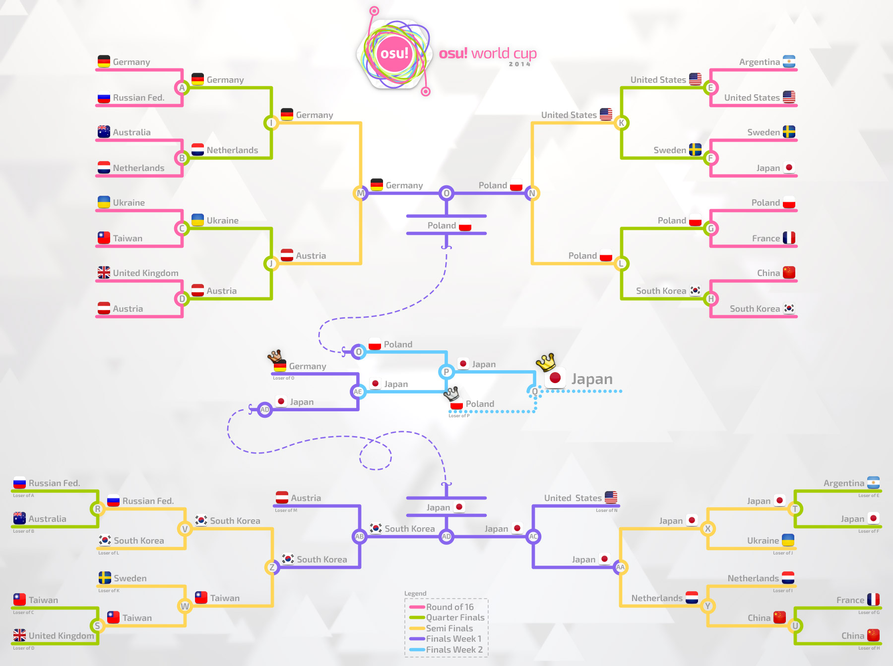

osu! World Cup 2014
======================

The **osu! World Cup 2014** (***OWC 2014*** ) is a country-based osu! tournament hosted by the [Tournament Management](https://osu.ppy.sh/g/26). It is the 5th installment of the osu! World Cup.

The previous title holder is **![][flag_KR] South Korea**.

This competition has come to an end and resulted in the following podium:

| Placing                                                    | Country                                    |
|------------------------------------------------------------|--------------------------------------------|
|    | ![][flag_JP] **Japan**   |
|  | ![][flag_PL] **Poland**  |
|  | ![][flag_DE] **Germany** |

Tournament schedule
----------------------

| Event              | Timestamp                |
|--------------------|--------------------------|
| Registration Phase | 02-26 Oct 2014           |
| Live Drawings      | 1 Nov 2014 14.00 (UTC+0) |
| Group Stage        | 8-9 Nov 2014             |
| Round 16           | 15-16 Nov 2014           |
| Quarter-finals     | 22-23 Nov 2014           |
| Semi-finals        | 29-30 Nov 2014           |
| Finals - Week 1    | 6-7 Dec 2014             |
| Finals - Week 2    | 13-14 Dec 2014           |

Prizes
---------

| Placing                                                    | Prizes                                                                             |
|------------------------------------------------------------|------------------------------------------------------------------------------------|
|    | 6 month supporter tag, profile badge, "osu! Champion" user title, osu! merchandise |
|  | 3 month supporter tag                                                              |
|  | 1 month supporter tag                                                              |

Organization
-------------

| Job                   | Person(s)                                                                                                                                                                                                                                                    |
|-----------------------|--------------------------------------------------------------------------------------------------------------------------------------------------------------------------------------------------------------------------------------------------------------|
| Tournament Management | ![][flag_DE][Loctav](https://osu.ppy.sh/u/71366) // ![][flag_DE][p3n](https://osu.ppy.sh/u/123703) // ![][flag_ES][Deif](https://osu.ppy.sh/u/318565)                                                                    |
| Map Selectors         | ![][flag_NL][GladiOol](https://osu.ppy.sh/u/23326) // ![][flag_KR][ToGlette](https://osu.ppy.sh/u/1076236)                                                                                                                           |
| Streamers             | ![][flag_AU][peppy](https://osu.ppy.sh/u/2) // ![][flag_PL][Marcin](https://osu.ppy.sh/u/722665) // ![][flag_FR][shARPII](https://osu.ppy.sh/u/776257)                                                                   |
| Commentators          | ![][flag_GB][jesus1412](https://osu.ppy.sh/u/230116) // ![][flag_FR][Mr Color](https://osu.ppy.s6078) // ![][flag_GB][Raiku](https://osu.ppy.sh/u/1525538) // ![][flag_US][ztrot](https://osu.ppy.sh/u/6347) |
| Statistician          | ![][flag_PL][Marcin](https://osu.ppy.sh/u/722665)                                                                                                                                                                                                |

------------------------------------------------------------------------

Links
---------

-   [osu! World Cup 2014 on Twitch](https://www.twitch.tv/osulive/)
-   [Registration Form](https://docs.google.com/forms/d/1_muZpv0qYzT0vmBJqhK_os0DWHO8k5TA7-wioKN5mng)
-   [Discussion Thread](https://osu.ppy.sh/forum/p/3410198)
-   [Mappool Discussion](https://osu.ppy.sh/forum/t/255369/)
-   **[Group Stage Statistics](https://owc.nicarim.pw/results/view/3)**

------------------------------------------------------------------------

------------------------------------------------------------------------

Participants
-------------

| Country                                    | Group A Members                                                                                                                                                                                                                                                                    |
|--------------------------------------------|------------------------------------------------------------------------------------------------------------------------------------------------------------------------------------------------------------------------------------------------------------------------------------|
| ![][flag_PT] Portugal    | **[Osama](https://osu.ppy.sh/u/799218)**, [Nectarine](https://osu.ppy.sh/u/2148013), [PedroLipton](https://osu.ppy.sh/u/3272012), [Makkura](https://osu.ppy.sh/u/344086), [Snosey](https://osu.ppy.sh/u/2515691), [RobotTermite](https://osu.ppy.sh/u/2713287), [MrStugzZ](https://osu.ppy.sh/u/2594351)                     |
| ![][flag_IT] Italy       | **[lesslunatic](https://osu.ppy.sh/u/1227377)**, [Andrea](https://osu.ppy.sh/u/33599), [Chewin](https://osu.ppy.sh/u/617323), [xiAmME](https://osu.ppy.sh/u/1428960), [Nemis](https://osu.ppy.sh/u/1635091), [XZ19126](https://osu.ppy.sh/u/1656340), [Jordan](https://osu.ppy.sh/u/618549), [Puncia](https://osu.ppy.sh/u/782633) |
| ![][flag_KR] South Korea | **[KRZY](https://osu.ppy.sh/u/114017)**, [MathClass](https://osu.ppy.sh/u/2000416), [sayonara-bye](https://osu.ppy.sh/u/713266), [K i R i K a R u](https://osu.ppy.sh/u/139670), [Gomo Pslvarh](https://osu.ppy.sh/u/1206417), [[ Rachel ]](https://osu.ppy.sh/u/2006663)                                              |
| ![][flag_DE] Germany     | **[cptnXn](https://osu.ppy.sh/u/495272)**, [Dustice](https://osu.ppy.sh/u/754565), [BDDav](https://osu.ppy.sh/u/1164526), [CookEasy](https://osu.ppy.sh/u/453226), [Splinter572](https://osu.ppy.sh/u/846038), [Tom94](https://osu.ppy.sh/u/1857058), [shunsuke](https://osu.ppy.sh/u/2028641)                               |

| Country                                    | Group B Members                                                                                                                                                                                                                                                                                    |
|--------------------------------------------|----------------------------------------------------------------------------------------------------------------------------------------------------------------------------------------------------------------------------------------------------------------------------------------------------|
| ![][flag_NZ] New Zealand | **[go3001](https://osu.ppy.sh/u/735437)**, [NekoWins](https://osu.ppy.sh/u/3345403), [ivvi](https://osu.ppy.sh/u/2494979), [Kysteria](https://osu.ppy.sh/u/2997708), [moph](https://osu.ppy.sh/u/2233878), [Oukskirts](https://osu.ppy.sh/u/2586359), [jiantz](https://osu.ppy.sh/u/330252)                                                  |
| ![][flag_AR] Argentina   | **[Glazbom](https://osu.ppy.sh/u/608277)**, [Enhu](https://osu.ppy.sh/u/2840499), [benjacala](https://osu.ppy.sh/u/1625740), [Fr0th](https://osu.ppy.sh/u/3458870), [Graphite Edge](https://osu.ppy.sh/u/825712), [Peingod](https://osu.ppy.sh/u/2212941), [GaTu](https://osu.ppy.sh/u/3583351)                                              |
| ![][flag_PH] Philippines | **[Jann](https://osu.ppy.sh/u/818399)**, [-Marika](https://osu.ppy.sh/u/2199427), [Takane Enomoto](https://osu.ppy.sh/u/1208491), [-Gio](https://osu.ppy.sh/u/1795827), [Returnxps](https://osu.ppy.sh/u/589462), [Mira-san](https://osu.ppy.sh/u/1587999), [Pizzicato](https://osu.ppy.sh/u/692610), [HybRidChrome](https://osu.ppy.sh/u/2606470) |
| ![][flag_AT] Austria     | **[Omgforz](https://osu.ppy.sh/u/578943)**, [WhitePhoenixLP](https://osu.ppy.sh/u/1426098), [Alumetorz](https://osu.ppy.sh/u/1145984), [Elscar](https://osu.ppy.sh/u/2253511), [Hakkero](https://osu.ppy.sh/u/177913), [BlueFlameZ](https://osu.ppy.sh/u/3506191), [Jin_Back7](https://osu.ppy.sh/u/1238524)                                 |

| Country                                  | Group C Members                                                                                                                                                                                                                                                                                               |
|------------------------------------------|---------------------------------------------------------------------------------------------------------------------------------------------------------------------------------------------------------------------------------------------------------------------------------------------------------------|
| ![][flag_ID] Indonesia | **[Subaru Takamaru](https://osu.ppy.sh/u/1762922)**, [mamstein](https://osu.ppy.sh/u/3035210), [Mood Breaker](https://osu.ppy.sh/u/692065), [Ryuvos](https://osu.ppy.sh/u/2020531), [Sweetie Belle](https://osu.ppy.sh/u/2291870), [Gatyaa420](https://osu.ppy.sh/u/984132), [C00LZ](https://osu.ppy.sh/u/1128514), [reborn513](https://osu.ppy.sh/u/1577554) |
| ![][flag_CL] Chile     | **[Nicokarl](https://osu.ppy.sh/u/1600281)**, [Neab](https://osu.ppy.sh/u/916693), [kafaN](https://osu.ppy.sh/u/1489743), [Cristian](https://osu.ppy.sh/u/194345), [Rintsunayoshi](https://osu.ppy.sh/u/1379717)                                                                                                                            |
| ![][flag_FR] France    | **[Soinou](https://osu.ppy.sh/u/1664519)**, [Kynan](https://osu.ppy.sh/u/1093361), [Musty](https://osu.ppy.sh/u/251683), [NerO](https://osu.ppy.sh/u/1545031), [Shiro](https://osu.ppy.sh/u/113005), [shARPII](https://osu.ppy.sh/u/776257), [Syfou](https://osu.ppy.sh/u/1572956), [My Not](https://osu.ppy.sh/u/1572405)                                    |
| ![][flag_AU] Australia | **[Bauxe](https://osu.ppy.sh/u/1881685)**, [Melt3dCheeze](https://osu.ppy.sh/u/634837), [gimly32](https://osu.ppy.sh/u/3448993), [FluxVanes](https://osu.ppy.sh/u/655267), [uyghti](https://osu.ppy.sh/u/3641404), [Happyjon](https://osu.ppy.sh/u/5543), [Rivastyx](https://osu.ppy.sh/u/2719307), [Jaybladezz](https://osu.ppy.sh/u/3725492)                |

| Country                                | Group D Members                                                                                                                                                                                                                                                   |
|----------------------------------------|-------------------------------------------------------------------------------------------------------------------------------------------------------------------------------------------------------------------------------------------------------------------|
| ![][flag_MX] Mexico  | **[El Koko](https://osu.ppy.sh/u/2352419)**, [Broodich](https://osu.ppy.sh/u/2484629), [[ AeonLust ]](https://osu.ppy.sh/u/2353490), [MomoXv](https://osu.ppy.sh/u/1207955), [sumaru100](https://osu.ppy.sh/u/1872256), [[Chrono]](https://osu.ppy.sh/u/2308331), [-Alberto-](https://osu.ppy.sh/u/2658465) |
| ![][flag_UA] Ukraine | **[Aka](https://osu.ppy.sh/u/1307553)**, [Granje](https://osu.ppy.sh/u/496387), [-ReimuHakurei-](https://osu.ppy.sh/u/1163931), [BloodM0nk](https://osu.ppy.sh/u/2174403), [rockleejkooo](https://osu.ppy.sh/u/384003), [blednak](https://osu.ppy.sh/u/912627)                                        |
| ![][flag_BR] Brazil  | **[Blue Dragon](https://osu.ppy.sh/u/19048)**, [Shott](https://osu.ppy.sh/u/965354), [ALust](https://osu.ppy.sh/u/1558603), [momoyo-san](https://osu.ppy.sh/u/2038069), [sunosz](https://osu.ppy.sh/u/3007342), [Froke](https://osu.ppy.sh/u/602913), [fabriciorby](https://osu.ppy.sh/u/209664)            |
| ![][flag_JP] Japan   | **[Mercurius](https://osu.ppy.sh/u/589550)**, [rrtyui](https://osu.ppy.sh/u/352328), [Poruteri](https://osu.ppy.sh/u/1379576), [Potofu](https://osu.ppy.sh/u/657404), [Sinch](https://osu.ppy.sh/u/360552), [serea](https://osu.ppy.sh/u/371961), [Guy](https://osu.ppy.sh/u/91738)                         |

| Country                                  | Group E Members                                                                                                                                                                                                                                                                   |
|------------------------------------------|-----------------------------------------------------------------------------------------------------------------------------------------------------------------------------------------------------------------------------------------------------------------------------------|
| ![][flag_LT] Lithuania | **[QonQuest](https://osu.ppy.sh/u/988503)**, [Painsinger](https://osu.ppy.sh/u/697843), [Kyouma](https://osu.ppy.sh/u/2070247), [Zinkon](https://osu.ppy.sh/u/85043), [Mazzerin](https://osu.ppy.sh/u/2942381), [Strategas](https://osu.ppy.sh/u/2971837)                                                             |
| ![][flag_NO] Norway    | **[-GN](https://osu.ppy.sh/u/895581)**, [Liqh](https://osu.ppy.sh/u/3409838), [Princess Zoom](https://osu.ppy.sh/u/1593758), [PcBoy111](https://osu.ppy.sh/u/2916414), [KinomiCandy](https://osu.ppy.sh/u/375143), [kossc](https://osu.ppy.sh/u/2363849), [CXu](https://osu.ppy.sh/u/84841), [Tobi](https://osu.ppy.sh/u/2970667) |
| ![][flag_SE] Sweden    | **[Xytox](https://osu.ppy.sh/u/2229274)**, [Gnuu](https://osu.ppy.sh/u/914004), [Physalis](https://osu.ppy.sh/u/2188481), [Slizzer](https://osu.ppy.sh/u/809983), [Vanillaire](https://osu.ppy.sh/u/2359549), [l1mi](https://osu.ppy.sh/u/973172), [Kotayo](https://osu.ppy.sh/u/1730025)                                   |
| ![][flag_TW] Taiwan    | **[onlyforyou](https://osu.ppy.sh/u/597858)**, [dabanlong](https://osu.ppy.sh/u/624254), [Small K](https://osu.ppy.sh/u/952751), [BA_KA_YA_RO U](https://osu.ppy.sh/u/1483659), [mookss1231](https://osu.ppy.sh/u/1483371), [Saya-Eternal](https://osu.ppy.sh/u/2865291)                                              |

| Country                                    | Group F Members                                                                                                                                                                                                                                                                                     |
|--------------------------------------------|-----------------------------------------------------------------------------------------------------------------------------------------------------------------------------------------------------------------------------------------------------------------------------------------------------|
| ![][flag_HK] Hong Kong   | **[- G I D Z -](https://osu.ppy.sh/u/2286528)**, [Ming3012](https://osu.ppy.sh/u/1583218), [Chaoslitz](https://osu.ppy.sh/u/3621552), [Yakumo Yukarin](https://osu.ppy.sh/u/562623)                                                                                                                                         |
| ![][flag_CA] Canada      | **[Azer](https://osu.ppy.sh/u/2155578)**, [TrickMirror](https://osu.ppy.sh/u/2138739), [RamenOtaku](https://osu.ppy.sh/u/980956), [Kairi](https://osu.ppy.sh/u/1586237), [FreeSongs](https://osu.ppy.sh/u/2116792), [Gyutto](https://osu.ppy.sh/u/2701210), [Shiro-](https://osu.ppy.sh/u/2170128), [- [ U z z I ] -](https://osu.ppy.sh/u/1928230) |
| ![][flag_NL] Netherlands | **[BiG_ChilD](https://osu.ppy.sh/u/596196)**, [HappyStick](https://osu.ppy.sh/u/256802), [jackylam5](https://osu.ppy.sh/u/1540807), [Kyshiro](https://osu.ppy.sh/u/640611), [Synchrostar](https://osu.ppy.sh/u/419705), [taku](https://osu.ppy.sh/u/684433), [R3laX3R](https://osu.ppy.sh/u/819689), [Damnjelly](https://osu.ppy.sh/u/1666355)      |
| ![][flag_PL] Poland      | **[fartownik](https://osu.ppy.sh/u/56917)**, [WubWoofWolf](https://osu.ppy.sh/u/39828), [r0ck](https://osu.ppy.sh/u/1549620), [Wilchq](https://osu.ppy.sh/u/2021758), [AmaiHachimitsu](https://osu.ppy.sh/u/844815), [listless](https://osu.ppy.sh/u/1106527), [SteRRuM](https://osu.ppy.sh/u/42585)                                          |

| Country                                       | Group G Members                                                                                                                                                                                                                                                                                    |
|-----------------------------------------------|----------------------------------------------------------------------------------------------------------------------------------------------------------------------------------------------------------------------------------------------------------------------------------------------------|
| ![][flag_SG] Singapore      | **[Plaatinum](https://osu.ppy.sh/u/3385566)**, [Nakano-](https://osu.ppy.sh/u/1893953), [Alacartx](https://osu.ppy.sh/u/1959767), [GSBlank](https://osu.ppy.sh/u/2312106), [phox](https://osu.ppy.sh/u/772295), [lameomaster2](https://osu.ppy.sh/u/1843447), [rtyzen](https://osu.ppy.sh/u/2439822)                                         |
| ![][flag_FI] Finland        | **[Subbie](https://osu.ppy.sh/u/1590138)**, [Kirei](https://osu.ppy.sh/u/3250863), [Arcley](https://osu.ppy.sh/u/1916349), [Villani](https://osu.ppy.sh/u/1979316), [Isokasapupuja](https://osu.ppy.sh/u/1770462), [Jantsi](https://osu.ppy.sh/u/1644225), [Urp](https://osu.ppy.sh/u/1534396), [kumig](https://osu.ppy.sh/u/3298140)              |
| ![][flag_GB] United Kingdom | **[jesus1412](https://osu.ppy.sh/u/230116)**, [Doomsday](https://osu.ppy.sh/u/18983), [Raiku](https://osu.ppy.sh/u/1525538), [lovu](https://osu.ppy.sh/u/846235), [PortalLife](https://osu.ppy.sh/u/929134), [bahamete](https://osu.ppy.sh/u/960620), [Kardet](https://osu.ppy.sh/u/1438509), [Jameslike](https://osu.ppy.sh/u/2415743)            |
| ![][flag_US] United States  | **[pooptartsonas](https://osu.ppy.sh/u/1334453)**, [Kaoru](https://osu.ppy.sh/u/492699), [kittehcommando](https://osu.ppy.sh/u/2162669), [pielak](https://osu.ppy.sh/u/310455), [Xilver15](https://osu.ppy.sh/u/3099689), [SapphireGhost](https://osu.ppy.sh/u/388602), [Horo](https://osu.ppy.sh/u/992439), [-Soba-](https://osu.ppy.sh/u/663657) |

| Country                                           | Group H Members                                                                                                                                                                                                                                                                                        |
|---------------------------------------------------|--------------------------------------------------------------------------------------------------------------------------------------------------------------------------------------------------------------------------------------------------------------------------------------------------------|
| ![][flag_DK] Denmark            | **[TimG](https://osu.ppy.sh/u/1879963)**, [TraxieChan](https://osu.ppy.sh/u/455552), [Cerkie](https://osu.ppy.sh/u/2533400), [DipG](https://osu.ppy.sh/u/2983311), [Tonarinototoro](https://osu.ppy.sh/u/2678812), [Fuccho](https://osu.ppy.sh/u/3053382), [Tropians](https://osu.ppy.sh/u/2536611), [Kazutakee](https://osu.ppy.sh/u/2637514)         |
| ![][flag_MY] Malaysia           | **[Gon](https://osu.ppy.sh/u/583765)**, [xsrsbsns](https://osu.ppy.sh/u/414427), [caleb123456](https://osu.ppy.sh/u/2205376), [ExPew](https://osu.ppy.sh/u/665612), [TequilaWolf](https://osu.ppy.sh/u/3633477), [NazzzF](https://osu.ppy.sh/u/2676512), [ffstar0716](https://osu.ppy.sh/u/1163205), [Rumia-](https://osu.ppy.sh/u/1787171)            |
| ![][flag_RU] Russian Federation | **[cr1m](https://osu.ppy.sh/u/803766)**, [talala](https://osu.ppy.sh/u/1389663), [Shiawase](https://osu.ppy.sh/u/989489), [anticlone111](https://osu.ppy.sh/u/1950600), [Kert](https://osu.ppy.sh/u/119933), [KoTo](https://osu.ppy.sh/u/1382805), [Hidari Handoru](https://osu.ppy.sh/u/1056329), [Pyroboom](https://osu.ppy.sh/u/689882)             |
| ![][flag_CN] China              | **[Prophet](https://osu.ppy.sh/u/651307)**, [Dsan](https://osu.ppy.sh/u/1266166), [N a n o](https://osu.ppy.sh/u/694114), [Del soon Bye](https://osu.ppy.sh/u/629717), [Rebellion](https://osu.ppy.sh/u/2896273), [SpringLane](https://osu.ppy.sh/u/1343504), [Spring Roll](https://osu.ppy.sh/u/2499198), [wobeinimacao](https://osu.ppy.sh/u/350723) |

------------------------------------------------------------------------

Mappools
----------

### Finals

**[Download the mappack here!](https://www.mediafire.com/download/hd8njp8cvqad5yq/OWC_Finals.rar)**

- NoMod
  - [UNDEAD CORPORATION - Yoru Naku Usagi wa Yume wo Miru (Strawberry) \[BakaNA\]](https://osu.ppy.sh/b/214248)
  - [Zips - Reiwai Terrorism (Kyshiro) \[Terror\]](https://osu.ppy.sh/b/403276)
  - [Shounen Radio - neu (Philippines) \[Platinum\]](https://osu.ppy.sh/b/179070)
  - [Mago de Oz - Xanandra (Xanandra) \[Insane\]](https://osu.ppy.sh/b/221026)
  - [Mutsuhiko Izumi - Red Goose (nold\_1702) \[Superable\]](https://osu.ppy.sh/b/144029)
  - [Bring Me The Horizon - Anthem (Louis Cyphre) \[Lucifer\]](https://osu.ppy.sh/b/118380)
- Hidden
  - [MiddleIsland - Aldo (Lan wings) \[Lan\]](https://osu.ppy.sh/b/207721)
  - [airportexpress feat.Itsuneko - BIRTH (Chloe) \[Insane\]](https://osu.ppy.sh/b/422762)
  - [yuikonnu - Genjitsu Game (Amamiya Yuko) \[Extra\]](https://osu.ppy.sh/b/291553)
- HardRock
  - [An - Encryption (HelloSCV) \[Kloyd's Extra\]](https://osu.ppy.sh/b/258384)
  - [MYTK - Yggdrasil (P o M u T a) \[INFINITE\]](https://osu.ppy.sh/b/344715)
  - [Lifetheory - Angel (Zarerion) \[Sanctum\]](https://osu.ppy.sh/b/308040)
- DoubleTime
  - [Bomfunk MC's - Freestyler (Lesjuh) \[Insane\]](https://osu.ppy.sh/b/115352)
  - [U - Ha-tenya? (biwako) \[Insane\]](https://osu.ppy.sh/b/120080)
  - [senya - Youyoumu no Gotoku (Satellite) \[Satellite\]](https://osu.ppy.sh/b/299041)
- FreeMod
  - [ETIA. - Claiomh Solais (Zare) \[Eternal\]](https://osu.ppy.sh/b/403039)
  - [LeaF - Calamity Fortune (Flower) \[Extra\]](https://osu.ppy.sh/b/257793)
  - [Awake - Supernova (DoKoLP) \[DoKo\]](https://osu.ppy.sh/b/138008)
- Tiebreaker
  - [onoken - P8107 (Kloyd) \[KA071\]](https://osu.ppy.sh/b/457061)

### Semi-finals

**[Download the mappack here!](https://www.mediafire.com/download/31bm61ol9wip0y4/OWC_SemiFinals.rar)**

- NoMod
  - [Hanatan - Airman ga Taosenai (SOUND HOLIC Ver.) (Natsu) \[CRN's Extra\]](https://osu.ppy.sh/b/338682)
  - [HujuniseikouyuuP - MISTAKE (val0108) \[Ms.0108\]](https://osu.ppy.sh/b/276366)
  - [jippusu - Mushikui Saikede Rhythm (Amamiya Yuko) \[RLC\]](https://osu.ppy.sh/b/240689)
  - [Fear, and Loathing in Las Vegas - Rave-up Tonight (lightr) \[Extra\]](https://osu.ppy.sh/b/425761)
  - [nmk - sola (sjoy) \[Extra\]](https://osu.ppy.sh/b/439135)
  - [celas - Azul (Remix) (AngelHoney) \[Extra\]](https://osu.ppy.sh/b/134856)
- Hidden
  - [kemu - Ikasama Life Game (a3272509123) \[Regou\]](https://osu.ppy.sh/b/210718)
  - [Zips - Heisei Cataclysm (Dark Fang) \[Fang\]](https://osu.ppy.sh/b/206567)
  - [naotyu- - Her Majesty (Reisen Udongein) \[Another\]](https://osu.ppy.sh/b/160104)
- HardRock
  - [Sagara Kokoro - Hoshizora no Ima (Asphyxia) \[Extra\]](https://osu.ppy.sh/b/391228)
  - [Foreground Eclipse - From Under Cover (Caught Up In A Love Song) (keeeeeeko) \[Insane\]](https://osu.ppy.sh/b/384718)
  - [Kurubukko vs yukitani - Minamichita EVOLVED (Cherry Blossom) \[Another\]](https://osu.ppy.sh/b/341891)
- DoubleTime
  - [lily-an - The Starry true (Delis) \[Lunatic\]](https://osu.ppy.sh/b/388170)
  - [Primastella - Koigokoro (Luerxa) \[Insane\]](https://osu.ppy.sh/b/323769)
  - [Feint - Time Bomb (feat. Veela & Boyinaband) (vipto) \[Time\]](https://osu.ppy.sh/b/263368)
- FreeMod
  - [wakaG - Yozora ni Saita Hana (Awaken) \[Extra\]](https://osu.ppy.sh/b/480599)
  - [Mind Vortex - Arc (Natteke) \[Nsane\]](https://osu.ppy.sh/b/239037)
  - [Amatsuki - Higurashi Moratorium (HelloSCV) \[Frobe's Extra\]](https://osu.ppy.sh/b/254370)
- Tiebreaker
  - [sweet ARMS - Installation (Cherry Blossom) \[Nightmare\]](https://osu.ppy.sh/b/444356)

### Quarter-finals

**[Download the mappack here!](https://www.mediafire.com/download/gh0da1ahgxiogka/OWC_Quarter_Finals.rar)**

- NoMod
  - [Himeringo - Yotsuya-san ni Yoroshiku (RLC) \[Winber1's Extreme\]](https://osu.ppy.sh/b/378781)
  - [Dark PHOENiX - Hiroari Shoots a Strange Bird (sjoy) \[Extra\]](https://osu.ppy.sh/b/321559)
  - [daisan - -+ (RikiH\_) \[Extra\]](https://osu.ppy.sh/b/338544)
  - [Rohi - Kanata ni Mau wa Sakura no Shirabe (NatsumeRin) \[Extra\]](https://osu.ppy.sh/b/252290)
  - [Hatsune Miku - Homework Crisis (val0108) [Let's Jump!!]](https://osu.ppy.sh/b/108021)
  - [Glamour of the Kill - A Hope in Hell (ykcarrot) \[Hopeless\]](https://osu.ppy.sh/b/104389)
- Hidden
  - [HitoshizukuP x Yama - Crazy nighT (Sephibro) \[Crazy\]](https://osu.ppy.sh/b/285549)
  - [Renard - Smoke Tower (Priti) \[Trauma\]](https://osu.ppy.sh/b/339640)
  - [Cres - End Time (Kyshiro) \[Extra\]](https://osu.ppy.sh/b/432839)
- HardRock
  - [Yooh - Shanghai Kouchakan ~ Chinese Tea Orchid Remix (Gamu) \[INFINITE\]](https://osu.ppy.sh/b/486619)
  - [Sariyajin - Ao no Senritsu (smallboat) \[Extra\]](https://osu.ppy.sh/b/317327)
  - [Omoi - Nee William (Yales) \[Extra\]](https://osu.ppy.sh/b/399756)
- DoubleTime
  - [Kozato - Tsuki -Yue- (jonathanlfj) \[Another\]](https://osu.ppy.sh/b/268080)
  - [Elvenking - The Winter Wake (Snepif) \[AlrdyExists' Blizzard\]](https://osu.ppy.sh/b/107747)
  - [Mitchie M - Viva Happy (Natsu) \[Insane\]](https://osu.ppy.sh/b/317917)
- FreeMod
  - [Maduk ft. Veela - Ghost Assassin (Hourglass Bonusmix) (alacat) \[Lumiere\]](https://osu.ppy.sh/b/471598)
  - [8284 vs wa. - Adularescence (Cherry Blossom) \[Extra\]](https://osu.ppy.sh/b/306669)
  - [yuikonnu - Hatsukoi no Ehon (litoluna) \[Insane\]](https://osu.ppy.sh/b/288660)
- Tiebreaker
  - [Halozy - Kanshou no Matenrou (captin1) \[Eternal\]](https://osu.ppy.sh/b/431957)

### Round of 16

**[Download the mappack here!](https://www.mediafire.com/download/eav4oeg33eax8w9/OWC_Round_of_16.rar)**

- NoMod
  - [yuikonnu - Kakushigoto (jonathanlfj) \[Insane\]](https://osu.ppy.sh/b/315260)
  - [Renard - Da Nu Nuttah (GamerX4life) \[Nogard\]](https://osu.ppy.sh/b/205282)
  - [Qrispy Joybox - snow prism (ktgster) \[Extreme\]](https://osu.ppy.sh/b/332962)
  - [Foreground Eclipse - I Bet You'll Forget That Even If You Noticed That (rEdo) \[Lunatic\]](https://osu.ppy.sh/b/363662)
  - [Lon - MATRYOSHKA (EvilElvis) \[Extra\]](https://osu.ppy.sh/b/285086)
  - [HujuniseikouyuuP - Sayonara Lechenaultia (qq944364487) \[Lechenaultia\]](https://osu.ppy.sh/b/192320)
- Hidden
  - [Kozato snow - Izayoi Sakura (Melt) \[Insane\]](https://osu.ppy.sh/b/396105)
  - [Megpoid GUMI & Kagamine Rin - Invisible (NatsumeRin) \[Rin\]](https://osu.ppy.sh/b/143036)
  - [Zeami - Music Revolver (KanaRin) \[Kana\]](https://osu.ppy.sh/b/162363)
- HardRock
  - [MOMOIRO CLOVER Z - SARABA ITOSHIKI KANASHIMI TACHIYO (Sellenite) \[Master\]](https://osu.ppy.sh/b/507098)
  - [Hatsune Miku - Hiatus (wcx19911123) \[Insane\]](https://osu.ppy.sh/b/105003)
  - [P\*Light - Poppin' Shower (Reisen Udongein) \[Another\]](https://osu.ppy.sh/b/133723)
- DoubleTime
  - [KOTOKO - unfinished (Pokie) \[Acceleration\]](https://osu.ppy.sh/b/156904)
  - [Nanamori-chu \* Goraku-bu - Precious Friends (Setz206) \[Insane\]](https://osu.ppy.sh/b/420131)
  - [Matchbox Twenty - How Far We've Come (Sushi) \[Insane\]](https://osu.ppy.sh/b/104117)
- FreeMod
  - [Blackhole - Lagomorphic (happy623) \[Lagomorph\]](https://osu.ppy.sh/b/211889)
  - [Memme - NEW Astronomas (Charles445) \[Extra\]](https://osu.ppy.sh/b/238265)
  - [Hatsune Miku - Dance of many (LKs) \[Dance\]](https://osu.ppy.sh/b/140805)
- Tiebreaker
  - [Dark PHOENiX - The Primal Scene of Japan the Girl Saw (sjoy) \[Extra\]](https://osu.ppy.sh/b/311573)

### Group Stage

**[Download the mappack here!](https://www.mediafire.com/download/p2fxdt67qlsakn3/OWC_Group_Stage.rar)**

- NoMod
  - [Toyosaki Aki - MORE&MORE (Fycho) \[Insane\]](https://osu.ppy.sh/b/318975)
  - [Last Note. - Caramel Heaven (Snepif) \[Heaven\]](https://osu.ppy.sh/b/244691)
  - [nano - Nevereverland (Nyquill) \[Insane\]](https://osu.ppy.sh/b/256499)
  - [marina - Towa yori Towa ni (Garven) \[Kite's Insane\]](https://osu.ppy.sh/b/376558)
  - [Jeff Williams - Red Like Roses (feat. Casey Lee Williams) (Flower) \[Ruby\]](https://osu.ppy.sh/b/244781)
  - [Comp - Touchuu Aika (Mao) \[Maolvis' Lunatic\]](https://osu.ppy.sh/b/471369)
- Hidden
  - [Nero's Day At Disneyland - No Money Down, Low Monthly Payments (grumd) \[Insane\]](https://osu.ppy.sh/b/290733)
  - [capitaro - Yoiduki Maiuta (Amamiya Yuko) \[Insane\]](https://osu.ppy.sh/b/201601)
  - [Megpoid GUMI - Shinkaron -code:variant- (NatsumeRin) \[Rin\]](https://osu.ppy.sh/b/99465)
- HardRock
  - [Souei Academy Light Music Club starring i.o - Sekai de Hitotsu no Takaramono (cRyo\[iceeicee\]) \[Insane\]](https://osu.ppy.sh/b/159316)
  - [Aki - Wanna Be My Dream (Lortus) \[Insane\]](https://osu.ppy.sh/b/325209)
  - [ginkiha - EOS (alacat) \[RLC's Another\]](https://osu.ppy.sh/b/421532)
- DoubleTime
  - [Kuba Oms - My Love (W h i t e) \[Insane\]](https://osu.ppy.sh/b/397535)
  - [yanaginagi - Vidro Moyou (Moway) \[Insane\]](https://osu.ppy.sh/b/308908)
  - [FELT - Sky Gate (Frostmourne) \[Lunatic\]](https://osu.ppy.sh/b/327256)
- FreeMod
  - [Nekomata Master+ - squall (Rue) \[Insane\]](https://osu.ppy.sh/b/238938)
  - [Knife Party - Bonfire (inverness) \[Rage\]](https://osu.ppy.sh/b/281918)
  - [Sana - Terekakushi Shishunki (litoluna) \[Insane\]](https://osu.ppy.sh/b/479354)
- Tiebreaker
  - [Okui Masami - God Speed (ykcarrot) \[Insane\]](https://osu.ppy.sh/b/93947)

------------------------------------------------------------------------

Match Results
----------------

### Finals

**Saturday, 13\. December 2014**

| Team A                                | Score          | Team B                                   | History                        |
|:--------------------------------------|:--------------:|-----------------------------------------:|--------------------------------|
| ![][flag_PL] Poland | 1      - **6** | **Japan** ![][flag_JP] | [#1](https://osu.ppy.sh/mp/11117046) |
| ![][flag_PL] Poland | 2      - **6** | **Japan** ![][flag_JP] | [#1](https://osu.ppy.sh/mp/11118895) |

**Results**

| Team A                                         | Score          | Team B                                       | History                        |
|:-----------------------------------------------|:--------------:|---------------------------------------------:|--------------------------------|
| ![][flag_JP] **Japan**       | **6**  - 0     | United States ![][flag_US] | [#1](https://osu.ppy.sh/mp/10950205) |
| ![][flag_KR] **South Korea** | **6**  - 1     | Austria ![][flag_AT]       | [#1](https://osu.ppy.sh/mp/10954577) |
| ![][flag_KR] South Korea     | 5      - **6** | **Japan** ![][flag_JP]     | [#1](https://osu.ppy.sh/mp/10955976) |
| ![][flag_DE] Germany         | 3      - **6** | **Poland** ![][flag_PL]    | [#1](https://osu.ppy.sh/mp/10966299) |

### Semi-finals

**Saturday, 29\. November 2014**

| Team A                                            | Score          | Team B                                         | History                        |
|:--------------------------------------------------|:--------------:|-----------------------------------------------:|--------------------------------|
| ![][flag_RU] Russian Federation | 5      - **6** | **South Korea** ![][flag_KR] | [#1](https://osu.ppy.sh/mp/10799208) |
| ![][flag_JP] **Japan**          | **6**  - 0     | Ukraine ![][flag_UA]         | [#1](https://osu.ppy.sh/mp/10800808) |
| ![][flag_SE] Sweden             | 3      - **6** | **Taiwan** ![][flag_TW]      | [#1](https://osu.ppy.sh/mp/10801986) |
| ![][flag_NL] **Netherlands**    | **6**  - 0     | China ![][flag_CN]           | [#1](https://osu.ppy.sh/mp/10803221) |

**Sunday, 30\. November 2014**

| Team A                                         | Score          | Team B                                     | History                        |
|:-----------------------------------------------|:--------------:|-------------------------------------------:|--------------------------------|
| ![][flag_KR] **South Korea** | **6**  - 5     | Taiwan ![][flag_TW]      | [#1](https://osu.ppy.sh/mp/10828929) |
| ![][flag_JP] **Japan**       | **6**  - 4     | Netherlands ![][flag_NL] | [#1](https://osu.ppy.sh/mp/10829960) |
| ![][flag_DE] **Germany**     | **6**  - 5     | Austria ![][flag_AT]     | [#1](https://osu.ppy.sh/mp/10835928) |
| ![][flag_US] United States   | 0      - **6** | **Poland** ![][flag_PL]  | [#1](https://osu.ppy.sh/mp/10837599) |

### Quarter-finals

**Saturday, 22\. November 2014**

| Team A                                                | Score         | Team B                                        | History                        |
|:------------------------------------------------------|:-------------:|----------------------------------------------:|--------------------------------|
| ![][flag_RU] **Russian Federation** | **5** - 1     | Australia ![][flag_AU]      | [#1](https://osu.ppy.sh/mp/10635177) |
| ![][flag_TW] **Taiwan**             | **5** - 2     | United Kingdom ![][flag_GB] | [#1](https://osu.ppy.sh/mp/10636683) |
| ![][flag_FR] France                 | 1     - **5** | **China** ![][flag_CN]      | [#1](https://osu.ppy.sh/mp/10637580) |
| ![][flag_AR] Argentina              | 0     - **5** | **Japan** ![][flag_JP]      | [#1](https://osu.ppy.sh/mp/10638992) |

**Sunday, 23\. November 2014**

| Team A                                           | Score         | Team B                                     | History                        |
|:-------------------------------------------------|:-------------:|-------------------------------------------:|--------------------------------|
| ![][flag_PL] **Poland**        | **5** - 2     | South Korea ![][flag_KR] | [#1](https://osu.ppy.sh/mp/10669681) |
| ![][flag_DE] **Germany**       | **5** - 4     | Netherlands ![][flag_NL] | [#1](https://osu.ppy.sh/mp/10671115) |
| ![][flag_UA] Ukraine           | 0     - **5** | **Austria** ![][flag_AT] | [#1](https://osu.ppy.sh/mp/10672689) |
| ![][flag_US] **United States** | **5** - 4     | Sweden ![][flag_SE]      | [#1](https://osu.ppy.sh/mp/10674065) |

### Round of 16

**Sunday, 16\. November 2014**

| Team A                                        | Score          | Team B                                            | History                        |
|:----------------------------------------------|:--------------:|--------------------------------------------------:|--------------------------------|
| ![][flag_CN] China          | 2      - **5** | **South Korea** ![][flag_KR]    | [#1](https://osu.ppy.sh/mp/10507941) |
| ![][flag_AU] Australia      | 2      - **5** | **Netherlands** ![][flag_NL]    | [#1](https://osu.ppy.sh/mp/10508932) |
| ![][flag_UA] **Ukraine**    | **5**  - 1     | Taiwan ![][flag_TW]             | [#1](https://osu.ppy.sh/mp/10509978) |
| ![][flag_SE] **Sweden**     | **5**  - 3     | Japan ![][flag_JP]              | [#1](https://osu.ppy.sh/mp/10510938) |
| ![][flag_PL] **Poland**     | **5**  - 1     | France ![][flag_FR]             | [#1](https://osu.ppy.sh/mp/10517306) |
| ![][flag_DE] **Germany**    | **5**  - 3     | Russian Federation ![][flag_RU] | [#1](https://osu.ppy.sh/mp/10518861) |
| ![][flag_GB] United Kingdom | 2      - **5** | **Austria** ![][flag_AT]        | [#1](https://osu.ppy.sh/mp/10520060) |
| ![][flag_AR] Argentina      | 2      - **5** | **United States** ![][flag_US]  | [#1](https://osu.ppy.sh/mp/10521646) |

### Group Stage

**Saturday, 8\. November 2014**

| Team A                                            | Score         | Team B                                                | History                        |
|:--------------------------------------------------|:-------------:|------------------------------------------------------:|--------------------------------|
| ![][flag_NZ] New Zealand        | 1     - **4** | **Philippines** ![][flag_PH]        | [#1](https://osu.ppy.sh/mp/10316251) |
| ![][flag_LT] Lithuania          | 2     - **4** | **Taiwan** ![][flag_TW]             | [#1](https://osu.ppy.sh/mp/10315808) |
| ![][flag_ID] Indonesia          | 1     - **4** | **Australia** ![][flag_AU]          | [#1](https://osu.ppy.sh/mp/10315815) |
| ![][flag_MY] Malaysia           | 1     - **4** | **China** ![][flag_CN]              | [#1](https://osu.ppy.sh/mp/10317033) |
| ![][flag_HK] Hong Kong          | 0     - **4** | **Netherlands** ![][flag_NL]        | [#1](https://osu.ppy.sh/mp/10317030) |
| ![][flag_SG] Singapore          | 3     - **4** | **Finland** ![][flag_FI]            | [#1](https://osu.ppy.sh/mp/10318242) |
| ![][flag_DK] Denmark            | 1     - **4** | **Russian Federation** ![][flag_RU] | [#1](https://osu.ppy.sh/mp/10318251) |
| ![][flag_PT] Portugal           | 0     - **4** | **South Korea** ![][flag_KR]        | [#1](https://osu.ppy.sh/mp/10318259) |
| ![][flag_AR] **Argentina**      | **4** - 3     | Philippines ![][flag_PH]            | [#1](https://osu.ppy.sh/mp/10319701) |
| ![][flag_HK] Hong Kong          | 0     - **4** | **Poland** ![][flag_PL]             | [#1](https://osu.ppy.sh/mp/10319710) |
| ![][flag_DK] **Denmark**        | **4** - 1     | Malaysia ![][flag_MY]               | [#1](https://osu.ppy.sh/mp/10321204) |
| ![][flag_RU] Russian Federation | 1     - **4** | **China** ![][flag_CN]              | [#1](https://osu.ppy.sh/mp/10321220) |
| ![][flag_PT] Portugal           | 0     - **4** | **Italy** ![][flag_IT]              | [#1](https://osu.ppy.sh/mp/10321241) |
| ![][flag_FI] Finland            | 1     - **4** | **United Kingdom** ![][flag_GB]     | [#1](https://osu.ppy.sh/mp/10328581) |
| ![][flag_LT] Lithuania          | 1     - **4** | **Norway** ![][flag_NO]             | [#1](https://osu.ppy.sh/mp/10328584) |
| ![][flag_CA] Canada             | 0     - **4** | **Poland** ![][flag_PL]             | [#1](https://osu.ppy.sh/mp/10328588) |
| ![][flag_CL] Chile              | 1     - **4** | **France** ![][flag_FR]             | [#1](https://osu.ppy.sh/mp/10330980) |
| ![][flag_CA] Canada             | 2     - **4** | **Netherlands** ![][flag_NL]        | [#1](https://osu.ppy.sh/mp/10330997) |
| ![][flag_UA] **Ukraine**        | **4** - 2     | Brazil ![][flag_BR]                 | [#1](https://osu.ppy.sh/mp/10331007) |
| ![][flag_FI] Finland            | 0     - **4** | **United States** ![][flag_US]      | [#1](https://osu.ppy.sh/mp/10331027) |
| ![][flag_AR] Argentina          | 3     - **4** | **Austria** ![][flag_AT]            | [#1](https://osu.ppy.sh/mp/10332923) |
| ![][flag_MX] Mexico             | 0     - **4** | **Brazil** ![][flag_BR]             | [#1](https://osu.ppy.sh/mp/10332927) |
| ![][flag_NO] Norway             | 1     - **4** | **Sweden** ![][flag_SE]             | [#1](https://osu.ppy.sh/mp/10332930) |
| ![][flag_IT] Italy              | 3     - **4** | **Germany** ![][flag_DE]            | [#1](https://osu.ppy.sh/mp/10332931) |
| ![][flag_NZ] New Zealand        | 0     - **4** | **Argentina** ![][flag_AR]          | [#1](https://osu.ppy.sh/mp/10334740) |
| ![][flag_GB] United Kingdom     | 3     - **4** | **United States** ![][flag_US]      | [#1](https://osu.ppy.sh/mp/10334747) |
| ![][flag_CL] Chile              | 2     - **4** | **Australia** ![][flag_AU]          | [#1](https://osu.ppy.sh/mp/10336251) |
| ![][flag_MX] Mexico             | 0     - **4** | **Japan** ![][flag_JP]              | [#1](https://osu.ppy.sh/mp/10336267) |

**Sunday, 9\. November 2014**

| Team A                                         | Score         | Team B                                                | History                        |
|:-----------------------------------------------|:-------------:|------------------------------------------------------:|--------------------------------|
| ![][flag_NO] Norway          | 1     - **4** | **Taiwan** ![][flag_TW]             | [#1](https://osu.ppy.sh/mp/10348348) |
| ![][flag_NZ] New Zealand     | 0     - **4** | **Austria** ![][flag_AT]            | [#1](https://osu.ppy.sh/mp/10348353) |
| ![][flag_ID] Indonesia       | 2     - **4** | **France** ![][flag_FR]             | [#1](https://osu.ppy.sh/mp/10348356) |
| ![][flag_KR] South Korea     | 3     - **4** | **Germany** ![][flag_DE]            | [#1](https://osu.ppy.sh/mp/10349347) |
| ![][flag_BR] Brazil          | 0     - **4** | **Japan** ![][flag_JP]              | [#1](https://osu.ppy.sh/mp/10349350) |
| ![][flag_FR] **France**      | **4** - 0     | Australia ![][flag_AU]              | [#1](https://osu.ppy.sh/mp/10350503) |
| ![][flag_SG] Singapore       | 0     - **4** | **United Kingdom** ![][flag_GB]     | [#1](https://osu.ppy.sh/mp/10350506) |
| ![][flag_LT] Lithuania       | 2     - **4** | **Sweden** ![][flag_SE]             | [#1](https://osu.ppy.sh/mp/10350508) |
| ![][flag_MY] Malaysia        | 2     - **4** | **Russian Federation** ![][flag_RU] | [#1](https://osu.ppy.sh/mp/10350512) |
| ![][flag_PT] Portugal        | 0     - **4** | **Germany** ![][flag_DE]            | [#1](https://osu.ppy.sh/mp/10352331) |
| ![][flag_IT] Italy           | 2     - **4** | **South Korea** ![][flag_KR]        | [#1](https://osu.ppy.sh/mp/10352168) |
| ![][flag_UA] Ukraine         | 1     - **4** | **Japan** ![][flag_JP]              | [#1](https://osu.ppy.sh/mp/10352111) |
| ![][flag_PH] Philippines     | 0     - **4** | **Austria** ![][flag_AT]            | [#1](https://osu.ppy.sh/mp/10352118) |
| ![][flag_SE] Sweden          | 1     - **4** | **Taiwan** ![][flag_TW]             | [#1](https://osu.ppy.sh/mp/10353334) |
| ![][flag_ID] **Indonesia**   | **4** - 0     | Chile ![][flag_CL]                  | Win by default                 |
| ![][flag_DK] Denmark         | 1     - **4** | **China** ![][flag_CN]              | [#1](https://osu.ppy.sh/mp/10353345) |
| ![][flag_NL] **Netherlands** | **4** - 2     | Poland ![][flag_PL]                 | [#1](https://osu.ppy.sh/mp/10353347) |
| ![][flag_MX] Mexico          | 2     - **4** | **Ukraine** ![][flag_UA]            | [#1](https://osu.ppy.sh/mp/10355079) |
| ![][flag_HK] Hong Kong       | 3     - **4** | **Canada** ![][flag_CA]             | [#1](https://osu.ppy.sh/mp/10355083) |
| ![][flag_SG] Singapore       | 1     - **4** | **United States** ![][flag_US]      | [#1](https://osu.ppy.sh/mp/10355087) |

------------------------------------------------------------------------

Ruleset
----------

### Tournament Rules

1.  The osu! World Cup is a country-based 4v4 team tournament
2.  The beatmaps for each round will be announced by the mapset selector in advance on the Sunday before the actual matches take place. Only these will be used during the respective matches.
-   One beatmap will be given as tiebreaker map. This beatmap will only be played in case of a tie.

3.  Match schedule will be settled by Tournament Management (see below).
4.  If no staff or referee is available, the match will be postponed.
5.  Failed player's score do not get added to the team score.
-   Reviving and surviving during a map gets considered as passing it.

6.  Use of the [Visual Settings](/wiki/Game_Modifiers) options are allowed.
7.  If the beatmap ends in a draw, the game will be nullified.
8.  If a player disconnects, they get treated as if they failed the beatmap.
9.  Beatmaps cannot be reused in the same match unless the beatmap was nullified.
10. If less than 4 players attend, the maximum time the match can be postponed is 10 minutes.
11. Exchanging players during a match is allowed.
-   You may exchange only one player once per beatmap.

12. Lag is not a valid reason to nullify a beatmap.
13. In Group stage, 'Win by default' will be considered as win by 4:0, +2.5 score difference ratio.
14. Unexpected incidences are handled by the tournament management.
15. Any modification of these rules will be announced.

### Tournament Registration

1.  Your team needs **at least 6 players** to participate.
1.  The maximum team size is 8.
2.  You must specify a captain who will represent the team.
1.  We do not differ between core players and back-up players

2.  Each team represents a nation. You must form a team with players from the same country and therefore with the same flags on the user profiles.
3.  For team sign ups, [fill out this form](https://docs.google.com/forms/d/1_muZpv0qYzT0vmBJqhK_os0DWHO8k5TA7-wioKN5mng). Then, verify your registration by [sending a PM to Loctav](https://osu.ppy.sh/forum/ucp.php?i=pm&mode=compose&u=71366) titled “OWC Registration”
-   Captains may change their setup by [notifying the management](https://osu.ppy.sh/forum/ucp.php?i=pm&mode=compose&u=71366).
-   You get a confirmation reply in case your registration successfully arrived. Your registration is in pending then.

4.  To ensure valid and serious registrations, any registration and change will be checked by the Tournament Management.
1.  The Tournament Management may reject registrations due to insufficient gameplay abilities.
2.  The Game Administration may reject registrations due to [the violation of the Terms of Services](https://osu.zendesk.com/hc/en-us/articles/202090283-I-applied-to-play-in-an-official-tournament-but-was-denied-)

5.  The total amount of teams is 32.
6.  All successfully registered teams will be published after Registration Phase.
-   Captains will get notified in case their roster has been accepted or rejected.

7.  Mapset selectors must not participate as a player in this tournament.

### Stage instructions

1.  In the first stage (Group Stage), the teams will be divided into 8 groups of 4 teams.
2.  All the teams from each group will face each other.
3.  Rankings of each group are determined by sorting the results of each team's performance in the following priority:
1.  Most matches won.
2.  Have higher `{(the number of maps won) - (the number of maps defeated)}`.
3.  Most maps won.
4.  Have higher `∑{(total score difference) / (maximum score)}`.
5.  Winner of the rematch.

4.  The top 2 teams of each group will move on to the Double Elimination Stages.
5.  Following stages are Double Elimination Stages. This means that the winner moves to the next stage and the losing team gets moved to the Loser bracket.
6.  Based on [this graphic](https://puu.sh/bUq5V/f1066103b0.png), the stages are splitted up the following:

| Stage           | Match ID                |
|-----------------|-------------------------|
| Round of 16     | A, B, C, D, E, F, G, H  |
| Quarter-finals  | I, J, K, L & R, S, T, U |
| Semi-finals     | M, N & V, W, X, Y, Z,AA |
| Finals - Week 1 | O & AB, AC, AD, AE      |
| Finals - Week 2 | P, Q                    |

1.  **Winning conditions:**
-   In Group Stage, you need to win 4 maps to win a match. (Best-of-7)
-   In the Round of 16 and the Quarter-finals, you need to win 5 maps to win a match. (Best-of-9)
-   In Semi-finals and Finals, you need to win 6 maps to win a match. (Best-of-11)

### Match Instructions

1.  A referee will create a multiplayer room 15 minutes in advance. Players must gather during this period.
1.  The room will be locked. The password and multiplayer invite will be sent to the two captains as soon as possible.
2.  Room settings are osu!, Team-Vs., Win Condition: 'Score'. Room name must be "OWC 2014: TeamBlue vs TeamRed"
3.  The team mentioned first in the room name must be the blue team, the team mentioned second in the room name must be the red team.

2.  Players are free to select up to two warm-up beatmaps. Using beatmaps with questionable content is prohibited.
3.  Each captain can ban two beatmaps to be selected from the pool. These beatmaps are not allowed to be picked by any team in the entire match.
1.  Both vetos must always be used.
2.  Both captains must use "!roll" to determine, who starts banning two beatmaps. The other captain can not ban the same beatmaps and must pick another beatmap in case of an overlap.

4.  Beatmap selection will alternate between each captain selecting a beatmap out of the map pool. Each captain must use "!roll" once in \#multiplayer to determine which team selects first.
1.  Captains can pick freely from any bracket.
2.  In case of a tie, the tiebreaker map must be played.

5.  Results will be published on the wiki and via the Statistics website.

### Mappool Instructions

1.  There will be 1 mappool for the Group Stage, 1 mappool for Round 16, 1 mappool for the Quarter-finals, 1 mappool for the Semi-finals and 1 mappool for the Finals.
2.  Each mappool consists of 5 bracket: NoMod, HardRock, Hidden, DoubleTime and FreeMod
3.  Each mappool consists of 19 maps in total.
4.  Each mappool has one tiebreaker.
5.  The NoMod bracket will be played with no modes activated
6.  The Hidden, HardRock and DoubleTime bracket will be played with the respective modes activated.
7.  The FreeMod bracket will have FreeMod activated. Every individual player can pick Hidden, HardRock, Flashlight or no mod at all.
1.  Players may select more than one mode.
2.  When playing a FreeMod map, at least 2 players of each team must have minimum one mode activated.

8.  The tiebreaker will be played under FreeMod conditions.
1.  When playing the tiebreaker, no one needs to have a mode activated.

9.  The size of the NoMod bracket will be 6 in all stages.
10. The size of the mod-specific brackets will be 3 in all stages.

### Scheduling instructions

1.  Each stage will be held on **a single weekend**.
2.  Matches in Group Stage may overlap.
3.  All Double Elimination Stages will be held on either Saturday or Sunday.
4.  Scheduling will be handled by the Tournament Management. Schedules will be released on the Sunday before the first matches of the actual stage. Tournament Management will try to create the schedule to respect the participant's time zone.
5.  Captains are responsible for their teams availability. The greater team size exists to ensure every team can provide at least four players for each match. If teams can not provide four players for a match, the match will be considered forfeited.

[flag_AR]: /wiki/shared/flag/AR.gif
[flag_AT]: /wiki/shared/flag/AT.gif
[flag_AU]: /wiki/shared/flag/AU.gif
[flag_BR]: /wiki/shared/flag/BR.gif
[flag_CA]: /wiki/shared/flag/CA.gif
[flag_CL]: /wiki/shared/flag/CL.gif
[flag_CN]: /wiki/shared/flag/CN.gif
[flag_DE]: /wiki/shared/flag/DE.gif
[flag_DK]: /wiki/shared/flag/DK.gif
[flag_ES]: /wiki/shared/flag/ES.gif
[flag_FI]: /wiki/shared/flag/FI.gif
[flag_FR]: /wiki/shared/flag/FR.gif
[flag_GB]: /wiki/shared/flag/GB.gif
[flag_HK]: /wiki/shared/flag/HK.gif
[flag_ID]: /wiki/shared/flag/ID.gif
[flag_IT]: /wiki/shared/flag/IT.gif
[flag_JP]: /wiki/shared/flag/JP.gif
[flag_KR]: /wiki/shared/flag/KR.gif
[flag_LT]: /wiki/shared/flag/LT.gif
[flag_MX]: /wiki/shared/flag/MX.gif
[flag_MY]: /wiki/shared/flag/MY.gif
[flag_NL]: /wiki/shared/flag/NL.gif
[flag_NO]: /wiki/shared/flag/NO.gif
[flag_NZ]: /wiki/shared/flag/NZ.gif
[flag_PH]: /wiki/shared/flag/PH.gif
[flag_PL]: /wiki/shared/flag/PL.gif
[flag_PT]: /wiki/shared/flag/PT.gif
[flag_RU]: /wiki/shared/flag/RU.gif
[flag_SE]: /wiki/shared/flag/SE.gif
[flag_SG]: /wiki/shared/flag/SG.gif
[flag_TW]: /wiki/shared/flag/TW.gif
[flag_UA]: /wiki/shared/flag/UA.gif
[flag_US]: /wiki/shared/flag/US.gif
