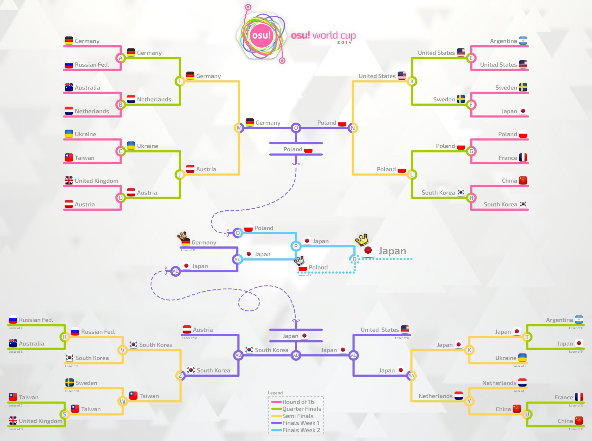

---
tags:
  - OWC 2014
  - OWC2014
---

# osu! World Cup 2014

L'**osu! World Cup 2014** (***OWC 2014***) est un tournoi d'osu! par pays organisé par [l'équipe osu!](/wiki/People/osu!_team). Il s'agit de la cinquième édition de l'osu! World Cup.

## Calendrier du tournoi

| Évènement | Date |
| --: | :-- |
| Inscription des équipes | 02/10/2014 - 26/10/2014 |
| Tirages au sort | 01/11/2014 (14:00 UTC) |
| Phases de poules | 08/11/2014 - 09/11/2014 |
| Huitièmes de finale | 16/11/2014 |
| Quarts de finale | 22/11/2014 - 23/11/2014 |
| Demi-finales | 29/11/2014 - 30/11/2014 |
| Finales - Semaine 1 | 06/12/2014 |
| Finales - Semaine 2 | 13/12/2014 |

## Récompenses

| Place | Récompenses |
| :-: | :-- |
|  | Statut de supporter pendant 6 mois, un badge de profil unique, le titre "osu! Champion" pendant un an, de la marchandise exclusive d'osu! |
|  | Statut de supporter pendant 3 mois, un badge de profil unique |
|  | Statut de supporter pendant 1 mois, un badge de profil unique |

  

## Organisation

L'osu! World Cup 2014 était organisée par divers membres de la communauté.

| Poste | Membre(s) |
| :-- | :-- |
| Direction | ::{ flag=ES }:: [Deif](https://osu.ppy.sh/users/318565), ::{ flag=DE }:: [Loctav](https://osu.ppy.sh/users/71366), ::{ flag=DE }:: [p3n](https://osu.ppy.sh/users/123703) |
| Sélecteurs de beatmaps | ::{ flag=NL }:: [GladiOol](https://osu.ppy.sh/users/23326), ::{ flag=KR }:: [ToGlette](https://osu.ppy.sh/users/1076236) |
| Retransmission des matchs | ::{ flag=PL }:: [Marcin](https://osu.ppy.sh/users/722665), ::{ flag=AU }:: [peppy](https://osu.ppy.sh/users/2), ::{ flag=FR }:: [shARPII](https://osu.ppy.sh/users/776257) |
| Commentateurs | ::{ flag=GB }:: [jesus1412](https://osu.ppy.sh/users/230116), ::{ flag=FR }::[Mr Color](https://osu.ppy.sh/users/116078), ::{ flag=GB }:: [Raiku](https://osu.ppy.sh/users/1525538), ::{ flag=US }:: [ztrot](https://osu.ppy.sh/users/6347) |
| Statisticiens | ::{ flag=PL }:: [Marcin](https://osu.ppy.sh/users/722665) |

## Liens

- [Fil de discussion](https://osu.ppy.sh/community/forums/posts/3410198)
- [Diffusion en direct](https://www.twitch.tv/osulive)
- **[Feuille de Stats](https://owc.nicarim.pw/results/view/3)**

## Participants

|  | Pays | Membres |
| --: | :-: | :-- |
| ::{ flag=AR }:: | Argentine | **[Glazbom](https://osu.ppy.sh/users/608277)**, [benjacala](https://osu.ppy.sh/users/1625740), [Enhu](https://osu.ppy.sh/users/2840499), [Fr0th](https://osu.ppy.sh/users/3458870), [GaTu](https://osu.ppy.sh/users/3583351), [Graphite Edge](https://osu.ppy.sh/users/825712), [Peingod](https://osu.ppy.sh/users/2212941) |
| ::{ flag=AU }:: | Australie | **[Bauxe](https://osu.ppy.sh/users/1881685)**, [FluxVanes](https://osu.ppy.sh/users/655267), [gimly32](https://osu.ppy.sh/users/3448993), [Happyjon](https://osu.ppy.sh/users/5543), [Jaybladezz](https://osu.ppy.sh/users/3725492), [Melt3dCheeze](https://osu.ppy.sh/users/634837), [Rivastyx](https://osu.ppy.sh/users/2719307), [uyghti](https://osu.ppy.sh/users/3641404) |
| ::{ flag=AT }:: | Autriche | **[Omgforz](https://osu.ppy.sh/users/578943)**, [Alumetorz](https://osu.ppy.sh/users/1145984), [BlueFlameZ](https://osu.ppy.sh/users/3506191), [Elscar](https://osu.ppy.sh/users/2253511), [Hakkero](https://osu.ppy.sh/users/177913), [Jin\_Back7](https://osu.ppy.sh/users/1238524), [WhitePhoenixLP](https://osu.ppy.sh/users/1426098) |
| ::{ flag=BR }:: | Brézil | **[Blue Dragon](https://osu.ppy.sh/users/19048)**, [ALust](https://osu.ppy.sh/users/1558603), [fabriciorby](https://osu.ppy.sh/users/209664), [Froke](https://osu.ppy.sh/users/602913), [momoyo-san](https://osu.ppy.sh/users/2038069), [Shott](https://osu.ppy.sh/users/965354), [sunosz](https://osu.ppy.sh/users/3007342) |
| ::{ flag=CA }:: | Canada | **[Azer](https://osu.ppy.sh/users/2155578)**, [- \[ U z z I \] -](https://osu.ppy.sh/users/1928230), [FreeSongs](https://osu.ppy.sh/users/2116792), [Gyutto](https://osu.ppy.sh/users/2701210), [Kairi](https://osu.ppy.sh/users/1586237), [RamenOtaku](https://osu.ppy.sh/users/980956), [Shiro-](https://osu.ppy.sh/users/2170128), [TrickMirror](https://osu.ppy.sh/users/2138739) |
| ::{ flag=CL }:: | Chili | **[Nicokarl](https://osu.ppy.sh/users/1600281)**, [Cristian](https://osu.ppy.sh/users/194345), [kafaN](https://osu.ppy.sh/users/1489743), [Neab](https://osu.ppy.sh/users/916693), [Rintsunayoshi](https://osu.ppy.sh/users/1379717) |
| ::{ flag=CN }:: | Chine | **[Prophet](https://osu.ppy.sh/users/651307)**, [Del soon Bye](https://osu.ppy.sh/users/629717), [Dsan](https://osu.ppy.sh/users/1266166), [N a n o](https://osu.ppy.sh/users/694114), [Rebellion](https://osu.ppy.sh/users/2896273), [Spring Roll](https://osu.ppy.sh/users/2499198), [SpringLane](https://osu.ppy.sh/users/1343504), [wobeinimacao](https://osu.ppy.sh/users/350723) |
| ::{ flag=DK }:: | Danemark | **[TimG](https://osu.ppy.sh/users/1879963)**, [Cerkie](https://osu.ppy.sh/users/2533400), [DipG](https://osu.ppy.sh/users/2983311), [Fuccho](https://osu.ppy.sh/users/3053382), [Kazutakee](https://osu.ppy.sh/users/2637514), [Tonarinototoro](https://osu.ppy.sh/users/2678812), [TraxieChan](https://osu.ppy.sh/users/455552), [Tropians](https://osu.ppy.sh/users/2536611) |
| ::{ flag=FI }:: | Finlande | **[Subbie](https://osu.ppy.sh/users/1590138)**, [Arcley](https://osu.ppy.sh/users/1916349), [Isokasapupuja](https://osu.ppy.sh/users/1770462), [Jantsi](https://osu.ppy.sh/users/1644225), [Kirei](https://osu.ppy.sh/users/3250863), [kumig](https://osu.ppy.sh/users/3298140), [Urp](https://osu.ppy.sh/users/1534396), [Villani](https://osu.ppy.sh/users/1979316) |
| ::{ flag=FR }:: | France | **[Soinou](https://osu.ppy.sh/users/1664519)**, [Kynan](https://osu.ppy.sh/users/1093361), [Musty](https://osu.ppy.sh/users/251683), [My Not](https://osu.ppy.sh/users/1572405), [NerO](https://osu.ppy.sh/users/1545031), [shARPII](https://osu.ppy.sh/users/776257), [Shiro](https://osu.ppy.sh/users/113005), [Syfou](https://osu.ppy.sh/users/1572956) |
| ::{ flag=DE }:: | Allemagne | **[cptnXn](https://osu.ppy.sh/users/495272)**, [BDDav](https://osu.ppy.sh/users/1164526), [CookEasy](https://osu.ppy.sh/users/453226), [Dustice](https://osu.ppy.sh/users/754565), [shunsuke](https://osu.ppy.sh/users/2028641), [Splinter572](https://osu.ppy.sh/users/846038), [Tom94](https://osu.ppy.sh/users/1857058) |
| ::{ flag=HK }:: | Hong Kong | **[- G I D Z -](https://osu.ppy.sh/users/2286528)**, [Chaoslitz](https://osu.ppy.sh/users/3621552), [Ming3012](https://osu.ppy.sh/users/1583218), [Yakumo Yukarin](https://osu.ppy.sh/users/562623) |
| ::{ flag=ID }:: | Indonésie | **[Subaru Takamaru](https://osu.ppy.sh/users/1762922)**, [C00LZ](https://osu.ppy.sh/users/1128514), [Gatyaa420](https://osu.ppy.sh/users/984132), [mamstein](https://osu.ppy.sh/users/3035210), [Mood Breaker](https://osu.ppy.sh/users/692065), [reborn513](https://osu.ppy.sh/users/1577554), [Ryuvos](https://osu.ppy.sh/users/2020531), [Sweetie Belle](https://osu.ppy.sh/users/2291870) |
| ::{ flag=IT }:: | Italie | **[lesslunatic](https://osu.ppy.sh/users/1227377)**, [Andrea](https://osu.ppy.sh/users/33599), [Chewin](https://osu.ppy.sh/users/617323), [Jordan](https://osu.ppy.sh/users/618549), [Nemis](https://osu.ppy.sh/users/1635091), [Puncia](https://osu.ppy.sh/users/782633), [xiAmME](https://osu.ppy.sh/users/1428960), [XZ19126](https://osu.ppy.sh/users/1656340) |
| ::{ flag=JP }:: | Japon | **[Mercurius](https://osu.ppy.sh/users/589550)**, [Guy](https://osu.ppy.sh/users/91738), [Poruteri](https://osu.ppy.sh/users/1379576), [Potofu](https://osu.ppy.sh/users/657404), [rrtyui](https://osu.ppy.sh/users/352328), [serea](https://osu.ppy.sh/users/371961), [Sinch](https://osu.ppy.sh/users/360552) |
| ::{ flag=LT }:: | Lituanie | **[QonQuest](https://osu.ppy.sh/users/988503)**, [Kyouma](https://osu.ppy.sh/users/2070247), [Mazzerin](https://osu.ppy.sh/users/2942381), [Painsinger](https://osu.ppy.sh/users/697843), [Strategas](https://osu.ppy.sh/users/2971837), [Zinkon](https://osu.ppy.sh/users/85043) |
| ::{ flag=MY }:: | Malaisie | **[Gon](https://osu.ppy.sh/users/583765)**, [caleb123456](https://osu.ppy.sh/users/2205376), [ExPew](https://osu.ppy.sh/users/665612), [ffstar0716](https://osu.ppy.sh/users/1163205), [NazzzF](https://osu.ppy.sh/users/2676512), [Rumia-](https://osu.ppy.sh/users/1787171), [TequilaWolf](https://osu.ppy.sh/users/3633477), [xsrsbsns](https://osu.ppy.sh/users/414427) |
| ::{ flag=MX }:: | Mexique | **[El Koko](https://osu.ppy.sh/users/2352419)**, [\[ AeonLust \]](https://osu.ppy.sh/users/2353490), [\[Chrono\]](https://osu.ppy.sh/users/2308331), [-Alberto-](https://osu.ppy.sh/users/2658465), [Broodich](https://osu.ppy.sh/users/2484629), [MomoXv](https://osu.ppy.sh/users/1207955), [sumaru100](https://osu.ppy.sh/users/1872256) |
| ::{ flag=NL }:: | Pays-Bas | **[BiG_ChilD](https://osu.ppy.sh/users/596196)**, [Damnjelly](https://osu.ppy.sh/users/1666355), [HappyStick](https://osu.ppy.sh/users/256802), [jackylam5](https://osu.ppy.sh/users/1540807), [Kyshiro](https://osu.ppy.sh/users/640611), [R3laX3R](https://osu.ppy.sh/users/819689), [Synchrostar](https://osu.ppy.sh/users/419705), [taku](https://osu.ppy.sh/users/684433) |
| ::{ flag=NZ }:: | Nouvelle-Zélande | **[go3001](https://osu.ppy.sh/users/735437)**, [ivvi](https://osu.ppy.sh/users/2494979), [jiantz](https://osu.ppy.sh/users/330252), [Kysteria](https://osu.ppy.sh/users/2997708), [moph](https://osu.ppy.sh/users/2233878), [NekoWins](https://osu.ppy.sh/users/3345403), [Oukskirts](https://osu.ppy.sh/users/2586359) |
| ::{ flag=NO }:: | Norvège | **[-GN](https://osu.ppy.sh/users/895581)**, [CXu](https://osu.ppy.sh/users/84841), [KinomiCandy](https://osu.ppy.sh/users/375143), [kossc](https://osu.ppy.sh/users/2363849), [Liqh](https://osu.ppy.sh/users/3409838), [PcBoy111](https://osu.ppy.sh/users/2916414), [Princess Zoom](https://osu.ppy.sh/users/1593758), [Tobi](https://osu.ppy.sh/users/2970667) |
| ::{ flag=PH }:: | Philippines | **[Jann](https://osu.ppy.sh/users/818399)**, [-Gio](https://osu.ppy.sh/users/1795827), [HybRidChrome](https://osu.ppy.sh/users/2606470), [-Marika](https://osu.ppy.sh/users/2199427), [Mira-san](https://osu.ppy.sh/users/1587999), [Pizzicato](https://osu.ppy.sh/users/692610), [Returnxps](https://osu.ppy.sh/users/589462), [Takane Enomoto](https://osu.ppy.sh/users/1208491) |
| ::{ flag=PL }:: | Pologne | **[fartownik](https://osu.ppy.sh/users/56917)**, [AmaiHachimitsu](https://osu.ppy.sh/users/844815), [listless](https://osu.ppy.sh/users/1106527), [r0ck](https://osu.ppy.sh/users/1549620), [SteRRuM](https://osu.ppy.sh/users/42585), [Wilchq](https://osu.ppy.sh/users/2021758), [WubWoofWolf](https://osu.ppy.sh/users/39828) |
| ::{ flag=PT }:: | Portugal | **[Osama](https://osu.ppy.sh/users/799218)**, [Makkura](https://osu.ppy.sh/users/344086), [MrStugzZ](https://osu.ppy.sh/users/2594351), [Nectarine](https://osu.ppy.sh/users/2148013), [PedroLipton](https://osu.ppy.sh/users/3272012), [RobotTermite](https://osu.ppy.sh/users/2713287), [Snosey](https://osu.ppy.sh/users/2515691) |
| ::{ flag=RU }:: | Fédération de Russie | **[cr1m](https://osu.ppy.sh/users/803766)**, [anticlone111](https://osu.ppy.sh/users/1950600), [Hidari Handoru](https://osu.ppy.sh/users/1056329), [Kert](https://osu.ppy.sh/users/119933), [KoTo](https://osu.ppy.sh/users/1382805), [Pyroboom](https://osu.ppy.sh/users/689882), [Shiawase](https://osu.ppy.sh/users/989489), [talala](https://osu.ppy.sh/users/1389663) |
| ::{ flag=SG }:: | Singapour | **[Plaatinum](https://osu.ppy.sh/users/3385566)**, [Alacartx](https://osu.ppy.sh/users/1959767), [GSBlank](https://osu.ppy.sh/users/2312106), [lameomaster2](https://osu.ppy.sh/users/1843447), [Nakano-](https://osu.ppy.sh/users/1893953), [phox](https://osu.ppy.sh/users/772295), [rtyzen](https://osu.ppy.sh/users/2439822) |
| ::{ flag=KR }:: | Corée du Sud | **[KRZY](https://osu.ppy.sh/users/114017)**, [\[ Rachel \]](https://osu.ppy.sh/users/2006663), [Gomo Pslvarh](https://osu.ppy.sh/users/1206417), [K i R i K a R u](https://osu.ppy.sh/users/139670), [MathClass](https://osu.ppy.sh/users/2000416), [sayonara-bye](https://osu.ppy.sh/users/713266) |
| ::{ flag=SE }:: | Suède | **[Xytox](https://osu.ppy.sh/users/2229274)**, [Gnuu](https://osu.ppy.sh/users/914004), [Kotayo](https://osu.ppy.sh/users/1730025), [l1mi](https://osu.ppy.sh/users/973172), [Physalis](https://osu.ppy.sh/users/2188481), [Slizzer](https://osu.ppy.sh/users/809983), [Vanillaire](https://osu.ppy.sh/users/2359549) |
| ::{ flag=TW }:: | Taïwan | **[onlyforyou](https://osu.ppy.sh/users/597858)**, [BA\_KA\_YA\_RO U](https://osu.ppy.sh/users/1483659), [dabanlong](https://osu.ppy.sh/users/624254), [mookss1231](https://osu.ppy.sh/users/1483371), [Saya-Eternal](https://osu.ppy.sh/users/2865291), [Small K](https://osu.ppy.sh/users/952751) |
| ::{ flag=UA }:: | Ukraine | **[Aka](https://osu.ppy.sh/users/1307553)**, [blednak](https://osu.ppy.sh/users/912627), [BloodM0nk](https://osu.ppy.sh/users/2174403), [Granje](https://osu.ppy.sh/users/496387), [-ReimuHakurei-](https://osu.ppy.sh/users/1163931), [rockleejkooo](https://osu.ppy.sh/users/384003) |
| ::{ flag=GB }:: | Royaume-Uni | **[jesus1412](https://osu.ppy.sh/users/230116)**, [bahamete](https://osu.ppy.sh/users/960620), [Doomsday](https://osu.ppy.sh/users/18983), [Jameslike](https://osu.ppy.sh/users/2415743), [Kardet](https://osu.ppy.sh/users/1438509), [lovu](https://osu.ppy.sh/users/846235), [PortalLife](https://osu.ppy.sh/users/929134), [Raiku](https://osu.ppy.sh/users/1525538) |
| ::{ flag=US }:: | États-Unis | **[pooptartsonas](https://osu.ppy.sh/users/1334453)**, [Horo](https://osu.ppy.sh/users/992439), [Kaoru](https://osu.ppy.sh/users/492699), [kittehcommando](https://osu.ppy.sh/users/2162669), [pielak](https://osu.ppy.sh/users/310455), [SapphireGhost](https://osu.ppy.sh/users/388602), [-Soba-](https://osu.ppy.sh/users/663657), [Xilver15](https://osu.ppy.sh/users/3099689) |

## Groupes

| Groupe A | Groupe B | Groupe C | Groupe D | Groupe E | Groupe F | Groupe G | Groupe H |
| :-- | :-- | :-- | :-- | :-- | :-- | :-- | :-- |
| ::{ flag=DE }:: Allemagne | ::{ flag=AR }:: Argentine | ::{ flag=AU }:: Australie | ::{ flag=BR }:: Brésil | ::{ flag=LT }:: Lituanie | ::{ flag=CA }:: Canada | ::{ flag=FI }:: Finlande | ::{ flag=CN }:: Chine |
| ::{ flag=IT }:: Italie | ::{ flag=AT }:: Autriche | ::{ flag=CL }:: Chili | ::{ flag=JP }:: Japon | ::{ flag=NO }:: Norvège | ::{ flag=HK }:: Hong Kong | ::{ flag=SG }:: Singapour | ::{ flag=DK }:: Danemark |
| ::{ flag=PT }:: Portugal | ::{ flag=NZ }:: Nouvelle-Zélande | ::{ flag=FR }:: France | ::{ flag=MX }:: Mexique | ::{ flag=SE }:: Suède | ::{ flag=NL }:: Pays-Bas | ::{ flag=GB }:: Royaume-Uni | ::{ flag=MY }:: Malaisie |
| ::{ flag=KR }:: Corée du Sud | ::{ flag=PH }:: Philippines | ::{ flag=ID }:: Indonésie | ::{ flag=UA }:: Ukraine | ::{ flag=TW }:: Taïwan | ::{ flag=PL }:: Pologne | ::{ flag=US }:: États-Unis | ::{ flag=RU }:: Fédération de Russie |

## Podium

Cette compétition s'est conclue sur le podium suivant :

| Place | Équipe |
| :-: | :-- |
|  | ::{ flag=JP }:: **Japon** (**[Mercurius](https://osu.ppy.sh/users/589550)**, [Guy](https://osu.ppy.sh/users/91738), [Poruteri](https://osu.ppy.sh/users/1379576), [Potofu](https://osu.ppy.sh/users/657404), [rrtyui](https://osu.ppy.sh/users/352328), [serea](https://osu.ppy.sh/users/371961), [Sinch](https://osu.ppy.sh/users/360552)) |
|  | ::{ flag=PL }:: **Pologne** (**[fartownik](https://osu.ppy.sh/users/56917)**, [AmaiHachimitsu](https://osu.ppy.sh/users/844815), [listless](https://osu.ppy.sh/users/1106527), [r0ck](https://osu.ppy.sh/users/1549620), [SteRRuM](https://osu.ppy.sh/users/42585), [Wilchq](https://osu.ppy.sh/users/2021758), [WubWoofWolf](https://osu.ppy.sh/users/39828)) |
|  | ::{ flag=DE }:: **Allemagne** (**[cptnXn](https://osu.ppy.sh/users/495272)**, [BDDav](https://osu.ppy.sh/users/1164526), [CookEasy](https://osu.ppy.sh/users/453226), [Dustice](https://osu.ppy.sh/users/754565), [shunsuke](https://osu.ppy.sh/users/2028641), [Splinter572](https://osu.ppy.sh/users/846038), [Tom94](https://osu.ppy.sh/users/1857058)) |

## Mappools

**Ce mappool a été joué lors de la semaine 1 et la semaine 2 des finales.**

### Finales

**[Téléchargez le pack de beatmaps ici ! (130 MB)](https://www.mediafire.com/download/hd8njp8cvqad5yq/OWC_Finals.rar)**

- NoMod
  1. [UNDEAD CORPORATION - Yoru Naku Usagi wa Yume wo Miru (Strawberry) \[BakaNA\]](https://osu.ppy.sh/beatmapsets/59049#osu/214248)
  2. [Zips - Reiwai Terrorism (Kyshiro) \[Terror\]](https://osu.ppy.sh/beatmapsets/165817#osu/403276)
  3. [Shounen Radio - neu (Philippines) \[Platinum\]](https://osu.ppy.sh/beatmapsets/58422#osu/179070)
  4. [Mago de Oz - Xanandra (Xanandra) \[Insane\]](https://osu.ppy.sh/beatmapsets/74313#osu/221026)
  5. [Mutsuhiko Izumi - Red Goose (nold\_1702) \[Superable\]](https://osu.ppy.sh/beatmapsets/46239#osu/144029)
  6. [Bring Me The Horizon - Anthem (Louis Cyphre) \[Lucifer\]](https://osu.ppy.sh/beatmapsets/32661#osu/118380)
- Hidden
  1. [MiddleIsland - Aldo (Lan wings) \[Lan\]](https://osu.ppy.sh/beatmapsets/72767#osu/207721)
  2. [airportexpress feat.Itsuneko - BIRTH (Chloe) \[Insane\]](https://osu.ppy.sh/beatmapsets/175241#osu/422762)
  3. [yuikonnu - Genjitsu Game (Amamiya Yuko) \[Extra\]](https://osu.ppy.sh/beatmapsets/112210#osu/291553)
- HardRock
  1. [An - Encryption (HelloSCV) \[Kloyd's Extra\]](https://osu.ppy.sh/beatmapsets/96368#osu/258384)
  2. [MYTK - Yggdrasil (P o M u T a) \[INFINITE\]](https://osu.ppy.sh/beatmapsets/137973#osu/344715)
  3. [Lifetheory - Angel (Zarerion) \[Sanctum\]](https://osu.ppy.sh/beatmapsets/113192#osu/308040)
- DoubleTime
  1. [Bomfunk MC's - Freestyler (Lesjuh) \[Insane\]](https://osu.ppy.sh/beatmapsets/35629#osu/115352)
  2. [U - Ha-tenya? (biwako) \[Insane\]](https://osu.ppy.sh/beatmapsets/37313#osu/120080)
  3. [senya - Youyoumu no Gotoku (Satellite) \[Satellite\]](https://osu.ppy.sh/beatmapsets/110985#osu/299041)
- FreeMod
  1. [ETIA. - Claiomh Solais (Zare) \[Eternal\]](https://osu.ppy.sh/beatmapsets/165664#osu/403039)
  2. [LeaF - Calamity Fortune (Flower) \[Extra\]](https://osu.ppy.sh/beatmapsets/96103#osu/257793)
  3. [Awake - Supernova (DoKoLP) \[DoKo\]](https://osu.ppy.sh/beatmapsets/42909#osu/138008)
- Tiebreaker
  1. **[onoken - P8107 (Kloyd) \[KA071\]](https://osu.ppy.sh/beatmapsets/192137#osu/457061)**

### Demi-finales

**[Téléchargez le pack de beatmaps ici ! (187 MB)](https://www.mediafire.com/download/31bm61ol9wip0y4/OWC_SemiFinals.rar)**

- NoMod
  1. [Hanatan - Airman ga Taosenai (SOUND HOLIC Ver.) (Natsu) \[CRN's Extra\]](https://osu.ppy.sh/beatmapsets/134151#osu/338682)
  2. [HujuniseikouyuuP - MISTAKE (val0108) \[Ms.0108\]](https://osu.ppy.sh/beatmapsets/105245#osu/276366)
  3. [jippusu - Mushikui Saikede Rhythm (Amamiya Yuko) \[RLC\]](https://osu.ppy.sh/beatmapsets/87547#osu/240689)
  4. [Fear, and Loathing in Las Vegas - Rave-up Tonight (lightr) \[Extra\]](https://osu.ppy.sh/beatmapsets/176832#osu/425761)
  5. [nmk - sola (sjoy) \[Extra\]](https://osu.ppy.sh/beatmapsets/183267#osu/439135)
  6. [celas - Azul (Remix) (AngelHoney) \[Extra\]](https://osu.ppy.sh/beatmapsets/40273#osu/134856)
- Hidden
  1. [kemu - Ikasama Life Game (a3272509123) \[Regou\]](https://osu.ppy.sh/beatmapsets/59792#osu/210718)
  2. [Zips - Heisei Cataclysm (Dark Fang) \[Fang\]](https://osu.ppy.sh/beatmapsets/72217#osu/206567)
  3. [naotyu- - Her Majesty (Reisen Udongein) \[Another\]](https://osu.ppy.sh/beatmapsets/52360#osu/160104)
- HardRock
  1. [Sagara Kokoro - Hoshizora no Ima (Asphyxia) \[Extra\]](https://osu.ppy.sh/beatmapsets/160145#osu/391228)
  2. [Foreground Eclipse - From Under Cover (Caught Up In A Love Song) (keeeeeeko) \[Insane\]](https://osu.ppy.sh/beatmapsets/150739#osu/384718)
  3. [Kurubukko vs yukitani - Minamichita EVOLVED (Cherry Blossom) \[Another\]](https://osu.ppy.sh/beatmapsets/136632#osu/341891)
- DoubleTime
  1. [lily-an - The Starry true (Delis) \[Lunatic\]](https://osu.ppy.sh/beatmapsets/158744#osu/388170)
  2. [Primastella - Koigokoro (Luerxa) \[Insane\]](https://osu.ppy.sh/beatmapsets/127712#osu/323769)
  3. [Feint - Time Bomb (feat. Veela & Boyinaband) (vipto) \[Time\]](https://osu.ppy.sh/beatmapsets/98842#osu/263368)
- FreeMod
  1. [wakaG - Yozora ni Saita Hana (Awaken) \[Extra\]](https://osu.ppy.sh/beatmapsets/189529#osu/480599)
  2. [Mind Vortex - Arc (Natteke) \[Nsane\]](https://osu.ppy.sh/beatmapsets/87509#osu/239037)
  3. [Amatsuki - Higurashi Moratorium (HelloSCV) \[Frobe's Extra\]](https://osu.ppy.sh/beatmapsets/94506#osu/254370)
- Tiebreaker
  1. **[sweet ARMS - Installation (Cherry Blossom) \[Nightmare\]](https://osu.ppy.sh/beatmapsets/185927#osu/444356)**

### Quarts de finale

**[Téléchargez le pack de beatmaps ici ! (164 MB)](https://www.mediafire.com/download/gh0da1ahgxiogka/OWC_Quarter_Finals.rar)**

- NoMod
  1. [Himeringo - Yotsuya-san ni Yoroshiku (RLC) \[Winber1's Extreme\]](https://osu.ppy.sh/beatmapsets/100049#osu/378781)
  2. [Dark PHOENiX - Hiroari Shoots a Strange Bird (sjoy) \[Extra\]](https://osu.ppy.sh/beatmapsets/126354#osu/321559)
  3. [daisan - -+ (RikiH\_) \[Extra\]](https://osu.ppy.sh/beatmapsets/135094#osu/338544)
  4. [Rohi - Kanata ni Mau wa Sakura no Shirabe (NatsumeRin) \[Extra\]](https://osu.ppy.sh/beatmapsets/93555#osu/252290)
  5. [Hatsune Miku - Homework Crisis (val0108) \[Let's Jump!!\]](https://osu.ppy.sh/beatmapsets/33068#osu/108021)
  6. [Glamour of the Kill - A Hope in Hell (ykcarrot) \[Hopeless\]](https://osu.ppy.sh/beatmapsets/31814#osu/104389)
- Hidden
  1. [HitoshizukuP x Yama - Crazy nighT (Sephibro) \[Crazy\]](https://osu.ppy.sh/beatmapsets/109401#osu/285549)
  2. [Renard - Smoke Tower (Priti) \[Trauma\]](https://osu.ppy.sh/beatmapsets/135596#osu/339640)
  3. [Cres - End Time (Kyshiro) \[Extra\]](https://osu.ppy.sh/beatmapsets/140691#osu/432839)
- HardRock
  1. [Yooh - Shanghai Kouchakan ~ Chinese Tea Orchid Remix (Gamu) \[INFINITE\]](https://osu.ppy.sh/beatmapsets/184498#osu/486619)
  2. [Sariyajin - Ao no Senritsu (smallboat) \[Extra\]](https://osu.ppy.sh/beatmapsets/124500#osu/317327)
  3. [Omoi - Nee William (Yales) \[Extra\]](https://osu.ppy.sh/beatmapsets/164155#osu/399756)
- DoubleTime
  1. [Kozato - Tsuki -Yue- (jonathanlfj) \[Another\]](https://osu.ppy.sh/beatmapsets/101123#osu/268080)
  2. [Elvenking - The Winter Wake (Snepif) \[AlrdyExists' Blizzard\]](https://osu.ppy.sh/beatmapsets/32499#osu/107747)
  3. [Mitchie M - Viva Happy (Natsu) \[Insane\]](https://osu.ppy.sh/beatmapsets/120002#osu/317917)
- FreeMod
  1. [Maduk ft. Veela - Ghost Assassin (Hourglass Bonusmix) (alacat) \[Lumiere\]](https://osu.ppy.sh/beatmapsets/198820#osu/471598)
  2. [8284 vs wa. - Adularescence (Cherry Blossom) \[Extra\]](https://osu.ppy.sh/beatmapsets/119438#osu/306669)
  3. [yuikonnu - Hatsukoi no Ehon (litoluna) \[Insane\]](https://osu.ppy.sh/beatmapsets/110870#osu/288660)
- Tiebreaker
  1. **[Halozy - Kanshou no Matenrou (captin1) \[Eternal\]](https://osu.ppy.sh/beatmapsets/179699#osu/431957)**

### Huitièmes de finale

**[Téléchargez le pack de beatmaps ici ! (144 MB)](https://www.mediafire.com/download/eav4oeg33eax8w9/OWC_Round_of_16.rar)**

- NoMod
  1. [yuikonnu - Kakushigoto (jonathanlfj) \[Insane\]](https://osu.ppy.sh/beatmapsets/122605#osu/315260)
  2. [Renard - Da Nu Nuttah (GamerX4life) \[Nogard\]](https://osu.ppy.sh/beatmapsets/62665#osu/205282)
  3. [Qrispy Joybox - snow prism (ktgster) \[Extreme\]](https://osu.ppy.sh/beatmapsets/132389#osu/332962)
  4. [Foreground Eclipse - I Bet You'll Forget That Even If You Noticed That (rEdo) \[Lunatic\]](https://osu.ppy.sh/beatmapsets/146805#osu/363662)
  5. [Lon - MATRYOSHKA (EvilElvis) \[Extra\]](https://osu.ppy.sh/beatmapsets/109185#osu/285086)
  6. [HujuniseikouyuuP - Sayonara Lechenaultia (qq944364487) \[Lechenaultia\]](https://osu.ppy.sh/beatmapsets/65747#osu/192320)
- Hidden
  1. [Kozato snow - Izayoi Sakura (Melt) \[Insane\]](https://osu.ppy.sh/beatmapsets/162371#osu/396105)
  2. [Megpoid GUMI & Kagamine Rin - Invisible (NatsumeRin) \[Rin\]](https://osu.ppy.sh/beatmapsets/45160#osu/143036)
  3. [Zeami - Music Revolver (KanaRin) \[Kana\]](https://osu.ppy.sh/beatmapsets/53231#osu/162363)
- HardRock
  1. [MOMOIRO CLOVER Z - SARABA ITOSHIKI KANASHIMI TACHIYO (Sellenite) \[Master\]](https://osu.ppy.sh/beatmapsets/215977#osu/507098)
  2. [Hatsune Miku - Hiatus (wcx19911123) \[Insane\]](https://osu.ppy.sh/beatmapsets/32046#osu/105003)
  3. [P\*Light - Poppin' Shower (Reisen Udongein) \[Another\]](https://osu.ppy.sh/beatmapsets/42527#osu/133723)
- DoubleTime
  1. [KOTOKO - unfinished (Pokie) \[Acceleration\]](https://osu.ppy.sh/beatmapsets/51132#osu/156904)
  2. [Nanamori-chu \* Goraku-bu - Precious Friends (Setz206) \[Insane\]](https://osu.ppy.sh/beatmapsets/173956#osu/420131)
  3. [Matchbox Twenty - How Far We've Come (Sushi) \[Insane\]](https://osu.ppy.sh/beatmapsets/31014#osu/104117)
- FreeMod
  1. [Blackhole - Lagomorphic (happy623) \[Lagomorph\]](https://osu.ppy.sh/beatmapsets/74664#osu/211889)
  2. [Memme - NEW Astronomas (Charles445) \[Extra\]](https://osu.ppy.sh/beatmapsets/87188#osu/238265)
  3. [Hatsune Miku - Dance of many (LKs) \[Dance\]](https://osu.ppy.sh/beatmapsets/45028#osu/140805)
- Tiebreaker
  1. **[Dark PHOENiX - The Primal Scene of Japan the Girl Saw (sjoy) \[Extra\]](https://osu.ppy.sh/beatmapsets/121635#osu/311573)**

### Phases de poules

**[Téléchargez le pack de beatmaps ici ! (206 MB)](https://www.mediafire.com/download/p2fxdt67qlsakn3/OWC_Group_Stage.rar)**

- NoMod
  1. [Toyosaki Aki - MORE&MORE (Fycho) \[Insane\]](https://osu.ppy.sh/beatmapsets/125303#osu/318975)
  2. [Last Note. - Caramel Heaven (Snepif) \[Heaven\]](https://osu.ppy.sh/beatmapsets/90095#osu/244691)
  3. [nano - Nevereverland (Nyquill) \[Insane\]](https://osu.ppy.sh/beatmapsets/95533#osu/256499)
  4. [marina - Towa yori Towa ni (Garven) \[Kite's Insane\]](https://osu.ppy.sh/beatmapsets/143370#osu/376558)
  5. [Jeff Williams - Red Like Roses (feat. Casey Lee Williams) (Flower) \[Ruby\]](https://osu.ppy.sh/beatmapsets/90128#osu/244781)
  6. [Comp - Touchuu Aika (Mao) \[Maolvis' Lunatic\]](https://osu.ppy.sh/beatmapsets/198700#osu/471369)
- Hidden
  1. [Nero's Day At Disneyland - No Money Down, Low Monthly Payments (grumd) \[Insane\]](https://osu.ppy.sh/beatmapsets/111825#osu/290733)
  2. [capitaro - Yoiduki Maiuta (Amamiya Yuko) \[Insane\]](https://osu.ppy.sh/beatmapsets/70057#osu/201601)
  3. [Megpoid GUMI - Shinkaron -code:variant- (NatsumeRin) \[Rin\]](https://osu.ppy.sh/beatmapsets/29445#osu/99465)
- HardRock
  1. [Souei Academy Light Music Club starring i.o - Sekai de Hitotsu no Takaramono (cRyo\[iceeicee\]) \[Insane\]](https://osu.ppy.sh/beatmapsets/52048#osu/159316)
  2. [Aki - Wanna Be My Dream (Lortus) \[Insane\]](https://osu.ppy.sh/beatmapsets/128432#osu/325209)
  3. [ginkiha - EOS (alacat) \[RLC's Another\]](https://osu.ppy.sh/beatmapsets/151720#osu/421532)
- DoubleTime
  1. [Kuba Oms - My Love (W h i t e) \[Insane\]](https://osu.ppy.sh/beatmapsets/163112#osu/397535)
  2. [yanaginagi - Vidro Moyou (Moway) \[Insane\]](https://osu.ppy.sh/beatmapsets/120513#osu/308908)
  3. [FELT - Sky Gate (Frostmourne) \[Lunatic\]](https://osu.ppy.sh/beatmapsets/129534#osu/327256)
- FreeMod
  1. [Nekomata Master+ - squall (Rue) \[Insane\]](https://osu.ppy.sh/beatmapsets/66224#osu/238938)
  2. [Knife Party - Bonfire (inverness) \[Rage\]](https://osu.ppy.sh/beatmapsets/73576#osu/281918)
  3. [Sana - Terekakushi Shishunki (litoluna) \[Insane\]](https://osu.ppy.sh/beatmapsets/202677#osu/479354)
- Tiebreaker
  1. **[Okui Masami - God Speed (ykcarrot) \[Insane\]](https://osu.ppy.sh/beatmapsets/28140#osu/93947)**

## Résultat des matchs

### Finales semaine 2

Samedi 13 décembre 2014 :

| Équipe 1 |  |  | Équipe 2 | Lien du match |
| --: | :-: | :-: | :-- | :-- |
| Pologne ::{ flag=PL }:: | 1 | **6** | ::{ flag=JP }:: **Japon** | [#1](https://osu.ppy.sh/community/matches/11117046) |
| **Japon** ::{ flag=JP }:: | **6** | 2 | ::{ flag=PL }:: Pologne | [#1](https://osu.ppy.sh/community/matches/11118895) |

### Finales semaine 1

Samedi 6 décembre 2014 :

| Équipe 1 |  |  | Équipe 2 | Lien du match |
| --: | :-: | :-: | :-- | :-- |
| **Japon** ::{ flag=JP }:: | **6** | 0 | ::{ flag=US }:: États-Unis | [#1](https://osu.ppy.sh/community/matches/10950205) |
| **Corée du Sud** ::{ flag=KR }:: | **6** | 1 | ::{ flag=AT }:: Autriche | [#1](https://osu.ppy.sh/community/matches/10954577) |
| Corée du Sud ::{ flag=KR }:: | 5 | **6** | ::{ flag=JP }:: **Japon** | [#1](https://osu.ppy.sh/community/matches/10955976) |
| Allemagne ::{ flag=DE }:: | 3 | **6** | ::{ flag=PL }:: **Pologne** | [#1](https://osu.ppy.sh/community/matches/10966299) |

### Semi-finales

Samedi 29 novembre 2014 :

| Équipe 1 |  |  | Équipe 2 | Lien du match |
| --: | :-: | :-: | :-- | :-- |
| Fédération de Russie ::{ flag=RU }:: | 5 | **6** | ::{ flag=KR }:: **Corée du Sud** | [#1](https://osu.ppy.sh/community/matches/10799208) |
| **Japon** ::{ flag=JP }:: | **6** | 0 | ::{ flag=UA }:: Ukraine | [#1](https://osu.ppy.sh/community/matches/10800808) |
| Suède ::{ flag=SE }:: | 3 | **6** | ::{ flag=TW }:: **Taïwan** | [#1](https://osu.ppy.sh/community/matches/10801986) |
| **Pays-Bas** ::{ flag=NL }:: | **6** | 0 | ::{ flag=CN }:: Chine | [#1](https://osu.ppy.sh/community/matches/10803221) |

Dimanche 30 novembre 2014 :

| Équipe 1 |  |  | Équipe 2 | Lien du match |
| --: | :-: | :-: | :-- | :-- |
| **Corée du Sud** ::{ flag=KR }:: | **6** | 5 | ::{ flag=TW }:: Taïwan | [#1](https://osu.ppy.sh/community/matches/10828929) |
| **Japon** ::{ flag=JP }:: | **6** | 4 | ::{ flag=NL }:: Pays-Bas | [#1](https://osu.ppy.sh/community/matches/10829960) |
| **Allemagne** ::{ flag=DE }:: | **6** | 5 | ::{ flag=AT }:: Autriche | [#1](https://osu.ppy.sh/community/matches/10835928) |
| États-Unis ::{ flag=US }:: | 0 | **6** | ::{ flag=PL }:: **Pologne** | [#1](https://osu.ppy.sh/community/matches/10837599) |

### Quarts de finale

Samedi 22 novembre 2014 :

| Équipe 1 |  |  | Équipe 2 | Lien du match |
| --: | :-: | :-: | :-- | :-- |
| **Fédération de Russie** ::{ flag=RU }:: | **5** | 1 | ::{ flag=AU }:: Australie | [#1](https://osu.ppy.sh/community/matches/10635177) |
| **Taïwan** ::{ flag=TW }:: | **5** | 2 | ::{ flag=GB }:: Royaume-Uni | [#1](https://osu.ppy.sh/community/matches/10636683) |
| France ::{ flag=FR }:: | 1 | **5** | ::{ flag=CN }:: **Chine** | [#1](https://osu.ppy.sh/community/matches/10637580) |
| Argentine ::{ flag=AR }:: | 0 | **5** | ::{ flag=JP }:: **Japon** | [#1](https://osu.ppy.sh/community/matches/10638992) |

Dimanche 23 novembre 2014 :

| Équipe 1 |  |  | Équipe 2 | Lien du match |
| --: | :-: | :-: | :-- | :-- |
| **Pologne** ::{ flag=PL }:: | **5** | 2 | ::{ flag=KR }:: Corée du Sud | [#1](https://osu.ppy.sh/community/matches/10669681) |
| **Allemagne** ::{ flag=DE }:: | **5** | 4 | ::{ flag=NL }:: Pays-Bas | [#1](https://osu.ppy.sh/community/matches/10671115) |
| Ukraine ::{ flag=UA }:: | 0 | **5** | ::{ flag=AT }:: **Autriche** | [#1](https://osu.ppy.sh/community/matches/10672689) |
| **États-Unis** ::{ flag=US }:: | **5** | 4 | ::{ flag=SE }:: Suède | [#1](https://osu.ppy.sh/community/matches/10674065) |

### Huitièmes de finale

Dimanche 16 novembre 2014 :

| Équipe 1 |  |  | Équipe 2 | Lien du match |
| --: | :-: | :-: | :-- | :-- |
| Chine ::{ flag=CN }:: | 2 | **5** | ::{ flag=KR }:: **Corée du Sud** | [#1](https://osu.ppy.sh/community/matches/10507941) |
| Australie ::{ flag=AU }:: | 2 | **5** | ::{ flag=NL }:: **Pays-Bas** | [#1](https://osu.ppy.sh/community/matches/10508932) |
| **Ukraine** ::{ flag=UA }:: | **5** | 1 | ::{ flag=TW }:: Taïwan | [#1](https://osu.ppy.sh/community/matches/10509978) |
| **Suède** ::{ flag=SE }:: | **5** | 3 | ::{ flag=JP }:: Japon | [#1](https://osu.ppy.sh/community/matches/10510938) |
| **Pologne** ::{ flag=PL }:: | **5** | 1 | ::{ flag=FR }:: France | [#1](https://osu.ppy.sh/community/matches/10517306) |
| **Allemagne** ::{ flag=DE }:: | **5** | 3 | ::{ flag=RU }:: Fédération de Russie | [#1](https://osu.ppy.sh/community/matches/10518861) |
| Royaume-Uni ::{ flag=GB }:: | 2 | **5** | ::{ flag=AT }:: **Autriche** | [#1](https://osu.ppy.sh/community/matches/10520060) |
| Argentine ::{ flag=AR }:: | 2 | **5** | ::{ flag=US }:: **États-Unis** | [#1](https://osu.ppy.sh/community/matches/10521646) |

### Phases de poules

Samedi 8 novembre 2014 :

| Équipe 1 |  |  | Équipe 2 | Lien du match |
| --: | :-: | :-: | :-- | :-- |
| Nouvelle-Zélande ::{ flag=NZ }:: | 1 | **4** | ::{ flag=PH }:: **Philippines** | [#1](https://osu.ppy.sh/community/matches/10316251) |
| Lituanie ::{ flag=LT }:: | 2 | **4** | ::{ flag=TW }:: **Taïwan** | [#1](https://osu.ppy.sh/community/matches/10315808) |
| Indonésie ::{ flag=ID }:: | 1 | **4** | ::{ flag=AU }:: **Australie** | [#1](https://osu.ppy.sh/community/matches/10315815) |
| Malaisie ::{ flag=MY }:: | 1 | **4** | ::{ flag=CN }:: **Chine** | [#1](https://osu.ppy.sh/community/matches/10317033) |
| Hong Kong ::{ flag=HK }:: | 0 | **4** | ::{ flag=NL }:: **Pays-Bas** | [#1](https://osu.ppy.sh/community/matches/10317030) |
| Singapour ::{ flag=SG }:: | 3 | **4** | ::{ flag=FI }:: **Finlande** | [#1](https://osu.ppy.sh/community/matches/10318242) |
| Danemark ::{ flag=DK }:: | 1 | **4** | ::{ flag=RU }:: **Fédération de Russie** | [#1](https://osu.ppy.sh/community/matches/10318251) |
| Portugal ::{ flag=PT }:: | 0 | **4** | ::{ flag=KR }:: **Corée du Sud** | [#1](https://osu.ppy.sh/community/matches/10318259) |
| **Argentine** ::{ flag=AR }:: | **4** | 3 | ::{ flag=PH }:: Philippines | [#1](https://osu.ppy.sh/community/matches/10319701) |
| Hong Kong ::{ flag=HK }:: | 0 | **4** | ::{ flag=PL }:: **Pologne** | [#1](https://osu.ppy.sh/community/matches/10319710) |
| **Danemark** ::{ flag=DK }:: | **4** | 1 | ::{ flag=MY }:: Malaisie | [#1](https://osu.ppy.sh/community/matches/10321204) |
| Russie ::{ flag=RU }:: | 1 | **4** | ::{ flag=CN }:: **Chine** | [#1](https://osu.ppy.sh/community/matches/10321220) |
| Portugal ::{ flag=PT }:: | 0 | **4** | ::{ flag=IT }:: **Italie** | [#1](https://osu.ppy.sh/community/matches/10321241) |
| Finlande ::{ flag=FI }:: | 1 | **4** | ::{ flag=GB }:: **Royaume-Uni** | [#1](https://osu.ppy.sh/community/matches/10328581) |
| Lituanie ::{ flag=LT }:: | 1 | **4** | ::{ flag=NO }:: **Norvège** | [#1](https://osu.ppy.sh/community/matches/10328584) |
| Canada ::{ flag=CA }:: | 0 | **4** | ::{ flag=PL }:: **Pologne** | [#1](https://osu.ppy.sh/community/matches/10328588) |
| Chili ::{ flag=CL }:: | 1 | **4** | ::{ flag=FR }:: **France** | [#1](https://osu.ppy.sh/community/matches/10330980) |
| Canada ::{ flag=CA }:: | 2 | **4** | ::{ flag=NL }:: **Pays-Bas** | [#1](https://osu.ppy.sh/community/matches/10330997) |
| **Ukraine** ::{ flag=UA }:: | **4** | 2 | ::{ flag=BR }:: Brésil | [#1](https://osu.ppy.sh/community/matches/10331007) |
| Finlande ::{ flag=FI }:: | 0 | **4** | ::{ flag=US }:: **États-Unis** | [#1](https://osu.ppy.sh/community/matches/10331027) |
| Argentine ::{ flag=AR }:: | 3 | **4** | ::{ flag=AT }:: **Autriche** | [#1](https://osu.ppy.sh/community/matches/10332923) |
| Mexique ::{ flag=MX }:: | 0 | **4** | ::{ flag=BR }:: **Brésil** | [#1](https://osu.ppy.sh/community/matches/10332927) |
| Norvège ::{ flag=NO }:: | 1 | **4** | ::{ flag=SE }:: **Suède** | [#1](https://osu.ppy.sh/community/matches/10332930) |
| Italie ::{ flag=IT }:: | 3 | **4** | ::{ flag=DE }:: **Allemagne** | [#1](https://osu.ppy.sh/community/matches/10332931) |
| Nouvelle-Zélande ::{ flag=NZ }:: | 0 | **4** | ::{ flag=AR }:: **Argentine** | [#1](https://osu.ppy.sh/community/matches/10334740) |
| Royaume-Uni ::{ flag=GB }:: | 3 | **4** | ::{ flag=US }:: **États-Unis** | [#1](https://osu.ppy.sh/community/matches/10334747) |
| Chili ::{ flag=CL }:: | 2 | **4** | ::{ flag=AU }:: **Australie** | [#1](https://osu.ppy.sh/community/matches/10336251) |
| Mexique ::{ flag=MX }:: | 0 | **4** | ::{ flag=JP }::**Japon** | [#1](https://osu.ppy.sh/community/matches/10336267) |

Dimanche 9 novembre 2014 :

| Équipe 1 |  |  | Équipe 2 | Lien du match |
| --: | :-: | :-: | :-- | :-- |
| Norvège ::{ flag=NO }:: | 1 | **4** | ::{ flag=TW }:: **Taïwan** | [#1](https://osu.ppy.sh/community/matches/10348348) |
| Nouvelle-Zélande ::{ flag=NZ }:: | 0 | **4** | ::{ flag=AT }:: **Autriche** | [#1](https://osu.ppy.sh/community/matches/10348353) |
| Indonésie ::{ flag=ID }:: | 2 | **4** | ::{ flag=FR }:: **France** | [#1](https://osu.ppy.sh/community/matches/10348356) |
| Corée du Sud ::{ flag=KR }:: | 3 | **4** | ::{ flag=DE }:: **Allemagne** | [#1](https://osu.ppy.sh/community/matches/10349347) |
| Brésil ::{ flag=BR }:: | 0 | **4** | ::{ flag=JP }:: **Japon** | [#1](https://osu.ppy.sh/community/matches/10349350) |
| **France** ::{ flag=FR }:: | **4** | 0 | ::{ flag=AU }:: Australie | [#1](https://osu.ppy.sh/community/matches/10350503) |
| Singapour ::{ flag=SG }:: | 0 | **4** | ::{ flag=GB }:: **Royaume-Uni** | [#1](https://osu.ppy.sh/community/matches/10350506) |
| Lituanie ::{ flag=LT }:: | 2 | **4** | ::{ flag=SE }:: **Suède** | [#1](https://osu.ppy.sh/community/matches/10350508) |
| Malaisie ::{ flag=MY }:: | 2 | **4** | ::{ flag=RU }:: **Fédération de Russie** | [#1](https://osu.ppy.sh/community/matches/10350512) |
| Portugal ::{ flag=PT }:: | 0 | **4** | ::{ flag=DE }:: **Allemagne** | [#1](https://osu.ppy.sh/community/matches/10352331) |
| Italie ::{ flag=IT }:: | 2 | **4** | ::{ flag=KR }:: **Corée du Sud** | [#1](https://osu.ppy.sh/community/matches/10352168) |
| Ukraine ::{ flag=UA }:: | 1 | **4** | ::{ flag=JP }:: **Japon** | [#1](https://osu.ppy.sh/community/matches/10352111) |
| Philippines ::{ flag=PH }:: | 0 | **4** | ::{ flag=AT }:: **Autriche** | [#1](https://osu.ppy.sh/community/matches/10352118) |
| Suède ::{ flag=SE }:: | 1 | **4** | ::{ flag=TW }:: **Taïwan** | [#1](https://osu.ppy.sh/community/matches/10353334) |
| **Indonésie** ::{ flag=ID }:: | **4** | 0 | ::{ flag=CL }:: Chili | *victoire par défaut* |
| Danemark ::{ flag=DK }:: | 1 | **4** | ::{ flag=CN }:: **Chine** | [#1](https://osu.ppy.sh/community/matches/10353345) |
| **Pays-Bas** ::{ flag=NL }:: | **4** | 2 | ::{ flag=PL }:: Pologne | [#1](https://osu.ppy.sh/community/matches/10353347) |
| Mexique ::{ flag=MX }:: | 2 | **4** | ::{ flag=UA }:: **Ukraine** | [#1](https://osu.ppy.sh/community/matches/10355079) |
| Hong Kong ::{ flag=HK }:: | 3 | **4** | ::{ flag=CA }:: **Canada** | [#1](https://osu.ppy.sh/community/matches/10355083) |
| Singapour ::{ flag=SG }:: | 1 | **4** | ::{ flag=US }:: **États-Unis** | [#1](https://osu.ppy.sh/community/matches/10355087) |

## Règlement

### Règlement du tournoi

1. L'OWC est une compétition d'osu! (mode standard) en 4 contre 4 faisant s'affronter des équipes nationales.
2. Les beatmaps prévues pour chaque phase seront annoncées publiquement par l'équipe de sélection des beatmaps le dimanche précédent le début de chaque phase. Aucune autre beatmap ne peut être jouée durant les matchs.
   - Une beatmap, le *tiebreaker*, servira à départager deux équipes à égalité à la fin d'un match. Elle ne peut être utilisée pour une autre fin.
3. Les dates et horaires des matchs seront fixés par la direction (cf. rubrique « Planification des matchs »).
4. Si aucun membre de la direction ou aucun arbitre n'est présent à l'heure du match, celui-ci sera reporté à une date ultérieure.
5. Les *revives* (revenir d'un statut d'échec à un statut normal au sein d'une partie en remplissant la barre de vie au maximum) sont autorisés.
6. Les scores des joueurs qui terminent une partie avec un statut d'échec ne sont pas comptabilisés.
   - Cependant, les *revives* (revenir d'un statut d'échec à un statut normal au sein d'une partie en remplissant la barre de vie au maximum) sont autorisés.
7. L'utilisation des [Visual Settings](/wiki/Client/Interface/Visual_settings) est autorisée.
8. Une partie ne compte pas si les scores finaux des deux équipes sont identiques.
9. Si l'un des joueurs est déconnecté durant une partie, il est considéré comme ayant échoué la beatmap et recevra un score de zéro.
10. Une beatmap ne peut être jouée plus d'une fois au sein d'un match, sauf si la partie dans laquelle la beatmap a été jouée a été annulée.
11. Une équipe dispose de 10 minutes maximum pour réunir tous ses joueurs si plusieurs d'entre eux sont absents à l'heure prévue du match. Au-delà de ce délai, l'équipe ayant réuni tous ses joueurs est déclarée vainqueur par forfait.
12. L'échange de joueurs au sein d'une équipe est autorisée.
    - La limite est d'un échange maximum par partie et par équipe.
13. Un « ralentissement » d'un PC ou un « lag » ne sont pas des excuses valables pour annuler une partie.
14. Les victoires par forfait sont représentées par une victoire de 4 à 0 et un ratio de +2,5 pour l'équipe victorieuse.
15. Les imprévus sont gérés par la direction.
16. Si les présentes règles venaient à être modifiées pendant le tournoi, un communiqué officiel sera diffusé.

### Inscriptions au tournoi

1. Chaque équipe doit être constituée au minimum de 6 joueurs.
2. La taille d'une équipe ne peut dépasser 8 joueurs.
3. Le responsable d'une équipe, le *capitaine*, doit être spécifié.
4. Il n'existe aucune distinction joueurs « permanents » / joueurs « remplaçants ».
5. Chaque équipe doit représenter un pays. Tous les joueurs constituant l'équipe doivent provenir de ce pays, comme doivent l'attester leurs drapeaux dans leur pages de profil.
6. L'inscription des équipes doit être réalisée par le biais de [ce formulaire](https://docs.google.com/forms/d/1_muZpv0qYzT0vmBJqhK_os0DWHO8k5TA7-wioKN5mng). Il est impératif de confirmer une équipe en [envoyant un message privé à Loctav](https://osu.ppy.sh/home/messages/users/71366) avec, pour sujet, « OWC Registration ».
   - Les capitaines ont la possibilité de modifier leur équipe pendant la phase d'inscription ; il est alors nécessaire de [prévenir la direction](https://osu.ppy.sh/home/messages/users/71366).
   - Les capitaines recevront un message de confirmation si leur inscription a bien été reçue. Les équipes sont alors placées dans une liste d'attente.
7. Pour assurer la présence d'équipes sérieuses au sein de la compétition, tous les participants d'une équipe sont soumis à un contrôle de sécurité par la direction avant d'être officiellement intégrés. Ainsi, la direction se réserve le droit de refuser des inscriptions si :
8. les équipes ne sont pas considérées comme étant suffisamment fortes pour participer,
9. des participants ont violé les termes du [règlement général](/wiki/Rules) d'osu! ([détails](https://osu.zendesk.com/hc/en-us/articles/202090283-I-applied-to-play-in-an-official-tournament-but-was-denied-)).
10. 32 équipes maximum sont autorisées à participer.
11. La liste des équipes autorisées à participer sera publiée après la période d'inscription des équipes.
    - Les capitaines recevront un message de confirmation si leur inscription a été validée ou rejetée.
12. Les membres de l'équipe de sélection des beatmaps ne sont pas autorisés à jouer.

### Déroulement des phases tournoi

1. Les équipes sont réparties en 8 groupes de quatre durant les poules à l'aide d'un tirage au sort.
2. Une équipe d'un groupe joue successivement contre toutes les autres équipes de son groupe.
3. Le classement au sein d'un groupe est déterminé en fonction des critères suivants par ordre de priorité (plus le nombre obtenu pour chaque critère est élevé, mieux c'est) :
4. Nombre de matchs remportés,
5. Ratio `{(nombre de parties remportées) - (nombre de parties perdues)}`,
6. Nombre de parties remportées,
7. Ratio `∑{(score total réalisé) / (score total maximum possible)}`.
8. Éventuel second match remporté.
9. Les deux premières équipes de chaque groupe sont qualifiées pour les huitièmes de finale.
10. L'étape qui suit est une phase à double élimination. Cela veut dire que le gagnant passe à la prochaine étape et que l'équipe perdante passe au tableau des perdants.
11. En se basant sur [cette image](/wiki/shared/stages-visual.png), les phases sont divisées comme suivant :

| Étape | ID du match |
| --: | :-- |
| Huitièmes de finale | A, B, C, D, E, F, G, H |
| Quarts de finale | I, J, K, L & R, S, T, U |
| Demi-finales | M, N & V, W, X, Y, Z, AA |
| Finales - Semaine 1 | O & AB, AC, AD, AE |
| Finales - Semaine 2 | P, Q |

12. **Conditions de victoire :**
    - Dans les phases de poules, vous devez remporter 4 beatmaps pour gagner un match. (Best-of-7)
    - Dans les huitièmes et quarts de finale, vous devez remporter 5 beatmaps pour gagner un match. (Best-of-9)
    - Dans les demi-finales et finales : semaine 1, vous devez remporter 6 beatmaps pour gagner un match. (Best-of-11)

### Instructions du match

1. Une salle multijoueur sera créée par un arbitre 15 minutes avant le début du match. Les équipes sont tenues de se rassembler durant cette période.
2. La salle sera protégée par un mot de passe. Le mot de passe ou l'invitation seront envoyées aux capitaines des deux équipes dès que possible.
3. Les paramètres de la salle sont les suivants : osu! ; Team VS ; victoire sur score. Le nom de la salle doit être : « OWC 2014: ÉquipeBleue vs ÉquipeRouge » (nom des pays en anglais).
4. L'équipe mentionnée en premier dans le nom de la salle doit être l'équipe bleue ; l'autre équipe doit être l'équipe rouge.
5. Les joueurs ont la possibilité de s'échauffer sur un maximum de 2 beatmaps de leur choix avant le début du match. Les beatmaps à contenu douteux sont strictement interdites.
6. Les capitaines disposent chacun de deux bans à utiliser sur les beatmaps de leur choix de la phase en cours. Ces beatmaps ne peuvent ainsi être choisies par les deux équipes au cours du match.
7. Les bans doivent être tous utilisés.
8. Les capitaines exécuteront la commande `!roll` dans le tchat pour déterminer qui des deux utilisera ses ban en premier. L'autre capitaine ne peut bannir une beatmap déjà bannie et devra choisir parmi les beatmaps restantes.
9. Les capitaines choisiront une beatmap à tour de rôle. Afin de déterminer lequel d'entre eux choisira en premier, ils utiliseront chacun la commande `!roll` dans le tchat ; le plus grand nombre l'emporte.
10. Les capitaines peuvent choisir autant de beatmaps de toutes les catégories qu'ils le souhaitent.
11. En cas d'égalité après un certain nombre de parties jouées (voir rubrique « Organisation des phases »), le tiebreaker devra être joué.
12. Les résultats seront publiés sur le wiki et sur le site officiel Statistics (cf. rubrique « Liens importants »).

### Instructions pour les mappools

1. Il y aura 1 mappool pour les phases de poules, 1 mappool pour les huitièmes de finale, 1 mappool pour les quarts de finale, 1 mappool pour les demi-finales et 1 mappool pour les finales.
2. Chaque mappool contient 5 brackets : NoMod, HardRock, Hidden, DoubleTime et FreeMod.
3. Chaque mappool contient 19 maps au total.
4. Chaque mappool a un tiebreaker.
5. Le bracket NoMod sera joué sans mods.
6. Les brackets Hidden, HardRock et DoubleTime seront joués avec leurs mods respectifs.
7. Le bracket Freemod activera les mods libres. Chaque joueur peut choisir de jouer avec Hidden, HardRock, Flashlight, ou aucun mod.
8. Les joueurs peuvent sélectionner autant de mods qu'ils le souhaitent.
9. Lorsqu'une beatmap FreeMod est jouée, au moins 2 joueurs de chaque équipe doivent avoir 1 mod d'activé.
10. Le tiebreaker sera joué avec les mods libres.
11. Aucun joueur n'est obligé d'utiliser des mods pour jouer le tiebreaker.
12. Le bracket NoMod contiendra 6 beatmaps dans tous les mappools.
13. Les brackets avec mods contiendront 3 beatmaps dans tous les mappools.

### Instructions sur la planification

1. Chaque phase se déroulera sur **un seul week-end**.
2. Plusieurs matchs des phases de poules peuvent se dérouler en même temps.
3. Toutes les phases à double élimination directe se tiendront le samedi ou dimanche.
4. La planification du tournoi sera prise en charge par les organisateurs du tournoi. Le programme sera publié le dimanche avant les premiers matchs de la phase actuelle. Les organisateurs du tournoi essaieront de programmer le tournoi en fonction des fuseaux horaires des participants.
5. Les capitaines sont responsables de la disponibilité de leurs équipes. Les équipes sont assez grandes pour permettre à chaque équipe d'avoir au moins trois joueurs pour chaque match. Si des équipes ne peuvent pas fournir trois joueurs pour un match, l'équipe sera considérée comme ayant déclaré forfait pour ce match.
