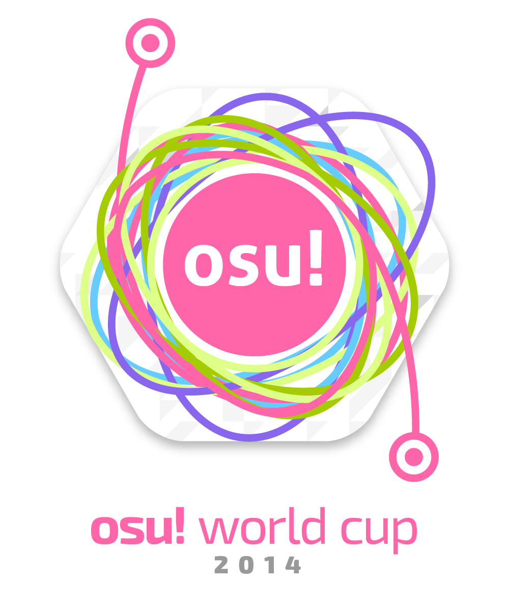
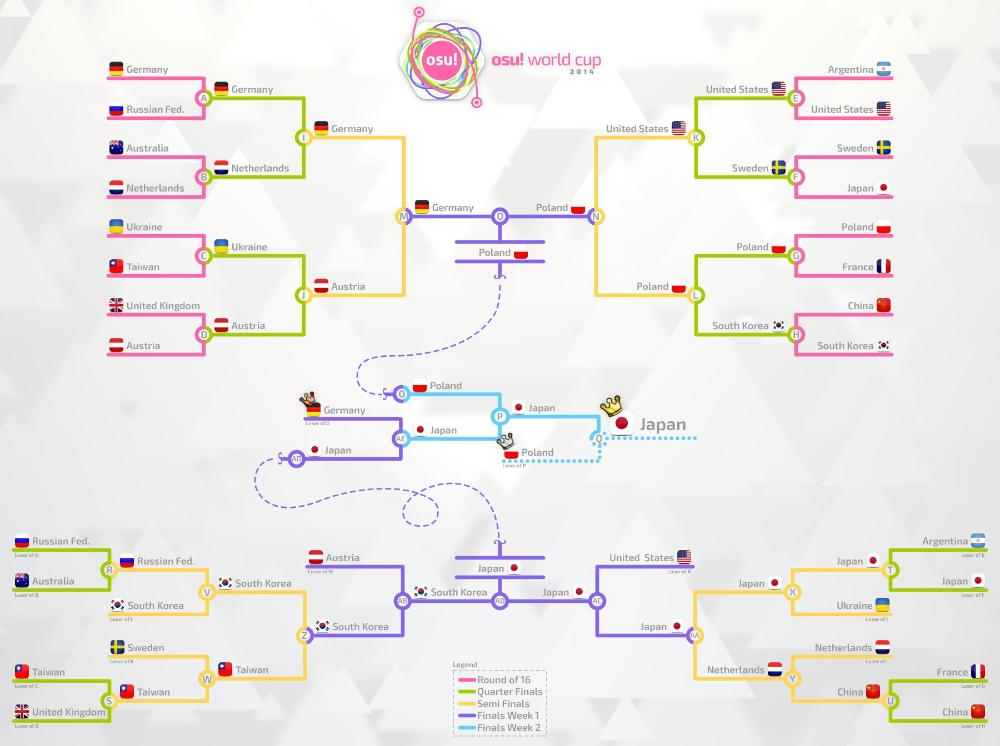

# osu! World Cup 2014

A Copa do Mundo do osu! 2014 (em inglês, osu! World Cup 2014), também conhecida por OWC 2014, é gerida pela [Administração de Torneios](https://osu.ppy.sh/groups/26). É o 5º evento do osu! World Cup. O Atual campeão é a ::{ flag=KR }:: **Coreia do Sul**.

## Calendário do Torneio

| Event | Timestamp |
| :-- | :-- |
| Registration Phase | 02-26 Oct 2014 |
| Live Drawings | 1 Nov 2014 14.00 (UTC+0) |
| Group Stage | 8-9 Nov 2014 |
| Round 16 | 15-16 Nov 2014 |
| Quarter-finals | 22-23 Nov 2014 |
| Semi-finals | 29-30 Nov 2014 |
| Finals - Week 1 | 6-7 Dec 2014 |
| Finals - Week 2 | 13-14 Dec 2014 |

## Premiação

| Placing | Prizes |
| :-- | :-- |
|  | 6 mezes de supporter tag, medalha no perfil, titulo de "osu! Champion", mercadorias de osu! |
|  | 3 mezes de supporter tag |
|  | 1 mez de supporter tag |

## Organização

| Job | Person(s) |
| :-- | :-- |
| Administração do Torneio | ::{ flag=DE }::::Loctav::{ user=71366 } // ::{ flag=DE }::::p3n::{ user=123703 } // ::{ flag=ES }::::Deif::{ user=318565 } |
| Selecionadores de Beatmaps | ::{ flag=NL }::::GladiOol::{ user=23326 } // ::{ flag=KR }::::ToGlette::{ user=1076236 } |
| Streamers | ::{ flag=AU }::::peppy::{ user=2 } // ::{ flag=PL }::::Marcin::{ user=722665 } // ::{ flag=FR }::::shARPII::{ user=776257 } |
| Comentaristas | ::{ flag=GB }::::jesus1412::{ user=230116 } // ::{ flag=FR }::::Mr Color::{ user=116078 } // ::{ flag=GB }::::Raiku::{ user=1525538 } // ::{ flag=US }::::ztrot::{ user=6347 } |
| Estatisticas | ::{ flag=PL }::::Marcin::{ user=722665 } |

## Links

- [osu! World Cup 2014 on Twitch](https://www.twitch.tv/osulive)
- [Registration Form](https://docs.google.com/forms/d/1_muZpv0qYzT0vmBJqhK_os0DWHO8k5TA7-wioKN5mng)
- [Discussion Thread](https://osu.ppy.sh/community/forums/posts/3410198)
- [Mappool Discussion](https://osu.ppy.sh/community/forums/topics/255369/)
- **[Group Stage Statistics](https://owc.nicarim.pw/results/view/3)**

## Participantes

| Country | Grupo A Members |
| :-- | :-- |
| ::{ flag=PT }:: Portugal | **::Osama::{ user=799218 }**, ::Nectarine::{ user=2148013 }, ::PedroLipton::{ user=3272012 }, ::Makkura::{ user=344086 }, ::Snosey::{ user=2515691 }, ::RobotTermite::{ user=2713287 }, ::MrStugzZ::{ user=2594351 } |
| ::{ flag=IT }:: Italy | **::lesslunatic::{ user=1227377 }**, ::Andrea::{ user=33599 }, ::Chewin::{ user=617323 }, ::xiAmME::{ user=1428960 }, ::Nemis::{ user=1635091 }, ::XZ19126::{ user=1656340 }, ::Jordan::{ user=618549 }, ::Puncia::{ user=782633 } |
| ::{ flag=KR }:: South Korea | **::KRZY::{ user=114017 }**, ::MathClass::{ user=2000416 }, ::sayonara-bye::{ user=713266 }, ::K i R i K a R u::{ user=139670 }, ::Gomo Pslvarh::{ user=1206417 }, ::\1 Rachel \1::{ user=2006663 } |
| ::{ flag=DE }:: Germany | **::cptnXn::{ user=495272 }**, ::Dustice::{ user=754565 }, ::BDDav::{ user=1164526 }, ::CookEasy::{ user=453226 }, ::Splinter572::{ user=846038 }, ::Tom94::{ user=1857058 }, ::shunsuke::{ user=2028641 } |

| Country | Grupo B Members |
| :-- | :-- |
| ::{ flag=NZ }:: New Zealand | **::go3001::{ user=735437 }**, ::NekoWins::{ user=3345403 }, ::ivvi::{ user=2494979 }, ::Kysteria::{ user=2997708 }, ::moph::{ user=2233878 }, ::Oukskirts::{ user=2586359 }, ::jiantz::{ user=330252 } |
| ::{ flag=AR }:: Argentina | **::Glazbom::{ user=608277 }**, ::Enhu::{ user=2840499 }, ::benjacala::{ user=1625740 }, ::Fr0th::{ user=3458870 }, ::Graphite Edge::{ user=825712 }, ::Peingod::{ user=2212941 }, ::GaTu::{ user=3583351 } |
| ::{ flag=PH }:: Philippines | **::Jann::{ user=818399 }**, ::-Marika::{ user=2199427 }, ::Takane Enomoto::{ user=1208491 }, ::-Gio::{ user=1795827 }, ::Returnxps::{ user=589462 }, ::Mira-san::{ user=1587999 }, ::Pizzicato::{ user=692610 }, ::HybRidChrome::{ user=2606470 } |
| ::{ flag=AT }:: Austria | **::Omgforz::{ user=578943 }**, ::WhitePhoenixLP::{ user=1426098 }, ::Alumetorz::{ user=1145984 }, ::Elscar::{ user=2253511 }, ::Hakkero::{ user=177913 }, ::BlueFlameZ::{ user=3506191 }, ::Jin\1Back7::{ user=1238524 } |

| Country | Grupo C Members |
| :-- | :-- |
| ::{ flag=ID }:: Indonesia | **::Subaru Takamaru::{ user=1762922 }**, ::mamstein::{ user=3035210 }, ::Mood Breaker::{ user=692065 }, ::Ryuvos::{ user=2020531 }, ::Sweetie Belle::{ user=2291870 }, ::Gatyaa420::{ user=984132 }, ::C00LZ::{ user=1128514 }, ::reborn513::{ user=1577554 } |
| ::{ flag=CL }:: Chile | **::Nicokarl::{ user=1600281 }**, ::Neab::{ user=916693 }, ::kafaN::{ user=1489743 }, ::Cristian::{ user=194345 }, ::Rintsunayoshi::{ user=1379717 } |
| ::{ flag=FR }:: France | **::Soinou::{ user=1664519 }**, ::Kynan::{ user=1093361 }, ::Musty::{ user=251683 }, ::NerO::{ user=1545031 }, ::Shiro::{ user=113005 }, ::shARPII::{ user=776257 }, ::Syfou::{ user=1572956 }, ::My Not::{ user=1572405 } |
| ::{ flag=AU }:: Australia | **::Bauxe::{ user=1881685 }**, ::Melt3dCheeze::{ user=634837 }, ::gimly32::{ user=3448993 }, ::FluxVanes::{ user=655267 }, ::uyghti::{ user=3641404 }, ::Happyjon::{ user=5543 }, ::Rivastyx::{ user=2719307 }, ::Jaybladezz::{ user=3725492 } |

| Country | Grupo D Members |
| :-- | :-- |
| ::{ flag=MX }:: Mexico | **::El Koko::{ user=2352419 }**, ::Broodich::{ user=2484629 }, ::\1 AeonLust \1::{ user=2353490 }, ::MomoXv::{ user=1207955 }, ::sumaru100::{ user=1872256 }, ::\1Chrono\1::{ user=2308331 }, ::-Alberto-::{ user=2658465 } |
| ::{ flag=UA }:: Ukraine | **::Aka::{ user=1307553 }**, ::Granje::{ user=496387 }, ::-ReimuHakurei-::{ user=1163931 }, ::BloodM0nk::{ user=2174403 }, ::rockleejkooo::{ user=384003 }, ::blednak::{ user=912627 } |
| ::{ flag=BR }:: Brazil | **::Blue Dragon::{ user=19048 }**, ::Shott::{ user=965354 }, ::ALust::{ user=1558603 }, ::momoyo-san::{ user=2038069 }, ::sunosz::{ user=3007342 }, ::Froke::{ user=602913 }, ::fabriciorby::{ user=209664 } |
| ::{ flag=JP }:: Japan | **::Mercurius::{ user=589550 }**, ::rrtyui::{ user=352328 }, ::Poruteri::{ user=1379576 }, ::Potofu::{ user=657404 }, ::Sinch::{ user=360552 }, ::serea::{ user=371961 }, ::Guy::{ user=91738 } |

| Country | Grupo E Members |
| :-- | :-- |
| ::{ flag=LT }:: Lithuania | **::QonQuest::{ user=988503 }**, ::Painsinger::{ user=697843 }, ::Kyouma::{ user=2070247 }, ::Zinkon::{ user=85043 }, ::Mazzerin::{ user=2942381 }, ::Strategas::{ user=2971837 } |
| ::{ flag=NO }:: Norway | **::-GN::{ user=895581 }**, ::Liqh::{ user=3409838 }, ::Princess Zoom::{ user=1593758 }, ::PcBoy111::{ user=2916414 }, ::KinomiCandy::{ user=375143 }, ::kossc::{ user=2363849 }, ::CXu::{ user=84841 }, ::Tobi::{ user=2970667 } |
| ::{ flag=SE }:: Sweden | **::Xytox::{ user=2229274 }**, ::Gnuu::{ user=914004 }, ::Physalis::{ user=2188481 }, ::Slizzer::{ user=809983 }, ::Vanillaire::{ user=2359549 }, ::l1mi::{ user=973172 }, ::Kotayo::{ user=1730025 } |
| ::{ flag=TW }:: Taiwan | **::onlyforyou::{ user=597858 }**, ::dabanlong::{ user=624254 }, ::Small K::{ user=952751 }, ::BA\1KA\1YA\1RO U::{ user=1483659 }, ::mookss1231::{ user=1483371 }, ::Saya-Eternal::{ user=2865291 } |

| Country | Grupo F Members |
| :-- | :-- |
| ::{ flag=HK }:: Hong Kong | **::- G I D Z -::{ user=2286528 }**, ::Ming3012::{ user=1583218 }, ::Chaoslitz::{ user=3621552 }, ::Yakumo Yukarin::{ user=562623 } |
| ::{ flag=CA }:: Canada | **::Azer::{ user=2155578 }**, ::TrickMirror::{ user=2138739 }, ::RamenOtaku::{ user=980956 }, ::Kairi::{ user=1586237 }, ::FreeSongs::{ user=2116792 }, ::Gyutto::{ user=2701210 }, ::Shiro-::{ user=2170128 }, ::- \1 U z z I \1 -::{ user=1928230 } |
| ::{ flag=NL }:: Netherlands | **::BiG\1ChilD::{ user=596196 }**, ::HappyStick::{ user=256802 }, ::jackylam5::{ user=1540807 }, ::Kyshiro::{ user=640611 }, ::Synchrostar::{ user=419705 }, ::taku::{ user=684433 }, ::R3laX3R::{ user=819689 }, ::Damnjelly::{ user=1666355 } |
| ::{ flag=PL }:: Poland | **::fartownik::{ user=56917 }**, ::WubWoofWolf::{ user=39828 }, ::r0ck::{ user=1549620 }, ::Wilchq::{ user=2021758 }, ::AmaiHachimitsu::{ user=844815 }, ::listless::{ user=1106527 }, ::SteRRuM::{ user=42585 } |

| Country | Grupo G Members |
| :-- | :-- |
| ::{ flag=SG }:: Singapore | **::Plaatinum::{ user=3385566 }**, ::Nakano-::{ user=1893953 }, ::Alacartx::{ user=1959767 }, ::GSBlank::{ user=2312106 }, ::phox::{ user=772295 }, ::lameomaster2::{ user=1843447 }, ::rtyzen::{ user=2439822 } |
| ::{ flag=FI }:: Finland | **::Subbie::{ user=1590138 }**, ::Kirei::{ user=3250863 }, ::Arcley::{ user=1916349 }, ::Villani::{ user=1979316 }, ::Isokasapupuja::{ user=1770462 }, ::Jantsi::{ user=1644225 }, ::Urp::{ user=1534396 }, ::kumig::{ user=3298140 } |
| ::{ flag=GB }:: United Kingdom | **::jesus1412::{ user=230116 }**, ::Doomsday::{ user=18983 }, ::Raiku::{ user=1525538 }, ::lovu::{ user=846235 }, ::PortalLife::{ user=929134 }, ::bahamete::{ user=960620 }, ::Kardet::{ user=1438509 }, ::Jameslike::{ user=2415743 } |
| ::{ flag=US }:: United States | **::pooptartsonas::{ user=1334453 }**, ::Kaoru::{ user=492699 }, ::kittehcommando::{ user=2162669 }, ::pielak::{ user=310455 }, ::Xilver15::{ user=3099689 }, ::SapphireGhost::{ user=388602 }, ::Horo::{ user=992439 }, ::-Soba-::{ user=663657 } |

| Country | Grupo H Members |
| :-- | :-- |
| ::{ flag=DK }:: Denmark | **::TimG::{ user=1879963 }**, ::TraxieChan::{ user=455552 }, ::Cerkie::{ user=2533400 }, ::DipG::{ user=2983311 }, ::Tonarinototoro::{ user=2678812 }, ::Fuccho::{ user=3053382 }, ::Tropians::{ user=2536611 }, ::Kazutakee::{ user=2637514 } |
| ::{ flag=MY }:: Malaysia | **::Gon::{ user=583765 }**, ::xsrsbsns::{ user=414427 }, ::caleb123456::{ user=2205376 }, ::ExPew::{ user=665612 }, ::TequilaWolf::{ user=3633477 }, ::NazzzF::{ user=2676512 }, ::ffstar0716::{ user=1163205 }, ::Rumia-::{ user=1787171 } |
| ::{ flag=RU }:: Russian Federation | **::cr1m::{ user=803766 }**, ::talala::{ user=1389663 }, ::Shiawase::{ user=989489 }, ::anticlone111::{ user=1950600 }, ::Kert::{ user=119933 }, ::KoTo::{ user=1382805 }, ::Hidari Handoru::{ user=1056329 }, ::Pyroboom::{ user=689882 } |
| ::{ flag=CN }:: China | **::Prophet::{ user=651307 }**, ::Dsan::{ user=1266166 }, ::N a n o::{ user=694114 }, ::Del soon Bye::{ user=629717 }, ::Rebellion::{ user=2896273 }, ::SpringLane::{ user=1343504 }, ::Spring Roll::{ user=2499198 }, ::wobeinimacao::{ user=350723 } |

## Lista de Beatmaps

### Quartas de final

**[Clique aqui para baixar o pack!](https://www.mediafire.com/download/gh0da1ahgxiogka/OWC_Quarter_Finals.rar)**

- NoMod
  1. [Himeringo - Yotsuya-san ni Yoroshiku (RLC) \[Winber1's Extreme\]](https://osu.ppy.sh/beatmapsets/100049#osu/378781)
  2. [Dark PHOENiX - Hiroari Shoots a Strange Bird (sjoy) \[Extra\]](https://osu.ppy.sh/beatmapsets/126354#osu/321559)
  3. [daisan - -+ (RikiH\_) \[Extra\]](https://osu.ppy.sh/beatmapsets/135094#osu/338544)
  4. [Rohi - Kanata ni Mau wa Sakura no Shirabe (NatsumeRin) \[Extra\]](https://osu.ppy.sh/beatmapsets/93555#osu/252290)
  5. [Hatsune Miku - Homework Crisis (val0108) \[Let's Jump!!\]](https://osu.ppy.sh/beatmapsets/33068#osu/108021)
  6. [Glamour of the Kill - A Hope in Hell (ykcarrot) \[Hopeless\]](https://osu.ppy.sh/beatmapsets/31814#osu/104389)
- Hidden
  1. [HitoshizukuP x Yama - Crazy nighT (Sephibro) \[Crazy\]](https://osu.ppy.sh/beatmapsets/109401#osu/285549)
  2. [Renard - Smoke Tower (Priti) \[Trauma\]](https://osu.ppy.sh/beatmapsets/135596#osu/339640)
  3. [Cres - End Time (Kyshiro) \[Extra\]](https://osu.ppy.sh/beatmapsets/140691#osu/432839)
- HardRock
  1. [Yooh - Shanghai Kouchakan ~ Chinese Tea Orchid Remix (Gamu) \[INFINITE\]](https://osu.ppy.sh/beatmapsets/184498#osu/486619)
  2. [Sariyajin - Ao no Senritsu (smallboat) \[Extra\]](https://osu.ppy.sh/beatmapsets/124500#osu/317327)
  3. [Omoi - Nee William (Yales) \[Extra\]](https://osu.ppy.sh/beatmapsets/164155#osu/399756)
- DoubleTime
  1. [Kozato - Tsuki -Yue- (jonathanlfj) \[Another\]](https://osu.ppy.sh/beatmapsets/101123#osu/268080)
  2. [Elvenking - The Winter Wake (Snepif) \[AlrdyExists' Blizzard\]](https://osu.ppy.sh/beatmapsets/32499#osu/107747)
  3. [Mitchie M - Viva Happy (Natsu) \[Insane\]](https://osu.ppy.sh/beatmapsets/120002#osu/317917)
- FreeMod
  1. [Maduk ft. Veela - Ghost Assassin (Hourglass Bonusmix) (alacat) \[Lumiere\]](https://osu.ppy.sh/beatmapsets/198820#osu/471598)
  2. [8284 vs wa. - Adularescence (Cherry Blossom) \[Extra\]](https://osu.ppy.sh/beatmapsets/119438#osu/306669)
  3. [yuikonnu - Hatsukoi no Ehon (litoluna) \[Insane\]](https://osu.ppy.sh/beatmapsets/110870#osu/288660)
- Tiebreaker
  1. **[Halozy - Kanshou no Matenrou (captin1) \[Eternal\]](https://osu.ppy.sh/beatmapsets/179699#osu/431957)**

### Oitavas de final

**[Clique aqui para baixar o pack!](https://www.mediafire.com/download/eav4oeg33eax8w9/OWC_Round_of_16.rar)**

- NoMod
  1. [yuikonnu - Kakushigoto (jonathanlfj) \[Insane\]](https://osu.ppy.sh/beatmapsets/122605#osu/315260)
  2. [Renard - Da Nu Nuttah (GamerX4life) \[Nogard\]](https://osu.ppy.sh/beatmapsets/62665#osu/205282)
  3. [Qrispy Joybox - snow prism (ktgster) \[Extreme\]](https://osu.ppy.sh/beatmapsets/132389#osu/332962)
  4. [Foreground Eclipse - I Bet You'll Forget That Even If You Noticed That (rEdo) \[Lunatic\]](https://osu.ppy.sh/beatmapsets/146805#osu/363662)
  5. [Lon - MATRYOSHKA (EvilElvis) \[Extra\]](https://osu.ppy.sh/beatmapsets/109185#osu/285086)
  6. [HujuniseikouyuuP - Sayonara Lechenaultia (qq944364487) \[Lechenaultia\]](https://osu.ppy.sh/beatmapsets/65747#osu/192320)
- Hidden
  1. [Kozato snow - Izayoi Sakura (Melt) \[Insane\]](https://osu.ppy.sh/beatmapsets/162371#osu/396105)
  2. [Megpoid GUMI & Kagamine Rin - Invisible (NatsumeRin) \[Rin\]](https://osu.ppy.sh/beatmapsets/45160#osu/143036)
  3. [Zeami - Music Revolver (KanaRin) \[Kana\]](https://osu.ppy.sh/beatmapsets/53231#osu/162363)
- HardRock
  1. [MOMOIRO CLOVER Z - SARABA ITOSHIKI KANASHIMI TACHIYO (Sellenite) \[Master\]](https://osu.ppy.sh/beatmapsets/215977#osu/507098)
  2. [Hatsune Miku - Hiatus (wcx19911123) \[Insane\]](https://osu.ppy.sh/beatmapsets/32046#osu/105003)
  3. [P\*Light - Poppin' Shower (Reisen Udongein) \[Another\]](https://osu.ppy.sh/beatmapsets/42527#osu/133723)
- DoubleTime
  1. [KOTOKO - unfinished (Pokie) \[Acceleration\]](https://osu.ppy.sh/beatmapsets/51132#osu/156904)
  2. [Nanamori-chu \* Goraku-bu - Precious Friends (Setz206) \[Insane\]](https://osu.ppy.sh/beatmapsets/173956#osu/420131)
  3. [Matchbox Twenty - How Far We've Come (Sushi) \[Insane\]](https://osu.ppy.sh/beatmapsets/31014#osu/104117)
- FreeMod
  1. [Blackhole - Lagomorphic (happy623) \[Lagomorph\]](https://osu.ppy.sh/beatmapsets/74664#osu/211889)
  2. [Memme - NEW Astronomas (Charles445) \[Extra\]](https://osu.ppy.sh/beatmapsets/87188#osu/238265)
  3. [Hatsune Miku - Dance of many (LKs) \[Dance\]](https://osu.ppy.sh/beatmapsets/45028#osu/140805)
- Tiebreaker
  1. **[Dark PHOENiX - The Primal Scene of Japan the Girl Saw (sjoy) \[Extra\]](https://osu.ppy.sh/beatmapsets/121635#osu/311573)**

### Fase de Grupos

**[Clique aqui para baixar o pack!](https://www.mediafire.com/download/p2fxdt67qlsakn3/OWC_Group_Stage.rar)**

- NoMod
  1. [Toyosaki Aki - MORE&MORE (Fycho) \[Insane\]](https://osu.ppy.sh/beatmapsets/125303#osu/318975)
  2. [Last Note. - Caramel Heaven (Snepif) \[Heaven\]](https://osu.ppy.sh/beatmapsets/90095#osu/244691)
  3. [nano - Nevereverland (Nyquill) \[Insane\]](https://osu.ppy.sh/beatmapsets/95533#osu/256499)
  4. [marina - Towa yori Towa ni (Garven) \[Kite's Insane\]](https://osu.ppy.sh/beatmapsets/143370#osu/376558)
  5. [Jeff Williams - Red Like Roses (feat. Casey Lee Williams) (Flower) \[Ruby\]](https://osu.ppy.sh/beatmapsets/90128#osu/244781)
  6. [Comp - Touchuu Aika (Mao) \[Maolvis' Lunatic\]](https://osu.ppy.sh/beatmapsets/198700#osu/471369)
- Hidden
  1. [Nero's Day At Disneyland - No Money Down, Low Monthly Payments (grumd) \[Insane\]](https://osu.ppy.sh/beatmapsets/111825#osu/290733)
  2. [capitaro - Yoiduki Maiuta (Amamiya Yuko) \[Insane\]](https://osu.ppy.sh/beatmapsets/70057#osu/201601)
  3. [Megpoid GUMI - Shinkaron -code:variant- (NatsumeRin) \[Rin\]](https://osu.ppy.sh/beatmapsets/29445#osu/99465)
- HardRock
  1. [Souei Academy Light Music Club starring i.o - Sekai de Hitotsu no Takaramono (cRyo\[iceeicee\]) \[Insane\]](https://osu.ppy.sh/beatmapsets/52048#osu/159316)
  2. [Aki - Wanna Be My Dream (Lortus) \[Insane\]](https://osu.ppy.sh/beatmapsets/128432#osu/325209)
  3. [ginkiha - EOS (alacat) \[RLC's Another\]](https://osu.ppy.sh/beatmapsets/151720#osu/421532)
- DoubleTime
  1. [Kuba Oms - My Love (W h i t e) \[Insane\]](https://osu.ppy.sh/beatmapsets/163112#osu/397535)
  2. [yanaginagi - Vidro Moyou (Moway) \[Insane\]](https://osu.ppy.sh/beatmapsets/120513#osu/308908)
  3. [FELT - Sky Gate (Frostmourne) \[Lunatic\]](https://osu.ppy.sh/beatmapsets/129534#osu/327256)
- FreeMod
  1. [Nekomata Master+ - squall (Rue) \[Insane\]](https://osu.ppy.sh/beatmapsets/66224#osu/238938)
  2. [Knife Party - Bonfire (inverness) \[Rage\]](https://osu.ppy.sh/beatmapsets/73576#osu/281918)
  3. [Sana - Terekakushi Shishunki (litoluna) \[Insane\]](https://osu.ppy.sh/beatmapsets/202677#osu/479354)
- Tiebreaker
  1. **[Okui Masami - God Speed (ykcarrot) \[Insane\]](https://osu.ppy.sh/beatmapsets/28140#osu/93947)**

## Resultado das Partidas

### Oitavas de final

**Sunday, 16\. November 2014**

| Team A | Score | Team B | History |
| :-- | :-: | --: | :-- |
| ::{ flag=CN }:: China | 2 - **5** | **South Korea** ::{ flag=KR }:: | [#1](https://osu.ppy.sh/community/matches/10507941) |
| ::{ flag=AU }:: Australia | 2 - **5** | **Netherlands** ::{ flag=NL }:: | [#1](https://osu.ppy.sh/community/matches/10508932) |
| ::{ flag=UA }:: **Ukraine** | **5** - 1 | Taiwan ::{ flag=TW }:: | [#1](https://osu.ppy.sh/community/matches/10509978) |
| ::{ flag=SE }:: **Sweden** | **5** - 3 | Japan ::{ flag=JP }:: | [#1](https://osu.ppy.sh/community/matches/10510938) |
| ::{ flag=PL }:: **Poland** | **5** - 1 | France ::{ flag=FR }:: | [#1](https://osu.ppy.sh/community/matches/10517306) |
| ::{ flag=DE }:: **Germany** | **5** - 3 | Russian Federation ::{ flag=RU }:: | [#1](https://osu.ppy.sh/community/matches/10518861) |
| ::{ flag=GB }:: United Kingdom | 2 - **5** | **Austria** ::{ flag=AT }:: | [#1](https://osu.ppy.sh/community/matches/10520060) |
| ::{ flag=AR }:: Argentina | 2 - **5** | **United States** ::{ flag=US }:: | [#1](https://osu.ppy.sh/community/matches/10521646) |

### Fase de Grupos

**Sunday, 9\. November 2014**

| Team A | Score | Team B | History |
| :-- | :-: | --: | :-- |
| ::{ flag=NO }:: Norway | 1 - **4** | **Taiwan** ::{ flag=TW }:: | [#1](https://osu.ppy.sh/community/matches/10348348) |
| ::{ flag=NZ }:: New Zealand | 0 - **4** | **Austria** ::{ flag=AT }:: | [#1](https://osu.ppy.sh/community/matches/10348353) |
| ::{ flag=ID }:: Indonesia | 2 - **4** | **France** ::{ flag=FR }:: | [#1](https://osu.ppy.sh/community/matches/10348356) |
| ::{ flag=KR }:: South Korea | 3 - **4** | **Germany** ::{ flag=DE }:: | [#1](https://osu.ppy.sh/community/matches/10349347) |
| ::{ flag=BR }:: Brazil | 0 - **4** | **Japan** ::{ flag=JP }:: | [#1](https://osu.ppy.sh/community/matches/10349350) |
| ::{ flag=FR }:: **France** | **4** - 0 | Australia ::{ flag=AU }:: | [#1](https://osu.ppy.sh/community/matches/10350503) |
| ::{ flag=SG }:: Singapore | 0 - **4** | **United Kingdom** ::{ flag=GB }:: | [#1](https://osu.ppy.sh/community/matches/10350506) |
| ::{ flag=LT }:: Lithuania | 2 - **4** | **Sweden** ::{ flag=SE }:: | [#1](https://osu.ppy.sh/community/matches/10350508) |
| ::{ flag=MY }:: Malaysia | 2 - **4** | **Russian Federation** ::{ flag=RU }:: | [#1](https://osu.ppy.sh/community/matches/10350512) |
| ::{ flag=PT }:: Portugal | 0 - **4** | **Germany** ::{ flag=DE }:: | [#1](https://osu.ppy.sh/community/matches/10352331) |
| ::{ flag=IT }:: Italy | 2 - **4** | **South Korea** ::{ flag=KR }:: | [#1](https://osu.ppy.sh/community/matches/10352168) |
| ::{ flag=UA }:: Ukraine | 1 - **4** | **Japan** ::{ flag=JP }:: | [#1](https://osu.ppy.sh/community/matches/10352111) |
| ::{ flag=PH }:: Philippines | 0 - **4** | **Austria** ::{ flag=AT }:: | [#1](https://osu.ppy.sh/community/matches/10352118) |
| ::{ flag=SE }:: Sweden | 1 - **4** | **Taiwan** ::{ flag=TW }:: | [#1](https://osu.ppy.sh/community/matches/10353334) |
| ::{ flag=ID }:: **Indonesia** | **4** - 0 | Chile ::{ flag=CL }:: | Win by default |
| ::{ flag=DK }:: Denmark | 1 - **4** | **China** ::{ flag=CN }:: | [#1](https://osu.ppy.sh/community/matches/10353345) |
| ::{ flag=NL }:: **Netherlands** | **4** - 2 | Poland ::{ flag=PL }:: | [#1](https://osu.ppy.sh/community/matches/10353347) |
| ::{ flag=MX }:: Mexico | 2 - **4** | **Ukraine** ::{ flag=UA }:: | [#1](https://osu.ppy.sh/community/matches/10355079) |
| ::{ flag=HK }:: Hong Kong | 3 - **4** | **Canada** ::{ flag=CA }:: | [#1](https://osu.ppy.sh/community/matches/10355083) |
| ::{ flag=SG }:: Singapore | 1 - **4** | **United States** ::{ flag=US }:: | [#1](https://osu.ppy.sh/community/matches/10355087) |

## Regras

### Regras Gerais do Torneio

1. A Copa do Mundo do osu! é um torneio com confrontos 4 vs 4 jogadores, sendo um time de cada país.
2. Os beatmaps para cada rodada serão anunciados pelos selecionadores de Beatmaps com uma semana de antecedência. Apenas esses beatmaps poderão ser utilizados durante as suas respectivas partidas.
   - Um beatmap será usado como tiebreaker, que será apenas jogado em caso de empate.
   - Existirão subgrupos de mapas a serem jogados exclusivamente com [Hidden](/wiki/Gameplay/Game_modifier/Hidden), [HardRock](/wiki/Gameplay/Game_modifier/Hard_Rock), [DoubleTime](/wiki/Gameplay/Game_modifier/Double_Time) e FreeMod.
3. O agendamento das partidas será proposto pela Administração do Torneio (veja abaixo).
4. Se não houver nenhum membro da administração ou algum árbitro disponível no momento, a partida será remarcada.
5. A pontuação dos jogadores que falharam e reviveram será contada.
6. O uso das [Visual Settings](/wiki/Client/Interface/Visual_settings) será permitido.
7. Em caso de empate na pontuação, o beatmap jogado será anulado.
8. Se um dos jogadores desconectar no meio da partida, o beatmap jogado será anulado. Isso poderá acontecer até duas vezes. Depois de duas tentativas, os jogadores que desconectarem serão tratados como se tivessem saído propositalmente, e sua pontuação não será contada.
9. Beatmaps não podem ser re-utilizados na mesma partida, a não ser que o beatmap tenha sido anulado por questões de falha na conexão.
   - Se o servidor estiver instável demais para a realização da partida, a Administração do Torneio remarcará a partida.
10. Se menos de 4 jogadores de um time aparecerem na hora da partida, o tempo máximo de espera é de 20 minutos.
11. A substituição de jogadores durante uma partida é permitida.
    - Só será possível substituir um jogador por beatmap.
12. Lag não é um motivo para a anulação de um beatmap.
13. Na fase de grupos, um 'WO' será considerado como uma vitória por 4 a 0, com uma razão de diferença de pontuação de +2.5.
14. Incidentes inesperados serão devidamente controlados pelos árbitros. A decisão de um árbitro pode ser anulada pela Administração do Torneio.
15. Qualquer modificação nestas regras será anunciada.

### Inscrição do Torneio

1. Sua equipe precisa de **pelo menos 4 jogadores** para participar.
   1. O tamanho máximo de uma equipe é 8 jogadores.
   2. Você deverá especificar um capitão para representar a equipe.
2. Cada equipe representa uma nação. Você deverá formar uma equipe com jogadores do mesmo país.
3. Para inscrição de equipes,[preencha este formulário](https://docs.google.com/forms/d/1v27B1GxpapUgsI9dtBF8xLceJCKzdpBY8dW6HzxzacI/viewform). Então, verifique sua inscrição [enviando uma PM para o Loctav](https://osu.ppy.sh/home/messages/users/71366) entitulada “OWC Registration”
   - Capitães podem mudar o esquema do time [avisando a Administração](https://osu.ppy.sh/home/messages/users/71366).
4. Qualquer inscrição de mudança será checada pela Administração do Torneio antes de ser aceita e adicionada à lista de participantes.
5. O número de equipes será de 32. Quem chegar primeiro, fica com a vaga.
6. Selecionadores de mapas não poderão jogar no torneio.

### Instruções de Estágios

1. Na primeira fase (Fase de Grupos), as equipes serão divididas em 8 grupos de 4 equipes.
2. Todos os times de cada grupo se enfrentarão.
3. A classificação de cada grupo será determinada pelos resultados das partidas, levando em conta a seguinte prioridade:
   1. Maior número de vitórias.
   2. Maior número de `{(beatmaps vencidos) - (beatmaps perdidos)}`.
   3. Maior número de beatmaps vencidos.
   4. Maior número de `∑{(diferença total de pontuação) / (pontuação máxima)}`.
   5. Vencedor de uma revanche.
4. As duas equipes com a melhor performance de cada grupo serão classificadas para os mata-matas.
5. Os estágios seguintes serão mata-matas, ou seja, o vencedor se classifica para o próximo estágio, e o perdedor será eliminado do torneio.
6. **Condições de vitória:**
   - Na fase de grupos, você precisa vencer 4 beatmaps para ganhar uma partida. (Melhor de 7)
   - Nas oitavas e quartas de final, você precisa vencer 5 beatmaps para ganhar uma partida. (Melhor de 9)
   - Nas semi-finais e finais, você precisa vencer 6 mapas para ganhar uma partida. (Melhor de 11)

### Instruções de Partida

1. Um árbitro criará uma partida de multiplayer 30 minutos antes do jogo. Os jogadores deverão se reunir na sala durante esse período.
   1. A sala será devidamente fechada com senha. A senha e o convite para participar serão enviados aos capitães o mais rápido possível.
   2. As configurações de sala serão osu!, Team-Vs, Condição de Vitória: 'Score'. O nome da sala deverá ser "osu! World Cup 2013: EquipeAzul vs. EquipeVermelha"
   3. A equipe mencionada primeiramente no nome da sala será a equipe azul, a equipe mencionada posteriormente será a equipe vermelha.
2. O árbitro entrará na sala externamente. O árbitro irá assistir a partida por meio de um client especial para multi-spectating.
3. Os jogadores estarão livres para escolher um beatmap de aquecimento.
4. A seleção de mapas será alternada entre cada capitão escolhendo um beatmap por vez. Os capitães deverão usar o comando `!roll` no `#multiplayer` para determinar qual a equipe que escolherá primeiro.
   1. Os capitães poderão escolher beatmaps do grupo NoMod livremente.
   2. A escolha de beatmaps nos subgrupos específicos de mods será limitada. Cada capitão poderá escolher apenas um mapa de cada subgrupo de mods.
   3. Em caso de empate na partida, o tiebraker deverá ser jogado para desempate.
   4. Os capitães deverão falar o mapa escolhido para o árbitro via PM.
5. Cada capitão deverá salvar o resultado das partidas com um screenshot. Os árbitros lembrarão os capitães de fazer isso.
6. Os resultados serão publicados pelo documento de estatísticas.

### Instruções dos Grupos de Beatmaps

1. Existirá um grupo de beatmaps para a Fase de Grupos, um grupo para as Oitavas de Final, um grupo para as Quartas de final, um grupo para as Semi-finais e um grupo para as Finais.
2. Cada grupo de beatmaps consiste de 5 subgrupos: NoMod, [Hidden](/wiki/Gameplay/Game_modifier/Hidden), [HardRock](/wiki/Gameplay/Game_modifier/Hard_Rock), [DoubleTime](/wiki/Gameplay/Game_modifier/Double_Time) e FreeMod
3. Cada grupo de beatmaps consiste de 23 beatmaps no total.
4. Cada grupo de beatmaps terá um tiebreaker.
5. O subgrupo NoMod será jogado sem nenhum mod específico.
6. Os subgrupos Hidden, HardRock e DoubleTime serão jogados com os mods respectivos ativados.
7. O subgrupo FreeMod terá o FreeMod ativado. Cada jogador poderá escolher, individualmente: Hidden, HardRock, Flashlight, ou nenhum mod. Os jogadores poderão selecionar mais de um mod.
8. O tiebreaker será jogado sob condições de FreeMod.
9. O tamanho do subgrupo Nomod será de:
   - 10 na Fase de Grupos
   - 6 nos mata-matas
10. O tamanho dos subgrupos de mods específicos serão de:
    - 3 na Fase de Grupos
    - 4 nos mata-matas

### Instruções de Agendamento

1. Cada estágio será realizado em **apenas um fim de semana** (dirija-se ao Calendário do Torneio, no topo, para mais informações)
2. Na Fase de Grupos, as primeiras partidas serão realizadas na sexta-feira (8 de Novembro), a segunda no sábado (9 de Novembro), e a terceira no domingo (10 de Novembro).
   - As partidas na Fase de Grupos de diferentes times poderão ser realizadas ao mesmo tempo.
3. Todas as partidas dos mata-matas serão realizadas ou no sábado, ou no domingo.
4. O agendamento será realizado pela Administração do Torneio. As programações serão publicadas no Domingo anterior às primeiras partidas da próxima fase. A administração do torneio tentará criar a programação de acordo com os fusos horários correspondentes a cada país.
5. Os capitães serão responsáveis pela disponibilidade de suas equipes. O tamanho das equipes, de 4 reservas, garante que cada equipe possa providenciar pelo menos quatro jogadores em cada partida. Se as equipes não conseguirem providenciar esses quatro jogadores, a partida será considerada perdida.
