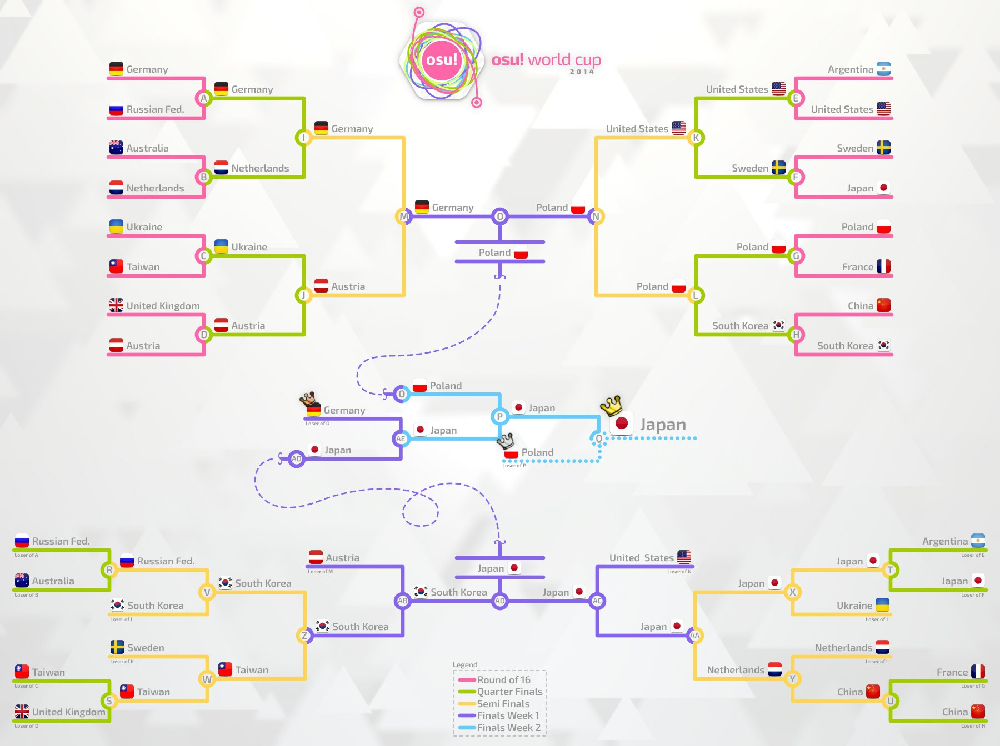

---
tags:
  - OWC 2014
  - OWC2014
  - 世界杯
---

# osu! 世界杯 2014

**osu! 世界杯 2014** (***OWC 2014***) 是由 [osu! 团队](/wiki/People/osu!_team)举办的，基于国家/地区的 osu! 锦标赛。本届 osu! 世界杯是第五届。

## 赛程

| 阶段 | 时间 |
| --: | :-- |
| 报名 | 2014-10-02/2014-10-26 |
| 直播抽签 | 2014-11-01 (14:00 UTC) |
| 小组赛 | 2014-11-08/2014-11-09 |
| 十六强赛 | 2014-11-16 |
| 四分之一决赛 | 2014-11-22/2014-11-23 |
| 半决赛 | 2014-11-29/2014-11-30 |
| 决赛第一周 | 2014-12-06 |
| 决赛第二周 | 2014-12-13 |

## 奖品

| 名次 | 奖品 |
| :-: | :-- |
|  | 6 个月的 osu!supporter、个人主页徽章、“osu! Champion”用户头衔、osu! 周边 |
|  | 3 个月的 osu!supporter、个人主页徽章 |
|  | 1 个月的 osu!supporter、个人主页徽章 |

  

## 组织

osu! 世界杯 2014 由众多社区成员举办。

| 职位 | 成员 |
| :-- | :-- |
| 比赛管理 | ::{ flag=ES }:: [Deif](https://osu.ppy.sh/users/318565), ::{ flag=DE }:: [Loctav](https://osu.ppy.sh/users/71366), ::{ flag=DE }:: [p3n](https://osu.ppy.sh/users/123703) |
| 选图 | ::{ flag=NL }:: [GladiOol](https://osu.ppy.sh/users/23326), ::{ flag=KR }:: [ToGlette](https://osu.ppy.sh/users/1076236) |
| 直播 | ::{ flag=PL }:: [Marcin](https://osu.ppy.sh/users/722665), ::{ flag=AU }:: [peppy](https://osu.ppy.sh/users/2), ::{ flag=FR }:: [shARPII](https://osu.ppy.sh/users/776257) |
| 解说 | ::{ flag=GB }:: [jesus1412](https://osu.ppy.sh/users/230116), ::{ flag=FR }::[Mr Color](https://osu.ppy.sh/users/116078), ::{ flag=GB }:: [Raiku](https://osu.ppy.sh/users/1525538), ::{ flag=US }:: [ztrot](https://osu.ppy.sh/users/6347) |
| 统计 | ::{ flag=PL }:: [Marcin](https://osu.ppy.sh/users/722665) |

## 链接

- [讨论帖](https://osu.ppy.sh/community/forums/posts/3410198)
- [直播](https://www.twitch.tv/osulive)
- **[统计表](https://owc.nicarim.pw/results/view/3)**

## 参赛者

|  | 国家/地区 | 选手 |
| :-: | :-: | :-- |
| ::{ flag=AR }:: | 阿根廷 | **[Glazbom](https://osu.ppy.sh/users/608277)**, [benjacala](https://osu.ppy.sh/users/1625740), [Enhu](https://osu.ppy.sh/users/2840499), [Fr0th](https://osu.ppy.sh/users/3458870), [GaTu](https://osu.ppy.sh/users/3583351), [Graphite Edge](https://osu.ppy.sh/users/825712), [Peingod](https://osu.ppy.sh/users/2212941) |
| ::{ flag=AU }:: | 澳大利亚 | **[Bauxe](https://osu.ppy.sh/users/1881685)**, [FluxVanes](https://osu.ppy.sh/users/655267), [gimly32](https://osu.ppy.sh/users/3448993), [Happyjon](https://osu.ppy.sh/users/5543), [Jaybladezz](https://osu.ppy.sh/users/3725492), [Melt3dCheeze](https://osu.ppy.sh/users/634837), [Rivastyx](https://osu.ppy.sh/users/2719307), [uyghti](https://osu.ppy.sh/users/3641404) |
| ::{ flag=AT }:: | 奥地利 | **[Omgforz](https://osu.ppy.sh/users/578943)**, [Alumetorz](https://osu.ppy.sh/users/1145984), [BlueFlameZ](https://osu.ppy.sh/users/3506191), [Elscar](https://osu.ppy.sh/users/2253511), [Hakkero](https://osu.ppy.sh/users/177913), [Jin\_Back7](https://osu.ppy.sh/users/1238524), [WhitePhoenixLP](https://osu.ppy.sh/users/1426098) |
| ::{ flag=BR }:: | 巴西 | **[Blue Dragon](https://osu.ppy.sh/users/19048)**, [ALust](https://osu.ppy.sh/users/1558603), [fabriciorby](https://osu.ppy.sh/users/209664), [Froke](https://osu.ppy.sh/users/602913), [momoyo-san](https://osu.ppy.sh/users/2038069), [Shott](https://osu.ppy.sh/users/965354), [sunosz](https://osu.ppy.sh/users/3007342) |
| ::{ flag=CA }:: | 加拿大 | **[Azer](https://osu.ppy.sh/users/2155578)**, [- \[ U z z I \] -](https://osu.ppy.sh/users/1928230), [FreeSongs](https://osu.ppy.sh/users/2116792), [Gyutto](https://osu.ppy.sh/users/2701210), [Kairi](https://osu.ppy.sh/users/1586237), [RamenOtaku](https://osu.ppy.sh/users/980956), [Shiro-](https://osu.ppy.sh/users/2170128), [TrickMirror](https://osu.ppy.sh/users/2138739) |
| ::{ flag=CL }:: | 智利 | **[Nicokarl](https://osu.ppy.sh/users/1600281)**, [Cristian](https://osu.ppy.sh/users/194345), [kafaN](https://osu.ppy.sh/users/1489743), [Neab](https://osu.ppy.sh/users/916693), [Rintsunayoshi](https://osu.ppy.sh/users/1379717) |
| ::{ flag=CN }:: | 中国 | **[Prophet](https://osu.ppy.sh/users/651307)**, [Del soon Bye](https://osu.ppy.sh/users/629717), [Dsan](https://osu.ppy.sh/users/1266166), [N a n o](https://osu.ppy.sh/users/694114), [Rebellion](https://osu.ppy.sh/users/2896273), [Spring Roll](https://osu.ppy.sh/users/2499198), [SpringLane](https://osu.ppy.sh/users/1343504), [wobeinimacao](https://osu.ppy.sh/users/350723) |
| ::{ flag=DK }:: | 丹麦 | **[TimG](https://osu.ppy.sh/users/1879963)**, [Cerkie](https://osu.ppy.sh/users/2533400), [DipG](https://osu.ppy.sh/users/2983311), [Fuccho](https://osu.ppy.sh/users/3053382), [Kazutakee](https://osu.ppy.sh/users/2637514), [Tonarinototoro](https://osu.ppy.sh/users/2678812), [TraxieChan](https://osu.ppy.sh/users/455552), [Tropians](https://osu.ppy.sh/users/2536611) |
| ::{ flag=FI }:: | 芬兰 | **[Subbie](https://osu.ppy.sh/users/1590138)**, [Arcley](https://osu.ppy.sh/users/1916349), [Isokasapupuja](https://osu.ppy.sh/users/1770462), [Jantsi](https://osu.ppy.sh/users/1644225), [Kirei](https://osu.ppy.sh/users/3250863), [kumig](https://osu.ppy.sh/users/3298140), [Urp](https://osu.ppy.sh/users/1534396), [Villani](https://osu.ppy.sh/users/1979316) |
| ::{ flag=FR }:: | 法国 | **[Soinou](https://osu.ppy.sh/users/1664519)**, [Kynan](https://osu.ppy.sh/users/1093361), [Musty](https://osu.ppy.sh/users/251683), [My Not](https://osu.ppy.sh/users/1572405), [NerO](https://osu.ppy.sh/users/1545031), [shARPII](https://osu.ppy.sh/users/776257), [Shiro](https://osu.ppy.sh/users/113005), [Syfou](https://osu.ppy.sh/users/1572956) |
| ::{ flag=DE }:: | 德国 | **[cptnXn](https://osu.ppy.sh/users/495272)**, [BDDav](https://osu.ppy.sh/users/1164526), [CookEasy](https://osu.ppy.sh/users/453226), [Dustice](https://osu.ppy.sh/users/754565), [shunsuke](https://osu.ppy.sh/users/2028641), [Splinter572](https://osu.ppy.sh/users/846038), [Tom94](https://osu.ppy.sh/users/1857058) |
| ::{ flag=HK }:: | 香港 | **[- G I D Z -](https://osu.ppy.sh/users/2286528)**, [Chaoslitz](https://osu.ppy.sh/users/3621552), [Ming3012](https://osu.ppy.sh/users/1583218), [Yakumo Yukarin](https://osu.ppy.sh/users/562623) |
| ::{ flag=ID }:: | 印度尼西亚 | **[Subaru Takamaru](https://osu.ppy.sh/users/1762922)**, [C00LZ](https://osu.ppy.sh/users/1128514), [Gatyaa420](https://osu.ppy.sh/users/984132), [mamstein](https://osu.ppy.sh/users/3035210), [Mood Breaker](https://osu.ppy.sh/users/692065), [reborn513](https://osu.ppy.sh/users/1577554), [Ryuvos](https://osu.ppy.sh/users/2020531), [Sweetie Belle](https://osu.ppy.sh/users/2291870) |
| ::{ flag=IT }:: | 意大利 | **[lesslunatic](https://osu.ppy.sh/users/1227377)**, [Andrea](https://osu.ppy.sh/users/33599), [Chewin](https://osu.ppy.sh/users/617323), [Jordan](https://osu.ppy.sh/users/618549), [Nemis](https://osu.ppy.sh/users/1635091), [Puncia](https://osu.ppy.sh/users/782633), [xiAmME](https://osu.ppy.sh/users/1428960), [XZ19126](https://osu.ppy.sh/users/1656340) |
| ::{ flag=JP }:: | 日本 | **[Mercurius](https://osu.ppy.sh/users/589550)**, [Guy](https://osu.ppy.sh/users/91738), [Poruteri](https://osu.ppy.sh/users/1379576), [Potofu](https://osu.ppy.sh/users/657404), [rrtyui](https://osu.ppy.sh/users/352328), [serea](https://osu.ppy.sh/users/371961), [Sinch](https://osu.ppy.sh/users/360552) |
| ::{ flag=LT }:: | 立陶宛 | **[QonQuest](https://osu.ppy.sh/users/988503)**, [Kyouma](https://osu.ppy.sh/users/2070247), [Mazzerin](https://osu.ppy.sh/users/2942381), [Painsinger](https://osu.ppy.sh/users/697843), [Strategas](https://osu.ppy.sh/users/2971837), [Zinkon](https://osu.ppy.sh/users/85043) |
| ::{ flag=MY }:: | 马来西亚 | **[Gon](https://osu.ppy.sh/users/583765)**, [caleb123456](https://osu.ppy.sh/users/2205376), [ExPew](https://osu.ppy.sh/users/665612), [ffstar0716](https://osu.ppy.sh/users/1163205), [NazzzF](https://osu.ppy.sh/users/2676512), [Rumia-](https://osu.ppy.sh/users/1787171), [TequilaWolf](https://osu.ppy.sh/users/3633477), [xsrsbsns](https://osu.ppy.sh/users/414427) |
| ::{ flag=MX }:: | 墨西哥 | **[El Koko](https://osu.ppy.sh/users/2352419)**, [\[ AeonLust \]](https://osu.ppy.sh/users/2353490), [\[Chrono\]](https://osu.ppy.sh/users/2308331), [-Alberto-](https://osu.ppy.sh/users/2658465), [Broodich](https://osu.ppy.sh/users/2484629), [MomoXv](https://osu.ppy.sh/users/1207955), [sumaru100](https://osu.ppy.sh/users/1872256) |
| ::{ flag=NL }:: | 荷兰 | **[BiG_ChilD](https://osu.ppy.sh/users/596196)**, [Damnjelly](https://osu.ppy.sh/users/1666355), [HappyStick](https://osu.ppy.sh/users/256802), [jackylam5](https://osu.ppy.sh/users/1540807), [Kyshiro](https://osu.ppy.sh/users/640611), [R3laX3R](https://osu.ppy.sh/users/819689), [Synchrostar](https://osu.ppy.sh/users/419705), [taku](https://osu.ppy.sh/users/684433) |
| ::{ flag=NZ }:: | 新西兰 | **[go3001](https://osu.ppy.sh/users/735437)**, [ivvi](https://osu.ppy.sh/users/2494979), [jiantz](https://osu.ppy.sh/users/330252), [Kysteria](https://osu.ppy.sh/users/2997708), [moph](https://osu.ppy.sh/users/2233878), [NekoWins](https://osu.ppy.sh/users/3345403), [Oukskirts](https://osu.ppy.sh/users/2586359) |
| ::{ flag=NO }:: | 挪威 | **[-GN](https://osu.ppy.sh/users/895581)**, [CXu](https://osu.ppy.sh/users/84841), [KinomiCandy](https://osu.ppy.sh/users/375143), [kossc](https://osu.ppy.sh/users/2363849), [Liqh](https://osu.ppy.sh/users/3409838), [PcBoy111](https://osu.ppy.sh/users/2916414), [Princess Zoom](https://osu.ppy.sh/users/1593758), [Tobi](https://osu.ppy.sh/users/2970667) |
| ::{ flag=PH }:: | 菲律宾 | **[Jann](https://osu.ppy.sh/users/818399)**, [-Gio](https://osu.ppy.sh/users/1795827), [HybRidChrome](https://osu.ppy.sh/users/2606470), [-Marika](https://osu.ppy.sh/users/2199427), [Mira-san](https://osu.ppy.sh/users/1587999), [Pizzicato](https://osu.ppy.sh/users/692610), [Returnxps](https://osu.ppy.sh/users/589462), [Takane Enomoto](https://osu.ppy.sh/users/1208491) |
| ::{ flag=PL }:: | 波兰 | **[fartownik](https://osu.ppy.sh/users/56917)**, [AmaiHachimitsu](https://osu.ppy.sh/users/844815), [listless](https://osu.ppy.sh/users/1106527), [r0ck](https://osu.ppy.sh/users/1549620), [SteRRuM](https://osu.ppy.sh/users/42585), [Wilchq](https://osu.ppy.sh/users/2021758), [WubWoofWolf](https://osu.ppy.sh/users/39828) |
| ::{ flag=PT }:: | 葡萄牙 | **[Osama](https://osu.ppy.sh/users/799218)**, [Makkura](https://osu.ppy.sh/users/344086), [MrStugzZ](https://osu.ppy.sh/users/2594351), [Nectarine](https://osu.ppy.sh/users/2148013), [PedroLipton](https://osu.ppy.sh/users/3272012), [RobotTermite](https://osu.ppy.sh/users/2713287), [Snosey](https://osu.ppy.sh/users/2515691) |
| ::{ flag=RU }:: | 俄罗斯 | **[cr1m](https://osu.ppy.sh/users/803766)**, [anticlone111](https://osu.ppy.sh/users/1950600), [Hidari Handoru](https://osu.ppy.sh/users/1056329), [Kert](https://osu.ppy.sh/users/119933), [KoTo](https://osu.ppy.sh/users/1382805), [Pyroboom](https://osu.ppy.sh/users/689882), [Shiawase](https://osu.ppy.sh/users/989489), [talala](https://osu.ppy.sh/users/1389663) |
| ::{ flag=SG }:: | 新加坡 | **[Plaatinum](https://osu.ppy.sh/users/3385566)**, [Alacartx](https://osu.ppy.sh/users/1959767), [GSBlank](https://osu.ppy.sh/users/2312106), [lameomaster2](https://osu.ppy.sh/users/1843447), [Nakano-](https://osu.ppy.sh/users/1893953), [phox](https://osu.ppy.sh/users/772295), [rtyzen](https://osu.ppy.sh/users/2439822) |
| ::{ flag=KR }:: | 韩国 | **[KRZY](https://osu.ppy.sh/users/114017)**, [\[ Rachel \]](https://osu.ppy.sh/users/2006663), [Gomo Pslvarh](https://osu.ppy.sh/users/1206417), [K i R i K a R u](https://osu.ppy.sh/users/139670), [MathClass](https://osu.ppy.sh/users/2000416), [sayonara-bye](https://osu.ppy.sh/users/713266) |
| ::{ flag=SE }:: | 瑞典 | **[Xytox](https://osu.ppy.sh/users/2229274)**, [Gnuu](https://osu.ppy.sh/users/914004), [Kotayo](https://osu.ppy.sh/users/1730025), [l1mi](https://osu.ppy.sh/users/973172), [Physalis](https://osu.ppy.sh/users/2188481), [Slizzer](https://osu.ppy.sh/users/809983), [Vanillaire](https://osu.ppy.sh/users/2359549) |
| ::{ flag=TW }:: | 台湾 | **[onlyforyou](https://osu.ppy.sh/users/597858)**, [BA\_KA\_YA\_RO U](https://osu.ppy.sh/users/1483659), [dabanlong](https://osu.ppy.sh/users/624254), [mookss1231](https://osu.ppy.sh/users/1483371), [Saya-Eternal](https://osu.ppy.sh/users/2865291), [Small K](https://osu.ppy.sh/users/952751) |
| ::{ flag=UA }:: | 乌克兰 | **[Aka](https://osu.ppy.sh/users/1307553)**, [blednak](https://osu.ppy.sh/users/912627), [BloodM0nk](https://osu.ppy.sh/users/2174403), [Granje](https://osu.ppy.sh/users/496387), [-ReimuHakurei-](https://osu.ppy.sh/users/1163931), [rockleejkooo](https://osu.ppy.sh/users/384003) |
| ::{ flag=GB }:: | 英国 | **[jesus1412](https://osu.ppy.sh/users/230116)**, [bahamete](https://osu.ppy.sh/users/960620), [Doomsday](https://osu.ppy.sh/users/18983), [Jameslike](https://osu.ppy.sh/users/2415743), [Kardet](https://osu.ppy.sh/users/1438509), [lovu](https://osu.ppy.sh/users/846235), [PortalLife](https://osu.ppy.sh/users/929134), [Raiku](https://osu.ppy.sh/users/1525538) |
| ::{ flag=US }:: | 美国 | **[pooptartsonas](https://osu.ppy.sh/users/1334453)**, [Horo](https://osu.ppy.sh/users/992439), [Kaoru](https://osu.ppy.sh/users/492699), [kittehcommando](https://osu.ppy.sh/users/2162669), [pielak](https://osu.ppy.sh/users/310455), [SapphireGhost](https://osu.ppy.sh/users/388602), [-Soba-](https://osu.ppy.sh/users/663657), [Xilver15](https://osu.ppy.sh/users/3099689) |

## 分组

| A 组 | B 组 | C 组 | D 组 | E 组 | F 组 | G 组 | H 组 |
| :-- | :-- | :-- | :-- | :-- | :-- | :-- | :-- |
| ::{ flag=DE }:: 德国 | ::{ flag=AR }:: 阿根廷 | ::{ flag=AU }:: 澳大利亚 | ::{ flag=BR }:: 巴西 | ::{ flag=LT }:: 立陶宛 | ::{ flag=CA }:: 加拿大 | ::{ flag=FI }:: 芬兰 | ::{ flag=CN }:: 中国 |
| ::{ flag=IT }:: 意大利 | ::{ flag=AT }:: 奥地利 | ::{ flag=CL }:: 智利 | ::{ flag=JP }:: 日本 | ::{ flag=NO }:: 挪威 | ::{ flag=HK }:: 香港 | ::{ flag=SG }:: 新加坡 | ::{ flag=DK }:: 丹麦 |
| ::{ flag=PT }:: 葡萄牙 | ::{ flag=NZ }:: 新西兰 | ::{ flag=FR }:: 法国 | ::{ flag=MX }:: 墨西哥 | ::{ flag=SE }:: 瑞典 | ::{ flag=NL }:: 荷兰 | ::{ flag=GB }:: 英国 | ::{ flag=MY }:: 马来西亚 |
| ::{ flag=KR }:: 韩国 | ::{ flag=PH }:: 菲律宾 | ::{ flag=ID }:: 印度尼西亚 | ::{ flag=UA }:: 乌克兰 | ::{ flag=TW }:: 台湾 | ::{ flag=PL }:: 波兰 | ::{ flag=US }:: 美国 | ::{ flag=RU }:: 俄罗斯 |

## 颁奖信息

比赛已结束，以下是颁奖信息：

| 名次 | 队伍 |
| :-: | :-- |
|  | ::{ flag=JP }:: **日本** (**[Mercurius](https://osu.ppy.sh/users/589550)**, [Guy](https://osu.ppy.sh/users/91738), [Poruteri](https://osu.ppy.sh/users/1379576), [Potofu](https://osu.ppy.sh/users/657404), [rrtyui](https://osu.ppy.sh/users/352328), [serea](https://osu.ppy.sh/users/371961), [Sinch](https://osu.ppy.sh/users/360552)) |
|  | ::{ flag=PL }:: **波兰** (**[fartownik](https://osu.ppy.sh/users/56917)**, [AmaiHachimitsu](https://osu.ppy.sh/users/844815), [listless](https://osu.ppy.sh/users/1106527), [r0ck](https://osu.ppy.sh/users/1549620), [SteRRuM](https://osu.ppy.sh/users/42585), [Wilchq](https://osu.ppy.sh/users/2021758), [WubWoofWolf](https://osu.ppy.sh/users/39828)) |
|  | ::{ flag=DE }:: **德国** (**[cptnXn](https://osu.ppy.sh/users/495272)**, [BDDav](https://osu.ppy.sh/users/1164526), [CookEasy](https://osu.ppy.sh/users/453226), [Dustice](https://osu.ppy.sh/users/754565), [shunsuke](https://osu.ppy.sh/users/2028641), [Splinter572](https://osu.ppy.sh/users/846038), [Tom94](https://osu.ppy.sh/users/1857058)) |

## 图池

**此图池在决赛第一周和决赛第二周使用。**

### 决赛

**[在这里下载图包！(130 MB)](https://www.mediafire.com/download/hd8njp8cvqad5yq/OWC_Finals.rar)**

- NoMod
  1. [UNDEAD CORPORATION - Yoru Naku Usagi wa Yume wo Miru (Strawberry) \[BakaNA\]](https://osu.ppy.sh/beatmapsets/59049#osu/214248)
  2. [Zips - Reiwai Terrorism (Kyshiro) \[Terror\]](https://osu.ppy.sh/beatmapsets/165817#osu/403276)
  3. [Shounen Radio - neu (Philippines) \[Platinum\]](https://osu.ppy.sh/beatmapsets/58422#osu/179070)
  4. [Mago de Oz - Xanandra (Xanandra) \[Insane\]](https://osu.ppy.sh/beatmapsets/74313#osu/221026)
  5. [Mutsuhiko Izumi - Red Goose (nold\_1702) \[Superable\]](https://osu.ppy.sh/beatmapsets/46239#osu/144029)
  6. [Bring Me The Horizon - Anthem (Louis Cyphre) \[Lucifer\]](https://osu.ppy.sh/beatmapsets/32661#osu/118380)
- Hidden
  1. [MiddleIsland - Aldo (Lan wings) \[Lan\]](https://osu.ppy.sh/beatmapsets/72767#osu/207721)
  2. [airportexpress feat.Itsuneko - BIRTH (Chloe) \[Insane\]](https://osu.ppy.sh/beatmapsets/175241#osu/422762)
  3. [yuikonnu - Genjitsu Game (Amamiya Yuko) \[Extra\]](https://osu.ppy.sh/beatmapsets/112210#osu/291553)
- HardRock
  1. [An - Encryption (HelloSCV) \[Kloyd's Extra\]](https://osu.ppy.sh/beatmapsets/96368#osu/258384)
  2. [MYTK - Yggdrasil (P o M u T a) \[INFINITE\]](https://osu.ppy.sh/beatmapsets/137973#osu/344715)
  3. [Lifetheory - Angel (Zarerion) \[Sanctum\]](https://osu.ppy.sh/beatmapsets/113192#osu/308040)
- DoubleTime
  1. [Bomfunk MC's - Freestyler (Lesjuh) \[Insane\]](https://osu.ppy.sh/beatmapsets/35629#osu/115352)
  2. [U - Ha-tenya? (biwako) \[Insane\]](https://osu.ppy.sh/beatmapsets/37313#osu/120080)
  3. [senya - Youyoumu no Gotoku (Satellite) \[Satellite\]](https://osu.ppy.sh/beatmapsets/110985#osu/299041)
- FreeMod
  1. [ETIA. - Claiomh Solais (Zare) \[Eternal\]](https://osu.ppy.sh/beatmapsets/165664#osu/403039)
  2. [LeaF - Calamity Fortune (Flower) \[Extra\]](https://osu.ppy.sh/beatmapsets/96103#osu/257793)
  3. [Awake - Supernova (DoKoLP) \[DoKo\]](https://osu.ppy.sh/beatmapsets/42909#osu/138008)
- Tiebreaker
  1. **[onoken - P8107 (Kloyd) \[KA071\]](https://osu.ppy.sh/beatmapsets/192137#osu/457061)**

### 半决赛

**[在这里下载图包！(187 MB)](https://www.mediafire.com/download/31bm61ol9wip0y4/OWC_SemiFinals.rar)**

- NoMod
  1. [Hanatan - Airman ga Taosenai (SOUND HOLIC Ver.) (Natsu) \[CRN's Extra\]](https://osu.ppy.sh/beatmapsets/134151#osu/338682)
  2. [HujuniseikouyuuP - MISTAKE (val0108) \[Ms.0108\]](https://osu.ppy.sh/beatmapsets/105245#osu/276366)
  3. [jippusu - Mushikui Saikede Rhythm (Amamiya Yuko) \[RLC\]](https://osu.ppy.sh/beatmapsets/87547#osu/240689)
  4. [Fear, and Loathing in Las Vegas - Rave-up Tonight (lightr) \[Extra\]](https://osu.ppy.sh/beatmapsets/176832#osu/425761)
  5. [nmk - sola (sjoy) \[Extra\]](https://osu.ppy.sh/beatmapsets/183267#osu/439135)
  6. [celas - Azul (Remix) (AngelHoney) \[Extra\]](https://osu.ppy.sh/beatmapsets/40273#osu/134856)
- Hidden
  1. [kemu - Ikasama Life Game (a3272509123) \[Regou\]](https://osu.ppy.sh/beatmapsets/59792#osu/210718)
  2. [Zips - Heisei Cataclysm (Dark Fang) \[Fang\]](https://osu.ppy.sh/beatmapsets/72217#osu/206567)
  3. [naotyu- - Her Majesty (Reisen Udongein) \[Another\]](https://osu.ppy.sh/beatmapsets/52360#osu/160104)
- HardRock
  1. [Sagara Kokoro - Hoshizora no Ima (Asphyxia) \[Extra\]](https://osu.ppy.sh/beatmapsets/160145#osu/391228)
  2. [Foreground Eclipse - From Under Cover (Caught Up In A Love Song) (keeeeeeko) \[Insane\]](https://osu.ppy.sh/beatmapsets/150739#osu/384718)
  3. [Kurubukko vs yukitani - Minamichita EVOLVED (Cherry Blossom) \[Another\]](https://osu.ppy.sh/beatmapsets/136632#osu/341891)
- DoubleTime
  1. [lily-an - The Starry true (Delis) \[Lunatic\]](https://osu.ppy.sh/beatmapsets/158744#osu/388170)
  2. [Primastella - Koigokoro (Luerxa) \[Insane\]](https://osu.ppy.sh/beatmapsets/127712#osu/323769)
  3. [Feint - Time Bomb (feat. Veela & Boyinaband) (vipto) \[Time\]](https://osu.ppy.sh/beatmapsets/98842#osu/263368)
- FreeMod
  1. [wakaG - Yozora ni Saita Hana (Awaken) \[Extra\]](https://osu.ppy.sh/beatmapsets/189529#osu/480599)
  2. [Mind Vortex - Arc (Natteke) \[Nsane\]](https://osu.ppy.sh/beatmapsets/87509#osu/239037)
  3. [Amatsuki - Higurashi Moratorium (HelloSCV) \[Frobe's Extra\]](https://osu.ppy.sh/beatmapsets/94506#osu/254370)
- Tiebreaker
  1. **[sweet ARMS - Installation (Cherry Blossom) \[Nightmare\]](https://osu.ppy.sh/beatmapsets/185927#osu/444356)**

### 四分之一决赛

**[在这里下载图包！(164 MB)](https://www.mediafire.com/download/gh0da1ahgxiogka/OWC_Quarter_Finals.rar)**

- NoMod
  1. [Himeringo - Yotsuya-san ni Yoroshiku (RLC) \[Winber1's Extreme\]](https://osu.ppy.sh/beatmapsets/100049#osu/378781)
  2. [Dark PHOENiX - Hiroari Shoots a Strange Bird (sjoy) \[Extra\]](https://osu.ppy.sh/beatmapsets/126354#osu/321559)
  3. [daisan - -+ (RikiH\_) \[Extra\]](https://osu.ppy.sh/beatmapsets/135094#osu/338544)
  4. [Rohi - Kanata ni Mau wa Sakura no Shirabe (NatsumeRin) \[Extra\]](https://osu.ppy.sh/beatmapsets/93555#osu/252290)
  5. [Hatsune Miku - Homework Crisis (val0108) \[Let's Jump!!\]](https://osu.ppy.sh/beatmapsets/33068#osu/108021)
  6. [Glamour of the Kill - A Hope in Hell (ykcarrot) \[Hopeless\]](https://osu.ppy.sh/beatmapsets/31814#osu/104389)
- Hidden
  1. [HitoshizukuP x Yama - Crazy nighT (Sephibro) \[Crazy\]](https://osu.ppy.sh/beatmapsets/109401#osu/285549)
  2. [Renard - Smoke Tower (Priti) \[Trauma\]](https://osu.ppy.sh/beatmapsets/135596#osu/339640)
  3. [Cres - End Time (Kyshiro) \[Extra\]](https://osu.ppy.sh/beatmapsets/140691#osu/432839)
- HardRock
  1. [Yooh - Shanghai Kouchakan ~ Chinese Tea Orchid Remix (Gamu) \[INFINITE\]](https://osu.ppy.sh/beatmapsets/184498#osu/486619)
  2. [Sariyajin - Ao no Senritsu (smallboat) \[Extra\]](https://osu.ppy.sh/beatmapsets/124500#osu/317327)
  3. [Omoi - Nee William (Yales) \[Extra\]](https://osu.ppy.sh/beatmapsets/164155#osu/399756)
- DoubleTime
  1. [Kozato - Tsuki -Yue- (jonathanlfj) \[Another\]](https://osu.ppy.sh/beatmapsets/101123#osu/268080)
  2. [Elvenking - The Winter Wake (Snepif) \[AlrdyExists' Blizzard\]](https://osu.ppy.sh/beatmapsets/32499#osu/107747)
  3. [Mitchie M - Viva Happy (Natsu) \[Insane\]](https://osu.ppy.sh/beatmapsets/120002#osu/317917)
- FreeMod
  1. [Maduk ft. Veela - Ghost Assassin (Hourglass Bonusmix) (alacat) \[Lumiere\]](https://osu.ppy.sh/beatmapsets/198820#osu/471598)
  2. [8284 vs wa. - Adularescence (Cherry Blossom) \[Extra\]](https://osu.ppy.sh/beatmapsets/119438#osu/306669)
  3. [yuikonnu - Hatsukoi no Ehon (litoluna) \[Insane\]](https://osu.ppy.sh/beatmapsets/110870#osu/288660)
- Tiebreaker
  1. **[Halozy - Kanshou no Matenrou (captin1) \[Eternal\]](https://osu.ppy.sh/beatmapsets/179699#osu/431957)**

### 十六强

**[在这里下载图包！(144 MB)](https://www.mediafire.com/download/eav4oeg33eax8w9/OWC_Round_of_16.rar)**

- NoMod
  1. [yuikonnu - Kakushigoto (jonathanlfj) \[Insane\]](https://osu.ppy.sh/beatmapsets/122605#osu/315260)
  2. [Renard - Da Nu Nuttah (GamerX4life) \[Nogard\]](https://osu.ppy.sh/beatmapsets/62665#osu/205282)
  3. [Qrispy Joybox - snow prism (ktgster) \[Extreme\]](https://osu.ppy.sh/beatmapsets/132389#osu/332962)
  4. [Foreground Eclipse - I Bet You'll Forget That Even If You Noticed That (rEdo) \[Lunatic\]](https://osu.ppy.sh/beatmapsets/146805#osu/363662)
  5. [Lon - MATRYOSHKA (EvilElvis) \[Extra\]](https://osu.ppy.sh/beatmapsets/109185#osu/285086)
  6. [HujuniseikouyuuP - Sayonara Lechenaultia (qq944364487) \[Lechenaultia\]](https://osu.ppy.sh/beatmapsets/65747#osu/192320)
- Hidden
  1. [Kozato snow - Izayoi Sakura (Melt) \[Insane\]](https://osu.ppy.sh/beatmapsets/162371#osu/396105)
  2. [Megpoid GUMI & Kagamine Rin - Invisible (NatsumeRin) \[Rin\]](https://osu.ppy.sh/beatmapsets/45160#osu/143036)
  3. [Zeami - Music Revolver (KanaRin) \[Kana\]](https://osu.ppy.sh/beatmapsets/53231#osu/162363)
- HardRock
  1. [MOMOIRO CLOVER Z - SARABA ITOSHIKI KANASHIMI TACHIYO (Sellenite) \[Master\]](https://osu.ppy.sh/beatmapsets/215977#osu/507098)
  2. [Hatsune Miku - Hiatus (wcx19911123) \[Insane\]](https://osu.ppy.sh/beatmapsets/32046#osu/105003)
  3. [P\*Light - Poppin' Shower (Reisen Udongein) \[Another\]](https://osu.ppy.sh/beatmapsets/42527#osu/133723)
- DoubleTime
  1. [KOTOKO - unfinished (Pokie) \[Acceleration\]](https://osu.ppy.sh/beatmapsets/51132#osu/156904)
  2. [Nanamori-chu \* Goraku-bu - Precious Friends (Setz206) \[Insane\]](https://osu.ppy.sh/beatmapsets/173956#osu/420131)
  3. [Matchbox Twenty - How Far We've Come (Sushi) \[Insane\]](https://osu.ppy.sh/beatmapsets/31014#osu/104117)
- FreeMod
  1. [Blackhole - Lagomorphic (happy623) \[Lagomorph\]](https://osu.ppy.sh/beatmapsets/74664#osu/211889)
  2. [Memme - NEW Astronomas (Charles445) \[Extra\]](https://osu.ppy.sh/beatmapsets/87188#osu/238265)
  3. [Hatsune Miku - Dance of many (LKs) \[Dance\]](https://osu.ppy.sh/beatmapsets/45028#osu/140805)
- Tiebreaker
  1. **[Dark PHOENiX - The Primal Scene of 日本 the Girl Saw (sjoy) \[Extra\]](https://osu.ppy.sh/beatmapsets/121635#osu/311573)**

### 小组赛

**[在这里下载图包！(206 MB)](https://www.mediafire.com/download/p2fxdt67qlsakn3/OWC_Group_Stage.rar)**

- NoMod
  1. [Toyosaki Aki - MORE&MORE (Fycho) \[Insane\]](https://osu.ppy.sh/beatmapsets/125303#osu/318975)
  2. [Last Note. - Caramel Heaven (Snepif) \[Heaven\]](https://osu.ppy.sh/beatmapsets/90095#osu/244691)
  3. [nano - Nevereverland (Nyquill) \[Insane\]](https://osu.ppy.sh/beatmapsets/95533#osu/256499)
  4. [marina - Towa yori Towa ni (Garven) \[Kite's Insane\]](https://osu.ppy.sh/beatmapsets/143370#osu/376558)
  5. [Jeff Williams - Red Like Roses (feat. Casey Lee Williams) (Flower) \[Ruby\]](https://osu.ppy.sh/beatmapsets/90128#osu/244781)
  6. [Comp - Touchuu Aika (Mao) \[Maolvis' Lunatic\]](https://osu.ppy.sh/beatmapsets/198700#osu/471369)
- Hidden
  1. [Nero's Day At Disneyland - No Money Down, Low Monthly Payments (grumd) \[Insane\]](https://osu.ppy.sh/beatmapsets/111825#osu/290733)
  2. [capitaro - Yoiduki Maiuta (Amamiya Yuko) \[Insane\]](https://osu.ppy.sh/beatmapsets/70057#osu/201601)
  3. [Megpoid GUMI - Shinkaron -code:variant- (NatsumeRin) \[Rin\]](https://osu.ppy.sh/beatmapsets/29445#osu/99465)
- HardRock
  1. [Souei Academy Light Music Club starring i.o - Sekai de Hitotsu no Takaramono (cRyo\[iceeicee\]) \[Insane\]](https://osu.ppy.sh/beatmapsets/52048#osu/159316)
  2. [Aki - Wanna Be My Dream (Lortus) \[Insane\]](https://osu.ppy.sh/beatmapsets/128432#osu/325209)
  3. [ginkiha - EOS (alacat) \[RLC's Another\]](https://osu.ppy.sh/beatmapsets/151720#osu/421532)
- DoubleTime
  1. [Kuba Oms - My Love (W h i t e) \[Insane\]](https://osu.ppy.sh/beatmapsets/163112#osu/397535)
  2. [yanaginagi - Vidro Moyou (Moway) \[Insane\]](https://osu.ppy.sh/beatmapsets/120513#osu/308908)
  3. [FELT - Sky Gate (Frostmourne) \[Lunatic\]](https://osu.ppy.sh/beatmapsets/129534#osu/327256)
- FreeMod
  1. [Nekomata Master+ - squall (Rue) \[Insane\]](https://osu.ppy.sh/beatmapsets/66224#osu/238938)
  2. [Knife Party - Bonfire (inverness) \[Rage\]](https://osu.ppy.sh/beatmapsets/73576#osu/281918)
  3. [Sana - Terekakushi Shishunki (litoluna) \[Insane\]](https://osu.ppy.sh/beatmapsets/202677#osu/479354)
- Tiebreaker
  1. **[Okui Masami - God Speed (ykcarrot) \[Insane\]](https://osu.ppy.sh/beatmapsets/28140#osu/93947)**

## 比赛结果

### 决赛第二周

2014 年 12 月 13 日，周六：

| 队伍 1 |  |  | 队伍 2 | 比赛链接 |
| --: | :-: | :-: | :-- | :-- |
| 波兰 ::{ flag=PL }:: | 1 | **6** | ::{ flag=JP }:: **日本** | [#1](https://osu.ppy.sh/community/matches/11117046) |
| **日本** ::{ flag=JP }:: | **6** | 2 | ::{ flag=PL }:: 波兰 | [#1](https://osu.ppy.sh/community/matches/11118895) |

### 决赛第一周

2014 年 12 月 6 日，周六：

| 队伍 1 |  |  | 队伍 2 | 比赛链接 |
| --: | :-: | :-: | :-- | :-- |
| **日本** ::{ flag=JP }:: | **6** | 0 | ::{ flag=US }:: 美国 | [#1](https://osu.ppy.sh/community/matches/10950205) |
| **韩国** ::{ flag=KR }:: | **6** | 1 | ::{ flag=AT }:: 奥地利 | [#1](https://osu.ppy.sh/community/matches/10954577) |
| 韩国 ::{ flag=KR }:: | 5 | **6** | ::{ flag=JP }:: **日本** | [#1](https://osu.ppy.sh/community/matches/10955976) |
| 德国 ::{ flag=DE }:: | 3 | **6** | ::{ flag=PL }:: **波兰** | [#1](https://osu.ppy.sh/community/matches/10966299) |

### 半决赛

2014 年 11 月 29 日，周六：

| 队伍 1 |  |  | 队伍 2 | 比赛链接 |
| --: | :-: | :-: | :-- | :-- |
| 俄罗斯 ::{ flag=RU }:: | 5 | **6** | ::{ flag=KR }:: **韩国** | [#1](https://osu.ppy.sh/community/matches/10799208) |
| **日本** ::{ flag=JP }:: | **6** | 0 | ::{ flag=UA }:: 乌克兰 | [#1](https://osu.ppy.sh/community/matches/10800808) |
| 瑞典 ::{ flag=SE }:: | 3 | **6** | ::{ flag=TW }:: **台湾** | [#1](https://osu.ppy.sh/community/matches/10801986) |
| **荷兰** ::{ flag=NL }:: | **6** | 0 | ::{ flag=CN }:: 中国 | [#1](https://osu.ppy.sh/community/matches/10803221) |

2014 年 11 月 30 日，周日：

| 队伍 1 |  |  | 队伍 2 | 比赛链接 |
| --: | :-: | :-: | :-- | :-- |
| **韩国** ::{ flag=KR }:: | **6** | 5 | ::{ flag=TW }:: 台湾 | [#1](https://osu.ppy.sh/community/matches/10828929) |
| **日本** ::{ flag=JP }:: | **6** | 4 | ::{ flag=NL }:: 荷兰 | [#1](https://osu.ppy.sh/community/matches/10829960) |
| **德国** ::{ flag=DE }:: | **6** | 5 | ::{ flag=AT }:: 奥地利 | [#1](https://osu.ppy.sh/community/matches/10835928) |
| 美国 ::{ flag=US }:: | 0 | **6** | ::{ flag=PL }:: **波兰** | [#1](https://osu.ppy.sh/community/matches/10837599) |

### 四分之一决赛

2014 年 11 月 22 日，周六：

| 队伍 1 |  |  | 队伍 2 | 比赛链接 |
| --: | :-: | :-: | :-- | :-- |
| **俄罗斯** ::{ flag=RU }:: | **5** | 1 | ::{ flag=AU }:: 澳大利亚 | [#1](https://osu.ppy.sh/community/matches/10635177) |
| **台湾** ::{ flag=TW }:: | **5** | 2 | ::{ flag=GB }:: 英国 | [#1](https://osu.ppy.sh/community/matches/10636683) |
| 法国 ::{ flag=FR }:: | 1 | **5** | ::{ flag=CN }:: **中国** | [#1](https://osu.ppy.sh/community/matches/10637580) |
| 阿根廷 ::{ flag=AR }:: | 0 | **5** | ::{ flag=JP }:: **日本** | [#1](https://osu.ppy.sh/community/matches/10638992) |

2014 年 11 月 23 日，周日：

| 队伍 1 |  |  | 队伍 2 | 比赛链接 |
| --: | :-: | :-: | :-- | :-- |
| **波兰** ::{ flag=PL }:: | **5** | 2 | ::{ flag=KR }:: 韩国 | [#1](https://osu.ppy.sh/community/matches/10669681) |
| **德国** ::{ flag=DE }:: | **5** | 4 | ::{ flag=NL }:: 荷兰 | [#1](https://osu.ppy.sh/community/matches/10671115) |
| 乌克兰 ::{ flag=UA }:: | 0 | **5** | ::{ flag=AT }:: **奥地利** | [#1](https://osu.ppy.sh/community/matches/10672689) |
| **美国** ::{ flag=US }:: | **5** | 4 | ::{ flag=SE }:: 瑞典 | [#1](https://osu.ppy.sh/community/matches/10674065) |

### 十六强

2014 年 11 月 16 日，周日：

| 队伍 1 |  |  | 队伍 2 | 比赛链接 |
| --: | :-: | :-: | :-- | :-- |
| 中国 ::{ flag=CN }:: | 2 | **5** | ::{ flag=KR }:: **韩国** | [#1](https://osu.ppy.sh/community/matches/10507941) |
| 澳大利亚 ::{ flag=AU }:: | 2 | **5** | ::{ flag=NL }:: **荷兰** | [#1](https://osu.ppy.sh/community/matches/10508932) |
| **乌克兰** ::{ flag=UA }:: | **5** | 1 | ::{ flag=TW }:: 台湾 | [#1](https://osu.ppy.sh/community/matches/10509978) |
| **瑞典** ::{ flag=SE }:: | **5** | 3 | ::{ flag=JP }:: 日本 | [#1](https://osu.ppy.sh/community/matches/10510938) |
| **波兰** ::{ flag=PL }:: | **5** | 1 | ::{ flag=FR }:: 法国 | [#1](https://osu.ppy.sh/community/matches/10517306) |
| **德国** ::{ flag=DE }:: | **5** | 3 | ::{ flag=RU }:: 俄罗斯 | [#1](https://osu.ppy.sh/community/matches/10518861) |
| 英国 ::{ flag=GB }:: | 2 | **5** | ::{ flag=AT }:: **奥地利** | [#1](https://osu.ppy.sh/community/matches/10520060) |
| 阿根廷 ::{ flag=AR }:: | 2 | **5** | ::{ flag=US }:: **美国** | [#1](https://osu.ppy.sh/community/matches/10521646) |

### 小组赛

2014 年 11 月 8 日，周六：

| 队伍 1 |  |  | 队伍 2 | 比赛链接 |
| --: | :-: | :-: | :-- | :-- |
| 新西兰 ::{ flag=NZ }:: | 1 | **4** | ::{ flag=PH }:: **菲律宾** | [#1](https://osu.ppy.sh/community/matches/10316251) |
| 立陶宛 ::{ flag=LT }:: | 2 | **4** | ::{ flag=TW }:: **台湾** | [#1](https://osu.ppy.sh/community/matches/10315808) |
| 印度尼西亚 ::{ flag=ID }:: | 1 | **4** | ::{ flag=AU }:: **澳大利亚** | [#1](https://osu.ppy.sh/community/matches/10315815) |
| 马来西亚 ::{ flag=MY }:: | 1 | **4** | ::{ flag=CN }:: **中国** | [#1](https://osu.ppy.sh/community/matches/10317033) |
| 香港 ::{ flag=HK }:: | 0 | **4** | ::{ flag=NL }:: **荷兰** | [#1](https://osu.ppy.sh/community/matches/10317030) |
| 新加坡 ::{ flag=SG }:: | 3 | **4** | ::{ flag=FI }:: **芬兰** | [#1](https://osu.ppy.sh/community/matches/10318242) |
| 丹麦 ::{ flag=DK }:: | 1 | **4** | ::{ flag=RU }:: **俄罗斯** | [#1](https://osu.ppy.sh/community/matches/10318251) |
| 葡萄牙 ::{ flag=PT }:: | 0 | **4** | ::{ flag=KR }:: **韩国** | [#1](https://osu.ppy.sh/community/matches/10318259) |
| **阿根廷** ::{ flag=AR }:: | **4** | 3 | ::{ flag=PH }:: 菲律宾 | [#1](https://osu.ppy.sh/community/matches/10319701) |
| 香港 ::{ flag=HK }:: | 0 | **4** | ::{ flag=PL }:: **波兰** | [#1](https://osu.ppy.sh/community/matches/10319710) |
| **丹麦** ::{ flag=DK }:: | **4** | 1 | ::{ flag=MY }:: 马来西亚 | [#1](https://osu.ppy.sh/community/matches/10321204) |
| 俄罗斯 ::{ flag=RU }:: | 1 | **4** | ::{ flag=CN }:: **中国** | [#1](https://osu.ppy.sh/community/matches/10321220) |
| 葡萄牙 ::{ flag=PT }:: | 0 | **4** | ::{ flag=IT }:: **意大利** | [#1](https://osu.ppy.sh/community/matches/10321241) |
| 芬兰 ::{ flag=FI }:: | 1 | **4** | ::{ flag=GB }:: **英国** | [#1](https://osu.ppy.sh/community/matches/10328581) |
| 立陶宛 ::{ flag=LT }:: | 1 | **4** | ::{ flag=NO }:: **挪威** | [#1](https://osu.ppy.sh/community/matches/10328584) |
| 加拿大 ::{ flag=CA }:: | 0 | **4** | ::{ flag=PL }:: **波兰** | [#1](https://osu.ppy.sh/community/matches/10328588) |
| 智利 ::{ flag=CL }:: | 1 | **4** | ::{ flag=FR }:: **法国** | [#1](https://osu.ppy.sh/community/matches/10330980) |
| 加拿大 ::{ flag=CA }:: | 2 | **4** | ::{ flag=NL }:: **荷兰** | [#1](https://osu.ppy.sh/community/matches/10330997) |
| **乌克兰** ::{ flag=UA }:: | **4** | 2 | ::{ flag=BR }:: 巴西 | [#1](https://osu.ppy.sh/community/matches/10331007) |
| 芬兰 ::{ flag=FI }:: | 0 | **4** | ::{ flag=US }:: **美国** | [#1](https://osu.ppy.sh/community/matches/10331027) |
| 阿根廷 ::{ flag=AR }:: | 3 | **4** | ::{ flag=AT }:: **奥地利** | [#1](https://osu.ppy.sh/community/matches/10332923) |
| 墨西哥 ::{ flag=MX }:: | 0 | **4** | ::{ flag=BR }:: **巴西** | [#1](https://osu.ppy.sh/community/matches/10332927) |
| 挪威 ::{ flag=NO }:: | 1 | **4** | ::{ flag=SE }:: **瑞典** | [#1](https://osu.ppy.sh/community/matches/10332930) |
| 意大利 ::{ flag=IT }:: | 3 | **4** | ::{ flag=DE }:: **德国** | [#1](https://osu.ppy.sh/community/matches/10332931) |
| 新西兰 ::{ flag=NZ }:: | 0 | **4** | ::{ flag=AR }:: **阿根廷** | [#1](https://osu.ppy.sh/community/matches/10334740) |
| 英国 ::{ flag=GB }:: | 3 | **4** | ::{ flag=US }:: **美国** | [#1](https://osu.ppy.sh/community/matches/10334747) |
| 智利 ::{ flag=CL }:: | 2 | **4** | ::{ flag=AU }:: **澳大利亚** | [#1](https://osu.ppy.sh/community/matches/10336251) |
| 墨西哥 ::{ flag=MX }:: | 0 | **4** | ::{ flag=JP }::**日本** | [#1](https://osu.ppy.sh/community/matches/10336267) |

2014 年 11 月 9 日，周日：

| 队伍 1 |  |  | 队伍 2 | 比赛链接 |
| --: | :-: | :-: | :-- | :-- |
| 挪威 ::{ flag=NO }:: | 1 | **4** | ::{ flag=TW }:: **台湾** | [#1](https://osu.ppy.sh/community/matches/10348348) |
| 新西兰 ::{ flag=NZ }:: | 0 | **4** | ::{ flag=AT }:: **奥地利** | [#1](https://osu.ppy.sh/community/matches/10348353) |
| 印度尼西亚 ::{ flag=ID }:: | 2 | **4** | ::{ flag=FR }:: **法国** | [#1](https://osu.ppy.sh/community/matches/10348356) |
| 韩国 ::{ flag=KR }:: | 3 | **4** | ::{ flag=DE }:: **德国** | [#1](https://osu.ppy.sh/community/matches/10349347) |
| 巴西 ::{ flag=BR }:: | 0 | **4** | ::{ flag=JP }:: **日本** | [#1](https://osu.ppy.sh/community/matches/10349350) |
| **法国** ::{ flag=FR }:: | **4** | 0 | ::{ flag=AU }:: 澳大利亚 | [#1](https://osu.ppy.sh/community/matches/10350503) |
| 新加坡 ::{ flag=SG }:: | 0 | **4** | ::{ flag=GB }:: **英国** | [#1](https://osu.ppy.sh/community/matches/10350506) |
| 立陶宛 ::{ flag=LT }:: | 2 | **4** | ::{ flag=SE }:: **瑞典** | [#1](https://osu.ppy.sh/community/matches/10350508) |
| 马来西亚 ::{ flag=MY }:: | 2 | **4** | ::{ flag=RU }:: **俄罗斯** | [#1](https://osu.ppy.sh/community/matches/10350512) |
| 葡萄牙 ::{ flag=PT }:: | 0 | **4** | ::{ flag=DE }:: **德国** | [#1](https://osu.ppy.sh/community/matches/10352331) |
| 意大利 ::{ flag=IT }:: | 2 | **4** | ::{ flag=KR }:: **韩国** | [#1](https://osu.ppy.sh/community/matches/10352168) |
| 乌克兰 ::{ flag=UA }:: | 1 | **4** | ::{ flag=JP }:: **日本** | [#1](https://osu.ppy.sh/community/matches/10352111) |
| 菲律宾 ::{ flag=PH }:: | 0 | **4** | ::{ flag=AT }:: **奥地利** | [#1](https://osu.ppy.sh/community/matches/10352118) |
| 瑞典 ::{ flag=SE }:: | 1 | **4** | ::{ flag=TW }:: **台湾** | [#1](https://osu.ppy.sh/community/matches/10353334) |
| **印度尼西亚** ::{ flag=ID }:: | **4** | 0 | ::{ flag=CL }:: 智利 | *默认获胜* |
| 丹麦 ::{ flag=DK }:: | 1 | **4** | ::{ flag=CN }:: **中国** | [#1](https://osu.ppy.sh/community/matches/10353345) |
| **荷兰** ::{ flag=NL }:: | **4** | 2 | ::{ flag=PL }:: 波兰 | [#1](https://osu.ppy.sh/community/matches/10353347) |
| 墨西哥 ::{ flag=MX }:: | 2 | **4** | ::{ flag=UA }:: **乌克兰** | [#1](https://osu.ppy.sh/community/matches/10355079) |
| 香港 ::{ flag=HK }:: | 3 | **4** | ::{ flag=CA }:: **加拿大** | [#1](https://osu.ppy.sh/community/matches/10355083) |
| 新加坡 ::{ flag=SG }:: | 1 | **4** | ::{ flag=US }:: **美国** | [#1](https://osu.ppy.sh/community/matches/10355087) |

## 规则

### 锦标赛规则

1. osu! 世界杯是按国家/地区组队的，4v4 的团队比赛。
2. 每一轮的比赛选图由选图人员在比赛开始之前的周日提前公布。只有这些图会在相应的比赛中使用。
   - 有一张图会作为决胜 (tiebreaker) 图，只有决胜局时才使用这张图。
3. 比赛日程将由比赛管理团队拟定（见下）。
4. 若工作人员或裁判均无空闲时间，比赛将会推迟。
5. 失败选手的分数不会计入队伍总分。
   - 在游玩期间复活并最终存活视为通过此图。
6. 允许调节[视觉设置](/wiki/Client/Interface/Visual_settings)。
7. 若某局比赛出现同分，该局比赛无效。
8. 若有任何选手掉线，视作该选手失败。
9. 不允许重复使用已有有效分数的赛图。
10. 如果参与的选手少于 4 人，比赛最多推迟 10 分钟。
11. 允许在比赛期间更换选手。
    - 每张图只能更换一位选手。
12. 卡顿不能作为重赛一张图的理由。
13. 小组赛中的“*默认获胜*”视为 4:0，按照 +2.5 分差比计算。
14. 特殊情况由比赛管理团队解决。
15. 对此规则的任何调整将会公布。

### 比赛报名

1. 队伍需要**至少 6 人**来报名参加。
2. 队伍的最大规模为 8 人。
3. 必须选出一名队长来代表队伍。
4. 队伍并不区分核心成员和替补成员。
5. 每个队伍代表一个国家/地区。选手的国家/地区旗必须与代表的国家/地区一致。
6. [填写此表](https://docs.google.com/forms/d/1_muZpv0qYzT0vmBJqhK_os0DWHO8k5TA7-wioKN5mng)以报名。之后[私信 Loctav](https://osu.ppy.sh/home/messages/users/71366) 发送标题为“OWC Registration”的消息来确认报名。
   - [告知管理](https://osu.ppy.sh/home/messages/users/71366)后可以更改队伍阵容。
   - 如果报名成功，你将会收到确认回复。之后比赛团队会处理你的报名。
7. 为了确保报名正规有效，每个报名都会由比赛管理团队检查。
8. 比赛管理团队可能会因游戏能力不足而拒绝报名申请。
9. 游戏管理团队可能会因[违反服务条款](https://osu.zendesk.com/hc/en-us/articles/202090283-I-applied-to-play-in-an-official-tournament-but-was-denied-)而拒绝报名申请。
10. 队伍总数为 32。
11. 所有报名成功的队伍会在报名阶段结束后公开。
    - 队长将会在队伍名单被接受或拒绝后得到通知。
12. 不允许任何选图成员作为选手参赛。

### 阶段说明

1. 第一阶段（小组赛）中，参赛队伍将被分成 8 组，每组由 4 支队伍组成。
2. 小组中的每个队伍将对阵同组其他队伍。
3. 通过以下优先级对小组中的每个队伍进行排名：
4. 最高比赛胜场数。
5. 最高 `{(谱面胜场数) - (谱面败场数)}`。
6. 最高谱面胜场数。
7. 最高 `∑{(总分差) / (最高分数)}`。
8. 重赛的获胜者。
9. 小组赛中每组排名前二的队伍将进入双败淘汰赛阶段。
10. 接下来的阶段均采用双败淘汰制。获胜的队伍将会晋级并进入下一场比赛，没有获胜的队伍将归入败者组。
11. 根据[该图片](/wiki/shared/stages-visual.png)将擂台划分如下：

| 阶段 | 比赛 ID |
| :-- | :-- |
| 十六强赛 | A, B, C, D, E, F, G, H |
| 四分之一决赛 | I, J, K, L & R, S, T, U |
| 半决赛 | M, N & V, W, X, Y, Z,AA |
| 决赛第一周 | O & AB, AC, AD, AE |
| 决赛第二周 | P, Q |

12. **获胜条件：**

   - 小组赛中，你需要在比赛中获得四张图的胜利。（七局四胜）
   - 在十六强赛与四分之一决赛中，你需要在比赛中获得五张图的胜利。（九局五胜）
   - 在半决赛与决赛中，你需要在比赛中获得六张图的胜利。（十一局六胜）

### 比赛说明

1. 裁判将提前 15 分钟创建多人游戏房间。参赛选手必须在这段时间内集合。
2. 房间会被上锁。房间的密码与多人游戏邀请会尽快发送给两位队长。
3. 房间设置为 osu!、Team-Vs.、胜利条件: 'Score'。房间名必须是“OWC 2014: 蓝队 vs 红队”。
4. 房间名中提到的第一个队伍必须是蓝队，第二个队伍必须是红队。
5. 玩家可自由选择最多两张热手谱面。禁止使用带有存疑内容的谱面。
6. 每位队长可从图池中选定两张谱面禁用。在整场比赛中，这些谱面不可被任何队伍选出。
7. 必须总是禁用两张谱面。
8. 每位队长必须使用 `!roll` 来决定谁先禁用两张谱面。另一位队长必须禁用两张与之不同的谱面。
9. 选图由两位队长交替进行。每位队长必须在 `#multiplayer` 频道中使用一次 `!roll` 来决定哪一方先选图。
10. 队长可从任意分类中选择谱面。
11. 决胜局时，必须使用决胜 (tiebreaker) 图。
12. 比赛结果将通过Wiki和统计网站发布。

### 图池说明

1. 小组赛、十六强赛、四分之一决赛、半决赛、决赛各使用一个独立图池。
2. 每个图池含有 5 个分类：NoMod、HardRock、Hidden、DoubleTime 与 FreeMod。
3. 每个图池均包含 19 张图。
4. 每个图池均有一张决胜 (tiebreaker) 图。
5. 游玩 NoMod 图时，不使用任何模组。
6. Hidden、HardRock 以及 DoubleTime 图需使用相应模组游玩。
7. FreeMod 图将会激活 Freemod。此时任何玩家都可以选用 Hidden、HardRock、Flashlight 或者不使用任何模组。
8. 选手可以选用多个模组。
9. 游玩 FreeMod 图时，每队必须有至少 2 位选手使用了至少一个模组。
10. 决胜图按 FreeMod 规则游玩。
11. 游玩决胜图时，不强制玩家使用模组。
12. 所有阶段的 NoMod 图数量为 6。
13. 所有阶段的模组指定图数量为 3。

### 赛程安排说明

1. 每个阶段将会使用**一个周末**的时间进行。
2. 小组赛阶段的时间安排可相互重叠。
3. 所有双败淘汰赛将会在周六或周日进行。
4. 赛事将由比赛管理团队进行调度。时间安排将会在第一场赛事前的一个星期日公布。比赛管理团队将会尝试根据参赛者所在时区调整比赛时间。
5. 每支队伍的队长负责保证队伍能够参赛。成员更多的队伍更容易确保凑齐至少四名选手进行每场比赛。如果某支队伍无法提供四名选手进行比赛，本场比赛将记为认输。
