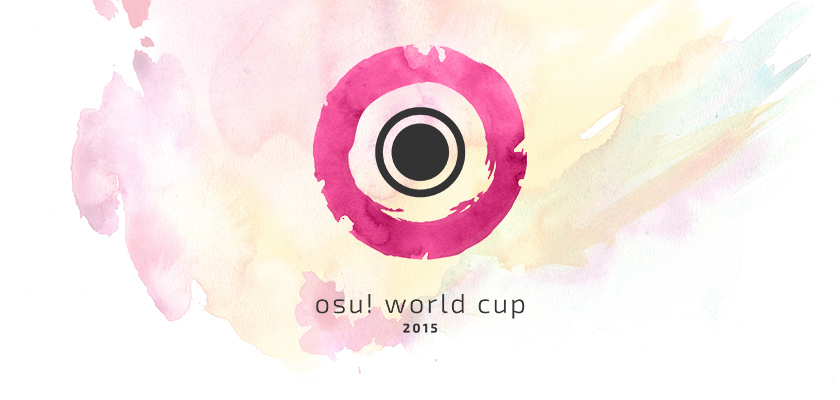
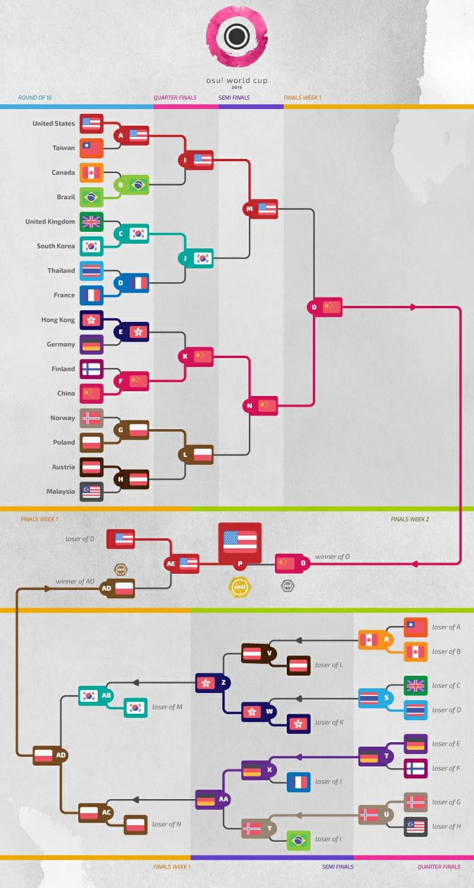

# osu! World Cup 2015

올해로 6번째를 맞이하는 osu! World Cup 2015 (***OWC 2015*** )은 [Tournament Management](https://osu.ppy.sh/groups/26)에 의해 개최되는 국가 대항 토너먼트입니다.

## 토너먼트 일정

| Event | Timestamp |
| :-- | :-- |
| 등록 기간 | 2015년 10월 01일 - 18일 |
| 조 편성 | 2015년 11월 1일 14:00 (UTC+0) |
| 그룹 스테이지 | 2015년 11월 07일 - 08일 |
| 16강 | 2015년 11월 14일 - 15일 |
| 8강 | 2015년 11월 21일 - 22일 |
| 준결승 | 2015년 11월 28일 - 29일 |
| 결승 - Week 1 | 2015년 12월 5일 - 6일 |
| 결승 - Week 2 | 2015년 12월 12일 - 13일 |

## 상품

저희는 이번 월드컵의 상금으로 최소 5,000달러 현금을 목표로 하고 있습니다. 당신은 **[여기서 프로필 배너 구매](https://osu.ppy.sh/store/products/38)** 를 함으로써 월드컵의 상품을 후원을 할 수 있습니다!

| Placing | Prizes |
| :-- | :-- |
|  | 총 상금의 50%, 프로필 뱃지, "osu! Champion" 유저 타이틀 |
|  | 총 상금의 38%, 프로필 뱃지 |
|  | 총 상금의 12%, 프로필 뱃지 |

## 주최자 구성

| Job | Persons |
| :-- | :-- |
| 토너먼트 관리 | ::{ flag=DE }:: ::Loctav::{ user=71366 } // ::{ flag=DE }:: ::p3n::{ user=123703 } // ::{ flag=ES }:: ::Deif::{ user=318565 } // ::{ flag=FR }:: ::shARPII::{ user=776257 } |
| 맵풀 | ::{ flag=FR }:: ::Cherry Blossom::{ user=1156742 } // ::{ flag=HK }:: ::Skystar::{ user=873961 } // ::{ flag=KR }:: ::ToGlette::{ user=1076236 } |
| 방송 | ::{ flag=DE }:: ::Loctav::{ user=71366 } // ::{ flag=PL }:: ::Marcin::{ user=722665 } |
| 해설 | ::{ flag=US }:: ::Chippy::{ user=2314115 } // ::{ flag=NZ }:: ::deadbeat::{ user=128370 } // ::{ flag=GB }:: ::Doomsday::{ user=18983 } // ::{ flag=AR }:: ::juankristal::{ user=443656 } // ::{ flag=GB }:: ::Raiku::{ user=1525538 } // ::{ flag=US }:: ::rfandomization::{ user=3716999 } // ::{ flag=US }:: ::Zak::{ user=1375955 } // ::{ flag=US }:: ::ztrot::{ user=6347 } |
| 통계 | ::{ flag=PL }:: ::Marcin::{ user=722665 } |

## 링크

- [osu! World Cup 2015 트위치](https://www.twitch.tv/osulive)
- [논의 스레드](https://osu.ppy.sh/community/forums/posts/4550383)
- [등록 페이지](https://osu.ppy.sh/tournaments/2)
- [현재 단계의 결과](https://docs.google.com/spreadsheets/d/1fpsfKUQi6ue0SusciKctumDDje5SxUC5NQ908mO9Jpw/pubhtml)
- **[그룹 스테이지 통계 개요(임시)](https://docs.google.com/spreadsheets/d/1QGI7BxI7fOMhXSdgYbFqPGCTUUwfSrsAiUhibWu4xUk/pubhtml)**

## 참가자

| Top Seed | High Seed | Low Seed | No Seed |
| :-- | :-- | :-- | :-- |
| ::{ flag=CN }:: China | ::{ flag=AU }:: Australia | ::{ flag=AR }:: Argentina | ::{ flag=GR }:: Greece |
| ::{ flag=FR }:: France | ::{ flag=AT }:: Austria | ::{ flag=JP }:: Japan | ::{ flag=IT }:: Italy |
| ::{ flag=DE }:: Germany | ::{ flag=BR }:: Brazil | ::{ flag=LV }:: Latvia | ::{ flag=MX }:: Mexico |
| ::{ flag=PL }:: Poland | ::{ flag=CA }:: Canada | ::{ flag=LT }:: Lithuania | ::{ flag=NZ }:: New Zealand |
| ::{ flag=RU }:: Russian Federation | ::{ flag=FI }:: Finland | ::{ flag=MY }:: Malaysia | ::{ flag=PH }:: Philippines |
| ::{ flag=KR }:: South Korea | ::{ flag=HK }:: Hong Kong | ::{ flag=NO }:: Norway | ::{ flag=PT }:: Portugal |
| ::{ flag=TW }:: Taiwan | ::{ flag=NL }:: Netherlands | ::{ flag=SE }:: Sweden | ::{ flag=SG }:: Singapore |
| ::{ flag=US }:: United States | ::{ flag=GB }:: United Kingdom | ::{ flag=TH }:: Thailand | ::{ flag=UA }:: Ukraine |

### Group A

| F | Country name | Team |
| :-: | :-: | :-- |
| ::{ flag=MX }:: | **Mexico** | **::Broodich::{ user=2484629 }**, ::Id\1Beat::{ user=3431380 }, ::Atheneon::{ user=2164627 }, ::lndex::{ user=2038320 }, ::Psycopath-::{ user=3233957 }, ::Eiikon::{ user=2553519 }, ::KevEz::{ user=2271558 }, ::Atsuro::{ user=2279351 } |
| ::{ flag=MY }:: | **Malaysia** | **::ClawViper::{ user=2681361 }**, ::xsrsbsns::{ user=414427 }, ::Gon::{ user=583765 }, ::Rumia-::{ user=1787171 }, ::Ex6TenZ::{ user=2676512 }, ::caleb123456::{ user=2205376 }, ::Rampax::{ user=3995630 }, ::Amane-::{ user=2276847 } |
| ::{ flag=AU }:: | **Australia** | **::Bauxe::{ user=1881685 }**, ::Tokichii::{ user=557197 }, ::JappyBabes::{ user=697783 }, ::Meowt3dCheeze::{ user=634837 }, ::\1 ZhengS \1::{ user=2671317 }, ::Hexicate::{ user=2171562 }, ::Jaybladezz::{ user=3725492 }, ::Aloha::{ user=792176 } |
| ::{ flag=US }:: | **United States** | **::Xilver::{ user=3099689 }**, ::Natalia::{ user=2162669 }, ::Axarious::{ user=2614511 }, ::Ritzeh::{ user=1028387 }, ::Seouless::{ user=3328676 }, ::0120::{ user=1901534 }, ::Zodiaack::{ user=3096229 }, ::\1Toy\1::{ user=2757689 } |

### Group B

| F | Country name | Team |
| :-: | :-: | :-- |
| ::{ flag=IT }:: | **Italy** | **::xiAmME::{ user=1428960 }**, ::Nemis::{ user=1635091 }, ::Kirin::{ user=1852356 }, ::DT-sama::{ user=3525018 }, ::- Croma -::{ user=1752181 }, ::Gian::{ user=2105981 }, ::LLoyd-chan::{ user=2849149 }, ::umii::{ user=2538695 } |
| ::{ flag=LT }:: | **Lithuania** | **::QonQuest::{ user=988503 }**, ::Mazzerin::{ user=2942381 }, ::Auji::{ user=4114438 }, ::PainSinger::{ user=697843 }, ::Zinkon::{ user=85043 }, ::Shelbis::{ user=2639159 }, ::Midget::{ user=4141635 }, ::Azerite::{ user=2562987 } |
| ::{ flag=HK }:: | **Hong Kong** | **::- G I D Z -::{ user=2286528 }**, ::Chaoslitz::{ user=3621552 }, ::shAe1eck::{ user=1553672 }, ::MinG3012::{ user=1583218 }, ::-N a n a k o-::{ user=1407516 }, ::clp012345::{ user=126144 } |
| ::{ flag=FR }:: | **France** | **::Musty::{ user=251683 }**, ::NerO::{ user=1545031 }, ::Elysion::{ user=106269 }, ::Kynan::{ user=1093361 }, ::mrzomb::{ user=1694887 }, ::filsdelama::{ user=2831793 }, ::Shapy::{ user=2705769 }, ::FayeurS::{ user=3105416 } |

### Group C

| F | Country name | Team |
| :-: | :-: | :-- |
| ::{ flag=UA }:: | **Ukraine** | **::Aka::{ user=1307553 }**, ::wasisdasS::{ user=1999698 }, ::FllareA::{ user=1163931 }, ::Granje::{ user=496387 }, ::-Ranndom-::{ user=5022536 }, ::Yoru-hide::{ user=791121 }, ::blednak::{ user=912627 } |
| ::{ flag=LV }:: | **Latvia** | **::LoGo::{ user=750382 }**, ::Forseen::{ user=556012 }, ::Emula::{ user=2891792 }, ::Vmx::{ user=967501 }, ::Jesus\1Krists\1::{ user=2842992 }, ::Edijs::{ user=2799835 }, ::xoho::{ user=3647897 } |
| ::{ flag=CA }:: | **Canada** | **::TrickMirror::{ user=2138739 }**, ::Azer::{ user=2155578 }, ::Bowlglet::{ user=622485 }, ::Xenbo::{ user=1895489 }, ::Ciao::{ user=2674642 }, ::MiruHong::{ user=2866814 }, ::Ignite::{ user=3122948 }, ::Shina Kokomi::{ user=980956 } |
| ::{ flag=PL }:: | **Poland** | **::Wilchq::{ user=2021758 }**, ::Rafis::{ user=2558286 }, ::WubWoofWolf::{ user=39828 }, ::AmaiHachimitsu::{ user=844815 }, ::r0ck::{ user=1549620 }, ::fartownik::{ user=56917 }, ::SpajdeR::{ user=3446664 }, ::Lucid Astray::{ user=1773225 } |

### Group D

| F | Country name | Team |
| :-: | :-: | :-- |
| ::{ flag=PH }:: | **Philippines** | **::Takane Enomoto::{ user=1208491 }**, ::-Ryo::{ user=3113141 }, ::KouNue::{ user=4180036 }, ::ededed028::{ user=3932796 }, ::Marika::{ user=1679638 }, ::konawiki::{ user=4003979 }, ::---Mikoto::{ user=2911062 }, ::Gio::{ user=1795827 } |
| ::{ flag=JP }:: | **Japan** | **::Mercurius::{ user=589550 }**, ::Poruteri::{ user=1379576 }, ::OhAHO::{ user=1066760 }, ::Roro Rosset::{ user=673214 }, ::Super Arrow::{ user=1970239 }, ::NeruL::{ user=2497197 }, ::1o-chak::{ user=1401004 } |
| ::{ flag=GB }:: | **United Kingdom** | **::jesus1412::{ user=230116 }**, ::Doomsday::{ user=18983 }, ::Tasty Beverage::{ user=960620 }, ::Xim::{ user=2083664 }, ::Raiku::{ user=1525538 }, ::Bubbleman::{ user=5182050 }, ::Run-Cat::{ user=4361729 } |
| ::{ flag=CN }:: | **China** | **::MatsumotoRise::{ user=672726 }**, ::rustbell::{ user=227717 }, ::SpringLane::{ user=1343504 }, ::Dsan::{ user=1266166 }, ::GGBY::{ user=629717 }, ::\1ZN\1::{ user=1030696 }, ::Rixia Mao::{ user=3314431 }, ::Toshinou Kyouko::{ user=560228 } |

### Group E

| F | Country name | Team |
| :-: | :-: | :-- |
| ::{ flag=NZ }:: | **New Zealand** | **::shortpotato::{ user=1266102 }**, ::kiyumi::{ user=3701898 }, ::a loli::{ user=1488796 }, ::momochan::{ user=4827310 }, ::\1 Pustules \1::{ user=2419478 }, ::Tang::{ user=2162609 }, ::yellowy246::{ user=3833980 }, ::Grimacee::{ user=2352484 } |
| ::{ flag=AR }:: | **Argentina** | **::GaTu::{ user=3583351 }**, ::Enhu::{ user=2840499 }, ::Graphite Edge::{ user=825712 }, ::benjacala::{ user=1625740 }, ::Fr0th::{ user=3458870 }, ::Peingod::{ user=2212941 }, ::chucentry::{ user=2498731 }, ::Dreamcast::{ user=1565577 } |
| ::{ flag=FI }:: | **Finland** | **::Sanze::{ user=3110552 }**, ::isokasapupuja::{ user=1770462 }, ::huono\1tuuri::{ user=1432954 }, ::Poofie::{ user=3517198 }, ::nycto::{ user=2867764 }, ::Hyppyri::{ user=3123423 }, ::Winner::{ user=3437263 }, ::Incera::{ user=2159415 } |
| ::{ flag=KR }:: | **South Korea** | **::Neta::{ user=832084 }**, ::Cinia Pacifica::{ user=1414625 }, ::\1Chiyo\1::{ user=2000416 }, ::- Hakurei Reimu-::{ user=948713 }, ::Meltina::{ user=946990 }, ::Enon::{ user=2043401 }, ::Gomo Pslvarh::{ user=1206417 }, ::eoehd1ek::{ user=3938876 } |

### Group F

| F | Country name | Team |
| :-: | :-: | :-- |
| ::{ flag=GR }:: | **Greece** | **::Riven::{ user=3638005 }**, ::ThePainG7::{ user=3478000 }, ::Tofas::{ user=2755584 }, ::SutiBu::{ user=2633472 }, ::I Like Kimas::{ user=2490195 }, ::JohnyZ::{ user=4508048 } |
| ::{ flag=NO }:: | **Norway** | **::Tobi::{ user=2970667 }**, ::-GN::{ user=895581 }, ::-PC::{ user=2916414 }, ::Sebu::{ user=3990173 }, ::HundurThePanda::{ user=3145033 }, ::warrock::{ user=2841744 }, ::Liqh::{ user=3409838 }, ::CXu::{ user=84841 } |
| ::{ flag=BR }:: | **Brazil** | **::fabriciorby::{ user=209664 }**, ::MouseEasy::{ user=1558603 }, ::Tio Fenrir::{ user=2644700 }, ::Sooki::{ user=1451811 }, ::Shott::{ user=965354 }, ::Polaco::{ user=1057782 }, ::HideZ::{ user=504657 }, ::Miyazono::{ user=529036 } |
| ::{ flag=RU }:: | **Russian Federation** | **::talala::{ user=1389663 }**, ::KoTo::{ user=1382805 }, ::\1index::{ user=652457 }, ::Shiawase::{ user=989489 }, ::SoMad::{ user=637168 }, ::xantic::{ user=1897386 }, ::Kert::{ user=119933 }, ::Red\1Pixel::{ user=4170932 } |

### Group G

| F | Country name | Team |
| :-: | :-: | :-- |
| ::{ flag=SG }:: | **Singapore** | **::plaatinum::{ user=3385566 }**, ::GSBlank::{ user=2312106 }, ::Rtyzen::{ user=2439822 }, ::oneplusone::{ user=1843447 }, ::Clyine::{ user=1275211 }, ::jcjc::{ user=1200275 }, ::-LeeP-::{ user=1143744 }, ::Tatch::{ user=2390650 } |
| ::{ flag=TH }:: | **Thailand** | **::FrostxE::{ user=199669 }**, ::- Phantasma -::{ user=1427407 }, ::bossm::{ user=654123 }, ::Mikkuri::{ user=317494 }, ::NonxE::{ user=319312 }, ::Romantic::{ user=1592894 } |
| ::{ flag=NL }:: | **Netherlands** | **::taku::{ user=684433 }**, ::jackylam5::{ user=1540807 }, ::Pittigbaasje::{ user=2167433 }, ::HappyStick::{ user=256802 }, ::Synchrostar::{ user=419705 }, ::Chidori::{ user=5258565 }, ::Menthuthuyoupi::{ user=2715937 }, ::Kyshiro::{ user=640611 } |
| ::{ flag=DE }:: | **Germany** | **::Dustice::{ user=754565 }**, ::BDDav::{ user=1164526 }, ::Neliel::{ user=1500305 }, ::Beafowl::{ user=2438122 }, ::Jonimay::{ user=1118341 }, ::TobiGH3::{ user=3341040 }, ::W3SON::{ user=2070822 }, ::cptnXn::{ user=495272 } |

### Group H

| F | Country name | Team |
| :-: | :-: | :-- |
| ::{ flag=PT }:: | **Portugal** | **::kek::{ user=2148013 }**, ::Osama::{ user=799218 }, ::Mizuru::{ user=4495871 }, ::AA00AA::{ user=2928612 }, ::Zenden::{ user=3070694 }, ::PedroLipton::{ user=3272012 } |
| ::{ flag=SE }:: | **Sweden** | **::Xytox::{ user=2229274 }**, ::Slizzer::{ user=809983 }, ::SnickarN::{ user=3258429 }, ::AntoN::{ user=2538562 }, ::Bubba::{ user=2330524 }, ::IVo one::{ user=3623465 }, ::Sebbe::{ user=3181965 }, ::Xiniox::{ user=5233691 } |
| ::{ flag=AT }:: | **Austria** | **::Fedora Goose::{ user=2323131 }**, ::Omgforz::{ user=578943 }, ::Alumetorz::{ user=1145984 }, ::BlueFlame::{ user=3506191 }, ::Shirone::{ user=1426098 }, ::Elscar::{ user=2253511 }, ::Hakkero::{ user=177913 }, ::skritsch::{ user=3323141 } |
| ::{ flag=TW }:: | **Taiwan** | **::Rucker::{ user=147515 }**, ::hvick225::{ user=50265 }, ::Small K::{ user=952751 }, ::YuyuKo sama::{ user=234788 }, ::Uan::{ user=147623 }, ::dabanlong::{ user=624254 }, ::zxxzxxz::{ user=1646474 }, ::RedLeaf::{ user=2703742 } |

## 맵풀

### 8강

**[맵팩을 여기서 다운로드 할 수 있습니다!](https://www.mediafire.com/download/l4zdsy0ujeq8xz3/OWC_2015_Quarterfinals.rar)**

- NoMod
  1. [ALiCE'S EMOTiON - Dark Flight Dreamer (Sakaue Nachi) \[Dreamer\]](https://osu.ppy.sh/beatmapsets/185250#osu/676172)
  2. [IA - Six Trillion Years and Overnight Story (NatsumeRin) \[0108\]](https://osu.ppy.sh/beatmapsets/51245#osu/157861)
  3. [xi - Wish upon Twin Stars (Chaoslitz) \[Wish\]](https://osu.ppy.sh/beatmapsets/242462#osu/559673)
  4. [rerulili - Noushou Sakuretsu Girl (NatsumeRin) \[Rin\]](https://osu.ppy.sh/beatmapsets/63434#osu/187410)
  5. [siqlo - Forest Haze (Lust) \[Leader's Extra\]](https://osu.ppy.sh/beatmapsets/281695#osu/656723)
  6. [Hiroyuki Sawano feat. Mika Kobayashi - Bios (goodbye) \[LKs' Another\]](https://osu.ppy.sh/beatmapsets/43674#osu/137766)
- Hidden
  1. [Sota Fujimori - Move That Body -Extended Mix- (Amamiya Yuko) \[RLC's Extra\]](https://osu.ppy.sh/beatmapsets/220220#osu/542336)
  2. [Tatsh - Cruel Moon (Shinxyn) \[Lunatic\]](https://osu.ppy.sh/beatmapsets/13584#osu/50148)
  3. [ETIA. - Lost Love (JJburstOwO) \[Last Eve\]](https://osu.ppy.sh/beatmapsets/341933#osu/755900)
- HardRock
  1. [Hanatan - If (Rakuen) \[wkyik's Insane\]](https://osu.ppy.sh/beatmapsets/230050#osu/587577)
  2. [Project Grimoire - Caliburne \~Story of the Legendary sword\~ (Mikkuri) \[Extra\]](https://osu.ppy.sh/beatmapsets/335665#osu/742975)
  3. [Nekomata Master - Far east nightbird (kors k Remix) (jonathanlfj) \[RLC's Extra\]](https://osu.ppy.sh/beatmapsets/144171#osu/358273)
- DoubleTime
  1. [senya - Yukitoke Realism (wring) \[Lunatic\]](https://osu.ppy.sh/beatmapsets/252385#osu/579751)
  2. [ichigo - YU-MU (Louis Cyphre) \[Extra\]](https://osu.ppy.sh/beatmapsets/40348#osu/128074)
  3. [ClariS - with you (10nya) \[Laurier's Insane\]](https://osu.ppy.sh/beatmapsets/153793#osu/380012)
- FreeMod
  1. [Zeami feat. Tenshi - Tenyou no Mai (smallboat) \[Yuki's Extra\]](https://osu.ppy.sh/beatmapsets/178962#osu/434118)
  2. [APG550 - NEVERLAND (Natsu) \[Yuny\]](https://osu.ppy.sh/beatmapsets/352489#osu/776749)
  3. [Rita - Dream Walker (Amamiya Yuko) \[Ethereal\]](https://osu.ppy.sh/beatmapsets/315299#osu/722934)
- Tiebreaker
  1. **[Our Stolen Theory - United (L.A.O.S Remix) (Asphyxia) \[Infinity\]](https://osu.ppy.sh/beatmapsets/237768#osu/550235)**

### 16강

**[맵팩을 여기서 다운로드 할 수 있습니다!](https://www.mediafire.com/download/r21yp0iu2zgkkln/OWC_2015_Round_of_16.rar)**

- NoMod
  1. [Sharlo & yealina - Kakushigoto (Sharlo) \[RLC's Extra\]](https://osu.ppy.sh/beatmapsets/208095#osu/495899)
  2. [RedMuffleR - Rubeus (Smoothie World) \[GRAVITY\]](https://osu.ppy.sh/beatmapsets/249703#osu/574050)
  3. [Gentle Stick X M2U - Ineffabilis (buhei) \[Extreme\]](https://osu.ppy.sh/beatmapsets/340903#osu/753968)
  4. [Function Phantom - Neuronecia (Amamiya Yuko) \[Ethereal\]](https://osu.ppy.sh/beatmapsets/186911#osu/541990)
  5. [himmeltengoku - Whisper of Rose (Tsukuyomi) \[Maximum\]](https://osu.ppy.sh/beatmapsets/173614#osu/419487)
  6. [Megpoid GUMI - Cosmos (val0108) \[Cosmos\]](https://osu.ppy.sh/beatmapsets/37054#osu/123374)
- Hidden
  1. [Pendulum - Watercolour (Kecco) \[Extra\]](https://osu.ppy.sh/beatmapsets/109751#osu/569735)
  2. [U1 overground - Dopamine (fanzhen0019) \[Kotori's EXTREME\]](https://osu.ppy.sh/beatmapsets/210316#osu/533622)
  3. [Shoichiro Sakamoto - Eye of Aeon (KanaRin) \[Aeon\]](https://osu.ppy.sh/beatmapsets/26528#osu/89362)
- HardRock
  1. [LhoU - Highlander (Cherry Blossom) \[Extra\]](https://osu.ppy.sh/beatmapsets/167225#osu/406247)
  2. [yuikonnu - Otsukimi Recital (Mythol) \[Collab\]](https://osu.ppy.sh/beatmapsets/107763#osu/282251)
  3. [Raujika - Land of Grace (Strawberry) \[Gracy\]](https://osu.ppy.sh/beatmapsets/73444#osu/209203)
- DoubleTime
  1. [Yoshida Mayumi - Zutto Kono Mama... (Mythol) \[cRyo's Insane\]](https://osu.ppy.sh/beatmapsets/63468#osu/196280)
  2. [capitaro - Karen Aikyou Hanasaka gumi (Tari) \[Insane\]](https://osu.ppy.sh/beatmapsets/324320#osu/720614)
  3. [ChouCho - My dear friend (Delis) \[Insane\]](https://osu.ppy.sh/beatmapsets/206079#osu/486131)
- FreeMod
  1. [DJ YOSHITAKA - FLOWER (Apricot) \[EXTREME\]](https://osu.ppy.sh/beatmapsets/31054#osu/128780)
  2. [senya - Kanjou Chemistry (Drum 'n' Bass Remix) (Satellite) \[Exw\]](https://osu.ppy.sh/beatmapsets/92509#osu/255700)
  3. [yuikonnu - Chikyuu Saigo no Kokuhaku o (Fycho) \[Insane\]](https://osu.ppy.sh/beatmapsets/208765#osu/494798)
- Tiebreaker
  1. **[Wakeshima Kanon - World's End, Girl's Rondo(Asterisk DnB Remix) (Meg) \[We cry "OPEN"\]](https://osu.ppy.sh/beatmapsets/331499#osu/734339)**

### 그룹 스테이지

**[맵팩을 여기서 다운로드 할 수 있습니다!](https://www.mediafire.com/download/4mmsagzc3mg6g13/OWC_2015_Group_Stage.rar)**

- NoMod
  1. [Duca - COLD BUTTERFLY (Zweib) \[Insane\]](https://osu.ppy.sh/beatmapsets/125380#osu/363063)
  2. [Kagamine Rin - Black Rebel (val0108) \[0108 Rebel\]](https://osu.ppy.sh/beatmapsets/28425#osu/109301)
  3. [Mary - Artificial Rose (Urushi38) \[Another\]](https://osu.ppy.sh/beatmapsets/99434#osu/264439)
  4. [Kousaki Satoru - Gekiretsu de Kareinaru Hibi (Zero\_\_wind) \[Ba Ba Ba\]](https://osu.ppy.sh/beatmapsets/164545#osu/400564)
  5. [Afilia Saga - S.M.L (Tari) \[Insane\]](https://osu.ppy.sh/beatmapsets/145685#osu/361263)
  6. [ARM feat. Nanahira - Bakunana\*Testroyer (intoon) \[Kami's Another\]](https://osu.ppy.sh/beatmapsets/295581#osu/682074)
- Hidden
  1. [MiddleIsland - Magnetic Shift (Natsu) \[UWS's Extra\]](https://osu.ppy.sh/beatmapsets/148535#osu/379411)
  2. [96Neko - Yoshiwara Lament (Minakami Yuki) \[Insane\]](https://osu.ppy.sh/beatmapsets/189377#osu/451227)
  3. [Kagamine Rin - Tokyo Teddy Bear (NatsumeRin) \[Rin\]](https://osu.ppy.sh/beatmapsets/39838#osu/127138)
- HardRock
  1. [Uchida Maaya - Hana Tsubomi Yume Miru Kyoushikyoku \~Tamashii no Shirube\~ (Mythol) \[Insane\]](https://osu.ppy.sh/beatmapsets/89888#osu/244182)
  2. [Kotoge Mai - Mangekyou (Oracle) \[cRyo's Insane\]](https://osu.ppy.sh/beatmapsets/230094#osu/535334)
  3. [Nekomata Master feat. \*spiLa\* - Clumsy thoughts (Kawaiwkyik) \[Insane\]](https://osu.ppy.sh/beatmapsets/190754#osu/454158)
- DoubleTime
  1. [Hatsuki Yura - Ganbare! Koi no Hana (Kotone) \[Hana\]](https://osu.ppy.sh/beatmapsets/55359#osu/167963)
  2. [senya - Bondage Anemonation (Satellite) \[Lunatic\]](https://osu.ppy.sh/beatmapsets/122416#osu/323264)
  3. [Chata - anesthesia (hoLysoup) \[Anesthesia\]](https://osu.ppy.sh/beatmapsets/77093#osu/216690)
- FreeMod
  1. [DJ Fresh (feat. Rita Ora) - Hot Right Now (Radio Edit) (Asphyxia) \[Insane\]](https://osu.ppy.sh/beatmapsets/231114#osu/537235)
  2. [yuikonnu - Natsu no Owari, Koi no Hajimari (xChippy) \[Insane\]](https://osu.ppy.sh/beatmapsets/206335#osu/486613)
  3. [Jin - Outer Science (tutuhaha) \[Insane\]](https://osu.ppy.sh/beatmapsets/122376#osu/313025)
- Tiebreaker
  1. **[Sawai Miku - Colorful. (Asterisk DnB Remix) (Amamiya Yuko) \[Megumi\]](https://osu.ppy.sh/beatmapsets/299454#osu/722224)**

## 경기 결과

### 16강

**2015년 11월 15일 일요일**

| Team A | Score | Team B | History |
| :-- | :-: | --: | :-- |
| ::{ flag=US }:: **United States** | **5** - 4 | Taiwan ::{ flag=TW }:: | [#1](https://osu.ppy.sh/community/matches/20269690) |
| ::{ flag=FI }:: Finland | 0 - **5** | **China** ::{ flag=CN }:: | [#1](https://osu.ppy.sh/community/matches/20273790) |
| ::{ flag=AT }:: **Austria** | **5** - 0 | Malaysia ::{ flag=MY }:: | [#1](https://osu.ppy.sh/community/matches/20275097) |
| ::{ flag=HK }:: **Hong Kong** | **5** - 3 | Germany ::{ flag=DE }:: | [#1](https://osu.ppy.sh/community/matches/20276700) |
| ::{ flag=GB }:: United Kingdom | 2 - **5** | **South Korea** ::{ flag=KR }:: | [#1](https://osu.ppy.sh/community/matches/20278584) |
| ::{ flag=TH }:: Thailand | 2 - **5** | **France** ::{ flag=FR }:: | [#1](https://osu.ppy.sh/community/matches/20280529) |
| ::{ flag=NO }:: Norway | 0 - **5** | **Poland** ::{ flag=PL }:: | [#1](https://osu.ppy.sh/community/matches/20285332) |
| ::{ flag=CA }:: Canada | 1 - **5** | **Brazil** ::{ flag=BR }:: | [#1](https://osu.ppy.sh/community/matches/20287601) |

### 그룹 스테이지

**2015년 11월 8일 토요일**

| Team A | Score | Team B | History |
| :-- | :-: | --: | :-- |
| ::{ flag=AT }:: **Austria** | **4** - 1 | Taiwan ::{ flag=TW }:: | [#1](https://osu.ppy.sh/community/matches/20091839) |
| ::{ flag=NZ }:: New Zealand | 3 - **4** | **Finland** ::{ flag=FI }:: | [#1](https://osu.ppy.sh/community/matches/20091841) |
| ::{ flag=MY }:: **Malaysia** | **4** - 1 | Australia ::{ flag=AU }:: | [#1](https://osu.ppy.sh/community/matches/20091844) |
| ::{ flag=PH }:: Philippines | 1 - **4** | **Japan** ::{ flag=JP }:: | [#1](https://osu.ppy.sh/community/matches/20091847) |
| ::{ flag=SG }:: Singapore | 0 - **4** | **Germany** ::{ flag=DE }:: | [#1](https://osu.ppy.sh/community/matches/20092909) |
| ::{ flag=TH }:: Thailand | 1 - **4** | **Netherlands** ::{ flag=NL }:: | [#1](https://osu.ppy.sh/community/matches/20092910) |
| ::{ flag=GB }:: United Kingdom | 1 - **4** | **China** ::{ flag=CN }:: | [#1](https://osu.ppy.sh/community/matches/20092912) |
| ::{ flag=LT }:: Lithuania | 1 - **4** | **France** ::{ flag=FR }:: | [#1](https://osu.ppy.sh/community/matches/20094037) |
| ::{ flag=IT }:: Italy | 1 - **4** | **Hong Kong** ::{ flag=HK }:: | [#1](https://osu.ppy.sh/community/matches/20094040) |
| ::{ flag=PT }:: Portugal | 3 - **4** | **Taiwan** ::{ flag=TW }:: | [#1](https://osu.ppy.sh/community/matches/20094042) |
| ::{ flag=SG }:: Singapore | 3 - **4** | **Thailand** ::{ flag=TH }:: | [#1](https://osu.ppy.sh/community/matches/20095460) |
| ::{ flag=PH }:: Philippines | 0 - **4** | **United Kingdom** ::{ flag=GB }:: | [#1](https://osu.ppy.sh/community/matches/20095461) |
| ::{ flag=AR }:: Argentina | 0 - **4** | **South Korea** ::{ flag=KR }:: | [#1](https://osu.ppy.sh/community/matches/20095462) |
| ::{ flag=GR }:: Greece | 0 - **4** | **Russian Federation** ::{ flag=RU }:: | [#1](https://osu.ppy.sh/community/matches/20105876) |
| ::{ flag=CA }:: Canada | 0 - **4** | **Poland** ::{ flag=PL }:: | [#1](https://osu.ppy.sh/community/matches/20105877) |
| ::{ flag=PT }:: Portugal | 1 - **4** | **Austria** ::{ flag=AT }:: | [#1](https://osu.ppy.sh/community/matches/20105878) |
| ::{ flag=UA }:: **Ukraine** | **4** - 1 | Latvia ::{ flag=LV }:: | [#1](https://osu.ppy.sh/community/matches/20107684) |
| ::{ flag=AR }:: Argentina | 3 - **4** | **Finland** ::{ flag=FI }:: | [#1](https://osu.ppy.sh/community/matches/20107685) |
| ::{ flag=NO }:: Norway | 2 - **4** | **Brazil** ::{ flag=BR }:: | [#1](https://osu.ppy.sh/community/matches/20109708) |
| ::{ flag=SE }:: Sweden | 2 - **4** | **Austria** ::{ flag=AT }:: | [#1](https://osu.ppy.sh/community/matches/20109709) |

**2015년 11월 9일 일요일**

| Team A | Score | Team B | History |
| :-- | :-: | --: | :-- |
| ::{ flag=NZ }:: **New Zealand** | **4** - 0 | Argentina ::{ flag=AR }:: | [#1](https://osu.ppy.sh/community/matches/20115243) |
| ::{ flag=MX }:: Mexico | 1 - **4** | **Australia** ::{ flag=AU }:: | [#1](https://osu.ppy.sh/community/matches/20114985) |
| ::{ flag=MY }:: Malaysia | 1 - **4** | **United States** ::{ flag=US }:: | [#1](https://osu.ppy.sh/community/matches/20116482) |
| ::{ flag=JP }:: Japan | 1 - **4** | **China** ::{ flag=CN }:: | [#1](https://osu.ppy.sh/community/matches/20116483) |
| ::{ flag=NZ }:: New Zealand | 1 - **4** | **South Korea** ::{ flag=KR }:: | [#1](https://osu.ppy.sh/community/matches/20117565) |
| ::{ flag=MX }:: Mexico | 0 - **4** | **Malaysia** ::{ flag=MY }:: | [#1](https://osu.ppy.sh/community/matches/20117566) |
| ::{ flag=AU }:: Australia | 1 - **4** | **United States** ::{ flag=US }:: | [#1](https://osu.ppy.sh/community/matches/20117569) |
| ::{ flag=SE }:: Sweden | 1 - **4** | **Taiwan** ::{ flag=TW }:: | [#1](https://osu.ppy.sh/community/matches/20125092) |
| ::{ flag=PH }:: Philippines | 1 - **4** | **China** ::{ flag=CN }:: | [#1](https://osu.ppy.sh/community/matches/20125093) |
| ::{ flag=HK }:: Hong Kong | 2 - **4** | **France** ::{ flag=FR }:: | [#1](https://osu.ppy.sh/community/matches/20126344) |
| ::{ flag=FI }:: Finland | 1 - **4** | **South Korea** ::{ flag=KR }:: | [#1](https://osu.ppy.sh/community/matches/20126352) |
| ::{ flag=TH }:: **Thailand** | **4** - 0 | Germany ::{ flag=DE }:: | [#1](https://osu.ppy.sh/community/matches/20126358) |
| ::{ flag=JP }:: Japan | 0 - **4** | **United Kingdom** ::{ flag=GB }:: | [#1](https://osu.ppy.sh/community/matches/20127886) |
| ::{ flag=UA }:: Ukraine | 0 - **4** | **Poland** ::{ flag=PL }:: | [#1](https://osu.ppy.sh/community/matches/20127887) |
| ::{ flag=SG }:: Singapore | 2 - **4** | **Netherlands** ::{ flag=NL }:: | [#1](https://osu.ppy.sh/community/matches/20127888) |
| ::{ flag=LT }:: Lithuania | 2 - **4** | **Hong Kong** ::{ flag=HK }:: | [#1](https://osu.ppy.sh/community/matches/20129481) |
| ::{ flag=PT }:: **Portugal** | **4** - 3 | Sweden ::{ flag=SE }:: | [#1](https://osu.ppy.sh/community/matches/20129484) |
| ::{ flag=IT }:: Italy | 2 - **4** | **France** ::{ flag=FR }:: | [#1](https://osu.ppy.sh/community/matches/20133656) |
| ::{ flag=GR }:: Greece | 0 - **4** | **Brazil** ::{ flag=BR }:: | [#1](https://osu.ppy.sh/community/matches/20133657) |
| ::{ flag=NO }:: **Norway** | **4** - 2 | Russian Federation ::{ flag=RU }:: | [#1](https://osu.ppy.sh/community/matches/20133658) |
| ::{ flag=NL }:: Netherlands | 0 - **4** | **Germany** ::{ flag=DE }:: | [#1](https://osu.ppy.sh/community/matches/20135079) |
| ::{ flag=LV }:: Latvia | 1 - **4** | **Canada** ::{ flag=CA }:: | [#1](https://osu.ppy.sh/community/matches/20135084) |
| ::{ flag=IT }:: Italy | 3 - **4** | **Lithuania** ::{ flag=LT }:: | [#1](https://osu.ppy.sh/community/matches/20136741) |
| ::{ flag=BR }:: **Brazil** | **4** - 3 | Russian Federation ::{ flag=RU }:: | [#1](https://osu.ppy.sh/community/matches/20136742) |
| ::{ flag=GR }:: Greece | 0 - **4** | **Norway** ::{ flag=NO }:: | [#1](https://osu.ppy.sh/community/matches/20136743) |
| ::{ flag=MX }:: Mexico | 0 - **4** | **United States** ::{ flag=US }:: | [#1](https://osu.ppy.sh/community/matches/20138453) |
| ::{ flag=UA }:: Ukraine | 1 - **4** | **Canada** ::{ flag=CA }:: | [#1](https://osu.ppy.sh/community/matches/20138457) |
| ::{ flag=LV }:: Latvia | 0 - **4** | **Poland** ::{ flag=PL }:: | [#1](https://osu.ppy.sh/community/matches/20138460) |

## 룰셋

### 토너먼트 규칙

1. osu! World Cup은 국가 대항의 4:4 토너먼트입니다.
2. 점수 계산 방식은 Score V2라고 불리는 새로운 방식을 기반으로 합니다. **[여기서 더 자세히 볼 수 있습니다!](https://osu.ppy.sh/community/forums/topics/375428)**
3. 맵풀은 맵풀 선정자에 의해 경기가 있기 전 주의 일요일 이전에 발표됩니다. 이것들은 각각의 경기 중에 사용됩니다.
   - 한 맵은 타이브레이커 맵으로서 주어집니다. 이 맵은 동점인 상황에만 플레이하게 됩니다.
4. 경기 일정은 Tournament Management에 의해 정해지게 됩니다. (아래를 참조).
5. 만약 참여할 수 있는 스태프나 심판이 없다면, 경기가 지연될 수 있습니다.
6. 페일한 플레이어의 점수는 그 플레이어의 팀의 점수에 포함되지 않습니다.
   - 플레이 중에 부활한다면, 패스한 것으로 간주합니다.
7. [Visual Settings](/wiki/Client/Interface/Visual_settings) 를 선택하는 것이 허용됩니다.
8. 무승부일 경우 그 게임은 무효가 됩니다.
9. 만약 플레이어의 연결이 끊기면, 페일한 것으로 간주됩니다.
   1. 경기가 시작된 지 30초 이내에 연결이 끊기면 리매치를 할 수 있지만, 이것은 심판의 판단에 따릅니다.
10. 무효가 된 경우를 제외하고는 한 매치에서 같은 맵을 사용할 수 없습니다.
11. 만약 참석한 플레이어가 4명 미만일 경우, 그 경기는 최대 10분까지 연기될 수 있습니다.
12. 경기 중 선수 교체가 가능합니다.
13. 렉은 경기를 무효화하는 이유가 되지 않는다.
14. 모든 플레이어는 경기가 원활하게 차질없이 진행되도록 협조해야합니다. 플레이어 측의 사정으로 경기가 지나치게 지연되게 한 경우 패널티가 부과됩니다.
15. 경기 중에 연결이 끊어져 다른 팀 선수가 교체를 못한 경우 경기는 일단 중단하고, 최대 10분까지 지연 될 수 있습니다.
16. 모든 플레이어는 심판이나 토너먼트 관리자의 지시에 따릅니다. 최종적으로 결정된 점에 대해서는 반박 할 수 없습니다.
17. 파울 플레이로 인해 경기를 중단하거나, 부적절한 맵을 고르거나(아래를 참조), 다른 선수나 심판에 대해 도발을 하거나, 경기를 지연시키거나 고의적으로 부적절한 행동을 하는것은 엄격하게 금지합니다.
18. 멀티 플레이어 채팅방 osu! community rules을 기반으로 합니다. 모든 채팅 규칙은 멀티 플레이어 채팅방에도 적용됩니다.
    1. 채팅 규칙을 어길 경우 참여가 채팅 금지를 받습니다. 채팅 금지를 받은 선수는 멀티플레이에 참가할 수 없으며, 그동안 선수를 교체해야 할 것입니다.
19. 그룹 스테이지에서는 4:0가 됨으로서 승리로 간주 됩니다. 점수 차이의 비율은 +1.0입니다.
20. 예기치 않게 발생한 일에 대해서는 토너먼트 관리자에 의해 처리됩니다. 이것은 그들의 재량에 달려있으며, 그들의 판단에 따라 규칙이 관대하게 허용될 수 있다.
21. 토너먼트 룰을 어길 경우의 처벌은 다음과 같다.
    - Exclusion of specific players for one map
    - Exclusion of specific players for an entire match
    - Declaring the match as Lost by Default
    - Disqualification from the entire tournament
    - Disqualification from the current and future official tournaments until appealed
22. Any modification of these rules will be announced.

### Tournament Registration

1. Every user interested in joining their country's team signs up individually.
   1. Tournament Management will create a list of potential candidates for a country's team.
   2. Tournament Management declares one candidate to the captain of the country's team, albeit temporarily.
   3. The declared captain can form their team from the candidate list of their country.
2. To ensure valid and serious registrations, every registered user will be checked by the Tournament Management.
   1. Every registered user will be assigned to their respective country's candidate list.
   2. To be successfully accepted on the list, you have to ensure that your global osu! performace ranking is above \#5000.
   3. To be successfully accepted on the list, you have to ensure that you did not violate the [osu! community rules](/wiki/Rules) within the last 12 months.
3. All successfully formed teams will be published after the Registration Phase.
4. Rejected players may appeal this decision by contacting [tournaments@ppy.sh](mailto:tournaments@ppy.sh).
5. Mapset selectors may not participate as a player in this tournament.

### Stage instructions

1. In the first stage (Group Stage), the teams will be divided into 8 groups of 4 teams.

2. All the teams from each group will face each other.

3. Rankings of each group are determined by sorting the results of each team's performance in the following priority:
   1. Most matches won.
   2. Have higher `{(the number of maps won) - (the number of maps defeated)}`.
   3. Most maps won.
   4. Have higher `∑{(total score difference) / (maximum score)}`.
   5. Winner of the rematch.

4. The top 2 teams of each group will move on to the Double Elimination Stages.

5. Following stages are Double Elimination Stages. This means that the winner moves to the next stage and the losing team gets moved to the Loser bracket.

6. Based on [this graphic](https://puu.sh/bUq5V/f1066103b0.png), the stages are splitted up the following:

   | Stage | Match ID |
   | :-- | :-- |
   | 16강 | A, B, C, D, E, F, G, H |
   | 8강 | I, J, K, L & R, S, T, U |
   | 준결승 | M, N & V, W, X, Y, Z,AA |
   | 결승 - Week 1 | O & AB, AC, AD, AE |
   | 결승 - Week 2 | P, Q |

7. **Winning Conditions:**
   - In Group Stage, you need to win 4 maps to win a match. (Best-of-7)
   - In the Round of 16 and the Quarter-finals, you need to win 5 maps to win a match. (Best-of-9)
   - In Semi-finals and Finals: Week 1, you need to win 6 maps to win a match. (Best-of-11)
   - In Finals: Week 2, you need to win 7 maps to win the match. (Best-of-13)

### Match Instructions

1. A referee will create a multiplayer room 15 minutes in advance. Players will be gathered during this period.
   1. Room settings are osu!, Team-Vs., Win Condition: 'Score V2'. Room name must be "OWC 2015: TeamBlue vs TeamRed" (**this may change at some later point**)
   2. The team mentioned first in the room name must be the blue team, the team mentioned second in the room name must be the red team.
2. Players are free to select up to two warm-up beatmaps. Using beatmaps with questionable content is prohibited. This includes profanity, nudity, violence or other NSFW content in the visual elements or the song, regardless of its language.
3. Each captain can ban two beatmaps to be selected from the pool. These beatmaps are not allowed to be picked by any team in the entire match.
   1. Both vetos must always be used.
4. Beatmap selection will alternate between each captain selecting a beatmap out of the map pool.
5. Each captain must use `!roll` once in `#multiplayer`.
   1. The winner of the `!roll` starts picking the first beatmap of the match.
   2. The loser of the `!roll` starts banning two beatmaps.
6. Captains may pick freely from any bracket.
   1. In case of a tie, the tiebreaker map must be played.
7. Results will be published via Statistics site.

### Mappool Instructions

1. There will be 1 mappool for the Group Stage, 1 mappool for Round pf 16, 1 mappool for the Quarter-finals, 1 mappool for the Semi-finals and 1 mappool for the Finals.
   1. Finals Week 1 & Finals Week 2 use the same mappool.
2. Each mappool consists of 5 bracket: NoMod, HardRock, Hidden, DoubleTime and FreeMod
3. Each mappool consists of 19 maps in total.
4. Each mappool has one tiebreaker.
5. The NoMod bracket will be played with no mods activated
6. The Hidden, HardRock and DoubleTime bracket will be played with the respective mods activated.
7. The FreeMod bracket will have FreeMod activated. Every individual player can pick Hidden, HardRock or no mod at all.
   1. Players may select more than one mod.
   2. When playing a FreeMod map, at least 2 players of each team must have minimum one mod activated.
8. The tiebreaker will be played under FreeMod conditions.
   1. When playing the tiebreaker, no one needs to have a mod activated.
9. The size of the NoMod bracket will be 6 in all stages.
10. The size of the mod-specific brackets will be 3 in all stages.

### Scheduling instructions

1. Each stage will be held on **a single weekend**.
2. Matches in Group Stage may overlap.
3. All Double Elimination Stages will be held on either Saturday or Sunday, UTC+0.
4. Scheduling will be handled by the Tournament Management. Schedules will be released on the Sunday before the first matches of the actual stage. Tournament Management will try to create the schedule to respect the participant's time zone.
   1. In the stages Quarter-finals and higher: Please inform tournament management before Sunday, if you expect a specific time slot to be unavailable in the following week. Wishes are tried to be followed, alas no promises can be made.
5. Rescheduling after the release of the Schedule on the wiki can not be done in any circumstance.
6. Captains are responsible for their teams availability. The greater team size exists to ensure every team can provide at least four players for each match. If teams can not provide four players for a match, the match will be considered forfeited.
