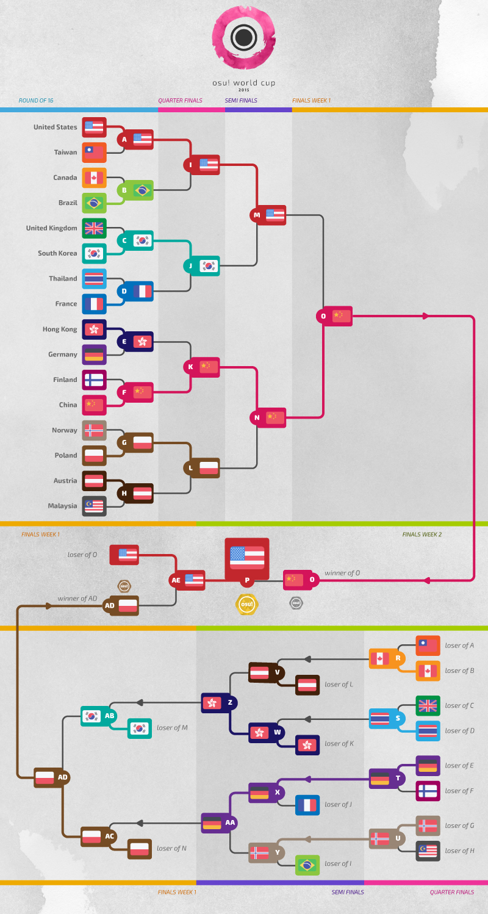

osu! World Cup 2015
===================

**osu! World Cup 2015** (***OWC 2015*** )是一个[Tournament Management](https://osu.ppy.sh/g/26)主办的以国家为单位的osu!比赛。这是第六次举办 osu! World Cup。

比赛日程
---------

| Event  | Timestamp                  |
|--------|----------------------------|
| 报名     | 01-18日 十月 2015年            |
| 抽签     | 1日 十一月 2015年 14.00 (UTC+0) |
| 小组赛    | 7-8日 十一月 2015年             |
| 十六强    | 14-15日 十一月 2015年           |
| 四分之一决赛 | 21-22日 十一月 2015年           |
| 半决赛    | 28-29日 十一月 2015年           |
| 决赛第一周  | 5-6日 十二月 2015年             |
| 决赛第二周  | 12-13日 十二月 2015年           |

奖项
-------

我们有最少$5000现金的奖池给这次世界杯。 你可以通过 **[购买Banner](https://store.ppy.sh/store/product/38)** 来支持它。

| Placing                                                    | Prizes                                      |
|------------------------------------------------------------|---------------------------------------------|
|    | 50% 奖池, profile badge, "osu! Champion" 用户标题 |
|  | 38% 奖池, profile badge                       |
|  | 12% 奖池l, profile badge                      |

比赛组织
----------

| Job          | Persons                                                                                                                                                                                                                                                                                                                                                                                                                                                                                                                                                   |
|--------------|-----------------------------------------------------------------------------------------------------------------------------------------------------------------------------------------------------------------------------------------------------------------------------------------------------------------------------------------------------------------------------------------------------------------------------------------------------------------------------------------------------------------------------------------------------------|
| 竞赛管理         | ![][flag_DE] [Loctav](https://osu.ppy.sh/u/71366) // ![][flag_DE] [p3n](https://osu.ppy.sh/u/123703) // ![][flag_ES] [Deif](https://osu.ppy.sh/u/318565) // ![][flag_FR] [shARPII](https://osu.ppy.sh/u/776257)                                                                                                                                                                                                                                                                                           |
| 地图选择         | ![][flag_FR] [Cherry Blossom](https://osu.ppy.sh/u/1156742) // ![][flag_HK] [Skystar](https://osu.ppy.sh/u/873961) // ![][flag_KR] [ToGlette](https://osu.ppy.sh/u/1076236)                                                                                                                                                                                                                                                                                                                                           |
| 直播           | ![][flag_DE] [Loctav](https://osu.ppy.sh/u/71366) // ![][flag_PL] [Marcin](https://osu.ppy.sh/u/722665)                                                                                                                                                                                                                                                                                                                                                                                                                           |
| 解说           | ![][flag_US] [Chippy](https://osu.ppy.sh/u/2314115) // ![][flag_NZ] [deadbeat](https://osu.ppy.sh/u/128370) // ![][flag_GB] [Doomsday](https://osu.ppy.sh/u/18983) // ![][flag_AR] [juankristal](https://osu.ppy.sh/u/443656) // ![][flag_GB] [Raiku](https://osu.ppy.sh/u/1525538) // ![][flag_US] [rfandomization](https://osu.ppy.sh/u/3716999) // ![][flag_US] [Zak](https://osu.ppy.sh/u/1375955) // ![][flag_US] [ztrot](https://osu.ppy.sh/u/6347) |
| Statistician | ![][flag_PL] [Marcin](https://osu.ppy.sh/u/722665)                                                                                                                                                                                                                                                                                                                                                                                                                                                                                            |

------------------------------------------------------------------------

链接
------

-   [osu! World Cup 2015 在 Twitch 上的直播](https://www.twitch.tv/osulive/)
-   [讨论页](https://osu.ppy.sh/forum/p/4550383)
-   [报名页](https://jizz.ppy.sh/tournaments/2)
-   [当前比赛的结果](https://docs.google.com/spreadsheets/d/1fpsfKUQi6ue0SusciKctumDDje5SxUC5NQ908mO9Jpw/pubhtml)
-   **[小组赛结果 (temporary)](https://docs.google.com/spreadsheets/d/1QGI7BxI7fOMhXSdgYbFqPGCTUUwfSrsAiUhibWu4xUk/pubhtml)**

------------------------------------------------------------------------

------------------------------------------------------------------------

------------------------------------------------------------------------

参加者
-----

| Top Seed                                          | High Seed                                     | Low Seed                                 | No Seed                                    |
|---------------------------------------------------|-----------------------------------------------|------------------------------------------|--------------------------------------------|
| ![][flag_CN] China              | ![][flag_AU] Australia      | ![][flag_AR] Argentina | ![][flag_GR] Greece      |
| ![][flag_FR] France             | ![][flag_AT] Austria        | ![][flag_JP] Japan     | ![][flag_IT] Italy       |
| ![][flag_DE] Germany            | ![][flag_BR] Brazil         | ![][flag_LV] Latvia    | ![][flag_MX] Mexico      |
| ![][flag_PL] Poland             | ![][flag_CA] Canada         | ![][flag_LT] Lithuania | ![][flag_NZ] New Zealand |
| ![][flag_RU] Russian Federation | ![][flag_FI] Finland        | ![][flag_MY] Malaysia  | ![][flag_PH] Philippines |
| ![][flag_KR] South Korea        | ![][flag_HK] Hong Kong      | ![][flag_NO] Norway    | ![][flag_PT] Portugal    |
| ![][flag_TW] Taiwan             | ![][flag_NL] Netherlands    | ![][flag_SE] Sweden    | ![][flag_SG] Singapore   |
| ![][flag_US] United States      | ![][flag_GB] United Kingdom | ![][flag_TH] Thailand  | ![][flag_UA] Ukraine     |

### Group A

|F|Country name|Team|
|:---:|:---:|:---|
|![Mx.gif][flag_MX]|**Mexico**|**[Broodich](https://osu.ppy.sh/u/2484629 "Broodich")**, [Id_Beat](https://osu.ppy.sh/u/3431380 "Id_Beat"), [Atheneon](https://osu.ppy.sh/u/2164627 "Atheneon"), [lndex](https://osu.ppy.sh/u/2038320 "lndex"), [Psycopath-](https://osu.ppy.sh/u/3233957 "Psycopath-"), [Eiikon](https://osu.ppy.sh/u/2553519 "Eiikon"), [KevEz](https://osu.ppy.sh/u/2271558 "KevEz"), [Atsuro](https://osu.ppy.sh/u/2279351 "Atsuro")|
|![My.gif][flag_MY]|**Malaysia**|**[ClawViper](https://osu.ppy.sh/u/2681361 "ClawViper")**, [xsrsbsns](https://osu.ppy.sh/u/414427 "xsrsbsns"), [Gon](https://osu.ppy.sh/u/583765 "Gon"), [Rumia-](https://osu.ppy.sh/u/1787171 "Rumia-"), [Ex6TenZ](https://osu.ppy.sh/u/2676512 "Ex6TenZ"), [caleb123456](https://osu.ppy.sh/u/2205376 "caleb123456"), [Rampax](https://osu.ppy.sh/u/3995630 "Rampax"), [Amane-](https://osu.ppy.sh/u/2276847 "Amane-")| 
|![Au.gif][flag_AU]|**Australia**|**[Bauxe](https://osu.ppy.sh/u/1881685 "Bauxe")**, [Tokichii](https://osu.ppy.sh/u/557197 "Tokichii"), [JappyBabes](https://osu.ppy.sh/u/697783 "JappyBabes"), [Meowt3dCheeze](https://osu.ppy.sh/u/634837 "Meowt3dCheeze"), [[ ZhengS ]](https://osu.ppy.sh/u/2671317 "[ ZhengS ]"), [Hexicate](https://osu.ppy.sh/u/2171562 "Hexicate"), [Jaybladezz](https://osu.ppy.sh/u/3725492 "Jaybladezz"), [Aloha](https://osu.ppy.sh/u/792176 "Aloha")| 
|![Us.gif][flag_US]|**United States**|**[Xilver](https://osu.ppy.sh/u/3099689 "Xilver")**, [Natalia](https://osu.ppy.sh/u/2162669 "Natalia"), [Axarious](https://osu.ppy.sh/u/2614511 "Axarious"), [Ritzeh](https://osu.ppy.sh/u/1028387 "Ritzeh"), [Seouless](https://osu.ppy.sh/u/3328676 "Seouless"), [0120](https://osu.ppy.sh/u/1901534 "0120"), [Zodiaack](https://osu.ppy.sh/u/3096229 "Zodiaack"), [[Toy]](https://osu.ppy.sh/u/2757689 "[Toy]")|

### Group B

|F|Country name|Team|
|:---:|:---:|:---|
|![It.gif][flag_IT]|**Italy**|**[xiAmME](https://osu.ppy.sh/u/1428960 "xiAmME")**, [Nemis](https://osu.ppy.sh/u/1635091 "Nemis"), [Kirin](https://osu.ppy.sh/u/1852356 "Kirin"), [DT-sama](https://osu.ppy.sh/u/3525018 "DT-sama"), [- Croma -](https://osu.ppy.sh/u/1752181 "- Croma -"), [Gian](https://osu.ppy.sh/u/2105981 "Gian"), [LLoyd-chan](https://osu.ppy.sh/u/2849149 "LLoyd-chan"), [umii](https://osu.ppy.sh/u/2538695 "umii")|
|![Lt.gif][flag_LT]|**Lithuania**|**[QonQuest](https://osu.ppy.sh/u/988503 "QonQuest")**, [Mazzerin](https://osu.ppy.sh/u/2942381 "Mazzerin"), [Auji](https://osu.ppy.sh/u/4114438 "Auji"), [PainSinger](https://osu.ppy.sh/u/697843 "PainSinger"), [Zinkon](https://osu.ppy.sh/u/85043 "Zinkon"), [Shelbis](https://osu.ppy.sh/u/2639159 "Shelbis"), [Midget](https://osu.ppy.sh/u/4141635 "Midget"), [Azerite](https://osu.ppy.sh/u/2562987 "Azerite")|
|![Hk.gif][flag_HK]|**Hong Kong**|**[- G I D Z -](https://osu.ppy.sh/u/2286528 "- G I D Z -")**, [Chaoslitz](https://osu.ppy.sh/u/3621552 "Chaoslitz"), [shAe1eck](https://osu.ppy.sh/u/1553672 "shAe1eck"), [MinG3012](https://osu.ppy.sh/u/1583218 "MinG3012"), [-N a n a k o-](https://osu.ppy.sh/u/1407516 "-N a n a k o-"), [clp012345](https://osu.ppy.sh/u/126144 "clp012345")|
|![Fr.gif][flag_FR]|**France**|**[Musty](https://osu.ppy.sh/u/251683 "Musty")**, [NerO](https://osu.ppy.sh/u/1545031 "NerO"), [Elysion](https://osu.ppy.sh/u/106269 "Elysion"), [Kynan](https://osu.ppy.sh/u/1093361 "Kynan"), [mrzomb](https://osu.ppy.sh/u/1694887 "mrzomb"), [filsdelama](https://osu.ppy.sh/u/2831793 "filsdelama"), [Shapy](https://osu.ppy.sh/u/2705769 "Shapy"), [FayeurS](https://osu.ppy.sh/u/3105416 "FayeurS")|

### Group C

|F|Country name|Team|
|:---:|:---:|:---|
|![Ua.gif][flag_UA]|**Ukraine**|**[Aka](https://osu.ppy.sh/u/1307553 "Aka")**, [wasisdasS](https://osu.ppy.sh/u/1999698 "wasisdasS"), [FllareA](https://osu.ppy.sh/u/1163931 "FllareA"), [Granje](https://osu.ppy.sh/u/496387 "Granje"), [-Ranndom-](https://osu.ppy.sh/u/5022536 "-Ranndom-"), [Yoru-hide](https://osu.ppy.sh/u/791121 "Yoru-hide"), [blednak](https://osu.ppy.sh/u/912627 "blednak")|
|![Lv.gif][flag_LV]|**Latvia**|**[LoGo](https://osu.ppy.sh/u/750382 "LoGo")**, [Forseen](https://osu.ppy.sh/u/556012 "Forseen"), [Emula](https://osu.ppy.sh/u/2891792 "Emula"), [Vmx](https://osu.ppy.sh/u/967501 "Vmx"), [Jesus[Krists]](https://osu.ppy.sh/u/2842992 "Jesus[Krists]"), [Edijs](https://osu.ppy.sh/u/2799835 "Edijs"), [xoho](https://osu.ppy.sh/u/3647897 "xoho")|
|![Ca.gif][flag_CA]|**Canada**|**[TrickMirror](https://osu.ppy.sh/u/2138739 "TrickMirror")**, [Azer](https://osu.ppy.sh/u/2155578 "Azer"), [Bowlglet](https://osu.ppy.sh/u/622485 "Bowlglet"), [Xenbo](https://osu.ppy.sh/u/1895489 "Xenbo"), [Ciao](https://osu.ppy.sh/u/2674642 "Ciao"), [MiruHong](https://osu.ppy.sh/u/2866814 "MiruHong"), [Ignite](https://osu.ppy.sh/u/3122948 "Ignite"), [Shina Kokomi](https://osu.ppy.sh/u/980956 "Shina Kokomi")| 
|![Pl.gif][flag_PL]|**Poland**|**[Wilchq](https://osu.ppy.sh/u/2021758 "Wilchq")**, [Rafis](https://osu.ppy.sh/u/2558286 "Rafis"), [WubWoofWolf](https://osu.ppy.sh/u/39828 "WubWoofWolf"), [AmaiHachimitsu](https://osu.ppy.sh/u/844815 "AmaiHachimitsu"), [r0ck](https://osu.ppy.sh/u/1549620 "r0ck"), [fartownik](https://osu.ppy.sh/u/56917 "fartownik"), [SpajdeR](https://osu.ppy.sh/u/3446664 "SpajdeR"), [Lucid Astray](https://osu.ppy.sh/u/1773225 "Lucid Astray")|

### Group D

|F|Country name|Team|
|:---:|:---:|:---|
|![Ph.gif][flag_PH]|**Philippines**|**[Takane Enomoto](https://osu.ppy.sh/u/1208491 "Takane Enomoto")**, [-Ryo](https://osu.ppy.sh/u/3113141 "-Ryo"), [KouNue](https://osu.ppy.sh/u/4180036 "KouNue"), [ededed028](https://osu.ppy.sh/u/3932796 "ededed028"), [Marika](https://osu.ppy.sh/u/1679638 "Marika"), [konawiki](https://osu.ppy.sh/u/4003979 "konawiki"), [---Mikoto](https://osu.ppy.sh/u/2911062 "---Mikoto"), [Gio](https://osu.ppy.sh/u/1795827 "Gio")|
|![Jp.gif][flag_JP]|**Japan**|**[Mercurius](https://osu.ppy.sh/u/589550 "Mercurius")**, [Poruteri](https://osu.ppy.sh/u/1379576 "Poruteri"), [OhAHO](https://osu.ppy.sh/u/1066760 "OhAHO"), [Roro Rosset](https://osu.ppy.sh/u/673214 "Roro Rosset"), [Super Arrow](https://osu.ppy.sh/u/1970239 "Super Arrow"), [NeruL](https://osu.ppy.sh/u/2497197 "NeruL"), [1o-chak](https://osu.ppy.sh/u/1401004 "1o-chak")|
|![Gb.gif][flag_GB]|**United Kingdom**|**[jesus1412](https://osu.ppy.sh/u/230116 "jesus1412")**, [Doomsday](https://osu.ppy.sh/u/18983 "Doomsday"), [Tasty Beverage](https://osu.ppy.sh/u/960620 "Tasty Beverage"), [Xim](https://osu.ppy.sh/u/2083664 "Xim"), [Raiku](https://osu.ppy.sh/u/1525538 "Raiku"), [Bubbleman](https://osu.ppy.sh/u/5182050 "Bubbleman"), [Run-Cat](https://osu.ppy.sh/u/4361729 "Run-Cat")|
|![Cn.gif][flag_CN]|**China**|**[MatsumotoRise](https://osu.ppy.sh/u/672726 "MatsumotoRise")**, [rustbell](https://osu.ppy.sh/u/227717 "rustbell"), [SpringLane](https://osu.ppy.sh/u/1343504 "SpringLane"), [Dsan](https://osu.ppy.sh/u/1266166 "Dsan"), [GGBY](https://osu.ppy.sh/u/629717 "GGBY"), [[ZN]](https://osu.ppy.sh/u/1030696 "[ZN]"), [Rixia Mao](https://osu.ppy.sh/u/3314431 "Rixia Mao"), [Toshinou Kyouko](https://osu.ppy.sh/u/560228 "Toshinou Kyouko")|

### Group E

|F|Country name|Team|
|:---:|:---:|:---|
|![Nz.gif][flag_NZ]|**New Zealand**|**[shortpotato](https://osu.ppy.sh/u/1266102 "shortpotato")**, [kiyumi](https://osu.ppy.sh/u/3701898 "kiyumi"), [a loli](https://osu.ppy.sh/u/1488796 "a loli"), [momochan](https://osu.ppy.sh/u/4827310 "momochan"), [[ Pustules ]](https://osu.ppy.sh/u/2419478 "[ Pustules ]"), [Tang](https://osu.ppy.sh/u/2162609 "Tang"), [yellowy246](https://osu.ppy.sh/u/3833980 "yellowy246"), [Grimacee](https://osu.ppy.sh/u/2352484 "Grimacee")|
|![Ar.gif][flag_AR]|**Argentina**|**[GaTu](https://osu.ppy.sh/u/3583351 "GaTu")**, [Enhu](https://osu.ppy.sh/u/2840499 "Enhu"), [Graphite Edge](https://osu.ppy.sh/u/825712 "Graphite Edge"), [benjacala](https://osu.ppy.sh/u/1625740 "benjacala"), [Fr0th](https://osu.ppy.sh/u/3458870 "Fr0th"), [Peingod](https://osu.ppy.sh/u/2212941 "Peingod"), [chucentry](https://osu.ppy.sh/u/2498731 "chucentry"), [Dreamcast](https://osu.ppy.sh/u/1565577 "Dreamcast")|
|![Fi.gif][flag_FI]|**Finland**|**[Sanze](https://osu.ppy.sh/u/3110552 "Sanze")**, [isokasapupuja](https://osu.ppy.sh/u/1770462 "isokasapupuja"), [huono_tuuri](https://osu.ppy.sh/u/1432954 "huono_tuuri"), [Poofie](https://osu.ppy.sh/u/3517198 "Poofie"), [nycto](https://osu.ppy.sh/u/2867764 "nycto"), [Hyppyri](https://osu.ppy.sh/u/3123423 "Hyppyri"), [Winner](https://osu.ppy.sh/u/3437263 "Winner"), [Incera](https://osu.ppy.sh/u/2159415 "Incera")|
|![Kr.gif][flag_KR]|**South Korea**|**[Neta](https://osu.ppy.sh/u/832084 "Neta")**, [Cinia Pacifica](https://osu.ppy.sh/u/1414625 "Cinia Pacifica"), [[Chiyo]](https://osu.ppy.sh/u/2000416 "[Chiyo]"), [- Hakurei Reimu-](https://osu.ppy.sh/u/948713 "- Hakurei Reimu-"), [Meltina](https://osu.ppy.sh/u/946990 "Meltina"), [Enon](https://osu.ppy.sh/u/2043401 "Enon"), [Gomo Pslvarh](https://osu.ppy.sh/u/1206417 "Gomo Pslvarh"), [eoehd1ek](https://osu.ppy.sh/u/3938876 "eoehd1ek")|

### Group F

|F|Country name|Team|
|:---:|:---:|:---|
|![Gr.gif][flag_GR]|**Greece**|**[Riven](https://osu.ppy.sh/u/3638005 "Riven")**, [ThePainG7](https://osu.ppy.sh/u/3478000 "ThePainG7"), [Tofas](https://osu.ppy.sh/u/2755584 "Tofas"), [SutiBu](https://osu.ppy.sh/u/2633472 "SutiBu"), [I Like Kimas](https://osu.ppy.sh/u/2490195 "I Like Kimas"), [JohnyZ](https://osu.ppy.sh/u/4508048 "JohnyZ")|
|![No.gif][flag_NO]|**Norway**|**[Tobi](https://osu.ppy.sh/u/2970667 "Tobi")**, [-GN](https://osu.ppy.sh/u/895581 "-GN"), [-PC](https://osu.ppy.sh/u/2916414 "-PC"), [Sebu](https://osu.ppy.sh/u/3990173 "Sebu"), [HundurThePanda](https://osu.ppy.sh/u/3145033 "HundurThePanda"), [warrock](https://osu.ppy.sh/u/2841744 "warrock"), [Liqh](https://osu.ppy.sh/u/3409838 "Liqh"), [CXu](https://osu.ppy.sh/u/84841 "CXu")|
|![Br.gif][flag_BR]|**Brazil**|**[fabriciorby](https://osu.ppy.sh/u/209664 "fabriciorby")**, [MouseEasy](https://osu.ppy.sh/u/1558603 "MouseEasy"), [Tio Fenrir](https://osu.ppy.sh/u/2644700 "Tio Fenrir"), [Sooki](https://osu.ppy.sh/u/1451811 "Sooki"), [Shott](https://osu.ppy.sh/u/965354 "Shott"), [Polaco](https://osu.ppy.sh/u/1057782 "Polaco"), [HideZ](https://osu.ppy.sh/u/504657 "HideZ"), [Miyazono](https://osu.ppy.sh/u/529036 "Miyazono")|
|![Ru.gif][flag_RU]|**Russian Federation**|**[talala](https://osu.ppy.sh/u/1389663 "talala")**, [KoTo](https://osu.ppy.sh/u/1382805 "KoTo"), [_index](https://osu.ppy.sh/u/652457 "_index"), [Shiawase](https://osu.ppy.sh/u/989489 "Shiawase"), [SoMad](https://osu.ppy.sh/u/637168 "SoMad"), [xantic](https://osu.ppy.sh/u/1897386 "xantic"), [Kert](https://osu.ppy.sh/u/119933 "Kert"), [Red_Pixel](https://osu.ppy.sh/u/4170932 "Red_Pixel")|

### Group G

|F|Country name|Team|
|:---:|:---:|:---|
|![Sg.gif][flag_SG]|**Singapore**|**[plaatinum](https://osu.ppy.sh/u/3385566 "plaatinum")**, [GSBlank](https://osu.ppy.sh/u/2312106 "GSBlank"), [Rtyzen](https://osu.ppy.sh/u/2439822 "Rtyzen"), [oneplusone](https://osu.ppy.sh/u/1843447 "oneplusone"), [Clyine](https://osu.ppy.sh/u/1275211 "Clyine"), [jcjc](https://osu.ppy.sh/u/1200275 "jcjc"), [-LeeP-](https://osu.ppy.sh/u/1143744 "-LeeP-"), [Tatch](https://osu.ppy.sh/u/2390650 "Tatch")|
|![Th.gif][flag_TH]|**Thailand**|**[FrostxE](https://osu.ppy.sh/u/199669 "FrostxE")**, [- Phantasma -](https://osu.ppy.sh/u/1427407 "- Phantasma -"), [bossm](https://osu.ppy.sh/u/654123 "bossm"), [Mikkuri](https://osu.ppy.sh/u/317494 "Mikkuri"), [NonxE](https://osu.ppy.sh/u/319312 "NonxE"), [Romantic](https://osu.ppy.sh/u/1592894 "Romantic")|
|![Nl.gif][flag_NL]|**Netherlands**|**[taku](https://osu.ppy.sh/u/684433 "taku")**, [jackylam5](https://osu.ppy.sh/u/1540807 "jackylam5"), [Pittigbaasje](https://osu.ppy.sh/u/2167433 "Pittigbaasje"), [HappyStick](https://osu.ppy.sh/u/256802 "HappyStick"), [Synchrostar](https://osu.ppy.sh/u/419705 "Synchrostar"), [Chidori](https://osu.ppy.sh/u/5258565 "Chidori"), [Menthuthuyoupi](https://osu.ppy.sh/u/2715937 "Menthuthuyoupi"), [Kyshiro](https://osu.ppy.sh/u/640611 "Kyshiro")|
|![De.gif][flag_DE]|**Germany**|**[Dustice](https://osu.ppy.sh/u/754565 "Dustice")**, [BDDav](https://osu.ppy.sh/u/1164526 "BDDav"), [Neliel](https://osu.ppy.sh/u/1500305 "Neliel"), [Beafowl](https://osu.ppy.sh/u/2438122 "Beafowl"), [Jonimay](https://osu.ppy.sh/u/1118341 "Jonimay"), [TobiGH3](https://osu.ppy.sh/u/3341040 "TobiGH3"), [W3SON](https://osu.ppy.sh/u/2070822 "W3SON"), [cptnXn](https://osu.ppy.sh/u/495272 "cptnXn")|

### Group H

|F|Country name|Team|
|:---:|:---:|:---|
|![Pt.gif][flag_PT]|**Portugal**|**[kek](https://osu.ppy.sh/u/2148013 "kek")**, [Osama](https://osu.ppy.sh/u/799218 "Osama"), [Mizuru](https://osu.ppy.sh/u/4495871 "Mizuru"), [AA00AA](https://osu.ppy.sh/u/2928612 "AA00AA"), [Zenden](https://osu.ppy.sh/u/3070694 "Zenden"), [PedroLipton](https://osu.ppy.sh/u/3272012 "PedroLipton")|
|![Se.gif][flag_SE]|**Sweden**|**[Xytox](https://osu.ppy.sh/u/2229274 "Xytox")**, [Slizzer](https://osu.ppy.sh/u/809983 "Slizzer"), [SnickarN](https://osu.ppy.sh/u/3258429 "SnickarN"), [AntoN](https://osu.ppy.sh/u/2538562 "AntoN"), [Bubba](https://osu.ppy.sh/u/2330524 "Bubba"), [IVo one](https://osu.ppy.sh/u/3623465 "IVo one"), [Sebbe](https://osu.ppy.sh/u/3181965 "Sebbe"), [Xiniox](https://osu.ppy.sh/u/5233691 "Xiniox")|
|![At.gif][flag_AT]|**Austria**|**[Fedora Goose](https://osu.ppy.sh/u/2323131 "Fedora Goose")**, [Omgforz](https://osu.ppy.sh/u/578943 "Omgforz"), [Alumetorz](https://osu.ppy.sh/u/1145984 "Alumetorz"), [BlueFlame](https://osu.ppy.sh/u/3506191 "BlueFlame"), [Shirone](https://osu.ppy.sh/u/1426098 "Shirone"), [Elscar](https://osu.ppy.sh/u/2253511 "Elscar"), [Hakkero](https://osu.ppy.sh/u/177913 "Hakkero"), [skritsch](https://osu.ppy.sh/u/3323141 "skritsch")|
|![Tw.gif][flag_TW]|**Taiwan**|**[Rucker](https://osu.ppy.sh/u/147515 "Rucker")**, [hvick225](https://osu.ppy.sh/u/50265 "hvick225"), [Small K](https://osu.ppy.sh/u/952751 "Small K"), [YuyuKo sama](https://osu.ppy.sh/u/234788 "YuyuKo sama"), [Uan](https://osu.ppy.sh/u/147623 "Uan"), [dabanlong](https://osu.ppy.sh/u/624254 "dabanlong"), [zxxzxxz](https://osu.ppy.sh/u/1646474 "zxxzxxz"), [RedLeaf](https://osu.ppy.sh/u/2703742 "RedLeaf")|

------------------------------------------------------------------------

图池
--------

### 决赛

**这个图池将会被用于决赛第一周和第二周。**

**[在这里下载图包](https://www.mediafire.com/download/22q8exrnwiyxfn1/OWC_2015_Finals.rar)**

| NoMod                                                                                             |
|---------------------------------------------------------------------------------------------------|
| [Reol - Asymmetry (Skystar) \[Asphewin's Expert\]](https://osu.ppy.sh/b/698249)                         |
| [Rohi - Kakuzetsu Thanatos (NatsumeRin) \[Rin\]](https://osu.ppy.sh/b/215238)                           |
| [Megpoid GUMI - Rubik's Cube (wcx19911123) \[Cube\]](https://osu.ppy.sh/b/132466)                       |
| [Hitori Tori - perthed again (yambabom remix) (Asphyxia) \[Zapy's Extra\]](https://osu.ppy.sh/b/611753) |
| [FOLiACETATE - Heterochromia Iridis (ktgster) \[Terror\]](https://osu.ppy.sh/b/279481)                  |
| [xi - FREEDOM DiVE (Nakagawa-Kanon) \[Another\]](https://osu.ppy.sh/b/126645)                           |

| Hidden                                                                                          |
|-------------------------------------------------------------------------------------------------|
| [Pierce The Veil - King For A Day (feat Kellin Quinn) (pishifat) \[Ex\]](https://osu.ppy.sh/b/684163) |
| [Foreground Eclipse - To The Terminus (Giralda) \[Skystar's Extra\]](https://osu.ppy.sh/b/628755)     |
| [DJ Sharpnel - IVALTEK (happy30) \[HappyMiX\]](https://osu.ppy.sh/b/154988)                           |

| HardRock                                                                              |
|---------------------------------------------------------------------------------------|
| [yanaginagi - Muteki no Soldier (BinJip) \[Invincible\]](https://osu.ppy.sh/b/182001)       |
| [Qrispy Joybox - licca (Minakami Yuki) \[Skystar's Expert\]](https://osu.ppy.sh/b/690608)   |
| [Glamour of the Kill - A Hope in Hell (ykcarrot) \[Hopeless\]](https://osu.ppy.sh/b/104389) |

| DoubleTime                                                                                    |
|-----------------------------------------------------------------------------------------------|
| [kaztora, eba, Misaki Nakajima - Messiah (Shinxyn) \[Insane\]](https://osu.ppy.sh/b/75689)          |
| [Tristam - Once Again (grumd) \[Collab\]](https://osu.ppy.sh/b/502418)                              |
| [Matsumoto Sara - Ito Hakanaki Hikari no Gotoku (Mixagji) \[Lunatic\]](https://osu.ppy.sh/b/308350) |

| FreeMod                                                                                          |
|--------------------------------------------------------------------------------------------------|
| [Morimori Atsushi - PUPA (Cherry Blossom) \[Butterfly\]](https://osu.ppy.sh/b/523376)                  |
| [LEAF XCEED Music Division - YuYu Metal (DoKoLP) \[DoKo\]](https://osu.ppy.sh/b/142145)                |
| [Suzumu - Kakumeisei ousama densenbyou (tutuhaha) \[AngelHoney's Extra\]](https://osu.ppy.sh/b/701528) |

| Tiebreaker                                                                             |
|----------------------------------------------------------------------------------------|
| [gmtn. (witch's slave) - furioso melodia (Alumetorz) \[Wrath\]](https://osu.ppy.sh/b/633993) |

### 半决赛

**[在这里下载图包](https://www.mediafire.com/download/rm2w6we4i90dhc5/OWC_2015_Semifinals.rar)**

| NoMod                                                                        |
|------------------------------------------------------------------------------|
| [Reol - Streaming Heart (sukiNathan) \[Extra\]](https://osu.ppy.sh/b/760466)       |
| [Hatsuki Yura - Yoiyami Hanabi (Lan wings) \[Lan\]](https://osu.ppy.sh/b/297463)   |
| [Nanahoshi Kangengakudan - Meikaruza (pkk) \[Extra\]](https://osu.ppy.sh/b/701033) |
| [Function Phantom - Algebra (Bonzi) \[Incomputable\]](https://osu.ppy.sh/b/673275) |
| [Igorrr - Tout Petit Moineau (fergas) \[Extra\]](https://osu.ppy.sh/b/517308)      |
| [t+pazolite - cheatreal (caren\_sk) \[Extra\]](https://osu.ppy.sh/b/240488)        |

| Hidden                                                                                                |
|-------------------------------------------------------------------------------------------------------|
| [BoA - Kiseki (Hinsvar) \[Miracle\]](https://osu.ppy.sh/b/370612)                                           |
| [Demetori - Furuki Yuanxian ~ Death Echo (jonathanlfj) \[Extra Stage Collab\]](https://osu.ppy.sh/b/656385) |
| [sasakure.UK - Jack-the-Ripper (Sprosive) \[JackHasCome!\]](https://osu.ppy.sh/b/81560)                     |

| HardRock                                                         |
|------------------------------------------------------------------|
| [Memme - Starving Days (Gamu) \[Extra\]](https://osu.ppy.sh/b/625507)  |
| [EGOIST - Fallen (jonathanlfj) \[Extra\]](https://osu.ppy.sh/b/538930) |
| [cranky - R176 (taka1235) \[Another\]](https://osu.ppy.sh/b/103102)    |

| DoubleTime                                                               |
|--------------------------------------------------------------------------|
| [Meg & Dia - Black Wedding (Larto) \[Crazy!\]](https://osu.ppy.sh/b/101115)    |
| [yanaginagi - landscape (\[Vincent\]) \[Insane\]](https://osu.ppy.sh/b/563370) |
| [Tsunamaru - paranoia (Chewin) \[RLC\]](https://osu.ppy.sh/b/226563)           |

| FreeMod                                                                             |
|-------------------------------------------------------------------------------------|
| [Renard - Banned Forever (Blue Dragon) \[Lesjuh\]](https://osu.ppy.sh/b/64266)            |
| [Cutline - Die For You (Shock One Remix) (Regou) \[Insane\]](https://osu.ppy.sh/b/404550) |
| [HoneyWorks - Akatsuki Zukuyo (Fast) \[Twilight\]](https://osu.ppy.sh/b/736729)           |

| Tiebreaker                                                                   |
|------------------------------------------------------------------------------|
| [Ohka - Nanairo Anniversary (Rizia) \[Kaleidoscope\]](https://osu.ppy.sh/b/541044) |

### 四分之一决赛

**[在这里下载图包](https://www.mediafire.com/download/l4zdsy0ujeq8xz3/OWC_2015_Quarterfinals.rar)**

| NoMod                                                                                           |
|-------------------------------------------------------------------------------------------------|
| [ALiCE'S EMOTiON - Dark Flight Dreamer (Sakaue Nachi) \[Dreamer\]](https://osu.ppy.sh/b/676172)       |
| [IA - Six Trillion Years and Overnight Story (NatsumeRin) \[0108\]](https://osu.ppy.sh/b/157861)      |
| [xi - Wish upon Twin Stars (Chaoslitz) \[Wish\]](https://osu.ppy.sh/b/559673)                         |
| [rerulili - Noushou Sakuretsu Girl (NatsumeRin) \[Rin\]](https://osu.ppy.sh/b/187410)                 |
| [siqlo - Forest Haze (Lust) \[Leader's Extra\]](https://osu.ppy.sh/b/656723)                          |
| [Hiroyuki Sawano feat. Mika Kobayashi - Bios (goodbye) \[LKs' Another\]](https://osu.ppy.sh/b/137766) |

| Hidden                                                                                                |
|-------------------------------------------------------------------------------------------------------|
| [Sota Fujimori - Move That Body -Extended Mix- (Amamiya Yuko) \[RLC's Extra\]](https://osu.ppy.sh/b/542336) |
| [Tatsh - Cruel Moon (Shinxyn) \[Lunatic\]](https://osu.ppy.sh/b/50148)                                      |
| [ETIA. - Lost Love (JJburstOwO) \[Last Eve\]](https://osu.ppy.sh/b/755900)                                  |

| HardRock                                                                                                   |
|------------------------------------------------------------------------------------------------------------|
| [Hanatan - If (Rakuen) \[wkyik's Insane\]](https://osu.ppy.sh/b/587577)                                          |
| [Project Grimoire - Caliburne ~Story of the Legendary sword~ (Mikkuri) \[Extra\]](https://osu.ppy.sh/b/742975)   |
| [Nekomata Master - Far east nightbird (kors k Remix) (jonathanlfj) \[RLC's Extra\]](https://osu.ppy.sh/b/358273) |

| DoubleTime                                                              |
|-------------------------------------------------------------------------|
| [senya - Yukitoke Realism (wring) \[Lunatic\]](https://osu.ppy.sh/b/579751)   |
| [ichigo - YU-MU (Louis Cyphre) \[Extra\]](https://osu.ppy.sh/b/128074)        |
| [ClariS - with you (10nya) \[Laurier's Insane\]](https://osu.ppy.sh/b/380012) |

| FreeMod                                                                                  |
|------------------------------------------------------------------------------------------|
| [Zeami feat. Tenshi - Tenyou no Mai (smallboat) \[Yuki's Extra\]](https://osu.ppy.sh/b/434118) |
| [APG550 - NEVERLAND (Natsu) \[Yuny\]](https://osu.ppy.sh/b/776749)                             |
| [Rita - Dream Walker (Amamiya Yuko) \[Ethereal\]](https://osu.ppy.sh/b/722934)                 |

| Tiebreaker                                                                                  |
|---------------------------------------------------------------------------------------------|
| [Our Stolen Theory - United (L.A.O.S Remix) (Asphyxia) \[Infinity\]](https://osu.ppy.sh/b/550235) |

### 十六强

**[在这里下载图包](https://www.mediafire.com/download/r21yp0iu2zgkkln/OWC_2015_Round_of_16.rar)**

| NoMod                                                                              |
|------------------------------------------------------------------------------------|
| [Sharlo & yealina - Kakushigoto (Sharlo) \[RLC's Extra\]](https://osu.ppy.sh/b/495899)   |
| [RedMuffleR - Rubeus (Smoothie World) \[GRAVITY\]](https://osu.ppy.sh/b/574050)          |
| [Gentle Stick X M2U - Ineffabilis (buhei) \[Extreme\]](https://osu.ppy.sh/b/753968)      |
| [Function Phantom - Neuronecia (Amamiya Yuko) \[Ethereal\]](https://osu.ppy.sh/b/541990) |
| [himmeltengoku - Whisper of Rose (Tsukuyomi) \[Maximum\]](https://osu.ppy.sh/b/419487)   |
| [Megpoid GUMI - Cosmos (val0108) \[Cosmos\]](https://osu.ppy.sh/b/123374)                |

| Hidden                                                                               |
|--------------------------------------------------------------------------------------|
| [Pendulum - Watercolour (Kecco) \[Extra\]](https://osu.ppy.sh/b/569735)                    |
| [U1 overground - Dopamine (fanzhen0019) \[Kotori's EXTREME\]](https://osu.ppy.sh/b/533622) |
| [Shoichiro Sakamoto - Eye of Aeon (KanaRin) \[Aeon\]](https://osu.ppy.sh/b/89362)          |

| HardRock                                                                 |
|--------------------------------------------------------------------------|
| [LhoU - Highlander (Cherry Blossom) \[Extra\]](https://osu.ppy.sh/b/406247)    |
| [yuikonnu - Otsukimi Recital (Mythol) \[Collab\]](https://osu.ppy.sh/b/282251) |
| [Raujika - Land of Grace (Strawberry) \[Gracy\]](https://osu.ppy.sh/b/209203)  |

| DoubleTime                                                                              |
|-----------------------------------------------------------------------------------------|
| [Yoshida Mayumi - Zutto Kono Mama... (Mythol) \[cRyo's Insane\]](https://osu.ppy.sh/b/196280) |
| [capitaro - Karen Aikyou Hanasaka gumi (Tari) \[Insane\]](https://osu.ppy.sh/b/720614)        |
| [ChouCho - My dear friend (Delis) \[Insane\]](https://osu.ppy.sh/b/486131)                    |

| FreeMod                                                                                     |
|---------------------------------------------------------------------------------------------|
| [DJ YOSHITAKA - FLOWER (Apricot) \[EXTREME\]](https://osu.ppy.sh/b/128780)                        |
| [senya - Kanjou Chemistry (Drum 'n' Bass Remix) (Satellite) \[Exw\]](https://osu.ppy.sh/b/255700) |
| [yuikonnu - Chikyuu Saigo no Kokuhaku o (Fycho) \[Insane\]](https://osu.ppy.sh/b/494798)          |

| Tiebreaker                                                                                                       |
|------------------------------------------------------------------------------------------------------------------|
| [Wakeshima Kanon - World's End, Girl's Rondo(Asterisk DnB Remix) (Meg) \[We cry "OPEN"\]](https://osu.ppy.sh/b/734339) |

### 小组赛

**[在这里下载图包](https://www.mediafire.com/download/4mmsagzc3mg6g13/OWC_2015_Group_Stage.rar)**

| NoMod                                                                                             |
|---------------------------------------------------------------------------------------------------|
| [Duca - COLD BUTTERFLY (Zweib) \[Insane\]](https://osu.ppy.sh/b/363063)                                 |
| [Kagamine Rin - Black Rebel (val0108) \[0108 Rebel\]](https://osu.ppy.sh/b/109301)                      |
| [Mary - Artificial Rose (Urushi38) \[Another\]](https://osu.ppy.sh/b/264439)                            |
| [Kousaki Satoru - Gekiretsu de Kareinaru Hibi (Zero\_\_wind) \[Ba Ba Ba\]](https://osu.ppy.sh/b/400564) |
| [Afilia Saga - S.M.L (Tari) \[Insane\]](https://osu.ppy.sh/b/361263)                                    |
| [ARM feat. Nanahira - Bakunana\*Testroyer (intoon) \[Kami's Another\]](https://osu.ppy.sh/b/682074)     |

| Hidden                                                                         |
|--------------------------------------------------------------------------------|
| [MiddleIsland - Magnetic Shift (Natsu) \[UWS's Extra\]](https://osu.ppy.sh/b/379411) |
| [96Neko - Yoshiwara Lament (Minakami Yuki) \[Insane\]](https://osu.ppy.sh/b/451227)  |
| [Kagamine Rin - Tokyo Teddy Bear (NatsumeRin) \[Rin\]](https://osu.ppy.sh/b/127138)  |

| HardRock                                                                                                              |
|-----------------------------------------------------------------------------------------------------------------------|
| [Uchida Maaya - Hana Tsubomi Yume Miru Kyoushikyoku ~Tamashii no Shirube~ (Mythol) \[Insane\]](https://osu.ppy.sh/b/244182) |
| [Kotoge Mai - Mangekyou (Oracle) \[cRyo's Insane\]](https://osu.ppy.sh/b/535334)                                            |
| [Nekomata Master feat. \*spiLa\* - Clumsy thoughts (Kawaiwkyik) \[Insane\]](https://osu.ppy.sh/b/454158)                    |

| DoubleTime                                                                     |
|--------------------------------------------------------------------------------|
| [Hatsuki Yura - Ganbare! Koi no Hana (Kotone) \[Hana\]](https://osu.ppy.sh/b/167963) |
| [senya - Bondage Anemonation (Satellite) \[Lunatic\]](https://osu.ppy.sh/b/323264)   |
| [Chata - anesthesia (hoLysoup) \[Anesthesia\]](https://osu.ppy.sh/b/216690)          |

| FreeMod                                                                                               |
|-------------------------------------------------------------------------------------------------------|
| [DJ Fresh (feat. Rita Ora) - Hot Right Now (Radio Edit) (Asphyxia) \[Insane\]](https://osu.ppy.sh/b/537235) |
| [yuikonnu - Natsu no Owari, Koi no Hajimari (xChippy) \[Insane\]](https://osu.ppy.sh/b/486613)              |
| [Jin - Outer Science (tutuhaha) \[Insane\]](https://osu.ppy.sh/b/313025)                                    |

| Tiebreaker                                                                                     |
|------------------------------------------------------------------------------------------------|
| [Sawai Miku - Colorful. (Asterisk DnB Remix) (Amamiya Yuko) \[Megumi\]](https://osu.ppy.sh/b/722224) |

------------------------------------------------------------------------

比赛结果
---------

### 总决赛

**星期日 13日 十二月 2015年**

| 队 A                                              | Score           | 队 B                                              | History                        |
|:-------------------------------------------------|:---------------:|-------------------------------------------------:|--------------------------------|
| ![][flag_CN] China             | 2       - **7** | **United States** ![][flag_US] | [#1](https://osu.ppy.sh/mp/20910697) |
| ![][flag_US] **United States** | **7**   - 6     | China ![][flag_CN]             | [#1](https://osu.ppy.sh/mp/20912739) |

### 决赛第一周

**星期六 5日 十二月 2015年**

| 队 A                                          | Score          | 队 B                                            | History                        |
|:---------------------------------------------|:--------------:|-----------------------------------------------:|--------------------------------|
| ![][flag_US] United States | 3      - **6** | **China** ![][flag_CN]       | [#1](https://osu.ppy.sh/mp/20711754) |
| ![][flag_HK] Hong Kong     | 0      - **6** | **South Korea** ![][flag_KR] | [#1](https://osu.ppy.sh/mp/20713615) |
| ![][flag_DE] Germany       | 2      - **6** | **Poland** ![][flag_PL]      | [#1](https://osu.ppy.sh/mp/20717055) |
| ![][flag_PL] **Poland**    | **6**  - 3     | South Korea ![][flag_KR]     | [#1](https://osu.ppy.sh/mp/20719563) |

**周日 6日 十二月 2015年**

| 队 A                                              | Score      | 队 B                                   | History                        |
|:-------------------------------------------------|:----------:|--------------------------------------:|--------------------------------|
| ![][flag_US] **United States** | **6**  - 3 | Poland ![][flag_PL] | [#1](https://osu.ppy.sh/mp/20762171) |

### 半决赛

**星期六 28日 十一月 2015年**

| 队 A                                              | Score         | 队 B                                          | History                        |
|:-------------------------------------------------|:-------------:|---------------------------------------------:|--------------------------------|
| ![][flag_US] **United States** | **6** - 2     | South Korea ![][flag_KR]   | [#1](https://osu.ppy.sh/mp/20553676) |
| ![][flag_TH] Thailand          | 2     - **6** | **Hong Kong** ![][flag_HK] | [#1](https://osu.ppy.sh/mp/20555273) |
| ![][flag_CN] **China**         | **6** - 2     | Poland ![][flag_PL]        | [#1](https://osu.ppy.sh/mp/20556916) |
| ![][flag_DE] **Germany**       | **6** - 2     | France ![][flag_FR]        | [#1](https://osu.ppy.sh/mp/20558712) |
| ![][flag_NO] **Norway**        | **6** - 2     | Brazil ![][flag_BR]        | [#1](https://osu.ppy.sh/mp/20561290) |
| ![][flag_DE] **Germany**       | **6** - 3     | Norway ![][flag_NO]        | [#1](https://osu.ppy.sh/mp/20570952) |
| ![][flag_CA] Canada            | 5     - **6** | **Austria** ![][flag_AT]   | [#1](https://osu.ppy.sh/mp/20574246) |

**Sunday, 29. November 2015**

| 队 A                                    | Score          | 队 B                                          | History                        |
|:---------------------------------------|:--------------:|---------------------------------------------:|--------------------------------|
| ![][flag_AT] Austria | 4      - **6** | **Hong Kong** ![][flag_HK] | [#1](https://osu.ppy.sh/mp/20591359) |

### 四分之一决赛

**星期六 21日 十一月 2015年**

| 队 A                                              | Score     | 队 B                                   | History                        |
|:-------------------------------------------------|:---------:|--------------------------------------:|--------------------------------|
| ![][flag_US] **United States** | **5** - 2 | Brazil ![][flag_BR] | [#1](https://osu.ppy.sh/mp/20411352) |

**星期日 22日 十一月 2015年**

| 队 A                                            | Score          | 队 B                                         | History                        |
|:-----------------------------------------------|:--------------:|--------------------------------------------:|--------------------------------|
| ![][flag_TW] Taiwan          | 4      - **5** | **Canada** ![][flag_CA]   | [#1](https://osu.ppy.sh/mp/20423117) |
| ![][flag_HK] Hong Kong       | 2      - **5** | **China** ![][flag_CN]    | [#1](https://osu.ppy.sh/mp/20424826) |
| ![][flag_KR] **South Korea** | **5**  - 3     | France ![][flag_FR]       | [#1](https://osu.ppy.sh/mp/20426594) |
| ![][flag_NO] **Norway**      | **5**  - 2     | Malaysia ![][flag_MY]     | [#1](https://osu.ppy.sh/mp/20427714) |
| ![][flag_GB] United Kingdom  | 3      - **5** | **Thailand** ![][flag_TH] | [#1](https://osu.ppy.sh/mp/20429267) |
| ![][flag_DE] **Germany**     | **5**  - 1     | Finland ![][flag_FI]      | [#1](https://osu.ppy.sh/mp/20430864) |
| ![][flag_PL] **Poland**      | **5**  - 0     | Austria ![][flag_AT]      | [#1](https://osu.ppy.sh/mp/20432995) |

### 十六强

**星期日 15日 十一月2015 年**

| 队 A                                              | Score          | 队 B                                            | History                        |
|:-------------------------------------------------|:--------------:|-----------------------------------------------:|--------------------------------|
| ![][flag_US] **United States** | **5**  - 4     | Taiwan ![][flag_TW]          | [#1](https://osu.ppy.sh/mp/20269690) |
| ![][flag_FI] Finland           | 0      - **5** | **China** ![][flag_CN]       | [#1](https://osu.ppy.sh/mp/20273790) |
| ![][flag_AT] **Austria**       | **5**  - 0     | Malaysia ![][flag_MY]        | [#1](https://osu.ppy.sh/mp/20275097) |
| ![][flag_HK] **Hong Kong**     | **5**  - 3     | Germany ![][flag_DE]         | [#1](https://osu.ppy.sh/mp/20276700) |
| ![][flag_GB] United Kingdom    | 2      - **5** | **South Korea** ![][flag_KR] | [#1](https://osu.ppy.sh/mp/20278584) |
| ![][flag_TH] Thailand          | 2      - **5** | **France** ![][flag_FR]      | [#1](https://osu.ppy.sh/mp/20280529) |
| ![][flag_NO] Norway            | 0      - **5** | **Poland** ![][flag_PL]      | [#1](https://osu.ppy.sh/mp/20285332) |
| ![][flag_CA] Canada            | 1      - **5** | **Brazil** ![][flag_BR]      | [#1](https://osu.ppy.sh/mp/20287601) |

### 小组赛

**星期六 8日 十一月 2015年**

| 队 A                                           | Score         | 队 B                                                   | History                        |
|:----------------------------------------------|:-------------:|------------------------------------------------------:|--------------------------------|
| ![][flag_AT] **Austria**    | **4** - 1     | Taiwan ![][flag_TW]                 | [#1](https://osu.ppy.sh/mp/20091839) |
| ![][flag_NZ] New Zealand    | 3     - **4** | **Finland** ![][flag_FI]            | [#1](https://osu.ppy.sh/mp/20091841) |
| ![][flag_MY] **Malaysia**   | **4** - 1     | Australia ![][flag_AU]              | [#1](https://osu.ppy.sh/mp/20091844) |
| ![][flag_PH] Philippines    | 1     - **4** | **Japan** ![][flag_JP]              | [#1](https://osu.ppy.sh/mp/20091847) |
| ![][flag_SG] Singapore      | 0     - **4** | **Germany** ![][flag_DE]            | [#1](https://osu.ppy.sh/mp/20092909) |
| ![][flag_TH] Thailand       | 1     - **4** | **Netherlands** ![][flag_NL]        | [#1](https://osu.ppy.sh/mp/20092910) |
| ![][flag_GB] United Kingdom | 1     - **4** | **China** ![][flag_CN]              | [#1](https://osu.ppy.sh/mp/20092912) |
| ![][flag_LT] Lithuania      | 1     - **4** | **France** ![][flag_FR]             | [#1](https://osu.ppy.sh/mp/20094037) |
| ![][flag_IT] Italy          | 1     - **4** | **Hong Kong** ![][flag_HK]          | [#1](https://osu.ppy.sh/mp/20094040) |
| ![][flag_PT] Portugal       | 3     - **4** | **Taiwan** ![][flag_TW]             | [#1](https://osu.ppy.sh/mp/20094042) |
| ![][flag_SG] Singapore      | 3     - **4** | **Thailand** ![][flag_TH]           | [#1](https://osu.ppy.sh/mp/20095460) |
| ![][flag_PH] Philippines    | 0     - **4** | **United Kingdom** ![][flag_GB]     | [#1](https://osu.ppy.sh/mp/20095461) |
| ![][flag_AR] Argentina      | 0     - **4** | **South Korea** ![][flag_KR]        | [#1](https://osu.ppy.sh/mp/20095462) |
| ![][flag_GR] Greece         | 0     - **4** | **Russian Federation** ![][flag_RU] | [#1](https://osu.ppy.sh/mp/20105876) |
| ![][flag_CA] Canada         | 0     - **4** | **Poland** ![][flag_PL]             | [#1](https://osu.ppy.sh/mp/20105877) |
| ![][flag_PT] Portugal       | 1     - **4** | **Austria** ![][flag_AT]            | [#1](https://osu.ppy.sh/mp/20105878) |
| ![][flag_UA] **Ukraine**    | **4** - 1     | Latvia ![][flag_LV]                 | [#1](https://osu.ppy.sh/mp/20107684) |
| ![][flag_AR] Argentina      | 3     - **4** | **Finland** ![][flag_FI]            | [#1](https://osu.ppy.sh/mp/20107685) |
| ![][flag_NO] Norway         | 2     - **4** | **Brazil** ![][flag_BR]             | [#1](https://osu.ppy.sh/mp/20109708) |
| ![][flag_SE] Sweden         | 2     - **4** | **Austria** ![][flag_AT]            | [#1](https://osu.ppy.sh/mp/20109709) |

**星期日 9日 十一月 2015年**

| 队 A                                            | Score          | 队 B                                               | History                        |
|:-----------------------------------------------|:--------------:|--------------------------------------------------:|--------------------------------|
| ![][flag_NZ] **New Zealand** | **4**  - 0     | Argentina ![][flag_AR]          | [#1](https://osu.ppy.sh/mp/20115243) |
| ![][flag_MX] Mexico          | 1      - **4** | **Australia** ![][flag_AU]      | [#1](https://osu.ppy.sh/mp/20114985) |
| ![][flag_MY] Malaysia        | 1      - **4** | **United States** ![][flag_US]  | [#1](https://osu.ppy.sh/mp/20116482) |
| ![][flag_JP] Japan           | 1      - **4** | **China** ![][flag_CN]          | [#1](https://osu.ppy.sh/mp/20116483) |
| ![][flag_NZ] New Zealand     | 1      - **4** | **South Korea** ![][flag_KR]    | [#1](https://osu.ppy.sh/mp/20117565) |
| ![][flag_MX] Mexico          | 0      - **4** | **Malaysia** ![][flag_MY]       | [#1](https://osu.ppy.sh/mp/20117566) |
| ![][flag_AU] Australia       | 1      - **4** | **United States** ![][flag_US]  | [#1](https://osu.ppy.sh/mp/20117569) |
| ![][flag_SE] Sweden          | 1      - **4** | **Taiwan** ![][flag_TW]         | [#1](https://osu.ppy.sh/mp/20125092) |
| ![][flag_PH] Philippines     | 1      - **4** | **China** ![][flag_CN]          | [#1](https://osu.ppy.sh/mp/20125093) |
| ![][flag_HK] Hong Kong       | 2      - **4** | **France** ![][flag_FR]         | [#1](https://osu.ppy.sh/mp/20126344) |
| ![][flag_FI] Finland         | 1      - **4** | **South Korea** ![][flag_KR]    | [#1](https://osu.ppy.sh/mp/20126352) |
| ![][flag_TH] **Thailand**    | **4**  - 0     | Germany ![][flag_DE]            | [#1](https://osu.ppy.sh/mp/20126358) |
| ![][flag_JP] Japan           | 0      - **4** | **United Kingdom** ![][flag_GB] | [#1](https://osu.ppy.sh/mp/20127886) |
| ![][flag_UA] Ukraine         | 0      - **4** | **Poland** ![][flag_PL]         | [#1](https://osu.ppy.sh/mp/20127887) |
| ![][flag_SG] Singapore       | 2      - **4** | **Netherlands** ![][flag_NL]    | [#1](https://osu.ppy.sh/mp/20127888) |
| ![][flag_LT] Lithuania       | 2      - **4** | **Hong Kong** ![][flag_HK]      | [#1](https://osu.ppy.sh/mp/20129481) |
| ![][flag_PT] **Portugal**    | **4**  - 3     | Sweden ![][flag_SE]             | [#1](https://osu.ppy.sh/mp/20129484) |
| ![][flag_IT] Italy           | 2      - **4** | **France** ![][flag_FR]         | [#1](https://osu.ppy.sh/mp/20133656) |
| ![][flag_GR] Greece          | 0      - **4** | **Brazil** ![][flag_BR]         | [#1](https://osu.ppy.sh/mp/20133657) |
| ![][flag_NO] **Norway**      | **4**  - 2     | Russian Federation ![][flag_RU] | [#1](https://osu.ppy.sh/mp/20133658) |
| ![][flag_NL] Netherlands     | 0      - **4** | **Germany** ![][flag_DE]        | [#1](https://osu.ppy.sh/mp/20135079) |
| ![][flag_LV] Latvia          | 1      - **4** | **Canada** ![][flag_CA]         | [#1](https://osu.ppy.sh/mp/20135084) |
| ![][flag_IT] Italy           | 3      - **4** | **Lithuania** ![][flag_LT]      | [#1](https://osu.ppy.sh/mp/20136741) |
| ![][flag_BR] **Brazil**      | **4**  - 3     | Russian Federation ![][flag_RU] | [#1](https://osu.ppy.sh/mp/20136742) |
| ![][flag_GR] Greece          | 0      - **4** | **Norway** ![][flag_NO]         | [#1](https://osu.ppy.sh/mp/20136743) |
| ![][flag_MX] Mexico          | 0      - **4** | **United States** ![][flag_US]  | [#1](https://osu.ppy.sh/mp/20138453) |
| ![][flag_UA] Ukraine         | 1      - **4** | **Canada** ![][flag_CA]         | [#1](https://osu.ppy.sh/mp/20138457) |
| ![][flag_LV] Latvia          | 0      - **4** | **Poland** ![][flag_PL]         | [#1](https://osu.ppy.sh/mp/20138460) |

------------------------------------------------------------------------

规则
-------

### 竞赛规则

1.  osu! World Cup 是一个基于国家的4v4比赛。
2.  使用新的 **[Score V2](https://osu.ppy.sh/forum/t/375428)** 计分。
3.  The beatmaps for each round will be announced by the mapset selector in advance on the Sunday before the actual matches take place. Only these will be used during the respective matches.
    -   One beatmap will be given as tiebreaker map. This beatmap will only be played in case of a tie.

4.  Match schedule will be settled by Tournament Management (see below).
5.  If no staff or referee is available, the match will be postponed.
6.  Failed player's score do not get added to the team score.
    -   Reviving and surviving during a map gets considered as passing it.

7.  Use of the [Visual Settings](/wiki/Game_Modifiers) options are allowed.
8.  If the beatmap ends in a draw, the game will be nullified.
9.  If a player disconnects, they get treated as if they failed the beatmap.
    1.  Disconnects within 30 seconds after map begin can be rematched. This is up to the referee's discretion.

10. Beatmaps cannot be reused in the same match unless the beatmap was nullified.
11. If less than 4 players attend, the maximum time the match can be postponed is 10 minutes.
12. Exchanging players during a match is allowed.
13. Lag is not a valid reason to nullify a beatmap.
14. All players are supposed to keep the match running fluent and without delays. Excessive match delays coming from the player's side can be issued with penalites.
15. If a player disconnects between the beatmaps and the team can not provide an exchange, the match can be delayed 10 minutes at maximum.
16. All players and referees must to be treated with respect. Instructions of the referees and tournament management is to be followed. Decisions labeled as final are not to be objected.
17. Disrupting the match by foul play, picking inappropriate warmup maps (see below), insulting and provoking other players or referees, delaying the match or other deliberate inappropriate misbehavior is strictly prohibited.
18. The multiplayer chatrooms underlie the [osu! community rules](/wiki/Rules). All chat rules apply to the multiplayer chatrooms, too.
    1.  Breaking the chat rules results in a silence. Silenced players can not participate at multiplayer matches and must be exchanged for the time being.

19. In Group stage, 'Win by default' will be considered as win by 4:0, +1.0 score difference ratio.
20. Unexpected incidences are handled by the tournament management. Referees may allow higher tolerance depending on the given circumstances. This is up to their discretion.
21. Penalties for violating the tournament rules can be:
    -   Exclusion of specific players for one map
    -   Exclusion of specific players for an entire match
    -   Declaring the match as Lost by Default
    -   Disqualification from the entire tournament
    -   Disqualification from the current and future official tournaments until appealed

22. Any modification of these rules will be announced.

### Tournament Registration

1.  Every user interested in joining their country's team signs up individually.
    1.  Tournament Management will create a list of potential candidates for a country's team.
    2.  Tournament Management declares one candidate to the captain of the country's team, albeit temporarily.
    3.  The declared captain can form their team from the candidate list of their country.

2.  To ensure valid and serious registrations, every registered user will be checked by the Tournament Management.
    1.  Every registered user will be assigned to their respective country's candidate list.
    2.  To be successfully accepted on the list, you have to ensure that your global osu! performace ranking is above \#5000.
    3.  To be successfully accepted on the list, you have to ensure that you did not violate the [osu! community rules](/wiki/Rules) within the last 12 months.

3.  All successfully formed teams will be published after the Registration Phase.
4.  Rejected players may appeal this decision by contacting tournaments@ppy.sh.
5.  Mapset selectors may not participate as a player in this tournament.

### Stage instructions

1.  In the first stage (Group Stage), the teams will be divided into 8 groups of 4 teams.
2.  All the teams from each group will face each other.
3.  Rankings of each group are determined by sorting the results of each team's performance in the following priority:
    1.  Most matches won.
    2.  Have higher `{(the number of maps won) - (the number of maps defeated)}`.
    3.  Most maps won.
    4.  Have higher `∑{(total score difference) / (maximum score)}`.
    5.  Winner of the rematch.

4.  The top 2 teams of each group will move on to the Double Elimination Stages.
5.  Following stages are Double Elimination Stages. This means that the winner moves to the next stage and the losing team gets moved to the Loser bracket.
6.  Based on [this graphic](https://puu.sh/bUq5V/f1066103b0.png), the stages are splitted up the following:

| Stage           | Match ID                |
|-----------------|-------------------------|
| Round of 16     | A, B, C, D, E, F, G, H  |
| Quarter-finals  | I, J, K, L & R, S, T, U |
| Semi-finals     | M, N & V, W, X, Y, Z,AA |
| Finals - Week 1 | O & AB, AC, AD, AE      |
| Finals - Week 2 | P, Q                    |

1.  **Winning Conditions:**
    -   In Group Stage, you need to win 4 maps to win a match. (Best-of-7)
    -   In the Round of 16 and the Quarter-finals, you need to win 5 maps to win a match. (Best-of-9)
    -   In Semi-finals and Finals: Week 1, you need to win 6 maps to win a match. (Best-of-11)
    -   In Finals: Week 2, you need to win 7 maps to win the match. (Best-of-13)

### Match Instructions

1.  A referee will create a multiplayer room 15 minutes in advance. Players will be gathered during this period.
    1.  Room settings are osu!, Team-Vs., Win Condition: 'Score V2'. Room name must be "OWC 2015: TeamBlue vs TeamRed" (**this may change at some later point**)
    2.  The team mentioned first in the room name must be the blue team, the team mentioned second in the room name must be the red team.

2.  Players are free to select up to two warm-up beatmaps. Using beatmaps with questionable content is prohibited. This includes profanity, nudity, violence or other NSFW content in the visual elements or the song, regardless of its language.
3.  Each captain can ban two beatmaps to be selected from the pool. These beatmaps are not allowed to be picked by any team in the entire match.
    1.  Both vetos must always be used.

4.  Beatmap selection will alternate between each captain selecting a beatmap out of the map pool.
5.  Each captain must use "!roll" once in \#multiplayer.
    1.  The winner of the !roll starts picking the first beatmap of the match.
    2.  The loser of the !roll starts banning two beatmaps.

6.  Captains may pick freely from any bracket.
    1.  In case of a tie, the tiebreaker map must be played.

7.  Results will be published via Statistics site.

### Mappool Instructions

1.  There will be 1 mappool for the Group Stage, 1 mappool for Round pf 16, 1 mappool for the Quarter-finals, 1 mappool for the Semi-finals and 1 mappool for the Finals.
    1.  Finals Week 1 & Finals Week 2 use the same mappool.

2.  Each mappool consists of 5 bracket: NoMod, HardRock, Hidden, DoubleTime and FreeMod
3.  Each mappool consists of 19 maps in total.
4.  Each mappool has one tiebreaker.
5.  The NoMod bracket will be played with no mods activated
6.  The Hidden, HardRock and DoubleTime bracket will be played with the respective mods activated.
7.  The FreeMod bracket will have FreeMod activated. Every individual player can pick Hidden, HardRock or no mod at all.
    1.  Players may select more than one mod.
    2.  When playing a FreeMod map, at least 2 players of each team must have minimum one mod activated.

8.  The tiebreaker will be played under FreeMod conditions.
    1.  When playing the tiebreaker, no one needs to have a mod activated.

9.  The size of the NoMod bracket will be 6 in all stages.
10. The size of the mod-specific brackets will be 3 in all stages.

### Scheduling instructions

1.  Each stage will be held on **a single weekend**.
2.  Matches in Group Stage may overlap.
3.  All Double Elimination Stages will be held on either Saturday or Sunday, UTC+0.
4.  Scheduling will be handled by the Tournament Management. Schedules will be released on the Sunday before the first matches of the actual stage. Tournament Management will try to create the schedule to respect the participant's time zone.
    1.  In the stages Quarter-finals and higher: Please inform tournament management before Sunday, if you expect a specific time slot to be unavailable in the following week. Wishes are tried to be followed, alas no promises can be made.

5.  Rescheduling after the release of the Schedule on the wiki can not be done in any circumstance.
6.  Captains are responsible for their teams availability. The greater team size exists to ensure every team can provide at least four players for each match. If teams can not provide four players for a match, the match will be considered forfeited.

[flag_AR]: /wiki/shared/flag/AR.gif
[flag_AT]: /wiki/shared/flag/AT.gif
[flag_AU]: /wiki/shared/flag/AU.gif
[flag_BR]: /wiki/shared/flag/BR.gif
[flag_CA]: /wiki/shared/flag/CA.gif
[flag_CN]: /wiki/shared/flag/CN.gif
[flag_DE]: /wiki/shared/flag/DE.gif
[flag_ES]: /wiki/shared/flag/ES.gif
[flag_FI]: /wiki/shared/flag/FI.gif
[flag_FR]: /wiki/shared/flag/FR.gif
[flag_GB]: /wiki/shared/flag/GB.gif
[flag_GR]: /wiki/shared/flag/GR.gif
[flag_HK]: /wiki/shared/flag/HK.gif
[flag_IT]: /wiki/shared/flag/IT.gif
[flag_JP]: /wiki/shared/flag/JP.gif
[flag_KR]: /wiki/shared/flag/KR.gif
[flag_LT]: /wiki/shared/flag/LT.gif
[flag_LV]: /wiki/shared/flag/LV.gif
[flag_MX]: /wiki/shared/flag/MX.gif
[flag_MY]: /wiki/shared/flag/MY.gif
[flag_NL]: /wiki/shared/flag/NL.gif
[flag_NO]: /wiki/shared/flag/NO.gif
[flag_NZ]: /wiki/shared/flag/NZ.gif
[flag_PH]: /wiki/shared/flag/PH.gif
[flag_PL]: /wiki/shared/flag/PL.gif
[flag_PT]: /wiki/shared/flag/PT.gif
[flag_RU]: /wiki/shared/flag/RU.gif
[flag_SE]: /wiki/shared/flag/SE.gif
[flag_SG]: /wiki/shared/flag/SG.gif
[flag_TH]: /wiki/shared/flag/TH.gif
[flag_TW]: /wiki/shared/flag/TW.gif
[flag_UA]: /wiki/shared/flag/UA.gif
[flag_US]: /wiki/shared/flag/US.gif
