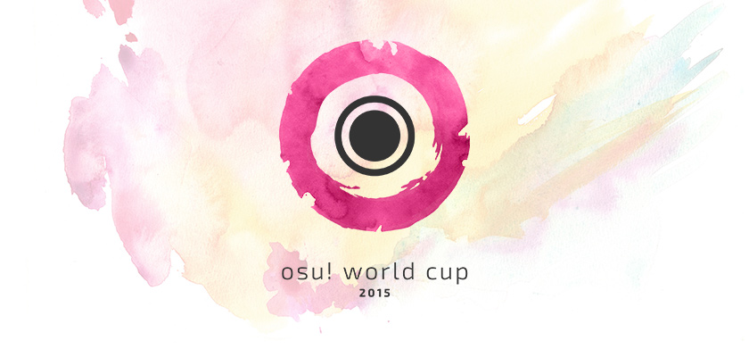
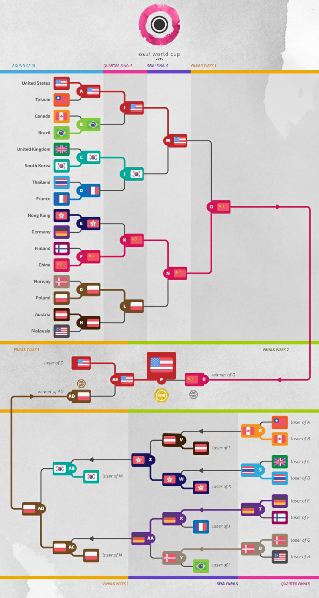
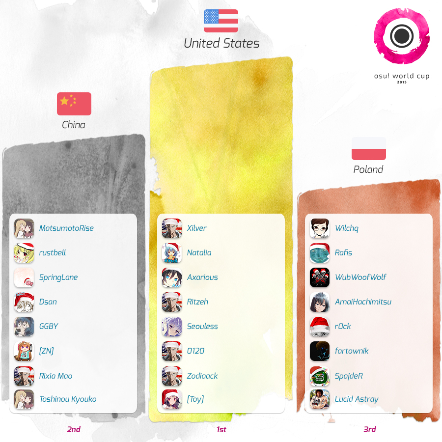

---
tags:
  - OWC 2015
  - OWC2015
  - 世界杯
---

# osu! 世界杯 2015

**osu! 世界杯 2015** (***OWC 2015***) 是由 [osu! 团队](/wiki/People/osu!_team)举办的，基于国家/地区的 osu! 锦标赛。本届 osu! 世界杯是第六届。

## 赛程

| 阶段 | 时间 |
| --: | :-- |
| 报名 | 2015-10-01/2015-10-18 |
| 直播抽签 | 2015-11-01 (14:00 UTC) |
| 小组赛 | 2015-11-07/2015-11-08 |
| 十六强赛 | 2015-11-15 |
| 四分之一决赛 | 2015-11-21/2015-11-22 |
| 半决赛 | 2015-11-28/2015-11-29 |
| 决赛第一周 | 2015-12-05/2015-12-06 |
| 决赛第二周 | 2015-12-13 |

## 奖品

| 名次 | 奖品 |
| :-: | :-- |
|  | 奖金池的 50%、个人主页徽章、"osu! Champion" 用户头衔 |
|  | 奖金池的 38%、个人主页徽章 |
|  | 奖金池的 12%、个人主页徽章 |

  

## 组织

osu! 世界杯 2015 由众多社区成员举办。

| 职位 | 成员 |
| :-- | :-- |
| 比赛管理 | ::{ flag=ES }:: [Deif](https://osu.ppy.sh/users/318565), ::{ flag=DE }:: [Loctav](https://osu.ppy.sh/users/71366), ::{ flag=DE }:: [p3n](https://osu.ppy.sh/users/123703), ::{ flag=FR }:: [shARPII](https://osu.ppy.sh/users/776257) |
| 选图 | ::{ flag=FR }:: [Cherry Blossom](https://osu.ppy.sh/users/1156742), ::{ flag=HK }:: [Skystar](https://osu.ppy.sh/users/873961), ::{ flag=KR }:: [ToGlette](https://osu.ppy.sh/users/1076236) |
| 直播 | ::{ flag=DE }:: [Loctav](https://osu.ppy.sh/users/71366), ::{ flag=PL }:: [Marcin](https://osu.ppy.sh/users/722665) |
| 解说 | ::{ flag=US }:: [Chippy](https://osu.ppy.sh/users/2314115), ::{ flag=NZ }:: [deadbeat](https://osu.ppy.sh/users/128370), ::{ flag=GB }:: [Doomsday](https://osu.ppy.sh/users/18983), ::{ flag=AR }:: [juankristal](https://osu.ppy.sh/users/443656), ::{ flag=GB }:: [Raiku](https://osu.ppy.sh/users/1525538), ::{ flag=US }:: [rfandomization](https://osu.ppy.sh/users/3716999), ::{ flag=US }:: [Zak](https://osu.ppy.sh/users/1375955), ::{ flag=US }:: [ztrot](https://osu.ppy.sh/users/6347) |
| 统计 | ::{ flag=PL }:: [Marcin](https://osu.ppy.sh/users/722665) |

## 链接

- [讨论帖](https://osu.ppy.sh/community/forums/posts/4550383)
- [直播](https://www.twitch.tv/osulive)
- **[小组赛统计一览](https://docs.google.com/spreadsheets/d/1QGI7BxI7fOMhXSdgYbFqPGCTUUwfSrsAiUhibWu4xUk/pubhtml)**

## 参赛者

|  | 国家/地区 | 选手 |
| :-: | :-: | :-- |
| ::{ flag=AR }:: | **阿根廷** | **[GaTu](https://osu.ppy.sh/users/3583351)**, [benjacala](https://osu.ppy.sh/users/1625740), [chucentry](https://osu.ppy.sh/users/2498731), [Dreamcast](https://osu.ppy.sh/users/1565577), [Enhu](https://osu.ppy.sh/users/2840499), [Fr0th](https://osu.ppy.sh/users/3458870), [Graphite Edge](https://osu.ppy.sh/users/825712), [Peingod](https://osu.ppy.sh/users/2212941) |
| ::{ flag=AU }:: | **澳大利亚** | **[Bauxe](https://osu.ppy.sh/users/1881685)**, [\[ ZhengS \]](https://osu.ppy.sh/users/2671317), [Aloha](https://osu.ppy.sh/users/792176), [Hexicate](https://osu.ppy.sh/users/2171562), [JappyBabes](https://osu.ppy.sh/users/697783), [Jaybladezz](https://osu.ppy.sh/users/3725492), [Meowt3dCheeze](https://osu.ppy.sh/users/634837), [Tokichii](https://osu.ppy.sh/users/557197) |
| ::{ flag=AT }:: | **奥地利** | **[Fedora Goose](https://osu.ppy.sh/users/2323131)**, [Alumetorz](https://osu.ppy.sh/users/1145984), [BlueFlame](https://osu.ppy.sh/users/3506191), [Elscar](https://osu.ppy.sh/users/2253511), [Hakkero](https://osu.ppy.sh/users/177913), [Omgforz](https://osu.ppy.sh/users/578943), [Shirone](https://osu.ppy.sh/users/1426098), [skritsch](https://osu.ppy.sh/users/3323141) |
| ::{ flag=BR }:: | **巴西** | **[fabriciorby](https://osu.ppy.sh/users/209664)**, [HideZ](https://osu.ppy.sh/users/504657), [Miyazono](https://osu.ppy.sh/users/529036), [MouseEasy](https://osu.ppy.sh/users/1558603), [Polaco](https://osu.ppy.sh/users/1057782), [Shott](https://osu.ppy.sh/users/965354), [Sooki](https://osu.ppy.sh/users/1451811), [Tio Fenrir](https://osu.ppy.sh/users/2644700) |
| ::{ flag=CA }:: | **加拿大** | **[TrickMirror](https://osu.ppy.sh/users/2138739)**, [Azer](https://osu.ppy.sh/users/2155578), [Bowlglet](https://osu.ppy.sh/users/622485), [Ciao](https://osu.ppy.sh/users/2674642), [Ignite](https://osu.ppy.sh/users/3122948), [MiruHong](https://osu.ppy.sh/users/2866814), [Shina Kokomi](https://osu.ppy.sh/users/980956), [Xenbo](https://osu.ppy.sh/users/1895489) |
| ::{ flag=CN }:: | **中国** | **[MatsumotoRise](https://osu.ppy.sh/users/672726)**, [\[ZN\]](https://osu.ppy.sh/users/1030696), [Dsan](https://osu.ppy.sh/users/1266166), [GGBY](https://osu.ppy.sh/users/629717), [Rixia Mao](https://osu.ppy.sh/users/3314431), [rustbell](https://osu.ppy.sh/users/227717), [SpringLane](https://osu.ppy.sh/users/1343504), [Toshinou Kyouko](https://osu.ppy.sh/users/560228) |
| ::{ flag=FI }:: | **芬兰** | **[Sanze](https://osu.ppy.sh/users/3110552)**, [huono\_tuuri](https://osu.ppy.sh/users/1432954), [Hyppyri](https://osu.ppy.sh/users/3123423), [Incera](https://osu.ppy.sh/users/2159415), [isokasapupuja](https://osu.ppy.sh/users/1770462), [nycto](https://osu.ppy.sh/users/2867764), [Poofie](https://osu.ppy.sh/users/3517198), [Winner](https://osu.ppy.sh/users/3437263) |
| ::{ flag=FR }:: | **法国** | **[Musty](https://osu.ppy.sh/users/251683)**, [Elysion](https://osu.ppy.sh/users/106269), [FayeurS](https://osu.ppy.sh/users/3105416), [filsdelama](https://osu.ppy.sh/users/2831793), [Kynan](https://osu.ppy.sh/users/1093361), [mrzomb](https://osu.ppy.sh/users/1694887), [NerO](https://osu.ppy.sh/users/1545031), [Shapy](https://osu.ppy.sh/users/2705769) |
| ::{ flag=DE }:: | **德国** | **[Dustice](https://osu.ppy.sh/users/754565)**, [BDDav](https://osu.ppy.sh/users/1164526), [Beafowl](https://osu.ppy.sh/users/2438122), [cptnXn](https://osu.ppy.sh/users/495272), [Jonimay](https://osu.ppy.sh/users/1118341), [Neliel](https://osu.ppy.sh/users/1500305), [TobiGH3](https://osu.ppy.sh/users/3341040), [W3SON](https://osu.ppy.sh/users/2070822) |
| ::{ flag=GR }:: | **希腊** | **[Riven](https://osu.ppy.sh/users/3638005)**, [I Like Kimas](https://osu.ppy.sh/users/2490195), [JohnyZ](https://osu.ppy.sh/users/4508048), [SutiBu](https://osu.ppy.sh/users/2633472), [ThePainG7](https://osu.ppy.sh/users/3478000), [Tofas](https://osu.ppy.sh/users/2755584) |
| ::{ flag=HK }:: | **香港** | **[- G I D Z -](https://osu.ppy.sh/users/2286528)**, [Chaoslitz](https://osu.ppy.sh/users/3621552), [clp012345](https://osu.ppy.sh/users/126144), [MinG3012](https://osu.ppy.sh/users/1583218), [-N a n a k o-](https://osu.ppy.sh/users/1407516), [shAe1eck](https://osu.ppy.sh/users/1553672) |
| ::{ flag=IT }:: | **意大利** | **[xiAmME](https://osu.ppy.sh/users/1428960)**, [- Croma -](https://osu.ppy.sh/users/1752181), [DT-sama](https://osu.ppy.sh/users/3525018), [Gian](https://osu.ppy.sh/users/2105981), [Kirin](https://osu.ppy.sh/users/1852356), [LLoyd-chan](https://osu.ppy.sh/users/2849149), [Nemis](https://osu.ppy.sh/users/1635091), [umii](https://osu.ppy.sh/users/2538695) |
| ::{ flag=JP }:: | **日本** | **[Mercurius](https://osu.ppy.sh/users/589550)**, [1o-chak](https://osu.ppy.sh/users/1401004), [NeruL](https://osu.ppy.sh/users/2497197), [OhAHO](https://osu.ppy.sh/users/1066760), [Poruteri](https://osu.ppy.sh/users/1379576), [Roro Rosset](https://osu.ppy.sh/users/673214), [Super Arrow](https://osu.ppy.sh/users/1970239) |
| ::{ flag=LV }:: | **拉脱维亚** | **[LoGo](https://osu.ppy.sh/users/750382)**, [Edijs](https://osu.ppy.sh/users/2799835), [Emula](https://osu.ppy.sh/users/2891792), [Forseen](https://osu.ppy.sh/users/556012), [Jesus\[Krists\]](https://osu.ppy.sh/users/2842992), [Vmx](https://osu.ppy.sh/users/967501), [xoho](https://osu.ppy.sh/users/3647897) |
| ::{ flag=LT }:: | **立陶宛** | **[QonQuest](https://osu.ppy.sh/users/988503)**, [Auji](https://osu.ppy.sh/users/4114438), [Azerite](https://osu.ppy.sh/users/2562987), [Mazzerin](https://osu.ppy.sh/users/2942381), [Midget](https://osu.ppy.sh/users/4141635), [PainSinger](https://osu.ppy.sh/users/697843), [Shelbis](https://osu.ppy.sh/users/2639159), [Zinkon](https://osu.ppy.sh/users/85043) |
| ::{ flag=MY }:: | **马来西亚** | **[ClawViper](https://osu.ppy.sh/users/2681361)**, [Amane-](https://osu.ppy.sh/users/2276847), [caleb123456](https://osu.ppy.sh/users/2205376), [Ex6TenZ](https://osu.ppy.sh/users/2676512), [Gon](https://osu.ppy.sh/users/583765), [Rampax](https://osu.ppy.sh/users/3995630), [Rumia-](https://osu.ppy.sh/users/1787171), [xsrsbsns](https://osu.ppy.sh/users/414427) |
| ::{ flag=MX }:: | **墨西哥** | **[Broodich](https://osu.ppy.sh/users/2484629)**, [Atheneon](https://osu.ppy.sh/users/2164627), [Atsuro](https://osu.ppy.sh/users/2279351), [Eiikon](https://osu.ppy.sh/users/2553519), [Id\_Beat](https://osu.ppy.sh/users/3431380), [KevEz](https://osu.ppy.sh/users/2271558), [lndex](https://osu.ppy.sh/users/2038320), [Psycopath-](https://osu.ppy.sh/users/3233957) |
| ::{ flag=NL }:: | **荷兰** | **[taku](https://osu.ppy.sh/users/684433)**, [Chidori](https://osu.ppy.sh/users/525856"), [HappyStick](https://osu.ppy.sh/users/256802), [jackylam5](https://osu.ppy.sh/users/1540807), [Kyshiro](https://osu.ppy.sh/users/640611), [Menthuthuyoupi](https://osu.ppy.sh/users/2715937), [Pittigbaasje](https://osu.ppy.sh/users/2167433), [Synchrostar](https://osu.ppy.sh/users/419705) |
| ::{ flag=NZ }:: | **新西兰** | **[shortpotato](https://osu.ppy.sh/users/1266102)**, [\[ Pustules \]](https://osu.ppy.sh/users/2419478), [a loli](https://osu.ppy.sh/users/1488796), [Grimacee](https://osu.ppy.sh/users/2352484), [kiyumi](https://osu.ppy.sh/users/3701898), [momochan](https://osu.ppy.sh/users/4827310), [Tang](https://osu.ppy.sh/users/2162609), [yellowy246](https://osu.ppy.sh/users/3833980) |
| ::{ flag=NO }:: | **挪威** | **[Tobi](https://osu.ppy.sh/users/2970667)**, [CXu](https://osu.ppy.sh/users/84841), [-GN](https://osu.ppy.sh/users/895581), [HundurThePanda](https://osu.ppy.sh/users/3145033), [Liqh](https://osu.ppy.sh/users/3409838), [-PC](https://osu.ppy.sh/users/2916414), [Sebu](https://osu.ppy.sh/users/3990173), [warrock](https://osu.ppy.sh/users/2841744) |
| ::{ flag=PH }:: | **菲律宾** | **[Takane Enomoto](https://osu.ppy.sh/users/1208491)**, [ededed028](https://osu.ppy.sh/users/3932796), [Gio](https://osu.ppy.sh/users/1795827), [konawiki](https://osu.ppy.sh/users/4003979), [KouNue](https://osu.ppy.sh/users/4180036), [Marika](https://osu.ppy.sh/users/1679638), [---Mikoto](https://osu.ppy.sh/users/2911062), [-Ryo](https://osu.ppy.sh/users/3113141) |
| ::{ flag=PL }:: | **波兰** | **[Wilchq](https://osu.ppy.sh/users/2021758)**, [AmaiHachimitsu](https://osu.ppy.sh/users/844815), [fartownik](https://osu.ppy.sh/users/56917), [Lucid Astray](https://osu.ppy.sh/users/1773225), [r0ck](https://osu.ppy.sh/users/1549620), [Rafis](https://osu.ppy.sh/users/2558286), [SpajdeR](https://osu.ppy.sh/users/3446664), [WubWoofWolf](https://osu.ppy.sh/users/39828) |
| ::{ flag=PT }:: | **葡萄牙** | **[kek](https://osu.ppy.sh/users/2148013)**, [AA00AA](https://osu.ppy.sh/users/2928612), [Mizuru](https://osu.ppy.sh/users/4495871), [Osama](https://osu.ppy.sh/users/799218), [PedroLipton](https://osu.ppy.sh/users/3272012), [Zenden](https://osu.ppy.sh/users/3070694) |
| ::{ flag=RU }:: | **俄罗斯** | **[talala](https://osu.ppy.sh/users/1389663)**, [\_index](https://osu.ppy.sh/users/652457), [Kert](https://osu.ppy.sh/users/119933), [KoTo](https://osu.ppy.sh/users/1382805), [Red\_Pixel](https://osu.ppy.sh/users/4170932), [Shiawase](https://osu.ppy.sh/users/989489), [SoMad](https://osu.ppy.sh/users/637168), [xantic](https://osu.ppy.sh/users/1897386) |
| ::{ flag=SG }:: | **新加坡** | **[plaatinum](https://osu.ppy.sh/users/3385566)**, [Clyine](https://osu.ppy.sh/users/1275211), [GSBlank](https://osu.ppy.sh/users/2312106), [jcjc](https://osu.ppy.sh/users/1200275), [-LeeP-](https://osu.ppy.sh/users/1143744), [oneplusone](https://osu.ppy.sh/users/1843447), [Rtyzen](https://osu.ppy.sh/users/2439822), [Tatch](https://osu.ppy.sh/users/2390650) |
| ::{ flag=KR }:: | **韩国** | **[Neta](https://osu.ppy.sh/users/832084)**, [- Hakurei Reimu-](https://osu.ppy.sh/users/948713), [\[Chiyo\]](https://osu.ppy.sh/users/2000416), [Cinia Pacifica](https://osu.ppy.sh/users/1414625), [Enon](https://osu.ppy.sh/users/2043401), [eoehd1ek](https://osu.ppy.sh/users/3938876), [Gomo Pslvarh](https://osu.ppy.sh/users/1206417), [Meltina](https://osu.ppy.sh/users/946990) |
| ::{ flag=SE }:: | **瑞典** | **[Xytox](https://osu.ppy.sh/users/2229274)**, [AntoN](https://osu.ppy.sh/users/2538562), [Bubba](https://osu.ppy.sh/users/2330524), [IVo one](https://osu.ppy.sh/users/3623465), [Sebbe](https://osu.ppy.sh/users/3181965), [Slizzer](https://osu.ppy.sh/users/809983), [SnickarN](https://osu.ppy.sh/users/3258429), [Xiniox](https://osu.ppy.sh/users/5233691) |
| ::{ flag=TW }:: | **台湾** | **[Rucker](https://osu.ppy.sh/users/147515)**, [dabanlong](https://osu.ppy.sh/users/624254), [hvick225](https://osu.ppy.sh/users/50265), [RedLeaf](https://osu.ppy.sh/users/2703742), [Small K](https://osu.ppy.sh/users/952751), [Uan](https://osu.ppy.sh/users/147623), [YuyuKo sama](https://osu.ppy.sh/users/234788), [zxxzxxz](https://osu.ppy.sh/users/1646474) |
| ::{ flag=TH }:: | **泰国** | **[FrostxE](https://osu.ppy.sh/users/199669)**, [- Phantasma -](https://osu.ppy.sh/users/1427407), [bossm](https://osu.ppy.sh/users/654123), [Mikkuri](https://osu.ppy.sh/users/317494), [NonxE](https://osu.ppy.sh/users/319312), [Romantic](https://osu.ppy.sh/users/1592894) |
| ::{ flag=UA }:: | **乌克兰** | **[Aka](https://osu.ppy.sh/users/1307553)**, [blednak](https://osu.ppy.sh/users/912627), [FllareA](https://osu.ppy.sh/users/1163931), [Granje](https://osu.ppy.sh/users/496387), [-Ranndom-](https://osu.ppy.sh/users/5022536), [wasisdasS](https://osu.ppy.sh/users/1999698), [Yoru-hide](https://osu.ppy.sh/users/791121) |
| ::{ flag=GB }:: | **英国** | **[jesus1412](https://osu.ppy.sh/users/230116)**, [Bubbleman](https://osu.ppy.sh/users/5182050), [Doomsday](https://osu.ppy.sh/users/18983), [Raiku](https://osu.ppy.sh/users/1525538), [Run-Cat](https://osu.ppy.sh/users/4361729), [Tasty Beverage](https://osu.ppy.sh/users/960620), [Xim](https://osu.ppy.sh/users/2083664) |
| ::{ flag=US }:: | **美国** | **[Xilver](https://osu.ppy.sh/users/3099689)**, [\[Toy\]](https://osu.ppy.sh/users/2757689), [0120](https://osu.ppy.sh/users/1901534), [Axarious](https://osu.ppy.sh/users/2614511), [Natalia](https://osu.ppy.sh/users/2162669), [Ritzeh](https://osu.ppy.sh/users/1028387), [Seouless](https://osu.ppy.sh/users/3328676), [Zodiaack](https://osu.ppy.sh/users/3096229) |

## 分组

| 小组 | 头号种子 | 高位种子 | 中位种子 | 低位种子 |
| :-: | :-- | :-- | :-- | :-- |
| **A** | ::{ flag=US }:: 美国 | ::{ flag=AU }:: 澳大利亚 | ::{ flag=MY }:: 马来西亚 | ::{ flag=MX }:: 墨西哥 |
| **B** | ::{ flag=FR }:: 法国 | ::{ flag=HK }:: 香港 | ::{ flag=LT }:: 立陶宛 | ::{ flag=IT }:: 意大利 |
| **C** | ::{ flag=PL }:: 波兰 | ::{ flag=CA }:: 加拿大 | ::{ flag=LV }:: 拉脱维亚 | ::{ flag=UA }:: 乌克兰 |
| **D** | ::{ flag=CN }:: 中国 | ::{ flag=GB }:: 英国 | ::{ flag=JP }:: 日本 | ::{ flag=PH }:: 菲律宾 |
| **E** | ::{ flag=KR }:: 韩国 | ::{ flag=FI }:: 芬兰 | ::{ flag=AR }:: 阿根廷 | ::{ flag=NZ }:: 新西兰 |
| **F** | ::{ flag=RU }:: 俄罗斯 | ::{ flag=BR }:: 巴西 | ::{ flag=NO }:: 挪威 | ::{ flag=GR }:: 希腊 |
| **G** | ::{ flag=DE }:: 德国 | ::{ flag=NL }:: 荷兰 | ::{ flag=TH }:: 泰国 | ::{ flag=SG }:: 新加坡 |
| **H** | ::{ flag=TW }:: 台湾 | ::{ flag=AT }:: 奥地利 | ::{ flag=SE }:: 瑞典 | ::{ flag=PT }:: 葡萄牙 |

## 颁奖信息

## 比赛图池

### 决赛

**此图池在决赛第一周和决赛第二周使用。**

**[在这里下载图包！(206 MB)](https://www.mediafire.com/download/22q8exrnwiyxfn1/OWC_2015_Finals.rar)**

- NoMod
  1. [Reol - Asymmetry (Skystar) \[Asphewin's Expert\]](https://osu.ppy.sh/beatmapsets/310499#osu/698249)
  2. [Rohi - Kakuzetsu Thanatos (NatsumeRin) \[Rin\]](https://osu.ppy.sh/beatmapsets/76396#osu/215238)
  3. [Megpoid GUMI - Rubik's Cube (wcx19911123) \[Cube\]](https://osu.ppy.sh/beatmapsets/42061#osu/132466)
  4. [Hitori Tori - perthed again (yambabom remix) (Asphyxia) \[Zapy's Extra\]](https://osu.ppy.sh/beatmapsets/268693#osu/611753)
  5. [FOLiACETATE - Heterochromia Iridis (ktgster) \[Terror\]](https://osu.ppy.sh/beatmapsets/106443#osu/279481)
  6. [xi - FREEDOM DiVE (Nakagawa-Kanon) \[Another\]](https://osu.ppy.sh/beatmapsets/39804#osu/126645)
- Hidden
  1. [Pierce The Veil - King For A Day (feat Kellin Quinn) (pishifat) \[Ex\]](https://osu.ppy.sh/beatmapsets/297909#osu/684163)
  2. [Foreground Eclipse - To The Terminus (Giralda) \[Skystar's Extra\]](https://osu.ppy.sh/beatmapsets/277481#osu/628755)
  3. [DJ Sharpnel - IVALTEK (happy30) \[HappyMiX\]](https://osu.ppy.sh/beatmapsets/50429#osu/154988)
- HardRock
  1. [yanaginagi - Muteki no Soldier (BinJip) \[Invincible\]](https://osu.ppy.sh/beatmapsets/52221#osu/182001)
  2. [Qrispy Joybox - licca (Minakami Yuki) \[Skystar's Expert\]](https://osu.ppy.sh/beatmapsets/287052#osu/690608)
  3. [Glamour of the Kill - A Hope in Hell (ykcarrot) \[Hopeless\]](https://osu.ppy.sh/beatmapsets/31814#osu/104389)
- DoubleTime
  1. [kaztora, eba, Misaki Nakajima - Messiah (Shinxyn) \[Insane\]](https://osu.ppy.sh/beatmapsets/21877#osu/75689)
  2. [Tristam - Once Again (grumd) \[Collab\]](https://osu.ppy.sh/beatmapsets/179495#osu/502418)
  3. [Matsumoto Sara - Ito Hakanaki Hikari no Gotoku (Mixagji) \[Lunatic\]](https://osu.ppy.sh/beatmapsets/120255#osu/308350)
- FreeMod
  1. [Morimori Atsushi - PUPA (Cherry Blossom) \[Butterfly\]](https://osu.ppy.sh/beatmapsets/224164#osu/523376)
  2. [LEAF XCEED Music Division - YuYu Metal (DoKoLP) \[DoKo\]](https://osu.ppy.sh/beatmapsets/45528#osu/142145)
  3. [Suzumu - Kakumeisei ousama densenbyou (tutuhaha) \[AngelHoney's Extra\]](https://osu.ppy.sh/beatmapsets/307686#osu/701528)
- Tiebreaker
  1. **[gmtn. (witch's slave) - furioso melodia (Alumetorz) \[Wrath\]](https://osu.ppy.sh/beatmapsets/280107#osu/633993)**

### 半决赛

**[在这里下载图包！(183 MB)](https://www.mediafire.com/download/rm2w6we4i90dhc5/OWC_2015_Semifinals.rar)**

- NoMod
  1. [Reol - Streaming Heart (sukiNathan) \[Extra\]](https://osu.ppy.sh/beatmapsets/339335#osu/760466)
  2. [Hatsuki Yura - Yoiyami Hanabi (Lan wings) \[Lan\]](https://osu.ppy.sh/beatmapsets/115011#osu/297463)
  3. [Nanahoshi Kangengakudan - Meikaruza (pkk) \[Extra\]](https://osu.ppy.sh/beatmapsets/302756#osu/701033)
  4. [Function Phantom - Algebra (Bonzi) \[Incomputable\]](https://osu.ppy.sh/beatmapsets/300195#osu/673275)
  5. [Igorrr - Tout Petit Moineau (fergas) \[Extra\]](https://osu.ppy.sh/beatmapsets/212180#osu/517308)
  6. [t+pazolite - cheatreal (caren\_sk) \[Extra\]](https://osu.ppy.sh/beatmapsets/88180#osu/240488)
- Hidden
  1. [BoA - Kiseki (Hinsvar) \[Miracle\]](https://osu.ppy.sh/beatmapsets/150145#osu/370612)
  2. [Demetori - Furuki Yuanxian ~ Death Echo (jonathanlfj) \[Extra Stage Collab\]](https://osu.ppy.sh/beatmapsets/291517#osu/656385)
  3. [sasakure.UK - Jack-the-Ripper (Sprosive) \[JackHasCome!\]](https://osu.ppy.sh/beatmapsets/23907#osu/81560)
- HardRock
  1. [Memme - Starving Days (Gamu) \[Extra\]](https://osu.ppy.sh/beatmapsets/275743#osu/625507)
  2. [EGOIST - Fallen (jonathanlfj) \[Extra\]](https://osu.ppy.sh/beatmapsets/232052#osu/538930)
  3. [cranky - R176 (taka1235) \[Another\]](https://osu.ppy.sh/beatmapsets/31367#osu/103102)
- DoubleTime
  1. [Meg & Dia - Black Wedding (Larto) \[Crazy!\]](https://osu.ppy.sh/beatmapsets/30000#osu/101115)
  2. [yanaginagi - landscape ([Vincent]) \[Insane\]](https://osu.ppy.sh/beatmapsets/244001#osu/563370)
  3. [Tsunamaru - paranoia (Chewin) \[RLC\]](https://osu.ppy.sh/beatmapsets/77999#osu/226563)
- FreeMod
  1. [Renard - Banned Forever (Blue Dragon) \[Lesjuh\]](https://osu.ppy.sh/beatmapsets/16349#osu/64266)
  2. [Cutline - Die For You (Shock One Remix) (Regou) \[Insane\]](https://osu.ppy.sh/beatmapsets/166435#osu/404550)
  3. [HoneyWorks - Akatsuki Zukuyo (Fast) \[Twilight\]](https://osu.ppy.sh/beatmapsets/332800#osu/736729)
- Tiebreaker
  1. **[Ohka - Nanairo Anniversary (Rizia) \[Kaleidoscope\]](https://osu.ppy.sh/beatmapsets/233039#osu/541044)**

### 四分之一决赛

**[在这里下载图包！(160 MB)](https://www.mediafire.com/download/l4zdsy0ujeq8xz3/OWC_2015_Quarterfinals.rar)**

- NoMod
  1. [ALiCE'S EMOTiON - Dark Flight Dreamer (Sakaue Nachi) \[Dreamer\]](https://osu.ppy.sh/beatmapsets/185250#osu/676172)
  2. [IA - Six Trillion Years and Overnight Story (NatsumeRin) \[0108\]](https://osu.ppy.sh/beatmapsets/51245#osu/157861)
  3. [xi - Wish upon Twin Stars (Chaoslitz) \[Wish\]](https://osu.ppy.sh/beatmapsets/242462#osu/559673)
  4. [rerulili - Noushou Sakuretsu Girl (NatsumeRin) \[Rin\]](https://osu.ppy.sh/beatmapsets/63434#osu/187410)
  5. [siqlo - Forest Haze (Lust) \[Leader's Extra\]](https://osu.ppy.sh/beatmapsets/281695#osu/656723)
  6. [Hiroyuki Sawano feat. Mika Kobayashi - Bios (goodbye) \[LKs' Another\]](https://osu.ppy.sh/beatmapsets/43674#osu/137766)
- Hidden
  1. [Sota Fujimori - Move That Body -Extended Mix- (Amamiya Yuko) \[RLC's Extra\]](https://osu.ppy.sh/beatmapsets/220220#osu/542336)
  2. [Tatsh - Cruel Moon (Shinxyn) \[Lunatic\]](https://osu.ppy.sh/beatmapsets/13584#osu/50148)
  3. [ETIA. - Lost Love (JJburstOwO) \[Last Eve\]](https://osu.ppy.sh/beatmapsets/341933#osu/755900)
- HardRock
  1. [Hanatan - If (Rakuen) \[wkyik's Insane\]](https://osu.ppy.sh/beatmapsets/230050#osu/587577)
  2. [Project Grimoire - Caliburne \~Story of the Legendary sword\~ (Mikkuri) \[Extra\]](https://osu.ppy.sh/beatmapsets/335665#osu/742975)
  3. [Nekomata Master - Far east nightbird (kors k Remix) (jonathanlfj) \[RLC's Extra\]](https://osu.ppy.sh/beatmapsets/144171#osu/358273)
- DoubleTime
  1. [senya - Yukitoke Realism (wring) \[Lunatic\]](https://osu.ppy.sh/beatmapsets/252385#osu/579751)
  2. [ichigo - YU-MU (Louis Cyphre) \[Extra\]](https://osu.ppy.sh/beatmapsets/40348#osu/128074)
  3. [ClariS - with you (10nya) \[Laurier's Insane\]](https://osu.ppy.sh/beatmapsets/153793#osu/380012)
- FreeMod
  1. [Zeami feat. Tenshi - Tenyou no Mai (smallboat) \[Yuki's Extra\]](https://osu.ppy.sh/beatmapsets/178962#osu/434118)
  2. [APG550 - NEVERLAND (Natsu) \[Yuny\]](https://osu.ppy.sh/beatmapsets/352489#osu/776749)
  3. [Rita - Dream Walker (Amamiya Yuko) \[Ethereal\]](https://osu.ppy.sh/beatmapsets/315299#osu/722934)
- Tiebreaker
  1. **[Our Stolen Theory - United (L.A.O.S Remix) (Asphyxia) \[Infinity\]](https://osu.ppy.sh/beatmapsets/237768#osu/550235)**

### 十六强赛

**[在这里下载图包！(187 MB)](https://www.mediafire.com/download/r21yp0iu2zgkkln/OWC_2015_Round_of_16.rar)**

- NoMod
  1. [Sharlo & yealina - Kakushigoto (Sharlo) \[RLC's Extra\]](https://osu.ppy.sh/beatmapsets/208095#osu/495899)
  2. [RedMuffleR - Rubeus (Smoothie World) \[GRAVITY\]](https://osu.ppy.sh/beatmapsets/249703#osu/574050)
  3. [Gentle Stick X M2U - Ineffabilis (buhei) \[Extreme\]](https://osu.ppy.sh/beatmapsets/340903#osu/753968)
  4. [Function Phantom - Neuronecia (Amamiya Yuko) \[Ethereal\]](https://osu.ppy.sh/beatmapsets/186911#osu/541990)
  5. [himmeltengoku - Whisper of Rose (Tsukuyomi) \[Maximum\]](https://osu.ppy.sh/beatmapsets/173614#osu/419487)
  6. [Megpoid GUMI - Cosmos (val0108) \[Cosmos\]](https://osu.ppy.sh/beatmapsets/37054#osu/123374)
- Hidden
  1. [Pendulum - Watercolour (Kecco) \[Extra\]](https://osu.ppy.sh/beatmapsets/109751#osu/569735)
  2. [U1 overground - Dopamine (fanzhen0019) \[Kotori's EXTREME\]](https://osu.ppy.sh/beatmapsets/210316#osu/533622)
  3. [Shoichiro Sakamoto - Eye of Aeon (KanaRin) \[Aeon\]](https://osu.ppy.sh/beatmapsets/26528#osu/89362)
- HardRock
  1. [LhoU - Highlander (Cherry Blossom) \[Extra\]](https://osu.ppy.sh/beatmapsets/167225#osu/406247)
  2. [yuikonnu - Otsukimi Recital (Mythol) \[Collab\]](https://osu.ppy.sh/beatmapsets/107763#osu/282251)
  3. [Raujika - Land of Grace (Strawberry) \[Gracy\]](https://osu.ppy.sh/beatmapsets/73444#osu/209203)
- DoubleTime
  1. [Yoshida Mayumi - Zutto Kono Mama... (Mythol) \[cRyo's Insane\]](https://osu.ppy.sh/beatmapsets/63468#osu/196280)
  2. [capitaro - Karen Aikyou Hanasaka gumi (Tari) \[Insane\]](https://osu.ppy.sh/beatmapsets/324320#osu/720614)
  3. [ChouCho - My dear friend (Delis) \[Insane\]](https://osu.ppy.sh/beatmapsets/206079#osu/486131)
- FreeMod
  1. [DJ YOSHITAKA - FLOWER (Apricot) \[EXTREME\]](https://osu.ppy.sh/beatmapsets/31054#osu/128780)
  2. [senya - Kanjou Chemistry (Drum 'n' Bass Remix) (Satellite) \[Exw\]](https://osu.ppy.sh/beatmapsets/92509#osu/255700)
  3. [yuikonnu - Chikyuu Saigo no Kokuhaku o (Fycho) \[Insane\]](https://osu.ppy.sh/beatmapsets/208765#osu/494798)
- Tiebreaker
  1. **[Wakeshima Kanon - World's End, Girl's Rondo(Asterisk DnB Remix) (Meg) \[We cry "OPEN"\]](https://osu.ppy.sh/beatmapsets/331499#osu/734339)**

### 小组赛

**[在这里下载图包！(155 MB)](https://www.mediafire.com/download/4mmsagzc3mg6g13/OWC_2015_Group_Stage.rar)**

- NoMod
  1. [Duca - COLD BUTTERFLY (Zweib) \[Insane\]](https://osu.ppy.sh/beatmapsets/125380#osu/363063)
  2. [Kagamine Rin - Black Rebel (val0108) \[0108 Rebel\]](https://osu.ppy.sh/beatmapsets/28425#osu/109301)
  3. [Mary - Artificial Rose (Urushi38) \[Another\]](https://osu.ppy.sh/beatmapsets/99434#osu/264439)
  4. [Kousaki Satoru - Gekiretsu de Kareinaru Hibi (Zero\_\_wind) \[Ba Ba Ba\]](https://osu.ppy.sh/beatmapsets/164545#osu/400564)
  5. [Afilia Saga - S.M.L (Tari) \[Insane\]](https://osu.ppy.sh/beatmapsets/145685#osu/361263)
  6. [ARM feat. Nanahira - Bakunana\*Testroyer (intoon) \[Kami's Another\]](https://osu.ppy.sh/beatmapsets/295581#osu/682074)
- Hidden
  1. [MiddleIsland - Magnetic Shift (Natsu) \[UWS's Extra\]](https://osu.ppy.sh/beatmapsets/148535#osu/379411)
  2. [96Neko - Yoshiwara Lament (Minakami Yuki) \[Insane\]](https://osu.ppy.sh/beatmapsets/189377#osu/451227)
  3. [Kagamine Rin - Tokyo Teddy Bear (NatsumeRin) \[Rin\]](https://osu.ppy.sh/beatmapsets/39838#osu/127138)
- HardRock
  1. [Uchida Maaya - Hana Tsubomi Yume Miru Kyoushikyoku \~Tamashii no Shirube\~ (Mythol) \[Insane\]](https://osu.ppy.sh/beatmapsets/89888#osu/244182)
  2. [Kotoge Mai - Mangekyou (Oracle) \[cRyo's Insane\]](https://osu.ppy.sh/beatmapsets/230094#osu/535334)
  3. [Nekomata Master feat. \*spiLa\* - Clumsy thoughts (Kawaiwkyik) \[Insane\]](https://osu.ppy.sh/beatmapsets/190754#osu/454158)
- DoubleTime
  1. [Hatsuki Yura - Ganbare! Koi no Hana (Kotone) \[Hana\]](https://osu.ppy.sh/beatmapsets/55359#osu/167963)
  2. [senya - Bondage Anemonation (Satellite) \[Lunatic\]](https://osu.ppy.sh/beatmapsets/122416#osu/323264)
  3. [Chata - anesthesia (hoLysoup) \[Anesthesia\]](https://osu.ppy.sh/beatmapsets/77093#osu/216690)
- FreeMod
  1. [DJ Fresh (feat. Rita Ora) - Hot Right Now (Radio Edit) (Asphyxia) \[Insane\]](https://osu.ppy.sh/beatmapsets/231114#osu/537235)
  2. [yuikonnu - Natsu no Owari, Koi no Hajimari (xChippy) \[Insane\]](https://osu.ppy.sh/beatmapsets/206335#osu/486613)
  3. [Jin - Outer Science (tutuhaha) \[Insane\]](https://osu.ppy.sh/beatmapsets/122376#osu/313025)
- Tiebreaker
  1. **[Sawai Miku - Colorful. (Asterisk DnB Remix) (Amamiya Yuko) \[Megumi\]](https://osu.ppy.sh/beatmapsets/299454#osu/722224)**

## 比赛结果

### 决赛第二周

2015 年 12 月 13 日，星期日：

| 队伍 1 |  |  | 队伍 2 | 比赛链接 |
| --: | :-: | :-: | :-- | :-- |
| 中国 ::{ flag=CN }:: | 2 | **7** | ::{ flag=US }:: **美国** | [#1](https://osu.ppy.sh/community/matches/20910697) |
| **美国** ::{ flag=US }:: | **7** | 6 | ::{ flag=CN }:: 中国 | [#1](https://osu.ppy.sh/community/matches/20912739) |

### 决赛第一周

2015 年 12 月 5 日，星期六：

| 队伍 1 |  |  | 队伍 2 | 比赛链接 |
| --: | :-: | :-: | :-- | :-- |
| 美国 ::{ flag=US }:: | 3 | **6** | ::{ flag=CN }:: **中国** | [#1](https://osu.ppy.sh/community/matches/20711754) |
| 香港 ::{ flag=HK }:: | 0 | **6** | ::{ flag=KR }:: **韩国** | [#1](https://osu.ppy.sh/community/matches/20713615) |
| 德国 ::{ flag=DE }:: | 2 | **6** | ::{ flag=PL }:: **波兰** | [#1](https://osu.ppy.sh/community/matches/20717055) |
| **波兰** ::{ flag=PL }:: | **6** | 3 | ::{ flag=KR }:: 韩国 | [#1](https://osu.ppy.sh/community/matches/20719563) |

2015 年 12 月 6 日，星期日：

| 队伍 1 |  |  | 队伍 2 | 比赛链接 |
| --: | :-: | :-: | :-- | :-- |
| **美国** ::{ flag=US }:: | **6** | 3 | ::{ flag=PL }:: 波兰 | [#1](https://osu.ppy.sh/community/matches/20762171) |

### 半决赛

2015 年 11 月 28 日，星期六：

| 队伍 1 |  |  | 队伍 2 | 比赛链接 |
| --: | :-: | :-: | :-- | :-- |
| **美国** ::{ flag=US }:: | **6** | 2 | ::{ flag=KR }:: 韩国 | [#1](https://osu.ppy.sh/community/matches/20553676) |
| 泰国 ::{ flag=TH }:: | 2 | **6** | ::{ flag=HK }:: **香港** | [#1](https://osu.ppy.sh/community/matches/20555273) |
| **中国** ::{ flag=CN }:: | **6** | 2 | ::{ flag=PL }:: 波兰 | [#1](https://osu.ppy.sh/community/matches/20556916) |
| **德国** ::{ flag=DE }:: | **6** | 2 | ::{ flag=FR }:: 法国 | [#1](https://osu.ppy.sh/community/matches/20558712) |
| **挪威** ::{ flag=NO }:: | **6** | 2 | ::{ flag=BR }:: 巴西 | [#1](https://osu.ppy.sh/community/matches/20561290) |
| **德国** ::{ flag=DE }:: | **6** | 3 | ::{ flag=NO }:: 挪威 | [#1](https://osu.ppy.sh/community/matches/20570952) |
| 加拿大 ::{ flag=CA }:: | 5 | **6** | ::{ flag=AT }:: **奥地利** | [#1](https://osu.ppy.sh/community/matches/20574246) |

2015 年 11 月 29 日，星期日：

| 队伍 1 |  |  | 队伍 2 | 比赛链接 |
| --: | :-: | :-: | :-- | :-- |
| 奥地利 ::{ flag=AT }:: | 4 | **6** | ::{ flag=HK }:: **香港** | [#1](https://osu.ppy.sh/community/matches/20591359) |

### 四分之一决赛

2015 年 11 月 21 日，星期六：

| 队伍 1 |  |  | 队伍 2 | 比赛链接 |
| --: | :-: | :-: | :-- | :-- |
| **美国** ::{ flag=US }:: | **5** | 2 | ::{ flag=BR }:: 巴西 | [#1](https://osu.ppy.sh/community/matches/20411352) |

2015 年 11 月 22 日，星期日：

| 队伍 1 |  |  | 队伍 2 | 比赛链接 |
| --: | :-: | :-: | :-- | :-- |
| 台湾 ::{ flag=TW }:: | 4 | **5** | ::{ flag=CA }:: **加拿大** | [#1](https://osu.ppy.sh/community/matches/20423117) |
| 香港 ::{ flag=HK }:: | 2 | **5** | ::{ flag=CN }:: **中国** | [#1](https://osu.ppy.sh/community/matches/20424826) |
| **韩国** ::{ flag=KR }:: | **5** | 3 | ::{ flag=FR }:: 法国 | [#1](https://osu.ppy.sh/community/matches/20426594) |
| **挪威** ::{ flag=NO }:: | **5** | 2 | ::{ flag=MY }:: 马来西亚 | [#1](https://osu.ppy.sh/community/matches/20427714) |
| 英国 ::{ flag=GB }:: | 3 | **5** | ::{ flag=TH }:: **泰国** | [#1](https://osu.ppy.sh/community/matches/20429267) |
| **德国** ::{ flag=DE }:: | **5** | 1 | ::{ flag=FI }:: 芬兰 | [#1](https://osu.ppy.sh/community/matches/20430864) |
| **波兰** ::{ flag=PL }:: | **5** | 0 | ::{ flag=AT }:: 奥地利 | [#1](https://osu.ppy.sh/community/matches/20432995) |

### 十六强赛

2015 年 11 月 15 日，星期日：

| 队伍 1 |  |  | 队伍 2 | 比赛链接 |
| --: | :-: | :-: | :-- | :-- |
| **美国** ::{ flag=US }:: | **5** | 4 | ::{ flag=TW }:: 台湾 | [#1](https://osu.ppy.sh/community/matches/20269690) |
| 芬兰 ::{ flag=FI }:: | 0 | **5** | ::{ flag=CN }:: **中国** | [#1](https://osu.ppy.sh/community/matches/20273790) |
| **奥地利** ::{ flag=AT }:: | **5** | 0 | ::{ flag=MY }:: 马来西亚 | [#1](https://osu.ppy.sh/community/matches/20275097) |
| **香港** ::{ flag=HK }:: | **5** | 3 | ::{ flag=DE }:: 德国 | [#1](https://osu.ppy.sh/community/matches/20276700) |
| 英国 ::{ flag=GB }:: | 2 | **5** | ::{ flag=KR }:: **韩国** | [#1](https://osu.ppy.sh/community/matches/20278584) |
| 泰国 ::{ flag=TH }:: | 2 | **5** | ::{ flag=FR }:: **法国** | [#1](https://osu.ppy.sh/community/matches/20280529) |
| 挪威 ::{ flag=NO }:: | 0 | **5** | ::{ flag=PL }:: **波兰** | [#1](https://osu.ppy.sh/community/matches/20285332) |
| 加拿大 ::{ flag=CA }:: | 1 | **5** | ::{ flag=BR }:: **巴西** | [#1](https://osu.ppy.sh/community/matches/20287601) |

### 小组赛

2015 年 11 月 7 日，星期六：

| 队伍 1 |  |  | 队伍 2 | 比赛链接 |
| --: | :-: | :-: | :-- | :-- |
| **奥地利** ::{ flag=AT }:: | **4** | 1 | ::{ flag=TW }:: 台湾 | [#1](https://osu.ppy.sh/community/matches/20091839) |
| 新西兰 ::{ flag=NZ }:: | 3 | **4** | ::{ flag=FI }:: **芬兰** | [#1](https://osu.ppy.sh/community/matches/20091841) |
| **马来西亚** ::{ flag=MY }:: | **4** | 1 | ::{ flag=AU }:: 澳大利亚 | [#1](https://osu.ppy.sh/community/matches/20091844) |
| 菲律宾 ::{ flag=PH }:: | 1 | **4** | ::{ flag=JP }:: **日本** | [#1](https://osu.ppy.sh/community/matches/20091847) |
| 新加坡 ::{ flag=SG }:: | 0 | **4** | ::{ flag=DE }:: **德国** | [#1](https://osu.ppy.sh/community/matches/20092909) |
| 泰国 ::{ flag=TH }:: | 1 | **4** | ::{ flag=NL }:: **荷兰** | [#1](https://osu.ppy.sh/community/matches/20092910) |
| 英国 ::{ flag=GB }:: | 1 | **4** | ::{ flag=CN }:: **中国** | [#1](https://osu.ppy.sh/community/matches/20092912) |
| 立陶宛 ::{ flag=LT }:: | 1 | **4** | ::{ flag=FR }:: **法国** | [#1](https://osu.ppy.sh/community/matches/20094037) |
| 意大利 ::{ flag=IT }:: | 1 | **4** | ::{ flag=HK }:: **香港** | [#1](https://osu.ppy.sh/community/matches/20094040) |
| 葡萄牙 ::{ flag=PT }:: | 3 | **4** | ::{ flag=TW }:: **台湾** | [#1](https://osu.ppy.sh/community/matches/20094042) |
| 新加坡 ::{ flag=SG }:: | 3 | **4** | ::{ flag=TH }:: **泰国** | [#1](https://osu.ppy.sh/community/matches/20095460) |
| 菲律宾 ::{ flag=PH }:: | 0 | **4** | ::{ flag=GB }:: **英国** | [#1](https://osu.ppy.sh/community/matches/20095461) |
| 阿根廷 ::{ flag=AR }:: | 0 | **4** | ::{ flag=KR }:: **韩国** | [#1](https://osu.ppy.sh/community/matches/20095462) |
| 希腊 ::{ flag=GR }:: | 0 | **4** | ::{ flag=RU }:: **俄罗斯** | [#1](https://osu.ppy.sh/community/matches/20105876) |
| 加拿大 ::{ flag=CA }:: | 0 | **4** | ::{ flag=PL }:: **波兰** | [#1](https://osu.ppy.sh/community/matches/20105877) |
| 葡萄牙 ::{ flag=PT }:: | 1 | **4** | ::{ flag=AT }:: **奥地利** | [#1](https://osu.ppy.sh/community/matches/20105878) |
| **乌克兰** ::{ flag=UA }:: | **4** | 1 | ::{ flag=LV }:: 拉脱维亚 | [#1](https://osu.ppy.sh/community/matches/20107684) |
| 阿根廷 ::{ flag=AR }:: | 3 | **4** | ::{ flag=FI }:: **芬兰** | [#1](https://osu.ppy.sh/community/matches/20107685) |
| 挪威 ::{ flag=NO }:: | 2 | **4** | ::{ flag=BR }:: **巴西** | [#1](https://osu.ppy.sh/community/matches/20109708) |
| 瑞典 ::{ flag=SE }:: | 2 | **4** | ::{ flag=AT }:: **奥地利** | [#1](https://osu.ppy.sh/community/matches/20109709) |

2015 年 11 月 8 日，星期日：

| 队伍 1 |  |  | 队伍 2 | 比赛链接 |
| --: | :-: | :-: | :-- | :-- |
| **新西兰** ::{ flag=NZ }:: | **4** | 0 | ::{ flag=AR }:: 阿根廷 | [#1](https://osu.ppy.sh/community/matches/20115243) |
| 墨西哥 ::{ flag=MX }:: | 1 | **4** | ::{ flag=AU }:: **澳大利亚** | [#1](https://osu.ppy.sh/community/matches/20114985) |
| 马来西亚 ::{ flag=MY }:: | 1 | **4** | ::{ flag=US }:: **美国** | [#1](https://osu.ppy.sh/community/matches/20116482) |
| 日本 ::{ flag=JP }:: | 1 | **4** | ::{ flag=CN }:: **中国** | [#1](https://osu.ppy.sh/community/matches/20116483) |
| 新西兰 ::{ flag=NZ }:: | 1 | **4** | ::{ flag=KR }:: **韩国** | [#1](https://osu.ppy.sh/community/matches/20117565) |
| 墨西哥 ::{ flag=MX }:: | 0 | **4** | ::{ flag=MY }:: **马来西亚** | [#1](https://osu.ppy.sh/community/matches/20117566) |
| 澳大利亚 ::{ flag=AU }:: | 1 | **4** | ::{ flag=US }:: **美国** | [#1](https://osu.ppy.sh/community/matches/20117569) |
| 瑞典 ::{ flag=SE }:: | 1 | **4** | ::{ flag=TW }:: **台湾** | [#1](https://osu.ppy.sh/community/matches/20125092) |
| 菲律宾 ::{ flag=PH }:: | 1 | **4** | ::{ flag=CN }:: **中国** | [#1](https://osu.ppy.sh/community/matches/20125093) |
| 香港 ::{ flag=HK }:: | 2 | **4** | ::{ flag=FR }:: **法国** | [#1](https://osu.ppy.sh/community/matches/20126344) |
| 芬兰 ::{ flag=FI }:: | 1 | **4** | ::{ flag=KR }:: **韩国** | [#1](https://osu.ppy.sh/community/matches/20126352) |
| **泰国** ::{ flag=TH }:: | **4** | 0 | ::{ flag=DE }:: 德国 | [#1](https://osu.ppy.sh/community/matches/20126358) |
| 日本 ::{ flag=JP }:: | 0 | **4** | ::{ flag=GB }:: **英国** | [#1](https://osu.ppy.sh/community/matches/20127886) |
| 乌克兰 ::{ flag=UA }:: | 0 | **4** | ::{ flag=PL }:: **波兰** | [#1](https://osu.ppy.sh/community/matches/20127887) |
| 新加坡 ::{ flag=SG }:: | 2 | **4** | ::{ flag=NL }:: **荷兰** | [#1](https://osu.ppy.sh/community/matches/20127888) |
| 立陶宛 ::{ flag=LT }:: | 2 | **4** | ::{ flag=HK }:: **香港** | [#1](https://osu.ppy.sh/community/matches/20129481) |
| **葡萄牙** ::{ flag=PT }:: | **4** | 3 | ::{ flag=SE }:: 瑞典 | [#1](https://osu.ppy.sh/community/matches/20129484) |
| 意大利 ::{ flag=IT }:: | 2 | **4** | ::{ flag=FR }:: **法国** | [#1](https://osu.ppy.sh/community/matches/20133656) |
| 希腊 ::{ flag=GR }:: | 0 | **4** | ::{ flag=BR }:: **巴西** | [#1](https://osu.ppy.sh/community/matches/20133657) |
| **挪威** ::{ flag=NO }:: | **4** | 2 | ::{ flag=RU }:: 俄罗斯 | [#1](https://osu.ppy.sh/community/matches/20133658) |
| 荷兰 ::{ flag=NL }:: | 0 | **4** | ::{ flag=DE }:: **德国** | [#1](https://osu.ppy.sh/community/matches/20135079) |
| 拉脱维亚 ::{ flag=LV }:: | 1 | **4** | ::{ flag=CA }:: **加拿大** | [#1](https://osu.ppy.sh/community/matches/20135084) |
| 意大利 ::{ flag=IT }:: | 3 | **4** | ::{ flag=LT }:: **立陶宛** | [#1](https://osu.ppy.sh/community/matches/20136741) |
| **巴西** ::{ flag=BR }:: | **4** | 3 | ::{ flag=RU }:: 俄罗斯 | [#1](https://osu.ppy.sh/community/matches/20136742) |
| 希腊 ::{ flag=GR }:: | 0 | **4** | ::{ flag=NO }:: **挪威** | [#1](https://osu.ppy.sh/community/matches/20136743) |
| 墨西哥 ::{ flag=MX }:: | 0 | **4** | ::{ flag=US }:: **美国** | [#1](https://osu.ppy.sh/community/matches/20138453) |
| 乌克兰 ::{ flag=UA }:: | 1 | **4** | ::{ flag=CA }:: **加拿大** | [#1](https://osu.ppy.sh/community/matches/20138457) |
| 拉脱维亚 ::{ flag=LV }:: | 0 | **4** | ::{ flag=PL }:: **波兰** | [#1](https://osu.ppy.sh/community/matches/20138460) |

## 规则

### 锦标赛规则

1. osu! 世界杯是按国家/地区组队的，4v4 的团队比赛。
2. 比赛谱面计分采用称作 Score V2 的新机制。**[了解更多信息！](https://osu.ppy.sh/community/forums/topics/375428)**
3. 每一轮的比赛选图由选图人员在比赛开始之前的周日提前公布。只有这些图会在相应的比赛中使用。
   - 有一张图会作为决胜 (tiebreaker) 图，只有仅剩一分且平局时才使用这张图。
4. 比赛日程将由比赛委员会拟定（见下）。
5. 若组织者或裁判均无空闲时间，比赛将会推迟。
6. 失败玩家的分数不会计入队伍总分。
   - 若玩家在游玩期间复活并最终通过，则其分数计入队伍总分。
7. 允许调整[视觉设置](/wiki/Client/Interface/Visual_settings)选项。
8. 若某局比赛出现同分，该局比赛无效。
9. 若有任何玩家掉线，视作该玩家失败。
   - 若玩家在游玩开始的 30 秒内掉线，则可进行重赛。重赛决定由裁判给出。
10. 在有效局比赛中使用过的图，不可使用第二次。
11. 若参与比赛的玩家不足 4 人，比赛可推迟最多 10 分钟。
12. 允许比赛中换人。
13. 卡顿不能作为重赛某张图的理由。
14. 所有玩家都应维持比赛顺畅无延误地进行。若玩家有意拖延比赛，裁判可对其施加惩罚。
15. 若玩家在非游玩期间掉线，且队伍无法换人，比赛可推迟最多 10 分钟。
16. 必须对所有玩家与裁判持有敬意。请遵循裁判与比赛委员会的指令。标注为“最终”的决定不得提出异议。
17. 严令禁止通过作弊扰乱比赛，选用不合适的热手图（见下），辱骂或挑衅其他玩家与裁判，耽误比赛进程，以及蓄意做出其它不当行为。
18. 多人游戏聊天遵循 [osu! 社区规定](/wiki/Rules)。所有聊天规定亦适用于多人游戏聊天。
    - 违反聊天规定将导致禁言。被禁言的玩家无法参与多人比赛，必须暂时换下。
19. 在小组赛阶段，“默认获胜”记作 4:0 获胜，+1.0 倍的分数计算。
20. 意外事故由比赛委员会进行处理。裁判可酌情放宽标准，这由他们决定。
21. 违反锦标赛规则的惩罚包括：
    - 指定玩家不得游玩一张图
    - 指定玩家不得参与整局比赛
    - 宣布“默认输掉”比赛
    - 取消整场锦标赛参赛资格
    - 取消本场及未来所有锦标赛的参赛资格，除非进行申诉
22. 对此规则的任何修改都会进行通知。

### 比赛报名

1. 所有有意向加入国家/地区队的用户单独报名。
   - 比赛委员会将建立一个名单，列出国家/地区队的潜在候选人。
   - 比赛委员会指定一位候选人担任所在国家/地区队的队长（尽管是临时的）。
   - 被指定的队长可以从其国家/地区的候选人名单中选人，建立起一支队伍。
2. 为保证报名正规有效，所有报名用户均会经过比赛委员会核查。
   - 所有报名用户将被分配到对应国家的候选人名单中。
   - 为获准列入名单，请确保 osu! 模式的全球排名高于 \#5000。
   - 为获准列入名单，请确保在最近 12 个月内未违反 [osu! 社区规定](/wiki/Rules)。
3. 所有成功建立的队伍将于报名阶段后公布。
4. 被拒绝的玩家可通过联系 [tournaments@ppy.sh](mailto:tournaments@ppy.sh) 进行申诉。
5. 选图人员不可作为玩家参与比赛。

### 阶段说明

1. 在第一个阶段（小组赛）中，所有队伍分成 8 组，每组有 4 支队伍。
2. 每小组中的任一队伍都会跟同一小组中的其他队伍进行比赛。
3. 通过以下优先级对每个队伍进行排名：
   - 最高比赛胜场数。
   - 最高 `{(谱面胜场数) - (谱面败场数)}`。
   - 最高谱面胜场数。
   - 最高 `∑{(总分差) / (最高分数)}`。
   - 重赛的获胜者。
4. 小组赛中每组排名前二的队伍将进入双败淘汰赛阶段。
5. 接下来的阶段均采用双败淘汰制。获胜的队伍将会晋级并进入下一场比赛，没有获胜的队伍将归入败者组。
6. 根据[该图片](/wiki/shared/stages-visual.png)将擂台划分如下：

| 阶段 | 比赛 ID |
| :-- | :-- |
| 十六强赛 | A, B, C, D, E, F, G, H |
| 四分之一决赛 | I, J, K, L & R, S, T, U |
| 半决赛 | M, N & V, W, X, Y, Z,AA |
| 决赛第一周 | O & AB, AC, AD, AE |
| 决赛第二周 | P, Q |

7. **获胜条件：**
   - 小组赛中，你需要在比赛中获得四张图的胜利。（七局四胜）
   - 在十六强赛与四分之一决赛中，你需要在比赛中获得五张图的胜利。（九局五胜）
   - 在半决赛与第一周决赛中，你需要在比赛中获得六张图的胜利。（十一局六胜）
   - 在第二周决赛中，你需要在比赛中获得七张图的胜利。（十三局七胜）

### 比赛说明

1. 裁判将提前 15 分钟创建多人游戏房间。参赛选手必须在这段时间内集合。
   - 房间设置为 osu!、Team-Vs、获胜条件：“Score V2”。房间名必须是“OWC 2015: 蓝队 vs 红队”（**未来可能会更改**）。
   - 房间名中提到的第一个队伍必须是蓝队，第二个队伍必须是红队。
2. 玩家可自由选择最多两张热手谱面。禁止使用带有存疑内容的谱面，包括其视觉元素或歌曲中存在亵渎语言、裸体、暴力或其他工作场所不宜内容，无论语言为何。
3. 每位队长可从图池中选定两张谱面禁用。在整场比赛中，这些谱面不可被任何队伍选出。
   - 必须总是禁用两张谱面。
4. 选图由两位队长轮流进行。
5. 每位队长必须在 `#multiplayer` 频道中使用一次 `!roll` 指令。
   - `!roll` 胜者选择比赛使用的首张谱面。
   - `!roll` 败者先选禁两张谱面。
6. 队长可从任意分类中选择谱面。
   - 仅剩一分且平局时，必须使用决胜 (tiebreaker) 图 。
7. 比赛结果将通过统计网站发布。

### 选图说明

1. 小组赛、十六强赛、四分之一决赛、半决赛、决赛各使用一个独立图池。
   - 决赛的两周共用同一个图池。
2. 每个图池含有 5 个分类：NoMod、Hidden、HardRock、DoubleTime 与 FreeMod。
3. 每个图池均包含 19 张图。
4. 每个图池均有一张决胜 (tiebreaker) 图。
5. 游玩 NoMod 图时，不使用任何模组。
6. Hidden、HardRock 以及 DoubleTime 图需使用相应模组游玩。
7. FreeMod 图将会激活所有模组，任何玩家都可以选用 Hidden、HardRock 或者不使用任何模组。
   - 玩家可选择多个模组。
   - 游玩 FreeMod 图时，每队须至少有 2 位玩家使用至少一个模组。
8. 决胜图按 FreeMod 规则游玩。
   - 游玩决胜图时，不强制玩家使用模组。
9. 所有阶段的 NoMod 图数量为 6。
10. 所有阶段的模组指定图数量为 3。

### 赛程安排说明

1. 每个阶段将会使用**一个周末**的时间进行。
2. 小组赛的时间安排可相互重叠。
3. 所有淘汰赛将会在星期六或者星期日 (UTC+0) 进行。
4. 赛事将由赛事管理者进行调度。时间安排将会在第一场赛事前的一个星期日公布。赛事管理者将会尝试根据参赛者所在时区调整比赛时间。
   - 对于四分之一决赛及后续阶段：若下一周内某段时间无法参赛，请在周日前告知比赛委员会。委员会将尽力满足诉求，但不作任何保证。
5. 赛程安排在 osu!wiki 上发布后，任何情况下均不允许重排赛程。
6. 每支队伍的队长负责保证队伍能够参赛。成员更多的队伍更容易确保凑齐至少四名选手进行每场比赛。如果某支队伍无法提供四名选手进行比赛，本场比赛将记为认输。
