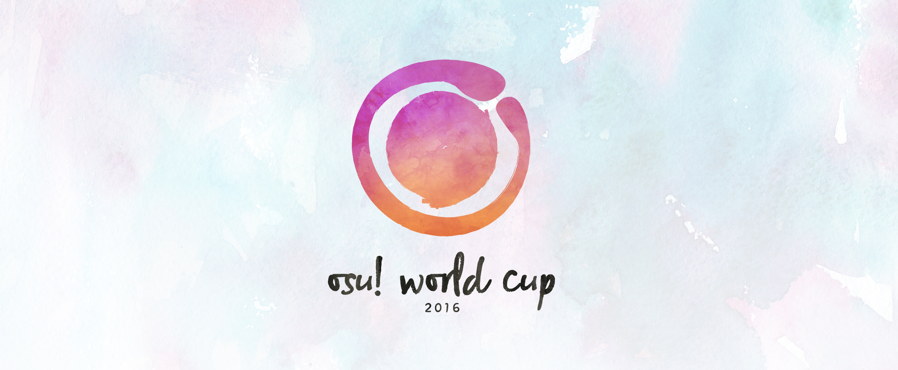

# osu! World Cup 2016

The **osu! World Cup 2016** (_**OWC 2016**_) is a country-based osu! tournament hosted by the osu! team](/wiki/People/The_Team). It is the 7th installment of the osu! World Cup.

## Tournament Schedule

| Event              | Timestamp                |
|-------------------:|:-------------------------|
| Registration Phase | 02-16 Oct 2016           |
| Drawings           | 4 Nov 2016 (12:00 UTC+0) |
| Group Stage        | 12-13 Nov 2016           |
| Round of 16        | 19-20 Nov 2016           |
| Quarterfinals      | 26-27 Nov 2016           |
| Semifinals         | 03-04 Dec 2016           |
| Finals - Week 1    | 10-11 Dec 2016           |
| Finals - Week 2    | 17-18 Dec 2016           |

## Prizes

We plan to distribute exclusive and unique merchandise to all our podium winners in different tiers. The items are yet to be announced.

| Placing                                              | Prize(s)                                                                        |
|------------------------------------------------------|:--------------------------------------------------------------------------------|
|    |exclusive and unique merchandise, profile badge, "osu!taiko Champion" user title |
|  |exclusive and unique merchandise, profile badge                                  |
|  |exclusive and unique merchandise, profile badge                                  |

## Organization

The osu! World Cup 2016 is ran by various community members by distributing the multitude of tasks into various fields of responsibility.

| Position              | Member                                                                                                                                                                                                                                                                                                                                                                                                                                                                                                          |
|-----------------------|-----------------------------------------------------------------------------------------------------------------------------------------------------------------------------------------------------------------------------------------------------------------------------------------------------------------------------------------------------------------------------------------------------------------------------------------------------------------------------------------------------------------|
| Tournament Management |  Loctav,  p3n,  Deif,  shARPII                                                                                                                                                                                                                                                                                                                                     |
| Map Selectors         |  Asahina Momoko,  Okorin,  Skystar                                                                                                                                                                                                                                                                                                                                                                  |
| Commentators          |  Bauxe,   Daikyi,   deadbeat,   Doomsday,   Evrien,   juankristal,   Omgforz,   Rime,   Slainv,   ztrot |
| Statistician          |  deadbeat,  Nwolf                                                                                                                                                                                                                                                                                                                                                                                                                   |

## Links

- [Livestream](http://www.twitch.tv/osulive)
- [Statistics](https://docs.google.com/spreadsheets/u/1/d/1rvVSjmdHIb-h8pekmVfIIPDPivrD5fACjNRYGo1U9to/pubhtml)
- [Discussion Thread](https://osu.ppy.sh/forum/t/507270)
- [Stage Recaps](https://www.youtube.com/playlist?list=PLqJuZKl72XH_El27Es8RsxW5NXDUVeRRl) (by Feurigel)

-----------

-----------

-----------

| Top Seed                                         | High Seed                                              | Low Seed                                             | Unseeded                                         |
|:-------------------------------------------------|:-------------------------------------------------------|:-----------------------------------------------------|:-------------------------------------------------|
|  China         |  Australia       |  Argentina     |  Denmark     |
|  France       |  Brazil             |  Austria         |  Greece       |
|  Germany     |  Canada             |  Chile             |  Indonesia |
|  Poland       |  Finland           |  Hong Kong     |  Israel       |
|  South Korea |  Italy               |  Latvia           |  Singapore |
|  Taiwan       |  Mexico             |  Netherlands |  Spain         |
|  United Kingdom   |  Norway             |  New Zealand |  Sweden       |
|  United States    |  Russian Federation |  Philippenes |  Ukraine     |

||Group A|
|-:|:-|
| France|**Musty**, filsdelama, ThePooN, Flaven, NerO, mrzomb, FayeurS, Elysion|
| Finland|**Sanze**, thelewa, Hyppyri, Subbie, Maffe, huono_tuuri, Sonoda-Umi, Multtari|
| New Zealand|**shortpotato**, buny, yellowy246, kiyumi, cabbage, ningalu, xenoframium, smead|
| Singapore|**Nakano-**, GSBlank, Raen, Repulse, Asterix-, Rtyzen, oneplusone, Raindrop|

||Group B|
|-:|:-|
| Poland|**My Angel Wilchq**, Wilchq, Rafis, WubWoofWolf, r0ck, fartownik, SpajdeR, Piggey|
| Italy|**xiAmME**, Koba, mrspazzaneve17, -Kazuki-, Kirin, DT-sama, umii, LLoyd-chan|
| Phillipenes|**revurii**, awmslayer, ededed028, 2124, HybRidChrome, Shii, konawiki, Mira-san|
| Ukraine|**Granje**, -Ranndom-, Sadness, BloodM0nk, FllareA, blednak, Elzbieta, Cloz1k|

||Group C|
|-:|:-|
| Taiwan|**Flask**, hvick225, Rucker, Small K, My Angel Haruna, Koalazy, Rizer, SevenTeen-|
| Mexico|**Broodich**, Ferelix, -Wolfy-, KevstracK, [ AeonLust ], Atsuro, -Hebel-, Atheneon|
| Argentina|**Glazbom**, GaTu, Pein, benjacala, Enhu, nicogame14, Catalysis, Toushi|
| Spain|**Naxurin**, PdPr0x_, Painketsu, [ xFrozZ ], MortalStriker, adrilolo9, Widelux13|

||Group D|
|-:|:-|
| Germany|**Dustice**, DoKito, Beafowl, Neliel, imagaK, Firstus, BDDav, W3SON|
| Australia|**Bauxe**, uyghti, ithgyu, Dumii, Korilak, Weber, Lunirs, Peekamoo|
| Latvia|**Forseen**, waywern2012, Emula, Jesus[Krists]|
| Greece|**Riven**, JohnyZ, ThePainG7, kYorineN, Grapheon, ThOmAstr, Tofas, xDarxen|

||Group E|
|-:|:-|
| China|**Crystal**, Totori, Dsan, Totoki, ArtxE, SpringLane, GGBY, MatsumotoRise|
| Canada||
| Chile||
| Israel||

||Group F|
|-:|:-|
| United States||
| Norway||
| Austria||
| Denmark||

||Group G|
|-:|:-|
| South Korea||
| Russian Federation||
| Netherlands||
| Indonesia||

||Group H|
|-:|:-|
| United Kingdom||
| Brazil||
| Hong Kong||
| Sweden||
