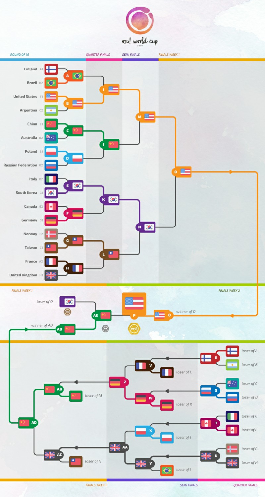
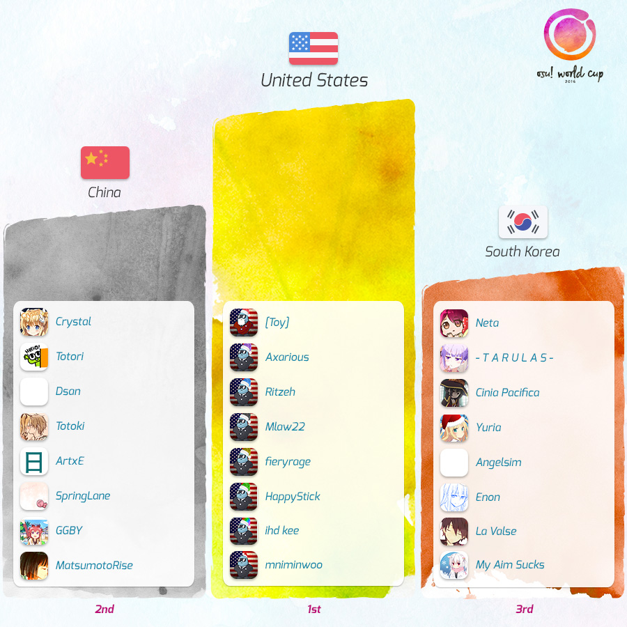

---
tags:
  - OWC 2016
  - OWC2016
no_native_review: true
---

# osu! World Cup 2016

La **osu! World Cup 2016** (***OWC 2016***) fue un torneo por países organizado por el [equipo de osu!](/wiki/People/osu!_team). Fue la séptima entrega de la osu! World Cup.

## Calendario del torneo

| Evento | Marca de tiempo |
| --: | :-- |
| Fase de registración | 2/10/2016 - 16/10/2016 |
| Sorteos | 4/11/2016 (12:00 UTC) |
| Fase de grupos | 12/11/2016 - 13/11/2016 |
| Octavos de final | 19/11/2016 |
| Cuartos de final | 26/11/2016 |
| Semifinales | 3/12/2016 - 4/12/2016 |
| Finales semana 1 | 10/12/2016 - 11/12/2016 |
| Finales semana 2 | 18/12/2016 |

## Premios

| Posición | Premios |
| :-: | :-- |
|  | Mercancía única y exclusiva, insignia única para el perfil, título de usuario de "osu! Champion" |
|  | Mercancía única y exclusiva, insignia única para el perfil |
|  | Mercancía única y exclusiva, insignia única para el perfil |

  

## Organización

La osu! World Cup 2016 estuvo a cargo de varios miembros de la comunidad.

| Posición | Miembro(s) |
| :-- | :-- |
| Gerente | ::{ flag=ES }:: [Deif](https://osu.ppy.sh/users/318565), ::{ flag=DE }:: [Loctav](https://osu.ppy.sh/users/71366), ::{ flag=DE }:: [p3n](https://osu.ppy.sh/users/123703), ::{ flag=FR }:: [shARPII](https://osu.ppy.sh/users/776257) |
| Selección de mapas | ::{ flag=JP }:: [Asahina Momoko](https://osu.ppy.sh/users/3650145), ::{ flag=DE }:: [Okorin](https://osu.ppy.sh/users/1623405), ::{ flag=HK }:: [Skystar](https://osu.ppy.sh/users/873961) |
| Comentaristas | ::{ flag=AU }:: [Bauxe](https://osu.ppy.sh/users/1881685), ::{ flag=US }:: [Daikyi](https://osu.ppy.sh/users/811832), ::{ flag=NZ }:: [deadbeat](https://osu.ppy.sh/users/128370), ::{ flag=GB }:: [Doomsday](https://osu.ppy.sh/users/18983), ::{ flag=CA }:: [Evrien](https://osu.ppy.sh/users/791660), ::{ flag=AR }:: [juankristal](https://osu.ppy.sh/users/443656), ::{ flag=AT }:: [Omgforz](https://osu.ppy.sh/users/578943), ::{ flag=GB }:: [Rime](https://osu.ppy.sh/users/1397232), ::{ flag=FR }:: [Slainv](https://osu.ppy.sh/users/4823843), ::{ flag=US }:: [ztrot](https://osu.ppy.sh/users/6347) |
| Estadísticas | ::{ flag=NZ }:: [deadbeat](https://osu.ppy.sh/users/128370), ::{ flag=DE }:: [Nwolf](https://osu.ppy.sh/users/1910766) |

## Links

- [Hilo de discusión](https://osu.ppy.sh/community/forums/topics/507270)
- [Transmisión en vivo](https://www.twitch.tv/osulive)
- [Resúmenes de las fases](https://www.youtube.com/playlist?list=PLqJuZKl72XH_El27Es8RsxW5NXDUVeRRl) (por Feurigel)
- **[Hoja de estadísticas](https://docs.google.com/spreadsheets/users/1/d/1rvVSjmdHIb-h8pekmVfIIPDPivrD5fACjNRYGo1U9to/pubhtml)**

## Participantes

|  | País | Miembros |
| :-: | :-: | :-- |
| ::{ flag=AR }:: | Argentina | **[Glazbom](https://osu.ppy.sh/users/608277)**, [benjacala](https://osu.ppy.sh/users/1625740), [Catalysis](https://osu.ppy.sh/users/5958063), [Enhu](https://osu.ppy.sh/users/2840499), [GaTu](https://osu.ppy.sh/users/3583351), [nicogame14](https://osu.ppy.sh/users/3812213), [Pein](https://osu.ppy.sh/users/2212941), [Toushi](https://osu.ppy.sh/users/2367825) |
| ::{ flag=AU }:: | Australia | **[Bauxe](https://osu.ppy.sh/users/1881685)**, [Dumii](https://osu.ppy.sh/users/3068044), [ithgyu](https://osu.ppy.sh/users/5113781), [Korilak](https://osu.ppy.sh/users/7260014), [Lunirs](https://osu.ppy.sh/users/2118945), [Peekamoo](https://osu.ppy.sh/users/2337263), [uyghti](https://osu.ppy.sh/users/3641404), [Weber](https://osu.ppy.sh/users/6410432) |
| ::{ flag=AT }:: | Austria | **[Akane-Yuki](https://osu.ppy.sh/users/3656589)**, [Fedora Goose](https://osu.ppy.sh/users/2323131), [LWMF](https://osu.ppy.sh/users/3632402), [Myst1k](https://osu.ppy.sh/users/5302223), [Omgforz](https://osu.ppy.sh/users/578943) |
| ::{ flag=BR }:: | Brasil | **[Fenrir](https://osu.ppy.sh/users/2644700)**, [fabriciorby](https://osu.ppy.sh/users/209664), [Idealism](https://osu.ppy.sh/users/3869519), [Mirtrax](https://osu.ppy.sh/users/2290888), [Miyazono](https://osu.ppy.sh/users/529036), [MouseEasy](https://osu.ppy.sh/users/1558603), [Texats](https://osu.ppy.sh/users/1638293), [Zekker](https://osu.ppy.sh/users/4663554) |
| ::{ flag=CA }:: | Canadá | **[Azer](https://osu.ppy.sh/users/2155578)**, [Ignite](https://osu.ppy.sh/users/3122948), [Kaifin](https://osu.ppy.sh/users/2596942), [karalis](https://osu.ppy.sh/users/3146018), [Kyle](https://osu.ppy.sh/users/2694475), [MiruHong](https://osu.ppy.sh/users/2866814), [TrickMirror](https://osu.ppy.sh/users/2138739), [VINXIS](https://osu.ppy.sh/users/4323406) |
| ::{ flag=CL }:: | Chile | **[kafaN](https://osu.ppy.sh/users/1489743)**, [allives](https://osu.ppy.sh/users/3951781), [Criss](https://osu.ppy.sh/users/3188017), [DanyL](https://osu.ppy.sh/users/3069354), [DPL](https://osu.ppy.sh/users/3024454), [-Dylson-](https://osu.ppy.sh/users/6315784), [etejuano](https://osu.ppy.sh/users/2243537), [Neab](https://osu.ppy.sh/users/916693) |
| ::{ flag=CN }:: | China | **[Crystal](https://osu.ppy.sh/users/1646397)**, [ArtxE](https://osu.ppy.sh/users/954557), [Dsan](https://osu.ppy.sh/users/1266166), [GGBY](https://osu.ppy.sh/users/629717), [MatsumotoRise](https://osu.ppy.sh/users/672726), [SpringLane](https://osu.ppy.sh/users/1343504), [Totori](https://osu.ppy.sh/users/227717), [Totoki](https://osu.ppy.sh/users/557197) |
| ::{ flag=DK }:: | Dinamarca | **[Spork Lover](https://osu.ppy.sh/users/3417469)**, [Crylizhy](https://osu.ppy.sh/users/3023138), [Hudda](https://osu.ppy.sh/users/4103629), [iamVill](https://osu.ppy.sh/users/6295380), [Lemmen](https://osu.ppy.sh/users/6090254), [teamplayer51](https://osu.ppy.sh/users/3084508)[waefwerf](https://osu.ppy.sh/users/3868653), [Zog](https://osu.ppy.sh/users/3722715) |
| ::{ flag=FI }:: | Finlandia | **[Sanze](https://osu.ppy.sh/users/3110552)**, [huono\_tuuri](https://osu.ppy.sh/users/1432954), [Hyppyri](https://osu.ppy.sh/users/3123423), [Maffe](https://osu.ppy.sh/users/4773855), [Multtari](https://osu.ppy.sh/users/1097352), [Sonoda-Umi](https://osu.ppy.sh/users/2197711), [Subbie](https://osu.ppy.sh/users/1590138), [thelewa](https://osu.ppy.sh/users/475021) |
| ::{ flag=FR }:: | Francia | **[Musty](https://osu.ppy.sh/users/251683)**, [Elysion](https://osu.ppy.sh/users/106269), [FayeurS](https://osu.ppy.sh/users/3105416), [filsdelama](https://osu.ppy.sh/users/2831793), [Flaven](https://osu.ppy.sh/users/3213239), [mrzomb](https://osu.ppy.sh/users/1694887), [NerO](https://osu.ppy.sh/users/1545031), [ThePooN](https://osu.ppy.sh/users/718454) |
| ::{ flag=DE }:: | Alemania | **[Dustice](https://osu.ppy.sh/users/754565)**, [BDDav](https://osu.ppy.sh/users/1164526), [Beafowl](https://osu.ppy.sh/users/2438122), [DoKito](https://osu.ppy.sh/users/537084), [Firstus](https://osu.ppy.sh/users/1856829), [imagaK](https://osu.ppy.sh/users/2022445), [Neliel](https://osu.ppy.sh/users/1500305), [W3SON](https://osu.ppy.sh/users/2070822) |
| ::{ flag=GR }:: | Grecia | **[Riven](https://osu.ppy.sh/users/3638005)**, [Grapheon](https://osu.ppy.sh/users/2415008), [JohnyZ](https://osu.ppy.sh/users/4508048), [kYorineN](https://osu.ppy.sh/users/4131515), [ThOmAstr](https://osu.ppy.sh/users/2793537), [ThePainG7](https://osu.ppy.sh/users/3478000), [Tofas](https://osu.ppy.sh/users/2755584), [xDarxen](https://osu.ppy.sh/users/4625954) |
| ::{ flag=HK }:: | Hong Kong | **[- G I D Z -](https://osu.ppy.sh/users/2286528)**, [Chaoslitz](https://osu.ppy.sh/users/3621552), [DenierNezzar](https://osu.ppy.sh/users/126144), [MinG3012](https://osu.ppy.sh/users/1583218), [-N a n a k o-](https://osu.ppy.sh/users/1407516), [Rizia](https://osu.ppy.sh/users/1367570), [StarrStyx](https://osu.ppy.sh/users/4600383), [YoonA-](https://osu.ppy.sh/users/1639250) |
| ::{ flag=ID }:: | Indonesia | **[Mood Breaker](https://osu.ppy.sh/users/692065)**, [Genjitsu](https://osu.ppy.sh/users/3531490), [lolimastah](https://osu.ppy.sh/users/3207112), [LongExistence](https://osu.ppy.sh/users/2380426), [Rexeez](https://osu.ppy.sh/users/1987591), [Reyuza](https://osu.ppy.sh/users/2454767), [Rinzler](https://osu.ppy.sh/users/2133381), [Vorsatz](https://osu.ppy.sh/users/3654630) |
| ::{ flag=IL }:: | Israel | **[MrPotato](https://osu.ppy.sh/users/2787415)**, [Fookiezi](https://osu.ppy.sh/users/4593732), [ilift](https://osu.ppy.sh/users/4903239), [Keysama](https://osu.ppy.sh/users/3376034), [KiroKusA](https://osu.ppy.sh/users/4355621), [Kyoko](https://osu.ppy.sh/users/3382084), [Slendy](https://osu.ppy.sh/users/2689577) |
| ::{ flag=IT }:: | Italia | **[xiAmME](https://osu.ppy.sh/users/1428960)**, [DT-sama](https://osu.ppy.sh/users/3525018), [-Kazuki-](https://osu.ppy.sh/users/3614356), [Kirin](https://osu.ppy.sh/users/1852356), [Koba](https://osu.ppy.sh/users/4448118), [LLoyd-chan](https://osu.ppy.sh/users/2849149), [mrspazzaneve17](https://osu.ppy.sh/users/3516241), [umii](https://osu.ppy.sh/users/2538695) |
| ::{ flag=LV }:: | Letonia | **[Forseen](https://osu.ppy.sh/users/556012)**, [Emula](https://osu.ppy.sh/users/2891792), [Jesus\[Krists\]](https://osu.ppy.sh/users/2842992), [waywern2012](https://osu.ppy.sh/users/5870453) |
| ::{ flag=MX }:: | México | **[Broodich](https://osu.ppy.sh/users/2484629)**, [\[ AeonLust \]](https://osu.ppy.sh/users/2353490), [Atheneon](https://osu.ppy.sh/users/2164627), [Atsuro](https://osu.ppy.sh/users/2279351), [Ferelix](https://osu.ppy.sh/users/5580827), [-Hebel-](https://osu.ppy.sh/users/6169483), [KevstracK](https://osu.ppy.sh/users/5325213), [-Wolfy-](https://osu.ppy.sh/users/4497582) |
| ::{ flag=NL }:: | Países Bajos | **[jackylam5](https://osu.ppy.sh/users/1540807)**, [Ahmnesia](https://osu.ppy.sh/users/2715937), [Kyshiro](https://osu.ppy.sh/users/640611), [n0ah](https://osu.ppy.sh/users/3086393), [Pittigbaasje](https://osu.ppy.sh/users/2167433), [Sj-Sama](https://osu.ppy.sh/users/2977954), [Synchrostar](https://osu.ppy.sh/users/419705), [taku](https://osu.ppy.sh/users/684433) |
| ::{ flag=NZ }:: | Nueva Zelanda | **[shortpotato](https://osu.ppy.sh/users/1266102)**, [buny](https://osu.ppy.sh/users/1488796), [cabbage](https://osu.ppy.sh/users/2358072), [kiyumi](https://osu.ppy.sh/users/3701898), [ningalu](https://osu.ppy.sh/users/6934358), [smead](https://osu.ppy.sh/users/4293459), [xenoframium](https://osu.ppy.sh/users/4502584), [yellowy246](https://osu.ppy.sh/users/3833980) |
| ::{ flag=NO }:: | Noruega | **[Tobi](https://osu.ppy.sh/users/2970667)**, [Afrodafro](https://osu.ppy.sh/users/3551255), [CXu](https://osu.ppy.sh/users/84841), [-GN](https://osu.ppy.sh/users/895581), [Hundur](https://osu.ppy.sh/users/3145033), [-PC](https://osu.ppy.sh/users/2916414), [Sebu](https://osu.ppy.sh/users/3990173), [Warrock](https://osu.ppy.sh/users/2841744) |
| ::{ flag=PH }:: | Filipinas | **[revurii](https://osu.ppy.sh/users/4180036)**, [2124](https://osu.ppy.sh/users/5315077), [awmslayer](https://osu.ppy.sh/users/4133147), [ededed028](https://osu.ppy.sh/users/3932796), [HybRidChrome](https://osu.ppy.sh/users/2606470), [konawiki](https://osu.ppy.sh/users/4003979), [Mira-san](https://osu.ppy.sh/users/1587999), [Shii](https://osu.ppy.sh/users/2911062) |
| ::{ flag=PL }:: | Polonia | **[My Angel Wilchq](https://osu.ppy.sh/users/844815)**, [fartownik](https://osu.ppy.sh/users/56917), [Piggey](https://osu.ppy.sh/users/4163860), [r0ck](https://osu.ppy.sh/users/1549620), [Rafis](https://osu.ppy.sh/users/2558286), [SpajdeR](https://osu.ppy.sh/users/3446664), [Wilchq](https://osu.ppy.sh/users/2021758), [WubWoofWolf](https://osu.ppy.sh/users/39828) |
| ::{ flag=RU }:: | Rusia | **[Kert](https://osu.ppy.sh/users/119933)**, [\_index](https://osu.ppy.sh/users/652457), [follon](https://osu.ppy.sh/users/3973474), [Red\_Pixel](https://osu.ppy.sh/users/4170932), [Shiawase](https://osu.ppy.sh/users/989489), [Shockwave000](https://osu.ppy.sh/users/2295157), [talala](https://osu.ppy.sh/users/1389663), [unberlin](https://osu.ppy.sh/users/2408278) |
| ::{ flag=SG }:: | Singapur | **[Nakano-](https://osu.ppy.sh/users/1893953)**, [Asterix-](https://osu.ppy.sh/users/5138193), [GSBlank](https://osu.ppy.sh/users/2312106), [oneplusone](https://osu.ppy.sh/users/1843447), [Raen](https://osu.ppy.sh/users/2922482), [Raindrop](https://osu.ppy.sh/users/1155871), [Repulse](https://osu.ppy.sh/users/2414526), [Rtyzen](https://osu.ppy.sh/users/2439822) |
| ::{ flag=KR }:: | Corea del Sur | **[Neta](https://osu.ppy.sh/users/832084)**, [Angelsim](https://osu.ppy.sh/users/1777162), [Cinia Pacifica](https://osu.ppy.sh/users/1414625), [Enon](https://osu.ppy.sh/users/2043401), [La Valse](https://osu.ppy.sh/users/70863), [My Aim Sucks](https://osu.ppy.sh/users/1883865), [-T A R U L A S-](https://osu.ppy.sh/users/3179601), [Yuria](https://osu.ppy.sh/users/625988) |
| ::{ flag=ES }:: | España | **[Naxurin](https://osu.ppy.sh/users/3589423)**, [\[ xFrozZ \]](https://osu.ppy.sh/users/6462387), [adrilolo9](https://osu.ppy.sh/users/4274726), [MortalStriker](https://osu.ppy.sh/users/4759050), [Painketsu](https://osu.ppy.sh/users/2127432), [PdPr0x\_](https://osu.ppy.sh/users/4086716), [Widelux13](https://osu.ppy.sh/users/3938945) |
| ::{ flag=SE }:: | Suecia | **[-Kupo-](https://osu.ppy.sh/users/4343103)**, [HenBurgaaa](https://osu.ppy.sh/users/4663479), [Rapthorn](https://osu.ppy.sh/users/5109930), [Snase](https://osu.ppy.sh/users/4258410), [Suzuta](https://osu.ppy.sh/users/3028834), [Tomoko Kuroki-](https://osu.ppy.sh/users/4418213) |
| ::{ flag=TW }:: | Taiwán | **[Flask](https://osu.ppy.sh/users/959763)**, [hvick225](https://osu.ppy.sh/users/50265), [Koalazy](https://osu.ppy.sh/users/286740), [My Angel Haruna](https://osu.ppy.sh/users/606544), [Rizer](https://osu.ppy.sh/users/5155973), [Rucker](https://osu.ppy.sh/users/147515), [SevenTeen-](https://osu.ppy.sh/users/1859195), [Small K](https://osu.ppy.sh/users/952751) |
| ::{ flag=UA }:: | Ucrania | **[Granje](https://osu.ppy.sh/users/496387)**, [blednak](https://osu.ppy.sh/users/912627), [BloodM0nk](https://osu.ppy.sh/users/2174403), [Cloz1k](https://osu.ppy.sh/users/4548264), [Elzbieta](https://osu.ppy.sh/users/3734954), [FllareA](https://osu.ppy.sh/users/1163931), [-Ranndom-](https://osu.ppy.sh/users/5022536), [Sadness](https://osu.ppy.sh/users/6560835) |
| ::{ flag=GB }:: | Reino Unido | **[Bubbleman](https://osu.ppy.sh/users/5182050)**, [bahamete](https://osu.ppy.sh/users/960620), [Doomsday](https://osu.ppy.sh/users/18983), [Helix](https://osu.ppy.sh/users/3322597), [Jameslike](https://osu.ppy.sh/users/2415743), [Karthy](https://osu.ppy.sh/users/4196808), [OPJames](https://osu.ppy.sh/users/4117142), [Spook](https://osu.ppy.sh/users/2232928) |
| ::{ flag=US }:: | Estados Unidos | **[\[Toy\]](https://osu.ppy.sh/users/2757689)**, [Axarious](https://osu.ppy.sh/users/2614511), [fieryrage](https://osu.ppy.sh/users/3533958), [HappyStick](https://osu.ppy.sh/users/256802), [idke](https://osu.ppy.sh/users/4650315), [Mlaw22](https://osu.ppy.sh/users/3126596), [mniminwoo](https://osu.ppy.sh/users/3929529), [Ritzeh](https://osu.ppy.sh/users/1028387) |

## Grupos

| Grupo | Semilla superior | Semilla alta | Semilla media | Semilla baja |
| :-: | :-- | :-- | :-- | :-- |
| **A** | ::{ flag=FR }:: Francia | ::{ flag=FI }:: Finlandia | ::{ flag=NZ }:: Nueva Zelanda | ::{ flag=SG }:: Singapur |
| **B** | ::{ flag=PL }:: Polonia | ::{ flag=IT }:: Italia | ::{ flag=PH }:: Filipinas | ::{ flag=UA }:: Ucrania |
| **C** | ::{ flag=TW }:: Taiwán | ::{ flag=MX }:: México | ::{ flag=AR }:: Argentina | ::{ flag=ES }:: España |
| **D** | ::{ flag=DE }:: Alemania | ::{ flag=AU }:: Australia | ::{ flag=LV }:: Letonia | ::{ flag=GR }:: Grecia |
| **E** | ::{ flag=CN }:: China | ::{ flag=CA }:: Canadá | ::{ flag=CL }:: Chile | ::{ flag=IL }:: Israel |
| **F** | ::{ flag=US }:: Estados Unidos | ::{ flag=NO }:: Noruega | ::{ flag=AT }:: Austria | ::{ flag=DK }:: Dinamarca |
| **G** | ::{ flag=KR }:: Corea del Sur | ::{ flag=RU }:: Rusia | ::{ flag=NL }:: Países Bajos | ::{ flag=ID }:: Indonesia |
| **H** | ::{ flag=GB }:: Reino Unido | ::{ flag=BR }:: Brasil | ::{ flag=HK }:: Hong Kong | ::{ flag=SE }:: Suecia |

## Podio

## Mappools

### Finales

**Este mappool se jugó durante la semana 1 y la semana 2 de las Finales.**

[¡Descarga el paquete de mapas aquí! (148 MB)](https://www.mediafire.com/file/1rf6jgjsgfilhkx/OWC_2016_Finals.rar)

- NoMod
  1. [U1 overground - Dopamine (fanzhen0019) \[C6H3(OH)2-CH2-CH2-NH2\]](https://osu.ppy.sh/beatmapsets/210316#osu/494818)
  2. [Yousei Teikoku - The Creator (meiikyuu) \[Nyaten\]](https://osu.ppy.sh/beatmapsets/41242#osu/202756)
  3. [BABYMETAL - Gimme chocolate!! (alacat) \[BLACK CHOCOLATE!!\]](https://osu.ppy.sh/beatmapsets/452230#osu/970048)
  4. [Nanahira - Bassdrop Freaks (Long Ver.) (yf\_bmp) \[BASSDROP!!\]](https://osu.ppy.sh/beatmapsets/463479#osu/992437)
  5. [ayaponzu\* - Yakubyougami (cRyo\[iceeicee\]) \[B(\]](https://osu.ppy.sh/beatmapsets/455419#osu/976190)
  6. [ESTi - HELIX (Edit ver.) (Hollow Wings) \[EX EX\]](https://osu.ppy.sh/beatmapsets/194910#osu/462700)
- Hidden
  1. [Demetori - Silent Voyage to Eternity (brikel) \[BMix\]](https://osu.ppy.sh/beatmapsets/14309#osu/115384)
  2. [An - Catanoph (Lavender) \[Extra(OWC Version)\]](https://osu.ppy.sh/beatmapsets/527069#osu/1118285)
- HardRock
  1. [Studio EIM - Crescent Moon Island Boss Theme (Rakuen) \[\[ -Scarlet- \]'s Extra\]](https://osu.ppy.sh/beatmapsets/173422#osu/434438)
  2. [Camellia feat. Nanahira - Tsukitourou (jonathanlfj) \[Countless\]](https://osu.ppy.sh/beatmapsets/383147#osu/837694)
- DoubleTime
  1. [ClariS - Colorful (Laurier) \[Insane\]](https://osu.ppy.sh/beatmapsets/134008#osu/336295)
  2. [LeaF - MEPHISTO (Alumetorz) \[Another\]](https://osu.ppy.sh/beatmapsets/106212#osu/282166)
- FreeMod
  1. [EZFG - Hurting for a Very Hurtful Pain (tutuhaha) \[Dance\]](https://osu.ppy.sh/beatmapsets/46848#osu/145669)
  2. [Syrsa - Mad Machine (Louis Cyphre) \[Champion\]](https://osu.ppy.sh/beatmapsets/33052#osu/107875)
  3. [USAO - Miracle 5ympho X (Extended Mix) (RLC) \[5ympho XtrA\]](https://osu.ppy.sh/beatmapsets/230739#osu/536476)
- Desempate
  1. **[goreshit - burn this moment into the retina of my eye (grumd) \[extra\]](https://osu.ppy.sh/beatmapsets/359890#osu/791274)**

### Semifinales

[¡Descarga el paquete de mapas aquí! (131 MB)](https://www.mediafire.com/file/byy9j4jan4uhk57/OWC_2016_Semifinals.rar)

- NoMod
  1. [ZUN remixed by LeaF - Resurrection Spell (Muya) \[VOLCANO\]](https://osu.ppy.sh/beatmapsets/292644#osu/658561)
  2. [VY1 - Cyber Thunder Cider (tutuhaha) \[Cider\]](https://osu.ppy.sh/beatmapsets/47146#osu/146610)
  3. [Yooh - LegenD. (Flask) \[GravitY.\]](https://osu.ppy.sh/beatmapsets/396839#osu/863249)
  4. [LIQU@. - Yotogibanashi no Kamikakushi (Kyubey) \[oko's Extra\]](https://osu.ppy.sh/beatmapsets/236396#osu/717133)
  5. [Function Phantom - Euclid (byfar) \[Fifth Postulate\]](https://osu.ppy.sh/beatmapsets/419614#osu/908093)
  6. [Alipio Martins - Piranha (Maffalda Reloaded Trap Mix) (Tarrasky) \[BD's Gangsta\]](https://osu.ppy.sh/beatmapsets/287873#osu/652234)
- Hidden
  1. [DECO\*27 - Streaming Heart feat. Hatsune Miku (Tsumetaku) \[0108's Extra\]](https://osu.ppy.sh/beatmapsets/160126#osu/534946)
  2. [An - Saigo (Rumia-) \[Final\]](https://osu.ppy.sh/beatmapsets/517783#osu/1100091)
- HardRock
  1. [ginkiha - EOS (alacat) \[Lycoris\]](https://osu.ppy.sh/beatmapsets/151720#osu/373781)
  2. [Hatsune Miku - Sakura Zensen Ijou Nashi (Lalarun) \[Ijou Nashi\]](https://osu.ppy.sh/beatmapsets/32021#osu/104945)
- DoubleTime
  1. [Rain - Hip Song (Irreversible) \[Insane\]](https://osu.ppy.sh/beatmapsets/385185#osu/841426)
  2. [Neru - World Domination How-To (Chewin) \[Insane\]](https://osu.ppy.sh/beatmapsets/124898#osu/318142)
- FreeMod
  1. [cosMo@BousouP - Oceanus (Broccoly) \[Divinity\]](https://osu.ppy.sh/beatmapsets/267767#osu/609843)
  2. [Susumu Hirasawa - Big Brother (Gens) \[KIRBY Mix\]](https://osu.ppy.sh/beatmapsets/10714#osu/42244)
  3. [T & Sugah x Lexurus - No More (Strategas) \[Extra\]](https://osu.ppy.sh/beatmapsets/471562#osu/1007896)
- Desempate
  1. **[Venetian Snares - She Runs (fergas) \[Escape?\]](https://osu.ppy.sh/beatmapsets/319890#osu/711923)**

### Cuartos de final

[¡Descarga el paquete de mapas aquí! (125 MB)](https://www.mediafire.com/file/7gmr44m72v58p8w/OWC_2016_Quarterfinals.rar)

- NoMod
  1. [Memme - Chinese Restaurant (M o k o r i) \[Spicy\]](https://osu.ppy.sh/beatmapsets/256467#osu/587547)
  2. [paraoka - boot (rickyboi) \[Shoe\]](https://osu.ppy.sh/beatmapsets/50131#osu/154226)
  3. [Xelia - Illumiscape (Kanna) \[Extra\]](https://osu.ppy.sh/beatmapsets/43960#osu/152127)
  4. [Lily - Scarlet Rose (val0108) \[0108 style\]](https://osu.ppy.sh/beatmapsets/41686#osu/131564)
  5. [MY FIRST STORY - ALONE (Saut) \[Isolation\]](https://osu.ppy.sh/beatmapsets/395846#osu/861381)
  6. [Delain - Go Away (pishifat) \[Extra\]](https://osu.ppy.sh/beatmapsets/475676#osu/1016263)
- Hidden
  1. [Sound Horizon - Raijin no Hidariude (AngelHoney) \[Insane\]](https://osu.ppy.sh/beatmapsets/16792#osu/60089)
  2. [UNDEAD CORPORATION - Yoru Naku Usagi wa Yume wo Miru (Strawberry) \[Lunatic\]](https://osu.ppy.sh/beatmapsets/59049#osu/214252)
- HardRock
  1. [iojjj - Deus Ex Machina (Okoratu) \[GREAT EQUALIZER IS THE DEATH\]](https://osu.ppy.sh/beatmapsets/107747#osu/688886)
  2. [mafumafu - Yuugure Semi Nikki (L\_P) \[Yuugure\]](https://osu.ppy.sh/beatmapsets/60096#osu/180681)
- DoubleTime
  1. [Mami Kawada - sense (Giralda) \[LC's Insane\]](https://osu.ppy.sh/beatmapsets/325638#osu/723285)
  2. [ClariS - Connect (Holoaz) \[Holo\]](https://osu.ppy.sh/beatmapsets/25705#osu/87066)
- FreeMod
  1. [07th Expansion - rog-unlimitation (AngelHoney) \[AngelHoney\]](https://osu.ppy.sh/beatmapsets/28751#osu/116128)
  2. [jippusu - Mushikui Saikede Rhythm (Amamiya Yuko) \[Skystar\]](https://osu.ppy.sh/beatmapsets/87547#osu/239104)
  3. [beatMARIO - Night of Knights (DJPop) \[SOLO\]](https://osu.ppy.sh/beatmapsets/15920#osu/58063)
- Desempate
  1. **[DragonForce - Symphony Of The Night (Evil\_Twilight) \[Legend\]](https://osu.ppy.sh/beatmapsets/469148#osu/1007546)**

### Octavos de final

[¡Descarga el paquete de mapas aquí! (171 MB)](https://www.mediafire.com/file/1qbqnc5hxa10xk9/OWC_2016_Round_of_16.rar)

- NoMod
  1. [Cilvery - Kamisama Nejimaki (sukiNathan) \[Catastrophe\]](https://osu.ppy.sh/beatmapsets/374900#osu/821238)
  2. [senya - Renbei no Searchlight (Dailycare) \[Satellite's Catharsis\]](https://osu.ppy.sh/beatmapsets/491057#osu/1046536)
  3. [LeaF - Wizdomiot (Asahina Momoko) \[Lunatic\]](https://osu.ppy.sh/beatmapsets/336099#osu/743896)
  4. [Katakiri Rekka - Answer (deetz) \[RLC's Darkness\]](https://osu.ppy.sh/beatmapsets/440266#osu/947334)
  5. [Hana - Sakura no Uta (Ultimate Madoka) \[VI.Artist of the Sakura\]](https://osu.ppy.sh/beatmapsets/440068#osu/994933)
  6. [Memme - Extreme Fantasy (AngelHoney) \[ExtrA\]](https://osu.ppy.sh/beatmapsets/49459#osu/152480)
- Hidden
  1. [IOSYS - Poinsettia (Aakiha) \[Lunatic\]](https://osu.ppy.sh/beatmapsets/18382#osu/65233)
  2. [Team:SASAKURATION - AVALON (Leader) \[gowww's Extra\]](https://osu.ppy.sh/beatmapsets/118763#osu/430110)
- HardRock
  1. [MYTHOLOGIA by MLREC. - Ymir (Kitami Erika) \[Another\]](https://osu.ppy.sh/beatmapsets/322481#osu/716972)
  2. [supercell - Hoshi ga Matataku Konna Yoru ni (\[Teichan\]) \[Starlight\]](https://osu.ppy.sh/beatmapsets/294042#osu/661243)
- DoubleTime
  1. [Kraster - Remember History (Short Ver.) (Serval) \[Lunatic\]](https://osu.ppy.sh/beatmapsets/22115#osu/76419)
  2. [SYNC.ART'S - Sins -Kokoro no Tsumi- (Snowy Dream) \[Nightmare\]](https://osu.ppy.sh/beatmapsets/51605#osu/158107)
- FreeMod
  1. [M2U - Nightmare (ignorethis) \[Lesjuh\]](https://osu.ppy.sh/beatmapsets/16069#osu/60238)
  2. [yuikonnu & ayaponzu\* - Kunoichi demo Koi ga Shitai (alacat) \[Skystar's Extra\]](https://osu.ppy.sh/beatmapsets/111045#osu/319694)
  3. [nmk - sola (sjoy) \[Imouto's Extra\]](https://osu.ppy.sh/beatmapsets/183267#osu/439824)
- Desempate
  1. **[Camellia - d:for the DELTA (ProfessionalBox) \[Delirium\]](https://osu.ppy.sh/beatmapsets/396370#osu/862338)**

### Fase de grupos

[¡Descarga el paquete de mapas aquí! (153 MB)](https://www.mediafire.com/file/13glkdv1zbyxfpp/OWC_2016_Group_Stage.rar)

- NoMod
  1. [sakuzyo - Altale (toybot) \[Bonzi's Extra\]](https://osu.ppy.sh/beatmapsets/228815#osu/1012279)
  2. [Lon - Yuru Fuwa Jukai Girl (Garven) \[Insane\]](https://osu.ppy.sh/beatmapsets/49686#osu/153103)
  3. [Itou Kanako - Skyclad no Kansokusha -Remix- (Takos) \[taka\]](https://osu.ppy.sh/beatmapsets/33323#osu/110628)
  4. [Rita - Dream Walker (Vert) \[Zweib's Insane\]](https://osu.ppy.sh/beatmapsets/353237#osu/778244)
  5. [ONE OK ROCK - Mikansei Koukyoukyoku (Saut) \[Extreme\]](https://osu.ppy.sh/beatmapsets/348604#osu/768986)
  6. [Ray - Hajimete Girls! (Meyrink) \[Skystar's Pin Pon\~\]](https://osu.ppy.sh/beatmapsets/330566#osu/776752)
- Hidden
  1. [Cyua - Blumenkranz (Shinxyn) \[Insane\]](https://osu.ppy.sh/beatmapsets/155034#osu/380475)
  2. [sana - Kotonoha Clinic (Kite) \[Moroi\]](https://osu.ppy.sh/beatmapsets/419189#osu/907200)
- HardRock
  1. [Cascada - How Do You Do (Nightcore Mix) (Asphyxia) \[Insane\]](https://osu.ppy.sh/beatmapsets/203787#osu/481450)
  2. [Rameses B - Utopia (ft. Holly Drummond) (Milan-) \[deetz' Paradise\]](https://osu.ppy.sh/beatmapsets/294493#osu/662046)
- DoubleTime
  1. [Satori-san - Hari no Sora (Sure) \[Insane\]](https://osu.ppy.sh/beatmapsets/290262#osu/653966)
  2. [07th Expansion - goldenslaughterer (La Cataline) \[Hard\]](https://osu.ppy.sh/beatmapsets/37729#osu/121197)
- FreeMod
  1. [ONE OK ROCK - Re:make (Rucker) \[Remake\]](https://osu.ppy.sh/beatmapsets/38472#osu/123152)
  2. [44teru-k - F.I (Jacob) \[Extra445\]](https://osu.ppy.sh/beatmapsets/47664#osu/155235)
  3. [Megpoid GUMI - For my soul (val0108) \[Insane\]](https://osu.ppy.sh/beatmapsets/22509#osu/80102)
- Desempate
  1. **[kors k - Playing With Fire (Sota Fujimori Remix) (xlni) \[Pyrotechnics\]](https://osu.ppy.sh/beatmapsets/202252#osu/478605)**

## Resultados de las partidas

### Finales semana 2

Domingo, 18 de diciembre de 2016:

| Equipo 1 |  |  | Equipo 2 | Enlance de la partida |
| --: | :-: | :-: | :-- | :-- |
| Estados Unidos ::{ flag=US }:: | 2 | **7** | ::{ flag=CN }:: **China** | [#1](https://osu.ppy.sh/community/matches/29702438) |
| China ::{ flag=CN }:: | 4 | **7** | ::{ flag=US }:: **Estados Unidos** | [#1](https://osu.ppy.sh/community/matches/29704086) |

### Finales semana 1

Sábado, 10 de diciembre de 2016:

| Equipo 1 |  |  | Equipo 2 | Enlance de la partida |
| --: | :-: | :-: | :-- | :-- |
| **Estados Unidos** ::{ flag=US }:: | **6** | 4 | ::{ flag=KR }:: Corea del Sur | [#1](https://osu.ppy.sh/community/matches/29524076) |
| **Reino Unido** ::{ flag=GB }:: | **6** | 4 | ::{ flag=TW }:: Taiwán | [#1](https://osu.ppy.sh/community/matches/29530355) |
| Alemania ::{ flag=DE }:: | 2 | **6** | ::{ flag=CN }:: China | [#1](https://osu.ppy.sh/community/matches/29531576) |
| **China** ::{ flag=CN }:: | **6** | 2 | ::{ flag=GB }:: Reino Unido | [#1](https://osu.ppy.sh/community/matches/29533696) |

Domingo, 11 de diciembre de 2016:

| Equipo 1 |  |  | Equipo 2 | Enlance de la partida |
| --: | :-: | :-: | :-- | :-- |
| **China** ::{ flag=CN }:: | **6** | 2 | ::{ flag=KR }:: Corea del Sur | [#1](https://osu.ppy.sh/community/matches/29560336) |

### Semifinales

Sábado, 3 de diciembre de 2016:

| Equipo 1 |  |  | Equipo 2 | Enlance de la partida |
| --: | :-: | :-: | :-- | :-- |
| **Corea del Sur** ::{ flag=KR }:: | **6** | 2 | ::{ flag=TW }:: Taiwán | [#1](https://osu.ppy.sh/community/matches/29379804) |
| Rusia ::{ flag=RU }:: | 5 | **6** | ::{ flag=DE }:: **Alemania** | [#1](https://osu.ppy.sh/community/matches/29381511) |
| Finlandia ::{ flag=FI }:: | 0 | **6** | ::{ flag=FR }:: **Francia** | [#1](https://osu.ppy.sh/community/matches/29383842) |
| **Estados Unidos** ::{ flag=US }:: | **6** | 4 | ::{ flag=CN }:: China | [#1](https://osu.ppy.sh/community/matches/29385744) |
| **Reino Unido** ::{ flag=GB }:: | **6** | 0 | ::{ flag=BR }:: Brasil | [#1](https://osu.ppy.sh/community/matches/29388879) |
| Canadá ::{ flag=CA }:: | 0 | **6** | ::{ flag=PL }:: **Polonia** | [#1](https://osu.ppy.sh/community/matches/29391121) |

Domingo, 4 de diciembre de 2016:

| Equipo 1 |  |  | Equipo 2 | Enlance de la partida |
| --: | :-: | :-: | :-- | :-- |
| Francia ::{ flag=FR }:: | 2 | **6** | ::{ flag=DE }:: **Alemania** | [#1](https://osu.ppy.sh/community/matches/29413616) |
| Polonia ::{ flag=PL }:: | 4 | **6** | ::{ flag=GB }:: **Reino Unido** | [#1](https://osu.ppy.sh/community/matches/29415472) |

### Cuartos de final

Sábado, 26 de noviembre de 2016:

| Equipo 1 |  |  | Equipo 2 | Enlance de la partida |
| --: | :-: | :-: | :-- | :-- |
| Australia ::{ flag=AU }:: | 1 | **5** | ::{ flag=RU }:: **Rusia** | [#1](https://osu.ppy.sh/community/matches/29236130) |
| **Corea del Sur** ::{ flag=KR }:: | **5** | 2 | ::{ flag=DE }:: Alemania | [#1](https://osu.ppy.sh/community/matches/29237189) |
| **China** ::{ flag=CN }:: | **5** | 2 | ::{ flag=PL }:: Polonia | [#1](https://osu.ppy.sh/community/matches/29238760) |
| **Taiwán** ::{ flag=TW }:: | **5** | 4 | ::{ flag=FR }:: Francia | [#1](https://osu.ppy.sh/community/matches/29240657) |
| Noruega ::{ flag=NO }:: | 4 | **5** | ::{ flag=GB }:: **Reino Unido** | [#1](https://osu.ppy.sh/community/matches/29244637) |
| **Finlandia** ::{ flag=FI }:: | **5** | 2 | ::{ flag=AR }:: Argentina | [#1](https://osu.ppy.sh/community/matches/29247238) |
| Italia ::{ flag=IT }:: | 0 | **5** | ::{ flag=CA }:: **Canadá** | [#1](https://osu.ppy.sh/community/matches/29249433) |
| Brasil ::{ flag=BR }:: | 4 | **5** | ::{ flag=US }:: **Estados Unidos** | [#1](https://osu.ppy.sh/community/matches/29252039) |

### Octavos de final

Sábado, 19 de noviembre de 2016:

| Equipo 1 |  |  | Equipo 2 | Enlance de la partida |
| --: | :-: | :-: | :-- | :-- |
| **China** ::{ flag=CN }:: | **5** | 2 | ::{ flag=AU }:: Australia | [#1](https://osu.ppy.sh/community/matches/29093549) |
| Italia ::{ flag=IT }:: | 1 | **5** | ::{ flag=KR }:: **Corea del Sur** | [#1](https://osu.ppy.sh/community/matches/29094300) |
| Noruega ::{ flag=NO }:: | 4 | **5** | ::{ flag=TW }:: **Taiwán** | [#1](https://osu.ppy.sh/community/matches/29095270) |
| **Polonia** ::{ flag=PL }:: | **5** | 3 | ::{ flag=RU }:: Rusia | [#1](https://osu.ppy.sh/community/matches/29096444) |
| **Francia** ::{ flag=FR }:: | **5** | 1 | ::{ flag=GB }:: Reino Unido | [#1](https://osu.ppy.sh/community/matches/29102287) |
| Finlandia ::{ flag=FI }:: | 1 | **5** | ::{ flag=BR }:: **Brasil** | [#1](https://osu.ppy.sh/community/matches/29103875) |
| Canadá ::{ flag=CA }:: | 1 | **5** | ::{ flag=DE }:: **Alemania** | [#1](https://osu.ppy.sh/community/matches/29105450) |
| **Estados Unidos** ::{ flag=US }:: | **5** | 1 | ::{ flag=AR }:: Argentina | [#1](https://osu.ppy.sh/community/matches/29106903) |

### Fase de grupos

Sábado, 12 de noviembre de 2016:

| Equipo 1 |  |  | Equipo 2 | Enlance de la partida |
| --: | :-: | :-: | :-- | :-- |
| **Nueva Zelanda** ::{ flag=NZ }:: | **4** | 1 | ::{ flag=SG }:: Singapur | [#1](https://osu.ppy.sh/community/matches/28949962) |
| **Corea del Sur** ::{ flag=KR }:: | **4** | 0 | ::{ flag=ID }:: Indonesia | [#1](https://osu.ppy.sh/community/matches/28949969) |
| Francia ::{ flag=FR }:: | 2 | **4** | ::{ flag=NZ }:: **Nueva Zelanda** | [#1](https://osu.ppy.sh/community/matches/28950619) |
| **Rusia** ::{ flag=RU }:: | **4** | 2 | ::{ flag=ID }:: Indonesia | [#1](https://osu.ppy.sh/community/matches/28950736) |
| **Hong Kong** ::{ flag=HK }:: | **4** | 3 | ::{ flag=SE }:: Suecia | [#1](https://osu.ppy.sh/community/matches/28950642) |
| **Alemania** ::{ flag=DE }:: | **4** | 1 | ::{ flag=AU }:: Australia | [#1](https://osu.ppy.sh/community/matches/28951696) |
| **Corea del Sur** ::{ flag=KR }:: | **4** | 1 | ::{ flag=NL }:: Países Bajos | [#1](https://osu.ppy.sh/community/matches/28951701) |
| **Francia** ::{ flag=FR }:: | **4** | 0 | ::{ flag=SG }:: Singapur | [#1](https://osu.ppy.sh/community/matches/28952502) |
| Filipinas ::{ flag=PH }:: | 1 | **4** | ::{ flag=UA }:: **Ucrania** | [#1](https://osu.ppy.sh/community/matches/28952508) |
| **Taiwán** ::{ flag=TW }:: | **4** | 0 | ::{ flag=ES }:: España | [#1](https://osu.ppy.sh/community/matches/28952517) |
| **Rusia** ::{ flag=RU }:: | **4** | 0 | ::{ flag=NL }:: Países Bajos | [#1](https://osu.ppy.sh/community/matches/28953530) |
| **Alemania** ::{ flag=DE }:: | **4** | 0 | ::{ flag=GR }:: Grecia | [#1](https://osu.ppy.sh/community/matches/28953535) |
| **China** ::{ flag=CN }:: | **4** | 0 | ::{ flag=CL }:: Chile | [#1](https://osu.ppy.sh/community/matches/28953539) |
| **Polonia** ::{ flag=PL }:: | **4** | 0 | ::{ flag=PH }:: Filipinas | [#1](https://osu.ppy.sh/community/matches/28955012) |
| **Taiwán** ::{ flag=TW }:: | **4** | 1 | ::{ flag=AR }:: Argentina | [#1](https://osu.ppy.sh/community/matches/28955025) |
| Austria ::{ flag=AT }:: | 2 | **4** | ::{ flag=DK }:: **Dinamarca** | [#1](https://osu.ppy.sh/community/matches/28955030) |
| **Brasil** ::{ flag=BR }:: | **4** | 1 | ::{ flag=HK }:: Hong Kong | [#1](https://osu.ppy.sh/community/matches/28955037) |
| **Alemania** ::{ flag=DE }:: | **4** | 1 | ::{ flag=LV }:: Letonia | [#1](https://osu.ppy.sh/community/matches/28961703) |
| **Canadá** ::{ flag=CA }:: | **4** | 1 | ::{ flag=CL }:: Chile | [#1](https://osu.ppy.sh/community/matches/28961705) |
| **Reino Unido** ::{ flag=GB }:: | **4** | 1 | ::{ flag=SE }:: Suecia | [#1](https://osu.ppy.sh/community/matches/28961706) |
| **Polonia** ::{ flag=PL }:: | **4** | 0 | ::{ flag=IT }:: Italia | [#1](https://osu.ppy.sh/community/matches/28962677) |
| **Estados Unidos** ::{ flag=US }:: | **4** | 3 | ::{ flag=DK }:: Dinamarca | [#1](https://osu.ppy.sh/community/matches/28962678) |
| **Noruega** ::{ flag=NO }:: | **4** | 1 | ::{ flag=AT }:: Austria | [#1](https://osu.ppy.sh/community/matches/28962679) |
| México ::{ flag=MX }:: | 2 | **4** | ::{ flag=AR }:: **Argentina** | [#1](https://osu.ppy.sh/community/matches/28964826) |
| **Reino Unido** ::{ flag=GB }:: | **4** | 1 | ::{ flag=BR }:: Brasil | [#1](https://osu.ppy.sh/community/matches/28964827) |

Domingo, 13 de noviembre de 2016:

| Equipo 1 |  |  | Equipo 2 | Enlance de la partida |
| --: | :-: | :-: | :-- | :-- |
| **Taiwán** ::{ flag=TW }:: | **4** | 3 | ::{ flag=MX }:: México | [#1](https://osu.ppy.sh/community/matches/28973717) |
| **China** ::{ flag=CN }:: | **4** | 3 | ::{ flag=CA }:: Canadá | [#1](https://osu.ppy.sh/community/matches/28973718) |
| **Finlandia** ::{ flag=FI }:: | **4** | 1 | ::{ flag=NZ }:: Nueva Zelanda | [#1](https://osu.ppy.sh/community/matches/28979458) |
| **Australia** ::{ flag=AU }:: | **4** | 0 | ::{ flag=GR }:: Grecia | [#1](https://osu.ppy.sh/community/matches/28979460) |
| **Corea del Sur** ::{ flag=KR }:: | **4** | 3 | ::{ flag=RU }:: Rusia | [#1](https://osu.ppy.sh/community/matches/28979461) |
| Países Bajos ::{ flag=NL }:: | 3 | **4** | ::{ flag=ID }:: **Indonesia** | [#1](https://osu.ppy.sh/community/matches/28980166) |
| **Australia** ::{ flag=AU }:: | **4** | 0 | ::{ flag=LV }:: Letonia | [#1](https://osu.ppy.sh/community/matches/28980174) |
| **China** ::{ flag=CN }:: | **4** | 0 | ::{ flag=IL }:: Israel | *ganó por default* |
| **Italia** ::{ flag=IT }:: | **4** | 0 | ::{ flag=PH }:: Filipinas | *ganó por default* |
| **Finlandia** ::{ flag=FI }:: | **4** | 2 | ::{ flag=SG }:: Singapur | [#1](https://osu.ppy.sh/community/matches/28981224) |
| **Noruega** ::{ flag=NO }:: | **4** | 2 | ::{ flag=DK }:: Dinamarca | [#1](https://osu.ppy.sh/community/matches/28981226) |
| Reino Unido ::{ flag=GB }:: | 2 | **4** | ::{ flag=HK }:: **Hong Kong** | [#1](https://osu.ppy.sh/community/matches/28981228) |
| **Francia** ::{ flag=FR }:: | **4** | 3 | ::{ flag=FI }:: Finlandia | [#1](https://osu.ppy.sh/community/matches/28987715) |
| **Italia** ::{ flag=IT }:: | **4** | 0 | ::{ flag=UA }:: Ucrania | [#1](https://osu.ppy.sh/community/matches/28987716) |
| **Chile** ::{ flag=CL }:: | **4** | 1 | ::{ flag=IL }:: Israel | [#1](https://osu.ppy.sh/community/matches/28987717) |
| **Letonia** ::{ flag=LV }:: | **4** | 2 | ::{ flag=GR }:: Grecia | [#1](https://osu.ppy.sh/community/matches/28988969) |
| **Argentina** ::{ flag=AR }:: | **4** | 1 | ::{ flag=ES }:: España | [#1](https://osu.ppy.sh/community/matches/28988970) |
| **Estados Unidos** ::{ flag=US }:: | **4** | 3 | ::{ flag=NO }:: Noruega | [#1](https://osu.ppy.sh/community/matches/28988971) |
| **Polonia** ::{ flag=PL }:: | **4** | 0 | ::{ flag=UA }:: Ucrania | [#1](https://osu.ppy.sh/community/matches/28990447) |
| **Canadá** ::{ flag=CA }:: | **4** | 0 | ::{ flag=IL }:: Israel | [#1](https://osu.ppy.sh/community/matches/28990448) |
| México ::{ flag=MX }:: | 3 | **4** | ::{ flag=ES }:: **España** | [#1](https://osu.ppy.sh/community/matches/28991703) |
| **Estados Unidos** ::{ flag=US }:: | **4** | 0 | ::{ flag=AT }:: Austria | [#1](https://osu.ppy.sh/community/matches/28991705) |
| **Brasil** ::{ flag=BR }:: | **4** | 3 | ::{ flag=SE }:: Suecia | [#1](https://osu.ppy.sh/community/matches/28991706) |

## Reglamento

### Reglas del torneo

1. La osu! World Cup es un torneo por países, jugado en el modo de juego osu!.
   - Esta competencia está planeada con una configuración de 4 contra 4.
2. La puntuación del mapa se basa en Score V2.
3. Los mapas para cada ronda serán anunciados por los selectores de mapas por anticipado la semana antes de que tengan lugar las partidas reales. Solo estos se utilizarán durante las respectivas partidas.
   - Habrá un bracket de NoMod, Hidden, HardRock, DoubleTime y FreeMod.
   - Un mapa será asignado como mapa de desempate. Este mapa solo podrá ser jugado en caso de empate.
4. El cronograma de partidas será establecido por el Gerente del torneo. Las regulaciones específicas se pueden encontrar en la parte inferior.
5. Si no hay ningún staff o árbitro disponible, la partida será pospuesta.
6. Las puntuaciones fallidas de un jugador no se suman a la puntuación del equipo.
   - Revivir y sobrevivir durante un mapa se considera como pasarlo.
7. Está permitido usar las opciones de [Configuración Visual](/wiki/Client/Interface/Visual_settings).
8. Si el mapa termina en un empate, el juego será anulado.
9. Si uno de los jugadores se desconecta, son tratados como si hubieran fallado el mapa.
   - Las desconexiones dentro de los 30 segundos posteriores al inicio del mapa se pueden volver a emparejar. Esto queda a discreción del árbitro.
10. Los mapas no pueden ser reutilizados en una misma partida a menos que la partida haya sido anulada.
11. Si asisten menos jugadores del mínimo requerido, el partido podrá ser pospuesto máximo 10 minutos.
12. Está permitido el intercambio de jugadores durante una partida.
13. El lag no es un razón válida para anular un mapa.
14. Se supone que todos los jugadores deben mantener el juego fluido y sin demoras. Los retrasos excesivos en las partidas provenientes del lado del jugador pueden ser sancionados con penalizaciones.
15. Si un jugador se desconecta entre los mapas y el equipo no puede proporcionar un intercambio, el partido puede retrasarse 10 minutos como máximo.
16. Todos los jugadores y árbitros deben ser tratados con respeto. Se deben seguir las instrucciones de los árbitros y del Gerente del torneo. Las decisiones etiquetadas como finales no deben ser objetadas.
17. Está estrictamente prohibido interrumpir el partido con juego sucio, elegir mapas de calentamiento inapropiados (ver más abajo), insultar y provocar a otros jugadores o árbitros, retrasar el partido u otra conducta inapropiada deliberada.
18. Las salas de chat multijugador subyacen a las [reglas de la comunidad de osu!](/wiki/Rules). Todas las reglas del chat también se aplican a las salas de chat multijugador.
    - Romper las reglas del chat da como resultado un silencio. Los jugadores silenciados no pueden participar en partidas multijugador y deben ser intercambiados por el momento.
19. En la Fase de Grupos, 'Ganar por default' será considerado como ganar por 4:0, +1.0 diferencia de puntajes.
20. Los incidentes inesperados son manejados por el Gerente del torneo. Los árbitros pueden permitir una mayor tolerancia dependiendo de las circunstancias dadas. Esto queda a su discreción.
21. Las sanciones por violar las reglas del torneo pueden ser:
    - Exclusión de jugadores específicos para un mapa
    - Exclusión de jugadores específicos por el resto de la partida
    - Declarar el partido como perdido por defecto
    - Descalificación de todo el torneo
    - Descalificación de los torneos oficiales actuales y futuros hasta que se apele
22. Se dará a conocer cualquier modificación a estas reglas.

### Registro del torneo

1. Cada usuario interesado en formar parte del equipo de su país se registra individualmente en la página web de registro creada específicamente.
   - El Gerente del torneo creará una lista de posibles candidatos para el equipo de un país.
   - El Gerente del torneo declara un candidato a capitán de la selección del país, aunque de forma temporal.
   - El capitán declarado puede formar su equipo a partir de la lista de candidatos de su país.
2. Para asegurar registros válidos y serios, cada usuario registrado será controlado por el Gerente del torneo.
   - Cada usuario registrado será asignado a la lista de candidatos de su país respectivo.
   - Para ser aceptado con éxito en la lista, debe asegurarse de que su clasificación de rendimiento global de osu! está por encima de #5000.
   - Para ser aceptado con éxito en la lista, debe asegurarse de no haber violado ninguna de las reglas de la comunidad de osu! en los últimos 12 meses.
3. Todos los equipos formados con éxito serán publicados después de la Fase de Registro.
4. Solo participarán los 32 países potencialmente más fuertes. La fortaleza potencial de un país está determinada por las estadísticas en línea de todos los candidatos válidos.
   - Si la cantidad de países registrados es inferior a 32, el número podría reducirse a 24, 20 o 16. ¡El objetivo siempre es permitir que participen tantos países como sea posible!
5. Los selectores de mapas no pueden participar como jugadores en este torneo.

### Instrucciones de las fases

1. En la primera fase (Fase de grupos), los equipos se dividirán en 8 grupos de 4 equipos.
   - Esto puede cambiar según la cantidad final de equipos formados.
2. Todos los equipos de cada grupo se enfrentarán entre sí.
3. Las clasificaciones de cada grupo se determinan clasificando los resultados del desempeño de cada equipo en la siguiente prioridad:
   - Mayoría de partidas ganadas.
   - Tener más alto `{(el número de mapas ganados) - (el número de mapas perdidos)}`.
   - Mayoría de mapas ganados.
   - Tener más alto `∑{(diferencia de puntuación total) / (máxima puntuación)}`.
   - Ganador de la revancha.
4. Los dos mejores equipos de cada grupo pasarán a las Fases de eliminación.
   - Esto puede cambiar con la configuración real de la fase de grupos.
5. Las siguientes fases son Fases de doble eliminación. Esto significa que el ganador pasa a la siguiente fase y el equipo perdedor pasa al bracket perdedor.
6. Según [esta](/wiki/shared/stages-visual.png) imagen, las fases se dividen de la siguiente manera:

| Fase | ID de la partida |
| :-- | :-- |
| Octavos de final | A, B, C, D, E, F, G, H |
| Cuartos de final | I, J, K, L & R, S, T, U |
| Semifinales | M, N & V, W, X, Y, Z, AA |
| Finales semana 1 | O & AB, AC, AD, AE |
| Finales semana 2 | P, Q |

#### Condiciones de victoria

1. En la fase de grupos, debes ganar 4 mapas para ganar una partida. (Mejor de 7)
2. En los octavos de final y los cuartos de final, debes ganar 5 mapas para ganar una partida. (Mejor de 9)
3. En Semifinales y Finales: Semana 1, necesitas ganar 6 mapas para ganar una partida. (Mejor de 11)
4. En Finales: Semana 2, necesitas ganar 7 mapas para ganar la partida. (Mejor de 13)

### Instrucciones de la partida

1. Un árbitro creará una sala multijugador con 15 minutos de antelación. Los jugadores deben reunirse durante este período.
   - La configuración de la sala es osu!, Team-Vs., Condición de victoria: 'Score V2'. El nombre de la sala debe ser "OWC 2016: TeamBlue vs TeamRed".
   - El equipo mencionado primero en el nombre de la sala debe ser el equipo azul, el equipo mencionado en segundo lugar en el nombre de la sala debe ser el equipo rojo.
2. Los jugadores son libres de seleccionar dos mapas de calentamiento. Está prohibido usar mapas con contenido cuestionable o inapropiado.
3. Cada capitán debe banear un mapa para seleccionar del mappool. Estos mapas no pueden ser elegidos por ningún equipo en toda la partida.
4. La selección de mapas alternará entre cada capitán seleccionando un mapa del mappool.
5. Cada capitán debe usar `!roll` una vez en `#multijugador`.
   - El ganador del `!roll` elige el primer mapa de la partida.
   - El perdedor del `!roll` comienza baneando.
6. Los capitanes pueden elegir libremente de cualquier bracket.
   - En caso de empate, se debe jugar el mapa de desempate.
7. Los resultados de todas las fases se publicarán a través de una hoja de estadísticas.

### Instrucciones del Mappool

1. Habrá 1 mappool para la fase de grupos, 1 mappool para los octavos de final, 1 mappool para los cuartos de final, 1 mappool para las semifinales y 1 mappool para las finales.
   - Las finales de la semana 1 y las finales de la semana 2 usan el mismo mappool.
2. Cada mappool consiste de 5 brackets: NoMod, HardRock, Hidden, DoubleTime y FreeMod
3. Cada mappool consta de 16 mapas en total.
4. Cada mappool tiene un desempate.
5. El bracket de NoMod se jugará sin ningún mod activado.
6. Los brackets de Hidden, HardRock y DoubleTime se jugarán con los respectivos mods activados por todos los jugadores actuales.
7. El bracket de FreeMod tendrá FreeMod activado.
   - Las posibles opciones de mods son: Hidden, HardRock y Hidden+HardRock
   - Al jugar un mapa de FreeMod, al menos 2 jugadores de cada equipo deben tener un mod activado como mínimo. Para los jugadores restantes, la activación de mods es opcional.
8. El desempate se jugará bajo las condiciones de FreeMod.
   - Al jugar el desempate, nadie necesita tener un mod activado.
9. El tamaño del bracket de NoMod será de 6 en todas las fases.
10. El tamaño de los brackets de Hidden, HardRock y DoubleTime será de 2 en todas las fases.
11. El tamaño del bracket de FreeMod será de 3 en todas las fases.

### Instrucciones de programación

1. Cada fase se llevará a cabo en un solo fin de semana.
2. Las partidas de la fase de grupos pueden coincidir.
3. Todos las partidas se jugarán el sábado o el domingo.
4. La programación estará a cargo del Gerente del torneo. Los horarios se publicarán el domingo anterior a las primeras partidas de la fase real. El Gerente del torneo intentará crear el horario para respetar la zona horaria del participante.
   - En las fases de cuartos de final y posteriores: informe al Gerente del torneo antes del domingo si espera que un horario específico no esté disponible la semana siguiente. Los deseos se intentan cumplir, lamentablemente no se pueden hacer promesas.
5. La reprogramación después de la publicación del Programa en la wiki no se puede realizar bajo ninguna circunstancia.
6. Los capitanes son responsables de la disponibilidad de sus equipos. El mayor tamaño del equipo existe para garantizar que cada equipo pueda proporcionar al menos cuatro jugadores para cada partida. Si los equipos no pueden proporcionar cuatro jugadores para una partida, la partida se considerará perdida.
