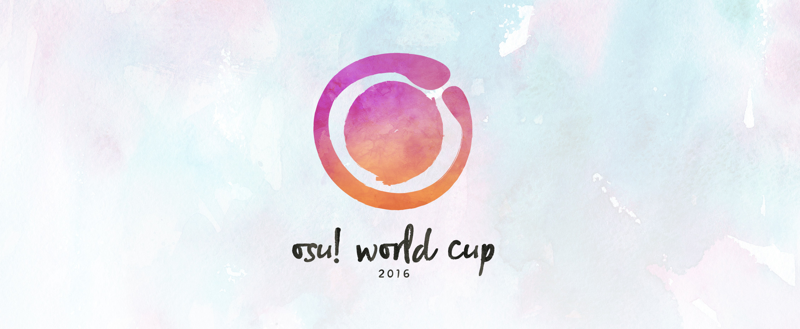
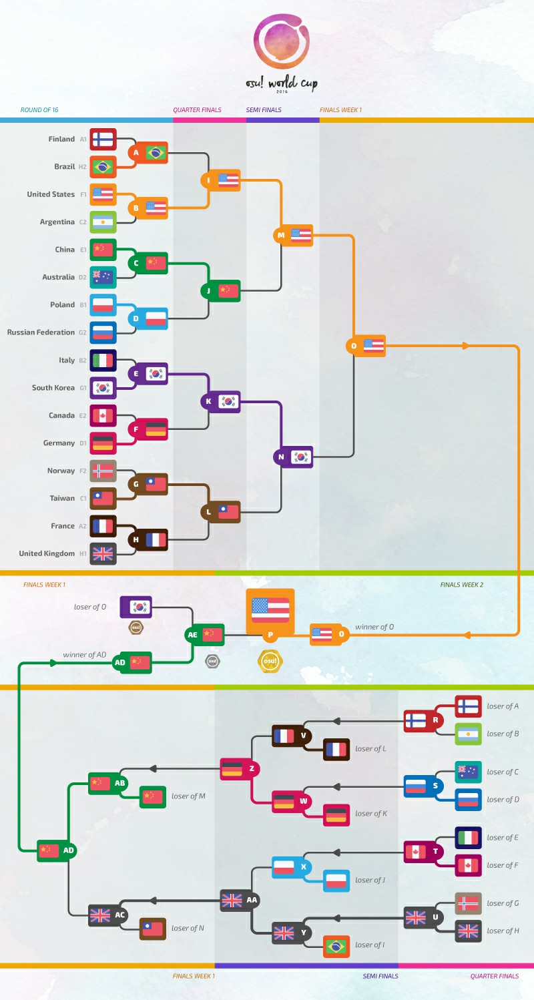
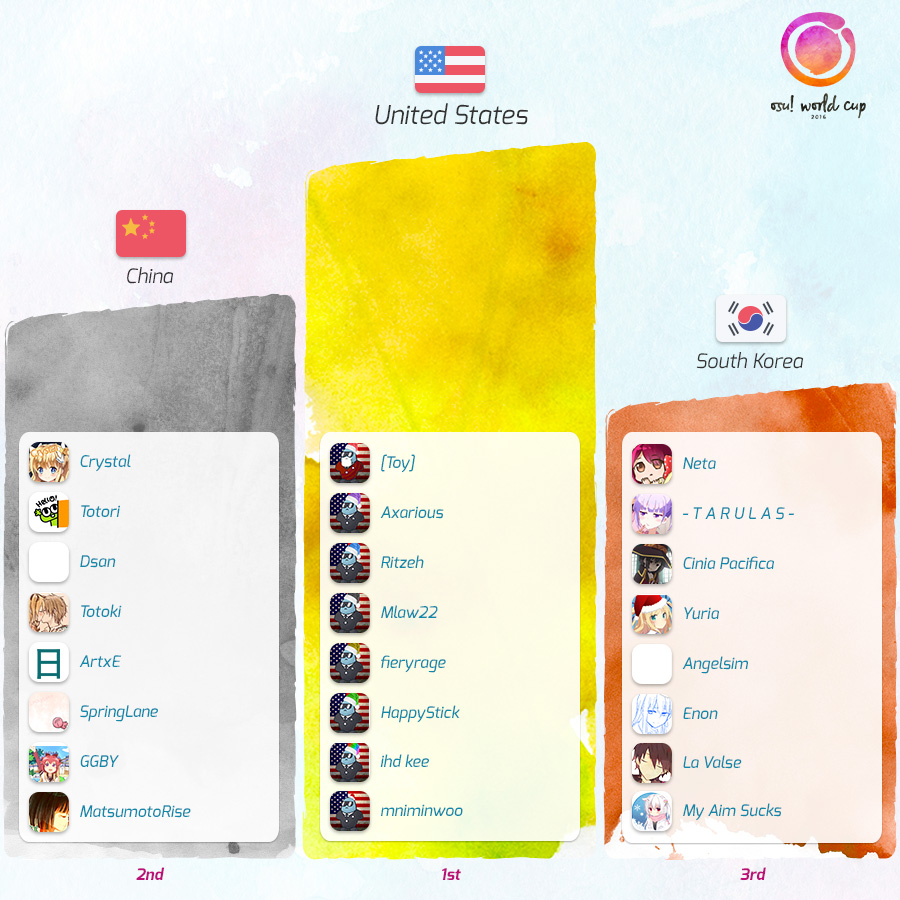

---
tags:
  - OWC 2016
  - OWC2016
---

# osu! World Cup 2016

La **osu! World Cup 2016** (***OWC 2016***) fue un torneo por países organizado por el [osu! team](/wiki/People/osu!_team). Fue la séptima edición de la osu! World Cup.

## Calendario del torneo

| Evento | Marca de tiempo |
| --: | :-- |
| Fase de registro | 2/10/2016 - 16/10/2016 |
| Sorteos | 4/11/2016 (12:00 UTC) |
| Fase de grupos | 12/11/2016 - 13/11/2016 |
| Octavos de final | 19/11/2016 |
| Cuartos de final | 26/11/2016 |
| Semifinales | 3/12/2016 - 4/12/2016 |
| Finales semana 1 | 10/12/2016 - 11/12/2016 |
| Finales semana 2 | 18/12/2016 |

## Premios

| Posición | Premios |
| :-: | :-- |
|  | Mercancía única y exclusiva, una insignia única para el perfil, título de usuario de «osu! Champion» |
|  | Mercancía única y exclusiva, una insignia única para el perfil |
|  | Mercancía única y exclusiva, una insignia única para el perfil |

  

## Organización

La osu! World Cup 2016 estuvo a cargo de varios miembros de la comunidad.

| Posición | Miembro(s) |
| :-- | :-- |
| Administrador | ::{ flag=ES }:: ::Deif::{ user=318565 }, ::{ flag=DE }:: ::Loctav::{ user=71366 }, ::{ flag=DE }:: ::p3n::{ user=123703 }, ::{ flag=FR }:: ::shARPII::{ user=776257 } |
| Selector de mapas | ::{ flag=JP }:: ::Asahina Momoko::{ user=3650145 }, ::{ flag=DE }:: ::Okorin::{ user=1623405 }, ::{ flag=HK }:: ::Skystar::{ user=873961 } |
| Comentarista | ::{ flag=AU }:: ::Bauxe::{ user=1881685 }, ::{ flag=US }:: ::Daikyi::{ user=811832 }, ::{ flag=NZ }:: ::deadbeat::{ user=128370 }, ::{ flag=GB }:: ::Doomsday::{ user=18983 }, ::{ flag=CA }:: ::Evrien::{ user=791660 }, ::{ flag=AR }:: ::juankristal::{ user=443656 }, ::{ flag=AT }:: ::Omgforz::{ user=578943 }, ::{ flag=GB }:: ::Rime::{ user=1397232 }, ::{ flag=FR }:: ::Slainv::{ user=4823843 }, ::{ flag=US }:: ::ztrot::{ user=6347 } |
| Estadístico | ::{ flag=NZ }:: ::deadbeat::{ user=128370 }, ::{ flag=DE }:: ::Nwolf::{ user=1910766 } |

## Enlaces

- [Hilo de discusión](https://osu.ppy.sh/community/forums/topics/507270)
- [Transmisión en vivo](https://www.twitch.tv/osulive)
- [Resúmenes de las fases](https://www.youtube.com/playlist?list=PLqJuZKl72XH_El27Es8RsxW5NXDUVeRRl) (por Feurigel)
- **[Hoja de estadísticas](https://docs.google.com/spreadsheets/users/1/d/1rvVSjmdHIb-h8pekmVfIIPDPivrD5fACjNRYGo1U9to/pubhtml)**

## Participantes

|  | País | Miembros |
| :-: | :-: | :-- |
| ::{ flag=AR }:: | Argentina | **::Glazbom::{ user=608277 }**, ::benjacala::{ user=1625740 }, ::Catalysis::{ user=5958063 }, ::Enhu::{ user=2840499 }, ::GaTu::{ user=3583351 }, ::nicogame14::{ user=3812213 }, ::Pein::{ user=2212941 }, ::Toushi::{ user=2367825 } |
| ::{ flag=AU }:: | Australia | **::Bauxe::{ user=1881685 }**, ::Dumii::{ user=3068044 }, ::ithgyu::{ user=5113781 }, ::Korilak::{ user=7260014 }, ::Lunirs::{ user=2118945 }, ::Peekamoo::{ user=2337263 }, ::uyghti::{ user=3641404 }, ::Weber::{ user=6410432 } |
| ::{ flag=AT }:: | Austria | **::Akane-Yuki::{ user=3656589 }**, ::Fedora Goose::{ user=2323131 }, ::LWMF::{ user=3632402 }, ::Myst1k::{ user=5302223 }, ::Omgforz::{ user=578943 } |
| ::{ flag=BR }:: | Brasil | **::Fenrir::{ user=2644700 }**, ::fabriciorby::{ user=209664 }, ::Idealism::{ user=3869519 }, ::Mirtrax::{ user=2290888 }, ::Miyazono::{ user=529036 }, ::MouseEasy::{ user=1558603 }, ::Texats::{ user=1638293 }, ::Zekker::{ user=4663554 } |
| ::{ flag=CA }:: | Canadá | **::Azer::{ user=2155578 }**, ::Ignite::{ user=3122948 }, ::Kaifin::{ user=2596942 }, ::karalis::{ user=3146018 }, ::Kyle::{ user=2694475 }, ::MiruHong::{ user=2866814 }, ::TrickMirror::{ user=2138739 }, ::VINXIS::{ user=4323406 } |
| ::{ flag=CL }:: | Chile | **::kafaN::{ user=1489743 }**, ::allives::{ user=3951781 }, ::Criss::{ user=3188017 }, ::DanyL::{ user=3069354 }, ::DPL::{ user=3024454 }, ::-Dylson-::{ user=6315784 }, ::etejuano::{ user=2243537 }, ::Neab::{ user=916693 } |
| ::{ flag=CN }:: | China | **::Crystal::{ user=1646397 }**, ::ArtxE::{ user=954557 }, ::Dsan::{ user=1266166 }, ::GGBY::{ user=629717 }, ::MatsumotoRise::{ user=672726 }, ::SpringLane::{ user=1343504 }, ::Totori::{ user=227717 }, ::Totoki::{ user=557197 } |
| ::{ flag=DK }:: | Dinamarca | **::Spork Lover::{ user=3417469 }**, ::Crylizhy::{ user=3023138 }, ::Hudda::{ user=4103629 }, ::iamVill::{ user=6295380 }, ::Lemmen::{ user=6090254 }, ::teamplayer51::{ user=3084508 }::waefwerf::{ user=3868653 }, ::Zog::{ user=3722715 } |
| ::{ flag=FI }:: | Finlandia | **::Sanze::{ user=3110552 }**, ::huono\_tuuri::{ user=1432954 }, ::Hyppyri::{ user=3123423 }, ::Maffe::{ user=4773855 }, ::Multtari::{ user=1097352 }, ::Sonoda-Umi::{ user=2197711 }, ::Subbie::{ user=1590138 }, ::thelewa::{ user=475021 } |
| ::{ flag=FR }:: | Francia | **::Musty::{ user=251683 }**, ::Elysion::{ user=106269 }, ::FayeurS::{ user=3105416 }, ::filsdelama::{ user=2831793 }, ::Flaven::{ user=3213239 }, ::mrzomb::{ user=1694887 }, ::NerO::{ user=1545031 }, ::ThePooN::{ user=718454 } |
| ::{ flag=DE }:: | Alemania | **::Dustice::{ user=754565 }**, ::BDDav::{ user=1164526 }, ::Beafowl::{ user=2438122 }, ::DoKito::{ user=537084 }, ::Firstus::{ user=1856829 }, ::imagaK::{ user=2022445 }, ::Neliel::{ user=1500305 }, ::W3SON::{ user=2070822 } |
| ::{ flag=GR }:: | Grecia | **::Riven::{ user=3638005 }**, ::Grapheon::{ user=2415008 }, ::JohnyZ::{ user=4508048 }, ::kYorineN::{ user=4131515 }, ::ThOmAstr::{ user=2793537 }, ::ThePainG7::{ user=3478000 }, ::Tofas::{ user=2755584 }, ::xDarxen::{ user=4625954 } |
| ::{ flag=HK }:: | Hong Kong | **::- G I D Z -::{ user=2286528 }**, ::Chaoslitz::{ user=3621552 }, ::DenierNezzar::{ user=126144 }, ::MinG3012::{ user=1583218 }, ::-N a n a k o-::{ user=1407516 }, ::Rizia::{ user=1367570 }, ::StarrStyx::{ user=4600383 }, ::YoonA-::{ user=1639250 } |
| ::{ flag=ID }:: | Indonesia | **::Mood Breaker::{ user=692065 }**, ::Genjitsu::{ user=3531490 }, ::lolimastah::{ user=3207112 }, ::LongExistence::{ user=2380426 }, ::Rexeez::{ user=1987591 }, ::Reyuza::{ user=2454767 }, ::Rinzler::{ user=2133381 }, ::Vorsatz::{ user=3654630 } |
| ::{ flag=IL }:: | Israel | **::MrPotato::{ user=2787415 }**, ::Fookiezi::{ user=4593732 }, ::ilift::{ user=4903239 }, ::Keysama::{ user=3376034 }, ::KiroKusA::{ user=4355621 }, ::Kyoko::{ user=3382084 }, ::Slendy::{ user=2689577 } |
| ::{ flag=IT }:: | Italia | **::xiAmME::{ user=1428960 }**, ::DT-sama::{ user=3525018 }, ::-Kazuki-::{ user=3614356 }, ::Kirin::{ user=1852356 }, ::Koba::{ user=4448118 }, ::LLoyd-chan::{ user=2849149 }, ::mrspazzaneve17::{ user=3516241 }, ::umii::{ user=2538695 } |
| ::{ flag=LV }:: | Letonia | **::Forseen::{ user=556012 }**, ::Emula::{ user=2891792 }, ::Jesus\[Krists\]::{ user=2842992 }, ::waywern2012::{ user=5870453 } |
| ::{ flag=MX }:: | México | **::Broodich::{ user=2484629 }**, ::\[ AeonLust \]::{ user=2353490 }, ::Atheneon::{ user=2164627 }, ::Atsuro::{ user=2279351 }, ::Ferelix::{ user=5580827 }, ::-Hebel-::{ user=6169483 }, ::KevstracK::{ user=5325213 }, ::-Wolfy-::{ user=4497582 } |
| ::{ flag=NL }:: | Países Bajos | **::jackylam5::{ user=1540807 }**, ::Ahmnesia::{ user=2715937 }, ::Kyshiro::{ user=640611 }, ::n0ah::{ user=3086393 }, ::Pittigbaasje::{ user=2167433 }, ::Sj-Sama::{ user=2977954 }, ::Synchrostar::{ user=419705 }, ::taku::{ user=684433 } |
| ::{ flag=NZ }:: | Nueva Zelanda | **::shortpotato::{ user=1266102 }**, ::buny::{ user=1488796 }, ::cabbage::{ user=2358072 }, ::kiyumi::{ user=3701898 }, ::ningalu::{ user=6934358 }, ::smead::{ user=4293459 }, ::xenoframium::{ user=4502584 }, ::yellowy246::{ user=3833980 } |
| ::{ flag=NO }:: | Noruega | **::Tobi::{ user=2970667 }**, ::Afrodafro::{ user=3551255 }, ::CXu::{ user=84841 }, ::-GN::{ user=895581 }, ::Hundur::{ user=3145033 }, ::-PC::{ user=2916414 }, ::Sebu::{ user=3990173 }, ::Warrock::{ user=2841744 } |
| ::{ flag=PH }:: | Filipinas | **::revurii::{ user=4180036 }**, ::2124::{ user=5315077 }, ::awmslayer::{ user=4133147 }, ::ededed028::{ user=3932796 }, ::HybRidChrome::{ user=2606470 }, ::konawiki::{ user=4003979 }, ::Mira-san::{ user=1587999 }, ::Shii::{ user=2911062 } |
| ::{ flag=PL }:: | Polonia | **::My Angel Wilchq::{ user=844815 }**, ::fartownik::{ user=56917 }, ::Piggey::{ user=4163860 }, ::r0ck::{ user=1549620 }, ::Rafis::{ user=2558286 }, ::SpajdeR::{ user=3446664 }, ::Wilchq::{ user=2021758 }, ::WubWoofWolf::{ user=39828 } |
| ::{ flag=RU }:: | Federación de Rusia | **::Kert::{ user=119933 }**, ::\_index::{ user=652457 }, ::follon::{ user=3973474 }, ::Red\_Pixel::{ user=4170932 }, ::Shiawase::{ user=989489 }, ::Shockwave000::{ user=2295157 }, ::talala::{ user=1389663 }, ::unberlin::{ user=2408278 } |
| ::{ flag=SG }:: | Singapur | **::Nakano-::{ user=1893953 }**, ::Asterix-::{ user=5138193 }, ::GSBlank::{ user=2312106 }, ::oneplusone::{ user=1843447 }, ::Raen::{ user=2922482 }, ::Raindrop::{ user=1155871 }, ::Repulse::{ user=2414526 }, ::Rtyzen::{ user=2439822 } |
| ::{ flag=KR }:: | Corea del Sur | **::Neta::{ user=832084 }**, ::Angelsim::{ user=1777162 }, ::Cinia Pacifica::{ user=1414625 }, ::Enon::{ user=2043401 }, ::La Valse::{ user=70863 }, ::My Aim Sucks::{ user=1883865 }, ::-T A R U L A S-::{ user=3179601 }, ::Yuria::{ user=625988 } |
| ::{ flag=ES }:: | España | **::Naxurin::{ user=3589423 }**, ::\[ xFrozZ \]::{ user=6462387 }, ::adrilolo9::{ user=4274726 }, ::MortalStriker::{ user=4759050 }, ::Painketsu::{ user=2127432 }, ::PdPr0x\_::{ user=4086716 }, ::Widelux13::{ user=3938945 } |
| ::{ flag=SE }:: | Suecia | **::-Kupo-::{ user=4343103 }**, ::HenBurgaaa::{ user=4663479 }, ::Rapthorn::{ user=5109930 }, ::Snase::{ user=4258410 }, ::Suzuta::{ user=3028834 }, ::Tomoko Kuroki-::{ user=4418213 } |
| ::{ flag=TW }:: | Taiwán | **::Flask::{ user=959763 }**, ::hvick225::{ user=50265 }, ::Koalazy::{ user=286740 }, ::My Angel Haruna::{ user=606544 }, ::Rizer::{ user=5155973 }, ::Rucker::{ user=147515 }, ::SevenTeen-::{ user=1859195 }, ::Small K::{ user=952751 } |
| ::{ flag=UA }:: | Ucrania | **::Granje::{ user=496387 }**, ::blednak::{ user=912627 }, ::BloodM0nk::{ user=2174403 }, ::Cloz1k::{ user=4548264 }, ::Elzbieta::{ user=3734954 }, ::FllareA::{ user=1163931 }, ::-Ranndom-::{ user=5022536 }, ::Sadness::{ user=6560835 } |
| ::{ flag=GB }:: | Reino Unido | **::Bubbleman::{ user=5182050 }**, ::bahamete::{ user=960620 }, ::Doomsday::{ user=18983 }, ::Helix::{ user=3322597 }, ::Jameslike::{ user=2415743 }, ::Karthy::{ user=4196808 }, ::OPJames::{ user=4117142 }, ::Spook::{ user=2232928 } |
| ::{ flag=US }:: | Estados Unidos | **::\[Toy\]::{ user=2757689 }**, ::Axarious::{ user=2614511 }, ::fieryrage::{ user=3533958 }, ::HappyStick::{ user=256802 }, ::idke::{ user=4650315 }, ::Mlaw22::{ user=3126596 }, ::mniminwoo::{ user=3929529 }, ::Ritzeh::{ user=1028387 } |

## Grupos

| Grupo | Semilla superior | Semilla alta | Semilla media | Semilla baja |
| :-: | :-- | :-- | :-- | :-- |
| **A** | ::{ flag=FR }:: Francia | ::{ flag=FI }:: Finlandia | ::{ flag=NZ }:: Nueva Zelanda | ::{ flag=SG }:: Singapur |
| **B** | ::{ flag=PL }:: Polonia | ::{ flag=IT }:: Italia | ::{ flag=PH }:: Filipinas | ::{ flag=UA }:: Ucrania |
| **C** | ::{ flag=TW }:: Taiwán | ::{ flag=MX }:: México | ::{ flag=AR }:: Argentina | ::{ flag=ES }:: España |
| **D** | ::{ flag=DE }:: Alemania | ::{ flag=AU }:: Australia | ::{ flag=LV }:: Letonia | ::{ flag=GR }:: Grecia |
| **E** | ::{ flag=CN }:: China | ::{ flag=CA }:: Canadá | ::{ flag=CL }:: Chile | ::{ flag=IL }:: Israel |
| **F** | ::{ flag=US }:: Estados Unidos | ::{ flag=NO }:: Noruega | ::{ flag=AT }:: Austria | ::{ flag=DK }:: Dinamarca |
| **G** | ::{ flag=KR }:: Corea del Sur | ::{ flag=RU }:: Federación de Rusia | ::{ flag=NL }:: Países Bajos | ::{ flag=ID }:: Indonesia |
| **H** | ::{ flag=GB }:: Reino Unido | ::{ flag=BR }:: Brasil | ::{ flag=HK }:: Hong Kong | ::{ flag=SE }:: Suecia |

## Podio

## Mappools

### Finales

**Este mappool se jugó durante la semana 1 y la semana 2 de las finales.**

[¡Descarga el paquete de mapas aquí! (148 MB)](https://www.mediafire.com/file/1rf6jgjsgfilhkx/OWC_2016_Finals.rar)

- NoMod
  1. [U1 overground - Dopamine (fanzhen0019) \[C6H3(OH)2-CH2-CH2-NH2\]](https://osu.ppy.sh/beatmapsets/210316#osu/494818)
  2. [Yousei Teikoku - The Creator (meiikyuu) \[Nyaten\]](https://osu.ppy.sh/beatmapsets/41242#osu/202756)
  3. [BABYMETAL - Gimme chocolate!! (alacat) \[BLACK CHOCOLATE!!\]](https://osu.ppy.sh/beatmapsets/452230#osu/970048)
  4. [Nanahira - Bassdrop Freaks (Long Ver.) (yf\_bmp) \[BASSDROP!!\]](https://osu.ppy.sh/beatmapsets/463479#osu/992437)
  5. [ayaponzu\* - Yakubyougami (cRyo\[iceeicee\]) \[B(\]](https://osu.ppy.sh/beatmapsets/455419#osu/976190)
  6. [ESTi - HELIX (Edit ver.) (Hollow Wings) \[EX EX\]](https://osu.ppy.sh/beatmapsets/194910#osu/462700)
- Hidden
  1. [Demetori - Silent Voyage to Eternity (brikel) \[BMix\]](https://osu.ppy.sh/beatmapsets/14309#osu/115384)
  2. [An - Catanoph (Lavender) \[Extra(OWC Version)\]](https://osu.ppy.sh/beatmapsets/527069#osu/1118285)
- HardRock
  1. [Studio EIM - Crescent Moon Island Boss Theme (Rakuen) \[\[ -Scarlet- \]'s Extra\]](https://osu.ppy.sh/beatmapsets/173422#osu/434438)
  2. [Camellia feat. Nanahira - Tsukitourou (jonathanlfj) \[Countless\]](https://osu.ppy.sh/beatmapsets/383147#osu/837694)
- DoubleTime
  1. [ClariS - Colorful (Laurier) \[Insane\]](https://osu.ppy.sh/beatmapsets/134008#osu/336295)
  2. [LeaF - MEPHISTO (Alumetorz) \[Another\]](https://osu.ppy.sh/beatmapsets/106212#osu/282166)
- FreeMod
  1. [EZFG - Hurting for a Very Hurtful Pain (tutuhaha) \[Dance\]](https://osu.ppy.sh/beatmapsets/46848#osu/145669)
  2. [Syrsa - Mad Machine (Louis Cyphre) \[Champion\]](https://osu.ppy.sh/beatmapsets/33052#osu/107875)
  3. [USAO - Miracle 5ympho X (Extended Mix) (RLC) \[5ympho XtrA\]](https://osu.ppy.sh/beatmapsets/230739#osu/536476)
- Desempate
  1. **[goreshit - burn this moment into the retina of my eye (grumd) \[extra\]](https://osu.ppy.sh/beatmapsets/359890#osu/791274)**

### Semifinales

[¡Descarga el paquete de mapas aquí! (131 MB)](https://www.mediafire.com/file/byy9j4jan4uhk57/OWC_2016_Semifinals.rar)

- NoMod
  1. [ZUN remixed by LeaF - Resurrection Spell (Muya) \[VOLCANO\]](https://osu.ppy.sh/beatmapsets/292644#osu/658561)
  2. [VY1 - Cyber Thunder Cider (tutuhaha) \[Cider\]](https://osu.ppy.sh/beatmapsets/47146#osu/146610)
  3. [Yooh - LegenD. (Flask) \[GravitY.\]](https://osu.ppy.sh/beatmapsets/396839#osu/863249)
  4. [LIQU@. - Yotogibanashi no Kamikakushi (Kyubey) \[oko's Extra\]](https://osu.ppy.sh/beatmapsets/236396#osu/717133)
  5. [Function Phantom - Euclid (byfar) \[Fifth Postulate\]](https://osu.ppy.sh/beatmapsets/419614#osu/908093)
  6. [Alipio Martins - Piranha (Maffalda Reloaded Trap Mix) (Tarrasky) \[BD's Gangsta\]](https://osu.ppy.sh/beatmapsets/287873#osu/652234)
- Hidden
  1. [DECO\*27 - Streaming Heart feat. Hatsune Miku (Tsumetaku) \[0108's Extra\]](https://osu.ppy.sh/beatmapsets/160126#osu/534946)
  2. [An - Saigo (Rumia-) \[Final\]](https://osu.ppy.sh/beatmapsets/517783#osu/1100091)
- HardRock
  1. [ginkiha - EOS (alacat) \[Lycoris\]](https://osu.ppy.sh/beatmapsets/151720#osu/373781)
  2. [Hatsune Miku - Sakura Zensen Ijou Nashi (Lalarun) \[Ijou Nashi\]](https://osu.ppy.sh/beatmapsets/32021#osu/104945)
- DoubleTime
  1. [Rain - Hip Song (Irreversible) \[Insane\]](https://osu.ppy.sh/beatmapsets/385185#osu/841426)
  2. [Neru - World Domination How-To (Chewin) \[Insane\]](https://osu.ppy.sh/beatmapsets/124898#osu/318142)
- FreeMod
  1. [cosMo@BousouP - Oceanus (Broccoly) \[Divinity\]](https://osu.ppy.sh/beatmapsets/267767#osu/609843)
  2. [Susumu Hirasawa - Big Brother (Gens) \[KIRBY Mix\]](https://osu.ppy.sh/beatmapsets/10714#osu/42244)
  3. [T & Sugah x Lexurus - No More (Strategas) \[Extra\]](https://osu.ppy.sh/beatmapsets/471562#osu/1007896)
- Desempate
  1. **[Venetian Snares - She Runs (fergas) \[Escape?\]](https://osu.ppy.sh/beatmapsets/319890#osu/711923)**

### Cuartos de final

[¡Descarga el paquete de mapas aquí! (125 MB)](https://www.mediafire.com/file/7gmr44m72v58p8w/OWC_2016_Quarterfinals.rar)

- NoMod
  1. [Memme - Chinese Restaurant (M o k o r i) \[Spicy\]](https://osu.ppy.sh/beatmapsets/256467#osu/587547)
  2. [paraoka - boot (rickyboi) \[Shoe\]](https://osu.ppy.sh/beatmapsets/50131#osu/154226)
  3. [Xelia - Illumiscape (Kanna) \[Extra\]](https://osu.ppy.sh/beatmapsets/43960#osu/152127)
  4. [Lily - Scarlet Rose (val0108) \[0108 style\]](https://osu.ppy.sh/beatmapsets/41686#osu/131564)
  5. [MY FIRST STORY - ALONE (Saut) \[Isolation\]](https://osu.ppy.sh/beatmapsets/395846#osu/861381)
  6. [Delain - Go Away (pishifat) \[Extra\]](https://osu.ppy.sh/beatmapsets/475676#osu/1016263)
- Hidden
  1. [Sound Horizon - Raijin no Hidariude (AngelHoney) \[Insane\]](https://osu.ppy.sh/beatmapsets/16792#osu/60089)
  2. [UNDEAD CORPORATION - Yoru Naku Usagi wa Yume wo Miru (Strawberry) \[Lunatic\]](https://osu.ppy.sh/beatmapsets/59049#osu/214252)
- HardRock
  1. [iojjj - Deus Ex Machina (Okoratu) \[GREAT EQUALIZER IS THE DEATH\]](https://osu.ppy.sh/beatmapsets/107747#osu/688886)
  2. [mafumafu - Yuugure Semi Nikki (L\_P) \[Yuugure\]](https://osu.ppy.sh/beatmapsets/60096#osu/180681)
- DoubleTime
  1. [Mami Kawada - sense (Giralda) \[LC's Insane\]](https://osu.ppy.sh/beatmapsets/325638#osu/723285)
  2. [ClariS - Connect (Holoaz) \[Holo\]](https://osu.ppy.sh/beatmapsets/25705#osu/87066)
- FreeMod
  1. [07th Expansion - rog-unlimitation (AngelHoney) \[AngelHoney\]](https://osu.ppy.sh/beatmapsets/28751#osu/116128)
  2. [jippusu - Mushikui Saikede Rhythm (Amamiya Yuko) \[Skystar\]](https://osu.ppy.sh/beatmapsets/87547#osu/239104)
  3. [beatMARIO - Night of Knights (DJPop) \[SOLO\]](https://osu.ppy.sh/beatmapsets/15920#osu/58063)
- Desempate
  1. **[DragonForce - Symphony Of The Night (Evil\_Twilight) \[Legend\]](https://osu.ppy.sh/beatmapsets/469148#osu/1007546)**

### Octavos de final

[¡Descarga el paquete de mapas aquí! (171 MB)](https://www.mediafire.com/file/1qbqnc5hxa10xk9/OWC_2016_Round_of_16.rar)

- NoMod
  1. [Cilvery - Kamisama Nejimaki (sukiNathan) \[Catastrophe\]](https://osu.ppy.sh/beatmapsets/374900#osu/821238)
  2. [senya - Renbei no Searchlight (Dailycare) \[Satellite's Catharsis\]](https://osu.ppy.sh/beatmapsets/491057#osu/1046536)
  3. [LeaF - Wizdomiot (Asahina Momoko) \[Lunatic\]](https://osu.ppy.sh/beatmapsets/336099#osu/743896)
  4. [Katakiri Rekka - Answer (deetz) \[RLC's Darkness\]](https://osu.ppy.sh/beatmapsets/440266#osu/947334)
  5. [Hana - Sakura no Uta (Ultimate Madoka) \[VI.Artist of the Sakura\]](https://osu.ppy.sh/beatmapsets/440068#osu/994933)
  6. [Memme - Extreme Fantasy (AngelHoney) \[ExtrA\]](https://osu.ppy.sh/beatmapsets/49459#osu/152480)
- Hidden
  1. [IOSYS - Poinsettia (Aakiha) \[Lunatic\]](https://osu.ppy.sh/beatmapsets/18382#osu/65233)
  2. [Team:SASAKURATION - AVALON (Leader) \[gowww's Extra\]](https://osu.ppy.sh/beatmapsets/118763#osu/430110)
- HardRock
  1. [MYTHOLOGIA by MLREC. - Ymir (Kitami Erika) \[Another\]](https://osu.ppy.sh/beatmapsets/322481#osu/716972)
  2. [supercell - Hoshi ga Matataku Konna Yoru ni (\[Teichan\]) \[Starlight\]](https://osu.ppy.sh/beatmapsets/294042#osu/661243)
- DoubleTime
  1. [Kraster - Remember History (Short Ver.) (Serval) \[Lunatic\]](https://osu.ppy.sh/beatmapsets/22115#osu/76419)
  2. [SYNC.ART'S - Sins -Kokoro no Tsumi- (Snowy Dream) \[Nightmare\]](https://osu.ppy.sh/beatmapsets/51605#osu/158107)
- FreeMod
  1. [M2U - Nightmare (ignorethis) \[Lesjuh\]](https://osu.ppy.sh/beatmapsets/16069#osu/60238)
  2. [yuikonnu & ayaponzu\* - Kunoichi demo Koi ga Shitai (alacat) \[Skystar's Extra\]](https://osu.ppy.sh/beatmapsets/111045#osu/319694)
  3. [nmk - sola (sjoy) \[Imouto's Extra\]](https://osu.ppy.sh/beatmapsets/183267#osu/439824)
- Desempate
  1. **[Camellia - d:for the DELTA (ProfessionalBox) \[Delirium\]](https://osu.ppy.sh/beatmapsets/396370#osu/862338)**

### Fase de grupos

[¡Descarga el paquete de mapas aquí! (153 MB)](https://www.mediafire.com/file/13glkdv1zbyxfpp/OWC_2016_Group_Stage.rar)

- NoMod
  1. [sakuzyo - Altale (toybot) \[Bonzi's Extra\]](https://osu.ppy.sh/beatmapsets/228815#osu/1012279)
  2. [Lon - Yuru Fuwa Jukai Girl (Garven) \[Insane\]](https://osu.ppy.sh/beatmapsets/49686#osu/153103)
  3. [Itou Kanako - Skyclad no Kansokusha -Remix- (Takos) \[taka\]](https://osu.ppy.sh/beatmapsets/33323#osu/110628)
  4. [Rita - Dream Walker (Vert) \[Zweib's Insane\]](https://osu.ppy.sh/beatmapsets/353237#osu/778244)
  5. [ONE OK ROCK - Mikansei Koukyoukyoku (Saut) \[Extreme\]](https://osu.ppy.sh/beatmapsets/348604#osu/768986)
  6. [Ray - Hajimete Girls! (Meyrink) \[Skystar's Pin Pon\~\]](https://osu.ppy.sh/beatmapsets/330566#osu/776752)
- Hidden
  1. [Cyua - Blumenkranz (Shinxyn) \[Insane\]](https://osu.ppy.sh/beatmapsets/155034#osu/380475)
  2. [sana - Kotonoha Clinic (Kite) \[Moroi\]](https://osu.ppy.sh/beatmapsets/419189#osu/907200)
- HardRock
  1. [Cascada - How Do You Do (Nightcore Mix) (Asphyxia) \[Insane\]](https://osu.ppy.sh/beatmapsets/203787#osu/481450)
  2. [Rameses B - Utopia (ft. Holly Drummond) (Milan-) \[deetz' Paradise\]](https://osu.ppy.sh/beatmapsets/294493#osu/662046)
- DoubleTime
  1. [Satori-san - Hari no Sora (Sure) \[Insane\]](https://osu.ppy.sh/beatmapsets/290262#osu/653966)
  2. [07th Expansion - goldenslaughterer (La Cataline) \[Hard\]](https://osu.ppy.sh/beatmapsets/37729#osu/121197)
- FreeMod
  1. [ONE OK ROCK - Re:make (Rucker) \[Remake\]](https://osu.ppy.sh/beatmapsets/38472#osu/123152)
  2. [44teru-k - F.I (Jacob) \[Extra445\]](https://osu.ppy.sh/beatmapsets/47664#osu/155235)
  3. [Megpoid GUMI - For my soul (val0108) \[Insane\]](https://osu.ppy.sh/beatmapsets/22509#osu/80102)
- Desempate
  1. **[kors k - Playing With Fire (Sota Fujimori Remix) (xlni) \[Pyrotechnics\]](https://osu.ppy.sh/beatmapsets/202252#osu/478605)**

## Resultados de los partidos

### Finales semana 2

Domingo, 18 de diciembre de 2016:

| Equipo 1 |  |  | Equipo 2 | Enlance del partido |
| --: | :-: | :-: | :-- | :-- |
| Estados Unidos ::{ flag=US }:: | 2 | **7** | ::{ flag=CN }:: **China** | [#1](https://osu.ppy.sh/community/matches/29702438) |
| China ::{ flag=CN }:: | 4 | **7** | ::{ flag=US }:: **Estados Unidos** | [#1](https://osu.ppy.sh/community/matches/29704086) |

### Finales semana 1

Sábado, 10 de diciembre de 2016:

| Equipo 1 |  |  | Equipo 2 | Enlance del partido |
| --: | :-: | :-: | :-- | :-- |
| **Estados Unidos** ::{ flag=US }:: | **6** | 4 | ::{ flag=KR }:: Corea del Sur | [#1](https://osu.ppy.sh/community/matches/29524076) |
| **Reino Unido** ::{ flag=GB }:: | **6** | 4 | ::{ flag=TW }:: Taiwán | [#1](https://osu.ppy.sh/community/matches/29530355) |
| Alemania ::{ flag=DE }:: | 2 | **6** | ::{ flag=CN }:: China | [#1](https://osu.ppy.sh/community/matches/29531576) |
| **China** ::{ flag=CN }:: | **6** | 2 | ::{ flag=GB }:: Reino Unido | [#1](https://osu.ppy.sh/community/matches/29533696) |

Domingo, 11 de diciembre de 2016:

| Equipo 1 |  |  | Equipo 2 | Enlance del partido |
| --: | :-: | :-: | :-- | :-- |
| **China** ::{ flag=CN }:: | **6** | 2 | ::{ flag=KR }:: Corea del Sur | [#1](https://osu.ppy.sh/community/matches/29560336) |

### Semifinales

Sábado, 3 de diciembre de 2016:

| Equipo 1 |  |  | Equipo 2 | Enlance del partido |
| --: | :-: | :-: | :-- | :-- |
| **Corea del Sur** ::{ flag=KR }:: | **6** | 2 | ::{ flag=TW }:: Taiwán | [#1](https://osu.ppy.sh/community/matches/29379804) |
| Federación de Rusia ::{ flag=RU }:: | 5 | **6** | ::{ flag=DE }:: **Alemania** | [#1](https://osu.ppy.sh/community/matches/29381511) |
| Finlandia ::{ flag=FI }:: | 0 | **6** | ::{ flag=FR }:: **Francia** | [#1](https://osu.ppy.sh/community/matches/29383842) |
| **Estados Unidos** ::{ flag=US }:: | **6** | 4 | ::{ flag=CN }:: China | [#1](https://osu.ppy.sh/community/matches/29385744) |
| **Reino Unido** ::{ flag=GB }:: | **6** | 0 | ::{ flag=BR }:: Brasil | [#1](https://osu.ppy.sh/community/matches/29388879) |
| Canadá ::{ flag=CA }:: | 0 | **6** | ::{ flag=PL }:: **Polonia** | [#1](https://osu.ppy.sh/community/matches/29391121) |

Domingo, 4 de diciembre de 2016:

| Equipo 1 |  |  | Equipo 2 | Enlance del partido |
| --: | :-: | :-: | :-- | :-- |
| Francia ::{ flag=FR }:: | 2 | **6** | ::{ flag=DE }:: **Alemania** | [#1](https://osu.ppy.sh/community/matches/29413616) |
| Polonia ::{ flag=PL }:: | 4 | **6** | ::{ flag=GB }:: **Reino Unido** | [#1](https://osu.ppy.sh/community/matches/29415472) |

### Cuartos de final

Sábado, 26 de noviembre de 2016:

| Equipo 1 |  |  | Equipo 2 | Enlance del partido |
| --: | :-: | :-: | :-- | :-- |
| Australia ::{ flag=AU }:: | 1 | **5** | ::{ flag=RU }:: **Federación de Rusia** | [#1](https://osu.ppy.sh/community/matches/29236130) |
| **Corea del Sur** ::{ flag=KR }:: | **5** | 2 | ::{ flag=DE }:: Alemania | [#1](https://osu.ppy.sh/community/matches/29237189) |
| **China** ::{ flag=CN }:: | **5** | 2 | ::{ flag=PL }:: Polonia | [#1](https://osu.ppy.sh/community/matches/29238760) |
| **Taiwán** ::{ flag=TW }:: | **5** | 4 | ::{ flag=FR }:: Francia | [#1](https://osu.ppy.sh/community/matches/29240657) |
| Noruega ::{ flag=NO }:: | 4 | **5** | ::{ flag=GB }:: **Reino Unido** | [#1](https://osu.ppy.sh/community/matches/29244637) |
| **Finlandia** ::{ flag=FI }:: | **5** | 2 | ::{ flag=AR }:: Argentina | [#1](https://osu.ppy.sh/community/matches/29247238) |
| Italia ::{ flag=IT }:: | 0 | **5** | ::{ flag=CA }:: **Canadá** | [#1](https://osu.ppy.sh/community/matches/29249433) |
| Brasil ::{ flag=BR }:: | 4 | **5** | ::{ flag=US }:: **Estados Unidos** | [#1](https://osu.ppy.sh/community/matches/29252039) |

### Octavos de final

Sábado, 19 de noviembre de 2016:

| Equipo 1 |  |  | Equipo 2 | Enlance del partido |
| --: | :-: | :-: | :-- | :-- |
| **China** ::{ flag=CN }:: | **5** | 2 | ::{ flag=AU }:: Australia | [#1](https://osu.ppy.sh/community/matches/29093549) |
| Italia ::{ flag=IT }:: | 1 | **5** | ::{ flag=KR }:: **Corea del Sur** | [#1](https://osu.ppy.sh/community/matches/29094300) |
| Noruega ::{ flag=NO }:: | 4 | **5** | ::{ flag=TW }:: **Taiwán** | [#1](https://osu.ppy.sh/community/matches/29095270) |
| **Polonia** ::{ flag=PL }:: | **5** | 3 | ::{ flag=RU }:: Federación de Rusia | [#1](https://osu.ppy.sh/community/matches/29096444) |
| **Francia** ::{ flag=FR }:: | **5** | 1 | ::{ flag=GB }:: Reino Unido | [#1](https://osu.ppy.sh/community/matches/29102287) |
| Finlandia ::{ flag=FI }:: | 1 | **5** | ::{ flag=BR }:: **Brasil** | [#1](https://osu.ppy.sh/community/matches/29103875) |
| Canadá ::{ flag=CA }:: | 1 | **5** | ::{ flag=DE }:: **Alemania** | [#1](https://osu.ppy.sh/community/matches/29105450) |
| **Estados Unidos** ::{ flag=US }:: | **5** | 1 | ::{ flag=AR }:: Argentina | [#1](https://osu.ppy.sh/community/matches/29106903) |

### Fase de grupos

Sábado, 12 de noviembre de 2016:

| Equipo 1 |  |  | Equipo 2 | Enlance del partido |
| --: | :-: | :-: | :-- | :-- |
| **Nueva Zelanda** ::{ flag=NZ }:: | **4** | 1 | ::{ flag=SG }:: Singapur | [#1](https://osu.ppy.sh/community/matches/28949962) |
| **Corea del Sur** ::{ flag=KR }:: | **4** | 0 | ::{ flag=ID }:: Indonesia | [#1](https://osu.ppy.sh/community/matches/28949969) |
| Francia ::{ flag=FR }:: | 2 | **4** | ::{ flag=NZ }:: **Nueva Zelanda** | [#1](https://osu.ppy.sh/community/matches/28950619) |
| **Federación de Rusia** ::{ flag=RU }:: | **4** | 2 | ::{ flag=ID }:: Indonesia | [#1](https://osu.ppy.sh/community/matches/28950736) |
| **Hong Kong** ::{ flag=HK }:: | **4** | 3 | ::{ flag=SE }:: Suecia | [#1](https://osu.ppy.sh/community/matches/28950642) |
| **Alemania** ::{ flag=DE }:: | **4** | 1 | ::{ flag=AU }:: Australia | [#1](https://osu.ppy.sh/community/matches/28951696) |
| **Corea del Sur** ::{ flag=KR }:: | **4** | 1 | ::{ flag=NL }:: Países Bajos | [#1](https://osu.ppy.sh/community/matches/28951701) |
| **Francia** ::{ flag=FR }:: | **4** | 0 | ::{ flag=SG }:: Singapur | [#1](https://osu.ppy.sh/community/matches/28952502) |
| Filipinas ::{ flag=PH }:: | 1 | **4** | ::{ flag=UA }:: **Ucrania** | [#1](https://osu.ppy.sh/community/matches/28952508) |
| **Taiwán** ::{ flag=TW }:: | **4** | 0 | ::{ flag=ES }:: España | [#1](https://osu.ppy.sh/community/matches/28952517) |
| **Federación de Rusia** ::{ flag=RU }:: | **4** | 0 | ::{ flag=NL }:: Países Bajos | [#1](https://osu.ppy.sh/community/matches/28953530) |
| **Alemania** ::{ flag=DE }:: | **4** | 0 | ::{ flag=GR }:: Grecia | [#1](https://osu.ppy.sh/community/matches/28953535) |
| **China** ::{ flag=CN }:: | **4** | 0 | ::{ flag=CL }:: Chile | [#1](https://osu.ppy.sh/community/matches/28953539) |
| **Polonia** ::{ flag=PL }:: | **4** | 0 | ::{ flag=PH }:: Filipinas | [#1](https://osu.ppy.sh/community/matches/28955012) |
| **Taiwán** ::{ flag=TW }:: | **4** | 1 | ::{ flag=AR }:: Argentina | [#1](https://osu.ppy.sh/community/matches/28955025) |
| Austria ::{ flag=AT }:: | 2 | **4** | ::{ flag=DK }:: **Dinamarca** | [#1](https://osu.ppy.sh/community/matches/28955030) |
| **Brasil** ::{ flag=BR }:: | **4** | 1 | ::{ flag=HK }:: Hong Kong | [#1](https://osu.ppy.sh/community/matches/28955037) |
| **Alemania** ::{ flag=DE }:: | **4** | 1 | ::{ flag=LV }:: Letonia | [#1](https://osu.ppy.sh/community/matches/28961703) |
| **Canadá** ::{ flag=CA }:: | **4** | 1 | ::{ flag=CL }:: Chile | [#1](https://osu.ppy.sh/community/matches/28961705) |
| **Reino Unido** ::{ flag=GB }:: | **4** | 1 | ::{ flag=SE }:: Suecia | [#1](https://osu.ppy.sh/community/matches/28961706) |
| **Polonia** ::{ flag=PL }:: | **4** | 0 | ::{ flag=IT }:: Italia | [#1](https://osu.ppy.sh/community/matches/28962677) |
| **Estados Unidos** ::{ flag=US }:: | **4** | 3 | ::{ flag=DK }:: Dinamarca | [#1](https://osu.ppy.sh/community/matches/28962678) |
| **Noruega** ::{ flag=NO }:: | **4** | 1 | ::{ flag=AT }:: Austria | [#1](https://osu.ppy.sh/community/matches/28962679) |
| México ::{ flag=MX }:: | 2 | **4** | ::{ flag=AR }:: **Argentina** | [#1](https://osu.ppy.sh/community/matches/28964826) |
| **Reino Unido** ::{ flag=GB }:: | **4** | 1 | ::{ flag=BR }:: Brasil | [#1](https://osu.ppy.sh/community/matches/28964827) |

Domingo, 13 de noviembre de 2016:

| Equipo 1 |  |  | Equipo 2 | Enlance del partido |
| --: | :-: | :-: | :-- | :-- |
| **Taiwán** ::{ flag=TW }:: | **4** | 3 | ::{ flag=MX }:: México | [#1](https://osu.ppy.sh/community/matches/28973717) |
| **China** ::{ flag=CN }:: | **4** | 3 | ::{ flag=CA }:: Canadá | [#1](https://osu.ppy.sh/community/matches/28973718) |
| **Finlandia** ::{ flag=FI }:: | **4** | 1 | ::{ flag=NZ }:: Nueva Zelanda | [#1](https://osu.ppy.sh/community/matches/28979458) |
| **Australia** ::{ flag=AU }:: | **4** | 0 | ::{ flag=GR }:: Grecia | [#1](https://osu.ppy.sh/community/matches/28979460) |
| **Corea del Sur** ::{ flag=KR }:: | **4** | 3 | ::{ flag=RU }:: Federación de Rusia | [#1](https://osu.ppy.sh/community/matches/28979461) |
| Países Bajos ::{ flag=NL }:: | 3 | **4** | ::{ flag=ID }:: **Indonesia** | [#1](https://osu.ppy.sh/community/matches/28980166) |
| **Australia** ::{ flag=AU }:: | **4** | 0 | ::{ flag=LV }:: Letonia | [#1](https://osu.ppy.sh/community/matches/28980174) |
| **China** ::{ flag=CN }:: | **4** | 0 | ::{ flag=IL }:: Israel | *victoria por defecto* |
| **Italia** ::{ flag=IT }:: | **4** | 0 | ::{ flag=PH }:: Filipinas | *victoria por defecto* |
| **Finlandia** ::{ flag=FI }:: | **4** | 2 | ::{ flag=SG }:: Singapur | [#1](https://osu.ppy.sh/community/matches/28981224) |
| **Noruega** ::{ flag=NO }:: | **4** | 2 | ::{ flag=DK }:: Dinamarca | [#1](https://osu.ppy.sh/community/matches/28981226) |
| Reino Unido ::{ flag=GB }:: | 2 | **4** | ::{ flag=HK }:: **Hong Kong** | [#1](https://osu.ppy.sh/community/matches/28981228) |
| **Francia** ::{ flag=FR }:: | **4** | 3 | ::{ flag=FI }:: Finlandia | [#1](https://osu.ppy.sh/community/matches/28987715) |
| **Italia** ::{ flag=IT }:: | **4** | 0 | ::{ flag=UA }:: Ucrania | [#1](https://osu.ppy.sh/community/matches/28987716) |
| **Chile** ::{ flag=CL }:: | **4** | 1 | ::{ flag=IL }:: Israel | [#1](https://osu.ppy.sh/community/matches/28987717) |
| **Letonia** ::{ flag=LV }:: | **4** | 2 | ::{ flag=GR }:: Grecia | [#1](https://osu.ppy.sh/community/matches/28988969) |
| **Argentina** ::{ flag=AR }:: | **4** | 1 | ::{ flag=ES }:: España | [#1](https://osu.ppy.sh/community/matches/28988970) |
| **Estados Unidos** ::{ flag=US }:: | **4** | 3 | ::{ flag=NO }:: Noruega | [#1](https://osu.ppy.sh/community/matches/28988971) |
| **Polonia** ::{ flag=PL }:: | **4** | 0 | ::{ flag=UA }:: Ucrania | [#1](https://osu.ppy.sh/community/matches/28990447) |
| **Canadá** ::{ flag=CA }:: | **4** | 0 | ::{ flag=IL }:: Israel | [#1](https://osu.ppy.sh/community/matches/28990448) |
| México ::{ flag=MX }:: | 3 | **4** | ::{ flag=ES }:: **España** | [#1](https://osu.ppy.sh/community/matches/28991703) |
| **Estados Unidos** ::{ flag=US }:: | **4** | 0 | ::{ flag=AT }:: Austria | [#1](https://osu.ppy.sh/community/matches/28991705) |
| **Brasil** ::{ flag=BR }:: | **4** | 3 | ::{ flag=SE }:: Suecia | [#1](https://osu.ppy.sh/community/matches/28991706) |

## Reglamento

### Reglas del torneo

1. La osu! World Cup es un torneo por países, jugado en el modo de juego osu!.
   - Esta competición está planeada como una modalidad de 4 contra 4.
2. Las puntuaciones de los mapas se basan en Score V2.
3. Los mapas para cada ronda serán anunciados por los selectores de mapas por anticipado la semana antes de que tengan lugar los partidos reales. Solo estos se usarán durante los respectivos partidos.
   - Habrá un bracket de NoMod, Hidden, HardRock, DoubleTime y FreeMod.
   - Un mapa será asignado como mapa de desempate. Este mapa solo podrá ser jugado en caso de empate.
4. El cronograma de los partidos será establecido por los administradores del torneo. Las regulaciones específicas se pueden encontrar en la parte inferior.
5. Si no hay personal o árbitro disponible, el partido será pospuesto.
6. Las puntuaciones fallidas de un jugador no se sumarán a la puntuación del equipo.
   - Revivir y sobrevivir durante un mapa se considera como pasarlo.
7. Está permitido usar las opciones de la [configuración visual](/wiki/Client/Interface/Visual_settings).
8. Si el beatmap termina en un empate, el juego será anulado.
9. Si uno de los jugadores se desconecta, serán tratados como si hubieran fallado el mapa.
   - Las desconexiones dentro de los 30 segundos posteriores al inicio del mapa se pueden volver a jugar. Esto queda a discreción del árbitro.
10. Los mapas no pueden ser reusados en un mismo partido, a menos que el beatmap haya sido anulado.
11. Si asisten menos jugadores del mínimo requerido, el tiempo máximo que se podrá posponer el partido será de 10 minutos.
12. Está permitido el intercambio de jugadores durante un partido.
13. El lag no es un razón válida para anular un beatmap.
14. Se supone que todos los jugadores deben mantener el juego fluido y sin demoras. Los retrasos excesivos en los partidos provenientes del lado del jugador pueden ser sancionados con penalizaciones.
15. Si un jugador se desconecta entre los beatmaps y el equipo no puede proporcionar un reemplazo, el partido podrá retrasarse 10 minutos como máximo.
16. Todos los jugadores y árbitros deben ser tratados con respeto. Se deben seguir las instrucciones de los árbitros y de los administradores del torneo. Las decisiones consideradas definitivas no deben ser objetadas.
17. Está estrictamente prohibido interrumpir el partido con juego sucio, elegir mapas de calentamiento inapropiados (consulta más abajo), insultar y provocar a otros jugadores o árbitros, retrasar el partido u otra conducta inapropiada deliberada.
18. El chat de las salas multijugador subyacen a las [reglas de la comunidad de osu!](/wiki/Rules). Todas las reglas del chat también se aplican a las salas multijugador.
    - Romper las reglas del chat dará como resultado un silencio. Los jugadores silenciados no pueden participar en partidas multijugador y deben ser intercambiados por el momento.
19. En la fase de grupos, se considerará 'victoria por defecto' la victoria por 4:0, +1,0 de diferencia de puntos.
20. Los incidentes inesperados serán manejados por los administradores del torneo. Los árbitros pueden permitir una mayor tolerancia dependiendo de las circunstancias dadas. Esto queda a su discreción.
21. Las sanciones por incumplir las reglas del torneo pueden ser:
    - Exclusión de jugadores específicos para un mapa
    - Exclusión de jugadores específicos por el resto del partido
    - Declarar el partido como perdido por defecto
    - Descalificación de todo el torneo
    - Descalificación de los torneos oficiales actuales y futuros hasta que se apele
22. Se dará a conocer cualquier modificación de estas reglas.

### Registro del torneo

1. Cada usuario interesado en formar parte del equipo de su país debe registrarse individualmente en la página web de registro creada específicamente.
   - Los administradores del torneo crearán una lista de posibles candidatos para el equipo de un país.
   - Los administradores del torneo declararán a un candidato como capitán para la selección de su país, aunque de forma temporal.
   - El capitán declarado puede formar su equipo a partir de la lista de candidatos de su país.
2. Para asegurar registros válidos y serios, cada usuario registrado será controlado por los administradores del torneo.
   - Cada usuario registrado será asignado a la lista de candidatos de su país respectivo.
   - Para ser aceptado con éxito en la lista, debes asegurarte de que tu clasificación de rendimiento global de osu! esté por encima de #5000.
   - Para ser aceptado con éxito en la lista, debes asegurarte de no haber infringido ninguna de las reglas de la comunidad de osu! en los últimos 12 meses.
3. Todos los equipos formados con éxito serán publicados después de la fase de registro.
4. Solo participarán los 32 países potencialmente más fuertes. La fortaleza potencial de un país está determinada por las estadísticas en línea de todos los candidatos válidos.
   - Si la cantidad de países registrados es inferior a 32, el número podría reducirse a 24, 20 o 16. ¡El objetivo siempre es permitir que participen tantos países como sea posible!
5. Los selectores de mapas no pueden participar como jugadores en este torneo.

### Instrucciones de las fases

1. En la primera fase (fase de grupos), los equipos se dividirán en 8 grupos de 4 equipos.
   - Esto puede cambiar según la cantidad final de equipos formados.
2. Todos los equipos de cada grupo se enfrentarán entre sí.
3. La clasificación de cada grupo se determina ordenando los resultados del rendimiento de cada equipo según la siguiente prioridad:
   - Mayoría de partidos ganados.
   - Tener `{(el número de mapas ganados) - (el número de mapas perdidos)}` más alto.
   - Mayoría de mapas ganados.
   - Tener la `∑{(diferencia de puntuación total) / (máxima puntuación)}` más alta.
   - Ganador de la revancha.
4. Los dos mejores equipos de cada grupo pasarán a las fases de eliminación.
   - Esto puede cambiar con la configuración real de la fase de grupos.
5. Las siguientes fases son fases de doble eliminación. Esto significa que el ganador pasa a la siguiente fase y el equipo perdedor pasa al bracket perdedor.
6. Según [esta](/wiki/shared/stages-visual.png) imagen, las fases se dividen de la siguiente manera:

| Fase | ID del partido |
| :-- | :-- |
| Octavos de final | A, B, C, D, E, F, G, H |
| Cuartos de final | I, J, K, L & R, S, T, U |
| Semifinales | M, N & V, W, X, Y, Z, AA |
| Finales semana 1 | O & AB, AC, AD, AE |
| Finales semana 2 | P, Q |

#### Condiciones de victoria

1. En la fase de grupos, los equipos deben ganar 4 mapas para ganar un partido. (Al mejor de 7)
2. En los octavos de final y los cuartos de final, los equipos deben ganar 5 mapas para ganar un partido. (Al mejor de 9)
3. En las semifinales y las finales: semana 1, los equipos deben ganar 6 mapas para ganar un partido. (Al mejor de 11)
4. En las finales: semana 2, los equipos deben ganar 7 mapas para ganar el partido. (Al mejor de 13)

### Instrucciones de los partidos

1. Un árbitro creará una sala multijugador con 15 minutos de antelación. Los jugadores deben reunirse durante este periodo.
   - La configuración de la sala es osu!, Team-Vs., Condición de victoria: 'Score V2'. El nombre de la sala debe ser «OWC 2016: TeamBlue vs TeamRed».
   - El equipo mencionado primero en el nombre de la sala debe ser el equipo azul, el equipo mencionado en segundo lugar en el nombre de la sala debe ser el equipo rojo.
2. Los jugadores son libres de seleccionar dos mapas de calentamiento. Está prohibido usar beatmaps con contenido cuestionable o inapropiado.
3. Cada capitán debe prohibir que se seleccione un beatmap del mappool. Estos beatmaps no pueden ser elegidos por ningún equipo en todo el partido.
4. La selección de los mapas alternará entre cada capitán seleccionando un beatmap del mappool.
5. Cada capitán debe usar `!roll` una vez en `#multiplayer`.
   - El ganador del `!roll` elegirá el primer beatmap del partido.
   - El perdedor del `!roll` elegirá qué beatmap banear primero.
6. Los capitanes pueden elegir libremente de cualquier bracket.
   - En caso de empate, se debe jugar el mapa de desempate.
7. Los resultados de todas las fases se publicarán a través de una hoja de estadísticas.

### Instrucciones del mappool

1. Habrá 1 mappool para la fase de grupos, 1 mappool para los octavos de final, 1 mappool para los cuartos de final, 1 mappool para las semifinales y 1 mappool para las finales.
   - Las finales de la semana 1 y las finales de la semana 2 usan la misma mappool.
2. Cada mappool consiste de 5 brackets: NoMod, HardRock, Hidden, DoubleTime y FreeMod
3. Cada mappool consta de 16 mapas en total.
4. Cada mappool tiene un mapa de desempate.
5. El bracket de NoMod se jugará sin ningún mod activado.
6. Los brackets de Hidden, HardRock y DoubleTime se jugarán con los respectivos mods activados por todos los jugadores en la sala.
7. El bracket de FreeMod tendrá FreeMod activado.
   - Las posibles opciones de mods son: Hidden, HardRock y Hidden+HardRock
   - Al jugar un mapa de FreeMod, al menos 2 jugadores de cada equipo deben tener un mod activado como mínimo. Para los jugadores restantes, la activación de mods es opcional.
8. El mapa de desempate se jugará bajo las condiciones de FreeMod.
   - Al jugar el mapa de desempate, nadie necesita tener un mod activado.
9. El tamaño del bracket de NoMod será de 6 en todas las fases.
10. El tamaño de los brackets de Hidden, HardRock y DoubleTime será de 2 en todas las fases.
11. El tamaño del bracket de FreeMod será de 3 en todas las fases.

### Instrucciones de la programación

1. Cada fase se llevará a cabo en un solo fin de semana.
2. Los partidos de la fase de grupos pueden coincidir.
3. Todos los partidos se jugarán el sábado o el domingo.
4. Los administradores del torneo se encargarán de la programación. Los horarios se publicarán el domingo anterior a los primeros partidos de cada fase. Los administradores del torneo intentarán crear el horario de forma que respete la zona horaria de los participantes.
   - En las fases de cuartos de final y posteriores: Por favor, si crees que no podrás estar disponible en un horario específico de la semana siguiente, informále a los administradores del torneo antes del domingo. Intentaremos cumplir tu petición, pero no podemos prometer nada.
5. Las reprogramaciones después de la publicación del cronograma en la wiki no se pueden realizar bajo ninguna circunstancia.
6. Los capitanes son responsables de la disponibilidad de sus equipos. El tamaño de los equipos es grande para garantizar que cada equipo pueda proporcionar al menos cuatro jugadores para cada partido. Si los equipos no pueden proporcionar cuatro jugadores para un partido, el partido se considerará perdido.
