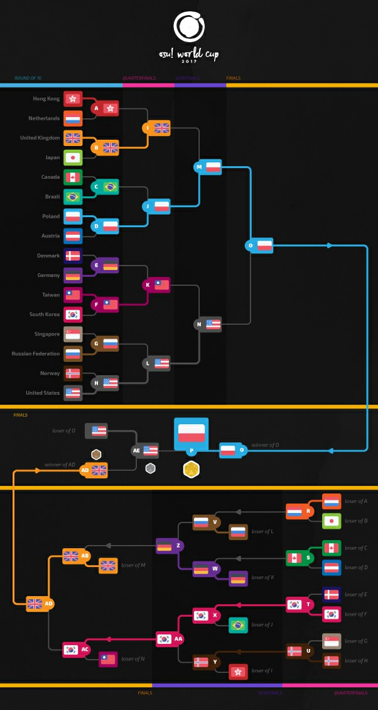
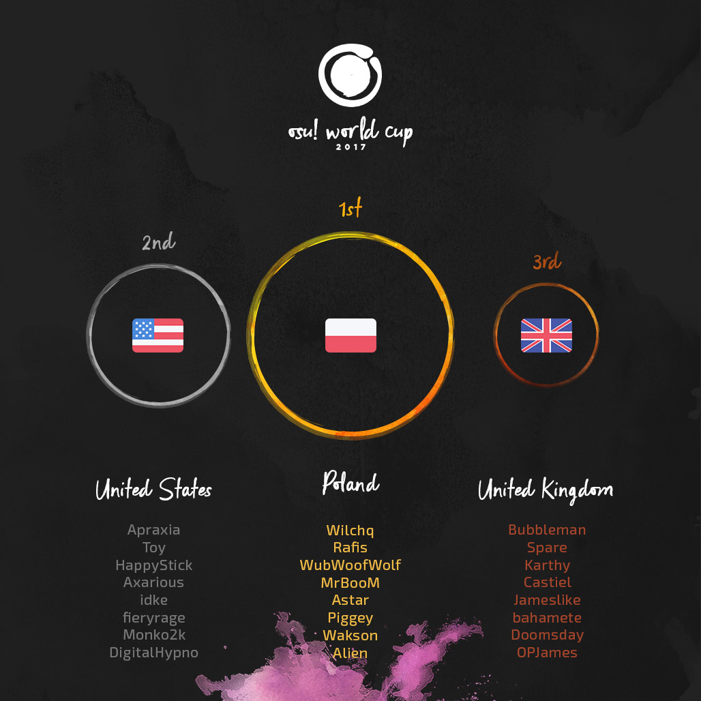

---
tags:
  - OWC 2017
  - OWC2017
no_native_review: true
---

# osu! World Cup 2017

La **osu! World Cup 2017** (***OWC 2017***) fue un torneo por países organizado por el [equipo de osu!](/wiki/People/osu!_team). Fue la octava entrega de la osu! World Cup.

## Calendario del torneo

| Evento | Marca de tiempo |
| --: | :-- |
| Fase de registración | 13/10/2017 - 29/10/2017 |
| Sorteos | 12/11/2017 (14:00 UTC) |
| Fase de grupos | 18/11/2017 - 19/11/2017 |
| Octavos de final | 25/11/2017 - 26/11/2017 |
| Cuartos de final | 2/12/2017 - 3/12/2017 |
| Semifinales | 9/12/2017 - 10/12/2017 |
| Finales | 15/12/2017 - 17/12/2017 |

## Premios

| Posición | Premio(s) |
| :-: | :-- |
|  | $300 por miembro del equipo, vaso y pins exclusivos osu!, insignia única para el perfil, título de usuario "osu! Champion" por un año |
|  | $160 por miembro del equipo, vaso y pins exclusivos osu!, insignia única para el perfil |
|  | $80 por miembro del equipo, vaso y pins exclusivos osu!, insignia única para el perfil |

  

## Organización

La osu! World Cup 2017 estuvo a cargo de varios miembros de la comunidad.

| Posición | Miembro(s) |
| :-- | :-- |
| Gerente | ::{ flag=ES }:: [Deif](https://osu.ppy.sh/users/318565), ::{ flag=AR }:: [juankristal](https://osu.ppy.sh/users/443656), ::{ flag=DE }:: [Loctav](https://osu.ppy.sh/users/71366), ::{ flag=HK }:: [mangomizer](https://osu.ppy.sh/users/1893718), ::{ flag=DE }:: [p3n](https://osu.ppy.sh/users/123703), ::{ flag=FR }:: [shARPII](https://osu.ppy.sh/users/776257) |
| Selección de mapas | ::{ flag=JP }:: [Delis](https://osu.ppy.sh/users/1603923), ::{ flag=DE }:: [Okorin](https://osu.ppy.sh/users/1623405), ::{ flag=KR }:: [ToGlette](https://osu.ppy.sh/users/1076236) |
| Comentaristas | ::{ flag=HK }:: [- G I D Z -](https://osu.ppy.sh/users/2286528), ::{ flag=AU }:: [Bauxe](https://osu.ppy.sh/users/1881685), ::{ flag=GB }:: [Doomsday](https://osu.ppy.sh/users/18983), ::{ flag=CA }:: [Evrien](https://osu.ppy.sh/users/791660), ::{ flag=AU }:: [Kano](https://osu.ppy.sh/users/3036203), ::{ flag=AT }:: [Omgforz](https://osu.ppy.sh/users/578943), ::{ flag=FI }:: [ProfessionalBox](https://osu.ppy.sh/users/3250792) |
| Estadísticas | ::{ flag=NZ }:: [deadbeat](https://osu.ppy.sh/users/128370), ::{ flag=DE }:: [Nwolf](https://osu.ppy.sh/users/1910766) |

## Links

- [Hilo de discusión](https://osu.ppy.sh/community/forums/topics/653192)
- [Transmisión en vivo](https://www.twitch.tv/osulive)
- **[Hoja de estadísticas](https://docs.google.com/spreadsheets/d/e/2PACX-1vRFMsLwUAUFYdDoAhmQLfuXHB7PIIOgUcaRdYI03hpuVDCI8BnmdkMHG5QsO5h889Gwnc-Ani-C_IuV/pubhtml)**

## Participantes

|  | País | Miembros |
| :-: | :-: | :-- |
| ::{ flag=AR }:: | **Argentina** | **[Pein](https://osu.ppy.sh/users/2212941)**, [benjacala](https://osu.ppy.sh/users/1625740), [Glazbom](https://osu.ppy.sh/users/608277), [Lexalia](https://osu.ppy.sh/users/1887616), [Serena](https://osu.ppy.sh/users/756068), [Toushi](https://osu.ppy.sh/users/2367825), [-Urushihara-](https://osu.ppy.sh/users/6169195), [zaqlev](https://osu.ppy.sh/users/3188703) |
| ::{ flag=AU }:: | **Australia** | **[Bauxe](https://osu.ppy.sh/users/1881685)**, [Blobby3000](https://osu.ppy.sh/users/6916774), [Dumii](https://osu.ppy.sh/users/3068044), [GranDSenpai](https://osu.ppy.sh/users/3997580), [ithgyu](https://osu.ppy.sh/users/5113781), [Lunirs](https://osu.ppy.sh/users/2118945), [uyghti](https://osu.ppy.sh/users/3641404), [Weber](https://osu.ppy.sh/users/6410432) |
| ::{ flag=AT }:: | **Austria** | **[Akane-Yuki](https://osu.ppy.sh/users/3656589)**, [BlueFlame](https://osu.ppy.sh/users/3506191), [Fedora Goose](https://osu.ppy.sh/users/2323131), [Kizan](https://osu.ppy.sh/users/3074197), [Myst1k](https://osu.ppy.sh/users/5302223), [Spark-desu](https://osu.ppy.sh/users/4601608), [Teppichreini](https://osu.ppy.sh/users/1371974), [Tomadoi](https://osu.ppy.sh/users/5712451) |
| ::{ flag=BR }:: | **Brasil** | **[MouseEasy](https://osu.ppy.sh/users/1558603)**, [fabriciorby](https://osu.ppy.sh/users/209664), [Igor Cabra](https://osu.ppy.sh/users/2290888), [Mismagius](https://osu.ppy.sh/users/19048), [Mystia](https://osu.ppy.sh/users/4277702), [Sanjilift](https://osu.ppy.sh/users/3260571), [Sickoh](https://osu.ppy.sh/users/5411474), [Zekker](https://osu.ppy.sh/users/4663554) |
| ::{ flag=CA }:: | **Canadá** | **[Azer](https://osu.ppy.sh/users/2155578)**, [FunOrange](https://osu.ppy.sh/users/2051389), [Identical](https://osu.ppy.sh/users/3181676), [Ignite](https://osu.ppy.sh/users/3122948), [Kaifin](https://osu.ppy.sh/users/2596942), [kyle](https://osu.ppy.sh/users/2694475), [MiruHong](https://osu.ppy.sh/users/2866814), [Stoof](https://osu.ppy.sh/users/4916057) |
| ::{ flag=CL }:: | **Chile** | **[kafaN](https://osu.ppy.sh/users/1489743)**, [- Hakurei Kou -](https://osu.ppy.sh/users/4373354), [\[- Momo -\]](https://osu.ppy.sh/users/6024502), [Danidesu](https://osu.ppy.sh/users/2748187), [-Dylson-](https://osu.ppy.sh/users/6315784), [Mathi](https://osu.ppy.sh/users/5339515), [NyaNekoMiau](https://osu.ppy.sh/users/5149397), [xaxreid](https://osu.ppy.sh/users/4227431) |
| ::{ flag=CN }:: | **China** | **[KafuuChino](https://osu.ppy.sh/users/427355)**, [Crystal](https://osu.ppy.sh/users/1646397), [DuNai](https://osu.ppy.sh/users/2522197), [EmertxE](https://osu.ppy.sh/users/954557), [GGBY](https://osu.ppy.sh/users/629717), [rinkon](https://osu.ppy.sh/users/926614), [SpringLane](https://osu.ppy.sh/users/1343504), [Totoki](https://osu.ppy.sh/users/557197) |
| ::{ flag=DK }:: | **Dinamarca** | **[Spork Lover](https://osu.ppy.sh/users/3417469)**, [Crylizhy](https://osu.ppy.sh/users/3023138), [iamVill](https://osu.ppy.sh/users/6295380), [raser1234](https://osu.ppy.sh/users/2527887), [Rika Furude](https://osu.ppy.sh/users/5730821), [teamplayer51](https://osu.ppy.sh/users/3084508), [Vandabe](https://osu.ppy.sh/users/7050754), [waefwerf](https://osu.ppy.sh/users/3868653) |
| ::{ flag=FI }:: | **Finlandia** | **[Nyanaro](https://osu.ppy.sh/users/4157611)**, [Dragonmob](https://osu.ppy.sh/users/4990193), [Jukkii](https://osu.ppy.sh/users/7318423), [Muuki](https://osu.ppy.sh/users/2482261), [Nenko](https://osu.ppy.sh/users/2368367), [SanteriP](https://osu.ppy.sh/users/1981187), [Sanze](https://osu.ppy.sh/users/3110552), [Wucki](https://osu.ppy.sh/users/5287410) |
| ::{ flag=FR }:: | **Francia** | **[Musty](https://osu.ppy.sh/users/251683)**, [Corompus](https://osu.ppy.sh/users/2467018), [FayeurS](https://osu.ppy.sh/users/3105416), [NerO](https://osu.ppy.sh/users/1545031), [-raizen-](https://osu.ppy.sh/users/3872987), [Snorlaax](https://osu.ppy.sh/users/3820683), [ThePooN](https://osu.ppy.sh/users/718454), [Zenoha](https://osu.ppy.sh/users/4430186) |
| ::{ flag=DE }:: | **Alemania** | **[Dustice](https://osu.ppy.sh/users/754565)**, [Beafowl](https://osu.ppy.sh/users/2438122), [Firstus](https://osu.ppy.sh/users/1856829), [imagaK](https://osu.ppy.sh/users/2022445), [Neliel](https://osu.ppy.sh/users/1500305), [Risiing](https://osu.ppy.sh/users/2282047), [Sakurauchi Riko](https://osu.ppy.sh/users/5710809), [Shiratu](https://osu.ppy.sh/users/1731277) |
| ::{ flag=HK }:: | **Hong Kong** | **[- G I D Z -](https://osu.ppy.sh/users/2286528)**, [- Matha -](https://osu.ppy.sh/users/7354729), [Chaoslitz](https://osu.ppy.sh/users/3621552), [DenierNezzar](https://osu.ppy.sh/users/126144), [Koltay](https://osu.ppy.sh/users/4787843), [MinG3012](https://osu.ppy.sh/users/1583218), [-N a n a k o-](https://osu.ppy.sh/users/1407516), [Saku-](https://osu.ppy.sh/users/4720411) |
| ::{ flag=HU }:: | **Hungría** | **[\_verto\_](https://osu.ppy.sh/users/2015300)**, [aleho8](https://osu.ppy.sh/users/6127312), [csaba21123](https://osu.ppy.sh/users/7764237), [emu1337](https://osu.ppy.sh/users/2185987), [EnDy\_S](https://osu.ppy.sh/users/2725111), [Jugment](https://osu.ppy.sh/users/3727686), [legekka](https://osu.ppy.sh/users/4142446). [Lexion](https://osu.ppy.sh/users/5271371) |
| ::{ flag=ID }:: | **Indonesia** | **[Fuma](https://osu.ppy.sh/users/1501956)**, [DeathAdderz](https://osu.ppy.sh/users/7457788), [LoidKun](https://osu.ppy.sh/users/6437601), [moyamoyano\_sa](https://osu.ppy.sh/users/3891439), [RandykhaRu](https://osu.ppy.sh/users/2158836), [Rayhan Hakim](https://osu.ppy.sh/users/4085825), [Reyuza](https://osu.ppy.sh/users/2454767), [Skitzor](https://osu.ppy.sh/users/3353314) |
| ::{ flag=IL }:: | **Israel** | **[MrPotato](https://osu.ppy.sh/users/2787415)**, [Bladma](https://osu.ppy.sh/users/3493078), [Jumbo](https://osu.ppy.sh/users/5509809), [Kyoko](https://osu.ppy.sh/users/3382084), [Master](https://osu.ppy.sh/users/3973608), [Nalian](https://osu.ppy.sh/users/3909656), [Okino may](https://osu.ppy.sh/users/7730603), [Slendy](https://osu.ppy.sh/users/2689577) |
| ::{ flag=IT }:: | **Italia** | **[Koba](https://osu.ppy.sh/users/4448118)**, [Carretto](https://osu.ppy.sh/users/3801459), [DT-sama](https://osu.ppy.sh/users/3525018), [Everywhere](https://osu.ppy.sh/users/7942443), [Kayne](https://osu.ppy.sh/users/1474421), [Manu028](https://osu.ppy.sh/users/6192633), [NekoFunfo](https://osu.ppy.sh/users/1646427), [Spazza17](https://osu.ppy.sh/users/3516241) |
| ::{ flag=JP }:: | **Japón** | **[Shirasaka Koume](https://osu.ppy.sh/users/3062998)**, [\_YuriNee](https://osu.ppy.sh/users/1794082), [benki](https://osu.ppy.sh/users/1021944), [Sheba](https://osu.ppy.sh/users/2477878), [Shigure chan](https://osu.ppy.sh/users/1048423), [Sinch](https://osu.ppy.sh/users/360552), [Super Arrow](https://osu.ppy.sh/users/1970239), [Turbo\_BBA](https://osu.ppy.sh/users/6415964) |
| ::{ flag=LV }:: | **Letonia** | **[Forseen](https://osu.ppy.sh/users/556012)**, [Choilicious](https://osu.ppy.sh/users/2129634), [Emula](https://osu.ppy.sh/users/2891792), [Jesus\[Krists\]](https://osu.ppy.sh/users/2842992), [snoopeh](https://osu.ppy.sh/users/5597947), [waywern2012](https://osu.ppy.sh/users/5870453), [xoho](https://osu.ppy.sh/users/3647897) |
| ::{ flag=MY }:: | **Malasia** | **[ClawViper](https://osu.ppy.sh/users/2681361)**, [Amane-](https://osu.ppy.sh/users/2276847), [Ex6TenZ](https://osu.ppy.sh/users/2676512), [ffstar](https://osu.ppy.sh/users/1163205), [Rampax](https://osu.ppy.sh/users/3995630), [ShaneLiang](https://osu.ppy.sh/users/6716499), [TequilaWolf](https://osu.ppy.sh/users/3633477), [wuhua](https://osu.ppy.sh/users/2932510) |
| ::{ flag=MX }:: | **México** | **[Atsuro](https://osu.ppy.sh/users/2279351)**, [\[ AeonLust \]](https://osu.ppy.sh/users/2353490), [\[Riot\]](https://osu.ppy.sh/users/4256461), [-Hebel-](https://osu.ppy.sh/users/6169483), [Psycopath-](https://osu.ppy.sh/users/3233957), [-Shouta-Kun-](https://osu.ppy.sh/users/5312102), [thouka](https://osu.ppy.sh/users/5353630), [-Wolfy-](https://osu.ppy.sh/users/4497582) |
| ::{ flag=NL }:: | **Países Bajos** | **[n0ah](https://osu.ppy.sh/users/3086393)**, [Ahmnesia](https://osu.ppy.sh/users/2715937), [GladiOol](https://osu.ppy.sh/users/23326), [Gumi Rin](https://osu.ppy.sh/users/2574658), [jackylam5](https://osu.ppy.sh/users/1540807), [Lazer](https://osu.ppy.sh/users/1799925), [Lilily](https://osu.ppy.sh/users/6502403), [Viveliam](https://osu.ppy.sh/users/3506793) |
| ::{ flag=NO }:: | **Noruega** | **[Hundur](https://osu.ppy.sh/users/3145033)**, [Afrodafro](https://osu.ppy.sh/users/3551255), [Cocaine dog](https://osu.ppy.sh/users/3213014), [CXu](https://osu.ppy.sh/users/84841), [-GN](https://osu.ppy.sh/users/895581), [ItsKevZii](https://osu.ppy.sh/users/5201225), [Sebu](https://osu.ppy.sh/users/3990173), [YokesPai](https://osu.ppy.sh/users/6399568) |
| ::{ flag=PH }:: | **Filipinas** | **[revurii](https://osu.ppy.sh/users/4180036)**, [ededed028](https://osu.ppy.sh/users/3932796), [fixedbyglue](https://osu.ppy.sh/users/8296269), [HaruTachi-](https://osu.ppy.sh/users/6244066), [ibvan](https://osu.ppy.sh/users/5315077), [KagenoKami](https://osu.ppy.sh/users/7246165), [-Marika](https://osu.ppy.sh/users/2199427), [Shii](https://osu.ppy.sh/users/2911062) |
| ::{ flag=PL }:: | **Polonia** | **[Wilchq](https://osu.ppy.sh/users/2021758)**, [\[ Wakson \]](https://osu.ppy.sh/users/3048222), [Alien](https://osu.ppy.sh/users/4743869), [Astar](https://osu.ppy.sh/users/27055), [MrBooM](https://osu.ppy.sh/users/1837989), [Piggey](https://osu.ppy.sh/users/4163860), [Rafis](https://osu.ppy.sh/users/2558286), [WubWoofWolf](https://osu.ppy.sh/users/39828) |
| ::{ flag=RO }:: | **Rumania** | **[Rohulk](https://osu.ppy.sh/users/3219026)**, [badeatudorpetre](https://osu.ppy.sh/users/1473890), [Chiu](https://osu.ppy.sh/users/3148900), [cristi2708](https://osu.ppy.sh/users/7552300), [eternum](https://osu.ppy.sh/users/4581069), [Mad Carrot](https://osu.ppy.sh/users/2236064), [Sheeaper](https://osu.ppy.sh/users/3299569), [vuru](https://osu.ppy.sh/users/7432712) |
| ::{ flag=RU }:: | **Rusia** | **[follon](https://osu.ppy.sh/users/3973474)**, [Aden](https://osu.ppy.sh/users/4342841), [AxewB](https://osu.ppy.sh/users/4928776), [Hasawa Kraenes](https://osu.ppy.sh/users/1568047), [Okinotori](https://osu.ppy.sh/users/4346274), [Red\_Pixel](https://osu.ppy.sh/users/4170932), [Shiawase](https://osu.ppy.sh/users/989489), [talala](https://osu.ppy.sh/users/1389663) |
| ::{ flag=SG }:: | **Singapur** | **[GSBlank](https://osu.ppy.sh/users/2312106)**, [\[-Lockon-\]](https://osu.ppy.sh/users/6726331), [Crafticious](https://osu.ppy.sh/users/5167164), [Elegant Loli](https://osu.ppy.sh/users/3010281), [Emilia](https://osu.ppy.sh/users/2003326), [Jolene](https://osu.ppy.sh/users/2672025), [LanJay](https://osu.ppy.sh/users/5210595), [Raindrop](https://osu.ppy.sh/users/1155871) |
| ::{ flag=KR }:: | **Corea del Sur** | **[Neta](https://osu.ppy.sh/users/832084)**, [Cheese Kai](https://osu.ppy.sh/users/5979619), [Enon](https://osu.ppy.sh/users/2043401), [firebat92](https://osu.ppy.sh/users/1777162), [Gomo Pslvarh](https://osu.ppy.sh/users/1206417), [Pray](https://osu.ppy.sh/users/2190336), [Pring](https://osu.ppy.sh/users/3478883), [Yaong](https://osu.ppy.sh/users/1883865) |
| ::{ flag=SE }:: | **Suecia** | **[-Kupo-](https://osu.ppy.sh/users/4343103)**, [Chronomarly](https://osu.ppy.sh/users/4991464), [FlySlime](https://osu.ppy.sh/users/3876402), [Jairod](https://osu.ppy.sh/users/3088364), [mby](https://osu.ppy.sh/users/4844909), [Niel](https://osu.ppy.sh/users/3868804), [Sonix](https://osu.ppy.sh/users/4029000), [Xiniox](https://osu.ppy.sh/users/5233691) |
| ::{ flag=TW }:: | **Taiwán** | **[Rucker](https://osu.ppy.sh/users/147515)**, [\[RanYakumo\]](https://osu.ppy.sh/users/1234432), [\_Shield](https://osu.ppy.sh/users/1860489), [black1207](https://osu.ppy.sh/users/983149), [Flask](https://osu.ppy.sh/users/959763), [GfMRT](https://osu.ppy.sh/users/3163649), [Koalazy](https://osu.ppy.sh/users/286740), [Rizer](https://osu.ppy.sh/users/5155973) |
| ::{ flag=GB }:: | **Reino Unido** | **[Bubbleman](https://osu.ppy.sh/users/5182050)**, [bahamete](https://osu.ppy.sh/users/960620), [Castiel](https://osu.ppy.sh/users/1986262), [Doomsday](https://osu.ppy.sh/users/18983), [Jameslike](https://osu.ppy.sh/users/2415743), [Karthy](https://osu.ppy.sh/users/4196808), [OPJames](https://osu.ppy.sh/users/4117142), [Spare](https://osu.ppy.sh/users/2204373) |
| ::{ flag=US }:: | **Estados Unidos** | **[Apraxia](https://osu.ppy.sh/users/4194445)**, [Axarious](https://osu.ppy.sh/users/2614511), [DigitalHypno](https://osu.ppy.sh/users/4384207), [fieryrage](https://osu.ppy.sh/users/3533958), [HappyStick](https://osu.ppy.sh/users/256802), [idke](https://osu.ppy.sh/users/4650315), [Monko2k](https://osu.ppy.sh/users/4852013), [Toy](https://osu.ppy.sh/users/2757689) |

## Podio

## Mappools

### Finales

**[¡Descarga el paquete de mapas aquí! (138 MB)](http://www.mediafire.com/file/e6vze2hbc13eo8i/OWC_2017_Finals.rar)**

- NoMod
  1. [The Ghost Of 3.13 - Forgotten (Blue Dragon) \[grumd\]](https://osu.ppy.sh/beatmapsets/55560#osu/169841)
  2. [Kuroneko Dungeon - Ryoushi no Umi no Lindwurm (P o M u T a) \[ignore's EXTREME\]](https://osu.ppy.sh/beatmapsets/372850#osu/820336)
  3. [TERRASPEX - AMAZING BREAK (Monstrata) \[DESPAIR\]](https://osu.ppy.sh/beatmapsets/571835#osu/1211828)
  4. [sana - Packet Hero (Fuccho) \[Ruthless\]](https://osu.ppy.sh/beatmapsets/404910#osu/880321)
  5. [Yousei Teikoku - Kokou no Sousei (Saten-san) \[Chaos\]](https://osu.ppy.sh/beatmapsets/28705#osu/118068)
  6. [dj TAKA meets DJ YOSHITAKA ft.guit.good-cool - Elemental Creation -GITADO ROCK ver.- (Flower) \[Extra\]](https://osu.ppy.sh/beatmapsets/119447#osu/306683)
- Hidden
  1. [Niko - Made of Fire (lesjuh) \[Oni\]](https://osu.ppy.sh/beatmapsets/10112#osu/40017)
  2. [Sota Fujimori - polygon (Sebu) \[heptagon\]](https://osu.ppy.sh/beatmapsets/422136#osu/1354636)
- HardRock
  1. [beatMARIO - Night of Knights (alacat) \[The World\]](https://osu.ppy.sh/beatmapsets/352570#osu/776951)
  2. [Rohi - Kakuzetsu Thanatos (NatsumeRin) \[Rin\]](https://osu.ppy.sh/beatmapsets/76396#osu/215238)
- DoubleTime
  1. [Kalafina - Kyrie (Vell) \[Genesis\]](https://osu.ppy.sh/beatmapsets/369380#osu/809513)
  2. [Zektbach - L'avide (eXseeD) \[gowww\]](https://osu.ppy.sh/beatmapsets/29496#osu/103403)
- FreeMod
  1. [Mediks - Outbreak (Strategas) \[Doomsday\]](https://osu.ppy.sh/beatmapsets/527082#osu/1118311)
  2. [Camellia - Fastest Crash (sukiNathan) \[RLC's Paroxysm\]](https://osu.ppy.sh/beatmapsets/331025#osu/733432)
  3. [Ayalis - Ai o Chikaishi Hime Kazari (handsome) \[Master\]](https://osu.ppy.sh/beatmapsets/506155#osu/1076701)
- Desempate
  1. **[Wagakki Band - Tengaku (Shiro) \[Uncompressed Fury of a Raging Japanese God\]](https://osu.ppy.sh/beatmapsets/336414#osu/816327)**

### Semifinales

**[¡Descarga el paquete de mapas aquí! (137 MB)](http://www.mediafire.com/file/2rf32niz24xr9xz/OWC_2017_Semifinals.rar)**

- NoMod
  1. [Rita - dorchadas (Delis) \[Sharnoth\]](https://osu.ppy.sh/beatmapsets/580215#osu/1279490)
  2. [C-Show - PANIC HOLIC (VIP) (Frey) \[Regou's Extra\]](https://osu.ppy.sh/beatmapsets/470405#osu/1023481)
  3. [xi - Blue Zenith (Asphyxia) \[ktgster's Extreme\]](https://osu.ppy.sh/beatmapsets/292301#osu/657917)
  4. [Yousei Teikoku - Zetsubou plantation (Saten) \[Zetsubou!\]](https://osu.ppy.sh/beatmapsets/86009#osu/235880)
  5. [LeaF - I (Maddy) \[Terror\]](https://osu.ppy.sh/beatmapsets/99244#osu/264090)
  6. [Susumu Hirasawa - SWITCHED-ON LOTUS (Starrodkirby86) \[KIRBY Mix Deluxe\]](https://osu.ppy.sh/beatmapsets/16457#osu/58970)
- Hidden
  1. [Eisyo-kobu - Oriental Blossom (Crystal) \[Karen's Extra\]](https://osu.ppy.sh/beatmapsets/586889#osu/1242790)
  2. [HujuniseikouyuuP - Talent Shredder (val0108) \[Lesjuh style\]](https://osu.ppy.sh/beatmapsets/47710#osu/153857)
- HardRock
  1. [Memme - Acid Burst (Priti) \[wa's Extra\]](https://osu.ppy.sh/beatmapsets/302535#osu/725026)
  2. [96neko - Buriki no Dance (Lasse) \[Expert\]](https://osu.ppy.sh/beatmapsets/588211#osu/1253986)
- DoubleTime
  1. [3L - Endless night (sjoy) \[Eternal\]](https://osu.ppy.sh/beatmapsets/178968#osu/430371)
  2. [Yuuki Aoi - Platinum (Mythol) \[Collab\]](https://osu.ppy.sh/beatmapsets/83118#osu/229676)
- FreeMod
  1. [Dollscythe - Flashes (Extended) (handsome) \[Spark\]](https://osu.ppy.sh/beatmapsets/358350#osu/787957)
  2. [onoken - Viden (-kevincela-) \[Extreme\]](https://osu.ppy.sh/beatmapsets/375402#osu/822166)
  3. [UNDEAD CORPORATION - Yoru Naku Usagi wa Yume o Miru (Smoothie) \[CRN's Extra\]](https://osu.ppy.sh/beatmapsets/58951#osu/178645)
- Desempate
  1. **[goreshit - fleshbound (Vell) \[martyr\]](https://osu.ppy.sh/beatmapsets/534280#osu/1131747)**

### Cuartos de final

**[¡Descarga el paquete de mapas aquí! (107 MB)](http://www.mediafire.com/file/n4le2yxjs478ysf/OWC_2017_Quarterfinals.rar)**

- NoMod
  1. [FujuniseikouyuuP - FREEDMAN (val0108) \[iyasine\]](https://osu.ppy.sh/beatmapsets/108529#osu/293134)
  2. [LeaF - Calamity Fortune (Frostings) \[Cataclysm\]](https://osu.ppy.sh/beatmapsets/359168#osu/789752)
  3. [KOAN Sound & Asa - fuego (sakuraburst remix) (Shiirn) \[Dreaming of Embers\]](https://osu.ppy.sh/beatmapsets/611806#osu/1291369)
  4. [YUC'e - Cinderella Syndrome (Kibbleru) \[Affection\]](https://osu.ppy.sh/beatmapsets/561693#osu/1187506)
  5. [MY FIRST STORY - Itsuwari NEUROSE (Saut) \[Madness\]](https://osu.ppy.sh/beatmapsets/365963#osu/803199)
  6. [yak\_won - Sewing Machine (ktgster) \[Extreme\]](https://osu.ppy.sh/beatmapsets/350295#osu/772293)
- Hidden
  1. [Jimmy Weckl - Get Happy (buhei) \[MASTER\]](https://osu.ppy.sh/beatmapsets/359580#osu/953945)
  2. [senya - Zetsubou no Fuchi (-Mo-) \[Abyssal\]](https://osu.ppy.sh/beatmapsets/605290#osu/1278874)
- HardRock
  1. [USAO - Night sky (sukiNathan) \[Extra\]](https://osu.ppy.sh/beatmapsets/396994#osu/863532)
  2. [Mitani Nana - Chikyuu Saigo no Kokuhaku o (Star Stream) \[Collab\]](https://osu.ppy.sh/beatmapsets/65491#osu/191805)
- DoubleTime
  1. [ChomuP - Gate of Steiner (JauiPlaY) \[Insane\]](https://osu.ppy.sh/beatmapsets/48941#osu/157886)
  2. [Hana(Usa) & X-Plorez - Summer time music (Frostmourne) \[Insane\]](https://osu.ppy.sh/beatmapsets/136862#osu/429797)
- FreeMod
  1. [Kuroneko Dungeon - Lilieze to Enryuu Laevateinn (Nyquill) \[Another†leggendaria\]](https://osu.ppy.sh/beatmapsets/326608#osu/725139)
  2. [Zips - Heisei Cataclysm (Dark Fang) \[Fang\]](https://osu.ppy.sh/beatmapsets/72217#osu/206567)
  3. [Hatsune Miku - Mythologia's End (val0108) \[Myth0108ia\]](https://osu.ppy.sh/beatmapsets/48979#osu/151229)
- Desempate
  1. **[Nanahira - Petals (toybot) \[Blossom\]](https://osu.ppy.sh/beatmapsets/564354#osu/1193128)**

### Octavos de final

**[¡Descarga el paquete de mapas aquí! (153 MB)](http://www.mediafire.com/file/klgdrjqmz3l3q36/OWC_2017_Round_of_16.rar)**

- NoMod
  1. [Aimer with chelly (EGOIST) - ninelie (REDSHiFT x Vesuvia remix) (ProfessionalBox) \[Daydream\]](https://osu.ppy.sh/beatmapsets/476695#osu/1018247)
  2. [Days N' Daze - Misanthropic Drunken Loner (pishifat) \[Extreme\]](https://osu.ppy.sh/beatmapsets/442587#osu/951778)
  3. [seiya-murai feat.ALT - Sumidagawa Karenka (Sakaue Nachi) \[Extra\]](https://osu.ppy.sh/beatmapsets/202036#osu/796606)
  4. [MitiS & MaHi - Blu (Speed Up Ver.) (Ashasaki) \[Asphyxia's Extra\]](https://osu.ppy.sh/beatmapsets/261911#osu/644067)
  5. [THE ORAL CIGARETTES - Kyouran Hey Kids!! (monstrata) \[God of Speed\]](https://osu.ppy.sh/beatmapsets/372510#osu/815857)
  6. [Comp - Gensou no Satellite (Shinxyn) \[Extra\]](https://osu.ppy.sh/beatmapsets/4404#osu/63875)
- Hidden
  1. [Anamanaguchi - Pop It (Bonsai) \[Extra\]](https://osu.ppy.sh/beatmapsets/501677#osu/1084171)
  2. [sun3 - Higan Retour (saymun) \[Lunatic\]](https://osu.ppy.sh/beatmapsets/14464#osu/54373)
- HardRock
  1. [bj.HaLo - Ende (galvenize) \[Another\]](https://osu.ppy.sh/beatmapsets/44035#osu/148716)
  2. [baker - Kimi ga Kimi ga -vocanico remix- (jonathanlfj) \[Extra\]](https://osu.ppy.sh/beatmapsets/682595#osu/1443510)
- DoubleTime
  1. [CYTOKINE - sEE NEW THE WORLD, SHE KNEW THE WORLD - CYTOKINE Remix (Frey) \[lUNATIC\]](https://osu.ppy.sh/beatmapsets/442378#osu/951393)
  2. [forestpireo - Emotional Blush (S i R i R u) \[Lunatic\]](https://osu.ppy.sh/beatmapsets/21623#osu/74959)
- FreeMod
  1. [Kano - Sukisuki Zecchoushou (Loreley) \[Expert\]](https://osu.ppy.sh/beatmapsets/484532#osu/1250198)
  2. [sakuzyo - Imprinting (Nozhomi) \[Orchestra\]](https://osu.ppy.sh/beatmapsets/290951#osu/655300)
  3. [Agnete Kjolsrud - Get Jinxed (Tarrasky) \[Irrelvis' Diamond\]](https://osu.ppy.sh/beatmapsets/361740#osu/806376)
- Desempate
  1. **[Nana Mizuki - VIRGIN CODE (ShiraKai) \[GENESIS\]](https://osu.ppy.sh/beatmapsets/494430#osu/1052795)**

### Fase de grupos

**[¡Descarga el paquete de mapas aquí! (103 MB)](http://www.mediafire.com/file/8fpkzvgbz3hpoap/OWC_2017_Group_Stage.rar)**

- NoMod
  1. [Amane - TWEEKER (TicClick) \[Lunatic\]](https://osu.ppy.sh/beatmapsets/257165#osu/771858)
  2. [nano - Bull's Eye (Asphyxia) \[toybot's Extra\]](https://osu.ppy.sh/beatmapsets/393986#osu/904687)
  3. [Smooth J - Haru yo, Koi (Streliteela) \[Insane\]](https://osu.ppy.sh/beatmapsets/295880#osu/664611)
  4. [Apocalyptica - 2010 (feat. Dave Lombardo) (pishifat) \[Extra\]](https://osu.ppy.sh/beatmapsets/324990#osu/724512)
  5. [Nanahoshi Kangengakudan feat.Matsushita - Dance Number o Tomo ni (pkk) \[deetz' Insane\]](https://osu.ppy.sh/beatmapsets/353398#osu/821336)
  6. [ak+q - Vexaria (Pentori) \[Miura's Another\]](https://osu.ppy.sh/beatmapsets/657498#osu/1392666)
- Hidden
  1. [07th Expansion - Final Answer (gowww) \[Insane\]](https://osu.ppy.sh/beatmapsets/26226#osu/88633)
  2. [Aiobahn & Yunomi - Ginga Tetsudou no Penguin ft. nicamoq (Stripe.P Remix) (deetz) \[Collab\]](https://osu.ppy.sh/beatmapsets/442510#osu/951600)
- HardRock
  1. [Cororo - Fairy ring (Kite) \[Serenity\]](https://osu.ppy.sh/beatmapsets/316761#osu/705760)
  2. [IOSYS - Chanteikku Sanyousei no Itazura Daisensou (Kochiya Sanae) \[Crazy Jay\]](https://osu.ppy.sh/beatmapsets/24448#osu/91462)
- DoubleTime
  1. [Pendulum - The Vulture (La Cataline) \[Insane\]](https://osu.ppy.sh/beatmapsets/24163#osu/82249)
  2. [Ronald Jenkees - Super-Fun (tieff) \[Fun\]](https://osu.ppy.sh/beatmapsets/95931#osu/257379)
- FreeMod
  1. [FELT - a wonderful moon (Naitoshi) \[Lunatic\]](https://osu.ppy.sh/beatmapsets/190847#osu/454385)
  2. [Big Giant Circles feat. some1namedjeff - Thunderstruck (Charles445) \[Insane\]](https://osu.ppy.sh/beatmapsets/73267#osu/208776)
  3. [Masayoshi Minoshima - Flight of the Bamboo Cutter (a3272509123) \[Lunatic\]](https://osu.ppy.sh/beatmapsets/47754#osu/148000)
- Desempate
  1. **[DJ Noriken - Elektrick U-Phoria(Extended Mix) (sionKotori) \[Illuminate\]](https://osu.ppy.sh/beatmapsets/392682#osu/854972)**

## Resultados de las partidas

### Finales

Viernes, 15 de diciembre de 2017:

| Equipo 1 |  |  | Equipo 2 | Enlance de la partida |
| --: | :-: | :-: | :-- | :-- |
| **Corea del Sur** ::{ flag=KR }:: | **7** | 6 | ::{ flag=TW }:: Taiwán | [#1](https://osu.ppy.sh/community/matches/38335947) |
| Alemania ::{ flag=DE }:: | 1 | **7** | ::{ flag=GB }:: **Reino Unido** | [#1](https://osu.ppy.sh/community/matches/38346733) |
| **Polonia** ::{ flag=PL }:: | **7** | 6 | ::{ flag=US }:: Estados Unidos | [#1](https://osu.ppy.sh/community/matches/38350684) |

Sábado, 16 de diciembre de 2017:

| Equipo 1 |  |  | Equipo 2 | Enlance de la partida |
| --: | :-: | :-: | :-- | :-- |
| **Reino Unido** ::{ flag=GB }:: | **7** | 2 | ::{ flag=KR }:: Corea del Sur | [#1](https://osu.ppy.sh/community/matches/38367964) |
| **Estados Unidos** ::{ flag=US }:: | **7** | 4 | ::{ flag=GB }:: Reino Unido | [#1](https://osu.ppy.sh/community/matches/38384430) |

Domingo, 17 de diciembre de 2017:

| Equipo 1 |  |  | Equipo 2 | Enlance de la partida |
| --: | :-: | :-: | :-- | :-- |
| **Estados Unidos** ::{ flag=US }:: | **7** | 3 | ::{ flag=PL }:: Polonia | [#1](https://osu.ppy.sh/community/matches/38418895) |
| **Polonia** ::{ flag=PL }:: | **7** | 5 | ::{ flag=US }:: Estados Unidos | [#1](https://osu.ppy.sh/community/matches/38421285) |

### Semifinales

Sábado, 9 de diciembre de 2017:

| Equipo 1 |  |  | Equipo 2 | Enlance de la partida |
| --: | :-: | :-: | :-- | :-- |
| **Noruega** ::{ flag=NO }:: | **7** | 2 | ::{ flag=HK }:: Hong Kong | [#1](https://osu.ppy.sh/community/matches/38181607) |
| Países Bajos ::{ flag=NL }:: | 4 | **7** | ::{ flag=RU }:: **Rusia** | [#1](https://osu.ppy.sh/community/matches/38186618) |
| Canadá ::{ flag=CA }:: | 1 | **7** | ::{ flag=DE }:: **Alemania** | [#1](https://osu.ppy.sh/community/matches/38190989) |
| Rusia ::{ flag=RU }:: | 5 | **7** | ::{ flag=DE }:: **Alemania** | [#1](https://osu.ppy.sh/community/matches/38196035) |

Domingo, 10 de diciembre de 2017:

| Equipo 1 |  |  | Equipo 2 | Enlance de la partida |
| --: | :-: | :-: | :-- | :-- |
| **Corea del Sur** ::{ flag=KR }:: | **7** | 6 | ::{ flag=BR }:: Brasil | [#1](https://osu.ppy.sh/community/matches/38206986) |
| Taiwán ::{ flag=TW }:: | 2 | **7** | ::{ flag=US }:: **Estados Unidos** | [#1](https://osu.ppy.sh/community/matches/38209295) |
| **Corea del Sur** ::{ flag=KR }:: | **7** | 2 | ::{ flag=NO }:: Noruega | [#1](https://osu.ppy.sh/community/matches/38219678) |
| Reino Unido ::{ flag=GB }:: | 5 | **7** | ::{ flag=PL }:: **Polonia** | [#1](https://osu.ppy.sh/community/matches/38223284) |

### Cuartos de final

Sábado, 2 de diciembre de 2017:

| Equipo 1 |  |  | Equipo 2 | Enlance de la partida |
| --: | :-: | :-: | :-- | :-- |
| **Países Bajos** ::{ flag=NL }:: | **6** | 4 | ::{ flag=JP }:: Japón | [#1](https://osu.ppy.sh/community/matches/37984347) |
| Alemania ::{ flag=DE }:: | 3 | **6** | ::{ flag=TW }:: **Taiwán** | [#1](https://osu.ppy.sh/community/matches/37988813) |
| Hong Kong ::{ flag=HK }:: | 0 | **6** | ::{ flag=GB }:: **Reino Unido** | [#1](https://osu.ppy.sh/community/matches/37992145) |
| **Canadá** ::{ flag=CA }:: | **6** | 4 | ::{ flag=AT }:: Austria | [#1](https://osu.ppy.sh/community/matches/37996482) |

Domingo, 3 de diciembre de 2017:

| Equipo 1 |  |  | Equipo 2 | Enlance de la partida |
| --: | :-: | :-: | :-- | :-- |
| Dinamarca ::{ flag=DK }:: | 1 | **6** | ::{ flag=KR }:: **Corea del Sur** | [#1](https://osu.ppy.sh/community/matches/38029594) |
| Singapur ::{ flag=SG }:: | 0 | **6** | ::{ flag=NO }:: **Noruega** | [#1](https://osu.ppy.sh/community/matches/38031685) |
| Brasil ::{ flag=BR }:: | 1 | **6** | ::{ flag=PL }:: **Polonia** | [#1](https://osu.ppy.sh/community/matches/38034430) |
| Rusia ::{ flag=RU }:: | 3 | **6** | ::{ flag=US }:: **Estados Unidos** | [#1](https://osu.ppy.sh/community/matches/38036937) |

### Octavos de final

Sábado, 25 de noviembre de 2017:

| Equipo 1 |  |  | Equipo 2 | Enlance de la partida |
| --: | :-: | :-: | :-- | :-- |
| **Taiwán** ::{ flag=TW }:: | **6** | 2 | ::{ flag=KR }:: Corea del Sur | [#1](https://osu.ppy.sh/community/matches/37793064) |
| **Reino Unido** ::{ flag=GB }:: | **6** | 2 | ::{ flag=JP }:: Japón | [#1](https://osu.ppy.sh/community/matches/37794394) |
| **Hong Kong** ::{ flag=HK }:: | **6** | 4 | ::{ flag=NL }:: Países Bajos | [#1](https://osu.ppy.sh/community/matches/37796296) |
| Singapur ::{ flag=SG }:: | 2 | **6** | ::{ flag=RU }:: **Rusia** | [#1](https://osu.ppy.sh/community/matches/37799185) |

Domingo, 26 de noviembre de 2017:

| Equipo 1 |  |  | Equipo 2 | Enlance de la partida |
| --: | :-: | :-: | :-- | :-- |
| **Polonia** ::{ flag=PL }:: | **6** | 1 | ::{ flag=AT }:: Austria | [#1](https://osu.ppy.sh/community/matches/37837181) |
| Dinamarca ::{ flag=DK }:: | 3 | **6** | ::{ flag=DE }:: **Alemania** | [#1](https://osu.ppy.sh/community/matches/37840289) |
| Canadá ::{ flag=CA }:: | 3 | **6** | ::{ flag=BR }:: **Brasil** | [#1](https://osu.ppy.sh/community/matches/37842093) |
| Noruega ::{ flag=NO }:: | 2 | **6** | ::{ flag=US }:: **Estados Unidos** | [#1](https://osu.ppy.sh/community/matches/37844547) |

### Fase de grupos

Sábado, 18 de noviembre de 2017:

| Equipo 1 |  |  | Equipo 2 | Enlance de la partida |
| --: | :-: | :-: | :-- | :-- |
| Indonesia ::{ flag=ID }:: | 2 | **5** | ::{ flag=AU }:: **Australia** | [#1](https://osu.ppy.sh/community/matches/37609499) |
| Letonia ::{ flag=LV }:: | 1 | **5** | ::{ flag=KR }:: **Corea del Sur** | [#1](https://osu.ppy.sh/community/matches/37609495) |
| Israel ::{ flag=IL }:: | 0 | **5** | ::{ flag=SG }:: **Singapur** | [#1](https://osu.ppy.sh/community/matches/37609502) |
| Hungría ::{ flag=HU }:: | 2 | **5** | ::{ flag=JP }:: **Japón** | [#1](https://osu.ppy.sh/community/matches/37610675) |
| **Rusia** ::{ flag=RU }:: | **5** | 2 | ::{ flag=FR }:: Francia | [#1](https://osu.ppy.sh/community/matches/37610821) |
| Rumania ::{ flag=RO }:: | 0 | **5** | ::{ flag=TW }:: **Taiwán** | [#1](https://osu.ppy.sh/community/matches/37610680) |
| **Países Bajos** ::{ flag=NL }:: | **5** | 3 | ::{ flag=CN }:: China | [#1](https://osu.ppy.sh/community/matches/37610687) |
| Filipinas ::{ flag=PH }:: | 0 | **5** | ::{ flag=HK }:: **Hong Kong** | [#1](https://osu.ppy.sh/community/matches/37612374) |
| Indonesia ::{ flag=ID }:: | 0 | **5** | ::{ flag=PL }:: **Polonia** | [#1](https://osu.ppy.sh/community/matches/37612236) |
| Malasia ::{ flag=MY }:: | 1 | **5** | ::{ flag=DE }:: **Alemania** | [#1](https://osu.ppy.sh/community/matches/37612234) |
| Argentina ::{ flag=AR }:: | 0 | **5** | ::{ flag=KR }:: **Corea del Sur** | [#1](https://osu.ppy.sh/community/matches/37613921) |
| Israel ::{ flag=IL }:: | 1 | **5** | ::{ flag=GB }:: **Reino Unido** | [#1](https://osu.ppy.sh/community/matches/37613946) |
| Rumania ::{ flag=RO }:: | 3 | **5** | ::{ flag=SE }:: **Suecia** | [#1](https://osu.ppy.sh/community/matches/37614075) |
| Filipinas ::{ flag=PH }:: | 0 | **5** | ::{ flag=CL }:: **Chile** | [#1](https://osu.ppy.sh/community/matches/37615841) |
| **Hong Kong** ::{ flag=HK }:: | **5** | 1 | ::{ flag=NO }:: Noruega | [#1](https://osu.ppy.sh/community/matches/37615713) |
| Hungría ::{ flag=HU }:: | 0 | **5** | ::{ flag=RU }:: **Rusia** | [#1](https://osu.ppy.sh/community/matches/37615928) |
| Letonia ::{ flag=LV }:: | 0 | **5** | ::{ flag=BR }:: **Brasil** | [#1](https://osu.ppy.sh/community/matches/37623221) |
| **Finlandia** ::{ flag=FI }:: | **5** | 0 | ::{ flag=IL }:: Israel | [#1](https://osu.ppy.sh/community/matches/37623233) |
| Rumania ::{ flag=RO }:: | 2 | **5** | ::{ flag=CA }:: **Canadá** | [#1](https://osu.ppy.sh/community/matches/37623236) |
| Chile ::{ flag=CL }:: | 2 | **5** | ::{ flag=NO }:: **Noruega** | [#1](https://osu.ppy.sh/community/matches/37625547) |
| México ::{ flag=MX }:: | 1 | **5** | ::{ flag=AT }:: **Austria** | [#1](https://osu.ppy.sh/community/matches/37625411) |
| Países Bajos ::{ flag=NL }:: | 1 | **5** | ::{ flag=US }:: **Estados Unidos** | [#1](https://osu.ppy.sh/community/matches/37625491) |
| Dinamarca ::{ flag=DK }:: | 2 | **5** | ::{ flag=PL }:: **Polonia** | [#1](https://osu.ppy.sh/community/matches/37627968) |
| Argentina ::{ flag=AR }:: | 1 | **5** | ::{ flag=BR }:: **Brasil** | [#1](https://osu.ppy.sh/community/matches/37628093) |
| Suecia ::{ flag=SE }:: | 1 | **5** | ::{ flag=CA }:: **Canadá** | [#1](https://osu.ppy.sh/community/matches/37627984) |
| México ::{ flag=MX }:: | 1 | **5** | ::{ flag=DE }:: **Alemania** | [#1](https://osu.ppy.sh/community/matches/37629909) |
| Italia ::{ flag=IT }:: | 3 | **5** | ::{ flag=US }:: **Estados Unidos** | [#1](https://osu.ppy.sh/community/matches/37629745) |
| Hungría ::{ flag=HU }:: | 1 | **5** | ::{ flag=FR }:: **Francia** | [#1](https://osu.ppy.sh/community/matches/37629750) |

Domingo, 19 de noviembre de 2017:

| Equipo 1 |  |  | Equipo 2 | Enlance de la partida |
| --: | :-: | :-: | :-- | :-- |
| Taiwán ::{ flag=TW }:: | 4 | **5** | ::{ flag=CA }:: **Canadá** | [#1](https://osu.ppy.sh/community/matches/37640223) |
| Malasia ::{ flag=MY }:: | 2 | **5** | ::{ flag=MX }:: **México** | [#1](https://osu.ppy.sh/community/matches/37640683) |
| China ::{ flag=CN }:: | 1 | **5** | ::{ flag=US }:: **Estados Unidos** | [#1](https://osu.ppy.sh/community/matches/37640232) |
| **Dinamarca** ::{ flag=DK }:: | **5** | 3 | ::{ flag=AU }:: Australia | [#1](https://osu.ppy.sh/community/matches/37646592) |
| Finlandia ::{ flag=FI }:: | 1 | **5** | ::{ flag=SG }:: **Singapur** | [#1](https://osu.ppy.sh/community/matches/37646594) |
| **Malasia** ::{ flag=MY }:: | **5** | 2 | ::{ flag=AT }:: Austria | [#1](https://osu.ppy.sh/community/matches/37646595) |
| **Japón** ::{ flag=JP }:: | **5** | 4 | ::{ flag=FR }:: Francia | [#1](https://osu.ppy.sh/community/matches/37647825) |
| Suecia ::{ flag=SE }:: | 0 | **5** | ::{ flag=TW }:: **Taiwán** | [#1](https://osu.ppy.sh/community/matches/37647794) |
| Italia ::{ flag=IT }:: | 4 | **5** | ::{ flag=CN }:: **China** | [#1](https://osu.ppy.sh/community/matches/37647798) |
| Filipinas ::{ flag=PH }:: | 0 | **5** | ::{ flag=NO }:: **Noruega** | *ganó por default* |
| Indonesia ::{ flag=ID }:: | 1 | **5** | ::{ flag=DK }:: **Dinamarca** | [#1](https://osu.ppy.sh/community/matches/37649009) |
| Australia ::{ flag=AU }:: | 2 | **5** | ::{ flag=PL }:: **Polonia** | [#1](https://osu.ppy.sh/community/matches/37649125) |
| Singapur ::{ flag=SG }:: | 2 | **5** | ::{ flag=GB }:: **Reino Unido** | [#1](https://osu.ppy.sh/community/matches/37649006) |
| Japón ::{ flag=JP }:: | 0 | **5** | ::{ flag=RU }:: **Rusia** | [#1](https://osu.ppy.sh/community/matches/37650430) |
| Brasil ::{ flag=BR }:: | 2 | **5** | ::{ flag=KR }:: **Corea del Sur** | [#1](https://osu.ppy.sh/community/matches/37650434) |
| Italia ::{ flag=IT }:: | 3 | **5** | ::{ flag=NL }:: **Países Bajos** | [#1](https://osu.ppy.sh/community/matches/37650364) |
| **Hong Kong** ::{ flag=HK }:: | **5** | 2 | ::{ flag=CL }:: Chile | [#1](https://osu.ppy.sh/community/matches/37652168) |
| **Letonia** ::{ flag=LV }:: | **5** | 0 | ::{ flag=AR }:: Argentina | *ganó por default* |
| Finlandia ::{ flag=FI }:: | 0 | **5** | ::{ flag=GB }:: **Reino Unido** | [#1](https://osu.ppy.sh/community/matches/37651999) |
| **Austria** ::{ flag=AT }:: | **5** | 3 | ::{ flag=DE }:: Alemania | [#1](https://osu.ppy.sh/community/matches/37652008) |

## Reglamento

### Reglas del torneo

1. La osu! World Cup es un torneo por países, jugado en el modo de juego osu!.
   - Si bien esta competencia está planificada como una configuración de 4 contra 4, esto podría cambiar según la cantidad de registros entrantes.
2. La puntuación del mapa se basa en Score V2.
3. Los mapas para cada ronda serán anunciados por los selectores de mapas por anticipado el domingo antes de que tengan lugar las partidas reales. Solo estos se utilizarán durante las respectivas partidas.
   - El mappool de la fase de grupos se anunciará después de los sorteos.
   - Un mapa será asignado como mapa de desempate. Este mapa solo podrá ser jugado en caso de empate.
4. El cronograma de partidas será establecido por el Gerente del torneo. (veáse más adelante).
5. Si no hay ningún staff o árbitro disponible, la partida será pospuesta.
6. Las puntuaciones fallidas de un jugador no se suman a la puntuación del equipo.
   - Revivir y sobrevivir durante un mapa se considera como pasarlo.
7. Se permite el uso de la configuración visual para alterar la atenuación del fondo o deshabilitar elementos del mapa, como storyboards y skins.
8. Si el mapa termina en un empate, el juego será anulado.
9. Si uno de los jugadores se desconecta, son tratados como si hubieran fallado el mapa.
   - Las desconexiones dentro de los 30 segundos posteriores al inicio del mapa se pueden volver a emparejar. Esto queda a discreción del árbitro. El mapa reproducido podría abortarse por esto.
10. Los mapas no pueden ser reutilizados en una misma partida a menos que la partida haya sido anulada.
11. Si asisten menos jugadores del mínimo requerido, el partido podrá ser pospuesto máximo 10 minutos.
12. Se permite el intercambio de jugadores durante una partida sin limitaciones.
13. El lag no es un razón válida para anular un mapa.
14. Se supone que todos los jugadores deben mantener el juego fluido y sin demoras. Los retrasos excesivos en las partidas provenientes del lado del jugador pueden ser sancionados con penalizaciones.
15. Si un jugador se desconecta entre los mapas y el equipo no puede proporcionar un intercambio, el partido puede retrasarse 10 minutos como máximo.
16. Todos los jugadores y árbitros deben ser tratados con respeto. Se deben seguir las instrucciones de los árbitros y del Gerente del torneo. Las decisiones etiquetadas como finales no deben ser objetadas.
17. Está estrictamente prohibido interrumpir el partido con juego sucio, elegir mapas de calentamiento inapropiados (ver más abajo), insultar y provocar a otros jugadores o árbitros, retrasar el partido u otra conducta inapropiada deliberada.
18. Las salas de chat multijugador subyacen a las [reglas de la comunidad de osu!](/wiki/Rules). Todas las reglas del chat también se aplican a las salas de chat multijugador.
    - Romper las reglas del chat da como resultado un silencio. Los jugadores silenciados no pueden participar en partidas multijugador y deben ser intercambiados por el momento.
19. En la Fase de Grupos, 'Ganar por default' será considerado como ganar por 5:0, +1.0 diferencia de puntajes.
20. Los incidentes inesperados son manejados por el Gerente del torneo. Los árbitros pueden permitir una mayor tolerancia dependiendo de las circunstancias dadas. Esto queda a su discreción.
21. Las sanciones por violar las reglas del torneo pueden ser:
    - Exclusión de jugadores específicos para un mapa
    - Exclusión de jugadores específicos por el resto de la partida
    - Declarar el partido como perdido por defecto
    - Descalificación de todo el torneo
    - Descalificación de los torneos oficiales actuales y futuros hasta que se apele
    - Se dará a conocer cualquier modificación a estas reglas.

### Registro del torneo

1. Cada usuario interesado en formar parte del equipo de su país se registra individualmente.
   - El Gerente del torneo creará una lista de posibles candidatos para el equipo de un país.
   - El Gerente del torneo declara un candidato a capitán de la selección del país, aunque de forma temporal.
   - El capitán declarado puede formar su equipo a partir de la lista de candidatos de su país.
2. Para asegurar registros válidos y serios, cada usuario registrado será controlado por el Gerente del torneo.
   - Cada usuario registrado será asignado a la lista de candidatos de su país respectivo.
   - Para ser aceptado con éxito en la lista, debe asegurarse de que su clasificación de rendimiento global de osu! está por encima de 5000.
   - Para ser aceptado con éxito en la lista, debe asegurarse de no haber violado ninguna de las [reglas de la comunidad de osu!](/wiki/Rules) en los últimos 12 meses.
3. Todos los equipos formados con éxito serán publicados después de la Fase de Registro.
4. Solo participarán los 32 países potencialmente más fuertes. La fortaleza potencial de un país está determinada por las estadísticas en línea de todos los candidatos válidos.
   - Si la cantidad de países registrados es inferior a 32, el número podría reducirse a 24, 20 o 16. ¡El objetivo siempre es permitir que participen tantos países como sea posible!
5. Los selectores de mapas no pueden participar como jugadores en este torneo.

### Instrucciones de las fases

1. En la primera fase (Fase de grupos), los equipos se dividirán en 8 grupos de 4 equipos.
   - Esto puede cambiar dependiendo de cuántos equipos sean aceptados en la competencia al final.
2. Todos los equipos de cada grupo se enfrentarán entre sí.
3. Las clasificaciones de cada grupo se determinan clasificando los resultados del desempeño de cada equipo en la siguiente prioridad:
   - Mayoría de partidas ganadas.
   - Tener más alto `{(el número de mapas ganados) - (el número de mapas perdidos)}`.
   - Mayoría de mapas ganados.
   - Tener más alto `∑{(diferencia de puntuación total) / (máxima puntuación)}`.
   - Ganador de la revancha.
4. Los dos mejores equipos de cada grupo pasarán a las Fases de eliminación.
   - Esto puede cambiar con la configuración real de la fase de grupos.
5. Las siguientes fases son Fases de doble eliminación. Esto significa que el ganador pasa a la siguiente fase y el equipo perdedor pasa al bracket perdedor.
6. Según [esta](/wiki/shared/stages-visual.png) imagen, las fases se dividen de la siguiente manera:

| Fase | ID de la partida |
| --: | :-- |
| Octavos de final | A, B, C, D, E, F, G, H |
| Cuartos de final | I, J, K, L & R, S, T, U |
| Semifinales | M, N & V, W, X, Y, Z, AA |
| Finales | O & AB, AC, AD, AE, P, Q |

7. **Condiciones de victoria:**
   - En la fase de grupos, debes ganar 5 mapas para ganar una partida. (Mejor de 9)
   - En los octavos de final y los cuartos de final, debes ganar 6 mapas para ganar una partida. (Mejor de 11)
   - En Semifinales y Finales, necesitas ganar 7 mapas para ganar una partida. (Mejor de 13)

### Instrucciones de la partida

1. Un árbitro creará una sala multijugador con 15 minutos de antelación. Los jugadores deben reunirse durante este período.
   - La configuración de la sala es osu!, Team-Vs., Condición de victoria: 'Score V2'. El nombre de la sala debe ser "OWC 2017: (TeamRed) vs (TeamBlue)".
   - El equipo mencionado primero en el nombre de la sala debe ser el equipo rojo, el equipo mencionado en segundo lugar en el nombre de la sala debe ser el equipo azul.
2. Los jugadores son libres de seleccionar hasta dos mapas de calentamiento. Está prohibido usar mapas con contenido cuestionable. Todos los mapas deben ser del modo osu!.
3. Cada capitán puede banear **un mapa** para seleccionar del mappool. Estos mapas no pueden ser elegidos por ningún equipo en toda la partida.
4. La selección de mapas alternará entre cada capitán seleccionando un mapa del mappool.
5. Cada capitán debe usar `!roll` una vez en `#multijugador`.
   - El ganador del `!roll` elige el primer mapa de la partida.
   - El perdedor del `!roll` banea un mapa, seguido por el ganador del `!roll` para banear un mapa.
6. Los capitanes pueden elegir libremente de cualquier bracket.
   - En caso de empate, se debe jugar el mapa de desempate.
7. Los resultados de la fase de grupos se publicarán a través de una hoja de estadísticas.

### Instrucciones del Mappool

1. Habrá 1 mappool para la fase de grupos, 1 mappool para los octavos de final, 1 mappool para los cuartos de final, 1 mappool para las semifinales y 1 mappool para las finales.
2. Cada mappool consiste de 5 brackets: NoMod, [Hidden](/wiki/Gameplay/Game_modifier/Hidden), [HardRock](/wiki/Gameplay/Game_modifier/Hard_Rock), [DoubleTime](/wiki/Gameplay/Game_modifier/Double_Time) y FreeMod.
3. Cada mappool consta de 16 mapas en total.
4. Cada mappool tiene un desempate.
5. El bracket de NoMod se jugará sin ningún mod activado.
6. Los brackets de Hidden, HardRock y DoubleTime se jugarán con los respectivos mods activados por todos los jugadores actuales.
7. El bracket de FreeMod tendrá FreeMod activado.
   - Las posibles opciones de mods son: Hidden, HardRock y Hidden+HardRock
   - Al jugar un mapa de FreeMod, al menos 2 jugadores de cada equipo deben tener un mod activado como mínimo. Para los jugadores restantes, la activación de mods es opcional.
8. El desempate se jugará bajo las condiciones de FreeMod.
   - Al jugar el desempate, nadie necesita tener un mod activado.
9. El tamaño del bracket de NoMod será de 6 en todas las fases.
10. El tamaño de los brackets de Hidden, HardRock y DoubleTime será de 2 en todas las fases.
11. El tamaño del bracket de FreeMod será de 3 en todas las fases.

### Instrucciones de programación

1. Cada fase se llevará a cabo en **un solo fin de semana**.
2. Las partidas de la fase de grupos pueden coincidir.
3. Todas las fases de doble eliminación se llevarán a cabo el sábado o el domingo, UTC+0.
   - La fase final puede tener partidas el viernes, dependiendo de los encuentros que ocurran.
4. La programación estará a cargo del Gerente del torneo. Los horarios se publicarán el domingo anterior a las primeras partidas de la fase real. El Gerente del torneo intentará crear el horario para respetar la zona horaria del participante.
   - En las fases de cuartos de final y posteriores: informe al Gerente del torneo antes del domingo si espera que un horario específico no esté disponible la semana siguiente. Los deseos se intentan cumplir, lamentablemente no se pueden hacer promesas.
5. La reprogramación después de la publicación del Programa en la wiki no se puede realizar bajo ninguna circunstancia.
6. Los capitanes son responsables de la disponibilidad de sus equipos. El mayor tamaño del equipo existe para garantizar que cada equipo pueda proporcionar al menos cuatro jugadores para cada partida. Si los equipos no pueden proporcionar tres jugadores para una partida, la partida se considerará perdida.
