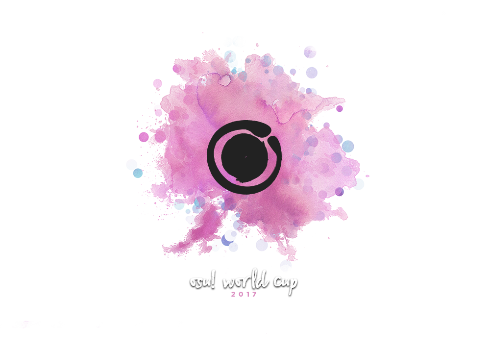

# osu! World Cup 2017

**osu! World Cup 2017** (***OWC 2017***)는 [osu! team](/wiki/People/osu!_team)이 주관하는 국가 대항 토너먼트입니다.

## 대회 일정

| 경기 | 날짜 |
| --: | :-- |
| 참가 신청 기간 | 2017년 10월 13일 - 29일 |
| 조 편성 | 2017년 11월 12일 오후 9시 (UTC +9) |
| 그룹 스테이지 | 2017년 11월 18일 - 19일 |
| 16강 | 2017년 11월 25일 - 26일 |
| 8강 | 2017년 12월 2일 - 3일 |
| 준결승 | 2017년 12월 9일 - 10일 |
| 결승 | 2017년 12월 15일 - 17일 |

## 상품

월드컵에는 매년 달라지는 특별한 상품들이 있습니다.

| 등수 | 상품 |
| :-- | :-- |
|  | 인당 300달러, OWC 텀블러와 뱃지, 프로필 뱃지, osu! Champion 타이틀 |
|  | 인당 160달러, OWC 텀블러와 뱃지, 프로필 뱃지 |
|  | 인당 80달러, OWC 텀블러와 뱃지, 프로필 뱃지 |

## 대회 운영진

osu! World Cup 2017은 커뮤니티의 여러 구성원들에 의해 운영됩니다.

| 역할 | 멤버 |
| :-- | :-- |
| 관리자 | ::{ flag=DE }:: ::Loctav::{ user=71366 }, ::{ flag=DE }:: ::p3n::{ user=123703 }, ::{ flag=ES }:: ::Deif::{ user=318565 }, ::{ flag=FR }:: ::shARPII::{ user=776257 } |
| 맵풀 셀렉터 | ::{ flag=JP }:: ::Delis::{ user=1603923 }, ::{ flag=DE }:: ::Okorin::{ user=1623405 }, ::{ flag=KR }:: ::ToGlette::{ user=1076236 } |
| 해설 | ::{ flag=HK }:: ::- G I D Z -::{ user=2286528 }, ::{ flag=AU }:: ::Bauxe::{ user=1881685 }, ::{ flag=GB }:: ::Doomsday::{ user=18983 }, ::{ flag=CA }:: ::Evrien::{ user=791660 }, ::{ flag=US }:: ::HappyStick::{ user=256802 }, ::{ flag=AU }:: ::Kano::{ user=3036203 }, ::{ flag=AT }:: ::Omgforz::{ user=578943 }, ::{ flag=FI }:: ::ProfessionalBox::{ user=3250792 }, ::{ flag=US }:: ::ztrot::{ user=6347 } |
| 통계 | ::{ flag=NZ }:: ::deadbeat::{ user=128370 }, ::{ flag=DE }:: ::Nwolf::{ user=1910766 } |

## 링크

- [토론 스레드](https://osu.ppy.sh/community/forums/topics/653192)
- [라이브 스트림](https://www.twitch.tv/osulive)
- [참가 신청](https://osu.ppy.sh/community/tournaments/12)

## 참가 국가

### 확정된 팀

|  | 국가 | 선수 |
| --: | :-: | :-- |
| ::{ flag=AR }:: | **아르헨티나** | **::Pein::{ user=2212941 }**, ::Lexalia::{ user=1887616 }, ::Serena::{ user=756068 }, ::benjacala::{ user=1625740 }, ::Toushi::{ user=2367825 }, ::-Urushihara-::{ user=6169195 }, ::Glazbom::{ user=608277 }, ::zaqlev::{ user=3188703 } |
| ::{ flag=AU }:: | **오스트레일리아** | **::Bauxe::{ user=1881685 }**, ::Dumii::{ user=3068044 }, ::uyghti::{ user=3641404 }, ::Lunirs::{ user=2118945 }, ::Blobby3000::{ user=6916774 }, ::ithgyu::{ user=5113781 }, ::GranDSenpai::{ user=3997580 }, ::Weber::{ user=6410432 } |
| ::{ flag=AT }:: | **오스트리아** | **::Akane-Yuki::{ user=3656589 }**, ::Fedora Goose::{ user=2323131 }, ::BlueFlame::{ user=3506191 }, ::Spark-desu::{ user=4601608 }, ::Kizan::{ user=3074197 }, ::Teppichreini::{ user=1371974 }, ::Myst1k::{ user=5302223 }, ::Tomadoi::{ user=5712451 } |
| ::{ flag=BR }:: | **브라질** | **::MouseEasy::{ user=1558603 }**, ::fabriciorby::{ user=209664 }, ::Mismagius::{ user=19048 }, ::Mystia::{ user=4277702 }, ::Zekker::{ user=4663554 }, ::favela::{ user=5295743 }, ::Sickoh::{ user=5411474 }, ::Sanjilift::{ user=3260571 } |
| ::{ flag=CA }:: | **캐나다** | **::Azer::{ user=2155578 }**, ::FunOrange::{ user=2051389 }, ::MiruHong::{ user=2866814 }, ::Stoof::{ user=4916057 }, ::Kaifin::{ user=2596942 }, ::Ignite::{ user=3122948 }, ::Identical::{ user=3181676 }, ::kyle::{ user=2694475 } |
| ::{ flag=CL }:: | **칠레** | **::kafaN::{ user=1489743 }**, ::Mathi::{ user=5339515 }, ::Danidesu::{ user=2748187 }, ::NyaNekoMiau::{ user=5149397 }, ::- Hakurei Kou -::{ user=4373354 }, ::xaxreid::{ user=4227431 }, ::-Dylson-::{ user=6315784 }, ::[- Momo -]::{ user=6024502 } |
| ::{ flag=CN }:: | **중국** | **::KafuuChino::{ user=427355 }**, ::Totoki::{ user=557197 }, ::EmertxE::{ user=954557 }, ::Crystal::{ user=1646397 }, ::SpringLane::{ user=1343504 }, ::DuNai::{ user=2522197 }, ::GGBY::{ user=629717 }, ::rinkon::{ user=926614 } |
| ::{ flag=DK }:: | **덴마크** | **::Spork Lover::{ user=3417469 }**, ::iamVill::{ user=6295380 }, ::raser1234::{ user=2527887 }, ::waefwerf::{ user=3868653 }, ::teamplayer51::{ user=3084508 }, ::Rika Furude::{ user=5730821 }, ::Crylizhy::{ user=3023138 } |
| ::{ flag=FI }:: | **핀란드** | **::Nyanaro::{ user=4157611 }**, ::Wucki::{ user=5287410 }, ::Dragonmob::{ user=4990193 }, ::Sanze::{ user=3110552 }, ::SanteriP::{ user=1981187 }, ::Muuki::{ user=2482261 }, ::Jukkii::{ user=7318423 }, ::Nenko::{ user=2368367 } |
| ::{ flag=DE }:: | **독일** | **::Dustice::{ user=754565 }**, ::Neliel::{ user=1500305 }, ::imagaK::{ user=2022445 }, ::Beafowl::{ user=2438122 }, ::Risiing::{ user=2282047 }, ::Firstus::{ user=1856829 }, ::Sakurauchi Riko::{ user=5710809 }, ::Shiratu::{ user=1731277 } |
| ::{ flag=HK }:: | **홍콩** | **::- G I D Z -::{ user=2286528 }**, ::DenierNezzar::{ user=126144 }, ::-N a n a k o-::{ user=1407516 }, ::MinG3012::{ user=1583218 }, ::Chaoslitz::{ user=3621552 }, ::Saku-::{ user=4720411 }, ::Koltay::{ user=4787843 }, ::- Matha -::{ user=7354729 } |
| ::{ flag=HU }:: | **헝가리** | **::\_verto\_::{ user=2015300 }**, ::emu1337::{ user=2185987 }, ::EnDy_S::{ user=2725111 }, ::Jugment::{ user=3727686 }, ::legekka::{ user=4142446 }. ::Lexion::{ user=5271371 }, ::aleho8::{ user=6127312 }, ::csaba21123::{ user=7764237 } |
| ::{ flag=ID }:: | **인도네시아** | **::Fuma::{ user=1501956 }**, ::DeathAdderz::{ user=7457788 }, ::Skitzor::{ user=3353314 }, ::Reyuza::{ user=2454767 }, ::moyamoyano_sa::{ user=3891439 }, ::LoidKun::{ user=6437601 }, ::Rayhan Hakim::{ user=4085825 }, ::RandykhaRu::{ user=2158836 } |
| ::{ flag=IL }:: | **이스라엘** | **::MrPotato::{ user=2787415 }**, ::Slendy::{ user=2689577 }, ::Kyoko::{ user=3382084 }, ::Bladma::{ user=3493078 }, ::Nalian::{ user=3909656 }, ::Master::{ user=3973608 }, ::Jumbo::{ user=5509809 }, ::Okino may::{ user=7730603 } |
| ::{ flag=IT }:: | **이탈리아** | **::Koba::{ user=4448118 }**, ::Spazza17::{ user=3516241 }, ::Kayne::{ user=1474421 }, ::DT-sama::{ user=3525018 }, ::Everywhere::{ user=7942443 }, ::NekoFunfo::{ user=1646427 }, ::Carretto::{ user=3801459 }, ::Manu028::{ user=6192633 } |
| ::{ flag=JP }:: | **일본** | **::Sinch::{ user=360552 }**, ::Shigure chan::{ user=1048423 }, ::_YuriNee::{ user=1794082 }, ::Super Arrow::{ user=1970239 }, ::Sheba::{ user=2477878 }, ::Shirasaka Koume::{ user=3062998 }, ::benki::{ user=1021944 }, ::Turbo_BBA::{ user=6415964 } |
| ::{ flag=LV }:: | **라트비아** | **::Forseen::{ user=556012 }**, ::Choilicious::{ user=2129634 }, ::Jesus[Krists]::{ user=2842992 }, ::Emula::{ user=2891792 }, ::xoho::{ user=3647897 }, ::snoopeh::{ user=5597947 }, ::waywern2012::{ user=5870453 }, ::LINKI::{ user=8068903 } |
| ::{ flag=MY }:: | **말레이시아** | **::ClawViper::{ user=2681361 }**, ::wuhua::{ user=2932510 }, ::Rampax::{ user=3995630 }, ::Amane-::{ user=2276847 }, ::ShaneLiang::{ user=6716499 }, ::Ex6TenZ::{ user=2676512 }, ::ffstar::{ user=1163205 }, ::TequilaWolf::{ user=3633477 } |
| ::{ flag=MX }:: | **멕시코** | **::Atsuro::{ user=2279351 }**, ::-Wolfy-::{ user=4497582 }, ::-Hebel-::{ user=6169483 }, ::[ AeonLust ]::{ user=2353490 }, ::Psycopath-::{ user=3233957 }, ::-Shouta-Kun-::{ user=5312102 }, ::thouka::{ user=5353630 }, ::[Riot]::{ user=4256461 } |
| ::{ flag=NL }:: | **네덜란드** | **::n0ah::{ user=3086393 }**, ::GladiOol::{ user=23326 }, ::jackylam5::{ user=1540807 }, ::Lazer::{ user=1799925 }, ::Gumi Rin::{ user=2574658 }, ::Ahmnesia::{ user=2715937 }, ::Viveliam::{ user=3506793 }, ::Lilily::{ user=6502403 } |
| ::{ flag=NO }:: | **노르웨이** | **::Hundur::{ user=3145033 }**, ::CXu::{ user=84841 }, ::Afrodafro::{ user=3551255 }, ::ItsKevZii::{ user=5201225 }, ::Sebu::{ user=3990173 }, ::Cocaine dog::{ user=3213014 }, ::-GN::{ user=895581 }, ::YokesPai::{ user=6399568 } |
| ::{ flag=PL }:: | **폴란드** | **::Wilchq::{ user=2021758 }**, ::Rafis::{ user=2558286 }, ::WubWoofWolf::{ user=39828 }, ::MrBooM::{ user=1837989 }, ::Astar::{ user=27055 }, ::Piggey::{ user=4163860 }, ::[ Wakson ]::{ user=3048222 }, ::Alien::{ user=4743869 } |
| ::{ flag=RO }:: | **로마니아** | **::Rohulk::{ user=3219026 }**, ::eternum::{ user=4581069 }, ::Chiu::{ user=3148900 }, ::vuru::{ user=7432712 }, ::cristi2708::{ user=7552300 }, ::Sheeaper::{ user=3299569 }, ::Mad Carrot::{ user=2236064 }, ::badeatudorpetre::{ user=1473890 } |
| ::{ flag=RU }:: | **러시아** | **::follon::{ user=3973474 }**, ::talala::{ user=1389663 }, ::Red_Pixel::{ user=4170932 }, ::Hasawa Kraenes::{ user=1568047 }, ::Aden::{ user=4342841 }, ::Shiawase::{ user=989489 }, ::AxewB::{ user=4928776 }, ::Okinotori::{ user=4346274 } |
| ::{ flag=SG }:: | **싱가포르** | **::GSBlank::{ user=2312106 }**, ::LanJay::{ user=5210595 }, ::Emilia::{ user=2003326 }, ::[-Lockon-]::{ user=6726331 }, ::Elegant Loli::{ user=3010281 }, ::Raindrop::{ user=1155871 }, ::Jolene::{ user=2672025 }, ::Crafticious::{ user=5167164 } |
| ::{ flag=KR }:: | **대한민국** | **::Neta::{ user=832084 }**, ::Gomo Pslvarh::{ user=1206417 }, ::firebat92::{ user=1777162 }, ::Yaong::{ user=1883865 }, ::Enon::{ user=2043401 }, ::Pray::{ user=2190336 }, ::Pring::{ user=3478883 }, ::Cheese Kai::{ user=5979619 } |
| ::{ flag=SE }:: | **스웨덴** | **::-Kupo-::{ user=4343103 }**, ::Chronomarly::{ user=4991464 }, ::Sonix::{ user=4029000 }, ::mby::{ user=4844909 }, ::Xiniox::{ user=5233691 }, ::FlySlime::{ user=3876402 }, ::Niel::{ user=3868804 }, ::Jairod::{ user=3088364 } |
| ::{ flag=TW }:: | **대만** | **::Rucker::{ user=147515 }**, ::Flask::{ user=959763 }, ::Koalazy::{ user=286740 }, ::Rizer::{ user=5155973 }, ::[RanYakumo]::{ user=1234432 }, ::_Shield::{ user=1860489 }, ::black1207::{ user=983149 }, ::GfMRT::{ user=3163649 } |
| ::{ flag=GB }:: | **영국** | **::Bubbleman::{ user=5182050 }**, ::Spare::{ user=2204373 }, ::Karthy::{ user=4196808 }, ::Castiel::{ user=1986262 }, ::Jameslike::{ user=2415743 }, ::bahamete::{ user=960620 }, ::Doomsday::{ user=18983 }, ::OPJames::{ user=4117142 } |

### 확정되지 않은 팀

만약 월드컵 참가 신청을 한 경우, 목록에 적혀 있는 임시 주장에게 가능한 한 빨리 연락을 취하도록 합니다.

|  | 국가 | 임시 주장 |
| --: | :-: | :-- |
| ::{ flag=FR }:: | **프랑스** | ::Musty::{ user=251683 } |
| ::{ flag=PH }:: | **필리핀** | ::HaruTachi-::{ user=6244066 } |
| ::{ flag=US }:: | **미국** | ::Toy::{ user=2757689 } |

## 규칙

### 대회 규칙

1. osu! World Cup 은 osu! 스탠다드 국가 대항 토너먼트입니다.
   - 이 대회는 4:4 형식으로 계획되어 있지만, 참가자의 수에 따라 조정될 수 있습니다.
2. Score V2 모드로 진행됩니다.
3. 각 라운드의 맵풀은 본 경기가 시작하기 전 주의 일요일에 발표됩니다.
   - 그룹 스테이지의 맵풀은 조 편성 이후에 발표됩니다.
   - 한 개의 맵이 타이브레이커용으로 제공됩니다. 이 맵은 타이(동점인 상황에서 한 쪽이 점수를 얻으면 이기는 상황)인 경우에만 쓰입니다.
4. 경기 일정은 대회 관리자들이 결정합니다.
5. 진행 가능한 스탭이나 심판이 없는 경우, 경기가 연기될 수 있습니다.
6. 죽은 플레이어의 점수는 팀의 점수에 포함되지 않습니다.
   - 맵이 끝나기 전에 다시 살아난다면 패스한 걸로 간주됩니다.
7. 배경화면의 밝기, 스토리보드나 스킨과 같은 비주얼 설정을 변경해도 됩니다.
8. 무승부로 경기가 끝나는 경우, 경기는 무효화됩니다.
9. 플레이어가 게임 중간에 튕기는 경우, 그 플레이어는 죽은 걸로 간주됩니다.
   - 게임이 시작한 지 30초 안에 튕기는 경우 재경기를 할 수도 있습니다. 하지만 이건 심판의 결정에 따릅니다. 이를 위해 플레이 중이던 게임은 중단될 것입니다.
10. 게임이 무효화된 경우가 아닌 이상 이미 사용된 맵은 두 번 이상 쓰일 수 없습니다.
11. 만약 경기에 필요한 선수가 다 모이지 않은 경우, 경기는 최대 10분까지 지연될 수 있습니다.
12. 경기 도중 제한 없이 선수 교체가 가능합니다.
13. 렉은 경기를 무효화하기에 적절하지 않은 이유입니다.
14. 모든 플레이어들은 경기를 원활하게 진행되도록 해야합니다. 지나친 경기 지연은 패널티의 사유가 될 수 있습니다.
15. 경기 도중 플레이어가 튕기고 그 플레이어를 대체할 플레이어가 없는 경우, 경기는 최대 10분까지 지연될 수 있습니다.
16. 모든 플레이어와 심판들은 서로를 존경히 대해야 합니다. 대회 운영진들과 심판들의 지시에 따라야 합니다. 최종 판단에 대한 반박은 받아들여지지 않습니다.
17. 부정한 방법으로 플레이 하거나, 부적절한 맵을 워밍업 맵으로 꺼내거나, 다른 플레이어나 심판을 비방하거나, 경기를 지연시키거나, 다른 의도적인 악행을 저지르는 등 경기 진행을 방해하는 건 엄격하게 금지합니다.
18. 멀티방 내 채팅에서는 기본적으로 [osu! community rules](/wiki/Rules)를 따릅니다. 게임 내 채팅 규칙이 동일하게 적용됩니다.
    - 게임 내 채팅 규칙을 어기면 채팅 금지를 당하게 됩니다. 채팅 금지를 당한 플레이어는 경기에 참가할 수 없으며, 그 플레이어가 경기에 참가할 수 없는 동안 다른 플레이어로 교체해야 할 것입니다.
19. 그룹 스테이지에서 기본적으로 5:0이 승리로 간주될 것입니다.
20. 예상하지 못한 상황의 발생 시 대회 관리자들에 의해 처리됩니다. 심판은 주어진 상황에 대해 심판 재량껏 판단합니다. 그들의 결정에 달렸습니다.
21. 토너먼트 룰을 어겼을 경우의 패널티:
    - 해당 플레이어는 한 게임에서 제외됩니다
    - 해당 플레이어는 한 에서 제외됩니다
    - 해당 경기가 패배 처리됩니다
    - 이번 대회에서 제명됩니다
    - 반성의 의사를 밝히지 않는 이상, 이번 대회뿐만 아니라 후에 있을 공식 대회에서 제명됩니다
    - 규칙에 변동사항이 있다면 공지될 것입니다

### 대회 신청

1. 자신의 국가의 팀에 들어가고 싶은 모든 플레이어들은 개별적으로 신청을 합니다.
   - 대회 운영진은 각 국가별로 후보자 목록을 만듭니다.
   - 대회 운영진은 후보자 중 한 명을 임시로 팀의 주장으로 임명합니다.
   - 임명된 주장(임시)은 자신이 속한 국가의 후보자 리스트를 참고해 팀을 구성합니다.
2. 확실하고 진지한 등록 과정을 위해 대회 운영진은 대회에 신청한 모든 플레이어들을 검토합니다.
   - 신청한 모든 플레이어들은 각자의 국가의 후보자 목록에 올라가게 됩니다.
   - 당신의 글로벌 랭킹이 5,000등 초과여야만 후보자 목록에 오를 수 있습니다.
   - 지난 12개월 동안 [osu! community rules](/wiki/Rules)에 어긋나는 행위를 한 적이 없어야 성공적으로 후보자 목록에 오를 수 있습니다.
3. 팀이 성공적으로 구성되면 신청 기간이 끝난 후 공개될 것입니다.
4. 오직 32개의 가능성 있는 강한 국가들이 참가하게 될 것입니다. 그 가능성은 각 국가의 참가 가능한 선수들의 통계에 의해 판단됩니다.
   - 만약 신청한 국가가 32개 미만인 경우, 참가하는 국가의 수는 24, 20 또는 16개로 줄어들 것입니다. 가능한 많은 국가가 참가할 수 있도록 하는 게 목표지만요.
5. 맵풀 셀렉터는 대회에 선수로서 참가하지 못합니다.

### 스테이지 설명

1. 그룹 스테이지에서는 한 그룹 당 네 팀으로 총 여덟 그룹으로 나누어집니다.
   - 그룹의 크기는 대회에 최종적으로 등록된 국가의 수에 따라 달라질 수 있습니다.

2. 같은 그룹에 있는 팀은 한 번씩은 마주하게 될 것입니다.

3. 그룹에서의 순위는 다음과 같은 팀의 퍼포먼스에 따라 정해지게 됩니다:
   - 가장 많이 승리할 것 (경기)
   - `{(승리한 판 수 - 패배한 판 수)}` 보다 높을 것
   - 가장 많이 승리할 것 (판)
   - `∑{(총 점수 차이) / (최대 점수)}` 보다 높을 것
   - 재경기에서 이길 것

4. 상위 두 개의 팀이 상위 스테이지로 진출하게 됩니다.
   - 실제 그룹 스테이지 상황에 따라 달라질 수 있습니다.

5. 그룹 스테이지 이후부터는 더블 엘리미네이션 방식입니다. 이 말은 스테이지에서 승리하면 다음 스테이지로 진출하고, 패배하면 패자조로 가게 된다는 말입니다.

6. [이 이미지](https://puu.sh/bUq5V/f1066103b0.png)를 기반으로 하며 스테이지는 다음과 같이 나누어집니다:

   | 스테이지 | 경기 ID |
   | --: | :-- |
   | 16강 | A, B, C, D, E, F, G, H |
   | 8강 | I, J, K, L & R, S, T, U |
   | 준결승 | M, N & V, W, X, Y, Z, AA |
   | 결승 | O & AB, AC, AD, AE, P, Q |

7. **승리 조건:**
   - 그룹 스테이지에서는 5선승제로 진행이 됩니다. (Best-of-9)
   - 16강과 8강에서는 6선승제로 진행이 됩니다. (Best-of-11)
   - 준결승과 결승에서는 7선승제로 진행이 됩니다. (Best-of-13)

### 경기 설명

1. 심판은 경기 15분 전에 미리 방을 생성합니다. 선수들은 그 동안에 모여야 합니다.
   - 방은 osu! 스탠다드 모드, 팀전, Score V2 모드로 생성될 것이며, 방의 제목은 "OWC2017: (팀 블루) vs (팀 레드)" 가 될 것입니다.
   - 방 제목의 앞에 적혀 있는 팀이 블루 팀, 뒤에 적혀 있는 팀이 레드 팀이 됩니다.
2. 선수들은 두 개의 맵을 워밍업으로 플레이할 수 있습니다. 논란을 야기할 수 있는 내용의 맵은 금지합니다. 워밍업용 맵은 osu! 스탠다드 맵이어야 합니다.
3. 각 팀의 주장은 맵풀에서 **한 개**의 맵을 밴할 수 있습니다. 밴된 맵들은 경기 내내 사용될 수 없습니다.
4. 각 팀의 주장이 번갈아가면서 맵을 선택하게 됩니다.
5. 각 팀의 주장은 `#multiplayer` 에서 `!roll` 을 채팅에 치게 됩니다.
   - 점수가 더 높게 나온 팀이 선픽권을 가져갑니다.
   - 점수가 더 낮은 팀은 선밴권을 가져갑니다.
6. 주장들은 맵풀에 있는 맵을 자유롭게 뽑을 수 있습니다.
   - 타이(동점인 상황에서 한 쪽이 점수를 얻으면 이기는 상황)인 경우, 타이브레이커 맵이 진행됩니다.
7. 그룹 스테이지의 결과는 통계 시트에 공개될 것입니다.

### 맵풀 설명

1. 각 스테이지 별로 한 개씩의 맵풀이 존재합니다.
2. 각 맵풀은 5개의 모드로 구성되어 있습니다: 노모드, [히든(Hidden)](/wiki/Gameplay/Game_modifier/Hidden), [하드락(HardRock)](/wiki/Gameplay/Game_modifier/Hard_Rock), [더블타임(DoubleTime)](/wiki/Gameplay/Game_modifier/Double_Time), 프리모드.
3. 각 맵풀은 총 16개의 맵으로 구성되어 있습니다.
4. 각 맵풀은 한 개의 타이브레이커 맵이 포함되어 있습니다.
5. 노모드 맵은 아무런 모드도 걸지 않고 플레이 합니다.
6. 히든, 하드락, 더블타임 맵은 모두가 해당하는 모드를 걸고 플레이를 하게 됩니다.
7. 프리모드 맵은 프리모드를 켜줍니다.
   - 선택 가능한 모드는 히든, 하드락 그리고 히든-하드락 조합입니다.
   - 프리모드 맵을 플레이 할 때 각 팀에서 최소 2명이 한 개의 모드를 걸어야 합니다. 무슨 모드를 걸지는 선수들에게 맡깁니다.
8. 타이브레이커 맵은 프리모드를 켜고 플레이합니다.
   - 타이브레이커 맵을 플레이 하는 동안에는 모드를 꼭 걸지 않아도 됩니다.
9. 모든 스테이지에서 노모드 맵의 개수는 6개입니다.
10. 모든 스테이지에서 히든, 하드락, 더블타임 맵의 개수는 각각 2개입니다.
11. 모든 스테이지에서 프리모드 맵의 개수는 3개입니다.

### 일정 설명

1. 각 스테이지는 **매주 주말**에 진행됩니다.
2. 그룹 스테이지의 경기들은 겹칠 수 있습니다.
3. 그룹 스테이지 이후의 경기는 모두 UTC +0 기준의 토요일 혹은 일요일에 진행됩니다.
   - 결승은 상황에 따라 금요일에 경기를 할 수도 있습니다.
4. 경기 일정은 대회 운영진이 관리합니다. 경기 일정은 본 경기가 있기 전 주 일요일에 발표될 것입니다. 대회 운영진은 서로의 시간대를 고려하여 일정을 짤 것입니다.
   - 8강부터 만약 경기에 참가할 수 없을 경우 일요일 이전에 대회 운영진에게 알려주어야 합니다. 이 부분은 꼭 지켜질 수 있도록 합니다.
5. 일정이 위키에 공개된 이후엔 어떤 상황이라도 일정을 바꾸는 건 있을 수 없습니다.
6. 팀의 주장은 팀원들이 경기에 제대로 참가할 수 있도록 할 책임이 있습니다. 팀원이 반드시 최소 3명은 모이도록 하십시오. 그렇지 못할 경우, 해당 경기는 기권처리 될 것입니다.
