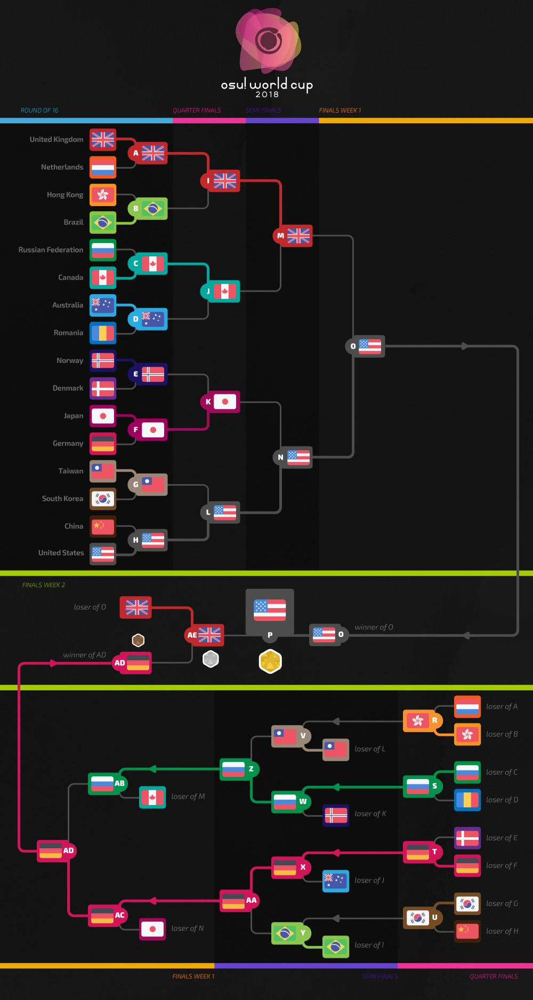
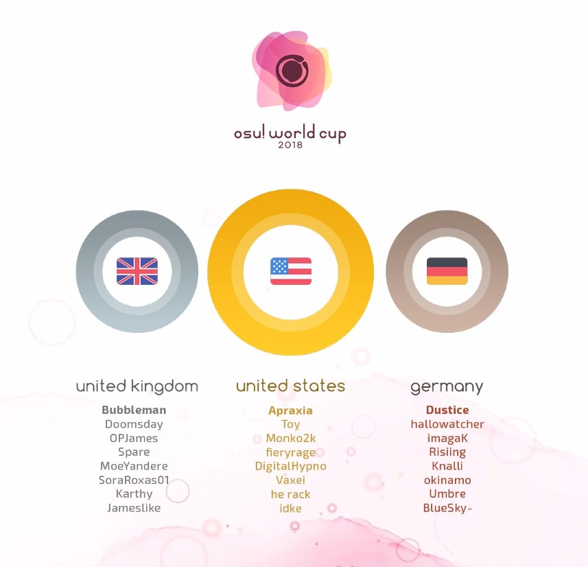

---
tags:
  - OWC 2018
  - OWC2018
no_native_review: true
---

# osu! World Cup 2018

La **osu! World Cup 2018** (***OWC 2018***) fue un torneo por países organizado por el [equipo de osu!](/wiki/People/osu!_team). Fue la novena entrega de la osu! World Cup.

## Calendario del torneo

| Evento | Marca de tiempo |
| --: | :-- |
| Fase de registración | 13/10/2018 - 26/10/2018 |
| Sorteos | 4/11/2018 (14:00 UTC) |
| Fase de grupos | 10/11/2018 - 11/11/2018 |
| Octavos de final | 17/11/2018 - 18/11/2018 |
| Cuartos de final | 24/11/2018 - 25/11/2018 |
| Semifinales | 1/12/2018 - 2/12/2018 |
| Finales semana 1 | 8/12/2018 - 9/12/2018 |
| Finales semana 2 | 15/12/2018 - 16/12/2018 |

## Premios

| Posición | Premio(s) |
| :-: | :-- |
|  | $300 por miembro del equipo, mercancía exclusiva de una sola tira, insignia única para el perfil, título de usuario "osu! Champion" por un año |
|  | US$160 por miembro del equipo, mercancía exclusiva de una sola tira, insignia única para el perfil |
|  | US$80 por miembro del equipo, mercancía exclusiva de una sola tira, insignia única para el perfil |

  

## Organización

La osu! World Cup 2018 estuvo a cargo de varios miembros de la comunidad.

| Posición | Miembro(s) |
| :-- | :-- |
| Gerente | ::{ flag=NZ }:: [deadbeat](https://osu.ppy.sh/users/128370), ::{ flag=US }:: [HappyStick](https://osu.ppy.sh/users/256802), ::{ flag=AR }:: [juankristal](https://osu.ppy.sh/users/443656) |
| Selección de mapas | ::{ flag=US }:: [\_p0ke\_](https://osu.ppy.sh/users/5434711), ::{ flag=BR }:: [Dada](https://osu.ppy.sh/users/9119507), ::{ flag=AU }:: [Kano](https://osu.ppy.sh/users/3036203), ::{ flag=AT }:: [omgforz](https://osu.ppy.sh/users/578943) |
| Árbitro | ::{ flag=ES }:: [Deif](https://osu.ppy.sh/users/318565), ::{ flag=HK }:: [mangomizer](https://osu.ppy.sh/users/1893718), ::{ flag=DE }:: [p3n](https://osu.ppy.sh/users/123703), ::{ flag=US }:: [tigereyes144](https://osu.ppy.sh/users/6499811), ::{ flag=CL }:: [WalterToro](https://osu.ppy.sh/users/5281416), ::{ flag=GB }:: [Yazzehh](https://osu.ppy.sh/users/7068973) |
| Comentaristas | ::{ flag=CA }:: [Azer](https://osu.ppy.sh/users/2155578), ::{ flag=GB }:: [Bae-](https://osu.ppy.sh/users/6576972), ::{ flag=US }:: [BeasttrollMC](https://osu.ppy.sh/users/3171691), ::{ flag=GB }:: [Bubbleman](https://osu.ppy.sh/users/5182050), ::{ flag=US }:: [Chippy](https://osu.ppy.sh/users/2314115), ::{ flag=US }:: [Dohland](https://osu.ppy.sh/users/5220511), ::{ flag=GB }:: [Doomsday](https://osu.ppy.sh/users/18983), ::{ flag=CA }:: [Evrien](https://osu.ppy.sh/users/791660), ::{ flag=US }:: [Happystick](https://osu.ppy.sh/users/256802), ::{ flag=AU }:: [Kano](https://osu.ppy.sh/users/3036203), ::{ flag=AT }:: [omgforz](https://osu.ppy.sh/users/578943) |
| Estadísticas | ::{ flag=NZ }:: [deadbeat](https://osu.ppy.sh/users/128370), ::{ flag=DE }:: [Nwolf](https://osu.ppy.sh/users/1910766) |

## Links

- [Hilo de discusión](https://osu.ppy.sh/community/forums/topics/815745)
- [Transmisión en vivo](https://www.twitch.tv/osulive)
- [Página de selección](https://pickem.hwc.hr/tournaments/3) alojada por ::{ flag=DE }:: [hallowatcher](https://osu.ppy.sh/users/1874761)
- **[Hoja de estadísticas](https://docs.google.com/spreadsheets/d/e/2PACX-1vRx6Eo1_ZRiHlAkZsuPgwt9zBlMhueAZblppAxhZLvezmRm0JsWAjRKzevgFk2OlKqts3KL1uw62Wat/pubhtml)**

## Participantes

|  | País | Miembros |
| --: | :-: | :-- |
| ::{ flag=AR }:: | **Argentina** | **[Pein](https://osu.ppy.sh/users/2212941)**, [Cata](https://osu.ppy.sh/users/5958063), [Ceja](https://osu.ppy.sh/users/4185921), [FastoFreezu](https://osu.ppy.sh/users/3608846), [Lexalia](https://osu.ppy.sh/users/1887616), [LuBren](https://osu.ppy.sh/users/6573651), [Rimi](https://osu.ppy.sh/users/5194834), [Serena](https://osu.ppy.sh/users/756068) |
| ::{ flag=AU }:: | **Australia** | **[GranDSenpai](https://osu.ppy.sh/users/3997580)**, [TheOmyNomy](https://osu.ppy.sh/users/4241054), [Jordan The Bear](https://osu.ppy.sh/users/7477458), [Lunirs](https://osu.ppy.sh/users/2118945), [-Machine-](https://osu.ppy.sh/users/5459981), [Dumii](https://osu.ppy.sh/users/3068044), [Blobby3000](https://osu.ppy.sh/users/6916774), [uyghti](https://osu.ppy.sh/users/3641404) |
| ::{ flag=AT }:: | **Austria** | **[goosefedora](https://osu.ppy.sh/users/2323131)**, [Elscar](https://osu.ppy.sh/users/2253511), [Eta Carinae](https://osu.ppy.sh/users/5841333), [Kizan](https://osu.ppy.sh/users/3074197), [Micca](https://osu.ppy.sh/users/8179335), [Spark-desu](https://osu.ppy.sh/users/4601608), [Teppi](https://osu.ppy.sh/users/1371974), [Tomadoi](https://osu.ppy.sh/users/5712451) |
| ::{ flag=BE }:: | **Bélgica** | **[Hanori](https://osu.ppy.sh/users/7078544)**, [\[Sven\]](https://osu.ppy.sh/users/3695504), [5joshi](https://osu.ppy.sh/users/4279650), [Badewanne3](https://osu.ppy.sh/users/2211396), [Bastia](https://osu.ppy.sh/users/3355362), [Fblade](https://osu.ppy.sh/users/3168085), [TheKoala](https://osu.ppy.sh/users/3906405), [Yentis](https://osu.ppy.sh/users/345516) |
| ::{ flag=BR }:: | **Brasil** | **[MouseEasy](https://osu.ppy.sh/users/1558603)**, [Akane Hime](https://osu.ppy.sh/users/6772887), [My Angelsim](https://osu.ppy.sh/users/3149577), [Mystia](https://osu.ppy.sh/users/4277702), [Niii-san](https://osu.ppy.sh/users/5403374), [Polaco](https://osu.ppy.sh/users/1057782), [Sickoh](https://osu.ppy.sh/users/5411474), [Yuuzinho](https://osu.ppy.sh/users/6267851) |
| ::{ flag=CA }:: | **Canadá** | **[Azer](https://osu.ppy.sh/users/2155578)**, [\_RyuK](https://osu.ppy.sh/users/6304246), [Eddie-](https://osu.ppy.sh/users/3898396), [Squapple](https://osu.ppy.sh/users/6826036), [Stoof](https://osu.ppy.sh/users/4916057), [trevrasher](https://osu.ppy.sh/users/3893420), [VINXIS](https://osu.ppy.sh/users/4323406), [Yuuki-chan](https://osu.ppy.sh/users/7031287) |
| ::{ flag=CL }:: | **Chile** | **[Danidesu](https://osu.ppy.sh/users/2748187)**, [\[-Neon-\]](https://osu.ppy.sh/users/6064382), [Criss](https://osu.ppy.sh/users/3188017), [Hellbeak](https://osu.ppy.sh/users/2367495), [Mathi](https://osu.ppy.sh/users/5339515), [TheDaqox](https://osu.ppy.sh/users/7701428), [xaxreid](https://osu.ppy.sh/users/4227431), [Yumbtah](https://osu.ppy.sh/users/2784663) |
| ::{ flag=CN }:: | **China** | **[MatsumotoRise](https://osu.ppy.sh/users/672726)**, [Crystal](https://osu.ppy.sh/users/1646397), [DomenCherry](https://osu.ppy.sh/users/665367), [Dsan](https://osu.ppy.sh/users/1266166), [EmertxE](https://osu.ppy.sh/users/954557), [GGBY](https://osu.ppy.sh/users/629717), [MyAngelMiku](https://osu.ppy.sh/users/7025429), [Start](https://osu.ppy.sh/users/2190156) |
| ::{ flag=CZ }:: | **República Checa** | **[Swatty](https://osu.ppy.sh/users/1028683)**, [- Daichi -](https://osu.ppy.sh/users/6602580), [Avenito](https://osu.ppy.sh/users/7415910), [BLooDBuRSTiNG](https://osu.ppy.sh/users/3925167), [Electrovoid](https://osu.ppy.sh/users/3853840), [kolgar](https://osu.ppy.sh/users/3123488), [Reegi](https://osu.ppy.sh/users/3396496), [VilaZ](https://osu.ppy.sh/users/5155680) |
| ::{ flag=DK }:: | **Dinamarca** | **[Spork Lover](https://osu.ppy.sh/users/3417469)**, [Cerkie](https://osu.ppy.sh/users/2533400), [Katachi](https://osu.ppy.sh/users/5778925), [My Aim Zogs](https://osu.ppy.sh/users/3722715), [raser1234](https://osu.ppy.sh/users/2527887), [Telomere](https://osu.ppy.sh/users/6295380), [Vandabe](https://osu.ppy.sh/users/7050754), [waefwerf](https://osu.ppy.sh/users/3868653) |
| ::{ flag=FI }:: | **Finlandia** | **[Nyanaro](https://osu.ppy.sh/users/4157611)**, [Bolek\_gamer\_05](https://osu.ppy.sh/users/7786382), [Dragonmob](https://osu.ppy.sh/users/4990193), [Jantsi](https://osu.ppy.sh/users/1644225), [Jup3KW](https://osu.ppy.sh/users/5424170), [Muuki](https://osu.ppy.sh/users/2482261), [Sonoda-Umi](https://osu.ppy.sh/users/2197711), [Wucki](https://osu.ppy.sh/users/5287410) |
| ::{ flag=FR }:: | **Francia** | **[ThePooN](https://osu.ppy.sh/users/718454)**, [Oxia](https://osu.ppy.sh/users/1825928), [ElektroFire](https://osu.ppy.sh/users/2467220), [Mooha](https://osu.ppy.sh/users/2705430), [mrzomb](https://osu.ppy.sh/users/1694887), [Musty](https://osu.ppy.sh/users/251683), [NerO](https://osu.ppy.sh/users/1545031), [-raizen-](https://osu.ppy.sh/users/3872987) |
| ::{ flag=DE }:: | **Alemania** | **[Dustice](https://osu.ppy.sh/users/754565)**, [BlueSky-](https://osu.ppy.sh/users/6410154), [hallowatcher](https://osu.ppy.sh/users/1874761), [imagaK](https://osu.ppy.sh/users/2022445), [Knalli](https://osu.ppy.sh/users/8147403), [okinamo](https://osu.ppy.sh/users/3765989), [Risiing](https://osu.ppy.sh/users/2282047), [Umbre](https://osu.ppy.sh/users/2766034) |
| ::{ flag=HK }:: | **Hong Kong** | **[- G I D Z -](https://osu.ppy.sh/users/2286528)**, [Chaoslitz](https://osu.ppy.sh/users/3621552), [Hicool](https://osu.ppy.sh/users/1639250), [mcy3012](https://osu.ppy.sh/users/4787843), [-N a n a k o-](https://osu.ppy.sh/users/1407516), [Saku-](https://osu.ppy.sh/users/4720411), [SkyzWai-](https://osu.ppy.sh/users/2353581) |
| ::{ flag=ID }:: | **Indonesia** | **[smh](https://osu.ppy.sh/users/1629553)**, [Agouka](https://osu.ppy.sh/users/9606647), [dika312](https://osu.ppy.sh/users/741613), [Fuma](https://osu.ppy.sh/users/1501956), [LoidKun](https://osu.ppy.sh/users/6437601), [Rexeez](https://osu.ppy.sh/users/1987591), [Reyuza](https://osu.ppy.sh/users/2454767), [Skydiver](https://osu.ppy.sh/users/4750008) |
| ::{ flag=IT }:: | **Italia** | **[Koba](https://osu.ppy.sh/users/4448118)**, [Daren](https://osu.ppy.sh/users/4704608), [Kayne](https://osu.ppy.sh/users/1474421), [Kiirochii](https://osu.ppy.sh/users/6387149), [NekoFunfo](https://osu.ppy.sh/users/1646427), [Paski](https://osu.ppy.sh/users/9849712), [SIMONETRAPANI](https://osu.ppy.sh/users/7329177), [Spazza17](https://osu.ppy.sh/users/3516241) |
| ::{ flag=JP }:: | **Japón** | **[Shirasaka Koume](https://osu.ppy.sh/users/3062998)**, [a\_Blue](https://osu.ppy.sh/users/5645667), [Angel Arrow](https://osu.ppy.sh/users/1970239), [benki](https://osu.ppy.sh/users/1021944), [Delis](https://osu.ppy.sh/users/1603923), [gasanww](https://osu.ppy.sh/users/487985), [Varvalian](https://osu.ppy.sh/users/3345902), [Vento](https://osu.ppy.sh/users/4796794) |
| ::{ flag=MX }:: | **México** | **[Atsuro](https://osu.ppy.sh/users/2279351)**, [\[Riot\]](https://osu.ppy.sh/users/4256461), [Flameshock](https://osu.ppy.sh/users/8349047), [-Hebel-](https://osu.ppy.sh/users/6169483), [KevstracK](https://osu.ppy.sh/users/5325213), [LopezzPro](https://osu.ppy.sh/users/2553519), [Lynx-](https://osu.ppy.sh/users/7301672), [-Wolfy-](https://osu.ppy.sh/users/4497582) |
| ::{ flag=NL }:: | **Países Bajos** | **[Viveliam](https://osu.ppy.sh/users/3506793)**, [Ahmnesia](https://osu.ppy.sh/users/2715937), [Damnjelly](https://osu.ppy.sh/users/1666355), [GladiOpa](https://osu.ppy.sh/users/23326), [jackylam5](https://osu.ppy.sh/users/1540807), [n0ah](https://osu.ppy.sh/users/3086393), [phalanx](https://osu.ppy.sh/users/4696315), [taku](https://osu.ppy.sh/users/684433) |
| ::{ flag=NO }:: | **Noruega** | **[Hundur](https://osu.ppy.sh/users/3145033)**, [Afrodafro](https://osu.ppy.sh/users/3551255), [CXu](https://osu.ppy.sh/users/84841), [-GN](https://osu.ppy.sh/users/895581), [ItsKevZii](https://osu.ppy.sh/users/5201225), [Sebu](https://osu.ppy.sh/users/3990173), [YokesPai](https://osu.ppy.sh/users/6399568), [ZeCryptic](https://osu.ppy.sh/users/3381441) |
| ::{ flag=PL }:: | **Polonia** | **[MrBooM](https://osu.ppy.sh/users/1837989)**, [Alien](https://osu.ppy.sh/users/4743869), [Astar](https://osu.ppy.sh/users/27055), [Bartek22830](https://osu.ppy.sh/users/6404027), [Piggey](https://osu.ppy.sh/users/4163860), [Rafis](https://osu.ppy.sh/users/2558286), [Wakson](https://osu.ppy.sh/users/3048222), [WubWoofWolf](https://osu.ppy.sh/users/39828) |
| ::{ flag=RO }:: | **Rumania** | **[badeu](https://osu.ppy.sh/users/1473890)**, [\_thicke](https://osu.ppy.sh/users/8334445), [Chiu](https://osu.ppy.sh/users/3148900), [eternum](https://osu.ppy.sh/users/4581069), [KromaRO](https://osu.ppy.sh/users/7543723), [Rohulk](https://osu.ppy.sh/users/3219026), [roliy](https://osu.ppy.sh/users/9578404), [vuru](https://osu.ppy.sh/users/7432712) |
| ::{ flag=RU }:: | **Rusia** | **[follon](https://osu.ppy.sh/users/3973474)**, [Aden](https://osu.ppy.sh/users/4342841), [Alumetri](https://osu.ppy.sh/users/5371497), [AxewB](https://osu.ppy.sh/users/4928776), [neko ds](https://osu.ppy.sh/users/4688735), [Okinotori](https://osu.ppy.sh/users/4346274), [Red\_Pixel](https://osu.ppy.sh/users/4170932), [talala](https://osu.ppy.sh/users/1389663) |
| ::{ flag=SG }:: | **Singapur** | **[M4-K1](https://osu.ppy.sh/users/5210595)**, [\[-Lockon-\]](https://osu.ppy.sh/users/6726331), [Cleveland](https://osu.ppy.sh/users/5104320), [GSBlank](https://osu.ppy.sh/users/2312106), [Emilia](https://osu.ppy.sh/users/2003326), [Loslite](https://osu.ppy.sh/users/6398160), [Raindrop](https://osu.ppy.sh/users/1155871), [Rtyzen](https://osu.ppy.sh/users/2439822) |
| ::{ flag=SK }:: | **Eslovaquia** | **[Hranolka](https://osu.ppy.sh/users/6149947)**, [andrejus77](https://osu.ppy.sh/users/2463937), [AtHeoN](https://osu.ppy.sh/users/1770367), [Nikolas](https://osu.ppy.sh/users/7759641), [PemiX](https://osu.ppy.sh/users/6974470), [PeteX](https://osu.ppy.sh/users/1285945), [SneakY NickY](https://osu.ppy.sh/users/8847379), [Tikef](https://osu.ppy.sh/users/9149213) |
| ::{ flag=KR }:: | **Corea del Sur** | **[Gomo Pslvarh](https://osu.ppy.sh/users/1206417)**, [\[KOR\]Rem](https://osu.ppy.sh/users/5538115), [AvA Pacifica](https://osu.ppy.sh/users/7058132), [Cellina](https://osu.ppy.sh/users/2490770), [eoehd1ek](https://osu.ppy.sh/users/3938876), [FlyingTuna](https://osu.ppy.sh/users/9224078), [Karuna](https://osu.ppy.sh/users/8775024), [Qu1z](https://osu.ppy.sh/users/526851) |
| ::{ flag=ES }:: | **España** | **[ByYoshi14](https://osu.ppy.sh/users/4470553)**, [Betwin](https://osu.ppy.sh/users/1968481), [Frosiito](https://osu.ppy.sh/users/6462387), [insomnyawolf](https://osu.ppy.sh/users/5337801), [kazamabc](https://osu.ppy.sh/users/6937470), [Moewagon](https://osu.ppy.sh/users/5764169), [Mortal](https://osu.ppy.sh/users/4759050), [Rekens](https://osu.ppy.sh/users/1073575) |
| ::{ flag=SE }:: | **Suecia** | **[fcuk](https://osu.ppy.sh/users/4844909)**, [- Carl -](https://osu.ppy.sh/users/2140681), [Asoreand](https://osu.ppy.sh/users/6374167), [Chronomarly](https://osu.ppy.sh/users/4991464), [N0vy](https://osu.ppy.sh/users/4003726), [Nitroz](https://osu.ppy.sh/users/5256529), [Reedkatt](https://osu.ppy.sh/users/8335950), [Sonix](https://osu.ppy.sh/users/4029000) |
| ::{ flag=TW }:: | **Taiwán** | **[Shiina Noriko](https://osu.ppy.sh/users/1285637)**, [\[ Zane \]](https://osu.ppy.sh/users/3517706), [\_Shield](https://osu.ppy.sh/users/1860489), [CrtReXn](https://osu.ppy.sh/users/1810239), [DazzLE\_Wind](https://osu.ppy.sh/users/2537924), [Flask](https://osu.ppy.sh/users/959763), [GfMRT](https://osu.ppy.sh/users/3163649), [Rizer](https://osu.ppy.sh/users/5155973) |
| ::{ flag=TH }:: | **Tailandia** | **[- Phantasma -](https://osu.ppy.sh/users/1427407)**, [Applause](https://osu.ppy.sh/users/1832711), [Chorus](https://osu.ppy.sh/users/3504692), [Deppyforce](https://osu.ppy.sh/users/5286213), [Mikkuri](https://osu.ppy.sh/users/317494), [NonxE](https://osu.ppy.sh/users/319312), [i hate myself](https://osu.ppy.sh/users/5332553), [redcrosssix](https://osu.ppy.sh/users/2554965) |
| ::{ flag=GB }:: | **Reino Unido** | **[Bubbleman](https://osu.ppy.sh/users/5182050)**, [Doomsday](https://osu.ppy.sh/users/18983), [Jameslike](https://osu.ppy.sh/users/2415743), [Karthy](https://osu.ppy.sh/users/4196808), [MoeYandere](https://osu.ppy.sh/users/2565902), [OPJames](https://osu.ppy.sh/users/4117142), [SoraRoxas01](https://osu.ppy.sh/users/1986262), [Spare](https://osu.ppy.sh/users/2204373) |
| ::{ flag=US }:: | **Estados Unidos** | **[Apraxia](https://osu.ppy.sh/users/4194445)**, [DigitalHypno](https://osu.ppy.sh/users/4384207), [fieryrage](https://osu.ppy.sh/users/3533958), [he rack](https://osu.ppy.sh/users/2644828), [idke](https://osu.ppy.sh/users/4650315), [Monko2k](https://osu.ppy.sh/users/4852013), [Toy](https://osu.ppy.sh/users/2757689), [Vaxei](https://osu.ppy.sh/users/4787150) |

## Podio

## Mappools

### Finales semana 2

**[¡Descarga el paquete de mapas aquí! (140 MB)](https://www.mediafire.com/file/s791z5me6w6b0sx/OWC-GF-Mappack.zip/file)**

- NoMod
  1. [Camellia feat. Nanahira - Bassdrop Freaks (2018 ''Redrop'' ver.) \(Mir\) \[Beisu Doroppu\]](https://osu.ppy.sh/beatmapsets/806859#osu/1693575)
  2. [xi - Bad Elixir \(Cherry Blossom\) \[Idealism\]](https://osu.ppy.sh/beatmapsets/878944#osu/1838165)
  3. [Luschka - unravel \(Mirash\) \[Collab Expert\]](https://osu.ppy.sh/beatmapsets/731933#osu/1544460)
  4. [Suzuki Konomi - My Days \(Meg\) \[Down\]](https://osu.ppy.sh/beatmapsets/861113#osu/1801586)
  5. [Taiko no Tatsujin - Haya Saitama2000 \(Zekira\) \[Oni\]](https://osu.ppy.sh/beatmapsets/9917#osu/39076)
- Hidden
  1. [FUJIN CLUB - Tabi to Ferry \(dsco\) \[Seaside\]](https://osu.ppy.sh/beatmapsets/704541#osu/1490377)
  2. [BLOOD STAIN CHILD - MOON LIGHT WAVE \(Snepif\) \[Effulgence\]](https://osu.ppy.sh/beatmapsets/296543#osu/665787)
  3. [uma vs. Morimori Atsushi - Re:End of a Dream \(Battle\) \[Re:Vival\]](https://osu.ppy.sh/beatmapsets/557039#osu/1178810)
- HardRock
  1. [Nekomata Master - Izanami's wail \(Uberzolik\) \[Xilver's extrA!!\]](https://osu.ppy.sh/beatmapsets/792367#osu/1746993)
  2. [Nanaki feat.GUMI - Mousou Kajitsu \(Natsu\) \[Climax\]](https://osu.ppy.sh/beatmapsets/524966#osu/1114132)
  3. [succducc - me & u \(Nathan\) \[together\]](https://osu.ppy.sh/beatmapsets/699749#osu/1481624)
- DoubleTime
  1. [ZAQ - Serendipity \(Mir\) \[Lasse's Insane\]](https://osu.ppy.sh/beatmapsets/578619#osu/1227137)
  2. [senya - Arehateta Chijou no Uta \(Satellite\) \[Collab\]](https://osu.ppy.sh/beatmapsets/434397#osu/936035)
  3. [HTT - NO, Thank You! \(DNR\) \[Collab\]](https://osu.ppy.sh/beatmapsets/19532#osu/68624)
- FreeMod
  1. [Luschka - Kami no Kotoba \(byfar\) \[Voice of God\]](https://osu.ppy.sh/beatmapsets/817667#osu/1714637)
  2. [Camellia - Towards The Horizon \(Pho\) \[White Extra\]](https://osu.ppy.sh/beatmapsets/636393#osu/1350353)
  3. [S.S.H. - Intersect Thunderbolt-Remix \(Snow Note\) \[Exceed\]](https://osu.ppy.sh/beatmapsets/38316#osu/122693)
- Desempate
  1. **[Falcom Sound Team jdk - The Azure Arbitrator \(jonathanlfj\) \[Chrono Collapse\]](https://osu.ppy.sh/beatmapsets/427166#osu/922172)**

### Finales semana 1

**[¡Descarga el paquete de mapas aquí! (116 MB)](https://mega.nz/#!xolFEKQA!g-4E-q-mVCaKWa3XdpefZ67UhOncE3vnWVz6D_LX4PY)**

- NoMod
  1. [jioyi - Platinum \(09kami\) \[tyui's Extra\]](https://osu.ppy.sh/beatmapsets/449225#osu/1093629)
  2. [Mitsuki Nakae - Ouka Enbu \(Lasse\) \[Petal\]](https://osu.ppy.sh/beatmapsets/688552#osu/1457104)
  3. [Toromaru - Enigma \(Avena\) \[Ultra\]](https://osu.ppy.sh/beatmapsets/460380#osu/986939)
  4. [yuikonnu - Kakushigoto \(AtHeoN\) \[Distant Memory\]](https://osu.ppy.sh/beatmapsets/436177#osu/939618)
  5. [sakuraburst - SHA \(handsome\) \[Master\]](https://osu.ppy.sh/beatmapsets/716390#osu/1513541)
- Hidden
  1. [paranoid void - Utsukushii Kodoku \(dsco\) \[Escapism\]](https://osu.ppy.sh/beatmapsets/777597#osu/1633534)
  2. [toby fox - Spider Dance \(Fatfan Kolek\) \[Snow Note's Extreme\]](https://osu.ppy.sh/beatmapsets/750458#osu/1584604)
  3. [Akiyama Uni - Broken Moon \(sahuang\) \[Regou's Extra\]](https://osu.ppy.sh/beatmapsets/643391#osu/1389956)
- HardRock
  1. [Team.NEKOKAN - Airman ga Taosenai \(Sotarks\) \[Mir's Extra\]](https://osu.ppy.sh/beatmapsets/732994#osu/1563445)
  2. [Renard - Terminal \(nold\_1702\) \[EXTRA\]](https://osu.ppy.sh/beatmapsets/102282#osu/270490)
  3. [Jun Kuroda & AAAA - Cygnus \(Rohit6\) \[BLACK ANOTHER\]](https://osu.ppy.sh/beatmapsets/358056#osu/888465)
- DoubleTime
  1. [Atoguru - Itoshi Kimi wo Mitsuke ni \(bakabaka\) \[Insane\]](https://osu.ppy.sh/beatmapsets/29044#osu/96523)
  2. [senya - Zouka de Arou to Shita Mono \(Satellite\) \[Ancients\]](https://osu.ppy.sh/beatmapsets/495283#osu/1054400)
  3. [Mei Ayakura - Romantic Fall \(felys\) \[Longing thoughts dyed in crimson\]](https://osu.ppy.sh/beatmapsets/637934#osu/1353352)
- FreeMod
  1. [Camellia as "Reverse of Riot" - Completeness Under Incompleteness \(Regou\) \[RLC's INFINITE\]](https://osu.ppy.sh/beatmapsets/514750#osu/1094551)
  2. [A.SAKA - Nanatsu Koyoto \(xLolicore-\) \[Kawa's Extra\]](https://osu.ppy.sh/beatmapsets/768281#osu/1618445)
  3. [UNDEAD CORPORATION - Everything will freeze \(Ekoro\) \[Extra\]](https://osu.ppy.sh/beatmapsets/158023#osu/552068)
- Desempate
  1. **[Unlucky Morpheus - Angreifer \(IsomirDiAngelo\) \[Das Gemetzel der rotblutfressenden Bestien\]](https://osu.ppy.sh/beatmapsets/868543#osu/1815397)**

### Semifinales

**[¡Descarga el paquete de mapas aquí! (120 MB)](https://mega.nz/#!GP4UmKAB!H4qmc4z9GawNni2wV0Ykmq1BtPPN6ctQ_btQ4RJE-nM)**

- NoMod
  1. [USAO - Boss Rush \(Lavender\) \[Moecho's Blitz Surge Extra\]](https://osu.ppy.sh/beatmapsets/619807#osu/1306399)
  2. [LeaF - Paraclete \(Kroytz\) \[Extra\]](https://osu.ppy.sh/beatmapsets/455109#osu/977875)
  3. [Nekomata Master - Nekozamurai no Gyakushu \(moph\) \[Extreme\]](https://osu.ppy.sh/beatmapsets/518743#osu/1426926)
  4. [ABSOLUTE CASTAWAY - Shinsou Shintouron \(Lasse\) \[Petal\]](https://osu.ppy.sh/beatmapsets/827743#osu/1734403)
  5. [Y&Co. - Daisuke \(kwk\) \[moph's Expert\]](https://osu.ppy.sh/beatmapsets/697087#osu/1481149)
- Hidden
  1. [Hommarju - Rock It \(toybot\) \[Blast Off\]](https://osu.ppy.sh/beatmapsets/700421#osu/1484308)
  2. [Makai Toshi Niigata - Ukiyo-e Yokochou \(Suzuki\_1112\) \[Brew\]](https://osu.ppy.sh/beatmapsets/713506#osu/1508083)
  3. [Seeed - Ding \(IceKalt\) \[Deramok's Hidden Extra\]](https://osu.ppy.sh/beatmapsets/727333#osu/1570419)
- HardRock
  1. [Dreamcatcher - Full Moon \(Natsu\) \[Moonlight\]](https://osu.ppy.sh/beatmapsets/721842#osu/1524183)
  2. [onoken - K8107 \(MaridiuS\) \[DeviousPanda's Extra\]](https://osu.ppy.sh/beatmapsets/807396#osu/1704553)
  3. [DJ Totoriott - Arcanos \(Holoaz\) \[Insane\]](https://osu.ppy.sh/beatmapsets/136333#osu/341217)
- DoubleTime
  1. [zts - miragecoordinator \(Mirash\) \[Insane\]](https://osu.ppy.sh/beatmapsets/652668#osu/1383875)
  2. [FELT - Story \(Yohanes\) \[Lunatic\]](https://osu.ppy.sh/beatmapsets/297409#osu/944709)
  3. [DystopiaGround - True Theory of Inheritance \(Ignacio\) \[Insane\]](https://osu.ppy.sh/beatmapsets/24477#osu/83215)
- FreeMod
  1. [antiPLUR - Speed of Link \(ktgster\) \[100 000 000m/s\]](https://osu.ppy.sh/beatmapsets/359173#osu/794779)
  2. [Yousei Teikoku - Mischievous of Alice \(Delis\) \[Extreme\]](https://osu.ppy.sh/beatmapsets/623960#osu/1315116)
  3. [forestpireo - Kanojo Ga Ichiban Shoujo Nanoka? \(Teara\) \[KIRBY Mix\]](https://osu.ppy.sh/beatmapsets/11773#osu/50845)
- Desempate
  1. **[Team Grimoire - C18H27NO3\(extend\) \(Kloyd\) \[Volcanic\]](https://osu.ppy.sh/beatmapsets/375706#osu/822765)**

### Cuartos de final

**[¡Descarga el paquete de mapas aquí! (109 MB)](https://mega.nz/#!qbQ1hKpZ!2_emp6STvj3yDjkp40PMR_uqBMizPx3F3f1mTZsHAbc)**

- NoMod
  1. [xi - Aragami \(Sayaka-\) \[Death\]](https://osu.ppy.sh/beatmapsets/225377#osu/526757)
  2. [TrySail - High Free Spirits \(Vert\) \[Haifuri\]](https://osu.ppy.sh/beatmapsets/455011#osu/975385)
  3. [YURRY CANON - Nadeshiko color Heart \(kwk\) \[Saturnalize's Extra\]](https://osu.ppy.sh/beatmapsets/682996#osu/1463294)
  4. [Memme - Pandemonium \(sdafsf\) \[Neil's Extra: #6\]](https://osu.ppy.sh/beatmapsets/734190#osu/1575929)
- Hidden
  1. [MYTH & ROID - Paradisus-Paradoxum \(Cellina\) \[Curi's Extreme\]](https://osu.ppy.sh/beatmapsets/510183#osu/1113057)
  2. [Camellia - Introduction - ENTRANS OF DA JUNGLE \(-PC\) \[Welcome to the Jungle\]](https://osu.ppy.sh/beatmapsets/700968#osu/1483766)
  3. [SHK - Identity Part III \(ktgster\) \[SHD\]](https://osu.ppy.sh/beatmapsets/280329#osu/634351)
- HardRock
  1. [Eiko Shimamiya - Higurashi no Naku Koro ni \(Okorin\) \[Onikakushi\]](https://osu.ppy.sh/beatmapsets/333543#osu/764014)
  2. [TOTTO - Wadatsumi \(Desperate-kun\) \[Snaggle's Insane\]](https://osu.ppy.sh/beatmapsets/351828#osu/775365)
  3. [dj TAKA - Hollywood Galaxy \(Megurine Luka\) \[Extreme\]](https://osu.ppy.sh/beatmapsets/48196#osu/150116)
- DoubleTime
  1. [Nightwish - Bye Bye Beautiful \(neonat\) \[Shiro's Insane\]](https://osu.ppy.sh/beatmapsets/133884#osu/372326)
  2. [senya - Saihate no Kotoba \(Satellite\) \[Ghostly\]](https://osu.ppy.sh/beatmapsets/174417#osu/905424)
  3. [REDALiCE - Selfish \(happy30\) \[Lunatic\]](https://osu.ppy.sh/beatmapsets/28060#osu/105531)
- FreeMod
  1. [JUNNA - Here \(Mirash\) \[Extra\]](https://osu.ppy.sh/beatmapsets/737103#osu/1555562)
  2. [Renard - TU4AR \(Mercurius\) \[Nogard\]](https://osu.ppy.sh/beatmapsets/28997#osu/97934)
  3. [Ito Kashitaro x Lon - Soushi Sou Ai \(Anishina Kodoku\) \[Tatemae\]](https://osu.ppy.sh/beatmapsets/669776#osu/1647044)
- Desempate
  1. **[TRakker - Countdown to the Blue \(Lasse\) \[Dusk\]](https://osu.ppy.sh/beatmapsets/614248#osu/1295837)**

### Octavos de final

**[¡Descarga el paquete de mapas aquí! (114 MB)](https://mega.nz/#!SHBSACzI!gdAciJN3WfN_iCpkOqLC5sL5OGzkhCX1j0k-zafgyy4)**

- NoMod
  1. [nowisee - confusion \(hot anime girl\) \[Fearful Star Extra\]](https://osu.ppy.sh/beatmapsets/720882#osu/1522329)
  2. [BlackYooh vs. siromaru - BLACK or WHITE? \(BluOxy\) \[MASTER\]](https://osu.ppy.sh/beatmapsets/248876#osu/635679)
  3. [Street - Maritime Police \(Mir\) \[Marigold\]](https://osu.ppy.sh/beatmapsets/681410#osu/1440743)
  4. [YUC'e - Sengoku HOP \(Nathan\) \[Gamu's Extra\]](https://osu.ppy.sh/beatmapsets/564329#osu/1475812)
- Hidden
  1. [Manasora Akiha, Tokika - Toukasa Funtouki!\~ Rakutoferin no Hate e \~ \(fanzhen0019\) \[Lunatic\]](https://osu.ppy.sh/beatmapsets/43170#osu/137303)
  2. [Demetori - U.N. Owen wa Kanojo nanoka? \(Louis Cyphre\) \[Unknown\]](https://osu.ppy.sh/beatmapsets/42247#osu/844718)
  3. [Sharlo - Eisou Youga \~Meikyou Shisui\~ \(Sharlo\) \[Skystar's Extreme\]](https://osu.ppy.sh/beatmapsets/380740#osu/931853)
- HardRock
  1. [Rise Against - Whereabouts Unknown \(Milan-\) \[pishi's Extra\]](https://osu.ppy.sh/beatmapsets/327188#osu/729829)
  2. [Foreground Eclipse - To The Terminus \(Giralda\) \[RLC's Extra\]](https://osu.ppy.sh/beatmapsets/277481#osu/628753)
  3. [solfa feat. Shimotsuki Haruka - leap in your mind \(Lasse\) \[Expert\]](https://osu.ppy.sh/beatmapsets/818672#osu/1718542)
- DoubleTime
  1. [zts - the executioner \(-kevincela-\) \[Insane\]](https://osu.ppy.sh/beatmapsets/342360#osu/756752)
  2. [petit milady - Ma Cherie \(Andrea\) \[Lovers\]](https://osu.ppy.sh/beatmapsets/255481#osu/585605)
  3. [Zeng Zhihao - Fu Yun Ben Lang \(jonathanlfj\) \[Insane\]](https://osu.ppy.sh/beatmapsets/89673#osu/243644)
- FreeMod
  1. [Manami Numakura - Climber's High! \(Zero\_\_wind\) \[Wind\]](https://osu.ppy.sh/beatmapsets/574214#osu/1216208)
  2. [Inspector K - Disconnected Hardkore \(CanBlaster Remix\) \(7odoa\) \[Insane\]](https://osu.ppy.sh/beatmapsets/30485#osu/100627)
  3. [Umeboshi Chazuke - Owari to Hajimari no Oto \(Azzedd\) \[Batt's Extra\]](https://osu.ppy.sh/beatmapsets/739551#osu/1570760)
- Desempate
  1. **[Dark PHOENiX - Ryokugan no Jealousy \(EvilElvis\) \[Monster with Green Eyes\]](https://osu.ppy.sh/beatmapsets/382455#osu/836339)**

### Fase de grupos

**[¡Descarga el paquete de mapas aquí! (91 MB)](https://mega.nz/#!qLphFAoZ!eXLEe01i9mnPHqi5ebqGcSVQkK6nCqha8krm3MdhlXA)**

- NoMod
  1. [nano - DREAMCATCHER \(Vert\) \[Depths' Starlight Future Extra\]](https://osu.ppy.sh/beatmapsets/695957#osu/1532896)
  2. [P\*Light - YELLOW SPLASH!! \(Minakami Yuki\) \[Guy's Extra\]](https://osu.ppy.sh/beatmapsets/363882#osu/800947)
  3. [Duoscience - Indifferences \(Mir\) \[Senseless\]](https://osu.ppy.sh/beatmapsets/722662#osu/1538480)
  4. [Zips - Reiwai Terrorism \(Broccoly\) \[Distortion\]](https://osu.ppy.sh/beatmapsets/101953#osu/269773)
- Hidden
  1. [nmk - sola \(Morinaga\) \[Down's Extra\]](https://osu.ppy.sh/beatmapsets/723024#osu/1528254)
  2. [Pendulum - Crush \(Radio Edit\) \(JauiPlaY\) \[Insane\]](https://osu.ppy.sh/beatmapsets/58329#osu/175397)
- HardRock
  1. [ONE OK ROCK - Clock Strikes \(Saut\) \[Insane\]](https://osu.ppy.sh/beatmapsets/249624#osu/633373)
  2. [orangentle - HAELEQUIN \(Gamu\) \[toybot's Insane\]](https://osu.ppy.sh/beatmapsets/291495#osu/757386)
- DoubleTime
  1. [Younha - Houkiboshi \(Seto Kousuke\) \[Insane\]](https://osu.ppy.sh/beatmapsets/779541#osu/1636976)
  2. [Marie & Shimotsuki Haruka - Hane no Naki Chou \(KanbeKotori\) \[Insane\]](https://osu.ppy.sh/beatmapsets/35666#osu/115457)
- FreeMod
  1. [Morimori Atsushi - Tits or get the fuck out!! \(Regou\) \[Frey's Insane!!\]](https://osu.ppy.sh/beatmapsets/455022#osu/992223)
  2. [DevilishP feat.GUMI - Yume Maboroshi \(Natsu\) \[Fantasy\]](https://osu.ppy.sh/beatmapsets/325340#osu/722674)
- Desempate
  1. **[SawanoHiroyuki\[nZk\]:Gemie - x.U. \(ETIA. Hardcore Bootleg Remix\) \(captin1\) \[Shinoa\]](https://osu.ppy.sh/beatmapsets/331872#osu/735021)**

## Resultados de las partidas

### Finales semana 2

Sábado, 15 de diciembre de 2018:

| Equipo 1 |  |  | Equipo 2 | Enlance de la partida |
| --: | :-: | :-: | :-- | :-: |
| **Reino Unido** ::{ flag=GB }:: | **7** | 4 | ::{ flag=DE }:: Alemania | [#1](https://osu.ppy.sh/community/matches/48120274) |

Domingo, 16 de diciembre de 2018:

| Equipo 1 |  |  | Equipo 2 | Enlance de la partida |
| --: | :-: | :-: | :-- | :-: |
| Estados Unidos ::{ flag=US }:: | 6 | **7** | ::{ flag=GB }:: **Reino Unido** | [#1](https://osu.ppy.sh/community/matches/48146823) |
| Reino Unido ::{ flag=GB }:: | 4 | **7** | ::{ flag=US }:: **Estados Unidos** | [#1](https://osu.ppy.sh/community/matches/48149847) |

### Finales semana 1

Sábado, 8 de diciembre de 2018:

| Equipo 1 |  |  | Equipo 2 | Enlance de la partida |
| --: | :-: | :-: | :-- | :-: |
| **Rusia** ::{ flag=RU }:: | **7** | 5 | ::{ flag=CA }:: Canadá | [#1](https://osu.ppy.sh/community/matches/47967031) |

Domingo, 9 de diciembre de 2018:

| Equipo 1 |  |  | Equipo 2 | Enlance de la partida |
| --: | :-: | :-: | :-- | :-: |
| **Alemania** ::{ flag=DE }:: | **7** | 1 | ::{ flag=JP }:: Japón | [#1](https://osu.ppy.sh/community/matches/47985556) |
| Rusia ::{ flag=RU }:: | 4 | **7** | ::{ flag=DE }:: **Alemania** | [#1](https://osu.ppy.sh/community/matches/47989805) |
| Reino Unido ::{ flag=GB }:: | 5 | **7** | ::{ flag=US }:: **Estados Unidos** | [#1](https://osu.ppy.sh/community/matches/47998102) |

### Semifinales

Sábado, 1 de diciembre de 2018:

| Equipo 1 |  |  | Equipo 2 | Enlance de la partida |
| --: | :-: | :-: | :-- | :-: |
| Hong Kong ::{ flag=HK }:: | 3 | **7** | ::{ flag=TW }:: **Taiwán** | [#1](https://osu.ppy.sh/community/matches/47795151) |
| **Alemania** ::{ flag=DE }:: | **7** | 4 | ::{ flag=AU }:: Australia | [#1](https://osu.ppy.sh/community/matches/47796992) |
| Corea del Sur ::{ flag=KR }:: | 4 | **7** | ::{ flag=BR }:: **Brasil** | [#1](https://osu.ppy.sh/community/matches/47799551) |
| **Rusia** ::{ flag=RU }:: | **7** | 4 | ::{ flag=NO }:: Noruega | [#1](https://osu.ppy.sh/community/matches/47802651) |

Domingo, 2 de diciembre de 2018:

| Equipo 1 |  |  | Equipo 2 | Enlance de la partida |
| --: | :-: | :-: | :-- | :-: |
| Japón ::{ flag=JP }:: | 2 | **7** | ::{ flag=US }:: **Estados Unidos** | [#1](https://osu.ppy.sh/community/matches/47822484) |
| Taiwán ::{ flag=TW }:: | 2 | **7** | ::{ flag=RU }:: **Rusia** | [#1](https://osu.ppy.sh/community/matches/47830929) |
| **Alemania** ::{ flag=DE }:: | **7** | 0 | ::{ flag=BR }:: Brasil | [#1](https://osu.ppy.sh/community/matches/47836633) |
| **Reino Unido** ::{ flag=GB }:: | **7** | 1 | ::{ flag=CA }:: Canadá | [#1](https://osu.ppy.sh/community/matches/47839526) |

### Cuartos de final

Sábado, 24 de noviembre de 2018:

| Equipo 1 |  |  | Equipo 2 | Enlance de la partida |
| --: | :-: | :-: | :-- | :-: |
| Noruega ::{ flag=NO }:: | 1 | **6** | ::{ flag=JP }:: **Japón** | [#1](https://osu.ppy.sh/community/matches/47644041) |
| Países Bajos ::{ flag=NL }:: | 4 | **6** | ::{ flag=HK }:: **Hong Kong** | [#1](https://osu.ppy.sh/community/matches/47646337) |
| **Canadá** ::{ flag=CA }:: | **6** | 5 | ::{ flag=AU }:: Australia | [#1](https://osu.ppy.sh/community/matches/47648923) |

Domingo, 25 de noviembre de 2018:

| Equipo 1 |  |  | Equipo 2 | Enlance de la partida |
| --: | :-: | :-: | :-- | :-: |
| Taiwán ::{ flag=TW }:: | 0 | **6** | ::{ flag=US }:: **Estados Unidos** | [#1](https://osu.ppy.sh/community/matches/47665462) |
| **Corea del Sur** ::{ flag=KR }:: | **6** | 3 | ::{ flag=CN }:: China | [#1](https://osu.ppy.sh/community/matches/47666758) |
| **Rusia** ::{ flag=RU }:: | **6** | 2 | ::{ flag=RO }:: Rumania | [#1](https://osu.ppy.sh/community/matches/47675513) |
| Dinamarca ::{ flag=DK }:: | 2 | **6** | ::{ flag=DE }:: **Alemania** | [#1](https://osu.ppy.sh/community/matches/47677802) |
| **Reino Unido** ::{ flag=GB }:: | **6** | 0 | ::{ flag=BR }:: Brasil | [#1](https://osu.ppy.sh/community/matches/47679899) |

### Octavos de final

Sábado, 17 de noviembre de 2018:

| Equipo 1 |  |  | Equipo 2 | Enlance de la partida |
| --: | :-: | :-: | :-- | :-: |
| **Japón** ::{ flag=JP }:: | **6** | 3 | ::{ flag=DE }:: Alemania | [#1](https://osu.ppy.sh/community/matches/47484224) |
| **Taiwán** ::{ flag=TW }:: | **6** | 4 | ::{ flag=KR }:: Corea del Sur | [#1](https://osu.ppy.sh/community/matches/47486476) |
| Hong Kong ::{ flag=HK }:: | 3 | **6** | ::{ flag=BR }:: **Brasil** | [#1](https://osu.ppy.sh/community/matches/47489590) |

Domingo, 18 de noviembre de 2018:

| Equipo 1 |  |  | Equipo 2 | Enlance de la partida |
| --: | :-: | :-: | :-- | :-: |
| China ::{ flag=CN }:: | 0 | **6** | ::{ flag=US }:: **Estados Unidos** | [#1](https://osu.ppy.sh/community/matches/47507818) |
| **Australia** ::{ flag=AU }:: | **6** | 3 | ::{ flag=RO }:: Rumania | [#1](https://osu.ppy.sh/community/matches/47514469) |
| **Noruega** ::{ flag=NO }:: | **6** | 5 | ::{ flag=DK }:: Dinamarca | [#1](https://osu.ppy.sh/community/matches/47516309) |
| **Reino Unido** ::{ flag=GB }:: | **6** | 4 | ::{ flag=NL }:: Países Bajos | [#1](https://osu.ppy.sh/community/matches/47518299) |
| Rusia ::{ flag=RU }:: | 3 | **6** | ::{ flag=CA }:: **Canadá** | [#1](https://osu.ppy.sh/community/matches/47521221) |

### Fase de grupos

Sábado, 10 de noviembre de 2018:

| Equipo 1 |  |  | Equipo 2 | Enlance de la partida |
| --: | :-: | :-: | :-- | :-: |
| Noruega ::{ flag=NO }:: | 0 | **5** | ::{ flag=AU }:: **Australia** | [#1](https://osu.ppy.sh/community/matches/47325334) |
| Bélgica ::{ flag=BE }:: | 1 | **5** | ::{ flag=KR }:: **Corea del Sur** | [#1](https://osu.ppy.sh/community/matches/47326358) |
| Suecia ::{ flag=SE }:: | 2 | **5** | ::{ flag=ID }:: **Indonesia** | [#1](https://osu.ppy.sh/community/matches/47326352) |
| Eslovaquia ::{ flag=SK }:: | 0 | **5** | ::{ flag=CN }:: **China** | [#1](https://osu.ppy.sh/community/matches/47327826) |
| **Hong Kong** ::{ flag=HK }:: | **5** | 1 | ::{ flag=FR }:: Francia | [#1](https://osu.ppy.sh/community/matches/47327676) |
| **Corea del Sur** ::{ flag=KR }:: | **5** | 0 | ::{ flag=BR }:: Brasil | [#1](https://osu.ppy.sh/community/matches/47327716) |
| República Checa ::{ flag=CZ }:: | 0 | **5** | ::{ flag=GB }:: **Reino Unido** | [#1](https://osu.ppy.sh/community/matches/47329128) |
| Singapur ::{ flag=SG }:: | 3 | **5** | ::{ flag=BR }:: **Brasil** | [#1](https://osu.ppy.sh/community/matches/47329030) |
| Indonesia ::{ flag=ID }:: | 3 | **5** | ::{ flag=DE }:: **Alemania** | [#1](https://osu.ppy.sh/community/matches/47329311) |
| España ::{ flag=ES }:: | 1 | **5** | ::{ flag=RU }:: **Rusia** | [#1](https://osu.ppy.sh/community/matches/47329125) |
| Argentina ::{ flag=AR }:: | 0 | **5** | ::{ flag=NO }:: **Noruega** | [#1](https://osu.ppy.sh/community/matches/47330931) |
| Tailandia ::{ flag=TH }:: | 0 | **5** | ::{ flag=NL }:: **Países Bajos** | [#1](https://osu.ppy.sh/community/matches/47330965) |
| Eslovaquia ::{ flag=SK }:: | 3 | **5** | ::{ flag=CZ }:: **República Checa** | [#1](https://osu.ppy.sh/community/matches/47330995) |
| México ::{ flag=MX }:: | 1 | **5** | ::{ flag=TW }:: **Taiwán** | [#1](https://osu.ppy.sh/community/matches/47332636) |
| Indonesia ::{ flag=ID }:: | 1 | **5** | ::{ flag=CA }:: **Canadá** | [#1](https://osu.ppy.sh/community/matches/47332889) |
| Chile ::{ flag=CL }:: | 0 | **5** | ::{ flag=JP }:: **Japón** | [#1](https://osu.ppy.sh/community/matches/47332995) |
| Italia ::{ flag=IT }:: | 2 | **5** | ::{ flag=PL }:: **Polonia** | [#1](https://osu.ppy.sh/community/matches/47334843) |
| Rumania ::{ flag=RO }:: | 2 | **5** | ::{ flag=DK }:: **Dinamarca** | [#1](https://osu.ppy.sh/community/matches/47336601) |
| Bélgica ::{ flag=BE }:: | 3 | **5** | ::{ flag=BR }:: **Brasil** | [#1](https://osu.ppy.sh/community/matches/47338704) |
| Canadá ::{ flag=CA }:: | 2 | **5** | ::{ flag=DE }:: **Alemania** | [#1](https://osu.ppy.sh/community/matches/47338564) |
| Austria ::{ flag=AT }:: | 0 | **5** | ::{ flag=US }:: **Estados Unidos** | [#1](https://osu.ppy.sh/community/matches/47338576) |
| Países Bajos ::{ flag=NL }:: | 2 | **5** | ::{ flag=US }:: **Estados Unidos** | [#1](https://osu.ppy.sh/community/matches/47341108) |

Domingo, 11 de noviembre de 2018:

| Team 1 |  |  | Team 2 | Match link |
| --: | :-: | :-: | :-- | :-: |
| Argentina ::{ flag=AR }:: | 1 | **5** | ::{ flag=AU }:: **Australia** | [#1](https://osu.ppy.sh/community/matches/47348571) |
| Tailandia ::{ flag=TH }:: | 1 | **5** | ::{ flag=US }:: **Estados Unidos** | [#1](https://osu.ppy.sh/community/matches/47349547) |
| **Hong Kong** ::{ flag=HK }:: | **5** | 2 | ::{ flag=MX }:: México | [#1](https://osu.ppy.sh/community/matches/47350506) |
| Singapur ::{ flag=SG }:: | 4 | **5** | ::{ flag=KR }:: **Corea del Sur** | [#1](https://osu.ppy.sh/community/matches/47355374) |
| Hong Kong ::{ flag=HK }:: | 3 | **5** | ::{ flag=TW }:: **Taiwán** | [#1](https://osu.ppy.sh/community/matches/47355238) |
| Japón ::{ flag=JP }:: | 3 | **5** | ::{ flag=RU }:: **Rusia** | [#1](https://osu.ppy.sh/community/matches/47355237) |
| China ::{ flag=CN }:: | 2 | **5** | ::{ flag=GB }:: **Reino Unido** | [#1](https://osu.ppy.sh/community/matches/47356197) |
| Bélgica ::{ flag=BE }:: | 1 | **5** | ::{ flag=SG }:: **Singapur** | [#1](https://osu.ppy.sh/community/matches/47356362) |
| Finlandia ::{ flag=FI }:: | 1 | **5** | ::{ flag=AU }:: **Australia** | [#1](https://osu.ppy.sh/community/matches/47356162) |
| **Francia** ::{ flag=FR }:: | **5** | 3 | ::{ flag=TW }:: Taiwán | [#1](https://osu.ppy.sh/community/matches/47358754) |
| Tailandia ::{ flag=TH }:: | 0 | **5** | ::{ flag=AT }:: **Austria** | [#1](https://osu.ppy.sh/community/matches/47358804) |
| España ::{ flag=ES }:: | 0 | **5** | ::{ flag=JP }:: **Japón** | [#1](https://osu.ppy.sh/community/matches/47358878) |
| República Checa ::{ flag=CZ }:: | 1 | **5** | ::{ flag=CN }:: **China** | [#1](https://osu.ppy.sh/community/matches/47360296) |
| Italia ::{ flag=IT }:: | 3 | **5** | ::{ flag=RO }:: **Rumania** | [#1](https://osu.ppy.sh/community/matches/47360323) |
| **Países Bajos** ::{ flag=NL }:: | **5** | 2 | ::{ flag=AT }:: Austria | [#1](https://osu.ppy.sh/community/matches/47360970) |
| Finlandia ::{ flag=FI }:: | 2 | **5** | ::{ flag=NO }:: **Noruega** | [#1](https://osu.ppy.sh/community/matches/47361665) |
| **Dinamarca** ::{ flag=DK }:: | **5** | 1 | ::{ flag=PL }:: Polonia | [#1](https://osu.ppy.sh/community/matches/47361668) |
| Eslovaquia ::{ flag=SK }:: | 1 | **5** | ::{ flag=GB }:: **Reino Unido** | [#1](https://osu.ppy.sh/community/matches/47364696) |
| Suecia ::{ flag=SE }:: | 2 | **5** | ::{ flag=DE }:: **Alemania** | [#1](https://osu.ppy.sh/community/matches/47364655) |
| Chile ::{ flag=CL }:: | 1 | **5** | ::{ flag=RU }:: **Rusia** | [#1](https://osu.ppy.sh/community/matches/47364638) |
| Italia ::{ flag=IT }:: | 4 | **5** | ::{ flag=DK }:: **Dinamarca** | [#1](https://osu.ppy.sh/community/matches/47364672) |
| Finlandia ::{ flag=FI }:: | 2 | **5** | ::{ flag=AR }:: **Argentina** | [#1](https://osu.ppy.sh/community/matches/47366345) |
| México ::{ flag=MX }:: | 4 | **5** | ::{ flag=FR }:: **Francia** | [#1](https://osu.ppy.sh/community/matches/47366414) |
| **Rumania** ::{ flag=RO }:: | **5** | 2 | ::{ flag=PL }:: Polonia | [#1](https://osu.ppy.sh/community/matches/47366393) |
| Suecia ::{ flag=SE }:: | 0 | **5** | ::{ flag=CA }:: **Canadá** | [#1](https://osu.ppy.sh/community/matches/47367915) |
| España ::{ flag=ES }:: | 3 | **5** | ::{ flag=CL }:: **Chile** | [#1](https://osu.ppy.sh/community/matches/47367761) |

## Reglamento

### Reglas del torneo

1. La osu! World Cup es un torneo por países, jugado en el modo de juego osu!.
   - Si bien esta competencia está planificada como una configuración de 4 contra 4, esto podría cambiar según la cantidad de registros entrantes.
2. La puntuación del mapa se basa en Score V2.
3. Los mapas para cada ronda serán anunciados por los selectores de mapas por anticipado el domingo antes de que tengan lugar las partidas reales. Solo estos se utilizarán durante las respectivas partidas.
   - El mappool de la fase de grupos se anunciará después de los sorteos.
   - Un mapa será asignado como mapa de desempate. Este mapa solo podrá ser jugado en caso de empate.
4. El cronograma de partidas será establecido por el Gerente del torneo (veáse más adelante).
5. Si no hay ningún staff o árbitro disponible, la partida será pospuesta.
6. Las puntuaciones fallidas de un jugador no se suman a la puntuación del equipo.
   - Revivir y sobrevivir durante un mapa se considera como pasarlo.
7. Se permite el uso de la configuración visual para alterar la atenuación del fondo o deshabilitar elementos del mapa, como storyboards y skins.
8. Si el mapa termina en un empate, el juego será anulado.
9. Si uno de los jugadores se desconecta, son tratados como si hubieran fallado el mapa.
   - Las desconexiones dentro de los 30 segundos posteriores al inicio del mapa se pueden volver a emparejar. Esto queda a discreción del árbitro. El mapa reproducido podría abortarse por esto.
10. Los mapas no pueden ser reutilizados en una misma partida a menos que la partida haya sido anulada.
11. Si asisten menos jugadores del mínimo requerido, el partido podrá ser pospuesto máximo 10 minutos.
12. Se permite el intercambio de jugadores durante una partida sin limitaciones.
13. El lag no es un razón válida para anular un mapa.
14. Se supone que todos los jugadores deben mantener el juego fluido y sin demoras. Los retrasos excesivos en las partidas provenientes del lado del jugador pueden ser sancionados con penalizaciones.
15. Si un jugador se desconecta entre los mapas y el equipo no puede proporcionar un intercambio, el partido puede retrasarse 10 minutos como máximo.
16. Todos los jugadores y árbitros deben ser tratados con respeto. Se deben seguir las instrucciones de los árbitros y del Gerente del torneo. Las decisiones etiquetadas como finales no deben ser objetadas.
17. Está estrictamente prohibido interrumpir el partido con juego sucio, elegir mapas de calentamiento inapropiados (ver más abajo), insultar y provocar a otros jugadores o árbitros, retrasar el partido u otra conducta inapropiada deliberada.
18. Las salas de chat multijugador subyacen a las [reglas de la comunidad de osu!](/wiki/Rules). Todas las reglas del chat también se aplican a las salas de chat multijugador.
    - Romper las reglas del chat da como resultado un silencio. Los jugadores silenciados no pueden participar en partidas multijugador y deben ser intercambiados por el momento.
19. En la Fase de Grupos, 'Ganar por default' será considerado como ganar por 5:0, +1.0 diferencia de puntajes.
20. Los incidentes inesperados son manejados por el Gerente del torneo. Los árbitros pueden permitir una mayor tolerancia dependiendo de las circunstancias dadas. Esto queda a su discreción.
21. Las sanciones por violar las reglas del torneo pueden ser:
    - Exclusión de jugadores específicos para un mapa
    - Exclusión de jugadores específicos por el resto de la partida
    - Declarar el partido como perdido por defecto
    - Descalificación de todo el torneo
    - Descalificación de los torneos oficiales actuales y futuros hasta que se apele
    - Se dará a conocer cualquier modificación a estas reglas.

### Registro del torneo

1. Cada usuario interesado en formar parte del equipo de su país se registra individualmente.
   - El Gerente del torneo creará una lista de posibles candidatos para el equipo de un país.
   - El Gerente del torneo declara un candidato a capitán de la selección del país, aunque de forma temporal.
   - El capitán declarado puede formar su equipo a partir de la lista de candidatos de su país.
2. Para asegurar registros válidos y serios, cada usuario registrado será controlado por el Gerente del torneo.
   - Cada usuario registrado será asignado a la lista de candidatos de su país respectivo.
   - Para ser aceptado con éxito en la lista, debe asegurarse de que su clasificación de rendimiento global de osu! está por encima de 5000.
   - Para ser aceptado con éxito en la lista, debe asegurarse de no haber violado ninguna de las [reglas de la comunidad de osu!](/wiki/Rules) en los últimos 12 meses.
3. Todos los equipos formados con éxito serán publicados después de la Fase de Registro.
4. Solo participarán los 32 países potencialmente más fuertes. La fortaleza potencial de un país está determinada por las estadísticas en línea de todos los candidatos válidos.
   - Si la cantidad de países registrados es inferior a 32, el número podría reducirse a 24, 20 o 16. ¡El objetivo siempre es permitir que participen tantos países como sea posible!
5. Los selectores de mapas no pueden participar como jugadores en este torneo.

### Instrucciones de las fases

1. En la primera fase (Fase de grupos), los equipos se dividirán en 8 grupos de 4 equipos.
   - Esto puede cambiar dependiendo de cuántos equipos sean aceptados en la competencia al final.
2. Todos los equipos de cada grupo se enfrentarán entre sí.
3. Las clasificaciones de cada grupo se determinan clasificando los resultados del desempeño de cada equipo en la siguiente prioridad:
   - Mayoría de partidas ganadas.
   - Tener más alto `{(el número de mapas ganados) - (el número de mapas perdidos)}`.
   - Mayoría de mapas ganados.
   - **Ganador de la partida disputada anteriormente entre los equipos empatados.**
   - En caso de triple empate:
     - Tener más alto `∑{(diferencia de puntuación total) / (máxima puntuación)}`.
     - Ganador de la revancha.
4. Los dos mejores equipos de cada grupo pasarán a las Fases de eliminación.
   - Esto puede cambiar con la configuración real de la fase de grupos.
5. Las siguientes fases son Fases de doble eliminación. Esto significa que el ganador pasa a la siguiente fase y el equipo perdedor pasa al bracket perdedor.
6. Según [esta](/wiki/shared/stages-visual.png) imagen, las fases se dividen de la siguiente manera:

| Fase | ID de la partida |
| --: | :-- |
| Octavos de final | A, B, C, D, E, F, G, H |
| Cuartos de final | I, J, K, L & R, S, T, U |
| Semifinales | M, N & V, W, X, Y, Z, AA |
| Finales | O & AB, AC, AD |
| Gran Final | AE, P, Q |

7. **Condiciones de victoria:**
   - En la fase de grupos, debes ganar 5 mapas para ganar una partida. (Mejor de 9)
   - En los octavos de final y los cuartos de final, debes ganar 6 mapas para ganar una partida. (Mejor de 11)
   - En las Semifinales, Finales y la Gran Final, necesitas ganar 7 mapas para ganar una partida. (Mejor de 13)

### Instrucciones de la partida

1. Un árbitro creará una sala multijugador con 15 minutos de antelación. Los jugadores deben reunirse durante este período.
   - La configuración de la sala es osu!, Team-Vs., Condición de victoria: 'Score V2'. El nombre de la sala debe ser "OWC 2018: (TeamRed) vs (TeamBlue)".
   - El equipo mencionado primero en el nombre de la sala debe ser el equipo rojo, el equipo mencionado en segundo lugar en el nombre de la sala debe ser el equipo azul.
2. Los jugadores son libres de seleccionar hasta dos mapas de calentamiento. Está prohibido usar mapas con contenido cuestionable. Todos los mapas deben ser del modo osu!.
3. Cada capitán puede banear **un mapa** para seleccionar del mappool. Estos mapas no pueden ser elegidos por ningún equipo en toda la partida.
4. La selección de mapas alternará entre cada capitán seleccionando un mapa del mappool.
5. Cada capitán debe usar `!roll` una vez en `#multijugador`.
   - El ganador del `!roll` elige el primer mapa de la partida.
   - El perdedor del `!roll` banea un mapa, seguido por el ganador del `!roll` para banear un mapa.
6. Los capitanes pueden elegir libremente de cualquier bracket.
   - En caso de empate, se debe jugar el mapa de desempate.
7. Los resultados de la fase de grupos se publicarán a través de una hoja de estadísticas.

### Instrucciones del Mappool

1. Habrá 1 mappool para la fase de grupos, 1 mappool para los octavos de final, 1 mappool para los cuartos de final, 1 mappool para las semifinales y 1 mappool para las finales **y 1 mappool para la Gran Final**.
2. Cada mappool consiste de 5 brackets: NoMod, [Hidden](/wiki/Gameplay/Game_modifier/Hidden), [HardRock](/wiki/Gameplay/Game_modifier/Hard_Rock), [DoubleTime](/wiki/Gameplay/Game_modifier/Double_Time) y FreeMod.
3. Cada mappool tiene un tamaño específico dependiendo de la fase.
   - **El mappool de la fase de grupos tendrá 4 mapas Nomod y 2 mapas para cada uno de los brackets.**
   - **El mappool de octavos de final y cuartos de final tendrá 4 mapas Nomod y 3 mapas para cada uno de los brackets.**
   - **El mappool de semifinales, finales y gran final tendrá 5 mapas Nomod y 3 mapas para cada uno de los brackets.**
4. Cada mappool tiene un desempate.
5. El bracket de NoMod se jugará sin ningún mod activado.
6. Los brackets de Hidden, HardRock y DoubleTime se jugarán con los respectivos mods activados por todos los jugadores actuales.
7. El bracket de FreeMod tendrá FreeMod activado.
   - Las posibles opciones de mods son: Hidden, HardRock y Hidden+HardRock
   - Al jugar un mapa de FreeMod, al menos 2 jugadores de cada equipo deben tener un mod activado como mínimo. Para los jugadores restantes, la activación de mods es opcional.
8. El desempate se jugará bajo las condiciones de FreeMod.
   - Al jugar el desempate, nadie necesita tener un mod activado.

### Instrucciones de programación

1. Cada fase se llevará a cabo en **un solo fin de semana**.
2. Las partidas de la fase de grupos pueden coincidir.
3. Todas las fases de doble eliminación se llevarán a cabo el sábado o el domingo, UTC+0.
   - La fase final puede tener partidas el viernes, dependiendo de los encuentros que ocurran
4. La programación estará a cargo del Gerente del torneo. Los horarios se publicarán el domingo anterior a las primeras partidas de la fase real. El Gerente del torneo intentará crear el horario para respetar la zona horaria del participante.
   - En las fases de cuartos de final y posteriores: informe al Gerente del torneo antes del domingo si espera que un horario específico no esté disponible la semana siguiente. Los deseos se intentan cumplir, lamentablemente no se pueden hacer promesas.
5. **Solo se considerarán reprogramaciones si ambos equipos acuerdan una hora al menos 48 horas antes del primer partido en esa fase en particular.**
6. **Las reprogramaciones solo pueden ser solicitadas por un capitán de equipo.**
   - **No solicite una reprogramación a menos que sea absolutamente necesario. El personal del torneo aún tiene derecho a rechazar la solicitud.**
7. Los capitanes son responsables de la disponibilidad de sus equipos. El mayor tamaño del equipo existe para garantizar que cada equipo pueda proporcionar al menos cuatro jugadores para cada partida. Si los equipos no pueden proporcionar cuatro jugadores para una partida, la partida se considerará perdida.
