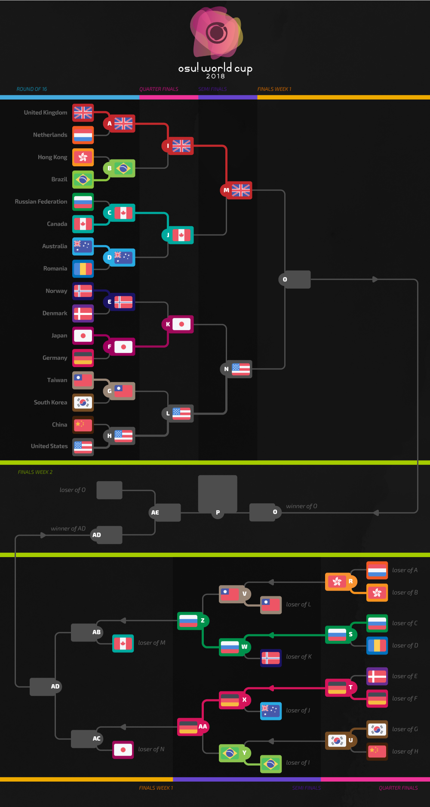

---
tags:
- OWC 2018
- OWC2018
---
# 오스 월드컵 2018

**오스 월드컵 2018**은 다양한 국가들이 참가하는 대회로써 토너먼트 형식으로 진행되고 공식 [osu 팀](/wiki/People/The_Team)이 주최하고 9번째를 맞이하는 대회입니다.

## 대회 일정

| 일정 | 기간 |
| --: | :-- |
| 등록 기간 | 2018-10-13/2018-10-26 |
| 조 추첨식 | 2018-11-04 (14:00 UTC+0) |
| 그룹 스테이지 | 2018-11-10/2018-11-11 |
| 16강 | 2018-11-17/2018-11-18 |
| 8강 | 2018-11-24/2018-11-25 |
| 준결승전 | 2018-12-01/2018-12-02 |
| 결승전 | 2018-12-08/2018-12-09 |
| 최종 결승전 | 2018-12-15/2018-12-16 |

## 상금

이때 까지 열린 월드컵에서 우승한 모든 선수들은 우승 상금과 그에 걸맞는 특별한 상을 받을 자격이 충분합니다. 또한 월드컵을 할 때마다 이러한 항목이 바뀔 수도 있습니다.

| 순위 | 우승 상품 |
| :-: | :-- |
|  | US$300 per team member, exclusive single-run merch, profile badge, "osu! Champion" user title for one year |
|  | US$160 per team member, exclusive single-run merch , profile badge |
|  | US$80 per team member, exclusive single-run merch, profile badge |

## 월드컵 조직도

오스 월드컵 2018에서는 여러 커뮤니티 멤버들이 다양한 분야에 다양한 업무를 분산시켜 운영합니다.

| 직책 | 명단 |
| :-- | :-- |
| 월드컵 매니지먼트 | ![][flag_AR] [juankristal](https://osu.ppy.sh/users/443656), ![][flag_US] [HappyStick](https://osu.ppy.sh/users/256802), ![][flag_NZ] [deadbeat](https://osu.ppy.sh/users/128370) |
| 경기 맵 셀렉터 | ![][flag_BR] [Dada](https://osu.ppy.sh/users/9119507), ![][flag_AU] [Kano](https://osu.ppy.sh/users/3036203), ![][flag_AT] [omgforz](https://osu.ppy.sh/users/578943), ![][flag_US] [\_p0ke\_](https://osu.ppy.sh/users/5434711) |
| 해설 | ![][flag_CA] [Azer](https://osu.ppy.sh/users/2155578), ![][flag_GB] [Bae-](https://osu.ppy.sh/users/6576972), ![][flag_US] [BeasttrollMC](https://osu.ppy.sh/users/3171691), ![][flag_GB] [Bubbleman](https://osu.ppy.sh/users/5182050), ![][flag_US] [Chippy](https://osu.ppy.sh/users/2314115), ![][flag_US] [Dohland](https://osu.ppy.sh/users/5220511), ![][flag_GB] [Doomsday](https://osu.ppy.sh/users/18983), ![][flag_CA] [Evrien](https://osu.ppy.sh/users/791660), ![][flag_US] [Happystick](https://osu.ppy.sh/users/256802), ![][flag_AU] [Kano](https://osu.ppy.sh/users/3036203), ![][flag_AT] [omgforz](https://osu.ppy.sh/users/578943) |
| 심판 | ![][flag_ES] [Deif](https://osu.ppy.sh/users/318565), ![][flag_HK] [mangomizer](https://osu.ppy.sh/users/1893718), ![][flag_DE] [p3n](https://osu.ppy.sh/users/123703), ![][flag_US] [tigereyes144](https://osu.ppy.sh/users/6499811), ![][flag_CL] [WalterToro](https://osu.ppy.sh/users/5281416), ![][flag_GB] [Yazzehh](https://osu.ppy.sh/users/7068973) |
| 통계 | ![][flag_NZ] [deadbeat](https://osu.ppy.sh/users/128370), ![][flag_DE] [Nwolf](https://osu.ppy.sh/users/1910766) |

## 같이 보기

- [토론 스레드](https://osu.ppy.sh/community/forums/topics/815745)
- [생방송으로 시청하기](https://www.twitch.tv/osulive)
- [월드컵 통계 시트](https://goo.gl/sKzcd7)

------------------------------------------------------------------------

## 국가별 선수명단
(국가는 알파벳순 입니다)

| | 국가 | 명단 |
| --: | :-: | :-- |
| ![][flag_AR] | **아르헨티나** | **[Pein](https://osu.ppy.sh/users/2212941)**, [Lexalia](https://osu.ppy.sh/users/1887616), [FastoFreezu](https://osu.ppy.sh/users/3608846), [Serena](https://osu.ppy.sh/users/756068), [Ceja](https://osu.ppy.sh/users/4185921), [Rimi](https://osu.ppy.sh/users/5194834), [LuBren](https://osu.ppy.sh/users/6573651), [Cata](https://osu.ppy.sh/users/5958063) |
| ![][flag_AU] | **호주** | **[GranDSenpai](https://osu.ppy.sh/users/3997580)**, [TheOmyNomy](https://osu.ppy.sh/users/4241054), [Jordan The Bear](https://osu.ppy.sh/users/7477458), [Lunirs](https://osu.ppy.sh/users/2118945), [-Machine-](https://osu.ppy.sh/users/5459981), [Dumii](https://osu.ppy.sh/users/3068044), [Blobby3000](https://osu.ppy.sh/users/6916774), [uyghti](https://osu.ppy.sh/users/3641404) |
| ![][flag_AT] | **오스트리아** | **[goosefedora](https://osu.ppy.sh/users/2323131)**, [Spark-desu](https://osu.ppy.sh/users/4601608), [Micca](https://osu.ppy.sh/users/8179335), [Kizan](https://osu.ppy.sh/users/3074197), [Tomadoi](https://osu.ppy.sh/users/5712451), [Eta Carinae](https://osu.ppy.sh/users/5841333), [Teppi](https://osu.ppy.sh/users/1371974), [Elscar](https://osu.ppy.sh/users/2253511) |
| ![][flag_BE] | **벨기에** | **[Hanori](https://osu.ppy.sh/users/7078544)**, [Yentis](https://osu.ppy.sh/users/345516), [\[Sven\]](https://osu.ppy.sh/users/3695504), [Fblade](https://osu.ppy.sh/users/3168085), [Bastia](https://osu.ppy.sh/users/3355362), [5joshi](https://osu.ppy.sh/users/4279650), [TheKoala](https://osu.ppy.sh/users/3906405), [Badewanne3](https://osu.ppy.sh/users/2211396) |
| ![][flag_BR] | **브라질** | **[MouseEasy](https://osu.ppy.sh/users/1558603)**, [My Angelsim](https://osu.ppy.sh/users/3149577), [Polaco](https://osu.ppy.sh/users/1057782), [Mystia](https://osu.ppy.sh/users/4277702), [Niii-san](https://osu.ppy.sh/users/5403374), [Akane Hime](https://osu.ppy.sh/users/6772887), [Yuuzinho](https://osu.ppy.sh/users/6267851), [Sickoh](https://osu.ppy.sh/users/5411474) |
| ![][flag_CA] | **캐나다** | **[Azer](https://osu.ppy.sh/users/2155578)**, [\_RyuK](https://osu.ppy.sh/users/6304246), [Squapple](https://osu.ppy.sh/users/6826036), [VINXIS](https://osu.ppy.sh/users/4323406), [Stoof](https://osu.ppy.sh/users/4916057), [Eddie-](https://osu.ppy.sh/users/3898396), [trevrasher](https://osu.ppy.sh/users/3893420), [Yuuki-chan](https://osu.ppy.sh/users/7031287) |
| ![][flag_CL] | **칠레** | **[Danidesu](https://osu.ppy.sh/users/2748187)**, [Mathi](https://osu.ppy.sh/users/5339515), [xaxreid](https://osu.ppy.sh/users/4227431), [\[-Neon-\]](https://osu.ppy.sh/users/6064382), [Criss](https://osu.ppy.sh/users/3188017), [TheDaqox](https://osu.ppy.sh/users/7701428), [Hellbeak](https://osu.ppy.sh/users/2367495), [Yumbtah](https://osu.ppy.sh/users/2784663) |
| ![][flag_CN] | **중국** | **[MatsumotoRise](https://osu.ppy.sh/users/672726)**, [DomenCherry](https://osu.ppy.sh/users/665367), [Dsan](https://osu.ppy.sh/users/1266166), [Crystal](https://osu.ppy.sh/users/1646397), [Start](https://osu.ppy.sh/users/2190156), [EmertxE](https://osu.ppy.sh/users/954557), [GGBY](https://osu.ppy.sh/users/629717), [MyAngelMiku](https://osu.ppy.sh/users/7025429) |
| ![][flag_CZ] | **칠레** | **[Swatty](https://osu.ppy.sh/users/1028683)**, [Electrovoid](https://osu.ppy.sh/users/3853840), [VilaZ](https://osu.ppy.sh/users/5155680), [Avenito](https://osu.ppy.sh/users/7415910), [Reegi](https://osu.ppy.sh/users/3396496), [BLooDBuRSTiNG](https://osu.ppy.sh/users/3925167), [- Daichi -](https://osu.ppy.sh/users/6602580), [kolgar](https://osu.ppy.sh/users/3123488) |
| ![][flag_DK] | **덴마크** | **[Spork Lover](https://osu.ppy.sh/users/3417469)**, [raser1234](https://osu.ppy.sh/users/2527887), [waefwerf](https://osu.ppy.sh/users/3868653), [My Aim Zogs](https://osu.ppy.sh/users/3722715), [Telomere](https://osu.ppy.sh/users/6295380), [Vandabe](https://osu.ppy.sh/users/7050754), [Cerkie](https://osu.ppy.sh/users/2533400), [Katachi](https://osu.ppy.sh/users/5778925) |
| ![][flag_FI] | **필란드** | **[Nyanaro](https://osu.ppy.sh/users/4157611)**, [Wucki](https://osu.ppy.sh/users/5287410), [Dragonmob](https://osu.ppy.sh/users/4990193), [Sonoda-Umi](https://osu.ppy.sh/users/2197711), [Muuki](https://osu.ppy.sh/users/2482261), [Bolek\_gamer\_05](https://osu.ppy.sh/users/7786382), [Jup3KW](https://osu.ppy.sh/users/5424170), [Jantsi](https://osu.ppy.sh/users/1644225) |
| ![][flag_FR] | **프랑스** | **[ThePooN](https://osu.ppy.sh/users/718454)**, [mrzomb](https://osu.ppy.sh/users/1694887), [NerO](https://osu.ppy.sh/users/1545031), [Musty](https://osu.ppy.sh/users/251683), [Oxia](https://osu.ppy.sh/users/1825928), [Mooha](https://osu.ppy.sh/users/2705430), [ElektroFire](https://osu.ppy.sh/users/2467220), [-raizen-](https://osu.ppy.sh/users/3872987) |
| ![][flag_DE] | **독일** | **[Dustice](https://osu.ppy.sh/users/754565)**, [hallowatcher](https://osu.ppy.sh/users/1874761), [imagaK](https://osu.ppy.sh/users/2022445), [Risiing](https://osu.ppy.sh/users/2282047), [Knalli](https://osu.ppy.sh/users/8147403), [okinamo](https://osu.ppy.sh/users/3765989), [Umbre](https://osu.ppy.sh/users/2766034), [BlueSky-](https://osu.ppy.sh/users/6410154) |
| ![][flag_HK] | **홍콩** | **[- G I D Z -](https://osu.ppy.sh/users/2286528)**, [Saku-](https://osu.ppy.sh/users/4720411), [Chaoslitz](https://osu.ppy.sh/users/3621552), [mcy3012](https://osu.ppy.sh/users/4787843), [SkyzWai-](https://osu.ppy.sh/users/2353581), [Hicool](https://osu.ppy.sh/users/1639250), [-N a n a k o-](https://osu.ppy.sh/users/1407516) |
| ![][flag_ID] | **인도네시아** | **[smh](https://osu.ppy.sh/users/1629553)**, [Fuma](https://osu.ppy.sh/users/1501956), [dika312](https://osu.ppy.sh/users/741613), [Agouka](https://osu.ppy.sh/users/9606647), [Rexeez](https://osu.ppy.sh/users/1987591), [Reyuza](https://osu.ppy.sh/users/2454767), [Skydiver](https://osu.ppy.sh/users/4750008), [LoidKun](https://osu.ppy.sh/users/6437601) |
| ![][flag_IT] | **이탈리아** | **[Koba](https://osu.ppy.sh/users/4448118)**, [Paski](https://osu.ppy.sh/users/9849712), [Spazza17](https://osu.ppy.sh/users/3516241), [Kayne](https://osu.ppy.sh/users/1474421), [NekoFunfo](https://osu.ppy.sh/users/1646427), [SIMONETRAPANI](https://osu.ppy.sh/users/7329177), [Daren](https://osu.ppy.sh/users/4704608), [Kiirochii](https://osu.ppy.sh/users/6387149) |
| ![][flag_JP] | **일본** | **[Shirasaka Koume](https://osu.ppy.sh/users/3062998)**, [gasanww](https://osu.ppy.sh/users/487985), [benki](https://osu.ppy.sh/users/1021944), [Delis](https://osu.ppy.sh/users/1603923), [Vento](https://osu.ppy.sh/users/4796794), [a\_Blue](https://osu.ppy.sh/users/5645667), [Varvalian](https://osu.ppy.sh/users/3345902), [Angel Arrow](https://osu.ppy.sh/users/1970239) |
| ![][flag_MX] | **멕시코** | **[Atsuro](https://osu.ppy.sh/users/2279351)**, [LopezzPro](https://osu.ppy.sh/users/2553519), [Lynx-](https://osu.ppy.sh/users/7301672), [KevstracK](https://osu.ppy.sh/users/5325213), [[Riot]](https://osu.ppy.sh/users/4256461), [-Hebel-](https://osu.ppy.sh/users/6169483), [-Wolfy-](https://osu.ppy.sh/users/4497582), [Flameshock](https://osu.ppy.sh/users/8349047) |
| ![][flag_NL] | **네덜란드** | **[Viveliam](https://osu.ppy.sh/users/3506793)**, [n0ah](https://osu.ppy.sh/users/3086393), [phalanx](https://osu.ppy.sh/users/4696315), [GladiOpa](https://osu.ppy.sh/users/23326), [taku](https://osu.ppy.sh/users/684433), [jackylam5](https://osu.ppy.sh/users/1540807), [Damnjelly](https://osu.ppy.sh/users/1666355), [Ahmnesia](https://osu.ppy.sh/users/2715937) |
| ![][flag_NO] | **노르웨이** | **[Hundur](https://osu.ppy.sh/users/3145033)**, [-GN](https://osu.ppy.sh/users/895581), [Sebu](https://osu.ppy.sh/users/3990173), [YokesPai](https://osu.ppy.sh/users/6399568), [ItsKevZii](https://osu.ppy.sh/users/5201225), [Afrodafro](https://osu.ppy.sh/users/3551255), [CXu](https://osu.ppy.sh/users/84841), [ZeCryptic](https://osu.ppy.sh/users/3381441) |
| ![][flag_PL] | **폴란드** | **[MrBooM](https://osu.ppy.sh/users/1837989)**, [Rafis](https://osu.ppy.sh/users/2558286), [WubWoofWolf](https://osu.ppy.sh/users/39828), [Piggey](https://osu.ppy.sh/users/4163860), [Alien](https://osu.ppy.sh/users/4743869), [Astar](https://osu.ppy.sh/users/27055), [Wakson](https://osu.ppy.sh/users/3048222), [Bartek22830](https://osu.ppy.sh/users/6404027) |
| ![][flag_RO] | **루마니아** | **[badeu](https://osu.ppy.sh/users/1473890)**, [vuru](https://osu.ppy.sh/users/7432712), [\_thicke](https://osu.ppy.sh/users/8334445), [Chiu](https://osu.ppy.sh/users/3148900), [KromaRO](https://osu.ppy.sh/users/7543723), [eternum](https://osu.ppy.sh/users/4581069), [roliy](https://osu.ppy.sh/users/9578404), [Rohulk](https://osu.ppy.sh/users/3219026) |
| ![][flag_RU] | **러시아** | **[follon](https://osu.ppy.sh/users/3973474)**, [AxewB](https://osu.ppy.sh/users/4928776), [Alumetri](https://osu.ppy.sh/users/5371497), [Red\_Pixel](https://osu.ppy.sh/users/4170932), [Aden](https://osu.ppy.sh/users/4342841), [neko ds](https://osu.ppy.sh/users/4688735), [Okinotori](https://osu.ppy.sh/users/4346274), [talala](https://osu.ppy.sh/users/1389663) |
| ![][flag_SG] | **싱가포르** | **[M4-K1](https://osu.ppy.sh/users/5210595)**, [GSBlank](https://osu.ppy.sh/users/2312106), [Cleveland](https://osu.ppy.sh/users/5104320), [Rtyzen](https://osu.ppy.sh/users/2439822),  [Emilia](https://osu.ppy.sh/users/2003326), [Loslite](https://osu.ppy.sh/users/6398160), [\[-Lockon-\]](https://osu.ppy.sh/users/6726331), [Raindrop](https://osu.ppy.sh/users/1155871) |
| ![][flag_SK] | **슬로바키아** | **[Hranolka](https://osu.ppy.sh/users/6149947)**, [AtHeoN](https://osu.ppy.sh/users/1770367), [andrejus77](https://osu.ppy.sh/users/2463937), [SneakY NickY](https://osu.ppy.sh/users/8847379), [Tikef](https://osu.ppy.sh/users/9149213), [PemiX](https://osu.ppy.sh/users/6974470), [PeteX](https://osu.ppy.sh/users/1285945), [Nikolas](https://osu.ppy.sh/users/7759641) |
| ![][flag_KR] | **대한민국** | **[Gomo Pslvarh](https://osu.ppy.sh/users/1206417)**, [Karuna](https://osu.ppy.sh/users/8775024), [FlyingTuna](https://osu.ppy.sh/users/9224078), [Cellina](https://osu.ppy.sh/users/2490770), [[KOR]Rem](https://osu.ppy.sh/users/5538115), [eoehd1ek](https://osu.ppy.sh/users/3938876), [Qu1z](https://osu.ppy.sh/users/526851), [AvA Pacifica](https://osu.ppy.sh/users/7058132) |
| ![][flag_ES] | **스페인** | **[ByYoshi14](https://osu.ppy.sh/users/4470553)**, [kazamabc](https://osu.ppy.sh/users/6937470), [Betwin](https://osu.ppy.sh/users/1968481), [insomnyawolf](https://osu.ppy.sh/users/5337801), [Moewagon](https://osu.ppy.sh/users/5764169), [Mortal](https://osu.ppy.sh/users/4759050), [Frosiito](https://osu.ppy.sh/users/6462387), [Rekens](https://osu.ppy.sh/users/1073575) |
| ![][flag_SE] | **스웨덴** | **[fcuk](https://osu.ppy.sh/users/4844909)**, [Nitroz](https://osu.ppy.sh/users/5256529), [Chronomarly](https://osu.ppy.sh/users/4991464), [N0vy](https://osu.ppy.sh/users/4003726), [Sonix](https://osu.ppy.sh/users/4029000), [- Carl -](https://osu.ppy.sh/users/2140681), [Asoreand](https://osu.ppy.sh/users/6374167), [Reedkatt](https://osu.ppy.sh/users/8335950) |
| ![][flag_TW] | **대만** | **[Shiina Noriko](https://osu.ppy.sh/users/1285637)**, [Flask](https://osu.ppy.sh/users/959763), [\_Shield](https://osu.ppy.sh/users/1860489), [\[ Zane \]](https://osu.ppy.sh/users/3517706), [CrtReXn](https://osu.ppy.sh/users/1810239), [Rizer](https://osu.ppy.sh/users/5155973), [DazzLE_Wind](https://osu.ppy.sh/users/2537924), [GfMRT](https://osu.ppy.sh/users/3163649) |
| ![][flag_TH] | **태국** | **[- Phantasma -](https://osu.ppy.sh/users/1427407)**, [Applause](https://osu.ppy.sh/users/1832711), [NonxE](https://osu.ppy.sh/users/319312), [Deppyforce](https://osu.ppy.sh/users/5286213), [Mikkuri](https://osu.ppy.sh/users/317494), [Chorus](https://osu.ppy.sh/users/3504692), [redcrosssix](https://osu.ppy.sh/users/2554965), [i hate myself](https://osu.ppy.sh/users/5332553) |
| ![][flag_GB] | **영국** | **[Bubbleman](https://osu.ppy.sh/users/5182050)**,  [Doomsday](https://osu.ppy.sh/users/18983), [OPJames](https://osu.ppy.sh/users/4117142), [Spare](https://osu.ppy.sh/users/2204373), [MoeYandere](https://osu.ppy.sh/users/2565902), [SoraRoxas01](https://osu.ppy.sh/users/1986262), [Karthy](https://osu.ppy.sh/users/4196808), [Jameslike](https://osu.ppy.sh/users/2415743)|
| ![][flag_US] | **미국** | **[Apraxia](https://osu.ppy.sh/users/4194445)**, [Toy](https://osu.ppy.sh/users/2757689), [Monko2k](https://osu.ppy.sh/users/4852013), [fieryrage](https://osu.ppy.sh/users/3533958), [DigitalHypno](https://osu.ppy.sh/users/4384207), [Vaxei](https://osu.ppy.sh/users/4787150), [he rack](https://osu.ppy.sh/users/2644828), [idke](https://osu.ppy.sh/users/4650315) |

------------------------------------------------------------------------

------------------------------------------------------------------------

## 경기 일정: 결승전

### 2018년 12월 8일 토요일

| 팀 A |  |  | 팀 B | 경기 시간 | 팀 A 지역 시간 | 팀 B 지역 시간 |  |
| --: | --: | :-- | :-- | :-: | :-: | :-: | :-: |
| 러시아 | ![][flag_RU] | ![][flag_CA] | 캐나다 | **17:00 UTC** | 22:00 UTC+05 | 12:00 UTC-05 | ² |

### 2018년 12월 9일 일요일

| 팀 A |  |  | 팀 B | 경기 시간 | 팀 A 지역 시간 | 팀 B 지역 시간 |  |
| --: | --: | :-- | :-- | :-: | :-: | :-: | :-: |
| 독일 | ![][flag_DE] | ![][flag_JP] | 일본 | **10:00 UTC** | 11:00 UTC+01 | 19:00 UTC+09 | ² |
| 러시아 | ![][flag_RU] | ![][flag_JP] | 일본 | **16:00 UTC** | 21:00 UTC+05 | 1:00 (Mon) UTC+09 | ³ |
| 캐나다 | ![][flag_CA] | ![][flag_JP] | 일본 | **16:00 UTC** | 11:00 UTC-05 | 1:00 (Mon) UTC+09 | ³ |
| 러시아 | ![][flag_RU] | ![][flag_DE] | 독일 | **18:00 UTC** | 23:00 UTC+05 | 19:00 UTC+01 | ³ |
| 캐나다 | ![][flag_CA] | ![][flag_DE] | 독일 | **18:00 UTC** | 13:00 UTC-05 | 19:00 UTC+01 | ³ |
| 영국 | ![][flag_GB] | ![][flag_US] | 미국 | **20:00 UTC** | 20:00 UTC | 15:00 UTC-05 | ¹ |

¹ 승자전 경기
 
² 패자전 경기

³ 패자조 경기에 의해 경기가 결정됨

------------------------------------------------------------------------

## 월드컵 비트맵풀

### 결승전

 **[여기에서 한번에 다운받을 수 있어요! (116 MB)](https://mega.nz/#!xolFEKQA!g-4E-q-mVCaKWa3XdpefZ67UhOncE3vnWVz6D_LX4PY)**
 
 - 노 모드
	- [jioyi - Platinum \(09kami\) \[tyui's Extra\]](https://osu.ppy.sh/beatmapsets/449225#osu/1093629)
	- [Mitsuki Nakae - Ouka Enbu \(Lasse\) \[Petal\]](https://osu.ppy.sh/beatmapsets/688552#osu/1457104)
	- [Toromaru - Enigma \(Avena\) \[Ultra\]](https://osu.ppy.sh/beatmapsets/460380#osu/986939)
	- [yuikonnu - Kakushigoto \(AtHeoN\) \[Distant Memory\]](https://osu.ppy.sh/beatmapsets/436177#osu/939618)
	- [sakuraburst - SHA \(handsome\) \[Master\]](https://osu.ppy.sh/beatmapsets/716390#osu/1513541)
- 히든
	- [paranoid void - Utsukushii Kodoku \(dsco\) \[Escapism\]](https://osu.ppy.sh/beatmapsets/777597#osu/1633534)
	- [toby fox - Spider Dance \(Fatfan Kolek\) \[Snow Note's Extreme\]](https://osu.ppy.sh/beatmapsets/750458#osu/1584604)
	- [Akiyama Uni - Broken Moon \(sahuang\) \[Regou's Extra\]](https://osu.ppy.sh/beatmapsets/643391#osu/1389956)
- 하드락
	- [Team.NEKOKAN - Airman ga Taosenai \(Sotarks\) \[Mir's Extra\]](https://osu.ppy.sh/beatmapsets/732994#osu/1563445)
	- [Renard - Terminal \(nold\_1702\) \[EXTRA\]](https://osu.ppy.sh/beatmapsets/102282#osu/270490)
	- [Jun Kuroda & AAAA - Cygnus \(Rohit6\) \[BLACK ANOTHER\]](https://osu.ppy.sh/beatmapsets/358056#osu/888465)
- 더블 타임
	- [Atoguru - Itoshi Kimi wo Mitsuke ni \(bakabaka\) \[Insane\]](https://osu.ppy.sh/beatmapsets/29044#osu/96523)
	- [senya - Zouka de Arou to Shita Mono \(Satellite\) \[Ancients\]](https://osu.ppy.sh/beatmapsets/495283#osu/1054400)
	- [Mei Ayakura - Romantic Fall \(felys\) \[Longing thoughts dyed in crimson\]](https://osu.ppy.sh/beatmapsets/637934#osu/1353352)
- 모드 자유
	- [Camellia as "Reverse of Riot" - Completeness Under Incompleteness \(Regou\) \[RLC's INFINITE\]](https://osu.ppy.sh/beatmapsets/514750#osu/1094551)
	- [A.SAKA - Nanatsu Koyoto \(xLolicore-\) \[Kawa's Extra\]](https://osu.ppy.sh/beatmapsets/768281#osu/1618445)
	- [UNDEAD CORPORATION - Everything will freeze \(Ekoro\) \[Extra\]](https://osu.ppy.sh/beatmapsets/158023#osu/552068)
- TieBreaker
	- **[Unlucky Morpheus - Angreifer \(IsomirDiAngelo\) \[Das Gemetzel der rotblutfressenden Bestien\]](https://osu.ppy.sh/beatmapsets/868543#osu/1815397)**

### 준결승

**[여기에서 한번에 다운받을 수 있어요! (120 MB)](https://mega.nz/#!GP4UmKAB!H4qmc4z9GawNni2wV0Ykmq1BtPPN6ctQ_btQ4RJE-nM)**

- 노 모드
	- [USAO - Boss Rush \(Lavender\) \[Moecho's Blitz Surge Extra\]](https://osu.ppy.sh/beatmapsets/619807#osu/1306399)
	- [LeaF - Paraclete \(Kroytz\) \[Extra\]](https://osu.ppy.sh/beatmapsets/455109#osu/977875)
	- [Nekomata Master - Nekozamurai no Gyakushu \(moph\) \[Extreme\]](https://osu.ppy.sh/beatmapsets/518743#osu/1426926)
	- [ABSOLUTE CASTAWAY - Shinsou Shintouron \(Lasse\) \[Petal\]](https://osu.ppy.sh/beatmapsets/827743#osu/1734403)
	- [Y&Co. - Daisuke \(kwk\) \[moph's Expert\]](https://osu.ppy.sh/beatmapsets/697087#osu/1481149)
- 히든
	- [Hommarju - Rock It \(toybot\) \[Blast Off\]](https://osu.ppy.sh/beatmapsets/700421#osu/1484308)
	- [Makai Toshi Niigata - Ukiyo-e Yokochou \(Suzuki\_1112\) \[Brew\]](https://osu.ppy.sh/beatmapsets/713506#osu/1508083)
	- [Seeed - Ding \(IceKalt\) \[Deramok's Hidden Extra\]](https://osu.ppy.sh/beatmapsets/727333#osu/1570419)
- 하드락
	- [Dreamcatcher - Full Moon \(Natsu\) \[Moonlight\]](https://osu.ppy.sh/beatmapsets/721842#osu/1524183)
	- [onoken - K8107 \(MaridiuS\) \[DeviousPanda's Extra\]](https://osu.ppy.sh/beatmapsets/807396#osu/1704553)
	- [DJ Totoriott - Arcanos \(Holoaz\) \[Insane\]](https://osu.ppy.sh/beatmapsets/136333#osu/341217)
- 더블 타임
	- [zts - miragecoordinator \(Mirash\) \[Insane\]](https://osu.ppy.sh/beatmapsets/652668#osu/1383875)
	- [FELT - Story \(Yohanes\) \[Lunatic\]](https://osu.ppy.sh/beatmapsets/297409#osu/944709)
	- [DystopiaGround - True Theory of Inheritance \(Ignacio\) \[Insane\]](https://osu.ppy.sh/beatmapsets/24477#osu/83215)
- 모드 자유
	- [antiPLUR - Speed of Link \(ktgster\) \[100 000 000m/s\]](https://osu.ppy.sh/beatmapsets/359173#osu/794779)
	- [Yousei Teikoku - Mischievous of Alice \(Delis\) \[Extreme\]](https://osu.ppy.sh/beatmapsets/623960#osu/1315116)
	- [forestpireo - Kanojo Ga Ichiban Shoujo Nanoka? \(Teara\) \[KIRBY Mix\]](https://osu.ppy.sh/beatmapsets/11773#osu/50845)
- 승자 결정전
	- **[Team Grimoire - C18H27NO3\(extend\) \(Kloyd\) \[Volcanic\]](https://osu.ppy.sh/beatmapsets/375706#osu/822765)**

### 8강

**[여기에서 한번에 다운받을 수 있어요! (109 MB)](https://mega.nz/#!qbQ1hKpZ!2_emp6STvj3yDjkp40PMR_uqBMizPx3F3f1mTZsHAbc)**

- 노 모드
	- [xi - Aragami \(Sayaka-\) \[Death\]](https://osu.ppy.sh/beatmapsets/225377#osu/526757)
	- [TrySail - High Free Spirits \(Vert\) \[Haifuri\]](https://osu.ppy.sh/beatmapsets/455011#osu/975385)
	- [YURRY CANON - Nadeshiko color Heart \(kwk\) \[Saturnalize's Extra\]](https://osu.ppy.sh/beatmapsets/682996#osu/1463294)
	- [Memme - Pandemonium \(sdafsf\) \[Neil's Extra: #6\]](https://osu.ppy.sh/beatmapsets/734190#osu/1575929)
- 히든
	- [MYTH & ROID - Paradisus-Paradoxum \(Cellina\) \[Curi's Extreme\]](https://osu.ppy.sh/beatmapsets/510183#osu/1113057)
	- [Camellia - Introduction - ENTRANS OF DA JUNGLE \(-PC\) \[Welcome to the Jungle\]](https://osu.ppy.sh/beatmapsets/700968#osu/1483766)
	- [SHK - Identity Part III \(ktgster\) \[SHD\]](https://osu.ppy.sh/beatmapsets/280329#osu/634351)
- 하드락
	- [Eiko Shimamiya - Higurashi no Naku Koro ni \(Okorin\) \[Onikakushi\]](https://osu.ppy.sh/beatmapsets/333543#osu/764014)
	- [TOTTO - Wadatsumi \(Desperate-kun\) \[Snaggle's Insane\]](https://osu.ppy.sh/beatmapsets/351828#osu/775365)
	- [dj TAKA - Hollywood Galaxy \(Megurine Luka\) \[Extreme\]](https://osu.ppy.sh/beatmapsets/48196#osu/150116)
- 더블 타임
	- [Nightwish - Bye Bye Beautiful \(neonat\) \[Shiro's Insane\]](https://osu.ppy.sh/beatmapsets/133884#osu/372326)
	- [senya - Saihate no Kotoba \(Satellite\) \[Ghostly\]](https://osu.ppy.sh/beatmapsets/174417#osu/905424)
	- [REDALiCE - Selfish \(happy30\) \[Lunatic\]](https://osu.ppy.sh/beatmapsets/28060#osu/105531)
- 모드 자유
	- [JUNNA - Here \(Mirash\) \[Extra\]](https://osu.ppy.sh/beatmapsets/737103#osu/1555562)
	- [Renard - TU4AR \(Mercurius\) \[Nogard\]](https://osu.ppy.sh/beatmapsets/28997#osu/97934)
	- [Ito Kashitaro x Lon - Soushi Sou Ai \(Anishina Kodoku\) \[Tatemae\]](https://osu.ppy.sh/beatmapsets/669776#osu/1647044)
- 승자 결정전
	- **[TRakker - Countdown to the Blue \(Lasse\) \[Dusk\]](https://osu.ppy.sh/beatmapsets/614248#osu/1295837)**

### 16강

**[여기에서 한번에 다운받을 수 있어요! (114 MB)](https://mega.nz/#!SHBSACzI!gdAciJN3WfN_iCpkOqLC5sL5OGzkhCX1j0k-zafgyy4)**

- 노 모드
	- [nowisee - confusion \(hot anime girl\) \[Fearful Star Extra\]](https://osu.ppy.sh/beatmapsets/720882#osu/1522329)
	- [BlackYooh vs. siromaru - BLACK or WHITE? \(BluOxy\) \[MASTER\]](https://osu.ppy.sh/beatmapsets/248876#osu/635679)
	- [Street - Maritime Police \(Mir\) \[Marigold\]](https://osu.ppy.sh/beatmapsets/681410#osu/1440743)
	- [YUC'e - Sengoku HOP \(Nathan\) \[Gamu's Extra\]](https://osu.ppy.sh/beatmapsets/564329#osu/1475812)
- 히든
	- [Manasora Akiha, Tokika - Toukasa Funtouki!~ Rakutoferin no Hate e ~ \(fanzhen0019\) \[Lunatic\]](https://osu.ppy.sh/beatmapsets/43170#osu/137303)
	- [Demetori - U.N. Owen wa Kanojo nanoka? \(Louis Cyphre\) \[Unknown\]](https://osu.ppy.sh/beatmapsets/42247#osu/844718)
	- [Sharlo - Eisou Youga \~Meikyou Shisui\~ \(Sharlo\) \[Skystar's Extreme\]](https://osu.ppy.sh/beatmapsets/380740#osu/931853)
- 하드락
	- [Rise Against - Whereabouts Unknown \(Milan-\) \[pishi's Extra\]](https://osu.ppy.sh/beatmapsets/327188#osu/729829)
	- [Foreground Eclipse - To The Terminus \(Giralda\) \[RLC's Extra\]](https://osu.ppy.sh/beatmapsets/277481#osu/628753)
	- [solfa feat. Shimotsuki Haruka - leap in your mind \(Lasse\) \[Expert\]](https://osu.ppy.sh/beatmapsets/818672#osu/1718542)
- 더블타임
	- [zts - the executioner \(-kevincela-\) \[Insane\]](https://osu.ppy.sh/beatmapsets/342360#osu/756752)
	- [petit milady - Ma Cherie \(Andrea\) \[Lovers\]](https://osu.ppy.sh/beatmapsets/255481#osu/585605)
	- [Zeng Zhihao - Fu Yun Ben Lang \(jonathanlfj\) \[Insane\]](https://osu.ppy.sh/beatmapsets/89673#osu/243644)
- 모드 자유
	- [Manami Numakura - Climber's High! \(Zero\_\_wind\) \[Wind\]](https://osu.ppy.sh/beatmapsets/574214#osu/1216208)
	- [Inspector K - Disconnected Hardkore \(CanBlaster Remix\) \(7odoa\) \[Insane\]](https://osu.ppy.sh/beatmapsets/30485#osu/100627)
	- [Umeboshi Chazuke - Owari to Hajimari no Oto \(Azzedd\) \[Batt's Extra\]](https://osu.ppy.sh/beatmapsets/739551#osu/1570760)
- 승자 결정전
	- **[Dark PHOENiX - Ryokugan no Jealousy \(EvilElvis\) \[Monster with Green Eyes\]](https://osu.ppy.sh/beatmapsets/382455#osu/836339)**

### 그룹 스테이지

**[여기에서 한번에 다운받을 수 있어요! (91 MB)](https://mega.nz/#!qLphFAoZ!eXLEe01i9mnPHqi5ebqGcSVQkK6nCqha8krm3MdhlXA)**

- 노 모드
	- [nano - DREAMCATCHER \(Vert\) \[Depths' Starlight Future Extra\]](https://osu.ppy.sh/beatmapsets/695957#osu/1532896)
	- [P\*Light - YELLOW SPLASH!! \(Minakami Yuki\) \[Guy's Extra\]](https://osu.ppy.sh/beatmapsets/363882#osu/800947)
	- [Duoscience - Indifferences \(Mir\) \[Senseless\]](https://osu.ppy.sh/beatmapsets/722662#osu/1538480)
	- [Zips - Reiwai Terrorism \(Broccoly\) \[Distortion\]](https://osu.ppy.sh/beatmapsets/101953#osu/269773)
- 히든
	- [nmk - sola \(Morinaga\) \[Down's Extra\]](https://osu.ppy.sh/beatmapsets/723024#osu/1528254)
	- [Pendulum - Crush \(Radio Edit\) \(JauiPlaY\) \[Insane\]](https://osu.ppy.sh/beatmapsets/58329#osu/175397)
- 하드락
	- [ONE OK ROCK - Clock Strikes \(Saut\) \[Insane\]](https://osu.ppy.sh/beatmapsets/249624#osu/633373)
	- [orangentle - HAELEQUIN \(Gamu\) \[toybot's Insane\]](https://osu.ppy.sh/beatmapsets/291495#osu/757386)
- 더블 타임
	- [Younha - Houkiboshi \(Seto Kousuke\) \[Insane\]](https://osu.ppy.sh/beatmapsets/779541#osu/1636976)
	- [Marie & Shimotsuki Haruka - Hane no Naki Chou \(KanbeKotori\) \[Insane\]](https://osu.ppy.sh/beatmapsets/35666#osu/115457)
- 모드 자유
	- [Morimori Atsushi - Tits or get the fuck out!! \(Regou\) \[Frey's Insane!!\]](https://osu.ppy.sh/beatmapsets/455022#osu/992223)
	- [DevilishP feat.GUMI - Yume Maboroshi \(Natsu\) \[Fantasy\]](https://osu.ppy.sh/beatmapsets/325340#osu/722674)
- 승자 결정전
	- **[SawanoHiroyuki\[nZk\]:Gemie - x.U. \(ETIA. Hardcore Bootleg Remix\) \(captin1\) \[Shinoa\]](https://osu.ppy.sh/beatmapsets/331872#osu/735021)**

------------------------------------------------------------------------

## 경기 결과

### 준결승전

| 2018-12-01 토요일 | | | | |
| ---: | :---: | :---: | :--- | :---: |
| 홍콩 ![][flag_HK] | 3 | 7 | ![][flag_TW] 대만 | [#1](https://osu.ppy.sh/community/matches/47795151) |
| 독일 ![][flag_DE] | 7 | 4 | ![][flag_AU] 호주 | [#1](https://osu.ppy.sh/community/matches/47796992) |
| 대한민국 ![][flag_KR] | 4 | 7 | ![][flag_BR] 브라질 | [#1](https://osu.ppy.sh/community/matches/47799551) |
| 러시아 ![][flag_RU] | 7 | 4 | ![][flag_NO] 노르웨이 | [#1](https://osu.ppy.sh/community/matches/47802651) |

| 2018-12-02 일요일 | | | | |
| ---: | :---: | :---: | :--- | :---: |
| 일본 ![][flag_JP] | 2 | 7 | ![][flag_US] 미국 | [#1](https://osu.ppy.sh/community/matches/47822484) |
| 대만 ![][flag_TW] | 2 | 7 | ![][flag_RU] 러시아 | [#1](https://osu.ppy.sh/community/matches/47830929) |
| 독일 ![][flag_DE] | 7 | 0 | ![][flag_BR] 브라질 | [#1](https://osu.ppy.sh/community/matches/47836633) |
| 영국 ![][flag_GB] | 7 | 1 | ![][flag_CA] 캐나다 | [#1](https://osu.ppy.sh/community/matches/47839526) |

### 8강

| 2018-11-24 토요일 | | | | |
| ---: | :---: | :---: | :--- | :---: |
| 노르웨이 ![][flag_NO] | 1 | 6 | ![][flag_JP] 일본 | [#1](https://osu.ppy.sh/community/matches/47644041) |
| 네덜란드 ![][flag_NL] | 4 | 6 | ![][flag_HK] 홍콩 | [#1](https://osu.ppy.sh/community/matches/47646337) |
| 캐나다 ![][flag_CA] | 6 | 5 | ![][flag_AU] 호주 | [#1](https://osu.ppy.sh/community/matches/47648923) |

| 2018-11-25 일요일 | | | | |
| ---: | :---: | :---: | :--- | :---: |
| 대만 ![][flag_TW] | 0 | 6 | ![][flag_US] 미국 | [#1](https://osu.ppy.sh/community/matches/47665462) |
| 대한민국 ![][flag_KR] | 6 | 3 | ![][flag_CN] 중국 | [#1](https://osu.ppy.sh/community/matches/47666758) |
| 러시아 ![][flag_RU] | 6 | 2 | ![][flag_RO] 루마니아 | [#1](https://osu.ppy.sh/community/matches/47675513) |
| 덴마크 ![][flag_DK] | 2 | 6 | ![][flag_DE] 독일 | [#1](https://osu.ppy.sh/community/matches/47677802) |
| 영국 ![][flag_GB] | 6 | 0 | ![][flag_BR] 브라질 | [#1](https://osu.ppy.sh/community/matches/47679899) |

### 16강

| 2018-11-17 토요일 | | | | |
| ---: | :---: | :---: | :--- | :---: |
| 일본 ![][flag_JP] | 6 | 3 | ![][flag_DE] 독일 | [#1](https://osu.ppy.sh/community/matches/47484224) |
| 대만 ![][flag_TW] | 6 | 4 | ![][flag_KR] 대한민국 | [#1](https://osu.ppy.sh/community/matches/47486476) |
| 홍콩 ![][flag_HK] | 3 | 6 | ![][flag_BR] 브라질 | [#1](https://osu.ppy.sh/community/matches/47489590) |

| 2018-11-18 일요일 | | | | |
| ---: | :---: | :---: | :--- | :---: |
| 중국 ![][flag_CN] | 0 | 6 | ![][flag_US] 미국 | [#1](https://osu.ppy.sh/community/matches/47507818) |
| 호주 ![][flag_AU] | 6 | 3 | ![][flag_RO] 루마니아 | [#1](https://osu.ppy.sh/community/matches/47514469) |
| 노르웨이 ![][flag_NO] | 6 | 5 | ![][flag_DK] 덴마크 | [#1](https://osu.ppy.sh/community/matches/47516309) |
| 영국 ![][flag_GB] | 6 | 4 | ![][flag_NL] 네덜란드 | [#1](https://osu.ppy.sh/community/matches/47518299) |
| 러시아 ![][flag_RU] | 3 | 6 | ![][flag_CA] 캐나다 | [#1](https://osu.ppy.sh/community/matches/47521221) |

### 그룹 스테이지

| 2018-11-10 토요일 | | | | |
| ---: | :---: | :---: | :--- | :---: |
| 노르웨이 ![][flag_NO] | 0 | 5 | ![][flag_AU] 호주 | [#1](https://osu.ppy.sh/community/matches/47325334) |
| 벨기에 ![][flag_BE] | 1 | 5 | ![][flag_KR] 대한민국 | [#1](https://osu.ppy.sh/community/matches/47326358) |
| 스웨덴 ![][flag_SE] | 2 | 5 | ![][flag_ID] 인도네시아 | [#1](https://osu.ppy.sh/community/matches/47326352) |
| 슬로바키아 ![][flag_SK] | 0 | 5 | ![][flag_CN] 중국 | [#1](https://osu.ppy.sh/community/matches/47327826) |
| 홍콩 ![][flag_HK] | 5 | 1 | ![][flag_FR] 프랑스 | [#1](https://osu.ppy.sh/community/matches/47327676) |
| 대한민국 ![][flag_KR] | 5 | 0 | ![][flag_BR] 브라질 | [#1](https://osu.ppy.sh/community/matches/47327716) |
| 체코 ![][flag_CZ] | 0 | 5 | ![][flag_GB] 영국 | [#1](https://osu.ppy.sh/community/matches/47329128) |
| 싱가포르 ![][flag_SG] | 3 | 5 | ![][flag_BR] 브라질 | [#1](https://osu.ppy.sh/community/matches/47329030) |
| 인도네시아 ![][flag_ID] | 3 | 5 | ![][flag_DE] 독일 | [#1](https://osu.ppy.sh/community/matches/47329311) |
| 스페인 ![][flag_ES] | 1 | 5 | ![][flag_RU] 러시아 | [#1](https://osu.ppy.sh/community/matches/47329125) |
| 아르헨티나 ![][flag_AR] | 0 | 5 | ![][flag_NO] 노르웨이 | [#1](https://osu.ppy.sh/community/matches/47330931) |
| 태국 ![][flag_TH] | 0 | 5 | ![][flag_NL] 네덜란드 | [#1](https://osu.ppy.sh/community/matches/47330965) |
| 슬로바키아 ![][flag_SK] | 3 | 5 | ![][flag_CZ] 체코 | [#1](https://osu.ppy.sh/community/matches/47330995) |
| 멕시코 ![][flag_MX] | 1 | 5 | ![][flag_TW] 대만 | [#1](https://osu.ppy.sh/community/matches/47332636) |
| 인도네시아 ![][flag_ID] | 1 | 5 | ![][flag_CA] 캐나다 | [#1](https://osu.ppy.sh/community/matches/47332889) |
| 칠레 ![][flag_CL] | 0 | 5 | ![][flag_JP] 일본 | [#1](https://osu.ppy.sh/community/matches/47332995) |
| 이탈리아 ![][flag_IT] | 2 | 5 | ![][flag_PL] 폴란드 | [#1](https://osu.ppy.sh/community/matches/47334843) |
| 루마니아 ![][flag_RO] | 2 | 5 | ![][flag_DK] 덴마크 | [#1](https://osu.ppy.sh/community/matches/47336601) |
| 벨기에 ![][flag_BE] | 3 | 5 | ![][flag_BR] 브라질 | [#1](https://osu.ppy.sh/community/matches/47338704) |
| 캐나다 ![][flag_CA] | 2 | 5 | ![][flag_DE] 독일 | [#1](https://osu.ppy.sh/community/matches/47338564) |
| 오스트리아 ![][flag_AT] | 0 | 5 | ![][flag_US] 미국 | [#1](https://osu.ppy.sh/community/matches/47338576) |
| 네덜란드 ![][flag_NL] | 2 | 5 | ![][flag_US] 미국 | [#1](https://osu.ppy.sh/community/matches/47341108) |

| 2018-11-11 일요일 | | | | |
| ---: | :---: | :---: | :--- | :---: |
| 아르헨티나 ![][flag_AR] | 1 | 5 | ![][flag_AU] 호주 | [#1](https://osu.ppy.sh/community/matches/47348571) |
| 태국 ![][flag_TH] | 1 | 5 | ![][flag_US] 미국 | [#1](https://osu.ppy.sh/community/matches/47349547) |
| 홍콩 ![][flag_HK] | 5 | 2 | ![][flag_MX] 멕시코 | [#1](https://osu.ppy.sh/community/matches/47350506) |
| 싱가포르 ![][flag_SG] | 4 | 5 | ![][flag_KR] 대한민국 | [#1](https://osu.ppy.sh/community/matches/47355374) |
| 홍콩 ![][flag_HK] | 3 | 5 | ![][flag_TW] 대만 | [#1](https://osu.ppy.sh/community/matches/47355238) |
| 일본 ![][flag_JP] | 3 | 5 | ![][flag_RU] 러시아 | [#1](https://osu.ppy.sh/community/matches/47355237) |
| 중국 ![][flag_CN] | 2 | 5 | ![][flag_GB] 영국 | [#1](https://osu.ppy.sh/community/matches/47356197) |
| 벨기에 ![][flag_BE] | 1 | 5 | ![][flag_SG] 싱가포르 | [#1](https://osu.ppy.sh/community/matches/47356362) |
| 핀란드 ![][flag_FI] | 1 | 5 | ![][flag_AU] 호주 | [#1](https://osu.ppy.sh/community/matches/47356162) |
| 프랑스 ![][flag_FR] | 5 | 3 | ![][flag_TW] 대만 | [#1](https://osu.ppy.sh/community/matches/47358754) |
| 태국 ![][flag_TH] | 0 | 5 | ![][flag_AT] 오스트리아 | [#1](https://osu.ppy.sh/community/matches/47358804) |
| 스페인 ![][flag_ES] | 0 | 5 | ![][flag_JP] 일본 | [#1](https://osu.ppy.sh/community/matches/47358878) |
| 체코 ![][flag_CZ] | 1 | 5 | ![][flag_CN] 중국 | [#1](https://osu.ppy.sh/community/matches/47360296) |
| 이탈리아 ![][flag_IT] | 3 | 5 | ![][flag_RO] 루마니아 | [#1](https://osu.ppy.sh/community/matches/47360323) |
| 네덜란드 ![][flag_NL] | 5 | 2 | ![][flag_AT] 오스트리아 | [#1](https://osu.ppy.sh/community/matches/47360970) |
| 핀란드 ![][flag_FI] | 2 | 5 | ![][flag_NO] 노르웨이 | [#1](https://osu.ppy.sh/community/matches/47361665) |
| 덴마크 ![][flag_DK] | 5 | 1 | ![][flag_PL] 폴란드 | [#1](https://osu.ppy.sh/community/matches/47361668) |
| 슬로바키아 ![][flag_SK] | 1 | 5 | ![][flag_GB] 영국 | [#1](https://osu.ppy.sh/community/matches/47364696) |
| 스웨덴 ![][flag_SE] | 2 | 5 | ![][flag_DE] 독일 | [#1](https://osu.ppy.sh/community/matches/47364655) |
| 칠레 ![][flag_CL] | 1 | 5 | ![][flag_RU] 러시아 | [#1](https://osu.ppy.sh/community/matches/47364638) |
| 이탈리아 ![][flag_IT] | 4 | 5 | ![][flag_DK] 덴마크 | [#1](https://osu.ppy.sh/community/matches/47364672) |
| 핀란드 ![][flag_FI] | 2 | 5 | ![][flag_AR] 아르헨티나 | [#1](https://osu.ppy.sh/community/matches/47366345) |
| 멕시코 ![][flag_MX] | 4 | 5 | ![][flag_FR] 프랑스 | [#1](https://osu.ppy.sh/community/matches/47366414) |
| 루마니아 ![][flag_RO] | 5 | 2 | ![][flag_PL] 폴란드 | [#1](https://osu.ppy.sh/community/matches/47366393) |
| 스웨덴 ![][flag_SE] | 0 | 5 | ![][flag_CA] 캐나다 | [#1](https://osu.ppy.sh/community/matches/47367915) |
| 스페인 ![][flag_ES] | 3 | 5 | ![][flag_CL] 칠레 | [#1](https://osu.ppy.sh/community/matches/47367761) |

------------------------------------------------------------------------

## 룰

### 대회 룰

1. 오스 월드컵은 국가대항전으로 스탠다드 모드로 진행됩니다.
   - 모든 경기는 4대4로 진행되며, 등록된 사람의 총합에따라 달라질 수도 있습니다.
2. 점수 표기는 스코어v2를 기반으로합니다.
3. 경기에 쓰일 비트맵풀은 경기가 있기 전주의 일요일 이전에 발표됩니다.
   - 그룹 스테이지에 쓰일 비트맵들은 조 추첨후에 알려드립니다.
   - 한맵은 무조건 타이브레이커 맵으로 주어집니다. 이 비트맵은 점수가 같고 마지막경기일때 쓰여집니다.
4. 경기일정은 토너먼트 매니지먼트에 의해 결정됩니다. (아래 참조)
5. 경기 시작전 참여할 수 았는 스탭이나 심판이 없을경우 그 경기는 미뤄질 수 있습니다.
6. 경기중 체력이 없어 페일한 선수의 점수는 팀 총합 점수에 포함되지 않습니다.
   - 부활한다면 상관없습니다.
7. 게임내 비쥬얼 설정을 바꿔도 상관없습니다.
8. 무승부일 경우 그 게임는 무효가 됩니다.
9. 경기도중 플레이어의 연결이 끊기면 페일한 것으로 간주됩니다.
   - 경기가 시작된지 30초 이내에 연결이 끊기면 리매치를 할수있습니다. 단, 심판의 재량에 따라야 합니다.
10. 무효가 된 경우를 제외하고는 한 경기에서 같은 맵을 사용할 수 없습니다.
11. 그날 경기에 참여한 플레이어가 4명미만인 경우, 그 경기는 최대 10분까지 연기할 수  있습니다.
12. 경기 도중 선수 교체가 가능합니다.
13. 경기도중 렉으로 인해 발생하는 이유로 그 경기를 무효화 할 순 없습니다.
14. 모든 선수들은 원활하게 차질없이 진행될 수 있도록 협조해야합니다. 선수측의 사정으로 경기가 지나치게 지연되면 패널치가 부과됩니다.
15. 경기 중에 끊어져 다른 팀 선수가 교체를 못한 경우는 일단 경기를 중단하고 최대 10분까지 연기 될 수 있습니다.
16. 모든 선수들은 심판이나 대회 운영진의 지시에 따라야합니다. 최종적으로 결정된 점에서는 이의를 제기할 수 없습니다.
17. 파울 플레이로 경기를 중단하거나, 부적절한 맵을 고르거나(아래 참조), 다른 선수나 심판에 대해 도발, 경기를 고의적으로 지연시키거나 부적절한 행동을 하는것은 엄격히 금지됩니다.
18. 모든 채팅 규칙은 멀티 플레이어 채팅방에도 적용됩니다. [참조](/wiki/Rules) 
    - 채팅 규칙을 어길 경우 채팅 금지를 받습니다 .채팅 금지를 받은 선수는 경기에 참가할 수 없으며, 그 동안 선수를 교체해야 합니다.
19. 그룹 스테이지에서는 5:0이 되면 승리로 간주 됩니다. 점수차이 비율은 +1.0입니다.
20. 예기치 않게 발생한 일에 대해서는 대회 운영진에 의해 처리됩니다. 운영진의 재량에 달려있으며, 그들의 판단에 따라 규칙이 관대하게 적용될 수 도있습니다.
21. 대회 룰을 어길 경우 처벌은 다음과 같습니다.
    - 한 비트맵에 대한 특정 플레이어 제외
    - 전체 경기에 특정 선수 제외
    - 경기 패배 선언후 상대편 부전승
    - 전체 토너먼트에서 실격
    - 용서될 때까지 현재 및 미래의 공식 대회에서 실격
    - 이 규칙의 모든 수정 사항이 발표됩니다.

### 대회 등록에 관해

1.국가 대표팀에 합류하고자 하는 모든 유저들은 개별적으로 등록합니다.
  - 대회 운영진은 국가 대표팀의 후보 명단을 작성합니다.
  - 대회 운영진은 비록 일시적이기는 하지만 국가 대표팀의 주장에게 한 명의 후보를 선언합니다.
  - 주장은 국가 후보 명단에서 팀을 구성할 수 있습니다.
2. 등록이 올바르고 잘못된건 없는지 확인하기 위해 등록된 모든 유저들은 대회 운영진에서 확인합니다.
  - 등록된 모든 유저는 해당 국가의 후보 목록에 할당됩니다.
  - 이 목록에 포함되려면 세계 퍼포먼스 랭킹기준 5000위를 넘어야합니다.
  - 이 목록에 포함되려면 지난 12개월 동안 [커뮤니티 규칙](/위키/규칙)을 위반한적이 없어야합니다.
3. 성공적으로 구성된 모든 팀은 등록 단계 후에 게시됩니다.
4. 경쟁력이 충분한 32개국만이 참가됩니다. 나라별 경쟁력은 모든 후보자 선수들의 온라인 성적에 의해 결정됩니다.
  - 등록국 수가 32개국 이하일 경우 24, 20, 16명으로 줄어들 수 있습니다. 목표는 항상 가능한 많은 나라들이 참여하도록 하는 것입니다!
5. 대회 비트맵 선택자들은 이 대회에 참여할 수 없습니다.

### 단계 지침

1. 1단계(그룹 스테이지)에서는 4개팀으로 구성된 8개 팀으로 나뉩니다.
  - 이 숫자는 등록되는 팀의 수에따라 조절될 수 있습니다.
2. 각 그룹의 모든 팀들이 서로 경기를 하게 됩니다.
3. 그룹 스테이지에서의 동점자가 나올경우 승자승 판단은 이렇게합니다.(아래 참조)
  - 대부분의 경기에서 승리
  - 더 높은 `{(the number of beatmaps won) - (the number of beatmaps defeated)}`
  - 대부분의 비트맵에서 승리
  - 이전 동점 팀 간 경기의 승자**
  - 위 3가지 조건이 전부다 동일할 때:
    - 더 높은 `∑{(total score difference) / (maximum score)}`.
    - 재시합 승자
4. 각 그룹의 상위 2개 팀이 녹아웃 단계로 이동합니다.
  - 그룹 스테이지의 사정에 따라 변경될 수 있습니다.
5. 다음 단계는 더블 엘리미네이션입니다. 이는 승자가 승자조로 이동하고 패자는 패자조로 이동한다는 것을 의미합니다.
6. [이 그림](https://puu.sh/bUq5V/f1066103b0.png)에 따라 단계는 다음과 같이 나뉩니다.

| 단계 | 경기 ID |
| -----: | -------- |
| 16강 |  A, B, C, D, E, F, G, H |
| 8강 | I, J, K, L & R, S, T, U |
| 준결승전 | M, N & V, W, X, Y, Z, AA |
| 결승전 | O & AB, AC, AD |
| 최종 결승전 | AE, P, Q |

7. **승리 조건:**
   - 그룹 스테이지는 9전 5선승제 입니다.
   - 16강, 8강은 11전 6선승제 입니다.
   - 4강, 승자/패자조 결승, 최종 결승은 13전 7선승제 입니다.

### 경기 지침

1. 심판이 15분 전에 멀티플레이어 룸을 만듭니다. 선수들은 이 15분 안에 접속해야 합니다.
   - 대기방 설정은 osu!, Team-Vs, 승리 조건: ScoreV2입니다. 방제는 "OWC 2018: (TeamRed) 대 (TeamBlue)"여야 합니다.
   - 방제에서 먼저 언급했던 팀은 레드 팀이어야 하며, 방제에서 두 번째로 언급한 팀은 블루 팀이어야 합니다.
2. 플레이어들은 최대 2개의 워밍업 비트맵을 자유롭게 선택할 수 있습니다. 의심스러운 내용이 있는 비트맵은 사용할 수 없습니다. 모든 비트맵은 스탠다드 모드로 할수있는 비트맵이여야 합니다. 
3. 주장은 대회 비트맵풀에서  **하나의 비트맵**을 금지할 수 있습니다. 이 비트맵은 경기 내내 어느 팀도 선택할 수 없습니다. 
4. 비트맵 선택은 각 주장 간 번갈아 가며하며 대회 비트맵풀에서 비트맵을 선택해야 합니다.
5. 각 주장은 #multiplater에 "!roll"을 한번 입력해야 합니다.
   - !roll의 승자는 첫 번째 비트맵을 선택합니다.
   - !roll의 패자는 비트맵 하나를 금지하고, 이어 승자도 비트맵을 하나를 금지합니다.
6. 주장은 대회 비트맵풀안에서 자유롭게 선택이가능합니다.
   - 승자결정전일 경우 반드시 승자결정전 비트맵을 사용하여야 합니다.
7. 그룹 스테이지의 결과는 월드컵 통계 시트를 통해 게시됩니다.

### 대회 비트맵 지침

1. 대회 비트맵풀은 각각 그룹 스테이지 1개, 16강  1개, 8강  1개, 준결승 1개, 결승전 1개입니다.
2. 각 비트맵풀은 5개로 분류됩니다. NoMod, [히든](/wiki/Game_Modifiers), [하드락](/wiki/Game_Modifiers), [더블 타임](/wiki/Game_Modifiers)마지막으로 모드 자유.
3. 각 비트맵풀은 경기 일정에 따라 크기가 다릅니다.
	- **그룹 스테이지 비트맵풀에는 4개의 노모드 맵과 모드당 2개의 맵이 있습니다.**
	- **16강, 8강 비트맵풀에서는 4개의 노모드 맵과 모드당 3개의 맵이 있습니다.**
	- **준결승, 결승, 최종결승 비트맵풀에는 각 모드당 5개맵과 노모드 맵 3개가 있습니다.**
4. 각 비트맵풀에는 승자결정전 맵이 한 개씩 있습니다.
5. 노모드는 모드가 활성화되지 않은 상태로 시작됩니다.
6. 히든, 하드락 및 더블 타임은 모든 선수가 각 정해진 모드를 활성화 하여 시작합니다.
7. 모드 자유는 히든, 하드락, 히든+하드락 중에서 선택할 수 있습니다.
   모드 자유맵을 재생할 땐 각 팀의 선수 중 적어도 2명이상이 하나 이상의 모드를 활성화해야 합니다. 나머지 플레이어의 경우 활성화 모드는 선택 사항입니다.
8. 승자결정전은 모드 자유로 진행됩니다.
   - 예외적으로 승자결정전에서는, 아무도 모드를 활성화할 필요가 없습니다.

### 일정 지침

1. 모든 경기는 **주말마다 열립니다**.
2. 그룹 스테이지의 경기 항목이 중복될 수 있습니다.
3. 모든 더블 엘리미네이션 경기는 UTC+0 토요일 또는 일요일에 진행됩니다.
   - 결승전에 관해서는 금요일에 진행될 수 있으며, 경기에따라 달라질 수 있습니다.
4. 대회 운영진이 일정을 처리합니다. 일정은 실제 경기 전 일요일에 발표될 되고 경기 운영진은 참가자의 시간대를 최대한 존중하여 일정을 짤려고 노력합니다.
   - 8강 이상 일정에서: 다음 주에 특정 시간대에 할 수 없다는 것이 예상되면 일요일 전에 대회 운영진에게 알려주세요. 노력은 하겠지만 지켜지지 않을 수 있습니다.
5. **일정 조정은 양팀이 적어도 첫 경기48시간 전에 동의한 경우에만 됩니다.**
6. **문의/건의는 주장만 할 수 있습니다.**
   - 꼭 필요한 경우가 아니라면 일정을 변경 할 수 없습니다. 대회 운영진은 그 요청을 거절할 권리가 있습니다.**
7. 주장들은 팀의 가용성에 대한 책임이 있습니다. 모든 팀이 각 경기에 최소한 4명의 선수를 출전할 수 있도록 팀의 인원이 많을수록 좋습니다. 만약 팀이 4명의 선수를 경기에 출전시킬 수 없다면, 그 경기는 무효로 처리됩니다.

[flag_AR]: /wiki/shared/flag/AR.gif
[flag_AT]: /wiki/shared/flag/AT.gif
[flag_BE]: /wiki/shared/flag/BE.gif
[flag_BR]: /wiki/shared/flag/BR.gif
[flag_CA]: /wiki/shared/flag/CA.gif
[flag_CL]: /wiki/shared/flag/CL.gif
[flag_CN]: /wiki/shared/flag/CN.gif
[flag_CZ]: /wiki/shared/flag/CZ.gif
[flag_DE]: /wiki/shared/flag/DE.gif
[flag_DK]: /wiki/shared/flag/DK.gif
[flag_ES]: /wiki/shared/flag/ES.gif
[flag_FI]: /wiki/shared/flag/FI.gif
[flag_FR]: /wiki/shared/flag/FR.gif
[flag_GB]: /wiki/shared/flag/GB.gif
[flag_HK]: /wiki/shared/flag/HK.gif
[flag_ID]: /wiki/shared/flag/ID.gif
[flag_IT]: /wiki/shared/flag/IT.gif
[flag_JP]: /wiki/shared/flag/JP.gif
[flag_KR]: /wiki/shared/flag/KR.gif
[flag_MX]: /wiki/shared/flag/MX.gif
[flag_NL]: /wiki/shared/flag/NL.gif
[flag_NO]: /wiki/shared/flag/NO.gif
[flag_PL]: /wiki/shared/flag/PL.gif
[flag_RO]: /wiki/shared/flag/RO.gif
[flag_RU]: /wiki/shared/flag/RU.gif
[flag_SE]: /wiki/shared/flag/SE.gif
[flag_SG]: /wiki/shared/flag/SG.gif
[flag_SK]: /wiki/shared/flag/SK.gif
[flag_TH]: /wiki/shared/flag/TH.gif
[flag_TW]: /wiki/shared/flag/TW.gif
[flag_AU]: /wiki/shared/flag/AU.gif
[flag_US]: /wiki/shared/flag/US.gif
[flag_NZ]: /wiki/shared/flag/NZ.gif
