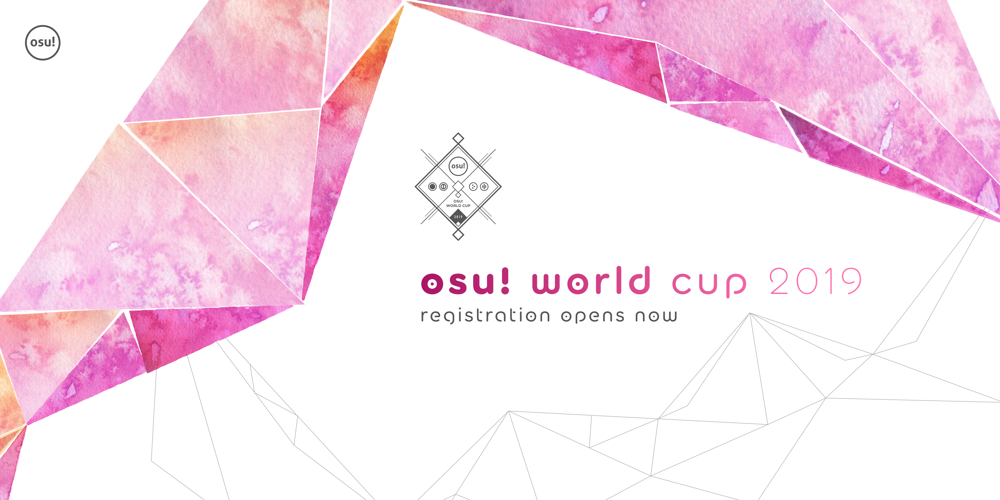
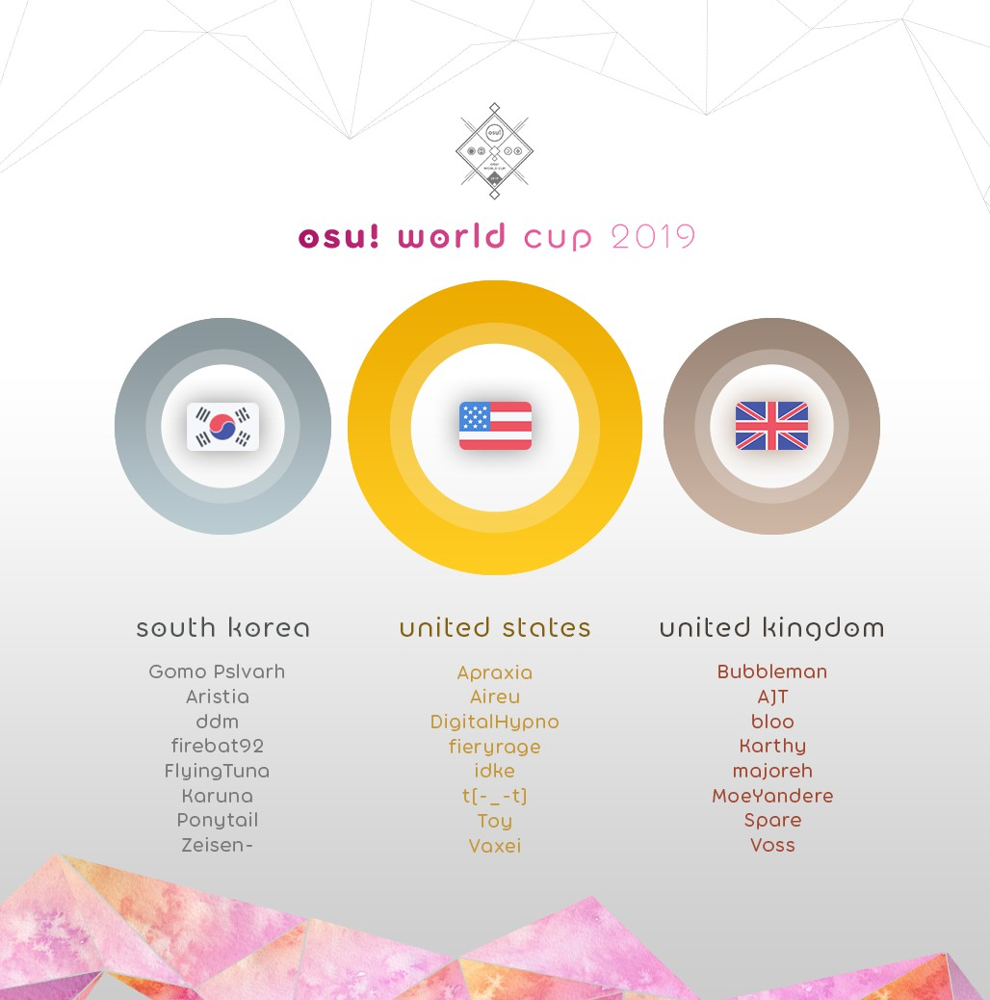

---
tags:
  - OWC 2019
  - OWC2019
---

# osu! World Cup 2019

The **osu! World Cup 2019** (***OWC 2019***) was a country-based osu! tournament hosted by the [osu! team](/wiki/People/osu!_team). It was the tenth instalment of the osu! World Cup.

## Tournament schedule

| Event | Timestamp |
| --: | :-- |
| Registration phase | 2019-10-16/2019-10-27 |
| Qualifiers showcase | 2019-11-02 (14:00 UTC) |
| Qualifiers | 2019-11-09/2019-11-10 |
| Round of 32 | 2019-11-16/2019-11-17 |
| Round of 16 | 2019-11-23/2019-11-24 |
| Quarterfinals | 2019-11-30/2019-12-01 |
| Semifinals | 2019-12-07/2019-12-08 |
| Finals week 1 | 2019-12-14/2019-12-15 |
| Finals week 2 | 2019-12-21/2019-12-22 |

## Prizes

| Placing | Prizes |
| :-: | :-- |
|  | US$300 per team member, exclusive single-run merch, unique profile badge, "osu! Champion" user title for one year |
|  | US$160 per team member, exclusive single-run merch, unique profile badge |
|  | US$80 per team member, exclusive single-run merch, unique profile badge |

  

## Organisation

The osu! World Cup 2019 was run by various community members.

| Position | Member(s) |
| :-- | :-- |
| Manager | ::{ flag=AR }:: [juankristal](https://osu.ppy.sh/users/443656), ::{ flag=CL }:: [WalterToro](https://osu.ppy.sh/users/5281416) |
| Mappool selector | ::{ flag=AU }:: [Kano](https://osu.ppy.sh/users/3036203), ::{ flag=AT }:: [Omgforz](https://osu.ppy.sh/users/578943), ::{ flag=IL }:: [Xilver15](https://osu.ppy.sh/users/3099689) |
| Referee | ::{ flag=PL }:: [Benzopirene](https://osu.ppy.sh/users/1887068), ::{ flag=ES }:: [Deif](https://osu.ppy.sh/users/318565), ::{ flag=CH }:: [Icerite](https://osu.ppy.sh/users/7226287), ::{ flag=AU }:: [ill onion](https://osu.ppy.sh/users/8306102) ::{ flag=DE }:: [p3n](https://osu.ppy.sh/users/123703), ::{ flag=US }:: [tigereyes144](https://osu.ppy.sh/users/6499811), ::{ flag=CL }:: [WalterToro](https://osu.ppy.sh/users/5281416), ::{ flag=GB }:: [Yazzehh](https://osu.ppy.sh/users/7068973) |
| Commentator | ::{ flag=CA }:: [Azer](https://osu.ppy.sh/users/2155578), ::{ flag=GB }:: [Bae-](https://osu.ppy.sh/users/6576972), ::{ flag=US }:: [BeasttrollMC](https://osu.ppy.sh/users/3171691), ::{ flag=GB }:: [Bubbleman](https://osu.ppy.sh/users/5182050), ::{ flag=US }:: [Dohland](https://osu.ppy.sh/users/5220511), ::{ flag=GB }:: [Doomsday](https://osu.ppy.sh/users/18983), ::{ flag=AU }:: [Kano](https://osu.ppy.sh/users/3036203), ::{ flag=US }:: [Monko2k](https://osu.ppy.sh/users/4852013), ::{ flag=AT }:: [Omgforz](https://osu.ppy.sh/users/578943), ::{ flag=US }:: [this1neguy](https://osu.ppy.sh/users/1797189), ::{ flag=US }:: [Toy](https://osu.ppy.sh/users/2757689), ::{ flag=US }:: [Will Stetson](https://osu.ppy.sh/users/4909088) |
| Statistician | ::{ flag=DE }:: [Nwolf](https://osu.ppy.sh/users/1910766) |

## Links

- [Discussion thread](https://osu.ppy.sh/community/forums/topics/973724)
- [Livestream](https://www.twitch.tv/osulive)
- [Pick'ems page](https://pickem.hwc.hr/tournaments/19) hosted by ::{ flag=DE }:: [hallowatcher](https://osu.ppy.sh/users/1874761)
- [Challonge bracket](https://challonge.com/OWC_2019)
- **[Statistics sheet](https://docs.google.com/spreadsheets/d/e/2PACX-1vREamImW3yN-q3rio2XIFX497uoIoPprEuSqykuPPP9D9WcMfMJQj0bXcBl1ZGxIcm_tPIuoZPk_GFk/pubhtml)**

## Participants

|  | Country | Members |
| :-: | :-: | :-- |
| ::{ flag=AR }:: | **Argentina** | **[SlowBurn](https://osu.ppy.sh/users/3608846)**, [AxelOsu](https://osu.ppy.sh/users/1887616), [Cata](https://osu.ppy.sh/users/5958063), [Ceja](https://osu.ppy.sh/users/4185921), [juliancala](https://osu.ppy.sh/users/3272902), [Penguo](https://osu.ppy.sh/users/4389490), [Rimi](https://osu.ppy.sh/users/5194834), [Zaqlev](https://osu.ppy.sh/users/3188703) |
| ::{ flag=AU }:: | **Australia** | **[GranDSenpai](https://osu.ppy.sh/users/3997580)**, [ASecretBox](https://osu.ppy.sh/users/7341183), [Jordan The Bear](https://osu.ppy.sh/users/7477458), [Lunirs](https://osu.ppy.sh/users/2118945), [Monk Gyatso](https://osu.ppy.sh/users/4012086), [Rairiku](https://osu.ppy.sh/users/4945688), [Shiroha](https://osu.ppy.sh/users/3068044), [uyghti](https://osu.ppy.sh/users/3641404) |
| ::{ flag=AT }:: | **Austria** | **[goosefedora](https://osu.ppy.sh/users/2323131)**, [Elscar](https://osu.ppy.sh/users/2253511), [Eta Carinae](https://osu.ppy.sh/users/5841333), [FeeDyy](https://osu.ppy.sh/users/8123308), [Izuko Gaen](https://osu.ppy.sh/users/9208576), [Kizan](https://osu.ppy.sh/users/3074197), [Teppi](https://osu.ppy.sh/users/1371974), [tomadoi](https://osu.ppy.sh/users/5712451) |
| ::{ flag=BE }:: | **Belgium** | **[Hanori](https://osu.ppy.sh/users/7078544)**, [\[Sven\]](https://osu.ppy.sh/users/3695504), [0w0raiZen](https://osu.ppy.sh/users/7835962), [5joshi](https://osu.ppy.sh/users/4279650), [Fblade](https://osu.ppy.sh/users/3168085), [Jodehh](https://osu.ppy.sh/users/6471366), [MetaBee](https://osu.ppy.sh/users/3706039), [steen](https://osu.ppy.sh/users/9441958) |
| ::{ flag=BR }:: | **Brazil** | **[MouseEasy](https://osu.ppy.sh/users/1558603)**, [gilherme boulos](https://osu.ppy.sh/users/3618773), [Idealism](https://osu.ppy.sh/users/3869519), [Mendigo](https://osu.ppy.sh/users/3260571), [Mismagius](https://osu.ppy.sh/users/19048), [Mistya](https://osu.ppy.sh/users/5403374), [My Angelsim](https://osu.ppy.sh/users/3149577), [Mystia](https://osu.ppy.sh/users/4277702) |
| ::{ flag=CA }:: | **Canada** | **[Azer](https://osu.ppy.sh/users/2155578)**, [kyle](https://osu.ppy.sh/users/2694475), [neuro](https://osu.ppy.sh/users/3737401), [RyuK](https://osu.ppy.sh/users/6304246), [Stoof](https://osu.ppy.sh/users/4916057), [trevrasher](https://osu.ppy.sh/users/3893420), [YummyinmyTummy](https://osu.ppy.sh/users/5919819), [Yuuki-chan](https://osu.ppy.sh/users/7031287) |
| ::{ flag=CL }:: | **Chile** | **[Danidesu](https://osu.ppy.sh/users/2748187)**, [\_Riffo](https://osu.ppy.sh/users/4514114), [Deruz](https://osu.ppy.sh/users/5386106), [-Dylson-](https://osu.ppy.sh/users/6315784), [ign](https://osu.ppy.sh/users/9360528), [NO37](https://osu.ppy.sh/users/4653583), [vitoco](https://osu.ppy.sh/users/4282963), [xaxreid](https://osu.ppy.sh/users/4227431) |
| ::{ flag=CN }:: | **China** | **[Crystal](https://osu.ppy.sh/users/1646397)**, [davidqu2](https://osu.ppy.sh/users/6090175), [DuNai](https://osu.ppy.sh/users/2522197), [EbisuzawaKurumi](https://osu.ppy.sh/users/5791401), [GGBY](https://osu.ppy.sh/users/629717), [MyAngelMiku](https://osu.ppy.sh/users/7025429), [Sugiura Kanade](https://osu.ppy.sh/users/7839397), [TeRiRi](https://osu.ppy.sh/users/2142966) |
| ::{ flag=CZ }:: | **Czech Republic** | **[Swatty](https://osu.ppy.sh/users/1028683)**, [- Daichi -](https://osu.ppy.sh/users/6602580), [BLooDBuRSTiNG](https://osu.ppy.sh/users/3925167), [Electrovoid](https://osu.ppy.sh/users/3853840), [Ev1dent](https://osu.ppy.sh/users/7125675), [kolgar](https://osu.ppy.sh/users/3123488), [Neshpi](https://osu.ppy.sh/users/3198446), [VilaZ](https://osu.ppy.sh/users/5155680) |
| ::{ flag=DK }:: | **Denmark** | **[Spork Lover](https://osu.ppy.sh/users/3417469)**, [Akayume](https://osu.ppy.sh/users/10617530), [Contaminate](https://osu.ppy.sh/users/4694589), [My Aim Zogs](https://osu.ppy.sh/users/3722715), [raser1234](https://osu.ppy.sh/users/2527887), [Tikzyy](https://osu.ppy.sh/users/11380904), [Vandabe](https://osu.ppy.sh/users/7050754), [waefwerf](https://osu.ppy.sh/users/3868653) |
| ::{ flag=FI }:: | **Finland** | **[Dragonmob](https://osu.ppy.sh/users/4990193)**, [Freezd](https://osu.ppy.sh/users/6524603), [Haadez](https://osu.ppy.sh/users/8925266), [Jup3KW](https://osu.ppy.sh/users/5424170), [Kenraali](https://osu.ppy.sh/users/7341081), [Samoyed](https://osu.ppy.sh/users/6796557), [Santeri](https://osu.ppy.sh/users/1981187), [Wucki](https://osu.ppy.sh/users/5287410) |
| ::{ flag=FR }:: | **France** | **[Musty](https://osu.ppy.sh/users/251683)**, [Besta](https://osu.ppy.sh/users/5189431), [FayeurS](https://osu.ppy.sh/users/3105416), [LogicSystem](https://osu.ppy.sh/users/7622097), [NerO](https://osu.ppy.sh/users/1545031), [-raizen-](https://osu.ppy.sh/users/3872987), [ThePooN](https://osu.ppy.sh/users/718454), [VROUM CV VITE](https://osu.ppy.sh/users/7630971) |
| ::{ flag=DE }:: | **Germany** | **[Dustice](https://osu.ppy.sh/users/754565)**, [Ephix](https://osu.ppy.sh/users/3772251), [hallowatcher](https://osu.ppy.sh/users/1874761), [imagaK](https://osu.ppy.sh/users/2022445), [Knalli](https://osu.ppy.sh/users/8147403), [KyoouN](https://osu.ppy.sh/users/1458932), [okinamo](https://osu.ppy.sh/users/3765989), [Umbre](https://osu.ppy.sh/users/2766034) |
| ::{ flag=HK }:: | **Hong Kong** | **[Chaoslitz](https://osu.ppy.sh/users/3621552)**, [DenierNezzar](https://osu.ppy.sh/users/126144), [Hellotomlol225](https://osu.ppy.sh/users/1906975), [Judas](https://osu.ppy.sh/users/4720411), [LoliL0ver](https://osu.ppy.sh/users/9313951), [mcy4](https://osu.ppy.sh/users/2165650), [Petal](https://osu.ppy.sh/users/7354729), [Riushi](https://osu.ppy.sh/users/2353581) |
| ::{ flag=HU }:: | **Hungary** | **[Lexion](https://osu.ppy.sh/users/5271371)**, [csaba21123](https://osu.ppy.sh/users/7764237), [emu1337](https://osu.ppy.sh/users/2185987), [Kelathis](https://osu.ppy.sh/users/10240089), [RatinA0](https://osu.ppy.sh/users/3436625), [tralk331](https://osu.ppy.sh/users/5039382), [verto](https://osu.ppy.sh/users/2015300), [Zyaqix](https://osu.ppy.sh/users/6085753) |
| ::{ flag=ID }:: | **Indonesia** | **[Skydiver](https://osu.ppy.sh/users/4750008)**, [Ascaveth](https://osu.ppy.sh/users/3245206), [Fuma](https://osu.ppy.sh/users/1501956), [LoidKun](https://osu.ppy.sh/users/6437601), [-Reuto-](https://osu.ppy.sh/users/10717635), [Rexeez](https://osu.ppy.sh/users/1987591), [Reyuza](https://osu.ppy.sh/users/2454767), [smh](https://osu.ppy.sh/users/1629553) |
| ::{ flag=IL }:: | **Israel** | **[Caution](https://osu.ppy.sh/users/7082242)**, [Galog](https://osu.ppy.sh/users/7799629), [Haida](https://osu.ppy.sh/users/5682039), [MrPotato](https://osu.ppy.sh/users/2787415), [namewithnumber9](https://osu.ppy.sh/users/5867839), [Okino may](https://osu.ppy.sh/users/7730603), [Psyical](https://osu.ppy.sh/users/3181332) |
| ::{ flag=IT }:: | **Italy** | **[Koba](https://osu.ppy.sh/users/4448118)**, [Carretto](https://osu.ppy.sh/users/3801459), [Kiirochii](https://osu.ppy.sh/users/6387149), [Riuzaky](https://osu.ppy.sh/users/7165477), [SIMONETRAPANI](https://osu.ppy.sh/users/7329177), [Spazza17](https://osu.ppy.sh/users/3516241), [Surpy](https://osu.ppy.sh/users/9961436), [-Syncro](https://osu.ppy.sh/users/4338923) |
| ::{ flag=JP }:: | **Japan** | **[ShirohaMyMommy](https://osu.ppy.sh/users/1603923)**, [a\_Blue](https://osu.ppy.sh/users/5645667), [dectopia](https://osu.ppy.sh/users/2845904), [katatakatata](https://osu.ppy.sh/users/3540294), [KonKonKinakoN](https://osu.ppy.sh/users/4733185), [Saix](https://osu.ppy.sh/users/1713861), [Varvalian](https://osu.ppy.sh/users/3345902), [Vento](https://osu.ppy.sh/users/4796794) |
| ::{ flag=LV }:: | **Latvia** | **[waywern2012](https://osu.ppy.sh/users/5870453)**, [Ayaero](https://osu.ppy.sh/users/9533316), [debiloka](https://osu.ppy.sh/users/9269034), [ejnah](https://osu.ppy.sh/users/11038469), [Emula](https://osu.ppy.sh/users/2891792), [honnijs](https://osu.ppy.sh/users/6469394), [MegaWhyNOPE](https://osu.ppy.sh/users/8676070), [wildtom](https://osu.ppy.sh/users/7576357) |
| ::{ flag=MY }:: | **Malaysia** | **[Rampax](https://osu.ppy.sh/users/3995630)**, [Chiyuu](https://osu.ppy.sh/users/8226107), [Desumond](https://osu.ppy.sh/users/7399262), [King Hong](https://osu.ppy.sh/users/7263047), [NOOB1200](https://osu.ppy.sh/users/6932501), [Rumia-](https://osu.ppy.sh/users/1787171), [Tzero](https://osu.ppy.sh/users/6088976), [Zygody](https://osu.ppy.sh/users/3677251) |
| ::{ flag=MX }:: | **Mexico** | **[Atsuro](https://osu.ppy.sh/users/2279351)**, [Flameshock](https://osu.ppy.sh/users/8349047), [-Hebel-](https://osu.ppy.sh/users/6169483), [-Karu](https://osu.ppy.sh/users/8429128), [KevstracK](https://osu.ppy.sh/users/5325213), [outuyo](https://osu.ppy.sh/users/8704992), [Riot](https://osu.ppy.sh/users/4256461), [-Wolfy-](https://osu.ppy.sh/users/4497582) |
| ::{ flag=NL }:: | **Netherlands** | **[Viveliam](https://osu.ppy.sh/users/3506793)**, [Damnjelly](https://osu.ppy.sh/users/1666355), [Drerrie](https://osu.ppy.sh/users/5346146), [jackylam5](https://osu.ppy.sh/users/1540807), [Lilily](https://osu.ppy.sh/users/6502403), [Skyrovania](https://osu.ppy.sh/users/4696315), [sunui](https://osu.ppy.sh/users/3065571), [taku](https://osu.ppy.sh/users/684433) |
| ::{ flag=NZ }:: | **New Zealand** | **[shortpotato](https://osu.ppy.sh/users/1266102)**, [Big Z](https://osu.ppy.sh/users/8641416), [Div](https://osu.ppy.sh/users/3751116), [DTJump](https://osu.ppy.sh/users/9660655), [Feyyy](https://osu.ppy.sh/users/2523703), [Nucifera](https://osu.ppy.sh/users/5282664), [yellowy246](https://osu.ppy.sh/users/3833980), [Zoomer](https://osu.ppy.sh/users/6600930) |
| ::{ flag=NO }:: | **Norway** | **[YokesPai](https://osu.ppy.sh/users/6399568)**, [Afrodafro](https://osu.ppy.sh/users/3551255), [CXu](https://osu.ppy.sh/users/84841), [Fjell](https://osu.ppy.sh/users/6951444), [-GN](https://osu.ppy.sh/users/895581), [ItsKevZii](https://osu.ppy.sh/users/5201225), [Sebu](https://osu.ppy.sh/users/3990173), [Warrock](https://osu.ppy.sh/users/2841744) |
| ::{ flag=PH }:: | **Philippines** | **[konawiki](https://osu.ppy.sh/users/4003979)**, [elki](https://osu.ppy.sh/users/8136525), [fixedbyglue](https://osu.ppy.sh/users/8296269), [Milkteaism](https://osu.ppy.sh/users/9642774), [MioMilo](https://osu.ppy.sh/users/2199427), [xX\_MusicMan\_Xx](https://osu.ppy.sh/users/5718989), [Z\_Xyloz](https://osu.ppy.sh/users/12040280), [zonelouise](https://osu.ppy.sh/users/1492995) |
| ::{ flag=PL }:: | **Poland** | **[Bartek22830](https://osu.ppy.sh/users/6404027)**, [\_demo](https://osu.ppy.sh/users/3556891), [Marek Marucha](https://osu.ppy.sh/users/2395405), [MrBooM](https://osu.ppy.sh/users/1837989), [Rafis](https://osu.ppy.sh/users/2558286), [twoj stary](https://osu.ppy.sh/users/3543130), [Wakson](https://osu.ppy.sh/users/3048222), [WubWoofWolf](https://osu.ppy.sh/users/39828) |
| ::{ flag=PT }:: | **Portugal** | **[King Lizard](https://osu.ppy.sh/users/7817891)**, [\[ Larssen \]](https://osu.ppy.sh/users/5784075), [\[Takaga\]](https://osu.ppy.sh/users/7448448), [dat boi waffle](https://osu.ppy.sh/users/4215381), [Konam](https://osu.ppy.sh/users/4357340), [Legendz](https://osu.ppy.sh/users/4333312), [PedroLipton](https://osu.ppy.sh/users/3272012), [-SURPRISE-](https://osu.ppy.sh/users/11610772) |
| ::{ flag=RO }:: | **Romania** | **[badeu](https://osu.ppy.sh/users/1473890)**, [\_AfterWind](https://osu.ppy.sh/users/2086138), [Chamosiala](https://osu.ppy.sh/users/1469892), [cristi2708](https://osu.ppy.sh/users/7552300), [eternum](https://osu.ppy.sh/users/4581069), [Maxim Bogdan](https://osu.ppy.sh/users/5035707), [Rohulk](https://osu.ppy.sh/users/3219026), [roliy](https://osu.ppy.sh/users/9578404) |
| ::{ flag=RU }:: | **Russian Federation** | **[follon](https://osu.ppy.sh/users/3973474)**, [Aden](https://osu.ppy.sh/users/4342841), [Alumetri](https://osu.ppy.sh/users/5371497), [AxewB](https://osu.ppy.sh/users/4928776), [Gasha](https://osu.ppy.sh/users/7192129), [Okinotori](https://osu.ppy.sh/users/4346274), [Red\_Pixel](https://osu.ppy.sh/users/4170932), [talala](https://osu.ppy.sh/users/1389663) |
| ::{ flag=SG }:: | **Singapore** | **[GSBlank](https://osu.ppy.sh/users/2312106)**, [\[-Lockon-\]](https://osu.ppy.sh/users/6726331), [Demonical](https://osu.ppy.sh/users/5447609), [Emilia](https://osu.ppy.sh/users/2003326), [M4-K1](https://osu.ppy.sh/users/5210595), [moosepi](https://osu.ppy.sh/users/1868745), [Raindrop](https://osu.ppy.sh/users/1155871), [Soba Noodles](https://osu.ppy.sh/users/3010281) |
| ::{ flag=SK }:: | **Slovakia** | **[Tikef](https://osu.ppy.sh/users/9149213)**, [AtHeoN](https://osu.ppy.sh/users/1770367), [Hranolka](https://osu.ppy.sh/users/6149947), [Nikolas](https://osu.ppy.sh/users/7759641), [PemiX](https://osu.ppy.sh/users/6974470), [PeteX](https://osu.ppy.sh/users/1285945), [Teriowom](https://osu.ppy.sh/users/6877397), [-YoYo-](https://osu.ppy.sh/users/6158076) |
| ::{ flag=KR }:: | **South Korea** | **[Gomo Pslvarh](https://osu.ppy.sh/users/1206417)**, [Aristia](https://osu.ppy.sh/users/3478883), [ddm](https://osu.ppy.sh/users/7910282), [firebat92](https://osu.ppy.sh/users/1777162), [FlyingTuna](https://osu.ppy.sh/users/9224078), [Karuna](https://osu.ppy.sh/users/8775024), [Ponytail](https://osu.ppy.sh/users/1516650), [Zeisen-](https://osu.ppy.sh/users/7892320) |
| ::{ flag=ES }:: | **Spain** | **[ByYoshi14](https://osu.ppy.sh/users/4470553)**, [AitorAmu](https://osu.ppy.sh/users/7781304), [Betwin](https://osu.ppy.sh/users/1968481), [CapoeiraDoMorte](https://osu.ppy.sh/users/6141330), [In Sane](https://osu.ppy.sh/users/5114537), [Rekens](https://osu.ppy.sh/users/1073575), [RivenXLukario](https://osu.ppy.sh/users/9582556), [Sumo de Laranja](https://osu.ppy.sh/users/4744943) |
| ::{ flag=SE }:: | **Sweden** | **[fcuk](https://osu.ppy.sh/users/4844909)**, [\[ Blue \]](https://osu.ppy.sh/users/4859699), [\[ Coach \]](https://osu.ppy.sh/users/2854598), [Fuwzie](https://osu.ppy.sh/users/4887814), [Nitroz](https://osu.ppy.sh/users/5256529), [Reedkatt](https://osu.ppy.sh/users/8335950), [Saika0k1](https://osu.ppy.sh/users/4316633), [Sonix](https://osu.ppy.sh/users/4029000) |
| ::{ flag=CH }:: | **Switzerland** | **[Ayeka](https://osu.ppy.sh/users/7225922)**, [\[NoTitle\]](https://osu.ppy.sh/users/9602606), [Akani](https://osu.ppy.sh/users/2323137), [CeriixZ](https://osu.ppy.sh/users/9533853), [Mytlex](https://osu.ppy.sh/users/7045024), [Nemesis1925](https://osu.ppy.sh/users/10394866), [Niven](https://osu.ppy.sh/users/5297955), [Scarlet rawr](https://osu.ppy.sh/users/4521911) |
| ::{ flag=TW }:: | **Taiwan** | **[Shiina Noriko](https://osu.ppy.sh/users/1285637)**, [\[ Zane \]](https://osu.ppy.sh/users/3517706), [\_Shield](https://osu.ppy.sh/users/1860489), [Flask](https://osu.ppy.sh/users/959763), [GfMRT](https://osu.ppy.sh/users/3163649), [Rizer](https://osu.ppy.sh/users/5155973), [Rucker](https://osu.ppy.sh/users/147515), [-Snowy-](https://osu.ppy.sh/users/6237416) |
| ::{ flag=TR }:: | **Turkey** | **[heyronii](https://osu.ppy.sh/users/5642779)**, [AkashiDagara](https://osu.ppy.sh/users/6118485), [black person](https://osu.ppy.sh/users/6592904), [edizberkserbest](https://osu.ppy.sh/users/9256771), [egemenbsrms](https://osu.ppy.sh/users/4520477), [Raikouhou](https://osu.ppy.sh/users/8007528), [Seigi](https://osu.ppy.sh/users/9799010) |
| ::{ flag=UA }:: | **Ukraine** | **[kug1](https://osu.ppy.sh/users/6997572)**, [allein](https://osu.ppy.sh/users/6221637), [blednak](https://osu.ppy.sh/users/912627), [Kryterion](https://osu.ppy.sh/users/9920144), [NN4](https://osu.ppy.sh/users/9819240), [Sadness](https://osu.ppy.sh/users/6560835), [Tooqie](https://osu.ppy.sh/users/9203015), [Virgo](https://osu.ppy.sh/users/5249196) |
| ::{ flag=GB }:: | **United Kingdom** | **[Bubbleman](https://osu.ppy.sh/users/5182050)**, [AJT](https://osu.ppy.sh/users/3181083), [bloo](https://osu.ppy.sh/users/6778877), [Karthy](https://osu.ppy.sh/users/4196808), [majoreh](https://osu.ppy.sh/users/7959222), [MoeYandere](https://osu.ppy.sh/users/2565902), [Spare](https://osu.ppy.sh/users/2204373), [Voss](https://osu.ppy.sh/users/7657761) |
| ::{ flag=US }:: | **United States** | **[Apraxia](https://osu.ppy.sh/users/4194445)**, [Aireu](https://osu.ppy.sh/users/1650010), [DigitalHypno](https://osu.ppy.sh/users/4384207), [fieryrage](https://osu.ppy.sh/users/3533958), [idke](https://osu.ppy.sh/users/4650315), [t\[-\_-t\]](https://osu.ppy.sh/users/2644828), [Toy](https://osu.ppy.sh/users/2757689), [Vaxei](https://osu.ppy.sh/users/4787150) |
| ::{ flag=UY }:: | **Uruguay** | **[Daanit](https://osu.ppy.sh/users/6159669)**, [Madozito](https://osu.ppy.sh/users/4054429), [Makoto chan](https://osu.ppy.sh/users/8987016), [-PloX](https://osu.ppy.sh/users/6404583), [Rebo](https://osu.ppy.sh/users/6942259), [Rekaru](https://osu.ppy.sh/users/4152967), [-Ritsumi-](https://osu.ppy.sh/users/5218320), [Snepif](https://osu.ppy.sh/users/408088) |
| ::{ flag=VN }:: | **Vietnam** | **[Tuon](https://osu.ppy.sh/users/6673790)**, [- Eucliwood -](https://osu.ppy.sh/users/1587427), [boylanklunk\_9x](https://osu.ppy.sh/users/7050175), [Hoaq](https://osu.ppy.sh/users/7696512), [iPhong](https://osu.ppy.sh/users/8621733), [Shironi](https://osu.ppy.sh/users/8660120), [Ui chan](https://osu.ppy.sh/users/5449433) |

## Podium

## Mappools

### Finals week 2

- NoMod
  1. [wowaka - Unhappy Refrain (BarkingMadDog) \[EX Extreme\]](https://osu.ppy.sh/beatmapsets/1075607#osu/2250670)
  2. [ARForest - Metheus (FrenZ396) \[Finale\]](https://osu.ppy.sh/beatmapsets/1078954#osu/2257502)
  3. [T.M.Generation - X-DEN (Realazy) \[Chuuden\]](https://osu.ppy.sh/beatmapsets/961061#osu/2012009)
  4. [Emiru no Aishita Tsukiyo ni Dai San Gensou Kyoku wo - ito (Lasse) \[Petal\]](https://osu.ppy.sh/beatmapsets/1077982#osu/2255709)
  5. [Cattle Decapitation - Your Disposal (Chanci) \[Eradication\]](https://osu.ppy.sh/beatmapsets/988109#osu/2207855)
  6. [SHO - Plain Asia \~ Guardian of the Village (Jenny) \[Unmodified Girlfriend\]](https://osu.ppy.sh/beatmapsets/299884#osu/2255738)
- Hidden
  1. [James Landino - Hide And Seek (Mirash) \[Expert\]](https://osu.ppy.sh/beatmapsets/972932#osu/2036903)
  2. [Hikutsu-P - Dance of Many (IOException) \[Expert\]](https://osu.ppy.sh/beatmapsets/1078746#osu/2257140)
  3. [xi - Mirage Garden (P o M u T a) \[Exitra\]](https://osu.ppy.sh/beatmapsets/319940#osu/712015)
- HardRock
  1. [ZAQ - Seven Doors (SkyFlame) \[Trinity Soul\]](https://osu.ppy.sh/beatmapsets/1078911#osu/2257421)
  2. [Negentropy (a.k.a. Team Grimoire) - ouroVoros (Suzuki\_1112) \[Regou's Extra\]](https://osu.ppy.sh/beatmapsets/707164#osu/1512325)
  3. [otetsu - Yokuatsu Sakuran Girl (ZZHBOY) \[HW's Expert\]](https://osu.ppy.sh/beatmapsets/195582#osu/499839)
- DoubleTime
  1. [Aki - star river (ShirohaMyMommy) \[Lunatic\]](https://osu.ppy.sh/beatmapsets/908990#osu/1896891)
  2. [-45 - Midorigo Queen Bee (Luscent) \[Collapse\]](https://osu.ppy.sh/beatmapsets/1055780#osu/2206544)
  3. [TOKINE - Soko ni Aru Mono (Patchouli) \[Lunatic\]](https://osu.ppy.sh/beatmapsets/70137#osu/434536)
  4. [Andromedik - Invasion (Mirash) \[NeilBot's Insane\]](https://osu.ppy.sh/beatmapsets/789544#osu/1656914)
- FreeMod
  1. [SHK - Imagination (ktgster) \[SHD\]](https://osu.ppy.sh/beatmapsets/1078340#osu/2256378)
  2. [paraoka - boot (Natteke desu) \[difficulty\]](https://osu.ppy.sh/beatmapsets/913680#osu/1908543)
  3. [S.S.H. - Holy Orders (Deif) \[LKs\]](https://osu.ppy.sh/beatmapsets/31750#osu/104842)
- Tiebreaker
  1. **[Falcom Sound Team jdk - GENS D'ARMES (jonathanlfj) \[CONQUEROR\]](https://osu.ppy.sh/beatmapsets/1078344#osu/2256387)**

### Finals week 1

- NoMod
  1. [FujuniseikouyuuP - Sayonara Lechenaultia (Meg) \[Collab EXTRA\]](https://osu.ppy.sh/beatmapsets/703769#osu/1488898)
  2. [Ryu\* vs. L.E.D.-G vs. ZUN - PARADISE GHOST (Leader) \[Extra Stage\]](https://osu.ppy.sh/beatmapsets/1074982#osu/2249464)
  3. [lapix - Labyrinth (Akali) \[Who's the fucking gangster?\]](https://osu.ppy.sh/beatmapsets/615878#osu/1299008)
  4. [Co shu Nie - asphyxia (Gillstar) \[constriction\]](https://osu.ppy.sh/beatmapsets/895512#osu/1871128)
  5. [Yorushika - Hachigatsu, Bou, Tsukiakari (Delis) \[Collab Extra\]](https://osu.ppy.sh/beatmapsets/963814#osu/2017880)
  6. [Pastel\*Palettes - Happy Synthesizer (ktgster) \[Special\]](https://osu.ppy.sh/beatmapsets/932654#osu/1947213)
- Hidden
  1. [lapix - Nexta (Realazy) \[NEUROTRANSMISSION\]](https://osu.ppy.sh/beatmapsets/1050635#osu/2195883)
  2. [LiLA\'c Records - Maze of Vapor (Brutal Core mix) (Mirash) \[Extra\]](https://osu.ppy.sh/beatmapsets/1075008#osu/2249551)
  3. [DragonForce - Ring of Fire (MashaSG) \[sdafsf's Extreme\]](https://osu.ppy.sh/beatmapsets/717015#osu/1634985)
- HardRock
  1. [Hatsune Miku - Electric Love (t+pazolite Overcute Remix) (Zapy) \[Overcute\]](https://osu.ppy.sh/beatmapsets/50373#osu/154853)
  2. [Camellia - Proluvies (Priti) \[Ultra\]](https://osu.ppy.sh/beatmapsets/283815#osu/641605)
  3. [Nekomata Master+ - squall (Reisen Udongein) \[Extra\]](https://osu.ppy.sh/beatmapsets/127772#osu/323907)
- DoubleTime
  1. [kozato - Izayoi Sakura (Gust) \[Firika's Insane\]](https://osu.ppy.sh/beatmapsets/893573#osu/1895932)
  2. [Niko - Night of Fire (Gabi) \[Insane\]](https://osu.ppy.sh/beatmapsets/18923#osu/66820)
  3. [Draw the Emotional - Morning glow (UnitedWeSin) \[Lunatic\]](https://osu.ppy.sh/beatmapsets/146626#osu/363298)
  4. [HuMeR - ChaserXX (Realazy) \[KKip's Another\]](https://osu.ppy.sh/beatmapsets/930846#osu/2066790)
- FreeMod
  1. [Nanamori-chu \* Goraku-bu - Happy Time wa Owaranai (deadcode) \[Expert\]](https://osu.ppy.sh/beatmapsets/935707#osu/1954858)
  2. [Getty vs. DJ DiA - DropZ-Line- (Realazy) \[IOException's Extra\]](https://osu.ppy.sh/beatmapsets/727049#osu/1702072)
  3. [SOUND HOLIC vs. dj TAKA feat. YURiCa - TIEFSEE (celerih) \[Expert\]](https://osu.ppy.sh/beatmapsets/928646#osu/1939633)
- Tiebreaker
  1. **[Fuki - Sacred Bones Riot (IsomirDiAngelo) \[Slay My Sins\]](https://osu.ppy.sh/beatmapsets/1009680#osu/2248906)**

### Semifinals

- NoMod
  1. [Roselia - LOUDER (SkyFlame) \[EVEN LOUDER\]](https://osu.ppy.sh/beatmapsets/1040095#osu/2173926)
  2. [Festa - Lemuria (QuiescentRabbit) \[Isolation Singularity\]](https://osu.ppy.sh/beatmapsets/835474#osu/1749822)
  3. [lapix - Nothing but Theory (azr8) \[ultra jazzfunktion\]](https://osu.ppy.sh/beatmapsets/914146#osu/1924570)
  4. [Sumireko Hanabusa (CV: Miho Arakawa) - Inochi no Karakuri (Atalanta) \[The Queen\]](https://osu.ppy.sh/beatmapsets/1061614#osu/2223096)
  5. [S.S.H. - The Decisive Battle with the Fugitives (sjoy) \[Extra\]](https://osu.ppy.sh/beatmapsets/145215#osu/360345)
  6. [Chon - Sleepy Tea (piroshki) \[Elogium\]](https://osu.ppy.sh/beatmapsets/959788#osu/2009509)
- Hidden
  1. [positive MAD-crew - Lapistoria no Yakusoku (Rigid Blue Remains) (Shirasaka Koume) \[Ex\]](https://osu.ppy.sh/beatmapsets/549158#osu/1162919)
  2. [sasakure.UK - Good Bye, Mr. Jack (Xilver15) \[ReMiX\]](https://osu.ppy.sh/beatmapsets/586425#osu/1241924)
  3. [umu. - humanly (Luscent) \[Expert\]](https://osu.ppy.sh/beatmapsets/1045518#osu/2185651)
- HardRock
  1. [Sokoninaru - Tenohira de Odoru (Snepif) \[Extreme\]](https://osu.ppy.sh/beatmapsets/773686#osu/1641323)
  2. [Mitsuyoshi Takenobu no Ani - Amphisbaena (toybot) \[Demonic Another\]](https://osu.ppy.sh/beatmapsets/576022#osu/1219592)
  3. [HyuN - Grin (ktgster) \[Expert\]](https://osu.ppy.sh/beatmapsets/947770#osu/1982581)
- DoubleTime
  1. [yurika - THE EVENING STAR (y u z u k i) \[Lunatic\]](https://osu.ppy.sh/beatmapsets/27706#osu/92762)
  2. [Yumeji Ruri - The answer BLOOD \~Senketsu no Michishirube\~ (Short Ver.) (Star Stream) \[S.S\]](https://osu.ppy.sh/beatmapsets/52586#osu/160712)
  3. [Hatsunetsumiko's - Two Fates (happy30) \[Destiny\]](https://osu.ppy.sh/beatmapsets/301400#osu/675854)
  4. [Masayoshi Minoshima - Bad Apple!! feat.nomico (Nhato Remix) (Akareh) \[Limbo\]](https://osu.ppy.sh/beatmapsets/616378#osu/1299942)
- FreeMod
  1. [Tamaonsen - COZMIC DRIVE feat.Youko (caren\_sk) \[CRN MORE DRIVE\]](https://osu.ppy.sh/beatmapsets/78859#osu/220330)
  2. [RYO - Shuffle Heaven (Nemis) \[eXtra\]](https://osu.ppy.sh/beatmapsets/85802#osu/235470)
  3. [TatshMusicCircle - Raikou -3rd Desire- (Kite) \[Extra\]](https://osu.ppy.sh/beatmapsets/143316#osu/1836851)
- Tiebreaker
  1. **[Camellia - epimerization (Azer) \[Collab\]](https://osu.ppy.sh/beatmapsets/752677#osu/1584614)**

### Quarterfinals

- NoMod
  1. [Nekomata Master - Despair of Elferia (-Tochi) \[ANIMUM DESPONDEO\]](https://osu.ppy.sh/beatmapsets/1069504#osu/2238810)
  2. [xi - over the top (Kroytz) \[broccoly's extreme\]](https://osu.ppy.sh/beatmapsets/479215#osu/1242897)
  3. [sky\_delta - Midnight City Warfare (lcfc) \[Extreme\]](https://osu.ppy.sh/beatmapsets/1008607#osu/2111383)
  4. [ZUTOMAYO - Kan Saete Kuyashiiwa (Nathan) \[geragera\]](https://osu.ppy.sh/beatmapsets/1001507#osu/2096523)
  5. [Denkishiki Karen Ongaku Shuudan - Owari Tsumugishi Mono (LMT) \[Lasse's Extra\]](https://osu.ppy.sh/beatmapsets/763607#osu/1711326)
  6. [Tokyo Jihen - Sounan (Uberzolik) \[Ayaya's Extra\]](https://osu.ppy.sh/beatmapsets/967321#osu/2031053)
- Hidden
  1. [penoreri - Sailing Force (BarkingMadDog) \[MAXIMUM\]](https://osu.ppy.sh/beatmapsets/893700#osu/1867667)
  2. [BUTAOTOME - Towa no Maigo (Icekalt) \[It was all a dream\]](https://osu.ppy.sh/beatmapsets/1069288#osu/2238398)
  3. [Igorrr - Unpleasant Sonata (Sieg) \[Pagli's Sonata\]](https://osu.ppy.sh/beatmapsets/90385#osu/262302)
- HardRock
  1. [XX:me - Escape (jonathanlfj) \[Freedom\]](https://osu.ppy.sh/beatmapsets/811119#osu/1701563)
  2. [An - Catanoph (Ryuusei Aika) \[Miura's Extra\]](https://osu.ppy.sh/beatmapsets/775846#osu/1697021)
  3. [P4koo - Crystal Illusion (Beomsan) \[milr\_'s Expert\]](https://osu.ppy.sh/beatmapsets/797393#osu/1676675)
- DoubleTime
  1. [Ax feat.Natsukawa Yoko - Sakimori Renka (Long Version) (Seikatu) \[Insane\]](https://osu.ppy.sh/beatmapsets/477999#osu/1021024)
  2. [senya - Magica (Satellite) \[SatelliteFrostMix\]](https://osu.ppy.sh/beatmapsets/91791#osu/248474)
  3. [HAG - Koe (C O N N E R) \[Insane\]](https://osu.ppy.sh/beatmapsets/798510#osu/1676795)
  4. [Halozy - Heart of Night (Chaoslitz) \[Life of Loneliness\]](https://osu.ppy.sh/beatmapsets/462878#osu/991229)
- FreeMod
  1. [HyuN - Tokyo's Starlight (Pho) \[Collab Extra\]](https://osu.ppy.sh/beatmapsets/891712#osu/1864175)
  2. [mafumafu - Kakushigoto (Vert) \[0108's Extra.\]](https://osu.ppy.sh/beatmapsets/770023#osu/1680481)
  3. [A.SAKA - Nanatsu Issenzakura (yf\_bmp) \[Ayaya's Expert\]](https://osu.ppy.sh/beatmapsets/513731#osu/1493332)
- Tiebreaker
  1. **[Oreore-Usagi - Reset My Refrain (captin1) \[Reset\]](https://osu.ppy.sh/beatmapsets/485103#osu/1034570)**

### Round of 16

- NoMod
  1. [BUTAOTOME - Yokubou no Kozuchi (BarkingMadDog) \[Mallet of Desires\]](https://osu.ppy.sh/beatmapsets/1065419#osu/2230996)
  2. [m108 - XIII Charlotte (Cherry Blossom) \[yumenother\]](https://osu.ppy.sh/beatmapsets/678383#osu/1434424)
  3. [Camellia - kodama (ProfessionalBox) \[Yamabiko\]](https://osu.ppy.sh/beatmapsets/488016#osu/1040424)
  4. [Zutto Mayonaka de Ii no ni. - Humanoid (Meg) \[Collab\]](https://osu.ppy.sh/beatmapsets/972298#osu/2035761)
  5. [sakuzyo - Senkyou Ranbu (ktgster) \[EX\]](https://osu.ppy.sh/beatmapsets/460516#osu/986233)
- Hidden
  1. [cosMo@BousouP feat. Hatsune Miku - Shinsekai (jonathanlfj) \[New World\]](https://osu.ppy.sh/beatmapsets/318557#osu/709313)
  2. [onoken - Quinine -A2D SIDE- (Matrix) \[ExtrA\]](https://osu.ppy.sh/beatmapsets/932298#osu/1946518)
- HardRock
  1. [Fujimiya Kaori (CV: Amamiya Sora) - Kanade (Shadren Remix) (schoolboy) \[FCL's Extreme\]](https://osu.ppy.sh/beatmapsets/741193#osu/1618753)
  2. [DJ TOTTO VS TOTTO - vajra (Kloyd) \[Expert\]](https://osu.ppy.sh/beatmapsets/287377#osu/648443)
- DoubleTime
  1. [3L - Spring of Dreams (Trust) \[Lunatic\]](https://osu.ppy.sh/beatmapsets/739119#osu/1559749)
  2. [Hatsuki Yura - Halloween of the Dead (Gamu) \[Insane\]](https://osu.ppy.sh/beatmapsets/1041518#osu/2184660)
  3. [Hanatan - Kitsune no Yomeiri (Ryafuka) \[Kitsuneko\]](https://osu.ppy.sh/beatmapsets/46070#osu/144387)
- FreeMod
  1. [NegaRen - A Bunch Of Samples Played Consecutively (Mao) \[Is It Halloween Yet?\]](https://osu.ppy.sh/beatmapsets/480553#osu/1025871)
  2. [Liz Triangle - Immortal Philosophy (Jounzan) \[Sisterly Love\]](https://osu.ppy.sh/beatmapsets/941212#osu/1965586)
- Tiebreaker
  1. **[Shimotsuki Haruka - Youka to Yumeutsutsu (-Tochi) \[Awake\]](https://osu.ppy.sh/beatmapsets/657208#osu/1392159)**

### Round of 32

- NoMod
  1. [Tadokoro Azusa - Junshin Always (Yasaija 714) \[Extra\]](https://osu.ppy.sh/beatmapsets/838515#osu/1755497)
  2. [cosMo@BousouP - For UltraPlayers (toybot) \[INFINITE\]](https://osu.ppy.sh/beatmapsets/1062625#osu/2225237)
  3. [Function Phantom - Variable (Chaoslitz) \[Deluxe\]](https://osu.ppy.sh/beatmapsets/751774#osu/1582594)
  4. [Reol,nqrse - Ooedo Ranvu (zhu) \[Expert\]](https://osu.ppy.sh/beatmapsets/703580#osu/1572141)
  5. [AAAA - carnation (Veridian) \[black another\]](https://osu.ppy.sh/beatmapsets/677687#osu/1433158)
- Hidden
  1. [Sakuzyo - Amenohoakari (Firis Mistlud) \[Fiura's Miyabi\]](https://osu.ppy.sh/beatmapsets/671056#osu/1419003)
  2. [Denkishiki Karen Ongaku Shuudan - Silver Orbit (Lasse) \[Despair\]](https://osu.ppy.sh/beatmapsets/1062758#osu/2225505)
- HardRock
  1. [HO-KAGO TEA TIME - Tokimeki Sugar (Yogurtt) \[extra\]](https://osu.ppy.sh/beatmapsets/496985#osu/1057962)
  2. [Yooh - Dynasty (Sylith) \[HalLoWeeN's EXHAUST\]](https://osu.ppy.sh/beatmapsets/149648#osu/374776)
- DoubleTime
  1. [Eri Sasaki - Ring of Fortune (Cherry Blossom) \[Memories\]](https://osu.ppy.sh/beatmapsets/347875#osu/792303)
  2. [Ceui - Seisen Spectale (Xinely) \[Valhalla\]](https://osu.ppy.sh/beatmapsets/92542#osu/250180)
  3. [ALiCE'S EMOTiON - Foughten Field (Natsu) \[Lunatic\]](https://osu.ppy.sh/beatmapsets/366643#osu/806465)
- FreeMod
  1. [Yorushika - Yuunagi, Bou, Hana Madoi (Delis) \[Extra\]](https://osu.ppy.sh/beatmapsets/1029921#osu/2153558)
  2. [LeaF - MEPHISTO (Alumetorz) \[Extra\]](https://osu.ppy.sh/beatmapsets/106212#osu/278451)
- Tiebreaker
  1. **[gmtn. vs. kozato (fw. LUZE) - squartatrice (Morinaga) \[Skystar's Descent\]](https://osu.ppy.sh/beatmapsets/679272#osu/1436329)**

### Qualifiers

- NoMod
  1. [Mimori Suzuko - Light for Knight (\_kotachi\_) \[Destiny(New ver.)\]](https://osu.ppy.sh/beatmapsets/801337#osu/2218600)
  2. [Mastermind(xi+nora2r) - Dreadnought (Cherry Blossom) \[Final Destination\]](https://osu.ppy.sh/beatmapsets/361306#osu/793845)
  3. [Toby Fox - Chaos King (Fatfan Kolek) \[Mirash's Expert\]](https://osu.ppy.sh/beatmapsets/877955#osu/1849148)
  4. [Eagle - Hypersonik (Mir) \[Speed Demon\]](https://osu.ppy.sh/beatmapsets/1059448#osu/2218604)
- Hidden
  1. [m@sumi - Hengen Jizai (thzz) \[Extra\]](https://osu.ppy.sh/beatmapsets/595456#osu/1259186)
  2. [xi - Halcyon (gowww) \[Another\]](https://osu.ppy.sh/beatmapsets/20871#osu/73699)
- HardRock
  1. [Wolpis Carter - f.o.f (dkblaze) \[Listle's Extra\]](https://osu.ppy.sh/beatmapsets/924322#osu/2044512)
  2. [ginkiha - Oriens (Kloyd) \[Expert\]](https://osu.ppy.sh/beatmapsets/182271#osu/437202)
- DoubleTime
  1. [senya - Shounen yo, Tokkou no Sakigake to Nare (-Mo-) \[Narcissu's Insane\]](https://osu.ppy.sh/beatmapsets/562169#osu/1188553)
  2. [Yellow Zebra - Melody! (wcx19911123) \[Lunatic\]](https://osu.ppy.sh/beatmapsets/45450#osu/142099)

## Match results

### Finals week 2

Saturday, 21 December 2019:

| Team 1 |  |  | Team 2 | Match link |
| --: | :-: | :-: | :-- | :-- |
| United Kingdom ::{ flag=GB }:: | 6 | **7** | ::{ flag=KR }:: **South Korea** | [#1](https://osu.ppy.sh/community/matches/57136609) |

Sunday, 22 December 2019:

| Team 1 |  |  | Team 2 | Match link |
| --: | :-: | :-: | :-- | :-- |
| **United States** ::{ flag=US }:: | **7** | 0 | ::{ flag=KR }:: South Korea | [#1](https://osu.ppy.sh/community/matches/57155016) |

### Finals week 1

Saturday, 14 December 2019:

| Team 1 |  |  | Team 2 | Match link |
| --: | :-: | :-: | :-- | :-- |
| Russian Federation ::{ flag=RU }:: | 5 | **7** | ::{ flag=KR }:: **South Korea** | [#1](https://osu.ppy.sh/community/matches/56966806) |
| **Germany** ::{ flag=DE }:: | **7** | 0 | ::{ flag=CA }:: Canada | [#1](https://osu.ppy.sh/community/matches/56976278) |

Sunday, 15 December 2019:

| Team 1 |  |  | Team 2 | Match link |
| --: | :-: | :-: | :-- | :-- |
| Germany ::{ flag=DE }:: | 4 | **7** | ::{ flag=KR }:: **South Korea** | [#1](https://osu.ppy.sh/community/matches/56997003) |
| **United States** ::{ flag=US }:: | **7** | 0 | ::{ flag=GB }:: United Kingdom | [#1](https://osu.ppy.sh/community/matches/57007868) |

### Semifinals

Saturday, 7 December 2019:

| Team 1 |  |  | Team 2 | Match link |
| --: | :-: | :-: | :-- | :-- |
| Australia ::{ flag=AU }:: | 3 | **6** | ::{ flag=HK }:: **Hong Kong** | [#1](https://osu.ppy.sh/community/matches/56794699) |
| Taiwan ::{ flag=TW }:: | 4 | **6** | ::{ flag=KR }:: **South Korea** | [#1](https://osu.ppy.sh/community/matches/56796751) |
| **United States** ::{ flag=US }:: | **6** | 0 | ::{ flag=RU }:: Russian Federation | [#1](https://osu.ppy.sh/community/matches/56805726) |
| Romania ::{ flag=RO }:: | 4 | **6** | ::{ flag=BR }:: **Brazil** | [#1](https://osu.ppy.sh/community/matches/56805696) |
| **Canada** ::{ flag=CA }:: | **6** | 3 | ::{ flag=PL }:: Poland | [#1](https://osu.ppy.sh/community/matches/56812733) |

Sunday, 8 December 2019:

| Team 1 |  |  | Team 2 | Match link |
| --: | :-: | :-: | :-- | :-- |
| **Canada** ::{ flag=CA }:: | **6** | 2 | ::{ flag=HK }:: Hong Kong | [#1](https://osu.ppy.sh/community/matches/56819778) |
| Brazil ::{ flag=BR }:: | 1 | **6** | ::{ flag=KR }:: **South Korea** | [#1](https://osu.ppy.sh/community/matches/56829847) |
| **United Kingdom** ::{ flag=GB }:: | **6** | 4 | ::{ flag=DE }:: Germany | [#1](https://osu.ppy.sh/community/matches/56832071) |

### Quarterfinals

Saturday, 30 November 2019:

| Team 1 |  |  | Team 2 | Match link |
| --: | :-: | :-: | :-- | :-- |
| **Poland** ::{ flag=PL }:: | **6** | 1 | ::{ flag=NZ }:: New Zealand | [#1](https://osu.ppy.sh/community/matches/56626592) |
| **South Korea** ::{ flag=KR }:: | **6** | 2 | ::{ flag=JP }:: Japan | [#1](https://osu.ppy.sh/community/matches/56627888) |
| **Hong Kong** ::{ flag=HK }:: | **6** | 5 | ::{ flag=AT }:: Austria | [#1](https://osu.ppy.sh/community/matches/56629467) |
| **Indonesia** ::{ flag=ID }:: | **6** | 3 | ::{ flag=SG }:: Singapore | [#1](https://osu.ppy.sh/community/matches/56631668) |
| **China** ::{ flag=CN }:: | **6** | 1 | ::{ flag=SE }:: Sweden | [#1](https://osu.ppy.sh/community/matches/56634054) |
| Netherlands ::{ flag=NL }:: | 1 | **6** | ::{ flag=IT }:: **Italy** | [#1](https://osu.ppy.sh/community/matches/56636595) |
| **France** ::{ flag=FR }:: | **6** | 1 | ::{ flag=CL }:: Chile | [#1](https://osu.ppy.sh/community/matches/56642089) |
| **Brazil** ::{ flag=BR }:: | **6** | 1 | ::{ flag=NO }:: Norway | [#1](https://osu.ppy.sh/community/matches/56644815) |

Sunday, 1 December 2019:

| Team 1 |  |  | Team 2 | Match link |
| --: | :-: | :-: | :-- | :-- |
| **United States** ::{ flag=US }:: | **6** | 1 | ::{ flag=AU }:: Australia | [#1](https://osu.ppy.sh/community/matches/56652543) |
| **South Korea** ::{ flag=KR }:: | **6** | 0 | ::{ flag=FR }:: France | [#1](https://osu.ppy.sh/community/matches/56660231) |
| **Brazil** ::{ flag=BR }:: | **6** | 4 | ::{ flag=ID }:: Indonesia | [#1](https://osu.ppy.sh/community/matches/56662222) |
| **Italy** ::{ flag=IT }:: | 3 | **6** | ::{ flag=HK }:: **Hong Kong** | [#1](https://osu.ppy.sh/community/matches/56662230) |
| **United Kingdom** ::{ flag=GB }:: | **6** | 3 | ::{ flag=TW }:: Taiwan | [#1](https://osu.ppy.sh/community/matches/56662918) |
| China ::{ flag=CN }:: | 1 | **6** | ::{ flag=PL }:: **Poland** | [#1](https://osu.ppy.sh/community/matches/56664503) |
| **Romania** ::{ flag=RO }:: | 5 | **6** | ::{ flag=DE }:: **Germany** | [#1](https://osu.ppy.sh/community/matches/56666462) |
| **Canada** ::{ flag=CA }:: | 2 | **6** | ::{ flag=RU }:: **Russian Federation** | [#1](https://osu.ppy.sh/community/matches/56668684) |

### Round of 16

Saturday, 23 November 2019:

| Team 1 |  |  | Team 2 | Match link |
| --: | :-: | :-: | :-- | :-- |
| **Germany** ::{ flag=DE }:: | **5** | 1 | ::{ flag=CN }:: China | [#1](https://osu.ppy.sh/community/matches/56466754) |
| Denmark ::{ flag=DK }:: | 2 | **5** | ::{ flag=SG }:: **Singapore** | [#1](https://osu.ppy.sh/community/matches/56467513) |
| **Taiwan** ::{ flag=TW }:: | **5** | 1 | ::{ flag=NL }:: Netherlands | [#1](https://osu.ppy.sh/community/matches/56471138) |
| Czech Republic ::{ flag=CZ }:: | 3 | **5** | ::{ flag=IT }:: **Italy** | [#1](https://osu.ppy.sh/community/matches/56472962) |
| Turkey ::{ flag=TR }:: | 1 | **5** | ::{ flag=SE }:: **Sweden** | [#1](https://osu.ppy.sh/community/matches/56472920) |
| **United States** ::{ flag=US }:: | **5** | 1 | ::{ flag=FR }:: France | [#1](https://osu.ppy.sh/community/matches/56476625) |
| **Chile** ::{ flag=CL }:: | **5** | 3 | ::{ flag=MX }:: Mexico | [#1](https://osu.ppy.sh/community/matches/56478465) |

Sunday, 24 November 2019:

| Team 1 |  |  | Team 2 | Match link |
| --: | :-: | :-: | :-- | :-- |
| **Canada** ::{ flag=CA }:: | **5** | 0 | ::{ flag=ID }:: Indonesia | [#1](https://osu.ppy.sh/community/matches/56487811) |
| **Finland** ::{ flag=FI }:: | 3 | **5** | ::{ flag=NZ }:: **New Zealand** | [#1](https://osu.ppy.sh/community/matches/56492906) |
| **Australia** ::{ flag=AU }:: | **5** | 2 | ::{ flag=KR }:: South Korea | [#1](https://osu.ppy.sh/community/matches/56493770) |
| **United Kingdom** ::{ flag=GB }:: | **5** | 3 | ::{ flag=HK }:: Hong Kong | [#1](https://osu.ppy.sh/community/matches/56495679) |
| Spain ::{ flag=ES }:: | 0 | **5** | ::{ flag=JP }:: **Japan** | [#1](https://osu.ppy.sh/community/matches/56497207) |
| Latvia ::{ flag=LV }:: | 0 | **5** | ::{ flag=NO }:: **Norway** | [#1](https://osu.ppy.sh/community/matches/56498749) |
| **Belgium** ::{ flag=BE }:: | 2 | **5** | ::{ flag=AT }:: **Austria** | [#1](https://osu.ppy.sh/community/matches/56500421) |
| **Brazil** ::{ flag=BR }:: | 2 | **5** | ::{ flag=RU }:: **Russian Federation** | [#1](https://osu.ppy.sh/community/matches/56501739) |
| **Poland** ::{ flag=PL }:: | 2 | **5** | ::{ flag=RO }:: **Romania** | [#1](https://osu.ppy.sh/community/matches/56503201) |

### Round of 32

Saturday, 16 November 2019:

| Team 1 |  |  | Team 2 | Match link |
| --: | :-: | :-: | :-- | :-- |
| **Australia** ::{ flag=AU }:: | **5** | 0 | ::{ flag=FI }:: Finland | [#1](https://osu.ppy.sh/community/matches/56299664) |
| **Hong Kong** ::{ flag=HK }:: | **5** | 2 | ::{ flag=NO }:: Norway | [#1](https://osu.ppy.sh/community/matches/56300777) |
| **Indonesia** ::{ flag=ID }:: | **5** | 3 | ::{ flag=IT }:: Italy | [#1](https://osu.ppy.sh/community/matches/56303550) |
| **Netherlands** ::{ flag=NL }:: | **5** | 2 | ::{ flag=SG }:: Singapore | [#1](https://osu.ppy.sh/community/matches/56303396) |
| **Russian Federation** ::{ flag=RU }:: | **5** | 2 | ::{ flag=AT }:: Austria | [#1](https://osu.ppy.sh/community/matches/56305124) |
| **Poland** ::{ flag=PL }:: | **5** | 1 | ::{ flag=ES }:: Spain | [#1](https://osu.ppy.sh/community/matches/56309238) |
| **United States** ::{ flag=US }:: | **5** | 1 | ::{ flag=TR }:: Turkey | [#1](https://osu.ppy.sh/community/matches/56310902) |
| **Brazil** ::{ flag=BR }:: | **5** | 1 | ::{ flag=BE }:: Belgium | [#1](https://osu.ppy.sh/community/matches/56312743) |

Sunday, 17 November 2019:

| Team 1 |  |  | Team 2 | Match link |
| --: | :-: | :-: | :-- | :-- |
| **China** ::{ flag=CN }:: | **5** | 2 | ::{ flag=MX }:: Mexico | [#1](https://osu.ppy.sh/community/matches/56323868) |
| **South Korea** ::{ flag=KR }:: | **5** | 0 | ::{ flag=NZ }:: New Zealand | [#1](https://osu.ppy.sh/community/matches/56324669) |
| **Taiwan** ::{ flag=TW }:: | **5** | 1 | ::{ flag=DK }:: Denmark | [#1](https://osu.ppy.sh/community/matches/56331948) |
| **Romania** ::{ flag=RO }:: | **5** | 3 | ::{ flag=JP }:: Japan | [#1](https://osu.ppy.sh/community/matches/56333153) |
| **Sweden** ::{ flag=SE }:: | 3 | **5** | ::{ flag=FR }:: **France** | [#1](https://osu.ppy.sh/community/matches/56334525) |
| **United Kingdom** ::{ flag=GB }:: | **5** | 0 | ::{ flag=LV }:: Latvia | [#1](https://osu.ppy.sh/community/matches/56337461) |
| **Germany** ::{ flag=DE }:: | **5** | 0 | ::{ flag=CL }:: Chile | [#1](https://osu.ppy.sh/community/matches/56339048) |
| **Canada** ::{ flag=CA }:: | **5** | 0 | ::{ flag=CZ }:: Czech Republic | [#1](https://osu.ppy.sh/community/matches/56340649) |

## Ruleset

### Tournament rules

1. The osu! World Cup is a country-based team tournament played on the osu! game mode.
   - While this competition is planned as a 4 versus 4 setup, this may change depending on the number of incoming registrations.
2. Beatmap scoring is based on Score V2.
3. The beatmaps for each round will be announced by the map selectors in advance on the Sunday before the actual matches take place. Only these beatmaps will be used during the respective matches.
   - One beatmap will be a tiebreaker beatmap. This beatmap will only be played in case of a tie. **The only exception to this is the Qualifiers pool.**
4. The match schedule will be settled by the Tournament Management (see the [scheduling instructions](#scheduling-instructions)).
5. If no staff or referee is available, the match will be postponed.
6. Use of the Visual Settings to alter background dim or disable beatmap elements like storyboards and skins are allowed.
7. If the beatmap ends in a draw, the map will be nullified and replayed.
8. If a player disconnects, their scores will not be counted towards their team's total.
   - Disconnects within 30 seconds or 25% of the beatmap length (whichever happens first) after beatmap begin can be aborted and/or rematched. This is up to the referee's discretion.
9. Beatmaps cannot be reused in the same match unless the map was nullified.
10. If less than the minimum required players attend, the maximum time the match can be postponed is 10 minutes.
11. Exchanging players during a match is allowed without limitations.
    - **If a map rematch is required, exchanging players is not allowed. With the referee's discretion, an exception can be made if the previous roster is unavailable to play.**
12. Lag is not a valid reason to nullify a beatmap.
13. All players are supposed to keep the match running fluently and without delays. Penalties can be issued to the players if they cause excessive match delays.
14. If a player disconnects between maps and the team can not provide a replacement, the match can be delayed 10 minutes at maximum.
15. All players and referees must be treated with respect. Instructions of the referees and tournament Management are to be followed. Decisions labeled as final are not to be objected.
16. Disrupting the match by foul play, picking inappropriate warmup beatmaps, insulting and provoking other players or referees, delaying the match or other deliberate inappropriate misbehavior is strictly prohibited.
17. The multiplayer chatrooms are subject to the [osu! community rules](/wiki/Rules).
    - Breaking the chat rules will result in a silence. Silenced players can not participate in multiplayer matches and must be exchanged for the time being.
18. **The seeding method will be revealed after all the teams have played their Qualifier rounds.**
19. Unexpected incidents are handled by the tournament Management. Referees may allow higher tolerance depending on the circumstances. This is up to their discretion.
20. Penalties for violating the tournament rules may include:
    - Exclusion of specific players for one beatmap
    - Exclusion of specific players for an entire match
    - Declaring the match as Lost by Default
    - Disqualification from the entire tournament
    - Disqualification from the current and future official tournaments until appealed
    - Any modification of these rules will be announced.

### Tournament registration

1. Every user interested in joining their country's team will sign up individually.
   - Tournament Management will create a list of potential candidates for a country's team.
   - Tournament Management will declare one candidate to the captain of the country's team, albeit temporarily.
   - The declared captain can form their team from the candidate list of their country.
2. To ensure valid and serious registrations, every registered user will be checked by the Tournament Management.
   - Every registered user will be assigned to their respective country's candidate list.
   - To be successfully accepted on the list, a player's global osu! performance ranking must be better than #5000.
   - To be successfully accepted on the list, a player must not have violated the [osu! community rules](/wiki/Rules) within the last 12 months.
3. All successfully formed teams will be published after the Registration Phase.
   - **A team should have at least 6 players registered to have the chance to play the Qualifier stage.**
   - **The top 32 seeded teams will qualify to the Round of 32.**
4. Beatmap selectors must not participate as players in this tournament.

### Stage instructions

1. In the Qualifier stage, all teams will play a specific pool designed by the map selectors.
2. The pool will contain 4 brackets: NoMod, [Hidden](/wiki/Gameplay/Game_modifier/Hidden), [HardRock](/wiki/Gameplay/Game_modifier/Hard_Rock), [DoubleTime](/wiki/Gameplay/Game_modifier/Double_Time). There will not be a tiebreaker for this stage.
3. The Qualifier pool contains 10 maps. There will be 4 maps under the NoMod bracket and 2 maps for the other mod brackets.
4. Teams will have to play the map pool twice at a designated time. Their best combined score will be used for seeding.
5. The mappool will be played in the order listed above.
6. Each team must have 4 players for each map. They can be exchanged freely after a map is concluded.
7. There will be a 5-minute break in between the first and second playthrough of the map pool.
8. All teams will play their qualifiers in separate rooms. *We suggest teams not to broadcast or share their results to avoid seed manipulation*.
9. The top 32 seeded teams will advance to the Round of 32.
10. Following the Qualifiers, Double Elimination stages will be played. This means that the winner moves to the next stage and the losing team gets moved to the Loser bracket.
11. Teams in the losers bracket must play 2 matches each weekend starting from the Quarterfinals.
12. **Winning conditions:**
    - The Round of 32 and Round of 16 will be best of 9 (first team to 5 wins).
    - The Quarterfinals and Semifinals will be best of 11 (first team to 6 wins).
    - The Finals and Grand Finals are will be best of 13 (first team to 7 wins).

### Match instructions

1. A referee will create a multiplayer room 15 minutes in advance. Players must gather during this period.
   - Room settings are osu!, Team-Vs., Win Condition: 'ScoreV2'. Room name must be "OWC 2019: (TeamRed) vs (TeamBlue)".
   - The team mentioned first in the room name must be the red team, the team mentioned second in the room name must be the blue team.
2. Players are free to select up to two warm-up beatmaps. Using beatmaps with questionable content is prohibited. All beatmaps must be osu! specific beatmaps.
3. Each captain can ban **one beatmap** to be selected from the pool in the Round of 32 and Round of 16. These beatmaps are not allowed to be picked by any team in the entire match.
   - **From Quarterfinals onwards, the number of bans increases to two. However, each team may not ban more than one map of any mod bracket (excluding NoMod).**
4. Beatmap selection will alternate between each captain selecting a beatmap out of the mappool.
5. Each captain must use `!roll` once in `#multiplayer`.
   - The captain with the higher roll decides which team **picks** first.
   - The captain with the lower roll decides which team **bans** first.
   - **From Quarterfinals onwards the team that bans first will ban one map, then the other team will ban two maps, then finally the first team will make their final ban.**
6. Captains may pick freely from any mod pool.
   - In the case of a tie, the tiebreaker beatmap will be played.
7. The results of the Qualifier stage will be published via a statistics sheet.

### Mappool instructions

1. There will be a new mappool for every stage.
2. Each mappool consists of 5 brackets: NoMod, [Hidden](/wiki/Gameplay/Game_modifier/Hidden), [HardRock](/wiki/Gameplay/Game_modifier/Hard_Rock), [DoubleTime](/wiki/Gameplay/Game_modifier/Double_Time) and FreeMod.
3. Each mappool has a specific size depending on the stage.
   - **The Round of 32 and Round of 16 mappools will have 5 NoMod maps, 3 DoubleTime maps and 2 maps for each of the remaining mod brackets.**
   - **The Quarterfinals, Semifinals, Finals and Grand Finals mappools will have 6 NoMod maps, 4 DoubleTime maps and 3 maps for each of the remaining mod brackets.**
4. Each mappool has one tiebreaker.
5. **The NoFail mod may be selected on any map.**
6. The NoMod bracket will be played with no mods enabled at all (other than NoFail).
7. The Hidden, HardRock and DoubleTime bracket will be played with the respective mod enabled by all players.
8. The FreeMod bracket will have Free Mods enabled.
   - Possible mod choices are Hidden, HardRock and Hidden+HardRock.
   - **When playing a FreeMod map, there must be one player with Hidden and one player with HardRock or Hidden+HardRock. For the remaining players, enabling mods is optional.**
9. The tiebreaker will be played under FreeMod conditions.
   - When playing the tiebreaker, there are no mod requirements.

### Scheduling instructions

1. Each stage will be held on **a single weekend**.
2. Matches in Qualifiers will be held during specific time slots proposed by the tournament staff. Each team is free to choose the time slot in which they want to play.
   - **A team that doesn't pick a time slot by Friday 8th of November will be considered disqualified.**
3. All Double Elimination Stages will be held on either Saturday or Sunday, UTC+0.
4. Scheduling will be handled by the Tournament Management. Schedules will be released on the Sunday before the first matches of the stage. Tournament Management will try to create the schedule to respect the participants' time zones.
   - In the Quarterfinals and subsequent stages, team captains may inform Tournament Management if they expect a specific time slot to be unavailable in the following week. Schedule updates will be granted to the best of Management's abilities.
5. **Reschedules will only be considered if both teams agree to a time at least 48 hours before the first match in that particular stage.**
6. **Reschedules may only be requested by a team captain.**
   - **Do not ask for a reschedule unless it is absolutely necessary. The tournament staff has the right to decline the request.**
7. Captains are responsible for their teams' availability. The greater team size exists to ensure every team can provide at least four players for each match. If teams can not provide four players for a match, the match will be considered forfeited.
