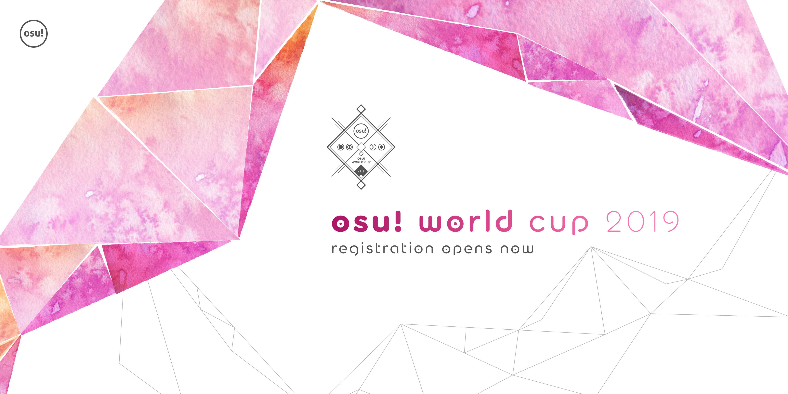
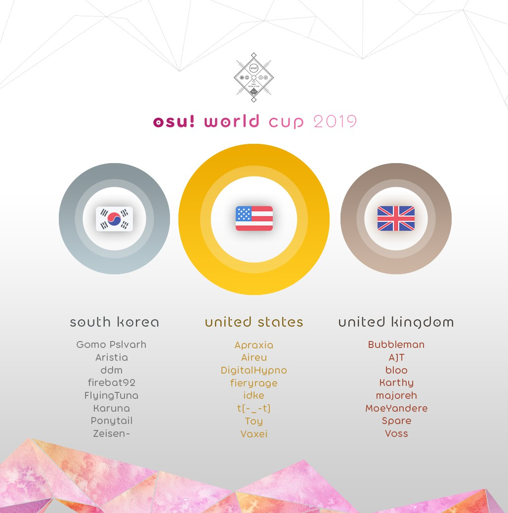

---
tags:
  - OWC 2019
  - OWC2019
---

# osu! World Cup 2019

La **osu! World Cup 2019** (***OWC 2019***) fue un torneo por países organizado por el [osu! team](/wiki/People/osu!_team). Fue la décima edición de la osu! World Cup.

## Calendario del torneo

| Evento | Marca de tiempo |
| --: | :-- |
| Fase de registro | 16/10/2019 - 27/10/2019 |
| Exhibición de la fase de clasificación | 2/11/2019 (14:00 UTC) |
| Fase de clasificación | 9/11/2019 - 10/11/2019 |
| Dieciseisavos de final | 16/11/2019 - 17/11/2019 |
| Octavos de final | 23/11/2019 - 24/11/2019 |
| Cuartos de final | 30/11/2019 - 1/12/2019 |
| Semifinales | 7/12/2019 - 8/12/2019 |
| Finales semana 1 | 14/12/2019 - 15/12/2019 |
| Finales semana 2 | 21/12/2019 - 22/12/2019 |

## Premios

| Posición | Premio(s) |
| :-: | :-- |
|  | 300 $ a cada miembro del equipo, mercancía exclusiva, una insignia única para el perfil, título de usuario «osu! Champion» por un año |
|  | 160 $ a cada miembro del equipo, mercancía exclusiva, una insignia única para el perfil |
|  | 80 $ a cada miembro del equipo, mercancía exclusiva, una insignia única para el perfil |

  

## Organización

La osu! World Cup 2019 estuvo a cargo de varios miembros de la comunidad.

| Posición | Miembro(s) |
| :-- | :-- |
| Administrador | ::{ flag=AR }:: ::juankristal::{ user=443656 }, ::{ flag=CL }:: ::WalterToro::{ user=5281416 } |
| Selector de mapas | ::{ flag=AU }:: ::Kano::{ user=3036203 }, ::{ flag=AT }:: ::Omgforz::{ user=578943 }, ::{ flag=IL }:: ::Xilver15::{ user=3099689 } |
| Árbitro | ::{ flag=PL }:: ::Benzopirene::{ user=1887068 }, ::{ flag=ES }:: ::Deif::{ user=318565 }, ::{ flag=CH }:: ::Icerite::{ user=7226287 }, ::{ flag=AU }:: ::ill onion::{ user=8306102 } ::{ flag=DE }:: ::p3n::{ user=123703 }, ::{ flag=US }:: ::tigereyes144::{ user=6499811 }, ::{ flag=CL }:: ::WalterToro::{ user=5281416 }, ::{ flag=GB }:: ::Yazzehh::{ user=7068973 } |
| Comentarista | ::{ flag=CA }:: ::Azer::{ user=2155578 }, ::{ flag=GB }:: ::Bae-::{ user=6576972 }, ::{ flag=US }:: ::BeasttrollMC::{ user=3171691 }, ::{ flag=GB }:: ::Bubbleman::{ user=5182050 }, ::{ flag=US }:: ::Dohland::{ user=5220511 }, ::{ flag=GB }:: ::Doomsday::{ user=18983 }, ::{ flag=AU }:: ::Kano::{ user=3036203 }, ::{ flag=US }:: ::Monko2k::{ user=4852013 }, ::{ flag=AT }:: ::Omgforz::{ user=578943 }, ::{ flag=US }:: ::this1neguy::{ user=1797189 }, ::{ flag=US }:: ::Toy::{ user=2757689 }, ::{ flag=US }:: ::Will Stetson::{ user=4909088 } |
| Estadístico | ::{ flag=DE }:: ::Nwolf::{ user=1910766 } |

## Enlaces

- [Hilo de discusión](https://osu.ppy.sh/community/forums/topics/973724)
- [Transmisión en vivo](https://www.twitch.tv/osulive)
- [Página de Pick'ems](https://pickem.hwc.hr/tournaments/19) alojada por ::{ flag=DE }:: ::hallowatcher::{ user=1874761 }
- [Challonge de los brackets](https://challonge.com/OWC_2019)
- **[Hoja de estadísticas](https://docs.google.com/spreadsheets/d/e/2PACX-1vREamImW3yN-q3rio2XIFX497uoIoPprEuSqykuPPP9D9WcMfMJQj0bXcBl1ZGxIcm_tPIuoZPk_GFk/pubhtml)**

## Participantes

|  | País | Miembros |
| :-: | :-: | :-- |
| ::{ flag=AR }:: | **Argentina** | **::SlowBurn::{ user=3608846 }**, ::AxelOsu::{ user=1887616 }, ::Cata::{ user=5958063 }, ::Ceja::{ user=4185921 }, ::juliancala::{ user=3272902 }, ::Penguo::{ user=4389490 }, ::Rimi::{ user=5194834 }, ::Zaqlev::{ user=3188703 } |
| ::{ flag=AU }:: | **Australia** | **::GranDSenpai::{ user=3997580 }**, ::ASecretBox::{ user=7341183 }, ::Jordan The Bear::{ user=7477458 }, ::Lunirs::{ user=2118945 }, ::Monk Gyatso::{ user=4012086 }, ::Rairiku::{ user=4945688 }, ::Shiroha::{ user=3068044 }, ::uyghti::{ user=3641404 } |
| ::{ flag=AT }:: | **Austria** | **::goosefedora::{ user=2323131 }**, ::Elscar::{ user=2253511 }, ::Eta Carinae::{ user=5841333 }, ::FeeDyy::{ user=8123308 }, ::Izuko Gaen::{ user=9208576 }, ::Kizan::{ user=3074197 }, ::Teppi::{ user=1371974 }, ::tomadoi::{ user=5712451 } |
| ::{ flag=BE }:: | **Bélgica** | **::Hanori::{ user=7078544 }**, ::\[Sven\]::{ user=3695504 }, ::0w0raiZen::{ user=7835962 }, ::5joshi::{ user=4279650 }, ::Fblade::{ user=3168085 }, ::Jodehh::{ user=6471366 }, ::MetaBee::{ user=3706039 }, ::steen::{ user=9441958 } |
| ::{ flag=BR }:: | **Brasil** | **::MouseEasy::{ user=1558603 }**, ::gilherme boulos::{ user=3618773 }, ::Idealism::{ user=3869519 }, ::Mendigo::{ user=3260571 }, ::Mismagius::{ user=19048 }, ::Mistya::{ user=5403374 }, ::My Angelsim::{ user=3149577 }, ::Mystia::{ user=4277702 } |
| ::{ flag=CA }:: | **Canadá** | **::Azer::{ user=2155578 }**, ::kyle::{ user=2694475 }, ::neuro::{ user=3737401 }, ::RyuK::{ user=6304246 }, ::Stoof::{ user=4916057 }, ::trevrasher::{ user=3893420 }, ::YummyinmyTummy::{ user=5919819 }, ::Yuuki-chan::{ user=7031287 } |
| ::{ flag=CL }:: | **Chile** | **::Danidesu::{ user=2748187 }**, ::\_Riffo::{ user=4514114 }, ::Deruz::{ user=5386106 }, ::-Dylson-::{ user=6315784 }, ::ign::{ user=9360528 }, ::NO37::{ user=4653583 }, ::vitoco::{ user=4282963 }, ::xaxreid::{ user=4227431 } |
| ::{ flag=CN }:: | **China** | **::Crystal::{ user=1646397 }**, ::davidqu2::{ user=6090175 }, ::DuNai::{ user=2522197 }, ::EbisuzawaKurumi::{ user=5791401 }, ::GGBY::{ user=629717 }, ::MyAngelMiku::{ user=7025429 }, ::Sugiura Kanade::{ user=7839397 }, ::TeRiRi::{ user=2142966 } |
| ::{ flag=CZ }:: | **República Checa** | **::Swatty::{ user=1028683 }**, ::- Daichi -::{ user=6602580 }, ::BLooDBuRSTiNG::{ user=3925167 }, ::Electrovoid::{ user=3853840 }, ::Ev1dent::{ user=7125675 }, ::kolgar::{ user=3123488 }, ::Neshpi::{ user=3198446 }, ::VilaZ::{ user=5155680 } |
| ::{ flag=DK }:: | **Dinamarca** | **::Spork Lover::{ user=3417469 }**, ::Akayume::{ user=10617530 }, ::Contaminate::{ user=4694589 }, ::My Aim Zogs::{ user=3722715 }, ::raser1234::{ user=2527887 }, ::Tikzyy::{ user=11380904 }, ::Vandabe::{ user=7050754 }, ::waefwerf::{ user=3868653 } |
| ::{ flag=FI }:: | **Finlandia** | **::Dragonmob::{ user=4990193 }**, ::Freezd::{ user=6524603 }, ::Haadez::{ user=8925266 }, ::Jup3KW::{ user=5424170 }, ::Kenraali::{ user=7341081 }, ::Samoyed::{ user=6796557 }, ::Santeri::{ user=1981187 }, ::Wucki::{ user=5287410 } |
| ::{ flag=FR }:: | **Francia** | **::Musty::{ user=251683 }**, ::Besta::{ user=5189431 }, ::FayeurS::{ user=3105416 }, ::LogicSystem::{ user=7622097 }, ::NerO::{ user=1545031 }, ::-raizen-::{ user=3872987 }, ::ThePooN::{ user=718454 }, ::VROUM CV VITE::{ user=7630971 } |
| ::{ flag=DE }:: | **Alemania** | **::Dustice::{ user=754565 }**, ::Ephix::{ user=3772251 }, ::hallowatcher::{ user=1874761 }, ::imagaK::{ user=2022445 }, ::Knalli::{ user=8147403 }, ::KyoouN::{ user=1458932 }, ::okinamo::{ user=3765989 }, ::Umbre::{ user=2766034 } |
| ::{ flag=HK }:: | **Hong Kong** | **::Chaoslitz::{ user=3621552 }**, ::DenierNezzar::{ user=126144 }, ::Hellotomlol225::{ user=1906975 }, ::Judas::{ user=4720411 }, ::LoliL0ver::{ user=9313951 }, ::mcy4::{ user=2165650 }, ::Petal::{ user=7354729 }, ::Riushi::{ user=2353581 } |
| ::{ flag=HU }:: | **Hungría** | **::Lexion::{ user=5271371 }**, ::csaba21123::{ user=7764237 }, ::emu1337::{ user=2185987 }, ::Kelathis::{ user=10240089 }, ::RatinA0::{ user=3436625 }, ::tralk331::{ user=5039382 }, ::verto::{ user=2015300 }, ::Zyaqix::{ user=6085753 } |
| ::{ flag=ID }:: | **Indonesia** | **::Skydiver::{ user=4750008 }**, ::Ascaveth::{ user=3245206 }, ::Fuma::{ user=1501956 }, ::LoidKun::{ user=6437601 }, ::-Reuto-::{ user=10717635 }, ::Rexeez::{ user=1987591 }, ::Reyuza::{ user=2454767 }, ::smh::{ user=1629553 } |
| ::{ flag=IL }:: | **Israel** | **::Caution::{ user=7082242 }**, ::Galog::{ user=7799629 }, ::Haida::{ user=5682039 }, ::MrPotato::{ user=2787415 }, ::namewithnumber9::{ user=5867839 }, ::Okino may::{ user=7730603 }, ::Psyical::{ user=3181332 } |
| ::{ flag=IT }:: | **Italia** | **::Koba::{ user=4448118 }**, ::Carretto::{ user=3801459 }, ::Kiirochii::{ user=6387149 }, ::Riuzaky::{ user=7165477 }, ::SIMONETRAPANI::{ user=7329177 }, ::Spazza17::{ user=3516241 }, ::Surpy::{ user=9961436 }, ::-Syncro::{ user=4338923 } |
| ::{ flag=JP }:: | **Japón** | **::ShirohaMyMommy::{ user=1603923 }**, ::a\_Blue::{ user=5645667 }, ::dectopia::{ user=2845904 }, ::katatakatata::{ user=3540294 }, ::KonKonKinakoN::{ user=4733185 }, ::Saix::{ user=1713861 }, ::Varvalian::{ user=3345902 }, ::Vento::{ user=4796794 } |
| ::{ flag=LV }:: | **Letonia** | **::waywern2012::{ user=5870453 }**, ::Ayaero::{ user=9533316 }, ::debiloka::{ user=9269034 }, ::ejnah::{ user=11038469 }, ::Emula::{ user=2891792 }, ::honnijs::{ user=6469394 }, ::MegaWhyNOPE::{ user=8676070 }, ::wildtom::{ user=7576357 } |
| ::{ flag=MY }:: | **Malasia** | **::Rampax::{ user=3995630 }**, ::Chiyuu::{ user=8226107 }, ::Desumond::{ user=7399262 }, ::King Hong::{ user=7263047 }, ::NOOB1200::{ user=6932501 }, ::Rumia-::{ user=1787171 }, ::Tzero::{ user=6088976 }, ::Zygody::{ user=3677251 } |
| ::{ flag=MX }:: | **México** | **::Atsuro::{ user=2279351 }**, ::Flameshock::{ user=8349047 }, ::-Hebel-::{ user=6169483 }, ::-Karu::{ user=8429128 }, ::KevstracK::{ user=5325213 }, ::outuyo::{ user=8704992 }, ::Riot::{ user=4256461 }, ::-Wolfy-::{ user=4497582 } |
| ::{ flag=NL }:: | **Países Bajos** | **::Viveliam::{ user=3506793 }**, ::Damnjelly::{ user=1666355 }, ::Drerrie::{ user=5346146 }, ::jackylam5::{ user=1540807 }, ::Lilily::{ user=6502403 }, ::Skyrovania::{ user=4696315 }, ::sunui::{ user=3065571 }, ::taku::{ user=684433 } |
| ::{ flag=NZ }:: | **Nueva Zelanda** | **::shortpotato::{ user=1266102 }**, ::Big Z::{ user=8641416 }, ::Div::{ user=3751116 }, ::DTJump::{ user=9660655 }, ::Feyyy::{ user=2523703 }, ::Nucifera::{ user=5282664 }, ::yellowy246::{ user=3833980 }, ::Zoomer::{ user=6600930 } |
| ::{ flag=NO }:: | **Noruega** | **::YokesPai::{ user=6399568 }**, ::Afrodafro::{ user=3551255 }, ::CXu::{ user=84841 }, ::Fjell::{ user=6951444 }, ::-GN::{ user=895581 }, ::ItsKevZii::{ user=5201225 }, ::Sebu::{ user=3990173 }, ::Warrock::{ user=2841744 } |
| ::{ flag=PH }:: | **Filipinas** | **::konawiki::{ user=4003979 }**, ::elki::{ user=8136525 }, ::fixedbyglue::{ user=8296269 }, ::Milkteaism::{ user=9642774 }, ::MioMilo::{ user=2199427 }, ::xX\_MusicMan\_Xx::{ user=5718989 }, ::Z\_Xyloz::{ user=12040280 }, ::zonelouise::{ user=1492995 } |
| ::{ flag=PL }:: | **Polonia** | **::Bartek22830::{ user=6404027 }**, ::\_demo::{ user=3556891 }, ::Marek Marucha::{ user=2395405 }, ::MrBooM::{ user=1837989 }, ::Rafis::{ user=2558286 }, ::twoj stary::{ user=3543130 }, ::Wakson::{ user=3048222 }, ::WubWoofWolf::{ user=39828 } |
| ::{ flag=PT }:: | **Portugal** | **::King Lizard::{ user=7817891 }**, ::\[ Larssen \]::{ user=5784075 }, ::\[Takaga\]::{ user=7448448 }, ::dat boi waffle::{ user=4215381 }, ::Konam::{ user=4357340 }, ::Legendz::{ user=4333312 }, ::PedroLipton::{ user=3272012 }, ::-SURPRISE-::{ user=11610772 } |
| ::{ flag=RO }:: | **Rumanía** | **::badeu::{ user=1473890 }**, ::\_AfterWind::{ user=2086138 }, ::Chamosiala::{ user=1469892 }, ::cristi2708::{ user=7552300 }, ::eternum::{ user=4581069 }, ::Maxim Bogdan::{ user=5035707 }, ::Rohulk::{ user=3219026 }, ::roliy::{ user=9578404 } |
| ::{ flag=RU }:: | **Federación de Rusia** | **::follon::{ user=3973474 }**, ::Aden::{ user=4342841 }, ::Alumetri::{ user=5371497 }, ::AxewB::{ user=4928776 }, ::Gasha::{ user=7192129 }, ::Okinotori::{ user=4346274 }, ::Red\_Pixel::{ user=4170932 }, ::talala::{ user=1389663 } |
| ::{ flag=SG }:: | **Singapur** | **::GSBlank::{ user=2312106 }**, ::\[-Lockon-\]::{ user=6726331 }, ::Demonical::{ user=5447609 }, ::Emilia::{ user=2003326 }, ::M4-K1::{ user=5210595 }, ::moosepi::{ user=1868745 }, ::Raindrop::{ user=1155871 }, ::Soba Noodles::{ user=3010281 } |
| ::{ flag=SK }:: | **Eslovaquia** | **::Tikef::{ user=9149213 }**, ::AtHeoN::{ user=1770367 }, ::Hranolka::{ user=6149947 }, ::Nikolas::{ user=7759641 }, ::PemiX::{ user=6974470 }, ::PeteX::{ user=1285945 }, ::Teriowom::{ user=6877397 }, ::-YoYo-::{ user=6158076 } |
| ::{ flag=KR }:: | **Corea del Sur** | **::Gomo Pslvarh::{ user=1206417 }**, ::Aristia::{ user=3478883 }, ::ddm::{ user=7910282 }, ::firebat92::{ user=1777162 }, ::FlyingTuna::{ user=9224078 }, ::Karuna::{ user=8775024 }, ::Ponytail::{ user=1516650 }, ::Zeisen-::{ user=7892320 } |
| ::{ flag=ES }:: | **España** | **::ByYoshi14::{ user=4470553 }**, ::AitorAmu::{ user=7781304 }, ::Betwin::{ user=1968481 }, ::CapoeiraDoMorte::{ user=6141330 }, ::In Sane::{ user=5114537 }, ::Rekens::{ user=1073575 }, ::RivenXLukario::{ user=9582556 }, ::Sumo de Laranja::{ user=4744943 } |
| ::{ flag=SE }:: | **Suecia** | **::fcuk::{ user=4844909 }**, ::\[ Blue \]::{ user=4859699 }, ::\[ Coach \]::{ user=2854598 }, ::Fuwzie::{ user=4887814 }, ::Nitroz::{ user=5256529 }, ::Reedkatt::{ user=8335950 }, ::Saika0k1::{ user=4316633 }, ::Sonix::{ user=4029000 } |
| ::{ flag=CH }:: | **Suiza** | **::Ayeka::{ user=7225922 }**, ::\[NoTitle\]::{ user=9602606 }, ::Akani::{ user=2323137 }, ::CeriixZ::{ user=9533853 }, ::Mytlex::{ user=7045024 }, ::Nemesis1925::{ user=10394866 }, ::Niven::{ user=5297955 }, ::Scarlet rawr::{ user=4521911 } |
| ::{ flag=TW }:: | **Taiwán** | **::Shiina Noriko::{ user=1285637 }**, ::\[ Zane \]::{ user=3517706 }, ::\_Shield::{ user=1860489 }, ::Flask::{ user=959763 }, ::GfMRT::{ user=3163649 }, ::Rizer::{ user=5155973 }, ::Rucker::{ user=147515 }, ::-Snowy-::{ user=6237416 } |
| ::{ flag=TR }:: | **Turquía** | **::heyronii::{ user=5642779 }**, ::AkashiDagara::{ user=6118485 }, ::black person::{ user=6592904 }, ::edizberkserbest::{ user=9256771 }, ::egemenbsrms::{ user=4520477 }, ::Raikouhou::{ user=8007528 }, ::Seigi::{ user=9799010 } |
| ::{ flag=UA }:: | **Ucrania** | **::kug1::{ user=6997572 }**, ::allein::{ user=6221637 }, ::blednak::{ user=912627 }, ::Kryterion::{ user=9920144 }, ::NN4::{ user=9819240 }, ::Sadness::{ user=6560835 }, ::Tooqie::{ user=9203015 }, ::Virgo::{ user=5249196 } |
| ::{ flag=GB }:: | **Reino Unido** | **::Bubbleman::{ user=5182050 }**, ::AJT::{ user=3181083 }, ::bloo::{ user=6778877 }, ::Karthy::{ user=4196808 }, ::majoreh::{ user=7959222 }, ::MoeYandere::{ user=2565902 }, ::Spare::{ user=2204373 }, ::Voss::{ user=7657761 } |
| ::{ flag=US }:: | **Estados Unidos** | **::Apraxia::{ user=4194445 }**, ::Aireu::{ user=1650010 }, ::DigitalHypno::{ user=4384207 }, ::fieryrage::{ user=3533958 }, ::idke::{ user=4650315 }, ::t\[-\_-t\]::{ user=2644828 }, ::Toy::{ user=2757689 }, ::Vaxei::{ user=4787150 } |
| ::{ flag=UY }:: | **Uruguay** | **::Daanit::{ user=6159669 }**, ::Madozito::{ user=4054429 }, ::Makoto chan::{ user=8987016 }, ::-PloX::{ user=6404583 }, ::Rebo::{ user=6942259 }, ::Rekaru::{ user=4152967 }, ::-Ritsumi-::{ user=5218320 }, ::Snepif::{ user=408088 } |
| ::{ flag=VN }:: | **Vietnam** | **::Tuon::{ user=6673790 }**, ::- Eucliwood -::{ user=1587427 }, ::boylanklunk\_9x::{ user=7050175 }, ::Hoaq::{ user=7696512 }, ::iPhong::{ user=8621733 }, ::Shironi::{ user=8660120 }, ::Ui chan::{ user=5449433 } |

## Podio

## Mappools

### Finales semana 2

- NoMod
  1. [wowaka - Unhappy Refrain (BarkingMadDog) \[EX Extreme\]](https://osu.ppy.sh/beatmapsets/1075607#osu/2250670)
  2. [ARForest - Metheus (FrenZ396) \[Finale\]](https://osu.ppy.sh/beatmapsets/1078954#osu/2257502)
  3. [T.M.Generation - X-DEN (Realazy) \[Chuuden\]](https://osu.ppy.sh/beatmapsets/961061#osu/2012009)
  4. [Emiru no Aishita Tsukiyo ni Dai San Gensou Kyoku wo - ito (Lasse) \[Petal\]](https://osu.ppy.sh/beatmapsets/1077982#osu/2255709)
  5. [Cattle Decapitation - Your Disposal (Chanci) \[Eradication\]](https://osu.ppy.sh/beatmapsets/988109#osu/2207855)
  6. [SHO - Plain Asia \~ Guardian of the Village (Jenny) \[Unmodified Girlfriend\]](https://osu.ppy.sh/beatmapsets/299884#osu/2255738)
- Hidden
  1. [James Landino - Hide And Seek (Mirash) \[Expert\]](https://osu.ppy.sh/beatmapsets/972932#osu/2036903)
  2. [Hikutsu-P - Dance of Many (IOException) \[Expert\]](https://osu.ppy.sh/beatmapsets/1078746#osu/2257140)
  3. [xi - Mirage Garden (P o M u T a) \[Exitra\]](https://osu.ppy.sh/beatmapsets/319940#osu/712015)
- HardRock
  1. [ZAQ - Seven Doors (SkyFlame) \[Trinity Soul\]](https://osu.ppy.sh/beatmapsets/1078911#osu/2257421)
  2. [Negentropy (a.k.a. Team Grimoire) - ouroVoros (Suzuki\_1112) \[Regou's Extra\]](https://osu.ppy.sh/beatmapsets/707164#osu/1512325)
  3. [otetsu - Yokuatsu Sakuran Girl (ZZHBOY) \[HW's Expert\]](https://osu.ppy.sh/beatmapsets/195582#osu/499839)
- DoubleTime
  1. [Aki - star river (ShirohaMyMommy) \[Lunatic\]](https://osu.ppy.sh/beatmapsets/908990#osu/1896891)
  2. [-45 - Midorigo Queen Bee (Luscent) \[Collapse\]](https://osu.ppy.sh/beatmapsets/1055780#osu/2206544)
  3. [TOKINE - Soko ni Aru Mono (Patchouli) \[Lunatic\]](https://osu.ppy.sh/beatmapsets/70137#osu/434536)
  4. [Andromedik - Invasion (Mirash) \[NeilBot's Insane\]](https://osu.ppy.sh/beatmapsets/789544#osu/1656914)
- FreeMod
  1. [SHK - Imagination (ktgster) \[SHD\]](https://osu.ppy.sh/beatmapsets/1078340#osu/2256378)
  2. [paraoka - boot (Natteke desu) \[difficulty\]](https://osu.ppy.sh/beatmapsets/913680#osu/1908543)
  3. [S.S.H. - Holy Orders (Deif) \[LKs\]](https://osu.ppy.sh/beatmapsets/31750#osu/104842)
- Desempate
  1. **[Falcom Sound Team jdk - GENS D'ARMES (jonathanlfj) \[CONQUEROR\]](https://osu.ppy.sh/beatmapsets/1078344#osu/2256387)**

### Finales semana 1

- NoMod
  1. [FujuniseikouyuuP - Sayonara Lechenaultia (Meg) \[Collab EXTRA\]](https://osu.ppy.sh/beatmapsets/703769#osu/1488898)
  2. [Ryu\* vs. L.E.D.-G vs. ZUN - PARADISE GHOST (Leader) \[Extra Stage\]](https://osu.ppy.sh/beatmapsets/1074982#osu/2249464)
  3. [lapix - Labyrinth (Akali) \[Who's the fucking gangster?\]](https://osu.ppy.sh/beatmapsets/615878#osu/1299008)
  4. [Co shu Nie - asphyxia (Gillstar) \[constriction\]](https://osu.ppy.sh/beatmapsets/895512#osu/1871128)
  5. [Yorushika - Hachigatsu, Bou, Tsukiakari (Delis) \[Collab Extra\]](https://osu.ppy.sh/beatmapsets/963814#osu/2017880)
  6. [Pastel\*Palettes - Happy Synthesizer (ktgster) \[Special\]](https://osu.ppy.sh/beatmapsets/932654#osu/1947213)
- Hidden
  1. [lapix - Nexta (Realazy) \[NEUROTRANSMISSION\]](https://osu.ppy.sh/beatmapsets/1050635#osu/2195883)
  2. [LiLA\'c Records - Maze of Vapor (Brutal Core mix) (Mirash) \[Extra\]](https://osu.ppy.sh/beatmapsets/1075008#osu/2249551)
  3. [DragonForce - Ring of Fire (MashaSG) \[sdafsf's Extreme\]](https://osu.ppy.sh/beatmapsets/717015#osu/1634985)
- HardRock
  1. [Hatsune Miku - Electric Love (t+pazolite Overcute Remix) (Zapy) \[Overcute\]](https://osu.ppy.sh/beatmapsets/50373#osu/154853)
  2. [Camellia - Proluvies (Priti) \[Ultra\]](https://osu.ppy.sh/beatmapsets/283815#osu/641605)
  3. [Nekomata Master+ - squall (Reisen Udongein) \[Extra\]](https://osu.ppy.sh/beatmapsets/127772#osu/323907)
- DoubleTime
  1. [kozato - Izayoi Sakura (Gust) \[Firika's Insane\]](https://osu.ppy.sh/beatmapsets/893573#osu/1895932)
  2. [Niko - Night of Fire (Gabi) \[Insane\]](https://osu.ppy.sh/beatmapsets/18923#osu/66820)
  3. [Draw the Emotional - Morning glow (UnitedWeSin) \[Lunatic\]](https://osu.ppy.sh/beatmapsets/146626#osu/363298)
  4. [HuMeR - ChaserXX (Realazy) \[KKip's Another\]](https://osu.ppy.sh/beatmapsets/930846#osu/2066790)
- FreeMod
  1. [Nanamori-chu \* Goraku-bu - Happy Time wa Owaranai (deadcode) \[Expert\]](https://osu.ppy.sh/beatmapsets/935707#osu/1954858)
  2. [Getty vs. DJ DiA - DropZ-Line- (Realazy) \[IOException's Extra\]](https://osu.ppy.sh/beatmapsets/727049#osu/1702072)
  3. [SOUND HOLIC vs. dj TAKA feat. YURiCa - TIEFSEE (celerih) \[Expert\]](https://osu.ppy.sh/beatmapsets/928646#osu/1939633)
- Desempate
  1. **[Fuki - Sacred Bones Riot (IsomirDiAngelo) \[Slay My Sins\]](https://osu.ppy.sh/beatmapsets/1009680#osu/2248906)**

### Semifinales

- NoMod
  1. [Roselia - LOUDER (SkyFlame) \[EVEN LOUDER\]](https://osu.ppy.sh/beatmapsets/1040095#osu/2173926)
  2. [Festa - Lemuria (QuiescentRabbit) \[Isolation Singularity\]](https://osu.ppy.sh/beatmapsets/835474#osu/1749822)
  3. [lapix - Nothing but Theory (azr8) \[ultra jazzfunktion\]](https://osu.ppy.sh/beatmapsets/914146#osu/1924570)
  4. [Sumireko Hanabusa (CV: Miho Arakawa) - Inochi no Karakuri (Atalanta) \[The Queen\]](https://osu.ppy.sh/beatmapsets/1061614#osu/2223096)
  5. [S.S.H. - The Decisive Battle with the Fugitives (sjoy) \[Extra\]](https://osu.ppy.sh/beatmapsets/145215#osu/360345)
  6. [Chon - Sleepy Tea (piroshki) \[Elogium\]](https://osu.ppy.sh/beatmapsets/959788#osu/2009509)
- Hidden
  1. [positive MAD-crew - Lapistoria no Yakusoku (Rigid Blue Remains) (Shirasaka Koume) \[Ex\]](https://osu.ppy.sh/beatmapsets/549158#osu/1162919)
  2. [sasakure.UK - Good Bye, Mr. Jack (Xilver15) \[ReMiX\]](https://osu.ppy.sh/beatmapsets/586425#osu/1241924)
  3. [umu. - humanly (Luscent) \[Expert\]](https://osu.ppy.sh/beatmapsets/1045518#osu/2185651)
- HardRock
  1. [Sokoninaru - Tenohira de Odoru (Snepif) \[Extreme\]](https://osu.ppy.sh/beatmapsets/773686#osu/1641323)
  2. [Mitsuyoshi Takenobu no Ani - Amphisbaena (toybot) \[Demonic Another\]](https://osu.ppy.sh/beatmapsets/576022#osu/1219592)
  3. [HyuN - Grin (ktgster) \[Expert\]](https://osu.ppy.sh/beatmapsets/947770#osu/1982581)
- DoubleTime
  1. [yurika - THE EVENING STAR (y u z u k i) \[Lunatic\]](https://osu.ppy.sh/beatmapsets/27706#osu/92762)
  2. [Yumeji Ruri - The answer BLOOD \~Senketsu no Michishirube\~ (Short Ver.) (Star Stream) \[S.S\]](https://osu.ppy.sh/beatmapsets/52586#osu/160712)
  3. [Hatsunetsumiko's - Two Fates (happy30) \[Destiny\]](https://osu.ppy.sh/beatmapsets/301400#osu/675854)
  4. [Masayoshi Minoshima - Bad Apple!! feat.nomico (Nhato Remix) (Akareh) \[Limbo\]](https://osu.ppy.sh/beatmapsets/616378#osu/1299942)
- FreeMod
  1. [Tamaonsen - COZMIC DRIVE feat.Youko (caren\_sk) \[CRN MORE DRIVE\]](https://osu.ppy.sh/beatmapsets/78859#osu/220330)
  2. [RYO - Shuffle Heaven (Nemis) \[eXtra\]](https://osu.ppy.sh/beatmapsets/85802#osu/235470)
  3. [TatshMusicCircle - Raikou -3rd Desire- (Kite) \[Extra\]](https://osu.ppy.sh/beatmapsets/143316#osu/1836851)
- Desempate
  1. **[Camellia - epimerization (Azer) \[Collab\]](https://osu.ppy.sh/beatmapsets/752677#osu/1584614)**

### Cuartos de final

- NoMod
  1. [Nekomata Master - Despair of Elferia (-Tochi) \[ANIMUM DESPONDEO\]](https://osu.ppy.sh/beatmapsets/1069504#osu/2238810)
  2. [xi - over the top (Kroytz) \[broccoly's extreme\]](https://osu.ppy.sh/beatmapsets/479215#osu/1242897)
  3. [sky\_delta - Midnight City Warfare (lcfc) \[Extreme\]](https://osu.ppy.sh/beatmapsets/1008607#osu/2111383)
  4. [ZUTOMAYO - Kan Saete Kuyashiiwa (Nathan) \[geragera\]](https://osu.ppy.sh/beatmapsets/1001507#osu/2096523)
  5. [Denkishiki Karen Ongaku Shuudan - Owari Tsumugishi Mono (LMT) \[Lasse's Extra\]](https://osu.ppy.sh/beatmapsets/763607#osu/1711326)
  6. [Tokyo Jihen - Sounan (Uberzolik) \[Ayaya's Extra\]](https://osu.ppy.sh/beatmapsets/967321#osu/2031053)
- Hidden
  1. [penoreri - Sailing Force (BarkingMadDog) \[MAXIMUM\]](https://osu.ppy.sh/beatmapsets/893700#osu/1867667)
  2. [BUTAOTOME - Towa no Maigo (Icekalt) \[It was all a dream\]](https://osu.ppy.sh/beatmapsets/1069288#osu/2238398)
  3. [Igorrr - Unpleasant Sonata (Sieg) \[Pagli's Sonata\]](https://osu.ppy.sh/beatmapsets/90385#osu/262302)
- HardRock
  1. [XX:me - Escape (jonathanlfj) \[Freedom\]](https://osu.ppy.sh/beatmapsets/811119#osu/1701563)
  2. [An - Catanoph (Ryuusei Aika) \[Miura's Extra\]](https://osu.ppy.sh/beatmapsets/775846#osu/1697021)
  3. [P4koo - Crystal Illusion (Beomsan) \[milr\_'s Expert\]](https://osu.ppy.sh/beatmapsets/797393#osu/1676675)
- DoubleTime
  1. [Ax feat.Natsukawa Yoko - Sakimori Renka (Long Version) (Seikatu) \[Insane\]](https://osu.ppy.sh/beatmapsets/477999#osu/1021024)
  2. [senya - Magica (Satellite) \[SatelliteFrostMix\]](https://osu.ppy.sh/beatmapsets/91791#osu/248474)
  3. [HAG - Koe (C O N N E R) \[Insane\]](https://osu.ppy.sh/beatmapsets/798510#osu/1676795)
  4. [Halozy - Heart of Night (Chaoslitz) \[Life of Loneliness\]](https://osu.ppy.sh/beatmapsets/462878#osu/991229)
- FreeMod
  1. [HyuN - Tokyo's Starlight (Pho) \[Collab Extra\]](https://osu.ppy.sh/beatmapsets/891712#osu/1864175)
  2. [mafumafu - Kakushigoto (Vert) \[0108's Extra.\]](https://osu.ppy.sh/beatmapsets/770023#osu/1680481)
  3. [A.SAKA - Nanatsu Issenzakura (yf\_bmp) \[Ayaya's Expert\]](https://osu.ppy.sh/beatmapsets/513731#osu/1493332)
- Desempate
  1. **[Oreore-Usagi - Reset My Refrain (captin1) \[Reset\]](https://osu.ppy.sh/beatmapsets/485103#osu/1034570)**

### Octavos de final

- NoMod
  1. [BUTAOTOME - Yokubou no Kozuchi (BarkingMadDog) \[Mallet of Desires\]](https://osu.ppy.sh/beatmapsets/1065419#osu/2230996)
  2. [m108 - XIII Charlotte (Cherry Blossom) \[yumenother\]](https://osu.ppy.sh/beatmapsets/678383#osu/1434424)
  3. [Camellia - kodama (ProfessionalBox) \[Yamabiko\]](https://osu.ppy.sh/beatmapsets/488016#osu/1040424)
  4. [Zutto Mayonaka de Ii no ni. - Humanoid (Meg) \[Collab\]](https://osu.ppy.sh/beatmapsets/972298#osu/2035761)
  5. [sakuzyo - Senkyou Ranbu (ktgster) \[EX\]](https://osu.ppy.sh/beatmapsets/460516#osu/986233)
- Hidden
  1. [cosMo@BousouP feat. Hatsune Miku - Shinsekai (jonathanlfj) \[New World\]](https://osu.ppy.sh/beatmapsets/318557#osu/709313)
  2. [onoken - Quinine -A2D SIDE- (Matrix) \[ExtrA\]](https://osu.ppy.sh/beatmapsets/932298#osu/1946518)
- HardRock
  1. [Fujimiya Kaori (CV: Amamiya Sora) - Kanade (Shadren Remix) (schoolboy) \[FCL's Extreme\]](https://osu.ppy.sh/beatmapsets/741193#osu/1618753)
  2. [DJ TOTTO VS TOTTO - vajra (Kloyd) \[Expert\]](https://osu.ppy.sh/beatmapsets/287377#osu/648443)
- DoubleTime
  1. [3L - Spring of Dreams (Trust) \[Lunatic\]](https://osu.ppy.sh/beatmapsets/739119#osu/1559749)
  2. [Hatsuki Yura - Halloween of the Dead (Gamu) \[Insane\]](https://osu.ppy.sh/beatmapsets/1041518#osu/2184660)
  3. [Hanatan - Kitsune no Yomeiri (Ryafuka) \[Kitsuneko\]](https://osu.ppy.sh/beatmapsets/46070#osu/144387)
- FreeMod
  1. [NegaRen - A Bunch Of Samples Played Consecutively (Mao) \[Is It Halloween Yet?\]](https://osu.ppy.sh/beatmapsets/480553#osu/1025871)
  2. [Liz Triangle - Immortal Philosophy (Jounzan) \[Sisterly Love\]](https://osu.ppy.sh/beatmapsets/941212#osu/1965586)
- Desempate
  1. **[Shimotsuki Haruka - Youka to Yumeutsutsu (-Tochi) \[Awake\]](https://osu.ppy.sh/beatmapsets/657208#osu/1392159)**

### Dieciseisavos de final

- NoMod
  1. [Tadokoro Azusa - Junshin Always (Yasaija 714) \[Extra\]](https://osu.ppy.sh/beatmapsets/838515#osu/1755497)
  2. [cosMo@BousouP - For UltraPlayers (toybot) \[INFINITE\]](https://osu.ppy.sh/beatmapsets/1062625#osu/2225237)
  3. [Function Phantom - Variable (Chaoslitz) \[Deluxe\]](https://osu.ppy.sh/beatmapsets/751774#osu/1582594)
  4. [Reol,nqrse - Ooedo Ranvu (zhu) \[Expert\]](https://osu.ppy.sh/beatmapsets/703580#osu/1572141)
  5. [AAAA - carnation (Veridian) \[black another\]](https://osu.ppy.sh/beatmapsets/677687#osu/1433158)
- Hidden
  1. [Sakuzyo - Amenohoakari (Firis Mistlud) \[Fiura's Miyabi\]](https://osu.ppy.sh/beatmapsets/671056#osu/1419003)
  2. [Denkishiki Karen Ongaku Shuudan - Silver Orbit (Lasse) \[Despair\]](https://osu.ppy.sh/beatmapsets/1062758#osu/2225505)
- HardRock
  1. [HO-KAGO TEA TIME - Tokimeki Sugar (Yogurtt) \[extra\]](https://osu.ppy.sh/beatmapsets/496985#osu/1057962)
  2. [Yooh - Dynasty (Sylith) \[HalLoWeeN's EXHAUST\]](https://osu.ppy.sh/beatmapsets/149648#osu/374776)
- DoubleTime
  1. [Eri Sasaki - Ring of Fortune (Cherry Blossom) \[Memories\]](https://osu.ppy.sh/beatmapsets/347875#osu/792303)
  2. [Ceui - Seisen Spectale (Xinely) \[Valhalla\]](https://osu.ppy.sh/beatmapsets/92542#osu/250180)
  3. [ALiCE'S EMOTiON - Foughten Field (Natsu) \[Lunatic\]](https://osu.ppy.sh/beatmapsets/366643#osu/806465)
- FreeMod
  1. [Yorushika - Yuunagi, Bou, Hana Madoi (Delis) \[Extra\]](https://osu.ppy.sh/beatmapsets/1029921#osu/2153558)
  2. [LeaF - MEPHISTO (Alumetorz) \[Extra\]](https://osu.ppy.sh/beatmapsets/106212#osu/278451)
- Desempate
  1. **[gmtn. vs. kozato (fw. LUZE) - squartatrice (Morinaga) \[Skystar's Descent\]](https://osu.ppy.sh/beatmapsets/679272#osu/1436329)**

### Clasificatorias

- NoMod
  1. [Mimori Suzuko - Light for Knight (\_kotachi\_) \[Destiny(New ver.)\]](https://osu.ppy.sh/beatmapsets/801337#osu/2218600)
  2. [Mastermind(xi+nora2r) - Dreadnought (Cherry Blossom) \[Final Destination\]](https://osu.ppy.sh/beatmapsets/361306#osu/793845)
  3. [Toby Fox - Chaos King (Fatfan Kolek) \[Mirash's Expert\]](https://osu.ppy.sh/beatmapsets/877955#osu/1849148)
  4. [Eagle - Hypersonik (Mir) \[Speed Demon\]](https://osu.ppy.sh/beatmapsets/1059448#osu/2218604)
- Hidden
  1. [m@sumi - Hengen Jizai (thzz) \[Extra\]](https://osu.ppy.sh/beatmapsets/595456#osu/1259186)
  2. [xi - Halcyon (gowww) \[Another\]](https://osu.ppy.sh/beatmapsets/20871#osu/73699)
- HardRock
  1. [Wolpis Carter - f.o.f (dkblaze) \[Listle's Extra\]](https://osu.ppy.sh/beatmapsets/924322#osu/2044512)
  2. [ginkiha - Oriens (Kloyd) \[Expert\]](https://osu.ppy.sh/beatmapsets/182271#osu/437202)
- DoubleTime
  1. [senya - Shounen yo, Tokkou no Sakigake to Nare (-Mo-) \[Narcissu's Insane\]](https://osu.ppy.sh/beatmapsets/562169#osu/1188553)
  2. [Yellow Zebra - Melody! (wcx19911123) \[Lunatic\]](https://osu.ppy.sh/beatmapsets/45450#osu/142099)

## Resultados de los partidos

### Finales semana 2

Sábado, 21 de diciembre de 2019:

| Equipo 1 |  |  | Equipo 2 | Enlance del partido |
| --: | :-: | :-: | :-- | :-- |
| Reino Unido ::{ flag=GB }:: | 6 | **7** | ::{ flag=KR }:: **Corea del Sur** | [#1](https://osu.ppy.sh/community/matches/57136609) |

Domingo, 22 de diciembre de 2019:

| Equipo 1 |  |  | Equipo 2 | Enlance del partido |
| --: | :-: | :-: | :-- | :-- |
| **Estados Unidos** ::{ flag=US }:: | **7** | 0 | ::{ flag=KR }:: Corea del Sur | [#1](https://osu.ppy.sh/community/matches/57155016) |

### Finales semana 1

Sábado, 14 de diciembre de 2019:

| Equipo 1 |  |  | Equipo 2 | Enlance del partido |
| --: | :-: | :-: | :-- | :-- |
| Federación de Rusia ::{ flag=RU }:: | 5 | **7** | ::{ flag=KR }:: **Corea del Sur** | [#1](https://osu.ppy.sh/community/matches/56966806) |
| **Alemania** ::{ flag=DE }:: | **7** | 0 | ::{ flag=CA }:: Canadá | [#1](https://osu.ppy.sh/community/matches/56976278) |

Domingo, 15 de diciembre de 2019:

| Equipo 1 |  |  | Equipo 2 | Enlance del partido |
| --: | :-: | :-: | :-- | :-- |
| Alemania ::{ flag=DE }:: | 4 | **7** | ::{ flag=KR }:: **Corea del Sur** | [#1](https://osu.ppy.sh/community/matches/56997003) |
| **Estados Unidos** ::{ flag=US }:: | **7** | 0 | ::{ flag=GB }:: Reino Unido | [#1](https://osu.ppy.sh/community/matches/57007868) |

### Semifinales

Sábado, 7 de diciembre de 2019:

| Equipo 1 |  |  | Equipo 2 | Enlance del partido |
| --: | :-: | :-: | :-- | :-- |
| Australia ::{ flag=AU }:: | 3 | **6** | ::{ flag=HK }:: **Hong Kong** | [#1](https://osu.ppy.sh/community/matches/56794699) |
| Taiwán ::{ flag=TW }:: | 4 | **6** | ::{ flag=KR }:: **Corea del Sur** | [#1](https://osu.ppy.sh/community/matches/56796751) |
| **Estados Unidos** ::{ flag=US }:: | **6** | 0 | ::{ flag=RU }:: Federación de Rusia | [#1](https://osu.ppy.sh/community/matches/56805726) |
| Rumanía ::{ flag=RO }:: | 4 | **6** | ::{ flag=BR }:: **Brasil** | [#1](https://osu.ppy.sh/community/matches/56805696) |
| **Canadá** ::{ flag=CA }:: | **6** | 3 | ::{ flag=PL }:: Polonia | [#1](https://osu.ppy.sh/community/matches/56812733) |

Domingo, 8 de diciembre de 2019:

| Equipo 1 |  |  | Equipo 2 | Enlance del partido |
| --: | :-: | :-: | :-- | :-- |
| **Canadá** ::{ flag=CA }:: | **6** | 2 | ::{ flag=HK }:: Hong Kong | [#1](https://osu.ppy.sh/community/matches/56819778) |
| Brasil ::{ flag=BR }:: | 1 | **6** | ::{ flag=KR }:: **Corea del Sur** | [#1](https://osu.ppy.sh/community/matches/56829847) |
| **Reino Unido** ::{ flag=GB }:: | **6** | 4 | ::{ flag=DE }:: Alemania | [#1](https://osu.ppy.sh/community/matches/56832071) |

### Cuartos de final

Sábado, 30 de noviembre de 2019:

| Equipo 1 |  |  | Equipo 2 | Enlance del partido |
| --: | :-: | :-: | :-- | :-- |
| **Polonia** ::{ flag=PL }:: | **6** | 1 | ::{ flag=NZ }:: Nueva Zelanda | [#1](https://osu.ppy.sh/community/matches/56626592) |
| **Corea del Sur** ::{ flag=KR }:: | **6** | 2 | ::{ flag=JP }:: Japón | [#1](https://osu.ppy.sh/community/matches/56627888) |
| **Hong Kong** ::{ flag=HK }:: | **6** | 5 | ::{ flag=AT }:: Austria | [#1](https://osu.ppy.sh/community/matches/56629467) |
| **Indonesia** ::{ flag=ID }:: | **6** | 3 | ::{ flag=SG }:: Singapur | [#1](https://osu.ppy.sh/community/matches/56631668) |
| **China** ::{ flag=CN }:: | **6** | 1 | ::{ flag=SE }:: Suecia | [#1](https://osu.ppy.sh/community/matches/56634054) |
| Países Bajos ::{ flag=NL }:: | 1 | **6** | ::{ flag=IT }:: **Italia** | [#1](https://osu.ppy.sh/community/matches/56636595) |
| **Francia** ::{ flag=FR }:: | **6** | 1 | ::{ flag=CL }:: Chile | [#1](https://osu.ppy.sh/community/matches/56642089) |
| **Brasil** ::{ flag=BR }:: | **6** | 1 | ::{ flag=NO }:: Noruega | [#1](https://osu.ppy.sh/community/matches/56644815) |

Domingo, 1 de diciembre de 2019:

| Equipo 1 |  |  | Equipo 2 | Enlance del partido |
| --: | :-: | :-: | :-- | :-- |
| **Estados Unidos** ::{ flag=US }:: | **6** | 1 | ::{ flag=AU }:: Australia | [#1](https://osu.ppy.sh/community/matches/56652543) |
| **Corea del Sur** ::{ flag=KR }:: | **6** | 0 | ::{ flag=FR }:: Francia | [#1](https://osu.ppy.sh/community/matches/56660231) |
| **Brasil** ::{ flag=BR }:: | **6** | 4 | ::{ flag=ID }:: Indonesia | [#1](https://osu.ppy.sh/community/matches/56662222) |
| **Italia** ::{ flag=IT }:: | 3 | **6** | ::{ flag=HK }:: **Hong Kong** | [#1](https://osu.ppy.sh/community/matches/56662230) |
| **Reino Unido** ::{ flag=GB }:: | **6** | 3 | ::{ flag=TW }:: Taiwán | [#1](https://osu.ppy.sh/community/matches/56662918) |
| China ::{ flag=CN }:: | 1 | **6** | ::{ flag=PL }:: **Polonia** | [#1](https://osu.ppy.sh/community/matches/56664503) |
| **Rumanía** ::{ flag=RO }:: | 5 | **6** | ::{ flag=DE }:: **Alemania** | [#1](https://osu.ppy.sh/community/matches/56666462) |
| **Canadá** ::{ flag=CA }:: | 2 | **6** | ::{ flag=RU }:: **Federación de Rusia** | [#1](https://osu.ppy.sh/community/matches/56668684) |

### Octavos de final

Sábado, 23 de noviembre de 2019:

| Equipo 1 |  |  | Equipo 2 | Enlance del partido |
| --: | :-: | :-: | :-- | :-- |
| **Alemania** ::{ flag=DE }:: | **5** | 1 | ::{ flag=CN }:: China | [#1](https://osu.ppy.sh/community/matches/56466754) |
| Dinamarca ::{ flag=DK }:: | 2 | **5** | ::{ flag=SG }:: **Singapur** | [#1](https://osu.ppy.sh/community/matches/56467513) |
| **Taiwán** ::{ flag=TW }:: | **5** | 1 | ::{ flag=NL }:: Países Bajos | [#1](https://osu.ppy.sh/community/matches/56471138) |
| República Checa ::{ flag=CZ }:: | 3 | **5** | ::{ flag=IT }:: **Italia** | [#1](https://osu.ppy.sh/community/matches/56472962) |
| Turquía ::{ flag=TR }:: | 1 | **5** | ::{ flag=SE }:: **Suecia** | [#1](https://osu.ppy.sh/community/matches/56472920) |
| **Estados Unidos** ::{ flag=US }:: | **5** | 1 | ::{ flag=FR }:: Francia | [#1](https://osu.ppy.sh/community/matches/56476625) |
| **Chile** ::{ flag=CL }:: | **5** | 3 | ::{ flag=MX }:: México | [#1](https://osu.ppy.sh/community/matches/56478465) |

Domingo, 24 de noviembre de 2019:

| Equipo 1 |  |  | Equipo 2 | Enlance del partido |
| --: | :-: | :-: | :-- | :-- |
| **Canadá** ::{ flag=CA }:: | **5** | 0 | ::{ flag=ID }:: Indonesia | [#1](https://osu.ppy.sh/community/matches/56487811) |
| **Finlandia** ::{ flag=FI }:: | 3 | **5** | ::{ flag=NZ }:: **Nueva Zelanda** | [#1](https://osu.ppy.sh/community/matches/56492906) |
| **Australia** ::{ flag=AU }:: | **5** | 2 | ::{ flag=KR }:: Corea del Sur | [#1](https://osu.ppy.sh/community/matches/56493770) |
| **Reino Unido** ::{ flag=GB }:: | **5** | 3 | ::{ flag=HK }:: Hong Kong | [#1](https://osu.ppy.sh/community/matches/56495679) |
| España ::{ flag=ES }:: | 0 | **5** | ::{ flag=JP }:: **Japón** | [#1](https://osu.ppy.sh/community/matches/56497207) |
| Letonia ::{ flag=LV }:: | 0 | **5** | ::{ flag=NO }:: **Noruega** | [#1](https://osu.ppy.sh/community/matches/56498749) |
| **Bélgica** ::{ flag=BE }:: | 2 | **5** | ::{ flag=AT }:: **Austria** | [#1](https://osu.ppy.sh/community/matches/56500421) |
| **Brasil** ::{ flag=BR }:: | 2 | **5** | ::{ flag=RU }:: **Federación de Rusia** | [#1](https://osu.ppy.sh/community/matches/56501739) |
| **Polonia** ::{ flag=PL }:: | 2 | **5** | ::{ flag=RO }:: **Rumanía** | [#1](https://osu.ppy.sh/community/matches/56503201) |

### Dieciseisavos de final

Sábado, 16 de noviembre de 2019:

| Equipo 1 |  |  | Equipo 2 | Enlance del partido |
| --: | :-: | :-: | :-- | :-- |
| **Australia** ::{ flag=AU }:: | **5** | 0 | ::{ flag=FI }:: Finlandia | [#1](https://osu.ppy.sh/community/matches/56299664) |
| **Hong Kong** ::{ flag=HK }:: | **5** | 2 | ::{ flag=NO }:: Noruega | [#1](https://osu.ppy.sh/community/matches/56300777) |
| **Indonesia** ::{ flag=ID }:: | **5** | 3 | ::{ flag=IT }:: Italia | [#1](https://osu.ppy.sh/community/matches/56303550) |
| **Países Bajos** ::{ flag=NL }:: | **5** | 2 | ::{ flag=SG }:: Singapur | [#1](https://osu.ppy.sh/community/matches/56303396) |
| **Federación de Rusia** ::{ flag=RU }:: | **5** | 2 | ::{ flag=AT }:: Austria | [#1](https://osu.ppy.sh/community/matches/56305124) |
| **Polonia** ::{ flag=PL }:: | **5** | 1 | ::{ flag=ES }:: España | [#1](https://osu.ppy.sh/community/matches/56309238) |
| **Estados Unidos** ::{ flag=US }:: | **5** | 1 | ::{ flag=TR }:: Turquía | [#1](https://osu.ppy.sh/community/matches/56310902) |
| **Brasil** ::{ flag=BR }:: | **5** | 1 | ::{ flag=BE }:: Bélgica | [#1](https://osu.ppy.sh/community/matches/56312743) |

Domingo, 17 de noviembre de 2019:

| Equipo 1 |  |  | Equipo 2 | Enlance del partido |
| --: | :-: | :-: | :-- | :-- |
| **China** ::{ flag=CN }:: | **5** | 2 | ::{ flag=MX }:: México | [#1](https://osu.ppy.sh/community/matches/56323868) |
| **Corea del Sur** ::{ flag=KR }:: | **5** | 0 | ::{ flag=NZ }:: Nueva Zelanda | [#1](https://osu.ppy.sh/community/matches/56324669) |
| **Taiwán** ::{ flag=TW }:: | **5** | 1 | ::{ flag=DK }:: Dinamarca | [#1](https://osu.ppy.sh/community/matches/56331948) |
| **Rumanía** ::{ flag=RO }:: | **5** | 3 | ::{ flag=JP }:: Japón | [#1](https://osu.ppy.sh/community/matches/56333153) |
| **Suecia** ::{ flag=SE }:: | 3 | **5** | ::{ flag=FR }:: **Francia** | [#1](https://osu.ppy.sh/community/matches/56334525) |
| **Reino Unido** ::{ flag=GB }:: | **5** | 0 | ::{ flag=LV }:: Letonia | [#1](https://osu.ppy.sh/community/matches/56337461) |
| **Alemania** ::{ flag=DE }:: | **5** | 0 | ::{ flag=CL }:: Chile | [#1](https://osu.ppy.sh/community/matches/56339048) |
| **Canadá** ::{ flag=CA }:: | **5** | 0 | ::{ flag=CZ }:: República Checa | [#1](https://osu.ppy.sh/community/matches/56340649) |

## Reglamento

### Reglas del torneo

1. La osu! World Cup es un torneo por países, jugado en el modo de juego osu!.
   - Si bien esta competición está planeada como una modalidad de 4 contra 4, esto podría cambiar dependiendo de la cantidad de registros que se reciban.
2. Las puntuaciones de los mapas se basan en Score V2.
3. Los mapas para cada ronda serán anunciados por los selectores de mapas por anticipado el domingo antes de que tengan lugar los partidos reales. Solo estos se usarán durante los respectivos partidos.
   - Un beatmap será asignado como mapa de desempate. Este beatmap solo podrá ser jugado en caso de empate. **La única excepción a esto es el mappool de las clasificatorias.**
4. El cronograma de los partidos será establecido por el los administradores del torneo (consulta las [instrucciones de la programación](#instrucciones-de-la-programación)).
5. Si no hay personal o árbitro disponible, el partido será pospuesto.
6. Se permite el uso de la configuración visual para alterar la atenuación del fondo o deshabilitar elementos del beatmap, como storyboards y skins.
7. Si el beatmap termina en un empate, el mapa será anulado y se volverá a jugar.
8. Si un jugador se desconecta, su puntuación no se contará para el total de su equipo.
   - Las desconexiones dentro de los 30 segundos o el 25 % de la duración del beatmap (lo que ocurra primero) después del inicio del beatmap pueden abortarse y/o volver a jugarse. Esto queda a discreción del árbitro.
9. Los beatmaps no pueden ser reusados en un mismo partido, a menos que el mapa haya sido anulado.
10. Si asisten menos jugadores del mínimo requerido, el tiempo máximo que se podrá posponer el partido será de 10 minutos.
11. El intercambio de jugadores durante un partido está permitido sin limitaciones.
    - **Si se requiere la revancha de un mapa, no se permite el intercambio de jugadores. A discreción del árbitro, se puede hacer una excepción si el equipo anterior no está disponible para jugar.**
12. El lag no es un razón válida para anular un beatmap.
13. Se supone que todos los jugadores deben hacer que el partido se desarrolle con fluidez y sin demoras. Se pueden aplicar sanciones a los jugadores si causan retrasos excesivos en los partidos.
14. Si un jugador se desconecta entre los mapas y el equipo no puede proporcionar un reemplazo, el partido podrá retrasarse 10 minutos como máximo.
15. Todos los jugadores y árbitros deben ser tratados con respeto. Se deben seguir las instrucciones de los árbitros y de los administradores del torneo. Las decisiones consideradas definitivas no deben ser objetadas.
16. Está estrictamente prohibido interrumpir el partido con juego sucio, elegir beatmaps de calentamiento inapropiados (consulta más abajo), insultar y provocar a otros jugadores o árbitros, retrasar el partido u otra conducta inapropiada deliberada.
17. El chat de las salas multijugador subyacen a las [reglas de la comunidad de osu!](/wiki/Rules).
    - Romper las reglas del chat dará como resultado un silencio. Los jugadores silenciados no pueden participar en partidas multijugador y deben ser intercambiados por el momento.
18. **El método de agrupación se revelará después de que todos los equipos hayan jugado sus rondas clasificatorias.**
19. Los incidentes inesperados serán manejados por los administradores del torneo. Los árbitros pueden permitir una mayor tolerancia dependiendo de las circunstancias dadas. Esto queda a su discreción.
20. Las sanciones por incumplir las reglas del torneo pueden ser:
    - Exclusión de jugadores específicos para un beatmap
    - Exclusión de jugadores específicos por el resto del partido
    - Declarar el partido como perdido por defecto
    - Descalificación de todo el torneo
    - Descalificación de los torneos oficiales actuales y futuros hasta que se apele
    - Se dará a conocer cualquier modificación de estas reglas.

### Registro del torneo

1. Cada usuario interesado en formar parte del equipo de su país debe registrarse individualmente.
   - Los administradores del torneo crearán una lista de posibles candidatos para el equipo de un país.
   - Los administradores del torneo declararán a un candidato como capitán para la selección de su país, aunque de forma temporal.
   - El capitán declarado puede formar su equipo a partir de la lista de candidatos de su país.
2. Para asegurar registros válidos y serios, cada usuario registrado será controlado por los administradores del torneo.
   - Cada usuario registrado será asignado a la lista de candidatos de su país respectivo.
   - Para ser aceptado con éxito en la lista, la clasificación de rendimiento global de osu! de un jugador debe estar por encima de #5000.
   - Para ser aceptado con éxito en la lista, un jugador no debe haber infringido las [reglas de la comunidad de osu!](/wiki/Rules) en los últimos 12 meses.
3. Todos los equipos formados con éxito serán publicados después de la fase de registro.
   - **Un equipo debe tener al menos 6 jugadores registrados para tener la oportunidad de jugar la fase de clasificación.**
   - **Los 32 mejores cabezas de serie clasificarán a los dieciseisavos de final.**
4. Los selectores de mapas no pueden participar como jugadores en este torneo.

### Instrucciones de las fases

1. En la fase de clasificación, todos los equipos jugarán un mappool específico diseñado por los selectores de mapas.
2. El mappool contendrá 4 brackets: NoMod, [Hidden](/wiki/Gameplay/Game_modifier/Hidden), [HardRock](/wiki/Gameplay/Game_modifier/Hard_Rock), [DoubleTime](/wiki/Gameplay/Game_modifier/Double_Time). No habrá mapa de desempate para esta fase.
3. El mappool de las clasificatorias contiene 10 mapas. Habrá 4 mapas en el bracket de NoMod y 2 mapas para los otros brackets de mods.
4. Los equipos tendrán que jugar el mappool dos veces en un momento designado. Su mejor puntuación combinada se usará para la agrupación de los equipos.
5. El mappool se jugará en el orden indicado anteriormente.
6. Cada equipo debe tener 4 jugadores para cada mapa. Se pueden intercambiar libremente después de concluir un mapa.
7. Habrá un descanso de 5 minutos entre la primera y la segunda partida del mappool.
8. Todos los equipos jugarán sus eliminatorias en salas separadas. *Sugerimos a los equipos que no difundan ni compartan sus resultados para evitar la manipulación de semillas*.
9. Los 32 mejores equipos avanzarán a los dieciseisavos de final.
10. Después de las clasificatorias, se jugarán fases de doble eliminación. Esto significa que el ganador pasa a la siguiente fase y el equipo perdedor pasa al bracket perdedor.
11. Los equipos en el bracket de perdedores deben jugar 2 partidos cada fin de semana a partir de los cuartos de final.
12. **Condiciones de victoria:**
    - Los dieciseisavos de final y los octavos de final serán al mejor de 9 (el primer equipo en conseguir 5 victorias).
    - Los cuartos de final y semifinales serán al mejor de 11 (el primer equipo en conseguir 6 victorias).
    - Las finales y gran final serán al mejor de 13 (el primer equipo en conseguir 7 victorias).

### Instrucciones de los partidos

1. Un árbitro creará una sala multijugador con 15 minutos de antelación. Los jugadores deben reunirse durante este periodo.
   - La configuración de la sala es osu!, Team-Vs., Condición de victoria: 'Score V2'. El nombre de la sala debe ser «OWC 2019: (TeamRed) vs (TeamBlue)».
   - El equipo mencionado primero en el nombre de la sala debe ser el equipo rojo, el equipo mencionado en segundo lugar en el nombre de la sala debe ser el equipo azul.
2. Los jugadores son libres de seleccionar hasta dos beatmaps de calentamiento. Está prohibido usar beatmaps con contenido cuestionable. Todos los beatmaps deben ser del modo osu!.
3. Cada capitán puede prohibir que se seleccione **un beatmap** del mappool en los dieciseisavos de final y octavos de final. Estos beatmaps no pueden ser elegidos por ningún equipo en todo el partido.
   - **A partir de los cuartos de final, el número de baneos aumenta a dos. Sin embargo, cada equipo no puede banear más de un mapa de cualquier bracket de mods (excluyendo NoMod).**
4. La selección de los mapas alternará entre cada capitán seleccionando un beatmap del mappool.
5. Cada capitán debe usar `!roll` una vez en `#multiplayer`.
   - El capitán con el roll más alto decide qué equipo **elige** primero.
   - El capitán con el roll más bajo decide qué equipo **banea** primero.
   - **A partir de los cuartos de final, el equipo que banee primero baneará un mapa, luego el otro equipo baneará dos mapas y finalmente el primer equipo hará su baneo final.**
6. Los capitanes pueden elegir libremente de cualquier mappool de mods.
   - En caso de empate, se debe jugar el mapa de desempate.
7. Los resultados de la fase de clasificación se publicarán a través de una hoja de estadísticas.

### Instrucciones del mappool

1. Habrá un nuevo mappool para cada fase.
2. Cada mappool consiste de 5 brackets: NoMod, [Hidden](/wiki/Gameplay/Game_modifier/Hidden), [HardRock](/wiki/Gameplay/Game_modifier/Hard_Rock), [DoubleTime](/wiki/Gameplay/Game_modifier/Double_Time) y FreeMod.
3. Cada mappool tiene un tamaño específico dependiendo de la fase.
   - **Los mappools de dieciseisavos de final y octavos de final tendrán 5 mapas NoMod, 3 mapas DoubleTime y 2 mapas para cada uno de los brackets de mods restantes.**
   - **Los mappools de los cuartos de final, semifinales, finales y gran final tendrán 6 mapas NoMod, 4 mapas DoubleTime y 2 mapas para cada uno de los brackets de mods restantes.**
4. Cada mappool tiene un mapa de desempate.
5. **El mod NoFail se puede seleccionar en cualquier mapa.**
6. El bracket de NoMod se jugará sin ningún mod activado (aparte de NoFail).
7. Los brackets de Hidden, HardRock y DoubleTime se jugarán con los respectivos mods activados por todos los jugadores.
8. El bracket de FreeMod tendrá mods libres activado.
   - Las posibles opciones de mods son: Hidden, HardRock y Hidden+HardRock.
   - **Al jugar un mapa de FreeMod, debe haber un jugador con Hidden y un jugador con HardRock o Hidden+HardRock. Para los jugadores restantes, habilitar mods es opcional.**
9. El mapa de desempate se jugará bajo las condiciones de FreeMod.
   - Al jugar el mapa de desempate, no hay requisitos de mods.

### Instrucciones de la programación

1. Cada fase se llevará a cabo en **un solo fin de semana**.
2. Los partidos de las clasificatorias se llevarán a cabo en franjas horarias específicas propuestas por el personal del torneo. Cada equipo es libre de elegir la franja horaria en la que quiere jugar.
   - **Un equipo que no elija una franja horaria antes del viernes 8 de noviembre se considerará descalificado.**
3. Todas las fases de doble eliminación se llevarán a cabo el sábado o el domingo, UTC+0.
4. Los administradores del torneo se encargarán de la programación. Los horarios se publicarán el domingo anterior a los primeros partidos de la fase. Los administradores del torneo intentarán crear el horario de forma que respete la zona horaria de los participantes.
   - En los cuartos de final y las fases posteriores, los capitanes de los equipos pueden informar a los administradores del torneo si creen que su equipo no podrá estar disponible en un horario específico de la siguiente semana. Las actualizaciones de los horarios se otorgarán en la medida de las capacidades de los administradores.
5. **Solo se considerarán las reprogramaciones si ambos equipos acuerdan una hora al menos 48 horas antes del primer partido en esa fase en particular.**
6. **Las reprogramaciones solo pueden ser solicitadas por el capitán del equipo.**
   - **No solicites una reprogramación, a menos que sea absolutamente necesario. El personal del torneo tiene derecho a rechazar la solicitud.**
7. Los capitanes son responsables de la disponibilidad de sus equipos. El tamaño de los equipos es grande para garantizar que cada equipo pueda proporcionar al menos cuatro jugadores para cada partido. Si los equipos no pueden proporcionar cuatro jugadores para un partido, el partido se considerará perdido.
