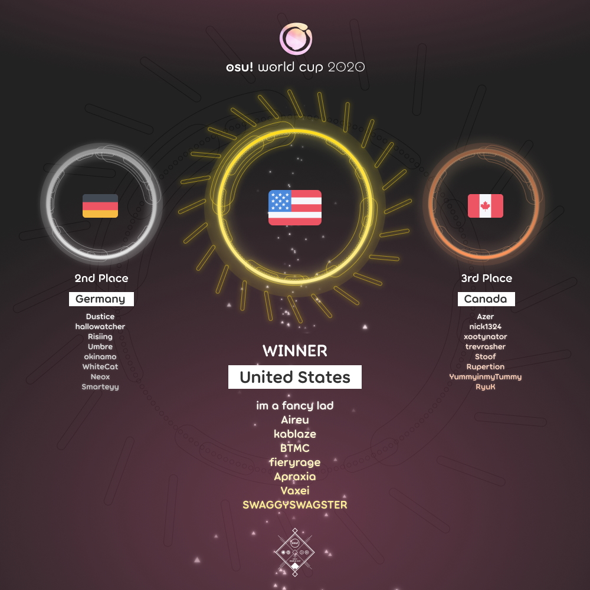

---
tags:
  - OWC
  - OWC2020
---

# osu! World Cup 2020

The **osu! World Cup 2020** (***OWC 2020***) was a country-based osu! tournament hosted by the [osu! team](/wiki/People/osu!_team). It was the 11th instalment of the osu! World Cup.

## Tournament schedule

| Event | Timestamp |
| --: | :-- |
| Registration phase | 2020-09-24/2020-10-08 |
| Qualifier showcase | 2020-10-17 (14:00 UTC+0) |
| Qualifier stage | 2020-10-24/2020-10-25 |
| Round of 32 | 2020-10-31/2020-11-01 |
| Round of 16 | 2020-11-07/2020-11-08 |
| Quarterfinals | 2020-11-14/2020-11-15 |
| Semifinals | 2020-11-21/2020-11-22 |
| Finals | 2020-11-28/2020-11-29 |
| Grand Finals | 2020-12-05/2020-12-06 |

## Prizes

The osu! World Cup 2020 offered a $5,000 cash prize pool and limited edition merch!

| Placing | Prize(s) |
| :-: | :-- |
|  | 50% of the prize pool, exclusive single-run merch, profile badge, "osu! Champion" user title for one year |
|  | 36% of the prize pool, exclusive single-run merch, profile badge |
|  | 14% of the prize pool, exclusive single-run merch, profile badge |

  

## Organisation

The osu! World Cup 2020 was run by the osu! team and various community members.

| Position | Member(s) |
| :-- | :-- |
| Manager | ::{ flag=AR }:: [juankristal](https://osu.ppy.sh/users/443656), ::{ flag=CL }:: [WalterToro](https://osu.ppy.sh/users/5281416) |
| Mappool selector | ::{ flag=AU }:: [Kano](https://osu.ppy.sh/users/3036203), ::{ flag=AT }:: [Omgforz](https://osu.ppy.sh/users/578943) |
| Mappool playtester | ::{ flag=US }:: [DigitalHypno](https://osu.ppy.sh/users/4384207), ::{ flag=MA }:: [FGSky](https://osu.ppy.sh/users/2094566), ::{ flag=US }:: [idke](https://osu.ppy.sh/users/4650315), ::{ flag=US }:: [Skill](https://osu.ppy.sh/users/7802027), ::{ flag=US }:: [UberFazz](https://osu.ppy.sh/users/8646059), ::{ flag=PL }:: [Zelq](https://osu.ppy.sh/users/8953955) |
| Commentator | ::{ flag=CA }:: [Azer](https://osu.ppy.sh/users/2155578), ::{ flag=US }:: [BTMC](https://osu.ppy.sh/users/3171691), ::{ flag=GB }:: [Bubbleman](https://osu.ppy.sh/users/5182050), ::{ flag=US }:: [ChillierPear](https://osu.ppy.sh/users/9501251), ::{ flag=US }:: [Dohland](https://osu.ppy.sh/users/5220511), ::{ flag=GB }:: [Doomsday](https://osu.ppy.sh/users/18983), ::{ flag=US }:: [Halfslashed](https://osu.ppy.sh/users/4598899), ::{ flag=AU }:: [Kano](https://osu.ppy.sh/users/3036203), ::{ flag=AU }:: [Monk The Don](https://osu.ppy.sh/users/4012086), ::{ flag=US }:: [Monko2k](https://osu.ppy.sh/users/4852013), ::{ flag=AT }:: [Omgforz](https://osu.ppy.sh/users/578943), ::{ flag=US }:: [this1neguy](https://osu.ppy.sh/users/1797189), ::{ flag=KR }:: [ToGlette](https://osu.ppy.sh/users/1076236), ::{ flag=AU }:: [Vivace](https://osu.ppy.sh/users/3698691), ::{ flag=US }:: [Will Stetson](https://osu.ppy.sh/users/4909088) |
| Referee | ::{ flag=ES }:: [Deif](https://osu.ppy.sh/users/318565), ::{ flag=AU }:: [ill onion](https://osu.ppy.sh/users/8306102), ::{ flag=BR }:: [LeoFLT](https://osu.ppy.sh/users/3668779), ::{ flag=NL }:: [nik](https://osu.ppy.sh/users/10077264), ::{ flag=DE }:: [p3n](https://osu.ppy.sh/users/123703), ::{ flag=US }:: [tigereyes144](https://osu.ppy.sh/users/6499811), ::{ flag=CL }:: [WalterToro](https://osu.ppy.sh/users/5281416), ::{ flag=GB }:: [Yazzehh](https://osu.ppy.sh/users/7068973) |
| Statistician | ::{ flag=BR }:: [LeoFLT](https://osu.ppy.sh/users/3668779), ::{ flag=DE }:: [Nwolf](https://osu.ppy.sh/users/1910766) |

## Links

- [Discussion thread](https://osu.ppy.sh/community/forums/topics/1150567)
- [Livestream](https://www.twitch.tv/osulive)
- [Challonge bracket](https://challonge.com/OWC_2020)
- [Pick'ems page](https://pickem.hwc.hr/tournaments/47) hosted by ::{ flag=DE }:: [hallowatcher](https://osu.ppy.sh/users/1874761)
- **[Statistics sheet](https://docs.google.com/spreadsheets/d/e/2PACX-1vRK1VndO4Dng6TJ2yM8dedF7Bkf0b-VvrK2T5US5Y-YkI-fpxZhNanWWJOdTB-2BrW9eu8o62sGm5_G/pubhtml)**

## Participants

|  | Country | Members |
| :-: | :-: | :-- |
| ::{ flag=AR }:: | **Argentina** | **[SlowBurn](https://osu.ppy.sh/users/3608846)**, [Lexalia](https://osu.ppy.sh/users/1887616), [Pein](https://osu.ppy.sh/users/2212941), [Penguo](https://osu.ppy.sh/users/4389490), [Cata](https://osu.ppy.sh/users/5958063), [Emiru Ikuno](https://osu.ppy.sh/users/6169195), [Amuro](https://osu.ppy.sh/users/7119659), [Emiru Ikuno 2](https://osu.ppy.sh/users/9393446) |
| ::{ flag=AU }:: | **Australia** | **[Jordan The Bear](https://osu.ppy.sh/users/7477458)**, [Dumii](https://osu.ppy.sh/users/3068044), [uyghti](https://osu.ppy.sh/users/3641404), [rairiku](https://osu.ppy.sh/users/4945688), [-Machine-](https://osu.ppy.sh/users/5459981), [ASecretBox](https://osu.ppy.sh/users/7341183), [mrekk](https://osu.ppy.sh/users/7562902), [jordanlr7](https://osu.ppy.sh/users/11652827) |
| ::{ flag=AT }:: | **Austria** | **[goosefedora](https://osu.ppy.sh/users/2323131)**, [Teppi](https://osu.ppy.sh/users/1371974), [Kizan](https://osu.ppy.sh/users/3074197), [LWMF](https://osu.ppy.sh/users/3632402), [Sparkxei](https://osu.ppy.sh/users/4601608), [TiltBoi](https://osu.ppy.sh/users/6311630), [FeeDyy](https://osu.ppy.sh/users/8123308), [Micca](https://osu.ppy.sh/users/8179335) |
| ::{ flag=BE }:: | **Belgium** | **[Hanori](https://osu.ppy.sh/users/7078544)**, [Fblade](https://osu.ppy.sh/users/3168085), [\[Sven\]](https://osu.ppy.sh/users/3695504), [MetaBee](https://osu.ppy.sh/users/3706039), [5joshi](https://osu.ppy.sh/users/4279650), [Mornis](https://osu.ppy.sh/users/6479616), [KyZzo](https://osu.ppy.sh/users/9014203), [Loriax](https://osu.ppy.sh/users/11331829) |
| ::{ flag=BR }:: | **Brazil** | **[MouseEasy](https://osu.ppy.sh/users/1558603)**, [Coreanmaluco](https://osu.ppy.sh/users/3149577), [Sanjilift](https://osu.ppy.sh/users/3260571), [Tusk](https://osu.ppy.sh/users/4253615), [Mystia](https://osu.ppy.sh/users/4277702), [xxluizxx47](https://osu.ppy.sh/users/4687701), [niii\_san](https://osu.ppy.sh/users/5403374), [Dada](https://osu.ppy.sh/users/9119507) |
| ::{ flag=CA }:: | **Canada** | **[Azer](https://osu.ppy.sh/users/2155578)**, [nick1324](https://osu.ppy.sh/users/612898), [xootynator](https://osu.ppy.sh/users/3717598), [trevrasher](https://osu.ppy.sh/users/3893420), [Stoof](https://osu.ppy.sh/users/4916057), [Rupertion](https://osu.ppy.sh/users/5774823), [YummyinmyTummy](https://osu.ppy.sh/users/5919819), [RyuK](https://osu.ppy.sh/users/6304246) |
| ::{ flag=CL }:: | **Chile** | **[ign](https://osu.ppy.sh/users/9360528)**, [Intercambing](https://osu.ppy.sh/users/2546001), [xaxreid](https://osu.ppy.sh/users/4227431), [Ritseh](https://osu.ppy.sh/users/4585205), [NO37](https://osu.ppy.sh/users/4653583), [Mathi](https://osu.ppy.sh/users/5339515), [Sawku](https://osu.ppy.sh/users/6064382), [tfge](https://osu.ppy.sh/users/11207004) |
| ::{ flag=CN }:: | **China** | **[Crystal](https://osu.ppy.sh/users/1646397)**, [GGBY](https://osu.ppy.sh/users/629717), [EmertxE](https://osu.ppy.sh/users/954557), [im\_a\_burger\_fox](https://osu.ppy.sh/users/5791401), [davidqu2](https://osu.ppy.sh/users/6090175), [MyAngelMiku](https://osu.ppy.sh/users/7025429), [Sugiura Kanata](https://osu.ppy.sh/users/7839397), [milk-tea](https://osu.ppy.sh/users/11375105) |
| ::{ flag=CO }:: | **Colombia** | **[Ninther4](https://osu.ppy.sh/users/3291562)**, [ElMick30](https://osu.ppy.sh/users/2374950), [Crisco](https://osu.ppy.sh/users/3562488), [Rushy](https://osu.ppy.sh/users/5281857), [Ritokoi](https://osu.ppy.sh/users/7749484), [ElMick29](https://osu.ppy.sh/users/11083194), [Jekuru](https://osu.ppy.sh/users/11727492) |
| ::{ flag=HR }:: | **Croatia** | **[KarliXon](https://osu.ppy.sh/users/9283403)**, [Seni](https://osu.ppy.sh/users/4830261), [Kughxy](https://osu.ppy.sh/users/7165344), [The Fart Lord](https://osu.ppy.sh/users/7912447), [Vynxica](https://osu.ppy.sh/users/9683580), [StrawFrog](https://osu.ppy.sh/users/10978106) |
| ::{ flag=CZ }:: | **Czech Republic** | **[BLooDBuRSTiNG](https://osu.ppy.sh/users/3925167)**, [NitroM\_](https://osu.ppy.sh/users/3121234), [PoggersCZ](https://osu.ppy.sh/users/3198446), [Nitr0M\_](https://osu.ppy.sh/users/4605548), [Ev1dent](https://osu.ppy.sh/users/7125675), [CutoNaito](https://osu.ppy.sh/users/8064649), [mnbvcxy12345678](https://osu.ppy.sh/users/9422204), [Fadeaway](https://osu.ppy.sh/users/9523358) |
| ::{ flag=DK }:: | **Denmark** | **[Spork Lover](https://osu.ppy.sh/users/3417469)**, [Zakura](https://osu.ppy.sh/users/3053599), [Contaminate](https://osu.ppy.sh/users/4694589), [Tmunken](https://osu.ppy.sh/users/5176984), [iamVill](https://osu.ppy.sh/users/6295380), [Pablohh](https://osu.ppy.sh/users/10092099), [Akayume](https://osu.ppy.sh/users/10617530), [Emilly](https://osu.ppy.sh/users/11495715) |
| ::{ flag=EE }:: | **Estonia** | **[Ancenthe](https://osu.ppy.sh/users/4479041)**, [Tiger Claw](https://osu.ppy.sh/users/2064445), [Abyssal](https://osu.ppy.sh/users/5527745), [Lotragon](https://osu.ppy.sh/users/6063342), [Save Me](https://osu.ppy.sh/users/6498951), [Slay](https://osu.ppy.sh/users/7093124), [Eminem](https://osu.ppy.sh/users/7488089), [yasuha](https://osu.ppy.sh/users/12401523) |
| ::{ flag=FI }:: | **Finland** | **[Freezd](https://osu.ppy.sh/users/6524603)**, [Jerekek](https://osu.ppy.sh/users/4162662), [Wucki](https://osu.ppy.sh/users/5287410), [Samoyed](https://osu.ppy.sh/users/6796557), [HENKSELI](https://osu.ppy.sh/users/7005392), [boleks](https://osu.ppy.sh/users/7786382), [Haadez](https://osu.ppy.sh/users/8925266), [shdewz](https://osu.ppy.sh/users/10000899) |
| ::{ flag=FR }:: | **France** | **[Musty](https://osu.ppy.sh/users/251683)**, [ThePooN](https://osu.ppy.sh/users/718454), [NerO](https://osu.ppy.sh/users/1545031), [-raizen-](https://osu.ppy.sh/users/3872987), [Thundur](https://osu.ppy.sh/users/4141918), [Hifkil](https://osu.ppy.sh/users/4301976), [pouki](https://osu.ppy.sh/users/7243224), [JustMan](https://osu.ppy.sh/users/7657831) |
| ::{ flag=DE }:: | **Germany** | **[Dustice](https://osu.ppy.sh/users/754565)**, [hallowatcher](https://osu.ppy.sh/users/1874761), [Risiing](https://osu.ppy.sh/users/2282047), [Umbre](https://osu.ppy.sh/users/2766034), [okinamo](https://osu.ppy.sh/users/3765989), [WhiteCat](https://osu.ppy.sh/users/4504101), [Neox](https://osu.ppy.sh/users/4633724), [Smarteyy](https://osu.ppy.sh/users/4780986) |
| ::{ flag=HK }:: | **Hong Kong** | **[Chaoslitz](https://osu.ppy.sh/users/3621552)**, [DenierNezzar](https://osu.ppy.sh/users/126144), [Saku-](https://osu.ppy.sh/users/4720411), [Hibiki](https://osu.ppy.sh/users/5413624), [iRedi](https://osu.ppy.sh/users/8005579), [Dragbit 3](https://osu.ppy.sh/users/9313951), [- Sakura -](https://osu.ppy.sh/users/10829419), [A21](https://osu.ppy.sh/users/11198996) |
| ::{ flag=HU }:: | **Hungary** | **[Lexion](https://osu.ppy.sh/users/5271371)**, [RatinA0](https://osu.ppy.sh/users/3436625), [Tralkke](https://osu.ppy.sh/users/5039382), [Zyaqix](https://osu.ppy.sh/users/6085753), [csaba21123](https://osu.ppy.sh/users/7764237), [matyk0](https://osu.ppy.sh/users/8596945) |
| ::{ flag=ID }:: | **Indonesia** | **[Skydiver](https://osu.ppy.sh/users/4750008)**, [Fuma](https://osu.ppy.sh/users/1501956), [rho](https://osu.ppy.sh/users/1629553), [Rexeez](https://osu.ppy.sh/users/1987591), [Walfrid](https://osu.ppy.sh/users/6600809), [harambee](https://osu.ppy.sh/users/8626190), [Vinno](https://osu.ppy.sh/users/10717635), [Lifeline](https://osu.ppy.sh/users/11367222) |
| ::{ flag=IL }:: | **Israel** | **[MrPotato](https://osu.ppy.sh/users/2787415)**, [Xilver15](https://osu.ppy.sh/users/3099689), [namewithnumber9](https://osu.ppy.sh/users/5867839), [Galog](https://osu.ppy.sh/users/7799629), [PaintedKoala](https://osu.ppy.sh/users/10056419), [itay](https://osu.ppy.sh/users/10701418), [Accelerator](https://osu.ppy.sh/users/10822717), [CHIP--](https://osu.ppy.sh/users/12083446) |
| ::{ flag=IT }:: | **Italy** | **[Koba](https://osu.ppy.sh/users/4448118)**, [Spazza17](https://osu.ppy.sh/users/3516241), [Wonder](https://osu.ppy.sh/users/3687318), [-Syncro](https://osu.ppy.sh/users/4338923), [Kiirochii](https://osu.ppy.sh/users/6387149), [Riuzaky](https://osu.ppy.sh/users/7165477), [SIMONETRAPANI](https://osu.ppy.sh/users/7329177), [Surpy](https://osu.ppy.sh/users/9961436) |
| ::{ flag=JP }:: | **Japan** | **[Delis](https://osu.ppy.sh/users/1603923)**, [EIGER](https://osu.ppy.sh/users/1504556), [dectopia](https://osu.ppy.sh/users/2845904), [rollpan](https://osu.ppy.sh/users/3062998), [Varvalian](https://osu.ppy.sh/users/3345902), [chankoma](https://osu.ppy.sh/users/4260383), [----](https://osu.ppy.sh/users/4304495), [a\_Blue](https://osu.ppy.sh/users/5645667) |
| ::{ flag=LV }:: | **Latvia** | **[waywern2012](https://osu.ppy.sh/users/5870453)**, [Emula](https://osu.ppy.sh/users/2891792), [MegaWhyNOPE](https://osu.ppy.sh/users/8676070), [Akolibed](https://osu.ppy.sh/users/9269034), [Ayaero](https://osu.ppy.sh/users/9533316), [iFlashie](https://osu.ppy.sh/users/10886314) |
| ::{ flag=LT }:: | **Lithuania** | **[shineroo](https://osu.ppy.sh/users/4360718)**, [xChorse](https://osu.ppy.sh/users/2217628), [Auji](https://osu.ppy.sh/users/4114438), [rxbass1337](https://osu.ppy.sh/users/6046092), [Fybeth](https://osu.ppy.sh/users/7225339), [ZdefLT](https://osu.ppy.sh/users/9455803), [Recvilicia](https://osu.ppy.sh/users/9498216), [SiCoOG](https://osu.ppy.sh/users/10144317) |
| ::{ flag=MY }:: | **Malaysia** | **[ShaneLiang](https://osu.ppy.sh/users/6716499)**, [ClawViper](https://osu.ppy.sh/users/2681361), [wuhua](https://osu.ppy.sh/users/2932510), [Zygody](https://osu.ppy.sh/users/3677251), [Rampax](https://osu.ppy.sh/users/3995630), [haruchi](https://osu.ppy.sh/users/4845266), [Tzero](https://osu.ppy.sh/users/6088976), [not\_aweeb](https://osu.ppy.sh/users/9375317) |
| ::{ flag=MX }:: | **Mexico** | **[-Wolfy-](https://osu.ppy.sh/users/4497582)**, [Siros](https://osu.ppy.sh/users/3787685), [Riot](https://osu.ppy.sh/users/4256461), [KevstracK](https://osu.ppy.sh/users/5325213), [Lynx-](https://osu.ppy.sh/users/7301672), [Flameshock](https://osu.ppy.sh/users/8349047), [Trint](https://osu.ppy.sh/users/10670748), [-\[Saint\]-](https://osu.ppy.sh/users/14970132) |
| ::{ flag=NL }:: | **Netherlands** | **[Viveliam](https://osu.ppy.sh/users/3506793)**, [taku](https://osu.ppy.sh/users/684433), [jackylam5](https://osu.ppy.sh/users/1540807), [Ahmnesia](https://osu.ppy.sh/users/2715937), [Skyrovania](https://osu.ppy.sh/users/4696315), [Manievat](https://osu.ppy.sh/users/6744123), [Dolter](https://osu.ppy.sh/users/6920104), [nyaako](https://osu.ppy.sh/users/7361815) |
| ::{ flag=NO }:: | **Norway** | **[YokesPai](https://osu.ppy.sh/users/6399568)**, [-GN](https://osu.ppy.sh/users/895581), [ItsKevZii](https://osu.ppy.sh/users/5201225), [comfv](https://osu.ppy.sh/users/6888972), [Fjell](https://osu.ppy.sh/users/6951444), [Markus](https://osu.ppy.sh/users/8414284), [Melvr](https://osu.ppy.sh/users/9211924), [Njulsen](https://osu.ppy.sh/users/10773960) |
| ::{ flag=PE }:: | **Peru** | **[Hasaki](https://osu.ppy.sh/users/9037054)**, [Arnold24x24](https://osu.ppy.sh/users/2291265), [Meiph](https://osu.ppy.sh/users/2367544), [Mordo](https://osu.ppy.sh/users/4192805), [Judani](https://osu.ppy.sh/users/6787898), [Nkiad](https://osu.ppy.sh/users/13684411) |
| ::{ flag=PH }:: | **Philippines** | **[zonelouise](https://osu.ppy.sh/users/1492995)**, [Senjuro](https://osu.ppy.sh/users/3003839), [xidorn](https://osu.ppy.sh/users/7904667), [elki](https://osu.ppy.sh/users/8136525), [hyeok2044](https://osu.ppy.sh/users/8472976), [Thorfinn](https://osu.ppy.sh/users/9756249), [Rammu](https://osu.ppy.sh/users/10652837), [Xyloz](https://osu.ppy.sh/users/12040280) |
| ::{ flag=PL }:: | **Poland** | **[WubWoofWolf](https://osu.ppy.sh/users/39828)**, [Mastasz](https://osu.ppy.sh/users/1876565), [MAREK MARUCHA](https://osu.ppy.sh/users/2395405), [Rafis](https://osu.ppy.sh/users/2558286), [twoj stary](https://osu.ppy.sh/users/3543130), [Aldrouch](https://osu.ppy.sh/users/5575135), [Bartek22830](https://osu.ppy.sh/users/6404027), [TWOJA STARA](https://osu.ppy.sh/users/8170186) |
| ::{ flag=PT }:: | **Portugal** | **[King Lizard](https://osu.ppy.sh/users/7817891)**, [dat boi waffle](https://osu.ppy.sh/users/4215381), [Legendz](https://osu.ppy.sh/users/4333312), [Mizuru](https://osu.ppy.sh/users/4495871), [\[ Larssen \]](https://osu.ppy.sh/users/5784075), [rc4322](https://osu.ppy.sh/users/7772622), [MakiDonalds](https://osu.ppy.sh/users/11610772), [FrancisEdits](https://osu.ppy.sh/users/11655630) |
| ::{ flag=RO }:: | **Romania** | **[badeu](https://osu.ppy.sh/users/1473890)**, [\_AfterWind](https://osu.ppy.sh/users/2086138), [Chiu](https://osu.ppy.sh/users/3148900), [eternum](https://osu.ppy.sh/users/4581069), [Maxim Bogdan](https://osu.ppy.sh/users/5035707), [cristi2708](https://osu.ppy.sh/users/7552300), [roliy](https://osu.ppy.sh/users/9578404), [LuchiBuchi](https://osu.ppy.sh/users/10897656) |
| ::{ flag=RU }:: | **Russian Federation** | **[Okinotori](https://osu.ppy.sh/users/4346274)**, [talala](https://osu.ppy.sh/users/1389663), [Red\_Pixel](https://osu.ppy.sh/users/4170932), [Alumetri](https://osu.ppy.sh/users/5371497), [MrFuture](https://osu.ppy.sh/users/5724445), [Gasha](https://osu.ppy.sh/users/7192129), [-Din-](https://osu.ppy.sh/users/7972980), [Envy\_ss](https://osu.ppy.sh/users/8386483) |
| ::{ flag=SG }:: | **Singapore** | **[k\_1tty](https://osu.ppy.sh/users/5407620)**, [GSBlank](https://osu.ppy.sh/users/2312106), [Rtyzen](https://osu.ppy.sh/users/2439822), [LanJay](https://osu.ppy.sh/users/5210595), [Demonical](https://osu.ppy.sh/users/5447609), [Loslite](https://osu.ppy.sh/users/6398160), [\[-Lockon-\]](https://osu.ppy.sh/users/6726331), [megumic](https://osu.ppy.sh/users/7537133) |
| ::{ flag=SK }:: | **Slovakia** | **[Tikef](https://osu.ppy.sh/users/9149213)**, [PeteX](https://osu.ppy.sh/users/1285945), [MarGenDo](https://osu.ppy.sh/users/3340086), [Hranolka](https://osu.ppy.sh/users/6149947), [-YoYo-](https://osu.ppy.sh/users/6158076), [PemiX](https://osu.ppy.sh/users/6974470), [Ezreal156](https://osu.ppy.sh/users/7358639), [SneakY NickY](https://osu.ppy.sh/users/8847379) |
| ::{ flag=KR }:: | **South Korea** | **[Karuna](https://osu.ppy.sh/users/8775024)**, [Ponytail](https://osu.ppy.sh/users/1516650), [Nelitoru](https://osu.ppy.sh/users/2511839), [Nopekjk](https://osu.ppy.sh/users/4585186), [Zeisen-](https://osu.ppy.sh/users/7892320), [FlyingTuna](https://osu.ppy.sh/users/9224078), [\[RyuTell\]](https://osu.ppy.sh/users/9397144), [\[Karcher\]](https://osu.ppy.sh/users/11443437) |
| ::{ flag=ES }:: | **Spain** | **[amborgesa](https://osu.ppy.sh/users/1968481)**, [-Shizuru](https://osu.ppy.sh/users/5133150), [Frosiito](https://osu.ppy.sh/users/6462387), [Margo](https://osu.ppy.sh/users/6995685), [Kalal331](https://osu.ppy.sh/users/8433636), [-Hideki-](https://osu.ppy.sh/users/8688804), [NHarmonia](https://osu.ppy.sh/users/9582556), [A N T O N I O](https://osu.ppy.sh/users/12760743) |
| ::{ flag=SE }:: | **Sweden** | **[\[ Coach \]](https://osu.ppy.sh/users/2854598)**, [nautzz](https://osu.ppy.sh/users/2012039), [Felrion](https://osu.ppy.sh/users/3673083), [Saika0k1](https://osu.ppy.sh/users/4316633), [\[ Blue \]](https://osu.ppy.sh/users/4859699), [Reedkatt](https://osu.ppy.sh/users/8335950), [Andros](https://osu.ppy.sh/users/9072586), [scylla](https://osu.ppy.sh/users/9405745) |
| ::{ flag=CH }:: | **Switzerland** | **[Ayeka](https://osu.ppy.sh/users/7225922)**, [Akani](https://osu.ppy.sh/users/2323137), [Niven](https://osu.ppy.sh/users/5297955), [steini](https://osu.ppy.sh/users/5676259), [Mytlex](https://osu.ppy.sh/users/7045024), [Sil](https://osu.ppy.sh/users/7924600), [CeriixZ](https://osu.ppy.sh/users/9533853), [Mizurii 2](https://osu.ppy.sh/users/10394866) |
| ::{ flag=TW }:: | **Taiwan** | **[Shiina Noriko](https://osu.ppy.sh/users/1285637)**, [Flask](https://osu.ppy.sh/users/959763), [Eunha -](https://osu.ppy.sh/users/1234432), [\_Shield](https://osu.ppy.sh/users/1860489), [GfMRT](https://osu.ppy.sh/users/3163649), [\[ Zane \]](https://osu.ppy.sh/users/3517706), [Spinesnight](https://osu.ppy.sh/users/4519494), [Rizer](https://osu.ppy.sh/users/5155973) |
| ::{ flag=TH }:: | **Thailand** | **[Trigonoculus](https://osu.ppy.sh/users/7627013)**, [Chorus](https://osu.ppy.sh/users/3504692), [- Mekumin -](https://osu.ppy.sh/users/3744339), [Ithi](https://osu.ppy.sh/users/4782236), [Shye](https://osu.ppy.sh/users/4805243), [- Seen -](https://osu.ppy.sh/users/5082392), [minecrafter](https://osu.ppy.sh/users/9389213) |
| ::{ flag=TR }:: | **Turkey** | **[heyronii](https://osu.ppy.sh/users/5642779)**, [\[-Shadowa-\]](https://osu.ppy.sh/users/1313327), [-Kanzaki](https://osu.ppy.sh/users/1652478), [-Kemsyt](https://osu.ppy.sh/users/3170401), [egemenbsrms](https://osu.ppy.sh/users/4520477), [Mikatsu](https://osu.ppy.sh/users/6612642), [Raikouhou](https://osu.ppy.sh/users/8007528), [edizberkserbest](https://osu.ppy.sh/users/9256771) |
| ::{ flag=UA }:: | **Ukraine** | **[dench](https://osu.ppy.sh/users/10073635)**, [Sadness](https://osu.ppy.sh/users/6560835), [Ponyawka](https://osu.ppy.sh/users/6997572), [magnatagamer123](https://osu.ppy.sh/users/7587763), [Kryterion](https://osu.ppy.sh/users/9920144), [Dim0ND](https://osu.ppy.sh/users/10096496), [1Max](https://osu.ppy.sh/users/11653711), [netwhynot](https://osu.ppy.sh/users/11794209) |
| ::{ flag=GB }:: | **United Kingdom** | **[Bubbleman](https://osu.ppy.sh/users/5182050)**, [Doomsday](https://osu.ppy.sh/users/18983), [Ventus](https://osu.ppy.sh/users/1986262), [Malteser](https://osu.ppy.sh/users/5218178), [Bloobleman](https://osu.ppy.sh/users/6778877), [Kingling](https://osu.ppy.sh/users/7010761), [Voss](https://osu.ppy.sh/users/7657761), [majoreh](https://osu.ppy.sh/users/7959222) |
| ::{ flag=US }:: | **United States** | **[im a fancy lad](https://osu.ppy.sh/users/4908650)**, [Aireu](https://osu.ppy.sh/users/1650010), [kablaze](https://osu.ppy.sh/users/3043603), [BTMC](https://osu.ppy.sh/users/3171691), [fieryrage](https://osu.ppy.sh/users/3533958), [Apraxia](https://osu.ppy.sh/users/4194445), [Vaxei](https://osu.ppy.sh/users/4787150), [SWAGGYSWAGSTER](https://osu.ppy.sh/users/7813296) |
| ::{ flag=UY }:: | **Uruguay** | **[daanit](https://osu.ppy.sh/users/6159669)**, [Madozito](https://osu.ppy.sh/users/4054429), [Saphity](https://osu.ppy.sh/users/5382216), [-PloX](https://osu.ppy.sh/users/6404583), [Kazuki K](https://osu.ppy.sh/users/6407282), [Rebo](https://osu.ppy.sh/users/6942259), [FDX](https://osu.ppy.sh/users/8987016) |
| ::{ flag=VN }:: | **Vietnam** | **[Tuon](https://osu.ppy.sh/users/6673790)**, [Ui chan](https://osu.ppy.sh/users/5449433), [\_Kuroni\_](https://osu.ppy.sh/users/6159305), [Hoaq](https://osu.ppy.sh/users/7696512), [Huukun](https://osu.ppy.sh/users/8114571), [FukutoTojido](https://osu.ppy.sh/users/8266808), [sindes19](https://osu.ppy.sh/users/11021073) |

## Podium

## Mappools

### Grand Finals

- NoMod
  1. [ELFENSJoN - Hyousou wa Hakuen wo Matoite (Yusomi) \[Extra\]](https://osu.ppy.sh/beatmapsets/1312064#osu/2719302)
  2. [Bal-Sagoth - Shackled To The Trilithon Of Kutulu (Mazzerin) \[Ph'nglui mglw'nafh Cthulhu R'lyeh wgah'nagl fhtagn - OWC\]](https://osu.ppy.sh/beatmapsets/1312054#osu/2719284)
  3. [Hyuman - DISHONOR (yaspo) \[hasplasho's dishonorable spaghetti\]](https://osu.ppy.sh/beatmapsets/1276322#osu/2651784)
  4. [Zekk - Fluctuation (Acylica) \[wtf jhin zhao?\]](https://osu.ppy.sh/beatmapsets/1312159#osu/2719485)
  5. [Brymir - Hails from the Edge (LMT) \[War Cry\]](https://osu.ppy.sh/beatmapsets/1312066#osu/2719305)
  6. [II-L - SPUTNIK-3 (DeviousPanda) \[Beyond OWC\]](https://osu.ppy.sh/beatmapsets/1312076#osu/2719326)
- Hidden
  1. [SEPHID - Critical Cannonball (DeviousPanda) \[Limit Break (Tourney Ver.)\]](https://osu.ppy.sh/beatmapsets/1189616#osu/2719329)
  2. [Chikamori Kayako - Kigurumi Sungeki (Mirash) \[Labyrinth of Steam\]](https://osu.ppy.sh/beatmapsets/1312079#osu/2719334)
  3. [Nishigomi Kakumi - Gekka Bijin (Flask) \[Oni (OWC Edit Ver.)\]](https://osu.ppy.sh/beatmapsets/1059581#osu/2719328)
- HardRock
  1. [LiSA - Thrill, Risk, Heartless (SkyFlame) \[Lethality\]](https://osu.ppy.sh/beatmapsets/1312103#osu/2719386)
  2. [Takanashi Yasuharu - Ketsudan no Toki (Mordred) \[Judgement\]](https://osu.ppy.sh/beatmapsets/1312098#osu/2719373)
  3. [DJ'TEKINA//SOMETHING - Internet bitch P\*Light Remix (Priti) \[Ultra\]](https://osu.ppy.sh/beatmapsets/296198#osu/665149)
- DoubleTime
  1. [Asaka - Eternal Star (Luscent) \[read island\]](https://osu.ppy.sh/beatmapsets/1312114#osu/2719411)
  2. [Kijibato - w/WWW feat.Hoshimiya Toto (Elcheer) \[Utopia\]](https://osu.ppy.sh/beatmapsets/1312343#osu/2719893)
  3. [Synthamesk - Suspirious (fergas) \[AfteraLL\]](https://osu.ppy.sh/beatmapsets/1312111#osu/2719407)
  4. [Akatsuki Records - Adieu, to this Lively Graveyard (yaspo) \[KIRBY REMIX DELUXE EDITION\]](https://osu.ppy.sh/beatmapsets/1252820#osu/2603690)
- FreeMod
  1. [Ayase Rie - Hijitsuzaikei Joshitachi wa Dou Surya Ii Desu ka? (Lasse) \[Affection (owc ver.)\]](https://osu.ppy.sh/beatmapsets/1312124#osu/2719426)
  2. [Elements Garden - Mugen Kidou (Nathan) \[read aokana\]](https://osu.ppy.sh/beatmapsets/1312130#osu/2719439)
  3. [LeaF - Kyouki Ranbu (vikala) \[Master\]](https://osu.ppy.sh/beatmapsets/1312129#osu/2719437)
- Tiebreaker
  1. **[Camellia - OOPARTS (Realazy) \[Zenith\]](https://osu.ppy.sh/beatmapsets/1312143#osu/2719462)**

### Finals

- NoMod
  1. [BUTAOTOME - Osanadachi (BarkingMadDog) \[Extreme\]](https://osu.ppy.sh/beatmapsets/1306569#osu/2708955)
  2. [Musical Masterpiece - M-A(FOOLISH) (idke) \[GYZE - HONESTY\]](https://osu.ppy.sh/beatmapsets/1306566#osu/2708949)
  3. [rei sirose - Lost Umbrella (Natteke desu) \[PTSD\]](https://osu.ppy.sh/beatmapsets/1306564#osu/2708946)
  4. [Camellia - #1f1e33 (Realazy) \[fractured ver.\]](https://osu.ppy.sh/beatmapsets/1192060#osu/2708950)
  5. [goreshit - xenobeat (fergas) \[DeathleSS\]](https://osu.ppy.sh/beatmapsets/1306568#osu/2708952)
  6. [NIWASHI - Playing with Ruby (Down) \[Extra\]](https://osu.ppy.sh/beatmapsets/1306570#osu/2708983)
- Hidden
  1. [Marmalade butcher - Amanita (DeviousPanda) \[Collab Extreme\]](https://osu.ppy.sh/beatmapsets/1306572#osu/2708985)
  2. [BAND-MAID - Spirit!! (Lasse) \[Expert!!\]](https://osu.ppy.sh/beatmapsets/1306578#osu/2709014)
  3. [ARM (IOSYS) + Brasscapsule - Jazz is Rad (DeviousPanda) \[Collab Extravaganza\]](https://osu.ppy.sh/beatmapsets/1306575#osu/2708997)
- HardRock
  1. [Kotone - Flash (Talulah) \[Congratz on Your Universal Music Label Kotone!\]](https://osu.ppy.sh/beatmapsets/1306585#osu/2709040)
  2. [Himeringo - Six Trillion Years and Overnight Story (Sparhten) \[Eternity\]](https://osu.ppy.sh/beatmapsets/1306590#osu/2709049)
  3. [Yousei Teikoku - Naikan Uchuu Shisha no Yurikago (IsomirDiAngelo) \[Cradle of the Dead\]](https://osu.ppy.sh/beatmapsets/1306595#osu/2709056)
- DoubleTime
  1. [Ceui - Hoshi Ori Yume Mirai (Nagi Hisakawa) \[Constellation\]](https://osu.ppy.sh/beatmapsets/1306598#osu/2709059)
  2. [ZUN - Demystify Feast (Halfslashed) \[Lunatic (OWC Edit)\]](https://osu.ppy.sh/beatmapsets/477763#osu/2709164)
  3. [BAND-MAID - DICE (Lasse) \[INSANE.\]](https://osu.ppy.sh/beatmapsets/1248526#osu/2594991)
  4. [SOUND HOLIC - EXISTENCE (Mirash) \[DISCONTINUOUS\]](https://osu.ppy.sh/beatmapsets/1306610#osu/2709076)
- FreeMod
  1. [Falcom Sound Team jdk - Seductive Shudder (jonathanlfj) \[Bewitching OWC\]](https://osu.ppy.sh/beatmapsets/1306626#osu/2709094)
  2. [PELICAN FANCLUB - Sangenshoku (fartownik) \[Scientia Scortillum\]](https://osu.ppy.sh/beatmapsets/1306614#osu/2709080)
  3. [Into Infernus - The Sowing Tear (Mazzerin) \[A Sorcery Written in Blood\]](https://osu.ppy.sh/beatmapsets/1306616#osu/2709083)
- Tiebreaker
  1. **[Asriel - Raison D'etre (jonathanlfj) \[EXist\]](https://osu.ppy.sh/beatmapsets/1306628#osu/2709097)**

### Semifinals

- NoMod
  1. [Imy - Seimei no Tomoshibi (Sparhten) \[Legacy\]](https://osu.ppy.sh/beatmapsets/1301357#osu/2699190)
  2. [xi - Ascension to Heaven (Kroytz) \[Before the Final Moment\]](https://osu.ppy.sh/beatmapsets/1301360#osu/2699196)
  3. [POLKADOT STINGRAY - Otoshimae (moph) \[Extreme\]](https://osu.ppy.sh/beatmapsets/1301330#osu/2699135)
  4. [Feryquitous - Hemizorv (Realazy) \[Dissonance\]](https://osu.ppy.sh/beatmapsets/1301388#osu/2699240)
  5. [Alterbeast - Welcome to Your Doom (Mazzerin) \[FOREVER WOLF AND NEVER SHEEP - OWC\]](https://osu.ppy.sh/beatmapsets/1301372#osu/2699219)
  6. [Tsukasa Kaminose - ruin of opals (Acylica) \[Uber Eatsuki\]](https://osu.ppy.sh/beatmapsets/1301374#osu/2699221)
- Hidden
  1. [Alkome - Mind Disorder (Altai) \[Internal Chaos\]](https://osu.ppy.sh/beatmapsets/1301375#osu/2699222)
  2. [Imy - Over the limit (IOException) \[Another\]](https://osu.ppy.sh/beatmapsets/1301446#osu/2699419)
  3. [MiddleIsland - Frailness (LMT) \[Virtuoso\]](https://osu.ppy.sh/beatmapsets/720978#osu/1522554)
- HardRock
  1. [KINEMA106 - Juusou (Mordred) \[DOINB RYZE HACK? 400 CS 24 MIN \[L9 Turbo Boost\]\]](https://osu.ppy.sh/beatmapsets/1301393#osu/2699246)
  2. [HyuN feat. LyuU - Cross Over (Realazy) \[Expert\]](https://osu.ppy.sh/beatmapsets/891337#osu/1863224)
  3. [Feryquitous - Chat perdu (Elcheer) \[Trouve\]](https://osu.ppy.sh/beatmapsets/1301392#osu/2699245)
- DoubleTime
  1. [WALKUERE - Ikenai Borderline (Rizia) \[Insane\]](https://osu.ppy.sh/beatmapsets/454835#osu/975036)
  2. [Daisuke Ishiwatari - Childish Killer (yaspo) \[Like a Rose\]](https://osu.ppy.sh/beatmapsets/1301402#osu/2699262)
  3. [EPICA - Fight Your Demons (LMT) \[fight your primal urges\]](https://osu.ppy.sh/beatmapsets/1301404#osu/2699264)
  4. [Mizuki Nana - PHANTOM MINDS (Lasse) \[Insane (owc ver.)\]](https://osu.ppy.sh/beatmapsets/1301407#osu/2699268)
- FreeMod
  1. [Hatsuki Yura - Guren Yasha (KKipalt) \[Extra (OWC 2020)\]](https://osu.ppy.sh/beatmapsets/1301410#osu/2699274)
  2. [ZUN - Heian Alien (Halfslashed) \[Extra Stage\]](https://osu.ppy.sh/beatmapsets/1301413#osu/2699287)
  3. [S.S.H. - The Decisive Battle (Natteke desu) \[War of the Magi\]](https://osu.ppy.sh/beatmapsets/1301415#osu/2699289)
- Tiebreaker
  1. **[CROSS VEIN - Eternal Dream (Kite) \[Alp\]](https://osu.ppy.sh/beatmapsets/1301419#osu/2699308)**

### Quarterfinals

- NoMod
  1. [MY FIRST STORY - Shuuen Requiem (SkyFlame) \[Expressionless\]](https://osu.ppy.sh/beatmapsets/1296338#osu/2689633)
  2. [HyuN - Soulwind (FrenZ396) \[Gust\]](https://osu.ppy.sh/beatmapsets/1296379#osu/2689713)
  3. [Tenjin Kotone - Who Are You Nante Iwanaide (Talulah) \[The World's Best Vtuber\]](https://osu.ppy.sh/beatmapsets/1266996#osu/2633136)
  4. [Ashrount - Bleary Vagary (NyarkoO) \[HERE WE GO\]](https://osu.ppy.sh/beatmapsets/1296231#osu/2689434)
  5. [Thousand Leaves - Temptation (Zelq) \[Alice\]](https://osu.ppy.sh/beatmapsets/1296248#osu/2689459)
  6. [OSTER project - Piano x Forte (DeviousPanda) \[Fortissimo\]](https://osu.ppy.sh/beatmapsets/1296249#osu/2689460)
- Hidden
  1. [Yousei Teikoku - Paradiso Inferno (IsomirDiAngelo) \[Doku Ringo\]](https://osu.ppy.sh/beatmapsets/1296273#osu/2689510)
  2. [Porno Graffitti - Hitori no Yoru (fartownik) \[Insane\]](https://osu.ppy.sh/beatmapsets/1296252#osu/2689473)
  3. [Kotone - Black Joke (captin1) \[sub to kotone\]](https://osu.ppy.sh/beatmapsets/1296255#osu/2689478)
- HardRock
  1. [CHiCO with HoneyWorks - Kimi ga Sora Koso Kanashikere (Serizawa Haruki) \[Elgatsu's Sorrow\]](https://osu.ppy.sh/beatmapsets/940746#osu/1964722)
  2. [Brandy - Cross Time !! (Leader) \[captin's Extra\]](https://osu.ppy.sh/beatmapsets/973162#osu/2067296)
  3. [Memme - Tantanmen (Down) \[Extra\]](https://osu.ppy.sh/beatmapsets/1296282#osu/2689525)
- DoubleTime
  1. [Jun Maeda x yanaginagi - Hifukiyama no Mahoutsukai (Yohanes) \[Perseverance (Edit Ver)\]](https://osu.ppy.sh/beatmapsets/528572#osu/2688985)
  2. [Team Grimoire - Grimoire of Blue (Seto Kousuke) \[Insane\]](https://osu.ppy.sh/beatmapsets/1296306#osu/2689570)
  3. [Aimer - Run Riot (Sylvarus) \[Insane\]](https://osu.ppy.sh/beatmapsets/1227818#osu/2553146)
  4. [P.I.N.A. - Rat ga Shinda feat. SymaG (eiri-) \[Trynna's Insane\]](https://osu.ppy.sh/beatmapsets/976205#osu/2042994)
- FreeMod
  1. [SHK - Couple Breaking (ktgster) \[SHD\]](https://osu.ppy.sh/beatmapsets/1296360#osu/2689672)
  2. [Thaehan - Never Give Up (verychill) \[Relentless\]](https://osu.ppy.sh/beatmapsets/1048705#osu/2191964)
  3. [nobodyknows+ - Kokoro Odoru (toybot) \[bbj's Expert\]](https://osu.ppy.sh/beatmapsets/1020878#osu/2176407)
- Tiebreaker
  1. **[MY FIRST STORY feat. chelly (EGOIST) - 1,000,000 TIMES (Sing) \[1,000,000 NERFS\]](https://osu.ppy.sh/beatmapsets/1208452#osu/2556233)**

### Round of 16

- NoMod
  1. [TUYU - Namikare (jonathanlfj) \[Superior\]](https://osu.ppy.sh/beatmapsets/1174754#osu/2450295)
  2. [Aether Realm - Tarot (SILENCE PLAYER) \[Final Stand\]](https://osu.ppy.sh/beatmapsets/1291247#osu/2680248)
  3. [ZUTOMAYO - Haze Haseru Haterumade (pkk) \[Extra\]](https://osu.ppy.sh/beatmapsets/1291269#osu/2680283)
  4. [Camellia - extraterrestrial (Cut Ver.) (Mir) \[Nebula\]](https://osu.ppy.sh/beatmapsets/1291299#osu/2680328)
  5. [t+pazolite - Tempestissimo (Ryuusei Aika) \[Beyond\]](https://osu.ppy.sh/beatmapsets/1291246#osu/2680247)
- Hidden
  1. [xi - Finder Keepers (fartownik) \[Mine Now\]](https://osu.ppy.sh/beatmapsets/1291260#osu/2680271)
  2. [raito - Blood Drain -Again- (DeviousPanda) \[Expert\]](https://osu.ppy.sh/beatmapsets/1152554#osu/2405667)
- HardRock
  1. [AliA - impulse (skytuna) \[Akitoshi's Extreme\]](https://osu.ppy.sh/beatmapsets/962863#osu/2196278)
  2. [Applesoda vs MAX - Desaparecer (DeviousPanda) \[Expert\]](https://osu.ppy.sh/beatmapsets/1291255#osu/2680257)
- DoubleTime
  1. [Chata - anesthesia (vikala) \[Mirash's Insane\]](https://osu.ppy.sh/beatmapsets/1148598#osu/2399771)
  2. [Ujico\* - Dahlia (hypercyte) \[4 4 4 4\]](https://osu.ppy.sh/beatmapsets/1291262#osu/2680274)
  3. [Nekomata Master - dahaca (Icekalt) \[vibing (Tourney ver.)\]](https://osu.ppy.sh/beatmapsets/1291261#osu/2680272)
- FreeMod
  1. [Sakuzyo - Instinct (Zelq) \[Circles\]](https://osu.ppy.sh/beatmapsets/1291263#osu/2680275)
  2. [fallen shepherd feat. RabbiTon Strings - ENDYMION (Acylica) \[Realazy(Frenchcore)\]](https://osu.ppy.sh/beatmapsets/1291409#osu/2680522)
- Tiebreaker
  1. **[Diao Ye Zong feat. Meramipop - Eiya \[Imperishable Challengers\] (captin1) \[Tragic Love\]](https://osu.ppy.sh/beatmapsets/1291267#osu/2680280)**

### Round of 32

- NoMod
  1. [angela - Otome no Route wa Hitotsu Janai! (SkyFlame) \[Affection\]](https://osu.ppy.sh/beatmapsets/1284898#osu/2667881)
  2. [Xi - Shoujo Kisoukyoku ~ Speed Battle (Leader) \[Extra Stage\]](https://osu.ppy.sh/beatmapsets/1286282#osu/2670759)
  3. [Maoki Yamamoto - PIRATES BANQUET (thzz) \[EXTRA\]](https://osu.ppy.sh/beatmapsets/1178351#osu/2465287)
  4. [Eagle - S!ck (Heilia) \[!\]](https://osu.ppy.sh/beatmapsets/1286316#osu/2670817)
  5. [Morimori Atsushi - Time Machine (Elcheer) \[03:45:104\]](https://osu.ppy.sh/beatmapsets/1286317#osu/2670818)
- Hidden
  1. [Gesu no Kiwami Otome. - Romance ga Ariamaru (vikala) \[Extra\]](https://osu.ppy.sh/beatmapsets/856645#osu/1789641)
  2. [Gentle stick - Amphitryon (yaspo) \[Another\]](https://osu.ppy.sh/beatmapsets/1286286#osu/2670774)
- HardRock
  1. [BEMANI Sound Team "Nekomata Master" - Painful Fate (August) \[End\]](https://osu.ppy.sh/beatmapsets/1178670#osu/2458108)
  2. [Kiryu - EVE (Flower) \[Another\]](https://osu.ppy.sh/beatmapsets/213434#osu/501755)
- DoubleTime
  1. [ClariS - SHIORI (PantyDev) \[Insane\]](https://osu.ppy.sh/beatmapsets/747684#osu/1577780)
  2. [Aki - Darkish (Lortus) \[Light Insane\]](https://osu.ppy.sh/beatmapsets/514965#osu/1097552)
  3. [Akiyama Uni - The Grimoire of Alice (Hollow Wings) \[Insane\]](https://osu.ppy.sh/beatmapsets/123839#osu/344619)
- FreeMod
  1. [Memme - BSPower Explosion (PandaHero) \[Expert\]](https://osu.ppy.sh/beatmapsets/1096818#osu/2291881)
  2. [BUTAOTOME - Gensou no Satellite (ScubDomino) \[add me on genshin 800950001\]](https://osu.ppy.sh/beatmapsets/1109181#osu/2317907)
- Tiebreaker
  1. **[My Chemical Romance - Welcome to the Black Parade (moph) \[MORTIS\]](https://osu.ppy.sh/beatmapsets/1286287#osu/2670775)**

### Qualifiers

- NoMod
  1. [AliA - limit (Kibbleru) \[NM1\]](https://osu.ppy.sh/beatmapsets/1280208#osu/2659377)
  2. [technoplanet - Juvenile (Astronic) \[Serenity\]](https://osu.ppy.sh/beatmapsets/1280204#osu/2659373)
  3. [Ayaponzu\* - Justice Monster (Nathan) \[read island\]](https://osu.ppy.sh/beatmapsets/1280191#osu/2659349)
  4. [seatrus - MONONOKE (Realazy) \[Orientalism\]](https://osu.ppy.sh/beatmapsets/1280194#osu/2659353)
- Hidden
  1. [M2U - Ayla (-Mo-) \[Expert\]](https://osu.ppy.sh/beatmapsets/1280192#osu/2659351)
  2. [Zektbach - Apocalypse dirge of swans (Mao) \[Elegy\]](https://osu.ppy.sh/beatmapsets/1280203#osu/2659367)
- HardRock
  1. [UNDEAD CORPORATION - Murasa (MaridiuS) \[Extra\]](https://osu.ppy.sh/beatmapsets/1280200#osu/2659364)
  2. [Sta & Feryquitous - 2 Minutes Euphoria (Ryuusei Aika) \[Cadentia\]](https://osu.ppy.sh/beatmapsets/1280207#osu/2659376)
- DoubleTime
  1. [ginkiha feat. TEA - Hare (PandaHero) \[Insane\]](https://osu.ppy.sh/beatmapsets/1280205#osu/2659374)
  2. [Cranky - Puppe (yaspo) \[Heavy\]](https://osu.ppy.sh/beatmapsets/1280198#osu/2659360)

## Match results

### Grand Finals

The stats of the Grand Finals can be found in [this spreadsheet](https://docs.google.com/spreadsheets/d/1Csyk7zgrDF4iFJvgFRiBniCS6ZsQyXEkndNVUB65Un8/edit?rm=minimal).

Saturday, 5 December 2020:

| Team 1 |  |  | Team 2 | Match link |
| --: | :-: | :-: | :-- | :-- |
| Canada ::{ flag=CA }:: | 0 | **7** | ::{ flag=DE }:: **Germany** | [#1](https://osu.ppy.sh/community/matches/71028303) |

Sunday, 6 December 2020:

| Team 1 |  |  | Team 2 | Match link |
| --: | :-: | :-: | :-- | :-- |
| **United States** ::{ flag=US }:: | **7** | 6 | ::{ flag=DE }:: Germany | [#1](https://osu.ppy.sh/community/matches/71094276) |

### Finals

The stats of the Finals can be found in [this spreadsheet](https://docs.google.com/spreadsheets/d/1KV6_iFufp0azzzhcXwbX12hVsImkUY2-ss2Cp-UVU2I/edit?rm=minimal).

Saturday, 28 November 2020:

| Team 1 |  |  | Team 2 | Match link |
| --: | :-: | :-: | :-- | :-- |
| **Germany** ::{ flag=DE }:: | **7** | 3 | ::{ flag=AU }:: Australia | [#1](https://osu.ppy.sh/community/matches/70607012) |
| **Japan** ::{ flag=JP }:: | **7** | 6 | ::{ flag=BR }:: Brazil | [#1](https://osu.ppy.sh/community/matches/70615882) |
| **United States** ::{ flag=US }:: | **7** | 1 | ::{ flag=CA }:: Canada | [#1](https://osu.ppy.sh/community/matches/70645551) |

Sunday, 29 November 2020:

| Team 1 |  |  | Team 2 | Match link |
| --: | :-: | :-: | :-- | :-- |
| Japan ::{ flag=JP }:: | 5 | **7** | ::{ flag=DE }:: **Germany** | [#1](https://osu.ppy.sh/community/matches/70672537) |

### Semifinals

The stats of the Semifinals can be found in [this spreadsheet](https://docs.google.com/spreadsheets/d/122QSYVa2tQo9LsSPzUB6jl2jpvpHxuG-6OmrWZ_ZBIk/edit?rm=minimal).

Saturday, 21 November 2020:

| Team 1 |  |  | Team 2 | Match link |
| --: | :-: | :-: | :-- | :-- |
| Hong Kong ::{ flag=HK }:: | 0 | **6** | ::{ flag=AU }:: **Australia** | [#1](https://osu.ppy.sh/community/matches/70209883) |
| China ::{ flag=CN }:: | 5 | **6** | ::{ flag=ID }:: **Indonesia** | [#1](https://osu.ppy.sh/community/matches/70213695) |
| **South Korea** ::{ flag=KR }:: | **6** | 1 | ::{ flag=RU }:: Russian Federation | [#1](https://osu.ppy.sh/community/matches/70216160) |
| **Brazil** ::{ flag=BR }:: | **6** | 5 | ::{ flag=TW }:: Taiwan | [#1](https://osu.ppy.sh/community/matches/70220193) |
| **Canada** ::{ flag=CA }:: | **6** | 3 | ::{ flag=JP }:: Japan | [#1](https://osu.ppy.sh/community/matches/70228660) |
| **United States** ::{ flag=US }:: | **6** | 0 | ::{ flag=DE }:: Germany | [#1](https://osu.ppy.sh/community/matches/70236028) |

Sunday, 22 November 2020:

| Team 1 |  |  | Team 2 | Match link |
| --: | :-: | :-: | :-- | :-- |
| Indonesia ::{ flag=ID }:: | 1 | **6** | ::{ flag=AU }:: **Australia** | [#1](https://osu.ppy.sh/community/matches/70270667) |
| South Korea ::{ flag=KR }:: | 0 | **6** | ::{ flag=BR }:: **Brazil** | [#1](https://osu.ppy.sh/community/matches/70279413) |

### Quarterfinals

The stats of the Quarterfinals can be found in [this spreadsheet](https://docs.google.com/spreadsheets/d/1M0EikaR4xZr4T-eKapCVReNAazTgE8P1Gjn_CSb4mQw/edit?rm=minimal).

Saturday, 14 November 2020:

| Team 1 |  |  | Team 2 | Match link |
| --: | :-: | :-: | :-- | :-- |
| **Australia** ::{ flag=AU }:: | **6** | 0 | ::{ flag=IT }:: Italy | [#1](https://osu.ppy.sh/community/matches/69818788) |
| Romania ::{ flag=RO }:: | 4 | **6** | ::{ flag=SG }:: **Singapore** | [#1](https://osu.ppy.sh/community/matches/69820364) |
| **United Kingdom** ::{ flag=GB }:: | **6** | 0 | ::{ flag=PH }:: Philippines | [#1](https://osu.ppy.sh/community/matches/69823389) |
| **Indonesia** ::{ flag=ID }:: | **6** | 3 | ::{ flag=AR }:: Argentina | [#1](https://osu.ppy.sh/community/matches/69827164) |
| **Russian Federation** ::{ flag=RU }:: | **6** | 3 | ::{ flag=MY }:: Malaysia | [#1](https://osu.ppy.sh/community/matches/69827447) |
| **France** ::{ flag=FR }:: | **6** | 2 | ::{ flag=SE }:: Sweden | [#1](https://osu.ppy.sh/community/matches/69831548) |
| **Taiwan** ::{ flag=TW }:: | **6** | 4 | ::{ flag=CL }:: Chile | [#1](https://osu.ppy.sh/community/matches/69833714) |
| **Poland** ::{ flag=PL }:: | **6** | 3 | ::{ flag=FI }:: Finland | [#1](https://osu.ppy.sh/community/matches/69842272) |
| **United States** ::{ flag=US }:: | **6** | 2 | ::{ flag=BR }:: Brazil | [#1](https://osu.ppy.sh/community/matches/69847774) |

Sunday, 15 November 2020:

| Team 1 |  |  | Team 2 | Match link |
| --: | :-: | :-: | :-- | :-- |
| **Canada** ::{ flag=CA }:: | **6** | 2 | ::{ flag=HK }:: Hong Kong | [#1](https://osu.ppy.sh/community/matches/69868194) |
| **Australia** ::{ flag=AU }:: | **6** | 1 | ::{ flag=SG }:: Singapore | [#1](https://osu.ppy.sh/community/matches/69878384) |
| **Germany** ::{ flag=DE }:: | **6** | 4 | ::{ flag=KR }:: South Korea | [#1](https://osu.ppy.sh/community/matches/69883774) |
| China ::{ flag=CN }:: | 1 | **6** | ::{ flag=JP }:: **Japan** | [#1](https://osu.ppy.sh/community/matches/69885050) |
| United Kingdom ::{ flag=GB }:: | 4 | **6** | ::{ flag=ID }:: **Indonesia** | [#1](https://osu.ppy.sh/community/matches/69884934) |
| France ::{ flag=FR }:: | 3 | **6** | ::{ flag=TW }:: **Taiwan** | [#1](https://osu.ppy.sh/community/matches/69887968) |
| **Russian Federation** ::{ flag=RU }:: | **6** | 2 | ::{ flag=PL }:: Poland | [#1](https://osu.ppy.sh/community/matches/69891597) |

### Round of 16

The stats of the Round of 16 can be found in [this spreadsheet](https://docs.google.com/spreadsheets/d/1b1iHKwiq-b3BD3XtSbtRfzp2Z4VbbsE6k4fnrphei-Y/edit?rm=minimal).

Saturday, 7 November 2020:

| Team 1 |  |  | Team 2 | Match link |
| --: | :-: | :-: | :-- | :-- |
| **South Korea** ::{ flag=KR }:: | **5** | 2 | ::{ flag=GB }:: United Kingdom | [#1](https://osu.ppy.sh/community/matches/69440920) |
| Russian Federation ::{ flag=RU }:: | 0 | **5** | ::{ flag=JP }:: **Japan** | [#1](https://osu.ppy.sh/community/matches/69443152) |
| **Philippines** ::{ flag=PH }:: | **5** | 1 | ::{ flag=NL }:: Netherlands | [#1](https://osu.ppy.sh/community/matches/69443155) |
| Ukraine ::{ flag=UA }:: | 1 | **5** | ::{ flag=CL }:: **Chile** | [#1](https://osu.ppy.sh/community/matches/69451875) |
| **Canada** ::{ flag=CA }:: | **5** | 4 | ::{ flag=TW }:: Taiwan | [#1](https://osu.ppy.sh/community/matches/69454898) |
| Estonia ::{ flag=EE }:: | 2 | **5** | ::{ flag=AR }:: **Argentina** | [#1](https://osu.ppy.sh/community/matches/69458436) |
| **United States** ::{ flag=US }:: | **5** | 1 | ::{ flag=RO }:: Romania | [#1](https://osu.ppy.sh/community/matches/69461948) |
| Israel ::{ flag=IL }:: | 3 | **5** | ::{ flag=FI }:: **Finland** | [#1](https://osu.ppy.sh/community/matches/69462590) |

Sunday, 8 November 2020:

| Team 1 |  |  | Team 2 | Match link |
| --: | :-: | :-: | :-- | :-- |
| Australia ::{ flag=AU }:: | 3 | **5** | ::{ flag=BR }:: **Brazil** | [#1](https://osu.ppy.sh/community/matches/69483825) |
| Mexico ::{ flag=MX }:: | 0 | **5** | ::{ flag=SG }:: **Singapore** | [#1](https://osu.ppy.sh/community/matches/69488231) |
| France ::{ flag=FR }:: | 1 | **5** | ::{ flag=HK }:: **Hong Kong** | [#1](https://osu.ppy.sh/community/matches/69504281) |
| **Germany** ::{ flag=DE }:: | **5** | 4 | ::{ flag=ID }:: Indonesia | [#1](https://osu.ppy.sh/community/matches/69503931) |
| Poland ::{ flag=PL }:: | 1 | **5** | ::{ flag=CN }:: **China** | [#1](https://osu.ppy.sh/community/matches/69506960) |
| **Malaysia** ::{ flag=MY }:: | **5** | 3 | ::{ flag=NO }:: Norway | [#1](https://osu.ppy.sh/community/matches/69506899) |
| Austria ::{ flag=AT }:: | 0 | **5** | ::{ flag=IT }:: **Italy** | [#1](https://osu.ppy.sh/community/matches/69509429) |
| Turkey ::{ flag=TR }:: | 1 | **5** | ::{ flag=SE }:: **Sweden** | [#1](https://osu.ppy.sh/community/matches/69511841) |

### Round of 32

The stats of the Round of 32 can be found in [this spreadsheet](https://docs.google.com/spreadsheets/d/1Kj0Y1ycdQjPPGIBNUvJqnEi4U5UlBvJPhkXQbsmTYLg/edit?rm=minimal).

Saturday, 31 October 2020:

| Team 1 |  |  | Team 2 | Match link |
| --: | :-: | :-: | :-- | :-- |
| **Canada** ::{ flag=CA }:: | **5** | 0 | ::{ flag=PH }:: Philippines | [#1](https://osu.ppy.sh/community/matches/69063884) |
| **South Korea** ::{ flag=KR }:: | **5** | 4 | ::{ flag=UA }:: Ukraine | [#1](https://osu.ppy.sh/community/matches/69076593) |
| **Australia** ::{ flag=AU }:: | **5** | 0 | ::{ flag=IL }:: Israel | [#1](https://osu.ppy.sh/community/matches/69076650) |
| **Taiwan** ::{ flag=TW }:: | **5** | 2 | ::{ flag=NL }:: Netherlands | [#1](https://osu.ppy.sh/community/matches/69078444) |
| Sweden ::{ flag=SE }:: | 1 | **5** | ::{ flag=ID }:: **Indonesia** | [#1](https://osu.ppy.sh/community/matches/69080547) |
| **Hong Kong** ::{ flag=HK }:: | **5** | 1 | ::{ flag=AR }:: Argentina | [#1](https://osu.ppy.sh/community/matches/69081600) |
| **Japan** ::{ flag=JP }:: | **5** | 1 | ::{ flag=SG }:: Singapore | [#1](https://osu.ppy.sh/community/matches/69082852) |
| **Poland** ::{ flag=PL }:: | **5** | 0 | ::{ flag=AT }:: Austria | [#1](https://osu.ppy.sh/community/matches/69085337) |
| **France** ::{ flag=FR }:: | **5** | 1 | ::{ flag=EE }:: Estonia | [#1](https://osu.ppy.sh/community/matches/69088199) |
| **Russian Federation** ::{ flag=RU }:: | **5** | 0 | ::{ flag=MX }:: Mexico | [#1](https://osu.ppy.sh/community/matches/69090928) |
| **Brazil** ::{ flag=BR }:: | **5** | 0 | ::{ flag=FI }:: Finland | [#1](https://osu.ppy.sh/community/matches/69093855) |

Sunday, 1 November 2020:

| Team 1 |  |  | Team 2 | Match link |
| --: | :-: | :-: | :-- | :-- |
| **United States** ::{ flag=US }:: | **5** | 1 | ::{ flag=MY }:: Malaysia | [#1](https://osu.ppy.sh/community/matches/69116338) |
| **China** ::{ flag=CN }:: | **5** | 2 | ::{ flag=IT }:: Italy | [#1](https://osu.ppy.sh/community/matches/69136884) |
| **United Kingdom** ::{ flag=GB }:: | **5** | 2 | ::{ flag=CL }:: Chile | [#1](https://osu.ppy.sh/community/matches/69136893) |
| **Romania** ::{ flag=RO }:: | **5** | 4 | ::{ flag=NO }:: Norway | [#1](https://osu.ppy.sh/community/matches/69141778) |
| **Germany** ::{ flag=DE }:: | **5** | 0 | ::{ flag=TR }:: Turkey | [#1](https://osu.ppy.sh/community/matches/69146008) |

### Qualifiers

The stats of the Qualifiers can be found in [this spreadsheet](https://docs.google.com/spreadsheets/d/1BtrSLxDKdwPKXjIgbOkeojD0W80MAdH5ady__RIWj3Y/edit?&rm=minimal).

## Ruleset

### Tournament rules

1. The osu! World Cup is a country-based team tournament played on the osu! game mode.
   - While this competition is planned as a 4 versus 4 setup, this may change depending on the number of incoming registrations.
2. Beatmap scoring is based on Score V2.
3. The beatmaps for each round will be announced by the map selectors in advance on the Sunday before the actual matches take place. Only these beatmaps will be used during the respective matches.
   - One beatmap will be a tiebreaker beatmap. This beatmap will only be played in case of a tie. **The only exception to this is the Qualifiers pool.**
4. The match schedule will be settled by the Tournament Management (see the [scheduling instructions](#scheduling-instructions)).
5. If no staff or referee is available, the match will be postponed.
6. Use of the Visual Settings to alter background dim or disable beatmap elements like storyboards and skins are allowed.
7. If the beatmap ends in a draw, the map will be nullified and replayed.
8. If a player disconnects, their scores will not be counted towards their team's total.
   - Disconnects within 30 seconds or 25% of the beatmap length (whichever happens first) after beatmap begin can be aborted and/or rematched. This is up to the referee's discretion.
9. Beatmaps cannot be reused in the same match unless the map was nullified.
10. If less than the minimum required players attend, the maximum time the match can be postponed is 10 minutes.
11. Exchanging players during a match is allowed without limitations.
    - **If a map rematch is required, exchanging players is not allowed. With the referee's discretion, an exception can be made if the previous roster is unavailable to play.**
12. Lag is not a valid reason to nullify a beatmap.
13. All players are supposed to keep the match running fluently and without delays. Penalties can be issued to the players if they cause excessive match delays.
14. If a player disconnects between maps and the team cannot provide a replacement, the match can be delayed 10 minutes at maximum.
15. All players and referees must be treated with respect. Instructions of the referees and tournament Management are to be followed. Decisions labeled as final are not to be objected.
16. Disrupting the match by foul play, insulting and provoking other players or referees, delaying the match or other deliberate inappropriate misbehavior is strictly prohibited.
17. The multiplayer chatrooms are subject to the [osu! community rules](/wiki/Rules).
    - Breaking the chat rules will result in a silence. Silenced players can not participate in multiplayer matches and must be exchanged for the time being.
18. **The seeding method will be revealed after all the teams have played their Qualifier rounds.**
19. Unexpected incidents are handled by the tournament management. Referees may allow higher tolerance depending on the circumstances. This is up to their discretion.
20. Penalties for violating the tournament rules may include:
    - Exclusion of specific players for one beatmap
    - Exclusion of specific players for an entire match
    - Declaring the match as Lost by Default
    - Disqualification from the entire tournament
    - Disqualification from the current and future official tournaments until appealed
    - Any modification of these rules will be announced.

### Tournament registration

1. Every user interested in joining their country's team will sign up individually.
   - Tournament Management will create a list of potential candidates for a country's team.
   - Tournament Management will declare one candidate to the captain of the country's team, albeit temporarily.
   - The declared captain can form their team from the candidate list of their country.
2. To ensure valid and serious registrations, every registered user will be checked by the Tournament Management.
   - Every registered user will be assigned to their respective country's candidate list.
   - To be successfully accepted on the list, a player's global osu! performance ranking must be better than #5000.
   - To be successfully accepted on the list, a player must not have violated the [osu! community rules](/wiki/Rules) within the last 12 months.
3. All successfully formed teams will be published after the Registration Phase.
   - **A team should have at least 6 players registered to have the chance to play the Qualifier stage.**
   - **The top 32 seeded teams will qualify to the Round of 32.**
4. Beatmap selectors must not participate as players in this tournament.

### Stage instructions

1. In the Qualifier stage, all teams will play a specific pool designed by the map selectors.
2. The pool will contain 4 brackets: NoMod, [Hidden](/wiki/Gameplay/Game_modifier/Hidden), [HardRock](/wiki/Gameplay/Game_modifier/Hard_Rock), [DoubleTime](/wiki/Gameplay/Game_modifier/Double_Time). There will not be a tiebreaker for this stage.
3. The Qualifier pool contains 10 maps. There will be 4 maps under the NoMod bracket and 2 maps for the other mod brackets.
4. Teams will have to play the map pool twice at a designated time. Their best combined score will be used for seeding.
5. The mappool will be played in the order listed above.
6. Each team must have 4 players for each map. They can be exchanged freely after a map is concluded.
7. There will be a 5-minute break in between the first and second playthrough of the map pool.
8. All teams will play their qualifiers in separate rooms. *We suggest teams not to broadcast or share their results to avoid seed manipulation*.
9. The top 32 seeded teams will advance to the Round of 32.
10. Following the Qualifiers, Double Elimination stages will be played. This means that the winner moves to the next stage and the losing team gets moved to the losers bracket.
11. Teams in the losers bracket must play 2 matches each weekend starting from the Quarterfinals.

#### Winning conditions

- The Round of 32 and Round of 16 will be best of 9 (first team to 5 wins).
- The Quarterfinals and Semifinals will be best of 11 (first team to 6 wins).
- The Finals and Grand Finals are will be best of 13 (first team to 7 wins).

### Match instructions

1. A referee will create a multiplayer room 15 minutes in advance. Players must gather during this period.
   - Room settings are osu!, Team-Vs., Win Condition: 'ScoreV2'. Room name must be "OWC2020: (TeamRed) vs (TeamBlue)".
   - The team mentioned first in the room name must be the red team, the team mentioned second in the room name must be the blue team.
2. Each captain can ban **one beatmap** to be selected from the pool in the Round of 32 and Round of 16. These beatmaps are not allowed to be picked by any team in the entire match.
   - **From Quarterfinals onwards, the number of bans increases to two. However, each team may not ban more than one map of any mod bracket (excluding NoMod).**
3. Beatmap selection will alternate between each captain selecting a beatmap out of the mappool.
4. Each captain must use `!roll` once in `#multiplayer`.
   - The captain with the higher roll decides which team **picks** first.
   - The captain with the lower roll decides which team **bans** first.
   - **From Quarterfinals onwards the team that bans first will ban one map, then the other team will ban two maps, then finally the first team will make their final ban.**
5. Teams will have 2 minutes to pick a beatmap and 2 minutes to get ready.
   - In case a team takes more than 2 minutes to pick a map, they will recieve a warning from the referee, on subsequent occurrences the referee will pick a random map available to pick from the mappool using `!roll X`, where X is the number of available maps to pick in the mappool.
   - Each team will receive a "tactical timeout" of **two minutes**, which can be used at any time during their team's pick, **once per match**. *The tactical timeout is optional, and is not required to be used*.
6. The results of the Qualifier stage will be published via a statistics sheet.

### Mappool instructions

1. There will be a new mappool for every stage.
2. Each mappool consists of 5 brackets: NoMod, [Hidden](/wiki/Gameplay/Game_modifier/Hidden), [HardRock](/wiki/Gameplay/Game_modifier/Hard_Rock), [DoubleTime](/wiki/Gameplay/Game_modifier/Double_Time) and FreeMod.
3. Each mappool has a specific size depending on the stage.
   - **The Round of 32 and Round of 16 mappools will have 5 NoMod maps, 3 DoubleTime maps and 2 maps for each of the remaining mod brackets.**
   - **The Quarterfinals, Semifinals, Finals and Grand Finals mappools will have 6 NoMod maps, 4 DoubleTime maps and 3 maps for each of the remaining mod brackets.**
4. Each mappool has one tiebreaker.
5. **The NoFail mod will be forced on every map.**
6. The NoMod bracket will be played with no mods enabled at all (other than NoFail).
7. The Hidden, HardRock and DoubleTime bracket will be played with the respective mod enabled by all players.
8. The FreeMod bracket will have Free Mods enabled.
   - Possible mod choices are Hidden, HardRock and Hidden+HardRock.
   - **When playing a FreeMod map, there must be one player with Hidden and one player with HardRock or Hidden+HardRock. For the remaining players, enabling mods is optional.**
9. The tiebreaker will be played under FreeMod conditions.
   - When playing the tiebreaker, there are no mod requirements.

### Scheduling instructions

1. Each stage will be held on **a single weekend**.
2. Matches in Qualifiers will be held during specific time slots proposed by the tournament staff. Each team is free to choose the time slot in which they want to play.
   - **A team that doesn't pick a time slot by Friday 23rd of October will be considered disqualified.**
3. All Bracket Stages will be held between Saturday 0:00 and Sunday 23:59 UTC+0.
4. Scheduling will be handled by the Tournament Management. Schedules will be released on the Sunday before the first matches of the stage. Tournament Management will try to create the schedule to respect the participants' time zones.
   - In the Quarterfinals and subsequent stages, team captains may inform Tournament Management if they expect a specific time slot to be unavailable in the following week. Schedule updates will be granted to the best of Management's abilities.
5. **Reschedules will only be considered if both teams agree to a time, this needs to be done and notified to the tournament staff before Wednesday at 23:59 UTC+0 in that particular week when your match takes place.**
6. **Reschedules may only be requested by a team captain.**
   - **Do not ask for a reschedule unless it is absolutely necessary. The tournament staff has the right to decline the request.**
7. Captains are responsible for their teams' availability. The greater team size exists to ensure every team can provide at least four players for each match. If teams can not provide four players for a match, the match will be considered forfeited.
