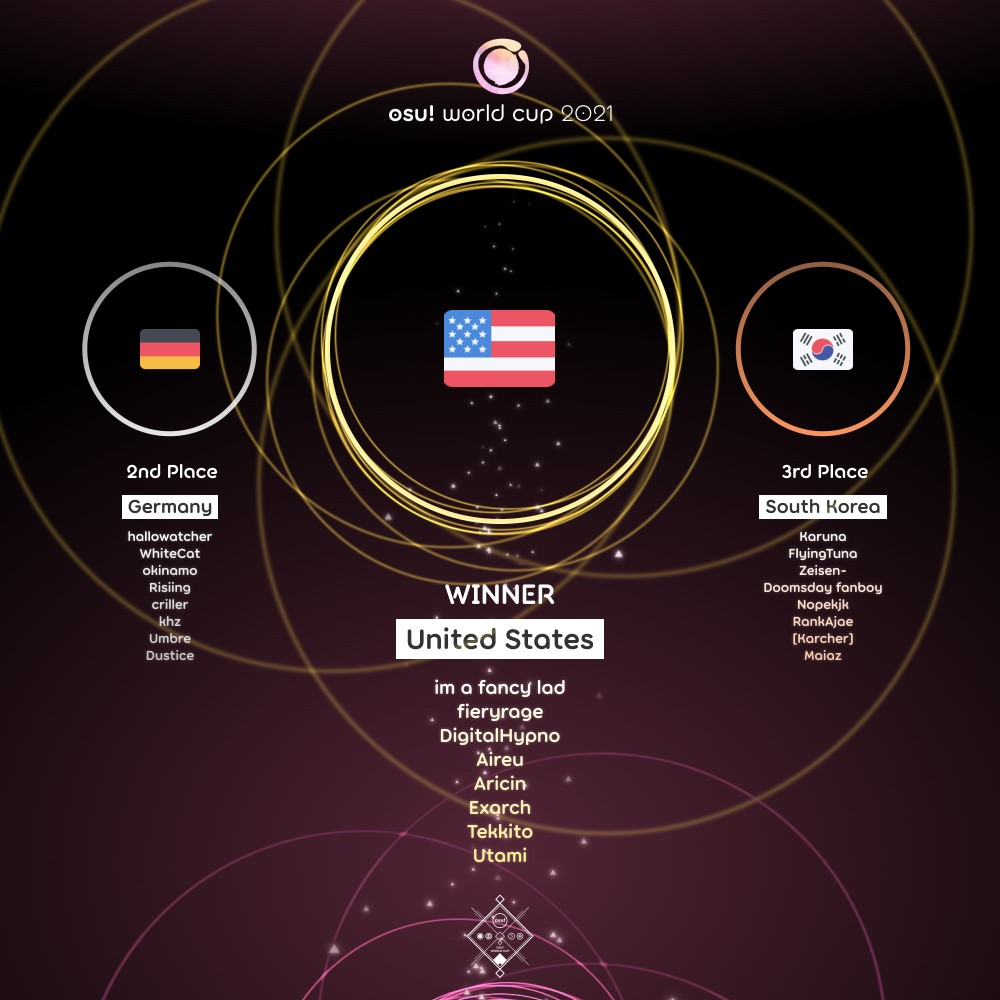

---
tags:
  - OWC
  - OWC2021
---

# osu! World Cup 2021

The **osu! World Cup 2021** (***OWC 2021***) was a country-based osu! tournament hosted by the [osu! team](/wiki/People/osu!_team). It was the twelfth instalment of the osu! World Cup.

## Tournament schedule

| Event | Timestamp |
| --: | :-- |
| Registration phase | 2021-09-16/2021-09-30 |
| Qualifier showcase | 2021-10-09 (14:00 UTC) |
| Qualifier stage | 2021-10-16/2021-10-17 |
| Round of 32 | 2021-10-23/2021-10-24 |
| Round of 16 | 2021-10-30/2021-10-31 |
| Quarterfinals | 2021-11-06/2021-11-07 |
| Semifinals | 2021-11-13/2021-11-14 |
| Finals | 2021-11-20/2021-11-21 |
| Grand Finals | 2021-11-27/2021-11-28 |

## Prizes

The osu! World Cup 2021 offered a $5,000 cash prize pool and limited edition merch!

| Placing | Prize(s) |
| :-: | :-- |
|  | 48% of the prize pool, exclusive single-run merch, profile badge, "osu! Champion" user title for one year |
|  | 32% of the prize pool, exclusive single-run merch, profile badge |
|  | 20% of the prize pool, exclusive single-run merch, profile badge |

  

## Organisation

The osu! World Cup 2021 was run by the osu! team and various community members.

| Position | Member(s) |
| :-- | :-- |
| Manager | ::{ flag=CA }:: [Azer](https://osu.ppy.sh/users/2155578), ::{ flag=US }:: [ChillierPear](https://osu.ppy.sh/users/9501251), ::{ flag=BR }:: [LeoFLT](https://osu.ppy.sh/users/3668779) |
| Mappool selector | ::{ flag=PL }:: [Bartek22830](https://osu.ppy.sh/users/6404027), ::{ flag=US }:: [Conyoh](https://osu.ppy.sh/users/4844496), ::{ flag=LT }:: [Mazzerin](https://osu.ppy.sh/users/2942381), ::{ flag=AT }:: [Omgforz](https://osu.ppy.sh/users/578943) |
| Mappool quality assurance | ::{ flag=GB }:: [AJT](https://osu.ppy.sh/users/3181083), ::{ flag=GB }:: [DeviousPanda](https://osu.ppy.sh/users/4966334), ::{ flag=AU }:: [Kano](https://osu.ppy.sh/users/3036203), ::{ flag=DE }:: [Mordred](https://osu.ppy.sh/users/7265097), ::{ flag=FR }:: [Realazy](https://osu.ppy.sh/users/918297) |
| Mapper | ::{ flag=TW }:: [\_Fast](https://osu.ppy.sh/users/959763), ::{ flag=GB }:: [\-Mo\-](https://osu.ppy.sh/users/2202163), ::{ flag=KR }:: [Acylica](https://osu.ppy.sh/users/1943309), ::{ flag=CA }:: [alden](https://osu.ppy.sh/users/3545323), ::{ flag=GB }:: [Altai](https://osu.ppy.sh/users/5745865), ::{ flag=US }:: [Astronic](https://osu.ppy.sh/users/9320502), ::{ flag=FR }:: [Atalanta](https://osu.ppy.sh/users/7543834), ::{ flag=NO }:: [BarkingMadDog](https://osu.ppy.sh/users/3475189), ::{ flag=GB }:: [CallieCube](https://osu.ppy.sh/users/7535045), ::{ flag=US }:: [Camo](https://osu.ppy.sh/users/5194391), ::{ flag=US }:: [captin1](https://osu.ppy.sh/users/689997), ::{ flag=BR }:: [Dada](https://osu.ppy.sh/users/9119507), ::{ flag=CA }:: [Deca](https://osu.ppy.sh/users/9088487), ::{ flag=GB }:: [DeviousPanda](https://osu.ppy.sh/users/4966334), ::{ flag=KR }:: [Down](https://osu.ppy.sh/users/4694602), ::{ flag=US }:: [Elcheer](https://osu.ppy.sh/users/4420014), ::{ flag=PL }:: [fartownik](https://osu.ppy.sh/users/56917), ::{ flag=RU }:: [fergas](https://osu.ppy.sh/users/3144542), ::{ flag=US }:: [Flezlin](https://osu.ppy.sh/users/3696423), ::{ flag=US }:: [Halfslashed](https://osu.ppy.sh/users/4598899), ::{ flag=FR }:: [Halgoh](https://osu.ppy.sh/users/4109923), ::{ flag=DE }:: [Icekalt](https://osu.ppy.sh/users/5410645), ::{ flag=FR }:: [IsomirDiAngelo](https://osu.ppy.sh/users/7715620), ::{ flag=US }:: [ItsWinter](https://osu.ppy.sh/users/6381153), ::{ flag=CA }:: [J1\_](https://osu.ppy.sh/users/5918561), ::{ flag=CA }:: [jonathanlfj](https://osu.ppy.sh/users/270377), ::{ flag=PH }:: [Keqing](https://osu.ppy.sh/users/15583534), ::{ flag=US }:: [kisata](https://osu.ppy.sh/users/1929729), ::{ flag=CA }:: [KKipalt](https://osu.ppy.sh/users/6889573), ::{ flag=JP }:: [Kloyd](https://osu.ppy.sh/users/1574070), ::{ flag=TW }:: [knowledgeking](https://osu.ppy.sh/users/8022517), ::{ flag=BR }:: [kowari](https://osu.ppy.sh/users/5404892), ::{ flag=CA }:: [ktgster](https://osu.ppy.sh/users/53378), ::{ flag=US }:: [Kurashina Asuka](https://osu.ppy.sh/users/7476493), ::{ flag=DE }:: [Lasse](https://osu.ppy.sh/users/896613), ::{ flag=VN }:: [LMT](https://osu.ppy.sh/users/7262798), ::{ flag=KR }:: [Luscent](https://osu.ppy.sh/users/2688581), ::{ flag=LT }:: [Mazzerin](https://osu.ppy.sh/users/2942381), ::{ flag=DE }:: [Mir](https://osu.ppy.sh/users/8688812), ::{ flag=RU }:: [Mirash](https://osu.ppy.sh/users/2841009), ::{ flag=NZ }:: [moph](https://osu.ppy.sh/users/2233878), ::{ flag=DE }:: [Mordred](https://osu.ppy.sh/users/7265097), ::{ flag=US }:: [Nao Tomori](https://osu.ppy.sh/users/5364763), ::{ flag=US }:: [Nathan](https://osu.ppy.sh/users/4785223), ::{ flag=IT }:: [Nemis](https://osu.ppy.sh/users/1635091), ::{ flag=US }:: [olc](https://osu.ppy.sh/users/7081160), ::{ flag=FR }:: [Realazy](https://osu.ppy.sh/users/918297), ::{ flag=CA }:: [Resona](https://osu.ppy.sh/users/3124248), ::{ flag=CN }:: [Ryuusei Aika](https://osu.ppy.sh/users/7777875), ::{ flag=US }:: [SkyFlame](https://osu.ppy.sh/users/3552948), ::{ flag=KR }:: [Toumei Dragon](https://osu.ppy.sh/users/6673830), ::{ flag=US }:: [toybot](https://osu.ppy.sh/users/2848604), ::{ flag=US }:: [Usaha](https://osu.ppy.sh/users/6443117), ::{ flag=DK }:: [waefwerf](https://osu.ppy.sh/users/3868653), ::{ flag=US }:: [wakaba](https://osu.ppy.sh/users/4657414), ::{ flag=BE }:: [yaspo](https://osu.ppy.sh/users/4945926), ::{ flag=US }:: [Yogurtt](https://osu.ppy.sh/users/2649717), ::{ flag=PL }:: [Zelq](https://osu.ppy.sh/users/8953955) |
| Commentator | ::{ flag=CA }:: [Azer](https://osu.ppy.sh/users/2155578), ::{ flag=GB }:: [Bubbleman](https://osu.ppy.sh/users/5182050), ::{ flag=US }:: [ChillierPear](https://osu.ppy.sh/users/9501251), ::{ flag=US }:: [D I O](https://osu.ppy.sh/users/3958619), ::{ flag=GB }:: [Damarsh](https://osu.ppy.sh/users/7465147), ::{ flag=US }:: [Dohland](https://osu.ppy.sh/users/5220511), ::{ flag=GB }:: [Doomsday](https://osu.ppy.sh/users/18983), ::{ flag=AU }:: [Kano](https://osu.ppy.sh/users/3036203), ::{ flag=AU }:: [Monk The Don](https://osu.ppy.sh/users/4012086), ::{ flag=AT }:: [Omgforz](https://osu.ppy.sh/users/578943), ::{ flag=US }:: [this1neguy](https://osu.ppy.sh/users/1797189), ::{ flag=US }:: [Will Stetson](https://osu.ppy.sh/users/4909088) |
| Referee | ::{ flag=NL }:: [Albionthegreat](https://osu.ppy.sh/users/9853595), ::{ flag=CH }:: [Icerite](https://osu.ppy.sh/users/7226287), ::{ flag=US }:: [JDrago14](https://osu.ppy.sh/users/7690078), ::{ flag=BR }:: [LeoFLT](https://osu.ppy.sh/users/3668779), ::{ flag=NL }:: [nik](https://osu.ppy.sh/users/10077264), ::{ flag=DE }:: [p3n](https://osu.ppy.sh/users/123703), ::{ flag=IN }:: [Speshimen](https://osu.ppy.sh/users/7720204), ::{ flag=US }:: [tigereyes144](https://osu.ppy.sh/users/6499811), ::{ flag=GB }:: [Yazzehh](https://osu.ppy.sh/users/7068973) |
| Statistician | ::{ flag=FI }:: [shdewz](https://osu.ppy.sh/users/10000899) |

## Links

- [Discussion thread](https://osu.ppy.sh/community/forums/topics/1420416)
- [Livestream](https://www.twitch.tv/osulive)
- [Challonge bracket](https://challonge.com/OWC_2021)
- [Pick'ems page](https://pickem.hwc.hr/tournaments/73) hosted by ::{ flag=DE }:: [hallowatcher](https://osu.ppy.sh/users/1874761)
- [Information spreadsheet](https://docs.google.com/spreadsheets/d/e/2PACX-1vRbbNXcu1NseccX52mGCXqsvRR_451sWyhsB4wbjwjQwDq4MgyPJnJOwAn7MrZIi739IW6vGERYJw3J/pubhtml)

## Participants

|  | Country | Members |
| :-: | :-: | :-- |
| ::{ flag=AR }:: | **Argentina** | **[Emiru Ikuno 2](https://osu.ppy.sh/users/9393446)**, [Amuro](https://osu.ppy.sh/users/7119659), [Emiru Ikuno](https://osu.ppy.sh/users/6169195), [Lexalia](https://osu.ppy.sh/users/1887616), [SlowBurn](https://osu.ppy.sh/users/3608846), [Penguo](https://osu.ppy.sh/users/4389490), [R1cho](https://osu.ppy.sh/users/13065919), [zeta](https://osu.ppy.sh/users/9336886) |
| ::{ flag=AU }:: | **Australia** | **[Jordan The Bear](https://osu.ppy.sh/users/7477458)**, [mrekk](https://osu.ppy.sh/users/7562902), [-Machine-](https://osu.ppy.sh/users/5459981), [Dumii](https://osu.ppy.sh/users/3068044), [jordanlr7](https://osu.ppy.sh/users/11652827), [Vivace](https://osu.ppy.sh/users/3698691), [suffix](https://osu.ppy.sh/users/2922853), [Milo Milkshake](https://osu.ppy.sh/users/8181420) |
| ::{ flag=AT }:: | **Austria** | **[Sparkxei](https://osu.ppy.sh/users/4601608)**, [Nekoyase](https://osu.ppy.sh/users/10981997), [goosefedora](https://osu.ppy.sh/users/2323131), [NuHaru](https://osu.ppy.sh/users/939213), [tomadoi](https://osu.ppy.sh/users/5712451), [Alparabel](https://osu.ppy.sh/users/8576721), [Farmist](https://osu.ppy.sh/users/11470408), [Ccus](https://osu.ppy.sh/users/11605380) |
| ::{ flag=BE }:: | **Belgium** | **[Hanori](https://osu.ppy.sh/users/7078544)**, [Fblade](https://osu.ppy.sh/users/3168085), [5joshi](https://osu.ppy.sh/users/4279650), [MimiliaaMyMommy](https://osu.ppy.sh/users/3695504), [Dabo](https://osu.ppy.sh/users/9507660), [iblue](https://osu.ppy.sh/users/9184180), [KyZzo](https://osu.ppy.sh/users/9014203), [Meersu](https://osu.ppy.sh/users/6311605) |
| ::{ flag=BR }:: | **Brazil** | **[MouseEasy](https://osu.ppy.sh/users/1558603)**, [Coreanmaluco](https://osu.ppy.sh/users/3149577), [Dafonz](https://osu.ppy.sh/users/6667041), [Mystia](https://osu.ppy.sh/users/4277702), [Sanjilift](https://osu.ppy.sh/users/3260571), [tones](https://osu.ppy.sh/users/4628473), [xKirito](https://osu.ppy.sh/users/4018079), [xxluizxx47](https://osu.ppy.sh/users/4687701) |
| ::{ flag=KH }:: | **Cambodia** | **[Sambath](https://osu.ppy.sh/users/6511038)**, [BlueMaster](https://osu.ppy.sh/users/9944060), [iToxicShadow](https://osu.ppy.sh/users/9327337), [RenaDesu](https://osu.ppy.sh/users/11659408), [tsp648](https://osu.ppy.sh/users/12301296), [YuuSakku](https://osu.ppy.sh/users/12696690) |
| ::{ flag=CA }:: | **Canada** | **[Zylice](https://osu.ppy.sh/users/5033077)**, [xootynator](https://osu.ppy.sh/users/3717598), [Frankie\_](https://osu.ppy.sh/users/5774823), [kurtis-](https://osu.ppy.sh/users/5477343), [Vespirit](https://osu.ppy.sh/users/5425046), [Jeremy\_](https://osu.ppy.sh/users/5177569), [MuffinSlayer14](https://osu.ppy.sh/users/7613309), [nick1324](https://osu.ppy.sh/users/612898) |
| ::{ flag=CL }:: | **Chile** | **[Intercambing](https://osu.ppy.sh/users/2546001)**, [Mathi](https://osu.ppy.sh/users/5339515), [DanyL](https://osu.ppy.sh/users/3069354), [Montenegro](https://osu.ppy.sh/users/7918057), [xaxreid](https://osu.ppy.sh/users/4227431), [NO37](https://osu.ppy.sh/users/4653583), [tfge](https://osu.ppy.sh/users/11207004), [Gonzah](https://osu.ppy.sh/users/12434652) |
| ::{ flag=CN }:: | **China** | **[Genshinphobia-](https://osu.ppy.sh/users/6090175)**, [im\_a\_burger\_fox](https://osu.ppy.sh/users/5791401), [KuKu\_QY](https://osu.ppy.sh/users/2598812), [lolol233](https://osu.ppy.sh/users/11375105), [striFE36](https://osu.ppy.sh/users/4388347), [Garden](https://osu.ppy.sh/users/2849992), [EmertxE](https://osu.ppy.sh/users/954557), [\[Joseph Jostar\]](https://osu.ppy.sh/users/3139364) |
| ::{ flag=CO }:: | **Colombia** | **[Ninther4](https://osu.ppy.sh/users/3291562)**, [501312](https://osu.ppy.sh/users/11083194), [Black Astro](https://osu.ppy.sh/users/10510143), [ElMick13](https://osu.ppy.sh/users/3562488), [ElMick21](https://osu.ppy.sh/users/4192956), [GaaL50](https://osu.ppy.sh/users/2374950), [Rushy](https://osu.ppy.sh/users/5281857), [Yoari](https://osu.ppy.sh/users/4160699) |
| ::{ flag=HR }:: | **Croatia** | **[KarliXon](https://osu.ppy.sh/users/9283403)**, [StrawFrog](https://osu.ppy.sh/users/10978106), [Aox](https://osu.ppy.sh/users/14614020), [Suki007](https://osu.ppy.sh/users/7289538), [DragonCroc](https://osu.ppy.sh/users/4334103), [Kek0](https://osu.ppy.sh/users/14898728), [Fiilip](https://osu.ppy.sh/users/9517052), [The Fart Lord](https://osu.ppy.sh/users/7912447) |
| ::{ flag=CZ }:: | **Czech Republic** | **[PoggersCZ](https://osu.ppy.sh/users/3198446)**, [BLooDBuRSTiNG](https://osu.ppy.sh/users/3925167), [VilaZ](https://osu.ppy.sh/users/5155680), [MrNobady](https://osu.ppy.sh/users/9303599), [Daichi](https://osu.ppy.sh/users/6602580), [NitroM\_](https://osu.ppy.sh/users/3121234), [Avenito](https://osu.ppy.sh/users/7415910), [mnbvcxy12345678](https://osu.ppy.sh/users/9422204) |
| ::{ flag=DK }:: | **Denmark** | **[iamVill](https://osu.ppy.sh/users/6295380)**, [cat burger](https://osu.ppy.sh/users/11380904), [Malach](https://osu.ppy.sh/users/9364696), [Nordkild](https://osu.ppy.sh/users/4622337), [Polle](https://osu.ppy.sh/users/13218204), [Zeezus](https://osu.ppy.sh/users/9125328), [Vandabe](https://osu.ppy.sh/users/7050754), [P3RS3X](https://osu.ppy.sh/users/9469362) |
| ::{ flag=EE }:: | **Estonia** | **[Rev0](https://osu.ppy.sh/users/10346185)**, [yasuha](https://osu.ppy.sh/users/12401523), [cedru](https://osu.ppy.sh/users/10162611), [Eminem](https://osu.ppy.sh/users/7488089), [Save Me](https://osu.ppy.sh/users/6498951), [mikn](https://osu.ppy.sh/users/5309780), [Lotragon](https://osu.ppy.sh/users/6063342), [blourgh](https://osu.ppy.sh/users/3974292) |
| ::{ flag=FI }:: | **Finland** | **[Ataraksia](https://osu.ppy.sh/users/7503114)**, [Haadez](https://osu.ppy.sh/users/8925266), [savilju](https://osu.ppy.sh/users/8059468), [boleks](https://osu.ppy.sh/users/7786382), [Xepei](https://osu.ppy.sh/users/11479551), [apisedo](https://osu.ppy.sh/users/11048151), [Amasetic](https://osu.ppy.sh/users/11375251), [HENKSELI](https://osu.ppy.sh/users/7005392) |
| ::{ flag=FR }:: | **France** | **[Musty](https://osu.ppy.sh/users/251683)**, [Ekoro](https://osu.ppy.sh/users/284905), [ThePooN](https://osu.ppy.sh/users/718454), [justman](https://osu.ppy.sh/users/7657831), [Thundur](https://osu.ppy.sh/users/4141918), [NerO](https://osu.ppy.sh/users/1545031), [Hifkil](https://osu.ppy.sh/users/4301976), [KC Snorlaax](https://osu.ppy.sh/users/3820683) |
| ::{ flag=DE }:: | **Germany** | **[hallowatcher](https://osu.ppy.sh/users/1874761)**, [WhiteCat](https://osu.ppy.sh/users/4504101), [okinamo](https://osu.ppy.sh/users/3765989), [Risiing](https://osu.ppy.sh/users/2282047), [criller](https://osu.ppy.sh/users/8116659), [khz](https://osu.ppy.sh/users/9254536), [Umbre](https://osu.ppy.sh/users/2766034), [Dustice](https://osu.ppy.sh/users/754565) |
| ::{ flag=HK }:: | **Hong Kong** | **[Shiraha Yuki](https://osu.ppy.sh/users/10829419)**, [mcy4](https://osu.ppy.sh/users/2165650), [Dragbit 3](https://osu.ppy.sh/users/9313951), [A21](https://osu.ppy.sh/users/11198996), [Minecraft570](https://osu.ppy.sh/users/2198995), [Rlsc](https://osu.ppy.sh/users/2110845), [TiRa](https://osu.ppy.sh/users/9697769), [Muji](https://osu.ppy.sh/users/2200982) |
| ::{ flag=HU }:: | **Hungary** | **[Lexion](https://osu.ppy.sh/users/5271371)**, [B L A C K Y](https://osu.ppy.sh/users/10021648), [Darnol](https://osu.ppy.sh/users/3922364), [defii](https://osu.ppy.sh/users/8698024), [Glasswave](https://osu.ppy.sh/users/5442931), [JezusNE](https://osu.ppy.sh/users/10762622), [RatinA0](https://osu.ppy.sh/users/3436625), [Tralkke](https://osu.ppy.sh/users/5039382) |
| ::{ flag=ID }:: | **Indonesia** | **[Skydiver](https://osu.ppy.sh/users/4750008)**, [Lifeline](https://osu.ppy.sh/users/11367222), [Vinno](https://osu.ppy.sh/users/10717635), [Crezz](https://osu.ppy.sh/users/7108275), [rHO](https://osu.ppy.sh/users/1629553), [Rexeez](https://osu.ppy.sh/users/1987591), [deeto](https://osu.ppy.sh/users/10069909), [Fuma](https://osu.ppy.sh/users/1501956) |
| ::{ flag=IL }:: | **Israel** | **[PaintedKoala](https://osu.ppy.sh/users/10056419)**, [-Mikeyy](https://osu.ppy.sh/users/9961743), [Accelerator](https://osu.ppy.sh/users/10822717), [Creemi69](https://osu.ppy.sh/users/13550988), [namewithnumber9](https://osu.ppy.sh/users/5867839), [StormBrightNess](https://osu.ppy.sh/users/10712019), [Jumbo](https://osu.ppy.sh/users/5509809), [cihp](https://osu.ppy.sh/users/12083446) |
| ::{ flag=IT }:: | **Italy** | **[Ryuzaki](https://osu.ppy.sh/users/7165477)**, [Arancino](https://osu.ppy.sh/users/11749789), [dem27](https://osu.ppy.sh/users/12790479), [Gigi8974](https://osu.ppy.sh/users/7774709), [giulio](https://osu.ppy.sh/users/11409111), [GYGY](https://osu.ppy.sh/users/7201269), [leoanto](https://osu.ppy.sh/users/11795963), [Matteo](https://osu.ppy.sh/users/10502781) |
| ::{ flag=JP }:: | **Japan** | **[rollpan](https://osu.ppy.sh/users/3062998)**, [Varvalian](https://osu.ppy.sh/users/3345902), [EIGER](https://osu.ppy.sh/users/1504556), [KonKonKinakoN](https://osu.ppy.sh/users/4733185), [haga1115](https://osu.ppy.sh/users/6574823), [----](https://osu.ppy.sh/users/4304495), [Aotoleen](https://osu.ppy.sh/users/3162741), [a\_Blue](https://osu.ppy.sh/users/5645667) |
| ::{ flag=KZ }:: | **Kazakhstan** | **[Ayya Novak](https://osu.ppy.sh/users/5910601)**, [Calideon](https://osu.ppy.sh/users/5175726), [Arnold576](https://osu.ppy.sh/users/11967146), [FengShen](https://osu.ppy.sh/users/5536431), [ace1ng](https://osu.ppy.sh/users/13297978), [Akira](https://osu.ppy.sh/users/1330619), [Kamensh1k](https://osu.ppy.sh/users/16817965), [RinKonri](https://osu.ppy.sh/users/12100617) |
| ::{ flag=LV }:: | **Latvia** | **[waywern2012](https://osu.ppy.sh/users/5870453)**, [AkitoshisNormal](https://osu.ppy.sh/users/12070555), [Emula](https://osu.ppy.sh/users/2891792), [kbwaaablya](https://osu.ppy.sh/users/6473092), [MegaWhyNOPE](https://osu.ppy.sh/users/8676070), [Piparkuucinsh](https://osu.ppy.sh/users/7453024), [rihis123](https://osu.ppy.sh/users/4499926), [TheBigDrop](https://osu.ppy.sh/users/10470806) |
| ::{ flag=LT }:: | **Lithuania** | **[noob pwner](https://osu.ppy.sh/users/4360718)**, [ReusoL](https://osu.ppy.sh/users/2539010), [Haganenno](https://osu.ppy.sh/users/4692344), [Nitram](https://osu.ppy.sh/users/10569535), [DJ Dalgis](https://osu.ppy.sh/users/4095562), [mizhalas43](https://osu.ppy.sh/users/7225339), [Merami Frog](https://osu.ppy.sh/users/8766780), [PainSinger](https://osu.ppy.sh/users/697843) |
| ::{ flag=MY }:: | **Malaysia** | **[ShaneLiang](https://osu.ppy.sh/users/6716499)**, [wuhua](https://osu.ppy.sh/users/2932510), [Rampax](https://osu.ppy.sh/users/3995630), [haruchi](https://osu.ppy.sh/users/4845266), [Shimon](https://osu.ppy.sh/users/7525949), [seabee](https://osu.ppy.sh/users/13472074), [Inugami Korone](https://osu.ppy.sh/users/4474918), [Chiyuu](https://osu.ppy.sh/users/8226107) |
| ::{ flag=MX }:: | **Mexico** | **[-Wolfy-](https://osu.ppy.sh/users/4497582)**, [-Hebel-](https://osu.ppy.sh/users/6169483), [Flameshock](https://osu.ppy.sh/users/8349047), [Jalepers](https://osu.ppy.sh/users/7341086), [KevstracK](https://osu.ppy.sh/users/5325213), [pundice](https://osu.ppy.sh/users/7940696), [Riot](https://osu.ppy.sh/users/4256461), [SaintSFT](https://osu.ppy.sh/users/14970132) |
| ::{ flag=NL }:: | **Netherlands** | **[Skyrovania](https://osu.ppy.sh/users/4696315)**, [Viveliam](https://osu.ppy.sh/users/3506793), [jackylam5](https://osu.ppy.sh/users/1540807), [Manievat](https://osu.ppy.sh/users/6744123), [Luciano](https://osu.ppy.sh/users/11604978), [CosmicWolf](https://osu.ppy.sh/users/8352298), [Dolter](https://osu.ppy.sh/users/6920104), [Kushper](https://osu.ppy.sh/users/4832514) |
| ::{ flag=NZ }:: | **New Zealand** | **[Zoomer](https://osu.ppy.sh/users/6600930)**, [Big Z](https://osu.ppy.sh/users/8641416), [shortpotato](https://osu.ppy.sh/users/1266102), [catcat](https://osu.ppy.sh/users/11141578), [VioIette](https://osu.ppy.sh/users/15293080), [Saiyku](https://osu.ppy.sh/users/13767572), [Feyyy](https://osu.ppy.sh/users/2523703), [Dabble](https://osu.ppy.sh/users/10102221) |
| ::{ flag=NO }:: | **Norway** | **[YokesPai](https://osu.ppy.sh/users/6399568)**, [-GN](https://osu.ppy.sh/users/895581), [Fjell](https://osu.ppy.sh/users/6951444), [Markus](https://osu.ppy.sh/users/8414284), [Melvr](https://osu.ppy.sh/users/9211924), [ninerik](https://osu.ppy.sh/users/10549880), [Njulsen](https://osu.ppy.sh/users/10773960), [Pinguinzi](https://osu.ppy.sh/users/9414229) |
| ::{ flag=PE }:: | **Peru** | **[Arnold24x24](https://osu.ppy.sh/users/2291265)**, [P r a h](https://osu.ppy.sh/users/10509043), [RedLight748](https://osu.ppy.sh/users/4192805), [Hasaki](https://osu.ppy.sh/users/9037054), [Nkiad](https://osu.ppy.sh/users/13684411), [Souen](https://osu.ppy.sh/users/2367544), [Im\_Alviin](https://osu.ppy.sh/users/17096254), [ViniPvP](https://osu.ppy.sh/users/4794808) |
| ::{ flag=PH }:: | **Philippines** | **[zonelouise](https://osu.ppy.sh/users/1492995)**, [Milkteaism](https://osu.ppy.sh/users/9642774), [Kageno](https://osu.ppy.sh/users/7246165), [Xyloz](https://osu.ppy.sh/users/12040280), [hyeok2044](https://osu.ppy.sh/users/8472976), [Rammu](https://osu.ppy.sh/users/10652837), [LilyFlower](https://osu.ppy.sh/users/7449949), [elki](https://osu.ppy.sh/users/8136525) |
| ::{ flag=PL }:: | **Poland** | **[maliszewski](https://osu.ppy.sh/users/12408961)**, [Rafis](https://osu.ppy.sh/users/2558286), [WubWoofWolf](https://osu.ppy.sh/users/39828), [laroxPL](https://osu.ppy.sh/users/6194820), [Mastasz](https://osu.ppy.sh/users/1876565), [MAREK MARUCHA](https://osu.ppy.sh/users/2395405), [Burtpi](https://osu.ppy.sh/users/6831210), [TWOJA STARA](https://osu.ppy.sh/users/8170186) |
| ::{ flag=PT }:: | **Portugal** | **[MakiDonalds](https://osu.ppy.sh/users/11610772)**, [Takaga](https://osu.ppy.sh/users/7448448), [Just2Gud](https://osu.ppy.sh/users/4430263), [Legendz](https://osu.ppy.sh/users/4333312), [GeneralSharkk](https://osu.ppy.sh/users/8811633), [Netizz](https://osu.ppy.sh/users/3256745), [My Angel Takaga](https://osu.ppy.sh/users/10018872), [dat boi waffle](https://osu.ppy.sh/users/4215381) |
| ::{ flag=RO }:: | **Romania** | **[badeu](https://osu.ppy.sh/users/1473890)**, [Lucrise](https://osu.ppy.sh/users/9719351), [nanoya](https://osu.ppy.sh/users/12366071), [\_AfterWind](https://osu.ppy.sh/users/2086138), [Chamosiala](https://osu.ppy.sh/users/1469892), [L9 ELOVATOR](https://osu.ppy.sh/users/9578404), [eternum](https://osu.ppy.sh/users/4581069), [cristi2708](https://osu.ppy.sh/users/7552300) |
| ::{ flag=RU }:: | **Russian Federation** | **[Vitya1437](https://osu.ppy.sh/users/4346274)**, [Red\_Pixel](https://osu.ppy.sh/users/4170932), [Leva\_Russian](https://osu.ppy.sh/users/5199332), [MrFuture](https://osu.ppy.sh/users/5724445), [TESTER PIVKA](https://osu.ppy.sh/users/9961301), [Aoi Kiseki](https://osu.ppy.sh/users/6215032), [Apostol](https://osu.ppy.sh/users/9902255), [talala](https://osu.ppy.sh/users/1389663) |
| ::{ flag=SG }:: | **Singapore** | **[Tebi](https://osu.ppy.sh/users/5407620)**, [Demonical](https://osu.ppy.sh/users/5447609), [Loslite](https://osu.ppy.sh/users/6398160), [megumic](https://osu.ppy.sh/users/7537133), [emilia](https://osu.ppy.sh/users/2003326), [SeeL](https://osu.ppy.sh/users/5104320), [GSBlank](https://osu.ppy.sh/users/2312106), [Rtyzen](https://osu.ppy.sh/users/2439822) |
| ::{ flag=SK }:: | **Slovakia** | **[Tikef](https://osu.ppy.sh/users/9149213)**, [DogeDrxvmik](https://osu.ppy.sh/users/11383358), [Hranolka](https://osu.ppy.sh/users/6149947), [Igor156](https://osu.ppy.sh/users/7358639), [PemiX](https://osu.ppy.sh/users/6974470), [PeteX](https://osu.ppy.sh/users/1285945), [TenIdiotZTelky](https://osu.ppy.sh/users/10069181), [triiiiiple](https://osu.ppy.sh/users/7055866) |
| ::{ flag=KR }:: | **South Korea** | **[Karuna](https://osu.ppy.sh/users/8775024)**, [FlyingTuna](https://osu.ppy.sh/users/9224078), [Zeisen-](https://osu.ppy.sh/users/7892320), [Doomsday fanboy](https://osu.ppy.sh/users/4511522), [Nopekjk](https://osu.ppy.sh/users/4585186), [RankAjae](https://osu.ppy.sh/users/12137295), [\[Karcher\]](https://osu.ppy.sh/users/11443437), [Maiaz](https://osu.ppy.sh/users/6916642) |
| ::{ flag=ES }:: | **Spain** | **[amborgesa](https://osu.ppy.sh/users/1968481)**, [A N T O N I O](https://osu.ppy.sh/users/12760743), [Estopa](https://osu.ppy.sh/users/4470553), [AbejaIvan](https://osu.ppy.sh/users/6216284), [NHarmonia](https://osu.ppy.sh/users/9582556), [dariito0xx](https://osu.ppy.sh/users/4739655), [-Hideki-](https://osu.ppy.sh/users/8688804), [Bairechuu](https://osu.ppy.sh/users/15346564) |
| ::{ flag=SE }:: | **Sweden** | **[Saika0k1](https://osu.ppy.sh/users/4316633)**, [\[ Couch \]](https://osu.ppy.sh/users/2854598), [\[ Blue \]](https://osu.ppy.sh/users/4859699), [-Masta-](https://osu.ppy.sh/users/12521607), [scylla](https://osu.ppy.sh/users/9405745), [Reedkatt](https://osu.ppy.sh/users/8335950), [Andros](https://osu.ppy.sh/users/9072586), [Jageko](https://osu.ppy.sh/users/5798349) |
| ::{ flag=CH }:: | **Switzerland** | **[Ayeka](https://osu.ppy.sh/users/7225922)**, [ILikeManyBirds](https://osu.ppy.sh/users/13469141), [Mizurii 2](https://osu.ppy.sh/users/10394866), [-Spartan](https://osu.ppy.sh/users/5783061), [Akani](https://osu.ppy.sh/users/2323137), [Skellers](https://osu.ppy.sh/users/8040245), [Sil](https://osu.ppy.sh/users/7924600), [Niven](https://osu.ppy.sh/users/5297955) |
| ::{ flag=TW }:: | **Taiwan** | **[Shiina Noriko](https://osu.ppy.sh/users/1285637)**, [Rucker](https://osu.ppy.sh/users/147515), [\_Shield](https://osu.ppy.sh/users/1860489), [DazzLE\_Wind](https://osu.ppy.sh/users/2537924), [NekoKamui](https://osu.ppy.sh/users/7172340), [Spinesnight](https://osu.ppy.sh/users/4519494), [975250450](https://osu.ppy.sh/users/3036545), [Diaostrophism](https://osu.ppy.sh/users/2317789) |
| ::{ flag=TH }:: | **Thailand** | **[Faken](https://osu.ppy.sh/users/10249166)**, [-Kedama](https://osu.ppy.sh/users/12147277), [chantat on osu](https://osu.ppy.sh/users/12290117), [minecrafter](https://osu.ppy.sh/users/9389213), [ChaiPhukChep](https://osu.ppy.sh/users/9723127), [UltimaticCatz](https://osu.ppy.sh/users/6068543), [Phirse](https://osu.ppy.sh/users/10069015), [Yorocchi](https://osu.ppy.sh/users/5286218) |
| ::{ flag=TR }:: | **Turkey** | **[Raikouhou](https://osu.ppy.sh/users/8007528)**, [Gilraen](https://osu.ppy.sh/users/9256771), [heyronii](https://osu.ppy.sh/users/5642779), [Misumena](https://osu.ppy.sh/users/6440158), [Zeforex](https://osu.ppy.sh/users/11236262), [egemenbsrms](https://osu.ppy.sh/users/4520477), [Shinkir0](https://osu.ppy.sh/users/6093148), [-Kemsyt](https://osu.ppy.sh/users/3170401) |
| ::{ flag=UA }:: | **Ukraine** | **[Kryterion](https://osu.ppy.sh/users/9920144)**, [1Max](https://osu.ppy.sh/users/11653711), [gusniki](https://osu.ppy.sh/users/9830628), [kug1](https://osu.ppy.sh/users/6997572), [Endless Tilt](https://osu.ppy.sh/users/11274086), [netwhynot](https://osu.ppy.sh/users/11794209), [dench](https://osu.ppy.sh/users/10073635), [magnatagamer123](https://osu.ppy.sh/users/7587763) |
| ::{ flag=GB }:: | **United Kingdom** | **[Bubbleman](https://osu.ppy.sh/users/5182050)**, [Karthy](https://osu.ppy.sh/users/4196808), [bloo](https://osu.ppy.sh/users/6778877), [Voss](https://osu.ppy.sh/users/7657761), [majoreh](https://osu.ppy.sh/users/7959222), [Jemzsee](https://osu.ppy.sh/users/11553627), [Kingling](https://osu.ppy.sh/users/7010761), [Malteser](https://osu.ppy.sh/users/5218178) |
| ::{ flag=US }:: | **United States** | **[im a fancy lad](https://osu.ppy.sh/users/4908650)**, [fieryrage](https://osu.ppy.sh/users/3533958), [DigitalHypno](https://osu.ppy.sh/users/4384207), [Aireu](https://osu.ppy.sh/users/1650010), [Aricin](https://osu.ppy.sh/users/1419095), [Exarch](https://osu.ppy.sh/users/5370153), [Tekkito](https://osu.ppy.sh/users/7075211), [Utami](https://osu.ppy.sh/users/7512553) |
| ::{ flag=UY }:: | **Uruguay** | **[daanit](https://osu.ppy.sh/users/6159669)**, [Rebo](https://osu.ppy.sh/users/6942259), [Kazuki K](https://osu.ppy.sh/users/6407282), [FDX](https://osu.ppy.sh/users/8987016), [Rondro](https://osu.ppy.sh/users/9293124), [Saphity](https://osu.ppy.sh/users/5382216), [El Milanga](https://osu.ppy.sh/users/12264918), [Raby](https://osu.ppy.sh/users/5218320) |
| ::{ flag=VN }:: | **Vietnam** | **[Tuon](https://osu.ppy.sh/users/6673790)**, [Ui chan](https://osu.ppy.sh/users/5449433), [- Mel -](https://osu.ppy.sh/users/9829680), [kiethao](https://osu.ppy.sh/users/2283137), [\[sin\]](https://osu.ppy.sh/users/11021073), [\[Boy\]DaLat](https://osu.ppy.sh/users/8266808), [\_Kuroni\_](https://osu.ppy.sh/users/6159305), [Liyuchi](https://osu.ppy.sh/users/3275495) |

## Podium

## Mappools

### Grand Finals

**[Download the mappack here (181 MB)](https://drive.google.com/uc?id=1mvH20LLVVej_ZGR08-xadqJ0hAB0vQGS)**

- NoMod
  1. [katagiri - Buta Musou (BarkingMadDog) \[Unparalleled\]](https://osu.ppy.sh/beatmapsets/1633225#osu/3333705)
  2. [Brymir - Pantheon of Forsaken Gods (LMT) \[Hideous Divinity\]](https://osu.ppy.sh/beatmapsets/1633210#osu/3333669)
  3. [Yousei Teikoku - Autoscopy (moph) \[Extreme\]](https://osu.ppy.sh/beatmapsets/1633220#osu/3333699)
  4. [seatrus - ILLEGAL LEGACY (Halgoh) \[Halgoh x Sharu\]](https://osu.ppy.sh/beatmapsets/1633224#osu/3333703)
  5. [AAAA vs. Frums - beepbit \* futures (toybot) \[fast \* forward\]](https://osu.ppy.sh/beatmapsets/1633221#osu/3333700)
  6. [ARM - Rhododendron (yaspo) \[wacky\]](https://osu.ppy.sh/beatmapsets/1633222#osu/3333701)
- Hidden
  1. [Mors Principium Est - Livin' La Vida Loca (LMT) \[livin la vida mazzerin\]](https://osu.ppy.sh/beatmapsets/1538589#osu/3145691)
  2. [Cranky - Bestrafung (Icekalt) \[Schmerzen im Handgelenk\]](https://osu.ppy.sh/beatmapsets/1633283#osu/3333793)
  3. [Rish feat. Choko - Marukute Hayakute Susamajii Rhythm (Motto Susamajii Ver) (Nathan) \[CANDY PANIC BOMB!\]](https://osu.ppy.sh/beatmapsets/1633226#osu/3333706)
- HardRock
  1. [Roselia - ZEAL of proud (SkyFlame) \[Radiant\]](https://osu.ppy.sh/beatmapsets/1504153#osu/3081546)
  2. [KUMOKIRI - Shippuujinrai (Kloyd) \[Ozma\]](https://osu.ppy.sh/beatmapsets/1631947#osu/3331199)
  3. [tarolabo - eth ken (Keqing) \[Arcane OWC\]](https://osu.ppy.sh/beatmapsets/1633205#osu/3333660)
- DoubleTime
  1. [nano.RIPE - Kagefumi (Mirash) \[Delisa and Miranda womanitized collab\]](https://osu.ppy.sh/beatmapsets/1633147#osu/3333570)
  2. [Nightwish - Sacrament of Wilderness (Nao Tomori) \[Insane (OWC)\]](https://osu.ppy.sh/beatmapsets/1633156#osu/3333586)
  3. [Emiru no Aishita Tsukiyo ni Dai San Gensou Kyoku wo - Gekijou no Prominence (-Mo-) \[Insane\]](https://osu.ppy.sh/beatmapsets/1633270#osu/3333770)
  4. [USAO - Chariot (Extended Mix) (Realazy) \[lebronJAM\]](https://osu.ppy.sh/beatmapsets/1633242#osu/3333734)
- FreeMod
  1. [Falcom Sound Team jdk - Heavy Violent Match (jonathanlfj) \[OWC Match\]](https://osu.ppy.sh/beatmapsets/1633237#osu/3333729)
  2. [connsome - flat by second (ktgster) \[Another\]](https://osu.ppy.sh/beatmapsets/1633261#osu/3333760)
  3. [Toby "Radiation" Fox - Black (Mismagius) \[Make Her a Member of the OWC Crew\]](https://osu.ppy.sh/beatmapsets/1245641#osu/3333738)
- Tiebreaker
  1. **[Yooh - RPG (Zelq) \[Divinity\]](https://osu.ppy.sh/beatmapsets/1633250#osu/3333745)**

### Finals

**[Download the mappack here (168 MB)](https://drive.google.com/uc?id=1xYeBevbU03IMrccM5UH2Z8cMOMkOT4j5)**

- NoMod
  1. [Aqours - Kimeta yo Hand in Hand (SkyFlame) \[Unity\]](https://osu.ppy.sh/beatmapsets/1288914#osu/2675756)
  2. [Halv - Romanesque (knowledgeking) \[Eternal Hope\]](https://osu.ppy.sh/beatmapsets/1627446#osu/3322513)
  3. [HIDEKI NAGANUMA - AIN'T NOTHING LIKE A FUNKY BEAT (yaspo) \[AIN'T NOTHIN' LIKE A FUNKY BEAT\]](https://osu.ppy.sh/beatmapsets/1627451#osu/3322521)
  4. [RAM - Mertvetsy (Mazzerin) \[Requiem\]](https://osu.ppy.sh/beatmapsets/1627456#osu/3322526)
  5. [Kissing the Mirror x UNDEAD CORPORATION - Frozen Gear (Zelq) \[whitesquarable (speed edit)\]](https://osu.ppy.sh/beatmapsets/1627466#osu/3322566)
  6. [Retractable - Gameset (Down) \[Lunatic\]](https://osu.ppy.sh/beatmapsets/1627210#osu/3322093)
- Hidden
  1. [KikuoHana - Desert Theater (Keqing) \[Mirage (\#1)\]](https://osu.ppy.sh/beatmapsets/1382362#osu/2856086)
  2. [Shimotsuki Haruka - Akahitoha (fartownik) \[Insane\]](https://osu.ppy.sh/beatmapsets/1627474#osu/3322576)
  3. [Crimsona - Hyper Fiber World Spectrum (Icekalt) \[Festival\]](https://osu.ppy.sh/beatmapsets/1267294#osu/2633747)
- HardRock
  1. [Denkishiki Karen Ongaku Shuudan - gemini (Star Stream) \[Extra\]](https://osu.ppy.sh/beatmapsets/182815#osu/438187)
  2. [solfa - Battle 6 : okamitachi no kiba -Revenge of the wolves- (Reiji Maigo) \[awa\]](https://osu.ppy.sh/beatmapsets/1431935#osu/2947341)
  3. [Raphlesia - Showdown (Realazy) \[coupe du monde 2006\]](https://osu.ppy.sh/beatmapsets/1627494#osu/3322603)
- DoubleTime
  1. [MomoKurotei Ichimon - Nippon Egao Hyakkei (alden) \[smile (owc ver.)\]](https://osu.ppy.sh/beatmapsets/1614390#osu/3320894)
  2. [A-One feat, Hanatan - Break The Hierarchie (DeviousPanda) \[Insane\]](https://osu.ppy.sh/beatmapsets/1627491#osu/3322598)
  3. [Lime - Renai Syndrome (apaffy) \[Another\]](https://osu.ppy.sh/beatmapsets/166062#osu/859667)
  4. [Hatsuki Yura - Koisuru Marionette (KKipalt) \[Insane\]](https://osu.ppy.sh/beatmapsets/1627501#osu/3322610)
- FreeMod
  1. [Senki Zesshou Symphogear G - Edge Works of Goddess ZABABA (Atalanta) \[Death Melody\]](https://osu.ppy.sh/beatmapsets/1627502#osu/3322611)
  2. [Brymir - Nephilim (LMT) \[Unholy Ritualus\]](https://osu.ppy.sh/beatmapsets/1271973#osu/2643166)
  3. [SEPHID - The Public Parallel (Camo) \[Master\]](https://osu.ppy.sh/beatmapsets/1627418#osu/3322445)
- Tiebreaker
  1. **[Cradle Of Filth - The Abhorrent (Mazzerin) \[Ensorcelled By Khaos\]](https://osu.ppy.sh/beatmapsets/1627506#osu/3322616)**

### Semifinals

**[Download the mappack here (142 MB)](https://drive.google.com/uc?id=1laAwM3DfjZYWtOpPxRJq9DUh5UDK6TVU)**

- NoMod
  1. [Rena - Sweet Sweet Cendrillon Drug (Flezlin) \[n1\]](https://osu.ppy.sh/beatmapsets/1621784#osu/3311170)
  2. [Xi - Densetsu no Sabori Shinigami \~ Make a quick escape (Toumei Dragon) \[Extra Stage\]](https://osu.ppy.sh/beatmapsets/1621473#osu/3310526)
  3. [KINEMA106 - N.M.W (Mordred) \[NO MORE WAR\]](https://osu.ppy.sh/beatmapsets/1621874#osu/3311309)
  4. [Dirtyphonics - Night Ride (Halgoh) \[Ultimate Drift\]](https://osu.ppy.sh/beatmapsets/1621891#osu/3311337)
  5. [Sorry about my face - Call me with you (fergas) \[\[ya otpravlus' za toboi\]\]](https://osu.ppy.sh/beatmapsets/1621877#osu/3311312)
  6. [Wiktoria - Karei Naru Ooinu Enbukyoku (Keqing) \[Arcane\]](https://osu.ppy.sh/beatmapsets/1621878#osu/3311313)
- Hidden
  1. [OddAi - Tie me down gently -long ver- (Camo) \[Ultra\]](https://osu.ppy.sh/beatmapsets/1621830#osu/3311238)
  2. [BlackY - Black Rose (Luscent) \[Extra\]](https://osu.ppy.sh/beatmapsets/1621706#osu/3311073)
  3. [ikaruga\_nex - Lilith ambivalence lovers (Ametrin) \[Toxic crush\]](https://osu.ppy.sh/beatmapsets/1084460#osu/2267887)
- HardRock
  1. [MY FIRST STORY - ALONE (Saut) \[Isolation\]](https://osu.ppy.sh/beatmapsets/395846#osu/861381)
  2. [WHITEFISTS - VECTOR (captin1) \[Beyond\]](https://osu.ppy.sh/beatmapsets/1621892#osu/3311344)
  3. [Hana - crocodile tears (Nathan) \[Facade\]](https://osu.ppy.sh/beatmapsets/1621683#osu/3311036)
- DoubleTime
  1. [Yousei Teikoku - Torikago (Nagi Hisakawa) \[Immure\]](https://osu.ppy.sh/beatmapsets/1271945#osu/2643135)
  2. [ZUN - Nemureru Kyoufu \~ Sleeping Terror (Kurashina Asuka) \[Lunatic\]](https://osu.ppy.sh/beatmapsets/1621910#osu/3311366)
  3. [Chase & Status feat. Plan B - End Credits (Nemis) \[Nemis\]](https://osu.ppy.sh/beatmapsets/105686#osu/277274)
  4. [Malk De Koijn - Braget (waefwerf) \[funny\]](https://osu.ppy.sh/beatmapsets/1621901#osu/3311356)
- FreeMod
  1. [Team Grimoire - Dantalion (Down) \[Conflict\]](https://osu.ppy.sh/beatmapsets/1622117#osu/3311891)
  2. [Falcom Sound Team jdk - Mighty Urge (Mordred) \[Radiant Wings\]](https://osu.ppy.sh/beatmapsets/1621916#osu/3311383)
  3. [SOOOO - Rasou (CallieCube) \[The Cube (Tourney Ver.)\]](https://osu.ppy.sh/beatmapsets/1621913#osu/3311375)
- Tiebreaker
  1. **[CANVAS feat. Quimar - Carmina (Extended Mix) (Realazy) \[Apotheosis\]](https://osu.ppy.sh/beatmapsets/1621918#osu/3311391)**

### Quarterfinals

**[Download the mappack here (139 MB)](https://drive.google.com/uc?id=1lhBkq0qU8hWRD6JK9vRRuSKdBEAbeVqc)**

- NoMod
  1. [TRUE - Storyteller (captin1) \[Extra\]](https://osu.ppy.sh/beatmapsets/1616036#osu/3299389)
  2. [Sabaton - Twilight Of The Thunder God (Mazzerin) \[Ragnarok awaits\]](https://osu.ppy.sh/beatmapsets/1616046#osu/3299406)
  3. [Yousei Teikoku - Sacrifice (IsomirDiAngelo) \[Antares\]](https://osu.ppy.sh/beatmapsets/1616051#osu/3299411)
  4. [Zekk - Feelsleft0ut (J1\_) \[Alone (2021 Remastered)\]](https://osu.ppy.sh/beatmapsets/821587#osu/1722011)
  5. [Summoning The Lich - Death Crystal (ItsWinter) \[BLOODSTAINED SACRIFICE\]](https://osu.ppy.sh/beatmapsets/1615076#osu/3297498)
  6. [Sleeping Pola - live on kaeps (DeviousPanda) \[Fortississimo\]](https://osu.ppy.sh/beatmapsets/1616052#osu/3299412)
- Hidden
  1. [Krewella X DISKORD - Beggars (Consouls Remix) (NeilPerry) \[Neil x Ameth's Conflux\]](https://osu.ppy.sh/beatmapsets/881753#osu/1843575)
  2. [Miku Fujimoto - Mari-Temari (DeviousPanda) \[Dance\]](https://osu.ppy.sh/beatmapsets/1262423#osu/2623967)
  3. [xi - .357 Magnum (Akali) \[High Noon\]](https://osu.ppy.sh/beatmapsets/155749#osu/546944)
- HardRock
  1. [Wavves - Super Soaker (Elcheer) \[Stupid\]](https://osu.ppy.sh/beatmapsets/1267328#osu/2633812)
  2. [Dimrain47 - The Prototype (Nemis) \[Ex†ra\]](https://osu.ppy.sh/beatmapsets/1615776#osu/3298820)
  3. [True Damage - GIANTS (feat. Becky G, Keke Palmer, SOYEON, DUCKWRTH, Thutmose) (Sylas) \[Prestige\]](https://osu.ppy.sh/beatmapsets/1063804#osu/2229381)
- DoubleTime
  1. [Printemps - Eien Friends (Sakaue Nachi) \[Friends\]](https://osu.ppy.sh/beatmapsets/235836#osu/546514)
  2. [-45 - System Sun (Lasse) \[Insane\]](https://osu.ppy.sh/beatmapsets/1616029#osu/3299371)
  3. [Hatsuki Yura - Junketsu to Toki no Tenbin (KKipalt) \[Insane OTST\]](https://osu.ppy.sh/beatmapsets/1543580#osu/3155184)
  4. [Dio ft. Sef - Aye (lesjuh) \[Aye!!\]](https://osu.ppy.sh/beatmapsets/13994#osu/53340)
- FreeMod
  1. [Falcom Sound Team jdk - Infinity Rage (jonathanlfj) \[Stage 4\]](https://osu.ppy.sh/beatmapsets/1616017#osu/3299353)
  2. [REDALiCE - Taboo tears you up 2017 (Dada) \[Vintage\]](https://osu.ppy.sh/beatmapsets/1616043#osu/3299402)
  3. [Born Of Osiris - Rosecrance (CallieCube) \[THE RETURN OF OBAMACUBE\]](https://osu.ppy.sh/beatmapsets/1616078#osu/3299463)
- Tiebreaker
  1. **[Noah feat. Ohsera Ai - Rebirth the end Part I - Sasanqua (Deca) \[Magius\]](https://osu.ppy.sh/beatmapsets/1616079#osu/3299464)**

### Round of 16

**[Download the mappack here (125 MB)](https://drive.google.com/file/d/1a5Y_JvVKGSuN_WofpDz22pIvHyBUb33D/view?usp=sharing)**

- NoMod
  1. [Comela - Wing of Destiny (Nana Abe) \[OWC Tyrant\]](https://osu.ppy.sh/beatmapsets/1610199#osu/3287700)
  2. [Ice - Amber Wishes (Deemo edit) (Astronic) \[Aspiration\]](https://osu.ppy.sh/beatmapsets/1610241#osu/3287781)
  3. [Ariabl'eyeS - Unmei no Kousaku (Mirash) \[Mirash x Delisha Collab\]](https://osu.ppy.sh/beatmapsets/1610080#osu/3287483)
  4. [Mysteka - Hesperos (Acylica) \[3dyoshispin\]](https://osu.ppy.sh/beatmapsets/1610294#osu/3287875)
  5. [Project Gabbangelion - Lolit Speed (Cut Ver.) (alden) \[crack collab\]](https://osu.ppy.sh/beatmapsets/1610082#osu/3287485)
- Hidden
  1. [Denkishiki Karen Ongaku Shuudan - Shinoburedo (Lasse) \[Despair (owc ver.)\]](https://osu.ppy.sh/beatmapsets/1610204#osu/3287711)
  2. [Nishigomi Kakumi - Sengoku Sangen (Flask) \[Oni\]](https://osu.ppy.sh/beatmapsets/1610179#osu/3287656)
- HardRock
  1. [USAO - Dynamite (Extended Mix) (sukiNathan) \[TWERK\]](https://osu.ppy.sh/beatmapsets/431697#osu/990396)
  2. [lapix - Voyager (KKipalt) \[Another Slight Buff\]](https://osu.ppy.sh/beatmapsets/1610221#osu/3287751)
- DoubleTime
  1. [Hana - Eden's song (Kowari) \[Insane\]](https://osu.ppy.sh/beatmapsets/1610217#osu/3287743)
  2. [senya - Kasoku Suru Koi wa Dare mo Tomerarenai (Luscent) \[Lunatic\]](https://osu.ppy.sh/beatmapsets/1609956#osu/3287252)
  3. [Hatsuki Yura - RED LUNACY Nightmare\_ver (KKipalt) \[Insane OTST6\]](https://osu.ppy.sh/beatmapsets/1464373#osu/3142329)
- FreeMod
  1. [Feryquitous - Quon-Extend- (captin1) \[hit da quon\]](https://osu.ppy.sh/beatmapsets/1362537#osu/2819029)
  2. [Sougetsu Eli - Aoi Chou (Ryuusei Aika) \[Transient\]](https://osu.ppy.sh/beatmapsets/1610224#osu/3287758)
- Tiebreaker
  1. **[King Gizzard & The Lizard Wizard - Robot Stop (olc) \[REDLIGHT (VIP)\]](https://osu.ppy.sh/beatmapsets/1610231#osu/3287767)**

### Round of 32

**[Download the mappack here (105 MB)](https://drive.google.com/file/d/16AY1VaM5m_SQouIHnEFn7rG55DDc-qbi/view?usp=sharing)**

- NoMod
  1. [Imy - Divine's Game (Nao Tomori) \[Extra\]](https://osu.ppy.sh/beatmapsets/1604377#osu/3276259)
  2. [Noah - Primal scream (wakaba) \[ahh\]](https://osu.ppy.sh/beatmapsets/1604632#osu/3276724)
  3. [THE BINARY mido - Ego mo Id mo Tanjun ni (kuyusu) \[moph's Extra\]](https://osu.ppy.sh/beatmapsets/1268824#osu/2692632)
  4. [F Rabbeat - Be With U (Altai) \[Don't Just Stand There...\]](https://osu.ppy.sh/beatmapsets/1604642#osu/3276740)
  5. [Laur - Nostalgic Blood of the Strife (Zelq) \[MAXIMUM\]](https://osu.ppy.sh/beatmapsets/1257525#osu/2613076)
- Hidden
  1. [Sound Souler - Bubble Flower (Keqing) \[Serenity\]](https://osu.ppy.sh/beatmapsets/1604543#osu/3276559)
  2. [Various Artists - Netsuretsu Kangei Wonderland (Mirash) \[Delisha vs Mirash's Mahjong Soul 1v1 Grand Finals \[BO9\]\]](https://osu.ppy.sh/beatmapsets/1604477#osu/3276441)
- HardRock
  1. [jippusu - Mushikui Saikede Rhythm (Amamiya Yuko) \[RLC\]](https://osu.ppy.sh/beatmapsets/87547#osu/240689)
  2. [P4koo - Makes Me Wonder (Alvearia) \[Ex\]](https://osu.ppy.sh/beatmapsets/1514096#osu/3099848)
- DoubleTime
  1. [Chata - Harukaze Dance (Yogurtt) \[Flowers\]](https://osu.ppy.sh/beatmapsets/1604602#osu/3276673)
  2. [felys feat. Natsukawa Yoko - Celsus (LONG VERSION) (Elcheer) \[Insane\]](https://osu.ppy.sh/beatmapsets/1604680#osu/3276823)
  3. [ZUN - Toragara no Bishamonten (Halfslashed) \[Insane\]](https://osu.ppy.sh/beatmapsets/1381135#osu/3276774)
- FreeMod
  1. [Lime - Tsukuyomi (kisata) \[Special\]](https://osu.ppy.sh/beatmapsets/1604480#osu/3276444)
  2. [ovEnola - Noose (Cut Ver.) (BOUYAAA) \[Death\]](https://osu.ppy.sh/beatmapsets/1348020#osu/2791506)
- Tiebreaker
  1. **[DJ SHARPNEL - FAKE PROMISE (Nana Abe) \[NISEMONO\]](https://osu.ppy.sh/beatmapsets/1604660#osu/3276769)**

### Qualifiers

**[Download the mappack here (67 MB)](https://drive.google.com/file/d/1_mOT-KqbDzj0OL3FqVwJARAovXpDzi7f/view?usp=sharing)**

- NoMod
  1. [LiSA - Confidence Driver (Skyflame) \[Assurance\]](https://osu.ppy.sh/beatmapsets/1597778#osu/3263082)
  2. [IRON ATTACK! - INEXPERIENCE (DeviousPanda) \[EXTRA STAGE\]](https://osu.ppy.sh/beatmapsets/1597785#osu/3263098)
  3. [MIOYAMAZAKI - Byoushin Zenkai Girl (Deca) \[Collab Extra\]](https://osu.ppy.sh/beatmapsets/1597860#osu/3263248)
  4. [Camellia - Heartless being (Mir) \[Expert\]](https://osu.ppy.sh/beatmapsets/1597801#osu/3263131)
- Hidden
  1. [BUTAOTOME - Sharekoube (Moph) \[Extreme\]](https://osu.ppy.sh/beatmapsets/1597784#osu/3263097)
  2. [ZUN - Primodrial Beat \~ Pristine Beat (Halfslashed) \[Extra Stage\]](https://osu.ppy.sh/beatmapsets/1597824#osu/3263174)
- HardRock
  1. [Nakamura Meiko - Dispel (Yogurtt) \[Cataclysm\]](https://osu.ppy.sh/beatmapsets/1597607#osu/3262706)
  2. [Lime - Ophelia (Kloyd) \[Hamlet\]](https://osu.ppy.sh/beatmapsets/1597825#osu/3263175)
- DoubleTime
  1. [Ito Kanako - Koko ni Iru kara (ImpurePug) \[Insane\]](https://osu.ppy.sh/beatmapsets/1597789#osu/3263112)
  2. [-45 - NyanNyatothep (Dada) \[Gothic Horror\]](https://osu.ppy.sh/beatmapsets/1597755#osu/3263028)

## Match results

### Grand Finals

Detailed statistics for this round can be found [here](https://docs.google.com/spreadsheets/d/1-WshrU4L2mhQtBVdPPLjGluXNOsZXFGN2VHnN0EFqyM/edit?rm=minimal).

Saturday, November 27, 2021

| Team A |  |  | Team B | Match link |
| --: | :-: | :-: | :-- | :-- |
| **Germany** ::{ flag=DE }:: | **7** | 6 | ::{ flag=KR }:: South Korea | [#1](https://osu.ppy.sh/community/matches/94510355) |

Sunday, November 28, 2021

| Team A |  |  | Team B | Match link |
| --: | :-: | :-: | :-- | :-- |
| **United States** ::{ flag=US }:: | **7** | 5 | ::{ flag=DE }:: Germany | [#1](https://osu.ppy.sh/community/matches/94572116) |

### Finals

Detailed statistics for this round can be found [here](https://docs.google.com/spreadsheets/d/1_aH9TQiOu4VZ2bMesV8A386EAhk_4piUCYLg0Kp-rA4/edit?rm=minimal).

Saturday, November 20, 2021

| Team A |  |  | Team B | Match link |
| --: | :-: | :-: | :-- | :-- |
| Hong Kong ::{ flag=HK }:: | 2 | **7** | ::{ flag=KR }:: **South Korea** | [#1](https://osu.ppy.sh/community/matches/94198225) |
| **Canada** ::{ flag=CA }:: | **7** | 4 | ::{ flag=GB }:: United Kingdom | [#1](https://osu.ppy.sh/community/matches/94215627) |

Sunday, November 21, 2021

| Team A |  |  | Team B | Match link |
| --: | :-: | :-: | :-- | :-- |
| Canada ::{ flag=CA }:: | 5 | **7** | ::{ flag=KR }:: **South Korea** | [#1](https://osu.ppy.sh/community/matches/94237395) |
| **United States** ::{ flag=US }:: | **7** | 6 | ::{ flag=DE }:: Germany | [#1](https://osu.ppy.sh/community/matches/94267511) |

### Semifinals

Detailed statistics for this round can be found [here](https://docs.google.com/spreadsheets/d/1A0ms-p-i9ZJqT7ff2EASmcotk9CmSG38jbz6oi-lwOM/edit?rm=minimal).

Saturday, November 13, 2021

| Team A |  |  | Team B | Match link |
| --: | :-: | :-: | :-- | :-- |
| Japan ::{ flag=JP }:: | 2 | **6** | ::{ flag=KR }:: **South Korea** | [#1](https://osu.ppy.sh/community/matches/93876454) |
| Poland ::{ flag=PL }:: | 3 | **6** | ::{ flag=RO }:: **Romania** | [#1](https://osu.ppy.sh/community/matches/93883809) |
| **United States** ::{ flag=US }:: | **6** | 2 | ::{ flag=HK }:: Hong Kong | [#1](https://osu.ppy.sh/community/matches/93920962) |

Sunday, November 14, 2021

| Team A |  |  | Team B | Match link |
| --: | :-: | :-: | :-- | :-- |
| **United Kingdom** ::{ flag=GB }:: | **6** | 3 | ::{ flag=TW }:: Taiwan | [#1](https://osu.ppy.sh/community/matches/93882161) |
| Russian Federation ::{ flag=RU }:: | 4 | **6** | ::{ flag=AU }:: **Australia** | [#1](https://osu.ppy.sh/community/matches/93926187) |
| Australia ::{ flag=AU }:: | 5 | **6** | ::{ flag=GB }:: **United Kingdom** | [#1](https://osu.ppy.sh/community/matches/93929739) |
| Romania ::{ flag=RO }:: | 2 | **6** | ::{ flag=KR }:: **South Korea** | [#1](https://osu.ppy.sh/community/matches/93936854) |
| Canada ::{ flag=CA }:: | 2 | **6** | ::{ flag=DE }:: **Germany** | [#1](https://osu.ppy.sh/community/matches/93945664) |

### Quarterfinals

Detailed statistics for this round can be found [here](https://docs.google.com/spreadsheets/d/1Go_1wimaET8QrWsiAcQMO5XW4xYuRAXUgujtmMbhtXk/edit?rm=minimal).

Saturday, November 6, 2021

| Team A |  |  | Team B | Match link |
| --: | :-: | :-: | :-- | :-- |
| **Australia** ::{ flag=AU }:: | **6** | 3 | ::{ flag=SG }:: Singapore | [#1](https://osu.ppy.sh/community/matches/93548858) |
| Indonesia ::{ flag=ID }:: | 5 | **6** | ::{ flag=RO }:: **Romania** | [#1](https://osu.ppy.sh/community/matches/93559497) |
| **Taiwan** ::{ flag=TW }:: | **6** | 1 | ::{ flag=TR }:: Turkey | [#1](https://osu.ppy.sh/community/matches/93559831) |
| **South Korea** ::{ flag=KR }:: | **6** | 0 | ::{ flag=NO }:: Norway | [#1](https://osu.ppy.sh/community/matches/93560862) |
| Finland ::{ flag=FI }:: | 5 | **6** | ::{ flag=CN }:: **China** | [#1](https://osu.ppy.sh/community/matches/93562377) |
| **Sweden** ::{ flag=SE }:: | **6** | 5 | ::{ flag=PH }:: Philippines | [#1](https://osu.ppy.sh/community/matches/93562374) |
| **Brazil** ::{ flag=BR }:: | **6** | 3 | ::{ flag=NL }:: Netherlands | [#1](https://osu.ppy.sh/community/matches/93566789) |
| **France** ::{ flag=FR }:: | **6** | 5 | ::{ flag=CL }:: Chile | [#1](https://osu.ppy.sh/community/matches/93566833) |
| **United States** ::{ flag=US }:: | **6** | 3 | ::{ flag=GB }:: United Kingdom | [#1](https://osu.ppy.sh/community/matches/93625962) |

Sunday, November 7, 2021

| Team A |  |  | Team B | Match link |
| --: | :-: | :-: | :-- | :-- |
| **Canada** ::{ flag=CA }:: | **6** | 1 | ::{ flag=JP }:: Japan | [#1](https://osu.ppy.sh/community/matches/93568294) |
| China ::{ flag=CN }:: | 3 | **6** | ::{ flag=TW }:: **Taiwan** | [#1](https://osu.ppy.sh/community/matches/93601469) |
| Sweden ::{ flag=SE }:: | 3 | **6** | ::{ flag=AU }:: **Australia** | [#1](https://osu.ppy.sh/community/matches/93608489) |
| Russian Federation ::{ flag=RU }:: | 5 | **6** | ::{ flag=HK }:: **Hong Kong** | [#1](https://osu.ppy.sh/community/matches/93611924) |
| **Romania** ::{ flag=RO }:: | **6** | 4 | ::{ flag=FR }:: France | [#1](https://osu.ppy.sh/community/matches/93614193) |
| **South Korea** ::{ flag=KR }:: | **6** | 3 | ::{ flag=BR }:: Brazil | [#1](https://osu.ppy.sh/community/matches/93616849) |
| **Germany** ::{ flag=DE }:: | **6** | 2 | ::{ flag=PL }:: Poland | [#1](https://osu.ppy.sh/community/matches/93627378) |

### Round of 16

Detailed statistics for this round can be found [here](https://docs.google.com/spreadsheets/d/1WskhM_U2siPhuVn2lzsA0z7DNCkfEnxGjBslWdyxfj8/edit?rm=minimal).

Saturday, October 30, 2021:

| Team A |  |  | Team B | Match link |
| --: | :-: | :-: | :-- | :-- |
| Argentina ::{ flag=AR }:: | 1 | **5** | ::{ flag=CN }:: **China** | [#1](https://osu.ppy.sh/community/matches/93182775) |
| Uruguay ::{ flag=UY }:: | 1 | **5** | ::{ flag=PH }:: **Philippines** | [#1](https://osu.ppy.sh/community/matches/93206388) |
| **United States** ::{ flag=US }:: | **5** | 0 | ::{ flag=BR }:: Brazil | [#1](https://osu.ppy.sh/community/matches/93236872) |
| **Canada** ::{ flag=CA }:: | **5** | 2 | ::{ flag=TW }:: Taiwan | [#1](https://osu.ppy.sh/community/matches/93254527) |
| Indonesia ::{ flag=ID }:: | 2 | **5** | ::{ flag=HK }:: **Hong Kong** | [#1](https://osu.ppy.sh/community/matches/93276244) |
| Spain ::{ flag=ES }:: | 0 | **5** | ::{ flag=RO }:: **Romania** | [#1](https://osu.ppy.sh/community/matches/93289258) |

Sunday, October 31, 2021:

| Team A |  |  | Team B | Match link |
| --: | :-: | :-: | :-- | :-- |
| **Germany** ::{ flag=DE }:: | **5** | 2 | ::{ flag=AU }:: Australia | [#1](https://osu.ppy.sh/community/matches/93197788) |
| Malaysia ::{ flag=MY }:: | 2 | **5** | ::{ flag=FR }:: **France** | [#1](https://osu.ppy.sh/community/matches/93206469) |
| Austria ::{ flag=AT }:: | 2 | **5** | ::{ flag=NO }:: **Norway** | [#1](https://osu.ppy.sh/community/matches/93219242) |
| **United Kingdom** ::{ flag=GB }:: | **5** | 4 | ::{ flag=KR }:: South Korea | [#1](https://osu.ppy.sh/community/matches/93276027) |
| **Japan** ::{ flag=JP }:: | **5** | 2 | ::{ flag=FI }:: Finland | [#1](https://osu.ppy.sh/community/matches/93276277) |
| **Singapore** ::{ flag=SG }:: | **5** | 1 | ::{ flag=UA }:: Ukraine | [#1](https://osu.ppy.sh/community/matches/93279323) |
| **Poland** ::{ flag=PL }:: | **5** | 3 | ::{ flag=SE }:: Sweden | [#1](https://osu.ppy.sh/community/matches/93282319) |
| Czech Republic ::{ flag=CZ }:: | 3 | **5** | ::{ flag=NL }:: **Netherlands** | [#1](https://osu.ppy.sh/community/matches/93286037) |
| Chile ::{ flag=CL }:: | 1 | **5** | ::{ flag=RU }:: **Russian Federation** | [#1](https://osu.ppy.sh/community/matches/93285981) |
| Mexico ::{ flag=MX }:: | 3 | **5** | ::{ flag=TR }:: **Turkey** | [#1](https://osu.ppy.sh/community/matches/93292960) |

### Round of 32

Detailed statistics for this round can be found [here](https://docs.google.com/spreadsheets/d/1kClnYXvl4J7NzJAafr5R1iAn3M4-a0udwrq_R_IcKPM/edit?rm=minimal).

Saturday, October 23, 2021:

| Team A |  |  | Team B | Match link |
| --: | :-: | :-: | :-- | :-- |
| **Hong Kong** ::{ flag=HK }:: | **5** | 2 | ::{ flag=TR }:: Turkey | [#1](https://osu.ppy.sh/community/matches/92822602) |
| **United Kingdom** ::{ flag=GB }:: | **5** | 3 | ::{ flag=SG }:: Singapore | [#1](https://osu.ppy.sh/community/matches/92827398) |
| **Russian Federation** ::{ flag=RU }:: | **5** | 0 | ::{ flag=CN }:: China | [#1](https://osu.ppy.sh/community/matches/92830549) |
| **Indonesia** ::{ flag=ID }:: | **5** | 1 | ::{ flag=MX }:: Mexico | [#1](https://osu.ppy.sh/community/matches/92870261) |
| Romania ::{ flag=RO }:: | 3 | **5** | ::{ flag=TW }:: **Taiwan** | [#1](https://osu.ppy.sh/community/matches/92883661) |

Sunday, October 24, 2021:

| Team A |  |  | Team B | Match link |
| --: | :-: | :-: | :-- | :-- |
| **South Korea** ::{ flag=KR }:: | **5** | 0 | ::{ flag=UA }:: Ukraine | [#1](https://osu.ppy.sh/community/matches/92820657) |
| **Brazil** ::{ flag=BR }:: | **5** | 1 | ::{ flag=PH }:: Philippines | [#1](https://osu.ppy.sh/community/matches/92832289) |
| **Australia** ::{ flag=AU }:: | **5** | 2 | ::{ flag=NO }:: Norway | [#1](https://osu.ppy.sh/community/matches/92879850) |
| **Japan** ::{ flag=JP }:: | **5** | 4 | ::{ flag=MY }:: Malaysia | [#1](https://osu.ppy.sh/community/matches/92883789) |
| **Germany** ::{ flag=DE }:: | **5** | 0 | ::{ flag=AT }:: Austria | [#1](https://osu.ppy.sh/community/matches/92886135) |
| **Poland** ::{ flag=PL }:: | **5** | 1 | ::{ flag=CZ }:: Czech Republic | [#1](https://osu.ppy.sh/community/matches/92886307) |
| **Sweden** ::{ flag=SE }:: | **5** | 1 | ::{ flag=NL }:: Netherlands | [#1](https://osu.ppy.sh/community/matches/92889026) |
| France ::{ flag=FR }:: | 3 | **5** | ::{ flag=FI }:: **Finland** | [#1](https://osu.ppy.sh/community/matches/92891658) |
| **Canada** ::{ flag=CA }:: | **5** | 2 | ::{ flag=ES }:: Spain | [#1](https://osu.ppy.sh/community/matches/92894753) |
| **United States** ::{ flag=US }:: | **5** | 0 | ::{ flag=UY }:: Uruguay | [#1](https://osu.ppy.sh/community/matches/92904426) |
| **Chile** ::{ flag=CL }:: | **5** | 0 | ::{ flag=AR }:: Argentina | [#1](https://osu.ppy.sh/community/matches/92907411) |

### Qualifiers

The final standings for the Qualifier stage can be found at the following [spreadsheet](https://docs.google.com/spreadsheets/d/1a-8_wfVLTUtUFMwgGyMoC1lJxssyIcOgW__LOnusAQA/edit?rm=minimal). Detailed statistics for this round can be found [here](https://docs.google.com/spreadsheets/d/e/2PACX-1vQBhccsajYTGnE49STTsDHaMmiDQiAO-FRV5RI6youhzCXIekwxldlOcb8lwEgpDlRDXOVxe2JzuEk0/pubhtml).

## Ruleset

### Tournament rules

1. The osu! World Cup is a country-based team tournament, played on the osu! game mode.
   - *Notice: While this competition has been planned as a 4 versus 4 setup, this might change depending on the amount of registrations.*
2. Beatmap scoring will be based on Score V2.
3. The beatmaps for each round will be announced by the mappool selectors on the Sunday before the actual matches take place.
   - Every mappool, except for the Qualifier stage, will contain a *tiebreaker* beatmap. It will only be played in case of a tie in the scoreline in the *best of* system, e.g. the scoreline is 4-4 and the match is best of 9, the tiebreaker shall be played.
4. Match schedule will be handled by the Tournament Management.
5. If no referee is available at match time, the match will be postponed.
6. Use of the Visual Settings to alter background dim or disable beatmap elements like storyboards and skins are allowed.
   - Custom skin elements must not be used to alter core gameplay elements or mechanics.
7. If a game ends in a draw it will be nullified and the beatmap replayed, herein called a *rematch*.
8. Teams may ask for a rematch if a team member encounters technical difficulties while playing.
   - "Lag spikes" are not considered a valid reason to nullify a beatmap.
   - If a rematch happens, the original roster for each team during that particular beatmap must remain the same. If that is not possible, e.g. by virtue of a technical issue, *both* teams will be allowed to swap rosters.
   - This rule is not to be abused. Referees may veto a rematch request if they find that this is the case.
9. Disconnects within 30 seconds or 25% of the beatmap length (whichever happens first) can be rematched, at the referee's discretion, as long as it's clearly communicated in the chatroom.
10. If a player disconnects, their scores will not be counted towards their team's total, unless adequate proof of said score is provided. The following are considered as acceptable proof:
    - Player point-of-view live stream snippets (commonly referred to as "clips" or "VODs"). The entirety of the play, along with the results screen must be clearly visible along with the affected player's score.
    - Replay files of the play, taken directly from the "Local scores" tab on the affected player's client (the timestamps must exactly match the time at which the game took place, as seen on the multiplayer lobby link).
    - Screenshots from other players taken directly in-game that show the affected player's score.
      - Screenshots from the results screen must clearly show the affected player's score. This is the preferred method.
      - Screenshots taken in-game at the time of disconnection may be accepted. Note that this method does not provide a one-to-one representation of that player's score. Using this method is not encouraged and it may be denied at the referee's discretion if the information provided is not sufficient to identify the player/score.
      - All screenshots **MUST** be taken using the game itself, that is, they must be hosted on the `https://osu.ppy.sh/` domain. Any other form of screenshot will be denied.
    - Player scores may be derived from the official stream as a last resort, in cases where the match is streamed.
11. If less than the minimum amount of required players are present at match time, the match can be postponed for up to 10 minutes. If after this period there are still not enough players for either team, a *win by default* will be declared for the side with the most members present.
    - The minimum amount of required players is considered as the amount of players needed to play a beatmap without any vacant spots on the lobby (i.e. 4 participants must be present for the match to begin).
12. If a player disconnects between beatmaps and the team cannot provide a substitute, the match can be delayed for up to 10 minutes (limited to once per team, per match).
13. Exchanging players between games is allowed without limitations.
14. Beatmaps must not be reused in the same match, except for rematches.
15. **The minimum team size for a team is 6 players, and the maximum is 8.**
16. Players are expected to keep the match running fluently and without delays. Excessive match delays from the players' side may result in penalties being applied at the referee's discretion. Disrupting the match by foul play, insulting or provoking other players or staff, delaying the match or other deliberate inappropriate misbehaviour are strictly prohibited, and will be punished accordingly.
17. All players and staff must be treated with respect. Instructions of the referees and the Tournament Management are to be followed. Decisions labeled as final are not to be objected.
18. The multiplayer chatrooms underlie the [osu! community rules](/wiki/Rules). All chat rules apply to the multiplayer chatrooms, too.
    - Breaking the chat rules may result in a silence. Silenced players cannot participate in multiplayer matches and must be exchanged for the duration of the punishment.
19. Penalties for violating the tournament rules include, but are not limited to:
    - Exclusion of specific players for one beatmap.
    - Exclusion of specific players for an entire match.
    - Declaring the match as forfeited, or as a win by default for the other team.
    - Disqualification from the entire tournament.
    - Disqualification from the current and future official tournaments, until appealed.
20. Referees may allow, at their discretion, lower or higher tolerances for timers.
21. The Tournament Management reserves the right to modify these rules at any moment. Any such changes will be announced in advance.

### Tournament registration

1. Every user interested in joining their country's team signs up individually.
   - Tournament Management will create a list of potential candidates for a country's team.
   - Tournament Management will declare one candidate captain of their country's team.
2. The declared captain will then form their team from the candidate list of their country.
   - Captains are expected to choose team members with honesty and good will, with the aim of fielding the strongest team possible.
   - Captains are allowed to exclude themselves from the team list.
   - Captains are allowed to conduct and coordinate "tryouts", tests to gauge player aptitude, on their own terms.
   - Captains may choose, with the approval of the Tournament Management, at any time, to delegate their role to other prospective team members. Once given, only the new captain may assign the captaincy to another player.
3. To ensure valid registrations, every prospective participant will be manually checked by the [account support team](/wiki/People/Account_support_team), in a manner similar to the [tournament screening](/wiki/Tournaments/Official_support#tournament-screening) that is offered to community tournaments.
   - Every registered user will be assigned to their respective country's candidate list.
   - To be successfully accepted on the list, players are required to be placed #5000 or higher on the global osu! performance ranking, and have not violated the [osu! community rules](/wiki/Rules) within the last 12 months.
4. All successfully formed teams will be published after the Registration Phase.
   - A team should have at least 6 players registered to have the chance to play the Qualifier stage.
   - The top 32 seeded teams will qualify to the Round of 32.
5. Tournament staff members are **not** allowed to play in the tournament, with the exception of the commentators.

### Qualifier instructions

1. In the Qualifier stage, all teams will play a specific pool designed by the mappool selectors.
2. The mappool will contain 4 brackets: NoMod, [Hidden](/wiki/Gameplay/Game_modifier/Hidden), [HardRock](/wiki/Gameplay/Game_modifier/Hard_Rock), and [DoubleTime](/wiki/Gameplay/Game_modifier/Double_Time). There will be no tiebreakers for this stage.
3. The Qualifier pool will contain 10 maps. There will be 4 maps under the NoMod bracket and 2 maps for the other mod brackets.
4. Teams will have to play the mappool twice at a designated time. The team's best play-through will be used for seeding.
   - Teams may skip individual maps or the second run altogether if they so desire.
5. The mappool is to be played in the following order: NM1, NM2, NM3, NM4, HD1, HD2, HR1, HR2, DT1, DT2. Teams may not ask to play the pool in any other order.
6. Each team must have 4 players for each map. They can be exchanged freely after a map is concluded.
7. An optional 5-minute break will be offered between the first and second play-through of the mappool.
8. All teams will play their qualifiers in separate rooms. It is suggested that teams do not broadcast or share their results publicly to avoid seed manipulation.
9. The seeding method used for Qualifiers will be %MAX — the highest combined team score for each map will receive 100% of the points (i.e. a numerical value of 1), and every other team will be awarded a percentage of that top score. The individual map percentages will be added together to compose that team's final score, which is then sorted from highest to lowest, highest being seed #1.
   - The exact formula that will be used for all teams (and for each map) is `Map percentage = Team score / MAX score`, where:
     - `Map percentage` is the percentage awarded to the current team
     - `Team score` is the score the current team achieved on the current map
     - `MAX score` is the highest score achieved for the current map
   - The final team score to be sorted is defined as `Final score = SUM(Map percentage)`, i.e. the sum of each map's `Map percentage`.
10. Only the top 32 seeded teams will advance to the Round of 32.

### Stage instructions

1. Following the Qualifiers, a Double Elimination bracket will be played. This means that the winning team moves to the next stage while the loser gets moved to the losers bracket.
2. Teams in the losers bracket must play 2 matches each weekend starting from the Quarterfinals.
3. Teams that lose a match in the losers bracket are eliminated from the tournament.

### Win conditions

- In the Qualifiers, teams need to be seeded in the top 32 in order to advance to the Double Elimination stage.
- In the Round of 32 and Round of 16, teams need to win 5 maps to win a match (best of 9).
- In the Quarterfinals and Semifinals, teams need to win 6 maps to win a match (best of 11).
- In the Finals and Grand Finals, teams need to win 7 maps to win a match (best of 13).
  - *Note: for the Grand Finals match, the team that is coming from the Winners bracket is required to win one "set", that is, one best of 13, to win the tournament. The team coming from the Losers bracket, however, needs to win 2 sets.*

### Match instructions

1. A referee will create a multiplayer room 15 minutes before the scheduled match time. Players must join the lobby in that period.
   - The room settings are Game mode: "osu!", Team mode: "Team Vs" and Score mode: "ScoreV2". The room name must follow this pattern: "OWC2021: (Red Team) vs (Blue Team)". The team mentioned first in the room name must be the red team, the team mentioned second in the room name must be the blue team.
2. Each captain can ban **one beatmap** to be selected from the pool in the Round of 32 and Round of 16. These beatmaps can not be picked by any team for the entire duration of the match.
   - **From Quarterfinals onwards, the number of bans increases to two. However, each team may not ban more than one map of any mod bracket (excluding NoMod).**
3. Beatmap selection will alternate between each captain selecting a beatmap out of the mappool.
4. Each captain must use `!roll` once in `#multiplayer`.
   - The captain with the higher roll decides which team **picks** first.
   - The captain with the lower roll decides which team **bans** first.
   - **From Quarterfinals onwards, the team that bans first will ban one map, then the other team will ban two maps, then finally the first team will make their final ban.**
5. Teams will have 2 minutes to pick a beatmap and 2 minutes to get ready. If a team takes more time than allotted, the procedures adopted will be as follows:
   - For the first occurrence:
     - The team will receive a verbal warning from the referee
   - On subsequent occurrences:
     - For a pick timer: a random map will be chosen from the mappool using !roll X, where X is the number of maps that were neither picked nor banned, excluding the Tiebreaker.
     - For a ready timer: the referee will issue the !mp start 10 command, regardless of how many players from each team are present in the lobby, using !mp kick on any extra players for each team, starting from the top (i.e. the first valid player combination for each team will be forced to play the pick). The results for such games are to be taken as is.
   - Repeat offenders may receive further sanctions from the Tournament Management.
   - Each team will receive one "tactical timeout" of two minutes, to be used as extra time to pick or ban a beatmap. *The tactical timeout is optional*.
6. Results of the Qualifiers Stage will be published via a Statistics sheet.

### Mappool instructions

1. There will be a new mappool for every stage.
2. Each mappool will consist of 5 brackets: NoMod, [Hidden](/wiki/Gameplay/Game_modifier/Hidden), [HardRock](/wiki/Gameplay/Game_modifier/Hard_Rock), [DoubleTime](/wiki/Gameplay/Game_modifier/Double_Time) and FreeMod. Every pool will also have one "TieBreaker" map (further explanation on this special bracket can be found [here](/wiki/Tournaments/OWC/2021#tournament-rules)).
   - The Qualifier stage will not have a FreeMod bracket, nor will it have a TieBreaker.
3. Each mappool has a specific size depending on the stage.
   - **The Round of 32 and Round of 16 mappools will have 5 NoMod maps, 3 DoubleTime maps and 2 maps for each of the remaining mod brackets.**
   - **The Quarterfinals, Semifinals, Finals and Grand Finals mappools will have 6 NoMod maps, 4 DoubleTime maps and 3 maps for each of the remaining mod brackets.**
4. **The NoFail mod will be forced on every map.**
5. The NoMod bracket will be played with the NoFail mod.
6. The Hidden, HardRock and DoubleTime brackets will be played with the respective mods enabled for all players.
7. The FreeMod bracket will have "Free Mods" enabled, that is, players will be able to select what mods they use.
   - Possible mod choices are Hidden, HardRock and Hidden+HardRock.
   - **When playing a FreeMod map, there must be one player with Hidden and one player with HardRock or Hidden+HardRock. For the remaining players, enabling mods is optional.**
8. The tiebreaker will be played under FreeMod conditions, but players are not forced to pick mods.

### Scheduling instructions

1. Each stage will be held on **a single weekend**.
2. Matches in Qualifiers will be held during specific time slots proposed by the tournament staff. Each team is free to choose a time slot in which they want to play.
   - **A team that doesn't pick a time slot by Friday, October 15 will be considered disqualified.**
3. All Bracket Stages will be held between Saturday 0:00 and Sunday 23:59 UTC+0.
4. Scheduling will be handled by the Tournament Management. Schedules will be released on the Sunday before the first matches of the stage. Tournament Management will try to create the schedule to respect the participants' time zones.
   - In the Quarterfinals and subsequent stages, team captains may inform Tournament Management if they expect a specific time slot to be unavailable in the following week. Schedule updates will be granted to the best of Management's abilities.
5. **Reschedules will only be considered if both teams agree to a time and communicate it to the Tournament Management, before Wednesday 23:59 UTC+0 of the week the match is to take place on.**
   - Reschedules may only be requested by a team captain.
   - Matches may not be scheduled to any time beyond **Sunday, 19:00 UTC+0** of the week they are to be played at.
   - **Do not ask for a reschedule unless it is absolutely needed. The Tournament Management reserves the right to deny any rescheduling request.**
6. Captains are responsible for their team's availability. Any mishaps resulting from a lack of transparency from a team are to be resolved internally, the Tournament Management will not intervene.
