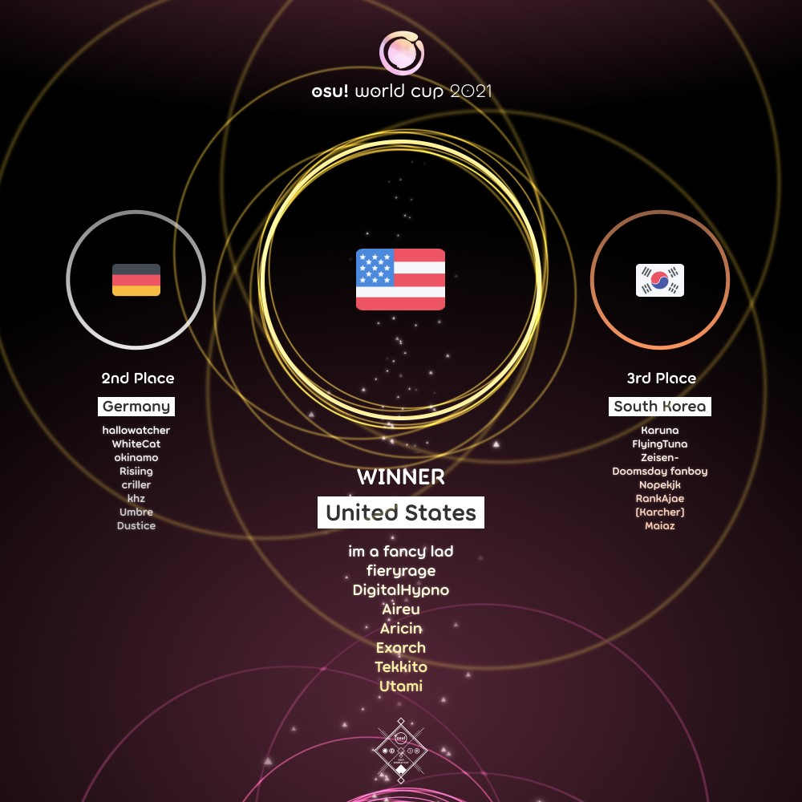

---
tags:
  - OWC
  - OWC2021
---

# osu! World Cup 2021

La **osu! World Cup 2021** (***OWC 2021***) fue un torneo por países organizado por el [osu! team](/wiki/People/osu!_team). Fue la duodécima edición de la osu! World Cup.

## Calendario del torneo

| Evento | Marca de tiempo |
| --: | :-- |
| Fase de registro | 16/9/2021 - 30/9/2021 |
| Exhibición de la fase de clasificación | 9/10/2021 (14:00 UTC) |
| Fase de clasificación | 16/10/2021 - 17/10/2021 |
| Dieciseisavos de final | 23/10/2021 - 24/10/2021 |
| Octavos de final | 30/10/2021 - 31/10/2021 |
| Cuartos de final | 6/11/2021 - 7/11/2021 |
| Semifinales | 13/11/2021 - 14/11/2021 |
| Finales | 20/11/2021 - 21/11/2021 |
| Gran Final | 27/11/2021 - 28/11/2021 |

## Premios

¡La osu! World Cup 2021 ofreció un pozo de premios de 5000 dólares y mercancía de edición limitada!

| Posición | Premio(s) |
| :-: | :-- |
|  | 48 % del pozo de premios, mercancía exclusiva, una insignia para el perfil, título de usuario «osu! Champion» por un año |
|  | 32 % del pozo de premios, mercancía exclusiva, una insignia para el perfil |
|  | 20 % del pozo de premios, mercancía exclusiva, una insignia para el perfil |

  

## Organización

La osu! World Cup 2021 estuvo a cargo del osu! team y varios miembros de la comunidad.

| Posición | Miembro(s) |
| :-- | :-- |
| Administrador | ::{ flag=CA }:: ::Azer::{ user-id=2155578 }, ::{ flag=US }:: ::ChillierPear::{ user-id=9501251 }, ::{ flag=BR }:: ::LeoFLT::{ user-id=3668779 } |
| Selector de mapas | ::{ flag=PL }:: ::Bartek22830::{ user-id=6404027 }, ::{ flag=US }:: ::Conyoh::{ user-id=4844496 }, ::{ flag=LT }:: ::Mazzerin::{ user-id=2942381 }, ::{ flag=AT }:: ::Omgforz::{ user-id=578943 } |
| Control de calidad del mappool | ::{ flag=GB }:: ::AJT::{ user-id=3181083 }, ::{ flag=GB }:: ::DeviousPanda::{ user-id=4966334 }, ::{ flag=AU }:: ::Kano::{ user-id=3036203 }, ::{ flag=DE }:: ::Mordred::{ user-id=7265097 }, ::{ flag=FR }:: ::Realazy::{ user-id=918297 } |
| Mapper | ::{ flag=TW }:: ::\_Fast::{ user-id=959763 }, ::{ flag=GB }:: ::\-Mo\-::{ user-id=2202163 }, ::{ flag=KR }:: ::Acylica::{ user-id=1943309 }, ::{ flag=CA }:: ::alden::{ user-id=3545323 }, ::{ flag=GB }:: ::Altai::{ user-id=5745865 }, ::{ flag=US }:: ::Astronic::{ user-id=9320502 }, ::{ flag=FR }:: ::Atalanta::{ user-id=7543834 }, ::{ flag=NO }:: ::BarkingMadDog::{ user-id=3475189 }, ::{ flag=GB }:: ::CallieCube::{ user-id=7535045 }, ::{ flag=US }:: ::Camo::{ user-id=5194391 }, ::{ flag=US }:: ::captin1::{ user-id=689997 }, ::{ flag=BR }:: ::Dada::{ user-id=9119507 }, ::{ flag=CA }:: ::Deca::{ user-id=9088487 }, ::{ flag=GB }:: ::DeviousPanda::{ user-id=4966334 }, ::{ flag=KR }:: ::Down::{ user-id=4694602 }, ::{ flag=US }:: ::Elcheer::{ user-id=4420014 }, ::{ flag=PL }:: ::fartownik::{ user-id=56917 }, ::{ flag=RU }:: ::fergas::{ user-id=3144542 }, ::{ flag=US }:: ::Flezlin::{ user-id=3696423 }, ::{ flag=US }:: ::Halfslashed::{ user-id=4598899 }, ::{ flag=FR }:: ::Halgoh::{ user-id=4109923 }, ::{ flag=DE }:: ::Icekalt::{ user-id=5410645 }, ::{ flag=FR }:: ::IsomirDiAngelo::{ user-id=7715620 }, ::{ flag=US }:: ::ItsWinter::{ user-id=6381153 }, ::{ flag=CA }:: ::J1\_::{ user-id=5918561 }, ::{ flag=CA }:: ::jonathanlfj::{ user-id=270377 }, ::{ flag=PH }:: ::Keqing::{ user-id=15583534 }, ::{ flag=US }:: ::kisata::{ user-id=1929729 }, ::{ flag=CA }:: ::KKipalt::{ user-id=6889573 }, ::{ flag=JP }:: ::Kloyd::{ user-id=1574070 }, ::{ flag=TW }:: ::knowledgeking::{ user-id=8022517 }, ::{ flag=BR }:: ::kowari::{ user-id=5404892 }, ::{ flag=CA }:: ::ktgster::{ user-id=53378 }, ::{ flag=US }:: ::Kurashina Asuka::{ user-id=7476493 }, ::{ flag=DE }:: ::Lasse::{ user-id=896613 }, ::{ flag=VN }:: ::LMT::{ user-id=7262798 }, ::{ flag=KR }:: ::Luscent::{ user-id=2688581 }, ::{ flag=LT }:: ::Mazzerin::{ user-id=2942381 }, ::{ flag=DE }:: ::Mir::{ user-id=8688812 }, ::{ flag=RU }:: ::Mirash::{ user-id=2841009 }, ::{ flag=NZ }:: ::moph::{ user-id=2233878 }, ::{ flag=DE }:: ::Mordred::{ user-id=7265097 }, ::{ flag=US }:: ::Nao Tomori::{ user-id=5364763 }, ::{ flag=US }:: ::Nathan::{ user-id=4785223 }, ::{ flag=IT }:: ::Nemis::{ user-id=1635091 }, ::{ flag=US }:: ::olc::{ user-id=7081160 }, ::{ flag=FR }:: ::Realazy::{ user-id=918297 }, ::{ flag=CA }:: ::Resona::{ user-id=3124248 }, ::{ flag=CN }:: ::Ryuusei Aika::{ user-id=7777875 }, ::{ flag=US }:: ::SkyFlame::{ user-id=3552948 }, ::{ flag=KR }:: ::Toumei Dragon::{ user-id=6673830 }, ::{ flag=US }:: ::toybot::{ user-id=2848604 }, ::{ flag=US }:: ::Usaha::{ user-id=6443117 }, ::{ flag=DK }:: ::waefwerf::{ user-id=3868653 }, ::{ flag=US }:: ::wakaba::{ user-id=4657414 }, ::{ flag=BE }:: ::yaspo::{ user-id=4945926 }, ::{ flag=US }:: ::Yogurtt::{ user-id=2649717 }, ::{ flag=PL }:: ::Zelq::{ user-id=8953955 } |
| Comentarista | ::{ flag=CA }:: ::Azer::{ user-id=2155578 }, ::{ flag=GB }:: ::Bubbleman::{ user-id=5182050 }, ::{ flag=US }:: ::ChillierPear::{ user-id=9501251 }, ::{ flag=US }:: ::D I O::{ user-id=3958619 }, ::{ flag=GB }:: ::Damarsh::{ user-id=7465147 }, ::{ flag=US }:: ::Dohland::{ user-id=5220511 }, ::{ flag=GB }:: ::Doomsday::{ user-id=18983 }, ::{ flag=AU }:: ::Kano::{ user-id=3036203 }, ::{ flag=AU }:: ::Monk The Don::{ user-id=4012086 }, ::{ flag=AT }:: ::Omgforz::{ user-id=578943 }, ::{ flag=US }:: ::this1neguy::{ user-id=1797189 }, ::{ flag=US }:: ::Will Stetson::{ user-id=4909088 } |
| Árbitro | ::{ flag=NL }:: ::Albionthegreat::{ user-id=9853595 }, ::{ flag=CH }:: ::Icerite::{ user-id=7226287 }, ::{ flag=US }:: ::JDrago14::{ user-id=7690078 }, ::{ flag=BR }:: ::LeoFLT::{ user-id=3668779 }, ::{ flag=NL }:: ::nik::{ user-id=10077264 }, ::{ flag=DE }:: ::p3n::{ user-id=123703 }, ::{ flag=IN }:: ::Speshimen::{ user-id=7720204 }, ::{ flag=US }:: ::tigereyes144::{ user-id=6499811 }, ::{ flag=GB }:: ::Yazzehh::{ user-id=7068973 } |
| Estadístico | ::{ flag=FI }:: ::shdewz::{ user-id=10000899 } |

## Enlaces

- [Hilo de discusión](https://osu.ppy.sh/community/forums/topics/1420416)
- [Transmisión en vivo](https://www.twitch.tv/osulive)
- [Challonge de los brackets](https://challonge.com/OWC_2021)
- [Página de Pick'ems](https://pickem.hwc.hr/tournaments/73) hosted by ::{ flag=DE }:: ::hallowatcher::{ user-id=1874761 }
- [Hoja de cálculo de información](https://docs.google.com/spreadsheets/d/e/2PACX-1vRbbNXcu1NseccX52mGCXqsvRR_451sWyhsB4wbjwjQwDq4MgyPJnJOwAn7MrZIi739IW6vGERYJw3J/pubhtml)

## Participantes

|  | País | Miembros |
| :-: | :-: | :-- |
| ::{ flag=AR }:: | **Argentina** | **::Emiru Ikuno 2::{ user-id=9393446 }**, [Amuro](https://osu.ppy.sh/users/7119659), ::Emiru Ikuno::{ user-id=6169195 }, [Lexalia](https://osu.ppy.sh/users/1887616), ::SlowBurn::{ user-id=3608846 }, [Penguo](https://osu.ppy.sh/users/4389490), ::R1cho::{ user-id=13065919 }, [zeta](https://osu.ppy.sh/users/9336886) |
| ::{ flag=AU }:: | **Australia** | **::Jordan The Bear::{ user-id=7477458 }**, [mrekk](https://osu.ppy.sh/users/7562902), ::-Machine-::{ user-id=5459981 }, [Dumii](https://osu.ppy.sh/users/3068044), ::jordanlr7::{ user-id=11652827 }, [Vivace](https://osu.ppy.sh/users/3698691), ::suffix::{ user-id=2922853 }, [Milo Milkshake](https://osu.ppy.sh/users/8181420) |
| ::{ flag=AT }:: | **Austria** | **::Sparkxei::{ user-id=4601608 }**, [Nekoyase](https://osu.ppy.sh/users/10981997), ::goosefedora::{ user-id=2323131 }, [NuHaru](https://osu.ppy.sh/users/939213), ::tomadoi::{ user-id=5712451 }, [Alparabel](https://osu.ppy.sh/users/8576721), ::Farmist::{ user-id=11470408 }, [Ccus](https://osu.ppy.sh/users/11605380) |
| ::{ flag=BE }:: | **Bélgica** | **::Hanori::{ user-id=7078544 }**, [Fblade](https://osu.ppy.sh/users/3168085), ::5joshi::{ user-id=4279650 }, [MimiliaaMyMommy](https://osu.ppy.sh/users/3695504), ::Dabo::{ user-id=9507660 }, [iblue](https://osu.ppy.sh/users/9184180), ::KyZzo::{ user-id=9014203 }, [Meersu](https://osu.ppy.sh/users/6311605) |
| ::{ flag=BR }:: | **Brasil** | **::MouseEasy::{ user-id=1558603 }**, [Coreanmaluco](https://osu.ppy.sh/users/3149577), ::Dafonz::{ user-id=6667041 }, [Mystia](https://osu.ppy.sh/users/4277702), ::Sanjilift::{ user-id=3260571 }, [tones](https://osu.ppy.sh/users/4628473), ::xKirito::{ user-id=4018079 }, [xxluizxx47](https://osu.ppy.sh/users/4687701) |
| ::{ flag=KH }:: | **Camboya** | **::Sambath::{ user-id=6511038 }**, [BlueMaster](https://osu.ppy.sh/users/9944060), ::iToxicShadow::{ user-id=9327337 }, [RenaDesu](https://osu.ppy.sh/users/11659408), ::tsp648::{ user-id=12301296 }, [YuuSakku](https://osu.ppy.sh/users/12696690) |
| ::{ flag=CA }:: | **Canadá** | **::Zylice::{ user-id=5033077 }**, [xootynator](https://osu.ppy.sh/users/3717598), ::Frankie\_::{ user-id=5774823 }, [kurtis-](https://osu.ppy.sh/users/5477343), ::Vespirit::{ user-id=5425046 }, [Jeremy\_](https://osu.ppy.sh/users/5177569), ::MuffinSlayer14::{ user-id=7613309 }, [nick1324](https://osu.ppy.sh/users/612898) |
| ::{ flag=CL }:: | **Chile** | **::Intercambing::{ user-id=2546001 }**, [Mathi](https://osu.ppy.sh/users/5339515), ::DanyL::{ user-id=3069354 }, [Montenegro](https://osu.ppy.sh/users/7918057), ::xaxreid::{ user-id=4227431 }, [NO37](https://osu.ppy.sh/users/4653583), ::tfge::{ user-id=11207004 }, [Gonzah](https://osu.ppy.sh/users/12434652) |
| ::{ flag=CN }:: | **China** | **::Genshinphobia-::{ user-id=6090175 }**, [im\_a\_burger\_fox](https://osu.ppy.sh/users/5791401), ::KuKu\_QY::{ user-id=2598812 }, [lolol233](https://osu.ppy.sh/users/11375105), ::striFE36::{ user-id=4388347 }, [Garden](https://osu.ppy.sh/users/2849992), ::EmertxE::{ user-id=954557 }, [\[Joseph Jostar\]](https://osu.ppy.sh/users/3139364) |
| ::{ flag=CO }:: | **Colombia** | **::Ninther4::{ user-id=3291562 }**, [501312](https://osu.ppy.sh/users/11083194), ::Black Astro::{ user-id=10510143 }, [ElMick13](https://osu.ppy.sh/users/3562488), ::ElMick21::{ user-id=4192956 }, [GaaL50](https://osu.ppy.sh/users/2374950), ::Rushy::{ user-id=5281857 }, [Yoari](https://osu.ppy.sh/users/4160699) |
| ::{ flag=HR }:: | **Croacia** | **::KarliXon::{ user-id=9283403 }**, [StrawFrog](https://osu.ppy.sh/users/10978106), ::Aox::{ user-id=14614020 }, [Suki007](https://osu.ppy.sh/users/7289538), ::DragonCroc::{ user-id=4334103 }, [Kek0](https://osu.ppy.sh/users/14898728), ::Fiilip::{ user-id=9517052 }, [The Fart Lord](https://osu.ppy.sh/users/7912447) |
| ::{ flag=CZ }:: | **República Checa** | **::PoggersCZ::{ user-id=3198446 }**, [BLooDBuRSTiNG](https://osu.ppy.sh/users/3925167), ::VilaZ::{ user-id=5155680 }, [MrNobady](https://osu.ppy.sh/users/9303599), ::Daichi::{ user-id=6602580 }, [NitroM\_](https://osu.ppy.sh/users/3121234), ::Avenito::{ user-id=7415910 }, [mnbvcxy12345678](https://osu.ppy.sh/users/9422204) |
| ::{ flag=DK }:: | **Dinamarca** | **::iamVill::{ user-id=6295380 }**, [cat burger](https://osu.ppy.sh/users/11380904), ::Malach::{ user-id=9364696 }, [Nordkild](https://osu.ppy.sh/users/4622337), ::Polle::{ user-id=13218204 }, [Zeezus](https://osu.ppy.sh/users/9125328), ::Vandabe::{ user-id=7050754 }, [P3RS3X](https://osu.ppy.sh/users/9469362) |
| ::{ flag=EE }:: | **Estonia** | **::Rev0::{ user-id=10346185 }**, [yasuha](https://osu.ppy.sh/users/12401523), ::cedru::{ user-id=10162611 }, [Eminem](https://osu.ppy.sh/users/7488089), ::Save Me::{ user-id=6498951 }, [mikn](https://osu.ppy.sh/users/5309780), ::Lotragon::{ user-id=6063342 }, [blourgh](https://osu.ppy.sh/users/3974292) |
| ::{ flag=FI }:: | **Finlandia** | **::Ataraksia::{ user-id=7503114 }**, [Haadez](https://osu.ppy.sh/users/8925266), ::savilju::{ user-id=8059468 }, [boleks](https://osu.ppy.sh/users/7786382), ::Xepei::{ user-id=11479551 }, [apisedo](https://osu.ppy.sh/users/11048151), ::Amasetic::{ user-id=11375251 }, [HENKSELI](https://osu.ppy.sh/users/7005392) |
| ::{ flag=FR }:: | **Francia** | **::Musty::{ user-id=251683 }**, [Ekoro](https://osu.ppy.sh/users/284905), ::ThePooN::{ user-id=718454 }, [justman](https://osu.ppy.sh/users/7657831), ::Thundur::{ user-id=4141918 }, [NerO](https://osu.ppy.sh/users/1545031), ::Hifkil::{ user-id=4301976 }, [KC Snorlaax](https://osu.ppy.sh/users/3820683) |
| ::{ flag=DE }:: | **Alemania** | **::hallowatcher::{ user-id=1874761 }**, [WhiteCat](https://osu.ppy.sh/users/4504101), ::okinamo::{ user-id=3765989 }, [Risiing](https://osu.ppy.sh/users/2282047), ::criller::{ user-id=8116659 }, [khz](https://osu.ppy.sh/users/9254536), ::Umbre::{ user-id=2766034 }, [Dustice](https://osu.ppy.sh/users/754565) |
| ::{ flag=HK }:: | **Hong Kong** | **::Shiraha Yuki::{ user-id=10829419 }**, [mcy4](https://osu.ppy.sh/users/2165650), ::Dragbit 3::{ user-id=9313951 }, [A21](https://osu.ppy.sh/users/11198996), ::Minecraft570::{ user-id=2198995 }, [Rlsc](https://osu.ppy.sh/users/2110845), ::TiRa::{ user-id=9697769 }, [Muji](https://osu.ppy.sh/users/2200982) |
| ::{ flag=HU }:: | **Hungría** | **::Lexion::{ user-id=5271371 }**, [B L A C K Y](https://osu.ppy.sh/users/10021648), ::Darnol::{ user-id=3922364 }, [defii](https://osu.ppy.sh/users/8698024), ::Glasswave::{ user-id=5442931 }, [JezusNE](https://osu.ppy.sh/users/10762622), ::RatinA0::{ user-id=3436625 }, [Tralkke](https://osu.ppy.sh/users/5039382) |
| ::{ flag=ID }:: | **Indonesia** | **::Skydiver::{ user-id=4750008 }**, [Lifeline](https://osu.ppy.sh/users/11367222), ::Vinno::{ user-id=10717635 }, [Crezz](https://osu.ppy.sh/users/7108275), ::rHO::{ user-id=1629553 }, [Rexeez](https://osu.ppy.sh/users/1987591), ::deeto::{ user-id=10069909 }, [Fuma](https://osu.ppy.sh/users/1501956) |
| ::{ flag=IL }:: | **Israel** | **::PaintedKoala::{ user-id=10056419 }**, [-Mikeyy](https://osu.ppy.sh/users/9961743), ::Accelerator::{ user-id=10822717 }, [Creemi69](https://osu.ppy.sh/users/13550988), ::namewithnumber9::{ user-id=5867839 }, [StormBrightNess](https://osu.ppy.sh/users/10712019), ::Jumbo::{ user-id=5509809 }, [cihp](https://osu.ppy.sh/users/12083446) |
| ::{ flag=IT }:: | **Italia** | **::Ryuzaki::{ user-id=7165477 }**, [Arancino](https://osu.ppy.sh/users/11749789), ::dem27::{ user-id=12790479 }, [Gigi8974](https://osu.ppy.sh/users/7774709), ::giulio::{ user-id=11409111 }, [GYGY](https://osu.ppy.sh/users/7201269), ::leoanto::{ user-id=11795963 }, [Matteo](https://osu.ppy.sh/users/10502781) |
| ::{ flag=JP }:: | **Japón** | **::rollpan::{ user-id=3062998 }**, [Varvalian](https://osu.ppy.sh/users/3345902), ::EIGER::{ user-id=1504556 }, [KonKonKinakoN](https://osu.ppy.sh/users/4733185), ::haga1115::{ user-id=6574823 }, [----](https://osu.ppy.sh/users/4304495), ::Aotoleen::{ user-id=3162741 }, [a\_Blue](https://osu.ppy.sh/users/5645667) |
| ::{ flag=KZ }:: | **Kazajistán** | **::Ayya Novak::{ user-id=5910601 }**, [Calideon](https://osu.ppy.sh/users/5175726), ::Arnold576::{ user-id=11967146 }, [FengShen](https://osu.ppy.sh/users/5536431), ::ace1ng::{ user-id=13297978 }, [Akira](https://osu.ppy.sh/users/1330619), ::Kamensh1k::{ user-id=16817965 }, [RinKonri](https://osu.ppy.sh/users/12100617) |
| ::{ flag=LV }:: | **Letonia** | **::waywern2012::{ user-id=5870453 }**, [AkitoshisNormal](https://osu.ppy.sh/users/12070555), ::Emula::{ user-id=2891792 }, [kbwaaablya](https://osu.ppy.sh/users/6473092), ::MegaWhyNOPE::{ user-id=8676070 }, [Piparkuucinsh](https://osu.ppy.sh/users/7453024), ::rihis123::{ user-id=4499926 }, [TheBigDrop](https://osu.ppy.sh/users/10470806) |
| ::{ flag=LT }:: | **Lituania** | **::noob pwner::{ user-id=4360718 }**, [ReusoL](https://osu.ppy.sh/users/2539010), ::Haganenno::{ user-id=4692344 }, [Nitram](https://osu.ppy.sh/users/10569535), ::DJ Dalgis::{ user-id=4095562 }, [mizhalas43](https://osu.ppy.sh/users/7225339), ::Merami Frog::{ user-id=8766780 }, [PainSinger](https://osu.ppy.sh/users/697843) |
| ::{ flag=MY }:: | **Malasia** | **::ShaneLiang::{ user-id=6716499 }**, [wuhua](https://osu.ppy.sh/users/2932510), ::Rampax::{ user-id=3995630 }, [haruchi](https://osu.ppy.sh/users/4845266), ::Shimon::{ user-id=7525949 }, [seabee](https://osu.ppy.sh/users/13472074), ::Inugami Korone::{ user-id=4474918 }, [Chiyuu](https://osu.ppy.sh/users/8226107) |
| ::{ flag=MX }:: | **México** | **::-Wolfy-::{ user-id=4497582 }**, [-Hebel-](https://osu.ppy.sh/users/6169483), ::Flameshock::{ user-id=8349047 }, [Jalepers](https://osu.ppy.sh/users/7341086), ::KevstracK::{ user-id=5325213 }, [pundice](https://osu.ppy.sh/users/7940696), ::Riot::{ user-id=4256461 }, [SaintSFT](https://osu.ppy.sh/users/14970132) |
| ::{ flag=NL }:: | **Países Bajos** | **::Skyrovania::{ user-id=4696315 }**, [Viveliam](https://osu.ppy.sh/users/3506793), ::jackylam5::{ user-id=1540807 }, [Manievat](https://osu.ppy.sh/users/6744123), ::Luciano::{ user-id=11604978 }, [CosmicWolf](https://osu.ppy.sh/users/8352298), ::Dolter::{ user-id=6920104 }, [Kushper](https://osu.ppy.sh/users/4832514) |
| ::{ flag=NZ }:: | **Nueva Zelanda** | **::Zoomer::{ user-id=6600930 }**, [Big Z](https://osu.ppy.sh/users/8641416), ::shortpotato::{ user-id=1266102 }, [catcat](https://osu.ppy.sh/users/11141578), ::VioIette::{ user-id=15293080 }, [Saiyku](https://osu.ppy.sh/users/13767572), ::Feyyy::{ user-id=2523703 }, [Dabble](https://osu.ppy.sh/users/10102221) |
| ::{ flag=NO }:: | **Noruega** | **::YokesPai::{ user-id=6399568 }**, [-GN](https://osu.ppy.sh/users/895581), ::Fjell::{ user-id=6951444 }, [Markus](https://osu.ppy.sh/users/8414284), ::Melvr::{ user-id=9211924 }, [ninerik](https://osu.ppy.sh/users/10549880), ::Njulsen::{ user-id=10773960 }, [Pinguinzi](https://osu.ppy.sh/users/9414229) |
| ::{ flag=PE }:: | **Perú** | **::Arnold24x24::{ user-id=2291265 }**, [P r a h](https://osu.ppy.sh/users/10509043), ::RedLight748::{ user-id=4192805 }, [Hasaki](https://osu.ppy.sh/users/9037054), ::Nkiad::{ user-id=13684411 }, [Souen](https://osu.ppy.sh/users/2367544), ::Im\_Alviin::{ user-id=17096254 }, [ViniPvP](https://osu.ppy.sh/users/4794808) |
| ::{ flag=PH }:: | **Filipinas** | **::zonelouise::{ user-id=1492995 }**, [Milkteaism](https://osu.ppy.sh/users/9642774), ::Kageno::{ user-id=7246165 }, [Xyloz](https://osu.ppy.sh/users/12040280), ::hyeok2044::{ user-id=8472976 }, [Rammu](https://osu.ppy.sh/users/10652837), ::LilyFlower::{ user-id=7449949 }, [elki](https://osu.ppy.sh/users/8136525) |
| ::{ flag=PL }:: | **Polonia** | **::maliszewski::{ user-id=12408961 }**, [Rafis](https://osu.ppy.sh/users/2558286), ::WubWoofWolf::{ user-id=39828 }, [laroxPL](https://osu.ppy.sh/users/6194820), ::Mastasz::{ user-id=1876565 }, [MAREK MARUCHA](https://osu.ppy.sh/users/2395405), ::Burtpi::{ user-id=6831210 }, [TWOJA STARA](https://osu.ppy.sh/users/8170186) |
| ::{ flag=PT }:: | **Portugal** | **::MakiDonalds::{ user-id=11610772 }**, [Takaga](https://osu.ppy.sh/users/7448448), ::Just2Gud::{ user-id=4430263 }, [Legendz](https://osu.ppy.sh/users/4333312), ::GeneralSharkk::{ user-id=8811633 }, [Netizz](https://osu.ppy.sh/users/3256745), ::My Angel Takaga::{ user-id=10018872 }, [dat boi waffle](https://osu.ppy.sh/users/4215381) |
| ::{ flag=RO }:: | **Rumanía** | **::badeu::{ user-id=1473890 }**, [Lucrise](https://osu.ppy.sh/users/9719351), ::nanoya::{ user-id=12366071 }, [\_AfterWind](https://osu.ppy.sh/users/2086138), ::Chamosiala::{ user-id=1469892 }, [L9 ELOVATOR](https://osu.ppy.sh/users/9578404), ::eternum::{ user-id=4581069 }, [cristi2708](https://osu.ppy.sh/users/7552300) |
| ::{ flag=RU }:: | **Federación de Rusia** | **::Vitya1437::{ user-id=4346274 }**, [Red\_Pixel](https://osu.ppy.sh/users/4170932), ::Leva\_Russian::{ user-id=5199332 }, [MrFuture](https://osu.ppy.sh/users/5724445), ::TESTER PIVKA::{ user-id=9961301 }, [Aoi Kiseki](https://osu.ppy.sh/users/6215032), ::Apostol::{ user-id=9902255 }, [talala](https://osu.ppy.sh/users/1389663) |
| ::{ flag=SG }:: | **Singapur** | **::Tebi::{ user-id=5407620 }**, [Demonical](https://osu.ppy.sh/users/5447609), ::Loslite::{ user-id=6398160 }, [megumic](https://osu.ppy.sh/users/7537133), ::emilia::{ user-id=2003326 }, [SeeL](https://osu.ppy.sh/users/5104320), ::GSBlank::{ user-id=2312106 }, [Rtyzen](https://osu.ppy.sh/users/2439822) |
| ::{ flag=SK }:: | **Eslovaquia** | **::Tikef::{ user-id=9149213 }**, [DogeDrxvmik](https://osu.ppy.sh/users/11383358), ::Hranolka::{ user-id=6149947 }, [Igor156](https://osu.ppy.sh/users/7358639), ::PemiX::{ user-id=6974470 }, [PeteX](https://osu.ppy.sh/users/1285945), ::TenIdiotZTelky::{ user-id=10069181 }, [triiiiiple](https://osu.ppy.sh/users/7055866) |
| ::{ flag=KR }:: | **Corea del Sur** | **::Karuna::{ user-id=8775024 }**, [FlyingTuna](https://osu.ppy.sh/users/9224078), ::Zeisen-::{ user-id=7892320 }, [Doomsday fanboy](https://osu.ppy.sh/users/4511522), ::Nopekjk::{ user-id=4585186 }, [RankAjae](https://osu.ppy.sh/users/12137295), ::\[Karcher\]::{ user-id=11443437 }, [Maiaz](https://osu.ppy.sh/users/6916642) |
| ::{ flag=ES }:: | **España** | **::amborgesa::{ user-id=1968481 }**, [A N T O N I O](https://osu.ppy.sh/users/12760743), ::Estopa::{ user-id=4470553 }, [AbejaIvan](https://osu.ppy.sh/users/6216284), ::NHarmonia::{ user-id=9582556 }, [dariito0xx](https://osu.ppy.sh/users/4739655), ::-Hideki-::{ user-id=8688804 }, [Bairechuu](https://osu.ppy.sh/users/15346564) |
| ::{ flag=SE }:: | **Suecia** | **::Saika0k1::{ user-id=4316633 }**, [\[ Couch \]](https://osu.ppy.sh/users/2854598), ::\[ Blue \]::{ user-id=4859699 }, [-Masta-](https://osu.ppy.sh/users/12521607), ::scylla::{ user-id=9405745 }, [Reedkatt](https://osu.ppy.sh/users/8335950), ::Andros::{ user-id=9072586 }, [Jageko](https://osu.ppy.sh/users/5798349) |
| ::{ flag=CH }:: | **Suiza** | **::Ayeka::{ user-id=7225922 }**, [ILikeManyBirds](https://osu.ppy.sh/users/13469141), ::Mizurii 2::{ user-id=10394866 }, [-Spartan](https://osu.ppy.sh/users/5783061), ::Akani::{ user-id=2323137 }, [Skellers](https://osu.ppy.sh/users/8040245), ::Sil::{ user-id=7924600 }, [Niven](https://osu.ppy.sh/users/5297955) |
| ::{ flag=TW }:: | **Taiwán** | **::Shiina Noriko::{ user-id=1285637 }**, [Rucker](https://osu.ppy.sh/users/147515), ::\_Shield::{ user-id=1860489 }, [DazzLE\_Wind](https://osu.ppy.sh/users/2537924), ::NekoKamui::{ user-id=7172340 }, [Spinesnight](https://osu.ppy.sh/users/4519494), ::975250450::{ user-id=3036545 }, [Diaostrophism](https://osu.ppy.sh/users/2317789) |
| ::{ flag=TH }:: | **Tailandia** | **::Faken::{ user-id=10249166 }**, [-Kedama](https://osu.ppy.sh/users/12147277), ::chantat on osu::{ user-id=12290117 }, [minecrafter](https://osu.ppy.sh/users/9389213), ::ChaiPhukChep::{ user-id=9723127 }, [UltimaticCatz](https://osu.ppy.sh/users/6068543), ::Phirse::{ user-id=10069015 }, [Yorocchi](https://osu.ppy.sh/users/5286218) |
| ::{ flag=TR }:: | **Turquía** | **::Raikouhou::{ user-id=8007528 }**, [Gilraen](https://osu.ppy.sh/users/9256771), ::heyronii::{ user-id=5642779 }, [Misumena](https://osu.ppy.sh/users/6440158), ::Zeforex::{ user-id=11236262 }, [egemenbsrms](https://osu.ppy.sh/users/4520477), ::Shinkir0::{ user-id=6093148 }, [-Kemsyt](https://osu.ppy.sh/users/3170401) |
| ::{ flag=UA }:: | **Ucrania** | **::Kryterion::{ user-id=9920144 }**, [1Max](https://osu.ppy.sh/users/11653711), ::gusniki::{ user-id=9830628 }, [kug1](https://osu.ppy.sh/users/6997572), ::Endless Tilt::{ user-id=11274086 }, [netwhynot](https://osu.ppy.sh/users/11794209), ::dench::{ user-id=10073635 }, [magnatagamer123](https://osu.ppy.sh/users/7587763) |
| ::{ flag=GB }:: | **Reino Unido** | **::Bubbleman::{ user-id=5182050 }**, [Karthy](https://osu.ppy.sh/users/4196808), ::bloo::{ user-id=6778877 }, [Voss](https://osu.ppy.sh/users/7657761), ::majoreh::{ user-id=7959222 }, [Jemzsee](https://osu.ppy.sh/users/11553627), ::Kingling::{ user-id=7010761 }, [Malteser](https://osu.ppy.sh/users/5218178) |
| ::{ flag=US }:: | **Estados Unidos** | **::im a fancy lad::{ user-id=4908650 }**, [fieryrage](https://osu.ppy.sh/users/3533958), ::DigitalHypno::{ user-id=4384207 }, [Aireu](https://osu.ppy.sh/users/1650010), ::Aricin::{ user-id=1419095 }, [Exarch](https://osu.ppy.sh/users/5370153), ::Tekkito::{ user-id=7075211 }, [Utami](https://osu.ppy.sh/users/7512553) |
| ::{ flag=UY }:: | **Uruguay** | **::daanit::{ user-id=6159669 }**, [Rebo](https://osu.ppy.sh/users/6942259), ::Kazuki K::{ user-id=6407282 }, [FDX](https://osu.ppy.sh/users/8987016), ::Rondro::{ user-id=9293124 }, [Saphity](https://osu.ppy.sh/users/5382216), ::El Milanga::{ user-id=12264918 }, [Raby](https://osu.ppy.sh/users/5218320) |
| ::{ flag=VN }:: | **Vietnam** | **::Tuon::{ user-id=6673790 }**, [Ui chan](https://osu.ppy.sh/users/5449433), ::- Mel -::{ user-id=9829680 }, [kiethao](https://osu.ppy.sh/users/2283137), ::\[sin\]::{ user-id=11021073 }, [\[Boy\]DaLat](https://osu.ppy.sh/users/8266808), ::\_Kuroni\_::{ user-id=6159305 }, [Liyuchi](https://osu.ppy.sh/users/3275495) |

## Podio

## Mappools

### Gran Final

**[Descarga el paquete de mapas aquí (181 MB)](https://drive.google.com/uc?id=1mvH20LLVVej_ZGR08-xadqJ0hAB0vQGS)**

- NoMod
  1. [katagiri - Buta Musou (BarkingMadDog) \[Unparalleled\]](https://osu.ppy.sh/beatmapsets/1633225#osu/3333705)
  2. [Brymir - Pantheon of Forsaken Gods (LMT) \[Hideous Divinity\]](https://osu.ppy.sh/beatmapsets/1633210#osu/3333669)
  3. [Yousei Teikoku - Autoscopy (moph) \[Extreme\]](https://osu.ppy.sh/beatmapsets/1633220#osu/3333699)
  4. [seatrus - ILLEGAL LEGACY (Halgoh) \[Halgoh x Sharu\]](https://osu.ppy.sh/beatmapsets/1633224#osu/3333703)
  5. [AAAA vs. Frums - beepbit \* futures (toybot) \[fast \* forward\]](https://osu.ppy.sh/beatmapsets/1633221#osu/3333700)
  6. [ARM - Rhododendron (yaspo) \[wacky\]](https://osu.ppy.sh/beatmapsets/1633222#osu/3333701)
- Hidden
  1. [Mors Principium Est - Livin' La Vida Loca (LMT) \[livin la vida mazzerin\]](https://osu.ppy.sh/beatmapsets/1538589#osu/3145691)
  2. [Cranky - Bestrafung (Icekalt) \[Schmerzen im Handgelenk\]](https://osu.ppy.sh/beatmapsets/1633283#osu/3333793)
  3. [Rish feat. Choko - Marukute Hayakute Susamajii Rhythm (Motto Susamajii Ver) (Nathan) \[CANDY PANIC BOMB!\]](https://osu.ppy.sh/beatmapsets/1633226#osu/3333706)
- HardRock
  1. [Roselia - ZEAL of proud (SkyFlame) \[Radiant\]](https://osu.ppy.sh/beatmapsets/1504153#osu/3081546)
  2. [KUMOKIRI - Shippuujinrai (Kloyd) \[Ozma\]](https://osu.ppy.sh/beatmapsets/1631947#osu/3331199)
  3. [tarolabo - eth ken (Keqing) \[Arcane OWC\]](https://osu.ppy.sh/beatmapsets/1633205#osu/3333660)
- DoubleTime
  1. [nano.RIPE - Kagefumi (Mirash) \[Delisa and Miranda womanitized collab\]](https://osu.ppy.sh/beatmapsets/1633147#osu/3333570)
  2. [Nightwish - Sacrament of Wilderness (Nao Tomori) \[Insane (OWC)\]](https://osu.ppy.sh/beatmapsets/1633156#osu/3333586)
  3. [Emiru no Aishita Tsukiyo ni Dai San Gensou Kyoku wo - Gekijou no Prominence (-Mo-) \[Insane\]](https://osu.ppy.sh/beatmapsets/1633270#osu/3333770)
  4. [USAO - Chariot (Extended Mix) (Realazy) \[lebronJAM\]](https://osu.ppy.sh/beatmapsets/1633242#osu/3333734)
- FreeMod
  1. [Falcom Sound Team jdk - Heavy Violent Match (jonathanlfj) \[OWC Match\]](https://osu.ppy.sh/beatmapsets/1633237#osu/3333729)
  2. [connsome - flat by second (ktgster) \[Another\]](https://osu.ppy.sh/beatmapsets/1633261#osu/3333760)
  3. [Toby "Radiation" Fox - Black (Mismagius) \[Make Her a Member of the OWC Crew\]](https://osu.ppy.sh/beatmapsets/1245641#osu/3333738)
- Desempate
  1. **[Yooh - RPG (Zelq) \[Divinity\]](https://osu.ppy.sh/beatmapsets/1633250#osu/3333745)**

### Finales

**[Descarga el paquete de mapas aquí (168 MB)](https://drive.google.com/uc?id=1xYeBevbU03IMrccM5UH2Z8cMOMkOT4j5)**

- NoMod
  1. [Aqours - Kimeta yo Hand in Hand (SkyFlame) \[Unity\]](https://osu.ppy.sh/beatmapsets/1288914#osu/2675756)
  2. [Halv - Romanesque (knowledgeking) \[Eternal Hope\]](https://osu.ppy.sh/beatmapsets/1627446#osu/3322513)
  3. [HIDEKI NAGANUMA - AIN'T NOTHING LIKE A FUNKY BEAT (yaspo) \[AIN'T NOTHIN' LIKE A FUNKY BEAT\]](https://osu.ppy.sh/beatmapsets/1627451#osu/3322521)
  4. [RAM - Mertvetsy (Mazzerin) \[Requiem\]](https://osu.ppy.sh/beatmapsets/1627456#osu/3322526)
  5. [Kissing the Mirror x UNDEAD CORPORATION - Frozen Gear (Zelq) \[whitesquarable (speed edit)\]](https://osu.ppy.sh/beatmapsets/1627466#osu/3322566)
  6. [Retractable - Gameset (Down) \[Lunatic\]](https://osu.ppy.sh/beatmapsets/1627210#osu/3322093)
- Hidden
  1. [KikuoHana - Desert Theater (Keqing) \[Mirage (\#1)\]](https://osu.ppy.sh/beatmapsets/1382362#osu/2856086)
  2. [Shimotsuki Haruka - Akahitoha (fartownik) \[Insane\]](https://osu.ppy.sh/beatmapsets/1627474#osu/3322576)
  3. [Crimsona - Hyper Fiber World Spectrum (Icekalt) \[Festival\]](https://osu.ppy.sh/beatmapsets/1267294#osu/2633747)
- HardRock
  1. [Denkishiki Karen Ongaku Shuudan - gemini (Star Stream) \[Extra\]](https://osu.ppy.sh/beatmapsets/182815#osu/438187)
  2. [solfa - Battle 6 : okamitachi no kiba -Revenge of the wolves- (Reiji Maigo) \[awa\]](https://osu.ppy.sh/beatmapsets/1431935#osu/2947341)
  3. [Raphlesia - Showdown (Realazy) \[coupe du monde 2006\]](https://osu.ppy.sh/beatmapsets/1627494#osu/3322603)
- DoubleTime
  1. [MomoKurotei Ichimon - Nippon Egao Hyakkei (alden) \[smile (owc ver.)\]](https://osu.ppy.sh/beatmapsets/1614390#osu/3320894)
  2. [A-One feat, Hanatan - Break The Hierarchie (DeviousPanda) \[Insane\]](https://osu.ppy.sh/beatmapsets/1627491#osu/3322598)
  3. [Lime - Renai Syndrome (apaffy) \[Another\]](https://osu.ppy.sh/beatmapsets/166062#osu/859667)
  4. [Hatsuki Yura - Koisuru Marionette (KKipalt) \[Insane\]](https://osu.ppy.sh/beatmapsets/1627501#osu/3322610)
- FreeMod
  1. [Senki Zesshou Symphogear G - Edge Works of Goddess ZABABA (Atalanta) \[Death Melody\]](https://osu.ppy.sh/beatmapsets/1627502#osu/3322611)
  2. [Brymir - Nephilim (LMT) \[Unholy Ritualus\]](https://osu.ppy.sh/beatmapsets/1271973#osu/2643166)
  3. [SEPHID - The Public Parallel (Camo) \[Master\]](https://osu.ppy.sh/beatmapsets/1627418#osu/3322445)
- Desempate
  1. **[Cradle Of Filth - The Abhorrent (Mazzerin) \[Ensorcelled By Khaos\]](https://osu.ppy.sh/beatmapsets/1627506#osu/3322616)**

### Semifinales

**[Descarga el paquete de mapas aquí (142 MB)](https://drive.google.com/uc?id=1laAwM3DfjZYWtOpPxRJq9DUh5UDK6TVU)**

- NoMod
  1. [Rena - Sweet Sweet Cendrillon Drug (Flezlin) \[n1\]](https://osu.ppy.sh/beatmapsets/1621784#osu/3311170)
  2. [Xi - Densetsu no Sabori Shinigami \~ Make a quick escape (Toumei Dragon) \[Extra Stage\]](https://osu.ppy.sh/beatmapsets/1621473#osu/3310526)
  3. [KINEMA106 - N.M.W (Mordred) \[NO MORE WAR\]](https://osu.ppy.sh/beatmapsets/1621874#osu/3311309)
  4. [Dirtyphonics - Night Ride (Halgoh) \[Ultimate Drift\]](https://osu.ppy.sh/beatmapsets/1621891#osu/3311337)
  5. [Sorry about my face - Call me with you (fergas) \[\[ya otpravlus' za toboi\]\]](https://osu.ppy.sh/beatmapsets/1621877#osu/3311312)
  6. [Wiktoria - Karei Naru Ooinu Enbukyoku (Keqing) \[Arcane\]](https://osu.ppy.sh/beatmapsets/1621878#osu/3311313)
- Hidden
  1. [OddAi - Tie me down gently -long ver- (Camo) \[Ultra\]](https://osu.ppy.sh/beatmapsets/1621830#osu/3311238)
  2. [BlackY - Black Rose (Luscent) \[Extra\]](https://osu.ppy.sh/beatmapsets/1621706#osu/3311073)
  3. [ikaruga\_nex - Lilith ambivalence lovers (Ametrin) \[Toxic crush\]](https://osu.ppy.sh/beatmapsets/1084460#osu/2267887)
- HardRock
  1. [MY FIRST STORY - ALONE (Saut) \[Isolation\]](https://osu.ppy.sh/beatmapsets/395846#osu/861381)
  2. [WHITEFISTS - VECTOR (captin1) \[Beyond\]](https://osu.ppy.sh/beatmapsets/1621892#osu/3311344)
  3. [Hana - crocodile tears (Nathan) \[Facade\]](https://osu.ppy.sh/beatmapsets/1621683#osu/3311036)
- DoubleTime
  1. [Yousei Teikoku - Torikago (Nagi Hisakawa) \[Immure\]](https://osu.ppy.sh/beatmapsets/1271945#osu/2643135)
  2. [ZUN - Nemureru Kyoufu \~ Sleeping Terror (Kurashina Asuka) \[Lunatic\]](https://osu.ppy.sh/beatmapsets/1621910#osu/3311366)
  3. [Chase & Status feat. Plan B - End Credits (Nemis) \[Nemis\]](https://osu.ppy.sh/beatmapsets/105686#osu/277274)
  4. [Malk De Koijn - Braget (waefwerf) \[funny\]](https://osu.ppy.sh/beatmapsets/1621901#osu/3311356)
- FreeMod
  1. [Team Grimoire - Dantalion (Down) \[Conflict\]](https://osu.ppy.sh/beatmapsets/1622117#osu/3311891)
  2. [Falcom Sound Team jdk - Mighty Urge (Mordred) \[Radiant Wings\]](https://osu.ppy.sh/beatmapsets/1621916#osu/3311383)
  3. [SOOOO - Rasou (CallieCube) \[The Cube (Tourney Ver.)\]](https://osu.ppy.sh/beatmapsets/1621913#osu/3311375)
- Desempate
  1. **[CANVAS feat. Quimar - Carmina (Extended Mix) (Realazy) \[Apotheosis\]](https://osu.ppy.sh/beatmapsets/1621918#osu/3311391)**

### Cuartos de final

**[Descarga el paquete de mapas aquí (139 MB)](https://drive.google.com/uc?id=1lhBkq0qU8hWRD6JK9vRRuSKdBEAbeVqc)**

- NoMod
  1. [TRUE - Storyteller (captin1) \[Extra\]](https://osu.ppy.sh/beatmapsets/1616036#osu/3299389)
  2. [Sabaton - Twilight Of The Thunder God (Mazzerin) \[Ragnarok awaits\]](https://osu.ppy.sh/beatmapsets/1616046#osu/3299406)
  3. [Yousei Teikoku - Sacrifice (IsomirDiAngelo) \[Antares\]](https://osu.ppy.sh/beatmapsets/1616051#osu/3299411)
  4. [Zekk - Feelsleft0ut (J1\_) \[Alone (2021 Remastered)\]](https://osu.ppy.sh/beatmapsets/821587#osu/1722011)
  5. [Summoning The Lich - Death Crystal (ItsWinter) \[BLOODSTAINED SACRIFICE\]](https://osu.ppy.sh/beatmapsets/1615076#osu/3297498)
  6. [Sleeping Pola - live on kaeps (DeviousPanda) \[Fortississimo\]](https://osu.ppy.sh/beatmapsets/1616052#osu/3299412)
- Hidden
  1. [Krewella X DISKORD - Beggars (Consouls Remix) (NeilPerry) \[Neil x Ameth's Conflux\]](https://osu.ppy.sh/beatmapsets/881753#osu/1843575)
  2. [Miku Fujimoto - Mari-Temari (DeviousPanda) \[Dance\]](https://osu.ppy.sh/beatmapsets/1262423#osu/2623967)
  3. [xi - .357 Magnum (Akali) \[High Noon\]](https://osu.ppy.sh/beatmapsets/155749#osu/546944)
- HardRock
  1. [Wavves - Super Soaker (Elcheer) \[Stupid\]](https://osu.ppy.sh/beatmapsets/1267328#osu/2633812)
  2. [Dimrain47 - The Prototype (Nemis) \[Ex†ra\]](https://osu.ppy.sh/beatmapsets/1615776#osu/3298820)
  3. [True Damage - GIANTS (feat. Becky G, Keke Palmer, SOYEON, DUCKWRTH, Thutmose) (Sylas) \[Prestige\]](https://osu.ppy.sh/beatmapsets/1063804#osu/2229381)
- DoubleTime
  1. [Printemps - Eien Friends (Sakaue Nachi) \[Friends\]](https://osu.ppy.sh/beatmapsets/235836#osu/546514)
  2. [-45 - System Sun (Lasse) \[Insane\]](https://osu.ppy.sh/beatmapsets/1616029#osu/3299371)
  3. [Hatsuki Yura - Junketsu to Toki no Tenbin (KKipalt) \[Insane OTST\]](https://osu.ppy.sh/beatmapsets/1543580#osu/3155184)
  4. [Dio ft. Sef - Aye (lesjuh) \[Aye!!\]](https://osu.ppy.sh/beatmapsets/13994#osu/53340)
- FreeMod
  1. [Falcom Sound Team jdk - Infinity Rage (jonathanlfj) \[Stage 4\]](https://osu.ppy.sh/beatmapsets/1616017#osu/3299353)
  2. [REDALiCE - Taboo tears you up 2017 (Dada) \[Vintage\]](https://osu.ppy.sh/beatmapsets/1616043#osu/3299402)
  3. [Born Of Osiris - Rosecrance (CallieCube) \[THE RETURN OF OBAMACUBE\]](https://osu.ppy.sh/beatmapsets/1616078#osu/3299463)
- Desempate
  1. **[Noah feat. Ohsera Ai - Rebirth the end Part I - Sasanqua (Deca) \[Magius\]](https://osu.ppy.sh/beatmapsets/1616079#osu/3299464)**

### Octavos de final

**[Descarga el paquete de mapas aquí (125 MB)](https://drive.google.com/file/d/1a5Y_JvVKGSuN_WofpDz22pIvHyBUb33D/view?usp=sharing)**

- NoMod
  1. [Comela - Wing of Destiny (Nana Abe) \[OWC Tyrant\]](https://osu.ppy.sh/beatmapsets/1610199#osu/3287700)
  2. [Ice - Amber Wishes (Deemo edit) (Astronic) \[Aspiration\]](https://osu.ppy.sh/beatmapsets/1610241#osu/3287781)
  3. [Ariabl'eyeS - Unmei no Kousaku (Mirash) \[Mirash x Delisha Collab\]](https://osu.ppy.sh/beatmapsets/1610080#osu/3287483)
  4. [Mysteka - Hesperos (Acylica) \[3dyoshispin\]](https://osu.ppy.sh/beatmapsets/1610294#osu/3287875)
  5. [Project Gabbangelion - Lolit Speed (Cut Ver.) (alden) \[crack collab\]](https://osu.ppy.sh/beatmapsets/1610082#osu/3287485)
- Hidden
  1. [Denkishiki Karen Ongaku Shuudan - Shinoburedo (Lasse) \[Despair (owc ver.)\]](https://osu.ppy.sh/beatmapsets/1610204#osu/3287711)
  2. [Nishigomi Kakumi - Sengoku Sangen (Flask) \[Oni\]](https://osu.ppy.sh/beatmapsets/1610179#osu/3287656)
- HardRock
  1. [USAO - Dynamite (Extended Mix) (sukiNathan) \[TWERK\]](https://osu.ppy.sh/beatmapsets/431697#osu/990396)
  2. [lapix - Voyager (KKipalt) \[Another Slight Buff\]](https://osu.ppy.sh/beatmapsets/1610221#osu/3287751)
- DoubleTime
  1. [Hana - Eden's song (Kowari) \[Insane\]](https://osu.ppy.sh/beatmapsets/1610217#osu/3287743)
  2. [senya - Kasoku Suru Koi wa Dare mo Tomerarenai (Luscent) \[Lunatic\]](https://osu.ppy.sh/beatmapsets/1609956#osu/3287252)
  3. [Hatsuki Yura - RED LUNACY Nightmare\_ver (KKipalt) \[Insane OTST6\]](https://osu.ppy.sh/beatmapsets/1464373#osu/3142329)
- FreeMod
  1. [Feryquitous - Quon-Extend- (captin1) \[hit da quon\]](https://osu.ppy.sh/beatmapsets/1362537#osu/2819029)
  2. [Sougetsu Eli - Aoi Chou (Ryuusei Aika) \[Transient\]](https://osu.ppy.sh/beatmapsets/1610224#osu/3287758)
- Desempate
  1. **[King Gizzard & The Lizard Wizard - Robot Stop (olc) \[REDLIGHT (VIP)\]](https://osu.ppy.sh/beatmapsets/1610231#osu/3287767)**

### Dieciseisavos de final

**[Descarga el paquete de mapas aquí (105 MB)](https://drive.google.com/file/d/16AY1VaM5m_SQouIHnEFn7rG55DDc-qbi/view?usp=sharing)**

- NoMod
  1. [Imy - Divine's Game (Nao Tomori) \[Extra\]](https://osu.ppy.sh/beatmapsets/1604377#osu/3276259)
  2. [Noah - Primal scream (wakaba) \[ahh\]](https://osu.ppy.sh/beatmapsets/1604632#osu/3276724)
  3. [THE BINARY mido - Ego mo Id mo Tanjun ni (kuyusu) \[moph's Extra\]](https://osu.ppy.sh/beatmapsets/1268824#osu/2692632)
  4. [F Rabbeat - Be With U (Altai) \[Don't Just Stand There...\]](https://osu.ppy.sh/beatmapsets/1604642#osu/3276740)
  5. [Laur - Nostalgic Blood of the Strife (Zelq) \[MAXIMUM\]](https://osu.ppy.sh/beatmapsets/1257525#osu/2613076)
- Hidden
  1. [Sound Souler - Bubble Flower (Keqing) \[Serenity\]](https://osu.ppy.sh/beatmapsets/1604543#osu/3276559)
  2. [Various Artists - Netsuretsu Kangei Wonderland (Mirash) \[Delisha vs Mirash's Mahjong Soul 1v1 Grand Finals \[BO9\]\]](https://osu.ppy.sh/beatmapsets/1604477#osu/3276441)
- HardRock
  1. [jippusu - Mushikui Saikede Rhythm (Amamiya Yuko) \[RLC\]](https://osu.ppy.sh/beatmapsets/87547#osu/240689)
  2. [P4koo - Makes Me Wonder (Alvearia) \[Ex\]](https://osu.ppy.sh/beatmapsets/1514096#osu/3099848)
- DoubleTime
  1. [Chata - Harukaze Dance (Yogurtt) \[Flowers\]](https://osu.ppy.sh/beatmapsets/1604602#osu/3276673)
  2. [felys feat. Natsukawa Yoko - Celsus (LONG VERSION) (Elcheer) \[Insane\]](https://osu.ppy.sh/beatmapsets/1604680#osu/3276823)
  3. [ZUN - Toragara no Bishamonten (Halfslashed) \[Insane\]](https://osu.ppy.sh/beatmapsets/1381135#osu/3276774)
- FreeMod
  1. [Lime - Tsukuyomi (kisata) \[Special\]](https://osu.ppy.sh/beatmapsets/1604480#osu/3276444)
  2. [ovEnola - Noose (Cut Ver.) (BOUYAAA) \[Death\]](https://osu.ppy.sh/beatmapsets/1348020#osu/2791506)
- Desempate
  1. **[DJ SHARPNEL - FAKE PROMISE (Nana Abe) \[NISEMONO\]](https://osu.ppy.sh/beatmapsets/1604660#osu/3276769)**

### Clasificatorias

**[Descarga el paquete de mapas aquí (67 MB)](https://drive.google.com/file/d/1_mOT-KqbDzj0OL3FqVwJARAovXpDzi7f/view?usp=sharing)**

- NoMod
  1. [LiSA - Confidence Driver (Skyflame) \[Assurance\]](https://osu.ppy.sh/beatmapsets/1597778#osu/3263082)
  2. [IRON ATTACK! - INEXPERIENCE (DeviousPanda) \[EXTRA STAGE\]](https://osu.ppy.sh/beatmapsets/1597785#osu/3263098)
  3. [MIOYAMAZAKI - Byoushin Zenkai Girl (Deca) \[Collab Extra\]](https://osu.ppy.sh/beatmapsets/1597860#osu/3263248)
  4. [Camellia - Heartless being (Mir) \[Expert\]](https://osu.ppy.sh/beatmapsets/1597801#osu/3263131)
- Hidden
  1. [BUTAOTOME - Sharekoube (Moph) \[Extreme\]](https://osu.ppy.sh/beatmapsets/1597784#osu/3263097)
  2. [ZUN - Primodrial Beat \~ Pristine Beat (Halfslashed) \[Extra Stage\]](https://osu.ppy.sh/beatmapsets/1597824#osu/3263174)
- HardRock
  1. [Nakamura Meiko - Dispel (Yogurtt) \[Cataclysm\]](https://osu.ppy.sh/beatmapsets/1597607#osu/3262706)
  2. [Lime - Ophelia (Kloyd) \[Hamlet\]](https://osu.ppy.sh/beatmapsets/1597825#osu/3263175)
- DoubleTime
  1. [Ito Kanako - Koko ni Iru kara (ImpurePug) \[Insane\]](https://osu.ppy.sh/beatmapsets/1597789#osu/3263112)
  2. [-45 - NyanNyatothep (Dada) \[Gothic Horror\]](https://osu.ppy.sh/beatmapsets/1597755#osu/3263028)

## Resultados de los partidos

### Gran Final

Las estadísticas detalladas de esta ronda se pueden encontrar [aquí](https://docs.google.com/spreadsheets/d/1-WshrU4L2mhQtBVdPPLjGluXNOsZXFGN2VHnN0EFqyM/edit?rm=minimal).

Sábado, 27 de noviembre de 2021

| Equipo A |  |  | Equipo B | Enlance de la partida |
| --: | :-: | :-: | :-- | :-- |
| **Alemania** ::{ flag=DE }:: | **7** | 6 | ::{ flag=KR }:: Corea del Sur | [#1](https://osu.ppy.sh/community/matches/94510355) |

Domingo, 28 de noviembre de 2021

| Equipo A |  |  | Equipo B | Enlance de la partida |
| --: | :-: | :-: | :-- | :-- |
| **Estados Unidos** ::{ flag=US }:: | **7** | 5 | ::{ flag=DE }:: Alemania | [#1](https://osu.ppy.sh/community/matches/94572116) |

### Finales

Las estadísticas detalladas de esta ronda se pueden encontrar [aquí](https://docs.google.com/spreadsheets/d/1_aH9TQiOu4VZ2bMesV8A386EAhk_4piUCYLg0Kp-rA4/edit?rm=minimal).

Sábado, 20 de noviembre de 2021

| Equipo A |  |  | Equipo B | Enlance de la partida |
| --: | :-: | :-: | :-- | :-- |
| Hong Kong ::{ flag=HK }:: | 2 | **7** | ::{ flag=KR }:: **Corea del Sur** | [#1](https://osu.ppy.sh/community/matches/94198225) |
| **Canadá** ::{ flag=CA }:: | **7** | 4 | ::{ flag=GB }:: Reino Unido | [#1](https://osu.ppy.sh/community/matches/94215627) |

Domingo, 21 de noviembre de 2021

| Equipo A |  |  | Equipo B | Enlance de la partida |
| --: | :-: | :-: | :-- | :-- |
| Canadá ::{ flag=CA }:: | 5 | **7** | ::{ flag=KR }:: **Corea del Sur** | [#1](https://osu.ppy.sh/community/matches/94237395) |
| **Estados Unidos** ::{ flag=US }:: | **7** | 6 | ::{ flag=DE }:: Alemania | [#1](https://osu.ppy.sh/community/matches/94267511) |

### Semifinales

Las estadísticas detalladas de esta ronda se pueden encontrar [aquí](https://docs.google.com/spreadsheets/d/1A0ms-p-i9ZJqT7ff2EASmcotk9CmSG38jbz6oi-lwOM/edit?rm=minimal).

Sábado, 13 de noviembre de 2021

| Equipo A |  |  | Equipo B | Enlance de la partida |
| --: | :-: | :-: | :-- | :-- |
| Japón ::{ flag=JP }:: | 2 | **6** | ::{ flag=KR }:: **Corea del Sur** | [#1](https://osu.ppy.sh/community/matches/93876454) |
| Polonia ::{ flag=PL }:: | 3 | **6** | ::{ flag=RO }:: **Rumanía** | [#1](https://osu.ppy.sh/community/matches/93883809) |
| **Estados Unidos** ::{ flag=US }:: | **6** | 2 | ::{ flag=HK }:: Hong Kong | [#1](https://osu.ppy.sh/community/matches/93920962) |

Domingo, 14 de noviembre de 2021

| Equipo A |  |  | Equipo B | Enlance de la partida |
| --: | :-: | :-: | :-- | :-- |
| **Reino Unido** ::{ flag=GB }:: | **6** | 3 | ::{ flag=TW }:: Taiwán | [#1](https://osu.ppy.sh/community/matches/93882161) |
| Federación de Rusia ::{ flag=RU }:: | 4 | **6** | ::{ flag=AU }:: **Australia** | [#1](https://osu.ppy.sh/community/matches/93926187) |
| Australia ::{ flag=AU }:: | 5 | **6** | ::{ flag=GB }:: **Reino Unido** | [#1](https://osu.ppy.sh/community/matches/93929739) |
| Rumanía ::{ flag=RO }:: | 2 | **6** | ::{ flag=KR }:: **Corea del Sur** | [#1](https://osu.ppy.sh/community/matches/93936854) |
| Canadá ::{ flag=CA }:: | 2 | **6** | ::{ flag=DE }:: **Alemania** | [#1](https://osu.ppy.sh/community/matches/93945664) |

### Cuartos de final

Las estadísticas detalladas de esta ronda se pueden encontrar [aquí](https://docs.google.com/spreadsheets/d/1Go_1wimaET8QrWsiAcQMO5XW4xYuRAXUgujtmMbhtXk/edit?rm=minimal).

Sábado, 6 de noviembre de 2021

| Equipo A |  |  | Equipo B | Enlance de la partida |
| --: | :-: | :-: | :-- | :-- |
| **Australia** ::{ flag=AU }:: | **6** | 3 | ::{ flag=SG }:: Singapur | [#1](https://osu.ppy.sh/community/matches/93548858) |
| Indonesia ::{ flag=ID }:: | 5 | **6** | ::{ flag=RO }:: **Rumanía** | [#1](https://osu.ppy.sh/community/matches/93559497) |
| **Taiwán** ::{ flag=TW }:: | **6** | 1 | ::{ flag=TR }:: Turquía | [#1](https://osu.ppy.sh/community/matches/93559831) |
| **Corea del Sur** ::{ flag=KR }:: | **6** | 0 | ::{ flag=NO }:: Noruega | [#1](https://osu.ppy.sh/community/matches/93560862) |
| Finlandia ::{ flag=FI }:: | 5 | **6** | ::{ flag=CN }:: **China** | [#1](https://osu.ppy.sh/community/matches/93562377) |
| **Suecia** ::{ flag=SE }:: | **6** | 5 | ::{ flag=PH }:: Filipinas | [#1](https://osu.ppy.sh/community/matches/93562374) |
| **Brasil** ::{ flag=BR }:: | **6** | 3 | ::{ flag=NL }:: Países Bajos | [#1](https://osu.ppy.sh/community/matches/93566789) |
| **Francia** ::{ flag=FR }:: | **6** | 5 | ::{ flag=CL }:: Chile | [#1](https://osu.ppy.sh/community/matches/93566833) |
| **Estados Unidos** ::{ flag=US }:: | **6** | 3 | ::{ flag=GB }:: Reino Unido | [#1](https://osu.ppy.sh/community/matches/93625962) |

Domingo, 7 de noviembre de 2021

| Equipo A |  |  | Equipo B | Enlance de la partida |
| --: | :-: | :-: | :-- | :-- |
| **Canadá** ::{ flag=CA }:: | **6** | 1 | ::{ flag=JP }:: Japón | [#1](https://osu.ppy.sh/community/matches/93568294) |
| China ::{ flag=CN }:: | 3 | **6** | ::{ flag=TW }:: **Taiwán** | [#1](https://osu.ppy.sh/community/matches/93601469) |
| Suecia ::{ flag=SE }:: | 3 | **6** | ::{ flag=AU }:: **Australia** | [#1](https://osu.ppy.sh/community/matches/93608489) |
| Federación de Rusia ::{ flag=RU }:: | 5 | **6** | ::{ flag=HK }:: **Hong Kong** | [#1](https://osu.ppy.sh/community/matches/93611924) |
| **Rumanía** ::{ flag=RO }:: | **6** | 4 | ::{ flag=FR }:: Francia | [#1](https://osu.ppy.sh/community/matches/93614193) |
| **Corea del Sur** ::{ flag=KR }:: | **6** | 3 | ::{ flag=BR }:: Brasil | [#1](https://osu.ppy.sh/community/matches/93616849) |
| **Alemania** ::{ flag=DE }:: | **6** | 2 | ::{ flag=PL }:: Polonia | [#1](https://osu.ppy.sh/community/matches/93627378) |

### Octavos de final

Las estadísticas detalladas de esta ronda se pueden encontrar [aquí](https://docs.google.com/spreadsheets/d/1WskhM_U2siPhuVn2lzsA0z7DNCkfEnxGjBslWdyxfj8/edit?rm=minimal).

Sábado, 30 de octubre de 2021:

| Equipo A |  |  | Equipo B | Enlance de la partida |
| --: | :-: | :-: | :-- | :-- |
| Argentina ::{ flag=AR }:: | 1 | **5** | ::{ flag=CN }:: **China** | [#1](https://osu.ppy.sh/community/matches/93182775) |
| Uruguay ::{ flag=UY }:: | 1 | **5** | ::{ flag=PH }:: **Filipinas** | [#1](https://osu.ppy.sh/community/matches/93206388) |
| **Estados Unidos** ::{ flag=US }:: | **5** | 0 | ::{ flag=BR }:: Brasil | [#1](https://osu.ppy.sh/community/matches/93236872) |
| **Canadá** ::{ flag=CA }:: | **5** | 2 | ::{ flag=TW }:: Taiwán | [#1](https://osu.ppy.sh/community/matches/93254527) |
| Indonesia ::{ flag=ID }:: | 2 | **5** | ::{ flag=HK }:: **Hong Kong** | [#1](https://osu.ppy.sh/community/matches/93276244) |
| España ::{ flag=ES }:: | 0 | **5** | ::{ flag=RO }:: **Rumanía** | [#1](https://osu.ppy.sh/community/matches/93289258) |

Domingo, 31 de octubre de 2021:

| Equipo A |  |  | Equipo B | Enlance de la partida |
| --: | :-: | :-: | :-- | :-- |
| **Alemania** ::{ flag=DE }:: | **5** | 2 | ::{ flag=AU }:: Australia | [#1](https://osu.ppy.sh/community/matches/93197788) |
| Malasia ::{ flag=MY }:: | 2 | **5** | ::{ flag=FR }:: **Francia** | [#1](https://osu.ppy.sh/community/matches/93206469) |
| Austria ::{ flag=AT }:: | 2 | **5** | ::{ flag=NO }:: **Noruega** | [#1](https://osu.ppy.sh/community/matches/93219242) |
| **Reino Unido** ::{ flag=GB }:: | **5** | 4 | ::{ flag=KR }:: Corea del Sur | [#1](https://osu.ppy.sh/community/matches/93276027) |
| **Japón** ::{ flag=JP }:: | **5** | 2 | ::{ flag=FI }:: Finlandia | [#1](https://osu.ppy.sh/community/matches/93276277) |
| **Singapur** ::{ flag=SG }:: | **5** | 1 | ::{ flag=UA }:: Ucrania | [#1](https://osu.ppy.sh/community/matches/93279323) |
| **Polonia** ::{ flag=PL }:: | **5** | 3 | ::{ flag=SE }:: Suecia | [#1](https://osu.ppy.sh/community/matches/93282319) |
| República Checa ::{ flag=CZ }:: | 3 | **5** | ::{ flag=NL }:: **Países Bajos** | [#1](https://osu.ppy.sh/community/matches/93286037) |
| Chile ::{ flag=CL }:: | 1 | **5** | ::{ flag=RU }:: **Federación de Rusia** | [#1](https://osu.ppy.sh/community/matches/93285981) |
| México ::{ flag=MX }:: | 3 | **5** | ::{ flag=TR }:: **Turquía** | [#1](https://osu.ppy.sh/community/matches/93292960) |

### Dieciseisavos de final

Las estadísticas detalladas de esta ronda se pueden encontrar [aquí](https://docs.google.com/spreadsheets/d/1kClnYXvl4J7NzJAafr5R1iAn3M4-a0udwrq_R_IcKPM/edit?rm=minimal).

Sábado, 23 de octubre de 2021:

| Equipo A |  |  | Equipo B | Enlance de la partida |
| --: | :-: | :-: | :-- | :-- |
| **Hong Kong** ::{ flag=HK }:: | **5** | 2 | ::{ flag=TR }:: Turquía | [#1](https://osu.ppy.sh/community/matches/92822602) |
| **Reino Unido** ::{ flag=GB }:: | **5** | 3 | ::{ flag=SG }:: Singapur | [#1](https://osu.ppy.sh/community/matches/92827398) |
| **Federación de Rusia** ::{ flag=RU }:: | **5** | 0 | ::{ flag=CN }:: China | [#1](https://osu.ppy.sh/community/matches/92830549) |
| **Indonesia** ::{ flag=ID }:: | **5** | 1 | ::{ flag=MX }:: México | [#1](https://osu.ppy.sh/community/matches/92870261) |
| Rumanía ::{ flag=RO }:: | 3 | **5** | ::{ flag=TW }:: **Taiwán** | [#1](https://osu.ppy.sh/community/matches/92883661) |

Domingo, 24 de octubre de 2021:

| Equipo A |  |  | Equipo B | Enlance de la partida |
| --: | :-: | :-: | :-- | :-- |
| **Corea del Sur** ::{ flag=KR }:: | **5** | 0 | ::{ flag=UA }:: Ucrania | [#1](https://osu.ppy.sh/community/matches/92820657) |
| **Brasil** ::{ flag=BR }:: | **5** | 1 | ::{ flag=PH }:: Filipinas | [#1](https://osu.ppy.sh/community/matches/92832289) |
| **Australia** ::{ flag=AU }:: | **5** | 2 | ::{ flag=NO }:: Noruega | [#1](https://osu.ppy.sh/community/matches/92879850) |
| **Japón** ::{ flag=JP }:: | **5** | 4 | ::{ flag=MY }:: Malasia | [#1](https://osu.ppy.sh/community/matches/92883789) |
| **Alemania** ::{ flag=DE }:: | **5** | 0 | ::{ flag=AT }:: Austria | [#1](https://osu.ppy.sh/community/matches/92886135) |
| **Polonia** ::{ flag=PL }:: | **5** | 1 | ::{ flag=CZ }:: República Checa | [#1](https://osu.ppy.sh/community/matches/92886307) |
| **Suecia** ::{ flag=SE }:: | **5** | 1 | ::{ flag=NL }:: Países Bajos | [#1](https://osu.ppy.sh/community/matches/92889026) |
| Francia ::{ flag=FR }:: | 3 | **5** | ::{ flag=FI }:: **Finlandia** | [#1](https://osu.ppy.sh/community/matches/92891658) |
| **Canadá** ::{ flag=CA }:: | **5** | 2 | ::{ flag=ES }:: España | [#1](https://osu.ppy.sh/community/matches/92894753) |
| **Estados Unidos** ::{ flag=US }:: | **5** | 0 | ::{ flag=UY }:: Uruguay | [#1](https://osu.ppy.sh/community/matches/92904426) |
| **Chile** ::{ flag=CL }:: | **5** | 0 | ::{ flag=AR }:: Argentina | [#1](https://osu.ppy.sh/community/matches/92907411) |

### Clasificatorias

La clasificación final para la fase de clasificación se puede encontrar en la siguiente [hoja de cálculo](https://docs.google.com/spreadsheets/d/1a-8_wfVLTUtUFMwgGyMoC1lJxssyIcOgW__LOnusAQA/edit?rm=minimal). Las estadísticas detalladas de esta ronda se pueden encontrar [aquí](https://docs.google.com/spreadsheets/d/e/2PACX-1vQBhccsajYTGnE49STTsDHaMmiDQiAO-FRV5RI6youhzCXIekwxldlOcb8lwEgpDlRDXOVxe2JzuEk0/pubhtml).

## Reglamento

### Reglas del torneo

1. La osu! World Cup es un torneo por países, jugado en el modo de juego osu!.
   - *Aviso: Si bien esta competición está planeada como una modalidad de 4 contra 4, esto podría cambiar dependiendo de la cantidad de registros que se reciban.*
2. Las puntuaciones de los mapas se basan en Score V2.
3. Los mapas para cada ronda serán anunciados por los selectores de mapas por anticipado el domingo antes de que tengan lugar los partidos reales.
   - Cada mappool, a excepción de la fase de clasificación, contendrá un mapa de *desempate*. Solo se jugará en caso de empate en el marcador con el sistema de al mejor de 9; por ejemplo, si el marcador está 4-4 y el partido es al mejor de 9, se jugará el mapa de desempate.
4. El cronograma de los partidos será establecido por los administradores del torneo.
5. Si no hay un árbitro disponible a la hora del partido, el partido será pospuesto.
6. Se permite el uso de la configuración visual para alterar la atenuación del fondo o deshabilitar elementos del beatmap, como storyboards y skins.
   - Los elementos personalizados de las skins no deben usarse para alterar elementos o mecánicas centrales del juego.
7. Si un juego acaba en un empate, se anulará y se volverá a jugar el beatmap, dando lugar a la *revancha*.
8. Los equipos pueden solicitar una revancha si un miembro del equipo tiene dificultades técnicas mientras juega.
   - Los «picos de retraso» no se consideran una razón válida para anular un beatmap.
   - Si ocurre una revancha, el equipo original de cada equipo durante ese beatmap en particular debe seguir siendo el mismo. Si no es posible, por ejemplo, por un problema técnico, *ambos* equipos podrán intercambiar sus equipos.
   - No se debe abusar de esta regla. Los árbitros pueden vetar una solicitud de revancha si consideran que este es el caso.
9. Las desconexiones dentro de los 30 segundos o el 25 % de la duración del beatmap (lo que ocurra primero) después del inicio del beatmap pueden volver a jugarse. Esto queda a discreción del árbitro, siempre y cuando se comunique claramente en el chat de la sala.
10. Si un jugador se desconecta, su puntuación no se contará para el total de su equipo, a menos que se proporcione una prueba adecuada de dicha puntuación. Se consideran pruebas aceptables las siguientes:
    - Fragmentos de transmisión en vivo desde el punto de vista del jugador (comúnmente llamados «clips» o «VODs»). La totalidad de la jugada, junto con la pantalla de resultados, debe estar claramente visible junto con la puntuación del jugador afectado.
    - Archivos de repetición de la jugada, tomados directamente de la pestaña «Ranking local» del cliente del jugador afectado (las marcas de tiempo deben coincidir exactamente con la hora a la que tuvo lugar la partida, tal y como se ve en el enlace de la sala multijugador).
    - Capturas de pantalla de otros jugadores tomadas directamente en el juego que muestran la puntuación del jugador afectado.
      - Las capturas de pantalla de la pantalla de resultados deben mostrar claramente la puntuación del jugador afectado. Este es el método preferido.
      - Se pueden aceptar capturas de pantalla tomadas en el juego en el momento de la desconexión. Ten en cuenta que este método no proporciona una representación exacta de la puntuación de ese jugador. No se recomienda el uso de este método y puede ser denegado a discreción del árbitro si la información proporcionada no es suficiente para identificar al jugador/puntuación.
      - Todas las capturas de pantalla **DEBEN** tomarse usando el propio juego, es decir, deben estar alojadas en el dominio `https://osu.ppy.sh/`. Cualquier otra forma de captura de pantalla será denegada.
    - Las puntuaciones de los jugadores pueden derivarse de la transmisión oficial como último recurso, en los casos en que se transmita el partido.
11. Si menos de la cantidad mínima requerida de jugadores están presentes a la hora del partido, el tiempo máximo que se podrá posponer el partido será de 10 minutos. Si después de este periodo todavía no hay suficientes jugadores para ninguno de los equipos, se declarará como *victoria por defecto* para el lado con la mayor cantidad de miembros presentes.
    - La cantidad mínima de jugadores requeridos se considera como la cantidad de jugadores necesarios para jugar un beatmap sin lugares vacantes en la sala (es decir, 4 participantes deben estar presentes para que comience el partido).
12. Si un jugador se desconecta entre los mapas y el equipo no puede proporcionar un reemplazo, el partido podrá retrasarse hasta 10 minutos como máximo (limitado a una vez por equipo, por partido).
13. Se permite el intercambio de jugadores entre partidas sin limitaciones.
14. Los beatmaps no deben reusarse en el mismo partido, excepto en las revanchas.
15. **El tamaño mínimo del equipo para un equipo es de 6 jugadores, y el máximo es de 8.**
16. Se espera que los jugadores mantengan el juego fluido y sin retrasos. Los retrasos excesivos en los partidos por parte de los jugadores pueden dar lugar a la aplicación de sanciones a discreción del árbitro. Interrumpir el partido con juego sucio, insultar o provocar a otros jugadores o al personal, retrasar el partido u otra conducta inapropiada deliberada está estrictamente prohibida y se sancionará en consecuencia.
17. Todos los jugadores y el personal deben ser tratados con respeto. Se deben seguir las instrucciones de los árbitros y de los administradores del torneo. Las decisiones consideradas definitivas no deben ser objetadas.
18. El chat de las salas multijugador subyacen a las [reglas de la comunidad de osu!](/wiki/Rules). Todas las reglas del chat también se aplican a los chats de las salas multijugador.
    - Romper las reglas del chat puede resultar en un silencio. Los jugadores silenciados no pueden participar en partidas multijugador y deben intercambiarse mientras dure el castigo.
19. Las sanciones por incumplir las reglas del torneo incluyen, pero no se limitan a:
    - Exclusión de jugadores específicos para un beatmap.
    - Exclusión de jugadores específicos por el resto del partido.
    - Declarar el partido como perdido o como una victoria por defecto para el otro equipo.
    - Descalificación de todo el torneo.
    - Descalificación de los torneos oficiales actuales y futuros hasta que se apele.
20. Los árbitros pueden permitir, a su discreción, tolerancias mayores o menores para los cronómetros.
21. Los administradores del torneo se reservan el derecho de modificar estas reglas en cualquier momento. Cualquier cambio de este tipo se anunciará con antelación.

### Registro del torneo

1. Cada usuario interesado en formar parte del equipo de su país debe registrarse individualmente.
   - Los administradores del torneo crearán una lista de posibles candidatos para el equipo de un país.
   - Los administradores del torneo declararán a un candidato como capitán para la selección de su país.
2. El capitán declarado formará entonces su equipo a partir de la lista de candidatos de su país.
   - Se espera que los capitanes elijan a los miembros del equipo con honestidad y buena voluntad, con el objetivo de formar el equipo más fuerte posible.
   - Los capitanes pueden excluirse a sí mismos de la lista del equipo.
   - Los capitanes están autorizados a realizar y coordinar «pruebas» para evaluar la aptitud de los jugadores en sus propios términos.
   - En cualquier momento, los capitanes pueden optar, con la aprobación de los administradores del torneo, delegar su función a otros posibles miembros del equipo. Una vez otorgada, solo el nuevo capitán podrá asignar la capitanía a otro jugador.
3. Para garantizar registros válidos, el [equipo de soporte de cuentas](/wiki/People/Account_support_team) verificará manualmente a cada posible participante, de manera similar al [proceso de selección](/wiki/Tournaments/Official_support#proceso-de-selección) que se ofrece a los torneos de la comunidad.
   - Cada usuario registrado será asignado a la lista de candidatos de su país respectivo.
   - Para ser aceptado con éxito en la lista, los jugadores deben estar ubicados en el puesto #5000 o superior en el rendimiento global de osu!, y no haber infringido ninguna de las [reglas de la comunidad de osu!](/wiki/Rules) en los últimos 12 meses.
4. Todos los equipos formados con éxito serán publicados después de la fase de registro.
   - Un equipo debe tener al menos 6 jugadores registrados para tener la oportunidad de jugar la fase de clasificación.
   - Los 32 mejores cabezas de serie clasificarán a los dieciseisavos de final.
5. Los miembros del personal del torneo **no** pueden jugar en el torneo, con la excepción de los comentaristas.

### Instrucciones de las clasificatorias

1. En la fase de clasificación, todos los equipos jugarán un mappool específico diseñado por los selectores de mapas.
2. El mappool contendrá 4 brackets: NoMod, [Hidden](/wiki/Gameplay/Game_modifier/Hidden), [HardRock](/wiki/Gameplay/Game_modifier/Hard_Rock), y [DoubleTime](/wiki/Gameplay/Game_modifier/Double_Time). No habrá mapas de desempate para esta fase.
3. El mappool de las clasificatorias contendrá 10 mapas. Habrá 4 mapas en el bracket NoMod y 2 mapas para los otros brackets de mods.
4. Los equipos tendrán que jugar el mappool dos veces en un momento designado. Su mejor puntuación combinada se usará para la agrupación de los equipos.
   - Los equipos pueden evitar jugar ciertos mapas o todo el segundo partido si así lo desean.
5. El mappool debe jugarse en el siguiente orden: NM1, NM2, NM3, NM4, HD1, HD2, HR1, HR2, DT1, DT2. Los equipos no pueden solicitar jugar el mappool en ningún otro orden.
6. Cada equipo debe tener 4 jugadores para cada mapa. Se pueden intercambiar libremente después de concluir un mapa.
7. Se ofrecerá un descanso opcional de 5 minutos entre la primera y la segunda partida del mappool.
8. Todos los equipos jugarán sus clasificatorias en salas separadas. Sugerimos a los equipos que no difundan ni compartan sus resultados para evitar la manipulación de semillas.
9. El método de agrupación de los equipos usado para las clasificatorias será %MAX: el equipo con la puntuación combinada más alta de cada mapa recibirá el 100 % de los puntos (es decir, un valor numérico de 1), y todos los demás equipos recibirán un porcentaje de esa puntuación máxima. Los porcentajes individuales de los mapas se sumarán para componer la puntuación final del equipo, que se ordenará de mayor a menor, siendo el más alto el cabeza de serie #1.
   - La fórmula exacta que se usará para todos los equipos (y para cada mapa) es `Porcentaje del mapa = Puntuación del equipo / Puntuación máxima`, donde:
     - `Porcentaje del mapa` es el porcentaje concedido al equipo actual
     - `Puntuación del equipo` es la puntuación que ha conseguido el equipo actual en el mapa actual
     - `Puntuación máxima` es la puntuación más alta conseguida en el mapa actual
   - La puntuación final del equipo a ordenar se define como `Puntuación final = SUMA(Porcentaje del mapa)`; es decir, la suma del `Porcentaje del mapa` de cada mapa.
10. Solo los 32 mejores equipos avanzarán a los dieciseisavos de final.

### Instrucciones de las fases

1. Después de las clasificatorias, se jugará un bracket de doble eliminación. Esto significa que el ganador pasa a la siguiente fase y el equipo perdedor pasa al bracket perdedor.
2. Los equipos en el bracket de perdedores deberán jugar 2 partidos cada fin de semana a partir de los cuartos de final.
3. Los equipos que pierdan un partido en el bracket de perdedores serán eliminados del torneo.

### Condiciones de victoria

- En las clasificatorias, los equipos deben ubicarse entre los 32 primeros para avanzar a la fase de doble eliminación.
- En los dieciseisavos de final y octavos de final, los equipos necesitan ganar 5 mapas para ganar un partido (al mejor de 9).
- En los cuartos de final y semifinales, los equipos necesitan ganar 6 mapas para ganar un partido (al mejor de 11).
- En las finales y gran final, los equipos necesitan ganar 7 mapas para ganar un partido (al mejor de 13).
  - *Nota: para el partido de la gran final, el equipo que viene del bracket de ganadores debe ganar un «set»; es decir, uno al mejor de 13, para ganar el torneo. Sin embargo, el equipo que viene del bracket de perdedores necesita ganar 2 sets.*

### Instrucciones de los partidos

1. Un árbitro creará una sala multijugador 15 minutos antes de la hora programada del partido. Los jugadores deben unirse a la sala en ese periodo.
   - La configuración de la sala es osu!, Team-Vs., Condición de victoria: 'Score V2'. El nombre de la sala debe seguir este patrón: «OWC2021: (Red Team) vs (Blue Team)». El equipo mencionado primero en el nombre de la sala debe ser el equipo rojo, el equipo mencionado en segundo lugar en el nombre de la sala debe ser el equipo azul.
2. Cada capitán puede prohibir que se seleccione **un beatmap** del mappool en los dieciseisavos de final y octavos de final. Estos beatmaps no pueden ser elegidos por ningún equipo en todo el partido.
   - **A partir de los cuartos de final, el número de baneos aumenta a dos. Sin embargo, cada equipo no puede banear más de un mapa de cualquier bracket de mods (excluyendo NoMod).**
3. La selección de los mapas alternará entre cada capitán seleccionando un mapa del mappool.
4. Cada capitán debe usar `!roll` una vez en `#multiplayer`.
   - El capitán con el roll más alto decide qué equipo **elige** primero.
   - El capitán con el roll más bajo decide qué equipo **banea** primero.
   - **A partir de los cuartos de final, el equipo que banee primero baneará un mapa, luego el otro equipo baneará dos mapas y finalmente el primer equipo hará su baneo final.**
5. Los equipos tendrán 2 minutos para elegir un beatmap y 2 minutos para prepararse. Si un equipo tarda más tiempo del asignado, los procedimientos adoptados serán los siguientes:
   - Para la primera ocurrencia:
     - El equipo recibirá una advertencia verbal del árbitro
   - En ocurrencias posteriores:
     - Para un temporizador de selección: se elegirá un mapa aleatorio del mappool usando `!roll X`, donde X es el número de mapas que no fueron elegidos ni baneados, excluyendo el mapa de desempate.
     - Para un temporizador de preparación: el árbitro emitirá el comando `!mp start 10`, independientemente de cuántos jugadores de cada equipo estén presentes en la sala, usando `!mp kick` en cualquier jugador adicional para cada equipo, comenzando desde la parte superior (es decir, la primera combinación de jugadores válida para cada equipo se verá obligada a jugar el mapa seleccionado). Los resultados de dichos juegos deben tomarse tal cual.
   - Los infractores reincidentes pueden recibir más sanciones por parte de los administradores del torneo.
   - Cada equipo recibirá un «tiempo muerto táctico» de dos minutos, que se usará como tiempo adicional para elegir o banear un beatmap. *El tiempo muerto táctico es opcional*.
6. Los resultados de la fase de clasificación se publicarán a través de una hoja de estadísticas.

### Instrucciones del mappool

1. Habrá un nuevo mappool para cada fase.
2. Cada mappool consiste de 5 brackets: NoMod, [Hidden](/wiki/Gameplay/Game_modifier/Hidden), [HardRock](/wiki/Gameplay/Game_modifier/Hard_Rock), [DoubleTime](/wiki/Gameplay/Game_modifier/Double_Time) y FreeMod. Cada mappool también tendrá un mapa de «desempate» (puedes encontrar una explicación más detallada sobre este bracket especial [aquí](/wiki/Tournaments/OWC/2021#reglas-del-torneo)).
   - La fase de clasificación no tendrá un bracket de FreeMod, ni tendrá un mapa de desempate.
3. Cada mappool tiene un tamaño específico dependiendo de la fase.
   - **Los mappools de los dieciseisavos de final y octavos de final tendrán 5 mapas NoMod, 3 mapas DoubleTime y 2 mapas para cada uno de los brackets de mods restantes.**
   - **Los mappools de los cuartos de final, semifinales, finales y gran final tendrán 6 mapas NoMod, 4 mapas DoubleTime y 3 mapas para cada uno de los brackets de mods restantes.**
4. **El mod NoFail será forzado en cada mapa.**
5. El bracket de NoMod se jugará con el mod NoFail.
6. Los brackets de Hidden, HardRock y DoubleTime se jugarán con los respectivos mods activados por todos los jugadores.
7. El bracket de FreeMod tendrá «Mods libres» activado; es decir, los jugadores podrán seleccionar qué mods usar.
   - Las posibles opciones de mods son: Hidden, HardRock y Hidden+HardRock.
   - **Al jugar un mapa de FreeMod, debe haber un jugador con Hidden y un jugador con HardRock o Hidden+HardRock. Para los jugadores restantes, habilitar los mods es opcional.**
8. El mapa desempate se jugará bajo las condiciones de FreeMod, pero los jugadores no están obligados a elegir mods.

### Instrucciones de la programación

1. Cada fase se llevará a cabo en **un solo fin de semana**.
2. Las partidas de las clasificatorias se llevarán a cabo en franjas horarias específicas propuestas por el personal del torneo. Cada equipo es libre de elegir la franja horaria en la que quiere jugar.
   - **Los equipos que no elijan una franja horaria antes del viernes 15 de octubre se considerarán descalificados.**
3. Todos las fases de los brackets se llevarán a cabo entre el sábado a las 0:00 y el domingo a las 23:59 UTC+0.
4. Los administradores del torneo se encargarán de la programación. Los horarios se publicarán el domingo anterior a los primeros partidos de la fase. Los administradores del torneo intentarán crear el horario de forma que respete la zona horaria de los participantes.
   - En los cuartos de final y las fases posteriores, los capitanes de los equipos pueden informar a los administradores del torneo si creen que su equipo no podrá estar disponible en un horario específico de la siguiente semana. Las actualizaciones de horarios se otorgarán en la medida de las capacidades de los administradores.
5. **Solo se considerarán las reprogramaciones si ambos equipos acuerdan una hora y lo comunican a los administradores del torneo, antes del miércoles 23:59 UTC+0 de la semana en que se jugará el partido.**
   - Las reprogramaciones solo pueden ser solicitadas por el capitán del equipo.
   - Los partidos no se pueden programar para ninguna hora posterior al **domingo a las 19:00 UTC+0** de la semana en la que se van a jugar.
   - **No solicites una reprogramación, a menos que sea absolutamente necesario. Los administradores del torneo se reservan el derecho de rechazar cualquier solicitud de reprogramación.**
6. Los capitanes son responsables de la disponibilidad de su equipo. Cualquier percance resultante de la falta de transparencia de un equipo se resolverá internamente, los administradores del torneo no intervendrán.
