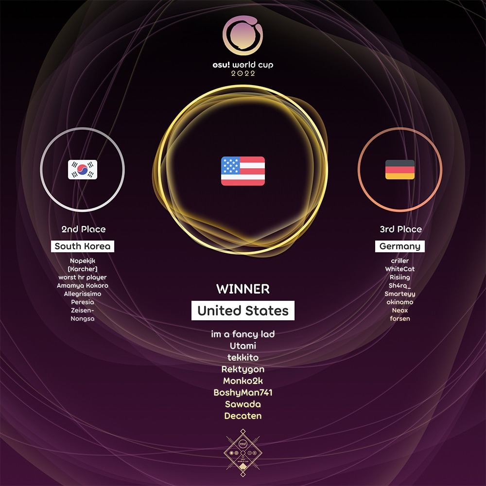

---
tags:
  - OWC
  - OWC2022
---

# osu! World Cup 2022

The **osu! World Cup 2022** (***OWC 2022***) was a country-based osu! tournament hosted by the [osu! team](/wiki/People/osu!_team). It was the thirteenth instalment of the osu! World Cup.

## Tournament schedule

| Event | Timestamp |
| --: | :-- |
| Registration phase | 2022-09-15/2022-09-29 |
| Qualifier showcase | 2022-10-09 (14:00 UTC) |
| Qualifier stage | 2022-10-15/2022-10-16 |
| Round of 32 | 2022-10-22/2022-10-23 |
| Round of 16 | 2022-10-29/2022-10-30 |
| Quarterfinals | 2022-11-05/2022-11-06 |
| Semifinals | 2022-11-12/2022-11-13 |
| Finals | 2022-11-19/2022-11-20 |
| Grand Finals | 2022-11-26/2022-11-27 |

## Prizes

The osu! World Cup 2022 offered a minimum $5,000 cash prize pool and limited edition merch. The prize pool was further increased to $6,085 from **[community donations](https://opencollective.com/osu-tournaments/events/osu-world-cup-2022-0b3a1a25)**.

| Placing | Prizes |
| :-: | :-- |
|  | 48% of the prize pool, single-run merch, profile badge, **osu! Champion** user title for one year |
|  | 32% of the prize pool, single-run merch, profile badge |
|  | 20% of the prize pool, single-run merch, profile badge |

  

## Organisation

The osu! World Cup 2022 was run by the [osu! team](/wiki/People/osu!_team) and various community members.

| Position | Member(s) |
| :-- | :-- |
| Manager | ::{ flag=CA }:: [Azer](https://osu.ppy.sh/users/2155578), ::{ flag=US }:: [ChillierPear](https://osu.ppy.sh/users/9501251), ::{ flag=BR }:: [LeoFLT](https://osu.ppy.sh/users/3668779) |
| Mappool selector | ::{ flag=CA }:: [Azer](https://osu.ppy.sh/users/2155578), ::{ flag=BR }:: [Dada](https://osu.ppy.sh/users/9119507), ::{ flag=US }:: [Fangzy](https://osu.ppy.sh/users/4497691), ::{ flag=BR }:: [niii_san](https://osu.ppy.sh/users/5403374), ::{ flag=US }:: [saiyo](https://osu.ppy.sh/users/2709574), ::{ flag=US }:: [UberFazz](https://osu.ppy.sh/users/8646059), ::{ flag=PL }:: [Zelq](https://osu.ppy.sh/users/8953955) |
| Mappool quality assurance | ::{ flag=DE }:: [Mordred](https://osu.ppy.sh/users/7265097), ::{ flag=CN }:: [Ryuusei Aika](https://osu.ppy.sh/users/7777875), ::{ flag=TW }:: [Shiina Noriko](https://osu.ppy.sh/users/1285637) |
| Mappool playtester | ::{ flag=US }:: [\-Arko](https://osu.ppy.sh/users/8802914), ::{ flag=US }:: [chezbananas](https://osu.ppy.sh/users/7941423), ::{ flag=US }:: [fieryrage](https://osu.ppy.sh/users/3533958), ::{ flag=US }:: [Gabey](https://osu.ppy.sh/users/12904237), ::{ flag=CA }:: [chiv](https://osu.ppy.sh/users/6701656), ::{ flag=CL }:: [Intercambing](https://osu.ppy.sh/users/2546001), ::{ flag=US }:: [M I L E S](https://osu.ppy.sh/users/6036351), ::{ flag=US }:: [NinjaFish](https://osu.ppy.sh/users/4819811), ::{ flag=SE }:: [Reedkatt](https://osu.ppy.sh/users/8335950), ::{ flag=MN }:: [seegii](https://osu.ppy.sh/users/4659319), ::{ flag=CA }:: [Stoof](https://osu.ppy.sh/users/4916057), ::{ flag=US }:: [theez](https://osu.ppy.sh/users/4230827), ::{ flag=US }:: [Trail Mix](https://osu.ppy.sh/users/3328742) |
| Mapper | ::{ flag=GB }:: [\-Mo\-](https://osu.ppy.sh/users/2202163), ::{ flag=US }:: [Aeril](https://osu.ppy.sh/users/4334976), ::{ flag=GB }:: [Aistre](https://osu.ppy.sh/users/4879380), ::{ flag=CA }:: [alden](https://osu.ppy.sh/users/3545323), ::{ flag=GB }:: [Altai](https://osu.ppy.sh/users/5745865), ::{ flag=RU }:: [Alvearia](https://osu.ppy.sh/users/6248691), ::{ flag=US }:: [Astronic](https://osu.ppy.sh/users/9320502), ::{ flag=CA }:: [Azer](https://osu.ppy.sh/users/2155578), ::{ flag=NO }:: [BarkingMadDog](https://osu.ppy.sh/users/3475189), ::{ flag=US }:: [Bloxi](https://osu.ppy.sh/users/9022451), ::{ flag=GB }:: [CallieCube](https://osu.ppy.sh/users/7535045), ::{ flag=US }:: [Camo](https://osu.ppy.sh/users/5194391), ::{ flag=US }:: [captin1](https://osu.ppy.sh/users/689997), ::{ flag=KR }:: [Cellina](https://osu.ppy.sh/users/2490770), ::{ flag=HK }:: [Chaoslitz](https://osu.ppy.sh/users/3621552), ::{ flag=BR }:: [Dada](https://osu.ppy.sh/users/9119507), ::{ flag=BR }:: [dasdwqdf](https://osu.ppy.sh/users/5403374), ::{ flag=JP }:: [Delis](https://osu.ppy.sh/users/1603923), ::{ flag=GB }:: [DeviousPanda](https://osu.ppy.sh/users/4966334), ::{ flag=KR }:: [Down](https://osu.ppy.sh/users/4694602), ::{ flag=CN }:: [Elayue](https://osu.ppy.sh/users/6400861), ::{ flag=US }:: [Elcheer](https://osu.ppy.sh/users/4420014), ::{ flag=AU }:: [elicz1](https://osu.ppy.sh/users/8039342), ::{ flag=PL }:: [fartownik](https://osu.ppy.sh/users/56917), ::{ flag=CA }:: [Feiri](https://osu.ppy.sh/users/3214844), ::{ flag=RU }:: [fergas](https://osu.ppy.sh/users/3144542), ::{ flag=PH }:: [flake](https://osu.ppy.sh/users/7627157), ::{ flag=MX }:: [funny](https://osu.ppy.sh/users/8473573), ::{ flag=CN }:: [Garden](https://osu.ppy.sh/users/2849992), ::{ flag=US }:: [Halfslashed](https://osu.ppy.sh/users/4598899), ::{ flag=FR }:: [Halgoh](https://osu.ppy.sh/users/4109923), ::{ flag=SG }:: [hehe](https://osu.ppy.sh/users/2123087), ::{ flag=EE }:: [iljaaz](https://osu.ppy.sh/users/8501291), ::{ flag=FR }:: [IsomirDiAngelo](https://osu.ppy.sh/users/7715620), ::{ flag=US }:: [ItsWinter](https://osu.ppy.sh/users/6381153), ::{ flag=US }:: [JeZag](https://osu.ppy.sh/users/3087506), ::{ flag=CA }:: [jonathanlfj](https://osu.ppy.sh/users/270377), ::{ flag=CA }:: [KKipalt](https://osu.ppy.sh/users/6889573), ::{ flag=TW }:: [knowledgeking](https://osu.ppy.sh/users/8022517), ::{ flag=BR }:: [kowari](https://osu.ppy.sh/users/5404892), ::{ flag=CA }:: [ktgster](https://osu.ppy.sh/users/53378), ::{ flag=US }:: [Kurashina Asuka](https://osu.ppy.sh/users/7476493), ::{ flag=KR }:: [Luscent](https://osu.ppy.sh/users/2688581), ::{ flag=BR }:: [maot](https://osu.ppy.sh/users/3914271), ::{ flag=AR }:: [Megafan](https://osu.ppy.sh/users/6632605), ::{ flag=DK }:: [melon boy](https://osu.ppy.sh/users/3053382), ::{ flag=NZ }:: [moph](https://osu.ppy.sh/users/2233878), ::{ flag=DE }:: [Mordred](https://osu.ppy.sh/users/7265097), ::{ flag=KR }:: [Nakagawa\-Kanon](https://osu.ppy.sh/users/87065), ::{ flag=US }:: [Nathan](https://osu.ppy.sh/users/4785223), ::{ flag=BR }:: [Net0](https://osu.ppy.sh/users/5099768), ::{ flag=TR }:: [Nymphe](https://osu.ppy.sh/users/10507407), ::{ flag=HK }:: [Petal](https://osu.ppy.sh/users/7354729), ::{ flag=RU }:: [piroshki](https://osu.ppy.sh/users/7645522), ::{ flag=FR }:: [Raijodo](https://osu.ppy.sh/users/13400075), ::{ flag=FR }:: [Realazy](https://osu.ppy.sh/users/918297), ::{ flag=CN }:: [Ryuusei Aika](https://osu.ppy.sh/users/7777875), ::{ flag=JP }:: [Satellite](https://osu.ppy.sh/users/1661227), ::{ flag=CA }:: [Serenhaide](https://osu.ppy.sh/users/10466315), ::{ flag=LT }:: [Strategas](https://osu.ppy.sh/users/2971837), ::{ flag=US }:: [toybot](https://osu.ppy.sh/users/2848604), ::{ flag=FI }:: [verychill](https://osu.ppy.sh/users/10132936), ::{ flag=PL }:: [Zelq](https://osu.ppy.sh/users/8953955) |
| Commentator | ::{ flag=CA }:: [Azer](https://osu.ppy.sh/users/2155578), ::{ flag=US }:: [ChillierPear](https://osu.ppy.sh/users/9501251), ::{ flag=US }:: [D I O](https://osu.ppy.sh/users/3958619), ::{ flag=GB }:: [Damarsh](https://osu.ppy.sh/users/7465147), ::{ flag=US }:: [Dohland](https://osu.ppy.sh/users/5220511), ::{ flag=GB }:: [Doomsday](https://osu.ppy.sh/users/18983), ::{ flag=US }:: [fieryrage](https://osu.ppy.sh/users/3533958), ::{ flag=AU }:: [Jordan The Bear](https://osu.ppy.sh/users/7477458), ::{ flag=AU }:: [Kano](https://osu.ppy.sh/users/3036203), ::{ flag=AU }:: [Mavs](https://osu.ppy.sh/users/11076938), ::{ flag=AU }:: [Monk The Don](https://osu.ppy.sh/users/4012086), ::{ flag=US }:: [this1neguy](https://osu.ppy.sh/users/1797189) |
| Referee | ::{ flag=NL }:: [Albionthegreat](https://osu.ppy.sh/users/9853595), ::{ flag=AU }:: [Fairy Bread](https://osu.ppy.sh/users/8306102), ::{ flag=BR }:: [LeoFLT](https://osu.ppy.sh/users/3668779), ::{ flag=NL }:: [nik](https://osu.ppy.sh/users/10077264), ::{ flag=IN }:: [Speshimen](https://osu.ppy.sh/users/7720204), ::{ flag=US }:: [tigereyes144](https://osu.ppy.sh/users/6499811), ::{ flag=GB }:: [Yazzehh](https://osu.ppy.sh/users/7068973), ::{ flag=US }:: [\[K\]](https://osu.ppy.sh/users/16551387) |
| Statistician | ::{ flag=FI }:: [shdewz](https://osu.ppy.sh/users/10000899) |

## Links

- [Discussion thread](https://osu.ppy.sh/community/forums/topics/1645682)
- [Livestream](https://www.twitch.tv/osulive)
- [Challonge bracket](https://challonge.com/OWC_22)
- [Pick'ems page](https://pickem.hwc.hr/tournaments/100) hosted by ::{ flag=DE }:: [hallowatcher](https://osu.ppy.sh/users/1874761)
- [Information spreadsheet](https://docs.google.com/spreadsheets/d/e/2PACX-1vRYxmXVoTl0pXz3Xk3cDl3PqtH_9vNHGt0GzaJkJ6Ss2wCYSoWppYK-BK6Dr51bZXVdZOakHLpxqZbU/pubhtml)

## Participants

|  | Country | Members |
| :-: | :-: | :-- |
| ::{ flag=AR }:: | **Argentina** | **[Zydan](https://osu.ppy.sh/users/9393446)**, [Amuro](https://osu.ppy.sh/users/7119659), [Bomilk](https://osu.ppy.sh/users/7081596), [GastonGL](https://osu.ppy.sh/users/11238108), [juliancala](https://osu.ppy.sh/users/3272902), [R1cho](https://osu.ppy.sh/users/13065919), [rouds](https://osu.ppy.sh/users/11566624), [zeta](https://osu.ppy.sh/users/9336886) |
| ::{ flag=AU }:: | **Australia** | **[jordanlr7](https://osu.ppy.sh/users/11652827)**, [mrekk](https://osu.ppy.sh/users/7562902), [Dumii](https://osu.ppy.sh/users/3068044), [Vivace](https://osu.ppy.sh/users/3698691), [Milo Milkshake](https://osu.ppy.sh/users/8181420), [suffix](https://osu.ppy.sh/users/2922853), [Arbusion](https://osu.ppy.sh/users/11469447), [Mavs](https://osu.ppy.sh/users/11076938) |
| ::{ flag=AT }:: | **Austria** | **[Nekoyase](https://osu.ppy.sh/users/10981997)**, [Sparkxei](https://osu.ppy.sh/users/4601608), [Alparabel](https://osu.ppy.sh/users/8576721), [z9a](https://osu.ppy.sh/users/13057699), [Akuma no Tenshi](https://osu.ppy.sh/users/21811804), [GDCloud](https://osu.ppy.sh/users/11260055), [Leertaste21](https://osu.ppy.sh/users/7026521), [Kitsumiya](https://osu.ppy.sh/users/18153252) |
| ::{ flag=BY }:: | **Belarus** | **[KortezR](https://osu.ppy.sh/users/6433474)**, [TemaZpro](https://osu.ppy.sh/users/5510197), [flover1ss](https://osu.ppy.sh/users/15803625), [Nuwo](https://osu.ppy.sh/users/15406353), [Vudek](https://osu.ppy.sh/users/8816345), [triplesssiixx](https://osu.ppy.sh/users/20758820), [Vasteri](https://osu.ppy.sh/users/14165370), [LoPij](https://osu.ppy.sh/users/6892711) |
| ::{ flag=BE }:: | **Belgium** | **[Hanori](https://osu.ppy.sh/users/7078544)**, [Hexikey](https://osu.ppy.sh/users/10760701), [5joshi](https://osu.ppy.sh/users/4279650), [Mornis](https://osu.ppy.sh/users/6479616), [Meersu](https://osu.ppy.sh/users/6311605), [Vinnie741](https://osu.ppy.sh/users/8509247), [Ramfie](https://osu.ppy.sh/users/17201929), [iblue](https://osu.ppy.sh/users/9184180) |
| ::{ flag=BR }:: | **Brazil** | **[zubs](https://osu.ppy.sh/users/4253615)**, [Coreanmaluco](https://osu.ppy.sh/users/3149577), [Checha](https://osu.ppy.sh/users/10157694), [httd](https://osu.ppy.sh/users/11919665), [VitorSkull](https://osu.ppy.sh/users/10223298), [Dafonz](https://osu.ppy.sh/users/6667041), [xxluizxx47](https://osu.ppy.sh/users/4687701), [xKirito](https://osu.ppy.sh/users/4018079) |
| ::{ flag=BG }:: | **Bulgaria** | **[- Frane-](https://osu.ppy.sh/users/7211425)**, [\_2K](https://osu.ppy.sh/users/6486469), [hlanden](https://osu.ppy.sh/users/4934554), [Ophilion](https://osu.ppy.sh/users/2599255), [Ted](https://osu.ppy.sh/users/9717848), [yun](https://osu.ppy.sh/users/7847997), [- ZenitH -](https://osu.ppy.sh/users/6211654), [ivdim](https://osu.ppy.sh/users/9518027) |
| ::{ flag=CA }:: | **Canada** | **[Zylice](https://osu.ppy.sh/users/5033077)**, [xootynator](https://osu.ppy.sh/users/3717598), [RyuK](https://osu.ppy.sh/users/6304246), [Rupertion](https://osu.ppy.sh/users/5774823), [nick1324](https://osu.ppy.sh/users/612898), [Yip](https://osu.ppy.sh/users/5177569), [kurtis-](https://osu.ppy.sh/users/5477343), [Saryi](https://osu.ppy.sh/users/10051720) |
| ::{ flag=CL }:: | **Chile** | **[Eunha](https://osu.ppy.sh/users/7701428)**, [Gonzah](https://osu.ppy.sh/users/12434652), [mocaccino](https://osu.ppy.sh/users/5252968), [NO37](https://osu.ppy.sh/users/4653583), [Pancho](https://osu.ppy.sh/users/11305398), [suntan](https://osu.ppy.sh/users/19998548), [uNable](https://osu.ppy.sh/users/1958549), [xXChokgamerXx](https://osu.ppy.sh/users/7748891) |
| ::{ flag=CN }:: | **China** | **[lolol235](https://osu.ppy.sh/users/6090175)**, [lolol234](https://osu.ppy.sh/users/5791401), [lolol233](https://osu.ppy.sh/users/11375105), [Crystal](https://osu.ppy.sh/users/1646397), [\[Joseph Jostar\]](https://osu.ppy.sh/users/3139364), [My Angel Anzu](https://osu.ppy.sh/users/4896825), [\[Crz\]Makii](https://osu.ppy.sh/users/5242158), [Fia](https://osu.ppy.sh/users/1269067) |
| ::{ flag=CO }:: | **Colombia** | **[Ninther4](https://osu.ppy.sh/users/3291562)**, [501312](https://osu.ppy.sh/users/11083194), [Black Astro](https://osu.ppy.sh/users/10510143), [ElMick32](https://osu.ppy.sh/users/12502593), [Ither](https://osu.ppy.sh/users/17117482), [Jekuru](https://osu.ppy.sh/users/11727492), [Naylicia](https://osu.ppy.sh/users/10676766), [Rushy](https://osu.ppy.sh/users/5281857) |
| ::{ flag=HR }:: | **Croatia** | **[rs -b](https://osu.ppy.sh/users/9283403)**, [StrawFrog](https://osu.ppy.sh/users/10978106), [DragonCroc](https://osu.ppy.sh/users/4334103), [NakanoAzusa](https://osu.ppy.sh/users/8552735), [Suki007](https://osu.ppy.sh/users/7289538), [zvonimir](https://osu.ppy.sh/users/10192756), [cempresi](https://osu.ppy.sh/users/14898728), [-Milky](https://osu.ppy.sh/users/8541186) |
| ::{ flag=CZ }:: | **Czech Republic** | **[PoggersCZ](https://osu.ppy.sh/users/3198446)**, [Ev1dent](https://osu.ppy.sh/users/7125675), [Orbi](https://osu.ppy.sh/users/3574151), [VilaZ](https://osu.ppy.sh/users/5155680), [NitroM\_](https://osu.ppy.sh/users/3121234), [MrNobady](https://osu.ppy.sh/users/9303599), [mnbvcxy12345678](https://osu.ppy.sh/users/9422204), [LaBron Jayms](https://osu.ppy.sh/users/3853840) |
| ::{ flag=DK }:: | **Denmark** | **[Polle](https://osu.ppy.sh/users/13218204)**, [iamVill](https://osu.ppy.sh/users/6295380), [Vandabe](https://osu.ppy.sh/users/7050754), [cat burger](https://osu.ppy.sh/users/11380904), [Marco Poio](https://osu.ppy.sh/users/10650901), [Zeezus](https://osu.ppy.sh/users/9125328), [Toilet Player](https://osu.ppy.sh/users/12762744), [mahisuru](https://osu.ppy.sh/users/11547643) |
| ::{ flag=EE }:: | **Estonia** | **[Ancenthe](https://osu.ppy.sh/users/4479041)**, [Abyssal](https://osu.ppy.sh/users/5527745), [cedru](https://osu.ppy.sh/users/10162611), [Rev0](https://osu.ppy.sh/users/10346185), [Slay](https://osu.ppy.sh/users/7093124), [grexx](https://osu.ppy.sh/users/12974032), [makux](https://osu.ppy.sh/users/13733307), [blourgh](https://osu.ppy.sh/users/3974292) |
| ::{ flag=FI }:: | **Finland** | **[Freezd](https://osu.ppy.sh/users/6524603)**, [XEPEI](https://osu.ppy.sh/users/11479551), [Dezku](https://osu.ppy.sh/users/9505131), [Amasetic](https://osu.ppy.sh/users/11375251), [jamin](https://osu.ppy.sh/users/6236248), [Isak-](https://osu.ppy.sh/users/8702650), [kadzackzz](https://osu.ppy.sh/users/7005392), [tikkanen](https://osu.ppy.sh/users/7341081) |
| ::{ flag=FR }:: | **France** | **[Musty](https://osu.ppy.sh/users/251683)**, [Ekoro](https://osu.ppy.sh/users/284905), [filsdelama](https://osu.ppy.sh/users/2831793), [FlasTEH](https://osu.ppy.sh/users/8443945), [Hifkil](https://osu.ppy.sh/users/4301976), [justman](https://osu.ppy.sh/users/7657831), [Thundur](https://osu.ppy.sh/users/4141918), [VROUM CV VITE](https://osu.ppy.sh/users/7630971) |
| ::{ flag=DE }:: | **Germany** | **[criller](https://osu.ppy.sh/users/8116659)**, [WhiteCat](https://osu.ppy.sh/users/4504101), [Risiing](https://osu.ppy.sh/users/2282047), [Sh4rq\_](https://osu.ppy.sh/users/11684622), [Smarteyy](https://osu.ppy.sh/users/4780986), [okinamo](https://osu.ppy.sh/users/3765989), [Neox](https://osu.ppy.sh/users/4633724), [forsen](https://osu.ppy.sh/users/12952320) |
| ::{ flag=GR }:: | **Greece** | **[Riven](https://osu.ppy.sh/users/3638005)**, [Nekkid](https://osu.ppy.sh/users/12145220), [MyAimPeeps](https://osu.ppy.sh/users/15427656), [HR sketos](https://osu.ppy.sh/users/3478000), [GaxL](https://osu.ppy.sh/users/10398348), [Leftie](https://osu.ppy.sh/users/3423454), [kwotaq](https://osu.ppy.sh/users/8195972), [SkroutzRekd](https://osu.ppy.sh/users/9315355) |
| ::{ flag=HK }:: | **Hong Kong** | **[Shiraha Yuki](https://osu.ppy.sh/users/10829419)**, [A21](https://osu.ppy.sh/users/11198996), [mcy4](https://osu.ppy.sh/users/2165650), [Tsuwagi](https://osu.ppy.sh/users/9313951), [Nezzar](https://osu.ppy.sh/users/126144), [Rlsc](https://osu.ppy.sh/users/2110845), [F2X](https://osu.ppy.sh/users/16227745), [iRedi](https://osu.ppy.sh/users/8005579) |
| ::{ flag=HU }:: | **Hungary** | **[Lexion](https://osu.ppy.sh/users/5271371)**, [defii](https://osu.ppy.sh/users/8698024), [gecseboti](https://osu.ppy.sh/users/15213139), [Glasswave](https://osu.ppy.sh/users/5442931), [Gamanoid](https://osu.ppy.sh/users/7668715), [JezusNE](https://osu.ppy.sh/users/10762622), [Kelathis](https://osu.ppy.sh/users/10240089), [LexionMyMommy](https://osu.ppy.sh/users/6905038) |
| ::{ flag=ID }:: | **Indonesia** | **[Fuma](https://osu.ppy.sh/users/1501956)**, [-Reuto-](https://osu.ppy.sh/users/10717635), [rHO](https://osu.ppy.sh/users/1629553), [MineFrostID](https://osu.ppy.sh/users/12159899), [D E L O N](https://osu.ppy.sh/users/11983229), [DEETO](https://osu.ppy.sh/users/10069909), [Rexeez](https://osu.ppy.sh/users/1987591), [ThatNOOBguy](https://osu.ppy.sh/users/11091594) |
| ::{ flag=IL }:: | **Israel** | **[PaintedKoala](https://osu.ppy.sh/users/10056419)**, [MrPotato](https://osu.ppy.sh/users/2787415), [cihp](https://osu.ppy.sh/users/12083446), [Galog](https://osu.ppy.sh/users/7799629), [tyty5180](https://osu.ppy.sh/users/15389454), [Accelerator](https://osu.ppy.sh/users/10822717), [FxxyX](https://osu.ppy.sh/users/12327038), [Caution](https://osu.ppy.sh/users/7082242) |
| ::{ flag=IT }:: | **Italy** | **[Ryuzaki](https://osu.ppy.sh/users/7165477)**, [oh my gah](https://osu.ppy.sh/users/11215030), [\_Ecly](https://osu.ppy.sh/users/13757181), [giulio](https://osu.ppy.sh/users/11409111), [kiirochii](https://osu.ppy.sh/users/6387149), [leoanto](https://osu.ppy.sh/users/11795963), [Rejax](https://osu.ppy.sh/users/11903030), [shadow modico](https://osu.ppy.sh/users/12790479) |
| ::{ flag=JP }:: | **Japan** | **[Invoker](https://osu.ppy.sh/users/5326197)**, [Teacchyyy](https://osu.ppy.sh/users/7178423), [L4plus1](https://osu.ppy.sh/users/1504556), [Aotoleen](https://osu.ppy.sh/users/3162741), [Vento](https://osu.ppy.sh/users/4796794), [dectopia](https://osu.ppy.sh/users/2845904), [KonKonKinakoN](https://osu.ppy.sh/users/4733185), [YaMaDarknesss](https://osu.ppy.sh/users/5645667) |
| ::{ flag=KZ }:: | **Kazakhstan** | **[Plombire](https://osu.ppy.sh/users/15656399)**, [Kamensh1k](https://osu.ppy.sh/users/16817965), [Calideon](https://osu.ppy.sh/users/5175726), [Akira](https://osu.ppy.sh/users/1330619), [hayakawa yuiko](https://osu.ppy.sh/users/12474947), [ace1ng](https://osu.ppy.sh/users/13297978), [juststrx](https://osu.ppy.sh/users/11012589), [TabletBoii](https://osu.ppy.sh/users/10863249) |
| ::{ flag=LV }:: | **Latvia** | **[waywern2012](https://osu.ppy.sh/users/5870453)**, [Piparkuucinsh](https://osu.ppy.sh/users/7453024), [Murzikk](https://osu.ppy.sh/users/12000193), [Shining Star](https://osu.ppy.sh/users/4958135), [Ayaero](https://osu.ppy.sh/users/9533316), [Akolibed](https://osu.ppy.sh/users/9269034) |
| ::{ flag=LT }:: | **Lithuania** | **[shineroo](https://osu.ppy.sh/users/4360718)**, [Nitram](https://osu.ppy.sh/users/10569535), [bze](https://osu.ppy.sh/users/4095562), [fybeth](https://osu.ppy.sh/users/7225339), [ZdefLT](https://osu.ppy.sh/users/9455803), [rxbass1337](https://osu.ppy.sh/users/6046092), [Ignas](https://osu.ppy.sh/users/6391852), [shiuw](https://osu.ppy.sh/users/9074446) |
| ::{ flag=MY }:: | **Malaysia** | **[Chiyuu](https://osu.ppy.sh/users/8226107)**, [Rampax](https://osu.ppy.sh/users/3995630), [shxn](https://osu.ppy.sh/users/14290988), [Tzero](https://osu.ppy.sh/users/6088976), [Zygody](https://osu.ppy.sh/users/3677251), [Lunasa](https://osu.ppy.sh/users/16436446), [Auxuelus](https://osu.ppy.sh/users/5414124), [Agagak](https://osu.ppy.sh/users/3645490) |
| ::{ flag=MX }:: | **Mexico** | **[-Wolfy-](https://osu.ppy.sh/users/4497582)**, [Riot](https://osu.ppy.sh/users/4256461), [SaintSFT](https://osu.ppy.sh/users/14970132), [pundice](https://osu.ppy.sh/users/7940696), [Camberos](https://osu.ppy.sh/users/2553519), [-Karu](https://osu.ppy.sh/users/8429128), [Jalepers](https://osu.ppy.sh/users/7341086), [Siros](https://osu.ppy.sh/users/3787685) |
| ::{ flag=NL }:: | **Netherlands** | **[jackylam5](https://osu.ppy.sh/users/1540807)**, [Skyrovania](https://osu.ppy.sh/users/4696315), [Manievat](https://osu.ppy.sh/users/6744123), [LUCIANO](https://osu.ppy.sh/users/11604978), [cavoeboy](https://osu.ppy.sh/users/7361815), [Dolter](https://osu.ppy.sh/users/6920104), [Aheo](https://osu.ppy.sh/users/14919428), [Niqht](https://osu.ppy.sh/users/14390731) |
| ::{ flag=NZ }:: | **New Zealand** | **[Zoomer](https://osu.ppy.sh/users/6600930)**, [Saiyku](https://osu.ppy.sh/users/13767572), [rumii](https://osu.ppy.sh/users/9803745), [Emilbus](https://osu.ppy.sh/users/11141578), [Yoon My Beloved](https://osu.ppy.sh/users/15293080), [shortpotato](https://osu.ppy.sh/users/1266102), [Pigssaymoo](https://osu.ppy.sh/users/5394938), [Big Z](https://osu.ppy.sh/users/8641416) |
| ::{ flag=NO }:: | **Norway** | **[YokesPai](https://osu.ppy.sh/users/6399568)**, [-GN](https://osu.ppy.sh/users/895581), [antonyw](https://osu.ppy.sh/users/12959983), [Jompa Tormann](https://osu.ppy.sh/users/10773960), [Markus](https://osu.ppy.sh/users/8414284), [Melvr](https://osu.ppy.sh/users/9211924), [nindrake](https://osu.ppy.sh/users/10549880), [Pinguinzi](https://osu.ppy.sh/users/9414229) |
| ::{ flag=PE }:: | **Peru** | **[\[MG\]HatsuneMiku](https://osu.ppy.sh/users/2291265)**, [P r a h](https://osu.ppy.sh/users/10509043), [Zuk](https://osu.ppy.sh/users/12728547), [Yeva](https://osu.ppy.sh/users/8102140), [\_momo3o](https://osu.ppy.sh/users/7421892), [iamMaFeR](https://osu.ppy.sh/users/11574286), [Hasaki](https://osu.ppy.sh/users/9037054), [Nkiad](https://osu.ppy.sh/users/13684411) |
| ::{ flag=PH }:: | **Philippines** | **[zonelouise](https://osu.ppy.sh/users/1492995)**, [enri](https://osu.ppy.sh/users/8640970), [NathanRam1918](https://osu.ppy.sh/users/4734703), [Rammu](https://osu.ppy.sh/users/10652837), [Kageno](https://osu.ppy.sh/users/7246165), [-Ke15](https://osu.ppy.sh/users/10807597), [Xyloz](https://osu.ppy.sh/users/12040280), [distant\_waves](https://osu.ppy.sh/users/16702873) |
| ::{ flag=PL }:: | **Poland** | **[maliszewski](https://osu.ppy.sh/users/12408961)**, [Bartek22830](https://osu.ppy.sh/users/6404027), [Rafis](https://osu.ppy.sh/users/2558286), [Michni](https://osu.ppy.sh/users/3543130), [Mastasz](https://osu.ppy.sh/users/1876565), [ypan](https://osu.ppy.sh/users/7787629), [BMG\_](https://osu.ppy.sh/users/4981809), [gnahus](https://osu.ppy.sh/users/12779141) |
| ::{ flag=PT }:: | **Portugal** | **[Big Yikes](https://osu.ppy.sh/users/799218)**, [MakiDonalds](https://osu.ppy.sh/users/11610772), [uatzap](https://osu.ppy.sh/users/16509171), [TamamoLover](https://osu.ppy.sh/users/7772622), [Konam](https://osu.ppy.sh/users/4357340), [Just2Bad](https://osu.ppy.sh/users/4430263), [Netizz](https://osu.ppy.sh/users/3256745), [AlfredTheSalmon](https://osu.ppy.sh/users/1052349) |
| ::{ flag=RO }:: | **Romania** | **[badeu](https://osu.ppy.sh/users/1473890)**, [eternum](https://osu.ppy.sh/users/4581069), [SatonoDiamond](https://osu.ppy.sh/users/12366071), [Lucrise](https://osu.ppy.sh/users/9719351), [roliy](https://osu.ppy.sh/users/9578404), [Razei](https://osu.ppy.sh/users/10778261), [Kehest](https://osu.ppy.sh/users/6145000), [HowlPleb](https://osu.ppy.sh/users/15995105) |
| ::{ flag=RU }:: | **Russian Federation** | **[Chicony](https://osu.ppy.sh/users/5199332)**, [VACman](https://osu.ppy.sh/users/5981005), [Vitya1437](https://osu.ppy.sh/users/4346274), [TESTER PIVKA](https://osu.ppy.sh/users/9961301), [Welter](https://osu.ppy.sh/users/11552867), [-Din-](https://osu.ppy.sh/users/7972980), [Apostol](https://osu.ppy.sh/users/9902255), [VoProSSoFF](https://osu.ppy.sh/users/6524092) |
| ::{ flag=SG }:: | **Singapore** | **[megumic](https://osu.ppy.sh/users/7537133)**, [Dawnwing](https://osu.ppy.sh/users/5144534), [Demonical](https://osu.ppy.sh/users/5447609), [Eagle5324](https://osu.ppy.sh/users/11987104), [GSBlank](https://osu.ppy.sh/users/2312106), [SeeL](https://osu.ppy.sh/users/5104320), [Tebi](https://osu.ppy.sh/users/5407620), [Yellow-](https://osu.ppy.sh/users/3215487) |
| ::{ flag=SK }:: | **Slovakia** | **[Tikef](https://osu.ppy.sh/users/9149213)**, [PeteX](https://osu.ppy.sh/users/1285945), [Hranolka](https://osu.ppy.sh/users/6149947), [DogeDrxvmik](https://osu.ppy.sh/users/11383358), [Plokosko](https://osu.ppy.sh/users/12111972), [Deafilamor](https://osu.ppy.sh/users/5128334), [Igor156](https://osu.ppy.sh/users/7358639), [nevqr](https://osu.ppy.sh/users/14269506) |
| ::{ flag=KR }:: | **South Korea** | **[Nopekjk](https://osu.ppy.sh/users/4585186)**, [\[Karcher\]](https://osu.ppy.sh/users/11443437), [worst hr player](https://osu.ppy.sh/users/14106450), [Amamya Kokoro](https://osu.ppy.sh/users/2511839), [Allegrissimo](https://osu.ppy.sh/users/9052194), [Peresia](https://osu.ppy.sh/users/7027766), [Zeisen-](https://osu.ppy.sh/users/7892320), [Nongsa](https://osu.ppy.sh/users/2572468) |
| ::{ flag=ES }:: | **Spain** | **[M A N O L O](https://osu.ppy.sh/users/12296128)**, [A N T O N I O](https://osu.ppy.sh/users/12760743), [V I C E N T E](https://osu.ppy.sh/users/13962152), [NHarmonia](https://osu.ppy.sh/users/9582556), [AbejaIvan](https://osu.ppy.sh/users/6216284), [Bairechuu](https://osu.ppy.sh/users/15346564), [mario bro](https://osu.ppy.sh/users/6735738), [AlvaroYL](https://osu.ppy.sh/users/6333166) |
| ::{ flag=SE }:: | **Sweden** | **[nautzz](https://osu.ppy.sh/users/2012039)**, [scylla](https://osu.ppy.sh/users/9405745), [turbob](https://osu.ppy.sh/users/9818947), [Felrion](https://osu.ppy.sh/users/3673083), [Fejlan](https://osu.ppy.sh/users/8150535), [TOnyrino](https://osu.ppy.sh/users/7338010), [\[ Blue \]](https://osu.ppy.sh/users/4859699), [trumpatino69](https://osu.ppy.sh/users/10903510) |
| ::{ flag=CH }:: | **Switzerland** | **[Baluhga](https://osu.ppy.sh/users/7225922)**, [marcel7](https://osu.ppy.sh/users/13062430), [J \]](https://osu.ppy.sh/users/10316438), [Sil](https://osu.ppy.sh/users/7924600), [Akani](https://osu.ppy.sh/users/2323137), [-Spartan](https://osu.ppy.sh/users/5783061), [Not very fast](https://osu.ppy.sh/users/16829517), [McK](https://osu.ppy.sh/users/4025457) |
| ::{ flag=TW }:: | **Taiwan** | **[DazzLE\_Wind](https://osu.ppy.sh/users/2537924)**, [\_Shield](https://osu.ppy.sh/users/1860489), [\[ Zane \]](https://osu.ppy.sh/users/3517706), [Flask](https://osu.ppy.sh/users/959763), [Rizer](https://osu.ppy.sh/users/5155973), [Shirosora](https://osu.ppy.sh/users/10613549), [Spinesnight](https://osu.ppy.sh/users/4519494), [willy0214](https://osu.ppy.sh/users/8660293) |
| ::{ flag=TH }:: | **Thailand** | **[- Phantasma -](https://osu.ppy.sh/users/1427407)**, [InBefore](https://osu.ppy.sh/users/7280590), [ithi](https://osu.ppy.sh/users/4782236), [ChaiPhukChep](https://osu.ppy.sh/users/9723127), [Chorus](https://osu.ppy.sh/users/3504692), [-Kedama](https://osu.ppy.sh/users/12147277), [minecrafter](https://osu.ppy.sh/users/9389213), [Salvotore](https://osu.ppy.sh/users/3394696) |
| ::{ flag=TR }:: | **Turkey** | **[heyronii](https://osu.ppy.sh/users/5642779)**, [Shinkiro](https://osu.ppy.sh/users/6093148), [Orkay](https://osu.ppy.sh/users/9321674), [Gilraen](https://osu.ppy.sh/users/9256771), [Mikatsu](https://osu.ppy.sh/users/6612642), [gheanfoil](https://osu.ppy.sh/users/13596160), [Clutchx](https://osu.ppy.sh/users/14958380), [Zeforex](https://osu.ppy.sh/users/11236262) |
| ::{ flag=UA }:: | **Ukraine** | **[Kryterion](https://osu.ppy.sh/users/9920144)**, [dench](https://osu.ppy.sh/users/10073635), [DJ VAC](https://osu.ppy.sh/users/7587763), [POMAH](https://osu.ppy.sh/users/11794209), [gusniki](https://osu.ppy.sh/users/9830628), [1Max](https://osu.ppy.sh/users/11653711), [RafGPio](https://osu.ppy.sh/users/13705417), [CRIMEA](https://osu.ppy.sh/users/11078815) |
| ::{ flag=GB }:: | **United Kingdom** | **[lystia](https://osu.ppy.sh/users/11042418)**, [bloo](https://osu.ppy.sh/users/6778877), [Plasma](https://osu.ppy.sh/users/10077431), [Malteser](https://osu.ppy.sh/users/5218178), [Mahmood](https://osu.ppy.sh/users/7627844), [rudj](https://osu.ppy.sh/users/11592896), [majoreh](https://osu.ppy.sh/users/7959222), [Kingling](https://osu.ppy.sh/users/7010761) |
| ::{ flag=US }:: | **United States** | **[im a fancy lad](https://osu.ppy.sh/users/4908650)**, [Utami](https://osu.ppy.sh/users/7512553), [tekkito](https://osu.ppy.sh/users/7075211), [Rektygon](https://osu.ppy.sh/users/7813296), [Monko2k](https://osu.ppy.sh/users/4852013), [BoshyMan741](https://osu.ppy.sh/users/4830687), [Sawada](https://osu.ppy.sh/users/8198848), [Decaten](https://osu.ppy.sh/users/5645231) |
| ::{ flag=UY }:: | **Uruguay** | **[daanit](https://osu.ppy.sh/users/6159669)**, [El Milanga](https://osu.ppy.sh/users/12264918), [Rebo](https://osu.ppy.sh/users/6942259), [Kazuki K](https://osu.ppy.sh/users/6407282), [Athenai](https://osu.ppy.sh/users/5522789), [Shikke](https://osu.ppy.sh/users/5382216), [Melxdy](https://osu.ppy.sh/users/11113213), [etterna in osu](https://osu.ppy.sh/users/5243536) |
| ::{ flag=VN }:: | **Vietnam** | **[realshin](https://osu.ppy.sh/users/8006029)**, [\[sin\]](https://osu.ppy.sh/users/11021073), [Phoeni\_](https://osu.ppy.sh/users/14953642), [mizumi\_a](https://osu.ppy.sh/users/14977562), [walle](https://osu.ppy.sh/users/8431549), [waifaii](https://osu.ppy.sh/users/9256803), [\_ Freedom \_](https://osu.ppy.sh/users/3999831), [SkyArrow](https://osu.ppy.sh/users/4039647) |

## Podium

## Mappools

### Grand Finals

**[Download the mappack here (165 MB)](https://drive.google.com/uc?id=1mHF-2DOzNobXvGfl3FxKRyQwNIxiFJFn)**

- No Mod
  1. [TUYU - Under Kids (captin1) \[Rebellion\]](https://osu.ppy.sh/beatmapsets/1889093#osu/3890657)
  2. [Raimukun - Myths Orbis (knowledgeking) \[Triangulum Majus\]](https://osu.ppy.sh/beatmapsets/1889095#osu/3890663)
  3. [JYOCHO - Kirei na Sankaku, Asahi Ningen (Raijodo) \[Special\]](https://osu.ppy.sh/beatmapsets/1888518#osu/3889346)
  4. [DJ Raisei - T.R.A.P. (Halgoh) \[Vesperal Singularity\]](https://osu.ppy.sh/beatmapsets/1889105#osu/3890684)
  5. [II-L ft.amelie xoxo - THE EARTH (Ryuusei Aika) \[Zeta\]](https://osu.ppy.sh/beatmapsets/1889101#osu/3890672)
- Hidden
  1. [FELT - Summer Fever (Camo) \[Shimmering Sky\]](https://osu.ppy.sh/beatmapsets/1888937#osu/3890317)
  2. [Dark PHOENiX - Shoujo ga Mita Nihon no Genfuukei (iljaaz) \[Phantasm\]](https://osu.ppy.sh/beatmapsets/1889104#osu/3890682)
  3. [Sephid - Thunderstrike 1988 (captin1) \[Thunderstrike 2022\]](https://osu.ppy.sh/beatmapsets/1889109#osu/3890688)
- Hard Rock
  1. [KINEMA106 - Nightmare Party (Mordred) \[Poi\]](https://osu.ppy.sh/beatmapsets/1888954#osu/3890347)
  2. [Rabbit House - Sanctuary (funny) \[jesse we have to map for owc2022\]](https://osu.ppy.sh/beatmapsets/1889094#osu/3890659)
  3. [The Fearless Flyers - Assassin (olc) \[lets go\]](https://osu.ppy.sh/beatmapsets/1580627#osu/3227488)
- Double Time
  1. [Aoi Eir - Yurari (Garden) \[Expert\]](https://osu.ppy.sh/beatmapsets/1888926#osu/3890269)
  2. [-45 - yoshikawa45 vs. siesta45 Battle of HongKong (Dada) \[Para Bellum\]](https://osu.ppy.sh/beatmapsets/1889111#osu/3890692)
  3. [Demetori - Kuuchuu ni Shizumu Kishinjou \~ Counter-Clock World (jonathanlfj) \[Lunatic Collab\]](https://osu.ppy.sh/beatmapsets/347719#osu/818597)
  4. [Anri - Last Surf Holiday (Night Tempo edit) (Net0) \[Extra Tourney\]](https://osu.ppy.sh/beatmapsets/1889079#osu/3890628)
- FreeMod
  1. [Falcom Sound Team jdk - Satisfied Madness (jonathanlfj) \[Abyss\]](https://osu.ppy.sh/beatmapsets/1889083#osu/3890637)
  2. [Iyowa feat.KAFU - Kyu-Kurarin (7\_7 bootleg) (hehe) \[0\_0\]](https://osu.ppy.sh/beatmapsets/1888821#osu/3890011)
  3. [yak\_won - Wind Tales (ktgster) \[Extreme\]](https://osu.ppy.sh/beatmapsets/1889131#osu/3890721)
  4. [METAROOM - SPIKEY BOI (JeZag) \[MUSH (THE FINALE)\]](https://osu.ppy.sh/beatmapsets/1888434#osu/3889200)
- Tiebreaker
  1. **[seatrus - EXXTRA JUDGEMENT (elicz1) \[GRAND FINALE\]](https://osu.ppy.sh/beatmapsets/1889132#osu/3890723)**

### Finals

**[Download the mappack here (158 MB)](https://drive.google.com/uc?id=1zk0h7viRmPel6RTbK8W8vJQ4d55I7loY)**

- No Mod
  1. [Wonderlands x Showtime - Positive Dance Time (BarkingMadDog) \[Master\]](https://osu.ppy.sh/beatmapsets/1884890#osu/3880894)
  2. [xi - Longinus (Nakagawa-Kanon) \[Another\]](https://osu.ppy.sh/beatmapsets/1884521#osu/3880108)
  3. [majiko - Koe (Delis) \[Delhi and Marrakesh's Tragic Distant Love \[Travel to Azerbaijan\]\]](https://osu.ppy.sh/beatmapsets/1884351#osu/3879769)
  4. [Lobotomy corp OST - Second Warning (WWWWWWWWWWWWWW) \[KROVOIZLIJANIE feat. Kuyusu\]](https://osu.ppy.sh/beatmapsets/1467968#osu/3014360)
  5. [Yousei Teikoku - Aru Tsuioku, Bouchou Uchuu ni Okeru Shinkai Sunawachi Suiten (IsomirDiAngelo) \[Extreme\]](https://osu.ppy.sh/beatmapsets/1607459#osu/3296392)
- Hidden
  1. [04 Limited Sazabys - Warp (Luscent) \[Expert\]](https://osu.ppy.sh/beatmapsets/1884898#osu/3880911)
  2. [Micelle - PhonDrome! (Skytuna) \[skybuba\]](https://osu.ppy.sh/beatmapsets/1563251#osu/3192283)
  3. [Children Of Bodom - If You Want Peace... Prepare for War (CallieCube) \[Extremity\]](https://osu.ppy.sh/beatmapsets/1511463#osu/3094900)
- Hard Rock
  1. [Unlucky Morpheus - Wings (2018Ver.) (IsomirDiAngelo) \[kfc\]](https://osu.ppy.sh/beatmapsets/970125#osu/3880893)
  2. [Tatsh - reunion \<Platinum Long Version\> (Luscent) \[Collab Expert\]](https://osu.ppy.sh/beatmapsets/1884903#osu/3880919)
  3. [BEMANI Sound Team "Yvya" - Vitrum (Lince Cosmico) \[werf's Extreme #9\]](https://osu.ppy.sh/beatmapsets/1581126#osu/3228701)
- Double Time
  1. [sana (sajou no hana) - Senya Ichiya VORTEX (KoldNoodl) \[Tomorrow\]](https://osu.ppy.sh/beatmapsets/1656825#osu/3381770)
  2. [BlackY - Brionac (verychill) \[Insane\]](https://osu.ppy.sh/beatmapsets/1884921#osu/3880948)
  3. [NANORAY - DESKTOP BUDDY (Elcheer) \[TOURNEY VERSION\]](https://osu.ppy.sh/beatmapsets/1884650#osu/3880353)
  4. [Dove Cameron - LazyBaby (Asphyxia) \[Lazy\]](https://osu.ppy.sh/beatmapsets/1503309#osu/3079877)
- Free Mod
  1. [Coda - Fighting Gold (fartownik) \[Vento Aureo\]](https://osu.ppy.sh/beatmapsets/1884904#osu/3880922)
  2. [rN - onostrapha (Altai) \[midnight rain\]](https://osu.ppy.sh/beatmapsets/1884914#osu/3880936)
  3. [ZUN - G Free (Halfslashed) \[Extra Stage\]](https://osu.ppy.sh/beatmapsets/1884924#osu/3880952)
  4. [NIWASHI - Harder Than Diamond (DeviousPanda) \[Chromatic Refraction\]](https://osu.ppy.sh/beatmapsets/1884920#osu/3880946)
- Tiebreaker
  1. **[Sunless Rise - Ghosts of the Past (ItsWinter) \[Winter & CallieCube's Breaking Point (Tourney Ver.)\]](https://osu.ppy.sh/beatmapsets/1884827#osu/3880731)**

### Semifinals

**[Download the mappack here (180 MB)](https://drive.google.com/uc?id=1S7rSQcelhONeDEKPKyctDLtFAC6y2Ou6)**

- No Mod
  1. [Icon For Hire - Ready For Combat (piroshki) \[Ready to Fight\]](https://osu.ppy.sh/beatmapsets/1880499#osu/3871505)
  2. [Spiegel vs. Yukino - MassacrE || 3rc4224M (Astronic) \[Destruction\]](https://osu.ppy.sh/beatmapsets/1880634#osu/3871753)
  3. [ORESAMA - OPEN THE WORLDS (flake) \[STARSTRUCK\]](https://osu.ppy.sh/beatmapsets/1880608#osu/3871698)
  4. [Juggernaut. - Rebellion (Altai) \[Why Don't You Trust Me?\]](https://osu.ppy.sh/beatmapsets/1880627#osu/3871738)
  5. [Shawn Wasabi + YDG - Burnt Rice (feat. YUNG GEMMY) (ScubDomino) \[Lemon\]](https://osu.ppy.sh/beatmapsets/866401#osu/1857321)
- Hidden
  1. [UKRampage - Magmell (CallieCube) \[The Cube\]](https://osu.ppy.sh/beatmapsets/1880617#osu/3871715)
  2. [IOSYS - Club Ibuki in Break All (Bloxi) \[Utage wa Eien ni\]](https://osu.ppy.sh/beatmapsets/1880631#osu/3871749)
  3. [Utsu-P - Imperfect Animals (kuyusu) \[Expert\]](https://osu.ppy.sh/beatmapsets/1377324#osu/2846548)
- Hard Rock
  1. [Thaehan - All or Nothing (Zelq) \[Expert\]](https://osu.ppy.sh/beatmapsets/1880625#osu/3871735)
  2. [HyuN - White Aura (Mirash) \[Delis' Extra\]](https://osu.ppy.sh/beatmapsets/891333#osu/1863199)
  3. [Camellia - Flamewall (Talulah) \[Ignite\]](https://osu.ppy.sh/beatmapsets/1302799#osu/2701912)
- Double Time
  1. [Tommy heavenly6 - PAPERMOON (Jounzan) \[Insane\]](https://osu.ppy.sh/beatmapsets/503978#osu/1072406)
  2. [Yuuhei Satellite - Hatenaki Kaze no Kiseki sae \~Ha\~ (Dailycare) \[Continuous\]](https://osu.ppy.sh/beatmapsets/1822334#osu/3739386)
  3. [Idun Nicoline - Lost Without You (Boxplot Remix) (Log Off Now) \[Insane\]](https://osu.ppy.sh/beatmapsets/1314891#osu/2758963)
  4. [Street - Hayate (with Kamiya Hiroto) (KKipalt) \[Zen\]](https://osu.ppy.sh/beatmapsets/1880316#osu/3871118)
- FreeMod
  1. [Masayoshi Soken - In The Balance (Nathan) \[Aglaia\]](https://osu.ppy.sh/beatmapsets/1880199#osu/3870876)
  2. [Rabbit House - Gehenna (Aeril) \[Sacrifice (OWC Ver.)\]](https://osu.ppy.sh/beatmapsets/1880613#osu/3871709)
  3. [tricot - Setsuyakuka (DeviousPanda) \[Panda & Camo's Expert\]](https://osu.ppy.sh/beatmapsets/1880641#osu/3871780)
  4. [Down - Down (Down) \[Down\]](https://osu.ppy.sh/beatmapsets/1880545#osu/3871587)
- Tiebreaker
  1. **[Kurokotei feat. Sennzai - escape (the looking-glass, and what alice found there) (Realazy) \[Jabberwocky\]](https://osu.ppy.sh/beatmapsets/1880652#osu/3871800)**

### Quarterfinals

**[Download the mappack here (173 MB)](https://drive.google.com/uc?id=1baNCKwNFgbH1SI4jn_ayyKiMkZ1edqWJ)**

- No Mod
  1. [ABSOLUTE CASTAWAY - Toushin Gengi (Garden) \[Expert\]](https://osu.ppy.sh/beatmapsets/1876201#osu/3861036)
  2. [Alustrium - Hunted (ItsWinter) \[A Monument to Silence\]](https://osu.ppy.sh/beatmapsets/1876061#osu/3860779)
  3. [hitorie - Nichijou to Chikyuu no Gakubuchi (moph) \[take care.\]](https://osu.ppy.sh/beatmapsets/1876087#osu/3860817)
  4. [ProjectG - Fake Life (Feiri) \[Expert\]](https://osu.ppy.sh/beatmapsets/1876076#osu/3860803)
  5. [Gorilla Attack - Gorilla Step (hehe) \[Gorilla Map\]](https://osu.ppy.sh/beatmapsets/1876103#osu/3860846)
- Hidden
  1. [Ryu\* - Plan 8 (Luscent) \[Black Another\]](https://osu.ppy.sh/beatmapsets/1466536#osu/3011793)
  2. [BAND-MAID - Unleash!!!!! (Zelq) \[Expert!!!!!\]](https://osu.ppy.sh/beatmapsets/1876154#osu/3860941)
  3. [Hoshimachi Suisei - Jibunkatte Dazzling (thzz) \[Selfish Star\]](https://osu.ppy.sh/beatmapsets/1552401#osu/3188799)
- Hard Rock
  1. [04 Limited Sazabys - Squall (Gillstar) \[Expert\]](https://osu.ppy.sh/beatmapsets/1029349#osu/2152441)
  2. [ASTRO MELLOW - Espresso-C727 (Kloyd) \[Ballista\]](https://osu.ppy.sh/beatmapsets/1581005#osu/3228324)
  3. [Redside - Sidequest (Feiri) \[collab adventure\]](https://osu.ppy.sh/beatmapsets/1876071#osu/3860793)
- Double Time
  1. [fuku\_wa - Shinzou Cascade (melon boy) \[Very Cool\]](https://osu.ppy.sh/beatmapsets/1876208#osu/3861051)
  2. [Utsu-P - Poster Prank Girl (Net0) \[Insane Tourney\]](https://osu.ppy.sh/beatmapsets/1876182#osu/3860999)
  3. [Okui Masami - Good-bye crisis (dasdwqdf) \[Insane\]](https://osu.ppy.sh/beatmapsets/1876230#osu/3861094)
  4. [Dareharu - Flowering (Kloyd) \[Kaguya\_Sama's Insane\]](https://osu.ppy.sh/beatmapsets/1480954#osu/3239506)
- FreeMod
  1. [Sum 41 - No Reason (FCL) \[Extreme\]](https://osu.ppy.sh/beatmapsets/1128923#osu/2358493)
  2. [LULICO vs. LOLIPO - We hate Touhou (Megafan) \[what the dog doin\]](https://osu.ppy.sh/beatmapsets/1876059#osu/3860776)
  3. [IOSYS - Utage wa Eien ni (Bloxi) \[The Feast Lasts Forever\]](https://osu.ppy.sh/beatmapsets/1876060#osu/3860777)
  4. [Hail the Sun - Missed Injections (Hobbes2) \[Underwater\]](https://osu.ppy.sh/beatmapsets/1236409#osu/2570115)
- Tiebreaker
  1. **[Sad Keyboard Guy, Myntian & Sleepless - Chroma//Surge (Camo) \[Camo & funny's Aurora\]](https://osu.ppy.sh/beatmapsets/1876207#osu/3861050)**

### Round of 16

**[Download the mappack here (149 MB)](https://drive.google.com/uc?id=1iJG3hfJDgQiY_lPaQ4bJdregYklb5Xdd)**

- No Mod
  1. [Ado - I'm Invincible (jonathanlfj) \[Victory\]](https://osu.ppy.sh/beatmapsets/1871902#osu/3851515)
  2. [cosMo@BousouP - Oceanus (Maot) \[Nostalgic\]](https://osu.ppy.sh/beatmapsets/1871924#osu/3851547)
  3. [ZAQ - Dance In The Game (Petal) \[Melancholy\]](https://osu.ppy.sh/beatmapsets/1871920#osu/3851543)
  4. [Reku Mochizuki - VEZZELiX (Chaoslitz) \[DELUXE\]](https://osu.ppy.sh/beatmapsets/1871929#osu/3851585)
- Hidden
  1. [Enter Shikari - Radiate (h4d0uk3n1) \[SPRING CLEANING OF THE MIND\]](https://osu.ppy.sh/beatmapsets/967719#osu/2025135)
  2. [Sano Denji - Taiko Time (Flask) \[OTST Time\]](https://osu.ppy.sh/beatmapsets/1536761#osu/3142119)
- Hard Rock
  1. [t+pazolite - cheatreal (caren\_sk) \[Extra\]](https://osu.ppy.sh/beatmapsets/88180#osu/240488)
  2. [Shpongle - Levitation Nation (piroshki) \[Welcome to... Brazil?!\]](https://osu.ppy.sh/beatmapsets/1801375#osu/3693390)
- Double Time
  1. [Maduk - Ghost Assassin (feat. Veela) (Aistre) \[Amnesia\]](https://osu.ppy.sh/beatmapsets/1871923#osu/3851546)
  2. [senya - Sono Kami no Dilemma ni (Satellite) \[Satellite\]](https://osu.ppy.sh/beatmapsets/1871922#osu/3851545)
  3. [Nanjo Yoshino - Anata no Aishita Sekai (Kurashina Asuka) \[Insane\]](https://osu.ppy.sh/beatmapsets/1871799#osu/3851323)
- FreeMod
  1. [MC Sniper - Minchoui Nan (Luscent) \[Stigma\]](https://osu.ppy.sh/beatmapsets/1612833#osu/3292816)
  2. [Kobaryo - Future Downloader (Serenhaide) \[Violacea\]](https://osu.ppy.sh/beatmapsets/1871713#osu/3851186)
  3. [Denkishiki Karen Ongaku Shuudan - Watch out! (Lasse) \[LMT's Expert\]](https://osu.ppy.sh/beatmapsets/1130504#osu/2368664)
- Tiebreaker
  1. **[Tokyo.MeltiMelt - the Beautiful Cure feat. nayuta (jonathanlfj) \[Magnificat\]](https://osu.ppy.sh/beatmapsets/1574009#osu/3213722)**

### Round of 32

**[Download the mappack here (106 MB)](https://drive.google.com/uc?id=1R8Xe3w4y1uqmzQGzCXOG9QKX68Y3E5Fe)**

- No Mod
  1. [Oohashi Takuya (from Sukima Switch) - Katamari on the Wings (melon boy) \[OK MR. SUNSHINE\]](https://osu.ppy.sh/beatmapsets/1867650#osu/3841928)
  2. [UNDEAD CORPORATION - Evil But Innocent (Azer) \[Loudness War\]](https://osu.ppy.sh/beatmapsets/1867631#osu/3841861)
  3. [Hatsuki Yura - Senritsu to Kanaria (KKipalt) \[Extra\]](https://osu.ppy.sh/beatmapsets/1867674#osu/3841982)
  4. [VeetaCrush - Mole (JeZag) \[Blossom\]](https://osu.ppy.sh/beatmapsets/1574603#osu/3215025)
- Hidden
  1. [Uso to Chameleon - Paradigm 4210 (flake) \[floph's Extreme\]](https://osu.ppy.sh/beatmapsets/1867486#osu/3841547)
  2. [Sakamoto Shoichiro - Eye of Aeon (niii\_san) \[Expert\]](https://osu.ppy.sh/beatmapsets/1543327#osu/3154664)
- Hard Rock
  1. [Ester - Dizzolve (elicz1) \[Dunno\]](https://osu.ppy.sh/beatmapsets/1867657#osu/3841944)
  2. [Amatsuki - Outer Science (Aistre) \[shh\]](https://osu.ppy.sh/beatmapsets/1867682#osu/3841990)
- Double Time
  1. [KINEMA106 - Fly Away (Asagi) \[UWS's Insane\]](https://osu.ppy.sh/beatmapsets/397917#osu/865364)
  2. [Kagamine Ren - Kumo no Iseki (v2b) \[ignore's Insane\]](https://osu.ppy.sh/beatmapsets/8069#osu/34056)
  3. [senya - Yureru Koi wa Nami no Gotoku (Autobahn Remix) (-Mo-) \[Insane: Speed\]](https://osu.ppy.sh/beatmapsets/1867693#osu/3842022)
- FreeMod
  1. [Roreru - Iyana Wotsukai (alden) \[im in ur walls\]](https://osu.ppy.sh/beatmapsets/1867540#osu/3841641)
  2. [Fexomat & SumOne - Golden Days Remix (fergas) \[Sheesh\]](https://osu.ppy.sh/beatmapsets/1867675#osu/3841983)
  3. [Cranky - Into the Unknown (Alvearia) \[Extra\]](https://osu.ppy.sh/beatmapsets/1867491#osu/3841553)
- Tiebreaker
  1. **[Harunaba feat. mami - Kanashibari no Ai o (iljaaz) \[Collab Dementia\]](https://osu.ppy.sh/beatmapsets/1867701#osu/3842032)**

### Qualifiers

**[Download the mappack here (77 MB)](https://drive.google.com/u/0/uc?id=13_tA-6nT7gKPejpM-Wha-G5CW9FMIcmk)**

- No Mod
  1. [MisoilePunch \~Harumaki Soe\~ - DisXloss (CallieCube) \[The Cube\]](https://osu.ppy.sh/beatmapsets/1863157#osu/3831252)
  2. [DUAL ALTER WORLD - Dimension Expander (Dada) \[Pepsi\]](https://osu.ppy.sh/beatmapsets/1863131#osu/3831190)
  3. [polysha feat. TEA - Under The Moon, Adolesecence (Elayue) \[Eclipse\]](https://osu.ppy.sh/beatmapsets/1862782#osu/3830393)
  4. [polysha - Hypnos Metropolis (captin1) \[Vanitas\]](https://osu.ppy.sh/beatmapsets/1863171#osu/3831280)
- Hidden
  1. [Chroma feat. mikanzil - Koi no Kuuchuu Bunkai (toybot) \[AI\]](https://osu.ppy.sh/beatmapsets/1862885#osu/3830615)
  2. [Emiru no Aishita Tsukiyo ni Dai San Gensou Kyoku wo - Muffin (Nymphe) \[Despair\]](https://osu.ppy.sh/beatmapsets/1863136#osu/3831211)
- Hard Rock
  1. [Risa Yuzuki - Ironical Parade (Maot) \[Unlasting\]](https://osu.ppy.sh/beatmapsets/1862841#osu/3830509)
  2. [xi - Valhalla (fartownik) \[A Certified Slapper\]](https://osu.ppy.sh/beatmapsets/1863153#osu/3831286)
- Double Time
  1. [Minagu feat. Sennzai - Iris no Tayori (Cellina) \[Fleurix\]](https://osu.ppy.sh/beatmapsets/1863178#osu/3831292)
  2. [MuryokuP - Frozen World (Kowari) \[Insane\]](https://osu.ppy.sh/beatmapsets/1863134#osu/3831205)
  3. [Rameses B - Mountains (feat. Veela) (Strategas) \[Is it worth it?\]](https://osu.ppy.sh/beatmapsets/1863179#osu/3831294)

## Match results

### Grand Finals

Detailed statistics for this round can be found [here](https://docs.google.com/spreadsheets/d/13XPjZ5SWVblJ4NB3IMMsSi1aurh_5ra_vSCxpO7HiW4).

Saturday, 26 November 2022:

| Team A |  |  | Team B | Match link |
| --: | :-: | :-: | :-- | :-- |
| Germany ::{ flag=DE }:: | 1 | **7** | ::{ flag=US }:: **United States** | [#1](https://osu.ppy.sh/community/matches/105297522) |

Sunday, 27 November 2022:

| Team A |  |  | Team B | Match link |
| --: | :-: | :-: | :-- | :-- |
| South Korea ::{ flag=KR }:: | 1 | **7** | ::{ flag=US }:: **United States** | [#1](https://osu.ppy.sh/community/matches/105307852) |
| **United States** ::{ flag=US }:: | **7** | 4 | ::{ flag=KR }:: South Korea | [#1](https://osu.ppy.sh/community/matches/105308638) |

### Finals

Detailed statistics for this round can be found [here](https://docs.google.com/spreadsheets/d/1-tmgzX8OJ1NczNq9MsX5ByFRb9JMvnwPKol83GFr5-k).

Saturday, 19 November 2022:

| Team A |  |  | Team B | Match link |
| --: | :-: | :-: | :-- | :-- |
| **United States** ::{ flag=US }:: | **7** | 1 | ::{ flag=RO }:: Romania | [#1](https://osu.ppy.sh/community/matches/105160174) |
| **Poland** ::{ flag=PL }:: | **7** | 2 | ::{ flag=CA }:: Canada | [#1](https://osu.ppy.sh/community/matches/105161592) |

Sunday, 20 November 2022:

| Team A |  |  | Team B | Match link |
| --: | :-: | :-: | :-- | :-- |
| **South Korea** ::{ flag=KR }:: | **7** | 3 | ::{ flag=DE }:: Germany | [#1](https://osu.ppy.sh/community/matches/105179952) |
| Poland ::{ flag=PL }:: | 3 | **7** | ::{ flag=US }:: **United States** | [#1](https://osu.ppy.sh/community/matches/105186246) |

### Semifinals

Detailed statistics for this round can be found [here](https://docs.google.com/spreadsheets/d/19lvGbyiVteBzv3eHQbv1iF966tfng_FnE1yDBoA3l00).

Saturday, 12 November 2022:

| Team A |  |  | Team B | Match link |
| --: | :-: | :-: | :-- | :-- |
| **Hong Kong** ::{ flag=HK }:: | **6** | 1 | ::{ flag=ID }:: Indonesia | [#1](https://osu.ppy.sh/community/matches/105012634) |
| **Romania** ::{ flag=RO }:: | **0** | -1 | ::{ flag=CN }:: China | [*win by default*](https://osu.ppy.sh/community/matches/105014920) |
| **Russian Federation** ::{ flag=RU }:: | **6** | 4 | ::{ flag=FR }:: France | [#1](https://osu.ppy.sh/community/matches/105019274) |

Sunday, 13 November 2022:

| Team A |  |  | Team B | Match link |
| --: | :-: | :-: | :-- | :-- |
| **Canada** ::{ flag=CA }:: | **6** | 3 | ::{ flag=AU }:: Australia | [#1](https://osu.ppy.sh/community/matches/105031635) |
| **Canada** ::{ flag=CA }:: | **6** | 0 | ::{ flag=HK }:: Hong Kong | [#1](https://osu.ppy.sh/community/matches/105033070) |
| United States ::{ flag=US }:: | 5 | **6** | ::{ flag=KR }:: **South Korea** | [#1](https://osu.ppy.sh/community/matches/105033493) |
| China ::{ flag=CN }:: | 0 | 0 | ::{ flag=RU }:: Russian Federation | [*nullified*](https://osu.ppy.sh/community/matches/105041241) |
| Poland ::{ flag=PL }:: | 3 | **6** | ::{ flag=DE }:: **Germany** | [#1](https://osu.ppy.sh/community/matches/105046293) |

Friday, 18 November 2022:

| Team A |  |  | Team B | Match link |
| --: | :-: | :-: | :-- | :-- |
| **Romania** ::{ flag=RO }:: | **6** | 5 | ::{ flag=RU }:: Russian Federation | [#1](https://osu.ppy.sh/community/matches/105134869) |

### Quarterfinals

Detailed statistics for this round can be found [here](https://docs.google.com/spreadsheets/d/1MnVEHWTadyiCH-GefJkJfqO6YmdYaQZT38Z2c8yWnAo).

Saturday, 5 November 2022:

| Team A |  |  | Team B | Match link |
| --: | :-: | :-: | :-- | :-- |
| **Australia** ::{ flag=AU }:: | **6** | 2 | ::{ flag=JP }:: Japan | [#1](https://osu.ppy.sh/community/matches/104870460) |
| **France** ::{ flag=FR }:: | **6** | 4 | ::{ flag=TW }:: Taiwan | [#1](https://osu.ppy.sh/community/matches/104873146) |
| **Singapore** ::{ flag=SG }:: | **6** | 2 | ::{ flag=TH }:: Thailand | [#1](https://osu.ppy.sh/community/matches/104874556) |
| **China** ::{ flag=CN }:: | **6** | 0 | ::{ flag=IT }:: Italy | [#1](https://osu.ppy.sh/community/matches/104874418) |
| **Indonesia** ::{ flag=ID }:: | **6** | 5 | ::{ flag=NO }:: Norway | [#1](https://osu.ppy.sh/community/matches/104874554) |
| **Philippines** ::{ flag=PH }:: | **6** | 1 | ::{ flag=DK }:: Denmark | [#1](https://osu.ppy.sh/community/matches/104874435) |
| **Brazil** ::{ flag=BR }:: | **6** | 1 | ::{ flag=UA }:: Ukraine | [#1](https://osu.ppy.sh/community/matches/104875897) |
| **Germany** ::{ flag=DE }:: | **6** | 2 | ::{ flag=RO }:: Romania | [#1](https://osu.ppy.sh/community/matches/104880294) |
| **United Kingdom** ::{ flag=GB }:: | **6** | 4 | ::{ flag=FI }:: Finland | [#1](https://osu.ppy.sh/community/matches/104881875) |

Sunday, 6 November 2022:

| Team A |  |  | Team B | Match link |
| --: | :-: | :-: | :-- | :-- |
| Canada ::{ flag=CA }:: | 5 | **6** | ::{ flag=KR }:: **South Korea** | [#1](https://osu.ppy.sh/community/matches/104892085) |
| **United States** ::{ flag=US }:: | **6** | 4 | ::{ flag=HK }:: Hong Kong | [#1](https://osu.ppy.sh/community/matches/104893448) |
| **Australia** ::{ flag=AU }:: | **6** | 4 | ::{ flag=PH }:: Philippines | [#1](https://osu.ppy.sh/community/matches/104895207) |
| **France** ::{ flag=FR }:: | **6** | 1 | ::{ flag=SG }:: Singapore | [#1](https://osu.ppy.sh/community/matches/104900410) |
| **China** ::{ flag=CN }:: | **6** | 0 | ::{ flag=GB }:: United Kingdom | [#1](https://osu.ppy.sh/community/matches/104900983) |
| **Indonesia** ::{ flag=ID }:: | **6** | 4 | ::{ flag=BR }:: Brazil | [#1](https://osu.ppy.sh/community/matches/104901410) |
| **Poland** ::{ flag=PL }:: | **6** | 2 | ::{ flag=RU }:: Russian Federation | [#1](https://osu.ppy.sh/community/matches/104903490) |

### Round of 16

Detailed statistics for this round can be found [here](https://docs.google.com/spreadsheets/d/1pABZVPdmfJamYZFRmPjgkSaeIn2Af7AX645xDPf2oKg).

Saturday, 29 October 2022:

| Team A |  |  | Team B | Match link |
| --: | :-: | :-: | :-- | :-- |
| Israel ::{ flag=IL }:: | 2 | **5** | ::{ flag=JP }:: **Japan** | [#1](https://osu.ppy.sh/community/matches/104726337) |
| Sweden ::{ flag=SE }:: | 1 | **5** | ::{ flag=FI }:: **Finland** | [#1](https://osu.ppy.sh/community/matches/104726392) |
| **Thailand** ::{ flag=TH }:: | **5** | 1 | ::{ flag=MX }:: Mexico | [#1](https://osu.ppy.sh/community/matches/104729221) |
| **United States** ::{ flag=US }:: | **5** | 0 | ::{ flag=SG }:: Singapore | [#1](https://osu.ppy.sh/community/matches/104730748) |

Sunday, 30 October 2022:

| Team A |  |  | Team B | Match link |
| --: | :-: | :-: | :-- | :-- |
| **South Korea** ::{ flag=KR }:: | **5** | 0 | ::{ flag=CN }:: China | [#1](https://osu.ppy.sh/community/matches/104745684) |
| New Zealand ::{ flag=NZ }:: | 1 | **5** | ::{ flag=DK }:: **Denmark** | [#1](https://osu.ppy.sh/community/matches/104746101) |
| Australia ::{ flag=AU }:: | 4 | **5** | ::{ flag=RO }:: **Romania** | [#1](https://osu.ppy.sh/community/matches/104748684) |
| Czech Republic ::{ flag=CZ }:: | 0 | **5** | ::{ flag=TW }:: **Taiwan** | [#1](https://osu.ppy.sh/community/matches/104750641) |
| France ::{ flag=FR }:: | 4 | **5** | ::{ flag=HK }:: **Hong Kong** | [#1](https://osu.ppy.sh/community/matches/104750741) |
| **Russian Federation** ::{ flag=RU }:: | **5** | 3 | ::{ flag=ID }:: Indonesia | [#1](https://osu.ppy.sh/community/matches/104751209) |
| Turkey ::{ flag=TR }:: | 4 | **5** | ::{ flag=IT }:: **Italy** | [#1](https://osu.ppy.sh/community/matches/104751875) |
| **Germany** ::{ flag=DE }:: | **5** | 2 | ::{ flag=PH }:: Philippines | [#1](https://osu.ppy.sh/community/matches/104751766) |
| Spain ::{ flag=ES }:: | 0 | **5** | ::{ flag=UA }:: **Ukraine** | [#1](https://osu.ppy.sh/community/matches/104753167) |
| Chile ::{ flag=CL }:: | 0 | **5** | ::{ flag=NO }:: **Norway** | [#1](https://osu.ppy.sh/community/matches/104754558) |
| **Poland** ::{ flag=PL }:: | **5** | 0 | ::{ flag=BR }:: Brazil | [#1](https://osu.ppy.sh/community/matches/104755906) |
| **Canada** ::{ flag=CA }:: | **5** | 1 | ::{ flag=GB }:: United Kingdom | [#1](https://osu.ppy.sh/community/matches/104757193) |

### Round of 32

Detailed statistics for this round can be found [here](https://docs.google.com/spreadsheets/d/1VGfOFxWzgqUiGf-heONvL2UWI7g1SgqdzW-cbGdQBok).

Saturday, 22 October 2022:

| Team A |  |  | Team B | Match link |
| --: | :-: | :-: | :-- | :-- |
| **France** ::{ flag=FR }:: | **5** | 1 | ::{ flag=NZ }:: New Zealand | [#1](https://osu.ppy.sh/community/matches/104576944) |
| **Indonesia** ::{ flag=ID }:: | **5** | 2 | ::{ flag=FI }:: Finland | [#1](https://osu.ppy.sh/community/matches/104579970) |
| Japan ::{ flag=JP }:: | 4 | **5** | ::{ flag=SG }:: **Singapore** | [#1](https://osu.ppy.sh/community/matches/104581414) |
| **United States** ::{ flag=US }:: | **5** | 2 | ::{ flag=IL }:: Israel | [#1](https://osu.ppy.sh/community/matches/104585943) |
| **Canada** ::{ flag=CA }:: | **5** | 0 | ::{ flag=CL }:: Chile | [#1](https://osu.ppy.sh/community/matches/104587718) |

Sunday, 23 October 2022:

| Team A |  |  | Team B | Match link |
| --: | :-: | :-: | :-- | :-- |
| **Australia** ::{ flag=AU }:: | **5** | 1 | ::{ flag=TH }:: Thailand | [#1](https://osu.ppy.sh/community/matches/104601550) |
| **South Korea** ::{ flag=KR }:: | **5** | 0 | ::{ flag=ES }:: Spain | [#1](https://osu.ppy.sh/community/matches/104603801) |
| **Hong Kong** ::{ flag=HK }:: | **5** | 2 | ::{ flag=DK }:: Denmark | [#1](https://osu.ppy.sh/community/matches/104605648) |
| **Philippines** ::{ flag=PH }:: | **5** | 3 | ::{ flag=TW }:: Taiwan | [#1](https://osu.ppy.sh/community/matches/104606680) |
| **China** ::{ flag=CN }:: | **5** | 4 | ::{ flag=UA }:: Ukraine | [#1](https://osu.ppy.sh/community/matches/104608531) |
| **Germany** ::{ flag=DE }:: | **5** | 0 | ::{ flag=CZ }:: Czech Republic | [#1](https://osu.ppy.sh/community/matches/104610730) |
| **Russian Federation** ::{ flag=RU }:: | **5** | 2 | ::{ flag=SE }:: Sweden | [#1](https://osu.ppy.sh/community/matches/104612017) |
| **Poland** ::{ flag=PL }:: | **5** | 0 | ::{ flag=TR }:: Turkey | [#1](https://osu.ppy.sh/community/matches/104613684) |
| **Romania** ::{ flag=RO }:: | **5** | 0 | ::{ flag=MX }:: Mexico | [#1](https://osu.ppy.sh/community/matches/104613607) |
| Norway ::{ flag=NO }:: | 2 | **5** | ::{ flag=GB }:: **United Kingdom** | [#1](https://osu.ppy.sh/community/matches/104615259) |
| **Brazil** ::{ flag=BR }:: | **5** | 1 | ::{ flag=IT }:: Italy | [#1](https://osu.ppy.sh/community/matches/104615903) |

### Qualifiers

The final standings for the Qualifier stage can be found at the following [spreadsheet](https://docs.google.com/spreadsheets/d/1N-3D-3eNOLgUDsTaUghN6_dozHyaa54mHPsaJYmWjfg).

| Seed | Country | %MAX |
| :-: | :-- | :-- |
| #1 | ::{ flag=US }:: United States | 10.643 |
| #2 | ::{ flag=PL }:: Poland | 10.2 |
| #3 | ::{ flag=DE }:: Germany | 10.013 |
| #4 | ::{ flag=CA }:: Canada | 9.55 |
| #5 | ::{ flag=KR }:: South Korea | 9.405 |
| #6 | ::{ flag=AU }:: Australia | 9.04 |
| #7 | ::{ flag=RU }:: Russian Federation | 8.883 |
| #8 | ::{ flag=FR }:: France | 8.788 |
| #9 | ::{ flag=HK }:: Hong Kong | 8.635 |
| #10 | ::{ flag=ID }:: Indonesia | 8.615 |
| #11 | ::{ flag=RO }:: Romania | 8.539 |
| #12 | ::{ flag=CN }:: China | 8.274 |
| #13 | ::{ flag=NO }:: Norway | 8.214 |
| #14 | ::{ flag=PH }:: Philippines | 8.187 |
| #15 | ::{ flag=BR }:: Brazil | 8.147 |
| #16 | ::{ flag=JP }:: Japan | 8.069 |
| #17 | ::{ flag=SG }:: Singapore | 7.977 |
| #18 | ::{ flag=IT }:: Italy | 7.971 |
| #19 | ::{ flag=TW }:: Taiwan | 7.925 |
| #20 | ::{ flag=GB }:: United Kingdom | 7.71 |
| #21 | ::{ flag=UA }:: Ukraine | 7.61 |
| #22 | ::{ flag=MX }:: Mexico | 7.499 |
| #23 | ::{ flag=FI }:: Finland | 7.451 |
| #24 | ::{ flag=DK }:: Denmark | 7.329 |
| #25 | ::{ flag=NZ }:: New Zealand | 7.292 |
| #26 | ::{ flag=SE }:: Sweden | 7.164 |
| #27 | ::{ flag=TH }:: Thailand | 6.849 |
| #28 | ::{ flag=ES }:: Spain | 6.821 |
| #29 | ::{ flag=CL }:: Chile | 6.812 |
| #30 | ::{ flag=CZ }:: Czech Republic | 6.777 |
| #31 | ::{ flag=TR }:: Turkey | 6.65 |
| #32 | ::{ flag=IL }:: Israel | 6.553 |
| #33 | ::{ flag=NL }:: Netherlands | 6.507 |
| #34 | ::{ flag=BE }:: Belgium | 6.507 |
| #35 | ::{ flag=MY }:: Malaysia | 6.467 |
| #36 | ::{ flag=EE }:: Estonia | 6.339 |
| #37 | ::{ flag=PE }:: Peru | 6.267 |
| #38 | ::{ flag=AR }:: Argentina | 6.22 |
| #39 | ::{ flag=UY }:: Uruguay | 5.827 |
| #40 | ::{ flag=VN }:: Vietnam | 5.726 |
| #41 | ::{ flag=LT }:: Lithuania | 5.677 |
| #42 | ::{ flag=BG }:: Bulgaria | 5.569 |
| #43 | ::{ flag=KZ }:: Kazakhstan | 5.563 |
| #44 | ::{ flag=HU }:: Hungary | 5.427 |
| #45 | ::{ flag=LV }:: Latvia | 5.415 |
| #46 | ::{ flag=PT }:: Portugal | 5.409 |
| #47 | ::{ flag=BY }:: Belarus | 5.123 |
| #48 | ::{ flag=GR }:: Greece | 4.515 |
| #49 | ::{ flag=AT }:: Austria | 4.38 |
| #50 | ::{ flag=CO }:: Colombia | 4.015 |
| #51 | ::{ flag=SK }:: Slovakia | 3.911 |
| #52 | ::{ flag=HR }:: Croatia | 3.841 |
| #53 | ::{ flag=CH }:: Switzerland | 3.385 |

## Ruleset

### Tournament rules

1. The osu! World Cup is a country-based team tournament, played on the osu! game mode.
   - Players from countries or territories (as seen on their profile flag) that are under a protectorate, sovereign state, or otherwise closely related to another country may choose to play for that country **if** the country listed on their profile is unable to field enough players to form a valid team.
2. Beatmap scoring is based on ScoreV2.
3. **The minimum size for a team is 6 players, and the maximum is 8.**
4. The beatmap list for each round will be announced by the mappool selectors on the official stream, on the Sunday before the matches take place.
5. The match schedules for each round will be announced by the tournament managers on this page, as well as the information sheet, on the Sunday before the matches take place.
6. Use of the Visual Settings to alter background dim or disable beatmap elements like storyboards and skins are allowed.
   - Custom skin elements must not be used to alter core gameplay elements or mechanics in unintended ways.
7. If less than the minimum amount of required players are present at match time, the match can be postponed for up to 10 minutes. If after this period there are still not enough players for either team, a *win by default* will be declared for the side with the most members present.
   - The minimum amount of required players is the amount of players needed to play a beatmap without any vacant spots in the lobby (i.e. 4 participants must be present for the match to begin).
8. Exchanging players between games is allowed without limitations.
9. If a game ends in a draw, it will be nullified and the beatmap will be replayed.
10. Teams may ask for a rematch if a team member encounters technical issues while playing within 30 seconds or 25% of the beatmap drain length (whichever happens first) of the game's start. Referees may, at their discretion, veto this request.
    - "Lag spikes" are not considered a valid reason to rematch a beatmap.
    - The roster for each team during a rematch must remain the same as the original run. If that is not possible, e.g. by virtue of a technical issue that prevents a player from entering the lobby, both teams will be allowed to swap rosters.
    - This rule is not to be abused. Referees may veto a rematch request if they find that this is the case.
11. If a player disconnects mid-game, their scores will not be counted towards their team's total, unless adequate proof of said score is provided. The following are considered as acceptable proof:
    - Player point-of-view live stream snippets (commonly referred to as "clips" or "VODs"). The entirety of the play, along with the results screen must be clearly visible along with the affected player's score.
    - Replay files of the play, taken directly from the "Local scores" tab on the affected player's client (the timestamps must exactly match the time at which the game took place, as seen on the multiplayer lobby link).
    - Screenshots from other players taken directly in-game that show the affected player's score.
      - Screenshots from the results screen must clearly show the affected player's score. This is the preferred method.
      - Screenshots taken in-game at the time of disconnection may be accepted. Note that this method does not provide a one-to-one representation of that player's score. Using this method is not encouraged and it may be denied at the referee's discretion if the information provided is not sufficient to identify the player/score.
      - All screenshots **MUST** be taken using the game itself (using `Shift` + `F12`), that is, they must be hosted on the `https://osu.ppy.sh/` domain. Any other form of screenshot will be denied.
    - Player scores may be derived from the official stream as a last resort, in cases where the match is streamed.
12. Players are expected to keep the match running fluently and without delays. Excessive match delays from the players' side may result in penalties being applied by the tournament managers. Disrupting the match by foul play, insulting or provoking other players or staff, delaying the match, or other deliberate inappropriate misbehaviour are strictly prohibited, and will be punished accordingly.
13. All players and staff must be treated with respect. Instructions from the referees and the tournament managers are to be followed. Decisions labelled as final are not to be objected.
14. The multiplayer chatrooms underlie the [osu! community rules](/wiki/Rules). All chat rules apply to the multiplayer chatrooms where the matches will take place.
    - Breaking the chat rules may result in a silence. Silenced players cannot participate in multiplayer matches and must be exchanged for the duration of the punishment.
15. Penalties for violating the tournament rules include, but are not limited to:
    - Exclusion of specific players for one beatmap.
    - Exclusion of specific players for an entire match.
    - Declaring the match as forfeited, or as a win by default for the other team.
    - Disqualification from the entire tournament.
    - Disqualification from the current and future official tournaments, until appealed.
16. Referees may allow, at their discretion, lower or higher tolerances for timers.
17. The tournament managers may request liveplays or recordings of individual players or teams at any point in the tournament without prior warning.
18. The tournament managers reserve the right to modify these rules at any moment. Any such changes will be announced in advance.

### Tournament registration

1. Every user interested in joining their country's team signs up individually.
   - The tournament managers will create a list of potential candidates for a country's team.
   - The tournament managers will declare one candidate captain of their country's team.
   - The provisional captain will receive a private message on the osu! website containing further instructions, via the announcement feature, titled "osu! World Cup 2022 - Team {Country Name}".
2. The provisional captain will then form their team by selecting players from the candidate pool for their country.
   - Captains are expected to choose team members with honesty and good will, with the aim of fielding the strongest team possible.
   - Captains are expected to submit their finalised team list **before the deadline**.
   - Captains are allowed to exclude themselves from the team list.
   - Captains are allowed to conduct and coordinate "tryouts", tests to gauge player aptitude, on their own terms.
   - Captains are allowed, at any time, to transfer their role to other prospective team members. Once given, only the new captain may assign the captaincy to another player.
   - **Teams that do not not send their team list by Thursday, 6 October 23:59 UTC will be disqualified from the competition.**
3. To ensure valid registrations, every prospective participant will be manually checked by the [account support team](/wiki/People/Account_support_team), in a manner similar to the [tournament screening](/wiki/Tournaments/Official_support#tournament-screening) that is offered to community tournaments.
   - Every registered user will be assigned to their respective country's candidate list.
   - To be successfully accepted on the list, players are required to be placed #5000 or higher on the osu! global ranking, and not have violated the [osu! community rules](/wiki/Rules) within the last 12 months.
4. All successfully formed teams will be published after the registration phase on this page.
   - A team should have at least 6 players registered to have the chance to play the Qualifier stage.
5. Tournament staff members are **not** allowed to play in the tournament, with the exception of commentators and streamers.

### Qualifier instructions

1. In the Qualifier stage, all teams will play a specific pool designed by the mappool selectors.
2. The mappool will contain 4 brackets: No Mod, [Hidden](/wiki/Gameplay/Game_modifier/Hidden), [Hard Rock](/wiki/Gameplay/Game_modifier/Hard_Rock), and [Double Time](/wiki/Gameplay/Game_modifier/Double_Time). There will be no Free Mods or tiebreakers for this stage.
3. The Qualifier pool will feature 11 beatmaps, organised as such:
   - No Mod: 4 beatmaps
   - Hidden: 2 beatmaps
   - Hard Rock: 2 beatmaps
   - Double Time: 3 beatmaps
4. Teams will be asked to play the mappool twice at a designated time. The team's best playthrough will be used for seeding.
5. The mappool is to be played in the following order: NM1, NM2, NM3, NM4, HD1, HD2, HR1, HR2, DT1, DT2 , DT3. Teams may not ask to play the pool in any other order.
   - Teams may skip playing any beatmap on their second run.
6. Each team must have 4 members play each map. They may be exchanged freely after a map is concluded.
7. An optional 3-minute break will be offered between the first and second playthrough of the mappool.
8. All teams will play their qualifiers in separate rooms. It is *suggested* that teams do not broadcast or share their results publicly to avoid seed manipulation.
   - Teams may be grouped into a singular room if there are not enough referees available at match time.
9. The seeding method used for Qualifiers will be %MAX — the highest combined team score for each map will receive 100% of the points (i.e. a numerical value of 1), and every other team will be awarded a percentage of that top score. The individual map percentages will be added together to compose that team's final score, which is then sorted from highest to lowest, highest being seed #1.
   - The exact formula that will be used for all teams (and for each map) is `Map percentage = Team score / MAX score`, where:
     - `Map percentage` is the percentage awarded to the current team
     - `Team score` is the score the current team achieved on the current map
     - `MAX score` is the highest score achieved for the current map
   - The final team score to be sorted is defined as `Final score = SUM(Map percentage)`, i.e. the sum of each map's `Map percentage`.
10. Only the top 32 seeded teams will advance to the Round of 32.
11. The Qualifiers stage results will be published both on this page as well as a spreadsheet which will feature detailed information about every score submitted.

### Stage instructions

1. Following the Qualifiers, a double-elimination bracket will be played — for teams in the winners bracket, the winning team continues in the same bracket, while the losing team gets moved to the losers bracket, where any further defeats will eliminate the team from the competition.
2. Teams in the losers bracket must play up to 2 matches each weekend, starting from the Quarterfinals.

### Win conditions

- In the Qualifiers, teams need to place in the top 32 seeded teams in order to advance to the double-elimination bracket.
- In the Round of 32 and Round of 16, teams need to win 5 maps to win a match (best of 9).
- In the Quarterfinals and Semifinals, teams need to win 6 maps to win a match (best of 11).
- In the Finals and Grand Finals, teams need to win 7 maps to win a match (best of 13).
  - *Note: for the Grand Finals match, the team that is coming from the winners bracket is required to win one "set", that is, one best of 13, to win the tournament. The team coming from the losers bracket, however, needs to win 2 sets.*

### Match procedures

1. A referee will create a multiplayer room 10 minutes before the scheduled match time. Teams must join the lobby in that period.
   - The room settings are `Game mode: "osu!"`, `Team mode: "Team Vs"` and `Score mode: "ScoreV2"`. The room name must follow the pattern of `OWC2022: ({Red Team}) VS ({Blue Team})`. The team mentioned first in the room name must be the red team, the team mentioned second in the room name must be the blue team.
2. Each team may ban **one beatmap** to be selected from the pool in the Round of 32 and Round of 16, increased to **two beatmaps** from Quarterfinals onwards. Each team may not ban more than one beatmap of any mod bracket (excluding No Mod). These beatmaps may not be picked by any team for the entire duration of the match.
3. Each captain must use `!roll` once in the match's chatroom.
   - The winner of the `!roll` decides which team **picks** first.
   - Teams may "double pick" (i.e. pick two or more maps from the same mod pool in sequence) without limitations.
   - The loser of the `!roll` decides which team **bans** first.
   - **From Quarterfinals onwards, the first team will ban one beatmap, followed by two bans from second team, finishing with one ban from the first team.**
4. After bans are decided, both teams will take turns in picking a beatmap from the mappool.
5. Teams will be allowed 2 minutes to pick a beatmap and 2 minutes to press the `Ready` button on their client. If a team takes more time than allotted for either action, the procedures adopted will be as follows:
   - For the first occurrence:
     - The team will receive a verbal warning from the referee
   - On subsequent occurrences:
     - For a pick timer: a random map will be chosen from the mappool using `!roll X`, where X is the number of beatmaps that were neither picked nor banned, excluding the tiebreaker.
     - For a ready timer: the referee will issue the `!mp start 10` command, regardless of how many players from each team are present in the lobby, using `!mp kick` on any extra players for each team, starting from the top (i.e. the first valid player combination for each team will be forced to play the pick). The results for such games are to be taken as is.
     - Repeat offenders may receive further sanctions from the tournament managers.
6. Each team will receive one "tactical timeout" of 2 minutes, to be used as extra time to pick or ban a beatmap. *The tactical timeout is optional.*
   - The tactical timeout may be called on a tiebreaker, provided that both teams' captains agree to it.

### Mappool information

1. Every stage will have its own mappool.
2. Each mappool will consist of 5 brackets: [No Mod](/wiki/Gameplay/Game_modifier#no-mod), [Hidden](/wiki/Gameplay/Game_modifier/Hidden), [Hard Rock](/wiki/Gameplay/Game_modifier/Hard_Rock), [Double Time](/wiki/Gameplay/Game_modifier/Double_Time), and [FreeMod](/wiki/Gameplay/Game_modifier#free-mod).
3. The mappool sizes are as follows:
   - Qualifiers: 11 beatmaps
   - Round of 32 and Round of 16: 15 beatmaps
   - Quarterfinals, Semifinals, Finals, and Grand Finals: 20 beatmaps
4. The Hidden, Hard Rock, and Double Time brackets will be played with the respective mods enabled for all players.
5. The No Fail mod will be enforced on every beatmap.
6. The FreeMod bracket will have "Free Mods" enabled, that is, players will be able to select what mods they use.
   - Possible mod choices are Hidden, Hard Rock, and Hidden + Hard Rock.
   - **When playing a FreeMod beatmap, there must be one player with Hidden and one player with Hard Rock or Hidden + Hard Rock. For the remaining players, enabling mods is optional.**
7. The tiebreaker will be played under FreeMod conditions, but the mod requirement is not enforced.

### Scheduling information

1. Each stage will be held on **a single weekend**.
2. Matches in Qualifiers will be held during specific time slots proposed by the tournament managers. Each team may choose a time slot in which they want to play.
   - **Teams that do not pick a time slot by Thursday, 13 October 23:59 UTC will be disqualified from the competition.**
3. All bracket stages will be held between Saturday 00:00 and Sunday 19:00 UTC.
4. Match scheduling will be handled by the tournament managers. Schedules will be released on the Sunday before the first matches of the stage. The tournament managers will try to create the schedule to respect the participants' time zones.
   - In the Quarterfinals and subsequent stages, team captains may inform tournament managers if they expect a specific time slot to be unavailable in the following week.
5. **Reschedules will only be considered if both teams agree to a time and communicate it to the tournament managers, before Wednesday 23:59 UTC of the week the match is to take place on.**
   - Matches may not be scheduled to any time beyond **Sunday, 19:00 UTC** of the week they are to be played at.
   - **Do not ask for a reschedule unless it is absolutely needed. The tournament managers reserve the right to deny any rescheduling request.**
   - Late reschedule requests will not be accepted under any circumstances.
6. Captains are responsible for their team's availability.
