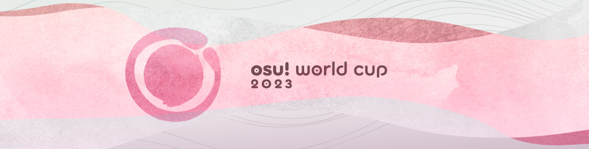
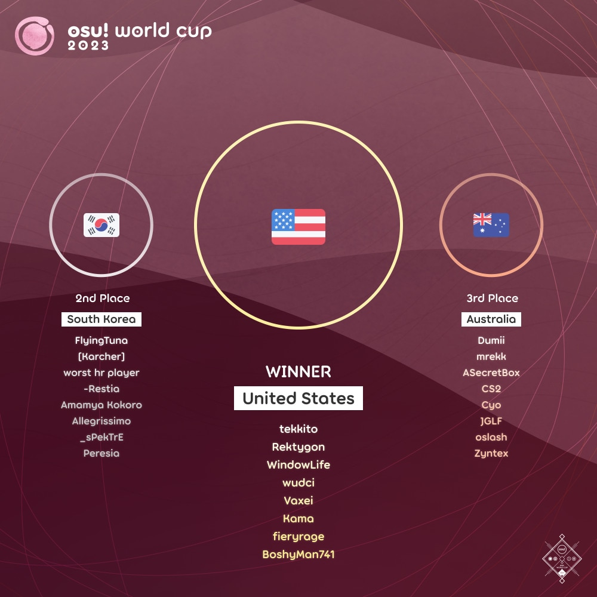

---
tags:
  - OWC
  - OWC2023
---

# osu! World Cup 2023

The **osu! World Cup 2023** (***OWC 2023***) was a country-based osu! tournament hosted by the [osu! team](/wiki/People/osu!_team). It was the fourteenth instalment of the osu! World Cup.

## Tournament schedule

| Event | Timestamp |
| --: | :-- |
| Registration phase | 2023-09-21/2023-10-05 (23:59 UTC) |
| Qualifier showcase | 2023-10-15 (14:00 UTC) |
| Qualifier stage | 2023-10-21/2023-10-22 |
| Round of 32 | 2023-10-28/2023-10-29 |
| Round of 16 | 2023-11-04/2023-11-05 |
| Quarterfinals | 2023-11-11/2023-11-12 |
| Semifinals | 2023-11-18/2023-11-19 |
| Finals | 2023-11-25/2023-11-26 |
| Grand Finals | 2023-12-02/2023-12-03 |

## Prizes

The osu! World Cup 2023 offered a $10,000 cash prize pool and limited-edition merch.

| Placing | Prizes |
| :-: | :-- |
|  | 48% of the prize pool, single-run merch, profile badge, **osu! Champion** user title for one year |
|  | 32% of the prize pool, single-run merch, profile badge |
|  | 20% of the prize pool, single-run merch, profile badge |

  

## Organisation

The osu! World Cup 2023 was run by the [osu! team](/wiki/People/osu!_team) and various community members.

| Position | Member(s) |
| :-- | :-- |
| Manager | ::{ flag=CA }:: ::Azer::{ user=2155578 }, ::{ flag=US }:: ::ChillierPear::{ user=9501251 }, ::{ flag=BR }:: ::LeoFLT::{ user=3668779 } |
| Mappool selector | ::{ flag=CA }:: ::Azer::{ user=2155578 }, ::{ flag=CA }:: ::chiv::{ user=6701656 }, ::{ flag=BR }:: ::Dada::{ user=9119507 }, ::{ flag=BR }:: ::dasdwqdf::{ user=5403374 }, ::{ flag=US }:: ::Librarian::{ user=10083084 }, ::{ flag=US }:: ::M I L E S::{ user=6036351 }, ::{ flag=SG }:: ::megumic::{ user=7537133 } |
| Mappool quality assurance | ::{ flag=DE }:: ::Mordred::{ user=7265097 },  ::{ flag=HK }:: ::Petal::{ user=7354729 }, ::{ flag=TW }:: ::Shiina Noriko::{ user=1285637 }, ::{ flag=PL }:: ::Zelq::{ user=8953955 } |
| Mappool playtester | ::{ flag=US }:: ::ampy::{ user=4458239 }, ::{ flag=CZ }:: ::Avenito::{ user=7415910 }, ::{ flag=US }:: ::BATBALL::{ user=15173952 }, ::{ flag=US }:: ::ChillierPear::{ user=9501251 }, ::{ flag=CA }:: ::D I O::{ user=3958619 }, ::{ flag=US }:: ::decaten::{ user=5645231 }, ::{ flag=US }:: ::DigitalHypno::{ user=4384207 }, ::{ flag=CA }:: ::El Condor Pasa::{ user=4415285 }, ::{ flag=US }:: ::Fangzy::{ user=4497691 }, ::{ flag=US }:: ::Gabey::{ user=12904237 }, ::{ flag=US }:: ::Jakson::{ user=8788058 }, ::{ flag=US }:: ::Mathyu::{ user=6303313 }, ::{ flag=BR }:: ::Mystia::{ user=4277702 }, ::{ flag=CA }:: ::nanawo::{ user=5426640 }, ::{ flag=RO }:: ::nanoya::{ user=12366071 }, ::{ flag=NL }:: ::niqht::{ user=14390731 }, ::{ flag=KR }:: ::Nopekjk::{ user=4585186 }, ::{ flag=US }:: ::revoh::{ user=8165181 }, ::{ flag=CA }:: ::Saryi::{ user=10051720 }, ::{ flag=HK }:: ::Tsuwagi::{ user=9313951 } |
| Mapper | ::{ flag=TW }:: ::\- AzRaeL \-::{ user=10027577 }, ::{ flag=TR }:: ::\-Kemsyt::{ user=3170401 }, ::{ flag=TW }:: ::9ami::{ user=1499997 }, ::{ flag=UA }:: ::aishiteiru\-::{ user=10566388 }, ::{ flag=GB }:: ::Aistre::{ user=4879380 }, ::{ flag=US }:: ::ajmosca::{ user=19884809 }, ::{ flag=GB }:: ::AJT::{ user=3181083 }, ::{ flag=CA }:: ::alden::{ user=3545323 }, ::{ flag=UA }:: ::allein::{ user=6221637 }, ::{ flag=GB }:: ::Altai::{ user=5745865 }, ::{ flag=FR }:: ::Aragon::{ user=4325837 }, ::{ flag=CN }:: ::Arsalan::{ user=7660383 }, ::{ flag=GB }:: ::CallieCube::{ user=7535045 }, ::{ flag=US }:: ::Camo::{ user=5194391 }, ::{ flag=US }:: ::captin1::{ user=689997 }, ::{ flag=KR }:: ::Cellina::{ user=2490770 }, ::{ flag=HK }:: ::Chaoslitz::{ user=3621552 }, ::{ flag=BR }:: ::Dada::{ user=9119507 }, ::{ flag=BR }:: ::dasdwqdf::{ user=5403374 }, ::{ flag=CA }:: ::Deca::{ user=9088487 }, ::{ flag=JP }:: ::Delis::{ user=1603923 }, ::{ flag=RU }:: ::Djulus::{ user=4960893 }, ::{ flag=KR }:: ::Down::{ user=4694602 }, ::{ flag=CN }:: ::fanzhen0019::{ user=418699 }, ::{ flag=CA }:: ::Feiri::{ user=3214844 }, ::{ flag=RU }:: ::fergas::{ user=3144542 }, ::{ flag=PH }:: ::flake::{ user=7627157 }, ::{ flag=US }:: ::fooders::{ user=7545218 }, ::{ flag=MX }:: ::funny::{ user=8473573 }, ::{ flag=US }:: ::Heroine::{ user=12727076 }, ::{ flag=TW }:: ::Hey lululu::{ user=4086497 }, ::{ flag=GB }:: ::Ishtiaq::{ user=6405262 }, ::{ flag=FR }:: ::IsomirDiAngelo::{ user=7715620 }, ::{ flag=US }:: ::JeZag::{ user=3087506 }, ::{ flag=CA }:: ::jonathanlfj::{ user=270377 }, ::{ flag=CA }:: ::KKipalt::{ user=6889573 }, ::{ flag=GB }:: ::KnightC0re::{ user=7894340 }, ::{ flag=PT }:: ::kowari::{ user=5404892 }, ::{ flag=CA }:: ::ktgster::{ user=53378 }, ::{ flag=FI }:: ::lewski::{ user=4980738 }, ::{ flag=KR }:: ::Luscent::{ user=2688581 }, ::{ flag=BR }:: ::maot::{ user=3914271 }, ::{ flag=AR }:: ::Megafan::{ user=6632605 }, ::{ flag=DK }:: ::melon boy::{ user=3053382 }, ::{ flag=US }:: ::mintIceCream\_::{ user=13221589 }, ::{ flag=RU }:: ::Mirash::{ user=2841009 }, ::{ flag=NZ }:: ::moph::{ user=2233878 }, ::{ flag=DE }:: ::Mordred::{ user=7265097 }, ::{ flag=HK }:: ::Nakano Itsuki::{ user=4600383 }, ::{ flag=RO }:: ::nanoya::{ user=12366071 }, ::{ flag=BR }:: ::Net0::{ user=5099768 }, ::{ flag=RU }:: ::netnesanya::{ user=6017901 }, ::{ flag=US }:: ::nooj::{ user=8271086 }, ::{ flag=TR }:: ::Nymphe::{ user=10507407 }, ::{ flag=HK }:: ::Petal::{ user=7354729 }, ::{ flag=DE }:: ::Pho::{ user=3624692 }, ::{ flag=RU }:: ::piroshki::{ user=7645522 }, ::{ flag=FR }:: ::Raijodo::{ user=13400075 }, ::{ flag=EE }:: ::riot1133::{ user=11877992 }, ::{ flag=US }:: ::Risen::{ user=9652892 }, ::{ flag=SG }:: ::Rtyzen::{ user=2439822 }, ::{ flag=JP }:: ::Satellite::{ user=1661227 }, ::{ flag=ID }:: ::ScubDomino::{ user=8972308 }, ::{ flag=CA }:: ::Serenhaide::{ user=10466315 }, ::{ flag=HK }:: ::seros::{ user=10562853 }, ::{ flag=ID }:: ::Shurelia::{ user=3807986 }, ::{ flag=US }:: ::squirrelpascals::{ user=6151332 }, ::{ flag=CA }:: ::ThunderBird2678::{ user=3388082 }, ::{ flag=US }:: ::toybot::{ user=2848604 }, ::{ flag=IT }:: ::zekk::{ user=9704802 }, ::{ flag=PL }:: ::Zelq::{ user=8953955 } |
| Commentator | ::{ flag=CA }:: ::Azer::{ user=2155578 }, ::{ flag=US }:: ::ChillierPear::{ user=9501251 }, ::{ flag=CA }:: ::D I O::{ user=3958619 }, ::{ flag=GB }:: ::Damarsh::{ user=7465147 }, ::{ flag=US }:: ::Dohland::{ user=5220511 }, ::{ flag=GB }:: ::Doomsday::{ user=18983 }, ::{ flag=US }:: ::fieryrage::{ user=3533958 }, ::{ flag=CA }:: ::I-Flame::{ user=11257542 }, ::{ flag=AU }:: ::Jordan The Bear::{ user=7477458 }, ::{ flag=AU }:: ::Kano::{ user=3036203 }, ::{ flag=AU }:: ::Mavs::{ user=11076938 }, ::{ flag=US }:: ::M I L E S::{ user=6036351 }, ::{ flag=AU }:: ::Monk The Don::{ user=4012086 }, ::{ flag=GB }:: ::SadShiba::{ user=10747626 }, ::{ flag=US }:: ::this1neguy::{ user=1797189 }, ::{ flag=AU }:: ::Vordi::{ user=6659116 } |
| Referee | ::{ flag=FR }:: ::Aidown::{ user=1522146 }, ::{ flag=NL }:: ::Albionthegreat::{ user=9853595 }, ::{ flag=AU }:: ::Fairy Bread::{ user=8306102 }, ::{ flag=BR }:: ::LeoFLT::{ user=3668779 }, ::{ flag=NL }:: ::nik::{ user=10077264 }, ::{ flag=IN }:: ::Speshimen::{ user=7720204 }, ::{ flag=US }:: ::tigereyes144::{ user=6499811 }, ::{ flag=GB }:: ::Yazzehh::{ user=7068973 }, ::{ flag=US }:: ::\[K\]::{ user=16551387 } |
| Statistician | ::{ flag=BR }:: ::LeoFLT::{ user=3668779 }, ::{ flag=FI }:: ::shdewz::{ user=10000899 } |

## Links

- [Information spreadsheet](https://docs.google.com/spreadsheets/d/1kzHae-PAHE7_PLy5L3Nhu97lslRLJoc5T6u-GEW1x6E?rm=minimal)
- [Weekly statistics spreadsheets](https://drive.google.com/drive/folders/1zsYCBrFdX1KU2YaCVBBSVrtoJp39306U)
- [Discussion thread](https://osu.ppy.sh/community/forums/topics/1823846)
- [Livestream](https://www.twitch.tv/osulive)
- [Pick'ems page](https://pickem.hwc.hr/tournaments/130) hosted by ::{ flag=DE }:: ::hallowatcher::{ user=1874761 }
- [Challonge bracket](https://challonge.com/OWC_2023)

## Participants

|  | Country | Members |
| :-: | :-: | :-- |
| ::{ flag=AR }:: | **Argentina** | **::R1cho::{ user=13065919 }**, ::Pipipupu997::{ user=20120615 }, ::Bomilk::{ user=7081596 }, ::Amuro::{ user=7119659 }, ::BTG4::{ user=10659233 }, ::Pein::{ user=2212941 }, ::Kagami::{ user=10459580 }, ::slynna::{ user=10099005 } |
| ::{ flag=AU }:: | **Australia** | **::Dumii::{ user=3068044 }**, ::mrekk::{ user=7562902 }, ::ASecretBox::{ user=7341183 }, ::CS2::{ user=9938943 }, ::Cyo::{ user=8195473 }, ::JGLF::{ user=10665363 }, ::oslash::{ user=13228917 }, ::Zyntex::{ user=11806306 } |
| ::{ flag=AT }:: | **Austria** | **::Nekoyase::{ user=10981997 }**, ::fedoragoose::{ user=2323131 }, ::z9a::{ user=13057699 }, ::z10a::{ user=18153252 }, ::Farmist::{ user=11470408 }, ::Akuma no Tenshi::{ user=21811804 }, ::Alparabel::{ user=8576721 }, ::SmurfQT::{ user=15213508 } |
| ::{ flag=BY }:: | **Belarus** | **::KortezR::{ user=6433474 }**, ::flover1ss::{ user=15803625 }, ::TemaZpro::{ user=5510197 }, ::bern1sh::{ user=17851835 }, ::Vasteri::{ user=14165370 }, ::zaverk::{ user=4566107 }, ::Nuwo::{ user=15406353 }, ::Mudek::{ user=14386534 } |
| ::{ flag=BE }:: | **Belgium** | **::Hanori::{ user=7078544 }**, ::5joshi::{ user=4279650 }, ::Hexikey::{ user=10760701 }, ::Mornis::{ user=6479616 }, ::Ramfie::{ user=17201929 }, ::Meersu::{ user=6311605 }, ::iblue::{ user=9184180 }, ::MetaBee::{ user=3706039 } |
| ::{ flag=BR }:: | **Brazil** | **::Exxotl::{ user=15225729 }**, ::Coreanmaluco::{ user=3149577 }, ::Dafonz::{ user=6667041 }, ::Daf0nz::{ user=14592820 }, ::VitorSkull::{ user=10223298 }, ::zubs::{ user=4253615 }, ::Juh::{ user=10145045 }, ::Lirumin::{ user=15274893 } |
| ::{ flag=KH }:: | **Cambodia** | **::Sambath::{ user=6511038 }**, ::Heli0n\_::{ user=13884057 }, ::YuuSakku::{ user=12696690 }, ::tsp648::{ user=12301296 }, ::iToxicShadow::{ user=9327337 }, ::Ainee::{ user=11208808 } |
| ::{ flag=CA }:: | **Canada** | **::Zylice::{ user=5033077 }**, ::xootynator::{ user=3717598 }, ::rayuii::{ user=6304246 }, ::Stoof::{ user=4916057 }, ::CutPaper::{ user=10975777 }, ::Yip::{ user=5177569 }, ::kurtis-::{ user=5477343 }, ::Vespirit::{ user=5425046 } |
| ::{ flag=CL }:: | **Chile** | **::Intercambing::{ user=2546001 }**, ::Mathi::{ user=5339515 }, ::suntanCTM::{ user=19998548 }, ::Eunha::{ user=7701428 }, ::NO37::{ user=4653583 }, ::tfge::{ user=11207004 }, ::xXChokgamerXx::{ user=7748891 }, ::Gonzah::{ user=12434652 } |
| ::{ flag=CN }:: | **China** | **::lolol235::{ user=6090175 }**, ::lolol234::{ user=5791401 }, ::lolol233::{ user=11375105 }, ::Crystal::{ user=1646397 }, ::My Angel Anzu::{ user=4896825 }, ::z980838928::{ user=1355695 }, ::SurvivorX4::{ user=12585048 }, ::MidC::{ user=20461077 } |
| ::{ flag=CO }:: | **Colombia** | **::Ninther4::{ user=3291562 }**, ::Carlosflow::{ user=11940767 }, ::Okinari::{ user=18373966 }, ::J1x::{ user=9904093 }, ::Schwarze::{ user=12502593 }, ::501312::{ user=11083194 }, ::Yoari::{ user=4160699 }, ::Black Astro::{ user=10510143 } |
| ::{ flag=HR }:: | **Croatia** | **::KarliXon::{ user=9283403 }**, ::DragonCroc::{ user=4334103 }, ::cempresi::{ user=14898728 }, ::Fiilip::{ user=9517052 }, ::Suki::{ user=7289538 }, ::mizto::{ user=13330123 }, ::The Fart Lord::{ user=7912447 } |
| ::{ flag=CZ }:: | **Czechia** | **::Sigmund Fraud::{ user=3198446 }**, ::CutoNaito::{ user=8064649 }, ::Dejvi::{ user=11635349 }, ::LaBron Jayms::{ user=3853840 }, ::Masox::{ user=9422204 }, ::olamin::{ user=9694973 }, ::VilaZ::{ user=5155680 }, ::zabloink::{ user=4605548 } |
| ::{ flag=DK }:: | **Denmark** | **::Polle::{ user=13218204 }**, ::iamVill::{ user=6295380 }, ::cat burger::{ user=11380904 }, ::Zaazus::{ user=9125328 }, ::Marco Poio::{ user=10650901 }, ::mahisuru::{ user=11547643 }, ::Malach::{ user=9364696 }, ::SobuTheOne::{ user=13872272 } |
| ::{ flag=EE }:: | **Estonia** | **::cedru::{ user=10162611 }**, ::makux::{ user=13733307 }, ::Rev0::{ user=10346185 }, ::femcel::{ user=12974032 }, ::Ancenthe::{ user=4479041 }, ::slepingcookiegi::{ user=19911567 }, ::Slay::{ user=7093124 }, ::TommeX::{ user=15860861 } |
| ::{ flag=FI }:: | **Finland** | **::shdewz::{ user=10000899 }**, ::Freezd::{ user=6524603 }, ::Xepei::{ user=11479551 }, ::Dezku::{ user=9505131 }, ::Amasetic::{ user=11375251 }, ::AllyrD::{ user=9561644 }, ::Kalanluu::{ user=2035254 }, ::Nev-::{ user=11836334 } |
| ::{ flag=FR }:: | **France** | **::Musty::{ user=251683 }**, ::FlasTEH::{ user=8443945 }, ::Ekoro::{ user=284905 }, ::CharleLee::{ user=10434787 }, ::Fiaee::{ user=10325072 }, ::flaven::{ user=3213239 }, ::MBAPPEEEEEEEEEE::{ user=7657831 }, ::Hifkil::{ user=4301976 } |
| ::{ flag=DE }:: | **Germany** | **::criller::{ user=8116659 }**, ::BlackDog5::{ user=4504101 }, ::okinamo::{ user=3765989 }, ::akarinya::{ user=14385814 }, ::yary::{ user=13300203 }, ::aimbotcone::{ user=12952320 }, ::ZeitFrost::{ user=11234706 }, ::Shiox::{ user=11921197 } |
| ::{ flag=HK }:: | **Hong Kong** | **::shion::{ user=10829419 }**, ::mcy4::{ user=2165650 }, ::A21::{ user=11198996 }, ::Tommy315::{ user=10748631 }, ::F2X::{ user=16227745 }, ::maxbireo::{ user=4682646 }, ::Zoomeree::{ user=18802561 }, ::Hibiki::{ user=5413624 } |
| ::{ flag=HU }:: | **Hungary** | **::Lexion::{ user=5271371 }**, ::defii::{ user=8698024 }, ::Stenkyke::{ user=8110269 }, ::gecseboti::{ user=15213139 }, ::Glasswave::{ user=5442931 }, ::Gamanoid::{ user=7668715 }, ::Indicolite::{ user=19309181 }, ::blackpoint675::{ user=10714308 } |
| ::{ flag=IN }:: | **India** | **::\_Cyan::{ user=10250612 }**, ::GENDER BLENDER::{ user=1788022 }, ::BruhMoment::{ user=12322135 }, ::Hakamora::{ user=10674817 }, ::Skinfreek::{ user=16005022 }, ::tin::{ user=10410165 } |
| ::{ flag=ID }:: | **Indonesia** | **::rHO::{ user=1629553 }**, ::lifeline::{ user=11367222 }, ::Hakui Koyori::{ user=10717635 }, ::NazunaAmemiya::{ user=12159899 }, ::Skydiver::{ user=4750008 }, ::ThatNOOBguy::{ user=11091594 }, ::DEETO::{ user=10069909 }, ::Rosemi Lovelock::{ user=1987591 } |
| ::{ flag=IL }:: | **Israel** | **::MrPotato::{ user=2787415 }**, ::PaintedKoala::{ user=10056419 }, ::cihp::{ user=12083446 }, ::Galog::{ user=7799629 }, ::Clash Royale::{ user=12713821 }, ::CIash of Clans::{ user=16048250 }, ::Ditch\_::{ user=21196745 }, ::Accelerator::{ user=10822717 } |
| ::{ flag=IT }:: | **Italy** | **::Ryuzaki::{ user=7165477 }**, ::Arancino::{ user=11749789 }, ::bgm16::{ user=11476143 }, ::chihuahua::{ user=11215030 }, ::giulio::{ user=11409111 }, ::kariya wakana::{ user=19236903 }, ::kiirochii::{ user=6387149 }, ::shadow modico::{ user=12790479 } |
| ::{ flag=JP }:: | **Japan** | **::rollpan::{ user=3062998 }**, ::Aotoleen::{ user=3162741 }, ::Invoker::{ user=5326197 }, ::KonKonKinakoN::{ user=4733185 }, ::R10sh1::{ user=17202789 }, ::Rikuima::{ user=14035920 }, ::Teacchyyy::{ user=7178423 }, ::Varvalian::{ user=3345902 } |
| ::{ flag=KZ }:: | **Kazakhstan** | **::Plombire::{ user=15656399 }**, ::Kamensh1k::{ user=16817965 }, ::Ravexi::{ user=14438574 }, ::nejzha::{ user=8105138 }, ::Ternafis::{ user=9921139 }, ::Akira::{ user=1330619 }, ::Schastye::{ user=17066686 }, ::adia::{ user=17166609 } |
| ::{ flag=LV }:: | **Latvia** | **::waywern2012::{ user=5870453 }**, ::hihihaha142::{ user=21653406 }, ::nbob::{ user=11538636 }, ::Murzikk::{ user=12000193 }, ::UselessJohn::{ user=10902307 }, ::AkitoshisNormal::{ user=12070555 }, ::Piparkuucinsh::{ user=7453024 } |
| ::{ flag=LT }:: | **Lithuania** | **::ZdefLT::{ user=9455803 }**, ::ssubinism::{ user=16329318 }, ::CamperLt::{ user=4582149 }, ::scarfz::{ user=10290012 }, ::NiZY::{ user=10891105 }, ::Recvee::{ user=9498216 }, ::Imuya::{ user=12029639 }, ::MrCookis::{ user=14672586 } |
| ::{ flag=MY }:: | **Malaysia** | **::Chiyuu::{ user=8226107 }**, ::Rampax::{ user=3995630 }, ::Lunasa::{ user=16436446 }, ::Chibi Maruko::{ user=5585377 }, ::Ecoelementt::{ user=15271985 }, ::Auxuelus::{ user=5414124 }, ::Sagisawa Arisu::{ user=9364594 }, ::Tzero::{ user=6088976 } |
| ::{ flag=MX }:: | **Mexico** | **::-Wolfy-::{ user=4497582 }**, ::Alfrah::{ user=10567112 }, ::Camberos::{ user=2553519 }, ::Riot::{ user=4256461 }, ::SaintSFT::{ user=14970132 }, ::Siros::{ user=3787685 }, ::tonaltwister::{ user=14494895 }, ::XxDreamzxX::{ user=18903701 } |
| ::{ flag=MN }:: | **Mongolia** | **::seegii::{ user=4659319 }**, ::Rumit::{ user=12148238 }, ::tuudug-::{ user=5145352 }, ::murun\_::{ user=10919861 }, ::IMM0::{ user=9555371 }, ::Nukeeowo::{ user=13708631 } |
| ::{ flag=NL }:: | **Netherlands** | **::Lilily::{ user=6502403 }**, ::luciano::{ user=11604978 }, ::Manievat::{ user=6744123 }, ::Aheo::{ user=14919428 }, ::Kushper::{ user=4832514 }, ::UC2::{ user=6989615 }, ::wessel\_osu2::{ user=4382220 }, ::Taylan\_::{ user=16395194 } |
| ::{ flag=NZ }:: | **New Zealand** | **::buffcorreII::{ user=11141578 }**, ::Zoomer::{ user=6600930 }, ::Saiyku::{ user=13767572 }, ::Kim Suhye::{ user=15293080 }, ::its going up::{ user=7731995 }, ::Ozzy265::{ user=23179637 }, ::shortpotato::{ user=1266102 }, ::kit-::{ user=10981171 } |
| ::{ flag=NO }:: | **Norway** | **::YokesPai::{ user=6399568 }**, ::-GN::{ user=895581 }, ::amae koromo::{ user=6888972 }, ::antonyw::{ user=12959983 }, ::Melvr::{ user=9211924 }, ::ninerik::{ user=10549880 }, ::papercandle::{ user=12353810 }, ::Pinguinzi::{ user=9414229 } |
| ::{ flag=PA }:: | **Panama** | **::Counter Strike::{ user=5136821 }**, ::Ramon 2::{ user=11562243 }, ::raetia::{ user=6033536 }, ::Daniel11PTY::{ user=16535905 }, ::Bakiii::{ user=6790430 }, ::Sirny::{ user=18962732 }, ::ne0craft::{ user=17545095 } |
| ::{ flag=PH }:: | **Philippines** | **::enri::{ user=8640970 }**, ::hyeok2044::{ user=8472976 }, ::NathanRam1918::{ user=4734703 }, ::Xyloz::{ user=12040280 }, ::Milkteaism::{ user=9642774 }, ::Impowster::{ user=13484596 }, ::Miggie::{ user=12028437 }, ::zonelouise::{ user=1492995 } |
| ::{ flag=PL }:: | **Poland** | **::maliszewski::{ user=12408961 }**, ::gnahus::{ user=12779141 }, ::rafal::{ user=7787629 }, ::Rafis::{ user=2558286 }, ::kasiabarwicka::{ user=13108233 }, ::Bartek22830::{ user=6404027 }, ::Michni::{ user=3543130 }, ::Mastasz::{ user=1876565 } |
| ::{ flag=PT }:: | **Portugal** | **::Just2Gud::{ user=4430263 }**, ::AlfredTheSalmon::{ user=1052349 }, ::Dolphin\_::{ user=14787295 }, ::MakiDonalds::{ user=11610772 }, ::Netizz::{ user=3256745 }, ::QQuaLLe::{ user=2398671 }, ::uatzap::{ user=16509171 }, ::WhiteCar::{ user=8133117 } |
| ::{ flag=RO }:: | **Romania** | **::badeu::{ user=1473890 }**, ::etn::{ user=4581069 }, ::Lucrise::{ user=9719351 }, ::Razei::{ user=10778261 }, ::roliy::{ user=9578404 }, ::HowlPleb::{ user=15995105 }, ::\_Silvian::{ user=8511882 }, ::Chamosiala::{ user=1469892 } |
| ::{ flag=RU }:: | **Russian Federation** | **::Chicony::{ user=5199332 }**, ::-Din-::{ user=7972980 }, ::desuqe::{ user=9712285 }, ::gamer228666::{ user=5981005 }, ::HandsomeMe::{ user=11376152 }, ::Skrowell::{ user=9694263 }, ::Welter::{ user=11552867 }, ::Markrum::{ user=11854446 } |
| ::{ flag=SA }:: | **Saudi Arabia** | **::Zesdash::{ user=5965797 }**, ::axon da gangsta::{ user=7166246 }, ::BIackMouse::{ user=13323488 }, ::EyesNeverOpen::{ user=10170668 }, ::Shadowtrail123::{ user=14165168 }, ::Yukihana Lamy::{ user=12450422 }, ::Equidimensional::{ user=17440191 } |
| ::{ flag=SG }:: | **Singapore** | **::Tebi::{ user=5407620 }**, ::Demonical::{ user=5447609 }, ::Yellow-::{ user=3215487 }, ::GSBlank::{ user=2312106 }, ::qstronaut::{ user=10958852 }, ::Dawnwing::{ user=5144534 }, ::Eagle5324::{ user=11987104 }, ::emilia::{ user=2003326 } |
| ::{ flag=SK }:: | **Slovakia** | **::Tikef::{ user=9149213 }**, ::-YoYo-::{ user=6158076 }, ::Dugyy::{ user=23303515 }, ::FlipRop::{ user=10806437 }, ::Hranolka::{ user=6149947 }, ::My Angel Eris::{ user=11195133 }, ::Roni484::{ user=4907760 }, ::TeraKrono::{ user=8067943 } |
| ::{ flag=ZA }:: | **South Africa** | **::Frostwizard::{ user=6764293 }**, ::\[Widow\]::{ user=15077398 }, ::iryl::{ user=13016277 }, ::Mattay::{ user=9748303 }, ::W1lde::{ user=17900906 }, ::WhiteAfrican::{ user=13122754 } |
| ::{ flag=KR }:: | **South Korea** | **::FlyingTuna::{ user=9224078 }**, ::\[Karcher\]::{ user=11443437 }, ::worst hr player::{ user=14106450 }, ::-Restia::{ user=7892320 }, ::Amamya Kokoro::{ user=2511839 }, ::Allegrissimo::{ user=9052194 }, ::\_sPekTrE::{ user=11129034 }, ::Peresia::{ user=7027766 } |
| ::{ flag=ES }:: | **Spain** | **::Margo::{ user=6995685 }**, ::M A N O L O::{ user=12296128 }, ::My Angel Bawe::{ user=12975612 }, ::NHarmonia::{ user=9582556 }, ::zZ CreatorGD Zz::{ user=13962152 }, ::A L E P H::{ user=6735738 }, ::A N T O N I O::{ user=12760743 }, ::aokana::{ user=6216284 } |
| ::{ flag=SE }:: | **Sweden** | **::scylla::{ user=9405745 }**, ::Reedkatt::{ user=8335950 }, ::Andros::{ user=9072586 }, ::Zpinxx::{ user=9818947 }, ::Jageko::{ user=5798349 }, ::Fejlan::{ user=8150535 }, ::Grippeh::{ user=11749569 }, ::TOnyrino::{ user=7338010 } |
| ::{ flag=CH }:: | **Switzerland** | **::-Spartan::{ user=5783061 }**, ::\_Shroob::{ user=14349902 }, ::Akani::{ user=2323137 }, ::Mebura::{ user=15324900 }, ::Rivella green::{ user=16829517 }, ::Schoki::{ user=13260523 } |
| ::{ flag=TW }:: | **Taiwan** | **::\_Fast::{ user=959763 }**, ::\_Slow::{ user=1860489 }, ::Rizer::{ user=5155973 }, ::willy0214::{ user=8660293 }, ::Shirosora::{ user=10613549 }, ::TomoChen::{ user=7869036 }, ::Diaostrophism::{ user=2317789 }, ::Spinesnight::{ user=4519494 } |
| ::{ flag=TH }:: | **Thailand** | **::Lesperry::{ user=18092331 }**, ::-Kedama::{ user=12147277 }, ::minecrafter::{ user=9389213 }, ::chests::{ user=14806365 }, ::Deppyforce::{ user=5286213 }, ::\_Arigato::{ user=9317938 }, ::\[ Freeze \]::{ user=15296720 }, ::\[ Master \]::{ user=12130906 } |
| ::{ flag=TR }:: | **Turkey** | **::Raikouhou::{ user=8007528 }**, ::Shinkiro::{ user=6093148 }, ::gilraen::{ user=9256771 }, ::Clutchx::{ user=14958380 }, ::Mikatsu::{ user=6612642 }, ::LyeRR::{ user=13068741 }, ::Orkay::{ user=9321674 }, ::Ievi-::{ user=14684430 } |
| ::{ flag=UA }:: | **Ukraine** | **::magnatagamer123::{ user=7587763 }**, ::dench::{ user=10073635 }, ::POMAH::{ user=11794209 }, ::o\_q::{ user=16139008 }, ::P0MAH::{ user=8274648 }, ::RafGPio::{ user=13705417 }, ::Unavel::{ user=18781432 }, ::TAPAC::{ user=10394538 } |
| ::{ flag=AE }:: | **United Arab Emirates** | **::Ailes Grises::{ user=10916561 }**, ::Finzu\_::{ user=15818398 }, ::FGChamp::{ user=12637617 }, ::-aico::{ user=18371932 }, ::aim1trick::{ user=18441629 }, ::-Lifeless::{ user=12420896 }, ::\_leif::{ user=10517248 } |
| ::{ flag=GB }:: | **United Kingdom** | **::Bubbleman::{ user=5182050 }**, ::Accolibed::{ user=9269034 }, ::rudj::{ user=11592896 }, ::EZChamp::{ user=1719471 }, ::Malteser::{ user=5218178 }, ::Kingling::{ user=7010761 }, ::haunte::{ user=7333471 }, ::Ophiz::{ user=6671641 } |
| ::{ flag=US }:: | **United States** | **::tekkito::{ user=7075211 }**, ::Rektygon::{ user=7813296 }, ::WindowLife::{ user=4108547 }, ::wudci::{ user=2590257 }, ::Vaxei::{ user=4787150 }, ::cheetoblast::{ user=13380270 }, ::fieryrage::{ user=3533958 }, ::BoshyMan741::{ user=4830687 } |
| ::{ flag=UY }:: | **Uruguay** | **::daanit::{ user=6159669 }**, ::-PloX::{ user=6404583 }, ::Rebo::{ user=6942259 }, ::Kazuki K::{ user=6407282 }, ::Shikke::{ user=5382216 }, ::El Milanga::{ user=12264918 } |
| ::{ flag=VN }:: | **Vietnam** | **::realshin::{ user=8006029 }**, ::Another Guy::{ user=4540667 }, ::baoo::{ user=11021073 }, ::Phan Dinh Tung::{ user=12130373 }, ::Tonnisdk::{ user=10890712 }, ::\[Boy\]DaLat::{ user=8266808 }, ::Hoaq::{ user=7696512 }, ::walle::{ user=8431549 } |

Captains are listed in **bold**.

The complete sign-up list can be found [here](https://gist.github.com/LeoFLT/82ef0eafde713e954f68a54e2fc161aa#file-owc-2023-player-list-csv).

## Podium

## Mappools

### Grand Finals

**[Download the mappack here (188 MB)](https://packs.ppy.sh/P231%20-%20osu!%20World%20Cup%202023%3A%20Grand%20Finals.zip)**

- No Mod
  1. [KISIDA KYODAN & THE AKEBOSI ROCKETS - Hack&Slash (SkyFlame) \[-Kirigiri&SkyFlame's Cutting Edge\]](https://osu.ppy.sh/beatmapsets/2095112#osu/4392947)
  2. [Lime - Pixel Planet (Strategas) \[Ultra\]](https://osu.ppy.sh/beatmapsets/2095123#osu/4392960)
  3. [sabi - true DJ MAG top ranker's song Zenpen (katagiri Remix) (Nathan) \[KEMOMIMI EDM SQUAD\]](https://osu.ppy.sh/beatmapsets/1357624#osu/2809623)
  4. [ZxNX - Fana (Altai) \[Annihilation\]](https://osu.ppy.sh/beatmapsets/2095138#osu/4392977)
  5. [BilliumMoto - Amethyst Aurora (fanzhen0019) \[Feather Flash\]](https://osu.ppy.sh/beatmapsets/2095140#osu/4392985)
- Hidden
  1. [Ling tosite sigure - Akai Yuuwaku (aishiteiru-) \[otshelnik\]](https://osu.ppy.sh/beatmapsets/2095114#osu/4392949)
  2. [Isekai Joucho - Replica (Raijodo) \[tkfkdgo\]](https://osu.ppy.sh/beatmapsets/2095125#osu/4392963)
  3. [litmus\* vs Ester - Requiem for the Aura (9ami) \[Az & 9ami's Soul Rhapsody\]](https://osu.ppy.sh/beatmapsets/2095119#osu/4392955)
- Hard Rock
  1. [Aether - Lunate Elf (Djulus) \[Extra Stage\]](https://osu.ppy.sh/beatmapsets/2095121#osu/4392958)
  2. [Dormir - Cookie Bouquets (dsco) \[Wonderland\]](https://osu.ppy.sh/beatmapsets/675125#osu/1428309)
  3. [LV.4 - Burning Star (ktgster) \[Burn Out\]](https://osu.ppy.sh/beatmapsets/2095154#osu/4393036)
- Double Time
  1. [liz triangle - Necrogicalize (Aragon) \[dwaeji bulgogi collab\]](https://osu.ppy.sh/beatmapsets/2095128#osu/4392966)
  2. [SHO - Maiden in the Cage (zekk) \[Lunatic\]](https://osu.ppy.sh/beatmapsets/2095160#osu/4393043)
  3. [IA feat. Kagamine Rin - Super Nuko World (kowari) \[Extra\]](https://osu.ppy.sh/beatmapsets/2095163#osu/4393047)
  4. [Lily - Scarlet Rose (val0108) \[0108 style\]](https://osu.ppy.sh/beatmapsets/41686#osu/131564)
- Free Mod
  1. [Noah - Necrofantasia (Camo) \[Extra Stage\]](https://osu.ppy.sh/beatmapsets/2095157#osu/4393040)
  2. [Kommisar - AKARI BEAM CANNON LAST BOSS (Serenhaide) \[TEMPORAL BLAST\]](https://osu.ppy.sh/beatmapsets/2095159#osu/4393042)
  3. [Cranky - R176 (AJT) \[Easy\]](https://osu.ppy.sh/beatmapsets/2095168#osu/4393055)
  4. [Denkishiki Karen Ongaku Shuudan - E.E.L.S. (IsomirDiAngelo) \[Consumed\]](https://osu.ppy.sh/beatmapsets/2095134#osu/4392973)
- Tiebreaker
  1. **[Release Hallucination - Vanitas (Mordred) \[The Silent Lament of Broken Wings\]](https://osu.ppy.sh/beatmapsets/2095177#osu/4393066)**

### Finals

**[Download the mappack here (143 MB)](https://packs.ppy.sh/P230%20-%20osu!%20World%20Cup%202023%3A%20Finals.zip)**

- No Mod
  1. [A.SAKA - KAGUTSUCHI (Nymphe) \[Blossom\]](https://osu.ppy.sh/beatmapsets/2091775#osu/4384629)
  2. [orangentle / Yu\_Asahina - OEFHEBEN (Camo) \[Furioso\]](https://osu.ppy.sh/beatmapsets/2091787#osu/4384665)
  3. [Nanahoshi Kangengakudan feat. Hatsune Miku - No.39 (Petal) \[No.01\]](https://osu.ppy.sh/beatmapsets/2091778#osu/4384633)
  4. [sanmal - Mind Chase (Ishtiaq) \[tourney ver.\]](https://osu.ppy.sh/beatmapsets/2091780#osu/4384637)
  5. [Coaltar Of The Deepers - dl++\[Delatetei\] - Sadesper Record Mix (Mirash) \[deliszewski & Meramirash ft. azer8 Collab Mix\]](https://osu.ppy.sh/beatmapsets/2091742#osu/4384562)
- Hidden
  1. [wowaka - Toosenbo feat. Hatsune Miku (fooders) \[funny & fooders' Blind Obsession\]](https://osu.ppy.sh/beatmapsets/2091790#osu/4384671)
  2. [nui - Mayday (sukii) \[Senseless\]](https://osu.ppy.sh/beatmapsets/2044442#osu/4267100)
  3. [Capchii - Tiny Fate (captin1) \[extra\]](https://osu.ppy.sh/beatmapsets/2091791#osu/4384672)
- Hard Rock
  1. [Falcom Sound Team jdk feat. Sasaka Megumi - CRIMSON SiN (jonathanlfj) \[RESeT\]](https://osu.ppy.sh/beatmapsets/2091779#osu/4384635)
  2. [Okabe Keiichi - MONACA - Ammobium (lewski) \[Mankai\]](https://osu.ppy.sh/beatmapsets/2091798#osu/4384680)
  3. [Aoi - Quartzshaper (mintIceCream\_) \[Snow White\]](https://osu.ppy.sh/beatmapsets/2091789#osu/4384670)
- Double Time
  1. [FELT - Puppet in the Dark (Mackenzie) \[Out Of Place ARTifactS\]](https://osu.ppy.sh/beatmapsets/326636#osu/725198)
  2. [Mayumi Morinaga - Boutokuteki Sentaku no Alegria (Satellite) \[Alegria\]](https://osu.ppy.sh/beatmapsets/2091805#osu/4384687)
  3. [Marina Inoue - Watashi no Ki-Mo-Chi (dasdwqdf) \[alleinwqdf's Insane\]](https://osu.ppy.sh/beatmapsets/2091807#osu/4384690)
  4. [Susumu Hirasawa - SWITCHED-ON LOTUS (Starrodkirby86) \[KIRBY Mix Deluxe\]](https://osu.ppy.sh/beatmapsets/16457#osu/58970)
- Free Mod
  1. [RAISE A SUILEN - HELL! or HELL? (Strategas) \[RAS\]](https://osu.ppy.sh/beatmapsets/1251944#osu/2602090)
  2. [Rohi - Gllensista (Feiri) \[Collab Legend\]](https://osu.ppy.sh/beatmapsets/2091797#osu/4384679)
  3. [Sound piercer "Espitz" - NOVO HORIZONTE (Megafan) \[IRMAOS\]](https://osu.ppy.sh/beatmapsets/2091818#osu/4384706)
  4. [xi - FREEDOM DiVE (Nakagawa-Kanon) \[FOUR DIMENSIONS\]](https://osu.ppy.sh/beatmapsets/39804#osu/129891)
- Tiebreaker
  1. **[Revo - Chihei o Kurau Hebi (Bazz B) \[Ouroboros\]](https://osu.ppy.sh/beatmapsets/1629695#osu/3326839)**

### Semifinals

**[Download the mappack here (179 MB)](https://packs.ppy.sh/P229%20-%20osu!%20World%20Cup%202023%3A%20Semifinals.zip)**

- No Mod
  1. [SymaG - Fuckin' Friday (melon boy) \[REAL\]](https://osu.ppy.sh/beatmapsets/2088552#osu/4376786)
  2. [kamome sano - tarte tatin (-PC) \[reine des reinettes\]](https://osu.ppy.sh/beatmapsets/849903#osu/1777067)
  3. [seleP feat. Lily - Sara (ajmosca) \[Bloody Rose\]](https://osu.ppy.sh/beatmapsets/2088549#osu/4376782)
  4. [Magnetude - Valhalla (Cut Ver.) (nooj) \[Olaf, the Berserker\]](https://osu.ppy.sh/beatmapsets/2088555#osu/4376790)
  5. [Nekrogoblikon - The Skin Thief (LMT) \[Murder\]](https://osu.ppy.sh/beatmapsets/1061535#osu/2222880)
- Hidden
  1. [Sephid - Epistrofi (Mattay) \[Extreme\]](https://osu.ppy.sh/beatmapsets/1572038#osu/3209907)
  2. [IOSYS - Hinarin no Yakui Kankei (Edit ver.) (Luscent) \[Kuru-kurunatic\]](https://osu.ppy.sh/beatmapsets/2088431#osu/4376532)
  3. [Sorry about my face - The last straw (fergas) \[Splinter of destiny\]](https://osu.ppy.sh/beatmapsets/2088563#osu/4376803)
- Hard Rock
  1. [Harusaruhi - Ibasho (captin1) \[Breakthough\]](https://osu.ppy.sh/beatmapsets/2088564#osu/4376804)
  2. [Toru Kawai - The Magician's Dream (KnightC0re) \[My Grand Illusion\]](https://osu.ppy.sh/beatmapsets/2088436#osu/4376547)
  3. [xi - Blue Zenith (Asphyxia) \[FOUR DIMENSIONS\]](https://osu.ppy.sh/beatmapsets/292301#osu/658127)
- Double Time
  1. [isekaijoucho - Promise in the Twilight (ThunderBird2678) \[Tomorrow\]](https://osu.ppy.sh/beatmapsets/2088554#osu/4376789)
  2. [SOUND HOLIC - break through the night (Net0) \[Stage 6  \~ Tenkyuu Chimata\]](https://osu.ppy.sh/beatmapsets/2088553#osu/4376788)
  3. [Nekomata Master - Far east nightbird (kors k Remix) (jonathanlfj) \[RLC's Extra\]](https://osu.ppy.sh/beatmapsets/144171#osu/358273)
  4. [Tsunku & Masami Yone - Kero Kero SAX (Sushi971) \[Insane\]](https://osu.ppy.sh/beatmapsets/12221#osu/46083)
- Free Mod
  1. [Dark PHOENiX - Taketori Hishou (cotton\_123) \[Lunatic Princess\]](https://osu.ppy.sh/beatmapsets/1893810#osu/3902585)
  2. [Kano - Nadamesukashi Negotiation (flake) \[Trade Offer!\]](https://osu.ppy.sh/beatmapsets/2088310#osu/4376248)
  3. [Yousei Teikoku - Zetsu (IsomirDiAngelo) \[LMT's Extra\]](https://osu.ppy.sh/beatmapsets/1262446#osu/2929650)
  4. [kors k - SigSig (AJT) \[Yokes' Hidden Expert\]](https://osu.ppy.sh/beatmapsets/1615650#osu/3298593)
- Tiebreaker
  1. **[polysha - Endverse (captin1) \[Encore\]](https://osu.ppy.sh/beatmapsets/2088576#osu/4376830)**

### Quarterfinals

**[Download the mappack here (155 MB)](https://packs.ppy.sh/P228%20-%20osu!%20World%20Cup%202023%3A%20Quarterfinals.zip)**

- No Mod
  1. [Powerwolf - Sermon of Swords (piroshki) \[Pilgrims of Dark\]](https://osu.ppy.sh/beatmapsets/2085330#osu/4368595)
  2. [tsunamix\_underground - Period. \~ Seishin no Kousoku to Jiyuu o Tsukamu Jouka (Cut Ver.) (bob) \[hidden extra.\]](https://osu.ppy.sh/beatmapsets/1594769#osu/3257371)
  3. [Sydosys - Wandered (alden) \[Sidetracked\]](https://osu.ppy.sh/beatmapsets/2085296#osu/4368472)
  4. [MYUKKE. - Mach Roger (Pho) \[Maharaja\]](https://osu.ppy.sh/beatmapsets/2085335#osu/4368604)
  5. [Psychedelic Porn Crumpets - Marmalade March (squirrelpascals) \[Ex\]](https://osu.ppy.sh/beatmapsets/2085336#osu/4368607)
- Hidden
  1. [youman feat. GUMI - Weenywalker (funny) \[holy flip dude\]](https://osu.ppy.sh/beatmapsets/2085331#osu/4368596)
  2. [BUTAOTOME - Street Journal (Djulus) \[Extra\]](https://osu.ppy.sh/beatmapsets/2085341#osu/4368631)
  3. [yuikonnu - Taifuu Ikka? Risan (toybot) \[I NEED YOU\]](https://osu.ppy.sh/beatmapsets/2085338#osu/4368609)
- Hard Rock
  1. [Igorrr & Ruby My Dear - Figue Folle (Altai) \[Inanition\]](https://osu.ppy.sh/beatmapsets/2085134#osu/4368093)
  2. [Utsu-P feat. Hatsune Miku - B-CLASS HEROES (Net0) \[Kegare\]](https://osu.ppy.sh/beatmapsets/2085200#osu/4368253)
  3. [lapix - Horizon Blue feat. Kanata.N (Mir) \[Endless Expanse\]](https://osu.ppy.sh/beatmapsets/974832#osu/2040486)
- Double Time
  1. [Yousei Teikoku - Wahrheit (Saten) \[Saten\]](https://osu.ppy.sh/beatmapsets/53923#osu/164183)
  2. [Umeri - paranoia (Aistre) \[farewell\]](https://osu.ppy.sh/beatmapsets/2085311#osu/4368554)
  3. [Tamura Yukari - Endless Story (maot) \[Insane\]](https://osu.ppy.sh/beatmapsets/2085321#osu/4368580)
  4. [Nekomata Master+ - Spiral2005 (Chaoslitz) \[Superstar\]](https://osu.ppy.sh/beatmapsets/2085344#osu/4368636)
- Free Mod
  1. [Motoki Zakuro - Chiteki Goukansha ver-C (Dada) \[The Detective's Soliloquy\]](https://osu.ppy.sh/beatmapsets/2085316#osu/4368565)
  2. [wowaka - Ura-Omote Lovers feat. Hatsune Miku (gazimal) \[Limitless\]](https://osu.ppy.sh/beatmapsets/1872527#osu/3853099)
  3. [OSTER project - Capriccio of My Mind (7odoa) \[Extra\]](https://osu.ppy.sh/beatmapsets/107475#osu/281632)
  4. [Satoshi Terashima - GO GET'EM (KnightC0re) \[expert\]](https://osu.ppy.sh/beatmapsets/1860990#osu/4158054)
- Tiebreaker
  1. **[Down - Kizan (Down) \[Slayer\]](https://osu.ppy.sh/beatmapsets/2085347#osu/4368642)**

### Round of 16

**[Download the mappack here (99 MB)](https://packs.ppy.sh/P227%20-%20osu!%20World%20Cup%202023%3A%20Round%20of%2016.zip)**

- No Mod
  1. [Nekrogoblikon - Mold (Icekalt) \[A Spider on the Wind\]](https://osu.ppy.sh/beatmapsets/1061153#osu/2221627)
  2. [Mysteka - Jerrybeans (Saika0k1) \[beanboozled\]](https://osu.ppy.sh/beatmapsets/1860553#osu/3825151)
  3. [04 Limited Sazabys - Cycle (moph) \[Liberation\]](https://osu.ppy.sh/beatmapsets/2081928#osu/4360132)
  4. [jun with Alison - SUNKiSS DROP \~jun side\~ (\[Keqing\]) \[please donate for my gacha addiction\]](https://osu.ppy.sh/beatmapsets/1498309#osu/3070802)
- Hidden
  1. [Yousuke Kinoshita - Between Heaven and Earth \[Inferno\] (seros) \[Maddening\]](https://osu.ppy.sh/beatmapsets/2082041#osu/4360360)
  2. [Yousei Teikoku - Tainai Tokei Toshi Orrery (IsomirDiAngelo) \[Kon Kon Kin Kon Kon\]](https://osu.ppy.sh/beatmapsets/2081058#osu/4358041)
- Hard Rock
  1. [Pegboard Nerds x MisterWives - Coffins (NeilPerry) \[Neil x LCFC's Conflux\]](https://osu.ppy.sh/beatmapsets/823272#osu/1725369)
  2. [Pedro Silva - World's End Valentine (Mordred) \[OHOHOHOHOHO!!!!!!!!!!!!\]](https://osu.ppy.sh/beatmapsets/2082048#osu/4360371)
- Double Time
  1. [Motley Croe - Kickstart My Heart (Castagne) \[sasas\]](https://osu.ppy.sh/beatmapsets/1332159#osu/2760226)
  2. [KOTOKO - unfinished (Cellina) \[Sensation\]](https://osu.ppy.sh/beatmapsets/2081896#osu/4360066)
  3. [Yamamoto Mineko - Presea (Shurelia) \[Elmerulia Fryxel\]](https://osu.ppy.sh/beatmapsets/2082024#osu/4360325)
- Free Mod
  1. [Toromaru - Ebb Tide (CallieCube) \[Expert\]](https://osu.ppy.sh/beatmapsets/2082040#osu/4360358)
  2. [Yorushika - Thoughtcrime (Deca) \[Phantom\]](https://osu.ppy.sh/beatmapsets/1676482#osu/3902488)
  3. [sHimaU - Noumen Break (katagiri Remix) (fergas) \[Empendium how not\]](https://osu.ppy.sh/beatmapsets/1964101#osu/4319264)
- Tiebreaker
  1. **[Asriel - Kuroi Hitomi no Majuu (Hey lululu) \[Eternally\]](https://osu.ppy.sh/beatmapsets/2081920#osu/4360113)**

### Round of 32

**[Download the mappack here (161 MB)](https://packs.ppy.sh/P226%20-%20osu%21%20World%20Cup%202023%3A%20Round%20of%2032.zip)**

- No Mod
  1. [Kominami Yasuha - 3355411 (Arsalan) \[1122411\]](https://osu.ppy.sh/beatmapsets/2078743#osu/4352819)
  2. [Camellia - R U Still xxxx? (riot1133) \[planetary decomposition\]](https://osu.ppy.sh/beatmapsets/2078745#osu/4352824)
  3. [frederic - Junkie (elicz1) \[Addiction\]](https://osu.ppy.sh/beatmapsets/2078299#osu/4351786)
  4. [Mitsukiyo - Rolling Beat (too) \[osu!ph Collab Expert\]](https://osu.ppy.sh/beatmapsets/1367155#osu/3332588)
- Hidden
  1. [cygnus - Darkness Parade (KnightC0re) \[Dogura Magura\]](https://osu.ppy.sh/beatmapsets/2078577#osu/4352411)
  2. [Will Stetson - KOALA (Luscent) \[Expert\]](https://osu.ppy.sh/beatmapsets/2078554#osu/4352324)
- Hard Rock
  1. [Akitsuki Fuuka CV:Lynn - Fair wind (Zero\_wind) \[cRyo&xsrs's Extreme\]](https://osu.ppy.sh/beatmapsets/587541#osu/1414172)
  2. [Silentroom - Nhelv (Monarch) \[Extra\]](https://osu.ppy.sh/beatmapsets/731259#osu/2020374)
- Double Time
  1. [senya - Koborezu no Negaigoto (Satellite) \[Satellite\]](https://osu.ppy.sh/beatmapsets/2078730#osu/4352790)
  2. [TWOFIVE - Unlimited R (Dada) \[Genocide Cutter\]](https://osu.ppy.sh/beatmapsets/1867027#osu/3840580)
  3. [Enter Shikari - Wall (Hectic) \[piroshki's Insane\]](https://osu.ppy.sh/beatmapsets/1012220#osu/2149694)
- Free Mod
  1. [storyteller(cosMo x GAiA) feat. IA, Kagamine Rin - Anti the EuphoriaHOLiC (SaltyLucario) \[Extreme\]](https://osu.ppy.sh/beatmapsets/546102#osu/2583501)
  2. [Sore - Setengah Lima (ScubDomino) \[Sudirman, 1998.\]](https://osu.ppy.sh/beatmapsets/2078335#osu/4351866)
  3. [ALI - Dance You, Matilda (Mordred) \[Tonight I Dance to You\]](https://osu.ppy.sh/beatmapsets/2078757#osu/4352856)
- Tiebreaker
  1. **[Lulickma & Loctek - 21st (Megafan) \[10101\]](https://osu.ppy.sh/beatmapsets/1525478#osu/3121101)**

### Qualifiers

**[Download the mappack here (69 MB)](https://packs.ppy.sh/P225%20-%20osu!%20World%20Cup%202023%3A%20Qualifiers.zip)**

- No Mod
  1. [Omoi - Greenlights Serenade (kowari) \[Extreme\]](https://osu.ppy.sh/beatmapsets/2075261#osu/4344435)
  2. [FRASER EDWARDS - Alone (-Kemsyt) \[Legend\]](https://osu.ppy.sh/beatmapsets/2075267#osu/4344451)
  3. [Kabocha feat. Sennzai - Morphobia (Rtyzen) \[Blue Wings\]](https://osu.ppy.sh/beatmapsets/2075262#osu/4344441)
  4. [Zekk - Vespera (Down) \[Twilight\]](https://osu.ppy.sh/beatmapsets/2075263#osu/4344442)
- Hidden
  1. [Yunosuke - GLAZ (Pho) \[LOCK\]](https://osu.ppy.sh/beatmapsets/2075277#osu/4344469)
  2. [SECONDWALL - Natsu no Owari (Zelq) \[Expert feat. Heroine\]](https://osu.ppy.sh/beatmapsets/2075254#osu/4344423)
- Hard Rock
  1. [Nekrogoblikon - Row (Dada) \[woo\]](https://osu.ppy.sh/beatmapsets/2075247#osu/4344412)
  2. [Umeboshi Chazuke - Banana! DX Choco Crepe! (Nakano Itsuki) \[banana\]](https://osu.ppy.sh/beatmapsets/2075266#osu/4344450)
- Double Time
  1. [JOYLESS - Dream (netnesanya) \[garf\]](https://osu.ppy.sh/beatmapsets/2075279#osu/4344474)
  2. [A-One feat. Shihori - Bamboo Dance (nanoya) \[Lunatic\]](https://osu.ppy.sh/beatmapsets/2075280#osu/4344475)
  3. [Sable Hills - Not Falling (squirrelpascals) \[Vid\]](https://osu.ppy.sh/beatmapsets/2075253#osu/4344422)

## Match results

### Grand Finals

Detailed statistics for this round can be found [here](https://docs.google.com/spreadsheets/d/1Ri_80xlG-NsRDevg7wrYwUM6dgMnTqQR82xBd62NDwg?rm=minimal).

Saturday, 2 December 2023:

| Team A |  |  | Team B | Match link | VOD link |
| --: | :-: | :-: | :-- | :-- | :-- |
| Australia ::{ flag=AU }:: | 1 | **7** | ::{ flag=US }:: **United States** | [#1](https://osu.ppy.sh/community/matches/111534249) | [#1](https://www.twitch.tv/videos/1992820454) |

Sunday, 3 December 2023:

| Team A |  |  | Team B | Match link | VOD link |
| --: | :-: | :-: | :-- | :-- | :-- |
| South Korea ::{ flag=KR }:: | 5 | **7** | ::{ flag=US }:: **United States** | [#1](https://osu.ppy.sh/community/matches/111554331) | [#1](https://www.twitch.tv/videos/1993918275) |
| **United States** ::{ flag=US }:: | **7** | 6 | ::{ flag=KR }:: South Korea | [#1](https://osu.ppy.sh/community/matches/111555364) | [#1](https://www.twitch.tv/videos/1993918275?t=01h34m44s) |

### Finals

Detailed statistics for this round can be found [here](https://docs.google.com/spreadsheets/d/1RAGg6zrInGE1ek8o2JLfHvSSqeI4Ad2-SfQ_nD32MH0?rm=minimal).

Saturday, 25 November 2023:

| Team A |  |  | Team B | Match link | VOD link |
| --: | :-: | :-: | :-- | :-- | :-- |
| Canada ::{ flag=CA }:: | 1 | **7** | ::{ flag=DE }:: **Germany** | [#1](https://osu.ppy.sh/community/matches/111451190) | [#1](https://www.twitch.tv/videos/1987233069) |

Sunday, 26 November 2023:

| Team A |  |  | Team B | Match link | VOD link |
| --: | :-: | :-: | :-- | :-- | :-- |
| Philippines ::{ flag=PH }:: | 3 | **7** | ::{ flag=US }:: **United States** | [#1](https://osu.ppy.sh/community/matches/111457054) | [#1](https://www.twitch.tv/videos/1987522035) |
| **South Korea** ::{ flag=KR }:: | **7** | 3 | ::{ flag=AU }:: Australia | [#1](https://osu.ppy.sh/community/matches/111460173) | [#1](https://www.twitch.tv/videos/1987813835) |
| Germany ::{ flag=DE }:: | 1 | **7** | ::{ flag=US }:: **United States** | [#1](https://osu.ppy.sh/community/matches/111466879) | [#1](https://www.twitch.tv/videos/1988064196) |

### Semifinals

Detailed statistics for this round can be found [here](https://docs.google.com/spreadsheets/d/1zCyydxBHoOroim349C-NPnAQLU6FM_vl3rWOTPaXpQ8?rm=minimal).

Saturday, 18 November 2023:

| Team A |  |  | Team B | Match link | VOD link |
| --: | :-: | :-: | :-- | :-- | :-- |
| Russian Federation ::{ flag=RU }:: | 5 | **6** | ::{ flag=DE }:: **Germany** | [#1](https://osu.ppy.sh/community/matches/111349795) | [#1](https://www.twitch.tv/videos/1980749560) |
| **Poland** ::{ flag=PL }:: | **6** | 1 | ::{ flag=CN }:: China | [#1](https://osu.ppy.sh/community/matches/111350765) | [#1](https://www.twitch.tv/videos/1980795633) |
| **United States** ::{ flag=US }:: | **6** | 1 | ::{ flag=SE }:: Sweden | [#1](https://osu.ppy.sh/community/matches/111352735) | [#1](https://www.twitch.tv/videos/1980866139) |
| United Kingdom ::{ flag=GB }:: | 5 | **6** | ::{ flag=CL }:: **Chile** | [#1](https://osu.ppy.sh/community/matches/111356742) | [#1](https://www.twitch.tv/videos/1981279694) |

Sunday, 19 November 2023:

| Team A |  |  | Team B | Match link | VOD link |
| --: | :-: | :-: | :-- | :-- | :-- |
| **Australia** ::{ flag=AU }:: | **6** | 2 | ::{ flag=CA }:: Canada | [#1](https://osu.ppy.sh/community/matches/111360796) | [#1](https://www.twitch.tv/videos/1981315028) |
| **South Korea** ::{ flag=KR }:: | **6** | 4 | ::{ flag=PH }:: Philippines | [#1](https://osu.ppy.sh/community/matches/111366414) | [#1](https://www.twitch.tv/videos/1981662297) |
| **United States** ::{ flag=US }:: | **6** | 2 | ::{ flag=PL }:: Poland | [#1](https://osu.ppy.sh/community/matches/111368903) | [#1](https://www.twitch.tv/videos/1981922459) |
| **Germany** ::{ flag=DE }:: | **6** | 2 | ::{ flag=CL }:: Chile | [#1](https://osu.ppy.sh/community/matches/111372515) | [#1](https://www.twitch.tv/videos/1982002807) |

### Quarterfinals

Detailed statistics for this round can be found [here](https://docs.google.com/spreadsheets/d/17mterPgXUzj4FSRDK4iyzgAkf4sMw-xeWn3YSGAfYS0?rm=minimal).

Saturday, 11 November 2023:

| Team A |  |  | Team B | Match link | VOD link |
| --: | :-: | :-: | :-- | :-- | :-- |
| **Germany** ::{ flag=DE }:: | **6** | 4 | ::{ flag=JP }:: Japan | [#1](https://osu.ppy.sh/community/matches/111253985) | [#1](https://www.twitch.tv/videos/1974541167) |
| Hong Kong ::{ flag=HK }:: | 2 | **6** | ::{ flag=SE }:: **Sweden** | [#1](https://osu.ppy.sh/community/matches/111256134) | [#1](https://www.twitch.tv/videos/1974857501) |
| Italy ::{ flag=IT }:: | 1 | **6** | ::{ flag=ID }:: **Indonesia** | [#1](https://osu.ppy.sh/community/matches/111256976) | [#1](https://www.twitch.tv/videos/1974857501?t=01h03m26s) |
| **China** ::{ flag=CN }:: | **6** | 1 | ::{ flag=NO }:: Norway | [#1](https://osu.ppy.sh/community/matches/111257938) | [#1](https://www.twitch.tv/videos/1974857501?t=01h51m35s) |
| **Ukraine** ::{ flag=UA }:: | **6** | 3 | ::{ flag=TH }:: Thailand | [#1](https://osu.ppy.sh/community/matches/111258934) | [#1](https://www.twitch.tv/videos/1974857501?t=2h36m29s) |
| **Brazil** ::{ flag=BR }:: | **6** | 2 | ::{ flag=SG }:: Singapore | [#1](https://osu.ppy.sh/community/matches/111260018) | [#1](https://www.twitch.tv/videos/1974747670) |
| Romania ::{ flag=RO }:: | 4 | **6** | ::{ flag=FR }:: **France** | [#1](https://osu.ppy.sh/community/matches/111260487) | [#1](https://www.twitch.tv/videos/1974857501?t=03h39m18s) |
| **Chile** ::{ flag=CL }:: | **6** | 0 | ::{ flag=FI }:: Finland | [#1](https://osu.ppy.sh/community/matches/111261974) | [#1](https://www.twitch.tv/videos/1974857501?t=04h54m45s) |
| **Chile** ::{ flag=CL }:: | **6** | 0 | ::{ flag=BR }:: Brazil | [#1](https://osu.ppy.sh/community/matches/111265019) | [#1](https://www.twitch.tv/videos/1974993174) |

Sunday, 12 November 2023:

| Team A |  |  | Team B | Match link | VOD link |
| --: | :-: | :-: | :-- | :-- | :-- |
| Poland ::{ flag=PL }:: | 5 | **6** | ::{ flag=AU }:: **Australia** | [#1](https://osu.ppy.sh/community/matches/111271525) | [#1](https://www.twitch.tv/videos/1975435768) |
| **South Korea** ::{ flag=KR }:: | **6** | 1 | ::{ flag=GB }:: United Kingdom | [#1](https://osu.ppy.sh/community/matches/111272312) | [#1](https://www.twitch.tv/videos/1975477511) |
| **Germany** ::{ flag=DE }:: | **6** | 2 | ::{ flag=ID }:: Indonesia | [#1](https://osu.ppy.sh/community/matches/111273436) | [#1](https://www.twitch.tv/videos/1975518702) |
| Russian Federation ::{ flag=RU }:: | 3 | **6** | ::{ flag=PH }:: **Philippines** | [#1](https://osu.ppy.sh/community/matches/111273441) | [#1](https://www.twitch.tv/videos/1975526145) |
| Ukraine ::{ flag=UA }:: | 2 | **6** | ::{ flag=CN }:: **China** | [#1](https://osu.ppy.sh/community/matches/111274743) | [#1](https://www.twitch.tv/videos/1975578112) |
| France ::{ flag=FR }:: | 4 | **6** | ::{ flag=SE }:: **Sweden** | [#1](https://osu.ppy.sh/community/matches/111276018) | [#1](https://www.twitch.tv/videos/1975667142) |
| United States ::{ flag=US }:: | 1 | **6** | ::{ flag=CA }:: **Canada** | [#1](https://osu.ppy.sh/community/matches/111278789) | [#1](https://www.twitch.tv/videos/1975815592) |

### Round of 16

Detailed statistics for this round can be found [here](https://docs.google.com/spreadsheets/d/1F3sJXGiCSfDCV30ZCe-2kHhxwqsVIBxy18qUoscekTE?rm=minimal).

Friday, 3 November 2023:

| Team A |  |  | Team B | Match link | VOD link |
| --: | :-: | :-: | :-- | :-- | :-- |
| **Philippines** ::{ flag=PH }:: | **5** | 1 | ::{ flag=RO }:: Romania | [#1](https://osu.ppy.sh/community/matches/111152642) | [#1](https://www.twitch.tv/videos/1967584249) |

Saturday, 4 November 2023:

| Team A |  |  | Team B | Match link | VOD link |
| --: | :-: | :-: | :-- | :-- | :-- |
| **Thailand** ::{ flag=TH }:: | **5** | 4 | ::{ flag=NZ }:: New Zealand | [#1](https://osu.ppy.sh/community/matches/111165133) | [#1](https://www.twitch.tv/videos/1968375051) |
| **South Korea** ::{ flag=KR }:: | **5** | 1 | ::{ flag=CN }:: China | [#1](https://osu.ppy.sh/community/matches/111167951) | [#1](https://www.twitch.tv/videos/1968543637) |
| Spain ::{ flag=ES }:: | 0 | **5** | ::{ flag=NO }:: **Norway** | [#1](https://osu.ppy.sh/community/matches/111168903) | [#1](https://www.twitch.tv/videos/1968543637?t=00h47m36s) |
| Netherlands ::{ flag=NL }:: | 0 | **5** | ::{ flag=FI }:: **Finland** | [#1](https://osu.ppy.sh/community/matches/111170809) | [#1](https://www.twitch.tv/videos/1968663146) |
| Argentina ::{ flag=AR }:: | 0 | **5** | ::{ flag=FR }:: **France** | [#1](https://osu.ppy.sh/community/matches/111170821) | [#1](https://www.twitch.tv/videos/1968714286) |
| Germany ::{ flag=DE }:: | 2 | **5** | ::{ flag=CA }:: **Canada** | [#1](https://osu.ppy.sh/community/matches/111171785) | [#1](https://www.twitch.tv/videos/1968714286?t=00h35m49s) |

Sunday, 5 November 2023:

| Team A |  |  | Team B | Match link | VOD link |
| --: | :-: | :-: | :-- | :-- | :-- |
| Mexico ::{ flag=MX }:: | 2 | **5** | ::{ flag=SG }:: **Singapore** | [#1](https://osu.ppy.sh/community/matches/111178942) | [#1](https://www.twitch.tv/videos/1969159761) |
| **Australia** ::{ flag=AU }:: | **5** | 1 | ::{ flag=CL }:: Chile | [#1](https://osu.ppy.sh/community/matches/111178945) | [#1](https://www.twitch.tv/videos/1969154635) |
| Turkey ::{ flag=TR }:: | 1 | **5** | ::{ flag=ID }:: **Indonesia** | [#1](https://osu.ppy.sh/community/matches/111183369) | [#1](https://www.twitch.tv/videos/1969422790) |
| **Russian Federation** ::{ flag=RU }:: | **5** | 1 | ::{ flag=HK }:: Hong Kong | [#1](https://osu.ppy.sh/community/matches/111183363) | [#1](https://www.twitch.tv/videos/1969493249) |
| Taiwan ::{ flag=TW }:: | 3 | **5** | ::{ flag=SE }:: **Sweden** | [#1](https://osu.ppy.sh/community/matches/111183770) | [#1](https://www.twitch.tv/videos/1969422790?t=0h42m5s) |
| Kazakhstan ::{ flag=KZ }:: | 4 | **5** | ::{ flag=JP }:: **Japan** | [#1](https://osu.ppy.sh/community/matches/111184163) | [#1](https://www.twitch.tv/videos/1969493249?t=00h39m32s) |
| **United Kingdom** ::{ flag=GB }:: | **5** | 3 | ::{ flag=UA }:: Ukraine | [#1](https://osu.ppy.sh/community/matches/111184941) | [#1](https://www.twitch.tv/videos/1969493249?t=1h49m24s) |
| **United States** ::{ flag=US }:: | **5** | 1 | ::{ flag=IT }:: Italy | [#1](https://osu.ppy.sh/community/matches/111187488) | [#1](https://www.twitch.tv/videos/1969693540) |
| **Poland** ::{ flag=PL }:: | **5** | 0 | ::{ flag=BR }:: Brazil | [#1](https://osu.ppy.sh/community/matches/111188366) | [#1](https://www.twitch.tv/videos/1969693540?t=0h39m58s) |

### Round of 32

Detailed statistics for this round can be found [here](https://docs.google.com/spreadsheets/d/1dNZJHwjySXZoxzrM-CekqCZqX9P-K5eHeW-QNl-Vwm0?rm=minimal).

Saturday, 28 October 2023:

| Team A |  |  | Team B | Match link | VOD link |
| --: | :-: | :-: | :-- | :-- | :-- |
| **Chile** ::{ flag=CL }:: | **5** | 3 | ::{ flag=SE }:: Sweden | [#1](https://osu.ppy.sh/community/matches/111062319) | [#1](https://www.twitch.tv/videos/1962215601) |
| **United States** ::{ flag=US }:: | **5** | 0 | ::{ flag=TH }:: Thailand | [#1](https://osu.ppy.sh/community/matches/111063878) | [#1](https://www.twitch.tv/videos/1962257068) |
| **Poland** ::{ flag=PL }:: | **5** | 0 | ::{ flag=AR }:: Argentina | [#1](https://osu.ppy.sh/community/matches/111072298) | [#1](https://www.twitch.tv/videos/1962618853) |
| **United Kingdom** ::{ flag=GB }:: | **5** | 3 | ::{ flag=TR }:: Turkey | [#1](https://osu.ppy.sh/community/matches/111073334) | [#1](https://www.twitch.tv/videos/1962709043?t=0h55m18s) |
| France ::{ flag=FR }:: | 2 | **5** | ::{ flag=BR }:: **Brazil** | [#1](https://osu.ppy.sh/community/matches/111073335) | [#1](https://www.twitch.tv/videos/1962709043) |

Sunday, 29 October 2023:

| Team A |  |  | Team B | Match link | VOD link |
| --: | :-: | :-: | :-- | :-- | :-- |
| **Philippines** ::{ flag=PH }:: | **5** | 1 | ::{ flag=MX }:: Mexico | [#1](https://osu.ppy.sh/community/matches/111081251) | [#1](https://www.twitch.tv/videos/1963230645) |
| **Australia** ::{ flag=AU }:: | **5** | 0 | ::{ flag=TW }:: Taiwan | [#1](https://osu.ppy.sh/community/matches/111083508) | [#1](https://www.twitch.tv/videos/1963229994) |
| **Italy** ::{ flag=IT }:: | **5** | 4 | ::{ flag=NZ }:: New Zealand | [#1](https://osu.ppy.sh/community/matches/111083501) | [#1](https://www.twitch.tv/videos/1963413031) |
| Indonesia ::{ flag=ID }:: | 0 | **5** | ::{ flag=UA }:: **Ukraine** | [#1](https://osu.ppy.sh/community/matches/111084580) | [#1](https://www.twitch.tv/videos/1963413031?t=1h5m6s) |
| **South Korea** ::{ flag=KR }:: | **5** | 0 | ::{ flag=KZ }:: Kazakhstan | [#1](https://osu.ppy.sh/community/matches/111085330) | [#1](https://www.twitch.tv/videos/1963413031?t=1h50m22s) |
| **Russian Federation** ::{ flag=RU }:: | **5** | 1 | ::{ flag=NL }:: Netherlands | [#1](https://osu.ppy.sh/community/matches/111085320) |  |
| **Hong Kong** ::{ flag=HK }:: | **5** | 3 | ::{ flag=FI }:: Finland | [#1](https://osu.ppy.sh/community/matches/111085343) | [#1](https://www.twitch.tv/videos/1963390816) |
| **China** ::{ flag=CN }:: | **5** | 4 | ::{ flag=JP }:: Japan | [#1](https://osu.ppy.sh/community/matches/111086282) | [#1](https://www.twitch.tv/videos/1963390816?t=1h1m28s) |
| **Romania** ::{ flag=RO }:: | **5** | 4 | ::{ flag=SG }:: Singapore | [#1](https://osu.ppy.sh/community/matches/111086205) | [#1](https://www.twitch.tv/videos/1963413031?t=2h31m42s) |
| **Germany** ::{ flag=DE }:: | **5** | 0 | ::{ flag=ES }:: Spain | [#1](https://osu.ppy.sh/community/matches/111087337) | [#1](https://www.twitch.tv/videos/1963413031?t=3h46m9s) |
| **Canada** ::{ flag=CA }:: | **5** | 1 | ::{ flag=NO }:: Norway | [#1](https://osu.ppy.sh/community/matches/111091065) | [#1](https://www.twitch.tv/videos/1963586869) |

### Qualifiers

The final standings for the Qualifier stage can be found in the following [spreadsheet](https://docs.google.com/spreadsheets/d/1iih6qvAYpCakmdZcnFoB_XGxBm4WDBYNNeo-81PcKGc?rm=minimal).

| Seed | Country | %MAX sum[^qualifiers-seeding] | avg. score[^qualifiers-tiebreaker] |
| :-: | :-- | --: | --: |
| #1 | ::{ flag=KR }:: South Korea | 10.341 | 3,459,368 |
| #2 | ::{ flag=PL }:: Poland | 10.330 | 3,461,296 |
| #3 | ::{ flag=US }:: United States | 10.166 | 3,394,857 |
| #4 | ::{ flag=RU }:: Russian Federation | 9.552 | 3,201,004 |
| #5 | ::{ flag=PH }:: Philippines | 9.416 | 3,159,424 |
| #6 | ::{ flag=DE }:: Germany | 9.386 | 3,145,592 |
| #7 | ::{ flag=AU }:: Australia | 9.272 | 3,130,240 |
| #8 | ::{ flag=GB }:: United Kingdom | 8.936 | 2,958,103 |
| #9 | ::{ flag=ID }:: Indonesia | 8.916 | 2,981,512 |
| #10 | ::{ flag=CL }:: Chile | 8.721 | 2,938,185 |
| #11 | ::{ flag=CA }:: Canada | 8.635 | 2,900,683 |
| #12 | ::{ flag=RO }:: Romania | 8.496 | 2,851,873 |
| #13 | ::{ flag=HK }:: Hong Kong | 8.401 | 2,822,615 |
| #14 | ::{ flag=IT }:: Italy | 8.248 | 2,796,035 |
| #15 | ::{ flag=FR }:: France | 8.105 | 2,710,515 |
| #16 | ::{ flag=CN }:: China | 8.048 | 2,677,555 |
| #17 | ::{ flag=JP }:: Japan | 7.801 | 2,621,866 |
| #18 | ::{ flag=BR }:: Brazil | 7.653 | 2,574,445 |
| #19 | ::{ flag=NZ }:: New Zealand | 7.599 | 2,558,399 |
| #20 | ::{ flag=FI }:: Finland | 7.356 | 2,471,287 |
| #21 | ::{ flag=SG }:: Singapore | 7.303 | 2,432,193 |
| #22 | ::{ flag=NO }:: Norway | 7.193 | 2,403,118 |
| #23 | ::{ flag=SE }:: Sweden | 7.158 | 2,435,093 |
| #24 | ::{ flag=UA }:: Ukraine | 7.107 | 2,397,044 |
| #25 | ::{ flag=TR }:: Turkey | 6.982 | 2,366,035 |
| #26 | ::{ flag=TW }:: Taiwan | 6.837 | 2,318,130 |
| #27 | ::{ flag=ES }:: Spain | 6.773 | 2,264,142 |
| #28 | ::{ flag=MX }:: Mexico | 6.656 | 2,237,655 |
| #29 | ::{ flag=NL }:: Netherlands | 6.621 | 2,201,197 |
| #30 | ::{ flag=TH }:: Thailand | 6.565 | 2,193,178 |
| #31 | ::{ flag=AR }:: Argentina | 6.309 | 2,140,036 |
| #32 | ::{ flag=KZ }:: Kazakhstan | 6.140 | 2,086,765 |
| #33 | ::{ flag=MY }:: Malaysia | 6.031 | 2,041,506 |
| #34 | ::{ flag=IL }:: Israel | 5.790 | 1,930,594 |
| #35 | ::{ flag=DK }:: Denmark | 5.764 | 1,923,570 |
| #36 | ::{ flag=HU }:: Hungary | 5.618 | 1,906,952 |
| #37 | ::{ flag=BE }:: Belgium | 5.584 | 1,880,677 |
| #38 | ::{ flag=UY }:: Uruguay | 5.515 | 1,873,738 |
| #39 | ::{ flag=PT }:: Portugal | 5.495 | 1,855,838 |
| #40 | ::{ flag=BY }:: Belarus | 5.431 | 1,807,011 |
| #41 | ::{ flag=EE }:: Estonia | 5.180 | 1,744,546 |
| #42 | ::{ flag=VN }:: Vietnam | 5.169 | 1,745,088 |
| #43 | ::{ flag=AT }:: Austria | 5.155 | 1,742,198 |
| #44 | ::{ flag=CZ }:: Czechia | 5.074 | 1,729,518 |
| #45 | ::{ flag=SA }:: Saudi Arabia | 4.967 | 1,668,352 |
| #46 | ::{ flag=LV }:: Latvia | 4.940 | 1,655,513 |
| #47 | ::{ flag=LT }:: Lithuania | 4.558 | 1,537,059 |
| #48 | ::{ flag=KH }:: Cambodia | 4.166 | 1,432,747 |
| #49 | ::{ flag=AE }:: United Arab Emirates | 4.101 | 1,420,705 |
| #50 | ::{ flag=CO }:: Colombia | 4.053 | 1,353,254 |
| #51 | ::{ flag=MN }:: Mongolia | 4.003 | 1,359,885 |
| #52 | ::{ flag=PA }:: Panama | 3.398 | 1,145,791 |
| #53 | ::{ flag=SK }:: Slovakia | 3.362 | 1,114,713 |
| #54 | ::{ flag=ZA }:: South Africa | 3.349 | 1,141,540 |
| #55 | ::{ flag=CH }:: Switzerland | 3.199 | 1,068,495 |
| #56 | ::{ flag=HR }:: Croatia | 2.892 | 969,311 |
| #57 | ::{ flag=IN }:: India | 2.690 | 892,297 |

## Ruleset

### Tournament rules

1. The osu! World Cup is a country-based 4 versus 4 double-elimination team tournament, played on the osu! game mode.
   - Players from countries or territories (as seen on their profile flag) that are under a protectorate or sovereign state may choose to play for that country **if** the country listed on their profile is unable to field enough players to form a valid team. Refer to [this article](https://wikipedia.org/wiki/Dependent_territory#Lists_of_dependent_territories) for an overview of the criteria adopted. Players that have participated under another country previously may continue to do so.
2. Beatmap scoring is based on ScoreV2.
3. The minimum size for a team is 6 players, and the maximum is 8.
4. The mappool for each round will be announced by the mappool selectors on the official stream, on the Sunday before the matches take place.
5. The match schedules for each round will be announced by the tournament managers on this page, as well as the information spreadsheet, on the Sunday before the matches take place.
6. Use of the Visual Settings to alter background dim or disable beatmap elements like storyboards and skins is allowed.
   - Custom skin elements must not be used to alter core gameplay elements or mechanics in unintended ways.
7. If less than the minimum amount of required players are present at match time, the match can be postponed for up to 10 minutes. If after this period there are still not enough players for either team, a *win by default* will be declared for the side with the most members present.
   - The minimum amount of required players is the amount of players needed to play a beatmap without any vacant spots in the lobby (i.e. at least 4 participants from each team must be present for the match to begin).
8. Exchanging players between games is allowed without limitations.
9. If a game ends in a draw, it will be nullified and the beatmap will be replayed.
10. Teams may ask for a rematch if a team member encounters technical issues while playing within 30 seconds or 25% of the beatmap drain length (whichever happens first) of the game's start. Referees may, at their discretion, veto this request.
    - "Lag spikes" are not considered a valid reason to rematch a beatmap.
    - The roster for each team during a rematch must remain the same as the original run. If that is not possible, e.g. by virtue of a technical issue that prevents a player from entering the lobby, both teams will be allowed to swap rosters.
    - This rule is not to be abused. Referees may veto a rematch request if they find that this is the case.
11. If a player disconnects mid-game, their scores will not be counted towards their team's total, unless adequate proof of said score is provided. The following are considered as acceptable proof:
    - Player point-of-view live stream snippets (commonly referred to as "clips" or "VODs"). The entirety of the play, along with the results screen must be clearly visible along with the affected player's score.
    - Replay files of the play, taken directly from the "Local scores" tab on the affected player's client (the timestamps must exactly match the time at which the game took place, as seen on the multiplayer lobby link).
    - Screenshots from other players taken directly in-game that show the affected player's score.
      - Screenshots from the results screen must clearly show the affected player's score. This is the preferred method.
      - Screenshots taken in-game at the time of disconnection may be accepted. Note that this method does not provide a one-to-one representation of that player's score. Using this method is not encouraged and it may be denied at the referee's discretion if the information provided is not sufficient to identify the player/score.
      - All screenshots **MUST** be taken using the game itself (using `Shift` + `F12`), that is, they must be hosted on the `https://osu.ppy.sh/` domain. Any other form of screenshot will be denied.
    - Player scores may be derived from the official stream as a last resort, in cases where the match is streamed.
12. Players are expected to keep the match running fluently and without delays. Excessive match delays from the players' side may result in penalties being applied by the tournament managers. Disrupting the match by foul play, insulting or provoking other players or staff, delaying the match, and other deliberate inappropriate misbehaviour are strictly prohibited, and will be punished accordingly.
13. Any attempts to manipulate bracket outcomes or future matchups may result in the immediate disqualification of the player or team from the competition. Examples of manipulative behavior include, but are not limited to:
    - Colluding with other players or teams to force a desired matchup.
    - Deliberately playing poorly to lose a game or match.
    - Forfeiting bracket matches without providing an adequate reasoning, or with the intention of getting a more favourable matchup.
14. All players and staff must be treated with respect. Instructions from the referees and the tournament managers are to be followed. Decisions labelled as final are not to be objected.
15. The multiplayer chatrooms underlie the [osu! community rules](/wiki/Rules). All chat rules apply to the multiplayer chatrooms where the matches will take place.
    - Breaking the chat rules may result in a silence. Silenced players cannot participate in multiplayer matches and must be exchanged for the duration of the punishment.
16. Penalties for violating the tournament rules include, but are not limited to:
    - Exclusion of specific players for one beatmap.
    - Exclusion of specific players for an entire match.
    - Declaring the match as forfeited, or as a win by default for the other team.
    - Disqualification from the entire tournament.
    - Disqualification from the current and future official tournaments, until appealed.
17. Referees may allow, at their discretion, lower or higher tolerances for timers.
18. The tournament managers may request liveplays or recordings of individual players or teams at any point in the tournament without prior warning.
19. The tournament managers will be responsible for receiving and investigating any tournament-related complaints.
20. The tournament managers reserve the right to modify these rules at any moment. Any such changes will be announced in advance.

### Tournament registration

1. Every user interested in joining their country's team signs up individually.
   - The tournament managers will create a list of potential candidates for a country's team.
   - The tournament managers will declare one candidate captain of their country's team.
   - The provisional captain will receive a private message on the osu! website containing further instructions, via the announcement feature, titled "osu! World Cup 2023 - Team {Country Name}".
2. The provisional captain will form their team by selecting players from the candidate pool for their country.
   - Captains are expected to choose team members with honesty and good will, with the aim of fielding the strongest team possible.
   - Captains are expected to submit their finalised team list **before the deadline**.
   - Captains are allowed to exclude themselves from the team list.
   - Captains are allowed to conduct and coordinate "tryouts", tests to gauge player aptitude, on their own terms.
   - Captains are allowed, at any time, to transfer their role to other prospective team members. Once given, only the new captain may assign the captaincy to another player.
   - **Teams that do not not send their team list by Friday, 13 October 2023 (23:59 UTC) will be disqualified from the competition.**
3. To ensure valid registrations, every prospective participant will be manually checked by the [account support team](/wiki/People/Account_support_team), in a manner similar to the [tournament screening](/wiki/Tournaments/Official_support#tournament-screening) that is offered to community tournaments.
   - Every registered user will be assigned to their respective country's candidate list.
   - To be successfully accepted on the list, players are required to be placed #5000 or higher on the osu! global ranking, and not have violated the [osu! community rules](/wiki/Rules) within the last 12 months.
4. All successfully formed teams will be published after the registration phase on this page.
   - A team should have at least 6 players registered to have the chance to play the Qualifier stage.
5. Tournament staff members are **not** allowed to play in the tournament, with the exception of commentators, statisticians, and streamers.
   - The tournament managers must ensure that such staff members do not have access to any priviledged data, e.g. Qualifiers score information, or mappool information before the mappool showcase.

### Qualifier instructions

1. In the Qualifier stage, all teams will play a specific pool designed by the mappool selectors.
2. The mappool will contain 4 brackets: No Mod, [Hidden](/wiki/Gameplay/Game_modifier/Hidden), [Hard Rock](/wiki/Gameplay/Game_modifier/Hard_Rock), and [Double Time](/wiki/Gameplay/Game_modifier/Double_Time). There will be no Free Mods or tiebreakers for this stage.
3. The Qualifier pool will feature 11 beatmaps, organised as such:
   - No Mod: 4 beatmaps
   - Hidden: 2 beatmaps
   - Hard Rock: 2 beatmaps
   - Double Time: 3 beatmaps
4. Teams will be asked to play the mappool twice at a designated time. The team's best playthrough will be used for seeding.
5. The mappool is to be played according to the order listed on this page.
   - Teams may skip playing any beatmap on their second run.
6. Each team must have 4 members play each map. They may be exchanged freely after a map is concluded.
7. An optional 3-minute break will be offered between the first and second playthrough of the mappool.
8. All teams will play their qualifiers in separate rooms. It is *suggested* that teams do not broadcast or share their results publicly to avoid seed manipulation.
   - Multiple teams may be grouped into a singular room if there are not enough referees available at match time.
9. The seeding method used for Qualifiers will be %MAX — the highest combined team score for each map will receive 100% of the points (i.e. a numerical value of 1), and every other team will be awarded a percentage of that top score. The individual map percentages will be added together to compose that team's final score, which is then sorted from highest to lowest, highest being seed #1.
   - The exact formula that will be used for all teams (and for each map) is `Map percentage = Team score / MAX score`, where:
     - `Map percentage` is the percentage awarded to the current team
     - `Team score` is the score the current team achieved on the current map
     - `MAX score` is the highest score achieved for the current map
   - The final team score to be sorted is defined as `Final score = SUM(Map percentage)`, i.e. the sum of each map's `Map percentage`.
10. Only the top 32 seeded teams will advance to the Round of 32.

### Stage instructions

1. Following the Qualifiers, a double-elimination bracket will be played — for teams in the winners bracket, the winning team continues in the same bracket, while the losing team gets moved to the losers bracket, where any further defeats will eliminate the team from the competition.
2. Teams in the losers bracket must play up to 2 matches each weekend, starting from the Quarterfinals.

### Win conditions

- In the Qualifiers, teams need to place in the top 32 seeded teams in order to advance to the double-elimination bracket.
- In the Round of 32 and Round of 16, teams need to win 5 maps to win a match (best of 9).
- In the Quarterfinals and Semifinals, teams need to win 6 maps to win a match (best of 11).
- In the Finals and Grand Finals, teams need to win 7 maps to win a match (best of 13).
  - *Note: for the Grand Finals match, the team that is coming from the winners bracket is required to win one "set", that is, one best of 13, to win the tournament. The team coming from the losers bracket, however, needs to win 2 sets.*

### Match procedures

1. A referee will create a multiplayer room 10 minutes before the scheduled match time. Teams must join the lobby in that period.
   - The room settings are `Game mode: "osu!"`, `Team mode: "Team Vs"` and `Score mode: "ScoreV2"`. The room name must follow the pattern of `OWC2023: ({Red Team}) VS ({Blue Team})`. The team mentioned first in the room name must be the red team, the team mentioned second in the room name must be the blue team.
2. Each team may ban **one beatmap** to be selected from the pool in the Round of 32 and Round of 16, increased to **two beatmaps** from Quarterfinals onwards. Each team may not ban more than one beatmap of any mod bracket (excluding No Mod). These beatmaps may not be picked by any team for the entire duration of the match.
3. Each captain must use `!roll` once in the match's chatroom. After the rolls are set, the pick and ban phase will have the following steps:
   - The winner of the `!roll` decides which team **picks** first.
     - Teams may "double pick" (i.e. pick two or more maps from the same mod pool in sequence) without limitations.
   - The loser of the `!roll` decides which team **bans** first.
   - **From Quarterfinals onwards, the first team will ban one beatmap, followed by two bans from second team, finishing with one ban from the first team.**
4. After bans are decided, both teams will take turns in picking a beatmap from the mappool.
5. Teams will be allowed 2 minutes to pick a beatmap and 2 minutes to press the `Ready` button on their client. If a team takes more time than allotted for either action, the procedures adopted will be as follows:
   - For the first occurrence:
     - The team will receive a verbal warning from the referee; in addition, the referee may opt to forcefully use the team's tactical timeout to allow for the team to pick.
     - If the team does not pick a map within 15 seconds from when the timer expires, the referee will apply the procedure for subsequent occurrences listed below, i.e. a random pick will be used for a pick timer, and the match will be forcefully started for a ready timer.
   - On subsequent occurrences:
     - For a pick timer: a random map will be chosen from the mappool using `!roll X`, where X is the number of beatmaps that were neither picked nor banned, excluding the tiebreaker.
     - For a ready timer: the referee will issue the `!mp start 10` command, regardless of how many players from each team are present in the lobby, using `!mp kick` on any extra players for each team, starting from the top (i.e. the first valid player combination for each team will be forced to play the pick). The results for such games are to be taken as is.
     - Repeat offenders may receive further sanctions from the tournament managers.
6. In the case of a team starting a map with less than the optimal number of players on their roster due to an unforeseen circumstance (e.g. a technical issue or unavoidable player absence), the team in question will be granted the right to fill their roster before play commences. The remainder of the original roster must stay the same, i.e. only player additions are allowed.
7. Each team will receive one "tactical timeout" of 2 minutes, to be used as extra time to ban, pick, or ready for a beatmap. *The tactical timeout is optional.*
   - The tactical timeout may be called on a tiebreaker, provided that both teams' captains agree to it.

### Mappool information

1. Every stage will have its own mappool.
2. Each mappool will consist of 5 brackets: [No Mod](/wiki/Gameplay/Game_modifier#no-mod), [Hidden](/wiki/Gameplay/Game_modifier/Hidden), [Hard Rock](/wiki/Gameplay/Game_modifier/Hard_Rock), [Double Time](/wiki/Gameplay/Game_modifier/Double_Time), and [Free Mod](/wiki/Gameplay/Game_modifier#free-mod).
3. The mappool sizes are as follows:
   - Qualifiers: 11 beatmaps
   - Round of 32 and Round of 16: 15 beatmaps
   - Quarterfinals, Semifinals, Finals, and Grand Finals: 20 beatmaps
4. The Hidden, Hard Rock, and Double Time brackets will be played with the respective mods enabled for all players.
5. Failed scores will be counted. To that end, the [No Fail](/wiki/Gameplay/Game_modifier/No_Fail) mod will be enforced on every beatmap.
   - Teams that purposefully disregard this instruction and team fail as a result will lose said game.
6. The FreeMod bracket will have "Free Mods" enabled, that is, players will be able to select what mods they use.
   - Possible mod choices are Hidden, Hard Rock, and Hidden + Hard Rock.
   - **When playing a FreeMod beatmap, there must be one player with Hidden and one player with Hard Rock or Hidden + Hard Rock. For the remaining players, enabling mods is optional.**
7. The tiebreaker will be played under Free Mod conditions, but players will be exempt from the mod requirement.

### Scheduling information

1. Each stage will be held on **a single weekend**.
2. Matches in the Qualifiers will be held during specific time slots proposed by the tournament managers. Each team may choose a time slot in which they want to play.
   - **Teams that do not pick a time slot by Thursday, 19 October 2023 (23:59 UTC) will be disqualified from the competition.**
3. All bracket stages will be held between Saturday 00:00 and Sunday 19:00 UTC.
4. Match scheduling will be handled by the tournament managers. Schedules will be released on the Sunday before the first matches of the stage. The tournament managers will try to create the schedule to respect the participants' time zones.
   - In the Quarterfinals and subsequent stages, team captains may inform tournament managers if they expect a specific time slot to be unavailable in the following week.
5. **Reschedules will only be considered if both teams agree to a time and communicate it to the tournament managers, before Wednesday 23:59 UTC of the week when the match is to take place.**
   - Matches may not be scheduled to any time beyond **Sunday, 19:00 UTC** of the week they are to be played at.
   - **Do not ask for a reschedule unless it is absolutely necessary. The tournament managers reserve the right to deny any rescheduling request.**
   - Late reschedule requests will not be accepted under any circumstances.
6. Captains are responsible for their team's availability.

## Notes

[^qualifiers-seeding]: Used as the main seeding method
[^qualifiers-tiebreaker]: Used as a tiebreaker when two teams have the same rating sum
