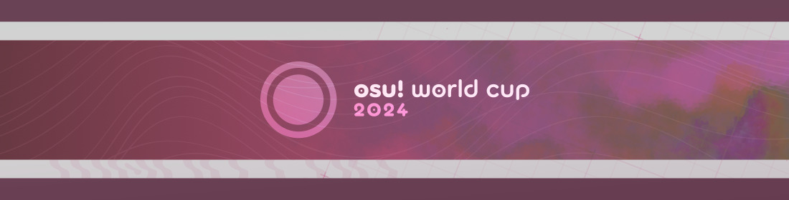
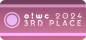
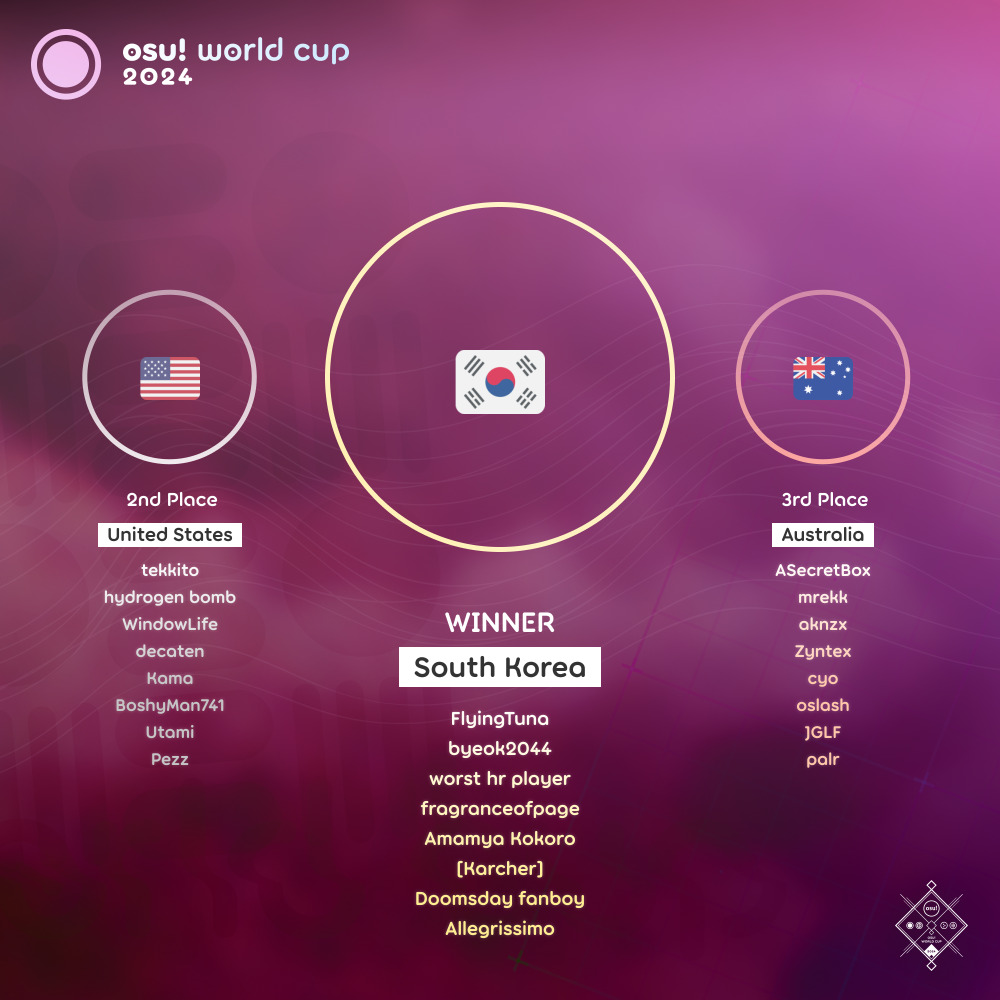

---
tags:
  - OWC
  - OWC2024
outdated_translation: true
outdated_since: 7e1814dc41cb9f2aa112439f8fb55f4d7822532b
---

# osu! World Cup 2024

**osu! 월드컵 2024** (***OWC 2024***)는 [osu! 팀](/wiki/People/osu!_team)이 주최한 국가 기반 토너먼트였습니다. 이것은 15번째 osu! 월드컵 이기도 합니다.

## 토너먼트 일정

| 스테이지 | 일정 |
| --: | :-- |
| 등록 기간 | 2024-09-26 (13:00 UTC)/2024-10-10 (23:59 UTC) |
| 퀄리파이어 맵풀 쇼케이스 | 2024-10-20 (18:00 UTC) |
| 퀄리파이어 기간 | 2024-10-26/2024-10-27 |
| 32강 | 2024-11-02/2024-11-03 |
| 16강 | 2024-11-09/2024-11-10 |
| 쿼터파이널 | 2024-11-16/2024-11-17 |
| 세미파이널 | 2024-11-23/2024-11-24 |
| 파이널 | 2024-11-30/2024-12-01 |
| 그랜드 파이널 | 2024-12-07/2024-12-08 |

## 상품

osu! 월드컵 2024는 총 $10000의 상금과 한정판 상품이 제공되었습니다.

| 순위 | 상품 |
| :-: | :-- |
|  | 총상금의 50%, 단독적으로 제작되는 상품, 프로필 배지, 1년간의 **osu! Champion** 유저 타이틀을 제공합니다 |
|  | 총상금의 30%, 단독적으로 제작되는 상품, 프로필 배지를 제공합니다 |
|  | 총상금의 20%, 단독적으로 제작되는 상품, 프로필 배지를 제공합니다 |

  

## 조직

osu! 월드컵 2024는 [osu! 팀](/wiki/People/osu!_team)과 여러 명의 커뮤니티 멤버들로 운영되었습니다.

| 직책 | 멤버 |
| :-- | :-- |
| 매니저 | ::{ flag=CA }:: ::Azer::{ user=2155578 }, ::{ flag=US }:: ::ChillierPear::{ user=9501251 }, ::{ flag=BR }:: ::LeoFLT::{ user=3668779 }, ::{ flag=GB }:: ::mangomizer::{ user=1893718 }, ::{ flag=CN }:: ::Sakura006::{ user=10365024 } |
| 맵풀 셀렉터 | ::{ flag=CA }:: ::Azer::{ user=2155578 }, ::{ flag=CA }:: ::chiv::{ user=6701656 }, ::{ flag=BR }:: ::Dada::{ user=9119507 }, ::{ flag=US }:: ::Librarian::{ user=10083084 }, ::{ flag=US }:: ::M I L E S::{ user=6036351 }, ::{ flag=SG }:: ::megumic::{ user=7537133 }, ::{ flag=NL }:: ::niqht::{ user=14390731 } |
| 맵풀 퀄리티 보증 | ::{ flag=CA }:: ::alden::{ user=3545323 }, ::{ flag=DE }:: ::Mordred::{ user=7265097 },  ::{ flag=HK }:: ::Petal::{ user=7354729 }, ::{ flag=TW }:: ::Shiina Noriko::{ user=1285637 }, ::{ flag=US }:: ::toybot::{ user=2848604 } |
| 맵풀 플레이테스터 | ::{ flag=US }:: ::BATBALL::{ user=15173952 }, ::{ flag=US }:: ::Belladonna::{ user=11758404 }, ::{ flag=US }:: ::ChillierPear::{ user=9501251 }, ::{ flag=US }:: ::conradmittn::{ user=8208289 }, ::{ flag=CA }:: ::D I O::{ user=3958619 }, ::{ flag=CA }:: ::El Condor Pasa::{ user=4415285 }, ::{ flag=US }:: ::Emerald Ages::{ user=10224047 }, ::{ flag=PH }:: ::enri::{ user=8640970 }, ::{ flag=US }:: ::EthantrixV2::{ user=10634348 }, ::{ flag=CN }:: ::FcEazy::{ user=7825227 }, ::{ flag=US }:: ::fieryrage::{ user=3533958 }, ::{ flag=PL }:: ::gnahus::{ user=12779141 }, ::{ flag=US }:: ::Jakson::{ user=8788058 }, ::{ flag=JP }:: ::KonKonKinakoN::{ user=4733185 }, ::{ flag=US }:: ::kuromi::{ user=12904237 }, ::{ flag=PL }:: ::MALISZEWSKI::{ user=12408961 }, ::{ flag=US }:: ::Mathyu::{ user=6303313 }, ::{ flag=ID }:: ::rHO::{ user=1629553 }, ::{ flag=MX }:: ::Riot::{ user=4256461 }, ::{ flag=DE }:: ::vana::{ user=10917620 }, ::{ flag=CA }:: ::Wieran::{ user=2303856 }, ::{ flag=CA }:: ::Yip::{ user=5177569 } |
| 매퍼 | :{ flag=TW }:: ::9ami::{ user=1499997 }, ::{ flag=KR }:: ::Acylica::{ user=1943309 }, ::{ flag=HK }:: ::Aerousea::{ user=15664628 }, ::{ flag=UA }:: ::aishiteiru\-::{ user=10566388 }, ::{ flag=GB }:: ::Aistre::{ user=4879380 }, ::{ flag=US }:: ::ajmosca::{ user=19884809 }, ::{ flag=CA }:: ::alden::{ user=3545323 }, ::{ flag=UA }:: ::allein::{ user=6221637 }, ::{ flag=GB }:: ::Altai::{ user=5745865 }, ::{ flag=KR }:: ::Atipir::{ user=8991722 }, ::{ flag=CA }:: ::Azer::{ user=2155578 }, ::{ flag=ID }:: ::Azrulk::{ user=12046612 }, ::{ flag=FI }:: ::bob::{ user=5346261 }, ::{ flag=US }:: ::Camo::{ user=5194391 }, ::{ flag=US }:: ::captin1::{ user=689997 }, ::{ flag=KR }:: ::Cellina::{ user=2490770 }, ::{ flag=HK }:: ::Chaoslitz::{ user=3621552 }, ::{ flag=BR }:: ::Dada::{ user=9119507 }, ::{ flag=BR }:: ::dasdwqdf::{ user=5403374 }, ::{ flag=JP }:: ::dectopia::{ user=2845904 }, ::{ flag=JP }:: ::Delis::{ user=1603923 }, ::{ flag=RU }:: ::Djulus::{ user=4960893 }, ::{ flag=JP }:: ::dkblaze::{ user=8095457 }, ::{ flag=JP }:: ::elchxyrlia::{ user=1722835 }, ::{ flag=KR }:: ::Enon::{ user=2043401 }, ::{ flag=PH }:: ::enri::{ user=8640970 }, ::{ flag=CN }:: ::fanzhen0019::{ user=418699 }, ::{ flag=CA }:: ::Feiri::{ user=3214844 }, ::{ flag=RU }:: ::fergas::{ user=3144542 }, ::{ flag=PH }:: ::flake::{ user=7627157 }, ::{ flag=US }:: ::fooders::{ user=7545218 }, ::{ flag=MX }:: ::funny::{ user=8473573 }, ::{ flag=CN }:: ::Garden::{ user=2849992 }, ::{ flag=AU }:: ::Gibune::{ user=5778687 }, ::{ flag=SG }:: ::hehe::{ user=2123087 }, ::{ flag=KR }:: ::Heilia::{ user=9823042 }, ::{ flag=CN }:: ::Hollow Wings::{ user=416662 }, ::{ flag=CY }:: ::iamtickrate::{ user=10772580 }, ::{ flag=DE }:: ::Icekalt::{ user=5410645 }, ::{ flag=GB }:: ::Ishtiaq::{ user=6405262 }, ::{ flag=DE }:: ::jamesjan3::{ user=6260705 }, ::{ flag=US }:: ::jellium::{ user=14758501 }, ::{ flag=CA }:: ::jonathanlfj::{ user=270377 }, ::{ flag=CA }:: ::KKipalt::{ user=6889573 }, ::{ flag=GB }:: ::KnightC0re::{ user=7894340 }, ::{ flag=PT }:: ::kowari::{ user=5404892 }, ::{ flag=CA }:: ::ktgster::{ user=53378 }, ::{ flag=DE }:: ::Lasse::{ user=896613 }, ::{ flag=VN }:: ::LMT::{ user=7262798 }, ::{ flag=US }:: ::Local Hero::{ user=16134122 }, ::{ flag=KR }:: ::Luscent::{ user=2688581 }, ::{ flag=UA }:: ::Mamiya Takuji::{ user=7586512 }, ::{ flag=BR }:: ::maot::{ user=3914271 }, ::{ flag=ZA }:: ::Mattay::{ user=9748303 }, ::{ flag=AR }:: ::Megafan::{ user=6632605 }, ::{ flag=DK }:: ::melon boy::{ user=3053382 }, ::{ flag=PH }:: ::midorijeon::{ user=10969875 }, ::{ flag=KR }:: ::milr\_::{ user=4485933 }, ::{ flag=DE }:: ::Mir::{ user=8688812 }, ::{ flag=RU }:: ::Mirash::{ user=2841009 }, ::{ flag=NZ }:: ::moph::{ user=2233878 }, ::{ flag=DE }:: ::Mordred::{ user=7265097 }, ::{ flag=RU }:: ::NeKroMan4ik::{ user=11387664 }, ::{ flag=BR }:: ::Net0::{ user=5099768 }, ::{ flag=US }:: ::nooj::{ user=8271086 }, ::{ flag=TW }:: ::oTwinkle::{ user=15095654 }, ::{ flag=HK }:: ::Petal::{ user=7354729 }, ::{ flag=DE }:: ::Pho::{ user=3624692 }, ::{ flag=RU }:: ::piroshki::{ user=7645522 }, ::{ flag=TW }:: ::Plus4j::{ user=4086497 }, ::{ flag=JP }:: ::ponbot::{ user=8939857 }, ::{ flag=FR }:: ::Raijodo::{ user=13400075 }, ::{ flag=EE }:: ::riot1133::{ user=11877992 }, ::{ flag=JP }:: ::rollpan::{ user=3062998 }, ::{ flag=SG }:: ::Rtyzen::{ user=2439822 }, ::{ flag=CN }:: ::Ryuusei Aika::{ user=7777875 }, ::{ flag=RU }:: ::Sanch\-KK::{ user=9131844 }, ::{ flag=JP }:: ::Satellite::{ user=1661227 }, ::{ flag=HK }:: ::seros::{ user=10562853 }, ::{ flag=US }:: ::Silverboxer::{ user=2166762 }, ::{ flag=CA }:: ::Sing::{ user=3795679 }, ::{ flag=BR }:: ::sukii::{ user=10909373 }, ::{ flag=KR }:: ::Toumei Dragon::{ user=6673830 }, ::{ flag=US }:: ::toybot::{ user=2848604 }, ::{ flag=US }:: ::Vermasium::{ user=11106442 }, ::{ flag=US }:: ::wafer::{ user=9416836 }, ::{ flag=US }:: ::Wispy::{ user=11106929 }, ::{ flag=AU }:: ::xLolicore\-::{ user=4525153 }, ::{ flag=JP }:: ::YaMaDarknesss::{ user=5645667 }, ::{ flag=PL }:: ::Zelq::{ user=8953955 } |
| 해설 | ::{ flag=CA }:: ::Azer::{ user=2155578 }, ::{ flag=GB }:: ::Bubbleman::{ user=5182050 }, ::{ flag=US }:: ::ChillierPear::{ user=9501251 }, ::{ flag=CA }:: ::D I O::{ user=3958619 }, ::{ flag=GB }:: ::Damarsh::{ user=7465147 }, ::{ flag=US }:: ::Dohland::{ user=5220511 }, ::{ flag=GB }:: ::Doomsday::{ user=18983 }, ::{ flag=US }:: ::fieryrage::{ user=3533958 }, ::{ flag=CA }:: ::I\-Flame::{ user=11257542 }, ::{ flag=AU }:: ::Jordan The Bear::{ user=7477458 }, ::{ flag=AU }:: ::Kano::{ user=3036203 }, ::{ flag=US }:: ::M I L E S::{ user=6036351 }, ::{ flag=AU }:: ::Mavs::{ user=11076938 }, ::{ flag=GB }:: ::SadShiba::{ user=10747626 }, ::{ flag=US }:: ::this1neguy::{ user=1797189 }, ::{ flag=AU }:: ::Vordi::{ user=6659116 } |
| 심판 | ::{ flag=IN }:: ::\-Space::{ user=7720204 }, ::{ flag=FI }:: ::Aetherian::{ user=6263040 }, ::{ flag=US }:: ::akace100::{ user=9308128 }, ::{ flag=NL }:: ::Albionthegreat::{ user=9853595 }, ::{ flag=BR }:: ::LeoFLT::{ user=3668779 }, ::{ flag=NL }:: ::nik::{ user=10077264 }, ::{ flag=US }:: ::Suicune3::{ user=6895187 }, ::{ flag=US }:: ::tigereyes144::{ user=6499811 }, ::{ flag=GB }:: ::Yazzehh::{ user=7068973 } |
| 통계 | ::{ flag=BR }:: ::LeoFLT::{ user=3668779 }, ::{ flag=FI }:: ::shdewz::{ user=10000899 } |
| GFX | ::{ flag=CN }:: **::Sakura006::{ user=10365024 }**, ::{ flag=CA }:: ::kaetwo::{ user=1997719 } |

## 링크

- **[정보 스프레드시트](https://docs.google.com/spreadsheets/d/1r6atZf2Qbeg8s0Uq_K3z5MNBM-BMMC7hYYJ0cz065Ng)**
- [주간 스탯 스프레드시트](https://drive.google.com/drive/folders/15o3d1m8YY0oFQvUz6tNBzdnePAxQOEOT)
- [실시간 방송](https://www.twitch.tv/osulive)
- [논의 스레드](https://osu.ppy.sh/community/forums/topics/1982268)
- [토너먼트 목록](https://osu.ppy.sh/community/tournaments/47)
- [Challonge 대진표](https://challonge.com/OWC24)
- ::{ flag=DE }:: ::hallowatcher::{ user=1874761 }가 운영한 [Pick'ems 승부예측 페이지](https://pickem.hwc.hr/tournaments/158)
- [트위치 VOD 모음](https://www.twitch.tv/collections/P0Fp2MQ_ABijBw)

## 참가자

|  | 국가 | 멤버 |
| :-: | :-: | :-- |
| ::{ flag=AR }:: | **아르헨티나** | **::Bomilk::{ user=7081596 }**, ::BossPlays::{ user=7341471 }, ::Kaoshii::{ user=7807935 }, ::Pipipupu997::{ user=20120615 }, ::R1cho::{ user=13065919 }, ::SMASHCAE::{ user=10459580 }, ::viciobylike::{ user=18922516 }, ::Amuro::{ user=7119659 } |
| ::{ flag=AU }:: | **오스트레일리아** | **::ASecretBox::{ user=7341183 }**, ::mrekk::{ user=7562902 }, ::aknzx::{ user=9938943 }, ::Zyntex::{ user=11806306 }, ::cyo::{ user=8195473 }, ::oslash::{ user=13228917 }, ::JGLF::{ user=10665363 }, ::palr::{ user=15429006 } |
| ::{ flag=AT }:: | **오스트리아** | **::fedoragoose::{ user=2323131 }**, ::z9a::{ user=13057699 }, ::Akuma no Tenshi::{ user=21811804 }, ::z10a::{ user=18153252 }, ::Teppi Fangirl::{ user=16522589 }, ::Deshoou::{ user=21753287 }, ::tomadoi::{ user=5712451 }, ::tsuniko::{ user=15213233 } |
| ::{ flag=BY }:: | **벨라루스** | **::Vudek::{ user=8816345 }**, ::TemaZpro::{ user=5510197 }, ::flover1ss::{ user=15803625 }, ::42ms::{ user=17949915 }, ::Vasteri::{ user=14165370 }, ::Nuwo::{ user=15406353 }, ::bern1sh::{ user=17851835 }, ::hollaps::{ user=6253995 } |
| ::{ flag=BE }:: | **벨기에** | **::Hanori::{ user=7078544 }**, ::5joshi::{ user=4279650 }, ::hexi::{ user=10760701 }, ::Meersu::{ user=6311605 }, ::MetaBee::{ user=3706039 }, ::Mornis::{ user=6479616 }, ::MRB::{ user=11234975 }, ::Vinnie::{ user=8509247 } |
| ::{ flag=BA }:: | **보스니아 헤르체고비나** | **::dax420::{ user=14658906 }**, ::Quiligru::{ user=10270382 }, ::\_\_Neo::{ user=8956749 }, ::Xedon100::{ user=10854590 }, ::Aurora--::{ user=23143145 }, ::deni9s::{ user=12859105 } |
| ::{ flag=BR }:: | **브라질** | **::Coreanmaluco::{ user=3149577 }**, ::-izzy::{ user=15225729 }, ::- hiro -::{ user=11377894 }, ::Daf0nz::{ user=14592820 }, ::Dropinx::{ user=4687701 }, ::kagiura::{ user=11461810 }, ::saewon::{ user=12855946 }, ::Lirumin::{ user=15274893 } |
| ::{ flag=BG }:: | **불가리아** | **::hlanden::{ user=4934554 }**, ::werkzu::{ user=23913323 }, ::SynchroHD::{ user=6584220 }, ::yun::{ user=7847997 }, ::Ted::{ user=9717848 }, ::Thornnn::{ user=24371637 }, ::\[ Krat \]::{ user=21764744 }, ::Ivanix::{ user=16380723 } |
| ::{ flag=KH }:: | **캄보디아** | **::Sambath::{ user=6511038 }**, ::tsp648::{ user=12301296 }, ::YuuSakku::{ user=12696690 }, ::iToxicShadow::{ user=9327337 }, ::Ainee::{ user=11208808 }, ::lyschid::{ user=16724203 }, ::Jestrr\_::{ user=22941611 } |
| ::{ flag=CA }:: | **캐나다** | **::Zylice::{ user=5033077 }**, ::xootynator::{ user=3717598 }, ::RyuK::{ user=6304246 }, ::PikaPwn::{ user=2012453 }, ::nick1324::{ user=612898 }, ::CutPaper::{ user=10975777 }, ::Saryi::{ user=10051720 }, ::DarkKarate::{ user=8666950 } |
| ::{ flag=CL }:: | **칠레** | **::suntanCTM::{ user=19998548 }**, ::Mathi::{ user=5339515 }, ::Intercambing::{ user=2546001 }, ::Nekore::{ user=18946207 }, ::ALFIU::{ user=17724014 }, ::Gonzah::{ user=12434652 }, ::NO37::{ user=4653583 }, ::xXChokgamerXx::{ user=7748891 } |
| ::{ flag=CN }:: | **중국** | **::lolol235::{ user=6090175 }**, ::lolol234::{ user=5791401 }, ::lolol233::{ user=11375105 }, ::Crystal::{ user=1646397 }, ::z980838928::{ user=1355695 }, ::MidC::{ user=20461077 }, ::Ledeau\_Fox::{ user=15816872 }, ::Dwagon::{ user=9975427 } |
| ::{ flag=CO }:: | **콜롬비아** | **::Carlosflow::{ user=11940767 }**, ::Goold::{ user=13744487 }, ::Okinari::{ user=18373966 }, ::Phel::{ user=9367683 }, ::Ither::{ user=17117482 }, ::J1x::{ user=9904093 }, ::Jekuru::{ user=11727492 }, ::Schwarze::{ user=12502593 } |
| ::{ flag=HR }:: | **크로아티아** | **::StrawFrog::{ user=10978106 }**, ::-Milfy::{ user=11013016 }, ::DragonCroc::{ user=4334103 }, ::FarBn::{ user=23219229 }, ::Fiilip::{ user=9517052 }, ::Suki::{ user=7289538 }, ::The Fart Lord::{ user=7912447 }, ::tRigeL::{ user=23350068 } |
| ::{ flag=CZ }:: | **체코** | **::Dri3x::{ user=11478426 }**, ::Sigmund Fraud::{ user=3198446 }, ::fisskill::{ user=15247939 }, ::Ev1dent::{ user=7125675 }, ::VilaZ::{ user=5155680 }, ::lucker::{ user=10912688 }, ::Mirek::{ user=6595616 }, ::Singapure-::{ user=19359793 } |
| ::{ flag=DK }:: | **덴마크** | **::Polle::{ user=13218204 }**, ::Sobu-::{ user=13872272 }, ::cat burger::{ user=11380904 }, ::Redzy::{ user=9732417 }, ::iamVill::{ user=6295380 }, ::thebeastjona::{ user=13452017 }, ::RiseOfKingdoms::{ user=13033798 }, ::thiez::{ user=10831457 } |
| ::{ flag=DO }:: | **도미니카 공화국** | **::Skill::{ user=7802027 }**, ::Gorrino::{ user=22782807 }, ::heidy::{ user=7425199 }, ::AshClown::{ user=8132473 }, ::WillLITE::{ user=6677788 }, ::Basei::{ user=14499336 }, ::\[-Dany-\]::{ user=17357412 } |
| ::{ flag=EE }:: | **에스토니아** | **::Ancenthe::{ user=4479041 }**, ::Abyssal::{ user=5527745 }, ::cedru::{ user=10162611 }, ::Rev0::{ user=10346185 }, ::whiteceiling::{ user=4064661 }, ::mikn::{ user=5309780 }, ::The Hassle::{ user=14061950 }, ::Slay::{ user=7093124 } |
| ::{ flag=FI }:: | **핀란드** | **::shdewz::{ user=10000899 }**, ::Amasetic::{ user=11375251 }, ::Xepei::{ user=11479551 }, ::Dezku::{ user=9505131 }, ::Nev-::{ user=11836334 }, [A\]\]](https://osu.ppy.sh/users/4959454), ::Mayuri::{ user=18688473 }, ::Tabletti::{ user=9523661 } |
| ::{ flag=FR }:: | **프랑스** | **::Musty::{ user=251683 }**, ::justman::{ user=7657831 }, ::Hifkil::{ user=4301976 }, ::fiaee::{ user=10325072 }, ::calangi::{ user=7810180 }, ::Ekoro::{ user=284905 }, ::CharleLee::{ user=10434787 }, ::MyzeJD::{ user=3257847 } |
| ::{ flag=GE }:: | **조지아** | **::DarkFTW::{ user=14350221 }**, ::nawhbody::{ user=20656091 }, ::Andria2004::{ user=7224935 }, ::Deadline::{ user=5783393 }, ::n o v a h::{ user=18153031 }, ::Radmos\_::{ user=25468052 } |
| ::{ flag=DE }:: | **독일** | **::criller::{ user=8116659 }**, ::WhiteCat::{ user=4504101 }, ::yary::{ user=13300203 }, ::Tim Kackner::{ user=14385814 }, ::okinamo::{ user=3765989 }, ::ZeitFrost::{ user=11234706 }, ::Fleh::{ user=7780605 }, ::aahoff::{ user=11371245 } |
| ::{ flag=GR }:: | **그리스** | **::JackPaX::{ user=11226645 }**, ::-Puyu::{ user=10398348 }, ::bisbo::{ user=11893703 }, ::kwotaq::{ user=8195972 }, ::MyAimPeeps::{ user=15427656 }, ::Nekkid::{ user=12145220 }, ::trushpack::{ user=9498428 }, ::W1nn1e::{ user=15302347 } |
| ::{ flag=HK }:: | **홍콩** | **::Tsuwagi::{ user=9313951 }**, ::Hibiki::{ user=5413624 }, ::KagaSumire::{ user=4857328 }, ::maxbireo::{ user=4682646 }, ::mcy4::{ user=2165650 }, ::misha awa::{ user=14503423 }, ::stllok::{ user=14817468 }, ::Tommy315::{ user=10748631 } |
| ::{ flag=HU }:: | **헝가리** | **::defii::{ user=8698024 }**, ::Barnabas::{ user=6499896 }, ::blackpoint675::{ user=10714308 }, ::csaba21123::{ user=7764237 }, ::gecseboti::{ user=15213139 }, ::Indicolite::{ user=19309181 }, ::matyk0::{ user=8596945 }, ::novaaxy::{ user=8110269 } |
| ::{ flag=IN }:: | **인도** | **::\_Cyan::{ user=10250612 }**, ::Potla::{ user=1788022 }, ::zmecha::{ user=20861921 }, ::ArtoriaMyAngel::{ user=11412507 }, ::BruhMoment::{ user=12322135 }, ::dard::{ user=8141103 }, ::Smudgy24::{ user=25011352 }, ::\[-Wardran-\]::{ user=15039363 } |
| ::{ flag=ID }:: | **인도네시아** | **::lifeline::{ user=11367222 }**, ::Fuma::{ user=1501956 }, ::DEETO::{ user=10069909 }, ::Hakui Koyori::{ user=10717635 }, ::MineFrostID::{ user=12159899 }, ::Rosemi Lovelock::{ user=1987591 }, ::Stixe::{ user=18351160 }, ::ThatNOOBguy::{ user=11091594 } |
| ::{ flag=IE }:: | **아일랜드** | **::M a t t y::{ user=3737136 }**, ::PoSharTo::{ user=11332703 }, ::Yaksen::{ user=5312461 }, ::IMPRESSIVE BEAR::{ user=10278329 }, ::nava::{ user=6450765 }, ::Aseridan::{ user=9217468 }, ::Davney::{ user=20210086 }, ::don\_chan::{ user=8473665 } |
| ::{ flag=IL }:: | **이스라엘** | **::CIash of Clans::{ user=16048250 }**, ::PaintedKoala::{ user=10056419 }, ::WhitePixel\_::{ user=13831265 }, ::cihp::{ user=12083446 }, ::MrPotato::{ user=2787415 }, ::Galog::{ user=7799629 }, ::Diddy D::{ user=16083856 }, ::Accelerator::{ user=10822717 } |
| ::{ flag=IT }:: | **이탈리아** | **::ILBOSSDELPOPPIN::{ user=13925698 }**, ::Arge::{ user=11215030 }, ::bgm16::{ user=11476143 }, ::Crazy Hot::{ user=21709356 }, ::mhh::{ user=14832855 }, ::MeOwz::{ user=17446380 }, ::Wido::{ user=3833346 }, ::andr0as::{ user=14596595 } |
| ::{ flag=JP }:: | **일본** | **::Sabakan-::{ user=12941954 }**, ::Aotoleen::{ user=3162741 }, ::L4plus1::{ user=1504556 }, ::R10sh1::{ user=17202789 }, ::Rikuima::{ user=14035920 }, ::siina::{ user=6574823 }, ::stone\_bream::{ user=14800198 }, ::Teacchyyy::{ user=7178423 } |
| ::{ flag=KZ }:: | **카자흐스탄** | **::Kamensh1k::{ user=16817965 }**, ::nejzha::{ user=8105138 }, ::Ternafis::{ user=9921139 }, ::fragrance0fpage::{ user=14438574 }, ::Plombire::{ user=15656399 }, ::konri::{ user=12100617 }, ::so far so good::{ user=17066686 }, ::Hunter Thompson::{ user=11967146 } |
| ::{ flag=LV }:: | **라트비아** | **::waywern2012::{ user=5870453 }**, ::ryuuaa::{ user=21653406 }, ::nbob::{ user=11538636 }, ::UselessJohn::{ user=10902307 }, ::kbwaaablya::{ user=6473092 }, ::xan\_ly::{ user=11885405 }, ::Murzikk::{ user=12000193 }, ::day drinking::{ user=12070555 } |
| ::{ flag=LT }:: | **리투아니아** | **::fybeth::{ user=7225339 }**, ::Furudo Erika::{ user=16329318 }, ::ganjanov::{ user=11584075 }, ::Hera\_::{ user=8766780 }, ::Nitram::{ user=10569535 }, ::Simaskrc::{ user=10290012 }, ::Edviskrc::{ user=4460587 }, ::CamperLt::{ user=4582149 } |
| ::{ flag=MO }:: | **마카오** | **::Chino-::{ user=16117538 }**, ::FakeAlexChio::{ user=16656942 }, ::KNa-::{ user=14184577 }, ::knight87::{ user=12648780 }, ::SBHO::{ user=16974919 }, ::Tokirii::{ user=11563694 } |
| ::{ flag=MY }:: | **말레이시아** | **::Lunasa::{ user=16436446 }**, ::wuhua::{ user=2932510 }, ::Rampax::{ user=3995630 }, ::Chiyuu::{ user=8226107 }, ::AHotDawg::{ user=15271985 }, ::Breast::{ user=11918602 }, ::n0 head::{ user=14067834 }, ::Zeph2003::{ user=10343292 } |
| ::{ flag=MX }:: | **멕시코** | **::-Wolfy-::{ user=4497582 }**, ::-Karu::{ user=8429128 }, ::Alfrah::{ user=10567112 }, ::Camberos::{ user=2553519 }, ::northsign::{ user=16775763 }, ::Sodor::{ user=7784120 }, ::tonaltwister::{ user=14494895 }, ::XxDreamzxX::{ user=18903701 } |
| ::{ flag=MN }:: | **몽골** | **::seegii::{ user=4659319 }**, ::Rumit::{ user=12148238 }, ::murun\_::{ user=10919861 }, ::Nukeeowo::{ user=13708631 }, ::tuudug-::{ user=5145352 }, ::Kurisutuna::{ user=18453360 } |
| ::{ flag=NL }:: | **네덜란드** | **::Lilily::{ user=6502403 }**, ::LUCIANO::{ user=11604978 }, ::TurtleSenpaii::{ user=12241010 }, ::Aheo::{ user=14919428 }, ::Dolter::{ user=6920104 }, ::femboy feet::{ user=17013392 }, ::chillington 15::{ user=6744123 }, ::Katie Djeestar::{ user=641155 } |
| ::{ flag=NZ }:: | **뉴질랜드** | **::2oomer::{ user=11141578 }**, ::Saiyku::{ user=13767572 }, ::Kyujin::{ user=15293080 }, ::Ozzy265::{ user=23179637 }, ::Myonpaku::{ user=12249104 }, ::pii::{ user=13588932 }, ::she gon pay me::{ user=11172360 }, ::Neavako::{ user=23863342 } |
| ::{ flag=NO }:: | **노르웨이** | **::YokesPai::{ user=6399568 }**, ::antonyw::{ user=12959983 }, ::Fjell::{ user=6951444 }, ::HUNDUR::{ user=3145033 }, ::Melvr::{ user=9211924 }, ::nanolini::{ user=12353810 }, ::NINERIK::{ user=10549880 }, ::zubs::{ user=4253615 } |
| ::{ flag=PA }:: | **파나마** | **::AR9::{ user=5136821 }**, ::Leonard H::{ user=11562243 }, ::Sirny::{ user=18962732 }, ::ne0craft::{ user=17545095 }, ::Reflectioned::{ user=18847055 }, ::FRX::{ user=13305560 } |
| ::{ flag=PE }:: | **페루** | **::-ktrihc::{ user=11685498 }**, ::\[MG\]Arnold24x24::{ user=2291265 }, ::miss yo::{ user=12728547 }, ::Hasaki::{ user=9037054 }, ::Judani::{ user=6787898 }, ::Miqt::{ user=11405734 }, ::MiguisXD::{ user=8715276 }, ::P r a h::{ user=10509043 } |
| ::{ flag=PH }:: | **필리핀** | **::Milkteaism::{ user=9642774 }**, ::NathanRam1918::{ user=4734703 }, ::Rammu::{ user=10652837 }, ::Icarussy::{ user=19526828 }, ::zonelouise::{ user=1492995 }, ::Impowster::{ user=13484596 }, ::Xyloz::{ user=12040280 }, ::seeeen11l1::{ user=18047706 } |
| ::{ flag=PL }:: | **폴란드** | **::szedis::{ user=14282987 }**, ::Rafis::{ user=2558286 }, ::Tartis::{ user=9513980 }, ::tomasz chic::{ user=13108233 }, ::BMG\_::{ user=4981809 }, ::Agent5d::{ user=5472693 }, ::Mastasz::{ user=1876565 }, ::Kosiarek::{ user=9086565 } |
| ::{ flag=PT }:: | **포르투갈** | **::AlfredTheSalmon::{ user=1052349 }**, ::Just2Gud::{ user=4430263 }, ::Big Yikes::{ user=799218 }, ::RafaMat::{ user=10743390 }, ::uatzap::{ user=16509171 }, ::Meower::{ user=14787295 }, ::Mizuru::{ user=4495871 }, ::Seat Ibiza TDI::{ user=4215381 } |
| ::{ flag=RO }:: | **루마니아** | **::LCRS::{ user=9719351 }**, ::roliy::{ user=9578404 }, ::etn::{ user=4581069 }, ::nanoya::{ user=12366071 }, ::Kehest::{ user=6145000 }, ::origin\_::{ user=15095811 }, ::\_Silvian::{ user=8511882 }, ::AlexBelea::{ user=19430137 } |
| ::{ flag=RU }:: | **러시아** | **::gamer228666::{ user=5981005 }**, ::Chicony::{ user=5199332 }, ::desuqe::{ user=9712285 }, ::HandsomeMe::{ user=11376152 }, ::Ice Shark::{ user=9459674 }, ::Markrum::{ user=11854446 }, ::Skrowell::{ user=9694263 }, ::Welter::{ user=11552867 } |
| ::{ flag=RS }:: | **세르비아** | **::chepy::{ user=16360422 }**, ::skylewl::{ user=3373422 }, ::-Petar::{ user=9106690 }, ::howtoplay::{ user=9294147 }, ::lazy::{ user=12101240 }, ::HomingLesi::{ user=11353707 }, ::sava2004::{ user=9651151 } |
| ::{ flag=SG }:: | **싱가포르** | **::Tebi::{ user=5407620 }**, ::Dawnwing::{ user=5144534 }, ::Eagle5324::{ user=11987104 }, ::GSBlank::{ user=2312106 }, ::hollowknees::{ user=15195364 }, ::Mekeyo::{ user=10270787 }, ::qstronaut::{ user=10958852 }, ::wick::{ user=8004317 } |
| ::{ flag=SK }:: | **슬로바키아** | **::-YoYo-::{ user=6158076 }**, ::AtHeoN::{ user=1770367 }, ::EnchantedSpider::{ user=9357029 }, ::Jake Boii::{ user=11195133 }, ::PeteX::{ user=1285945 }, ::Seviade::{ user=10954912 }, ::snk::{ user=8847379 }, ::TeraKrono::{ user=8067943 } |
| ::{ flag=SI }:: | **슬로베니아** | **::Sirek::{ user=14666725 }**, ::sniperelite::{ user=11388931 }, ::Fixr::{ user=2762603 }, ::MrSpike353::{ user=16009122 }, ::Rover Black::{ user=13251405 }, ::DamjanLenc::{ user=30754555 }, ::TimTeamio::{ user=26030777 }, ::C I KSTER129::{ user=15657769 } |
| ::{ flag=KR }:: | **대한민국** | **::FlyingTuna::{ user=9224078 }**, ::byeok2044::{ user=8472976 }, ::worst hr player::{ user=14106450 }, ::fragranceofpage::{ user=11399348 }, ::Amamya Kokoro::{ user=2511839 }, ::\[Karcher\]::{ user=11443437 }, ::Doomsday fanboy::{ user=4511522 }, ::Allegrissimo::{ user=9052194 } |
| ::{ flag=ES }:: | **스페인** | **::M A N O L O::{ user=12296128 }**, ::A N T O N I O::{ user=12760743 }, ::A L E P H::{ user=6735738 }, ::creator::{ user=13962152 }, ::ESCRUPULILLO::{ user=18217876 }, ::Radiownd::{ user=6792694 }, ::fentanylseeker::{ user=15346564 }, ::Damn DanyL::{ user=10596572 } |
| ::{ flag=SE }:: | **스웨덴** | **::scylla::{ user=9405745 }**, ::C-Pin::{ user=9818947 }, ::Andros::{ user=9072586 }, ::JAGEKO::{ user=5798349 }, ::trumpatino69::{ user=10903510 }, ::melwem::{ user=10349559 }, ::Fejlan::{ user=8150535 }, ::Lightningfox::{ user=15701343 } |
| ::{ flag=CH }:: | **스위스** | **::-Spartan::{ user=5783061 }**, ::\_Shroob::{ user=14349902 }, ::-Azure::{ user=11189917 }, ::flopper727::{ user=8603987 }, [J \]](https://osu.ppy.sh/users/10316438), ::Mebura::{ user=15324900 }, ::Schoki::{ user=13260523 }, ::Skellers::{ user=8040245 } |
| ::{ flag=TW }:: | **대만** | **::Imokora::{ user=2472609 }**, ::willy0214::{ user=8660293 }, ::Ruyaya::{ user=16288992 }, ::Flyer::{ user=9767342 }, ::Meow\_Son::{ user=8186536 }, ::Summer\_Ouo::{ user=15184992 }, ::NekoKamui::{ user=7172340 }, ::Kyros\_::{ user=23925029 } |
| ::{ flag=TH }:: | **태국** | **::Lesperry::{ user=18092331 }**, ::-Kedama::{ user=12147277 }, ::chests::{ user=14806365 }, ::Deppyforce::{ user=5286213 }, ::soft bunny::{ user=9317938 }, ::\[ Master \]::{ user=12130906 }, ::Hinamon::{ user=14017762 }, ::miinr::{ user=17792223 } |
| ::{ flag=TR }:: | **튀르키예** | **::Raikouhou::{ user=8007528 }**, ::Orkay::{ user=9321674 }, ::Shinkiro::{ user=6093148 }, ::spray-::{ user=16750823 }, ::Ievi-::{ user=14684430 }, ::LyeRR::{ user=13068741 }, ::Clutchx::{ user=14958380 }, ::Liery::{ user=11551991 } |
| ::{ flag=UA }:: | **우크라이나** | **::SHADOW FREAK::{ user=7587763 }**, ::HP DeskJet 3835::{ user=16139008 }, ::POMAH::{ user=11794209 }, ::RafGPio::{ user=13705417 }, ::Kryterion::{ user=9920144 }, ::KING GG::{ user=9820878 }, ::CRIMEA::{ user=11078815 }, ::KirbyTwister::{ user=7979597 } |
| ::{ flag=AE }:: | **아랍에미리트** | **::Ailes Grises::{ user=10916561 }**, ::-Adood::{ user=10722756 }, ::-aico::{ user=18371932 }, ::aim1trick::{ user=18441629 }, ::FGChamp::{ user=12637617 }, ::wack::{ user=16383481 }, ::Xluxic::{ user=12420896 } |
| ::{ flag=GB }:: | **독일** | **::Bubbleman::{ user=5182050 }**, ::9MlCE::{ user=9269034 }, ::rudj::{ user=11592896 }, ::MALTESER::{ user=5218178 }, ::Mahmood::{ user=7627844 }, ::HAUNTE::{ user=7333471 }, ::lystia::{ user=11042418 }, ::skihuahua::{ user=16774872 } |
| ::{ flag=US }:: | **미국** | **::tekkito::{ user=7075211 }**, ::hydrogen bomb::{ user=7813296 }, ::WindowLife::{ user=4108547 }, ::decaten::{ user=5645231 }, ::Kama::{ user=13380270 }, ::BoshyMan741::{ user=4830687 }, ::Utami::{ user=7512553 }, ::Pezz::{ user=10651106 } |
| ::{ flag=UY }:: | **우루과이** | **::Rebo::{ user=6942259 }**, ::-PloX::{ user=6404583 }, ::El Milanga::{ user=12264918 }, ::etterna in osu::{ user=5243536 }, ::FDX::{ user=8987016 }, ::Kazuki K::{ user=6407282 }, ::Madozito::{ user=4054429 }, ::Shikkesora::{ user=5382216 } |
| ::{ flag=VN }:: | **베트남** | **::def::{ user=21619075 }**, ::\_ Freedom \_::{ user=3999831 }, ::\_Casiofx580vnx::{ user=848961 }, ::Another Guy::{ user=4540667 }, ::Ayamaki::{ user=16396650 }, ::baoo::{ user=11021073 }, ::t4hN::{ user=18948749 }, ::walle::{ user=8431549 } |

전체 플레이어 목록은 [여기서](https://gist.github.com/LeoFLT/8384063b39b9991421fec24df0e04ceb) 볼 수 있습니다.

## 시상대

## 맵풀

### 그랜드 파이널

**[맵팩은 여기서 다운로드가 가능합니다 (185 MB)](https://packs.ppy.sh/P269%20-%20osu!%20World%20Cup%202024%3A%20Grand%20Finals.zip)**\
[VOD는 여기서 볼 수 있습니다](https://www.twitch.tv/videos/2315945072)

- No Mod
  1. [Ito Kanako - Sky of Twilight (elchxyrlia) \[Arles\]](https://osu.ppy.sh/beatmapsets/2287859#osu/4881501)
  2. [Attoclef - Naples Yellow Mango (fanzhen0019, Hollow Wings) \[Van Gogh's Miss (feat. Hollow Wings)\]](https://osu.ppy.sh/beatmapsets/2288022#osu/4881869)
  3. [TK from Ling tosite sigure - unravel (aishiteiru-) \[otshelnik\]](https://osu.ppy.sh/beatmapsets/2287914#osu/4881614)
  4. [XenjeS - Organic's Decay (Cut Ver.) (nooj, Feiri) \[Life Form Disintegration Ray\]](https://osu.ppy.sh/beatmapsets/2287939#osu/4881668)
  5. [XH - Corrupted Paywall (Cellina) \[Bypass\]](https://osu.ppy.sh/beatmapsets/2287942#osu/4881677)
- Hidden
  1. [hitorie - Shinkokyuu (seros, captin1) \[tragic love extra\]](https://osu.ppy.sh/beatmapsets/2287961#osu/4881712)
  2. [Omoi feat. Hatsune Miku - Snow Drive(01.23) (dectopia, rollpan, YaMaDarknesss) \[Journey's End\]](https://osu.ppy.sh/beatmapsets/2287847#osu/4881475)
  3. [Gram vs. DJ Genki - XIchedelic Nova Trinity (Pho) \[C12H17N2O4P\]](https://osu.ppy.sh/beatmapsets/2287963#osu/4881714)
- Hard Rock
  1. [Official HIGE DANdism - Bad for me (Dz'Xa's Amenpunk) (Seamob) \[HE WILL\]](https://osu.ppy.sh/beatmapsets/1392496#osu/2874944)
  2. [Ave Mujica - Black Birthday (Plus4j) \[The First Birthday\]](https://osu.ppy.sh/beatmapsets/2287973#osu/4881729)
  3. [TAROLIN feat. Katakiri Rekka - Cardinal Rave (Yusomi) \[Landed in the Dogwood\]](https://osu.ppy.sh/beatmapsets/1116399#osu/2332178)
- Double Time
  1. [DJ OKAWARI - Flower Dance (Raijodo) \[mapped in jail\]](https://osu.ppy.sh/beatmapsets/2287643#osu/4880978)
  2. [Kanpyohgo - Unmei no Dark Side -Rolling Gothic mix (Sanch-KK) \[Spin to Win\]](https://osu.ppy.sh/beatmapsets/2287978#osu/4881745)
  3. [Demetori - Wind God Girl (lkp) \[Extra\]](https://osu.ppy.sh/beatmapsets/20949#osu/74684)
  4. [Kalafina x The Prodigy - No Good Magia (Start the Witch) (Okoratu) \[Walpurgisnacht\]](https://osu.ppy.sh/beatmapsets/988552#osu/2067859)
- Free Mod
  1. [Dempagumi.inc - Back! to the Future (kowari) \[Extreme\]](https://osu.ppy.sh/beatmapsets/2287983#osu/4881757)
  2. [Camellia - Yume Nikki Mega Mix (20th Anniversary Remake) (Icekalt) \[ploem\]](https://osu.ppy.sh/beatmapsets/2287988#osu/4881763)
  3. [Nanahoshi Kangengakudan feat. Hatsune Miku - Rubik's Cube (Heilia) \[owc ver.\]](https://osu.ppy.sh/beatmapsets/2288047#osu/4881933)
  4. [First Fragment - Le Serment De Tsion (LMT) \[Kneel\]](https://osu.ppy.sh/beatmapsets/2287985#osu/4881760)
- Tiebreaker
  1. **[Camellia - Operation: Zenithfall (Mir, Sing, Heilia, funny, toybot) \[FINAL MISSION\]](https://osu.ppy.sh/beatmapsets/2287992#osu/4881796)**

### 파이널

**[맵팩은 여기서 다운로드가 가능합니다 (215 MB)](https://packs.ppy.sh/P268%20-%20osu!%20World%20Cup%202024%3A%20Finals.zip?1732479869)**\
[VOD는 여기서 볼 수 있습니다](https://www.twitch.tv/videos/2310246440)

- No Mod
  1. [Adust Rain - Eleven Stud (Toumei Dragon) \[Subterranean Rose\]](https://osu.ppy.sh/beatmapsets/2284459#osu/4872301)
  2. [PEOPLE 1 - Ratpark feat. Kei Sugawara (Delis, Mirash, moph) \[Rattus deliceus, Rattus mophinus and Rattus mirandorensis' :ratJam:\]](https://osu.ppy.sh/beatmapsets/2284654#osu/4872765)
  3. [Kabocha feat. Aitsuki Nakuru - Dear The Night I Loved (flake) \[Tragic Love Extravaganza\]](https://osu.ppy.sh/beatmapsets/2284389#osu/4872029)
  4. [Lusumi - /data\_eraser.wav (hehe, funny) \[404\]](https://osu.ppy.sh/beatmapsets/2284633#osu/4872735)
  5. [Demon King - Bound To Madness (jellium) \[Descending Sanity\]](https://osu.ppy.sh/beatmapsets/2284575#osu/4872589)
- Hidden
  1. [utzbo vs. paraneumann - Dynasty of Extinction (Altai) \[Decimation\]](https://osu.ppy.sh/beatmapsets/2284670#osu/4872796)
  2. [beatMARIO - Lunatic Eyes \~ Invisible Full Moon (YokesPai) \[Lunatic Sign "Visionary Tuning"\]](https://osu.ppy.sh/beatmapsets/2267484#osu/4872667)
  3. [passchooo - 7he osu! world cup 2 dariacore 7imeline (ft. Azer, Jade & Rain) (wafer) \[girl who uses serum\]](https://osu.ppy.sh/beatmapsets/2284644#osu/4872751)
- Hard Rock
  1. [LOLUET x yoei. - roots (seros) \[intension\]](https://osu.ppy.sh/beatmapsets/2139515#osu/4502914)
  2. [Omega - Horobi o Inorishi Mono (Mordred) \[Prayer of the Midnight Maiden\]](https://osu.ppy.sh/beatmapsets/2284565#osu/4872576)
  3. [Zmey Gorynich - Aynane (Mazzerin) \[Brown-eyed Beauty\]](https://osu.ppy.sh/beatmapsets/1842684#osu/3784901)
- Double Time
  1. [Pendulum - Hold Your Colour (ProfessionalBox) \[Iridescence\]](https://osu.ppy.sh/beatmapsets/702272#osu/1485947)
  2. [LamazeP - PoPiPo (Ryu\* Remix) feat. Hatsune Miku (Luscent) \[Vegetable Juice\]](https://osu.ppy.sh/beatmapsets/2284616#osu/4872691)
  3. [Renard - Blue Night (DoKoLP) \[DoKo\]](https://osu.ppy.sh/beatmapsets/31333#osu/116006)
  4. [inabakumori - Lagtrain (Shii) \[Repetition\]](https://osu.ppy.sh/beatmapsets/1313664#osu/2722655)
- Free Mod
  1. [Shoichiro Sakamoto - Eiyuu no Tsurugi (audinor) \[Final\]](https://osu.ppy.sh/beatmapsets/1864097#osu/3833517)
  2. [pan - Lollipop Sprinkles (ktgster) \[Extreme\]](https://osu.ppy.sh/beatmapsets/2284690#osu/4872846)
  3. [Emiru no Aishita Tsukiyo ni Dai San Gensou Kyoku wo - SILVERY (LMT) \[Extra\]](https://osu.ppy.sh/beatmapsets/1581365#osu/3229080)
  4. [aytanner - Mondaymania (Local Hero) \[CATASTROPHE\]](https://osu.ppy.sh/beatmapsets/2284699#osu/4872865)
- Tiebreaker
  1. **[nm-y vs. Kry.exe - Kaiju (9ami, Aerousea, oTwinkle) \[Primordial Disintegration Point\]](https://osu.ppy.sh/beatmapsets/2284698#osu/4872864)**

### 세미파이널

**[맵팩은 여기서 다운로드가 가능합니다 (186 MB)](https://packs.ppy.sh/P267%20-%20osu!%20World%20Cup%202024%3A%20Semifinals.zip)**\
[VOD는 여기서 볼 수 있습니다](https://www.twitch.tv/videos/2304529321)

- No Mod
  1. [hasu - Warcry (melon boy) \[THOUSAND PUNCH (kills instantly)\]](https://osu.ppy.sh/beatmapsets/2281532#osu/4864391)
  2. [DragonForce - My Heart Will Go On (MakiDonalds) \[Eternal Heartache\]](https://osu.ppy.sh/beatmapsets/1865009#osu/3853480)
  3. [nagiha - VALDeS (yaspo) \[Glamour!\]](https://osu.ppy.sh/beatmapsets/2281540#osu/4864403)
  4. [Monofoliage - Voidcrossing (Acylica) \[Parallel Dimensions\]](https://osu.ppy.sh/beatmapsets/2281533#osu/4864393)
  5. [EGOIST - Lovely Icecream Princess Sweetie (Deramok) \[Addiction\]](https://osu.ppy.sh/beatmapsets/669232#osu/1415526)
- Hidden
  1. [Yousei Teikoku - The Creator (Camo) \[Death\]](https://osu.ppy.sh/beatmapsets/2280398#osu/4861174)
  2. [IOSYS - Koi no Hyouketsu Otenba Yukemuri Cirno Onsen (allein) \[\ :D /\]](https://osu.ppy.sh/beatmapsets/2281545#osu/4864412)
  3. [Gekiyaku - Acheron (iljaaz) \[The Abyss\]](https://osu.ppy.sh/beatmapsets/2281543#osu/4864408)
- Hard Rock
  1. [BAMBIE THUG - TSUNAMI (11:11) (piroshki) \[Calamity\]](https://osu.ppy.sh/beatmapsets/2281553#osu/4864428)
  2. [Rabpit - Saika (871) \[Kaisen\]](https://osu.ppy.sh/beatmapsets/1224300#osu/2546419)
  3. [goreshit - thinking of you (riot1133) \[keep me under your spell\]](https://osu.ppy.sh/beatmapsets/2281551#osu/4864424)
- Double Time
  1. [Mitsunori Ikeda ft. Aimee B - Fallen Angel (El Poco Maro Remix) (galvenize) \[Ascension\]](https://osu.ppy.sh/beatmapsets/36319#osu/403050)
  2. [KMNZ LIZ - White Happy (gazimal) \[Sagu's Insane\]](https://osu.ppy.sh/beatmapsets/1438024#osu/3092197)
  3. [Ayane - Arrival of Tears (dasdwqdf) \[Insane\]](https://osu.ppy.sh/beatmapsets/2108157#osu/4425512)
  4. [tobi lou - Hit & Run (feat. Chief Keef, Saba & internetboy) (jamesjan3) \[Running\]](https://osu.ppy.sh/beatmapsets/2281450#osu/4864105)
- Free Mod
  1. [Falcom Sound Team jdk - TO MAKE THE END OF BATTLE (Ys II) (jonathanlfj) \[BLACK PEARL\]](https://osu.ppy.sh/beatmapsets/2281558#osu/4864433)
  2. [Coaltar of the Deepers - Cell (Azer) \[The Trip\]](https://osu.ppy.sh/beatmapsets/2281525#osu/4864380)
  3. [NIWASHI - Kemuri (Down) \[Extreme\]](https://osu.ppy.sh/beatmapsets/1441911#osu/2966209)
  4. [Kobaryo - SUPER REACTOR X \[feat. HiTNEX-X\] (ponbot) \[BOTcollab\]](https://osu.ppy.sh/beatmapsets/2281561#osu/4864439)
- Tiebreaker
  1. **[Minstrel - today is the day (alden, melon boy) \[November 17\]](https://osu.ppy.sh/beatmapsets/2281434#osu/4864081)**

### 쿼터파이널

**[맵팩은 여기서 다운로드가 가능합니다 (214 MB)](https://packs.ppy.sh/P266%20-%20osu!%20World%20Cup%202024%3A%20Quarterfinals.zip)**\
[VOD는 여기서 볼 수 있습니다](https://www.twitch.tv/videos/2298658144)

- No Mod
  1. [Mizuki Nana x T.M.Revolution - Kakumei Dualism (Dailycare) \[Resonance\]](https://osu.ppy.sh/beatmapsets/2008892#osu/4179283)
  2. [Sodomisery - Rebuilding (iamtickrate) \[Mazzaroth\]](https://osu.ppy.sh/beatmapsets/2278182#osu/4855537)
  3. [rerulili feat. Hatsune Miku & GUMI - Noushou Sakuretsu Girl (dkblaze, Petal) \[Matha & dkblaze's Sweet Macaron\]](https://osu.ppy.sh/beatmapsets/2276936#osu/4852482)
  4. [IMANU & KUCKA - It's Our Destiny (Cuepric Remix) (Azrulk, Ishtiaq) \[Azrulk x Ishtiaq\]](https://osu.ppy.sh/beatmapsets/2278186#osu/4855557)
  5. [Junk - Qualia (P\_O) \[Special\]](https://osu.ppy.sh/beatmapsets/2020320#osu/4207467)
- Hidden
  1. [Ranko - Zange (Djulus) \[Ilya Erokhov\]](https://osu.ppy.sh/beatmapsets/2278195#osu/4855574)
  2. [Harunaba feat. GUMI - Coffee no Aji to (KnightC0re) \[Tragic Coffee Extra\]](https://osu.ppy.sh/beatmapsets/2278079#osu/4855234)
  3. [ISOMERZ (DJ Raisei + seatrus) - Symmetric (captin1, toybot) \[captin1 & toybot's Extra\]](https://osu.ppy.sh/beatmapsets/1381824#osu/3004925)
- Hard Rock
  1. [Kotone - PUNISHMENT (Shiino) \[Suffering\]](https://osu.ppy.sh/beatmapsets/1352054#osu/2799073)
  2. [himmel - Empyrean (Hollow Wings) \[HW's Another\]](https://osu.ppy.sh/beatmapsets/1854021#osu/3813469)
  3. [M2U - Mare Maris (Minorsonek) \[Challenge\]](https://osu.ppy.sh/beatmapsets/908811#osu/1896581)
- Double Time
  1. [Aoi Eir - IGNITE (Frostmourne) \[Insane\]](https://osu.ppy.sh/beatmapsets/209170#osu/492285)
  2. [KOTOKO - Wing my Way (CXu) \[Endless Sky\]](https://osu.ppy.sh/beatmapsets/850548#osu/1778268)
  3. [Soleily - Renatus (jixxi) \[jixxi's Insane\]](https://osu.ppy.sh/beatmapsets/2072797#osu/4419768)
  4. [TRUSTRICK - FLYING FAFNIR (Chaoslitz) \[DELUXE\]](https://osu.ppy.sh/beatmapsets/2278203#osu/4855587)
- Free Mod
  1. [Ice - Entrance (Icekalt) \[Eingang\]](https://osu.ppy.sh/beatmapsets/1276389#osu/2651889)
  2. [Shoebill - top40kore (fergas) \[oh no wait, shoebill on owc\]](https://osu.ppy.sh/beatmapsets/2278184#osu/4855553)
  3. [The Quick Brown Fox - The Big Black (Blue Dragon) \[WHO'S AFRAID OF THE BIG BLACK\]](https://osu.ppy.sh/beatmapsets/41823#osu/131891)
  4. [Emika - Blood Drain (Dada) \[TATARI\]](https://osu.ppy.sh/beatmapsets/2278205#osu/4855591)
- Tiebreaker
  1. **[Genkaku Aria - Whiteout (KKipalt, Icekalt) \[Devotee to All That Is Barren\]](https://osu.ppy.sh/beatmapsets/2278209#osu/4855599)**

### 16강

**[맵팩은 여기서 다운로드가 가능합니다 (131 MB)](https://packs.ppy.sh/P265%20-%20osu!%20World%20Cup%202024%3A%20Round%20of%2016.zip)**\
[VOD는 여기서 볼 수 있습니다](https://www.twitch.tv/videos/2292992412)

- No Mod
  1. [ayaponzu\* - Haikei Doppelganger (Stack) \[Who Are You?\]](https://osu.ppy.sh/beatmapsets/1014945#osu/2124108)
  2. [Ether - Selnfra (Mattay) \[Majestic\]](https://osu.ppy.sh/beatmapsets/2274929#osu/4847509)
  3. [Tatsuya Kitani - ALWAYS BE WITH YOU XD (Rtyzen) \[FLASHBACK\]](https://osu.ppy.sh/beatmapsets/2274931#osu/4847511)
  4. [Kairiki bear feat. Hatsune Miku - Yamiaka Steroid (sukii) \[Overdose\]](https://osu.ppy.sh/beatmapsets/2274939#osu/4847519)
- Hidden
  1. [Sara Wakui - Escape (feat. mimiko) (DeviousPanda, oatmilk) \[Entropy\]](https://osu.ppy.sh/beatmapsets/2009101#osu/4179715)
  2. [VeetaCrush & ProjectG - glacier's poetry (JeZag) \[insurmountable\]](https://osu.ppy.sh/beatmapsets/1739433#osu/3555094)
- Hard Rock
  1. [Wolpis Carter - Batsubyou (Dailycare) \[Maiden Voyage\]](https://osu.ppy.sh/beatmapsets/1594556#osu/3256946)
  2. [Future Witness - Resolution (Megafan) \[Vacuum\]](https://osu.ppy.sh/beatmapsets/2274925#osu/4847498)
- Double Time
  1. [Kalafina - sprinter (synderes) \[nihility\]](https://osu.ppy.sh/beatmapsets/1126545#osu/2353845)
  2. [sakuzyo feat. Hatsune Miku - ChaiN De/structioN (Shiirn) \[Loneliness\]](https://osu.ppy.sh/beatmapsets/49071#osu/154165)
  3. [Shibayan feat. yana - Oznei Haman wa Mou Iranai (itay) \[Selfish Desire\]](https://osu.ppy.sh/beatmapsets/1778687#osu/3642792)
- Free Mod
  1. [Sakakibara Yui - CLIMAX BREAKER!! (Lasse) \[Resolve\]](https://osu.ppy.sh/beatmapsets/2274927#osu/4847505)
  2. [Demetori - Silent Voyage to Eternity (brikel) \[BMix\]](https://osu.ppy.sh/beatmapsets/14309#osu/115384)
  3. [Kobaryo - Perfect Neglect (Zelq) \[Chaos\]](https://osu.ppy.sh/beatmapsets/2274665#osu/4846755)
- Tiebreaker
  1. **[Umeboshi Chazuke - AJITAMA Adventure OST (toybot, bob) \[Egg Quest\]](https://osu.ppy.sh/beatmapsets/2274953#osu/4847546)**

### 32강

**[맵팩은 여기서 다운로드가 가능합니다 (127 MB)](https://packs.ppy.sh/P264%20-%20osu%21%20World%20Cup%202024%3A%20Round%20of%2032.zip)**\
[VOD는 여기서 볼 수 있습니다](https://www.twitch.tv/videos/2287184079?t=1h5m54s)

- No Mod
  1. [Raphiiel - Shikanoko nokonoko koshitantan (Raphiiel Remix?) (alden) \[oh deer\]](https://osu.ppy.sh/beatmapsets/2271619#osu/4838717)
  2. [Stazma The Junglechrist - Burn Your TV (Silverboxer) \[Chaos\]](https://osu.ppy.sh/beatmapsets/2271539#osu/4838497)
  3. [Kikuo - The Good Child and the Fox Spirit (9ami) \[ii ko\]](https://osu.ppy.sh/beatmapsets/1915723#osu/3952312)
  4. [Unlucky Morpheus - Majotachi no Shanikusai (gazimal) \[AdveNt's Master Spark\]](https://osu.ppy.sh/beatmapsets/1890758#osu/3903974)
- Hidden
  1. [Getty - Daylight (feat. mami) (xLolicore-, Mamiya Takuji) \[Our Future\]](https://osu.ppy.sh/beatmapsets/2271664#osu/4838813)
  2. [IOSYS - Accept Bloody Fate (NeKroMan4ik) \[Extra (owc ver.)\]](https://osu.ppy.sh/beatmapsets/2271631#osu/4838738)
- Hard Rock
  1. [DJ C++ - Samayou (ponbot) \[The Fall of Leazas\]](https://osu.ppy.sh/beatmapsets/2017141#osu/4199616)
  2. [Iglooghost - Bug Thief (Flask) \[Thrive (OWC)\]](https://osu.ppy.sh/beatmapsets/2271578#osu/4838594)
- Double Time
  1. [CITROBAL - Celluloid (Fsjallink) \[Fsjallink's Insane\]](https://osu.ppy.sh/beatmapsets/1856293#osu/4163649)
  2. [senya - Sakuretsu Irony (Satellite) \[Satellite\]](https://osu.ppy.sh/beatmapsets/2271602#osu/4838687)
  3. [Two Door Cinema Club - Cigarettes In The Theatre (Lesjuh) \[Insane\]](https://osu.ppy.sh/beatmapsets/37461#osu/120461)
- Free Mod
  1. [kano - Houkago Stride (RLC) \[RLC\]](https://osu.ppy.sh/beatmapsets/79878#osu/228679)
  2. [Akiyama Uni - Broken Moon (Regou) \[Regou's Extra\]](https://osu.ppy.sh/beatmapsets/643391#osu/1389956)
  3. [BlackY feat. Risa Yuzuki - Stellalude (Hinsvar) \[Prayer\]](https://osu.ppy.sh/beatmapsets/1515209#osu/3102195)
- Tiebreaker
  1. **[Imy feat. Natsume Itsuki - Lies playing Truth (Garden, Ryuusei Aika) \[Facade\]](https://osu.ppy.sh/beatmapsets/2271658#osu/4838793)**

### 퀄리파이어

**[맵팩은 여기서 다운로드가 가능합니다 (71 MB)](https://packs.ppy.sh/P263%20-%20osu!%20World%20Cup%202024%3A%20Qualifiers.zip)**\
[VOD는 여기서 볼 수 있습니다](https://www.twitch.tv/videos/2281065609)

- No Mod
  1. [ELFENSJoN - LUNATIC MIRAGE (Atipir) \[EXTREME\]](https://osu.ppy.sh/beatmapsets/2267928#osu/4829681)
  2. [technoplanet - Intuition (Enon, enri) \[Enon x enri's Clairvoyance\]](https://osu.ppy.sh/beatmapsets/2267909#osu/4829650)
  3. [Risa Yuzuki - Imitator (ajmosca) \[Mirror Image\]](https://osu.ppy.sh/beatmapsets/2268000#osu/4829849)
  4. [polysha - Nyx Metropolis (Aerousea) \[Eternal Noctilucous\]](https://osu.ppy.sh/beatmapsets/2268001#osu/4829851)
- Hidden
  1. [Toromaru - Deorbit (Wispy) \[Retrograde\]](https://osu.ppy.sh/beatmapsets/2268007#osu/4829864)
  2. [\*namirin - Koishiteiku Planet (Gibune) \[Easy\]](https://osu.ppy.sh/beatmapsets/2267967#osu/4829785)
- Hard Rock
  1. [BlackY - Lambda (fooders) \[lambdacore\]](https://osu.ppy.sh/beatmapsets/2268009#osu/4829866)
  2. [P4koo - Crystal Illusion (milr\_) \[Expert\]](https://osu.ppy.sh/beatmapsets/2267934#osu/4829693)
- Double Time
  1. [Pegboard Nerds - We Are One (Original Vocal Mix) (Aistre) \[Epic\]](https://osu.ppy.sh/beatmapsets/2267993#osu/4829833)
  2. [-45 - Xna (Net0) \[Insane\]](https://osu.ppy.sh/beatmapsets/2267990#osu/4829830)
  3. [Annabel - Transient (dasdwqdf, maot) \[Collab Insane\]](https://osu.ppy.sh/beatmapsets/2268017#osu/4829883)

## 경기 결과

### 그랜드 파이널

자세한 통계는 [여기](https://docs.google.com/spreadsheets/d/1OGcjc_Kt5rV493JeFSB-dzPgXdUnpW_FuXEjI8IrE2s?rm=minimal)에서 확인할 수 있습니다.

2024년 12월 7일 토요일:

| Team A |  |  | Team B | Match link | VOD link |
| --: | :-: | :-: | :-- | :-- | :-- |
| **미국** ::{ flag=US }:: | **7** | 6 | ::{ flag=AU }:: 호주 | [#1](https://osu.ppy.sh/community/matches/116420454) | [#1](https://www.twitch.tv/videos/2320386497) |
| BLEM | 7 | 7 | BAZM | [#1](https://osu.ppy.sh/community/matches/116426841) | [#1](https://www.twitch.tv/videos/2320848613) |

2024년 12월 8일 일요일:

| Team A |  |  | Team B | Match link | VOD link |
| --: | :-: | :-: | :-- | :-- | :-- |
| **대한민국** ::{ flag=KR }:: | **7** | 4 | ::{ flag=US }:: 미국 | [#1](https://osu.ppy.sh/community/matches/116432947) | [#1](https://www.twitch.tv/videos/2321357590) (reupload, no chat) /  [#2](https://www.twitch.tv/videos/2321611793), [#3](https://www.twitch.tv/videos/2321612622) (split VODs with chat) |

### 파이널

자세한 통계는 [여기](https://docs.google.com/spreadsheets/d/1YsvoTdfHTyzxl5sI5qFnPvjWAmpkbtmyz2sdcwgD2dQ?rm=minimal)에서 확인할 수 있습니다.

2024년 11월 30일 토요일:

| Team A |  |  | Team B | Match link | VOD link |
| --: | :-: | :-: | :-- | :-- | :-- |
| **호주** ::{ flag=AU }:: | **7** | 2 | ::{ flag=RU }:: 러시아 | [#1](https://osu.ppy.sh/community/matches/116353913) | [#1](https://www.twitch.tv/videos/2314708086) |
| **독일** ::{ flag=DE }:: | **7** | 3 | ::{ flag=GB }:: 영국 | [#1](https://osu.ppy.sh/community/matches/116354840) | [#1](https://www.twitch.tv/videos/2314769746) |
| All-stars Red | 7 | 7 | All-stars Blue | [#1](https://osu.ppy.sh/community/matches/116356473) | [#1](https://www.twitch.tv/videos/2314875373) |

2024년 12월 1일 일요일:

| Team A |  |  | Team B | Match link | VOD link |
| --: | :-: | :-: | :-- | :-- | :-- |
| **대한민국** ::{ flag=KR }:: | **7** | 5 | ::{ flag=US }:: 미국 | [#1](https://osu.ppy.sh/community/matches/116363241) | [#1](https://www.twitch.tv/videos/2315417594) |
| **호주** ::{ flag=AU }:: | **7** | 3 | ::{ flag=DE }:: 독일 | [#1](https://osu.ppy.sh/community/matches/116366892) | [#1](https://www.twitch.tv/videos/2315679372) |

### 세미파이널

자세한 통계는 [여기](https://docs.google.com/spreadsheets/d/1sVVSr8NXXUUkzI8kjLMIOJRhjH7W0MLd1DRDbggi7kE?rm=minimal)에서 확인할 수 있습니다.

2024년 11월 23일 토요일:

| Team A |  |  | Team B | Match link | VOD link |
| --: | :-: | :-: | :-- | :-- | :-- |
| **영국** ::{ flag=GB }:: | **6** | 4 | ::{ flag=PH }:: 필리핀 | [#1](https://osu.ppy.sh/community/matches/116281820) | [#1](https://www.twitch.tv/videos/2309121968) |
| **러시아** ::{ flag=RU }:: | **6** | 1 | ::{ flag=PL }:: 폴란드 | [#1](https://osu.ppy.sh/community/matches/116282787) | [#1](https://www.twitch.tv/videos/2309155934) |
| **캐나다** ::{ flag=CA }:: | **6** | 5 | ::{ flag=CN }:: 중국 | [#1](https://osu.ppy.sh/community/matches/116283430) | [#1](https://www.twitch.tv/videos/2309220072) |

2024년 11월 24일 일요일:

| Team A |  |  | Team B | Match link | VOD link | Notes |
| --: | :-: | :-: | :-- | :-- | :-- | :-- |
| **AZZA** | **6** | 5 | BLEM | [#1](https://osu.ppy.sh/community/matches/116289775) | [#1](https://www.twitch.tv/videos/2309656714) | Semifinals showmatch (playtester team) |
| 호주 ::{ flag=AU }:: | 4 | **6** | ::{ flag=US }:: **미국** | [#1](https://osu.ppy.sh/community/matches/116290548) | [#1](https://www.twitch.tv/videos/2309726416) |  |
| **대한민국** ::{ flag=KR }:: | **6** | 0 | ::{ flag=DE }:: 독일 | [#1](https://osu.ppy.sh/community/matches/116294240) | [#1](https://www.twitch.tv/videos/2309940146) |  |
| 홍콩 ::{ flag=HK }:: | 3 | **6** | ::{ flag=CL }:: **칠레** | [#1](https://osu.ppy.sh/community/matches/116294921) | [#1](https://www.twitch.tv/videos/2310012621) |  |
| **러시아** ::{ flag=RU }:: | **6** | 2 | ::{ flag=CL }:: 칠레 | [#1](https://osu.ppy.sh/community/matches/116295712) | [#1](https://www.twitch.tv/videos/2310035991) |  |
| 캐나다 ::{ flag=CA }:: | 5 | **6** | ::{ flag=GB }:: **영국** | [#1](https://osu.ppy.sh/community/matches/116296356) | [#1](https://www.twitch.tv/videos/2310083959) |  |

### 쿼터파이널

자세한 통계는 [여기](https://docs.google.com/spreadsheets/d/17ePhTKtNcUEV43vJojotqzqs9Sgm4y564cKn20GajDM?rm=minimal)에서 확인할 수 있습니다.

2024년 11월 16일 토요일:

| Team A |  |  | Team B | Match link | VOD link |
| --: | :-: | :-: | :-- | :-- | :-- |
| **칠레** ::{ flag=CL }:: | **6** | 2 | ::{ flag=JP }:: 일본 | [#1](https://osu.ppy.sh/community/matches/116203703) | [#1](https://www.twitch.tv/videos/2303011745) |
| **호주** ::{ flag=AU }:: | **6** | 1 | ::{ flag=GB }:: 영국 | [#1](https://osu.ppy.sh/community/matches/116207001) | [#1](https://www.twitch.tv/videos/2303601297) |
| **필리핀** ::{ flag=PH }:: | **6** | 3 | ::{ flag=FR }:: 프랑스 | [#1](https://osu.ppy.sh/community/matches/116207602) | [#1](https://www.twitch.tv/videos/2303328730) |
| **대한민국** ::{ flag=KR }:: | **6** | 0 | ::{ flag=HK }:: 홍콩 | [#1](https://osu.ppy.sh/community/matches/116207550) | [#1](https://www.twitch.tv/videos/2303601301) |
| **노르웨이** ::{ flag=NO }:: | **6** | 1 | ::{ flag=ID }:: 인도네시아 | [#1](https://osu.ppy.sh/community/matches/116208396) | [#1](https://www.twitch.tv/videos/2303601299) |
| **튀르키예** ::{ flag=TR }:: | **6** | 0 | ::{ flag=TW }:: 대만 | [#1](https://osu.ppy.sh/community/matches/116208371) | [#1](https://www.twitch.tv/videos/2303328731) |
| **중국** ::{ flag=CN }:: | **6** | 1 | ::{ flag=FI }:: 핀란드 | [#1](https://osu.ppy.sh/community/matches/116209164) | [#1](https://www.twitch.tv/videos/2303601304) |
| **스웨덴** ::{ flag=SE }:: | **6** | 1 | ::{ flag=TH }:: 태국 | [#1](https://osu.ppy.sh/community/matches/116209944) | [#1](https://www.twitch.tv/videos/2303601303) |
| 브라질 ::{ flag=BR }:: | 1 | **6** | ::{ flag=UA }:: **우크라이나** | [#1](https://osu.ppy.sh/community/matches/116210727) | [#1](https://www.twitch.tv/videos/2304259763) |
| **폴란드** ::{ flag=PL }:: | **6** | 0 | ::{ flag=RO }:: 로마니아 | [#1](https://osu.ppy.sh/community/matches/116211493) | [#1](https://www.twitch.tv/videos/2303606123) |
| **칠레** ::{ flag=CL }:: | **6** | 1 | ::{ flag=SE }:: 스웨덴 | [#1](https://osu.ppy.sh/community/matches/116213181) | [#1](https://www.twitch.tv/videos/2303607477) |

2024년 11월 17일 일요일:

| Team A |  |  | Team B | Match link | VOD link |
| --: | :-: | :-: | :-- | :-- | :-- |
| **필리핀** ::{ flag=PH }:: | **6** | 5 | ::{ flag=UA }:: 우크라이나 | [#1](https://osu.ppy.sh/community/matches/116222613) | [#1](https://www.twitch.tv/videos/2304248553) |
| 노르웨이 ::{ flag=NO }:: | 0 | **6** | ::{ flag=CN }:: **중국** | [#1](https://osu.ppy.sh/community/matches/116222644) | [#1](https://www.twitch.tv/videos/2304234194) |
| 러시아 ::{ flag=RU }:: | 3 | **6** | ::{ flag=DE }:: **독일** | [#1](https://osu.ppy.sh/community/matches/116222608) | [#1](https://www.twitch.tv/videos/2304228844) |
| **폴란드** ::{ flag=PL }:: | **6** | 0 | ::{ flag=TR }:: 튀르키예 | [#1](https://osu.ppy.sh/community/matches/116223265) | [#1](https://www.twitch.tv/videos/2304259763) |
| **미국** ::{ flag=US }:: | **6** | 2 | ::{ flag=CA }:: 캐나다 | [#1](https://osu.ppy.sh/community/matches/116226211) | [#1](https://www.twitch.tv/videos/2304471951) |

### 16강

자세한 통계는 [여기](https://docs.google.com/spreadsheets/d/1j2A1aLB9TpaJgJF4ZL0P2R5XfcRPztx68-bikXrhQV4?rm=minimal)에서 확인할 수 있습니다.

2024년 11월 9일 토요일:

| Team A |  |  | Team B | Match link | VOD link |
| --: | :-: | :-: | :-- | :-- | :-- |
| **호주** ::{ flag=AU }:: | **5** | 0 | ::{ flag=SE }:: 스웨덴 | [#1](https://osu.ppy.sh/community/matches/116127633) | [#1](https://www.twitch.tv/videos/2297505302) |
| **독일** ::{ flag=DE }:: | **5** | 2 | ::{ flag=NO }:: 노르웨이 | [#1](https://osu.ppy.sh/community/matches/116131752) | [#1](https://www.twitch.tv/videos/2297508450) |
| 오스트리아 ::{ flag=AT }:: | 1 | **5** | ::{ flag=ID }:: **인도네시아** | [#1](https://osu.ppy.sh/community/matches/116132554) | [#1 (partial VOD)](https://www.twitch.tv/videos/2298027833?t=0h47m24s) |
| **대한민국** ::{ flag=KR }:: | **5** | 0 | ::{ flag=BR }:: 브라질 | [#1](https://osu.ppy.sh/community/matches/116132552) | [#1](https://www.twitch.tv/videos/2297530946) |
| **홍콩** ::{ flag=HK }:: | **5** | 1 | ::{ flag=PH }:: 필리핀 | [#1](https://osu.ppy.sh/community/matches/116132503) | [#1](https://www.twitch.tv/videos/2298027833) |
| 벨라루스 ::{ flag=BY }:: | 0 | **5** | ::{ flag=RO }:: **로마니아** | [#1](https://osu.ppy.sh/community/matches/116133324) | [#1](https://www.twitch.tv/videos/2298024742) |
| **러시아** ::{ flag=RU }:: | **5** | 4 | ::{ flag=CN }:: 중국 | [#1](https://osu.ppy.sh/community/matches/116133396) | [#1](https://www.twitch.tv/videos/2298021032) |
| 카자흐스탄 ::{ flag=KZ }:: | 1 | **5** | ::{ flag=UA }:: **우크라이나** | [#1](https://osu.ppy.sh/community/matches/116134127) | [#1](https://www.twitch.tv/videos/2298024741) |

2024년 11월 10일 일요일:

| Team A |  |  | Team B | Match link | VOD link |
| --: | :-: | :-: | :-- | :-- | :-- |
| **대만** ::{ flag=TW }:: | **5** | 3 | ::{ flag=MY }:: 말레이시아 | [#1](https://osu.ppy.sh/community/matches/116146490) | [#1 (partial VOD)](https://www.twitch.tv/videos/2298422598?t=0h40m35s) |
| 아르헨티나 ::{ flag=AR }:: | 1 | **5** | ::{ flag=JP }:: **일본** | [#1](https://osu.ppy.sh/community/matches/116146598) | [#1](https://www.twitch.tv/videos/2298422598) |
| 싱가포르 ::{ flag=SG }:: | 2 | **5** | ::{ flag=TH }:: **태국** | [#1](https://osu.ppy.sh/community/matches/116146589) | [#1](https://www.twitch.tv/videos/2298414416) |
| **캐나다** ::{ flag=CA }:: | **5** | 1 | ::{ flag=PL }:: 폴란드 | [#1](https://osu.ppy.sh/community/matches/116147369) | [#1](https://www.twitch.tv/videos/2298446719) |
| 스페인 ::{ flag=ES }:: | 4 | **5** | ::{ flag=FI }:: **핀란드** | [#1](https://osu.ppy.sh/community/matches/116148023) | [#1](https://www.twitch.tv/videos/2298526307) |
| 페루 ::{ flag=PE }:: | 2 | **5** | ::{ flag=FR }:: **프랑스** | [#1](https://osu.ppy.sh/community/matches/116149416) | [#1](https://www.twitch.tv/videos/2298593559) |
| 칠레 ::{ flag=CL }:: | 3 | **5** | ::{ flag=GB }:: **영국** | [#1](https://osu.ppy.sh/community/matches/116149410) | [#1](https://www.twitch.tv/videos/2298596114) |
| **미국** ::{ flag=US }:: | **5** | 0 | ::{ flag=TR }:: 튀르키예 | [#1](https://osu.ppy.sh/community/matches/116149425) |  |

### 32강

자세한 통계는 [여기](https://docs.google.com/spreadsheets/d/1QZkp7R5eBfvc2GP0rwWRmtRohZl16yKmHZiJ1rjlL0A?rm=minimal)에서 확인할 수 있습니다.

2024년 11월 2일 토요일:

| Team A |  |  | Team B | Match link | VOD link |
| --: | :-: | :-: | :-- | :-- | :-- |
| **홍콩** ::{ flag=HK }:: | **5** | 2 | ::{ flag=TW }:: 대만 | [#1](https://osu.ppy.sh/community/matches/116057233) | [#1](https://www.twitch.tv/videos/2291862511) |
| **대한민국** ::{ flag=KR }:: | **5** | 0 | ::{ flag=BY }:: 벨라루스 | [#1](https://osu.ppy.sh/community/matches/116057910) |  |
| **필리핀** ::{ flag=PH }:: | **5** | 2 | ::{ flag=MY }:: 말레이시아 | [#1](https://osu.ppy.sh/community/matches/116057902) | [#1](https://www.twitch.tv/videos/2291862512) |
| **독일** ::{ flag=DE }:: | **5** | 1 | ::{ flag=SG }:: 싱가포르 | [#1](https://osu.ppy.sh/community/matches/116058022) | [#1](https://www.twitch.tv/videos/2291865087) |
| **중국** ::{ flag=CN }:: | **5** | 3 | ::{ flag=JP }:: 일본 | [#1](https://osu.ppy.sh/community/matches/116058622) | [#1](https://www.twitch.tv/videos/2291865086) |
| **노르웨이** ::{ flag=NO }:: | **5** | 2 | ::{ flag=TH }:: 태국 | [#1](https://osu.ppy.sh/community/matches/116058626) | [#1](https://www.twitch.tv/videos/2291862510) |
| **캐나다** ::{ flag=CA }:: | **5** | 0 | ::{ flag=KZ }:: 카자흐스탄 | [#1](https://osu.ppy.sh/community/matches/116060150) | [#1](https://www.twitch.tv/videos/2292019513) |
| 로마니아 ::{ flag=RO }:: | 3 | **5** | ::{ flag=BR }:: **브라질** | [#1](https://osu.ppy.sh/community/matches/116060941) | [#1](https://www.twitch.tv/videos/2292014245) |
| **폴란드** ::{ flag=PL }:: | **5** | 0 | ::{ flag=UA }:: 우크라이나 | [#1](https://osu.ppy.sh/community/matches/116061001) | [#1](https://www.twitch.tv/videos/2292019514) |

2024년 11월 3일 일요일:

| Team A |  |  | Team B | Match link | VOD link |
| --: | :-: | :-: | :-- | :-- | :-- |
| **호주** ::{ flag=AU }:: | **5** | 0 | ::{ flag=AT }:: 오스트리아 | [#1](https://osu.ppy.sh/community/matches/116069060) | [#1](https://www.twitch.tv/videos/2292746232) |
| **스웨덴** ::{ flag=SE }:: | **5** | 4 | ::{ flag=ID }:: 인도네시아 | [#1](https://osu.ppy.sh/community/matches/116069498) | [#1](https://www.twitch.tv/videos/2292746231) |
| **영국** ::{ flag=GB }:: | **5** | 0 | ::{ flag=FI }:: 핀란드 | [#1](https://osu.ppy.sh/community/matches/116072105) | [#1](https://www.twitch.tv/videos/2292769850) |
| **러시아** ::{ flag=RU }:: | **5** | 0 | ::{ flag=AR }:: 아르헨티나 | [#1](https://osu.ppy.sh/community/matches/116072808) | [#1](https://www.twitch.tv/videos/2292815300) |
| 프랑스 ::{ flag=FR }:: | 2 | **5** | ::{ flag=TR }:: **튀르키예** | [#1](https://osu.ppy.sh/community/matches/116073437) | [#1](https://www.twitch.tv/videos/2292954539) |
| **칠레** ::{ flag=CL }:: | **5** | 2 | ::{ flag=ES }:: 스페인 | [#1](https://osu.ppy.sh/community/matches/116074145) | [#1](https://www.twitch.tv/videos/2292933813) |
| **미국** ::{ flag=US }:: | **5** | 0 | ::{ flag=PE }:: 페루 | [#1](https://osu.ppy.sh/community/matches/116074138) | [#1](https://www.twitch.tv/videos/2292952383) |

### 퀄리파이어

퀄리파이어 최종 순위는 다음 [스프레드시트](https://docs.google.com/spreadsheets/d/172PBh-e1EMLils3cUF_IAuUf55uVQiqhXsjETMp2vQk?rm=minimal)에서 확인할 수 있습니다.\
[시드 공개 VOD는 여기서 볼 수 있습니다.](https://www.twitch.tv/videos/2287184079).

| Seed | Country | %MAX sum[^qualifiers-seeding] | avg. score[^qualifiers-tiebreaker] |
| :-: | :-- | --: | --: |
| #1 | ::{ flag=KR }:: 대한민국 | 10.400 | 3,579,393 |
| #2 | ::{ flag=AU }:: 호주 | 10.007 | 3,486,490 |
| #3 | ::{ flag=US }:: 미국 | 9.920 | 3,426,466 |
| #4 | ::{ flag=RU }:: 러시아 | 9.035 | 3,153,062 |
| #5 | ::{ flag=DE }:: 독일 | 8.884 | 3,067,609 |
| #6 | ::{ flag=CA }:: 캐나다 | 8.854 | 3,049,306 |
| #7 | ::{ flag=CL }:: 칠레 | 8.788 | 3,057,784 |
| #8 | ::{ flag=HK }:: 홍콩 | 8.210 | 2,828,752 |
| #9 | ::{ flag=PH }:: 필리핀 | 7.902 | 2,735,563 |
| #10 | ::{ flag=GB }:: 영국 | 7.858 | 2,713,714 |
| #11 | ::{ flag=PL }:: 폴란드 | 7.824 | 2,724,635 |
| #12 | ::{ flag=NO }:: 노르웨이 | 7.696 | 2,651,438 |
| #13 | ::{ flag=CN }:: 중국 | 7.518 | 2,617,510 |
| #14 | ::{ flag=FR }:: 프랑스 | 7.507 | 2,579,595 |
| #15 | ::{ flag=SE }:: 스웨덴 | 7.239 | 2,501,245 |
| #16 | ::{ flag=RO }:: 로마니아 | 6.927 | 2,386,226 |
| #17 | ::{ flag=BR }:: 브라질 | 6.922 | 2,399,879 |
| #18 | ::{ flag=ID }:: 인도네시아 | 6.802 | 2,339,508 |
| #19 | ::{ flag=TR }:: 튀르키예 | 6.767 | 2,353,534 |
| #20 | ::{ flag=JP }:: 일본 | 6.708 | 2,329,396 |
| #21 | ::{ flag=TH }:: 태국 | 6.661 | 2,272,301 |
| #22 | ::{ flag=UA }:: 우크라이나 | 6.651 | 2,294,107 |
| #23 | ::{ flag=FI }:: 핀란드 | 6.616 | 2,318,682 |
| #24 | ::{ flag=MY }:: 말레이시아 | 6.486 | 2,247,511 |
| #25 | ::{ flag=TW }:: 대만 | 6.467 | 2,226,857 |
| #26 | ::{ flag=ES }:: 스페인 | 6.376 | 2,219,306 |
| #27 | ::{ flag=KZ }:: 카자흐스탄 | 6.269 | 2,183,589 |
| #28 | ::{ flag=SG }:: 싱가포르 | 6.039 | 2,068,995 |
| #29 | ::{ flag=AR }:: 아르헨티나 | 6.032 | 2,082,040 |
| #30 | ::{ flag=PE }:: 페루 | 5.981 | 2,068,219 |
| #31 | ::{ flag=AT }:: 오스트리아 | 5.889 | 2,031,347 |
| #32 | ::{ flag=BY }:: 벨라루스 | 5.840 | 2,056,811 |
| #33 | ::{ flag=UY }:: 우루과이 | 5.824 | 2,038,455 |
| #34 | ::{ flag=MX }:: 멕시코 | 5.778 | 2,028,354 |
| #35 | ::{ flag=IT }:: 이탈리아 | 5.749 | 1,979,877 |
| #36 | ::{ flag=VN }:: 베트남 | 5.731 | 1,970,832 |
| #37 | ::{ flag=NL }:: 네덜란드 | 5.726 | 2,002,527 |
| #38 | ::{ flag=CO }:: 콜롬비아 | 5.713 | 1,977,545 |
| #39 | ::{ flag=DK }:: 덴마크 | 5.626 | 1,944,124 |
| #40 | ::{ flag=HU }:: 헝가리 | 5.329 | 1,856,662 |
| #41 | ::{ flag=BE }:: 벨기에 | 5.314 | 1,834,211 |
| #42 | ::{ flag=LV }:: 라트비아 | 5.305 | 1,846,048 |
| #43 | ::{ flag=IL }:: 이스라엘 | 5.250 | 1,797,455 |
| #44 | ::{ flag=NZ }:: 뉴질랜드 | 5.218 | 1,796,942 |
| #45 | ::{ flag=PT }:: 포르투갈 | 5.197 | 1,791,586 |
| #46 | ::{ flag=GR }:: 그리스 | 5.161 | 1,771,043 |
| #47 | ::{ flag=LT }:: 리투아니아 | 5.158 | 1,786,285 |
| #48 | ::{ flag=EE }:: 에스토니아 | 5.148 | 1,792,468 |
| #49 | ::{ flag=PA }:: 파나마 | 4.594 | 1,573,603 |
| #50 | ::{ flag=AE }:: 아랍에미리트 | 4.323 | 1,498,896 |
| #51 | ::{ flag=CZ }:: 체코 | 4.300 | 1,463,195 |
| #52 | ::{ flag=IN }:: 인도 | 4.186 | 1,430,391 |
| #53 | ::{ flag=BG }:: 불가리아 | 4.051 | 1,425,804 |
| #54 | ::{ flag=DO }:: 도미니카 공화국 | 4.023 | 1,389,467 |
| #55 | ::{ flag=CH }:: 스위스 | 3.930 | 1,344,348 |
| #56 | ::{ flag=RS }:: 세르비아 | 3.842 | 1,306,827 |
| #57 | ::{ flag=SK }:: 슬로바키아 | 3.608 | 1,253,424 |
| #58 | ::{ flag=MN }:: 몽골 | 3.533 | 1,218,917 |
| #59 | ::{ flag=KH }:: 캄보디아 | 3.482 | 1,182,850 |
| #60 | ::{ flag=SI }:: 슬로베니아 | 3.141 | 1,064,496 |
| #61 | ::{ flag=IE }:: 아일렌드 | 2.884 | 1,012,049 |
| #62 | ::{ flag=HR }:: 크로아티아 | 2.488 | 850,182 |
| #63 | ::{ flag=MO }:: 마카오 | 2.435 | 841,910 |
| #64 | ::{ flag=GE }:: 조지아 | 2.098 | 738,485 |
| #65 | ::{ flag=BA }:: 보스니아 헤르체고비나 | 1.833 | 628,737 |

## 규칙

### 토너먼트 규칙

1. osu! 월드컵은 osu! 게임 모드에서 진행하는 4 vs 4 팀 더블 엘리미네이션 토너먼트입니다.
   - **만약** 프로필에 표시된 국가에서 유효한 팀을 만들기 위한 인원이 부족하여 팀을 구성할 수 없는 경우, 프로필 국기에 표시되는 보호령, 주권 국가 또는 다른 국가와 밀접하게 관련된 영토 혹은 국가로 플레이가 가능합니다. 채택된 기준에 대한 내용은 [이 문서](https://wikipedia.org/wiki/Dependent_territory#Lists_of_dependent_territories)를 참조해 주세요. 이전에 다른 국가에서 참가한 플레이어는 계속 참가할 수 있습니다.
2. 점수 시스템은 ScoreV2를 사용합니다.
3. 팀에는 최소 6명이 있어야 하고, 8명을 넘지 말아야 합니다.
4. 각 라운드의 맵풀 목록은 경기가 시작되기 전 일요일에 맵풀 셀렉터가 공식 방송을 통해 발표하게 됩니다.
5. 각 라운드의 경기 일정은 경기가 시작하기 전 일요일에 정보 시트와 함께 이 페이지에 토너먼트 매니저가 발표하게 됩니다.
6. 게임 내 설정을 사용하여 배경 어둡기를 변경하거나 스토리보드 및 비트맵 스킨 요소를 비활성화할 수 있습니다.
   - 커스텀 스킨은 핵심 게임플레이나 게임 매커니즘을 의도하지 않은 방식으로 변경하여 사용하여서는 안 됩니다.
7. 경기 시간에 필요한 최소 인원보다 적은 인원이 참석할 경우, 경기는 최대 10분간 지연이 가능합니다. 이 지연 이후에도 양 팀 모두 최소 인원보다 적은 경우, 더 많은 플레이어가 있는 팀에 *부전승이 선언됩니다*
   - 필수인 최소 플레이어는 로비에 빈 자리 없이 비트맵을 플레이하는 데 필요한 플레이어의 수입니다. (즉, 경기를 시작하기 위해선 4명의 플레이어가 있어야 합니다).
8. 경기 간 선수 교체는 제한 없이 허용됩니다.
9. 경기중 무승부가 생긴 경우 해당 비트맵을 플레이한 게임을 무효로 처리하고, 그 비트맵을 다시 플레이하게 됩니다.
10. 팀 구성원이 게임 시작후 30초 혹은 비트맵 길이의 25% 이내에 (먼저 발생하는 것 기준) 플레이하는 동안 기술적인 문제가 발생하는 경우 재경기를 요청할 수 있습니다. 심판은 재량에 따라 해당 요청을 거부할 수 있습니다.
    - "순간적인 랙 발생"은 유효한 재경기 사유가 아닙니다.
    - 재경기 중 각 팀의 플레이 명단은 원래 경기와 동일하게 유지되어야 합니다. 이것이 불가능한 경우는(예를 들면 기술적인 문제로 플레이어가 로비에 입장이 불가능한 경우) 팀 모두 플레이어 명단을 교체할 수 있습니다.
    - 이 규칙은 남용되어서는 안 되며, 심판은 이것이 사실이라고 판단되는 경우 재경기 요청을 거부할 수 있습니다.
11. 플레이어가 경기 진행 중에 연결이 끊긴 경우 해당 점수에 대해 적절한 증거가 제공되지 않는 한 해당 점수는 팀 총점에 계산되지 않습니다. 아래는 허용되는 증거로 간주됩니다:
    - 플레이어가 직접 방송하는 플레이어 시점 방송에서 (일반적으로 "클립" 혹은 "VOD"라고 합니다) 결과 화면과 함께 플레이 전체가 영향을 받은 플레이어의 점수와 함께 명확하게 표시되어야 합니다.
    - 영향을 받은 플레이어의 클라이언트에서 "로컬 점수" 탭을 통해 직접 가져오는 플레이어의 리플레이 파일 (플레이 기록은 멀티플레이어 로비 링크에 표시된 대로 경기가 진행된 시간과 정확하게 일치해야 합니다).
    - 영향을 받은 플레이어의 점수를 게임 내에서 직접 촬영한 다른 플레이어의 스크린샷.
      - 결과 화면의 스크린샷에는 영향을 받은 플레이어의 점수가 명확하게 표시되어야 합니다. 이것이 선호되는 방법입니다.
      - 연결이 끊어졌을 때 게임 내에서 찍은 스크린샷이 허용될 수 있습니다. 이 방법은 해당 플레이어의 점수를 1:1로 표현하지는 않습니다. 이 방법을 사용하는 것은 권장되지 않으며, 제공된 정보가 플레이어 혹은 점수를 식별하기에 충분하지 않는 경우는 심판의 재량에 따라 거부될 수 있습니다.
      - 모든 스크린샷은 **무조건** 게임 내 기능을 이용하여 촬영해야 합니다. (`Shift` + `F12` 사용) 이 의미는 `https://osu.ppy.sh/` 도메인에서 호스팅되어야 하며, 다른 형태의 스크린샷은 거부됩니다.
    - 경기가 방송 중인 경우 플레이어 점수는 최후의 수단으로 공식 방송에서 파생될 수 있습니다.
12. 플레이어는 경기를 지연 없이 원활하게 해야 하는 의무가 있습니다. 토너먼트 매니저는 플레이어 측이 과도하게 경기를 지연할 경우 페널티를 적용할 수 있습니다. 반칙으로 경기를 방해하거나, 경기를 지연시키거나, 기타 부적절하고 고의적인 행위는 엄격히 금지되며, 이에 따라 처벌을 받게 됩니다.
13. 모든 플레이어와 스태프는 존중받아야 합니다. 심판과 토너먼트 매니저의 지시를 따라야 합니다. 최종적으로 표시된 결정은 이의를 제기할 수 없습니다.
14. 모든 멀티플레이 채팅은 [osu! 규칙](/wiki/Rules)을 지켜야 하며, 이는 경기가 진행되는 모든 멀티플레이 채팅에 적용됩니다.
    - 채팅 규칙을 위반하면 사일런스가 발생할 수 있습니다. 사일런스 된 플레이어는 멀티플레이 매치에 참가할 수 없으며, 해당 처벌 기간 동안 교체되어야 합니다.
15. 토너먼트 규칙 위반에 대한 처벌은 다음을 포함하지만 이에 국한되지는 않습니다:
    - 하나의 비트맵에서 특정 플레이어를 제외합니다.
    - 전체 경기에서 특정 플레이어를 제외합니다.
    - 경기에 대해 몰수패를 적용하거나 상대 팀의 부전승을 선언합니다.
    - 전체 토너먼트에 대해 실격 처리합니다.
    - 항소가 있을 때까지 현재 및 차후 공식 토너먼트에서 실격 처리합니다.
16. 심판은 재량에 따라 더 길거나 짧게 타이머를 설정할 수 있습니다.
17. 토너먼트 매니저는 토너먼트 중 언제든지 사전 경고 없이 개별 플레이나 팀의 라이브 플레이에 대해 녹화를 요청할 수 있습니다.
18. 토너먼트 관리자는 토너먼트 관련 불만 사항을 접수하고 조사할 책임이 있습니다.
19. 토너먼트 매니저는 언제든지 이러한 규칙을 수정할 권리가 있습니다. 해당 변경 사항은 사전에 공지하게 됩니다.

### 토너먼트 등록

1. 자신의 국가에 참여하는 데 관심이 있는 모든 유저는 개별적으로 등록하게 됩니다.
   - 토너먼트 매니저는 국가 팀에 대하여 잠재적인 후보자 목록을 작성합니다.
   - 토너먼트 매니저는 최소 6명의 플레이어가 등록된 각각의 국가에 대하여 임시 캡틴을 지정하게 됩니다.
   - 임시 캡틴은 osu!에서 비공개 메시지를 받게 됩니다. "osu! 월드컵 2024 - 팀 {국가 이름}" 이라는 제목의 공지와 추가 지침이 있는 웹 사이트가 포함됩니다.
2. 임시 캡틴은 해당 국가의 후보 중 선수를 선택하여 팀을 구성하게 됩니다.
   - 캡틴은 가능한 가장 강력한 팀을 구성하기 위해 정직하고 선의를 가지고 팀원을 선택해야 할 의무가 있습니다.
   - 캡틴은 최종 팀 목록을 **마감일 전**까지 제출해야 합니다.
   - 캡틴은 팀 목록에서 자신을 제외할 수 있습니다.
   - 캡틴은 자신의 조건에 따라 플레이어의 적성을 측정하기 위해 "선발전"을 시행하고 조정할 수 있습니다.
   - 캡틴은 언제든지 자신의 역할을 다른 예비 팀원에게 임명할 수 있습니다. 임명된 후에는 새로운 주장만이 다른 플레이어에게 주장을 임명할 수 있습니다.
   - 선발전을 운영하는 책임자는 임시 캡틴으로 임명되기 위하여 ::LeoFLT::{ user=3668779 }에 연락하여 주세요.
   - **10월 20일 10:00 UTC까지 팀 목록을 보내지 않는 팀은 대회에서 실격됩니다.**
3. 유효한 등록을 보장하기 위해, 잠재적인 모든 플레이어는 [계정 지원 팀](/wiki/People/Account_support_team)에 의해 [토너먼트 스크리닝](/wiki/Tournaments/Official_support#토너먼트-스크리닝)과 비슷하게 수동으로 검증을 받게 됩니다.
   - 등록된 모든 유저는 해당 국가의 후보 목록에 기록됩니다.
   - 목록에 성공적으로 등록되기 위해선, 플레이어는 osu! 게임 모드에서 세계랭킹 10,000위 이상을 기록해야 합니다. 또한 [osu! 규칙](/wiki/Rules)을 12개월간 위반한 적이 없어야 합니다.
4. 성공적으로 조직된 모든 팀은 등록 기간 이후 이 페이지에 게시되게 됩니다.
   - 퀄리파이어에 참여 할 기회를 얻기 위해선 한팀에 최소 6명의 플레이어가 등록되어야 합니다.
5. 해설, 통계 담당자, 스트리머를 제외한 토너먼트 스태프는 토너먼트에 플레이할 수 **없습니다.**
   - 토너먼트 매니저는 토너먼트에 참가하는 스태프가 퀄리파이어 점수 정보 혹은 쇼케이스 이전의 맵풀 정보에 접근할 수 없도록 해야 합니다.

### 퀄리파이어 규칙

1. 퀄리파이어 스테이지에선 모든 팀이 맵풀 셀렉터가 설계한 특정 맵풀에서 플레이하게 됩니다.
2. 맵풀에는 No Mod, [Hidden](/wiki/Gameplay/Game_modifier/Hidden), [Hard Rock](/wiki/Gameplay/Game_modifier/Hard_Rock), [Double Time](/wiki/Gameplay/Game_modifier/Double_Time)이 포함됩니다. Freemod와 타이브레이커는 해당 스테이지에선 존재하지 않습니다.
3. 퀄리파이어에선 다음과 같이 11개의 비트맵으로 구성됩니다:
   - No Mod: 4개의 비트맵
   - Hidden: 2개의 비트맵
   - Hard Rock: 2개의 비트맵
   - Double Time: 3개의 비트맵
4. 각 팀은 마감일 전에 팀의 상황을 고려하여 선택한 시간에 맵풀을 2번 플레이해야 합니다. **멀티플레이 로비 링크에서 볼 수 있는 비트맵당 최고 점수가 팀 시드 배정에 사용됩니다.**
5. 맵풀은 이 페이지에 나열된 순서에 따라 플레이하게 됩니다.
   - 팀은 두 번째 플레이 때 비트맵 플레이를 건너뛸 수 있습니다.
6. 각 팀은 각각의 맵을 플레이할 4명의 팀원으로 구성되어야 합니다. 맵이 선택된 후에는 자유롭게 교체할 수 있습니다.
7. 맵풀의 첫 번째 플레이와 두 번째 플레이 사이에 선택적으로 3분의 휴식 시간이 제공됩니다.
8. 모든 팀은 별도의 로비에서 퀄리파이어를 치르게 됩니다. 시드 조작을 피하기 위해 팀은 결과를 공개적으로 방송하거나 공유하지 않는 것이 *좋습니다*
   - 경기 시간에 심판이 충분하지 않은 경우, 팀은 하나의 로비로 그룹화될 수 있습니다.
9. 퀄리파이어에서는 시드 배정을 위해 %max를 사용합니다. 각 맵에서 합산하여 가장 높은 점수를 받은 팀은 100%의 점수(1점)를 받고, 다른 모든 팀은 그 최고 점수의 일정 비율만큼 받습니다. 개별적인 맵 백분율을 합산하여 해당 팀의 최종 점수를 구성한 뒤, 내림차순 정렬을 하여 점수가 가장 높은 팀이 1번 시드를 받습니다.
   - 각 맵과 모든 팀에 사용되는 정확한 공식은 '맵 백분율 = 팀 점수 / 최대 점수'입니다. 여기서:
     - '맵의 백분율'은 팀에 수여된 백분율입니다.
     - '팀 점수'는 팀이 현재 맵에서 달성한 백분율입니다.
     - '최대 점수'는 현재 맵에서 달성한 가장 높은 점수입니다
   - 정렬할 최종 팀 점수는 '최종 점수 = SUM(맵 백분율)'로 정의하며, 이는 맵에 '맵 백분율'을 합한 것입니다.
10. 시드를 받은 상위 32개 팀만이 32강에 진출하게 됩니다.

### 스테이지 규칙

1. 퀄리파이어 이후에, 더블 엘리미네이션 브라켓을 진행하게 됩니다. 승자조에 속한 팀은 승리할 경우 계속 승자조에 남게 되고, 패배한 팀은 패자조로 이동하게 됩니다. 패자조에서 패배할 경우 해당팀은 탈락하게 됩니다.
2. 패자조에 있는 팀은 쿼터파이널부터 매주 주말마다 최대 2개의 경기를 치러야 합니다.

### 승리 조건

- 퀄리파이어에선, 더블 엘리미네이션 브라켓에 진출하기 위해서 시드를 배정받는 상위 32개 팀에 들어야 합니다.
- 32강과 16강에선, 매치에서 5승을 하면 승리하게 됩니다. (9판 5선승).
- 쿼터파이널과 세미파이널에선, 매치에서 6승을 하면 승리하게 됩니다. (11판 6선승).
- 파이널과 그랜드 파이널에선, 매치에서 7승을 하면 승리하게 됩니다. (13판 7선승).
  - *참고: 그랜드 파이널 매치의 경우, 승자조에 있었던 팀이 토너먼트에서 우승하기 위해선 하나의 "세트" 즉, best of 13 매치에서 한번을 승리해야 합니다. 단, 패자조에 속해있던 팀은 2세트를 이겨야 합니다.*

### 경기 규칙

1. 심판은 예정된 경기 시간 10분 전에 멀티 플레이어 방을 만들게 됩니다. 해당 시간 안에 팀은 로비에 참여해야 합니다.
   - 로비 설정은 `Game mode: "osu!"`, `Team mode: "Team Vs"` and `Score mode: "ScoreV2"`이여야 하며, 방 이름은 `OWC2023: ({Red Team}) VS ({Blue Team})`이여야 합니다. 방 이름에 첫 번째로 언급된 팀이 레드 팀이며, 두 번째로 언급된 팀이 블루 팀이여야 합니다.
2. 32강과 16강에선 **한 개의 비트맵**을 밴하게 되며, 쿼터파이널부터 **두 개의 비트맵**으로 늘어나게 됩니다. 해당 비트맵은 경기가 진행되는 동안 어느 팀에서도 선택할 수 없습니다.
   - "더블밴"(동일한 모드의 맵풀에서 2개의 맵을 연속적으로 밴하는 것을 의미합니다.)이 허용됩니다.
3. 양팀의 캡틴은 채팅방에서 `!roll`을 한 번씩 사용해야 합니다. roll이 결정되면 픽및 밴 페이즈는 다음과 같은 단계를 거칩니다:
   - `!roll`의 승자는 **픽**의 순서를 결정할 수 있습니다.
     - 팀은 제한 없이 더블픽이 가능합니다. (2개 이상의 동일한 모드 맵풀을 연속적으로 선택하는 경우를 의미합니다)
   - `!roll`의 패자는 **밴**의 순서를 결정할 수 있습니다.
   - **쿼터파이널부터, 첫 번째로 밴하는 팀이 1개를 밴하고, 두 번째에 밴하는 팀이 2개를 밴한뒤 다시 첫 번째 팀에서 1개를 밴하게 됩니다.**
4. 밴이 결정되면, 양 팀은 차례대로 맵풀에서 비트맵을 픽하게 됩니다.
5. 팀은 비트맵을 픽하는데 2분, 클라이언트에서 '준비' 버튼을 누르는데 2분의 시간이 주어집니다. 팀이 각 행동에서 더 많은 시간을 소비하는 경우, 다음과 같은 절차가 이뤄집니다.
   - 첫 번째의 경우:
     - 해당 팀은 심판으로부터 구두 경고를 받게 됩니다. 또한, 심판은 팀이 선택할 수 있도록 타임아웃을 강제로 사용할 수도 있습니다.
     - 팀이 타이머가 종료되고도 15초 이내에 맵을 선택하지 않을 경우, 심판은 다음 경우에 대해 아래 나열된 절차를 적용하게 됩니다. 즉, 픽 타이머에는 무작위 픽이 적용되며, 준비 시간에는 강제로 시작하게 됩니다.
   - 이후 해당 상황이 발생할 경우:
     - 픽 타이머의 경우: `!roll X`를 사용하여 무작위 맵을 픽하게 됩니다. 여기서 X의 수는 타이브레이커와 픽 또는 밴이 된 맵을 제외한 비트맵의 수입니다.
     - 준비 타이머의 경우: 심판은 로비의 인원과 관계없이 `!mp start 10` 명령어를 입력하며, 초과하는 각 팀의 플레이어에 대해선 상단부터 `!mp kick`을 사용하게 됩니다. 즉, 팀마다 처음으로 유효한 팀원들이 강제로 선택됩니다. 그러한 경우, 게임의 결과는 그대로 받아들여져야 합니다.
     - 반복적으로 위반하는 경우, 토너먼트 매니저로부터 추가 제재를 받을 수 있습니다.
6. 예상치 못한 상황(예를 들면 기술적인 문제 혹은 갑작스러운 플레이어의 부재)으로 인해 팀이 최소의 플레이어 수보다 적은 인원으로 시작하는 경우, 해당 팀은 플레이가 시작하기 전에 로스터를 채울 수 있는 권리를 부여받게 됩니다. 원래 로스터는 동일하게 유지되어야 하며, 플레이어를 추가하는 것만 허용됩니다.
7. 각 팀은 밴/픽/준비 시간에 2분의 추가시간이 부여되는 타임아웃을 한번 사용할 수 있습니다. *타임아웃은 선택 사항입니다.*
   - 타이브레이커에서의 타임아웃은 각 팀이 사용가능한 횟수와 관계없이 경기당 **한번만** 요청할 수 있으며, 양 팀의 캡틴이 동의해야 합니다.

### 맵풀 정보

1. 모든 스테이지에는 고유한 맵풀이 있습니다
2. 각 맵풀은 [No Mod](/wiki/Gameplay/Game_modifier#no-mod), [Hidden](/wiki/Gameplay/Game_modifier/Hidden), [Hard Rock](/wiki/Gameplay/Game_modifier/Hard_Rock), [Double Time](/wiki/Gameplay/Game_modifier/Double_Time), [FreeMod](/wiki/Gameplay/Game_modifier#free-mod)로 구성되어 있습니다.
3. 맵풀별 비트맵의 개수는 다음과 같습니다:
   - 퀄리파이어: 11개의 비트맵
   - 32강과 16강: 15개의 비트맵
   - 쿼터파이널, 세미파이널, 파이널, 최종 파이널: 20개의 비트맵
4. Hidden, Hard Rock, Double Time은 모든 플레이어가 해당 모드를 활성화한 상태로 시작합니다.
5. 실패한 점수는 계산되며, 이를 위해 [No Fail](/wiki/Gameplay/Game_modifier/No_Fail)모드를 모든 비트맵에 적용하게 됩니다.
   - 의도적으로 이 지침을 무시하고 결과적으로 팀이 실패한 경우, 해당 게임에서 패배하게 됩니다.
6. Freemod에선 모드를 자유롭게 선택할 수 있습니다.
   - 가능한 모드 선택은 Hidden, Hard Rock, and Hidden + Hard Rock입니다.
   - **Freemod 맵풀을 플레이할 때, Hidden을 사용하는 플레이어 한 명과 Hard Rock 또는 Hidden + Hard Rock을 사용하는 플레이어 한 명이 있어야 합니다. 나머지 플레이어의 경우 모드를 사용하는 것은 선택 사항입니다.**
7. 타이브레이커는 Freemod 조건에서 진행하지만, 모드를 요구하는 사항은 적용하지 않습니다.

### 스케줄 정보

1. 각 스테이지는 **주말마다** 진행됩니다.
2. 퀄리파이어의 경우, 토너먼트 매니저가 제공한 특정 시간에 진행하게 됩니다. 각 팀은 플레이하고 싶은 시간대를 선택할 수 있습니다.
   - **10월 24일 23:59 UTC까지 시간을 선택하지 않은 팀은 대회에서 실격됩니다.**
3. 모든 브라켓 스테이지는 토요일 00:00부터 일요일 19:00 UTC까지 진행합니다.
   - 요청시 다른 시간으로 변경해드릴 수 있습니다. 자세한 내용은 토너먼트 매니저에게 연락해 주세요.
4. 경기 일정은 토너먼트 매니저가 관리하게 됩니다. 일정은 스테이지 첫 경기전 일요일에 공개되며, 토너먼트 매니저는 플레이어들의 시간대를 존중하는 스케줄을 할려고 노력할 것입니다.
   - 쿼터파이널 또는 그 이후에 캡틴은 그다음 주에 특정 시간대가 불가능한 경우, 토너먼트 매니저에게 알릴 수 있습니다.
5. **일정 변경은 양 팀이 경기가 진행되는 주의 수요일 23:59 UTC 전에 각 팀이 동의하고 이를 토너먼트 매니저에게 알린 경우에만 고려됩니다.**
   - 경기는 해당 주의 **일요일, 19:00 UTC**을 넘겨서는 일정 변경이 되지 않습니다.
   - **꼭 필요한 경우가 아니라면 일정 변경을 요청하지 마세요. 토너먼트 매니저는 요청을 거부할 권리를 보유합니다.**
   - 어떠한 경우에도 기한을 넘긴 일정 변경 요청은 허용되지 않습니다.
6. 캡틴은 팀이 가능한지에 대해 확인해야 할 책임이 있습니다.

## Notes

[^qualifiers-seeding]: 주된 시드 배정 방법으로 사용합니다.
[^qualifiers-tiebreaker]: 두 팀의 SUM 값이 동일할 경우 타이브레이커로 사용합니다.
