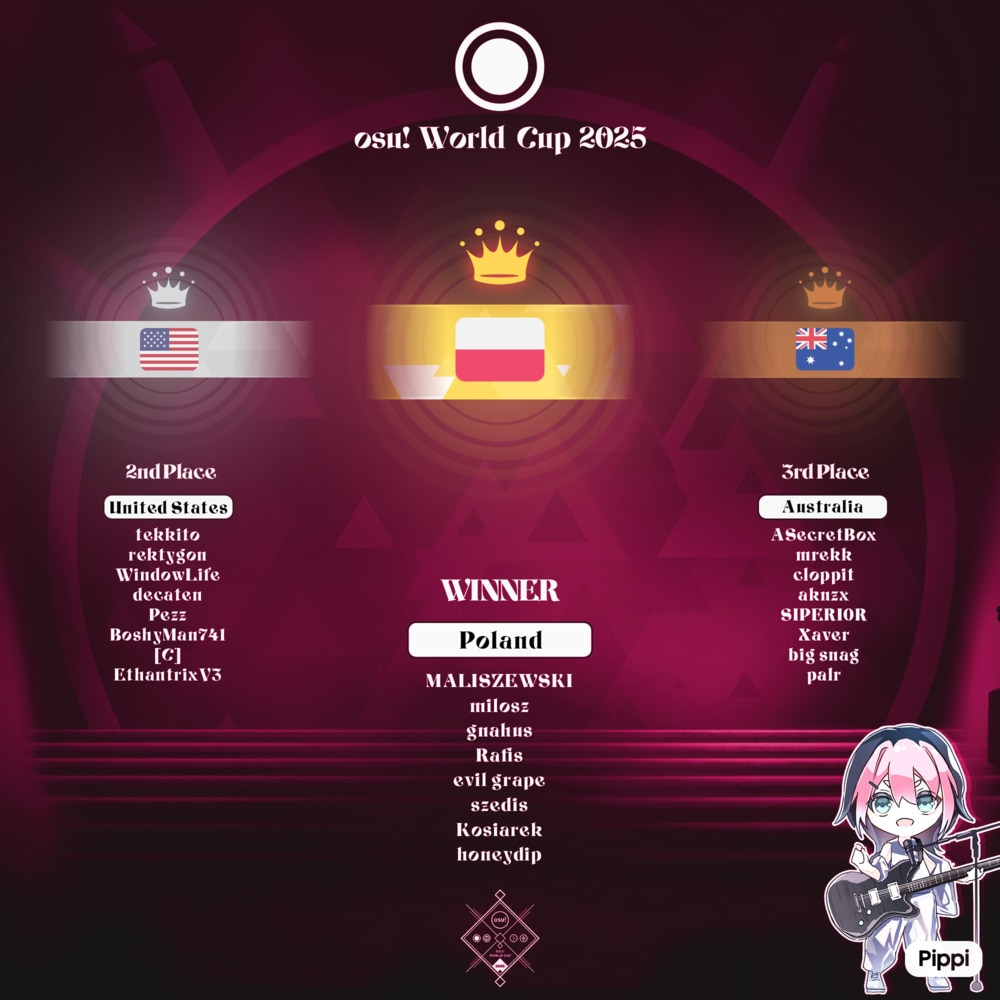

---
tags:
  - OWC
  - OWC2025
---

# osu! World Cup 2025

The **osu! World Cup 2025** (***OWC 2025***) was a country-based osu! tournament hosted by the [osu! team](/wiki/People/osu!_team). It was the sixteenth instalment of the osu! World Cup.

## Tournament schedule

| Event | Timestamp |
| --: | :-- |
| Registration phase | 2025-09-26 (14:00 UTC)/2025-10-10 (23:59 UTC) |
| Qualifier showcase | 2025-10-19 (17:00 UTC) |
| Qualifier stage | 2025-10-25/2025-10-26 |
| Group Stage | 2025-11-01/2025-11-09 |
| Round of 16 | 2025-11-15/2025-11-16 |
| Quarterfinals | 2025-11-22/2025-11-23 |
| Semifinals | 2025-11-29/2025-11-30 |
| Finals | 2025-12-06/2025-12-07 |
| Grand Finals | 2025-12-13/2025-12-14 |

## Prizes

The osu! World Cup 2025 offered a $10,000 cash prize pool and limited-edition merch.

| Placing | Prizes |
| :-: | :-- |
|  | 50% of the prize pool, single-run merch, profile badge, **osu! Champion** user title for one year |
|  | 30% of the prize pool, single-run merch, profile badge |
|  | 20% of the prize pool, single-run merch, profile badge |

  

## Organisation

The osu! World Cup 2025 was run by the [osu! team](/wiki/People/osu!_team) and various community members.

| Position | Member(s) |
| :-- | :-- |
| Manager | ::{ flag=CA }:: [Azer](https://osu.ppy.sh/users/2155578), ::{ flag=US }:: [ChillierPear](https://osu.ppy.sh/users/9501251), ::{ flag=BR }:: [LeoFLT](https://osu.ppy.sh/users/3668779), ::{ flag=GB }:: [mangomizer](https://osu.ppy.sh/users/1893718), ::{ flag=CN }:: [Sakura006](https://osu.ppy.sh/users/10365024) |
| Mappool selector | ::{ flag=CA }:: [Azer](https://osu.ppy.sh/users/2155578), ::{ flag=US }:: [BATBALL](https://osu.ppy.sh/users/15173952), ::{ flag=CA }:: [chiv](https://osu.ppy.sh/users/6701656), ::{ flag=BR }:: [Dada](https://osu.ppy.sh/users/9119507), ::{ flag=CN }:: [FcEazy](https://osu.ppy.sh/users/7825227), ::{ flag=US }:: [M I L E S](https://osu.ppy.sh/users/6036351), ::{ flag=MX }:: [Riot](https://osu.ppy.sh/users/4256461) |
| Mappool helper | ::{ flag=CA }:: [Azer](https://osu.ppy.sh/users/2155578), ::{ flag=HK }:: [Chaoslitz](https://osu.ppy.sh/users/3621552), ::{ flag=CA }:: [El Condor Pasa](https://osu.ppy.sh/users/4415285), ::{ flag=PH }:: [enri](https://osu.ppy.sh/users/8640970), ::{ flag=TW }:: [Imokora](https://osu.ppy.sh/users/2472609), ::{ flag=US }:: [Librarian](https://osu.ppy.sh/users/10083084), ::{ flag=US }:: [Mathyu](https://osu.ppy.sh/users/6303313), ::{ flag=KR }:: [momoyo](https://osu.ppy.sh/users/12469536), ::{ flag=DE }:: [Mordred](https://osu.ppy.sh/users/7265097), ::{ flag=HK }:: [Petal](https://osu.ppy.sh/users/7354729), ::{ flag=US }:: [revoh](https://osu.ppy.sh/users/8165181), ::{ flag=US }:: [toybot](https://osu.ppy.sh/users/2848604) |
| Mappool playtester | ::{ flag=US }:: [\-Arko](https://osu.ppy.sh/users/8802914), ::{ flag=US }:: [\-Schwarts](https://osu.ppy.sh/users/4673649), ::{ flag=PA }:: [AR9](https://osu.ppy.sh/users/5136821), ::{ flag=US }:: [Boolin](https://osu.ppy.sh/users/10664409), ::{ flag=US }:: [ChillierPear](https://osu.ppy.sh/users/9501251), ::{ flag=US }:: [conradmittn](https://osu.ppy.sh/users/8208289), ::{ flag=CA }:: [emmyerson](https://osu.ppy.sh/users/7613309), ::{ flag=RU }:: [Endura](https://osu.ppy.sh/users/7774197), ::{ flag=PH }:: [enri](https://osu.ppy.sh/users/8640970), ::{ flag=KR }:: [Garalulu](https://osu.ppy.sh/users/757783), ::{ flag=TW }:: [Imokora](https://osu.ppy.sh/users/2472609), ::{ flag=US }:: [Jakson](https://osu.ppy.sh/users/8788058), ::{ flag=JP }:: [KonKonKinakoN](https://osu.ppy.sh/users/4733185), ::{ flag=US }:: [koral](https://osu.ppy.sh/users/754792), ::{ flag=PH }:: [lovetachyon](https://osu.ppy.sh/users/9642774), ::{ flag=RO }:: [Lucrise](https://osu.ppy.sh/users/9719351), ::{ flag=RU }:: [Markrum](https://osu.ppy.sh/users/11854446), ::{ flag=US }:: [Mathyu](https://osu.ppy.sh/users/6303313), ::{ flag=UA }:: [RafGPio](https://osu.ppy.sh/users/13705417), ::{ flag=US }:: [rhythmicRS](https://osu.ppy.sh/users/14097024), ::{ flag=SE }:: [soik](https://osu.ppy.sh/users/4316633), ::{ flag=US }:: [Swiq](https://osu.ppy.sh/users/11269055), ::{ flag=GB }:: [synoxa](https://osu.ppy.sh/users/10333154), ::{ flag=US }:: [taro](https://osu.ppy.sh/users/13586618), ::{ flag=CA }:: [Wieran](https://osu.ppy.sh/users/2303856), ::{ flag=US }:: [wr8th](https://osu.ppy.sh/users/20276851), ::{ flag=NZ }:: [yamss](https://osu.ppy.sh/users/6600930) |
| Mapper | ::{ flag=JP }:: [\_kotachi\_](https://osu.ppy.sh/users/4698485), ::{ flag=IT }:: [\-kevincela\-](https://osu.ppy.sh/users/266596), ::{ flag=AR }:: [\-Links](https://osu.ppy.sh/users/10804237), ::{ flag=HK }:: [\[ Drop \]](https://osu.ppy.sh/users/2391299), ::{ flag=TW }:: [9ami](https://osu.ppy.sh/users/1499997), ::{ flag=PH }:: [acnozei](https://osu.ppy.sh/users/10141268), ::{ flag=KR }:: [Acylica](https://osu.ppy.sh/users/1943309), ::{ flag=GB }:: [Aistre](https://osu.ppy.sh/users/4879380), ::{ flag=CA }:: [alden](https://osu.ppy.sh/users/3545323), ::{ flag=UA }:: [allein](https://osu.ppy.sh/users/6221637), ::{ flag=GB }:: [Altai](https://osu.ppy.sh/users/5745865), ::{ flag=PH }:: [Amateurre](https://osu.ppy.sh/users/7326908), ::{ flag=DE }:: [an3](https://osu.ppy.sh/users/11954090), ::{ flag=PL }:: [App](https://osu.ppy.sh/users/13650508), ::{ flag=HK }:: [Arushii](https://osu.ppy.sh/users/15664628), ::{ flag=US }:: [Axarious](https://osu.ppy.sh/users/2614511), ::{ flag=CA }:: [Azer](https://osu.ppy.sh/users/2155578), ::{ flag=ID }:: [Azrulk](https://osu.ppy.sh/users/12046612), ::{ flag=KR }:: [Beomsan](https://osu.ppy.sh/users/3626063), ::{ flag=FI }:: [bob](https://osu.ppy.sh/users/5346261), ::{ flag=CN }:: [Callionet](https://osu.ppy.sh/users/3072921), ::{ flag=US }:: [Camo](https://osu.ppy.sh/users/5194391), ::{ flag=US }:: [captin1](https://osu.ppy.sh/users/689997), ::{ flag=KR }:: [Cellina](https://osu.ppy.sh/users/2490770), ::{ flag=HK }:: [Chaoslitz](https://osu.ppy.sh/users/3621552), ::{ flag=BR }:: [Dada](https://osu.ppy.sh/users/9119507), ::{ flag=KR }:: [Dailycare](https://osu.ppy.sh/users/1634445), ::{ flag=CA }:: [Deca](https://osu.ppy.sh/users/9088487), ::{ flag=JP }:: [dectopia](https://osu.ppy.sh/users/2845904), ::{ flag=GB }:: [DeviousPanda](https://osu.ppy.sh/users/4966334), ::{ flag=PH }:: [flake](https://osu.ppy.sh/users/7627157), ::{ flag=TW }:: [Flask](https://osu.ppy.sh/users/959763), ::{ flag=MX }:: [funny](https://osu.ppy.sh/users/8473573), ::{ flag=CN }:: [Garden](https://osu.ppy.sh/users/2849992), ::{ flag=JP }:: [gazimal](https://osu.ppy.sh/users/6055351), ::{ flag=FR }:: [Halgoh](https://osu.ppy.sh/users/4109923), ::{ flag=KR }:: [Heilia](https://osu.ppy.sh/users/9823042), ::{ flag=DE }:: [Icekalt](https://osu.ppy.sh/users/5410645), ::{ flag=EE }:: [iljaaz](https://osu.ppy.sh/users/8501291), ::{ flag=GB }:: [Ishtiaq](https://osu.ppy.sh/users/6405262), ::{ flag=US }:: [ItsWinter](https://osu.ppy.sh/users/6381153), ::{ flag=SG }:: [Ixcors](https://osu.ppy.sh/users/11194087), ::{ flag=CA }:: [jonathanlfj](https://osu.ppy.sh/users/270377), ::{ flag=US }:: [Kataryn](https://osu.ppy.sh/users/19044162), ::{ flag=CA }:: [ktgster](https://osu.ppy.sh/users/53378), ::{ flag=DE }:: [Lasse](https://osu.ppy.sh/users/896613), ::{ flag=AR }:: [Lince Cosmico](https://osu.ppy.sh/users/6070370), ::{ flag=VN }:: [LMT](https://osu.ppy.sh/users/7262798), ::{ flag=US }:: [Local Hero](https://osu.ppy.sh/users/16134122), ::{ flag=KR }:: [Luscent](https://osu.ppy.sh/users/2688581), ::{ flag=CN }:: [Luval](https://osu.ppy.sh/users/22414293), ::{ flag=TW }:: [Matsuyuki Ame](https://osu.ppy.sh/users/12763959), ::{ flag=ZA }:: [Mattay](https://osu.ppy.sh/users/9748303), ::{ flag=AR }:: [Megafan](https://osu.ppy.sh/users/6632605), ::{ flag=DE }:: [Mir](https://osu.ppy.sh/users/8688812), ::{ flag=BR }:: [Mismagius](https://osu.ppy.sh/users/19048), ::{ flag=US }:: [mithew](https://osu.ppy.sh/users/2571893), ::{ flag=NZ }:: [moph](https://osu.ppy.sh/users/2233878), ::{ flag=CL }:: [Mysty](https://osu.ppy.sh/users/10210657), ::{ flag=RO }:: [nanoya](https://osu.ppy.sh/users/12366071), ::{ flag=RU }:: [neko ds](https://osu.ppy.sh/users/4688735), ::{ flag=RU }:: [netnesanya](https://osu.ppy.sh/users/6017901), ::{ flag=NL }:: [nik](https://osu.ppy.sh/users/10077264), ::{ flag=FI }:: [oatmilk](https://osu.ppy.sh/users/16516525), ::{ flag=HK }:: [Petal](https://osu.ppy.sh/users/7354729), ::{ flag=RU }:: [piroshki](https://osu.ppy.sh/users/7645522), ::{ flag=TW }:: [Plus4j](https://osu.ppy.sh/users/4086497), ::{ flag=CN }:: [pw384](https://osu.ppy.sh/users/1343783), ::{ flag=CL }:: [Pyo](https://osu.ppy.sh/users/6641784), ::{ flag=AU }:: [ralsricat](https://osu.ppy.sh/users/12318332), ::{ flag=CY }:: [ravensong](https://osu.ppy.sh/users/10772580), ::{ flag=US }:: [revoh](https://osu.ppy.sh/users/8165181), ::{ flag=EE }:: [riot1133](https://osu.ppy.sh/users/11877992), ::{ flag=US }:: [RLC](https://osu.ppy.sh/users/1047883), ::{ flag=JP }:: [rollpan](https://osu.ppy.sh/users/3062998), ::{ flag=SG }:: [Rtyzen](https://osu.ppy.sh/users/2439822), ::{ flag=CN }:: [Ryuusei Aika](https://osu.ppy.sh/users/7777875), ::{ flag=RU }:: [Sanch\-KK](https://osu.ppy.sh/users/9131844), ::{ flag=JP }:: [Satellite](https://osu.ppy.sh/users/1661227), ::{ flag=HK }:: [seros](https://osu.ppy.sh/users/10562853), ::{ flag=PH }:: [Shizuku\-](https://osu.ppy.sh/users/1125647), ::{ flag=HK }:: [shoyeu](https://osu.ppy.sh/users/11854343), ::{ flag=US }:: [squirrelpascals](https://osu.ppy.sh/users/6151332), ::{ flag=US }:: [Surgis](https://osu.ppy.sh/users/16847674), ::{ flag=US }:: [toybot](https://osu.ppy.sh/users/2848604), ::{ flag=FI }:: [verychill](https://osu.ppy.sh/users/10132936), ::{ flag=BR }:: [vetoed](https://osu.ppy.sh/users/10909373), ::{ flag=US }:: [Wispy](https://osu.ppy.sh/users/11106929), ::{ flag=CN }:: [X Light](https://osu.ppy.sh/users/1814662), ::{ flag=CN }:: [yf\_bmp](https://osu.ppy.sh/users/1243669) |
| Hitsounder | ::{ flag=JP }:: [arthRo](https://osu.ppy.sh/users/21663721), ::{ flag=PH }:: [midorijeon](https://osu.ppy.sh/users/10969875), ::{ flag=IL }:: [muya-](https://osu.ppy.sh/users/12883611), ::{ flag=CN }:: [TtmnZk](https://osu.ppy.sh/users/2495509) |
| Spread contributors | **::{ flag=US }:: [Cytusine](https://osu.ppy.sh/users/11557554), ::{ flag=US }:: [Wispy](https://osu.ppy.sh/users/11106929)**, ::{ flag=US }:: [ajmosca](https://osu.ppy.sh/users/19884809), ::{ flag=US }:: [BATBALL](https://osu.ppy.sh/users/15173952), ::{ flag=US }:: [Camo](https://osu.ppy.sh/users/5194391), ::{ flag=HK }:: [Chaoslitz](https://osu.ppy.sh/users/3621552), ::{ flag=TH }:: [Deppyforce](https://osu.ppy.sh/users/5286213), ::{ flag=PH }:: [enri](https://osu.ppy.sh/users/8640970), ::{ flag=US }:: [fieryrage](https://osu.ppy.sh/users/3533958), ::{ flag=TW }:: [Flask](https://osu.ppy.sh/users/959763), ::{ flag=FI }:: [fllecc](https://osu.ppy.sh/users/14060327), ::{ flag=VN }:: [Hikan](https://osu.ppy.sh/users/7968702), ::{ flag=SG }:: [Ixcors](https://osu.ppy.sh/users/11194087), ::{ flag=GB }:: [Knightc0re](https://osu.ppy.sh/users/7894340), ::{ flag=CN }:: [Lavender](https://osu.ppy.sh/users/3850859), ::{ flag=KZ }:: [Lightin](https://osu.ppy.sh/users/7595619), ::{ flag=VN }:: [LMT](https://osu.ppy.sh/users/7262798), ::{ flag=DE }:: [Mir](https://osu.ppy.sh/users/8688812), ::{ flag=KR }:: [momoyo](https://osu.ppy.sh/users/12469536), ::{ flag=NL }:: [nik](https://osu.ppy.sh/users/10077264), ::{ flag=AU }:: [nominomu](https://osu.ppy.sh/users/30485380), ::{ flag=TR }:: [Nymphe](https://osu.ppy.sh/users/10507407), ::{ flag=DE }:: [Okoayu](https://osu.ppy.sh/users/1623405), ::{ flag=ID }:: [SupaV](https://osu.ppy.sh/users/19511007), ::{ flag=TW }:: [TNTlealu](https://osu.ppy.sh/users/9502522), ::{ flag=US }:: [toybot](https://osu.ppy.sh/users/2848604), ::{ flag=CN }:: [TtmnZk](https://osu.ppy.sh/users/2495509), ::{ flag=FI }:: [verychill](https://osu.ppy.sh/users/10132936), ::{ flag=IT }:: [zekk](https://osu.ppy.sh/users/9704802) |
| Commentator | **::{ flag=US }:: [ChillierPear](https://osu.ppy.sh/users/9501251)**, ::{ flag=CA }:: [Azer](https://osu.ppy.sh/users/2155578), ::{ flag=ID }:: [BlankTap](https://osu.ppy.sh/users/10137131), ::{ flag=GB }:: [Bubbleman](https://osu.ppy.sh/users/5182050), ::{ flag=CA }:: [D I O](https://osu.ppy.sh/users/3958619), ::{ flag=GB }:: [Damarsh](https://osu.ppy.sh/users/7465147), ::{ flag=US }:: [Dohland](https://osu.ppy.sh/users/5220511), ::{ flag=GB }:: [Doomsday](https://osu.ppy.sh/users/18983), ::{ flag=US }:: [fieryrage](https://osu.ppy.sh/users/3533958), ::{ flag=US }:: [hubbawubba](https://osu.ppy.sh/users/15910288), ::{ flag=CA }:: [I\-Flame](https://osu.ppy.sh/users/11257542), ::{ flag=KZ }:: [Lightin](https://osu.ppy.sh/users/7595619), ::{ flag=US }:: [M I L E S](https://osu.ppy.sh/users/6036351), ::{ flag=AU }:: [Mavs](https://osu.ppy.sh/users/11076938), ::{ flag=GB }:: [SadShiba](https://osu.ppy.sh/users/10747626), ::{ flag=US }:: [this1neguy](https://osu.ppy.sh/users/1797189), ::{ flag=AU }:: [Vordi](https://osu.ppy.sh/users/6659116) |
| Commentator (special guests) | ::{ flag=IE }:: [\-Nightkore](https://osu.ppy.sh/users/26311862), ::{ flag=DE }:: [Bernkastel](https://osu.ppy.sh/users/5154946), ::{ flag=CA }:: [chiv](https://osu.ppy.sh/users/6701656), ::{ flag=BR }:: [Dada](https://osu.ppy.sh/users/9119507), ::{ flag=CN }:: [FcEazy](https://osu.ppy.sh/users/7825227), ::{ flag=SG }:: [gamicrayola](https://osu.ppy.sh/users/29426345), ::{ flag=US }:: [Lisseroni](https://osu.ppy.sh/users/18400866), ::{ flag=AU }:: [Maitoo](https://osu.ppy.sh/users/16899553), ::{ flag=AU }:: [mrekk](https://osu.ppy.sh/users/7562902), ::{ flag=US }:: [Pezz](https://osu.ppy.sh/users/10651106), ::{ flag=SG }:: [Raveille](https://osu.ppy.sh/users/1388767), ::{ flag=US }:: [Sparky](https://osu.ppy.sh/users/3187959), ::{ flag=US }:: [Stage](https://osu.ppy.sh/users/8191845), ::{ flag=FR }:: [Subaru\_Arima](https://osu.ppy.sh/users/11273062), ::{ flag=GB }:: [Teezel](https://osu.ppy.sh/users/7528639), ::{ flag=US }:: [Toaph Daddy](https://osu.ppy.sh/users/7616811) |
| Referee | **::{ flag=BR }:: [LeoFLT](https://osu.ppy.sh/users/3668779)**, ::{ flag=IN }:: [\-Space](https://osu.ppy.sh/users/7720204), ::{ flag=US }:: [akace100](https://osu.ppy.sh/users/9308128), ::{ flag=NL }:: [Albionthegreat](https://osu.ppy.sh/users/9853595), ::{ flag=BR }:: [DizzyH](https://osu.ppy.sh/users/9896172), ::{ flag=SE }:: [ellen\-](https://osu.ppy.sh/users/7630166), ::{ flag=VN }:: [Hoaq](https://osu.ppy.sh/users/7696512), ::{ flag=CL }:: [Isita](https://osu.ppy.sh/users/13973026), ::{ flag=AR }:: [KlBBY](https://osu.ppy.sh/users/12182138), ::{ flag=NL }:: [nik](https://osu.ppy.sh/users/10077264), ::{ flag=FI }:: [shdewz](https://osu.ppy.sh/users/10000899), ::{ flag=US }:: [Suicune3](https://osu.ppy.sh/users/6895187), ::{ flag=US }:: [tigereyes144](https://osu.ppy.sh/users/6499811), ::{ flag=GB }:: [Yazzehh](https://osu.ppy.sh/users/7068973) |
| Statistician | **::{ flag=FI }:: [shdewz](https://osu.ppy.sh/users/10000899)**, ::{ flag=BR }:: [LeoFLT](https://osu.ppy.sh/users/3668779) |
| osu! original design | **::{ flag=CN }:: [Sakura006](https://osu.ppy.sh/users/10365024)**, ::{ flag=SI }:: [\- Arisu \-](https://osu.ppy.sh/users/33795284), ::{ flag=US }:: [\-mint\-](https://osu.ppy.sh/users/8976576), ::{ flag=AU }:: [\-pineapple\-](https://osu.ppy.sh/users/11523326), ::{ flag=US }:: [\[celes\]](https://osu.ppy.sh/users/9108428), ::{ flag=CN }:: [AlexDunk](https://osu.ppy.sh/users/9194799), ::{ flag=HK }:: [Alptraum](https://osu.ppy.sh/users/26496648), ::{ flag=GB }:: [Amphy](https://osu.ppy.sh/users/10762223), ::{ flag=US }:: [Antlion](https://osu.ppy.sh/users/23944286), ::{ flag=HK }:: [Arushii](https://osu.ppy.sh/users/15664628), ::{ flag=US }:: [binarie](https://osu.ppy.sh/users/15632854), ::{ flag=US }:: [Boolmaster Flex](https://osu.ppy.sh/users/5394681), ::{ flag=MY }:: [bruh\_shen](https://osu.ppy.sh/users/20581305), ::{ flag=US }:: [CMDR Saturn](https://osu.ppy.sh/users/22001295), ::{ flag=PH }:: [Creameries](https://osu.ppy.sh/users/15851364), ::{ flag=PH }:: [Danimato](https://osu.ppy.sh/users/23541645), ::{ flag=HK }:: [Detristy](https://osu.ppy.sh/users/38325708), ::{ flag=UA }:: [dimavh](https://osu.ppy.sh/users/15056040), ::{ flag=CA }:: [Enkrypton](https://osu.ppy.sh/users/5178122), ::{ flag=DE }:: [Herazu](https://osu.ppy.sh/users/19857248), ::{ flag=HU }:: [Himada](https://osu.ppy.sh/users/10959366), ::{ flag=MY }:: [HiROdoge](https://osu.ppy.sh/users/15251809), ::{ flag=CN }:: [hourius](https://osu.ppy.sh/users/12580298), ::{ flag=MY }:: [Iyouka](https://osu.ppy.sh/users/7138499), ::{ flag=BR }:: [Jhown](https://osu.ppy.sh/users/14772488), ::{ flag=ID }:: [KAITO thighs](https://osu.ppy.sh/users/13103233), ::{ flag=FR }:: [Kheops](https://osu.ppy.sh/users/18607342), ::{ flag=MY }:: [Kourihase](https://osu.ppy.sh/users/13298982), ::{ flag=IT }:: [Kuroise](https://osu.ppy.sh/users/14547127), ::{ flag=CA }:: [Kylerius](https://osu.ppy.sh/users/10253968), ::{ flag=FR }:: [Kyuare](https://osu.ppy.sh/users/2705312), ::{ flag=ID }:: [LenLitchu](https://osu.ppy.sh/users/34098325), ::{ flag=AU }:: [LowGraphics](https://osu.ppy.sh/users/5383942), ::{ flag=FR }:: [Mimiliaa](https://osu.ppy.sh/users/7117621), ::{ flag=US }:: [mohca](https://osu.ppy.sh/users/14499702), ::{ flag=IE }:: [naraicat](https://osu.ppy.sh/users/6419788), ::{ flag=VN }:: [Ningguang](https://osu.ppy.sh/users/8500334), ::{ flag=US }:: [Noffy](https://osu.ppy.sh/users/1541323), ::{ flag=IN }:: [Raybean](https://osu.ppy.sh/users/16676388), ::{ flag=CA }:: [RedcXca](https://osu.ppy.sh/users/14056601), ::{ flag=ID }:: [RianaRei](https://osu.ppy.sh/users/30314534), ::{ flag=CN }:: [RiceSS](https://osu.ppy.sh/users/8271436), ::{ flag=CN }:: [Ryuusei Aika](https://osu.ppy.sh/users/7777875), ::{ flag=US }:: [sardines](https://osu.ppy.sh/users/16247587), ::{ flag=DE }:: [ShiohriMyHero](https://osu.ppy.sh/users/15882740), ::{ flag=NZ }:: [sooky](https://osu.ppy.sh/users/8397914), ::{ flag=SG }:: [sugosugiii](https://osu.ppy.sh/users/15118952), ::{ flag=SG }:: [TheFunk](https://osu.ppy.sh/users/13981991), ::{ flag=SG }:: [Type](https://osu.ppy.sh/users/7520534), ::{ flag=CA }:: [Xiaoraini](https://osu.ppy.sh/users/3607337), ::{ flag=MY }:: [Z419](https://osu.ppy.sh/users/9912966) |
| Tournament design | **::{ flag=CN }:: [Sakura006](https://osu.ppy.sh/users/10365024)**, ::{ flag=AU }:: [\-pineapple\-](https://osu.ppy.sh/users/11523326), ::{ flag=CN }:: [AlexDunk](https://osu.ppy.sh/users/9194799) |
| News team | ::{ flag=CA }:: [Azer](https://osu.ppy.sh/users/2155578), ::{ flag=CA }:: [D I O](https://osu.ppy.sh/users/3958619), ::{ flag=BR }:: [Dada](https://osu.ppy.sh/users/9119507), ::{ flag=IT }:: [Kuroise](https://osu.ppy.sh/users/14547127), ::{ flag=CN }:: [Sakura006](https://osu.ppy.sh/users/10365024), ::{ flag=FI }:: [shdewz](https://osu.ppy.sh/users/10000899), ::{ flag=US }:: [this1neguy](https://osu.ppy.sh/users/1797189), ::{ flag=SE }:: [Walavouchey](https://osu.ppy.sh/users/5773079) |
| Content producers | [D I O](https://www.youtube.com/@dios_dong), [n3rdiness](https://www.youtube.com/@n3rdiness), [Pepper Crab](https://www.youtube.com/@PepperCrabOsu) |
| Musician | [BlackY](https://osu.ppy.sh/beatmaps/artists/150), [Cansol](https://osu.ppy.sh/beatmaps/artists/407), [cygnus](https://osu.ppy.sh/beatmaps/artists/359), [ELFENSJóN](https://osu.ppy.sh/beatmaps/artists/69), [gladde paling](https://linktr.ee/gladdepaling), [Helblinde](https://osu.ppy.sh/beatmaps/artists/5), [Imperial Circus Dead Decadence](https://osu.ppy.sh/beatmaps/artists/35), [Marmalade butcher](https://osu.ppy.sh/beatmaps/artists/220), [MEMODEMO](https://soundcloud.com/MEMODEMO), [MetaHumanBoi](https://osu.ppy.sh/beatmaps/artists/430), [Mili](https://osu.ppy.sh/beatmaps/artists/331), [steelplus / HAGANE](https://steelplus.bandcamp.com), [t+pazolite](https://osu.ppy.sh/beatmaps/artists/396), [XenjeS](https://osu.ppy.sh/beatmaps/artists/482) |

Group leaders denoted in **bold**.

## Links

- **[Information spreadsheet](https://docs.google.com/spreadsheets/d/1QM6MUJzZFW-mtD7r1ExRBQOCjs2eWoOmWNDDG-n2PHE?rm=minimal)**
- [Weekly statistics](https://drive.google.com/drive/folders/1HBibLBldvKv5ig2WXpEfq5n6t8GotWDa) / [overall statistics](https://docs.google.com/spreadsheets/d/1Ho40YG74D_GyVTaL5Orcwak2kt_fAoLAEih7SzlYb8s?rm=minimal)
- [Livestream](https://www.twitch.tv/osulive)
- [Discussion thread](https://osu.ppy.sh/community/forums/topics/2133817)
- [Tournament listing](https://osu.ppy.sh/community/tournaments/52)
- Challonge brackets: [Group stage](https://challonge.com/OWC25_Groups/groups) / [Bracket stage](https://challonge.com/OWC2025)
- [Pick'ems page](https://pickem.hwc.hr/tournaments/186) hosted by ::{ flag=DE }:: [hallowatcher](https://osu.ppy.sh/users/1874761)

## Participants

|  | Country | Members |
| :-: | :-: | :-- |
| ::{ flag=AR }:: | **Argentina** | **[Bomilk](https://osu.ppy.sh/users/7081596)**, [Amuro](https://osu.ppy.sh/users/7119659), [jackzebra](https://osu.ppy.sh/users/20120615), [Tofy](https://osu.ppy.sh/users/11113067), [viciobylike](https://osu.ppy.sh/users/18922516), [smashcae](https://osu.ppy.sh/users/10459580), [Penguo](https://osu.ppy.sh/users/4389490), [Seiong](https://osu.ppy.sh/users/7341471) |
| ::{ flag=AU }:: | **Australia** | **[ASecretBox](https://osu.ppy.sh/users/7341183)**, [mrekk](https://osu.ppy.sh/users/7562902), [cloppit](https://osu.ppy.sh/users/19851850), [aknzx](https://osu.ppy.sh/users/9938943), [SUPERI0R](https://osu.ppy.sh/users/17235399), [Xaver](https://osu.ppy.sh/users/7410343), [big snag](https://osu.ppy.sh/users/8181420), [palr](https://osu.ppy.sh/users/15429006) |
| ::{ flag=AT }:: | **Austria** | **[fedoragoose](https://osu.ppy.sh/users/2323131)**, [z10a](https://osu.ppy.sh/users/18153252), [fruit cup](https://osu.ppy.sh/users/8369887), [Akuma no Tenshi](https://osu.ppy.sh/users/21811804), [z9a](https://osu.ppy.sh/users/13057699), [Teppi Fangirl](https://osu.ppy.sh/users/16522589), [tomadoi](https://osu.ppy.sh/users/5712451), [Teppi](https://osu.ppy.sh/users/1371974) |
| ::{ flag=BY }:: | **Belarus** | **[khaurege12](https://osu.ppy.sh/users/22274174)**, [dados123](https://osu.ppy.sh/users/17949915), [bern1sh](https://osu.ppy.sh/users/17851835), [anmear](https://osu.ppy.sh/users/25927812), [ITheQwertyI](https://osu.ppy.sh/users/16006269), [L1ssak](https://osu.ppy.sh/users/17485776), [LOVETHEISM](https://osu.ppy.sh/users/17448980), [Tepe6oHbka](https://osu.ppy.sh/users/17604898) |
| ::{ flag=BE }:: | **Belgium** | **[Hanori](https://osu.ppy.sh/users/7078544)**, [hexi](https://osu.ppy.sh/users/10760701), [Mornis](https://osu.ppy.sh/users/6479616), [5joshi](https://osu.ppy.sh/users/4279650), [Vinnie](https://osu.ppy.sh/users/8509247), [MRB](https://osu.ppy.sh/users/11234975), [meramin](https://osu.ppy.sh/users/13539892), [\[ Unmei \]](https://osu.ppy.sh/users/10552613) |
| ::{ flag=BA }:: | **Bosnia and Herzegovina** | **[Quiligru](https://osu.ppy.sh/users/10270382)**, [dax420](https://osu.ppy.sh/users/14658906), [egomaniac](https://osu.ppy.sh/users/18017232), [Emchi](https://osu.ppy.sh/users/15000287), [\_\_Neo](https://osu.ppy.sh/users/8956749), [V0lcano\_](https://osu.ppy.sh/users/23143145) |
| ::{ flag=BR }:: | **Brazil** | **[Coreanmaluco](https://osu.ppy.sh/users/3149577)**, [-izzy](https://osu.ppy.sh/users/15225729), [kagiura](https://osu.ppy.sh/users/11461810), [Kurumiw](https://osu.ppy.sh/users/11415687), [Nyash](https://osu.ppy.sh/users/12976255), [shwq](https://osu.ppy.sh/users/22536015), [tayko](https://osu.ppy.sh/users/20328948), [VitorSkull](https://osu.ppy.sh/users/10223298) |
| ::{ flag=BG }:: | **Bulgaria** | **[Prahosnika](https://osu.ppy.sh/users/12349105)**, [hlanden](https://osu.ppy.sh/users/4934554), [- Frane-](https://osu.ppy.sh/users/7211425), [Thornnn](https://osu.ppy.sh/users/24371637), [Ivanix](https://osu.ppy.sh/users/16380723), [SynchroHD](https://osu.ppy.sh/users/6584220), [yun](https://osu.ppy.sh/users/7847997), [Rengmain](https://osu.ppy.sh/users/8170966) |
| ::{ flag=CA }:: | **Canada** | **[Zylice](https://osu.ppy.sh/users/5033077)**, [xootynator](https://osu.ppy.sh/users/3717598), [Wanderio](https://osu.ppy.sh/users/16529875), [nujabes](https://osu.ppy.sh/users/12258658), [yip](https://osu.ppy.sh/users/5177569), [PinkEyeFan2013](https://osu.ppy.sh/users/13609904), [steamhappy](https://osu.ppy.sh/users/7802400), [SparklyFairy200](https://osu.ppy.sh/users/10676573) |
| ::{ flag=CL }:: | **Chile** | **[Intercambing](https://osu.ppy.sh/users/2546001)**, [alfiu](https://osu.ppy.sh/users/17724014), [Hanayume](https://osu.ppy.sh/users/12211248), [xXChokgamerXx](https://osu.ppy.sh/users/7748891), [siiphs](https://osu.ppy.sh/users/11786864), [Gonzah](https://osu.ppy.sh/users/12434652), [Lasseh](https://osu.ppy.sh/users/4881251), [NO37](https://osu.ppy.sh/users/4653583) |
| ::{ flag=CN }:: | **China** | **[lolol235](https://osu.ppy.sh/users/6090175)**, [lolol234](https://osu.ppy.sh/users/5791401), [lolol233](https://osu.ppy.sh/users/11375105), [Crystal](https://osu.ppy.sh/users/1646397), [Ledeau\_Fox](https://osu.ppy.sh/users/15816872), [z980838928](https://osu.ppy.sh/users/1355695), [Moonlit111](https://osu.ppy.sh/users/12215507), [pr1mary](https://osu.ppy.sh/users/15100415) |
| ::{ flag=CO }:: | **Colombia** | **[Carlosflow](https://osu.ppy.sh/users/11940767)**, [Okinari](https://osu.ppy.sh/users/18373966), [Pabloniichan](https://osu.ppy.sh/users/17117482), [-WarbOsu-](https://osu.ppy.sh/users/10426355), [Jekuru](https://osu.ppy.sh/users/11727492), [Phel](https://osu.ppy.sh/users/9367683), [gato hongo](https://osu.ppy.sh/users/11068425), [MinsterDA](https://osu.ppy.sh/users/9324510) |
| ::{ flag=HR }:: | **Croatia** | **[tigiexe](https://osu.ppy.sh/users/14125627)**, [mizto](https://osu.ppy.sh/users/13330123), [DragonCroc](https://osu.ppy.sh/users/4334103), [-Rigel-](https://osu.ppy.sh/users/23350068), [The Fart Lord](https://osu.ppy.sh/users/7912447), [Slowpoke1619](https://osu.ppy.sh/users/21202239), [rew](https://osu.ppy.sh/users/13083042) |
| ::{ flag=CZ }:: | **Czechia** | **[Dri3x](https://osu.ppy.sh/users/11478426)**, [fisskill](https://osu.ppy.sh/users/15247939), [Jan Klin](https://osu.ppy.sh/users/10912688), [Mirek](https://osu.ppy.sh/users/6595616), [Tachyon Agnes](https://osu.ppy.sh/users/9694973), [RiceShower](https://osu.ppy.sh/users/12789853), [Umatza](https://osu.ppy.sh/users/8211461), [Toji\_fushiguro\_](https://osu.ppy.sh/users/17381728) |
| ::{ flag=DK }:: | **Denmark** | **[Sobu-](https://osu.ppy.sh/users/13872272)**, [thebeastjona](https://osu.ppy.sh/users/13452017), [Polle](https://osu.ppy.sh/users/13218204), [Cittas](https://osu.ppy.sh/users/13347734), [iamVill](https://osu.ppy.sh/users/6295380), [autofister](https://osu.ppy.sh/users/11380904), [Nordkild](https://osu.ppy.sh/users/4622337), [mads](https://osu.ppy.sh/users/13033798) |
| ::{ flag=EE }:: | **Estonia** | **[kellad](https://osu.ppy.sh/users/20447062)**, [Tiger Claw](https://osu.ppy.sh/users/2064445), [The Hassle](https://osu.ppy.sh/users/14061950), [tambet](https://osu.ppy.sh/users/16770581), [stennu](https://osu.ppy.sh/users/18340710), [Slay](https://osu.ppy.sh/users/7093124), [maftle](https://osu.ppy.sh/users/16558476) |
| ::{ flag=FI }:: | **Finland** | **[Amasetic](https://osu.ppy.sh/users/11375251)**, [AllyrD](https://osu.ppy.sh/users/9561644), [Isak-](https://osu.ppy.sh/users/8702650), [Kalanluu](https://osu.ppy.sh/users/2035254), [Mike Tyson](https://osu.ppy.sh/users/14764185), [Xepei](https://osu.ppy.sh/users/11479551), [savilju](https://osu.ppy.sh/users/8059468), [vaadin peukkua](https://osu.ppy.sh/users/4959454) |
| ::{ flag=FR }:: | **France** | **[Musty](https://osu.ppy.sh/users/251683)**, [fiaee](https://osu.ppy.sh/users/10325072), [Hifkil](https://osu.ppy.sh/users/4301976), [FlasTEH](https://osu.ppy.sh/users/8443945), [Satsukiiii](https://osu.ppy.sh/users/25626082), [calangi](https://osu.ppy.sh/users/7810180), [Geordie Greep](https://osu.ppy.sh/users/17104779), [JapWhite](https://osu.ppy.sh/users/7068158) |
| ::{ flag=GE }:: | **Georgia** | **[DarkFTW](https://osu.ppy.sh/users/14350221)**, [Hirtai](https://osu.ppy.sh/users/36455680), [nawhbody](https://osu.ppy.sh/users/20656091), [Deadline](https://osu.ppy.sh/users/5783393), [Radmos\_](https://osu.ppy.sh/users/25468052), [Andria2004](https://osu.ppy.sh/users/7224935) |
| ::{ flag=DE }:: | **Germany** | **[criller](https://osu.ppy.sh/users/8116659)**, [yary](https://osu.ppy.sh/users/13300203), [Fleh](https://osu.ppy.sh/users/7780605), [Denzel Curry](https://osu.ppy.sh/users/15339747), [ZeitFrost](https://osu.ppy.sh/users/11234706), [aimbotcone](https://osu.ppy.sh/users/12952320), [Tim Kackner](https://osu.ppy.sh/users/14385814), [okinamo](https://osu.ppy.sh/users/3765989) |
| ::{ flag=GR }:: | **Greece** | **[JackPaX](https://osu.ppy.sh/users/11226645)**, [-Puyu](https://osu.ppy.sh/users/10398348), [bisbo](https://osu.ppy.sh/users/11893703), [KittyLikeme](https://osu.ppy.sh/users/15457184), [Leftie](https://osu.ppy.sh/users/3423454), [MyAimPeeps](https://osu.ppy.sh/users/15427656), [Nekkid](https://osu.ppy.sh/users/12145220), [trushpack](https://osu.ppy.sh/users/9498428) |
| ::{ flag=HK }:: | **Hong Kong** | **[Hibiki](https://osu.ppy.sh/users/5413624)**, [misha awa](https://osu.ppy.sh/users/14503423), [F2X](https://osu.ppy.sh/users/16227745), [flyond](https://osu.ppy.sh/users/17663666), [ming0328ming](https://osu.ppy.sh/users/2984074), [rlsc1109](https://osu.ppy.sh/users/20285591), [Tsukime](https://osu.ppy.sh/users/16375942), [RevengeWolf](https://osu.ppy.sh/users/6386735) |
| ::{ flag=HU }:: | **Hungary** | **[defii](https://osu.ppy.sh/users/8698024)**, [baliiii](https://osu.ppy.sh/users/14059423), [csaba21123](https://osu.ppy.sh/users/7764237), [gecseboti](https://osu.ppy.sh/users/15213139), [Indicolite](https://osu.ppy.sh/users/19309181), [linkay](https://osu.ppy.sh/users/17962280), [matyk0](https://osu.ppy.sh/users/8596945), [Winkero](https://osu.ppy.sh/users/6499896) |
| ::{ flag=IN }:: | **India** | **[ArtoriaMyAngel](https://osu.ppy.sh/users/11412507)**, [\_Cyan](https://osu.ppy.sh/users/10250612), [Potla](https://osu.ppy.sh/users/1788022), [-kyaru](https://osu.ppy.sh/users/23532205), [Smudgy24](https://osu.ppy.sh/users/25011352), [OsuMaster1290](https://osu.ppy.sh/users/13517095), [zmecha](https://osu.ppy.sh/users/20861921), [Mahiru My Angel](https://osu.ppy.sh/users/26813327) |
| ::{ flag=ID }:: | **Indonesia** | **[GNX](https://osu.ppy.sh/users/10069909)**, [lifeline](https://osu.ppy.sh/users/11367222), [FAW](https://osu.ppy.sh/users/11070577), [Hakui Koyori](https://osu.ppy.sh/users/10717635), [MejiroMcQueen](https://osu.ppy.sh/users/11320627), [MineFrostID](https://osu.ppy.sh/users/12159899), [Stixe](https://osu.ppy.sh/users/18351160), [Thatnoobguy](https://osu.ppy.sh/users/11091594) |
| ::{ flag=IE }:: | **Ireland** | **[M a t t y](https://osu.ppy.sh/users/3737136)**, [nava](https://osu.ppy.sh/users/6450765), [MySliderBreak](https://osu.ppy.sh/users/5312461), [Dinky](https://osu.ppy.sh/users/13794249), [scug](https://osu.ppy.sh/users/23205272), [MySliderBoy](https://osu.ppy.sh/users/25211165) |
| ::{ flag=IL }:: | **Israel** | **[MrPotato](https://osu.ppy.sh/users/2787415)**, [PaintedKoala](https://osu.ppy.sh/users/10056419), [cihp](https://osu.ppy.sh/users/12083446), [tyty5180](https://osu.ppy.sh/users/15389454), [Galog](https://osu.ppy.sh/users/7799629), [Petah Tikva](https://osu.ppy.sh/users/10119845), [F3n1X](https://osu.ppy.sh/users/16083856), [CIash of Clans](https://osu.ppy.sh/users/16048250) |
| ::{ flag=IT }:: | **Italy** | **[MeOwz](https://osu.ppy.sh/users/17446380)**, [Toukai Teiou](https://osu.ppy.sh/users/11215030), [-NyX](https://osu.ppy.sh/users/17022896), [BELLOFIGO](https://osu.ppy.sh/users/18818123), [Duke](https://osu.ppy.sh/users/21709356), [kusuriya](https://osu.ppy.sh/users/6387149), [m4rkvc](https://osu.ppy.sh/users/17733888), [Ryuzaki](https://osu.ppy.sh/users/7165477) |
| ::{ flag=JP }:: | **Japan** | **[YMD](https://osu.ppy.sh/users/17202789)**, [Aotoleen](https://osu.ppy.sh/users/3162741), [hosesan1020](https://osu.ppy.sh/users/23280447), [shouponpon](https://osu.ppy.sh/users/22986777), [Furamun](https://osu.ppy.sh/users/14671051), [Homutan](https://osu.ppy.sh/users/8655635), [haga1115](https://osu.ppy.sh/users/6574823), [RafuNa](https://osu.ppy.sh/users/11481765) |
| ::{ flag=KZ }:: | **Kazakhstan** | **[Ternafis](https://osu.ppy.sh/users/9921139)**, [Kamensh1k](https://osu.ppy.sh/users/16817965), [Ravexi](https://osu.ppy.sh/users/14438574), [shiyumi](https://osu.ppy.sh/users/8914317), [3uma](https://osu.ppy.sh/users/31406901), [ItzZeroIce](https://osu.ppy.sh/users/18673485), [MyAngelRasseru](https://osu.ppy.sh/users/14084387), [nybia](https://osu.ppy.sh/users/19483487) |
| ::{ flag=KG }:: | **Kyrgyzstan** | **[CpxG](https://osu.ppy.sh/users/12270069)**, [ded24lol](https://osu.ppy.sh/users/14795251), [FenixoLaFen](https://osu.ppy.sh/users/10526936), [Madaraha](https://osu.ppy.sh/users/11137291), [RInatGM](https://osu.ppy.sh/users/12243792), [Saito Hajime](https://osu.ppy.sh/users/11568964), [cpx](https://osu.ppy.sh/users/25849153), [heartpart](https://osu.ppy.sh/users/23167746) |
| ::{ flag=LV }:: | **Latvia** | **[waywern2012](https://osu.ppy.sh/users/5870453)**, [hihihaha142](https://osu.ppy.sh/users/21653406), [day drinking](https://osu.ppy.sh/users/12070555), [kbwaaablya](https://osu.ppy.sh/users/6473092), [Murzikk](https://osu.ppy.sh/users/12000193), [olivers31](https://osu.ppy.sh/users/10816682), [StellarOW](https://osu.ppy.sh/users/11342324), [xan\_ly](https://osu.ppy.sh/users/11885405) |
| ::{ flag=LT }:: | **Lithuania** | **[CamperLt](https://osu.ppy.sh/users/4582149)**, [basketball](https://osu.ppy.sh/users/10290012), [ganjanov](https://osu.ppy.sh/users/11584075), [Hera\_](https://osu.ppy.sh/users/8766780), [Torment](https://osu.ppy.sh/users/4114438), [Nitram](https://osu.ppy.sh/users/10569535), [Azerite8](https://osu.ppy.sh/users/9031871), [Werkit](https://osu.ppy.sh/users/2623785) |
| ::{ flag=MO }:: | **Macau** | **[Chino-](https://osu.ppy.sh/users/16117538)**, [FakeAlexChio](https://osu.ppy.sh/users/16656942), [-PSC-](https://osu.ppy.sh/users/24350045), [knight87](https://osu.ppy.sh/users/12648780), [Polyr3x](https://osu.ppy.sh/users/12112953), [SBHO](https://osu.ppy.sh/users/16974919), [Tokirii](https://osu.ppy.sh/users/11563694) |
| ::{ flag=MY }:: | **Malaysia** | **[Harumi Ena](https://osu.ppy.sh/users/16436446)**, [Rampax](https://osu.ppy.sh/users/3995630), [mint breeze](https://osu.ppy.sh/users/10343292), [mabayu](https://osu.ppy.sh/users/11918602), [Chiyuu](https://osu.ppy.sh/users/8226107), [Chibi Maruko](https://osu.ppy.sh/users/5585377), [n0 head](https://osu.ppy.sh/users/14067834), [AHotDawg](https://osu.ppy.sh/users/15271985) |
| ::{ flag=MT }:: | **Malta** | **[Naiad](https://osu.ppy.sh/users/14404978)**, [modules](https://osu.ppy.sh/users/20555396), [ReyanshsGirl](https://osu.ppy.sh/users/12892854), [Shircals](https://osu.ppy.sh/users/14496943), [Dreamsies](https://osu.ppy.sh/users/12997214), [Ositrics](https://osu.ppy.sh/users/19097953) |
| ::{ flag=MX }:: | **Mexico** | **[-Wolfy-](https://osu.ppy.sh/users/4497582)**, [Alfrah](https://osu.ppy.sh/users/10567112), [\[Andy\]](https://osu.ppy.sh/users/13611061), [Ginga](https://osu.ppy.sh/users/13339229), [northsign](https://osu.ppy.sh/users/16775763), [Nuni](https://osu.ppy.sh/users/18357552), [shiromisu](https://osu.ppy.sh/users/19618102), [Sodor](https://osu.ppy.sh/users/7784120) |
| ::{ flag=MN }:: | **Mongolia** | **[Timur](https://osu.ppy.sh/users/12148238)**, [-tutuchan812495](https://osu.ppy.sh/users/5145352), [murun\_](https://osu.ppy.sh/users/10919861), [Nukeeowo](https://osu.ppy.sh/users/13708631), [IMM0](https://osu.ppy.sh/users/9555371), [beki07](https://osu.ppy.sh/users/19546067) |
| ::{ flag=NL }:: | **Netherlands** | **[Wind Tales](https://osu.ppy.sh/users/14919428)**, [John ethken](https://osu.ppy.sh/users/641155), [perthed again](https://osu.ppy.sh/users/11604978), [John breathe](https://osu.ppy.sh/users/20241831), [G e n g a o z o](https://osu.ppy.sh/users/14390731), [John Zenith](https://osu.ppy.sh/users/12241010), [Burning John](https://osu.ppy.sh/users/6744123), [Dolter](https://osu.ppy.sh/users/6920104) |
| ::{ flag=NZ }:: | **New Zealand** | **[she gon pay me](https://osu.ppy.sh/users/11172360)**, [5aiyku](https://osu.ppy.sh/users/11141578), [HaSappy](https://osu.ppy.sh/users/11518376), [Kyujin](https://osu.ppy.sh/users/15293080), [ozbert](https://osu.ppy.sh/users/23179637), [pii](https://osu.ppy.sh/users/13588932), [Saiyku](https://osu.ppy.sh/users/13767572), [silent hill](https://osu.ppy.sh/users/11547643) |
| ::{ flag=MK }:: | **North Macedonia** | **[haiks](https://osu.ppy.sh/users/11360598)**, [dartzy](https://osu.ppy.sh/users/9339525), [Deviation](https://osu.ppy.sh/users/10726140), [Dzimky](https://osu.ppy.sh/users/21131813), [geckoh](https://osu.ppy.sh/users/18160863), [ItzGangsterHD](https://osu.ppy.sh/users/7714701), [Skopje](https://osu.ppy.sh/users/15090637) |
| ::{ flag=NO }:: | **Norway** | **[YokesPai](https://osu.ppy.sh/users/6399568)**, [antonyw](https://osu.ppy.sh/users/12959983), [FRODO](https://osu.ppy.sh/users/14398471), [HUNDUR](https://osu.ppy.sh/users/3145033), [Melvr](https://osu.ppy.sh/users/9211924), [NINERIK](https://osu.ppy.sh/users/10549880), [papercandle](https://osu.ppy.sh/users/12353810), [Pinguinzi](https://osu.ppy.sh/users/9414229) |
| ::{ flag=PE }:: | **Peru** | **[-Gardevoir-](https://osu.ppy.sh/users/11646616)**, [\[MG\]Arnold24x24](https://osu.ppy.sh/users/2291265), [SapeSape](https://osu.ppy.sh/users/11477921), [P r a h](https://osu.ppy.sh/users/10509043), [MiguisXD](https://osu.ppy.sh/users/8715276), [Fo\_Ka](https://osu.ppy.sh/users/13760562), [\[MG\]-iky-](https://osu.ppy.sh/users/12329989), [Daldor](https://osu.ppy.sh/users/15334533) |
| ::{ flag=PH }:: | **Philippines** | **[zonelouise](https://osu.ppy.sh/users/1492995)**, [NathanRam1918](https://osu.ppy.sh/users/4734703), [Icarussy](https://osu.ppy.sh/users/19526828), [ZaNy\_](https://osu.ppy.sh/users/12254421), [Rammu](https://osu.ppy.sh/users/10652837), [LordGabriel](https://osu.ppy.sh/users/9227895), [Jitterish](https://osu.ppy.sh/users/16940378), [perhap](https://osu.ppy.sh/users/19108592) |
| ::{ flag=PL }:: | **Poland** | **[MALISZEWSKI](https://osu.ppy.sh/users/12408961)**, [milosz](https://osu.ppy.sh/users/13108233), [gnahus](https://osu.ppy.sh/users/12779141), [Rafis](https://osu.ppy.sh/users/2558286), [evil grape](https://osu.ppy.sh/users/16139008), [szedis](https://osu.ppy.sh/users/14282987), [Kosiarek](https://osu.ppy.sh/users/9086565), [hav](https://osu.ppy.sh/users/14100781) |
| ::{ flag=PT }:: | **Portugal** | **[uatzap](https://osu.ppy.sh/users/16509171)**, [RafaMat](https://osu.ppy.sh/users/10743390), [Meower](https://osu.ppy.sh/users/14787295), [Kuronora](https://osu.ppy.sh/users/2742030), [Big Yikes](https://osu.ppy.sh/users/799218), [PeterPen](https://osu.ppy.sh/users/10444738), [tgnalice](https://osu.ppy.sh/users/15180662), [Kenzol](https://osu.ppy.sh/users/7652852) |
| ::{ flag=PR }:: | **Puerto Rico** | **[zoneluis](https://osu.ppy.sh/users/15726597)**, [Unexpected](https://osu.ppy.sh/users/4495889), [Tepi20](https://osu.ppy.sh/users/9480554), [Txmas](https://osu.ppy.sh/users/11933573), [Jerrerox-](https://osu.ppy.sh/users/13729224), [cristian-](https://osu.ppy.sh/users/5843251), [yeudeedle](https://osu.ppy.sh/users/13247666), [Yuuki Sakuna](https://osu.ppy.sh/users/13565878) |
| ::{ flag=RO }:: | **Romania** | **[badeu](https://osu.ppy.sh/users/1473890)**, [origin\_](https://osu.ppy.sh/users/15095811), [etn](https://osu.ppy.sh/users/4581069), [Kehest](https://osu.ppy.sh/users/6145000), [capybaras](https://osu.ppy.sh/users/10111132), [robotonic](https://osu.ppy.sh/users/14880483), [AlexBelea](https://osu.ppy.sh/users/19430137), [Pregnancy](https://osu.ppy.sh/users/10569381) |
| ::{ flag=RU }:: | **Russian Federation** | **[gamer228666](https://osu.ppy.sh/users/5981005)**, [Welter](https://osu.ppy.sh/users/11552867), [Skrowell](https://osu.ppy.sh/users/9694263), [BJIADOC](https://osu.ppy.sh/users/17031854), [desuqe](https://osu.ppy.sh/users/9712285), [Lexu2S](https://osu.ppy.sh/users/8251785), [Hober38](https://osu.ppy.sh/users/19887342), [maxim](https://osu.ppy.sh/users/9459674) |
| ::{ flag=SA }:: | **Saudi Arabia** | **[osu shallah](https://osu.ppy.sh/users/5965797)**, [Raydric](https://osu.ppy.sh/users/648462), [Riquiria](https://osu.ppy.sh/users/12450422), [sheard](https://osu.ppy.sh/users/22696977), [EyesNeverOpen](https://osu.ppy.sh/users/10170668), [Equidimensional](https://osu.ppy.sh/users/17440191), [axon da gangsta](https://osu.ppy.sh/users/7166246) |
| ::{ flag=SG }:: | **Singapore** | **[hollowknees](https://osu.ppy.sh/users/15195364)**, [Dawnwing](https://osu.ppy.sh/users/5144534), [Eagle5324](https://osu.ppy.sh/users/11987104), [qstronaut](https://osu.ppy.sh/users/10958852), [GSBlank](https://osu.ppy.sh/users/2312106), [Mekeyo](https://osu.ppy.sh/users/10270787), [Tebi](https://osu.ppy.sh/users/5407620), [Cymango](https://osu.ppy.sh/users/19256705) |
| ::{ flag=SK }:: | **Slovakia** | **[-YoYo-](https://osu.ppy.sh/users/6158076)**, [Drxvmik](https://osu.ppy.sh/users/11383358), [Permsky](https://osu.ppy.sh/users/8636448), [Seviade](https://osu.ppy.sh/users/10954912), [RafeuX](https://osu.ppy.sh/users/11553201), [Kumeri](https://osu.ppy.sh/users/15273979), [Seam](https://osu.ppy.sh/users/10876026), [MarcelSvK](https://osu.ppy.sh/users/11357673) |
| ::{ flag=KR }:: | **South Korea** | **[Nopekjk](https://osu.ppy.sh/users/4585186)**, [LATAJACYTUNCZYK](https://osu.ppy.sh/users/9224078), [Amamya Kokoro](https://osu.ppy.sh/users/2511839), [\[Karcher\]](https://osu.ppy.sh/users/11443437), [Suyong\_](https://osu.ppy.sh/users/8799923), [Allegrissimo](https://osu.ppy.sh/users/9052194), [MYKEYBOARD](https://osu.ppy.sh/users/15567583), [Chipori](https://osu.ppy.sh/users/7027766) |
| ::{ flag=ES }:: | **Spain** | **[junamat](https://osu.ppy.sh/users/12296128)**, [ESCRUPULILLO](https://osu.ppy.sh/users/18217876), [A L E P H](https://osu.ppy.sh/users/6735738), [marbl](https://osu.ppy.sh/users/9895270), [towny1](https://osu.ppy.sh/users/16512684), [Palodex](https://osu.ppy.sh/users/11821902), [BabyScylla](https://osu.ppy.sh/users/9869794), [\[dekori\]](https://osu.ppy.sh/users/17465075) |
| ::{ flag=SE }:: | **Sweden** | **[scylla](https://osu.ppy.sh/users/9405745)**, [Andros](https://osu.ppy.sh/users/9072586), [Fejlan](https://osu.ppy.sh/users/8150535), [Grippeh](https://osu.ppy.sh/users/11749569), [Guyra\_](https://osu.ppy.sh/users/14959508), [Lightningfox](https://osu.ppy.sh/users/15701343), [melwem](https://osu.ppy.sh/users/10349559), [trumpatino69](https://osu.ppy.sh/users/10903510) |
| ::{ flag=CH }:: | **Switzerland** | **[-Spartan](https://osu.ppy.sh/users/5783061)**, [Skellers](https://osu.ppy.sh/users/8040245), [marcel7](https://osu.ppy.sh/users/13062430), [flopper727](https://osu.ppy.sh/users/8603987), [Sil](https://osu.ppy.sh/users/7924600), [TheLBGovernment](https://osu.ppy.sh/users/12600499), [xeladir](https://osu.ppy.sh/users/19680480), [jayson92](https://osu.ppy.sh/users/12133987) |
| ::{ flag=TW }:: | **Taiwan** | **[Ruyaya](https://osu.ppy.sh/users/16288992)**, [willy0214](https://osu.ppy.sh/users/8660293), [Flyer](https://osu.ppy.sh/users/9767342), [Shirosora](https://osu.ppy.sh/users/10613549), [Rizer](https://osu.ppy.sh/users/5155973), [Ethan2222](https://osu.ppy.sh/users/14249222), [Spinesnight](https://osu.ppy.sh/users/4519494), [GAO HAO](https://osu.ppy.sh/users/8964050) |
| ::{ flag=TH }:: | **Thailand** | **[Lesperry](https://osu.ppy.sh/users/18092331)**, [-Kedama](https://osu.ppy.sh/users/12147277), [ChaiPhukChep](https://osu.ppy.sh/users/9723127), [chests](https://osu.ppy.sh/users/14806365), [Arz3](https://osu.ppy.sh/users/6571991), [Hinamon](https://osu.ppy.sh/users/14017762), [miinr](https://osu.ppy.sh/users/17792223), [TzArtifactz](https://osu.ppy.sh/users/14833619) |
| ::{ flag=TR }:: | **Türkiye** | **[Orkay](https://osu.ppy.sh/users/9321674)**, [Raikouhou](https://osu.ppy.sh/users/8007528), [spray-](https://osu.ppy.sh/users/16750823), [Shinkiro](https://osu.ppy.sh/users/6093148), [Ievi-](https://osu.ppy.sh/users/14684430), [gheanfoil](https://osu.ppy.sh/users/13596160), [LyeRR](https://osu.ppy.sh/users/13068741), [Clutch](https://osu.ppy.sh/users/14958380) |
| ::{ flag=UA }:: | **Ukraine** | **[baIner](https://osu.ppy.sh/users/7587763)**, [APTEM](https://osu.ppy.sh/users/15793734), [CRIMEA](https://osu.ppy.sh/users/11078815), [dench](https://osu.ppy.sh/users/10073635), [EPEMA](https://osu.ppy.sh/users/18781432), [Kotsik](https://osu.ppy.sh/users/9820878), [nooneloves](https://osu.ppy.sh/users/15885344), [POMAH](https://osu.ppy.sh/users/11794209) |
| ::{ flag=AE }:: | **United Arab Emirates** | **[sylriu](https://osu.ppy.sh/users/12637617)**, [-aico](https://osu.ppy.sh/users/18371932), [aim1trick](https://osu.ppy.sh/users/18441629), [bol](https://osu.ppy.sh/users/11951896), [ghous](https://osu.ppy.sh/users/28225519), [suurii](https://osu.ppy.sh/users/10916561), [wack](https://osu.ppy.sh/users/16383481), [Xluxic](https://osu.ppy.sh/users/12420896) |
| ::{ flag=GB }:: | **United Kingdom** | **[Bubbleman](https://osu.ppy.sh/users/5182050)**, [Accolibed](https://osu.ppy.sh/users/9269034), [Plasma](https://osu.ppy.sh/users/10077431), [fudge](https://osu.ppy.sh/users/11592896), [MALTESER](https://osu.ppy.sh/users/5218178), [Mahmood](https://osu.ppy.sh/users/7627844), [skia1](https://osu.ppy.sh/users/16774872), [lystia](https://osu.ppy.sh/users/11042418) |
| ::{ flag=US }:: | **United States** | **[tekkito](https://osu.ppy.sh/users/7075211)**, [rektygon](https://osu.ppy.sh/users/7813296), [WindowLife](https://osu.ppy.sh/users/4108547), [decaten](https://osu.ppy.sh/users/5645231), [Pezz](https://osu.ppy.sh/users/10651106), [BoshyMan741](https://osu.ppy.sh/users/4830687), [\[C\]](https://osu.ppy.sh/users/7959945), [EthantrixV3](https://osu.ppy.sh/users/10634348) |
| ::{ flag=UY }:: | **Uruguay** | **[Rebo](https://osu.ppy.sh/users/6942259)**, [PLOXARU](https://osu.ppy.sh/users/6404583), [Melxdy](https://osu.ppy.sh/users/11113213), [helvetia](https://osu.ppy.sh/users/6407282), [El Milanga](https://osu.ppy.sh/users/12264918), [daanit](https://osu.ppy.sh/users/6159669), [LittleFede](https://osu.ppy.sh/users/24879119), [etterna in osu](https://osu.ppy.sh/users/5243536) |
| ::{ flag=VN }:: | **Vietnam** | **[Seamie](https://osu.ppy.sh/users/6225096)**, [def](https://osu.ppy.sh/users/21619075), [smthelse](https://osu.ppy.sh/users/13238121), [baoo](https://osu.ppy.sh/users/11021073), [Another Guy](https://osu.ppy.sh/users/4540667), [electrostrike](https://osu.ppy.sh/users/11538640), [\_Casiofx580vnx](https://osu.ppy.sh/users/848961), [realshin](https://osu.ppy.sh/users/8006029) |

Captains are denoted in **bold**.

The complete sign-up list can be found [here](https://gist.github.com/LeoFLT/a667d40bbd88942cd98926e839de5d37).

## Podium

## Mappools

### Grand Finals

**[Download the mappack here (230 MB)](https://packs.ppy.sh/P307%20-%20osu!%20World%20Cup%202025%3A%20Grand%20Finals.zip?1765413881)**\
[View the showcase VOD here](https://www.twitch.tv/videos/2637864390?t=3h42m0s)

- No Mod
  1. [Falcom Sound Team jdk - Azure Destiny (Deca, jonathanlfj) \[Grand Reset\]](https://osu.ppy.sh/beatmapsets/2475209#osu/5425903)
  2. [STARKILL - Be Dead or Die (ItsWinter) \[404 EDEN\]](https://osu.ppy.sh/beatmapsets/2475322#osu/5426127)
  3. [Cansol - Out of Place (bob, Wispy, oatmilk) \[Stray\]](https://osu.ppy.sh/beatmapsets/2475329#osu/5426137)
  4. [Billain - Afterburner (Cut Ver.) (Azrulk, Ishtiaq) \[Azrulk x Ishtiaq | Void Shift\]](https://osu.ppy.sh/beatmapsets/2475334#osu/5426152)
  5. [Kikuo - Mono wo Parapara Kowasu (Icekalt) \[Amalgamate\]](https://osu.ppy.sh/beatmapsets/2475336#osu/5426154)
- Hidden
  1. [youman - R.I.P. (Petal) \[M.E.M.O.R.I.A.M.\]](https://osu.ppy.sh/beatmapsets/2475339#osu/5426162)
  2. [Kenshi Yonezu - Shitodo Seiten Daimeiwaku (iljaaz, Ryuusei Aika) \[Helter-skelter\]](https://osu.ppy.sh/beatmapsets/2475153#osu/5425751)
  3. [BlackY - PANAGIA (Callionet, yf\_bmp) \[Effulgence (OWC Ver.)\]](https://osu.ppy.sh/beatmapsets/2475347#osu/5426182)
- Hard Rock
  1. [Ave Mujica - DIVINE (Plus4j) \[CLAIRVOYANCE\]](https://osu.ppy.sh/beatmapsets/2474841#osu/5424868)
  2. [METAROOM - EMBRYOGLYPH (Mysty, Pyo) \[MYSTERMINAL PYTHESIS\]](https://osu.ppy.sh/beatmapsets/2475349#osu/5426187)
  3. [tuki. - Guilty (iljaaz) \[Punishment\]](https://osu.ppy.sh/beatmapsets/2475358#osu/5426197)
- Double Time
  1. [fhana - Wonder Stella (sukiNathan) \[Marvel\]](https://osu.ppy.sh/beatmapsets/361790#osu/794750)
  2. [airportexpress feat.Itsuneko - BIRTH (Chloe) \[Insane\]](https://osu.ppy.sh/beatmapsets/175241#osu/422762)
  3. [DJ SHARPNEL - Pacific girls (m1ts) \[jumpstream\]](https://osu.ppy.sh/beatmapsets/2475323#osu/5426129)
  4. [Aiobahn - resonance feat. KOCHO (KARUT Remix) (Lince Cosmico, Mysty) \[dual tone\]](https://osu.ppy.sh/beatmapsets/2475370#osu/5426228)
- Free Mod
  1. [DJ SHARPNEL - Mmmmmmm (alden, netnesanya) \[Chaos Collab!!\]](https://osu.ppy.sh/beatmapsets/2475283#osu/5426056)
  2. [beatMARIO - Night of Knights (dectopia) \[Perfect Maid\]](https://osu.ppy.sh/beatmapsets/2475212#osu/5425907)
  3. [Inferi - The Abhorrent Art (riot1133) \[Massacre\]](https://osu.ppy.sh/beatmapsets/2475340#osu/5426165)
  4. [Kobaryo - Kick To The Sky (Mismagius) \[Revolution\]](https://osu.ppy.sh/beatmapsets/2475377#osu/5426252)
- Tiebreaker
  1. **[Imperial Circus Dead Decadence - Yuuaku no Inori - Anima immortalis est. - (Camo, ItsWinter, LMT, piroshki, ravensong) \[Melodia Caelestis Immortalis\]](https://osu.ppy.sh/beatmapsets/2475379#osu/5426254)**

### Finals

**[Download the mappack here (229 MB)](https://packs.ppy.sh/P306%20-%20osu!%20World%20Cup%202025%3A%20Finals.zip?1764976503)**\
[View the showcase VOD here](https://www.twitch.tv/videos/2631998127?t=1h43m05s)

- No Mod
  1. [inoqx - DEAFHEAVEN (apoq, alden) \[HEAVENLY COLLAB\]](https://osu.ppy.sh/beatmapsets/2410556#osu/5234131)
  2. [The Odious Construct - Throne of Misanthropy (ravensong) \[Eternal Reign\]](https://osu.ppy.sh/beatmapsets/2471959#osu/5416080)
  3. [EmoCosine - Cutter (Heilia) \[SliderBlade\]](https://osu.ppy.sh/beatmapsets/2471756#osu/5415528)
  4. [XenjeS - Inorganic Dystopia (9ami, ralsricat, Matsuyuki Ame) \[Programmed Existence\]](https://osu.ppy.sh/beatmapsets/2471967#osu/5416113)
  5. [Shione Kitsune - \<header\> (ktgster) \[\</header\>\]](https://osu.ppy.sh/beatmapsets/2471970#osu/5416117)
- Hidden
  1. [MASA WORKS DESIGN feat. Hatsune Miku & GUMI - Kitsune no Yomeiri (App, allein) \[Mischievous\]](https://osu.ppy.sh/beatmapsets/2471973#osu/5416121)
  2. [syumagi - Bad Day, Good-Bye. feat. Suisoh (Rtyzen) \[ar8\]](https://osu.ppy.sh/beatmapsets/1980883#osu/4772296)
  3. [Frums - Zephyrs (Local Hero) \[Another\]](https://osu.ppy.sh/beatmapsets/2471977#osu/5416125)
- Hard Rock
  1. [Asriel - Kegare Naki Yume (Beomsan) \[Nasmoeb\]](https://osu.ppy.sh/beatmapsets/2471966#osu/5416105)
  2. [cygnus - The Ruby of Twilight (LMT) \[Pure Ruby\]](https://osu.ppy.sh/beatmapsets/2471980#osu/5416133)
  3. [Marmalade butcher - Open Scar Unending (revoh) \[Paragon & perdition (OWC)\]](https://osu.ppy.sh/beatmapsets/2471985#osu/5416144)
- Double Time
  1. [TwoThirds & Feint - Epiphany (feat. Veela) (Aiceo, A Mystery) \[Revelation\]](https://osu.ppy.sh/beatmapsets/307163#osu/687303)
  2. [Decapitated - Homo Sum (Makeli) \[Insane\]](https://osu.ppy.sh/beatmapsets/527496#osu/3557557)
  3. [modlessflash - vertigo (Sanch-KK) \[collab nausea\]](https://osu.ppy.sh/beatmapsets/2471992#osu/5416151)
  4. [Street - Maritime Police (Mir) \[Marigold\]](https://osu.ppy.sh/beatmapsets/681410#osu/1440743)
- Free Mod
  1. [BABYMETAL - Arkadia (\[Karcher\]) \[For Your Dream\]](https://osu.ppy.sh/beatmapsets/1946135#osu/4026393)
  2. [I love you Orchestra - Red Ocean (captin1) \[Ex\]](https://osu.ppy.sh/beatmapsets/2471996#osu/5416170)
  3. [TJ.hangneil + Atomic Sphere feat. Annabel - the Tower of NIRV (Surgis) \[current//flow.ex\]](https://osu.ppy.sh/beatmapsets/2471997#osu/5416171)
  4. [FREDERIC - Sparkle Dancer (Axarious) \[catJAM\]](https://osu.ppy.sh/beatmapsets/2471991#osu/5416150)
- Tiebreaker
  1. **[t+pazolite - Gumbarlzo! (Mattay, rollpan, captin1, Acylica, yf\_bmp, RLC) \[MOVE TO THE FUNKY BEAT!\]](https://osu.ppy.sh/beatmapsets/2472011#osu/5416200)**

### Semifinals

**[Download the mappack here (249 MB)](https://packs.ppy.sh/P305%20-%20osu%21%20World%20Cup%202025%3A%20Semifinals.zip?1763937887)**\
[View the showcase VOD here](https://www.youtube.com/watch?v=WbqHJajmqxg&t=28149)

- No Mod
  1. [paraoka feat. haru\*nya - Tyranny (toybot) \[melon's KACHOW\]](https://osu.ppy.sh/beatmapsets/2255589#osu/4798382)
  2. [Various Artists - Ms. VICTORIA (Dada) \[Symphony of Triumph\]](https://osu.ppy.sh/beatmapsets/2468636#osu/5405863)
  3. [steelplus - Skywired Beatscape (Azer, Megafan) \[Alteristia (ft. Megafan)\]](https://osu.ppy.sh/beatmapsets/2468647#osu/5405883)
  4. [HAKUSHI HASEGAWA - Desert (Halgoh) \[Mirage\]](https://osu.ppy.sh/beatmapsets/1417973#osu/2921554)
  5. [momone chinoi - DENNO MIENMIEN MAO (Garden) \[nemunemunyanko\]](https://osu.ppy.sh/beatmapsets/2401960#osu/5209021)
- Hidden
  1. [DJ SHARPNEL - STRANGEPROGRAM (Camo) \[CamoMiX\]](https://osu.ppy.sh/beatmapsets/2468641#osu/5405871)
  2. [Mili - Peach Pit and Cyanide (vetoed) \[Sweet Cyanide\]](https://osu.ppy.sh/beatmapsets/2468654#osu/5405912)
  3. [qfeileadh feat. Risa Kodaka - Tendou Musou no Homura (Petal) \[Empyrean Duality\]](https://osu.ppy.sh/beatmapsets/2401973#osu/5209054)
- Hard Rock
  1. [AZKi - Fake.Fake.Fake (Luscent) \[X\]](https://osu.ppy.sh/beatmapsets/1611987#osu/3291179)
  2. [maki - stairway to the universe (Callionet) \[end (OWC Ver.)\]](https://osu.ppy.sh/beatmapsets/2468655#osu/5405917)
  3. [utzbo - Kagenui (acnozei) \[acnozei's Extreme\]](https://osu.ppy.sh/beatmapsets/2468339#osu/5404971)
- Double Time
  1. [SB\_YUNE - Dread of the grave -more fear- (allein) \[Knox's Decalogue\]](https://osu.ppy.sh/beatmapsets/1015450#osu/2125262)
  2. [gmtn. (witch's slave) - Daraku no Sono (yf\_bmp) \[dahkjdas' Expert\]](https://osu.ppy.sh/beatmapsets/1470956#osu/3307365)
  3. [paraoka - Dreadnought (Star Stream) \[Insane\]](https://osu.ppy.sh/beatmapsets/48356#osu/149559)
  4. [Telepopmusik - Breathe (squirrelpascals) \[Fresh Air\]](https://osu.ppy.sh/beatmapsets/1223323#osu/2544530)
- Free Mod
  1. [Hotori Misaki (CV: Koharu Nagi) - Wakuwaku Tabemono Land (Lasse) \[Gluttony\]](https://osu.ppy.sh/beatmapsets/2468630#osu/5405851)
  2. [DJ Sharpnel - Entangle Night (aspen) \[Entangle Stream -230-\]](https://osu.ppy.sh/beatmapsets/2216137#osu/4697634)
  3. [femtanyl - GIRL HELL 1999 (bye2 Remix) (oatmilk) \[2C-B (4-bromo-CS:2,5-dimethoxyphenethylamine)\]](https://osu.ppy.sh/beatmapsets/2468634#osu/5405861)
  4. [Kairiki bear feat. GUMI, Kagamine Rin - Inai Inai Izonshou (gazimal) \[EXISTENCE\]](https://osu.ppy.sh/beatmapsets/2468661#osu/5405928)
- Tiebreaker
  1. **[ELFENSJoN - Hexen Noir (seros, moph, Garden) \[Crimson Goddess\]](https://osu.ppy.sh/beatmapsets/2468665#osu/5405933)**

### Quarterfinals

**[Download the mappack here (200 MB)](https://packs.ppy.sh/P304%20-%20osu%21%20World%20Cup%202025%3A%20Quarterfinals.zip)**\
[View the showcase VOD here](https://www.youtube.com/watch?v=E47RdYnUaGM&t=15140)

- No Mod
  1. [zebrahead - Falling Apart (piroshki) \[The Perfect Crime (OWC)\]](https://osu.ppy.sh/beatmapsets/2465412#osu/5396874)
  2. [Into Infernus - Shimmy (Mazzerin) \[Perplexed Dementia\]](https://osu.ppy.sh/beatmapsets/1568026#osu/3201572)
  3. [La Maquina De Hacer Pajaros - Hipercandombe (-Links) \[Hipernatural (OWC Ver.)\]](https://osu.ppy.sh/beatmapsets/2465419#osu/5396883)
  4. [MetaHumanBoi - ILLUSTRIOUS DRIFTERS (Aistre, Altai) \[TOKYO TONI\]](https://osu.ppy.sh/beatmapsets/2465328#osu/5396699)
  5. [LUZE - ULTRA RENDA 1 (pw384) \[:sleephappy:\]](https://osu.ppy.sh/beatmapsets/2465421#osu/5396886)
- Hidden
  1. [Galactikraken - Jetpack Race (Mir) \[Lightspeed\]](https://osu.ppy.sh/beatmapsets/2424357#osu/5276838)
  2. [69 de 74 - TransientTears (verychill) \[WeensyWaltz\]](https://osu.ppy.sh/beatmapsets/2465428#osu/5396898)
  3. [NIWASHI - Heartstrings (Flask) \[Kotosen\]](https://osu.ppy.sh/beatmapsets/2218922#osu/4703382)
- Hard Rock
  1. [Mr. Asyu - Haunted Dance (Megafan) \[Simon, the Grim Fetcher\]](https://osu.ppy.sh/beatmapsets/2465285#osu/5396555)
  2. [the GazettE - DEVOURING ONE ANOTHER (Vell) \[Expert\]](https://osu.ppy.sh/beatmapsets/1948209#osu/4031906)
  3. [Culprate & Dictate - Pencilina (ScubDomino) \[Metro\]](https://osu.ppy.sh/beatmapsets/755651#osu/1590460)
- Double Time
  1. [kradness&Reol - Remote Control (Taeyang) \[Max Control!\]](https://osu.ppy.sh/beatmapsets/351630#osu/774965)
  2. [A-One - Side by Side (nanoya) \[owc\]](https://osu.ppy.sh/beatmapsets/2465424#osu/5396889)
  3. [Demetori - Strawberry Crisis!! (jonathanlfj) \[Lunatic\]](https://osu.ppy.sh/beatmapsets/1833730#osu/5396798)
  4. [Nightcore - Ravers Fantasy (Lizbeth) \[Lizbeth's Fantasy\]](https://osu.ppy.sh/beatmapsets/11558#osu/57382)
- Free Mod
  1. [Laser Imouto - Prismatix (mizto) \[Angelic Beauty\]](https://osu.ppy.sh/beatmapsets/2294086#osu/4898892)
  2. [Isekaijoucho & KAF - Suminagashi (Rtyzen) \[exit();\]](https://osu.ppy.sh/beatmapsets/2465435#osu/5396931)
  3. [RD-Sounds feat. Meramipop - On Seeking U (Heilia) \[osu\]](https://osu.ppy.sh/beatmapsets/2409840#osu/5232210)
  4. [takehirotei - Haiboku no Altra Vita (Sylenth2 v7.2769420 "Unlimited Synth Works") \[Vanquished\]](https://osu.ppy.sh/beatmapsets/2412331#osu/5297696)
- Tiebreaker
  1. **[Helblinde - Nastrond (funny, Mir, toybot) \[Delirious\]](https://osu.ppy.sh/beatmapsets/2465411#osu/5396873)**

### Round of 16

**[Download the mappack here (205 MB)](https://packs.ppy.sh/P303%20-%20osu%21%20World%20Cup%202025%3A%20Round%20of%2016.zip)**\
[View the showcase VOD here](https://www.youtube.com/watch?v=LN6Uwlubqq4&t=28834)

- No Mod
  1. [DIALOGUE+ - Daibouken o Yoroshiku (\_kotachi\_) \[Jet to the Future\]](https://osu.ppy.sh/beatmapsets/2462126#osu/5386789)
  2. [Hideous Divinity - The Deaden Room (Orkay) \[Precognition of Blood\]](https://osu.ppy.sh/beatmapsets/2325281#osu/4984190)
  3. [Masayoshi Takanaka - Gascon Cocktail (squirrelpascals) \[Gascogne Sunset\]](https://osu.ppy.sh/beatmapsets/2462129#osu/5386798)
  4. [ABSOLUTE CASTAWAY - step by step (Cytusine) \[iBell's Waltz\]](https://osu.ppy.sh/beatmapsets/2298768#osu/5167719)
  5. [gladde paling - vleermuis (Ryuusei Aika) \[gelukkige aal\]](https://osu.ppy.sh/beatmapsets/2462132#osu/5386813)
- Hidden
  1. [Nekrogoblikon - Dressed as Goblins (Dada) \[LMT's Expert\]](https://osu.ppy.sh/beatmapsets/1233657#osu/2602195)
  2. [Minami no Minami - KAFU-chan no Curry Udon Kyousoukyoku (Mocaotic) \[aaaaAAAAAaaa\]](https://osu.ppy.sh/beatmapsets/2089293#osu/4378380)
- Hard Rock
  1. [Sunny Day Service - Kokoro ni Kumo o Motsu Shonen (flake, moph) \[floph's daydream\]](https://osu.ppy.sh/beatmapsets/2461997#osu/5386473)
  2. [Archspire - Involuntary Doppelganger (Blood9) \[kerupt's Extra\]](https://osu.ppy.sh/beatmapsets/1581431#osu/3328862)
- Double Time
  1. [KOTOKO - Oboetete Ii yo (cRyo\[iceeicee\]) \[Insane\]](https://osu.ppy.sh/beatmapsets/53791#osu/163836)
  2. [senya - Tokuiten no Kaibutsuteki Kanjou (Satellite) \[Satellite\]](https://osu.ppy.sh/beatmapsets/2462140#osu/5386832)
  3. [Tyler, The Creator - Ring Ring Ring (Kataryn) \[Voicemail\]](https://osu.ppy.sh/beatmapsets/2462142#osu/5386835)
- Free Mod
  1. [inabakumori - NON-USE (kuyusu) \[owc\]](https://osu.ppy.sh/beatmapsets/1317045#osu/5386902)
  2. [Magdalena Bay - Image (DeviousPanda) \[mirage\]](https://osu.ppy.sh/beatmapsets/2462139#osu/5386826)
  3. [masarada - Liar Dancer (toybot) \[DANSA\]](https://osu.ppy.sh/beatmapsets/2429306#osu/5290020)
- Tiebreaker
  1. **[Yooh - Eternity (\[ Drop \], Arushii) \[Divine\]](https://osu.ppy.sh/beatmapsets/2462029#osu/5386544)**

### Group stage

**[Download the mappack here (127 MB)](https://packs.ppy.sh/P302%20-%20osu%21%20World%20Cup%202025%3A%20Group%20stage.zip)**\
[View the showcase VOD here](https://www.youtube.com/watch?v=LV2AzL3ghpg&t=8087)

- No Mod
  1. [mor ve otesi - Forsa (Fursum) \[ft. Skytuna\]](https://osu.ppy.sh/beatmapsets/1729824#osu/3535240)
  2. [RINYA - Kyokugen BON Odori (rollpan) \[Group Stage: Funyamorake (#16) vs Kuragefunya (#17)\]](https://osu.ppy.sh/beatmapsets/2455340#osu/5365982)
  3. [VESPERBELL - Chocolate Disco (newton-) \[Bittersweet\]](https://osu.ppy.sh/beatmapsets/1437192#osu/2957016)
  4. [Vorso - Heliosphere (Wispy) \[Coronal Mass Ejection\]](https://osu.ppy.sh/beatmapsets/2455343#osu/5365985)
  5. [Frog96 - Letter to the Black World (0ppInOsu) \[the censoring of lifes\]](https://osu.ppy.sh/beatmapsets/1895639#osu/5359085)
- Hidden
  1. [Luna Fozer - Overjoy \* OVERDOSE!! (Mir) \[OVERDOSE!!\]](https://osu.ppy.sh/beatmapsets/2395062#osu/5187418)
  2. [I love you orchestra - Coconut Love (funny) \[Nucifera\]](https://osu.ppy.sh/beatmapsets/1665501#osu/3400091)
- Hard Rock
  1. [alien3 - alien friend request (melon boy) \[GOFROG\]](https://osu.ppy.sh/beatmapsets/2242333#osu/4766086)
  2. [MEMODEMO - Showoff Showdown (Chaoslitz) \[Disco Deluxe (OWC Ver.)\]](https://osu.ppy.sh/beatmapsets/2455348#osu/5365995)
- Double Time
  1. [R-note - Desire Shooting (Luscent) \[Lunatic\]](https://osu.ppy.sh/beatmapsets/2455224#osu/5365588)
  2. [Denkishiki Karen Ongaku Shuudan - Elder Things (Lasse) \[Insane\]](https://osu.ppy.sh/beatmapsets/1877186#osu/3863677)
  3. [ZANI - Glass (Flask) \[oh\]](https://osu.ppy.sh/beatmapsets/2455024#osu/5364986)
- Free Mod
  1. [PSYQUI - Eyes on me feat. Such (JeZag) \[Shock and Awe (ar 9.2)\]](https://osu.ppy.sh/beatmapsets/1139487#osu/5360296)
  2. [EBIMAYO - NIGHTMARE INVITATION (Cellina) \[MASQUERADE\]](https://osu.ppy.sh/beatmapsets/2454994#osu/5364927)
  3. [nobodyknows+ - Imaike Samba (Deca) \[Expert\]](https://osu.ppy.sh/beatmapsets/2243785#osu/4769759)
- Tiebreaker
  1. **[Hayakore Tatsumi - Destin Victorica (Harddance Mix) (Nightcore Mix) (tano c enjoyer) \[Nostalgia\]](https://osu.ppy.sh/beatmapsets/2318863#osu/4966899)**

### Qualifiers

**[Download the mappack here (131 MB)](https://packs.ppy.sh/P301%20-%20osu!%20World%20Cup%202025%3A%20Qualifiers.zip)**\
[View the showcase VOD here](https://www.youtube.com/watch?v=DiGF1XvdUjE&t=293)

- No Mod
  1. [KISIDA KYODAN & THE AKEBOSI ROCKETS - Stray (Dailycare) \[Afterglow\]](https://osu.ppy.sh/beatmapsets/2451793#osu/5355992)
  2. [sokoninaru - METALIN (shoyeu) \[RESONANCE\]](https://osu.ppy.sh/beatmapsets/2451687#osu/5355217)
  3. [Chaos City Niigata - Ebicha no Shashinki (X Light) \[Vintage Moments\]](https://osu.ppy.sh/beatmapsets/2451792#osu/5355991)
  4. [femtanyl - ACT RIGHT (Halgoh) \[This Ain’t What U Want\]](https://osu.ppy.sh/beatmapsets/2451802#osu/5356004)
- Hidden
  1. [NILFRUITS x Iyowa - Firefly (toybot) \[Transient\]](https://osu.ppy.sh/beatmapsets/2451797#osu/5355996)
  2. [FLAVOR FOLEY - WEIWARD ROMANCE (Ixcors) \[SHANGHAI MOONLIGHT\]](https://osu.ppy.sh/beatmapsets/2451807#osu/5356021)
- Hard Rock
  1. [roer & Abstract 64 - Linear Feedback (Luval) \[LFSR\]](https://osu.ppy.sh/beatmapsets/2451798#osu/5355997)
  2. [Aethoro - Deertracks (-kevincela-, nik) \[Arboreal\]](https://osu.ppy.sh/beatmapsets/2451808#osu/5356023)
- Double Time
  1. [ShinRa-Bansho - Noumiso Rigid Girl (Amateurre, Shizuku-) \[myon\]](https://osu.ppy.sh/beatmapsets/2451728#osu/5355804)
  2. [SHIKI - Jade Star (Garden) \[Insane\]](https://osu.ppy.sh/beatmapsets/2451810#osu/5356026)
  3. [Susumu Hirasawa - Niwashi King (an3) \[:steamhappy:\]](https://osu.ppy.sh/beatmapsets/2451796#osu/5355995)

## Match results

### Grand Finals

Detailed statistics for this round can be found [here](https://docs.google.com/spreadsheets/d/1ahCmJLUswfIIDXgOSYOrAFB6bJlzBZG76HMANzyD7Ds?rm=minimal).

Saturday, 13 December 2025:

| ID | Team A |  |  | Team B | Match link | VOD link |
| :-: | --: | :-: | :-: | :-- | :-- | :-- |
| 45 | **United States** ::{ flag=US }:: | **7** | 6 | ::{ flag=AU }:: Australia | [#1](https://osu.ppy.sh/community/matches/120062857) | [#1](https://www.twitch.tv/videos/2642591487) |
| SM | Grand Finals | 7 | 7 | showmatch | [#1](https://osu.ppy.sh/community/matches/120077197) | [#1](https://www.twitch.tv/videos/2643897931) |

Sunday, 14 December 2025:

| ID | Team A |  |  | Team B | Match link | VOD link |
| :-: | --: | :-: | :-: | :-- | :-- | :-- |
| 46a | Poland ::{ flag=PL }:: | 1 | **7** | ::{ flag=US }:: **United States** | [#1](https://osu.ppy.sh/community/matches/120078133) | [#1](https://www.twitch.tv/videos/2644048589) |
| 47 | United States ::{ flag=US }:: | 3 | **7** | ::{ flag=PL }:: **Poland** | [#1](https://osu.ppy.sh/community/matches/120078716) | [#1](https://www.twitch.tv/videos/2644048589?t=1h17m8s) |

### Finals

Detailed statistics for this round can be found [here](https://docs.google.com/spreadsheets/d/1lm6xzNVoDKEL7gxV2ftw1ZUKI5JAXcOrfweSqXgWGHo?rm=minimal).

Saturday, 6 December 2025:

| ID | Team A |  |  | Team B | Match link | VOD link |
| :-: | --: | :-: | :-: | :-- | :-- | :-- |
| 41 | **Canada** ::{ flag=CA }:: | **7** | 4 | ::{ flag=KR }:: South Korea | [#1](https://osu.ppy.sh/community/matches/120006218) | [#1](https://www.twitch.tv/videos/2636586969?t=0h4m54s) |
| 42 | **Australia** ::{ flag=AU }:: | **7** | 2 | ::{ flag=DE }:: Germany | [#1](https://osu.ppy.sh/community/matches/120008210) | [#1](https://www.twitch.tv/videos/2636776575?t=0h5m0s) |

Sunday, 7 December 2025:

| ID | Team A |  |  | Team B | Match link | VOD link |
| :-: | --: | :-: | :-: | :-- | :-- | :-- |
| 43a | **Australia** ::{ flag=AU }:: | **7** | 3 | ::{ flag=CA }:: Canada | [#1](https://osu.ppy.sh/community/matches/120015136) | [#1](https://www.twitch.tv/videos/2637358489?t=0h4m58s) |
| SM | **Finals** | **7** | 4 | showmatch | [#1](https://osu.ppy.sh/community/matches/120020776) | [#1](https://www.twitch.tv/videos/2637864390?t=0h4m43s) |
| 44 | **Poland** ::{ flag=PL }:: | **7** | 6 | ::{ flag=US }:: United States | [#1](https://osu.ppy.sh/community/matches/120021463) | [#1](https://www.twitch.tv/videos/2637864390?t=1h36m55s) |

### Semifinals

Detailed statistics for this round can be found [here](https://docs.google.com/spreadsheets/d/1PGtU-gy2raE34JNiXzhViN7Mw9AA0X65uiKosWbfpxo?rm=minimal).

Saturday, 29 November 2025:

| ID | Team A |  |  | Team B | Match link | VOD link |
| :-: | --: | :-: | :-: | :-- | :-- | :-- |
| 33 | China ::{ flag=CN }:: | 3 | **6** | ::{ flag=NZ }:: **New Zealand** | [#1](https://osu.ppy.sh/community/matches/119951823) | [#1](https://www.twitch.tv/videos/2630838540?t=0h4m40s) |
| 36 | **South Korea** ::{ flag=KR }:: | **6** | 1 | ::{ flag=NO }:: Norway | [#1](https://osu.ppy.sh/community/matches/119952773) | [#1](https://www.twitch.tv/videos/2630838540?t=2h4m29s) |
| 34 | **Germany** ::{ flag=DE }:: | **6** | 2 | ::{ flag=CL }:: Chile | [#1](https://osu.ppy.sh/community/matches/119954087) | [#1](https://www.twitch.tv/videos/2631036357) |
| 35 | United Kingdom ::{ flag=GB }:: | 3 | **6** | ::{ flag=RU }:: **Russian Federation** | [#1](https://osu.ppy.sh/community/matches/119954473) | [#1](https://www.twitch.tv/videos/2631014317?t=0h5m52s) |

Sunday, 30 November 2025:

| ID | Team A |  |  | Team B | Match link | VOD link |
| :-: | --: | :-: | :-: | :-- | :-- | :-- |
| 40 | **United States** ::{ flag=US }:: | **6** | 0 | ::{ flag=AU }:: Australia | [#1](https://osu.ppy.sh/community/matches/119959585) | [#1](https://www.twitch.tv/videos/2631562645?t=0h4m36s) |
| 37b | **Germany** ::{ flag=DE }:: | **6** | 4 | ::{ flag=NZ }:: New Zealand | [#1](https://osu.ppy.sh/community/matches/119961432) | [#1](https://www.twitch.tv/videos/2631750667?t=0h4m42s) |
| 38b | **South Korea** ::{ flag=KR }:: | **6** | 1 | ::{ flag=RU }:: Russian Federation | [#1](https://osu.ppy.sh/community/matches/119962407) | [#1](https://www.twitch.tv/videos/2631824455?t=0h4m44s) |
| 39 | **Poland** ::{ flag=PL }:: | **6** | 1 | ::{ flag=CA }:: Canada | [#1](https://osu.ppy.sh/community/matches/119964626) | [#1](https://www.twitch.tv/videos/2631998127?t=0h4m29s) |

### Quarterfinals

Detailed statistics for this round can be found [here](https://docs.google.com/spreadsheets/d/17kagjqYqpy9issTyfcntSALTQrOyU7S9Um1TU-vZ2A0?rm=minimal).

Friday, 22 November 2025:

| ID | Team A |  |  | Team B | Match link | VOD link |
| :-: | --: | :-: | :-: | :-- | :-- | :-- |
| 23 | **Russian Federation** ::{ flag=RU }:: | **6** | 2 | ::{ flag=ES }:: Spain | [#1](https://osu.ppy.sh/community/matches/119886429) | [#1](https://www.youtube.com/watch?v=uaPQC2CIXh0&t=284) |

Saturday, 22 November 2025:

| ID | Team A |  |  | Team B | Match link | VOD link |
| :-: | --: | :-: | :-: | :-- | :-- | :-- |
| 19 | **New Zealand** ::{ flag=NZ }:: | **6** | 1 | ::{ flag=SE }:: Sweden | [#1](https://osu.ppy.sh/community/matches/119891963) | [#1](https://www.youtube.com/watch?v=uaPQC2CIXh0&t=4440) |
| 18 | Romania ::{ flag=RO }:: | 5 | **6** | ::{ flag=TW }:: **Taiwan** | [#1](https://osu.ppy.sh/community/matches/119893306) | [#1](https://www.youtube.com/watch?v=uaPQC2CIXh0&t=8319) |
| 20 | **France** ::{ flag=FR }:: | **6** | 1 | ::{ flag=JP }:: Japan | [#1](https://osu.ppy.sh/community/matches/119893254) | [#1](https://www.youtube.com/watch?v=uaPQC2CIXh0&t=31854) |
| 24 | **Philippines** ::{ flag=PH }:: | **6** | 1 | ::{ flag=ID }:: Indonesia | [#1](https://osu.ppy.sh/community/matches/119893634) | [#1](https://www.twitch.tv/videos/2625183664) |
| 21 | **Brazil** ::{ flag=BR }:: | **6** | 4 | ::{ flag=FI }:: Finland | [#1](https://osu.ppy.sh/community/matches/119894518) | [#1](https://www.youtube.com/watch?v=uaPQC2CIXh0&t=15299) |
| 22 | **Norway** ::{ flag=NO }:: | **6** | 2 | ::{ flag=TR }:: Türkiye | [#1](https://osu.ppy.sh/community/matches/119894490) | [#1](https://www.youtube.com/watch?v=uaPQC2CIXh0&t=35606) |
| 30 | **Canada** ::{ flag=CA }:: | **6** | 3 | ::{ flag=DE }:: Germany | [#1](https://osu.ppy.sh/community/matches/119895668) | [#1](https://www.youtube.com/watch?v=uaPQC2CIXh0&t=22717) |
| 17 | **Chile** ::{ flag=CL }:: | **6** | 1 | ::{ flag=AT }:: Austria | [#1](https://osu.ppy.sh/community/matches/119896209) | [#1](https://www.youtube.com/watch?v=WbqHJajmqxg&t=157) |
| 31 | **United States** ::{ flag=US }:: | **6** | 0 | ::{ flag=GB }:: United Kingdom | [#1](https://osu.ppy.sh/community/matches/119896553) | [#1](https://www.youtube.com/watch?v=uaPQC2CIXh0&t=28039) |

Sunday, 23 November 2025:

| ID | Team A |  |  | Team B | Match link | VOD link |
| :-: | --: | :-: | :-: | :-- | :-- | :-- |
| 32 | **Australia** ::{ flag=AU }:: | **6** | 2 | ::{ flag=KR }:: South Korea | [#1](https://osu.ppy.sh/community/matches/119902383) | [#1](https://www.youtube.com/watch?v=WbqHJajmqxg&t=3389) |
| 26a | France ::{ flag=FR }:: | 3 | **6** | ::{ flag=NZ }:: **New Zealand** | [#1](https://osu.ppy.sh/community/matches/119902659) | [#1](https://www.youtube.com/watch?v=WbqHJajmqxg&t=7156) |
| 29 | **Poland** ::{ flag=PL }:: | **6** | 1 | ::{ flag=CN }:: China | [#1](https://osu.ppy.sh/community/matches/119903989) | [#1](https://www.youtube.com/watch?v=WbqHJajmqxg&t=11951) |
| 25c | Taiwan ::{ flag=TW }:: | 2 | **6** | ::{ flag=CL }:: **Chile** | [#1](https://osu.ppy.sh/community/matches/119904570) | [#1](https://www.youtube.com/watch?v=WbqHJajmqxg&t=20158) |
| 28a | Philippines ::{ flag=PH }:: | 3 | **6** | ::{ flag=RU }:: **Russian Federation** | [#1](https://osu.ppy.sh/community/matches/119904521) | [#1](https://www.youtube.com/watch?v=WbqHJajmqxg&t=15667) |
| 27a | **Norway** ::{ flag=NO }:: | **6** | 3 | ::{ flag=BR }:: Brazil | [#1](https://osu.ppy.sh/community/matches/119906662) | [#1](https://www.youtube.com/watch?v=WbqHJajmqxg&t=23464) |

### Round of 16

Detailed statistics for this round can be found [here](https://docs.google.com/spreadsheets/d/1yet5t4SuAghXVRcHQDRWBdADHaEd4VQY-oyXTEcppvw?rm=minimal).

Saturday, 15 November 2025:

| ID | Team A |  |  | Team B | Match link | VOD link |
| :-: | --: | :-: | :-: | :-- | :-- | :-- |
| 7 | **Australia** ::{ flag=AU }:: | **5** | 0 | ::{ flag=RO }:: Romania | [#1](https://osu.ppy.sh/community/matches/119831812) | [#1](https://www.youtube.com/watch?v=Olm4JYTmhpI&t=283) |
| 1 | **Poland** ::{ flag=PL }:: | **5** | 1 | ::{ flag=PH }:: Philippines | [#1](https://osu.ppy.sh/community/matches/119832663) | [#1](https://www.youtube.com/watch?v=Olm4JYTmhpI&t=3072) |
| 14 | Italy ::{ flag=IT }:: | 3 | **5** | ::{ flag=TR }:: **Türkiye** | [#1](https://osu.ppy.sh/community/matches/119834213) | [#1](https://www.youtube.com/watch?v=Olm4JYTmhpI&t=6311) |
| 3 | **Canada** ::{ flag=CA }:: | **5** | 0 | ::{ flag=NO }:: Norway | [#1](https://osu.ppy.sh/community/matches/119834569) | [#1](https://www.youtube.com/watch?v=Olm4JYTmhpI&t=10208) |
| 8 | **South Korea** ::{ flag=KR }:: | **5** | 0 | ::{ flag=CL }:: Chile | [#1](https://osu.ppy.sh/community/matches/119834573) | [#1](https://www.youtube.com/watch?v=Olm4JYTmhpI&t=10208) |

Sunday, 16 November 2025:

| ID | Team A |  |  | Team B | Match link | VOD link |
| :-: | --: | :-: | :-: | :-- | :-- | :-- |
| 10 | Netherlands ::{ flag=NL }:: | 0 | **5** | ::{ flag=TW }:: **Taiwan** | [#1](https://osu.ppy.sh/community/matches/119842597) | [#1](https://www.youtube.com/watch?v=Olm4JYTmhpI&t=14296) |
| 6 | **United Kingdom** ::{ flag=GB }:: | **5** | 3 | ::{ flag=NZ }:: New Zealand | [#1](https://osu.ppy.sh/community/matches/119842870) | [#1](https://www.youtube.com/watch?v=Olm4JYTmhpI&t=22512) |
| 12 | Thailand ::{ flag=TH }:: | 4 | **5** | ::{ flag=JP }:: **Japan** | [#1](https://osu.ppy.sh/community/matches/119842823) | [#1](https://www.youtube.com/watch?v=Olm4JYTmhpI&t=17893) |
| 2 | Russian Federation ::{ flag=RU }:: | 3 | **5** | ::{ flag=CN }:: **China** | [#1](https://osu.ppy.sh/community/matches/119843765) | [#1](https://www.youtube.com/watch?v=Olm4JYTmhpI&t=26908) |
| 16 | **Indonesia** ::{ flag=ID }:: | **5** | 2 | ::{ flag=KZ }:: Kazakhstan | [#1](https://osu.ppy.sh/community/matches/119843979) | [#1](https://www.youtube.com/watch?v=E47RdYnUaGM&t=2474) |
| 9 | **Austria** ::{ flag=AT }:: | **5** | 1 | ::{ flag=SG }:: Singapore | [#1](https://osu.ppy.sh/community/matches/119844472) | [#1](https://www.youtube.com/watch?v=Olm4JYTmhpI&t=32306) |
| 11 | **Sweden** ::{ flag=SE }:: | **5** | 3 | ::{ flag=MY }:: Malaysia | [#1](https://osu.ppy.sh/community/matches/119845095) | [#1](https://www.youtube.com/watch?v=Olm4JYTmhpI&t=36136) |
| 13 | **Finland** ::{ flag=FI }:: | **5** | 1 | ::{ flag=PE }:: Peru | [#1](https://osu.ppy.sh/community/matches/119846505) | [#1](https://www.youtube.com/watch?v=E47RdYnUaGM&t=6127) |
| 5 | **United States** ::{ flag=US }:: | **5** | 2 | ::{ flag=FR }:: France | [#1](https://osu.ppy.sh/community/matches/119846783) | [#1](https://www.youtube.com/watch?v=E47RdYnUaGM&t=8762) |
| 15 | **Spain** ::{ flag=ES }:: | **5** | 1 | ::{ flag=AR }:: Argentina | [#1](https://osu.ppy.sh/community/matches/119846741) | [#1](https://www.youtube.com/watch?v=E47RdYnUaGM) |
| 4 | **Germany** ::{ flag=DE }:: | **5** | 1 | ::{ flag=BR }:: Brazil | [#1](https://osu.ppy.sh/community/matches/119847337) | [#1](https://www.youtube.com/watch?v=E47RdYnUaGM&t=11681) |

### Group stage

Detailed statistics for this round can be found [here](https://docs.google.com/spreadsheets/d/13ovPsPHgma8evar5czRmjhl0OGKybuzP9nvi95XFlxc?rm=minimal).

Friday, 31 October 2025:

| ID | Team A |  |  | Team B | Match link | VOD link |
| :-: | --: | :-: | :-: | :-- | :-- | :-- |
| E4 | Vietnam ::{ flag=VN }:: | 3 | **5** | ::{ flag=MY }:: **Malaysia** | [#1](https://osu.ppy.sh/community/matches/119701959) | [#1](https://www.youtube.com/watch?v=I5ipyUO20SM&t=295) |

Saturday, 1 November 2025:

| ID | Team A |  |  | Team B | Match link | VOD link |
| :-: | --: | :-: | :-: | :-- | :-- | :-- |
| B5 | **New Zealand** ::{ flag=NZ }:: | **5** | 2 | ::{ flag=FI }:: Finland | [#1](https://osu.ppy.sh/community/matches/119709590) | [#1](https://www.youtube.com/watch?v=I5ipyUO20SM&t=4334) |
| E1 | **Taiwan** ::{ flag=TW }:: | **5** | 1 | ::{ flag=VN }:: Vietnam | [#1](https://osu.ppy.sh/community/matches/119710881) | [#1](https://www.youtube.com/watch?v=I5ipyUO20SM&t=7628) |
| F5 | **Argentina** ::{ flag=AR }:: | **5** | 2 | ::{ flag=BE }:: Belgium | [#1](https://osu.ppy.sh/community/matches/119712013) | [#1](https://www.youtube.com/watch?v=I5ipyUO20SM&t=11019) |
| C5 | **France** ::{ flag=FR }:: | **5** | 0 | ::{ flag=IT }:: Italy | [#1](https://osu.ppy.sh/community/matches/119712591) | [#1](https://www.youtube.com/watch?v=I5ipyUO20SM&t=14618) |
| C2 | Chile ::{ flag=CL }:: | 4 | **5** | ::{ flag=ES }:: **Spain** | [#1](https://osu.ppy.sh/community/matches/119713766) | [#1](https://www.youtube.com/watch?v=I5ipyUO20SM&t=17078) |
| D2 | **Brazil** ::{ flag=BR }:: | **5** | 2 | ::{ flag=SE }:: Sweden | [#1](https://osu.ppy.sh/community/matches/119714427) | [#1](https://www.youtube.com/watch?v=I5ipyUO20SM&t=20989) |

Sunday, 2 November 2025:

| ID | Team A |  |  | Team B | Match link | VOD link |
| :-: | --: | :-: | :-: | :-- | :-- | :-- |
| H2 | **Japan** ::{ flag=JP }:: | **5** | 1 | ::{ flag=GR }:: Greece | [#1](https://osu.ppy.sh/community/matches/119719487) | [#1](https://www.youtube.com/watch?v=I5ipyUO20SM&t=24098) |
| A3 | **China** ::{ flag=CN }:: | **5** | 1 | ::{ flag=TH }:: Thailand | [#1](https://osu.ppy.sh/community/matches/119720145) | [#1](https://www.youtube.com/watch?v=yYhlSxQ1AhA) |
| D5 | **Philippines** ::{ flag=PH }:: | **5** | 1 | ::{ flag=NL }:: Netherlands | [#1](https://osu.ppy.sh/community/matches/119720150) | [#1](https://www.youtube.com/watch?v=I5ipyUO20SM&t=27190) |
| B6 | **Indonesia** ::{ flag=ID }:: | **5** | 2 | ::{ flag=FI }:: Finland | [#1](https://osu.ppy.sh/community/matches/119720537) | [#1](https://www.youtube.com/watch?v=I5ipyUO20SM&t=30778) |
| E3 | **Taiwan** ::{ flag=TW }:: | **5** | 0 | ::{ flag=DK }:: Denmark | [#1](https://osu.ppy.sh/community/matches/119720519) | [#1](https://www.youtube.com/watch?v=yYhlSxQ1AhA&t=17258) |
| E6 | **Malaysia** ::{ flag=MY }:: | **5** | 1 | ::{ flag=DK }:: Denmark | [#1](https://osu.ppy.sh/community/matches/119720976) | [#1](https://www.youtube.com/watch?v=I5ipyUO20SM&t=34378) |
| H5 | **Singapore** ::{ flag=SG }:: | **5** | 4 | ::{ flag=HK }:: Hong Kong | [#1](https://osu.ppy.sh/community/matches/119721465) | [#1](https://www.youtube.com/watch?v=I5ipyUO20SM&t=37892) |
| C6 | **Spain** ::{ flag=ES }:: | **5** | 0 | ::{ flag=IT }:: Italy | [#1](https://osu.ppy.sh/community/matches/119722602) | [#1](https://www.youtube.com/watch?v=yYhlSxQ1AhA&t=2724) |
| C1 | **Chile** ::{ flag=CL }:: | **5** | 2 | ::{ flag=FR }:: France | [#1](https://osu.ppy.sh/community/matches/119723171) | [#1](https://www.youtube.com/watch?v=yYhlSxQ1AhA&t=19360) |
| F3 | **Türkiye** ::{ flag=TR }:: | **5** | 1 | ::{ flag=BE }:: Belgium | [#1](https://osu.ppy.sh/community/matches/119723169) | [#1](https://www.youtube.com/watch?v=yYhlSxQ1AhA&t=6323) |
| C3 | **Chile** ::{ flag=CL }:: | **5** | 0 | ::{ flag=IT }:: Italy | [#1](https://osu.ppy.sh/community/matches/119723660) | [#1](https://www.youtube.com/watch?v=yYhlSxQ1AhA&t=22898) |
| D3 | **Brazil** ::{ flag=BR }:: | **5** | 2 | ::{ flag=NL }:: Netherlands | [#1](https://osu.ppy.sh/community/matches/119723640) | [#1](https://www.youtube.com/watch?v=yYhlSxQ1AhA&t=25052) |
| G4 | Ukraine ::{ flag=UA }:: | 3 | **5** | ::{ flag=PT }:: **Portugal** | [#1](https://osu.ppy.sh/community/matches/119723675) | [#1](https://www.youtube.com/watch?v=yYhlSxQ1AhA&t=10085) |
| G6 | Portugal ::{ flag=PT }:: | 3 | **5** | ::{ flag=PE }:: **Peru** | [#1](https://osu.ppy.sh/community/matches/119724770) | [#1](https://www.youtube.com/watch?v=yYhlSxQ1AhA&t=13868) |

Friday, 7 November 2025:

| ID | Team A |  |  | Team B | Match link | VOD link |
| :-: | --: | :-: | :-: | :-- | :-- | :-- |
| E5 | **Vietnam** ::{ flag=VN }:: | **5** | 3 | ::{ flag=DK }:: Denmark | [#1](https://osu.ppy.sh/community/matches/119760678) | [#1](https://www.youtube.com/watch?v=yYhlSxQ1AhA&t=26342) |

Saturday, 8 November 2025:

| ID | Team A |  |  | Team B | Match link | VOD link |
| :-: | --: | :-: | :-: | :-- | :-- | :-- |
| A4 | **Norway** ::{ flag=NO }:: | **5** | 0 | ::{ flag=AT }:: Austria | [#1](https://osu.ppy.sh/community/matches/119768390) | [#1](https://www.youtube.com/watch?v=VmV_uzDAmsI&t=10913) |
| A5 | **Norway** ::{ flag=NO }:: | **5** | 0 | ::{ flag=TH }:: Thailand | [#1](https://osu.ppy.sh/community/matches/119768679) | [#1](https://www.youtube.com/watch?v=VmV_uzDAmsI&t=32052) |
| B4 | **New Zealand** ::{ flag=NZ }:: | **5** | 0 | ::{ flag=ID }:: Indonesia | [#1](https://osu.ppy.sh/community/matches/119768654) | [#1](https://www.youtube.com/watch?v=VmV_uzDAmsI&t=14510) |
| A2 | **China** ::{ flag=CN }:: | **5** | 3 | ::{ flag=AT }:: Austria | [#1](https://osu.ppy.sh/community/matches/119769022) | [#1](https://www.youtube.com/watch?v=VmV_uzDAmsI&t=18117) |
| A1 | **China** ::{ flag=CN }:: | **5** | 2 | ::{ flag=NO }:: Norway | [#1](https://osu.ppy.sh/community/matches/119769529) | [#1](https://www.youtube.com/watch?v=VmV_uzDAmsI&t=21690) |
| H3 | **Japan** ::{ flag=JP }:: | **5** | 2 | ::{ flag=HK }:: Hong Kong | [#1](https://osu.ppy.sh/community/matches/119769816) | [#1](https://www.youtube.com/watch?v=VmV_uzDAmsI&t=25084) |
| E2 | **Taiwan** ::{ flag=TW }:: | **5** | 1 | ::{ flag=MY }:: Malaysia | [#1](https://osu.ppy.sh/community/matches/119770650) | [#1](https://www.youtube.com/watch?v=VmV_uzDAmsI&t=273) |
| H1 | **Japan** ::{ flag=JP }:: | **5** | 3 | ::{ flag=SG }:: Singapore | [#1](https://osu.ppy.sh/community/matches/119770610) | [#1](https://www.youtube.com/watch?v=yYhlSxQ1AhA&t=31042) |
| D1 | Brazil ::{ flag=BR }:: | 3 | **5** | ::{ flag=PH }:: **Philippines** | [#1](https://osu.ppy.sh/community/matches/119771221) | [#1](https://www.youtube.com/watch?v=yYhlSxQ1AhA&t=34599) |
| G2 | **Kazakhstan** ::{ flag=KZ }:: | **5** | 3 | ::{ flag=PT }:: Portugal | [#1](https://osu.ppy.sh/community/matches/119771215) | [#1](https://www.youtube.com/watch?v=VmV_uzDAmsI&t=3870) |
| B3 | Romania ::{ flag=RO }:: | 1 | **5** | ::{ flag=FI }:: **Finland** | [#1](https://osu.ppy.sh/community/matches/119771875) | [#1](https://www.youtube.com/watch?v=yYhlSxQ1AhA&t=38914) |
| F2 | **Türkiye** ::{ flag=TR }:: | **5** | 1 | ::{ flag=UY }:: Uruguay | [#1](https://osu.ppy.sh/community/matches/119771859) | [#1](https://www.youtube.com/watch?v=VmV_uzDAmsI&t=7782) |

Sunday, 9 November 2025:

| ID | Team A |  |  | Team B | Match link | VOD link |
| :-: | --: | :-: | :-: | :-- | :-- | :-- |
| H4 | **Singapore** ::{ flag=SG }:: | **5** | 2 | ::{ flag=GR }:: Greece | [#1](https://osu.ppy.sh/community/matches/119779391) | [#1](https://www.youtube.com/watch?v=LN6Uwlubqq4&t=33281) |
| B1 | Romania ::{ flag=RO }:: | 3 | **5** | ::{ flag=NZ }:: **New Zealand** | [#1](https://osu.ppy.sh/community/matches/119779688) | [#1](https://www.youtube.com/watch?v=LN6Uwlubqq4&t=36862) |
| A6 | **Austria** ::{ flag=AT }:: | **5** | 3 | ::{ flag=TH }:: Thailand | [#1](https://osu.ppy.sh/community/matches/119780784) | [#1](https://www.youtube.com/watch?v=LN6Uwlubqq4&t=365) |
| H6 | Greece ::{ flag=GR }:: | 4 | **5** | ::{ flag=HK }:: **Hong Kong** | [#1](https://osu.ppy.sh/community/matches/119781345) | [#1](https://www.youtube.com/watch?v=LN6Uwlubqq4&t=3964) |
| B2 | **Romania** ::{ flag=RO }:: | **5** | 1 | ::{ flag=ID }:: Indonesia | [#1](https://osu.ppy.sh/community/matches/119781605) | [#1](https://www.youtube.com/watch?v=sCPYxeHZoJo&t=7261) |
| D4 | Philippines ::{ flag=PH }:: | 3 | **5** | ::{ flag=SE }:: **Sweden** | [#1](https://osu.ppy.sh/community/matches/119781933) | [#1](https://www.youtube.com/watch?v=LN6Uwlubqq4&t=7977) |
| G3 | **Kazakhstan** ::{ flag=KZ }:: | **5** | 1 | ::{ flag=PE }:: Peru | [#1](https://osu.ppy.sh/community/matches/119782489) | [#1](https://www.youtube.com/watch?v=sCPYxeHZoJo&t=4238) |
| F6 | Uruguay ::{ flag=UY }:: | 4 | **5** | ::{ flag=BE }:: **Belgium** | [#1](https://osu.ppy.sh/community/matches/119783013) | [#1](https://www.youtube.com/watch?v=sCPYxeHZoJo&t=13130) |
| G1 | **Kazakhstan** ::{ flag=KZ }:: | **5** | 0 | ::{ flag=UA }:: Ukraine | [#1](https://osu.ppy.sh/community/matches/119783074) | [#1](https://www.youtube.com/watch?v=LN6Uwlubqq4&t=12655) |
| C4 | **France** ::{ flag=FR }:: | **5** | 2 | ::{ flag=ES }:: Spain | [#1](https://osu.ppy.sh/community/matches/119783601) | [#1](https://www.youtube.com/watch?v=LN6Uwlubqq4&t=16256) |
| F1 | **Türkiye** ::{ flag=TR }:: | **5** | 1 | ::{ flag=AR }:: Argentina | [#1](https://osu.ppy.sh/community/matches/119783585) | [#1](https://www.youtube.com/watch?v=sCPYxeHZoJo&t=10182) |
| D6 | Sweden ::{ flag=SE }:: | 3 | **5** | ::{ flag=NL }:: **Netherlands** | [#1](https://osu.ppy.sh/community/matches/119784200) | [#1](https://www.youtube.com/watch?v=LN6Uwlubqq4&t=19859) |
| F4 | **Argentina** ::{ flag=AR }:: | **5** | 4 | ::{ flag=UY }:: Uruguay | [#1](https://osu.ppy.sh/community/matches/119784197) | [#1](https://www.youtube.com/watch?v=sCPYxeHZoJo&t=4) |
| G5 | Ukraine ::{ flag=UA }:: | 2 | **5** | ::{ flag=PE }:: **Peru** | [#1](https://osu.ppy.sh/community/matches/119784965) |  |

### Qualifiers

The final standings for the Qualifier stage can be found in the following [spreadsheet](https://docs.google.com/spreadsheets/d/1pgBRu_hQfn6qjs85de9lZyrCJk0OadFFjXJmu6tQXl0?rm=minimal).\
[View the Qualifier seed reveal VOD here](https://www.youtube.com/watch?v=LV2AzL3ghpg&t=294)

| Seed | Country | rating[^qualifiers-seeding] | avg. score[^qualifiers-tiebreaker] | Lobby link |
| :-: | :-- | --: | --: | --: |
| #1 | ::{ flag=PL }:: Poland | 10.102 | 3,319,896 | [119651885](https://osu.ppy.sh/community/matches/119651885) |
| #2 | ::{ flag=US }:: United States | 9.957 | 3,281,389 | [119619772](https://osu.ppy.sh/community/matches/119619772) |
| #3 | ::{ flag=AU }:: Australia | 9.764 | 3,235,610 | [119647678](https://osu.ppy.sh/community/matches/119647678) |
| #4 | ::{ flag=CA }:: Canada | 9.410 | 3,097,667 | [119653229](https://osu.ppy.sh/community/matches/119653229) |
| #5 | ::{ flag=DE }:: Germany | 8.902 | 2,956,216 | [119662530](https://osu.ppy.sh/community/matches/119662530) |
| #6 | ::{ flag=KR }:: South Korea | 8.900 | 2,920,414 | [119649792](https://osu.ppy.sh/community/matches/119649792) |
| #7 | ::{ flag=GB }:: United Kingdom | 8.864 | 2,916,754 | [119660828](https://osu.ppy.sh/community/matches/119660828) |
| #8 | ::{ flag=RU }:: Russian Federation | 8.516 | 2,824,504 | [119651392](https://osu.ppy.sh/community/matches/119651392) |
| #9 | ::{ flag=CN }:: China | 7.991 | 2,659,698 | [119660278](https://osu.ppy.sh/community/matches/119660278) |
| #10 | ::{ flag=CL }:: Chile | 7.988 | 2,619,260 | [119662555](https://osu.ppy.sh/community/matches/119662555) |
| #11 | ::{ flag=BR }:: Brazil | 7.956 | 2,619,429 | [119626561](https://osu.ppy.sh/community/matches/119626561) |
| #12 | ::{ flag=RO }:: Romania | 7.955 | 2,619,341 | [119632205](https://osu.ppy.sh/community/matches/119632205) |
| #13 | ::{ flag=NO }:: Norway | 7.714 | 2,561,375 | [119640714](https://osu.ppy.sh/community/matches/119640714) |
| #14 | ::{ flag=PH }:: Philippines | 7.678 | 2,556,990 | [119648007](https://osu.ppy.sh/community/matches/119648007) |
| #15 | ::{ flag=FR }:: France | 7.674 | 2,534,649 | [119661395](https://osu.ppy.sh/community/matches/119661395) |
| #16 | ::{ flag=NZ }:: New Zealand | 7.672 | 2,535,299 | [119646665](https://osu.ppy.sh/community/matches/119646665) |
| #17 | ::{ flag=AT }:: Austria | 7.385 | 2,410,481 | [119660298](https://osu.ppy.sh/community/matches/119660298) |
| #18 | ::{ flag=ID }:: Indonesia | 7.217 | 2,352,287 | [119660812](https://osu.ppy.sh/community/matches/119660812) |
| #19 | ::{ flag=SE }:: Sweden | 7.179 | 2,345,655 | [119663161](https://osu.ppy.sh/community/matches/119663161) |
| #20 | ::{ flag=ES }:: Spain | 7.074 | 2,339,637 | [119651930](https://osu.ppy.sh/community/matches/119651930) |
| #21 | ::{ flag=TH }:: Thailand | 6.989 | 2,283,027 | [119649525](https://osu.ppy.sh/community/matches/119649525) |
| #22 | ::{ flag=FI }:: Finland | 6.973 | 2,309,362 | [119649521](https://osu.ppy.sh/community/matches/119649521) |
| #23 | ::{ flag=IT }:: Italy | 6.918 | 2,272,554 | [119651916](https://osu.ppy.sh/community/matches/119651916) |
| #24 | ::{ flag=NL }:: Netherlands | 6.800 | 2,266,968 | [119663248](https://osu.ppy.sh/community/matches/119663248) |
| #25 | ::{ flag=TR }:: Türkiye | 6.727 | 2,231,571 | [119661896](https://osu.ppy.sh/community/matches/119661896) |
| #26 | ::{ flag=TW }:: Taiwan | 6.696 | 2,210,881 | [119659698](https://osu.ppy.sh/community/matches/119659698) |
| #27 | ::{ flag=KZ }:: Kazakhstan | 6.646 | 2,204,378 | [119650750](https://osu.ppy.sh/community/matches/119650750) |
| #28 | ::{ flag=JP }:: Japan | 6.596 | 2,227,708 | [119658598](https://osu.ppy.sh/community/matches/119658598) |
| #29 | ::{ flag=UA }:: Ukraine | 6.548 | 2,154,066 | [119650062](https://osu.ppy.sh/community/matches/119650062) |
| #30 | ::{ flag=AR }:: Argentina | 6.526 | 2,150,290 | [119651917](https://osu.ppy.sh/community/matches/119651917) |
| #31 | ::{ flag=SG }:: Singapore | 6.472 | 2,128,347 | [119659639](https://osu.ppy.sh/community/matches/119659639) |
| #32 | ::{ flag=VN }:: Vietnam | 6.449 | 2,121,246 | [119649986](https://osu.ppy.sh/community/matches/119649986) |
| #33 | ::{ flag=MY }:: Malaysia | 5.988 | 2,015,065 | [119639059](https://osu.ppy.sh/community/matches/119639059) |
| #34 | ::{ flag=UY }:: Uruguay | 5.924 | 1,987,679 | [119655426](https://osu.ppy.sh/community/matches/119655426) |
| #35 | ::{ flag=GR }:: Greece | 5.864 | 1,931,820 | [119660236](https://osu.ppy.sh/community/matches/119660236) |
| #36 | ::{ flag=PT }:: Portugal | 5.853 | 1,940,824 | [119650712](https://osu.ppy.sh/community/matches/119650712) |
| #37 | ::{ flag=DK }:: Denmark | 5.777 | 1,904,904 | [119661870](https://osu.ppy.sh/community/matches/119661870) |
| #38 | ::{ flag=BE }:: Belgium | 5.632 | 1,856,143 | [119649505](https://osu.ppy.sh/community/matches/119649505) |
| #39 | ::{ flag=PE }:: Peru | 5.589 | 1,830,836 | [119645708](https://osu.ppy.sh/community/matches/119645708) |
| #40 | ::{ flag=HK }:: Hong Kong | 5.577 | 1,830,961 | [119660839](https://osu.ppy.sh/community/matches/119660839) |
| #41 | ::{ flag=BY }:: Belarus | 5.409 | 1,778,993 | [119659444](https://osu.ppy.sh/community/matches/119659444) |
| #42 | ::{ flag=IL }:: Israel | 5.390 | 1,777,357 | [119651903](https://osu.ppy.sh/community/matches/119651903) |
| #43 | ::{ flag=CO }:: Colombia | 5.150 | 1,715,272 | [119655422](https://osu.ppy.sh/community/matches/119655422) |
| #44 | ::{ flag=HU }:: Hungary | 5.141 | 1,697,522 | [119653203](https://osu.ppy.sh/community/matches/119653203) |
| #45 | ::{ flag=SK }:: Slovakia | 5.058 | 1,671,875 | [119649500](https://osu.ppy.sh/community/matches/119649500) |
| #46 | ::{ flag=IN }:: India | 4.998 | 1,655,766 | [119659439](https://osu.ppy.sh/community/matches/119659439) |
| #47 | ::{ flag=SA }:: Saudi Arabia | 4.667 | 1,502,122 | [119660245](https://osu.ppy.sh/community/matches/119660245) |
| #48 | ::{ flag=CH }:: Switzerland | 4.637 | 1,528,939 | [119663207](https://osu.ppy.sh/community/matches/119663207) |
| #49 | ::{ flag=LT }:: Lithuania | 4.592 | 1,535,850 | [119662007](https://osu.ppy.sh/community/matches/119662007) |
| #50 | ::{ flag=MX }:: Mexico | 4.584 | 1,530,706 | [119656121](https://osu.ppy.sh/community/matches/119656121) |
| #51 | ::{ flag=LV }:: Latvia | 4.565 | 1,514,327 | [119648452](https://osu.ppy.sh/community/matches/119648452) |
| #52 | ::{ flag=AE }:: United Arab Emirates | 4.476 | 1,492,221 | [119661343](https://osu.ppy.sh/community/matches/119661343) |
| #53 | ::{ flag=CZ }:: Czechia | 4.426 | 1,447,670 | [119662528](https://osu.ppy.sh/community/matches/119662528) |
| #54 | ::{ flag=MO }:: Macau | 4.136 | 1,385,575 | [119647434](https://osu.ppy.sh/community/matches/119647434) |
| #55 | ::{ flag=BG }:: Bulgaria | 4.059 | 1,351,509 | [119662706](https://osu.ppy.sh/community/matches/119662706) |
| #56 | ::{ flag=BA }:: Bosnia and Herzegovina | 3.127 | 1,023,294 | [119661986](https://osu.ppy.sh/community/matches/119661986) |
| #57 | ::{ flag=HR }:: Croatia | 3.008 | 972,607 | [119651341](https://osu.ppy.sh/community/matches/119651341) |
| #58 | ::{ flag=MT }:: Malta | 2.983 | 978,277 | [119663175](https://osu.ppy.sh/community/matches/119663175) |
| #59 | ::{ flag=PR }:: Puerto Rico | 2.960 | 975,876 | [119650622](https://osu.ppy.sh/community/matches/119650622) |
| #60 | ::{ flag=GE }:: Georgia | 2.751 | 927,514 | [119660842](https://osu.ppy.sh/community/matches/119660842) |
| #61 | ::{ flag=EE }:: Estonia | 2.647 | 860,729 | [119649490](https://osu.ppy.sh/community/matches/119649490) |
| #62 | ::{ flag=MK }:: North Macedonia | 2.410 | 789,900 | [119662008](https://osu.ppy.sh/community/matches/119662008) |
| #63 | ::{ flag=IE }:: Ireland | 1.935 | 638,992 | [119650665](https://osu.ppy.sh/community/matches/119650665) |
| #64 | ::{ flag=MN }:: Mongolia | 1.922 | 629,837 | [119656797](https://osu.ppy.sh/community/matches/119656797) |
| #65 | ::{ flag=KG }:: Kyrgyzstan | *DNP* | *DNP* | *DNP* |

## Groups

[View the Group drawings VOD here](https://www.youtube.com/watch?v=LV2AzL3ghpg&t=6709)

Group A:

| # | Team | Wins | Losses | PF[^pf] | PA[^pa] | PD[^pd] | Seed[^groups-seed] |
| :-: | :-- | :-: | :-: | :-: | :-: | :-: | :-: |
| #1 | ::{ flag=CN }:: China | **3** | 0 | 15 | 6 | **+9** | 9 |
| #2 | ::{ flag=NO }:: Norway | **2** | 1 | 12 | 5 | **+7** | 13 |
| #3 | ::{ flag=AT }:: Austria | **1** | 2 | 8 | 13 | **-5** | 17 |
| #4 | ::{ flag=TH }:: Thailand | **0** | 3 | 4 | 15 | **-11** | 21 |

Group B:

| # | Team | Wins | Losses | PF[^pf] | PA[^pa] | PD[^pd] | Seed[^groups-seed] |
| :-: | :-- | :-: | :-: | :-: | :-: | :-: | :-: |
| #1 | ::{ flag=NZ }:: New Zealand | **3** | 0 | 15 | 5 | **+10** | 16 |
| #2 | ::{ flag=RO }:: Romania | **1** | 2 | 9 | 11 | **-2** | 12 |
| #3 | ::{ flag=FI }:: Finland | **1** | 2 | 9 | 11 | **-2** | 22 |
| #4 | ::{ flag=ID }:: Indonesia | **1** | 2 | 6 | 12 | **-6** | 18 |

Group C:

| # | Team | Wins | Losses | PF[^pf] | PA[^pa] | PD[^pd] | Seed[^groups-seed] |
| :-: | :-- | :-: | :-: | :-: | :-: | :-: | :-: |
| #1 | ::{ flag=CL }:: Chile | **2** | 1 | 14 | 7 | **+7** | 10 |
| #2 | ::{ flag=FR }:: France | **2** | 1 | 12 | 7 | **+5** | 15 |
| #3 | ::{ flag=ES }:: Spain | **2** | 1 | 12 | 9 | **+3** | 20 |
| #4 | ::{ flag=IT }:: Italy | **0** | 3 | 0 | 15 | **-15** | 23 |

Group D:

| # | Team | Wins | Losses | PF[^pf] | PA[^pa] | PD[^pd] | Seed[^groups-seed] |
| :-: | :-- | :-: | :-: | :-: | :-: | :-: | :-: |
| #1 | ::{ flag=BR }:: Brazil | **2** | 1 | 13 | 9 | **+4** | 11 |
| #2 | ::{ flag=PH }:: Philippines | **2** | 1 | 13 | 9 | **+4** | 14 |
| #3 | ::{ flag=SE }:: Sweden | **1** | 2 | 10 | 13 | **-3** | 19 |
| #4 | ::{ flag=NL }:: Netherlands | **1** | 2 | 8 | 13 | **-5** | 24 |

Group E:

| # | Team | Wins | Losses | PF[^pf] | PA[^pa] | PD[^pd] | Seed[^groups-seed] |
| :-: | :-- | :-: | :-: | :-: | :-: | :-: | :-: |
| #1 | ::{ flag=TW }:: Taiwan | **3** | 0 | 15 | 2 | **+13** | 26 |
| #2 | ::{ flag=MY }:: Malaysia | **2** | 1 | 11 | 9 | **+2** | 33 |
| #3 | ::{ flag=VN }:: Vietnam | **1** | 2 | 9 | 13 | **-4** | 32 |
| #4 | ::{ flag=DK }:: Denmark | **0** | 3 | 4 | 15 | **-11** | 37 |

Group F:

| # | Team | Wins | Losses | PF[^pf] | PA[^pa] | PD[^pd] | Seed[^groups-seed] |
| :-: | :-- | :-: | :-: | :-: | :-: | :-: | :-: |
| #1 | ::{ flag=TR }:: Türkiye | **3** | 0 | 15 | 3 | **+12** | 25 |
| #2 | ::{ flag=AR }:: Argentina | **2** | 1 | 11 | 11 | **0** | 30 |
| #3 | ::{ flag=BE }:: Belgium | **1** | 2 | 8 | 14 | **-6** | 38 |
| #4 | ::{ flag=UY }:: Uruguay | **0** | 3 | 9 | 15 | **-6** | 34 |

Group G:

| # | Team | Wins | Losses | PF[^pf] | PA[^pa] | PD[^pd] | Seed[^groups-seed] |
| :-: | :-- | :-: | :-: | :-: | :-: | :-: | :-: |
| #1 | ::{ flag=KZ }:: Kazakhstan | **3** | 0 | 15 | 4 | **+11** | 27 |
| #2 | ::{ flag=PE }:: Peru | **2** | 1 | 11 | 10 | **+1** | 39 |
| #3 | ::{ flag=PT }:: Portugal | **1** | 2 | 11 | 13 | **-2** | 36 |
| #4 | ::{ flag=UA }:: Ukraine | **0** | 3 | 5 | 15 | **-10** | 29 |

Group H:

| # | Team | Wins | Losses | PF[^pf] | PA[^pa] | PD[^pd] | Seed[^groups-seed] |
| :-: | :-- | :-: | :-: | :-: | :-: | :-: | :-: |
| #1 | ::{ flag=JP }:: Japan | **3** | 0 | 15 | 6 | **+9** | 28 |
| #2 | ::{ flag=SG }:: Singapore | **2** | 1 | 13 | 11 | **+2** | 31 |
| #3 | ::{ flag=HK }:: Hong Kong | **1** | 2 | 11 | 14 | **-3** | 40 |
| #4 | ::{ flag=GR }:: Greece | **0** | 3 | 7 | 15 | **-8** | 35 |

## Ruleset

### Tournament rules

1. The osu! World Cup is a country-based 4 versus 4 team tournament, played on the osu! game mode. It begins with a Qualifier stage, followed by a Group stage. After the Group stage, the tournament proceeds into a double-elimination bracket starting from the Round of 16.
   - Players from countries or territories (as seen on their profile flag) that are under a protectorate or sovereign state may choose to play for that country **if** the country listed on their profile is unable to field enough players to form a valid team. Refer to [this article](https://wikipedia.org/wiki/Dependent_territory#Lists_of_dependent_territories) for an overview of the criteria adopted. Players that have participated under another country previously may continue to do so.
2. Beatmap scoring is based on ScoreV2.
3. The minimum size for a team is 6 players, and the maximum is 8.
4. The beatmap list for each round will be announced by the mappool selectors on the official stream, on the Sunday before the matches take place.
5. The match schedules for each round will be announced by the tournament managers on this page, as well as the information sheet, on the Sunday before the matches take place.
6. Use of the Visual Settings to alter background dim or disable beatmap elements like storyboards and skins is allowed.
   - Custom skin elements must not be used to alter core gameplay elements or mechanics in unintended ways.
7. If less than the minimum amount of required players are present at match time, the match can be postponed for up to 10 minutes. If after this period there are still not enough players for either team, a *win by default* will be declared for the side with the most members present.
   - The minimum number of required players is the number of players needed to play a beatmap without any vacant spots in the lobby (i.e. at least 4 participants from each team must be present for the match to begin).
8. Exchanging players between games is allowed without limitations.
9. If a game ends in a draw, it will be nullified and the beatmap will be replayed.
10. Teams may ask for a rematch if a team member encounters technical issues while playing within 30 seconds or 25% of the beatmap's drain time (whichever happens first) of the game's start. Referees may perform a rematch independently of either team if reasonable evidence of a disconnect/tech issue exists. Referees may veto any rematch requests at their discretion.
    - "Lag spikes" are not considered a valid reason to rematch a beatmap.
    - The roster for each team during a rematch must remain the same as the original run. If that is not possible, e.g. by virtue of a technical issue that prevents a player from entering the lobby, both teams will be allowed to swap rosters.
    - This rule is not to be abused. Referees may veto a rematch request if they find that this is the case.
11. If a player disconnects mid-game, their scores will not be counted towards their team's total, unless adequate proof of said score is provided. The following are considered as acceptable proof:
    - Player point-of-view live stream snippets (commonly referred to as "clips" or "VODs"). The entirety of the play, along with the results screen must be clearly visible along with the affected player's score.
    - Replay files of the play, taken directly from the "Local scores" tab on the affected player's client (the timestamps must exactly match the time at which the game took place, as seen on the multiplayer lobby link).
    - Screenshots from other players taken directly in-game that show the affected player's score.
      - Screenshots from the results screen must clearly show the affected player's score. This is the preferred method.
      - Screenshots taken in-game at the time of disconnection may be accepted. Note that this method does not provide a one-to-one representation of that player's score. Using this method is not encouraged and it may be denied at the referee's discretion if the information provided is not sufficient to identify the player/score.
      - All screenshots **MUST** be taken using the game itself (using `Shift` + `F12`), that is, they must be hosted on the `https://osu.ppy.sh/` domain. Any other form of screenshot will be denied.
    - Player scores may be derived from the official stream as a last resort, in cases where the match is streamed.
12. Players are expected to keep the match running smoothly and without delays. Excessive match delays from the players' side may result in penalties being applied by the tournament managers. Disrupting the match by foul play, insulting and provoking other players or staff, delaying the match, or other deliberate inappropriate misbehaviour are strictly prohibited, and will be punished accordingly.
13. All players and staff must be treated with respect. Instructions from the referees and the tournament managers are to be followed. Decisions labelled as final may not be appealed.
14. The multiplayer chatrooms are subject to the [osu! community rules](/wiki/Rules). All chat rules apply to the multiplayer chatrooms where the matches will take place.
    - Breaking the chat rules may result in a silence. Silenced players cannot participate in multiplayer matches and must be exchanged for the duration of the punishment.
15. Penalties for violating the tournament rules include, but are not limited to:
    - Exclusion of specific players for one beatmap.
    - Exclusion of specific players for an entire match.
    - Declaring the match as forfeited, or as a win by default for the other team.
    - Disqualification from the entire tournament.
    - Disqualification from the current and future official tournaments, until appealed.
16. Referees may allow, at their discretion, lower or higher tolerances for timers.
17. The tournament managers may request liveplays or recordings of individual players or teams at any point in the tournament without prior warning.
18. The tournament managers will be responsible for receiving and investigating any tournament-related complaints.
19. The tournament managers reserve the right to modify these rules at any moment. Any such changes will be announced in advance.

### Tournament registration

1. Every user interested in joining their country's team signs up individually.
   - The tournament managers will create a list of potential candidates for a country's team.
   - The tournament managers will elect one representative for each country with at least 6 players registered as the provisional captain for that team.
   - The provisional captain will receive a private message on the osu! website containing further instructions via the announcement feature, titled "osu! World Cup 2025 - Team {Country Name}".
2. The provisional captain will then form their team by selecting players from the candidate pool for their country.
   - Captains are expected to choose team members with honesty and good will, with the aim of fielding the strongest team possible.
   - Captains are expected to submit their finalised team list **before the deadline**.
   - Captains are allowed to exclude themselves from the team list.
   - Captains are allowed to conduct and coordinate "tryouts", tests to gauge player aptitude, on their own terms.
   - Captains are allowed, at any time, to transfer their role to other prospective team members. Once given, only the new captain may assign the captaincy to another player.
   - Users responsible for organising their country's tryouts are encouraged to contact [LeoFLT](https://osu.ppy.sh/users/3668779) to be elected as provisional captains for their team. 
   - **Teams that do not send their team list by October 18, 23:59 UTC will be disqualified from the competition.**
3. To ensure valid registrations, every prospective participant will be manually checked by the [account support team](/wiki/People/Account_support_team), in a manner similar to the [tournament screening](/wiki/Tournaments/Official_support#tournament-screening) that is offered to community tournaments.
   - Every registered user will be assigned to their respective country's candidate list.
   - To be successfully accepted on the list, players are required to have a global rank of #10,000 or better on the osu! global ranking, and not have violated the [osu! community rules](/wiki/Rules) within the last 12 months.
4. All successfully formed teams will be published after the registration phase on this page.
   - A team should have at least 6 players registered to have the chance to play the Qualifier stage.
5. Tournament staff members are **not** allowed to play in the tournament, with the exception of commentators, statisticians, and streamers.
   - The tournament managers must ensure that such staff members do not have access to any privileged data, e.g. Qualifiers score information, or mappool information before the mappool showcase.

### Qualifier instructions

1. In the Qualifier stage, all teams will play a specific pool designed by the mappool selectors.
2. The mappool will contain 4 brackets: No Mod, [Hidden](/wiki/Gameplay/Game_modifier/Hidden), [Hard Rock](/wiki/Gameplay/Game_modifier/Hard_Rock), and [Double Time](/wiki/Gameplay/Game_modifier/Double_Time). There will be no Free Mods or tiebreakers for this stage.
3. The Qualifier pool will feature 11 beatmaps, organised as such:
   - No Mod: 4 beatmaps
   - Hidden: 2 beatmaps
   - Hard Rock: 2 beatmaps
   - Double Time: 3 beatmaps
4. Teams will be asked to play the mappool twice at a time of their choosing, considering time slot availability and any applicable deadlines. **Only the team's best playthrough for each beatmap, that is, the team score grouped per beatmap as seen on the multiplayer lobby link, will be used for seeding**.
5. The mappool is to be played according to the order listed on this page.
   - Teams may skip playing any beatmap on their second run.
6. Each team must have 4 members play each map. They may be exchanged freely after a map is concluded.
7. An optional 3-minute break will be offered between the first and second playthrough of the mappool.
8. All teams will play their qualifiers in separate rooms. It is *suggested* that teams do not broadcast or share their results publicly to avoid seed manipulation.
   - Multiple teams may be grouped into a singular room if there are not enough referees available at match time.
9. The seeding method used for Qualifiers will be %MAX — the highest combined team score for each map will receive 100% of the points (i.e. a numerical value of 1), and every other team will be awarded a percentage of that top score. The individual map percentages will be added together to compose that team's final score, which is then sorted from highest to lowest, highest being seed #1.
   - The exact formula that will be used for all teams (and for each map) is `Map percentage = Team score / MAX score`, where:
     - `Map percentage` is the percentage awarded to the current team
     - `Team score` is the score the current team achieved on the current map
     - `MAX score` is the highest score achieved for the current map
   - The final team score to be sorted is defined as `Final score = SUM(Map percentage)`, i.e. the sum of each map's `Map percentage`.
10. Only the top 40 seeded teams will advance to the next stage. These teams will be divided into three categories based on their qualifier results:
    - Seeds 1-8 will be designated as **Legends** (8 teams).
    - Seeds 9-24 will be designated as **Challengers** (16 teams).
    - Seeds 25-40 will be designated as **Contenders** (16 teams).
11. The 8 Legends teams will receive a bye, advancing directly to the winners bracket of the Round of 16.
12. The 16 Challenger teams and 16 Contender teams will proceed to the Group Stage.

### Group stage instructions

1. Following the Qualifiers, the Group stage will feature the Challenger (seeds 9-24) and Contender (seeds 25-40) teams.
2. The 16 Challenger teams will be randomly drafted into four groups of four. Likewise, the 16 Contender teams will be randomly drafted into four groups of four.
3. Each team will play one match against every other team in their group (three matches total). All matches will be best of 9, with one ban for each team.
4. Ranking within a group is determined by the number of matches won. In the case of a tie in match wins, the team with the higher point difference, that is, wins minus losses, will be ranked higher. In the case of a tie, the Qualifiers seeding will be used to decide the higher seed.
5. After all group matches are completed, teams will advance to the bracket stage based on their final group placement (detailed below).

### Group stage seeding procedure

The primary goal of the Group stage draw is to ensure that each group is balanced, preventing teams with similar qualifier seeds from being placed together. This is achieved by separating both Challenger and Contender groups into four seeding pots based on their performance in the Qualifier stage, as follows:

**Challengers (seeds 9–24)**

- Pot 1 seeds: 9, 10, 11, 12
- Pot 2 seeds: 13, 14, 15, 16
- Pot 3 seeds: 17, 18, 19, 20
- Pot 4 seeds: 21, 22, 23, 24

**Contenders (seeds 25–40)**

- Pot 1 seeds: 25, 26, 27, 28
- Pot 2 seeds: 29, 30, 31, 32
- Pot 3 seeds: 33, 34, 35, 36
- Pot 4 seeds: 37, 38, 39, 40

#### Draw Process

Once the pots are established, the draw process will be conducted live on stream. Four Groups will be formed for each category – 1, 2, 3, 4 for Challengers, and 5, 6, 7, 8 for Contenders, respectively. The process is as follows:

The draft starts with the Challengers teams:

1. **Drawing from the first pot:** One team from Pot 1 is randomly drawn and placed into Group 1. Another one is placed into Group 2, and so on, until all four teams from Pot 1 have been assigned to a different group. Each group will then have a single top seeded team.
2. **Drawing from subsequent pots:** The process is repeated for Pot 2. The four teams from Pot 2 are randomly drawn and placed into each of the four groups. This continues for Pot 3 and Pot 4. When the draw is complete, each group will contain exactly one team from each of the four seeding pots.

The same process is repeated for Contenders, now Groups 5–8. There will be 8 groups at the end of the draw process.

Afterwards, **all groups are seeded based on the average of their Qualifiers %MAX results**, with the highest average %MAX group being called "Group A", the second highest being "Group B", and so on, until the lowest average %MAX "Group H".

#### Seeding rules

All advancing teams will be assigned new seeds based on the following factors:

**Within a group:**

1. Match wins
2. Point differential (`PD = map wins - map losses`)
3. Qualifiers seed (tiebreaker)

**Between groups:**

Groups are ordered by descending average %MAX results from the Qualifiers stage. Higher-seeded groups are considered stronger.

For the Challenger groups, this means that seeds 1–4 for the bracket stage are composed of the #1 finishers from Groups A through D, with 5–8 being the #2 of each group, respectively. Seeds 9-12 will be composed of the #3 finishers of each group. Finally, seeds 13-16 will be composed of the #4 finishers of each group.

For the Contender groups, seeds 9–12 are composed of the #1 finishers from Groups E through F, with 13-16 being the #2 of each group, respectively. The #3 and #4 finishers from each group are eliminated from the competition

For example, if the #1 seeded teams from both Group A and B go 3-0 with a +15 point differential (3 matches won 5-0), Group A's #1 will be the higher seed.

#### Advancement to the Bracket stage

**In the Group Stage**, a team's goal is to place as high as possible in their group. Advancement is determined as follows:

- **Challenger groups:** All 16 teams advance.
  - The top 2 teams from each group (8 total) will advance to the **Round of 16, winners bracket**.
  - The bottom 2 teams from each group (8 total) will advance to the **Round of 16, losers bracket**.
- **Contender groups:** Only the top 8 teams advance.
  - The top 2 teams from each group (8 total) will advance to the **Round of 16, losers bracket**.
  - The bottom 2 teams from each group (8 total) are **eliminated** from the tournament.

The final bracket configuration will be as follows:

| Match ID | Bracket | Red team | Blue team |
| :-- | :-- | :-- | :-- |
| **1** | Winners | Seed #1 (Legend #1) | Seed #16 (Group D #2) |
| **2** | Winners | Seed #8 (Legend #8) | Seed #9 (Group A #1) |
| **3** | Winners | Seed #4 (Legend #4) | Seed #13 (Group A #2) |
| **4** | Winners | Seed #5 (Legend #5) | Seed #12 (Group D #1) |
| **5** | Winners | Seed #2 (Legend #2) | Seed #15 (Group C #2) |
| **6** | Winners | Seed #7 (Legend #7) | Seed #10 (Group B #1) |
| **7** | Winners | Seed #3 (Legend #3) | Seed #14 (Group B #2) |
| **8** | Winners | Seed #6 (Legend #6) | Seed #11 (Group C #1) |
| **9** | Losers | Seed #22 (Group B #4) | Seed #27 (Group G #1) |
| **10** | Losers | Seed #19 (Group C #3) | Seed #30 (Group F #2) |
| **11** | Losers | Seed #23 (Group C #4) | Seed #26 (Group F #1) |
| **12** | Losers | Seed #18 (Group B #3) | Seed #31 (Group G #2) |
| **13** | Losers | Seed #21 (Group A #4) | Seed #28 (Group H #1) |
| **14** | Losers | Seed #20 (Group D #3) | Seed #29 (Group E #2) |
| **15** | Losers | Seed #24 (Group D #4) | Seed #25 (Group E #1) |
| **16** | Losers | Seed #17 (Group A #3) | Seed #32 (Group H #2) |

### Bracket stage instructions

1. Following the Group stage, a double-elimination bracket will be played — for teams in the winners bracket, the winning team continues in the same bracket, while the losing team gets moved to the losers bracket, where any further defeats will eliminate the team from the competition.
2. Teams in the losers bracket must play up to 2 matches each weekend, starting from the Quarterfinals.

### Win conditions

- In the Group stage and Round of 16, teams need to win 5 maps to win a match (best of 9).
- In the Quarterfinals and Semifinals, teams need to win 6 maps to win a match (best of 11).
- In the Finals and Grand Finals, teams need to win 7 maps to win a match (best of 13).
  - *Note: for the Grand Finals match, the team that is coming from the winners bracket is required to win one "set", that is, one best of 13, to win the tournament. The team coming from the losers bracket, however, needs to win 2 sets.*

### Match instructions

1. A referee will create a multiplayer room 10 minutes before the scheduled match time. Teams must join the lobby in that period.
   - The room settings are `Game mode: "osu!"`, `Team mode: "Team Vs"` and `Score mode: "ScoreV2"`. The room name must follow the pattern of `OWC2025: ({Red Team}) VS ({Blue Team})`. The team mentioned first in the room name must be the red team, the team mentioned second in the room name must be the blue team.
2. Each team may ban **one beatmap** to be selected from the pool in the Group stage and Round of 16, increased to **two beatmaps** from Quarterfinals onwards. These beatmaps may not be picked by any team for the entire duration of the match.
   - "Double bans" (i.e. ban two maps from the same mod pool) are allowed without restrictions.
3. Each captain must use `!roll` once in the match's chatroom. After the rolls are set, the pick and ban phase will have the following steps:
   - The winner of the `!roll` decides which team **picks** first.
     - Teams may "double pick" (i.e. pick two or more maps from the same mod pool in sequence) without restrictions.
   - The loser of the `!roll` decides which team **bans** first.
   - **From Quarterfinals onwards, the first team will ban one beatmap, followed by two bans from second team, finishing with one ban from the first team.**
4. After bans are decided, both teams will take turns in picking a beatmap from the mappool.
5. Teams will be allowed 2 minutes to pick a beatmap and 2 minutes to press the `Ready` button on their client. If a team takes more time than allotted for either action, the procedures adopted will be as follows:
   - For the first occurrence:
     - The team will receive a verbal warning from the referee; in addition, the referee may opt to forcefully use the team's tactical timeout to allow for the team to pick.
     - If the team does not pick a map within 15 seconds from when the timer expires, the referee will apply the procedure for subsequent occurrences listed below, i.e. a random pick will be used for a pick timer, and the match will be forcefully started for a ready timer.
   - On subsequent occurrences:
     - For a pick timer: a random map will be chosen from the mappool using `!roll X`, where X is the number of beatmaps that were neither picked nor banned, excluding the tiebreaker.
     - For a ready timer: the referee will issue the `!mp start 10` command, regardless of how many players from each team are present in the lobby, using `!mp kick` on any extra players for each team, starting from the top (i.e. the first valid player combination for each team will be forced to play the pick). The results for such games are to be taken as is.
     - Repeat offenders may receive further sanctions from the tournament managers.
6. In the case of a team starting a map with less than the permitted number of players on their roster due to an unforeseen circumstance (e.g. a technical issue or unavoidable player absence), the team in question will be granted the right to fill their roster before play commences. The remainder of the original roster must stay the same, only player additions are allowed.
7. Each team will receive one "tactical timeout" of 2 minutes, to be used as extra time to ban, pick, or ready for a beatmap. *The tactical timeout is optional.*
   - The tactical timeout may be called on a tiebreaker **once** per match, provided that both teams' captains agree to it, irrespective of the amount of tactical timeouts available for either team.

### Mappool information

1. Every stage will have its own mappool.
2. Each mappool will consist of 5 brackets: [No Mod](/wiki/Gameplay/Game_modifier#no-mod), [Hidden](/wiki/Gameplay/Game_modifier/Hidden), [Hard Rock](/wiki/Gameplay/Game_modifier/Hard_Rock), [Double Time](/wiki/Gameplay/Game_modifier/Double_Time), and [Free Mod](/wiki/Gameplay/Game_modifier#free-mod).
3. The mappool sizes are as follows:
   - Qualifiers: 11 beatmaps
   - Group stage and Round of 16: 15 beatmaps
   - Quarterfinals, Semifinals, Finals, and Grand Finals: 20 beatmaps
4. The Hidden, Hard Rock, and Double Time brackets will be played with the respective mods enabled for all players.
5. Failed scores will be counted in their entirety. To that end, the [No Fail](/wiki/Gameplay/Game_modifier/No_Fail) mod will be enforced on every beatmap.
   - Teams that disregard this instruction by choosing to play without at least one No Fail and fail as a result will forfeit the map.
6. The FreeMod bracket will have "Free Mods" enabled, that is, players will be able to select what mods they use.
   - Possible mod choices are Hidden, Hard Rock, and Hidden + Hard Rock.
   - **When playing a FreeMod beatmap, there must be one player with Hidden and one player with Hard Rock or Hidden + Hard Rock. For the remaining players, enabling mods is optional.**
7. The tiebreaker will be played under Free Mod conditions, but players will be exempt from the mod requirement.

### Scheduling information

1. Each stage will be held on **a single weekend**.
2. Matches in the Qualifiers will be held during specific time slots proposed by the tournament managers. Each team may choose a time slot in which they want to play.
   - **Teams that do not pick a time slot by October 23, 23:59 UTC will be considered disqualified.**
3. All bracket stages will be held between Saturday 00:00 and Sunday 19:00 UTC.
   - Other times may be available upon request. Consult with the tournament managers for more information.
4. Match scheduling will be handled by the tournament managers. Schedules will be released on the Sunday before the first matches of the stage. The tournament managers will try to create the schedule to respect the participants' time zones.
   - In the Quarterfinals and subsequent stages, team captains may inform tournament managers if they expect a specific time slot to be unavailable in the following week.
5. **Reschedules will only be considered if both teams agree to a time and communicate it to the tournament managers, before Wednesday 23:59 UTC of the week the match is to take place.**
   - Matches may not be scheduled to any time beyond **Sunday, 19:00 UTC** of the week they are to be played at.
   - **Do not ask for a reschedule unless it is absolutely needed. The tournament managers reserve the right to deny any rescheduling request.**
   - Late reschedule requests will not be accepted under any circumstances.
6. Captains are chiefly responsible for their team's availability, and will be held accountable for any mismanagement in this regard. Captains that do not observe deadlines, act in bad faith when rescheduling matches, or similar offenses, are subject to the sanctions listed on the Tournament Rules section, rule 15.

## Notes

[^pf]: PF – Points for this team
[^pa]: PA – Points against this team
[^pd]: PD – Point differential: `PD = map wins - map losses`. Used as the first tiebreaker for the group
[^groups-seed]: Qualifier seeding. Used as the second tiebreaker for the group
[^qualifiers-seeding]: Used as the main seeding method
[^qualifiers-tiebreaker]: Used as a tiebreaker when two teams have the same rating sum
