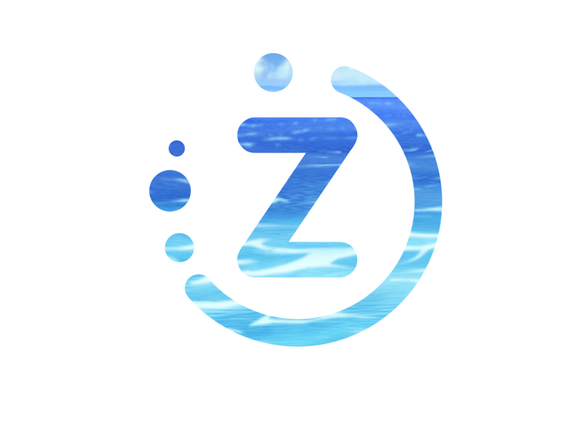

# osu! Z-Tournament 2018

- The **osu! Z-Tournament 2018** is a 4v4 international osu!standard tournament with no rank limits, therefore allowing any player to join.
- Score system: **Scorev2**
- This tournament will be holding up to **64 teams, with 6 players at minimum and 8 players at maximum, in each team.**
- **Group stages will be held round robin style**, afterwards the **Bracket stages will be double elimination**
- It is **required** that all players join the discord
- This page will only cover the general rules of the tournament, **you must read the ruleset.**
- Any further questions must be forwarded to **[BearZyo](https://osu.ppy.sh/u/6116759) or [Div](https://osu.ppy.sh/u/3751116)**

## Links
- Discord
- Stream
- Spreadsheet
- Ruleset
- MapPool
- Forum Post

## Tournament Schedule

| Event | Timestamp (YYYY-MM-DD) |
| ---: | :--- |
| Registration Phase | 2018-04-23 / 2018-05-25 |
| Group Drawings | 2018-05-27 |
| Group Stage Week 1 | 2018-06-02 / 2018-06-03 |
| Group Stage Week 2 | 2018-06-09 / 2018-06-10 |
| Round of 32 | 2018-06-16 / 2018-06-17 |
| Round of 16 | 2018-06-23 / 2018-06-24 |
| Quarter-Finals | 2018-06-30 / 2018-07-01 |
| Semi-Finals | 2018-07-07 / 2018-07-08 |
| Finals | 2018-07-14 / 2018-07-15 |
| Grand Finals | 2018-07-21 / 2018-07-22 |

## Prizes
- The prizes are subject to change throughout the tournament.

| Place | Prize |
| ---: | :--- |
| 1st | Profile Badge |
| 2nd | |
| 3rd | |

## Groups
- TBA: 2018-05-27

## Brackets
- TBA: 2018-06-11

## Registrations
**Register your team here!** Remember, all team members must join the discord for the team to be eligible to play.
- Team Registration

**Do not have a team?** You're in the right place! Here, other teams will be able to scout players out, and you could possibly be picked up.
- Free Agent Registration

## Staff 
| Role | Member(s) |
| ---: | :--- |
| Host | BearZyo |
| Co-Host | Div |
| Statistician | BearZyo |
| Programmer | Eurus |
| Media Coverage | Weed |
| Graphics designer | -Bye |
| MapPool Committee | Squilly BlackZero Omaru Alexdark69 Bullen8 Rachel |
| Streamers | BearZyo CornLord7117 Sparhten Sartan |
| Commentators | Legless mcdemors [Baskest] Sartan Omaru Weed AlexDark69 CornLord7117 |
| Referees | BearZyo Div Omaru Sparhten Sakaguchi Science motive Yazzehh Alexdark69 divinereigns Jean-michel Jr Mancis Mr HeliX Nitroz BlackZero Xenou|
