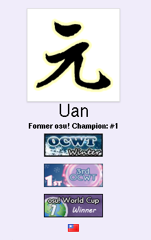

---
tags:
  - badges
  - profile badges
  - user badge
  - user badges
---

# Profilabzeichen

*Nicht zu verwechseln mit Gruppenabzeichen, die ebenfalls auf Nutzerprofilen erscheinen.*\
*Für Regeln für die Verwendung als Turnierpreise, siehe: [Offizielle Turnierunterstützung § Profilabzeichen](/wiki/Tournaments/Official_support#profilabzeichen)*

**Profilabzeichen** (häufig nur *Abzeichen* genannt) sind kleine Grafiken auf dem Nutzerprofil, die für verschiedene Erfolge verliehen werden. Sie werden meist als Preise für [Turniere](/wiki/Tournaments) und [Wettbewerbe](/wiki/Contests) vergeben, haben aber auch andere Verwendungszwecke, wie beispielsweise als Belohnungen für [Community-Mitwirkende](/wiki/People/Community_Contributors), [Beatmap Spotlights](/wiki/Beatmap_Spotlights#rewards) und fortgeführte Gruppenmitgliedschaft.

Wenn man mit dem Mauszeiger über das Abzeichen fährt, wird ein Tooltip mit weiteren Details darüber angezeigt, warum das Abzeichen verliehen wurde.

## Turnierplatzierung

*Hauptseite: [Abzeichen-gewichtete Platzierung](/wiki/Tournaments/Badge-weighted_seeding)*

Im [Spiel-Client](/wiki/Client) und auf der Webseite sind Abzeichen rein dekorativ. Da die Preisauszeichnungen bei [Turnieren](/wiki/Tournaments) jedoch die Leistung der Spieler zeigen, haben einige Turniere [Auslosungsverfahren](https://en.wikipedia.org/wiki/Seed_(sports)) eingeführt, die die Anzahl der Abzeichen der Spieler berücksichtigen, allgemein bekannt als [Abzeichen-gewichtete Platzierung](/wiki/Tournaments/Badge-weighted_seeding) (im Englischen *badge-weighted seeding* oder *BWS*).

## Geschichte

Anstatt die Abzeichen horizontal in einem Container zu stapeln, der sich über die gesamte Seite erstreckte, wurden sie auf der alten Webseite vertikal zwischen dem Benutzernamen und der Landesflagge des Nutzers angeordnet.

Ein Nebeneffekt dieses Layout-Schemas war, dass die standardmäßige, nicht erweiterte Höhe von [Benutzerseiten](/wiki/osu!supporter#editierbare-profilsektion) durch das Sammeln weiterer Abzeichen vergrößert werden konnte. Obwohl dies nicht beabsichtigt war, wurde es zu einem Running Gag in der Turnierszene. ::{ flag=US }:: [Toy](https://osu.ppy.sh/users/2757689) veranschaulichte dies in [einem populären Tweet](https://twitter.com/droombs/status/1036050610687074304), in dem er seinen Rekord für die meisten gewonnenen Abzeichen zum Zeitpunkt der Veröffentlichung zeigte.

## Trivia

::: Infobox

:::

- Die ersten beiden Profilabzeichen wurden am 6. September 2009 an ::{ flag=PL }:: [niedzwiedz1124](https://osu.ppy.sh/users/9610) und ::{ flag=PL }:: [White Wolf](https://osu.ppy.sh/users/39828) für den Gewinn des [*Tag Tournament*](https://osu.ppy.sh/community/forums/topics/17169) verliehen.
- Abzeichen können für weitere Inhalte auf andere Webseiten verweisen, wie zum Beispiel einen Eintrag im Wiki oder die Forenseite eines Turniers.
- Abzeichen hindern andere davor, [den aktuellen oder die vergangenen Namen des Spielers zu übernehmen](/wiki/Help_centre/Account#take-existing-username).
