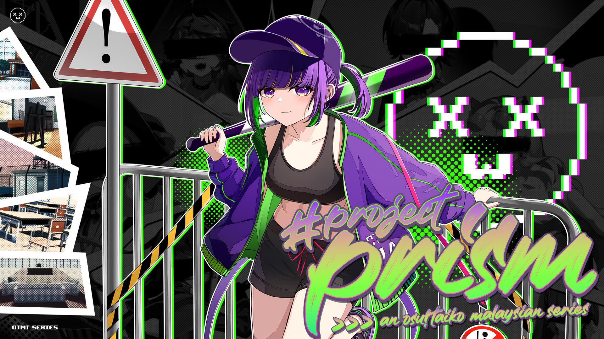
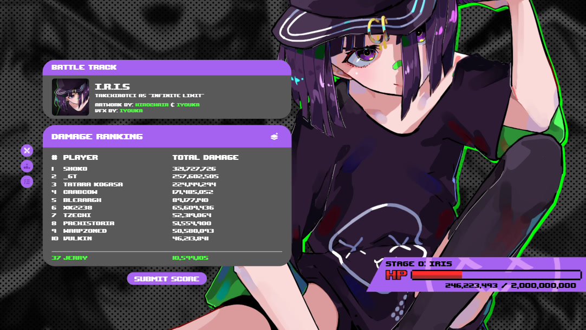
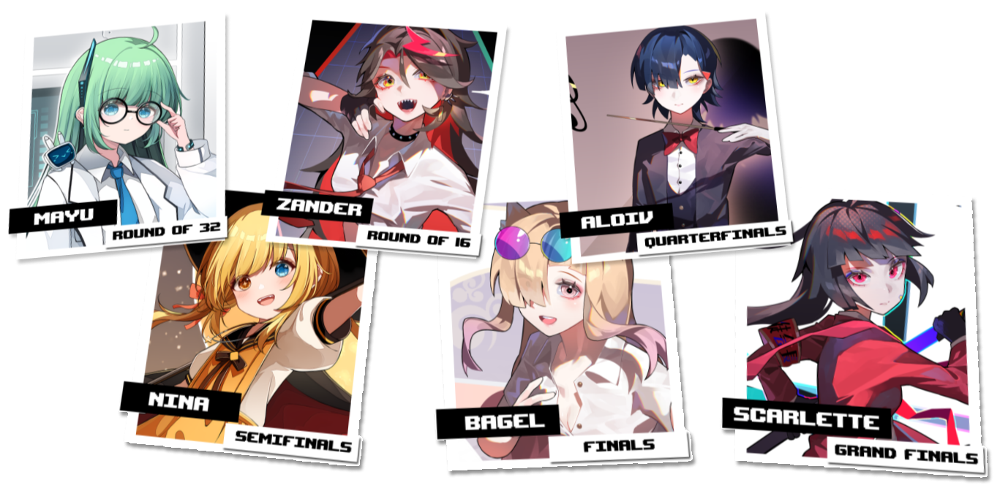

# Project Prism 2024

**Project Prism 2024** is a 1v1, double-elimination, global osu!taiko tournament hosted by ::{ flag=MY }:: [Jerry](https://osu.ppy.sh/users/605973). It is the first instalment of Project Prism.

## Tournament schedule

| Event | Dates |
| --: | :-- |
| Registration phase | 2024-04-13/2024-04-27 (23:59 UTC) |
| Qualifier showcase | 2024-05-05 |
| Qualifier stage | 2024-05-11 |
| Round of 64 | 2024-05-18/2024-05-19 |
| Round of 32 | 2024-05-25/2024-05-26 |
| Round of 16 | 2024-06-01/2024-06-02 |
| Quarterfinals | 2024-06-08/2024-06-09 |
| Semifinals | 2024-06-15/2024-06-16 |
| Finals | 2024-06-22/2024-06-23 |
| Grand Finals | 2024-06-29/2024-06-30 |

## Prizes

| Placing | Prize(s) |
| :-: | :-- |
|  | Physical trophy, merchandise, profile badge (pending) |
|  | Physical trophy, merchandise |
|  | Physical trophy, merchandise |

## Organisation

Project Prism 2024 is run by various community members.

| Position | Member(s) |
| :-- | :-- |
| Organiser | ::{ flag=MY }:: [Jerry](https://osu.ppy.sh/users/605973) |
| Manager | ::{ flag=MY }:: [[Zeth]](https://osu.ppy.sh/users/9912966), ::{ flag=MY }:: [Asagi Mutsuki](https://osu.ppy.sh/users/2403621), ::{ flag=FR }:: [Kasumi-sama](https://osu.ppy.sh/users/6177263), ::{ flag=MY }:: [Xeltic Rival](https://osu.ppy.sh/users/7500364) |
| Artist | ::{ flag=MY }:: [HiROdoge](https://osu.ppy.sh/users/15251809), ::{ flag=MY }:: [xxxxxx2800](https://osu.ppy.sh/users/4084853) |
| Designer | ::{ flag=MY }:: [[Zeth]](https://osu.ppy.sh/users/9912966), ::{ flag=MY }:: [Iyouka](https://osu.ppy.sh/users/7138499), ::{ flag=MY }:: [Jerry](https://osu.ppy.sh/users/605973), ::{ flag=ID }:: [LenLitchu](https://osu.ppy.sh/users/34098325), ::{ flag=MY }:: [lous](https://osu.ppy.sh/users/6231292) |
| Developer | ::{ flag=MY }:: [Amamiya Kokoro](https://osu.ppy.sh/users/9534110), ::{ flag=US }:: [Chupalika](https://osu.ppy.sh/users/1926383), ::{ flag=MY }:: [vun](https://osu.ppy.sh/users/6932501) |
| Mapper | ::{ flag=US }:: [-Kazuha](https://osu.ppy.sh/users/29978316), ::{ flag=SG }:: [_gt](https://osu.ppy.sh/users/8301957), ::{ flag=JP }:: [_Rise](https://osu.ppy.sh/users/5217107), ::{ flag=FR }:: [_yosh](https://osu.ppy.sh/users/7157133), ::{ flag=ID }:: [Alwaysyukaz](https://osu.ppy.sh/users/4999506), ::{ flag=MY }:: [Asagi Mutsuki](https://osu.ppy.sh/users/2403621), ::{ flag=HK }:: [BlackBN](https://osu.ppy.sh/users/6291741), ::{ flag=FR }:: [Briesmas](https://osu.ppy.sh/users/2865172), ::{ flag=DE }:: [HomieLove](https://osu.ppy.sh/users/8693851), ::{ flag=SG }:: [iamveryfat](https://osu.ppy.sh/users/23134914), ::{ flag=NL }:: [ikin5050](https://osu.ppy.sh/users/4007649), ::{ flag=HK }:: [Irone OSU](https://osu.ppy.sh/users/10678230), ::{ flag=MY }:: [ler1211](https://osu.ppy.sh/users/19901680), ::{ flag=JP }:: [Maimaing](https://osu.ppy.sh/users/14520910), ::{ flag=PH }:: [midorijeon](https://osu.ppy.sh/users/10969875), ::{ flag=IT }:: [Minion24](https://osu.ppy.sh/users/10021819), ::{ flag=JP }:: [miyagishima](https://osu.ppy.sh/users/8027517), ::{ flag=MY }:: [MTNTWarz](https://osu.ppy.sh/users/14036825), ::{ flag=GB }:: [My Angel Subaru](https://osu.ppy.sh/users/17797595), ::{ flag=IT }:: [ndrrr](https://osu.ppy.sh/users/4609767), ::{ flag=RU }:: [Nozdormu](https://osu.ppy.sh/users/7169208), ::{ flag=TH }:: [Ph0eNiiXZ](https://osu.ppy.sh/users/9463721), ::{ flag=PH }:: [qish](https://osu.ppy.sh/users/17050115), ::{ flag=IT }:: [Quorum](https://osu.ppy.sh/users/5200775), ::{ flag=SE }:: [Raphalge](https://osu.ppy.sh/users/3918650), ::{ flag=ID }:: [raynald](https://osu.ppy.sh/users/25094413), ::{ flag=NO }:: [roufou](https://osu.ppy.sh/users/1109122), ::{ flag=GB }:: [roxorotto](https://osu.ppy.sh/users/17307654), ::{ flag=ID }:: [Sagasemat](https://osu.ppy.sh/users/16761278), ::{ flag=MY }:: [ShoKo](https://osu.ppy.sh/users/6201335), ::{ flag=MK }:: [soirT](https://osu.ppy.sh/users/21076274), ::{ flag=MY }:: [taiko_maniac1811](https://osu.ppy.sh/users/595764), ::{ flag=TW }:: [X a v y](https://osu.ppy.sh/users/3738344), ::{ flag=AT }:: [Yasuho](https://osu.ppy.sh/users/8458835), ::{ flag=DE }:: [Zhuosh](https://osu.ppy.sh/users/11056763) |
| Mappool playtester | ::{ flag=MY }:: [6gicha](https://osu.ppy.sh/users/12273160), ::{ flag=US }:: [_somet](https://osu.ppy.sh/users/11833538), ::{ flag=PH }:: [Aiery](https://osu.ppy.sh/users/10363380), ::{ flag=US }:: [AuroraPhasmata](https://osu.ppy.sh/users/13664116), ::{ flag=DE }:: [Drecksackblase](https://osu.ppy.sh/users/6278008), ::{ flag=MY }:: [HHVanilla Ice](https://osu.ppy.sh/users/12803930), ::{ flag=DE }:: [HomieLove](https://osu.ppy.sh/users/8693851), ::{ flag=KR }:: [NaNaHiDa](https://osu.ppy.sh/users/30114023), ::{ flag=IT }:: [ndrrr](https://osu.ppy.sh/users/4609767), ::{ flag=SE }:: [Nurend](https://osu.ppy.sh/users/9905079), ::{ flag=GB }:: [overdahedge2015](https://osu.ppy.sh/users/9864847), ::{ flag=SE }:: [Raphalge](https://osu.ppy.sh/users/3918650), ::{ flag=ID }:: [XK2238](https://osu.ppy.sh/users/1139209) |
| Referee | ::{ flag=US }:: [akace100](https://osu.ppy.sh/users/9308128), ::{ flag=NZ }:: [Hand Sanitiser](https://osu.ppy.sh/users/5091293), ::{ flag=MY }:: [KepalaBapakKau](https://osu.ppy.sh/users/24553657), ::{ flag=MY }:: [Onlinee](https://osu.ppy.sh/users/13630137), ::{ flag=PE }:: [Pachekin](https://osu.ppy.sh/users/8257441), ::{ flag=VN }:: [Poity](https://osu.ppy.sh/users/17148657), ::{ flag=AR }:: [SUPERNOOB20](https://osu.ppy.sh/users/16422988), ::{ flag=NL }:: [TaikoMom](https://osu.ppy.sh/users/9086438) |
| Streamer | ::{ flag=GB }:: [Mrshadow818](https://osu.ppy.sh/users/16968817), ::{ flag=NL }:: [TaikoMom](https://osu.ppy.sh/users/9086438), ::{ flag=GB }:: [willowww](https://osu.ppy.sh/users/11406987) |
| Commentator | ::{ flag=MY }:: [CrabCow](https://osu.ppy.sh/users/9755504), ::{ flag=MY }:: [Cryolien](https://osu.ppy.sh/users/1626983), ::{ flag=PH }:: [Farmer Brown](https://osu.ppy.sh/users/17823779), ::{ flag=MY }:: [HenNEET](https://osu.ppy.sh/users/14225265), ::{ flag=DE }:: [Joogs](https://osu.ppy.sh/users/8844167), ::{ flag=GB }:: [Mrshadow818](https://osu.ppy.sh/users/16968817), ::{ flag=PE }:: [Pachekin](https://osu.ppy.sh/users/8257441), ::{ flag=MY }:: [Ping7731](https://osu.ppy.sh/users/7289284), ::{ flag=RU }:: [plush seal](https://osu.ppy.sh/users/17381947), ::{ flag=NL }:: [StrijkIjzer](https://osu.ppy.sh/users/4130926), ::{ flag=AR }:: [SUPERNOOB20](https://osu.ppy.sh/users/16422988), ::{ flag=GB }:: [willowww](https://osu.ppy.sh/users/11406987) |

## Links

- **[Website](https://prism.osumalaysia.org/)**
- [Discussion thread](https://osu.ppy.sh/community/forums/topics/1909279)
- [Livestream](https://www.twitch.tv/osutaikomalaysia)
- [Discord server](https://discord.com/invite/osutaikomy)
- [Twitter account](https://twitter.com/osutaikomy)

## Raid Battles

The "Raid Battle" system is a side event open to all osu!taiko players (not just tournament participants) for the duration of the tournament, where players cooperate to defeat boss characters by submitting scores on Project Prism's tiebreaker beatmaps.

Players can deal damage to the boss by setting a score on any difficulty of the tiebreaker for the current tournament stage, then submitting it via the website. Difficulties are available from Kantan, meaning beginners are also welcome to participate.

Each boss is associated with a tiebreaker song release each week starting from the Round of 32, with an introductory round available before then.

A list of missions is presented for each stage, which can range from "passing every difficulty" or "completing a map with Flashlight". Completing these earn players rewards on the website, namely story events or "[gacha](https://en.wikipedia.org/wiki/Gacha_game) pulls", which are tickets for redeeming random character cards that multiply damage dealt to the boss.

Both individual score and total damage dealt are recorded onto their respective leaderboards. After enough damage has been dealt during the stage and the boss's HP reaches 0, the top players in both leaderboards receive additional character cards as reward.

Even after being defeated, bosses are still available such that players can deal damage and complete missions until the event ends.

Detailed information can be found on the [website](https://prism.osumalaysia.org/raid-battle/info).

## Ruleset

### Registrations

1. Registrations must be submitted through the [website](https://prism.osumalaysia.org/registration).
2. All registered players will undergo an initial screening process by the osu! staff and any players who do not pass the screening will not be eligible to participate in the tournament. Results of the screening will be announced in the Discord server.
3. Players **must** join the [Discord server](https://discord.com/invite/osutaikomy) to be eligible for the tournament.

### Tournament information

1. This is a double-elimination, 1v1 osu!taiko tournament
2. ScoreV2 will be used with the Head-to-Head option.
3. The win conditions of each round is as listed below:

| Round | Format |
| --: | :-- |
| Round of 64 | Best of 9 |
| Round of 32 | Best of 9 |
| Round of 16 | Best of 9 |
| Quarterfinals | Best of 11 |
| Semifinals | Best of 11 |
| Finals | Best of 13 |
| Grand Finals | Best of 13 |

4. The tournament starts off with the Qualifier stage to sort the players into their respective seedings in the top 64.
5. The top 64 players will then advance to the Round of 64, where the double-elimination brackets will begin.
6. The tournament host will release the mappool and schedules one week before each round.
7. If required, players may request for a reschedule of their matches via the `#rescheduling` channel in the Discord server.
8. Reschedules will only be allowed before the Thursdays, 23:59 UTC of every week.

### Qualifier details

1. All players will play through a special pool comprising of 5 brackets: No Mod, Hidden, Hard Rock, Double Time, and Free Mod.
2. The mappool will consist of 10 maps, 3 No Mods, 2 Hiddens, 2 Hard Rocks, 2 Double Times and 1 Free Mod.
3. Players are allowed to play through the mappool twice in their designated lobbies.
4. Players may choose to skip maps (only on the second run) or the second run altogether if desired.
5. The mappool must be played in order from top to bottom. Players are not allowed to shuffle the mappool order or skip any maps during the first run.
6. Only the highest score of each map out of the two runs will be taken into consideration for seeding purposes.
7. An optional 5-minute break can be given between the first and second runs if any players in the lobby request for it.
8. Only the top 64 seeded players will advance to the bracket stages.
9. Seeding will be made with the average rank of each player on each map.

### Match rules

1. Players are required to be present at the times of their match. A reminder in the form of a Discord ping will be given to the players 15 minutes before every match.
2. Invites to the room will then be sent out 10 minutes before each match.
3. Failure to arrive on time will result in the following penalties:
   - 5 minutes: Player warmup will be skipped
   - 10 minutes: Player map ban goes to opponent
   - 15 minutes: Player loses by default
4. Warmups must be sent to the referees at least 30 minutes before the start of the map. The warmup must be less than 3 minutes in length and not contain inappropriate content. The referee reserves the right to reject maps that they deem to be inappropriate.
5. At the start of each match, players will be asked to `!roll` to determine who picks or bans first. The player with the higher roll will get to pick first and ban second.
6. Banned maps and tiebreakers are not allowed to be picked throughout the match.
7. Each player will be given a maximum of 2 minutes to select their picks. If a pick has not been decided before the countdown timer ends, the map will be randomised with `!roll`.
8. After a map is decided, players will then have a maximum of 2 minutes to ready up before the referee forces a start.
9. Players should ensure that they have all the maps downloaded before the start of their match. In the event that a player is missing a map, they will automatically lose the point if they are unable to download it within the 2 minutes given.
10. Players may ask for a "tactical timeout" during a match, which will add an extra 2 minutes to the timer. This can only be used **once** per match.
11. A rematch of the same map will be given if a player disconnects within the first 30 seconds of the map. Any subsequent disconnections on the same map will be treated as a point loss.
12. Lag is not a valid reason to restart a map.
13. In the event of a tie in scores, neither player will gain points and the map will be played again.
14. In the unlikely event that both players get a tied score twice in a row on the same map, the map will be nullified, and another map needs to be picked by the other player.
15. Failed scores will be counted.
16. If both players reach match point (requiring 1 more point to win), the tiebreaker map will be played.
17. Unexpected incidents will be handled by the referee or host.

### Mappool details

1. The mappool brackets will consist of the following amount of maps:

| Stage/bracket | No Mod | Hidden | Hard Rock | Double Time | Free Mod | Flashlight | Tiebreaker |
| :-- | --: | --: | --: | --: | --: | --: | --: |
| **Round of 64** | 3 | 2 | 2 | 2 | 1 | 1 | 1 |
| **Round of 32** | 3 | 2 | 2 | 2 | 1 | 1 | 1 |
| **Round of 16** | 3 | 2 | 2 | 2 | 2 | 1 | 1 |
| **Quarterfinals** | 3 | 2 | 2 | 2 | 3 | 1 | 1 |
| **Semifinals** | 4 | 2 | 2 | 2 | 3 | 1 | 1 |
| **Finals** | 5 | 2 | 2 | 2 | 3 | 1 | 1 |
| **Grand Finals** | 5 | 2 | 2 | 2 | 3 | 1 | 1 |

2. The Flashlight map cannot be banned.
3. The tiebreaker map is played under Free Mod conditions.
4. Players may choose to play with No Mod, Hidden, Hard Rock or a combination of Hidden and Hard Rock for the Free Mod picks.
