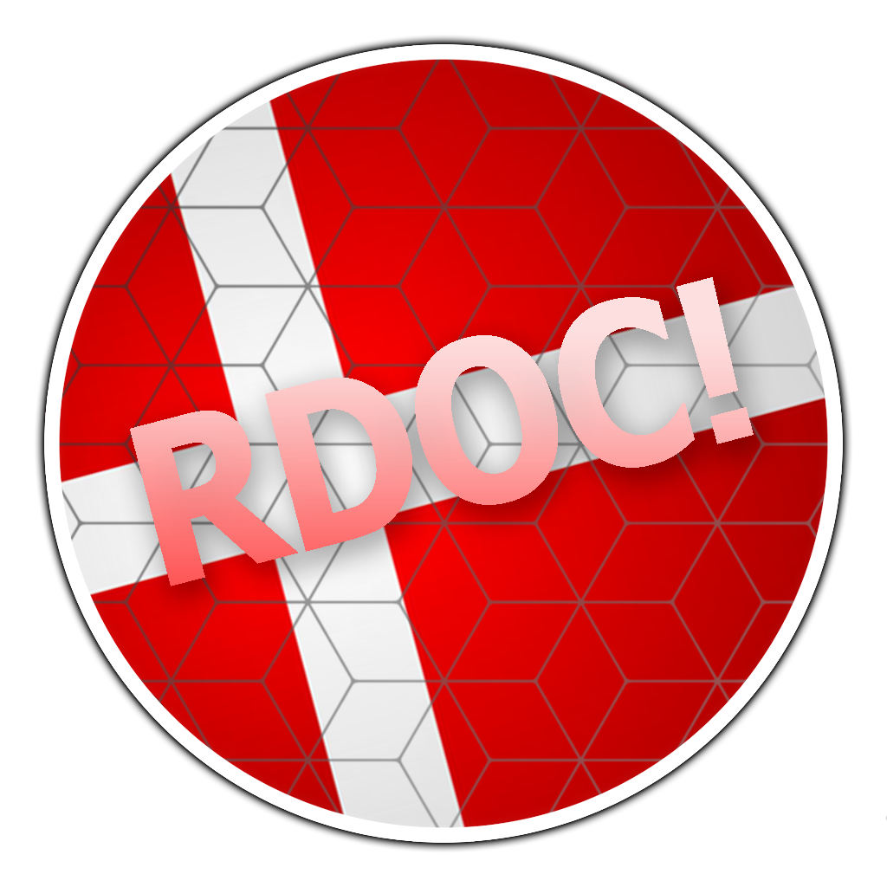

---
tags:
  - RDOC
  - RDOC2016
---

# Royal Danish osu!Cup 2016

The **Royal Danish osu!Cup 2016** (***RDOC 2016***) was a Danish 1v1 double-elimination osu! tournament hosted by ::{ flag=DK }:: [Mayoi Hachikuji](https://osu.ppy.sh/users/2114273). It was the second instalment of the Royal Danish osu!Cup.

## Tournament schedule

| Event | Timestamp |
| --: | :-- |
| Registration phase | 2015-11-30/2015-12-25 |
| Group stage | 2016-01-09/2016-01-17 |
| Round of 16 | 2016-01-23/2016-01-24 |
| Quarterfinals | 2016-01-30/2016-01-31 |
| Semifinals | 2016-02-06/2016-02-07 |
| Finals | 2016-02-13/2016-02-17 |
| Grand Finals | 2016-02-17 |

## Prizes

| Placing | Prize(s) |
| :-: | :-- |
|  | 6 months of osu!supporter |
|  | 3 months of osu!supporter |
|  | 2 months of osu!supporter |
| *4th place* | 1 month of osu!supporter |

## Organisation

The Royal Danish osu!Cup 2016 was run by various community members.

| Position | Member(s) |
| :-- | :-- |
| Manager | ::{ flag=DK }:: [Mayoi Hachikuji](https://osu.ppy.sh/users/2114273) |
| Mappool selector | ::{ flag=DK }:: [Mayoi Hachikuji](https://osu.ppy.sh/users/2114273), ::{ flag=DK }:: [Tonarinototoro](https://osu.ppy.sh/users/2678812), ::{ flag=DK }:: [-Crab-](https://osu.ppy.sh/users/2563435), ::{ flag=DK }:: [Flyville](https://osu.ppy.sh/users/6124808) |
| Referee | ::{ flag=DK }:: [Mayoi Hachikuji](https://osu.ppy.sh/users/2114273), ::{ flag=DK }:: [Kazutakee](https://osu.ppy.sh/users/2637514), ::{ flag=DK }:: [Tonarinototoro](https://osu.ppy.sh/users/2678812), ::{ flag=DK }:: [-Crab-](https://osu.ppy.sh/users/2563435), ::{ flag=DK }:: [Flyville](https://osu.ppy.sh/users/6124808) |
| Other helpers | ::{ flag=DK }:: [John Cena](https://osu.ppy.sh/users/2958963), ::{ flag=DK }:: [Hudda](https://osu.ppy.sh/users/4103629) |
| Designer | ::{ flag=DK }:: [Tonarinototoro](https://osu.ppy.sh/users/2678812) |
| Streamer/Commentator | ::{ flag=DK }:: [Mayoi Hachikuji](https://osu.ppy.sh/users/2114273), ::{ flag=DK }:: [Flyville](https://osu.ppy.sh/users/6124808), ::{ flag=DK }:: [Tonarinototoro](https://osu.ppy.sh/users/2678812), ::{ flag=DK }:: [6Lu6Ci6Fer](https://osu.ppy.sh/users/7229384), ::{ flag=DK }:: [Kazutakee](https://osu.ppy.sh/users/2637514), ::{ flag=DK }:: [-Crab-](https://osu.ppy.sh/users/2563435), ::{ flag=DK }:: [John Cena](https://osu.ppy.sh/users/2958963), ::{ flag=DK }:: [Hudda](https://osu.ppy.sh/users/4103629) |

## Links

- [Discussion thread](https://osu.ppy.sh/community/forums/topics/390757)
- [Challonge brackets](https://challonge.com/rdoc2016)

## Participants

*Note: This is an incomplete list, as all records before Round of 16 have been lost to time.*

- ::{ flag=DK }:: [waefwerf](https://osu.ppy.sh/users/3868653)
- ::{ flag=DK }:: [Zog](https://osu.ppy.sh/users/3722715)
- ::{ flag=DK }:: [Emub](https://osu.ppy.sh/users/4337359)
- ::{ flag=DK }:: [Crylizhy](https://osu.ppy.sh/users/3023138)
- ::{ flag=DK }:: [KaHLK](https://osu.ppy.sh/users/2287701)
- ::{ flag=DK }:: [Only1Magma](https://osu.ppy.sh/users/3922957)
- ::{ flag=DK }:: [Kazutakee](https://osu.ppy.sh/users/2637514)
- ::{ flag=DK }:: [Zakdawg](https://osu.ppy.sh/users/1667126)
- ::{ flag=DK }:: [-Tochi](https://osu.ppy.sh/users/3664366)
- ::{ flag=DK }:: [Arild](https://osu.ppy.sh/users/3089925)
- ::{ flag=DK }:: [John Cena](https://osu.ppy.sh/users/2958963)
- ::{ flag=DK }:: [Tropians](https://osu.ppy.sh/users/2536611)
- ::{ flag=DK }:: [Gudafild](https://osu.ppy.sh/users/5358569)
- ::{ flag=DK }:: [Hudda](https://osu.ppy.sh/users/4103629)
- ::{ flag=DK }:: [Kawatta](https://osu.ppy.sh/users/3731880)
- ::{ flag=DK }:: [TheFancyPikachu](https://osu.ppy.sh/users/1946377)
- ::{ flag=DK }:: [Lemmen](https://osu.ppy.sh/users/6090254)
- ::{ flag=DK }:: [Spork Lover](https://osu.ppy.sh/users/3417469)
- ::{ flag=DK }:: [TimG](https://osu.ppy.sh/users/1879963)
- ::{ flag=DK }:: [Jobbe](https://osu.ppy.sh/users/2707230)
- ::{ flag=DK }:: [shoki](https://osu.ppy.sh/users/6583628)

## Podium

This competition has come to an end and resulted in the following podium:

| Placing | Player |
| :-: | :-- |
|  | ::{ flag=DK }:: [waefwerf](https://osu.ppy.sh/users/3868653) |
|  | ::{ flag=DK }:: [Zog](https://osu.ppy.sh/users/3722715) |
|  | ::{ flag=DK }:: [Crylizhy](https://osu.ppy.sh/users/3023138) |
| *4th place* | ::{ flag=DK }:: [Emub](https://osu.ppy.sh/users/4337359) |

## Mappools

### Finals & Grand Finals

- NoMod
  1. [t+pazolite - cheatreal \[Extra\]](https://osu.ppy.sh/beatmapsets/88180#osu/240488)
  2. [cosMo@BousouP - Oceanus \[Divinity\]](https://osu.ppy.sh/beatmapsets/267767#osu/609843)
  3. [HujuniseikouyuuP - Talent Shredder \[0108 style\]](https://osu.ppy.sh/beatmapsets/47710#osu/178966)
  4. [Wagakki Band - Ikusa \[Hope\]](https://osu.ppy.sh/beatmapsets/345860#osu/767914)
  5. [yuikonnu - caramel heaven \[Skystar's Caramel\]](https://osu.ppy.sh/beatmapsets/297969#osu/817929)
  6. [Igorrr - Tout Petit Moineau \[Extra\]](https://osu.ppy.sh/beatmapsets/212180#osu/517308)
  7. [antiPLUR - Speed of Link \[100 000 000m/s\]](https://osu.ppy.sh/beatmapsets/359173#osu/794779)
- Hidden
  1. [Apocalyptica - Hall of the Mountain King \[Extra\]](https://osu.ppy.sh/beatmapsets/219813#osu/514597)
  2. [Alipio Martins - Piranha (Maffalda Reloaded Trap Mix) \[BD's Gangsta\]](https://osu.ppy.sh/beatmapsets/287873#osu/652234)
  3. [Ray - Hajimete Girls! \[Skystar's Pin Pon\~\]](https://osu.ppy.sh/beatmapsets/330566#osu/776752)
  4. [\*namirin - Sakurairo Time Capsule \[Petal\]](https://osu.ppy.sh/beatmapsets/355236#osu/782160)
- HardRock
  1. [Inspector K - Disconnected Hardkore (CanBlaster Remix) \[Reconnected\]](https://osu.ppy.sh/beatmapsets/37242#osu/123708)
  2. [Project Grimoire - Caliburne \~Story of the Legendary sword\~ \[Extra\]](https://osu.ppy.sh/beatmapsets/335665#osu/742975)
  3. [Hatsune Miku - Homework Crisis \[Let's Jump!!\]](https://osu.ppy.sh/beatmapsets/33068#osu/108021)
  4. [Rise Against - Injection \[Extreme\]](https://osu.ppy.sh/beatmapsets/214092#osu/646390)
- DoubleTime
  1. [Avicii - Wake Me Up \[Insane\]](https://osu.ppy.sh/beatmapsets/108633#osu/283897)
  2. [ELISA connect EFP - EONIAN -eonian- \[Expelled\]](https://osu.ppy.sh/beatmapsets/241064#osu/556909)
  3. [Nightwish - Dead to the World \[Shiro's Insane\]](https://osu.ppy.sh/beatmapsets/149115#osu/430510)
  4. [u's - Natsuiro Egao de 1, 2, Jump! \[Jump!\]](https://osu.ppy.sh/beatmapsets/57762#osu/240107)
- FreeMod
  1. [Reol - Asymmetry \[P A N's Extra\]](https://osu.ppy.sh/beatmapsets/292077#osu/661705)
  2. [bibuko - Reizouko Mitara Pudding ga Nai \[S.S\]](https://osu.ppy.sh/beatmapsets/90068#osu/256840)
  3. [sampling masters MEGA - Chat! Chat! Chat! \[ZFN's\]](https://osu.ppy.sh/beatmapsets/24895#osu/84485)
  4. [kemu - Ikasama Life Game \[Regou\]](https://osu.ppy.sh/beatmapsets/59792#osu/210718)
  5. [ONE OK ROCK - Mikansei Koukyoukyoku \[Extreme\]](https://osu.ppy.sh/beatmapsets/348604#osu/768986)
- Tiebreaker
  1. **[yanaginagi - Muteki no Soldier \[Invincible\]](https://osu.ppy.sh/beatmapsets/52221#osu/182001)**

### Semifinals

- NoMod
  1. [wakaG - Yozora ni Saita Hana \[Extra\]](https://osu.ppy.sh/beatmapsets/189529#osu/480599)
  2. [Zips - Mushikui Psychedelism \[Broccoly\]](https://osu.ppy.sh/beatmapsets/87167#osu/249233)
  3. [Sonic Syndicate - Denied \[Insane\]](https://osu.ppy.sh/beatmapsets/67895#osu/196888)
  4. [Sharlo & yealina - Kakushigoto \[RLC's Extra\]](https://osu.ppy.sh/beatmapsets/208095#osu/495899)
  5. [AKINO with bless4 - EXTRA MAGIC HOUR \[Extra\]](https://osu.ppy.sh/beatmapsets/224335#osu/523661)
- Hidden
  1. [Yousei Teikoku - Wahrheit \[Revelation\]](https://osu.ppy.sh/beatmapsets/176934#osu/434870)
  2. [NOX - Firesong \[NOX\]](https://osu.ppy.sh/beatmapsets/294935#osu/662928)
  3. [Mikakuning! - Tomadoi Recipe \[Insane\]](https://osu.ppy.sh/beatmapsets/154114#osu/378617)
- HardRock
  1. [Sagara Kokoro - Hoshizora no Ima \[Extra\]](https://osu.ppy.sh/beatmapsets/160145#osu/391228)
  2. [Mind Vortex - Alive \[Insane\]](https://osu.ppy.sh/beatmapsets/205309#osu/484661)
  3. [void feat. Komatsuna - Akatsuki no Tsuki \[Extra\]](https://osu.ppy.sh/beatmapsets/212387#osu/527704)
- DoubleTime
  1. [Envy - Paladin \[Insane\]](https://osu.ppy.sh/beatmapsets/109525#osu/288339)
  2. [Poets of the Fall - The Happy Song \[Insane\]](https://osu.ppy.sh/beatmapsets/58704#osu/176347)
  3. [WOODKID - Iron \[Insane\]](https://osu.ppy.sh/beatmapsets/138489#osu/762638)
  4. [senya - Yukitoke Realism \[Lunatic\]](https://osu.ppy.sh/beatmapsets/252385#osu/579751)
- FreeMod
  1. [Lon - MATRYOSHKA \[Extra\]](https://osu.ppy.sh/beatmapsets/109185#osu/285086)
  2. [Fear, and Loathing in Las Vegas - Swing It!! \[Extra\]](https://osu.ppy.sh/beatmapsets/204159#osu/482147)
  3. [CHiCO with HoneyWorks - Pride Kakumei \[Darkness\]](https://osu.ppy.sh/beatmapsets/342242#osu/756508)
  4. [Saiya - Remote Control \[Insane\]](https://osu.ppy.sh/beatmapsets/53857#osu/164020)
- Tiebreaker
  1. **[Halozy - Kanshou no Matenrou \[Eternal\]](https://osu.ppy.sh/beatmapsets/179699#osu/431957)**

### Quarterfinals

- NoMod
  1. [Foreground Eclipse - When Innocence Is Just A Mask \[pishi's Extra\]](https://osu.ppy.sh/beatmapsets/242316#osu/571981)
  2. [LiSA - Rally Go Round \[Extra\]](https://osu.ppy.sh/beatmapsets/317275#osu/740692)
  3. [ONE OK ROCK - Clock Strikes \[Insane\]](https://osu.ppy.sh/beatmapsets/249624#osu/633373)
  4. [Kuroneko Dungeon - Ryoushi no Umi no Lindwurm \[SUPER\]](https://osu.ppy.sh/beatmapsets/372850#osu/818272)
  5. [Rohi - Kodoku Egoism \[Skystar\]](https://osu.ppy.sh/beatmapsets/58737#osu/187507)
- Hidden
  1. [Comp - Touchuu Aika \[Maolvis' Lunatic\]](https://osu.ppy.sh/beatmapsets/198700#osu/471369)
  2. [Eoin O' Broin - Deep Space \[Another\]](https://osu.ppy.sh/beatmapsets/25098#osu/85550)
  3. [Furries in a Blender - Ridorii \[Insane\]](https://osu.ppy.sh/beatmapsets/29727#osu/98496)
- HardRock
  1. [Hanatan - Palette \[Irrelvis' Extra\]](https://osu.ppy.sh/beatmapsets/165693#osu/432346)
  2. [Orangestar - Asu no Yozora Shoukaihan \[TmTk's Insane\]](https://osu.ppy.sh/beatmapsets/219728#osu/549280)
  3. [Uchida Maaya - Hana Tsubomi Yume Miru Kyoushikyoku \~Tamashii no Shirube\~ \[Insane\]](https://osu.ppy.sh/beatmapsets/89888#osu/244182)
- DoubleTime
  1. [Sasaki Sayaka - Zzz \[Insane\]](https://osu.ppy.sh/beatmapsets/32375#osu/105950)
  2. [FELT - Prayer Blue \[Lunatic\]](https://osu.ppy.sh/beatmapsets/51145#osu/156927)
  3. [Nanamori-chu \* Goraku-bu - Precious Friends \[Insane\]](https://osu.ppy.sh/beatmapsets/173956#osu/420131)
  4. [azusa - Check my soul \[Insane\]](https://osu.ppy.sh/beatmapsets/45664#osu/142462)
- FreeMod
  1. [Jeff Williams - This Will Be the Day (feat. Casey Lee Williams) \[Insane\]](https://osu.ppy.sh/beatmapsets/117269#osu/302238)
  2. [Hatsune Miku - Rubik's Cube \[7x7x7\]](https://osu.ppy.sh/beatmapsets/33651#osu/114635)
  3. [Kurubukko vs yukitani - Minamichita EVOLVED \[Another\]](https://osu.ppy.sh/beatmapsets/136632#osu/341891)
  4. [Mind Vortex - Arc \[Nsane\]](https://osu.ppy.sh/beatmapsets/87509#osu/239037)
- Tiebreaker
  1. **[Mitsunori Ikeda ft. Aimee B - Fallen Angel (El Poco Maro Remix) \[Ascension\]](https://osu.ppy.sh/beatmapsets/36319#osu/403050)**

### Round of 16

- NoMod
  1. [Nanahoshi Kangengakudan - Meikaruza \[Extra\]](https://osu.ppy.sh/beatmapsets/302756#osu/701033)
  2. [Giga-P - Okochama Sensou \[AngelHoney's ExtrA\]](https://osu.ppy.sh/beatmapsets/131818#osu/331845)
  3. [Hatsune Miku - Sakura Zensen Ijou Nashi \[Ijou Nashi\]](https://osu.ppy.sh/beatmapsets/32021#osu/104945)
  4. [Memme - Chinese Restaurant \[Spicy\]](https://osu.ppy.sh/beatmapsets/256467#osu/587547)
  5. [himmeltengoku - Whisper of Rose \[Maximum\]](https://osu.ppy.sh/beatmapsets/173614#osu/419487)
- Hidden
  1. [Daisuke Achiwa - BASARA \[BASARA\]](https://osu.ppy.sh/beatmapsets/13019#osu/48416)
  2. [Hitori Tori - perthed again (yambabom remix) \[ktgster's Extra\]](https://osu.ppy.sh/beatmapsets/268693#osu/658994)
  3. [Sana - Byoumei Koiwazurai \[Lovesick\]](https://osu.ppy.sh/beatmapsets/220636#osu/516322)
- HardRock
  1. [IOSYS - Usatei 2011 \[Ozzy's Extra\]](https://osu.ppy.sh/beatmapsets/37563#osu/130500)
  2. [An - Xhroria \[Another\]](https://osu.ppy.sh/beatmapsets/82258#osu/227772)
  3. [Hatsune Miku & Megpoid Gumi - MATRYOSHKA \[Insane\]](https://osu.ppy.sh/beatmapsets/19789#osu/69405)
- DoubleTime
  1. [Katy Perry - E.T. \[Futuristic\]](https://osu.ppy.sh/beatmapsets/36077#osu/116708)
  2. [765PRO ALLSTARS - M@STERPIECE \[Beyond the Brilliant Future\]](https://osu.ppy.sh/beatmapsets/235477#osu/580225)
  3. [Nishino Kana - Darling \[Insane\]](https://osu.ppy.sh/beatmapsets/209810#osu/493755)
  4. [Evoluutiomies - Suklaapallit \[Mukun Suklaapallit\]](https://osu.ppy.sh/beatmapsets/24372#osu/82962)
- FreeMod
  1. [Meiko Nakamura - Dispel \[Insane\]](https://osu.ppy.sh/beatmapsets/39640#osu/126229)
  2. [Ogura Yui - Honey Come!! \[Bloom\]](https://osu.ppy.sh/beatmapsets/350963#osu/773567)
  3. [Cres - End Time \[Another\]](https://osu.ppy.sh/beatmapsets/73474#osu/209576)
  4. [TOTAL OBJECTION - Higurashi Moratorium \[Rin\]](https://osu.ppy.sh/beatmapsets/83310#osu/230127)
- Tiebreaker
  1. **[goreshit - o'er the flood \[The Flood Beneath\]](https://osu.ppy.sh/beatmapsets/51972#osu/181253)**

### Group stage

- NoMod
  1. [Xelia - Illumiscape \[Another\]](https://osu.ppy.sh/beatmapsets/43960#osu/137840)
  2. [iojjj - Deus Ex Machina \[EXTRA\]](https://osu.ppy.sh/beatmapsets/107747#osu/688907)
  3. [yuikonnu - Souzou Forest \[Imagination\]](https://osu.ppy.sh/beatmapsets/304871#osu/682956)
  4. [Hatsune Miku - Recommended Spell \[Insane\]](https://osu.ppy.sh/beatmapsets/28864#osu/96499)
- Hidden
  1. [Jun.A - The Refrain of the Lovely Great War \[Lunatic\]](https://osu.ppy.sh/beatmapsets/24325#osu/82734)
  2. [FELT - Flower Flag (MZC Echoes the Spring Liquid Mix \[Lunatic\]](https://osu.ppy.sh/beatmapsets/55945#osu/169450)
  3. [DJ Genericname - Dango Dango Drum and Bass \[Insane\]](https://osu.ppy.sh/beatmapsets/64636#osu/190045)
- HardRock
  1. [Goose house - Hikaru nara -TV size- \[Mochi's Insane\]](https://osu.ppy.sh/beatmapsets/221408#osu/518793)
  2. [Gavin G - Desire \[Irrphyxia's Insane\]](https://osu.ppy.sh/beatmapsets/242549#osu/630919)
  3. [TeamGrimoire+Amaneko - croiX \[ADVANCED\]](https://osu.ppy.sh/beatmapsets/88692#osu/241732)
- DoubleTime
  1. [Yuuki Aoi - Mata Ashita \[Insane\]](https://osu.ppy.sh/beatmapsets/172055#osu/443272)
  2. [Coldplay - Paradise \[Collab\]](https://osu.ppy.sh/beatmapsets/59619#osu/178614)
  3. [Itou Kanako - Tataeshi Tatakai no Uta \[Hard\]](https://osu.ppy.sh/beatmapsets/19876#osu/69654)
- FreeMod
  1. [An - artcore JINJA \[Lunatic\]](https://osu.ppy.sh/beatmapsets/114987#osu/297411)
  2. [Cutline - Die For You (Shock One Remix) \[Insane\]](https://osu.ppy.sh/beatmapsets/155285#osu/380964)
  3. [Shounen Radio - neu \[Chrome\]](https://osu.ppy.sh/beatmapsets/58422#osu/180103)
- Tiebreaker
  1. **[Sakamoto Maaya - Okaerinasai (tomatomerde Remix) \[Collab\]](https://osu.ppy.sh/beatmapsets/179323#osu/431147)**

## Match results

### Grand Finals

Wednesday, 17 February 2016:

| Group | Player 1 |  |  | Player 2 |
| :-: | --: | :-: | :-: | :-- |
| UB | **waefwerf** ::{ flag=DK }:: | **7** | 5 | ::{ flag=DK }:: Zog |
| LB | **waefwerf** ::{ flag=DK }:: | **7** | 3 | ::{ flag=DK }:: Crylizhy |

### Finals

Saturday, 13 February 2016:

| Group | Player 1 |  |  | Player 2 |
| :-: | --: | :-: | :-: | :-- |
| LB | **Emub** ::{ flag=DK }:: | **6** | 2 | ::{ flag=DK }:: Only1Magma |
| LB | KaHLK ::{ flag=DK }:: | 0 | **6** | ::{ flag=DK }:: **waefwerf** |

Sunday, 14 February 2016:

| Group | Player 1 |  |  | Player 2 |
| :-: | --: | :-: | :-: | :-- |
| LB | Emub ::{ flag=DK }:: | 5 | **6** | ::{ flag=DK }:: **waefwerf** |

Wednesday, 17 February 2016:

| Group | Player 1 |  |  | Player 2 |
| :-: | --: | :-: | :-: | :-- |
| UB | **Zog** ::{ flag=DK }:: | **7** | 5 | ::{ flag=DK }:: Crylizhy |

### Semifinals

Saturday, 6 February 2016:

| Group | Player 1 |  |  | Player 2 |
| :-: | --: | :-: | :-: | :-- |
| LB | **Kazutakee** ::{ flag=DK }:: | **5** | 0 | ::{ flag=DK }:: Arild |
| LB | John Cena ::{ flag=DK }:: | 3 | **5** | ::{ flag=DK }:: **Emub** |
| UB | Only1Magma ::{ flag=DK }:: | 0 | **5** | ::{ flag=DK }:: **Crylizhy** |
| LB | -Tochi ::{ flag=DK }:: | 0 | **4** | ::{ flag=DK }:: **KaHLK** |
| LB | Tropians ::{ flag=DK }:: | 0 | **4** | ::{ flag=DK }:: **Zakdawg** |

Sunday, 7 February 2016

| Group | Player 1 |  |  | Player 2 |
| :-: | --: | :-: | :-: | :-- |
| UB | **Zog** ::{ flag=DK }:: | **5** | 3 | ::{ flag=DK }:: waefwerf |
| LB | **KaHLK** ::{ flag=DK }:: | **5** | 4 | ::{ flag=DK }:: Zakdawg |
| LB | **Emub** ::{ flag=DK }:: | **5** | 0 | ::{ flag=DK }:: Kazutakee |

### Quarterfinals

Saturday, 30 January 2016:

| Group | Player 1 |  |  | Player 2 |
| :-: | --: | :-: | :-: | :-- |
| UB | **Only1Magma** ::{ flag=DK }:: | **4** | 2 | ::{ flag=DK }:: Zakdawg |
| UB | -Tochi ::{ flag=DK }:: | 1 | **4** | ::{ flag=DK }:: **Crylizhy** |
| UB | John Cena ::{ flag=DK }:: | 1 | **4** | ::{ flag=DK }:: **Zog** |
| UB | Arild ::{ flag=DK }:: | 1 | **4** | ::{ flag=DK }:: **waefwerf** |

Sunday, 31 January 2016:

| Group | Player 1 |  |  | Player 2 |
| :-: | --: | :-: | :-: | :-- |
| LB | **Emub** ::{ flag=DK }:: | **4** | 2 | ::{ flag=DK }:: Hudda |
| LB | **Kazutakee** ::{ flag=DK }:: | **4** | 2 | ::{ flag=DK }:: TheFancyPikachu |
| LB | **Tropians** ::{ flag=DK }:: | **4** | 0 | ::{ flag=DK }:: Gudafild |
| LB | Kawatta ::{ flag=DK }:: | 0 | **4** | ::{ flag=DK }:: **KaHLK** |

### Round of 16

Saturday, 23 January 2016:

| Group | Player 1 |  |  | Player 2 |
| :-: | --: | :-: | :-: | :-- |
| UB | Hudda ::{ flag=DK }:: | 0 | **4** | ::{ flag=DK }:: **-Tochi** |
| UB | TheFancyPikachu ::{ flag=DK }:: | 0 | **4** | ::{ flag=DK }:: **Only1Magma** |
| UB | KaHLK ::{ flag=DK }:: | 1 | **4** | ::{ flag=DK }:: **Zog** |
| UB | Tropians ::{ flag=DK }:: | 2 | **4** | ::{ flag=DK }:: **waefwerf** |

Sunday, 24 January 2016:

| Group | Player 1 |  |  | Player 2 |
| :-: | --: | :-: | :-: | :-- |
| UB | Kazutakee ::{ flag=DK }:: | 3 | **4** | ::{ flag=DK }:: **Zakdawg** |
| UB | Emub ::{ flag=DK }:: | 3 | **4** | ::{ flag=DK }:: **Crylizhy** |
| UB | **Arild** ::{ flag=DK }:: | **4** | 0 | ::{ flag=DK }:: Gudafild |
| UB | **John Cena** ::{ flag=DK }:: | **4** | 1 | ::{ flag=DK }:: Kawatta |

## Ruleset

### General rules

1. Only users in the Kingdom of Denmark can enter. This is determined by the profile-flag on a player's userpage (Eg. a player with either of these flags is eligible to participate: ::{ flag=DK }::, ::{ flag=FO }::, ::{ flag=GL }::)
2. This tournament uses a double-elimination bracket and single-player format. There are no teams here.
3. The score system used will be **Score V2**.
4. Any other rules changes or unexpected occurrences will be announced on the forum discussion.

### Stage regulations

1. There are six stages to this tournament: Group Stage, Round of 16, Quarterfinals, Semifinals, Finals and Grand Finals.
2. Players will be divided into 8 groups of 4 players. All the players from each group will face each other.
3. The win-condition for each stage is listed below:
   - Group Stage: Best of 5 (first to 3 points)
   - Round of 16: Best of 7 (first to 4 points)
   - Quarterfinals: Best of 7 (first to 4 points)
   - Semifinals: Best of 9 (first to 5 points)
   - Finals: Best of 11 (first to 6 points)
   - Grand Finals: Best of 13 (first to 7 points)
4. After the Group Stage, only the top 2 players from each group will advance to the next stage.
5. In case of a tie in Group Stage, advancement will be based off a player's map wins and map losses. If the score is equal, the score of the match between the two players will be taken into account. Eg. Player A and player B both have 6 wins and 6 losses, but player A beat player B 3-2 --> Player A advances.

### Match regulations

1. Players must create lobbies themselves and play their matches without a referee present.
2. There are no bans.
3. A player cannot pick the same mod twice, with the exception of Nomod.
4. Maps cannot be picked more than once in a match.
5. In case of a tie, the tiebreaker will be played.
6. If there is a disconnect or other disturbance during the match, a rematch is possible if both players agree. Do note that on the slightest notice of abuse, you will be instantly disqualified.
7. Make sure to open the match history screen when you make a multiplayer lobby. Use this to prove your wins in case someone is cheating.
8. When a match is won. Either the winning or the losing player will report their score to an admin. The Admin will make sure to plot it into the Bracket and make sure you find your next oppoenent.
9. When FreeMod is picked each player can use mods, but do not have to.
10. Results will be displayed on the Challonge bracket.

### Mappool regulations

1. There are different mappools for each stage of the tournament, becoming progressively harder.
2. Tiebreakers will be played with FreeMod, but will not require a mod to be picked.
