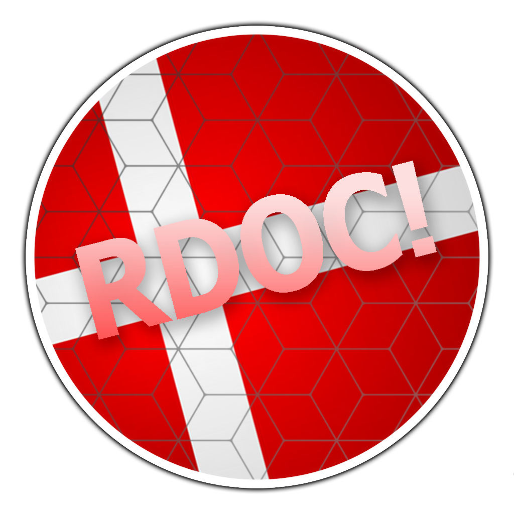

---
tags:
  - RDOC
  - RDOC2017
---

# Royal Danish osu!Cup 2017

The **Royal Danish osu!Cup 2017** (***RDOC 2017***) was a Danish 1v1 double-elimination osu! tournament hosted by ::{ flag=DK }:: [Hudda](https://osu.ppy.sh/users/4103629), ::{ flag=DK }:: [Crylizhy](https://osu.ppy.sh/users/3023138), and ::{ flag=DK }:: [Spork Lover](https://osu.ppy.sh/users/3417469). It was the third instalment of the Royal Danish osu!Cup.

## Tournament schedule

| Event | Timestamp |
| --: | :-- |
| Registration phase | 2017-02-03/2017-02-20 |
| Live drawings | 2017-02-26 |
| Group stage | 2017-03-04/2017-03-12 |
| Round of 16 | 2017-03-18/2017-03-19 |
| Quarterfinals | 2017-03-25/2017-03-26 |
| Semifinals | 2017-04-01/2017-04-02 |
| Finals and Grand Finals | 2017-04-08/2017-04-09 |

## Prizes

| Placing | Prize(s) |
| :-: | :-- |
|  | Unique profile badge, 12 months of osu!supporter, custom hoodie |
|  | 6 months of osu!supporter, custom t-shirt |
|  | 4 months of osu!supporter |
| *4th place* | 2 months of osu!supporter |

## Organisation

The Royal Danish osu!Cup 2017 was run by various community members.

| Position | Member(s) |
| :-- | :-- |
| Manager | ::{ flag=DK }:: [Crylizhy](https://osu.ppy.sh/users/3023138), ::{ flag=DK }:: [Hudda](https://osu.ppy.sh/users/4103629), ::{ flag=DK }:: [Spork Lover](https://osu.ppy.sh/users/3417469), ::{ flag=DK }:: [TimG](https://osu.ppy.sh/users/1879963) |
| Mappool selector | ::{ flag=US }:: [pishifat](https://osu.ppy.sh/users/3178418), ::{ flag=DK }:: [Spork Lover](https://osu.ppy.sh/users/3417469), ::{ flag=DK }:: [-Tochi](https://osu.ppy.sh/users/3664366), ::{ flag=DK }:: [Lemmen](https://osu.ppy.sh/users/6090254) |
| Referee | ::{ flag=DK }:: [waefwerf](https://osu.ppy.sh/users/3868653), ::{ flag=DK }:: [-Gabby-](https://osu.ppy.sh/users/3727470), ::{ flag=DK }:: [Hudda](https://osu.ppy.sh/users/4103629), ::{ flag=DK }:: [Lemmen](https://osu.ppy.sh/users/6090254), ::{ flag=DK }:: [Asymmetry Echo](https://osu.ppy.sh/users/4290324), ::{ flag=DK }:: [Crylizhy](https://osu.ppy.sh/users/3023138), ::{ flag=DK }:: [TimG](https://osu.ppy.sh/users/1879963), ::{ flag=DK }:: [iamVill](https://osu.ppy.sh/users/6295380), ::{ flag=DK }:: [New Username](https://osu.ppy.sh/users/4745206), ::{ flag=DK }:: [\[ Pennek \]](https://osu.ppy.sh/users/3723742) |
| Streamer | ::{ flag=DK }:: [Hudda](https://osu.ppy.sh/users/4103629), ::{ flag=DK }:: [Contaminate](https://osu.ppy.sh/users/4694589), ::{ flag=DK }:: [iamVill](https://osu.ppy.sh/users/6295380), ::{ flag=DK }:: [waefwerf](https://osu.ppy.sh/users/3868653), ::{ flag=DK }:: [John Cena](https://osu.ppy.sh/users/2958963) |
| Commentator | ::{ flag=DK }:: [Lemmen](https://osu.ppy.sh/users/6090254), ::{ flag=DK }:: [iamVill](https://osu.ppy.sh/users/6295380), ::{ flag=DK }:: [Spork Lover](https://osu.ppy.sh/users/3417469), ::{ flag=DK }:: [waefwerf](https://osu.ppy.sh/users/3868653), ::{ flag=SE }:: [Velo](https://osu.ppy.sh/users/6245307), ::{ flag=DK }:: [Flyville](https://osu.ppy.sh/users/6124808), ::{ flag=DK }:: [John Cena](https://osu.ppy.sh/users/2958963) |
| Designer | ::{ flag=DK }:: [Hudda](https://osu.ppy.sh/users/4103629), ::{ flag=DK }:: [-Tochi](https://osu.ppy.sh/users/3417469), ::{ flag=US }:: [BearZyo](https://osu.ppy.sh/users/6116759) |
| Donator | ::{ flag=DK }:: [MASQQ](https://osu.ppy.sh/users/5351497), ::{ flag=DK }:: [\_Adolfin\_](https://osu.ppy.sh/users/6735707) |

## Links

- [Discussion thread](https://osu.ppy.sh/community/forums/topics/553131)
- [RDOC Discord server](https://discord.gg/4XRqWJB)
- [Challonge brackets](https://challonge.com/rdoc2017)

## Participants

| Seed | Members |
| :-- | :-- |
| Top | ::{ flag=DK }:: [Zog](https://osu.ppy.sh/users/3722715), ::{ flag=DK }:: [iamVill](https://osu.ppy.sh/users/6295380), ::{ flag=DK }:: [Vandabe](https://osu.ppy.sh/users/7050754), ::{ flag=DK }:: [waefwerf](https://osu.ppy.sh/users/3868653), ::{ flag=DK }:: [Hudda](https://osu.ppy.sh/users/4103629), ::{ flag=DK }:: [Emub](https://osu.ppy.sh/users/4337359), ::{ flag=DK }:: [Zakura](https://osu.ppy.sh/users/3053599), ::{ flag=DK }:: [raser1234](https://osu.ppy.sh/users/2527887) |
| High | ::{ flag=DK }:: [teamplayer51](https://osu.ppy.sh/users/3084508), ::{ flag=DK }:: [Kazutakee](https://osu.ppy.sh/users/2637514), ::{ flag=DK }:: [LeDoodeNiginz](https://osu.ppy.sh/users/5778925), ::{ flag=DK }:: [Crylizhy](https://osu.ppy.sh/users/3023138), ::{ flag=DK }:: [Kawatta](https://osu.ppy.sh/users/3731880), ::{ flag=DK }:: [Asymmetry Echo](https://osu.ppy.sh/users/4290324), ::{ flag=DK }:: [-Gabby-](https://osu.ppy.sh/users/3727470), ::{ flag=DK }:: [StevenDANK](https://osu.ppy.sh/users/1729766) |
| Low | ::{ flag=DK }:: [Xanoxe](https://osu.ppy.sh/users/7060592), ::{ flag=DK }:: [Contaminate](https://osu.ppy.sh/users/4694589), ::{ flag=DK }:: [TimG](https://osu.ppy.sh/users/1879963), ::{ flag=DK }:: [ZcortezZ](https://osu.ppy.sh/users/2228245), ::{ flag=DK }:: [dobo-chan](https://osu.ppy.sh/users/4019641), ::{ flag=DK }:: [\[ Pennek \]](https://osu.ppy.sh/users/3723742), ::{ flag=DK }:: [Gudafild](https://osu.ppy.sh/users/5358569), ::{ flag=DK }:: [Hestai](https://osu.ppy.sh/users/4622337) |
| Bottom | ::{ flag=DK }:: [HoarseFish](https://osu.ppy.sh/users/6344368), ::{ flag=DK }:: [Arild](https://osu.ppy.sh/users/3089925), ::{ flag=DK }:: [LedoodeNiss](https://osu.ppy.sh/users/7345263), ::{ flag=DK }:: [\_Adolfin\_](https://osu.ppy.sh/users/6735707), ::{ flag=DK }:: [seb2110](https://osu.ppy.sh/users/5323224), ::{ flag=DK }:: [Power Supply](https://osu.ppy.sh/users/7091513), ::{ flag=DK }:: [TheFancyPikachu](https://osu.ppy.sh/users/1946377), ::{ flag=DK }:: [DragonsDungeon](https://osu.ppy.sh/users/4134819) |

## Groups

| Group | Top seed | High seed | Low seed | Bottom seed |
| :-: | :-- | :-- | :-- | :-- |
| **A** | ::{ flag=DK }:: [Emub](https://osu.ppy.sh/users/4337359) | ::{ flag=DK }:: [Kawatta](https://osu.ppy.sh/users/3731880) | ::{ flag=DK }:: [\[ Pennek \]](https://osu.ppy.sh/users/3723742) | ::{ flag=DK }:: [\_Adolfin\_](https://osu.ppy.sh/users/6735707) |
| **B** | ::{ flag=DK }:: [waefwerf](https://osu.ppy.sh/users/3868653) | ::{ flag=DK }:: [Kazutakee](https://osu.ppy.sh/users/2637514) | ::{ flag=DK }:: [Xanoxe](https://osu.ppy.sh/users/7060592) | ::{ flag=DK }:: [seb2110](https://osu.ppy.sh/users/5323224) |
| **C** | ::{ flag=DK }:: [iamVill](https://osu.ppy.sh/users/6295380) | ::{ flag=DK }:: [teamplayer51](https://osu.ppy.sh/users/3084508) | ::{ flag=DK }:: [Hestai](https://osu.ppy.sh/users/4622337) | ::{ flag=DK }:: [LedoodeNiss](https://osu.ppy.sh/users/7345263) |
| **D** | ::{ flag=DK }:: [Vandabe](https://osu.ppy.sh/users/7050754) | ::{ flag=DK }:: [Asymmetry Echo](https://osu.ppy.sh/users/4290324) | ::{ flag=DK }:: [ZcortezZ](https://osu.ppy.sh/users/2228245) | ::{ flag=DK }:: [TheFancyPikachu](https://osu.ppy.sh/users/1946377) |
| **E** | ::{ flag=DK }:: [Zog](https://osu.ppy.sh/users/3722715) | ::{ flag=DK }:: [Crylizhy](https://osu.ppy.sh/users/3023138) | ::{ flag=DK }:: [Contaminate](https://osu.ppy.sh/users/4694589) | ::{ flag=DK }:: [DragonsDungeon](https://osu.ppy.sh/users/4134819) |
| **F** | ::{ flag=DK }:: [Zakura](https://osu.ppy.sh/users/3053599) | ::{ flag=DK }:: [LeDoodeNiginz](https://osu.ppy.sh/users/5778925) | ::{ flag=DK }:: [TimG](https://osu.ppy.sh/users/1879963) | ::{ flag=DK }:: [Arild](https://osu.ppy.sh/users/3089925) |
| **G** | ::{ flag=DK }:: [Hudda](https://osu.ppy.sh/users/4103629) | ::{ flag=DK }:: [StevenDANK](https://osu.ppy.sh/users/1729766) | ::{ flag=DK }:: [Gudafild](https://osu.ppy.sh/users/5358569) | ::{ flag=DK }:: [HoarseFish](https://osu.ppy.sh/users/4361285) |
| **H** | ::{ flag=DK }:: [raser1234](https://osu.ppy.sh/users/6344368) | ::{ flag=DK }:: [-Gabby-](https://osu.ppy.sh/users/3727470) | ::{ flag=DK }:: [dobo-chan](https://osu.ppy.sh/users/4019641) | ::{ flag=DK }:: [Power Supply](https://osu.ppy.sh/users/7091513) |

## Podium

This competition has come to an end and resulted in the following podium:

| Placing | Player |
| :-: | :-- |
|  | ::{ flag=DK }:: [raser1234](https://osu.ppy.sh/users/2527887) |
|  | ::{ flag=DK }:: [iamVill](https://osu.ppy.sh/users/6295380) |
|  | ::{ flag=DK }:: [waefwerf](https://osu.ppy.sh/users/3868653) |
| *4th place* | ::{ flag=DK }:: [teamplayer51](https://osu.ppy.sh/users/3084508) |

## Mappools

### Finals

- NoMod
  1. [Camellia - dreamless wanderer \[lost\]](https://osu.ppy.sh/beatmapsets/417492#osu/904030)
  2. [SHK - Death Moon II \[SHD\]](https://osu.ppy.sh/beatmapsets/472158#osu/1009022)
  3. [Zips - Heisei Cataclysm \[0108\]](https://osu.ppy.sh/beatmapsets/72217#osu/220231)
  4. [Ryu\* - Sakura Mirage \[ULTRA\]](https://osu.ppy.sh/beatmapsets/205022#osu/484036)
  5. [Smooth McGroove - Mega Man X Spark Mandrill (Dj CUTMAN Remix) \[fartownik & Okorin's Extreme\]](https://osu.ppy.sh/beatmapsets/399912#osu/927819)
  6. [Fear, and Loathing in Las Vegas - Let Me Hear \[Extra\]](https://osu.ppy.sh/beatmapsets/225293#osu/527533)
- Hidden
  1. [Ocelot - TSUBAKI \[fanzhen's Extreme\]](https://osu.ppy.sh/beatmapsets/364574#osu/848061)
  2. [sakuzyo - Imprinting \[Impress\]](https://osu.ppy.sh/beatmapsets/264299#osu/602547)
  3. [Yuyoyuppe - AiAe \[Eternal\]](https://osu.ppy.sh/beatmapsets/257793#osu/589969)
- HardRock
  1. [Eiko Shimamiya - Higurashi no Naku Koro ni \[Elvis' Extra\]](https://osu.ppy.sh/beatmapsets/333543#osu/799166)
  2. [Street - Sakura Fubuki \[Sakura no Hana\]](https://osu.ppy.sh/beatmapsets/362989#osu/797108)
  3. [BlackYooh vs. siromaru - BLACK or WHITE? \[MASTER\]](https://osu.ppy.sh/beatmapsets/248876#osu/635679)
- DoubleTime
  1. [Apink - Petal \[Insane\]](https://osu.ppy.sh/beatmapsets/342010#osu/756035)
  2. [petit milady - Ma Cherie \[Lovers\]](https://osu.ppy.sh/beatmapsets/255481#osu/585605)
  3. [Touyama Nao - Magical Mah-jongg World \[Insane\]](https://osu.ppy.sh/beatmapsets/74687#osu/259519)
- FreeMod
  1. [Aya Ishihara - Reset (Full ver) \[Madness\]](https://osu.ppy.sh/beatmapsets/16641#osu/65756)
- Tiebreaker
  1. **[DystopiaGround - AugoEidEs \[nao\]](https://osu.ppy.sh/beatmapsets/95701#osu/300689)**

### Semifinals

- NoMod
  1. [DJ TOTTO - glacia \[Expert\]](https://osu.ppy.sh/beatmapsets/347170#osu/766202)
  2. [DM Ashura - Classical Insanity \[Vivacissmo\]](https://osu.ppy.sh/beatmapsets/79149#osu/229695)
  3. [Kano - Toy-toi \[Insane\]](https://osu.ppy.sh/beatmapsets/389777#osu/849749)
  4. [sakuzyo - VALLISTA \[iNsAnE\]](https://osu.ppy.sh/beatmapsets/245970#osu/566749)
  5. [Cilvery - Kamisama Nejimaki \[Catastrophe\]](https://osu.ppy.sh/beatmapsets/374900#osu/821238)
  6. [EYKHA (CV : Sawashiro Miyuki) LOU (CV : Uchida Maaya) MERYL (CV : Terui Haruka) - Delta Decision \[Eternal Affliction\]](https://osu.ppy.sh/beatmapsets/494606#osu/1053130)
- Hidden
  1. [Jimmy Weckl - Get Happy \[MASTER\]](https://osu.ppy.sh/beatmapsets/359580#osu/953945)
  2. [IA - Six Trillion Years and Overnight Story \[0108\]](https://osu.ppy.sh/beatmapsets/51245#osu/157861)
  3. [DJ YOSHITAKA - FLOWER \[EXTREME\]](https://osu.ppy.sh/beatmapsets/31054#osu/128780)
- HardRock
  1. [sana - Sayonara Ryou Kataomoi \[Extra\]](https://osu.ppy.sh/beatmapsets/508803#osu/1179268)
  2. [azihel & Virtual Riot - One For All, All For One \[deetz' Expert\]](https://osu.ppy.sh/beatmapsets/275655#osu/695636)
  3. [Reol - Asymmetry \[P A N's Extra\]](https://osu.ppy.sh/beatmapsets/292077#osu/661705)
- DoubleTime
  1. [Kano - Setsuna Plus \[Insane\]](https://osu.ppy.sh/beatmapsets/140379#osu/350646)
  2. [yanaginagi - Owari no Sekai kara \[Insane\]](https://osu.ppy.sh/beatmapsets/270999#osu/616251)
  3. [Various Artists - Let It Go (Multi-Language Full Sequence) \[Frozen\]](https://osu.ppy.sh/beatmapsets/196318#osu/468186)
- FreeMod
  1. [Memme - NEW Astronomas \[Extra\]](https://osu.ppy.sh/beatmapsets/87188#osu/238265)
- Tiebreaker
  1. **[SawanoHiroyuki[nZk]:Gemie - x.U. (ETIA. Hardcore Bootleg Remix) \[Shinoa\]](https://osu.ppy.sh/beatmapsets/331872#osu/735021)**

### Quarterfinals

- NoMod
  1. [Pierce The Veil - King For A Day (feat Kellin Quinn) \[Insanother\]](https://osu.ppy.sh/beatmapsets/297909#osu/679817)
  2. [xi - Akasha \[N/A's Another\]](https://osu.ppy.sh/beatmapsets/403427#osu/931860)
  3. [M2U - Masquerade \[Extra\]](https://osu.ppy.sh/beatmapsets/124857#osu/356030)
  4. [HoneyWorks - Akatsuki Zukuyo \[Twilight\]](https://osu.ppy.sh/beatmapsets/332800#osu/736729)
  5. [sakuzyo - Neurotoxin \[Skystar's Expert\]](https://osu.ppy.sh/beatmapsets/198380#osu/636109)
  6. [Lon - Yuru Fuwa Jukai Girl \[Mystica's Insane\]](https://osu.ppy.sh/beatmapsets/49686#osu/155438)
- Hidden
  1. [ayaponzu\* - Otsukimi Recital \[Broccoly's Extra\]](https://osu.ppy.sh/beatmapsets/172157#osu/416211)
  2. [Gentle Stick X M2U - Ineffabilis \[Yuki's Extra\]](https://osu.ppy.sh/beatmapsets/340903#osu/766528)
  3. [LiSA - Rising Hope \[Skystar's ExtrA\]](https://osu.ppy.sh/beatmapsets/157871#osu/400238)
- HardRock
  1. [ITO KASHITARO - Yuudachi no Ribbon \[apple's Insane\]](https://osu.ppy.sh/beatmapsets/479811#osu/1091115)
  2. [SHW - Ikusa JAPAN (shw.in) \[Ikusa!\]](https://osu.ppy.sh/beatmapsets/46660#osu/145165)
  3. [Feint - Tower Of Heaven (You Are Slaves) \[Extra\]](https://osu.ppy.sh/beatmapsets/128931#osu/847314)
- DoubleTime
  1. [ALTIMA - Burst the Gravity \[Insane\]](https://osu.ppy.sh/beatmapsets/81567#osu/226351)
  2. [Yuuyu feat. Megpoid GUMI - 228080! \[LKS\]](https://osu.ppy.sh/beatmapsets/47110#osu/146342)
  3. [Agressor Bunx - Tornado (Original Mix) \[Insane\]](https://osu.ppy.sh/beatmapsets/236292#osu/569636)
- FreeMod
  1. [Giga - -BWW SCREAM- \[yf's sb Extreme\]](https://osu.ppy.sh/beatmapsets/404658#osu/890901)
- Tiebreaker
  1. **[Akira Complex - Odyssey (Au5 Remix) \[Excursion\]](https://osu.ppy.sh/beatmapsets/341007#osu/754143)**

### Round of 16

- NoMod
  1. [Lifetheory - Angel \[Sanctum\]](https://osu.ppy.sh/beatmapsets/113192#osu/308040)
  2. [sana - Packet Hero \[Joey's Insane\]](https://osu.ppy.sh/beatmapsets/404910#osu/899221)
  3. [Yousei Teikoku - Deep Sea \[LC\]](https://osu.ppy.sh/beatmapsets/104260#osu/274365)
  4. [Nanahoshi Kangengakudan feat.Matsushita - Dance Number o Tomo ni \[deetz' Insane\]](https://osu.ppy.sh/beatmapsets/353398#osu/821336)
  5. [UNDEAD CORPORATION - Yoru Naku Usagi wa Yume o Miru \[Lunatic\]](https://osu.ppy.sh/beatmapsets/58951#osu/176960)
  6. [P\*Light - FUNKY SUMMER BEACH \[K.Penguin's Extra\]](https://osu.ppy.sh/beatmapsets/212192#osu/500082)
- Hidden
  1. [Rohi - Kakuzetsu Thanatos \[RLC\]](https://osu.ppy.sh/beatmapsets/76396#osu/216133)
  2. [TWICE - CHEER UP \[SHASHASHA\]](https://osu.ppy.sh/beatmapsets/456547#osu/978382)
  3. [SHK - Identity Part 5 \[ExtrA\]](https://osu.ppy.sh/beatmapsets/171676#osu/415217)
- HardRock
  1. [EastNewSound - Eisou Youga \~Meikyou Shisui\~ \[Lunatic\]](https://osu.ppy.sh/beatmapsets/83130#osu/229699)
  2. [capsule - JUMPER \[Insane!\]](https://osu.ppy.sh/beatmapsets/21130#osu/73494)
  3. [Jin - Otsukimi Recital \[Recital\]](https://osu.ppy.sh/beatmapsets/102366#osu/270536)
- DoubleTime
  1. [LeaF - Paraclete \[Feb's Hyper\]](https://osu.ppy.sh/beatmapsets/455109#osu/991587)
  2. [Buta-Otome - Sharekoube \[Kite's Hard\]](https://osu.ppy.sh/beatmapsets/304940#osu/720226)
  3. [Paramore - Still Into You \[Fizz' Insane\]](https://osu.ppy.sh/beatmapsets/301830#osu/691529)
- FreeMod
  1. [Split Insane \[Split Insane\]](https://osu.ppy.sh/beatmapsets/153887#osu/828154)
- Tiebreaker
  1. **[Sakaue Nachi - Crazy Hot \[Crazy Night\]](https://osu.ppy.sh/beatmapsets/175671#osu/703584)**

### Group stage

- NoMod
  1. [sta - Iris \[Insane\]](https://osu.ppy.sh/beatmapsets/94917#osu/255163)
  2. [P\*Light - Poppin' Shower \[Another\]](https://osu.ppy.sh/beatmapsets/42527#osu/133723)
  3. [Ito Kanako - Amadeus \[Insane\]](https://osu.ppy.sh/beatmapsets/384688#osu/840538)
  4. [Yuaru - Asu no Yozora Shoukaihan \[Linada's Insane\]](https://osu.ppy.sh/beatmapsets/384772#osu/854616)
  5. [STEREO DIVE FOUNDATION - Renegade \[revolution.\]](https://osu.ppy.sh/beatmapsets/351719#osu/775179)
  6. [Delain - Go Away \[Insane\]](https://osu.ppy.sh/beatmapsets/475676#osu/1017900)
- Hidden
  1. [KOTOKO - Oboetete Ii yo \[Insane\]](https://osu.ppy.sh/beatmapsets/53791#osu/163836)
  2. [Crescent Moon Island Boss Theme \[Insane\]](https://osu.ppy.sh/beatmapsets/173422#osu/653128)
  3. [96Neko - Yoshiwara Lament \[Insane\]](https://osu.ppy.sh/beatmapsets/189377#osu/451227)
- HardRock
  1. [Dio ft. Sef - Tijdmachine \[Insane '10\]](https://osu.ppy.sh/beatmapsets/6997#osu/131147)
  2. [Block B - HER \[Insane\]](https://osu.ppy.sh/beatmapsets/280597#osu/634879)
  3. [beatMARIO - Night of Knights \[N a s y a's Insane\]](https://osu.ppy.sh/beatmapsets/352570#osu/785982)
- DoubleTime
  1. [senya - Senka Ryouran \[Chocopikel\]](https://osu.ppy.sh/beatmapsets/66190#osu/193523)
  2. [Silent Siren - Koi Yuki \[Yuki\]](https://osu.ppy.sh/beatmapsets/319303#osu/710753)
  3. [cYsmix feat. Emmy - Tear Rain \[Insane\]](https://osu.ppy.sh/beatmapsets/140662#osu/351189)
- FreeMod
  1. [sakuzyo - Scheol \[Another\]](https://osu.ppy.sh/beatmapsets/114392#osu/296250)
- Tiebreaker
  1. **[Hatsuki Yura - Drivi'n greedy - Nhato Remix - \[Moon\]](https://osu.ppy.sh/beatmapsets/228955#osu/532958)**

## Match results

### Grand Finals

Sunday, 27 October 2017:

| Group | Player 1 |  |  | Player 2 |
| :-: | --: | :-: | :-: | :-- |
| UB | **raser1234** ::{ flag=DK }:: | **7** | 4 | ::{ flag=DK }:: iamVill |
| LB | **raser1234** ::{ flag=DK }:: | **7** | 2 | ::{ flag=DK }:: waefwerf |

### Finals

Saturday, 20 October 2017:

| Group | Player 1 |  |  | Player 2 |
| :-: | --: | :-: | :-: | :-- |
| UB | **iamVill** ::{ flag=DK }:: | **7** | 3 | ::{ flag=DK }:: waefwerf |
| LB | teamplayer51 ::{ flag=DK }:: | 2 | **7** | ::{ flag=DK }:: **raser1234** |
| LB | **teamplayer51** ::{ flag=DK }:: | **7** | 6 | ::{ flag=DK }:: Hudda |
| LB | Vandabe ::{ flag=DK }:: | 2 | **7** | ::{ flag=DK }:: **raser1234** |

### Semifinals

Friday, 31 March 2017:

| Group | Player 1 |  |  | Player 2 |
| :-: | --: | :-: | :-: | :-- |
| LB | **Zakura** ::{ flag=DK }:: | **6** | 0 | ::{ flag=DK }:: Kawatta |
| LB | Zog ::{ flag=DK }:: | 4 | **6** | ::{ flag=DK }:: **Kazutakee** |

Saturday, 1 April 2017:

| Group | Player 1 |  |  | Player 2 |
| :-: | --: | :-: | :-: | :-- |
| UB | **waefwerf** ::{ flag=DK }:: | **6** | 4 | ::{ flag=DK }:: raser1234 |
| LB | Crylizhy ::{ flag=DK }:: | 3 | **6** | ::{ flag=DK }:: **Vandabe** |

Sunday, 2 April 2017:

| Group | Player 1 |  |  | Player 2 |
| :-: | --: | :-: | :-: | :-- |
| LB | LedoodeNiginz ::{ flag=DK }:: | 1 | **6** | ::{ flag=DK }:: **teamplayer51** |
| LB | **teamplayer51** ::{ flag=DK }:: | **6** | 1 | ::{ flag=DK }:: Kazutakee |

Monday, 3 April 2017:

| Group | Player 1 |  |  | Player 2 |
| :-: | --: | :-: | :-: | :-- |
| LB | **Vandabe** ::{ flag=DK }:: | **6** | 2 | ::{ flag=DK }:: Zakura |

Thursday, 6 April 2017:

| Group | Player 1 |  |  | Player 2 |
| :-: | --: | :-: | :-: | :-- |
| UB | Hudda ::{ flag=DK }:: | 1 | **6** | ::{ flag=DK }:: **iamVill** |

### Quarterfinals

Saturday, 25 March 2017:

| Group | Player 1 |  |  | Player 2 |
| :-: | --: | :-: | :-: | :-- |
| UB | **raser1234** ::{ flag=DK }:: | **5** | 2 | ::{ flag=DK }:: Zog |
| UB | Crylizhy ::{ flag=DK }:: | 3 | **5** | ::{ flag=DK }:: **Hudda** |
| LB | **Zakura** ::{ flag=DK }:: | **5** | 2 | ::{ flag=DK }:: StevenDANK |
| LB | **LedoodeNiginz** ::{ flag=DK }:: | **5** | 0 | ::{ flag=DK }:: Power Supply |

Sunday, 26 March 2017:

| Group | Player 1 |  |  | Player 2 |
| :-: | --: | :-: | :-: | :-- |
| LB | \[ Pennek \] ::{ flag=DK }:: | 2 | **5** | ::{ flag=DK }:: **Vandabe** |
| LB | **Kazutakee** ::{ flag=DK }:: | **6** | 0 | ::{ flag=DK }:: Asymmetry Echo |
| UB | Kawatta ::{ flag=DK }:: | 1 | **5** | ::{ flag=DK }:: **iamVill** |
| UB | teamplayer51 ::{ flag=DK }:: | 2 | **5** | ::{ flag=DK }:: **waefwerf** |

### Round of 16

Friday, 17 March 2017:

| Group | Player 1 |  |  | Player 2 |
| :-: | --: | :-: | :-: | :-- |
| UB | Power Supply ::{ flag=DK }:: | 0 | **5** | ::{ flag=DK }:: **Hudda** |

Saturday, 18 March 2017:

| Group | Player 1 |  |  | Player 2 |
| :-: | --: | :-: | :-: | :-- |
| UB | \[ Pennek \] ::{ flag=DK }:: | 1 | **5** | ::{ flag=DK }:: **waefwerf** |
| UB | **Crylizhy** ::{ flag=DK }:: | **5** | 1 | ::{ flag=DK }:: LedoodeNiginz |

Sunday, 19 March 2017:

| Group | Player 1 |  |  | Player 2 |
| :-: | --: | :-: | :-: | :-- |
| UB | Vandabe ::{ flag=DK }:: | 3 | **5** | ::{ flag=DK }:: **teamplayer51** |
| UB | **Zog** ::{ flag=DK }:: | **5** | 2 | ::{ flag=DK }:: Zakura |
| UB | StevenDANK ::{ flag=DK }:: | 3 | **5** | ::{ flag=DK }:: **raser1234** |

Monday, 20 March 2017:

| Group | Player 1 |  |  | Player 2 |
| :-: | --: | :-: | :-: | :-- |
| UB | **Kawatta** ::{ flag=DK }:: | **5** | 3 | ::{ flag=DK }:: Kazutakee |

Tuesday, 21 March 2017:

| Group | Player 1 |  |  | Player 2 |
| :-: | --: | :-: | :-: | :-- |
| UB | **iamVill** ::{ flag=DK }:: | **5** | 1 | ::{ flag=DK }:: Asymmetry Echo |

### Group stage

Saturday, 4 March 2017:

| Group | Player 1 |  |  | Player 2 |
| :-: | --: | :-: | :-: | :-- |
| A | **Kawatta** ::{ flag=DK }:: | **4** | 1 | ::{ flag=DK }:: \_Adolfin\_ |
| A | **\[ Pennek \]** ::{ flag=DK }:: | **4** | 3 | ::{ flag=DK }:: Emub |
| A | **Kawatta** ::{ flag=DK }:: | **4** | 2 | ::{ flag=DK }:: Emub |
| A | **\[ Pennek \]** ::{ flag=DK }:: | **4** | 0 | ::{ flag=DK }:: \_Adolfin\_ |
| A | **Kawatta** ::{ flag=DK }:: | **4** | 2 | ::{ flag=DK }:: \[ Pennek \] |
| A | \_Adolfin\_ ::{ flag=DK }:: | 1 | **4** | ::{ flag=DK }:: **Emub** |
| F | **Zakura** ::{ flag=DK }:: | **4** | 2 | ::{ flag=DK }:: TimG |
| F | **LedoodeNiginz** ::{ flag=DK }:: | **4** | 1 | ::{ flag=DK }:: Arild |
| F | Arild ::{ flag=DK }:: | 2 | **4** | ::{ flag=DK }:: **Zakura** |
| F | **LedoodeNiginz** ::{ flag=DK }:: | **4** | 2 | ::{ flag=DK }:: TimG |
| F | **Zakura** ::{ flag=DK }:: | **4** | 1 | ::{ flag=DK }:: LedoodeNiginz |
| F | **Arild** ::{ flag=DK }:: | **4** | 3 | ::{ flag=DK }:: TimG |

Sunday, 5 March 2017:

| Group | Player 1 |  |  | Player 2 |
| :-: | --: | :-: | :-: | :-- |
| E | **Zog** ::{ flag=DK }:: | **4** | 1 | ::{ flag=DK }:: DragonsDungeon |
| E | **Crylizhy** ::{ flag=DK }:: | **4** | 2 | ::{ flag=DK }:: DragonsDungeon |
| E | Zog ::{ flag=DK }:: | 2 | **4** | ::{ flag=DK }:: **Crylizhy** |
| H | **raser1234** ::{ flag=DK }:: | **4** | 0 | ::{ flag=DK }:: Power Supply |
| H | -Gabby- ::{ flag=DK }:: | 1 | **4** | ::{ flag=DK }:: **dobo-chan** |
| H | dobo-chan ::{ flag=DK }:: | 1 | **4** | ::{ flag=DK }:: **raser1234** |
| H | -Gabby- ::{ flag=DK }:: | 0 | **4** | ::{ flag=DK }:: **Power Supply** |
| H | **raser1234** ::{ flag=DK }:: | **4** | 0 | ::{ flag=DK }:: -Gabby- |
| H | dobo-chan ::{ flag=DK }:: | 3 | **4** | ::{ flag=DK }:: **Power Supply** |

Friday, 10 March 2017:

| Group | Player 1 |  |  | Player 2 |
| :-: | --: | :-: | :-: | :-- |
| G | Gudafild ::{ flag=DK }:: | 2 | **4** | ::{ flag=DK }:: **Hudda** |
| G | **Hudda** ::{ flag=DK }:: | **4** | 3 | ::{ flag=DK }:: StevenDANK |
| G | **Hudda** ::{ flag=DK }:: | **4** | 1 | ::{ flag=DK }:: Hoarsefish |
| E | **Crylizhy** ::{ flag=DK }:: | **4** | 0 | ::{ flag=DK }:: Contaminate |
| E | Contaminate ::{ flag=DK }:: | 2 | **4** | ::{ flag=DK }:: **Zog** |
| E | Contaminate ::{ flag=DK }:: | 3 | **4** | ::{ flag=DK }:: **DragonsDungeon** |

Saturday, 11 March 2017:

| Group | Player 1 |  |  | Player 2 |
| :-: | --: | :-: | :-: | :-- |
| D | **Vandabe** ::{ flag=DK }:: | **4** | 2 | ::{ flag=DK }:: TheFancyPikachu |
| D | **Asymmetry Echo** ::{ flag=DK }:: | **4** | 1 | ::{ flag=DK }:: ZzcortezZ |
| D | ZzcortezZ ::{ flag=DK }:: | 1 | **4** | ::{ flag=DK }:: **Vandabe** |
| D | **Asymmetry Echo** ::{ flag=DK }:: | **4** | 0 | ::{ flag=DK }:: TheFancyPikachu |
| D | **Vandabe** ::{ flag=DK }:: | **4** | 1 | ::{ flag=DK }:: Asymmetry Echo |
| D | **ZzcortezZ** ::{ flag=DK }:: | **4** | 3 | ::{ flag=DK }:: TheFancyPikachu |
| G | **StevenDANK** ::{ flag=DK }:: | **4** | 1 | ::{ flag=DK }:: Gudafild |
| G | **StevenDANK** ::{ flag=DK }:: | **4** | 1 | ::{ flag=DK }:: Hoarsefish |
| G | Gudafild ::{ flag=DK }:: | 1 | **4** | ::{ flag=DK }:: **Hoarsefish** |

Sunday, 12 March 2017:

| Group | Player 1 |  |  | Player 2 |
| :-: | --: | :-: | :-: | :-- |
| B | **waefwerf** ::{ flag=DK }:: | **4** | 0 | ::{ flag=DK }:: seb2110 |
| B | **Kazutakee** ::{ flag=DK }:: | **4** | 2 | ::{ flag=DK }:: Xanoxe |
| B | Xanoxe ::{ flag=DK }:: | 1 | **4** | ::{ flag=DK }:: **waefwerf** |
| B | **Kazutakee** ::{ flag=DK }:: | **4** | 0 | ::{ flag=DK }:: seb2110 |
| B | **waefwerf** ::{ flag=DK }:: | **4** | 1 | ::{ flag=DK }:: Kazutakee |
| B | **Xanoxe** ::{ flag=DK }:: | **4** | 1 | ::{ flag=DK }:: seb2110 |
| C | **iamVill** ::{ flag=DK }:: | **4** | 0 | ::{ flag=DK }:: LedoodeNiss |
| C | **teamplayer51** ::{ flag=DK }:: | **4** | 0 | ::{ flag=DK }:: Hestai |
| C | Hestai ::{ flag=DK }:: | 0 | **4** | ::{ flag=DK }:: **iamVill** |
| C | **teamplayer51** ::{ flag=DK }:: | **4** | 0 | ::{ flag=DK }:: LedoodeNiss |
| C | **iamVill** ::{ flag=DK }:: | **4** | 0 | ::{ flag=DK }:: teamplayer51 |
| C | Hestai ::{ flag=DK }:: | 1 | **4** | ::{ flag=DK }:: **LedoodeNiss** |

## Ruleset

### General rules

1. Only users in the Kingdom of Denmark can enter. This is determined by the profile-flag on a player's userpage (Eg. a player with either of these flags is eligible to participate: ::{ flag=DK }::, ::{ flag=FO }::, ::{ flag=GL }::)
2. This tournament uses a double-elimination bracket and single-player format. There are no teams here.
3. The score system used will be **Score V1**.
4. To participate you **must** join the Discord for the duration of the tournament.
5. Match schedule is decided by the organizers. Players may ask for a reschedule if the current schedule does not work for them. Every stage except Group stage will last one weekend. Grou pstage will be played over two weekends instead due to the relatively small staff-size.
6. If there are no referees available, the match can be postponed.
7. If both players get the same score on a Tiebreaker, the Tiebreaker will be replayed.
8. Players have 15 minutes to show up to their scheduled match. If the opponent doesn't show up, the player who was supposed to play automatically advances onwards.
9. If a player is found to be abusive or rude to other players in the tournament, they may be removed from the tournament at the hosts' discretion. This will never be done without talking to the parties involved. If conduct is bad enough, players may be blacklisted from future tournaments and reported to osu! moderation staff. Trashtalk is fine — harrasment is not.
10. Any other rules changes or unexpected occurrences will be announced on the Discord server.

### Stage regulations

1. There are six stages to this tournament: Group Stage, Round of 16, Quarterfinals, Semifinals, Finals and Grand Finals.
2. Groups are seeded into four tiers; top, high, low and bottom. This seeding is determined from the overall ranking of players at the start of the tournament. This means that only the 32 highest ranked players will be able to play in the tournament. All players that do not fit these criteria are placed into the fallback category as potential replacements if one of the 32 seeded players no-shows.
3. If a player no-shows their first match in Group Stage they will be replaced by the highest ranked player in the fallback category. If a player no-shows in later matches they will forfeit the match.
4. The win-condition for each stage is listed below:
   - Group Stage: Best of 7 (first to 4 points)
   - Round of 16: Best of 9 (first to 5 points)
   - Quarterfinals: Best of 9 (first to 5 points)
   - Semifinals: Best of 11 (first to 6 points)
   - Finals and Grand Finals: Best of 13 (first to 7 points)
5. After the Group Stage, only the top 2 players from each group will advance to the next stage.
6. In case of a tie in Group Stage, advancement will be based off a player's map wins and map losses. If the score is equal, the score of the match between the two players will be taken into account. Eg. Player A and player B both have 6 wins and 6 losses, but player A beat player B 3-2 --> Player A advances.

### Match regulations

1. A private lobby will be created for your match, and both players will be invited approx. 10 minutes before their appointed time.
2. Each player can request one warmup map, but it must be **below 4 minutes**. (Does not apply to Group stage, as there are no warmups)
3. After warmups each player will `!roll`:
   - The player who rolled the higher number bans first. The players will then alternate bans until all bans have been used. (High -> Low -> High -> Low)
   - The first person to pick will be the player who rolled the lower number. The players will then alternate picks. (Low -> High -> Low -> High -> ...)
4. Each player is given two bans.
5. A player cannot ban a map from the same category twice.
6. A player cannot pick the same mod twice in a row, with the exception of Nomod.
7. In case of a tie, the tiebreaker will be played.
8. When FreeMod is picked each player is allowed to use mods, but it is not required. Allowed mod combinations are: HD, HR, HDHR.
9. If a player disconnects or experiences trouble within the first 15 seconds of a map, the referee must abort the match if notified of the issue. If anyone is found to abuse this rule, they will be banned from all future instances of the tournament.
10. Results will be displayed on the Challonge bracket, and will be announced by the referee in the match lobby.

### Mappool regulations

1. There are different mappools for each stage of the tournament, becoming progressively harder.
2. Tiebreakers will be played with FreeMod, but will not require a mod to be picked.
3. The mappool will be announced **every Sunday**, and the categories are NoMod, Hidden, HardRock, DoubleTime, FreeMod and Tiebreaker.

### Scheduling regulations

1. Every stage is scheduled for the weekend.
2. Matches are allowed to overlap if referees are available.
3. Players must complete their match at the designated time or both players are eliminated.
4. However if both players can come up with a better time than what we have scheduled for them, please inform the organizers for a reschedule. Organizers will rearrange the match if they are informed before Thursday of the week the match is to be played and a referee is available.
