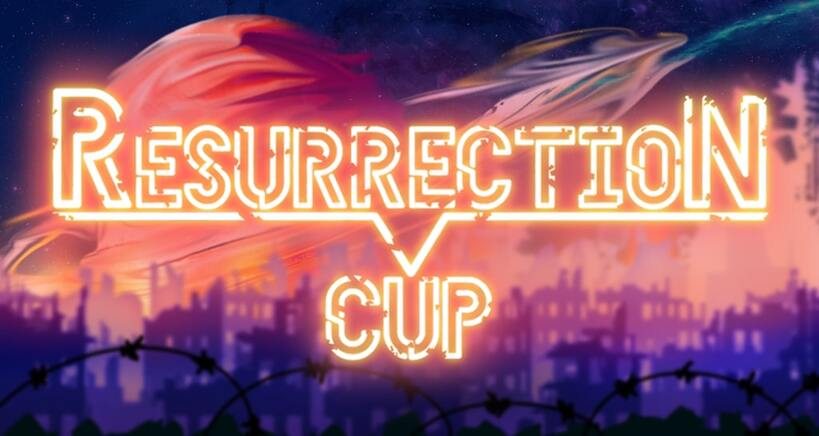

---
tags:
  - ResCup
  - Res Cup
---

# Resurrection Cup 2023

**Resurrection Cup 2023** was a 4v4, double-elimination osu! tournament hosted by ::{ flag=HU }:: ::Phreel::{ user-id=12840110 }. It was the second instalment in the Resurrection Cup series.

## Tournament schedule

| Event | Timestamp |
| --: | :-- |
| Registration phase | 2023-05-10/2023-06-01 |
| Screening phase | 2023-06-02/2023-06-10 |
| Qualifiers showcase | 2023-06-11 |
| Qualifiers | 2023-06-16/2023-06-18 |
| Round of 32 | 2023-06-23/2023-06-25 |
| Round of 16 | 2023-06-30/2023-07-02 |
| Quarterfinals | 2023-07-07/2023-07-09 |
| Semifinals | 2023-07-14/2023-07-16 |
| Finals | 2023-07-21/2023-07-23 |
| Grand Finals | 2023-07-28/2023-07-30 |

## Prizes

| Placing | Prize(s) |
| :-: | :-- |
|  | Unique profile badge, exclusive profile banner |
|  | Exclusive profile banner |
|  | Exclusive profile banner |

## Organisation

| Position | Member(s) |
| :-- | :-- |
| Host | ::{ flag=HU }:: ::Phreel::{ user-id=12840110 } |
| Mappool quality assurance | ::{ flag=RU }:: ::Alvearia::{ user-id=6248691 }, ::{ flag=CA }:: ::Gordon::{ user-id=7856835 }, ::{ flag=RO }:: ::Luminous Sky::{ user-id=4429612 }, ::{ flag=FR }:: ::Mimiliaa::{ user-id=7117621 }, ::{ flag=FR }:: ::Nozuchi::{ user-id=5858447 }, ::{ flag=HU }:: ::Phreel::{ user-id=12840110 } |
| Mappers | ::{ flag=GB }:: ::-jordan-::{ user-id=7288862 }, ::{ flag=GB }:: ::Aistre::{ user-id=4879380 }, ::{ flag=GB }:: ::Altai::{ user-id=5745865 }, ::{ flag=RU }:: ::Alvearia::{ user-id=6248691 }, ::{ flag=ID }:: ::Anxient::{ user-id=4561368 }, ::{ flag=GB }:: ::CallieCube::{ user-id=7535045 }, ::{ flag=AU }:: ::Cubby::{ user-id=10914582 }, ::{ flag=UA }:: ::Esutarosa::{ user-id=12024753 }, ::{ flag=US }:: ::FrenZ::{ user-id=9531903 }, ::{ flag=IT }:: ::GYGY::{ user-id=7201269 }, ::{ flag=CA }:: ::Gordon::{ user-id=7856835 }, ::{ flag=AU }:: ::GranDSenpai::{ user-id=3997580 }, ::{ flag=HU }:: ::Himada::{ user-id=10959366 }, ::{ flag=FR }:: ::IsomirDiAngelo::{ user-id=7715620 }, ::{ flag=US }:: ::ItsWinter::{ user-id=6381153 }, ::{ flag=PT }:: ::kowari::{ user-id=5404892 }, ::{ flag=DE }:: ::Krimek::{ user-id=2345078 }, ::{ flag=FI }:: ::Lako::{ user-id=2906436 }, ::{ flag=PH }:: ::LeCandy::{ user-id=6626249 }, ::{ flag=JP }:: ::Livia::{ user-id=1298844 }, ::{ flag=RU }:: ::Lokidoki::{ user-id=6566632 }, ::{ flag=FR }:: ::Mimiliaa::{ user-id=7117621 }, ::{ flag=US }:: ::Nao Tomori::{ user-id=5364763 }, ::{ flag=TH }:: ::NekoShabeta::{ user-id=12017880 }, ::{ flag=FR }:: ::Nozhomi::{ user-id=2716981 }, ::{ flag=FR }:: ::Nozuchi::{ user-id=5858447 }, ::{ flag=DE }:: ::Okoratu::{ user-id=1623405 }, ::{ flag=NL }:: ::OliBomby::{ user-id=6573093 }, ::{ flag=CA }:: ::Reiji Maigo::{ user-id=13875116 }, ::{ flag=SG }:: ::Rtyzen::{ user-id=2439822 }, ::{ flag=CN }:: ::Ryuusei Aika::{ user-id=7777875 }, ::{ flag=SE }:: ::Seabird::{ user-id=11815714 }, ::{ flag=CA }:: ::Serenhaide::{ user-id=10466315 }, ::{ flag=IT }:: ::Shiraya Sayuki::{ user-id=19077461 }, ::{ flag=US }:: ::SkyFlame::{ user-id=3552948 }, ::{ flag=US }:: ::Vermasium::{ user-id=11106442 }, ::{ flag=CN }:: ::Yugu::{ user-id=3161834 }, ::{ flag=FR }:: ::Yumerios::{ user-id=11681430 }, ::{ flag=IT }:: ::zekk::{ user-id=9704802 }, ::{ flag=PL }:: ::Zelq::{ user-id=8953955 }, ::{ flag=US }:: ::ajmosca::{ user-id=19884809 }, ::{ flag=US }:: ::captin1::{ user-id=689997 }, ::{ flag=PH }:: ::enri::{ user-id=8640970 }, ::{ flag=RU }:: ::fergas::{ user-id=3144542 }, ::{ flag=FI }:: ::lewski::{ user-id=4980738 }, ::{ flag=ID }:: ::lit120::{ user-id=3109248 }, ::{ flag=RO }:: ::nanoya::{ user-id=12366071 }, ::{ flag=CH }:: ::nyarvis::{ user-id=14227494 }, ::{ flag=TH }:: ::quantumvortex::{ user-id=10660777 }, ::{ flag=JP }:: ::rollpan::{ user-id=3062998 }, ::{ flag=US }:: ::squirrelpascals::{ user-id=6151332 }, ::{ flag=BE }:: ::yaspo::{ user-id=4945926 } |
| Storyboarders | ::{ flag=VN }:: ::Ningguang::{ user-id=8500334 } |
| Hitsounds | ::{ flag=VN }:: ::-Eresh::{ user-id=7605060 }, ::{ flag=VN }:: ::Ducky-::{ user-id=9351565 }, ::{ flag=US }:: ::Vermasium::{ user-id=11106442 } |
| Playtesters | ::{ flag=RU }:: ::Endura::{ user-id=7774197 }, ::{ flag=HU }:: ::Indicolite::{ user-id=19309181 }, ::{ flag=BE }:: ::MimiliaaMyMommy::{ user-id=3695504 }, ::{ flag=JP }:: ::dectopia::{ user-id=2845904 }, ::{ flag=HU }:: ::defii::{ user-id=8698024 }, ::{ flag=RO }:: ::etn::{ user-id=4581069 }, ::{ flag=DE }:: ::khz::{ user-id=9254536 }, ::{ flag=NL }:: ::luciano::{ user-id=11604978 }, ::{ flag=RO }:: ::nanoya::{ user-id=12366071 }, ::{ flag=US }:: ::plee2::{ user-id=12231397 } |
| Referees | ::{ flag=FR }:: ::Aidown::{ user-id=1522146 }, ::{ flag=FI }:: ::AnjoK::{ user-id=9220667 }, ::{ flag=DE }:: ::Dragoncurve::{ user-id=6675367 }, ::{ flag=DE }:: ::Peti::{ user-id=6221425 }, ::{ flag=HU }:: ::Phreel::{ user-id=12840110 }, ::{ flag=VN }:: ::Satxri::{ user-id=10976903 }, ::{ flag=CO }:: ::ShiruoX::{ user-id=15173398 }, ::{ flag=IN }:: ::Speshimen::{ user-id=7720204 }, ::{ flag=HU }:: ::raven\1waffles::{ user-id=18690280 }, ::{ flag=DE }:: ::real cute::{ user-id=9172811 }, ::{ flag=VN }:: ::rock-on::{ user-id=9676089 }, ::{ flag=HU }:: ::rom btw::{ user-id=11310782 }, ::{ flag=DE }:: ::TheHunter1::{ user-id=6496016 } |
| Streamers | ::{ flag=DE }:: ::Dragoncurve::{ user-id=6675367 }, ::{ flag=CA }:: ::D I O::{ user-id=3958619 }, ::{ flag=VN }:: ::Hoaq::{ user-id=7696512 }, ::{ flag=AU }:: ::Knightcakes::{ user-id=6992079 }, ::{ flag=US }:: ::Kahli::{ user-id=8926244 }, ::{ flag=DE }:: ::Peti::{ user-id=6221425 }, ::{ flag=HU }:: ::Phreel::{ user-id=12840110 }, ::{ flag=US }:: ::affirmedcheese::{ user-id=21002718 } |
| Commentators | ::{ flag=CA }:: ::- Juno -::{ user-id=6518510 }, ::{ flag=FR }:: ::Crystal Enjoyer::{ user-id=6968364 }, ::{ flag=CA }:: ::D I O::{ user-id=3958619 }, ::{ flag=CA }:: ::ExiaXD::{ user-id=17241883 }, ::{ flag=CA }:: ::I-Flame::{ user-id=11257542 }, ::{ flag=AU }:: ::Knightcakes::{ user-id=6992079 }, ::{ flag=RO }:: ::Luminous Sky::{ user-id=4429612 }, ::{ flag=HU }:: ::Phreel::{ user-id=12840110 }, ::{ flag=GB }:: ::SadShiba::{ user-id=10747626 }, ::{ flag=FR }:: ::Subaru\1Arima::{ user-id=11273062 }, ::{ flag=US }:: ::Tycani::{ user-id=6693266 }, ::{ flag=US }:: ::affirmedcheese::{ user-id=21002718 }, ::{ flag=NL }:: ::cavoeboy::{ user-id=7361815 }, ::{ flag=RO }:: ::etn::{ user-id=4581069 }, ::{ flag=AL }:: ::gwk::{ user-id=14255332 }, ::{ flag=GB }:: ::thogg::{ user-id=8684858 }, ::{ flag=HU }:: ::verto::{ user-id=2015300 } |
| GFX | ::{ flag=ID }:: [Len_licht](https://twitter.com/Len_licht), ::{ flag=HK }:: ::ShadeCegLgMn::{ user-id=12609866 }, ::{ flag=VN }:: ::TKieen::{ user-id=12561202 }, ::{ flag=HU }:: [Yumeyo](https://twitter.com/Yumeyo_art) |
| Developers | ::{ flag=VN }:: ::Hoaq::{ user-id=7696512 }, ::{ flag=VN }:: ::Try-Z::{ user-id=8266808 }, ::{ flag=ZA }:: ::roansong::{ user-id=13606620 } |

## Links

- [Website](https://rescup.xyz/)
- [Discussion thread](https://osu.ppy.sh/community/forums/topics/1762939)
- [Discord server](https://discord.gg/UNzyfgGfeu)
- [Livestream](https://www.twitch.tv/resurrectioncup)
- [YouTube](https://www.youtube.com/channel/UCtdowLBk7An_UlvtTKrYl0w)
- [Pick'em predictions website](https://pickem.hwc.hr/tournaments/116)
- [Tournament bracket](https://challonge.com/RESC23)
- [Master Spreadsheet](https://docs.google.com/spreadsheets/d/1duL7onAm-zTg5krEDGwlX4EO5EmP53Id3Skry0WQSeI)

## Participants

| Seed | Team | Members |
| :-- | :-: | :-- |
| 1 | **fresh off the boat** | ::{ flag=US }:: **::Rektygon::{ user-id=7813296 }**, ::{ flag=US }:: ::RhythmicRS::{ user-id=14097024 }, ::{ flag=US }:: ::\1C\1::{ user-id=7959945 }, ::{ flag=US }:: ::dingleton::{ user-id=5645231 }, ::{ flag=HK }:: ::mcy4::{ user-id=2165650 }, ::{ flag=US }:: ::WindowLife::{ user-id=4108547 }, ::{ flag=US }:: ::MegaMK::{ user-id=8454773 }, ::{ flag=KR }:: ::worst hr player::{ user-id=14106450 } |
| 2 | **ESSA** | ::{ flag=PL }:: **::Bartek22830::{ user-id=6404027 }**, ::{ flag=PL }:: ::maliszewski::{ user-id=12408961 }, ::{ flag=PL }:: ::gnahus::{ user-id=12779141 }, ::{ flag=PL }:: ::Rafis::{ user-id=2558286 }, ::{ flag=CL }:: ::Intercambing::{ user-id=2546001 }, ::{ flag=PE }:: ::Arnold24x24::{ user-id=2291265 }, ::{ flag=CA }:: ::xootynator::{ user-id=3717598 }, ::{ flag=RO }:: ::badeu::{ user-id=1473890 } |
| 3 | **Sleep accommodation** | ::{ flag=RU }:: **::Welter::{ user-id=11552867 }**, ::{ flag=RO }:: ::Lucrise::{ user-id=9719351 }, ::{ flag=KR }:: ::Amamya Kokoro::{ user-id=2511839 }, ::{ flag=PH }:: ::NathanRam1918::{ user-id=4734703 }, ::{ flag=RU }:: ::Skrowell::{ user-id=9694263 }, ::{ flag=TH }:: ::Lesperry::{ user-id=18092331 }, ::{ flag=DE }:: ::aimbotcone::{ user-id=12952320 }, ::{ flag=AR }:: ::R1cho::{ user-id=13065919 } |
| 4 | **quitw** | ::{ flag=US }:: **::-Koda::{ user-id=12260184 }**, ::{ flag=GB }:: ::Rimuru::{ user-id=9269034 }, ::{ flag=US }:: ::WillCookie::{ user-id=6404488 }, ::{ flag=US }:: ::wudci::{ user-id=2590257 }, ::{ flag=FR }:: ::FlasTEH::{ user-id=8443945 }, ::{ flag=US }:: ::Gabey::{ user-id=12904237 }, ::{ flag=PL }:: ::Mastasz::{ user-id=1876565 }, ::{ flag=US }:: ::Jakson::{ user-id=8788058 } |
| 5 | **makipro** | ::{ flag=CL }:: **::Eunha::{ user-id=7701428 }**, ::{ flag=CN }:: ::lolol234::{ user-id=5791401 }, ::{ flag=DE }:: ::akarinya::{ user-id=14385814 }, ::{ flag=CN }:: ::lolol235::{ user-id=6090175 }, ::{ flag=DE }:: ::rundyyy::{ user-id=10917620 }, ::{ flag=US }:: ::Woey::{ user-id=3792472 }, ::{ flag=CN }:: ::Crystal::{ user-id=1646397 }, ::{ flag=DE }:: ::Shiox::{ user-id=11921197 } |
| 6 | **No title** | ::{ flag=KR }:: **::Atipir::{ user-id=8991722 }**, ::{ flag=KR }:: ::\1sPekTrE::{ user-id=11129034 }, ::{ flag=KR }:: ::Allegrissimo::{ user-id=9052194 }, ::{ flag=KR }:: ::Pain::{ user-id=1460263 }, ::{ flag=KR }:: ::mx10000::{ user-id=3730848 }, ::{ flag=KR }:: ::mx10002::{ user-id=7892320 }, ::{ flag=KR }:: ::mx10003::{ user-id=7027766 }, ::{ flag=KR }:: ::mx10007::{ user-id=8359561 } |
| 7 | **halcyon** | ::{ flag=GB }:: **::rudj::{ user-id=11592896 }**, ::{ flag=US }:: ::taro::{ user-id=13586618 }, ::{ flag=US }:: ::creepy reader::{ user-id=11269055 }, ::{ flag=US }:: ::Kama::{ user-id=13380270 }, ::{ flag=US }:: ::AlmightyDoor::{ user-id=11715109 }, ::{ flag=US }:: ::BoshyMan741::{ user-id=4830687 }, ::{ flag=US }:: ::kablaze::{ user-id=3043603 }, ::{ flag=SE }:: ::scylla::{ user-id=9405745 } |
| 8 | **full of soup** | ::{ flag=DE }:: **::-semi::{ user-id=5154946 }**, ::{ flag=US }:: ::Arraxey::{ user-id=6752116 }, ::{ flag=US }:: ::Iugia::{ user-id=12378737 }, ::{ flag=US }:: ::rhythm game::{ user-id=10651106 }, ::{ flag=US }:: ::-Arko::{ user-id=8802914 }, ::{ flag=CA }:: ::Jimarrah::{ user-id=11267857 }, ::{ flag=US }:: ::revoh::{ user-id=8165181 }, ::{ flag=US }:: ::Twilight::{ user-id=6327638 } |
| 9 | **Baksal** | ::{ flag=KR }:: **::KRZY::{ user-id=114017 }**, ::{ flag=KR }:: ::Vendemmia::{ user-id=139670 }, ::{ flag=KR }:: ::Garalulu::{ user-id=757783 }, ::{ flag=KR }:: ::Zeisen::{ user-id=1041943 }, ::{ flag=KR }:: ::Mouse Player::{ user-id=5309981 }, ::{ flag=KR }:: ::mx10001::{ user-id=11443437 }, ::{ flag=KR }:: ::mx10006::{ user-id=14447878 }, ::{ flag=KR }:: ::fnql::{ user-id=15646924 } |
| 10 | **Gentlemen fgsfds** | ::{ flag=DE }:: **::resoa::{ user-id=6754508 }**, ::{ flag=FI }:: ::Amasetic::{ user-id=11375251 }, ::{ flag=TW }:: ::Spinesnight::{ user-id=4519494 }, ::{ flag=RU }:: ::Suzuha::{ user-id=8445602 }, ::{ flag=CA }:: ::Eddie-::{ user-id=3898396 }, ::{ flag=ID }:: ::DEETO::{ user-id=10069909 }, ::{ flag=US }:: ::ChillierPear::{ user-id=9501251 }, ::{ flag=UA }:: ::RafGPio::{ user-id=13705417 } |
| 11 | **Grease Monkey** | ::{ flag=NO }:: **::papercandle::{ user-id=12353810 }**, ::{ flag=NO }:: ::Pinguinzi::{ user-id=9414229 }, ::{ flag=NO }:: ::Melvr::{ user-id=9211924 }, ::{ flag=US }:: ::Bunnylikemoney::{ user-id=14215850 }, ::{ flag=US }:: ::Uenpris::{ user-id=11955716 }, ::{ flag=GR }:: ::JackPaX::{ user-id=11226645 }, ::{ flag=TH }:: ::-Kedama::{ user-id=12147277 }, ::{ flag=TH }:: ::Salvotore::{ user-id=3394696 } |
| 12 | **swaglins** | ::{ flag=CA }:: **::Too Slow::{ user-id=2944449 }**, ::{ flag=UY }:: ::daanit::{ user-id=6159669 }, ::{ flag=CA }:: ::Saryi::{ user-id=10051720 }, ::{ flag=CA }:: ::Vespirit::{ user-id=5425046 }, ::{ flag=CA }:: ::Sp1cyy::{ user-id=22710559 }, ::{ flag=CA }:: ::GENDER BENDER::{ user-id=2758279 }, ::{ flag=CA }:: ::noncycle::{ user-id=12701607 }, ::{ flag=CA }:: ::VineOpoly::{ user-id=11684952 } |
| 13 | **Capybara** | ::{ flag=RU }:: **::Paracat::{ user-id=13709281 }**, ::{ flag=RU }:: ::SL1PER::{ user-id=10199538 }, ::{ flag=MX }:: ::-Karu::{ user-id=8429128 }, ::{ flag=DE }:: ::Fleh::{ user-id=7780605 }, ::{ flag=DE }:: ::yary::{ user-id=13300203 }, ::{ flag=FI }:: ::AllyrD::{ user-id=9561644 }, ::{ flag=CA }:: ::DivineRose::{ user-id=8151359 }, ::{ flag=AR }:: ::Bomilk::{ user-id=7081596 } |
| 14 | **ballers will ball** | ::{ flag=US }:: **::LightsOut::{ user-id=8581210 }**, ::{ flag=US }:: ::EzChock::{ user-id=9276293 }, ::{ flag=US }:: ::Wispy::{ user-id=11106929 }, ::{ flag=US }:: ::Joyi::{ user-id=12776754 }, ::{ flag=US }:: ::Sdot::{ user-id=12609022 }, ::{ flag=US }:: ::Mathyu::{ user-id=6303313 }, ::{ flag=US }:: ::toybot::{ user-id=2848604 }, ::{ flag=IE }:: ::Ophiz::{ user-id=6671641 } |
| 15 | **ghoul mode** | ::{ flag=EE }:: **::Ancenthe::{ user-id=4479041 }**, ::{ flag=EE }:: ::Rev0::{ user-id=10346185 }, ::{ flag=EE }:: ::cedru::{ user-id=10162611 }, ::{ flag=SM }:: ::chihuahua::{ user-id=11215030 }, ::{ flag=NL }:: ::Manievat::{ user-id=6744123 }, ::{ flag=SG }:: ::Tebi::{ user-id=5407620 }, ::{ flag=UA }:: ::magnatagamer123::{ user-id=7587763 }, ::{ flag=DE }:: ::angelkanna::{ user-id=10196805 } |
| 16 | **la mugre** | ::{ flag=AR }:: **::ShivielMyMommy::{ user-id=12182138 }**, ::{ flag=AR }:: ::Zydan::{ user-id=9393446 }, ::{ flag=US }:: ::Fametime::{ user-id=11405263 }, ::{ flag=US }:: ::Tony 2::{ user-id=8935379 }, ::{ flag=CA }:: ::Yip::{ user-id=5177569 }, ::{ flag=CL }:: ::Shiho dere::{ user-id=12211248 }, ::{ flag=CL }:: ::tfge::{ user-id=11207004 }, ::{ flag=CL }:: ::Siiphs::{ user-id=11786864 } |
| 17 | **fishballcat** | ::{ flag=BR }:: **::Exxotl::{ user-id=15225729 }**, ::{ flag=BR }:: ::Dafonz::{ user-id=6667041 }, ::{ flag=BR }:: ::Humishi::{ user-id=11895642 }, ::{ flag=BR }:: ::Juh::{ user-id=10145045 }, ::{ flag=BR }:: ::Daf0nz::{ user-id=14592820 }, ::{ flag=BR }:: ::SWAKE::{ user-id=12967997 }, ::{ flag=BR }:: ::-Hirata::{ user-id=10188022 }, ::{ flag=BR }:: ::VitorSkull::{ user-id=10223298 } |
| 18 | **Allah Gaming** | ::{ flag=US }:: **::FlashoFoSho::{ user-id=4755314 }**, ::{ flag=US }:: ::Cuckweezy::{ user-id=7154358 }, ::{ flag=US }:: ::Pincus::{ user-id=7611178 }, ::{ flag=US }:: ::ur cute::{ user-id=9993348 }, ::{ flag=US }:: ::Kahli::{ user-id=8926244 }, ::{ flag=US }:: ::HonBae::{ user-id=9474976 }, ::{ flag=CA }:: ::nick1324::{ user-id=612898 }, ::{ flag=US }:: ::Kariyu::{ user-id=4733121 } |
| 19 | **PSG** | ::{ flag=IT }:: **::Nijakii::{ user-id=13925698 }**, ::{ flag=AU }:: ::umii::{ user-id=2538695 }, ::{ flag=IT }:: ::kiirochii::{ user-id=6387149 }, ::{ flag=PL }:: ::kiir0chii::{ user-id=9322480 }, ::{ flag=PL }:: ::Pure Ruby::{ user-id=6951719 }, ::{ flag=AU }:: ::Pepsi Max::{ user-id=7785655 }, ::{ flag=AU }:: ::Tedda::{ user-id=6906789 }, ::{ flag=BE }:: ::Hanori::{ user-id=7078544 } |
| 20 | **MyHouse.WAD** | ::{ flag=HU }:: **::gecseboti::{ user-id=15213139 }**, ::{ flag=DE }:: ::aahoff::{ user-id=11371245 }, ::{ flag=ES }:: ::A L E P H::{ user-id=6735738 }, ::{ flag=ES }:: ::A N T O N I O::{ user-id=12760743 }, ::{ flag=HU }:: ::Glasswave::{ user-id=5442931 }, ::{ flag=HU }:: ::JezusNE::{ user-id=10762622 }, ::{ flag=ES }:: ::M A N O L O::{ user-id=12296128 }, ::{ flag=UA }:: ::o\1q::{ user-id=16139008 } |
| 21 | **Caramba™** | ::{ flag=BR }:: **::-feIicia::{ user-id=15274893 }**, ::{ flag=BR }:: ::Coreanmaluco::{ user-id=3149577 }, ::{ flag=BR }:: ::Chrystian::{ user-id=10415929 }, ::{ flag=BR }:: ::-LF-::{ user-id=11461810 }, ::{ flag=BR }:: ::Uchirrod::{ user-id=11472811 }, ::{ flag=BR }:: ::Lineu::{ user-id=17192419 }, ::{ flag=BR }:: ::Qiqi::{ user-id=15251627 }, ::{ flag=BR }:: ::-felicia::{ user-id=10157694 } |
| 22 | **widepeepoHappy** | ::{ flag=US }:: **::Flameztear::{ user-id=13207763 }**, ::{ flag=US }:: ::bazingasdead::{ user-id=14139392 }, ::{ flag=FR }:: ::BProd::{ user-id=11345747 }, ::{ flag=FR }:: ::Fiaee::{ user-id=10325072 }, ::{ flag=FI }:: ::Kalanluu::{ user-id=2035254 }, ::{ flag=CL }:: ::kanocchi::{ user-id=2321050 }, ::{ flag=RU }:: ::netnesanya::{ user-id=6017901 }, ::{ flag=US }:: ::i also love uma::{ user-id=16538717 } |
| 23 | **pon** | ::{ flag=US }:: **::tekkito::{ user-id=7075211 }**, ::{ flag=CA }:: ::elixirio::{ user-id=16095174 }, ::{ flag=US }:: ::ChaosRaidz::{ user-id=3715823 }, ::{ flag=US }:: ::FARTPOO::{ user-id=17125008 }, ::{ flag=US }:: ::Snicee::{ user-id=8394025 }, ::{ flag=CA }:: ::rayuii::{ user-id=6304246 }, ::{ flag=CL }:: ::shojan::{ user-id=23842054 }, ::{ flag=US }:: ::Khaos-::{ user-id=12909056 } |
| 24 | **waga na wa megumin** | ::{ flag=US }:: **::rushia fangirl::{ user-id=9632648 }**, ::{ flag=US }:: ::- deston -::{ user-id=15556397 }, ::{ flag=US }:: ::DarWihn::{ user-id=10626955 }, ::{ flag=US }:: ::Srr::{ user-id=17064861 }, ::{ flag=US }:: ::Neinja::{ user-id=12632867 }, ::{ flag=NL }:: ::Niqht::{ user-id=14390731 }, ::{ flag=US }:: ::Wekkl::{ user-id=9377901 } |
| 25 | **baen** | ::{ flag=CA }:: **::-Aiba-::{ user-id=15641344 }**, ::{ flag=CA }:: ::FlatPaper::{ user-id=11255340 }, ::{ flag=US }:: ::jellium::{ user-id=14758501 }, ::{ flag=US }:: ::FelixSosa::{ user-id=17958667 }, ::{ flag=US }:: ::zfr::{ user-id=11536421 }, ::{ flag=CA }:: ::ploot::{ user-id=7802400 }, ::{ flag=CA }:: ::kymotsujason::{ user-id=2541804 }, ::{ flag=US }:: ::Stage my mommy::{ user-id=20630250 } |
| 26 | **POSKVONYALbl** | ::{ flag=RU }:: **::Melifaro::{ user-id=13821438 }**, ::{ flag=RU }:: ::DonnieGG::{ user-id=11673059 }, ::{ flag=RU }:: ::Timofey\1sn::{ user-id=15592469 }, ::{ flag=RU }:: ::mija-::{ user-id=10463129 }, ::{ flag=RU }:: ::Lanixbtw::{ user-id=16104885 }, ::{ flag=RU }:: ::TPAXMACTEP::{ user-id=4663676 }, ::{ flag=RU }:: ::bebraozo::{ user-id=9921400 }, ::{ flag=RU }:: ::Ice Shark::{ user-id=9459674 } |
| 27 | **polle haters** | ::{ flag=AL }:: **::gwk::{ user-id=14255332 }**, ::{ flag=AL }:: ::Taldux::{ user-id=7249261 }, ::{ flag=DK }:: ::Polle::{ user-id=13218204 }, ::{ flag=DK }:: ::cat burger::{ user-id=11380904 }, ::{ flag=DK }:: ::Zeezus::{ user-id=9125328 }, ::{ flag=NL }:: ::wessel\1osu2::{ user-id=4382220 }, ::{ flag=SG }:: ::Inquisitives::{ user-id=10722794 }, ::{ flag=MY }:: ::DuoX::{ user-id=9560694 } |
| 28 | **xX_gLOryHAMmerXx_9348** | ::{ flag=ID }:: **::XenoitesBadPog::{ user-id=11461426 }**, ::{ flag=ID }:: ::kurui::{ user-id=15895318 }, ::{ flag=ID }:: ::malvon::{ user-id=11113661 }, ::{ flag=ID }:: ::SuchFasha::{ user-id=11844371 }, ::{ flag=ID }:: ::ILOVEFLANDRE::{ user-id=15051159 }, ::{ flag=ID }:: ::okeaoska::{ user-id=13349049 } |
| 29 | **piwo** | ::{ flag=UA }:: **::Unavel::{ user-id=18781432 }**, ::{ flag=UA }:: ::KillomTry::{ user-id=14106178 }, ::{ flag=RU }:: ::GodRoPoNiKa::{ user-id=11195861 }, ::{ flag=HR }:: ::KarliXon::{ user-id=9283403 }, ::{ flag=CA }:: ::Squink::{ user-id=12058601 }, ::{ flag=US }:: ::USA-KEAK::{ user-id=6831777 }, ::{ flag=DE }:: ::-Fusein-::{ user-id=3789701 }, ::{ flag=RU }:: ::MakiBrony::{ user-id=7101953 } |
| 30 | **Contentpilled** | ::{ flag=US }:: **::Chromasia::{ user-id=7306251 }**, ::{ flag=CA }:: ::Tsfury::{ user-id=12258658 }, ::{ flag=RU }:: ::ahayuuu::{ user-id=20533298 }, ::{ flag=CA }:: ::sumyeon::{ user-id=12487726 }, ::{ flag=LV }:: ::-Fleshy-::{ user-id=22597785 }, ::{ flag=CL }:: ::TheShadowOfDark::{ user-id=5795337 }, ::{ flag=FI }:: ::- Ayumi::{ user-id=14582975 }, ::{ flag=GB }:: ::Melons::{ user-id=12049607 } |
| 31 | **napadeniesomov** | ::{ flag=RU }:: **::mindblock::{ user-id=9604150 }**, ::{ flag=RU }:: ::MGM::{ user-id=7236907 }, ::{ flag=UA }:: ::Katsushige::{ user-id=10472893 }, ::{ flag=RU }:: ::ilusha1908::{ user-id=14044852 }, ::{ flag=KG }:: ::CpxG::{ user-id=12270069 }, ::{ flag=RU }:: ::-Danon::{ user-id=9836316 }, ::{ flag=RU }:: ::lurrzy::{ user-id=16967010 }, ::{ flag=RU }:: ::kykyrik25::{ user-id=11842233 } |
| 32 | **GENTE SERIA USH** | ::{ flag=PE }:: **::Marguenka::{ user-id=11646616 }**, ::{ flag=PE }:: ::Cochinomori::{ user-id=15639661 }, ::{ flag=PE }:: ::Rulz::{ user-id=12027165 }, ::{ flag=PE }:: ::NewWazeBeatsMe::{ user-id=21435330 }, ::{ flag=PE }:: ::Takodachi::{ user-id=18495184 }, ::{ flag=PE }:: ::Verdigris::{ user-id=11645855 }, ::{ flag=US }:: ::Cappy::{ user-id=6668666 }, ::{ flag=PE }:: ::Sositauwu::{ user-id=17208202 } |

## Podium

This competition has come to an end and resulted in the following podium:

| Placing | Team |
| :-: | :-- |
|  | **ESSA** (::{ flag=PL }:: **::Bartek22830::{ user-id=6404027 }**, ::{ flag=PL }:: ::maliszewski::{ user-id=12408961 }, ::{ flag=PL }:: ::gnahus::{ user-id=12779141 }, ::{ flag=PL }:: ::Rafis::{ user-id=2558286 }, ::{ flag=CL }:: ::Intercambing::{ user-id=2546001 }, ::{ flag=PE }:: ::Arnold24x24::{ user-id=2291265 }, ::{ flag=CA }:: ::xootynator::{ user-id=3717598 }, ::{ flag=RO }:: ::badeu::{ user-id=1473890 }) |
|  | **fresh off the boat** (::{ flag=US }:: **::Rektygon::{ user-id=7813296 }**, ::{ flag=US }:: ::RhythmicRS::{ user-id=14097024 }, ::{ flag=US }:: ::\1C\1::{ user-id=7959945 }, ::{ flag=US }:: ::dingleton::{ user-id=5645231 }, ::{ flag=HK }:: ::mcy4::{ user-id=2165650 }, ::{ flag=US }:: ::WindowLife::{ user-id=4108547 }, ::{ flag=US }:: ::MegaMK::{ user-id=8454773 }, ::{ flag=KR }:: ::worst hr player::{ user-id=14106450 }) |
|  | **Sleep accommodation** (::{ flag=RU }:: **::Welter::{ user-id=11552867 }**, ::{ flag=RO }:: ::Lucrise::{ user-id=9719351 }, ::{ flag=KR }:: ::Amamya Kokoro::{ user-id=2511839 }, ::{ flag=PH }:: ::NathanRam1918::{ user-id=4734703 }, ::{ flag=RU }:: ::Skrowell::{ user-id=9694263 }, ::{ flag=TH }:: ::Lesperry::{ user-id=18092331 }, ::{ flag=DE }:: ::aimbotcone::{ user-id=12952320 }, ::{ flag=AR }:: ::R1cho::{ user-id=13065919 }) |

## Mappools

### Grand Finals

- No Mod
  1. [Tenjin Kotone - PUNISHMENT (Vermasium) [Retribution]](https://osu.ppy.sh/beatmapsets/2032426#osu/4236525)
  2. [Shadow of Intent - The Coming Fire (quantumvortex) [Boundless Sacrifice]](https://osu.ppy.sh/beatmapsets/2032344#osu/4236382)
  3. [Penoreri - - dirty rouge - (slushy mix) (Lako) [Lingering Warmth]](https://osu.ppy.sh/beatmapsets/2032348#osu/4236387)
  4. [Camellia - Speedrun (Akali) [tehc urn]](https://osu.ppy.sh/beatmapsets/594717#osu/1257855)
  5. [Squint - Ghost (squirrelpascals) [Tree of Sadness]](https://osu.ppy.sh/beatmapsets/2032411#osu/4236506)
- Hidden
  1. [Unlucky Morpheus - Dead Leaves Rising (IsomirDiAngelo) [Rakugo]](https://osu.ppy.sh/beatmapsets/2032352#osu/4236391)
  2. [void (Mournfinale) - World Vanquisher (Deppyforce) [De-structurization]](https://osu.ppy.sh/beatmapsets/1683078#osu/3438866)
  3. [Arcaea Sound Team against. ETIA. - Singularity VVVIP (-jordan-) [Beyond Lv.10+]](https://osu.ppy.sh/beatmapsets/2031890#osu/4235307)
- Hard Rock
  1. [Home Is Where - Long Distance Conjoined Twins (quantumvortex) [birds on telephone lines]](https://osu.ppy.sh/beatmapsets/2032346#osu/4236385)
  2. [Nishigomi Kakumi - Gekka Bijin (Flask) [Oni (OWC Edit Ver.)]](https://osu.ppy.sh/beatmapsets/1059581#osu/2719328)
  3. [USAO - Quick Charge (Alvearia) [Resurrection]](https://osu.ppy.sh/beatmapsets/2031853#osu/4235193)
- Double Time
  1. [ICHIKO - I'LL BE THERE FOR YOU (reiSevia) [SPOKENSEVIA'S EVERLASTING AFFECTION]](https://osu.ppy.sh/beatmapsets/1311376#osu/2718057)
  2. [Unlucky Morpheus - Kamigami ga Koishita Gensoukyou (kowari) [Extra Stage]](https://osu.ppy.sh/beatmapsets/2032374#osu/4236429)
  3. [Celldweller - I Can't Wait (Aistre) [the zaza transmorphed me into the lord of the underworld]](https://osu.ppy.sh/beatmapsets/2032361#osu/4236411)
  4. [MC Sniper - Minchoui Nan (Luscent) [Dailycare's Extra]](https://osu.ppy.sh/beatmapsets/1612833#osu/3294349)
- Free Mod
  1. [Sakai Mikio - Identity (Yumerios) [Extreme]](https://osu.ppy.sh/beatmapsets/2032356#osu/4236403)
  2. [MYUKKE. - Friendly Gigant Fire (Serenhaide) [SUPER BLASTING]](https://osu.ppy.sh/beatmapsets/2032460#osu/4236595)
  3. [HyuN - Grin (Iugia) [cs5 buff]](https://osu.ppy.sh/beatmapsets/1792434#osu/3692933)
  4. [tn-shi vs. AZALI - to dust thou shalt return (Gordon) [battleth between lighteth and darkness]](https://osu.ppy.sh/beatmapsets/2032508#osu/4236727)
- Tiebreaker
  1. **[Kagetora. - The enormous (Ryuusei Aika) [Rhapsody]](https://osu.ppy.sh/beatmapsets/2032518#osu/4236749)**

### Finals

- No Mod
  1. [Kanzaki Elza starring ReoNa - Dancer in the Discord (Mimiliaa) [Tourney Version]](https://osu.ppy.sh/beatmapsets/2028288#osu/4226576)
  2. [Mechina - Imperialus (ItsWinter) [Empyrean]](https://osu.ppy.sh/beatmapsets/2028143#osu/4226271)
  3. [karatoPanchii feat. Haruno - Irodoru Natsu no Koi Hanabi (Full Version) (UberFazz) [Blooming Collab Extra]](https://osu.ppy.sh/beatmapsets/1850912#osu/3802292)
  4. [Krimek - Revival Of A New Master (Krimek) [Path Of The Unknown: -Eternal Resurrection-]](https://osu.ppy.sh/beatmapsets/2028363#osu/4226738)
  5. [Persona - Area184 (SKIN121) [Chaos184]](https://osu.ppy.sh/beatmapsets/1348822#osu/2792912)
- Hidden
  1. [KOKOMI - Drive on "Crazy" (Hishiro Chizuru) [IT'S MORBIN TIME]](https://osu.ppy.sh/beatmapsets/1774355#osu/3633058)
  2. [Renard - Banned Forever (Blue Dragon) [Nogard]](https://osu.ppy.sh/beatmapsets/16349#osu/64267)
  3. [Raytoly - C.r.y.s.t.a.l-A.x.i.s-P.r.o.t.o.t.y.p.e (CallieCube) [The Cube]](https://osu.ppy.sh/beatmapsets/2028374#osu/4226774)
- Hard Rock
  1. [MuryokuP - Sweet Sweet Cendrillon Drug (Mordred) [Despair]](https://osu.ppy.sh/beatmapsets/878167#osu/1836680)
  2. [Feryquitous - For(n)tarv (Rentai) [Finale]](https://osu.ppy.sh/beatmapsets/2010497#osu/4183360)
  3. [HyuN feat. JP-8 Eater - THE SERVANT OF EVIL (Shiraya Sayuki) [Tears]](https://osu.ppy.sh/beatmapsets/2028292#osu/4226580)
- Double Time
  1. [Dokuro-chan (Chiba Saeko) - Bokusatsu Tenshi Dokuro-chan 2007 (rollpan) [Excalibolg 2023]](https://osu.ppy.sh/beatmapsets/2028144#osu/4226272)
  2. [MisomyL - Mirai no Uchuu ni Omoi o Nosete (Nao Tomori) [Expert]](https://osu.ppy.sh/beatmapsets/2028171#osu/4226329)
  3. [96Neko - Paintings? Oh, yeah. (Kuron-kun) [Abstract Rose]](https://osu.ppy.sh/beatmapsets/533527#osu/1130320)
  4. [xaev - daria math: closure (wafer) [wispy: insane (obtain thy potassium)]](https://osu.ppy.sh/beatmapsets/1964790#osu/4129466)
- Free Mod
  1. [Michael Jackson - Smooth Criminal (SowAA) [9.5]](https://osu.ppy.sh/beatmapsets/1433107#osu/4220708)
  2. [katagiri - Code Name: Romeo (Nozuchi) [Surreality]](https://osu.ppy.sh/beatmapsets/2028145#osu/4226273)
  3. [Konosuke Enosuke - Tenkaranbu (Chizu-Kun) [Celestial]](https://osu.ppy.sh/beatmapsets/1625132#osu/3317900)
  4. [Kagetora. - Time to beat the odds (OliBomby) [I wanna be a REBEL (Tournament Version)]](https://osu.ppy.sh/beatmapsets/2028272#osu/4226545)
- Tiebreaker
  1. **[Xyris - Reikoku Assassins (Alvearia) [Field of the forgotten battle]](https://osu.ppy.sh/beatmapsets/2028400#osu/4226815)**

### Semifinals

- No Mod
  1. [Liz Triangle - Yoru no Circus (GranDSenpai) [Welcome to the Circus]](https://osu.ppy.sh/beatmapsets/2024311#osu/4216608)
  2. [Raimukun - Arachne (FrenZ) [Resurrection]](https://osu.ppy.sh/beatmapsets/2024121#osu/4216118)
  3. [Nanahoshi Kangengakudan feat.Matsushita - Dance Number o Tomo ni (ajmosca) [Loveless Dance]](https://osu.ppy.sh/beatmapsets/2024048#osu/4215985)
  4. [Ashrount vs polysha - NADIR (Altai) [Celestial]](https://osu.ppy.sh/beatmapsets/2024078#osu/4216038)
  5. [Kuroneko Dungeon - Ryoushi no Umi no Lindwurm (squirrelpascals) [Death of the Quantum Sea]](https://osu.ppy.sh/beatmapsets/742648#osu/1566379)
- Hidden
  1. [Tokyo.MeltiMelt - I ain't need my heart feat. Hatsuki Yura (SkyFlame) [heartless]](https://osu.ppy.sh/beatmapsets/2024032#osu/4215951)
  2. [Sampling Masters MEGA - Moon of Noon (Alvearia) [Resurrection]](https://osu.ppy.sh/beatmapsets/2024001#osu/4215879)
  3. [Umeri - Paranoia (Seabird) [I love this song and its 2020]](https://osu.ppy.sh/beatmapsets/2024080#osu/4216040)
- Hard Rock
  1. [Sakura Kanae, Kino Nei, Motoki Zakuro - Gareki no Alice (Okoratu) [L]](https://osu.ppy.sh/beatmapsets/2024116#osu/4216108)
  2. [Feryquitous - Strahv (Mimiliaa) [Eternity]](https://osu.ppy.sh/beatmapsets/2024101#osu/4216082)
  3. [Alice Schach and the Magic Orchestra - The eve of epokhe (captin1) [movement mapping]](https://osu.ppy.sh/beatmapsets/1436242#osu/2955142)
- Double Time
  1. [my sound life - LINE (Zelq) [Insane]](https://osu.ppy.sh/beatmapsets/2023447#osu/4214756)
  2. [Yuuhei Satellite - Tsuki ni Murakumo Hana ni Kaze (nanoya) [Lunatic]](https://osu.ppy.sh/beatmapsets/2023974#osu/4215842)
  3. [Fear, and Loathing in Las Vegas - Just Awake (Aistre) [when the gas station zaza hits]](https://osu.ppy.sh/beatmapsets/2024009#osu/4215905)
  4. [KOTOKO - Wing my Way (CXu) [Endless Sky]](https://osu.ppy.sh/beatmapsets/850548#osu/1778268)
- Free Mod
  1. [Kaf - Kako o Kurau (Sparhten) [Penitence]](https://osu.ppy.sh/beatmapsets/1575602#osu/3216819)
  2. [Katagiri - Noumen break (Alvearia) [Resurrection]](https://osu.ppy.sh/beatmapsets/2024003#osu/4215882)
  3. [ZUN - Desire Drive (Halfslashed) [Extra Stage]](https://osu.ppy.sh/beatmapsets/1276352#osu/2651838)
  4. [dark cat - ELINE (Nozhomi) [Jumpy Cat]](https://osu.ppy.sh/beatmapsets/2024160#osu/4216235)
- Tiebreaker
  1. **[7_7 - Watch Your Back (Shiraya Sayuki) [Winter Breeze]](https://osu.ppy.sh/beatmapsets/2221191#osu/4708820)**

### Quarterfinals

- No Mod
  1. [OxT - Clattanoia (NekoShabeta) [Wrath of Nazarick]](https://osu.ppy.sh/beatmapsets/2020017#osu/4206767)
  2. [Noah - Immortal saga (GYGY) [Reach for the Sky]](https://osu.ppy.sh/beatmapsets/2019837#osu/4206360)
  3. [Mio Yamazaki - Byoushin Zenkai Girl (Sparhten) [Keep Going Forward]](https://osu.ppy.sh/beatmapsets/1402550#osu/2893305)
  4. [CS4W - Absolute Disintegration (Nozuchi) [!!!Chaos Time!!!]](https://osu.ppy.sh/beatmapsets/2019986#osu/4206684)
  5. [schwarzekugel - $trange Attraktor (Alvearia) [Resurrection]](https://osu.ppy.sh/beatmapsets/2019997#osu/4206731)
- Hidden
  1. [Yousei Teikoku - Ranshou Aion (IsomirDiAngelo) [Paradise]](https://osu.ppy.sh/beatmapsets/1492639#osu/3059613)
  2. [Hinatabi Bitter Sweets - Rin to Shite Saku Hana no Gotoku ~Hinabita edtion~ (Alvearia) [birb]](https://osu.ppy.sh/beatmapsets/2006182#osu/4172720)
  3. [sekai - Shiawase mono (Yugu) [Extra]](https://osu.ppy.sh/beatmapsets/2020606#osu/4207993)
- Hard Rock
  1. [MY FIRST STORY - Shuuen Requiem (SkyFlame) [Expressionless]](https://osu.ppy.sh/beatmapsets/1296338#osu/2689633)
  2. [Nekomata Master+ - squall (Reisen Udongein) [Extra]](https://osu.ppy.sh/beatmapsets/127772#osu/323907)
  3. [a_hisa - Dysthymia (Cubby) [Expert]](https://osu.ppy.sh/beatmapsets/2019902#osu/4206504)
- Double Time
  1. [Reol - MONSTER (handsome) [BEARIZM'S INSANE]](https://osu.ppy.sh/beatmapsets/366440#osu/815690)
  2. [grasun cat - lixAxil (Okoratu) [cry about it]](https://osu.ppy.sh/beatmapsets/2020105#osu/4206964)
  3. [Mia REGINA - My Sweet Maiden (Phreel) [Akiwari's Insane [AR8]]](https://osu.ppy.sh/beatmapsets/2020081#osu/4206912)
  4. [Yamamoto Mineko - Pilgrimage (Gust) [Atelier Totori]](https://osu.ppy.sh/beatmapsets/937285#osu/1994939)
- Free Mod
  1. [Rise Against - Under The Knife (quantumvortex) [Extreme]](https://osu.ppy.sh/beatmapsets/2019903#osu/4206505)
  2. [Silentroom vs. Frums - Aegleseeker (KingBaxter) [Disobedience vs Chaos]](https://osu.ppy.sh/beatmapsets/1576333#osu/3218308)
  3. [ZUN - Guuzou ni Sekai o Yudanete ~ Idoratrize World (Halfslashed) [Shurelia's Heritage]](https://osu.ppy.sh/beatmapsets/1813899#osu/3929565)
  4. [mu_akaru - Choukousoku Henbyoushi no Alien (Mattay) [Atelophobia]](https://osu.ppy.sh/beatmapsets/1988714#osu/4131316)
- Tiebreaker
  1. **[celtix - Neural Shatter (Himada) [Neuralization]](https://osu.ppy.sh/beatmapsets/2020185#osu/4207205)**

### Round of 16

- No Mod
  1. [ELFENSJoN - Hyousou wa Hakuen o Matoite (SMOKELIND) [Endless]](https://osu.ppy.sh/beatmapsets/1332833#osu/2761831)
  2. [PYKAMIA - Fantasia Sonata Mirror (Lako) [FINAL]](https://osu.ppy.sh/beatmapsets/1883456#osu/3877754)
  3. [ZAQ - Dance In The Game (Petal) [Melancholy]](https://osu.ppy.sh/beatmapsets/1871920#osu/3851543)
  4. [aran - Xperanza (LeCandy) [Tourney Ver.]](https://osu.ppy.sh/beatmapsets/2015819#osu/4196519)
- Hidden
  1. [Shiena Nishizawa - Meaning (nyarvis) [bakabaka answer]](https://osu.ppy.sh/beatmapsets/2015834#osu/4196584)
  2. [Hijirime Laeria - stlaeria (Hinsvar) [Salvation]](https://osu.ppy.sh/beatmapsets/1352739#osu/2800493)
- Hard Rock
  1. [AISHA - The Disaster of Passion (Yukiyo) [Totsugeki]](https://osu.ppy.sh/beatmapsets/1497801#osu/3069924)
  2. [Okabe Keiichi (MONACA) - Kikyou (lewski) [Mankai]](https://osu.ppy.sh/beatmapsets/2016046#osu/4197136)
- Double Time
  1. [Falcom Sound Team jdk feat. Kotera Kanako - way of life -Full Version- (Moete) [Zero]](https://osu.ppy.sh/beatmapsets/1849171#osu/3798633)
  2. [Tsukino - Dohna Dohna no Uta (gazimal) [Koori's Insane]](https://osu.ppy.sh/beatmapsets/1459224#osu/3082198)
  3. [DECO*27 - Two Breaths Walking (Reloaded) feat. Hatsune Miku (CallieCube) [Insane]](https://osu.ppy.sh/beatmapsets/1608216#osu/3288203)
- Free Mod
  1. [Kyi (CV:Mayu Mineda) - Miss Conductor (Lokidoki) [Propaganda (ResCup ver.)]](https://osu.ppy.sh/beatmapsets/2016007#osu/4197018)
  2. [Zekk - Sugary Daydream (kowari) [Illusion]](https://osu.ppy.sh/beatmapsets/2016012#osu/4197025)
  3. [Kawada Mami - Borderland (Reiji Maigo) [Extra]](https://osu.ppy.sh/beatmapsets/1281934#osu/2662619)
- Tiebreaker
  1. **[takehirotei as "Infinite Limit" - The Everlasting Star of Yearning (Anxient) [Anxient & Mimi's Journey]](https://osu.ppy.sh/beatmapsets/2016077#osu/4197214)**

### Round of 32

- No Mod
  1. [KOKO - the last bullet (lit120) [the final journey]](https://osu.ppy.sh/beatmapsets/2011926#osu/4186572)
  2. [Team Grimoire - Sheriruth (Cellina) [Expert]](https://osu.ppy.sh/beatmapsets/1935953#osu/4001315)
  3. [KyoKa - Ouran Romancia (GodKei) [Sakura Blossom]](https://osu.ppy.sh/beatmapsets/1606712#osu/3280820)
  4. [Feryquitous - Hemizorv (Realazy) [Dissonance]](https://osu.ppy.sh/beatmapsets/1301388#osu/2699240)
- Hidden
  1. [isekaijoucho feat. SEKAI - Tokoshizume (Rtyzen) [Demolish]](https://osu.ppy.sh/beatmapsets/2012103#osu/4186924)
  2. [Sakakibara Yui - Eternal Destiny (Reiji Maigo) [awa]](https://osu.ppy.sh/beatmapsets/2011836#osu/4186421)
- Hard Rock
  1. [BAND-MAID - Unleash!!!!! (SatonoDiamond) [Show Time!!!!!]](https://osu.ppy.sh/beatmapsets/1826080#osu/3747547)
  2. [onoken feat. Misaki - Gokuaku no Hana (milr_) [Expert]](https://osu.ppy.sh/beatmapsets/1941899#osu/4016778)
- Double Time
  1. [Suara - Fuantei na Kamisama (Kalibe) [Dawn]](https://osu.ppy.sh/beatmapsets/540674#osu/1184314)
  2. [zts - miragecoordinator (Mirash) [Insane]](https://osu.ppy.sh/beatmapsets/652668#osu/1383875)
  3. [DJ'TEKINA//SOMETHING - Internet bitch P*Light Remix (KKipalt) [ar8]](https://osu.ppy.sh/beatmapsets/1764796#osu/4178996)
- Free Mod
  1. [Camellia - Azure Vixen (Livia) [ALL JUSTICE]](https://osu.ppy.sh/beatmapsets/2011971#osu/4186637)
  2. [Sorry about my face - L4D (fergas) [Dance]](https://osu.ppy.sh/beatmapsets/2012020#osu/4186745)
  3. [Ayane - Endless Tears (PaRaDogi) [Demon Eyes]](https://osu.ppy.sh/beatmapsets/1517450#osu/3106488)
- Tiebreaker
  1. **[NormalM - Luas na Gaoithe: IU (Himada) [Saineolai: Grupa Airgid Draoi Scath]](https://osu.ppy.sh/beatmapsets/2012273#osu/4187231)**

### Qualifiers

- No Mod
  1. [Lite Show Magic - TRICKL4SH 220 (22,000 Power Extended) (Yumerios) [EXT3ND3D M4G1C]](https://osu.ppy.sh/beatmapsets/2007749#osu/4176324)
  2. [xi - Aerial Fortress (Chemo) [Fortezza Legato al Coelo]](https://osu.ppy.sh/beatmapsets/1750086#osu/3580335)
  3. [Akiyama Uni - Odoru Mizushibuki (Esutarosa) [nm3]](https://osu.ppy.sh/beatmapsets/2007488#osu/4175694)
  4. [Srav3R vs Getty - DUAL BREAKER XX (Krimek) [OH BABY XX]](https://osu.ppy.sh/beatmapsets/2007709#osu/4176213)
- Hidden
  1. [YurryCanon feat. GUMI - humanly (Petal) [#$!@*&^%]](https://osu.ppy.sh/beatmapsets/1886627#osu/3884985)
  2. [Saiya - Remote Control (Alvearia) [3313131]](https://osu.ppy.sh/beatmapsets/1616039#osu/3299393)
- Hard Rock
  1. [Kairiki bear feat. GUMI - Manemane Psychotropic [Album Ver.] (Nevo) [Imitation]](https://osu.ppy.sh/beatmapsets/1156937#osu/2414165)
  2. [SAMString - New Horizon (yaspo) [Horizon]](https://osu.ppy.sh/beatmapsets/2007873#osu/4176627)
- Double Time
  1. [KINEMA106 - Asu e no Kyoukaisen (-Aqua) [Expert]](https://osu.ppy.sh/beatmapsets/1613010#osu/3293187)
  2. [ZUN - Konjaku Gensokyo ~ Flower Land (-Sylvari) [Garden of the Sun]](https://osu.ppy.sh/beatmapsets/1789207#osu/3666079)
  3. [Denkishiki Karen Ongaku Shuudan - Shinoburedo (Lasse) [Insane]](https://osu.ppy.sh/beatmapsets/1610204#osu/3287714)

## Match results

### Grand Finals

Saturday, 29 July 2024:

| Team 1 |  |  | Team 2 | Match link |
| --: | :-: | :-: | :-- | :-: |
| **fresh off the boat** | **7** | 0 | Sleep accommodation |  |

Sunday, 30 July 2024:

| Team 1 |  |  | Team 2 | Match link |
| --: | :-: | :-: | :-- | :-: |
| **ESSA** | **7** | 3 | fresh off the boat |  |

### Finals

Saturday, 22 July 2024:

| Team 1 |  |  | Team 2 | Match link |
| --: | :-: | :-: | :-- | :-: |
| **Sleep accommodation** | **7** | 4 | No title |  |
| makipro | 3 | **7** | **halcyon** |  |
| fresh off the boat | 4 | **7** | **ESSA** |  |

Sunday, 23 July 2024:

| Team 1 |  |  | Team 2 | Match link |
| --: | :-: | :-: | :-- | :-: |
| **Sleep accommodation** | **7** | 2 | halcyon |  |

### Semifinals

Saturday, 15 July 2024:

| Team 1 |  |  | Team 2 | Match link |
| --: | :-: | :-: | :-- | :-: |
| Baksal | 5 | **6** | **quitw** |  |
| Capybara | 0 | **6** | **No title** |  |
| **Grease Monkey** | **6** | 3 | swaglins |  |
| **fresh off the boat** | **6** | 0 | makipro |  |
| **halcyon** | **6** | 2 | la mugre |  |

Sunday, 16 July 2024:

| Team 1 |  |  | Team 2 | Match link |
| --: | :-: | :-: | :-- | :-: |
| **No title** | **0** | -1 | quitw |  |
| **ESSA** | **6** | 1 | Sleep accommodation |  |
| Grease Monkey | 1 | **6** | **halcyon** |  |

### Quarterfinals

Thursday, 6 July 2024:

| Team 1 |  |  | Team 2 | Match link |
| --: | :-: | :-: | :-- | :-: |
| **Sleep accommodation** | **6** | 1 | Grease Monkey |  |

Friday, 7 July 2024:

| Team 1 |  |  | Team 2 | Match link |
| --: | :-: | :-: | :-- | :-: |
| **la mugre** | **6** | 1 | widepeepoHappy |  |

Saturday, 8 July 2024:

| Team 1 |  |  | Team 2 | Match link |
| --: | :-: | :-: | :-- | :-: |
| Capybara | 0 | **6** | **makipro** | *win by default* |
| piwo | 0 | **6** | **POSKVONYALbl** | *win by default* |
| Gentlemen fgsfds | 5 | **6** | **quitw** |  |
| **No title** | **6** | 0 | fishballcat | *win by default* |
| **swaglins** | **6** | 2 | ghoul mode |  |
| **full of soup** | **6** | 0 | PSG | *win by default* |
| **Allah Gaming** | **6** | 5 | Caramba™ |  |
| **ballers will ball** | **6** | 0 | waga na wa megumin |  |

Sunday, 9 July 2024:

| Team 1 |  |  | Team 2 | Match link |
| --: | :-: | :-: | :-- | :-: |
| **No title** | **6** | 2 | ballers will ball |  |
| **fresh off the boat** | **6** | 0 | Baksal |  |
| **swaglins** | **6** | 0 | POSKVONYALbl | *win by default* |
| **ESSA** | **6** | 0 | halcyon |  |
| full of soup | 4 | **6** | **la mugre** |  |
| **quitw** | **6** | 2 | Allah Gaming |  |

### Round of 16

Saturday, 1 July 2024:

| Team 1 |  |  | Team 2 | Match link |
| --: | :-: | :-: | :-- | :-: |
| xX_gLOryHAMmerXx_9348 | 0 | **5** | **Caramba™** |  |
| full of soup | 0 | **5** | **Baksal** |  |
| **quitw** | **5** | 0 | MyHouse.WAD | *win by default* |
| Contentpilled | 0 | **5** | **PSG** |  |
| polle haters | 2 | **5** | **widepeepoHappy** |  |
| **ESSA** | **5** | 0 | Allah Gaming |  |
| **POSKVONYALbl** | **5** | 0 | pon |  |
| GENTE SERIA USH | 1 | **5** | **fishballcat** |  |

Sunday, 2 July 2024:

| Team 1 |  |  | Team 2 | Match link |
| --: | :-: | :-: | :-- | :-: |
| **fresh off the boat** | **5** | 0 | la mugre |  |
| No title | 3 | **5** | **Grease Monkey** |  |
| **halcyon** | **5** | 1 | Gentlemen fgsfds |  |
| baen | 0 | **5** | **waga na wa megumin** |  |
| piwo | 0 | **5** | **Capybara** |  |
| **makipro** | **5** | 1 | swaglins |  |
| napadeniesomov | 2 | **5** | **ghoul mode** |  |
| **Sleep accommodation** | **5** | 4 | ballers will ball |  |

### Round of 32

Friday, 23 July 2024:

| Team 1 |  |  | Team 2 | Match link |
| --: | :-: | :-: | :-- | :-: |
| quitw | -1 | **0** | **piwo** |  |
| ghoul mode | 4 | **5** | **Allah Gaming** |  |

Saturday, 24 July 2024:

| Team 1 |  |  | Team 2 | Match link |
| --: | :-: | :-: | :-- | :-: |
| **fresh off the boat** | **5** | 0 | GENTE SERIA USH |  |
| **ballers will ball** | **5** | 2 | PSG |  |
| **Grease Monkey** | **5** | 0 | widepeepoHappy |  |
| **full of soup** | **5** | 2 | baen |  |
| **ESSA** | **5** | 2 | napadeniesomov |  |
| **swaglins** | **5** | 1 | Caramba™ |  |

Sunday, 25 July 2024:

| Team 1 |  |  | Team 2 | Match link |
| --: | :-: | :-: | :-- | :-: |
| **la mugre** | **5** | 1 | fishballcat |  |
| **No title** | **5** | 0 | polle haters |  |
| **makipro** | **5** | 0 | xX_gLOryHAMmerXx_9348 |  |
| **Baksal** | **5** | 2 | waga na wa megumin |  |
| **Capybara** | **5** | 2 | MyHouse.WAD |  |
| **Gentlemen fgsfds** | **5** | 0 | pon | *win by default* |
| **Sleep accommodation** | **5** | 0 | Contentpilled |  |
| **halcyon** | **5** | 0 | POSKVONYALbl |  |

### Qualifiers

Seeding results are calculated using the [Zipfian's law](/wiki/Tournaments/Common_seeding_methods#zipf's-law) method. The results of the Qualifiers can be found in [this spreadsheet](https://docs.google.com/spreadsheets/d/146kfZI5-YnTXftZTNyADTjvwx5zaEYbn7h5wImQtFDU).

## Ruleset

### General information

1. All matches will be played with ScoreV2 in Head-to-head mode.
2. 32 teams will qualify for the bracket stage, chosen through Qualifier Stage.
3. All maps will be played with No Fail enabled, in addition to the appropriate mods.

### Registration

1. The minimum team size is 4 members, and the maximum team size is 8 members.
2. The team captain must be present in the Discord until the end of their team's tournament run. If none of the team members can be contacted by any means, it results in a forfeit.
3. Staff members and former staff members (before registrations opened) who participated in the production of this iteration are not allowed to participate, with the exception of commentators.

### Qualifier procedure

1. The referee will create the lobby around 10 minutes before the scheduled match time, ping all assigned team captains in the Discord server, and send out the invites shortly after.
2. Teams have 5 minutes to gather enough players in the lobby. If a team cannot gather 4 players, they can reschedule for a different, already existing lobby.
3. Each map will be played in order as they are shown on the mappool sheet. There will be one playthrough of the pool.
4. If there is a disconnect, the player(s) that disconnected will be allowed to replay the map at the end of the lobby.

### Bracket stage procedure

1. The referee will create the lobby around 10 minutes before the scheduled match time, ping both team captains in the Discord server, and send out the invites shortly after.
2. Teams have 10 minutes to gather enough players in the lobby. If a team fails to gather 4 players in the lobby on time, the match will be counted as a win for the opponent.
   - If neither of the teams show up, they will be able to reschedule to a different time. If no suitable time can be found, the team with the higher qualifier seeding will be given the advantage.
3. In case of a disconnect, a team will be able to replay the map if the disconnect happened within the first 45 seconds of the map. A team is only allowed to replay one map during the whole match, any additional disconnects will not be taken into consideration and the opponent will win the point.
   - The referee may allow additional replays at their discretion and with confirmation from the opponent. If you are having major internet issues causing you to keep disconnecting every map, you should not play.
4. You may select a warmup map with a maximum length of 4 minutes. Warmups can be skipped if both team captains agree to it.
5. Both captains will be asked to roll. Whoever rolls higher will be given the choice of either first ban, second ban, first pick, or second pick. If the winner of the roll chooses the pick order, the loser chooses the ban order, and vice versa.
6. Free Mod requires both teams to have a player picking HD and a player picking HR, the remaining two players can pick any of the following mods: HD, HR, FL, or EZ (x1.75). All players must have a mod.
7. During the Tiebreaker, Free Mod is allowed without limitations, meaning you can pick a mod if you feel like it, but it is not required. Permitted mods are HD, HR, FL & EZ.

### Stage information

| Stage | Best of | Ban count |
| :-- | --: | --: |
| Qualifiers | 1[^qualifier-playthrough] |  |
| Round of 32 | 9 | 1 |
| Round of 16 | 9 | 1 |
| Quarterfinals | 11 | 2 |
| Semifinals | 11 | 2 |
| Finals | 13 | 2 |
| Grandfinals | 13 | 2 |

### Mappools

| Stage | Star Rating | NM | HD | HR | DT | FM | TB |
| :-- | --: | --: | --: | --: | --: | --: | --: |
| Qualifiers | 7.5★ | 4 | 2 | 2 | 3 |  |  |
| Round of 32 | 6.7★ | 4 | 2 | 2 | 3 | 3 | 1 |
| Round of 16 | 7.0★ | 4 | 2 | 2 | 3 | 3 | 1 |
| Quarterfinals | 7.3★ | 5 | 3 | 3 | 4 | 4 | 1 |
| Semifinals | 7.5★ | 5 | 3 | 3 | 4 | 4 | 1 |
| Finals | 7.8★ | 5 | 3 | 3 | 4 | 4 | 1 |
| Grandfinals | 8.0★ | 5 | 3 | 3 | 4 | 4 | 1 |

### Scheduling

#### Qualifiers

1. Qualifier lobbies can be scheduled in the Discord server in the `#scheduling` channel. Rescheduling a qualifier lobby can be done here as well.
2. If a team doesn't show up to their qualifiers lobby, they may reschedule to any other lobby provided there is free space in that lobby. The hosts should be contacted if this is the case. If the team is able to play in the very next lobby, and there is space for them to do so, they should additionally contact the referee of that lobby.
3. If a team fails to show up to any qualifiers lobby, they will be disqualified.
4. If it is not possible for a team to make any of the scheduled lobbies, they may request a custom time for their lobby subject to staff availability and host's discretion.

#### Bracket stage

1. If the assigned time does not work with your team's schedule/you do not like it, please reschedule your match using the format found pinned in the `#scheduling` channel on Discord.
2. Reschedules will be accepted until 12 hours before the original time of the match, and only if you reschedule to a later time. If you reschedule to an earlier time, reschedules will only be accepted until 12 hours before the new time of the match.
3. If you post a reschedule later than 12 hours before the original/new time, approval is subject to staff availability and host's discretion. If no referee can be found for that time, the reschedule may be declined and your match will be played at the original time. Attempts at rescheduling to a different time are permitted.

#### Conditional matches

1. The same rules as for normal bracket stage matches apply, however, it is not possible to reschedule a conditional match to a time before your first match of the respective weekend.
2. There are NO exceptions to any conditional match being played before the first match.
3. Any reschedules sent either through DMs, in a different channel, or otherwise, will not be taken into consideration.
4. Any reschedules should follow the provided format in Discord. Reschedules that do not follow this format will not be accepted.

## Notes

[^qualifier-playthrough]: Teams will only be given one playthrough of the qualifiers.
