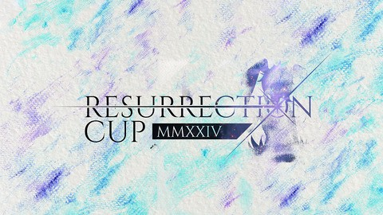

---
tags:
  - ResCup
  - Res Cup
  - Serenity
---

# Resurrection Cup 2024

**Resurrection Cup 2024** was a 4v4, double-elimination osu! tournament hosted by ::{ flag=HU }:: [Phreel](https://osu.ppy.sh/users/12840110) and ::{ flag=VN }:: [Hoaq](https://osu.ppy.sh/users/7696512). It was the third instalment in the Resurrection Cup series. Resurrection Cup 2024 also introduced the Resurrection Cup mascot, Serenity.

## Tournament schedule

| Event | Timestamp |
| --: | :-- |
| Registration phase | 2024-05-11/2024-06-01 |
| Screening phase | 2024-06-01/2024-06-08 |
| Qualifiers showcase | 2024-06-09 |
| Qualifiers | 2024-06-14/2024-06-16 |
| Round of 32 | 2024-06-21/2024-06-23 |
| Round of 16 | 2024-06-28/2024-06-30 |
| Quarterfinals | 2024-07-05/2024-07-07 |
| Semifinals | 2024-07-12/2024-07-14 |
| Finals | 2024-07-19/2024-07-21 |
| Grand Finals | 2024-07-26/2024-07-28 |

## Prizes

| Placing | Prize(s) |
| :-: | :-- |
|  | Unique profile badge, 70% of the prize pool, exclusive profile banner |
|  | 20% of the prize pool, exclusive profile banner |
|  | 10% of the prize pool, exclusive profile banner |
| "4th place" | Exclusive profile banner |

## Organisation

| Position | Member(s) |
| :-- | :-- |
| Host | ::{ flag=HU }:: [Phreel](https://osu.ppy.sh/users/12840110), ::{ flag=VN }:: [Hoaq](https://osu.ppy.sh/users/7696512) |
| Lead GFX | ::{ flag=ID }:: [Len_licht](https://twitter.com/Len_licht) |
| Serenity design team | ::{ flag=ID }:: [Len_licht](https://twitter.com/Len_licht), ::{ flag=FR }:: [Mimiliaa](https://osu.ppy.sh/users/7117621), ::{ flag=CA }:: [RedcXca](https://osu.ppy.sh/users/14056601), ::{ flag=HU }:: [Yumeyo](https://twitter.com/Yumeyo_art) |
| Serenity's voice | ::{ flag=GB }:: [Ethereal_Winter](https://osu.ppy.sh/users/9780417) |
| Main theme design | ::{ flag=PH }:: [OsuMe65](https://osu.ppy.sh/users/852867) |
| Animation design | ::{ flag=ID }:: [Len_licht](https://twitter.com/Len_licht), ::{ flag=SG }:: [Polytetral](https://osu.ppy.sh/users/8612061), ::{ flag=HK }:: [Rose Quartz](https://osu.ppy.sh/users/17348593), ::{ flag=US }:: [Secondoverthree](https://osu.ppy.sh/users/13432062) |
| Storyboarders | ::{ flag=HU }:: [Himada](https://osu.ppy.sh/users/10959366), ::{ flag=VN }:: [Ningguang](https://osu.ppy.sh/users/8500334) |
| Illustrators | ::{ flag=US }:: [\_Xyris\_](https://osu.ppy.sh/users/11246193), ::{ flag=MY }:: [[Zeth]](https://osu.ppy.sh/users/9912966), ::{ flag=MY }:: [Iyouka](https://osu.ppy.sh/users/7138499), ::{ flag=PH }:: [MM](https://osu.ppy.sh/users/7117621), ::{ flag=FR }:: [Mimiliaa](https://osu.ppy.sh/users/7117621), ::{ flag=SG }:: [Polytetral](https://osu.ppy.sh/users/8612061), ::{ flag=TH }:: [Raytoly](https://osu.ppy.sh/users/8121109), ::{ flag=CA }:: [RedcXca](https://osu.ppy.sh/users/14056601), ::{ flag=US }:: [sh0wtime](https://osu.ppy.sh/users/30007083), ::{ flag=SG }:: [TheFunk](https://osu.ppy.sh/users/13981991), ::{ flag=IL }:: [Urition](https://osu.ppy.sh/users/19111992), ::{ flag=HU }:: [Yumeyo](https://twitter.com/Yumeyo_art) |
| Developers | ::{ flag=VN }:: [[Boy]DaLat](https://osu.ppy.sh/users/8266808), ::{ flag=VN }:: [Ningguang](https://osu.ppy.sh/users/8500334) |
| Mappool quality assurance | ::{ flag=DE }:: [-Haruki](https://osu.ppy.sh/users/3673149), ::{ flag=RU }:: [Alvearia](https://osu.ppy.sh/users/6248691), ::{ flag=CA }:: [darkos](https://osu.ppy.sh/users/5969271), ::{ flag=RO }:: [Luminous Sky](https://osu.ppy.sh/users/4429612), ::{ flag=FR }:: [Mimiliaa](https://osu.ppy.sh/users/7117621), ::{ flag=HU }:: [Phreel](https://osu.ppy.sh/users/12840110), ::{ flag=FR }:: [Yumerios](https://osu.ppy.sh/users/11681430) |
| Custom song quality assurance | ::{ flag=US }:: [\_Xyris\_](https://osu.ppy.sh/users/11246193), ::{ flag=DE }:: [Krimek](https://osu.ppy.sh/users/2345078) |
| Mappers | ::{ flag=VN }:: [-Eresh](https://osu.ppy.sh/users/7605060), ::{ flag=GB }:: [-jordan-](https://osu.ppy.sh/users/7288862), ::{ flag=VN }:: [[Boy]DaLat](https://osu.ppy.sh/users/8266808), ::{ flag=TW }:: [9ami](https://osu.ppy.sh/users/1499997), ::{ flag=BY }:: [AirinCat](https://osu.ppy.sh/users/11119539), ::{ flag=RU }:: [Alvearia](https://osu.ppy.sh/users/6248691), ::{ flag=KR }:: [Amamya Kokoro](https://osu.ppy.sh/users/2511839), ::{ flag=ID }:: [Anxient](https://osu.ppy.sh/users/4561368), ::{ flag=HK }:: [Arushii09](https://osu.ppy.sh/users/15664628), ::{ flag=RU }:: [Astrolis](https://osu.ppy.sh/users/12357714), ::{ flag=CA }:: [bad boy](https://osu.ppy.sh/users/3545323), ::{ flag=KR }:: [bIG data](https://osu.ppy.sh/users/17744610), ::{ flag=FR }:: [Blacky Design](https://osu.ppy.sh/users/11540165), ::{ flag=US }:: [Castiello](https://osu.ppy.sh/users/15369635), ::{ flag=HK }:: [Cocoyu](https://osu.ppy.sh/users/20101640), ::{ flag=CA }:: [Creepattack](https://osu.ppy.sh/users/12626424), ::{ flag=RU }:: [Daycore](https://osu.ppy.sh/users/5596337), ::{ flag=VN }:: [Ducky-](https://osu.ppy.sh/users/9351565), ::{ flag=GB }:: [espii](https://osu.ppy.sh/users/21512047), ::{ flag=UA }:: [Esutarosa](https://osu.ppy.sh/users/12024753), ::{ flag=PH }:: [Flame Haze](https://osu.ppy.sh/users/8922155), ::{ flag=US }:: [FrenZ](https://osu.ppy.sh/users/9531903), ::{ flag=CN }:: [Garden](https://osu.ppy.sh/users/2849992), ::{ flag=AU }:: [GranDSenpai](https://osu.ppy.sh/users/3997580), ::{ flag=GB }:: [h1dron](https://osu.ppy.sh/users/21455391), ::{ flag=HU }:: [Himada](https://osu.ppy.sh/users/10959366), ::{ flag=CN }:: [Hollow Wings](https://osu.ppy.sh/users/416662), ::{ flag=RU }:: [IntegerTempest](https://osu.ppy.sh/users/10301398), ::{ flag=UA }:: [Judge1st](https://osu.ppy.sh/users/10610737), ::{ flag=US }:: [Karliah](https://osu.ppy.sh/users/6381153), ::{ flag=GB }:: [KnightC0re](https://osu.ppy.sh/users/7894340), ::{ flag=TW }:: [knowledgeking](https://osu.ppy.sh/users/8022517), ::{ flag=PT }:: [kowari](https://osu.ppy.sh/users/5404892), ::{ flag=DE }:: [Krimek](https://osu.ppy.sh/users/2345078), ::{ flag=HK }:: [Kurashina Asuka](https://osu.ppy.sh/users/7476493), ::{ flag=FI }:: [Lako](https://osu.ppy.sh/users/2906436), ::{ flag=PH }:: [LeCandy](https://osu.ppy.sh/users/6626249), ::{ flag=FI }:: [lewski](https://osu.ppy.sh/users/4980738), ::{ flag=ID }:: [lit120](https://osu.ppy.sh/users/3109248), ::{ flag=US }:: [Local Hero](https://osu.ppy.sh/users/16134122), ::{ flag=GB }:: [Log Off Now](https://osu.ppy.sh/users/4378277), ::{ flag=BR }:: [maot](https://osu.ppy.sh/users/3914271), ::{ flag=ZA }:: [Mattay](https://osu.ppy.sh/users/9748303), ::{ flag=DK }:: [melon boy](https://osu.ppy.sh/users/3053382), ::{ flag=FR }:: [Mimiliaa](https://osu.ppy.sh/users/7117621), ::{ flag=US }:: [Nao Tomori](https://osu.ppy.sh/users/5364763), ::{ flag=ZA }:: [Night Mare](https://osu.ppy.sh/users/11370251), ::{ flag=FR }:: [Nozhomi](https://osu.ppy.sh/users/2716981), ::{ flag=CH }:: [nyarvis](https://osu.ppy.sh/users/14227494), ::{ flag=HU }:: [Nytrocide_](https://osu.ppy.sh/users/11327918), ::{ flag=DE }:: [Okoratu](https://osu.ppy.sh/users/1623405), ::{ flag=RU }:: [OKSY](https://osu.ppy.sh/users/19484011), ::{ flag=TR }:: [Orkay](https://osu.ppy.sh/users/9321674), ::{ flag=TW }:: [oTwinkle](https://osu.ppy.sh/users/15095654), ::{ flag=DE }:: [Pho](https://osu.ppy.sh/users/3624692), ::{ flag=TH }:: [quantumvortex](https://osu.ppy.sh/users/10660777), ::{ flag=CA }:: [Reiji Maigo](https://osu.ppy.sh/users/13875116), ::{ flag=JP }:: [rollpan](https://osu.ppy.sh/users/3062998), ::{ flag=SG }:: [Rtyzen](https://osu.ppy.sh/users/2439822), ::{ flag=CN }:: [Ryuusei Aika](https://osu.ppy.sh/users/7777875), ::{ flag=DE }:: [Sakurauchi Riko](https://osu.ppy.sh/users/5710809), ::{ flag=DE }:: [Sayuka](https://osu.ppy.sh/users/11322604), ::{ flag=AT }:: [Seamob](https://osu.ppy.sh/users/10840806), ::{ flag=US }:: [Shiirn](https://osu.ppy.sh/users/465126), ::{ flag=ID }:: [Shurelia](https://osu.ppy.sh/users/3807986), ::{ flag=JP }:: [Soraka](https://osu.ppy.sh/users/16711065), ::{ flag=TW }:: [TNTlealu](https://osu.ppy.sh/users/9502522), ::{ flag=US }:: [Tycani](https://osu.ppy.sh/users/6693266), ::{ flag=TH }:: [Typ4](https://osu.ppy.sh/users/6902361), ::{ flag=IL }:: [Urition](https://osu.ppy.sh/users/19111992), ::{ flag=US }:: [Vermasium](https://osu.ppy.sh/users/11106442), ::{ flag=PH }:: [xidorn](https://osu.ppy.sh/users/7904667), ::{ flag=AU }:: [xLolicore-](https://osu.ppy.sh/users/4525153), ::{ flag=BE }:: [yaspo](https://osu.ppy.sh/users/4945926), ::{ flag=FR }:: [Yumerios](https://osu.ppy.sh/users/11681430) |
| Playtesters | ::{ flag=CA }:: [chiv](https://osu.ppy.sh/users/6701656), ::{ flag=HU }:: [glass2wave7](https://osu.ppy.sh/users/5442931), ::{ flag=BE }:: [MimiliaaMyMommy](https://osu.ppy.sh/users/3695504), ::{ flag=NL }:: [niqht](https://osu.ppy.sh/users/14390731), ::{ flag=US }:: [plee2](https://osu.ppy.sh/users/12231397), ::{ flag=HK }:: [Rose Quartz](https://osu.ppy.sh/users/17348593), ::{ flag=DE }:: [rundyyy](https://osu.ppy.sh/users/10917620) |
| Referees | ::{ flag=CN }:: [[GB]Rush_FTK](https://osu.ppy.sh/users/3046856), ::{ flag=US }:: [affirmedcheese](https://osu.ppy.sh/users/21002718), ::{ flag=FR }:: [Aidown](https://osu.ppy.sh/users/1522146), ::{ flag=FI }:: [AnjoK](https://osu.ppy.sh/users/9220667), ::{ flag=CL }:: [Bastaku](https://osu.ppy.sh/users/14351782), ::{ flag=KR }:: [Discord](https://osu.ppy.sh/users/16194858), ::{ flag=DE }:: [Dragoncurve](https://osu.ppy.sh/users/6675367), ::{ flag=FR }:: [Mimiliaa](https://osu.ppy.sh/users/7117621), ::{ flag=HU }:: [Phreel](https://osu.ppy.sh/users/12840110), ::{ flag=VN }:: [Poity](https://osu.ppy.sh/users/17148657), ::{ flag=HU }:: [raven_waffles](https://osu.ppy.sh/users/18690280), ::{ flag=DE }:: [real cute](https://osu.ppy.sh/users/9172811), ::{ flag=VN }:: [rock-on](https://osu.ppy.sh/users/9676089), ::{ flag=CO }:: [ShiruoX](https://osu.ppy.sh/users/15173398), ::{ flag=RU }:: [ThatAvocado_Boi](https://osu.ppy.sh/users/17118441) |
| Streamers | ::{ flag=CN }:: [[GB]Rush_FTK](https://osu.ppy.sh/users/3046856), ::{ flag=US }:: [affirmedcheese](https://osu.ppy.sh/users/21002718), ::{ flag=CL }:: [Bastaku](https://osu.ppy.sh/users/14351782), ::{ flag=CA }:: [D I O](https://osu.ppy.sh/users/3958619), ::{ flag=GB }:: [ilw8](https://osu.ppy.sh/users/14167692), ::{ flag=US }:: [Kahli](https://osu.ppy.sh/users/8926244), ::{ flag=AU }:: [Knightcakes](https://osu.ppy.sh/users/6992079), ::{ flag=HU }:: [Phreel](https://osu.ppy.sh/users/12840110), ::{ flag=VN }:: [SIay](https://osu.ppy.sh/users/9587896), ::{ flag=GB }:: [SSScotty](https://osu.ppy.sh/users/10319851), ::{ flag=RU }:: [ThatAvocado_Boi](https://osu.ppy.sh/users/17118441) |
| Commentators | ::{ flag=CA }:: [- Juno -](https://osu.ppy.sh/users/6518510), ::{ flag=ID }:: [BlankTap](https://osu.ppy.sh/users/10137131), ::{ flag=NL }:: [cavoeboy](https://osu.ppy.sh/users/7361815), ::{ flag=FR }:: [Crystal Enjoyer](https://osu.ppy.sh/users/6968364), ::{ flag=CA }:: [D I O](https://osu.ppy.sh/users/3958619), ::{ flag=CA }:: [ExiaXD](https://osu.ppy.sh/users/17241883), ::{ flag=AL }:: [gwk](https://osu.ppy.sh/users/14255332), ::{ flag=CA }:: [I-Flame](https://osu.ppy.sh/users/11257542), ::{ flag=RO }:: [Luminous Sky](https://osu.ppy.sh/users/4429612), ::{ flag=HU }:: [Phreel](https://osu.ppy.sh/users/12840110), ::{ flag=GB }:: [SadShiba](https://osu.ppy.sh/users/10747626), ::{ flag=FR }:: [Subaru_Arima](https://osu.ppy.sh/users/11273062), ::{ flag=GB }:: [thogg](https://osu.ppy.sh/users/8684858), ::{ flag=US }:: [Tycani](https://osu.ppy.sh/users/6693266), ::{ flag=HU }:: [verto](https://osu.ppy.sh/users/2015300), ::{ flag=AU }:: [Vordi](https://osu.ppy.sh/users/6659116) |

## Links

- [Website](https://rescup.xyz/)
- [Discussion thread](https://osu.ppy.sh/community/forums/topics/1919672)
- [Discord server](https://discord.gg/UNzyfgGfeu)
- [Livestream](https://www.twitch.tv/resurrectioncup)
- [YouTube](https://www.youtube.com/channel/UCtdowLBk7An_UlvtTKrYl0w)
- [Tournament bracket](https://challonge.com/RESC24)
- Spreadsheets:
  - **[Master](https://docs.google.com/spreadsheets/d/1Edv9od2riwGx7MawaQjyQ3VC7ID_MclLZmzwMehEKHA)**
  - [Statistics](https://drive.google.com/drive/folders/15qEyL1xMRostLrKR-hrJoVUmYNR4MASE)

## Participants

| Seed | Team | Members |
| :-- | :-: | :-- |
| 1 | **kotomiler** | ::{ flag=NO }:: **[ninerik](https://osu.ppy.sh/users/10549880)**, ::{ flag=PL }:: [maliszewski](https://osu.ppy.sh/users/12408961), ::{ flag=PL }:: [gnahus](https://osu.ppy.sh/users/12779141), ::{ flag=PL }:: [tomasz chic](https://osu.ppy.sh/users/13108233), ::{ flag=CL }:: [Mathi](https://osu.ppy.sh/users/5339515), ::{ flag=CL }:: [Intercambing](https://osu.ppy.sh/users/2546001), ::{ flag=DE }:: [criller](https://osu.ppy.sh/users/8116659), ::{ flag=KR }:: [worst hr player](https://osu.ppy.sh/users/14106450) |
| 2 | **fresh off the boat** | ::{ flag=US }:: **[hydrogen bomb](https://osu.ppy.sh/users/7813296)**, ::{ flag=US }:: [Xxx\_C4L3B\_xxX](https://osu.ppy.sh/users/7959945), ::{ flag=US }:: [decaten](https://osu.ppy.sh/users/5645231), ::{ flag=US }:: [tekkito](https://osu.ppy.sh/users/7075211), ::{ flag=US }:: [WindowLife](https://osu.ppy.sh/users/4108547), ::{ flag=KR }:: [FlyingTuna](https://osu.ppy.sh/users/9224078), ::{ flag=KZ }:: [Kamensh1k](https://osu.ppy.sh/users/16817965), ::{ flag=HK }:: [mcy4](https://osu.ppy.sh/users/2165650) |
| 3 | **NRG FiNESSE** | ::{ flag=PH }:: **[enri](https://osu.ppy.sh/users/8640970)**, ::{ flag=AU }:: [ASecretBox](https://osu.ppy.sh/users/7341183), ::{ flag=CA }:: [RyuK](https://osu.ppy.sh/users/6304246), ::{ flag=US }:: [TTv_UFO](https://osu.ppy.sh/users/14676719), ::{ flag=CN }:: [lolol235](https://osu.ppy.sh/users/6090175), ::{ flag=CN }:: [Dwagon](https://osu.ppy.sh/users/9975427), ::{ flag=US }:: [oPixay](https://osu.ppy.sh/users/12796317), ::{ flag=US }:: [EthantrixV2](https://osu.ppy.sh/users/10634348) |
| 4 | **Bobik** | ::{ flag=RU }:: **[Skrowell](https://osu.ppy.sh/users/9694263)**, ::{ flag=RU }:: [Welter](https://osu.ppy.sh/users/11552867), ::{ flag=UA }:: [RafGPio](https://osu.ppy.sh/users/13705417), ::{ flag=RU }:: [Markrum](https://osu.ppy.sh/users/11854446), ::{ flag=ES }:: [GATmoneyTJ1994](https://osu.ppy.sh/users/6735738), ::{ flag=GR }:: [JackPaX](https://osu.ppy.sh/users/11226645), ::{ flag=ES }:: [A N T O N I O](https://osu.ppy.sh/users/12760743), ::{ flag=RU }:: [Lexu2S](https://osu.ppy.sh/users/8251785) |
| 5 | **Financial Advisors** | ::{ flag=US }:: **[rng_](https://osu.ppy.sh/users/9265990)**, ::{ flag=US }:: [BoshyMan741](https://osu.ppy.sh/users/4830687), ::{ flag=US }:: [onetabby](https://osu.ppy.sh/users/9508109), ::{ flag=US }:: [Cuckweezy](https://osu.ppy.sh/users/7154358), ::{ flag=US }:: [Jakson](https://osu.ppy.sh/users/8788058), ::{ flag=US }:: [ur cute](https://osu.ppy.sh/users/9993348), ::{ flag=US }:: [FlashoFoSho](https://osu.ppy.sh/users/4755314), ::{ flag=US }:: [Twilight](https://osu.ppy.sh/users/6327638) |
| 6 | **Grease Monkey** | ::{ flag=US }:: **[ArmaniDilbo](https://osu.ppy.sh/users/11955716)**, ::{ flag=US }:: [Bunnylikemoney](https://osu.ppy.sh/users/14215850), ::{ flag=UY }:: [Rebo](https://osu.ppy.sh/users/6942259), ::{ flag=NO }:: [Melvr](https://osu.ppy.sh/users/9211924), ::{ flag=NO }:: [YokesPai](https://osu.ppy.sh/users/6399568), ::{ flag=SE }:: [Andros](https://osu.ppy.sh/users/9072586), ::{ flag=NO }:: [Hundur](https://osu.ppy.sh/users/3145033), ::{ flag=NO }:: [Pinguinzi](https://osu.ppy.sh/users/9414229) |
| 7 | **<< TIDAL WAVE >>** | ::{ flag=BR }:: **[-izzy](https://osu.ppy.sh/users/15225729)**, ::{ flag=BR }:: [Kurumiw](https://osu.ppy.sh/users/11415687), ::{ flag=BR }:: [VitorSkull](https://osu.ppy.sh/users/10223298), ::{ flag=BR }:: [MontemorU](https://osu.ppy.sh/users/10077132), ::{ flag=BR }:: [Nyash](https://osu.ppy.sh/users/12976255), ::{ flag=BR }:: [HyIu](https://osu.ppy.sh/users/12967997), ::{ flag=BR }:: [dasdwqdf](https://osu.ppy.sh/users/5403374), ::{ flag=PT }:: [uatzap](https://osu.ppy.sh/users/16509171) |
| 8 | **swaglords** | ::{ flag=CA }:: **[Too Slow](https://osu.ppy.sh/users/2944449)**, ::{ flag=CA }:: [pretty girl](https://osu.ppy.sh/users/11684952), ::{ flag=UY }:: [daanit](https://osu.ppy.sh/users/6159669), ::{ flag=CA }:: [Saryi](https://osu.ppy.sh/users/10051720), ::{ flag=CA }:: [Vespirit](https://osu.ppy.sh/users/5425046), ::{ flag=CA }:: [noncycle](https://osu.ppy.sh/users/12701607), ::{ flag=CA }:: [GENDER BENDER](https://osu.ppy.sh/users/2758279), ::{ flag=CA }:: [Sp1cyy](https://osu.ppy.sh/users/22710559) |
| 9 | **ruyunation** | ::{ flag=US }:: **[taro](https://osu.ppy.sh/users/13586618)**, ::{ flag=US }:: [ruyu](https://osu.ppy.sh/users/8880920), ::{ flag=CA }:: [Laser\_\_](https://osu.ppy.sh/users/20761711), ::{ flag=US }:: [Kama](https://osu.ppy.sh/users/13380270), ::{ flag=US }:: [Gabey](https://osu.ppy.sh/users/12904237), ::{ flag=US }:: [Talullah](https://osu.ppy.sh/users/13214651), ::{ flag=US }:: [RhythmicRS](https://osu.ppy.sh/users/14097024), ::{ flag=PH }:: [NathanRam1918](https://osu.ppy.sh/users/4734703) |
| 10 | **ALL-IN IÑAKI** | ::{ flag=CL }:: **[suntanCTM](https://osu.ppy.sh/users/19998548)**, ::{ flag=CL }:: [Siiphs](https://osu.ppy.sh/users/11786864), ::{ flag=CL }:: [DaiiCTM](https://osu.ppy.sh/users/7479242), ::{ flag=CL }:: [xXChokgamerXx](https://osu.ppy.sh/users/7748891), ::{ flag=PA }:: [AR9](https://osu.ppy.sh/users/5136821), ::{ flag=CL }:: [tfge](https://osu.ppy.sh/users/11207004), ::{ flag=CL }:: [Gonzah](https://osu.ppy.sh/users/12434652), ::{ flag=US }:: [BATBALL](https://osu.ppy.sh/users/15173952) |
| 11 | **together we are terrific** | ::{ flag=CA }:: **[Birchman](https://osu.ppy.sh/users/10676573)**, ::{ flag=CA }:: [Rykaii](https://osu.ppy.sh/users/10792185), ::{ flag=CA }:: [nanawo](https://osu.ppy.sh/users/5426640), ::{ flag=CA }:: [Sepid](https://osu.ppy.sh/users/12032130), ::{ flag=CA }:: [Tsfury](https://osu.ppy.sh/users/12258658), ::{ flag=CA }:: [PikaPwn](https://osu.ppy.sh/users/2012453), ::{ flag=US }:: [Pezz](https://osu.ppy.sh/users/10651106), ::{ flag=US }:: [-Arko](https://osu.ppy.sh/users/8802914) |
| 12 | **im actually crying right now** | ::{ flag=GB }:: **[polski1](https://osu.ppy.sh/users/18131614)**, ::{ flag=DE }:: [Jontea](https://osu.ppy.sh/users/12868917), ::{ flag=AU }:: [xtremeities](https://osu.ppy.sh/users/10759664), ::{ flag=NL }:: [Ohio](https://osu.ppy.sh/users/14919428), ::{ flag=UA }:: [SHADOW FREAK](https://osu.ppy.sh/users/7587763), ::{ flag=IE }:: [Ophiz](https://osu.ppy.sh/users/6671641), ::{ flag=KR }:: [Pieris](https://osu.ppy.sh/users/9082441), ::{ flag=DE }:: [Tatze](https://osu.ppy.sh/users/12090610) |
| 13 | **Caramba Chile** | ::{ flag=BR }:: **[Lirumin](https://osu.ppy.sh/users/15274893)**, ::{ flag=BR }:: [Coreanmaluco](https://osu.ppy.sh/users/3149577), ::{ flag=BR }:: [kagiura](https://osu.ppy.sh/users/11461810), ::{ flag=BR }:: [Uchirrod](https://osu.ppy.sh/users/11472811), ::{ flag=CL }:: [YukariSmug](https://osu.ppy.sh/users/12211248), ::{ flag=CL }:: [Nekore](https://osu.ppy.sh/users/18946207), ::{ flag=CL }:: [Alfiu](https://osu.ppy.sh/users/17724014), ::{ flag=CL }:: [Am_iHyper](https://osu.ppy.sh/users/18284065) |
| 14 | **rich penguins** | ::{ flag=US }:: **[karomi](https://osu.ppy.sh/users/9331403)**, ::{ flag=GB }:: [haunte](https://osu.ppy.sh/users/7333471), ::{ flag=ID }:: [Stixe](https://osu.ppy.sh/users/18351160), ::{ flag=DE }:: [Umbre](https://osu.ppy.sh/users/2766034), ::{ flag=KR }:: [Jeong Woo Yeong](https://osu.ppy.sh/users/8359561), ::{ flag=GB }:: [rudj](https://osu.ppy.sh/users/11592896), ::{ flag=US }:: [Flaro](https://osu.ppy.sh/users/10323184), ::{ flag=US }:: [fieryrage](https://osu.ppy.sh/users/3533958) |
| 15 | **Nipis Madu** | ::{ flag=US }:: **[EzChock](https://osu.ppy.sh/users/9276293)**, ::{ flag=ID }:: [Hakui Koyori](https://osu.ppy.sh/users/10717635), ::{ flag=US }:: [LightsOut](https://osu.ppy.sh/users/8581210), ::{ flag=BE }:: [Hanori](https://osu.ppy.sh/users/7078544), ::{ flag=US }:: [Wispy](https://osu.ppy.sh/users/11106929), ::{ flag=TW }:: [Spinesnight](https://osu.ppy.sh/users/4519494), ::{ flag=MY }:: [Lunasa](https://osu.ppy.sh/users/16436446), ::{ flag=BE }:: [Hexikey](https://osu.ppy.sh/users/10760701) |
| 16 | **Brzęczyszczykiewicz** | ::{ flag=PL }:: **[Tartis](https://osu.ppy.sh/users/9513980)**, ::{ flag=PL }:: [laroxPL](https://osu.ppy.sh/users/6194820), ::{ flag=PL }:: [M4T1K](https://osu.ppy.sh/users/6685958), ::{ flag=PL }:: [Kosiarek](https://osu.ppy.sh/users/9086565), ::{ flag=PL }:: [hedayo](https://osu.ppy.sh/users/9323821), ::{ flag=PL }:: [cyanai](https://osu.ppy.sh/users/14100781), ::{ flag=PL }:: [BMG_](https://osu.ppy.sh/users/4981809), ::{ flag=PL }:: [young leosia](https://osu.ppy.sh/users/10507706) |
| 17 | **7 fedotoff 1 turk** | ::{ flag=TR }:: **[LyeRR](https://osu.ppy.sh/users/13068741)**, ::{ flag=TR }:: [Raikouhou](https://osu.ppy.sh/users/8007528), ::{ flag=TR }:: [edizberkserbest](https://osu.ppy.sh/users/9256771), ::{ flag=TR }:: [heyronii](https://osu.ppy.sh/users/5642779), ::{ flag=TR }:: [Clutchx](https://osu.ppy.sh/users/14958380), ::{ flag=TR }:: [Ievi-](https://osu.ppy.sh/users/14684430), ::{ flag=TR }:: [Shinkiro](https://osu.ppy.sh/users/6093148), ::{ flag=RU }:: [fedotoff](https://osu.ppy.sh/users/7351448) |
| 18 | **DJ Ramon Sucesso** | ::{ flag=FR }:: **[lonq noir](https://osu.ppy.sh/users/14165027)**, ::{ flag=FR }:: [Fiaee](https://osu.ppy.sh/users/10325072), ::{ flag=FR }:: [golem de caca](https://osu.ppy.sh/users/18323396), ::{ flag=FR }:: [-Atour-](https://osu.ppy.sh/users/11245184), ::{ flag=FR }:: [Asckar](https://osu.ppy.sh/users/9650310), ::{ flag=FR }:: [Nessy](https://osu.ppy.sh/users/10656864), ::{ flag=FR }:: [-Wum-](https://osu.ppy.sh/users/11170841), ::{ flag=FR }:: [Qumania](https://osu.ppy.sh/users/17467899) |
| 19 | **cute kittens** | ::{ flag=HU }:: **[gecseboti](https://osu.ppy.sh/users/15213139)**, ::{ flag=HU }:: [csaba21123](https://osu.ppy.sh/users/7764237), ::{ flag=HU }:: [defii](https://osu.ppy.sh/users/8698024), ::{ flag=IL }:: [Ditch_](https://osu.ppy.sh/users/21196745), ::{ flag=HU }:: [Indicolite](https://osu.ppy.sh/users/19309181), ::{ flag=US }:: [Wekkl](https://osu.ppy.sh/users/9377901), ::{ flag=IL }:: [CIash of Clans](https://osu.ppy.sh/users/16048250), ::{ flag=FR }:: [Lexonox](https://osu.ppy.sh/users/7640581) |
| 20 | **rusticks** | ::{ flag=RU }:: **[vljoy209](https://osu.ppy.sh/users/16870029)**, ::{ flag=RU }:: [Inchainz](https://osu.ppy.sh/users/12036243), ::{ flag=RU }:: [Nailer91](https://osu.ppy.sh/users/14277157), ::{ flag=RU }:: [DaHuJka](https://osu.ppy.sh/users/6830745), ::{ flag=UA }:: [EPEMA](https://osu.ppy.sh/users/18781432), ::{ flag=BY }:: [flover1ss](https://osu.ppy.sh/users/15803625), ::{ flag=RU }:: [UserPidoa](https://osu.ppy.sh/users/13995156), ::{ flag=RU }:: [KyKu3u](https://osu.ppy.sh/users/13334336) |
| 21 | **fajny bambule** | ::{ flag=DE }:: **[-semi](https://osu.ppy.sh/users/5154946)**, ::{ flag=US }:: [Flameztear](https://osu.ppy.sh/users/13207763), ::{ flag=CA }:: [Bae Suzy](https://osu.ppy.sh/users/3898396), ::{ flag=US }:: [winz](https://osu.ppy.sh/users/7060756), ::{ flag=RU }:: [Endura](https://osu.ppy.sh/users/7774197), ::{ flag=US }:: [PaintedKoaIa](https://osu.ppy.sh/users/11269055), ::{ flag=US }:: [Mejiro Ramonu](https://osu.ppy.sh/users/10653742), ::{ flag=CA }:: [Yip](https://osu.ppy.sh/users/5177569) |
| 22 | **Germany owc B** | ::{ flag=DE }:: **[Sai1kou](https://osu.ppy.sh/users/13319294)**, ::{ flag=DE }:: [ruirui](https://osu.ppy.sh/users/5423872), ::{ flag=DE }:: [wuk](https://osu.ppy.sh/users/14457718), ::{ flag=DE }:: [Christiaaan](https://osu.ppy.sh/users/11804019), ::{ flag=DE }:: [Kaanfickels](https://osu.ppy.sh/users/15227187), ::{ flag=DE }:: [Kokuban](https://osu.ppy.sh/users/4383303), ::{ flag=DE }:: [Anroyz](https://osu.ppy.sh/users/1818573), ::{ flag=DE }:: [SERBIATRUCKER13](https://osu.ppy.sh/users/15339747) |
| 23 | **super hamburger** | ::{ flag=NL }:: **[wessel_osu2](https://osu.ppy.sh/users/4382220)**, ::{ flag=GB }:: [skiatzo](https://osu.ppy.sh/users/16774872), ::{ flag=DE }:: [[ Nano ]](https://osu.ppy.sh/users/5132353), ::{ flag=US }:: [headstack](https://osu.ppy.sh/users/10322186), ::{ flag=US }:: [mode](https://osu.ppy.sh/users/4580287), ::{ flag=DE }:: [Scheinii](https://osu.ppy.sh/users/3115283), ::{ flag=GB }:: [Matt4132](https://osu.ppy.sh/users/11706972), ::{ flag=RO }:: [AlexBelea](https://osu.ppy.sh/users/19430137) |
| 24 | **kailburn pirates** | ::{ flag=KR }:: **[kailburn](https://osu.ppy.sh/users/9586445)**, ::{ flag=KR }:: [ch0co](https://osu.ppy.sh/users/9737185), ::{ flag=KR }:: [myhan3](https://osu.ppy.sh/users/1433427), ::{ flag=KR }:: [wjddjs](https://osu.ppy.sh/users/15646924), ::{ flag=KR }:: [[ ] [ ]](https://osu.ppy.sh/users/11611550), ::{ flag=KR }:: [Gambler](https://osu.ppy.sh/users/11415230), ::{ flag=KR }:: [Lujeol](https://osu.ppy.sh/users/14447878), ::{ flag=KR }:: [Lysitea](https://osu.ppy.sh/users/16640072) |
| 25 | **RX 5600 xt** | ::{ flag=US }:: **[soft kitty](https://osu.ppy.sh/users/16303970)**, ::{ flag=US }:: [soft kitten](https://osu.ppy.sh/users/9632648), ::{ flag=US }:: [Ryzeren](https://osu.ppy.sh/users/7790974), ::{ flag=US }:: [Neinja](https://osu.ppy.sh/users/12632867), ::{ flag=US }:: [Donksities](https://osu.ppy.sh/users/12314341), ::{ flag=US }:: [- deston -](https://osu.ppy.sh/users/15556397), ::{ flag=TH }:: [soft bunny](https://osu.ppy.sh/users/9317938), ::{ flag=US }:: [Sdot](https://osu.ppy.sh/users/12609022) |
| 26 | **Cowabunga** | ::{ flag=US }:: **[Mejiro McQueen](https://osu.ppy.sh/users/11555612)**, ::{ flag=DK }:: [Redzy](https://osu.ppy.sh/users/9732417), ::{ flag=US }:: [SilenceSuzuka](https://osu.ppy.sh/users/7249644), ::{ flag=US }:: [Daitaku Helios](https://osu.ppy.sh/users/16538717), ::{ flag=GB }:: [Fwuffy](https://osu.ppy.sh/users/7374212), ::{ flag=PH }:: [flowers](https://osu.ppy.sh/users/7449949), ::{ flag=US }:: [Mejir0 McQueen](https://osu.ppy.sh/users/12522447), ::{ flag=US }:: [FishySquidMan](https://osu.ppy.sh/users/8601970) |
| 27 | **Gente Seria: die Fortsetzung** | ::{ flag=PE }:: **[Cochinomori](https://osu.ppy.sh/users/15639661)**, ::{ flag=UY }:: [-PloX](https://osu.ppy.sh/users/6404583), ::{ flag=MX }:: [SaintSFT](https://osu.ppy.sh/users/14970132), ::{ flag=DE }:: [Fleh](https://osu.ppy.sh/users/7780605), ::{ flag=CO }:: [EndlessRhythmic](https://osu.ppy.sh/users/16844298), ::{ flag=AR }:: [Yesew](https://osu.ppy.sh/users/21338717), ::{ flag=PE }:: [P r a h](https://osu.ppy.sh/users/10509043), ::{ flag=PE }:: [- Koshiin -](https://osu.ppy.sh/users/19135423) |
| 28 | **el hambre y las ganas de comer** | ::{ flag=AR }:: **[AlexKito](https://osu.ppy.sh/users/12902737)**, ::{ flag=AR }:: [viciobylike](https://osu.ppy.sh/users/18922516), ::{ flag=AR }:: [Pipipupu997](https://osu.ppy.sh/users/20120615), ::{ flag=AR }:: [Kaoshii](https://osu.ppy.sh/users/7807935), ::{ flag=CL }:: [_Fefe](https://osu.ppy.sh/users/8133880), ::{ flag=CL }:: [iisobeyan](https://osu.ppy.sh/users/14264961), ::{ flag=CL }:: [lacto](https://osu.ppy.sh/users/7449632) |
| 29 | **Mannheimer Among Us** | ::{ flag=DE }:: **[Peti](https://osu.ppy.sh/users/6221425)**, ::{ flag=DE }:: [mort](https://osu.ppy.sh/users/13627426), ::{ flag=DE }:: [Blad_D](https://osu.ppy.sh/users/12988448), ::{ flag=DE }:: [wooting](https://osu.ppy.sh/users/14897088), ::{ flag=DE }:: [-lion](https://osu.ppy.sh/users/24270105), ::{ flag=DE }:: [Lukiii](https://osu.ppy.sh/users/12805967), ::{ flag=DE }:: [Menoji](https://osu.ppy.sh/users/11034873), ::{ flag=DE }:: [Shiragi](https://osu.ppy.sh/users/8788898) |
| 30 | **시발Aim** | ::{ flag=DE }:: **[Merucy](https://osu.ppy.sh/users/12016150)**, ::{ flag=NO }:: [toti](https://osu.ppy.sh/users/10162727), ::{ flag=RU }:: [netnesanya](https://osu.ppy.sh/users/6017901), ::{ flag=GB }:: [jakk](https://osu.ppy.sh/users/9098192), ::{ flag=DE }:: [EulaFootEnjoyer](https://osu.ppy.sh/users/10290641), ::{ flag=SG }:: [qstronaut](https://osu.ppy.sh/users/10958852), ::{ flag=US }:: [Redap](https://osu.ppy.sh/users/12301297), ::{ flag=FR }:: [Drakkles](https://osu.ppy.sh/users/13963691) |
| 31 | **doge** | ::{ flag=PA }:: **[Sirny](https://osu.ppy.sh/users/18962732)**, ::{ flag=FR }:: [YinlinMyBeloved](https://osu.ppy.sh/users/14547194), ::{ flag=SG }:: [GSBlank](https://osu.ppy.sh/users/2312106), ::{ flag=US }:: [WhatSkill](https://osu.ppy.sh/users/7371294), ::{ flag=RU }:: [Vitya1437](https://osu.ppy.sh/users/4346274), ::{ flag=RU }:: [arqx](https://osu.ppy.sh/users/2569683), ::{ flag=BR }:: [moyai_gaming](https://osu.ppy.sh/users/12274488), ::{ flag=CA }:: [niantasan](https://osu.ppy.sh/users/9377682) |
| 32 | **cabaré sasoriosu** | ::{ flag=BR }:: **[Daf0nz](https://osu.ppy.sh/users/14592820)**, ::{ flag=BR }:: [revoken](https://osu.ppy.sh/users/15251627), ::{ flag=BR }:: [Ragningo](https://osu.ppy.sh/users/9476971), ::{ flag=BR }:: [Yelan](https://osu.ppy.sh/users/14420220), ::{ flag=BR }:: [zStormk19](https://osu.ppy.sh/users/13958882), ::{ flag=BR }:: [- Sasori](https://osu.ppy.sh/users/13926341), ::{ flag=BR }:: [Lineu](https://osu.ppy.sh/users/17192419), ::{ flag=BR }:: [vinicius](https://osu.ppy.sh/users/19599089) |

## Podium

This competition has come to an end and resulted in the following podium:

| Placing | Team |
| :-: | :-- |
|  | **kotomiler** (::{ flag=NO }:: **[ninerik](https://osu.ppy.sh/users/10549880)**, ::{ flag=PL }:: [maliszewski](https://osu.ppy.sh/users/12408961), ::{ flag=PL }:: [gnahus](https://osu.ppy.sh/users/12779141), ::{ flag=PL }:: [tomasz chic](https://osu.ppy.sh/users/13108233), ::{ flag=CL }:: [Mathi](https://osu.ppy.sh/users/5339515), ::{ flag=CL }:: [Intercambing](https://osu.ppy.sh/users/2546001), ::{ flag=DE }:: [criller](https://osu.ppy.sh/users/8116659), ::{ flag=KR }:: [worst hr player](https://osu.ppy.sh/users/14106450)) |
|  | **fresh off the boat** (::{ flag=US }:: **[hydrogen bomb](https://osu.ppy.sh/users/7813296)**, ::{ flag=US }:: [Xxx\_C4L3B\_xxX](https://osu.ppy.sh/users/7959945), ::{ flag=US }:: [decaten](https://osu.ppy.sh/users/5645231), ::{ flag=US }:: [tekkito](https://osu.ppy.sh/users/7075211), ::{ flag=US }:: [WindowLife](https://osu.ppy.sh/users/4108547), ::{ flag=KR }:: [FlyingTuna](https://osu.ppy.sh/users/9224078), ::{ flag=KZ }:: [Kamensh1k](https://osu.ppy.sh/users/16817965), ::{ flag=HK }:: [mcy4](https://osu.ppy.sh/users/2165650)) |
|  | **Bobik** (::{ flag=RU }:: **[Skrowell](https://osu.ppy.sh/users/9694263)**, ::{ flag=RU }:: [Welter](https://osu.ppy.sh/users/11552867), ::{ flag=UA }:: [RafGPio](https://osu.ppy.sh/users/13705417), ::{ flag=RU }:: [Markrum](https://osu.ppy.sh/users/11854446), ::{ flag=ES }:: [GATmoneyTJ1994](https://osu.ppy.sh/users/6735738), ::{ flag=GR }:: [JackPaX](https://osu.ppy.sh/users/11226645), ::{ flag=ES }:: [A N T O N I O](https://osu.ppy.sh/users/12760743), ::{ flag=RU }:: [Lexu2S](https://osu.ppy.sh/users/8251785)) |

## Mappools

### Grand Finals

- No Mod
  1. [Resurrection Cup Sound Team - Wishes for Tomorrow (melon boy) [Resurrection]](https://osu.ppy.sh/beatmapsets/2219252#osu/4704067)
  2. [Victorius - Age of Tyranny (Urition) [Revolt [Tourney Ver.]]](https://osu.ppy.sh/beatmapsets/2219231#osu/4704186)
  3. [Aqours - Genjitsu Mysterium (Tycani) [REFLECTION in the DARKNESS]](https://osu.ppy.sh/beatmapsets/2219232#osu/4704025)
  4. [Para Dot. - Infinite haze (Pho) [Endless]](https://osu.ppy.sh/beatmapsets/2219237#osu/4704035)
  5. [Memme - Acid Burst (Shiirn) [Synaptic Corrosion]](https://osu.ppy.sh/beatmapsets/2218478#osu/4702398)
- Hidden
  1. [Yousei Teikoku - Zetsubou plantation (h1dron) [this song has nothing to do with mirai nikki]](https://osu.ppy.sh/beatmapsets/2219242#osu/4704042)
  2. [Morimori Atsushi - Funkotsu Saishin Casino (Alvearia) [FALSE]](https://osu.ppy.sh/beatmapsets/2218951#osu/4703461)
  3. [BlackY - AlterLuna (Night Mare) [NerfedLuna]](https://osu.ppy.sh/beatmapsets/2219247#osu/4704062)
- Hard Rock
  1. [Demetori - Ningyou Saiban ~ Hito no Katachi Moteasobishi Shoujo (lewski) [Judgement]](https://osu.ppy.sh/beatmapsets/2219249#osu/4704064)
  2. [Sh0wtime - POWERMOVE (Alvearia) [yaspo's WASD]](https://osu.ppy.sh/beatmapsets/2219255#osu/4704071)
  3. [t+pazolite - 56 Seconds Later (Phreel) [Alvearia's Collab Expert]](https://osu.ppy.sh/beatmapsets/2218953#osu/4703464)
- Double Time
  1. [Emilia (CV: Setsunan) - Start_Dash (Castiello) [Castie & Mimi's Journey]](https://osu.ppy.sh/beatmapsets/2219259#osu/4704077)
  2. [FREEDOM CREATORS - Per aspera ad astra. (Orkay) [Myojo]](https://osu.ppy.sh/beatmapsets/2219017#osu/4703624)
  3. [ippo.tsk - fall semester song (quantumvortex) [Expert]](https://osu.ppy.sh/beatmapsets/2219215#osu/4703990)
  4. [DJ Killer - GENOCIDE <Version 666> (Local Hero) [ANOTHER]](https://osu.ppy.sh/beatmapsets/2219389#osu/4704341)
- Free Mod
  1. [MAN WITH A MISSION - When My Devil Rises (Yumerios) [DEMON]](https://osu.ppy.sh/beatmapsets/2219060#osu/4703705)
  2. [trung-nova - HYPERNOVA//DEBRIS (xidorn) [SCHWARZSCHILD//TACHYSYSTELLIS]](https://osu.ppy.sh/beatmapsets/2219273#osu/4704099)
  3. [KARUT - Oxygen Destroyer (Shurelia) [Torment]](https://osu.ppy.sh/beatmapsets/2219271#osu/4704097)
  4. [Kekero Fuchizaki - NECOLOGY (KnightC0re) [jazz]](https://osu.ppy.sh/beatmapsets/2219148#osu/4703859)
- Tiebreaker
  1. **[N_dog feat. quu-zie - Delusions (oTwinkle) [Shattered Phantasm]](https://osu.ppy.sh/beatmapsets/2219285#osu/4704129)**

### Finals

- No Mod
  1. [Harada Hitomi - Overdrive (Yuuni's J-Core Bootleg) (Yumerios) [Mermaid]](https://osu.ppy.sh/beatmapsets/2215023#osu/4693223)
  2. [Christell - Dubidubidu (ENVY Remix) (Seamob) [MEOW WILL]](https://osu.ppy.sh/beatmapsets/2214876#osu/4692949)
  3. [zuya - plemt (Lako) [Planetary Horizon <Distance: 538 Ls>]](https://osu.ppy.sh/beatmapsets/2215026#osu/4693233)
  4. [Fu've - Einherjar (9ami) [Heroic Odyssey]](https://osu.ppy.sh/beatmapsets/2214967#osu/4693121)
  5. [cybermiso - corps-sans-organes (Local Hero) [avant-garde]](https://osu.ppy.sh/beatmapsets/2214734#osu/4692697)
- Hidden
  1. [HalaCG ft. Nahu Pyrope - Rest In Harmony (Alvearia) [she is hot]](https://osu.ppy.sh/beatmapsets/2215018#osu/4693215)
  2. [Dark PHOENiX - Shoujo ga Mita Nihon no Genfuukei (iljaaz) [Phantasm]](https://osu.ppy.sh/beatmapsets/1889104#osu/3890682)
  3. [Monster Siren - Keep the torch (Hollow Wings) [Godwhip (Tournament Version)]](https://osu.ppy.sh/beatmapsets/2214894#osu/4692978)
- Hard Rock
  1. [LiSA - Thrill, Risk, Heartless (Castiello) [Brokenhearted]](https://osu.ppy.sh/beatmapsets/2215056#osu/4693298)
  2. [Krimek feat. michiri9 - Lunaria (Mimiliaa) [Fairy Tales]](https://osu.ppy.sh/beatmapsets/2215066#osu/4693312)
  3. [breakchild - E5E4E2 (Yumerios) [WAS THAT THE BITE OF 87 ?!!!!]](https://osu.ppy.sh/beatmapsets/2215068#osu/4693318)
- Double Time
  1. [driftcat - puzzle (Daycore) [?]](https://osu.ppy.sh/beatmapsets/2214647#osu/4692520)
  2. [T. Stebbins - Tear You Up (Okoratu) [Extra Stage]](https://osu.ppy.sh/beatmapsets/2215073#osu/4693328)
  3. [Team Grimoire - RougokuSTRIP (Grimoire crossbreed rmx) (Local Hero) [Another]](https://osu.ppy.sh/beatmapsets/2011840#osu/4509365)
  4. [Monster Siren Records - Magic Theorem (CebollaVladimir) [A theorem of a fantasy]](https://osu.ppy.sh/beatmapsets/1856763#osu/3816056)
- Free Mod
  1. [Ducky Chix - Prayer (Fanty) [Specialist CS3.7 edit]](https://osu.ppy.sh/beatmapsets/2120635#osu/4455505)
  2. [AiSS vs. Hua Mu Li w/ Nightwheel feat. Yuzuki Yukari - Merry Christmas \~Lost in the Snowstorm\~ (Typ4) [Happy New Year]](https://osu.ppy.sh/beatmapsets/2214840#osu/4692881)
  3. [Raytoly - Luminost (Amamya Kokoro) [In the dark, There was a light]](https://osu.ppy.sh/beatmapsets/2215200#osu/4693568)
  4. [Lusumi - ABYSSAL CHRONOS (Sayuka) [HADAL]](https://osu.ppy.sh/beatmapsets/2214821#osu/4692857)
- Tiebreaker
  1. **[Shokii - Eterna (Ryuusei Aika) [X]](https://osu.ppy.sh/beatmapsets/2215097#osu/4693364)**

### Semifinals

- No Mod
  1. [BAND-MAID - Sense (lit120) [Death]](https://osu.ppy.sh/beatmapsets/2210605#osu/4682549)
  2. [Xi - Suisuienki ~ Broken the Moon (Sayuka) [Oni's Remembrance (SF NM2)]](https://osu.ppy.sh/beatmapsets/2210618#osu/4682572)
  3. [Ado - unravel (Daycore) [tokyo floppa]](https://osu.ppy.sh/beatmapsets/2210212#osu/4681624)
  4. [cexiria - Colossal Raid (LeCandy) [candy]](https://osu.ppy.sh/beatmapsets/2210471#osu/4682282)
  5. [ZiGZaG HACKER - V^3 (Hello World) (Alvearia) [unstable]](https://osu.ppy.sh/beatmapsets/2210739#osu/4682938)
- Hidden
  1. [clipping. - Body & Blood (quantumvortex) [BAD BITCH]](https://osu.ppy.sh/beatmapsets/2210638#osu/4682608)
  2. [Rinu - Manmaru Dance (Amamya Kokoro) [Abracadabra]](https://osu.ppy.sh/beatmapsets/1996158#osu/4342487)
  3. [SiLiS - departed ([Boy]DaLat) [chronological lost]](https://osu.ppy.sh/beatmapsets/2210733#osu/4682919)
- Hard Rock
  1. [Kagetora. - Shattered snow (knowledgeking) [Vanishing]](https://osu.ppy.sh/beatmapsets/2210718#osu/4682875)
  2. [Gentle Stick X M2U - Ineffabilis (LeCandy) [edit ver.]](https://osu.ppy.sh/beatmapsets/2210672#osu/4682689)
  3. [sugosugiii feat. Eili - Saishuu Sonzai : Hakai Sekai no Shinsei-Ryoku (Alvearia) [Dear god, slain the scriptures the poem has told]](https://osu.ppy.sh/beatmapsets/2210767#osu/4683007)
- Double Time
  1. [Oomuro Sakurako (CV: Katou Emiri) - Sakurako Introduce (rollpan) [Resurrection Cup]](https://osu.ppy.sh/beatmapsets/2210779#osu/4683027)
  2. [Icarus'cry - XXI (Sanch-KK) [Lunatic]](https://osu.ppy.sh/beatmapsets/2145101#osu/4518141)
  3. [Shoichiro Sakamoto - Eye of Aeon (KanaRin) [Aeon]](https://osu.ppy.sh/beatmapsets/26528#osu/89362)
  4. [Nightcore - Pinball (jericho2442) [Madness O_O]](https://osu.ppy.sh/beatmapsets/7930#osu/37433)
- Free Mod
  1. [Anfini - Mirage (FrenZ) [Resurrection]](https://osu.ppy.sh/beatmapsets/2210921#osu/4683342)
  2. [sasakure.UK - the EmpErroR (xLolicore-) [Loli & Ducky's Corruption]](https://osu.ppy.sh/beatmapsets/2210735#osu/4682925)
  3. [Kagetora. - Broken Library (Alvearia) [Resurrection]](https://osu.ppy.sh/beatmapsets/2210740#osu/4682942)
  4. [Sydosys - Proxima Centauri (Astrolis) [0110001101101111011011010110010101110100]](https://osu.ppy.sh/beatmapsets/2210588#osu/4682509)
- Tiebreaker
  1. **[Xyris - Hiraeth (Tycani) [The River Through the Mountain, The Breeze Through the Leaves, The Call of Home.]](https://osu.ppy.sh/beatmapsets/2210796#osu/4683060)**

### Quarterfinals

- No Mod
  1. [sweet ARMS - Trust in you (CXu) [Zafkiel]](https://osu.ppy.sh/beatmapsets/346218#osu/764310)
  2. [blobdash - BLEED (OKSY) [Pain Is Weakness Leaving The Body >.<]](https://osu.ppy.sh/beatmapsets/2207093#osu/4673458)
  3. [yama & Tatsuya Kitani - As I longed for (Rtyzen) [Cruisin']](https://osu.ppy.sh/beatmapsets/2206985#osu/4673188)
  4. [SDMNE - Effervescence (IntegerTempest) [Torrent Tide]](https://osu.ppy.sh/beatmapsets/2206823#osu/4672850)
  5. [TUYU - Doro no Bunzai de Watashi dake no Taisetsu o Ubaou da Nante (Luminous Sky) [-Eresh's winkelschleifer]](https://osu.ppy.sh/beatmapsets/2207000#osu/4673212)
- Hidden
  1. [Adust Rain - Eleven Stud (Yumerios) [Extreme]](https://osu.ppy.sh/beatmapsets/2206805#osu/4672808)
  2. [Yorushika - Matasaburo (Aragon) [Raijodo & a_Blue's Collab Expert]](https://osu.ppy.sh/beatmapsets/1566187#osu/3614534)
  3. [Aiobahn feat. KOTOKO - INTERNET YAMERO (Nytrocide_) [ECSTASY]](https://osu.ppy.sh/beatmapsets/2206996#osu/4673207)
- Hard Rock
  1. [Kawada Mami - Serment (Flame Haze) [the end.]](https://osu.ppy.sh/beatmapsets/2206912#osu/4673039)
  2. [Cascada - Ready For Love (Nightcore Mix) (Sakurauchi Riko) [Original]](https://osu.ppy.sh/beatmapsets/2207120#osu/4673531)
  3. [Fujisawa Yoshiaki - Tatakai (Esutarosa) [QF-HR3]](https://osu.ppy.sh/beatmapsets/2206549#osu/4672210)
- Double Time
  1. [Xceon feat. Mayumi Morinaga - Izayoi Setsuna (Extended Mix) (maot) [Insane]](https://osu.ppy.sh/beatmapsets/2206854#osu/4672907)
  2. [Denkishiki Karen Ongaku Shuudan - Distorted Pain (Kurashina Asuka) [Ruination]](https://osu.ppy.sh/beatmapsets/1764045#osu/3610653)
  3. [IOSYS - Club Ibuki in Break All (TheMefisto) [Insane]](https://osu.ppy.sh/beatmapsets/751755#osu/1889137)
  4. [Rina Sawayama - We Out Here (Luminiscental) [Premeditation]](https://osu.ppy.sh/beatmapsets/1906357#osu/3931035)
- Free Mod
  1. [Uinyasu, Occhoko Bunny - Aa Kenran no Yume ga Gotoku (Epsilon Remix) (deadcode) [Flower Dance]](https://osu.ppy.sh/beatmapsets/822937#osu/2103267)
  2. [isonosuke - Baka Tsuushin (feat. Chis-A) (Astrolis) [:joy:]](https://osu.ppy.sh/beatmapsets/2206869#osu/4672937)
  3. [Tanger - BIKE (Alvearia) [iCanSeeYou]](https://osu.ppy.sh/beatmapsets/2206807#osu/4672813)
  4. [KING & Princess - Drastic Dramatic (Mattay) [Extreme]](https://osu.ppy.sh/beatmapsets/2206803#osu/4672803)
- Tiebreaker
  1. **[celtix - Necrotopia (Cocoyu) [Pandemonium of the Undead]](https://osu.ppy.sh/beatmapsets/2207078#osu/4673415)**

### Round of 16

- No Mod
  1. [Eve - Gekka*Midare Botan (Meg) [Meg&Roll_Pan's E-Xtra]](https://osu.ppy.sh/beatmapsets/530685#osu/1124857)
  2. [Xi - Densetsu no Sabori Shinigami ~ Make a quick escape (Toumei Dragon) [Extra Stage]](https://osu.ppy.sh/beatmapsets/1621473#osu/3310526)
  3. [Valkyrie - Last Lament (AirinCat) [last ramen]](https://osu.ppy.sh/beatmapsets/2203089#osu/4663060)
  4. [l'avenir proche - 100ml of ethylene glycol (Himada) [Cryogenic Intoxication]](https://osu.ppy.sh/beatmapsets/2203294#osu/4663530)
- Hidden
  1. [Noel Kaburagi - Raimei no Ken (nyarvis) [MEI SENPAI!!!!]](https://osu.ppy.sh/beatmapsets/2203134#osu/4663156)
  2. [cygnus - Darkness Parade (KnightC0re) [Dogura Magura]](https://osu.ppy.sh/beatmapsets/2078577#osu/4352411)
- Hard Rock
  1. [KISIDA KYODAN & THE AKEBOSI ROCKETS - Tenkyou no Alderamin (Log Off Now) [Life isn't Beautiful]](https://osu.ppy.sh/beatmapsets/2203277#osu/4663495)
  2. [HOYO-MiX feat. Chalili, TetraCalyx, Hanser - Moon Halo (Nozhomi) [Everlasting Flames]](https://osu.ppy.sh/beatmapsets/2203281#osu/4663505)
- Double Time
  1. [Fantasy Project feat. NDA - Dam Dadi Doo (Nightcore Extended Mix) (Okoratu) [Insane]](https://osu.ppy.sh/beatmapsets/2203280#osu/4663503)
  2. [siromaru + cranky - conflict (Icekalt) [Insane]](https://osu.ppy.sh/beatmapsets/936126#osu/1970659)
  3. [sokoninaru - vermisst (Soraka) [DT3]](https://osu.ppy.sh/beatmapsets/2203088#osu/4663058)
- Free Mod
  1. [Tokoyami Towa - Taida na Wonder (Judge1st) [Lazy Wonder]](https://osu.ppy.sh/beatmapsets/2203285#osu/4663510)
  2. [MASAKI (ZUNTATA) - Touhou Kijinretsu (Sparhten) [Halfslashed's Extra]](https://osu.ppy.sh/beatmapsets/1267353#osu/2998444)
  3. [Hikarisyuyo - Cracking (Reiji Maigo) [awa]](https://osu.ppy.sh/beatmapsets/2203107#osu/4663079)
- Tiebreaker
  1. **[roer (feat. Ethereal_Winter) - Circles in Ruin (Alvearia) [You left in silence, leaving us to a dying world]](https://osu.ppy.sh/beatmapsets/2203288#osu/4663523)**

### Round of 32

- No Mod
  1. [Tsubaki - Kyun Kyun Tamaran Inaba-tan. (bad boy) [Pyon Pyon ft. rollpan]](https://osu.ppy.sh/beatmapsets/2199045#osu/4653764)
  2. [Tyrfing - Verflucht (Alvearia) [Extreme]](https://osu.ppy.sh/beatmapsets/1693844#osu/3461160)
  3. [AZKi - Intersection (Judge1st) [Neon Bright Love]](https://osu.ppy.sh/beatmapsets/2199294#osu/4654341)
  4. [Sakurano Mimito, Minakami Hina, Inubousaki Shian - Hyper Bass (feat. Yunomi) (Yumerios) [Asmr INTENSIFIES]](https://osu.ppy.sh/beatmapsets/2199101#osu/4653925)
- Hidden
  1. [BAND-MAID - After Life (Castiello) [Wonder]](https://osu.ppy.sh/beatmapsets/2199292#osu/4654339)
  2. [A.SAKA - Nanatsu Myoukakitsubata (Hollow Wings) [Pata-Mon's Another]](https://osu.ppy.sh/beatmapsets/2118959#osu/4652670)
- Hard Rock
  1. [ChapChap - Usagi Flap (METAL Ver.) (Ducky-) [speen]](https://osu.ppy.sh/beatmapsets/2199097#osu/4653915)
  2. [ptar124 - A White Fox Consumes a Vial of "Cakewater" as It Obliterates a Green Racoon (Alvearia) [Resurrection]](https://osu.ppy.sh/beatmapsets/2199371#osu/4654509)
- Double Time
  1. [Huang Ling - Deng Dai (Bellicose) [Waiting]](https://osu.ppy.sh/beatmapsets/1094296#osu/2287043)
  2. [Tanchiky - ENERGY SYNERGY MATRIX (Extended) (Wispy) [INSANE]](https://osu.ppy.sh/beatmapsets/2091981#osu/4539034)
  3. [Chocofan - LUCKY CAT (Bloxi) [GYGY's Lunatic]](https://osu.ppy.sh/beatmapsets/1980142#osu/4132536)
- Free Mod
  1. [THE ORAL CIGARETTES - CATCH ME (Castiello) [Illusion]](https://osu.ppy.sh/beatmapsets/2199293#osu/4654340)
  2. [MisoilePunch \~pan soe\~ - MeTear'n TruX (Alvearia) [Resurrection]](https://osu.ppy.sh/beatmapsets/2199026#osu/4653719)
  3. [HOYO-MiX feat. Isabelle Huang - TRUE (Kurashina Asuka) [Glory to the Thirteen]](https://osu.ppy.sh/beatmapsets/2199300#osu/4654351)
- Tiebreaker
  1. **[Ardolf - Shattered Vows (Blacky Design) [Tarnished Expectancy]](https://osu.ppy.sh/beatmapsets/2199395#osu/4654556)**

### Qualifiers

- No Mod
  1. [UNISON SQUARE GARDEN - Pandemic Sudden Death (otudou) [What is the ending of sudden death?]](https://osu.ppy.sh/beatmapsets/2086138#osu/4370716)
  2. [Raimukun - Red myth story (Vermasium) [Echoes of the Ocean (nerfed)]](https://osu.ppy.sh/beatmapsets/2194990#osu/4644207)
  3. [Some1CP - Motteke! Rick Roll (Local Hero) [a]](https://osu.ppy.sh/beatmapsets/2194967#osu/4644149)
  4. [Sheena Ringo - Marunouchi Sadistic (neetskills remix) (-Mikan) [Axarious x Sing's Ultra]](https://osu.ppy.sh/beatmapsets/1125370#osu/2462245)
- Hidden
  1. [Shirakami Fubuki vs. sasakure.UK - KINGWORLD (Anxient) [MMORPG KING]](https://osu.ppy.sh/beatmapsets/1802473#osu/4643768)
  2. [nui - Mayday (vetoed) [Senseless]](https://osu.ppy.sh/beatmapsets/2044442#osu/4267100)
  3. [Getty vs. DJ DiA - Grayedout -Antifront- (Extended Mix) (Okoratu) [:)]](https://osu.ppy.sh/beatmapsets/2194883#osu/4643978)
- Hard Rock
  1. [nano - Star light, Star bright (nyarvis) [Tomorrow]](https://osu.ppy.sh/beatmapsets/1824613#osu/3744339)
  2. [t+pazolite - Lilac Feel (Alvearia) [cs5]](https://osu.ppy.sh/beatmapsets/2134834#osu/4603484)
  3. [A/I - Turbocharger (Amamya Kokoro) [L1 License Driver]](https://osu.ppy.sh/beatmapsets/2194792#osu/4643747)
- Double Time
  1. [Horie Yui - Asymmetry (ShiraKai) [Collab Extra]](https://osu.ppy.sh/beatmapsets/670616#osu/1418230)
  2. [Halozy - Kikoku Doukoku Jigokuraku (228) [Orin, what the HELL is this]](https://osu.ppy.sh/beatmapsets/2066012#osu/4322135)
  3. [IOSYS - Power of dream (dasdwqdf) [otst#7 diff]](https://osu.ppy.sh/beatmapsets/1833578#osu/3764250)

## Match results

### Grand Finals

Sunday, 28 July 2024:

| Team 1 |  |  | Team 2 | Match link |
| --: | :-: | :-: | :-- | :-: |
| **kotomiler** | **7** | 0 | Bobik |  |
| fresh off the boat | 3 | **7** | **kotomiler** |  |
| **kotomiler** | **7** | 4 | fresh off the boat |  |

### Finals

Saturday, 20 July 2024:

| Team 1 |  |  | Team 2 | Match link |
| --: | :-: | :-: | :-- | :-: |
| kotomiler | 6 | **7** | **fresh off the boat** |  |
| **Bobik** | **7** | 2 | Financial Advisors |  |
| NRG FiNESSE | 5 | **7** | **ruyunation** |  |

Sunday, 21 July 2024:

| Team 1 |  |  | Team 2 | Match link |
| --: | :-: | :-: | :-- | :-: |
| ruyunation | 1 | **7** | **Bobik** |  |

### Semifinals

Saturday, 13 July 2024:

| Team 1 |  |  | Team 2 | Match link |
| --: | :-: | :-: | :-- | :-: |
| **ruyunation** | **6** | 0 | Nipis Madu | *win by default* |
| **fresh off the boat** | **6** | 2 | NRG FiNESSE |  |
| **<< TIDAL WAVE >>** | **6** | 1 | swaglords |  |
| together we are terrific | 2 | **6** | **Financial Advisors** |  |

Sunday, 14 July 2024:

| Team 1 |  |  | Team 2 | Match link |
| --: | :-: | :-: | :-- | :-: |
| **kotomiler** | **6** | 4 | Bobik |  |
| im actually crying right now | 0 | **6** | **Grease Monkey** | *win by default* |
| **Financial Advisors** | **6** | 1 | << TIDAL WAVE >> |  |
| Grease Monkey | 5 | **6** | **ruyunation** |  |

### Quarterfinals

Friday, 5 July 2024:

| Team 1 |  |  | Team 2 | Match link |
| --: | :-: | :-: | :-- | :-: |
| **Financial Advisors** | **6** | 2 | DJ Ramon Sucesso |  |

Saturday, 6 July 2024:

| Team 1 |  |  | Team 2 | Match link |
| --: | :-: | :-: | :-- | :-: |
| **swaglords** | **6** | 3 | cute kittens |  |
| **Nipis Madu** | **6** | 2 | fajny bambule |  |
| **rich penguins** | **6** | 5 | RX 5600 xt |  |
| **Caramba Chile** | **6** | 0 | super hamburger | *win by default* |
| **ALL-IN IÑAKI** | **6** | 3 | Mannheimer Among Us |  |
| Brzęczyszczykiewicz | 5 | **6** | **Germany owc B** |  |

Sunday, 7 July 2024:

| Team 1 |  |  | Team 2 | Match link |
| --: | :-: | :-: | :-- | :-: |
| **swaglords** | **6** | 4 | Germany owc B |  |
| **Grease Monkey** | **6** | 0 | cabaré sasoriosu |  |
| ALL-IN IÑAKI | 1 | **6** | **Nipis Madu** |  |
| **Bobik** | **6** | 0 | im actually crying right now | *win by default* |
| **kotomiler** | **6** | 1 | ruyunation |  |
| **Financial Advisors** | **6** | 1 | Caramba Chile |  |
| **NRG FiNESSE** | **6** | 2 | together we are terrific |  |

Monday, 8 July 2024:

| Team 1 |  |  | Team 2 | Match link |
| --: | :-: | :-: | :-- | :-: |
| **fresh off the boat** | **6** | 1 | << TIDAL WAVE >> |  |

Tuesday, 9 July 2024:

| Team 1 |  |  | Team 2 | Match link |
| --: | :-: | :-: | :-- | :-: |
| **Grease Monkey** | **6** | 4 | rich penguins |  |

### Round of 16

Saturday, 29 june 2024:

| Team 1 |  |  | Team 2 | Match link |
| --: | :-: | :-: | :-- | :-: |
| Cowabunga | 1 | **5** | **super hamburger** |  |
| 시발Aim | 0 | **5** | **cute kittens** |  |
| **cabaré sasoriosu** | **5** | 3 | 7 fedotoff 1 turk |  |
| **RX 5600 xt** | **5** | 0 | kailburn pirates | *win by default* |
| Financial Advisors | 3 | **5** | **im actually crying right now** |  |
| **fresh off the boat** | **5** | 2 | Nipis Madu |  |
| **Mannheimer Among Us** | **5** | 0 | rusticks | *win by default* |
| doge | 2 | **5** | **DJ Ramon Sucesso** |  |
| Gente Seria: die Fortsetzung | 2 | **5** | **Germany owc B** |  |
| **<< TIDAL WAVE >>** | **5** | 1 | ALL-IN IÑAKI |  |

Sunday, 30 June 2024:

| Team 1 |  |  | Team 2 | Match link |
| --: | :-: | :-: | :-- | :-: |
| swaglords | 1 | **5** | **ruyunation** |  |
| **kotomiler** | **5** | 1 | Brzęczyszczykiewicz |  |
| **Bobik** | **5** | 0 | Caramba Chile |  |
| **NRG FiNESSE** | **5** | 1 | rich penguins |  |
| el hambre y las ganas de comer | 0 | **5** | **fajny bambule** | *win by default* |
| Grease Monkey | 1 | **5** | **together we are terrific** |  |

### Round of 32

Saturday, 22 june 2024:

| Team 1 |  |  | Team 2 | Match link |
| --: | :-: | :-: | :-- | :-: |
| **swaglords** | **5** | 0 | RX 5600 xt | *win by default* |
| **NRG FiNESSE** | **5** | 1 | 시발Aim |  |
| **Bobik** | **5** | 0 | Mannheimer Among Us |  |
| **kotomiler** | **5** | 0 | cabaré sasoriosu |  |
| **Caramba Chile** | **5** | 3 | rusticks |  |
| **Brzęczyszczykiewicz** | **5** | 2 | 7 fedotoff 1 turk |  |
| **together we are terrific** | **5** | 1 | Germany owc B |  |

Sunday, 23 June 2024:

| Team 1 |  |  | Team 2 | Match link |
| --: | :-: | :-: | :-- | :-: |
| **ruyunation** | **5** | 0 | kailburn pirates |  |
| **im actually crying right now** | **5** | 2 | fajny bambule |  |
| **ALL-IN IÑAKI** | **5** | 0 | super hamburger | *win by default* |
| **rich penguins** | **5** | 2 | cute kittens |  |
| **Nipis Madu** | **5** | 1 | DJ Ramon Sucesso |  |
| **fresh off the boat** | **5** | 0 | doge |  |
| **Grease Monkey** | **5** | 1 | Gente Seria: die Fortsetzung |  |
| **Financial Advisors** | **5** | 0 | el hambre y las ganas de comer |  |
| **<< TIDAL WAVE >>** | **5** | 3 | Cowabunga |  |

### Qualifiers

Seeding results are calculated by ranking each team by their sum of [Z-scores](https://en.wikipedia.org/wiki/Standard_score), normalised to a scale of 0 to 1. The results of the Qualifiers can be found in [this spreadsheet](https://docs.google.com/spreadsheets/d/1IevySrIL2gtHzz5jUByiouxqWNpKwwek4dgmK8cIKI8).

## Ruleset

### General information

1. All matches will be played with ScoreV2 in Head-to-head mode.
2. 32 teams will qualify for the bracket stage, chosen through Qualifier Stage.
3. All maps will be played with No Fail enabled, in addition to the appropriate mods.

### Registration

1. The minimum team size is 4 members, and the maximum team size is 8 members.
2. The team captain must be present in the Discord until the end of their team's tournament run. If none of the team members can be contacted by any means, it results in a forfeit.
3. Staff members and former staff members (before registrations opened) who participated in the production of this iteration are not allowed to participate, with the exception of commentators.

### Qualifier procedure

1. The referee will create the lobby around 10 minutes before the scheduled match time, ping all assigned team captains in the Discord server, and send out the invites shortly after.
2. Teams have 5 minutes to gather enough players in the lobby. If a team cannot gather 4 players, they can reschedule for a different, already existing lobby.
3. Each map will be played in order as they are shown on the mappool sheet. There will be one playthrough of the pool.
4. If there is a disconnect, the player(s) that disconnected will be allowed to replay the map at the end of the lobby.

### Bracket stage procedure

1. The referee will create the lobby around 10 minutes before the scheduled match time, ping both team captains in the Discord server, and send out the invites shortly after.
2. Teams have 10 minutes to gather enough players in the lobby. If a team fails to gather 4 players in the lobby on time, the match will be counted as a win for the opponent.
   - If neither of the teams show up, they will be able to reschedule to a different time. If no suitable time can be found, the team with the higher qualifier seeding will be given the advantage.
3. In case of a disconnect, a team will be able to replay the map if the disconnect happened within the first 45 seconds of the map. A team is only allowed to replay one map during the whole match, any additional disconnects will not be taken into consideration and the opponent will win the point.
   - The referee may allow additional replays at their discretion and with confirmation from the opponent. If you are having major internet issues causing you to keep disconnecting every map, you should not play.
4. You may select a warmup map with a maximum length of 4 minutes. Warmups can be skipped if both team captains agree to it.
5. Both captains will be asked to roll. Whoever rolls higher will be given the choice of either first ban, second ban, first pick, or second pick. If the winner of the roll chooses the pick order, the loser chooses the ban order, and vice versa.
6. Free Mod requires both teams to have a player picking HD and a player picking HR, the remaining two players can pick any of the following mods: HD, HR, FL, or EZ (x1.75). All players must have a mod.
7. During the Tiebreaker, Free Mod is allowed without limitations, meaning you can pick a mod if you feel like it, but it is not required. Permitted mods are HD, HR, FL & EZ.

### Stage information

| Stage | Best of | Ban count |
| :-- | --: | --: |
| Qualifiers | 1[^qualifier-playthrough] |  |
| Round of 32 | 9 | 1 |
| Round of 16 | 9 | 1 |
| Quarterfinals | 11 | 2 |
| Semifinals | 11 | 2 |
| Finals | 13 | 2 |
| Grandfinals | 13 | 2 |

### Mappools

| Stage | Star Rating | NM | HD | HR | DT | FM | TB |
| :-- | --: | --: | --: | --: | --: | --: | --: |
| Qualifiers | 7.5★ | 4 | 3 | 3 | 3 |  |  |
| Round of 32 | 6.7★ | 4 | 2 | 2 | 3 | 3 | 1 |
| Round of 16 | 7.0★ | 4 | 2 | 2 | 3 | 3 | 1 |
| Quarterfinals | 7.3★ | 5 | 3 | 3 | 4 | 4 | 1 |
| Semifinals | 7.5★ | 5 | 3 | 3 | 4 | 4 | 1 |
| Finals | 7.8★ | 5 | 3 | 3 | 4 | 4 | 1 |
| Grandfinals | 8.0★ | 5 | 3 | 3 | 4 | 4 | 1 |

### Scheduling

#### Qualifiers

1. Qualifier lobbies can be scheduled in the Discord server in the `#scheduling` channel. Rescheduling a qualifier lobby can be done here as well.
2. If a team doesn't show up to their qualifiers lobby, they may reschedule to any other lobby provided there is free space in that lobby. The hosts should be contacted if this is the case. If the team is able to play in the very next lobby, and there is space for them to do so, they should additionally contact the referee of that lobby.
3. If a team fails to show up to any qualifiers lobby, they will be disqualified.
4. If it is not possible for a team to make any of the scheduled lobbies, they may request a custom time for their lobby subject to staff availability and host's discretion.

#### Bracket stage

1. If the assigned time does not work with your team's schedule/you do not like it, please reschedule your match using the format found pinned in the `#scheduling` channel on Discord.
2. Reschedules will be accepted until 12 hours before the original time of the match, and only if you reschedule to a later time. If you reschedule to an earlier time, reschedules will only be accepted until 12 hours before the new time of the match.
3. If you post a reschedule later than 12 hours before the original/new time, approval is subject to staff availability and host's discretion. If no referee can be found for that time, the reschedule may be declined and your match will be played at the original time. Attempts at rescheduling to a different time are permitted.

#### Conditional matches

1. The same rules as for normal bracket stage matches apply, however, it is not possible to reschedule a conditional match to a time before your first match of the respective weekend.
2. There are NO exceptions to any conditional match being played before the first match.
3. Any reschedules sent either through DMs, in a different channel, or otherwise, will not be taken into consideration.
4. Any reschedules should follow the provided format in Discord. Reschedules that do not follow this format will not be accepted.

## Notes

[^qualifier-playthrough]: Teams will only be given one playthrough of the qualifiers.
