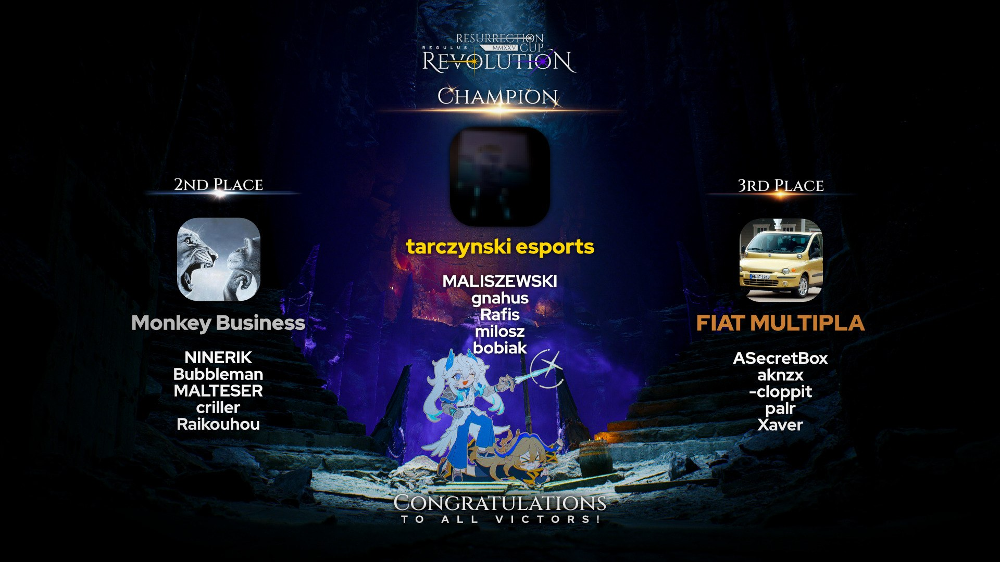

---
tags:
  - ResCup
  - Res Cup
  - Serenity
  - Regulus
  - Regulus Revolution
---

# Resurrection Cup 2025

**Resurrection Cup 2025** was a 3v3, double-elimination osu! tournament hosted by ::{ flag=HU }:: ::Phreel::{ user=12840110 } and ::{ flag=VN }:: ::Hoaq::{ user=7696512 }. It was the fourth instalment in the Resurrection Cup series. Resurrection Cup 2025 also introduced a new Resurrection Cup mascot, Regulus.

## Tournament schedule

| Event | Timestamp |
| --: | :-- |
| Registration phase | 2025-05-11/2025-06-07 |
| Qualifiers showcase | 2025-05-18 |
| Qualifiers | 2025-05-18/2025-06-07 |
| Screening phase | 2025-06-07/2025-06-14 |
| Round of 32 | 2025-06-20/2025-06-22 |
| Round of 16 | 2025-06-27/2025-06-29 |
| Quarterfinals | 2025-07-04/2025-07-06 |
| Semifinals | 2025-07-11/2025-07-13 |
| Finals | 2025-07-18/2025-07-20 |
| Grand Finals | 2025-07-25/2025-07-27 |

## Prizes

| Placing | Prize(s) |
| :-: | :-- |
|  | 40% of the prize pool, unique profile badge (pending), 6 months of osu!supporter, Wooting UwU, exclusive profile banner |
|  | 35% of the prize pool, 4 months of osu!supporter, exclusive profile banner |
|  | 25% of the prize pool, exclusive profile banner |
| "4th place" | Exclusive profile banner |

## Organisation

| Position | Member(s) |
| :-- | :-- |
| Lead organisers | ::{ flag=VN }:: ::Hoaq::{ user=7696512 }, ::{ flag=HU }:: ::Phreel::{ user=12840110 } |
| Mappool quality assurance | ::{ flag=DE }:: ::-Haruki::{ user=3673149 }, ::{ flag=CA }:: ::darkos::{ user=5969271 }, ::{ flag=RU }:: ::Daycore::{ user=5596337 }, ::{ flag=RU }:: ::girltekk::{ user=6248691 }, ::{ flag=RO }:: ::Luminous Sky::{ user=4429612 }, ::{ flag=FR }:: ::Mimiliaa::{ user=7117621 }, ::{ flag=HU }:: ::Phreel::{ user=12840110 }, ::{ flag=FR }:: ::Yumerios::{ user=11681430 } |
| Sound team | ::{ flag=US }:: ::eili::{ user=37455438 }, ::{ flag=DE }:: ::Krimek::{ user=2345078 }, ::{ flag=US }:: ::Xyris::{ user=11246193 } |
| Lead GFX (2D) | ::{ flag=PH }:: ::OsuMe65::{ user=852867 } |
| Lead GFX (3D) | ::{ flag=ID }:: ::LenLitchu::{ user=34098325 } |
| Social media management | ::{ flag=VN }:: ::BCraftMG::{ user=13456818 } |
| Storyboarders | ::{ flag=US }:: ::binarie::{ user=15632854 }, ::{ flag=VN }:: ::Ningguang::{ user=8500334 }, ::{ flag=TH }:: ::Zuika::{ user=10222009 } |
| Animation designers | ::{ flag=ID }:: ::LenLitchu::{ user=34098325 }, ::{ flag=SG }:: ::Polytetral::{ user=8612061 }, ::{ flag=US }:: ::Secondoverthree::{ user=13432062 }, ::{ flag=SG }:: ::sugosugiii::{ user=15118952 }, ::{ flag=MY }:: [The Chronoa Atelier](https://chronoaatelier.carrd.co/), ::{ flag=SG }:: ::TheFunk::{ user=13981991 }, ::{ flag=HK }:: [Transendium](https://transendium.carrd.co) |
| Illustrators | ::{ flag=CN }:: ::AlexDunk::{ user=9194799 }, ::{ flag=VN }:: [BLISS](https://linktr.ee/blllss), ::{ flag=ID }:: [dezic](https://x.com/atashisamasora), ::{ flag=DE }:: ::ERA Aracium::{ user=15882740 }, ::{ flag=FR }:: ::Mimiliaa::{ user=7117621 }, ::{ flag=ID }:: [Minerva Rin](https://x.com/minerva_rin), ::{ flag=PH }:: [MM](https://twitter.com/_MMetc_), ::{ flag=MY }:: ::mochasan_::{ user=23804364 }, ::{ flag=PH }:: ::OsuMe65::{ user=852867 }, ::{ flag=SG }:: ::Polytetral::{ user=8612061 }, ::{ flag=TH }:: ::Raytoly::{ user=8121109 }, ::{ flag=US }:: ::sh0wtime::{ user=30007083 }, ::{ flag=PH }:: [shiej007](https://linktr.ee/shiej007), ::{ flag=ID }:: [sorasignature](https://solo.to/sorasignature), ::{ flag=ID }:: [TAKADA](https://takada.works/), ::{ flag=NL }:: [Wsx](https://wsx.moe/), ::{ flag=HU }:: [Yumeyo](https://x.com/Yumeyo_art), ::{ flag=MY }:: ::Z419::{ user=9912966 } |
| Developers | ::{ flag=VN }:: ::ANON TOKYO::{ user=8266808 }, ::{ flag=VN }:: ::Hoaq::{ user=7696512 }, ::{ flag=VN }:: ::Ningguang::{ user=8500334 } |
| Mappers | ::{ flag=DE }:: ::-eNVy-::{ user=10632422 }, ::{ flag=VN }:: ::-Eresh::{ user=7605060 }, ::{ flag=GB }:: ::-jordan-::{ user=7288862 }, ::{ flag=TW }:: ::9ami::{ user=1499997 }, ::{ flag=BY }:: ::AirinCat::{ user=11119539 }, ::{ flag=RU }:: ::aiyoko::{ user=12357714 }, ::{ flag=HK }:: ::Arushii::{ user=15664628 }, ::{ flag=US }:: ::Axarious::{ user=2614511 }, ::{ flag=ID }:: ::Azasapag::{ user=18347666 }, ::{ flag=CA }:: ::bad kitten::{ user=13875116 }, ::{ flag=DE }:: ::Bazuso::{ user=11726139 }, ::{ flag=FR }:: ::Blacky Design::{ user=11540165 }, ::{ flag=US }:: ::Booliix::{ user=17516640 }, ::{ flag=US }:: ::captin1::{ user=689997 }, ::{ flag=US }:: ::Castiello::{ user=15369635 }, ::{ flag=DE }:: ::Celektus::{ user=4294993 }, ::{ flag=MY }:: ::Charlotte Teo::{ user=11730480 }, ::{ flag=DE }:: ::Chris Jasorka::{ user=2355080 }, ::{ flag=ID }:: ::Ciyus Miapah::{ user=2805457 }, ::{ flag=NL }:: ::CMeFly::{ user=12195391 }, ::{ flag=HK }:: ::Cocoyu::{ user=20101640 }, ::{ flag=CA }:: ::Creepattack::{ user=12626424 }, ::{ flag=RU }:: ::Daycore::{ user=5596337 }, ::{ flag=JP }:: ::dectopia::{ user=2845904 }, ::{ flag=VN }:: ::Ducky-::{ user=9351565 }, ::{ flag=CN }:: ::fanzhen0019::{ user=418699 }, ::{ flag=PH }:: ::flake::{ user=7627157 }, ::{ flag=PH }:: ::Flame Haze::{ user=8922155 }, ::{ flag=CN }:: ::Garden::{ user=2849992 }, ::{ flag=RU }:: ::girltekk::{ user=6248691 }, ::{ flag=GB }:: ::h1dron::{ user=21455391 }, ::{ flag=RU }:: ::IntegerTempest::{ user=10301398 }, ::{ flag=UK }:: ::Judge1st::{ user=10610737 }, ::{ flag=CH }:: ::Kayamori Ruka::{ user=14227494 }, ::{ flag=TW }:: ::knowledgeking::{ user=8022517 }, ::{ flag=PT }:: ::kowari::{ user=5404892 }, ::{ flag=DE }:: ::Krimek::{ user=2345078 }, ::{ flag=HK }:: ::Kurashina Asuka::{ user=7476493 }, ::{ flag=FI }:: ::Lako::{ user=2906436 }, ::{ flag=PH }:: ::LeCandy::{ user=6626249 }, ::{ flag=FI }:: ::lewski::{ user=4980738 }, ::{ flag=KZ }:: ::Lightin::{ user=7595619 }, ::{ flag=US }:: ::Local Hero::{ user=16134122 }, ::{ flag=GB }:: ::Log Off Now::{ user=4378277 }, ::{ flag=BR }:: ::maot::{ user=3914271 }, ::{ flag=TW }:: ::Matsuyuki Ame::{ user=12763959 }, ::{ flag=FR }:: ::Mimiliaa::{ user=7117621 }, ::{ flag=NZ }:: ::moph::{ user=2233878 }, ::{ flag=TW }:: ::Muchin::{ user=9834516 }, ::{ flag=TH }:: ::NekoShabeta::{ user=12017880 }, ::{ flag=ZA }:: ::Night Mare::{ user=11370251 }, ::{ flag=FR }:: ::Nozhomi::{ user=2716981 }, ::{ flag=FR }:: ::Nozuchi::{ user=5858447 }, ::{ flag=US }:: ::nuclei::{ user=25134566 }, ::{ flag=DE }:: ::Okoayu::{ user=1623405 }, ::{ flag=TR }:: ::Orkay::{ user=9321674 }, ::{ flag=DE }:: ::Pho::{ user=3624692 }, ::{ flag=TW }:: ::Plus4j::{ user=4086497 }, ::{ flag=TH }:: ::quantumvortex::{ user=10660777 }, ::{ flag=AU }:: ::ralsricat::{ user=12318332 }, ::{ flag=US }:: ::Rozemyne::{ user=10332253 }, ::{ flag=SG }:: ::Rtyzen::{ user=2439822 }, ::{ flag=SE }:: ::Saten::{ user=444506 }, ::{ flag=ID }:: ::Shurelia::{ user=3807986 }, ::{ flag=US }:: ::SkyFlame::{ user=3552948 }, ::{ flag=JP }:: ::Soraka::{ user=16711065 }, ::{ flag=TW }:: ::TNTlealu::{ user=9502522 }, ::{ flag=US }:: ::Tycani::{ user=6693266 }, ::{ flag=TH }:: ::Typ4::{ user=6902361 }, ::{ flag=IL }:: ::Urition::{ user=19111992 }, ::{ flag=US }:: ::Vermasium::{ user=11106442 }, ::{ flag=PH }:: ::xidorn::{ user=7904667 }, ::{ flag=AU }:: ::xLolicore-::{ user=4525153 }, ::{ flag=BE }:: ::yaspo::{ user=4945926 }, ::{ flag=FR }:: ::Yumerios::{ user=11681430 } |
| Hitsounders | ::{ flag=VN }:: ::-Eresh::{ user=7605060 }, ::{ flag=GB }:: ::-jordan-::{ user=7288862 }, ::{ flag=VN }:: ::Ducky-::{ user=9351565 }, ::{ flag=CN }:: ::Garden::{ user=2849992 }, ::{ flag=MY }:: ::Mahiru Shiina::{ user=13866023 }, ::{ flag=PH }:: ::midorijeon::{ user=10969875 }, ::{ flag=US }:: ::Vermasium::{ user=11106442 } |
| Playtesters | ::{ flag=DE }:: ::Anroyz::{ user=1818573 }, ::{ flag=US }:: ::ChillierPear::{ user=9501251 }, ::{ flag=CA }:: ::chiv::{ user=6701656 }, ::{ flag=JP }:: ::dectopia::{ user=2845904 }, ::{ flag=PL }:: ::eniu::{ user=5472693 }, ::{ flag=HU }:: ::gecseboti::{ user=15213139 }, ::{ flag=JP }:: ::haga1115::{ user=6574823 }, ::{ flag=US }:: ::John Taco Bell::{ user=9536345 }, ::{ flag=JP }:: ::KonKonKinakoN::{ user=4733185 }, ::{ flag=FR }:: ::Lexonox::{ user=7640581 }, ::{ flag=CL }:: ::M I S O::{ user=7701428 }, ::{ flag=RU }:: ::Markrum::{ user=11854446 }, ::{ flag=BE }:: ::MimiliaaMyMommy::{ user=3695504 }, ::{ flag=RU }:: ::Myp4uk::{ user=7804244 }, ::{ flag=NL }:: ::niqht::{ user=14390731 }, ::{ flag=US }:: ::plee::{ user=12231397 } |
| Referees | ::{ flag=VN }:: ::--Glitchy--::{ user=30644569 }, ::{ flag=VN }:: ::[-Ebgula-]::{ user=28738069 }, ::{ flag=US }:: ::affirmedcheese::{ user=21002718 }, ::{ flag=NL }:: ::Albionthegreat::{ user=9853595 }, ::{ flag=FI }:: ::AnjoK::{ user=9220667 }, ::{ flag=CL }:: ::Bastaku::{ user=14351782 }, ::{ flag=KR }:: ::Discord::{ user=16194858 }, ::{ flag=SE }:: ::ellen-::{ user=7630166 }, ::{ flag=CA }:: ::my angel nakuru::{ user=23542329 }, ::{ flag=VN }:: ::Poity::{ user=17148657 }, ::{ flag=HU }:: ::raven_waffles::{ user=18690280 }, ::{ flag=DE }:: ::real cute::{ user=9172811 }, ::{ flag=RU }:: ::RobotSkin_::{ user=13820038 }, ::{ flag=CN }:: ::Rush_FTK::{ user=3046856 }, ::{ flag=CO }:: ::ShiruoX::{ user=15173398 }, ::{ flag=RU }:: ::ThatAvocado_Boi::{ user=17118441 } |
| Streamers | ::{ flag=VN }:: ::- Fubukiii::{ user=9931217 }, ::{ flag=US }:: ::affirmedcheese::{ user=21002718 }, ::{ flag=CL }:: ::Bastaku::{ user=14351782 }, ::{ flag=CA }:: ::D I O::{ user=3958619 }, ::{ flag=PL }:: ::flapczek::{ user=8210988 }, ::{ flag=VN }:: ::Hoaq::{ user=7696512 }, ::{ flag=GB }:: ::ilw8::{ user=14167692 }, ::{ flag=AU }:: ::Knightcakes::{ user=6992079 }, ::{ flag=HU }:: ::Phreel::{ user=12840110 }, ::{ flag=CN }:: ::Rush_FTK::{ user=3046856 }, ::{ flag=VN }:: ::SIay::{ user=9587896 }, ::{ flag=GB }:: ::SSScotty::{ user=10319851 }, ::{ flag=RU }:: ::ThatAvocado_Boi::{ user=17118441 } |
| Commentators | ::{ flag=CA }:: ::- Juno -::{ user=6518510 }, ::{ flag=US }:: ::affirmedcheese::{ user=21002718 }, ::{ flag=ID }:: ::BlankTap::{ user=10137131 }, ::{ flag=NL }:: ::cavoeboy::{ user=7361815 }, ::{ flag=US }:: ::ChillierPear::{ user=9501251 }, ::{ flag=CA }:: ::D I O::{ user=3958619 }, ::{ flag=GB }:: ::Ethereal_Winter::{ user=9780417 }, ::{ flag=CA }:: ::ExiaXD::{ user=17241883 }, ::{ flag=US }:: ::fieryrage::{ user=3533958 }, ::{ flag=CA }:: ::I-Flame::{ user=11257542 }, ::{ flag=DE }:: ::Krimek::{ user=2345078 }, ::{ flag=RO }:: ::Luminous Sky::{ user=4429612 }, ::{ flag=AU }:: ::Mavs::{ user=11076938 }, ::{ flag=HU }:: ::Phreel::{ user=12840110 }, ::{ flag=GB }:: ::SadShiba::{ user=10747626 }, ::{ flag=GB }:: ::SparklyFairy900::{ user=31547675 }, ::{ flag=FR }:: ::Subaru_Arima::{ user=11273062 }, ::{ flag=US }:: ::Tycani::{ user=6693266 }, ::{ flag=AU }:: ::Vordi::{ user=6659116 } |

## Links

- [Website](https://rescup.xyz/)
- [Announcement post](https://osu.ppy.sh/home/news/2025-05-11-resurrection-cup-2025-registrations-now-open)
- [Discussion thread](https://osu.ppy.sh/community/forums/topics/2076778)
- [Discord server](https://discord.gg/UNzyfgGfeu)
- [Livestream](https://www.twitch.tv/resurrectioncup)
- [YouTube](https://www.youtube.com/channel/UCtdowLBk7An_UlvtTKrYl0w)
- [Tournament bracket](https://challonge.com/RESC25)

## Participants

| Seed | Team | Members |
| :-- | :-: | :-- |
| 1 | **Monkey Business** | ::{ flag=NO }:: **::NINERIK::{ user=10549880 }**, ::{ flag=GB }:: ::Bubbleman::{ user=5182050 }, ::{ flag=GB }:: ::MALTESER::{ user=5218178 }, ::{ flag=DE }:: ::criller::{ user=8116659 }, ::{ flag=TR }:: ::Raikouhou::{ user=8007528 } |
| 2 | **tarczynski esports** | ::{ flag=PL }:: **::MALISZEWSKI::{ user=12408961 }**, ::{ flag=PL }:: ::gnahus::{ user=12779141 }, ::{ flag=PL }:: ::Rafis::{ user=2558286 }, ::{ flag=PL }:: ::milosz::{ user=13108233 }, ::{ flag=PL }:: ::bobiak::{ user=13003230 } |
| 3 | **FIAT MULTIPLA** | ::{ flag=AU }:: **::ASecretBox::{ user=7341183 }**, ::{ flag=AU }:: ::aknzx::{ user=9938943 }, ::{ flag=AU }:: ::-cloppit::{ user=19851850 }, ::{ flag=AU }:: ::palr::{ user=15429006 }, ::{ flag=AU }:: ::Xaver::{ user=7410343 } |
| 4 | **freeonlinetranslator** | ::{ flag=GB }:: **::synoxa::{ user=10333154 }**, ::{ flag=RU }:: ::Lexu3S::{ user=11552867 }, ::{ flag=RU }:: ::Lexu4S::{ user=9694263 }, ::{ flag=UA }:: ::RafGPio::{ user=13705417 }, ::{ flag=RU }:: ::Lexu2S::{ user=8251785 } |
| 5 | **chopped chuds** | ::{ flag=CA }:: **::caleb suh::{ user=20761711 }**, ::{ flag=US }:: ::decaten::{ user=5645231 }, ::{ flag=US }:: ::hotdog2000::{ user=11269055 }, ::{ flag=US }:: ::bunnylikemoney::{ user=14215850 }, ::{ flag=US }:: ::bored yes::{ user=21207816 } |
| 6 | **us on a train** | ::{ flag=GB }:: **::rudj::{ user=11592896 }**, ::{ flag=GB }:: ::Plasma::{ user=10077431 }, ::{ flag=GB }:: ::Mahmood::{ user=7627844 }, ::{ flag=GB }:: ::skiatzo::{ user=16774872 }, ::{ flag=GB }:: ::HAUNTE::{ user=7333471 } |
| 7 | **The Joseon Dynasty** | ::{ flag=US }:: **::WindowWife::{ user=7813296 }**, ::{ flag=US }:: ::toybot::{ user=2848604 }, ::{ flag=US }:: ::costco hotdog::{ user=9507565 }, ::{ flag=US }:: ::BoshyMan741::{ user=4830687 }, ::{ flag=US }:: ::Jakson::{ user=8788058 } |
| 8 | **plz enjoy mcy4** | ::{ flag=HK }:: **::mcy4::{ user=2165650 }**, ::{ flag=CN }:: ::FcEazy::{ user=7825227 }, ::{ flag=HK }:: ::stllok::{ user=14817468 }, ::{ flag=CN }:: ::lolol235::{ user=6090175 }, ::{ flag=HK }:: ::misha awa::{ user=14503423 } |
| 9 | **uncs and neph** | ::{ flag=FR }:: **::fiaee::{ user=10325072 }**, ::{ flag=PL }:: ::Eirra::{ user=3493804 }, ::{ flag=ES }:: ::A L E P H::{ user=6735738 }, ::{ flag=FR }:: ::JapWhite::{ user=7068158 }, ::{ flag=RO }:: ::Kehest::{ user=6145000 } |
| 10 | **Dadunai** | ::{ flag=CN }:: **::z980838928::{ user=1355695 }**, ::{ flag=CN }:: ::Crystal::{ user=1646397 }, ::{ flag=CN }:: ::lolol233::{ user=11375105 }, ::{ flag=CN }:: ::lolol234::{ user=5791401 }, ::{ flag=CN }:: ::Ledeau_Fox::{ user=15816872 } |
| 11 | **Waddle Dee** | ::{ flag=CA }:: **::Birchman::{ user=10676573 }**, ::{ flag=CA }:: ::Saryi::{ user=10051720 }, ::{ flag=CA }:: ::Tsfury::{ user=12258658 }, ::{ flag=CA }:: ::ploot::{ user=7802400 }, ::{ flag=CA }:: ::PikaPwn::{ user=2012453 } |
| 12 | **Corsace Open 2024** | ::{ flag=DE }:: **::stellasu::{ user=8508931 }**, ::{ flag=DE }:: ::-Shrek::{ user=10858131 }, ::{ flag=DE }:: ::aahoff::{ user=11371245 }, ::{ flag=DE }:: ::-lion::{ user=24270105 }, ::{ flag=ES }:: ::ESCRUPULILLO::{ user=18217876 } |
| 13 | **Waddle Doo** | ::{ flag=CA }:: **::Zylice::{ user=5033077 }**, ::{ flag=US }:: ::Flameztear::{ user=13207763 }, ::{ flag=CA }:: ::Genryuu Kaiko::{ user=2758279 }, ::{ flag=CA }:: ::karate::{ user=8666950 }, ::{ flag=CA }:: ::noncycle::{ user=12701607 } |
| 14 | **nugroho and co** | ::{ flag=ID }:: **::GNX::{ user=10069909 }**, ::{ flag=MN }:: ::seegii::{ user=4659319 }, ::{ flag=PH }:: ::NathanRam1918::{ user=4734703 }, ::{ flag=ID }:: ::salt and honey::{ user=8688737 }, ::{ flag=TW }:: ::Ruyaya::{ user=16288992 } |
| 15 | **EMPICONES** | ::{ flag=CL }:: **::Siiphs::{ user=11786864 }**, ::{ flag=CL }:: ::tfge::{ user=11207004 }, ::{ flag=US }:: ::Godskin Noble::{ user=10651106 }, ::{ flag=CL }:: ::suntanCTM::{ user=19998548 }, ::{ flag=CL }:: ::Hellbeak::{ user=2367495 } |
| 16 | **esnupicore** | ::{ flag=BR }:: **::-izzy::{ user=15225729 }**, ::{ flag=BR }:: ::Coreanmaluco::{ user=3149577 }, ::{ flag=BR }:: ::Nyash::{ user=12976255 }, ::{ flag=BR }:: ::Kurumiw::{ user=11415687 }, ::{ flag=BR }:: ::shwq::{ user=22536015 } |
| 17 | **manie pls spaRE ME** | ::{ flag=BE }:: **::Hanori::{ user=7078544 }**, ::{ flag=NL }:: ::Manievat::{ user=6744123 }, ::{ flag=BE }:: ::hexi::{ user=10760701 }, ::{ flag=DK }:: ::autofister::{ user=11380904 }, ::{ flag=FR }:: ::Hifkil::{ user=4301976 } |
| 18 | **BBrazilian Luffy** | ::{ flag=US }:: **::hotdog1000::{ user=8082362 }**, ::{ flag=PE }:: ::[MG]Arnold24x24::{ user=2291265 }, ::{ flag=US }:: ::hotdog3000::{ user=12904237 }, ::{ flag=CL }:: ::alfiu::{ user=17724014 }, ::{ flag=US }:: ::TTv_UFO::{ user=14676719 } |
| 19 | **Grease Monkey EU1** | ::{ flag=NO }:: **::Melvr::{ user=9211924 }**, ::{ flag=NO }:: ::Pinguinzi::{ user=9414229 }, ::{ flag=DE }:: ::SERBIATRUCKER13::{ user=15339747 }, ::{ flag=NO }:: ::HUNDUR::{ user=3145033 }, ::{ flag=NO }:: ::antonyw::{ user=12959983 } |
| 20 | **Grease Monkey EU2** | ::{ flag=NO }:: **::nanolini::{ user=12353810 }**, ::{ flag=HU }:: ::defii::{ user=8698024 }, ::{ flag=RU }:: ::maxim::{ user=9459674 }, ::{ flag=PL }:: ::eniu::{ user=5472693 }, ::{ flag=SE }:: ::trumpatino69::{ user=10903510 } |
| 21 | **jeon fan club** | ::{ flag=US }:: **::nuclear bomb::{ user=16085078 }**, ::{ flag=BR }:: ::kagiura::{ user=11461810 }, ::{ flag=US }:: ::rinse::{ user=11962818 }, ::{ flag=US }:: ::RyooYamada::{ user=9896317 }, ::{ flag=US }:: ::orngoos::{ user=20250190 } |
| 22 | **CHICKEN BIG** | ::{ flag=US }:: **::kittencert::{ user=12522447 }**, ::{ flag=US }:: ::Emerald Ages::{ user=10224047 }, ::{ flag=US }:: ::Indiana::{ user=12967296 }, ::{ flag=US }:: ::Crestive::{ user=10909049 }, ::{ flag=US }:: ::gilgamesh815::{ user=14040810 } |
| 23 | **Nation** | ::{ flag=FI }:: **::Nev-::{ user=11836334 }**, ::{ flag=FI }:: ::savilju::{ user=8059468 }, ::{ flag=FI }:: ::nemq::{ user=11644972 }, ::{ flag=FI }:: ::Eevert::{ user=12080544 }, ::{ flag=FI }:: ::Isak-::{ user=8702650 } |
| 24 | **Gatoland** | ::{ flag=BR }:: **::monte::{ user=10077132 }**, ::{ flag=BR }:: ::VitorSkull::{ user=10223298 }, ::{ flag=BR }:: ::Lirumin::{ user=15274893 }, ::{ flag=CL }:: ::nekore::{ user=18946207 }, ::{ flag=CL }:: ::iisobeyan::{ user=14264961 } |
| 25 | **i ran out of ideas** | ::{ flag=SG }:: **::Dawnwing::{ user=5144534 }**, ::{ flag=SG }:: ::Tebi::{ user=5407620 }, ::{ flag=SG }:: ::GSBlank::{ user=2312106 }, ::{ flag=ID }:: ::AjitaniHifumi::{ user=10717635 }, ::{ flag=SG }:: ::hollowknees::{ user=15195364 } |
| 26 | **CatBurger** | ::{ flag=US }:: **::Joyi::{ user=12776754 }**, ::{ flag=US }:: ::LightsOut::{ user=8581210 }, ::{ flag=US }:: ::Belladonna::{ user=11758404 }, ::{ flag=US }:: ::hubbawubba::{ user=15910288 }, ::{ flag=US }:: ::xymbii::{ user=10809844 } |
| 27 | **zavoevatel1941** | ::{ flag=RU }:: **::vljoy209::{ user=16870029 }**, ::{ flag=RU }:: ::Suzuha::{ user=8445602 }, ::{ flag=RU }:: ::Endura::{ user=7774197 }, ::{ flag=RU }:: ::11iq pleer::{ user=13206785 }, ::{ flag=KG }:: ::ded24lol::{ user=14795251 } |
| 28 | **to be determined** | ::{ flag=IT }:: **::ILBOSSDELPOPPIN::{ user=13925698 }**, ::{ flag=IT }:: ::bgm16::{ user=11476143 }, ::{ flag=PL }:: ::Tartis::{ user=9513980 }, ::{ flag=NL }:: ::Aheo::{ user=14919428 }, ::{ flag=IT }:: ::MeOwz::{ user=17446380 } |
| 29 | **insurance agency** | ::{ flag=GB }:: **::vonneti::{ user=18488132 }**, ::{ flag=GB }:: ::Mystrality::{ user=14452800 }, ::{ flag=PL }:: ::squarem::{ user=4740837 }, ::{ flag=GB }:: ::Vagabond::{ user=10702366 }, ::{ flag=DE }:: ::vin::{ user=13223964 } |
| 30 | **shmiglya** | ::{ flag=RU }:: **::KOCT9H::{ user=6585939 }**, ::{ flag=RU }:: ::DaHuJka::{ user=6830745 }, ::{ flag=RU }:: ::fedotoff::{ user=7351448 }, ::{ flag=RU }:: ::GodRoPoNiKa::{ user=11195861 }, ::{ flag=RU }:: ::reimia::{ user=11243772 } |
| 31 | **Piche land** | ::{ flag=CA }:: **::ExiaXD::{ user=17241883 }**, ::{ flag=CA }:: ::teznin::{ user=13857674 }, ::{ flag=CA }:: ::fireblaze3028::{ user=9088637 }, ::{ flag=CA }:: ::zebedee::{ user=10622808 }, ::{ flag=CA }:: ::PinkEyeFan2013::{ user=13609904 } |
| 32 | **Hetzer Corp** | ::{ flag=PH }:: **::vdc::{ user=5315077 }**, ::{ flag=PH }:: ::Hetzer357::{ user=22690359 }, ::{ flag=PH }:: ::ZaNy_::{ user=12254421 }, ::{ flag=PH }:: ::_Chonker::{ user=13858963 }, ::{ flag=PH }:: ::Jitterish::{ user=16940378 } |

## Podium

This competition has come to an end and resulted in the following podium:

| Placing | Team |
| :-: | :-- |
|  | **tarczynski esports** (::{ flag=PL }:: **::MALISZEWSKI::{ user=12408961 }**, ::{ flag=PL }:: ::gnahus::{ user=12779141 }, ::{ flag=PL }:: ::Rafis::{ user=2558286 }, ::{ flag=PL }:: ::milosz::{ user=13108233 }, ::{ flag=PL }:: ::bobiak::{ user=13003230 }) |
|  | **Monkey Business** (::{ flag=NO }:: **::NINERIK::{ user=10549880 }**, ::{ flag=GB }:: ::Bubbleman::{ user=5182050 }, ::{ flag=GB }:: ::MALTESER::{ user=5218178 }, ::{ flag=DE }:: ::criller::{ user=8116659 }, ::{ flag=TR }:: ::Raikouhou::{ user=8007528 }) |
|  | **FIAT MULTIPLA** (::{ flag=AU }:: **::ASecretBox::{ user=7341183 }**, ::{ flag=AU }:: ::aknzx::{ user=9938943 }, ::{ flag=AU }:: ::-cloppit::{ user=19851850 }, ::{ flag=AU }:: ::palr::{ user=15429006 }, ::{ flag=AU }:: ::Xaver::{ user=7410343 }) |

## Mappools

### Grand Finals

- No Mod
  1. [Mia REGINA - I got it! (7_7 bootleg) (NekoShabeta) [You got it!]](https://osu.ppy.sh/beatmapsets/2414062#osu/5244782)
  2. [SiLiS - ascended ~Kishi Kaisei~ (Vermasium) [Kurayami]](https://osu.ppy.sh/beatmapsets/2414046#osu/5244740)
  3. [Tsukuyomi - Narrative (Lyvai) [Vanya's insert cool diffname]](https://osu.ppy.sh/beatmapsets/2336032#osu/5024809)
  4. [Sot-C - TAKE THIS GUN LOL (Arushii) [TAKE THIS NM4 LOL]](https://osu.ppy.sh/beatmapsets/2414066#osu/5244796)
  5. [SDMNE - XTRiNSiXA (Nozuchi) [Empyrean]](https://osu.ppy.sh/beatmapsets/2414311#osu/5245464)
- Hidden
  1. [ELFENSJoN - INHERIT (darkos) [BUFFED]](https://osu.ppy.sh/beatmapsets/2414149#osu/5245068)
  2. [Shokii - 2BAD (alvearia) [EXTRA]](https://osu.ppy.sh/beatmapsets/2414017#osu/5244679)
  3. [Renard - Terminal (Axarious) [Challenge]](https://osu.ppy.sh/beatmapsets/2414185#osu/5245140)
- Hard Rock
  1. [Krimek & enva - Jiyuu no Koe (Castiello) [Fading out dreams (Rescup Ver.)]](https://osu.ppy.sh/beatmapsets/2414021#osu/5244684)
  2. [ak+q - Excelsia (Wispy) [Excalibur]](https://osu.ppy.sh/beatmapsets/2347913#osu/5086956)
  3. [Pirendora - Pyroclastic Flow (TNTlealu) [Indestructible]](https://osu.ppy.sh/beatmapsets/2414026#osu/5244695)
- Double Time
  1. [High Contrast (feat. Selah Corbin) - The Agony & The Ecstasy (kowari) [Sorrow (ResCup ver.)]](https://osu.ppy.sh/beatmapsets/2414092#osu/5244932)
  2. [Tomita Miyu, Sasahara Yuu, Lynn, Waki Azumi - +Kyuutie Ladies+ (nenpulse bootleg remix) (IU1) [Chu Chu Chu!]](https://osu.ppy.sh/beatmapsets/1688324#osu/3454680)
  3. [ReoNa - JAMMER ([Karcher]) [Collab Expert]](https://osu.ppy.sh/beatmapsets/1975461#osu/4110850)
  4. [Es - No Name (Shurelia) [Yearning]](https://osu.ppy.sh/beatmapsets/2188281#osu/4665432)
- Free Mod
  1. [Meshuggah - Combustion (quantumvortex) [Explosive]](https://osu.ppy.sh/beatmapsets/2414035#osu/5244712)
  2. [Ardolf feat. eili - Astralith (xidorn) [ICHORRHAGE]](https://osu.ppy.sh/beatmapsets/2414039#osu/5244719)
  3. [VINXIS - FALL (yaspo) [Anxiety]](https://osu.ppy.sh/beatmapsets/1581340#osu/3229041)
  4. [XenjeS - Temple of Technology (ralsricat) [Inscryption]](https://osu.ppy.sh/beatmapsets/2414041#osu/5244723)
- Tiebreaker
  1. **[Xyris & Kagetora. feat. Ethereal_Winter - Rigid Memory (Yumerios) [Memories of Our Times]](https://osu.ppy.sh/beatmapsets/2414048#osu/5244748)**

### Finals

- No Mod
  1. [ELFENSJoN - ZENITH (Soraka) [NM1]](https://osu.ppy.sh/beatmapsets/2404031#osu/5214742)
  2. [rN feat. eili - Enneagrammatos (Ciyus Miapah) [IX]](https://osu.ppy.sh/beatmapsets/2403899#osu/5214103)
  3. [konoco - Sono Hana wa Shougai de Mottomo Imaimashiku Jama datta. (Lunacy_) [Babel]](https://osu.ppy.sh/beatmapsets/2024601#osu/4217520)
  4. [cexiria - Bypass the Dimension (Pho) [Hyperspace Drift]](https://osu.ppy.sh/beatmapsets/2403883#osu/5214009)
  5. [coul - sleep well, i love you, my dear. (Hoaq) [x]](https://osu.ppy.sh/beatmapsets/2404714#osu/5216647)
- Hidden
  1. [lical - Gunjou-teki Shuumatsu-ron (h1dron) [Normal]](https://osu.ppy.sh/beatmapsets/2403945#osu/5214265)
  2. [Chaos City Niigata - Ebicha no Shashin-ki ([Boy]DaLat) [machine]](https://osu.ppy.sh/beatmapsets/1878940#osu/3868007)
  3. [Xeven as \_OdiN\_ - Ouroboros (girltekk) [??. Sensation of Neverending Bloodbath]](https://osu.ppy.sh/beatmapsets/2403914#osu/5214141)
- Hard Rock
  1. [Shintani Ryoko - Wonderful World (Kayamori Ruka) [Everlasting]](https://osu.ppy.sh/beatmapsets/2403904#osu/5214110)
  2. [Essbee - EstRa (Kayamori Ruka) [ExtRa]](https://osu.ppy.sh/beatmapsets/2403902#osu/5214107)
  3. [Sh0wtime & Redsign - CHIMERA (Celektus) [Virtuoso]](https://osu.ppy.sh/beatmapsets/2403939#osu/5214242)
- Double Time
  1. [lino - Universe (Log Off Now) [Extra]](https://osu.ppy.sh/beatmapsets/1864549#osu/3854365)
  2. [Mitsuki Nakae - Ouka Enbu (Lasse) [Mirash's Extra]](https://osu.ppy.sh/beatmapsets/688552#osu/1461594)
  3. [Xi - Densetsu no Sabori Shinigami ~ Make a quick escape (Toumei Dragon) [Athanasia's Extra]](https://osu.ppy.sh/beatmapsets/1621473#osu/4853510)
  4. [GFRIEND - ROUGH (Seolv) [HERAZU'S EXTRA]](https://osu.ppy.sh/beatmapsets/2340942#osu/5087809)
- Free Mod
  1. [THE BEAT WIZARD - cthulhu ruined my sandcastle so i threw sand at its face (xLolicore-) [HUH]](https://osu.ppy.sh/beatmapsets/2403918#osu/5214179)
  2. [Yousei Teikoku - Wisdom (Saten) [Truth of Wisdom]](https://osu.ppy.sh/beatmapsets/2404053#osu/5214778)
  3. [Hiiragi Magnetite - Tetoris (Antares-) [.:. :.. ::]](https://osu.ppy.sh/beatmapsets/2304584#osu/4926580)
  4. [airlemoneX - lanthanide (-jordan-) [Nd(C5H7O2)3]](https://osu.ppy.sh/beatmapsets/2403917#osu/5214177)
- Tiebreaker
  1. **[Krimek - Ashen Souls (feat. eili & AKA) (Krimek) [Embers of Eternity]](https://osu.ppy.sh/beatmapsets/2403912#osu/5214139)**

### Semifinals

- No Mod
  1. [Nanaki feat.GUMI - Mousou Kajitsu (alden) [dilf]](https://osu.ppy.sh/beatmapsets/1706903#osu/3487772)
  2. [In Victory - Reaching Eternity (Urition) [Unity]](https://osu.ppy.sh/beatmapsets/2399886#osu/5202134)
  3. [MAXIMUM THE HORMONE - What's up, people?! (moph) [FLOPH'S KEIKAKU]](https://osu.ppy.sh/beatmapsets/2400055#osu/5202862)
  4. [AXiS as "EQUiON" - Intercosmic (Chris Jasorka) [HyperSphere]](https://osu.ppy.sh/beatmapsets/2399887#osu/5202135)
  5. [ptasinski, Dante Swan, RJ Pasin - double take (Daycore) [retry (tournament ver.)]](https://osu.ppy.sh/beatmapsets/2399911#osu/5202203)
- Hidden
  1. [Dance Gavin Dance - Son of Robot (Lightin) [Its The Way That She Combs My Hair]](https://osu.ppy.sh/beatmapsets/2399922#osu/5202230)
  2. [Noah - Bizarre Blaze (Azasapag) [Chencraft]](https://osu.ppy.sh/beatmapsets/2400136#osu/5203092)
  3. [jeko - Etheria (CMeFly) [Celestial Shift]](https://osu.ppy.sh/beatmapsets/2399902#osu/5202177)
- Hard Rock
  1. [Halestorm - Love Bites (So Do I) (-eNVy-) [Ecstasy]](https://osu.ppy.sh/beatmapsets/2278729#osu/5202183)
  2. [BEMANI Sound Team "person09" - Puberty Dysthymia (Eula-) [Extra]](https://osu.ppy.sh/beatmapsets/1529329#osu/3128330)
  3. [saaa + kei_iwata + stuv + *wakadori - New York Back Raise (Ryuusei Aika) [Collab Expert]](https://osu.ppy.sh/beatmapsets/2186413#osu/4622476)
- Double Time
  1. [ClariS - Gravity (Ayana) [Beyond]](https://osu.ppy.sh/beatmapsets/1608616#osu/3284712)
  2. [CROW'SCLAW - The Third Eye (Ducky-) [final dt2 8.1]](https://osu.ppy.sh/beatmapsets/2400120#osu/5203049)
  3. [Demetori - Shoujo Satori ~ Innumerable Eyes (228) [Lunatic]](https://osu.ppy.sh/beatmapsets/2027920#osu/4225817)
  4. [mor ve otesi - Yorma Kendini (Orkay) [Worn]](https://osu.ppy.sh/beatmapsets/2399919#osu/5202227)
- Free Mod
  1. [Camellia feat. Nanahira - Moji Code o Kakemegure! (Muchin) [U+1F495]](https://osu.ppy.sh/beatmapsets/2400003#osu/5202407)
  2. [cygnus - The Kingdom of Babylon (Local Hero) [Babel]](https://osu.ppy.sh/beatmapsets/2400117#osu/5203038)
  3. [A.SAKA - fuuga (Booliix) [Res Cup FM3]](https://osu.ppy.sh/beatmapsets/2399956#osu/5202302)
  4. [sage - Hyena Groove (Daycore) [aiyoko's Cool Hyena Fact]](https://osu.ppy.sh/beatmapsets/2400185#osu/5203304)
- Tiebreaker
  1. **[5KiLOBYTE feat. Azure - EXTINCTION (Tycani) [EVENT HORIZON]](https://osu.ppy.sh/beatmapsets/2399921#osu/5202229)**

### Quarterfinals

- No Mod
  1. [May'n - GLORY (Flame Haze) [RESURRECT THE GLORY]](https://osu.ppy.sh/beatmapsets/2395828#osu/5190008)
  2. [DJ SHARPNEL - CYBER INDUCTANCE (jellium) [1.17x]](https://osu.ppy.sh/beatmapsets/1929702#osu/3985927)
  3. [ZUTOMAYO - Stay Foolish (maot) [fool]](https://osu.ppy.sh/beatmapsets/2395793#osu/5189914)
  4. [Ulagumo - unbreakable (LeCandy) [lecandy x 9ami's collab]](https://osu.ppy.sh/beatmapsets/2395798#osu/5189922)
  5. [ptar124 & 1zm8 - A World of Whiplash When You're Interrupted by a Cutscene (Castiello) [Dual Impact]](https://osu.ppy.sh/beatmapsets/2395794#osu/5189915)
- Hidden
  1. [blobdash - ERRATIC GOD (Bazuso) [Entropic Blasphemy]](https://osu.ppy.sh/beatmapsets/2395797#osu/5189921)
  2. [Sohta - Hanakanzashi (rollpan) [Extreme]](https://osu.ppy.sh/beatmapsets/1300823#osu/4860096)
  3. [lapix ft. PANXI - Odd Lovey (Lako) [Love Syndrome]](https://osu.ppy.sh/beatmapsets/2395802#osu/5189933)
- Hard Rock
  1. [log() feat. DexcilaDou - BLACKOUT (Typ4) [ohm002]](https://osu.ppy.sh/beatmapsets/2395806#osu/5189938)
  2. [Sasuke Haraguchi feat. Kasane Teto - Igaku (Pyo) [Bazuso's Extra]](https://osu.ppy.sh/beatmapsets/2165268#osu/4674901)
  3. [Toromaru - Rebuild (Nozuchi) [Expert]](https://osu.ppy.sh/beatmapsets/2395813#osu/5189952)
- Double Time
  1. [Bambee - Sweet Little Bumble Bee (Nightcore Ver.) (yaspo) [Bee mine!]](https://osu.ppy.sh/beatmapsets/2395810#osu/5189949)
  2. [Gumyu - Touch Tap Baby (Eurobeat Mix) (Garden) [Insane]](https://osu.ppy.sh/beatmapsets/2395809#osu/5189943)
  3. [Tyrfing - Verflucht (Muya) [Hyper]](https://osu.ppy.sh/beatmapsets/965125#osu/2144183)
  4. [Houshou Marine & Kobo Kanaeru - I I I (Rozemyne) [This Night's Just Begun!]](https://osu.ppy.sh/beatmapsets/2395914#osu/5190321)
- Free Mod
  1. [Tsukuyomi - Kyuseishu (Castiello) [Misdreavus]](https://osu.ppy.sh/beatmapsets/2395817#osu/5189967)
  2. [II-L - PIONEER-1 (bob) [1958-007A]](https://osu.ppy.sh/beatmapsets/2281929#osu/4865471)
  3. [otetsu - Cosmos feat. GUMI (Okoayu) [Tourney Ver.]](https://osu.ppy.sh/beatmapsets/2395820#osu/5189975)
  4. [Isekaijoucho - Empurple (Rtyzen) [Dye]](https://osu.ppy.sh/beatmapsets/2395996#osu/5190572)
- Tiebreaker
  1. **[Drazically feat. echo - COLLUS-iON[]data (Blacky Design) [//:001011010111[]data]](https://osu.ppy.sh/beatmapsets/2395823#osu/5189991)**

### Round of 16

- No Mod
  1. [Konuko - Toumei Elegy (Flame Haze) [Tragic Resurrection]](https://osu.ppy.sh/beatmapsets/2085468#osu/5179237)
  2. [Halv - Romanesque (knowledgeking) [Eternal Hope]](https://osu.ppy.sh/beatmapsets/1627446#osu/3322513)
  3. [Nekomata Okayu - Dokuhai Swallow (Judge1st) [Deadly Poison]](https://osu.ppy.sh/beatmapsets/2392247#osu/5179205)
  4. [N_dog (feat.quu-zie) - heart break (Arushii) [:broken_heart: :wilted_rose:]](https://osu.ppy.sh/beatmapsets/2392271#osu/5179265)
- Hidden
  1. [TeKno.loji - Domain.Fragmentation (girltekk) [Resurrection]](https://osu.ppy.sh/beatmapsets/2392277#osu/5179281)
  2. [Rish feat. Choko - Paa ~PaPaPaPaa ver~ (xidorn) [pa pa pa pa papa pa]](https://osu.ppy.sh/beatmapsets/2392242#osu/5179198)
- Hard Rock
  1. [HyuN feat. LyuU - Cross Over (Skytuna) [Falling Back Into the Abyss]](https://osu.ppy.sh/beatmapsets/1209029#osu/2517295)
  2. [saradisk - 202 - Sazanami (Nozhomi) [Class Destroyer]](https://osu.ppy.sh/beatmapsets/2392261#osu/5179234)
- Double Time
  1. [Nekomata Master - Far east nightbird (kors k Remix) (jonathanlfj) [Another]](https://osu.ppy.sh/beatmapsets/144171#osu/358272)
  2. [Yunosuke - Ziqqurat (SkyFlame) [Insane]](https://osu.ppy.sh/beatmapsets/1939529#osu/4010008)
  3. [Don Omar & Lucenzo - Danza Kuduro (Aranel) [KIRBY REMix]](https://osu.ppy.sh/beatmapsets/1694554#osu/3462557)
- Free Mod
  1. [ALICESOFT - Lone Wanderer (bad kitten) [awa]](https://osu.ppy.sh/beatmapsets/2392357#osu/5179439)
  2. [XH feat. Astrea Natura - New Generation (Rescup Ver.) (Yumerios) [Remnants of a Dying Star]](https://osu.ppy.sh/beatmapsets/2392313#osu/5179341)
  3. [HOYO-MiX feat. Wink XY - ReOracle (Kurashina Asuka) [Odyssey]](https://osu.ppy.sh/beatmapsets/2392281#osu/5179285)
- Tiebreaker
  1. **[Connexio feat. Shimizu Aiyu - Silent Remorse (captin1) [Reticence]](https://osu.ppy.sh/beatmapsets/2392255#osu/5179226)**

### Round of 32

- No Mod
  1. [Wolpis Carter - Champagne Day (dectopia) [Marriage]](https://osu.ppy.sh/beatmapsets/2388221#osu/5168187)
  2. [cosMo@BousouP - Oceanus (Maot) [Nostalgic]](https://osu.ppy.sh/beatmapsets/1871924#osu/3851547)
  3. [ZUTOMAYO - Hippocampal Pain (AirinCat) [Cat]](https://osu.ppy.sh/beatmapsets/2388769#osu/5169355)
  4. [ADA - Land of the Lustrous (Celektus) [Virtuoso]](https://osu.ppy.sh/beatmapsets/2388777#osu/5169367)
- Hidden
  1. [MyGO!!!!! - KAISOU (Plus4j) [MAWARU MAWARU (Res ver.)]](https://osu.ppy.sh/beatmapsets/2388730#osu/5169234)
  2. [capitaro - Tenshinranman High Collar Hime (dakiwii) [Ix's Inner Oni]](https://osu.ppy.sh/beatmapsets/2160056#osu/4554728)
- Hard Rock
  1. [Ave Mujica - Ether (Plus4j) [This is us, Ave Mujica]](https://osu.ppy.sh/beatmapsets/2388729#osu/5169231)
  2. [trung-nova - surrounded by countless nebulae (Celektus) [Virtuoso]](https://osu.ppy.sh/beatmapsets/2388772#osu/5169359)
- Double Time
  1. [ONE OK ROCK - We are (Japanese Ver.) (Yumerios) [Hopeless]](https://osu.ppy.sh/beatmapsets/2388768#osu/5169354)
  2. [Malk De Koijn - Braget (waefwerf) [owc ver]](https://osu.ppy.sh/beatmapsets/1621901#osu/3311356)
  3. [Krimek - HyperColor (nik) [Insane]](https://osu.ppy.sh/beatmapsets/2248565#osu/4781121)
- Free Mod
  1. [MM - Gravity feat. eggu (Lightin) [Society If Apples Didn't Fall From Trees]](https://osu.ppy.sh/beatmapsets/2388798#osu/5169402)
  2. [Fexomat & SumOne - Golden Days Remix (fergas) [Sheesh]](https://osu.ppy.sh/beatmapsets/1867675#osu/3841983)
  3. [RE:VIVE - We Are RE:BELLION (girltekk) [Resurrection]](https://osu.ppy.sh/beatmapsets/2388740#osu/5169249)
- Tiebreaker
  1. **[sugosugiii feat. Ethereal_Winter - Trail Towards Home (Riverism) [Undying Hope]](https://osu.ppy.sh/beatmapsets/2388752#osu/5169325)**

### Qualifiers

- No Mod
  1. [USAO - Phalanx (Yumerios) [Frontline]](https://osu.ppy.sh/beatmapsets/2373050#osu/5123942)
  2. [Hommarju Feat. R.cena - Chousai Kenbo Sengen (-Tynamo) [Tensai]](https://osu.ppy.sh/beatmapsets/2048763#osu/4277471)
  3. [Cranky - Rave 2 Rave (Luscent) [luscent]](https://osu.ppy.sh/beatmapsets/1171058#osu/2442838)
  4. [False Noise - Hyperlight (IntegerTempest) [Tesseract]](https://osu.ppy.sh/beatmapsets/2373150#osu/5124219)
- Hidden
  1. [Fujikawa Chiai - Gomi no Hi (a_Blue) [Nostalgia]](https://osu.ppy.sh/beatmapsets/1235121#osu/2567564)
  2. [ParagonX9 - Chaoz Japan (AJT) [Disorder]](https://osu.ppy.sh/beatmapsets/1595646#osu/3259121)
  3. [Hakushi Hasegawa - Doku (Halgoh) [Halgoh & Sharu's Symbiotic Torrent]](https://osu.ppy.sh/beatmapsets/1670363#osu/3411617)
- Hard Rock
  1. [LiSA - Shouted Serenade (Castiello) [Collab Extra]](https://osu.ppy.sh/beatmapsets/2373198#osu/5124323)
  2. [Ax feat. Natsukawa Yoko - Sakimori Renka (Yusomi) [EX]](https://osu.ppy.sh/beatmapsets/998415#osu/2088253)
  3. [hitorie - Nichijou to Chikyuu no Gakubuchi (wowaka x Hatsune Miku Edit) (flake) [take care.]](https://osu.ppy.sh/beatmapsets/1985060#osu/4122999)
- Double Time
  1. [Demetori - Yuuga ni Sakase, Sumizome no Sakura ~ The Harm of Coming into Existence (jonathanlfj) [Trustlfj's Lunatic]](https://osu.ppy.sh/beatmapsets/1034179#osu/2257469)
  2. [cygnus - Anvilia (LMT) [Insane]](https://osu.ppy.sh/beatmapsets/2056846#osu/4880511)
  3. [Rita - dorchadas (Delis) [Insane]](https://osu.ppy.sh/beatmapsets/580215#osu/1228510)

## Match results

### Grand Finals

Saturday, 9 August 2025:

| Team 1 |  |  | Team 2 | Match link |
| --: | :-: | :-: | :-- | :-: |
| FIAT MULTIPLA | 3 | **7** | **tarczynski esports** |  |

Sunday, 10 August 2025:

| Team 1 |  |  | Team 2 | Match link |
| --: | :-: | :-: | :-- | :-: |
| Monkey Business | 5 | **7** | **tarczynski esports** |  |
| **tarczynski esports** | **7** | 6 | Monkey Business |  |

### Finals

Saturday, 19 July 2025:

| Team 1 |  |  | Team 2 | Match link |
| --: | :-: | :-: | :-- | :-: |
| **Monkey Business** | **7** | 6 | FIAT MULTIPLA |  |
| **Dadunai** | **7** | 6 | us on a train |  |
| freeonlinetranslator | 0 | **7** | **tarczynski esports** |  |

Sunday, 20 July 2025:

| Team 1 |  |  | Team 2 | Match link |
| --: | :-: | :-: | :-- | :-: |
| Dadunai | 1 | **7** | **tarczynski esports** |  |

### Semifinals

Saturday, 12 July 2025:

| Team 1 |  |  | Team 2 | Match link |
| --: | :-: | :-: | :-- | :-: |
| plz enjoy mcy4 | 0 | **6** | **Grease Monkey EU2** | *win by default* |
| **tarczynski esports** | **6** | 2 | esnupicore |  |
| to be determined | 3 | **6** | **us on a train** |  |
| **Monkey Business** | **6** | 2 | freeonlinetranslator |  |
| **Waddle Dee** | **6** | 5 | Waddle Doo |  |

Sunday, 13 July 2025:

| Team 1 |  |  | Team 2 | Match link |
| --: | :-: | :-: | :-- | :-: |
| Dadunai | 0 | **6** | **FIAT MULTIPLA** | *win by default* |
| **us on a train** | **6** | 1 | Grease Monkey EU2 |  |
| Waddle Dee | 5 | **6** | **tarczynski esports** |  |

### Quarterfinals

Saturday, 5 July 2025:

| Team 1 |  |  | Team 2 | Match link |
| --: | :-: | :-: | :-- | :-: |
| **Monkey Business** | **6** | 0 | plz enjoy mcy4 | *win by default* |
| **nugroho and co** | **6** | 0 | Gatoland | *win by default* |
| **us on a train** | **6** | 0 | Hetzer Corp |  |
| **FIAT MULTIPLA** | **6** | 5 | Waddle Dee |  |
| **Waddle Doo** | **6** | 3 | Nation |  |
| Corsace Open 2024 | 3 | **6** | **EMPICONES** |  |
| uncs and neph | 5 | **6** | **Grease Monkey EU1** |  |
| The Joseon Dynasty | 1 | **6** | **Grease Monkey EU2** |  |
| **esnupicore** | **6** | 2 | CHICKEN BIG |  |

Sunday, 6 July 2025:

| Team 1 |  |  | Team 2 | Match link |
| --: | :-: | :-: | :-- | :-: |
| BBrazilian Luffy | 0 | **6** | **chopped chuds** |  |
| **us on a train** | **6** | 1 | nugroho and co |  |
| tarczynski esports | 4 | **6** | **Dadunai** |  |
| Grease Monkey EU1 | 4 | **6** | **esnupicore** |  |
| **Grease Monkey EU2** | **6** | 0 | chopped chuds | *win by default* |
| **freeonlinetranslator** | **6** | 1 | to be determined |  |

Monday, 7 July 2025:

| Team 1 |  |  | Team 2 | Match link |
| --: | :-: | :-: | :-- | :-: |
| EMPICONES | 0 | **6** | **Waddle Doo** | *win by default* |

### Round of 16

Friday, 27 June 2025:

| Team 1 |  |  | Team 2 | Match link |
| --: | :-: | :-: | :-- | :-: |
| **FIAT MULTIPLA** | **5** | 4 | nugroho and co |  |

Saturday, 28 June 2025:

| Team 1 |  |  | Team 2 | Match link |
| --: | :-: | :-: | :-- | :-: |
| **Hetzer Corp** | **5** | 4 | manie pls spaRE ME |  |
| i ran out of ideas | 2 | **5** | **Gatoland** |  |
| shmiglya | 1 | **5** | **Grease Monkey EU1** |  |
| zavoevatel1941 | 2 | **5** | **CHICKEN BIG** |  |
| CatBurger | 1 | **5** | **Nation** |  |
| **tarczynski esports** | **5** | 3 | BBrazilian Luffy |  |
| insurance agency | 4 | **5** | **Grease Monkey EU2** |  |
| us on a train | 3 | **5** | **Waddle Dee** |  |

Sunday, 29 June 2025:

| Team 1 |  |  | Team 2 | Match link |
| --: | :-: | :-: | :-- | :-: |
| Piche land | 0 | **5** | **EMPICONES** | *win by default* |
| **chopped chuds** | **5** | 1 | jeon fan club |  |
| The Joseon Dynasty | 0 | **5** | **Dadunai** | *win by default* |
| **Monkey Business** | **5** | 0 | esnupicore | *win by default* |
| **to be determined** | **5** | 2 | Corsace Open 2024 |  |
| **freeonlinetranslator** | **5** | 0 | Waddle Doo |  |

Monday, 30 June 2025:

| Team 1 |  |  | Team 2 | Match link |
| --: | :-: | :-: | :-- | :-: |
| **plz enjoy mcy4** | **5** | 0 | uncs and neph |  |

### Round of 32

Friday, 20 June 2025:

| Team 1 |  |  | Team 2 | Match link |
| --: | :-: | :-: | :-- | :-: |
| **The Joseon Dynasty** | **5** | 1 | CatBurger |  |
| **uncs and neph** | **5** | 4 | Gatoland |  |

Saturday, 21 June 2025:

| Team 1 |  |  | Team 2 | Match link |
| --: | :-: | :-: | :-- | :-: |
| **plz enjoy mcy4** | **5** | 0 | i ran out of ideas |  |
| **Corsace Open 2024** | **5** | 0 | jeon fan club | *win by default* |
| **esnupicore** | **5** | 4 | manie pls spaRE ME |  |

Sunday, 22 June 2025:

| Team 1 |  |  | Team 2 | Match link |
| --: | :-: | :-: | :-- | :-: |
| **Waddle Dee** | **5** | 0 | CHICKEN BIG |  |
| **Monkey Business** | **5** | 0 | Hetzer Corp |  |
| **Dadunai** | **5** | 1 | Nation |  |
| **FIAT MULTIPLA** | **5** | 2 | shmiglya |  |
| EMPICONES | 2 | **5** | **BBrazilian Luffy** |  |
| **us on a train** | **5** | 0 | zavoevatel1941 |  |
| **freeonlinetranslator** | **5** | 1 | insurance agency |  |
| **tarczynski esports** | **5** | 0 | Piche land |  |
| chopped chuds | 3 | **5** | **to be determined** |  |
| **Waddle Doo** | **5** | 1 | Grease Monkey EU2 |  |

Monday, 23 June 2025:

| Team 1 |  |  | Team 2 | Match link |
| --: | :-: | :-: | :-- | :-: |
| **nugroho and co** | **5** | 1 | Grease Monkey EU1 |  |

### Qualifiers

Seeding results are calculated by ranking each team according to their Z-sum as defined [here](/wiki/Tournaments/Common_seeding_methods#z-sum). The results of the Qualifiers can be found on [this website](https://rescup.xyz/qualifiers).

## Ruleset

### General information

1. All matches will be played with ScoreV2 in Team VS mode.
2. 32 teams will qualify for the bracket stage, chosen through Qualifier Stage.
3. All maps will be played with No Fail enabled, in addition to the appropriate mods.
4. All matches must take place between Friday 23:59 UTC and Sunday 23:59 UTC.
5. Reschedules must be submitted before Thursdays at 23:59 UTC during the week a round is to take place. Teams can reschedule by using the `/matchup_reschedule` command in the Discord server. Exceptions are made on a case-by-case basis.
6. Staff are prohibited from playing in the tournament with the exception of streamers, commentators, and GFX artists.

### Registration

1. Registrations will be done on the [website](https://rescup.xyz/).
2. The minimum team size is 3 members, and the maximum team size is 5 members.
3. Team names may consist of 3 to 20 characters with acronyms of 2 to 4 letters along with a team photo.
4. Inappropriate pictures, names, and/or acronyms are subject to change at the discretion of administration.
5. Teams must have members all either residing within or with profile flags within the same region.
6. Teams will exclusively be scheduled based on their region and not their actual place of residence.
7. There will be three regions for this tournament:
   - The Americas and East Pacific Islands (Americas).
   - Europe, the Middle East, and Africa (EMEA).
   - Asia, Australia, and Oceania (AAO).
8. The Americas includes North America, South America, and any island nations, territories, or other dominions east of the International dateline and west of North and South America.
9. EMEA includes Europe, Africa, and the Middle East.
10. All countries listed in the Middle East region may only play for EMEA teams despite some of these countries being included in the list of Asian countries.
    - Kazakhstan is listed as part of Europe but may only play for AAO due to its timezone and the majority of the country being in Asia.
    - AAO includes Asia, and most of Oceania.
    - Hawaii, the Cook Islands, and French Polynesia are excluded from AAO as they are all east of the international dateline and thus fall under the Americas.
    - Georgia, Armenia, and Azerbaijan are part of EMEA rather than AAO as they fall west of the Caspian Sea and have timezones closer to EMEA than AAO.
11. Players from Russia may register for teams from either EMEA or AAO, but they will be scheduled according to the overall team region.

### Qualifier procedure

1. Teams shall have their own lobby freely scheduled by themselves on the [website](https://rescup.xyz/), and run by the ::Corsace bot::{ user=29191632 }.
2. Last lobby for Qualifiers round cannot start after June 1st 15:00 UTC.
3. If a team does not show up to their scheduled Qualifiers lobby, they may play in any other lobby.
4. Each map will be played in order as they are shown on the mappool sheet. There will be one playthrough of the pool.
5. 90 second timers are used for teams to swap members and ready up.
6. Teams complete registration by playing qualifiers.
7. Rosters are locked after play. Changes are not allowed under any circumstance.
8. Due to this process, teams with players who are screened out will be disqualified from the tournament.
9. Top 32 seeded teams using Z-sum, scaled between 0 and 100, will proceed to Bracket Stage.

### Bracket stage procedure

1. A referee will create a match 10 minutes prior to match time.
2. Captains are expected to be online at least 5 minutes before the scheduled match time to receive invites from referees.
3. Teams are expected to show up on time and prepare for their matches.
4. Teams that fail to field a roster 10 minutes after the scheduled match time will forfeit.
   - In case of both teams failing to show up in time, the match may be rescheduled to a different time.
   - If no suitable time can be arranged, the team with higher seeding will be given the advantage.
5. There are no warmups.
6. There are no restrictions on picks or bans.
7. No Fail is enforced on all maps.
8. Captains will `!roll` in matches. The winner may choose between pick or ban order, and the other captain may choose the remaining order.
9. Teams have 1 ban in Round of 32 and Round of 16, and 2 bans throughout the rest of bracket stage.
   - Ban order is ABAB, with all bans happening at the start of the match.
10. Teams have 90 seconds to declare picks and bans.
11. If a team takes more time than allotted for any of the above actions, the procedures adopted will be as follows:
    - First occurrence: A 30-second extension is given along with a verbal warning.
    - On subsequent occurrences: A random map will be chosen from the mappool using `!roll X`, where X is the number of beatmaps remaining in the mappool.
12. Teams have 90 seconds to swap teammates and lock in their roster.
13. If a team takes more time than allotted for either action, the procedures adopted will be as follows:
    - First occurrence: A 15-second extension is given along with a verbal warning.
    - On subsequent occurrences: the referee will issue the `!mp start 10` command.

### Disconnections

1. In the event of a disconnection, an abort/replay may be called if it occurred within the first 30 seconds of the map. Other than that, common sense will be applied. If proof exists of the disconnected player's score, it can be used. If it is at all ambiguous, the player's score is considered void.
2. Disconnections are considered to be unexpected, game-breaking events out of a player's control (i.e. keyboard/tablet/mouse malfunction, system failure, internet disconnect, etc). Offset, background dim, leaderboard presence, etc. ARE NOT considered valid reasons to call for an abort/replay as players should fix these on their own.

### Stage and mappool information

| Stage | Best of | Ban Count | Star Rating | NM | HD | HR | DT | FM | TB |
| :-- | --: | --: | --: | --: | --: | --: | --: | --: | --: |
| Qualifiers | 1[^qualifier-playthrough] |  | 7.5★ | 4 | 3 | 3 | 3 |  |  |
| Round of 32 | 9 | 1 | 6.7★ | 4 | 2 | 2 | 3 | 3 | 1 |
| Round of 16 | 9 | 1 | 7.0★ | 4 | 2 | 2 | 3 | 3 | 1 |
| Quarterfinals | 11 | 2 | 7.3★ | 5 | 3 | 3 | 4 | 4 | 1 |
| Semifinals | 11 | 2 | 7.7★ | 5 | 3 | 3 | 4 | 4 | 1 |
| Finals | 13 | 2 | 8.1★ | 5 | 3 | 3 | 4 | 4 | 1 |
| Grandfinals | 13 | 2 | 8.5★ | 5 | 3 | 3 | 4 | 4 | 1 |

### Free Mod rules

1. The allowed mods are HD, HR, FL and EZ (1.75x). Each team must have at least one player with HD only and one player with HR only.
2. Tiebreakers are played with Free Mod enabled, however, do not require players to use a mod. The third player cannot stay No Mod — they must pick an aforementioned mod or a combination of them.

## Notes

[^qualifier-playthrough]: Teams will only be given one playthrough of the qualifiers.
