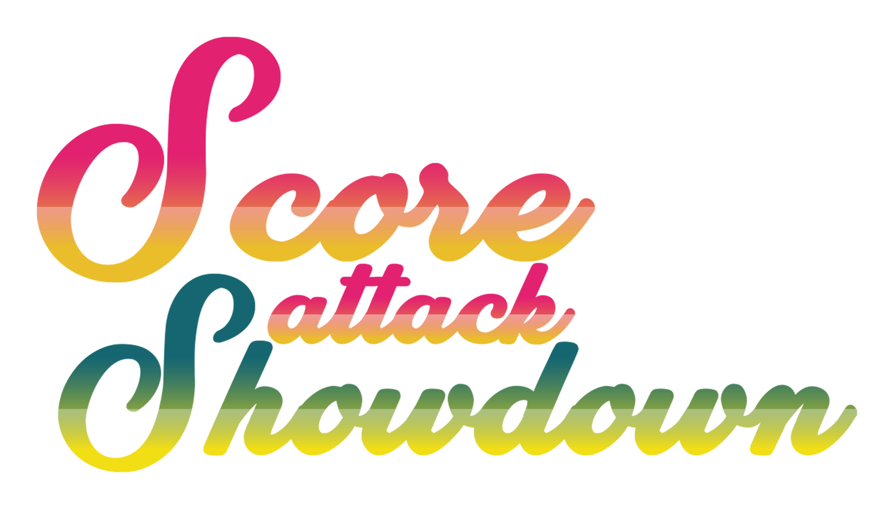

---
tags:
  - SAS
---

# Score Attack Showdown

The **Score Attack Showdown** (***SAS***) was a worldwide 1v1 osu!mania 4K tournament hosted by ::{ flag=US }:: [KamaTheCrimson](https://osu.ppy.sh/users/6362259). The tournament featured a variety of customly made maps from the most unique and veteran osu!mania 4K mappers in its mappools. It was the first instalment of the Score Attack Showdown.

## Tournament schedule

| Event | Timestamp |
| --: | :-- |
| Registration phase | 2020-09-25/2020-10-19 |
| Screening phase | 2020-10-19 |
| Round 1 | 2020-10-26/2020-10-31 |
| Round 2 | 2020-11-02/2020-11-07 |
| Round 3 | 2020-11-09/2020-11-14 |
| Round 4 | 2020-11-16/2020-11-21 |
| Round 5 | 2020-11-23/2020-11-28 |

## Prizes

| Placing | Prize |
| :-: | :-- |
|  | $100 USD |
|  | $50 USD |
|  | $25 USD |

## Organisation

The Score Attack Showdown was run by various community members.

| Position | Member(s) |
| :-- | :-- |
| Organizer | ::{ flag=US }:: [KamaTheCrimson](https://osu.ppy.sh/users/6362259) |
| Mapper | ::{ flag=ID }:: [\[Crz\]Crysarlene](https://osu.ppy.sh/users/5492871), ::{ flag=CA }:: [BringoBrango](https://osu.ppy.sh/users/10274043), ::{ flag=DE }:: [Cokiiplay](https://osu.ppy.sh/users/6760124), ::{ flag=SE }:: [Davvy](https://osu.ppy.sh/users/10047413), ::{ flag=TH }:: [HowToPlayLN](https://osu.ppy.sh/users/10879600), ::{ flag=AR }:: [juankristal](https://osu.ppy.sh/users/443656), ::{ flag=US }:: [Kamuy](https://osu.ppy.sh/users/7439226), ::{ flag=US }:: [-Lethal-](https://osu.ppy.sh/users/5125822), ::{ flag=US }:: [-mint-](https://osu.ppy.sh/users/8976576), ::{ flag=GB }:: [Monheim](https://osu.ppy.sh/users/6814203), ::{ flag=US }:: [Penguinosity](https://osu.ppy.sh/users/10235296), ::{ flag=GB }:: [Pope Gadget](https://osu.ppy.sh/users/2288341), ::{ flag=SG }:: [Raveille](https://osu.ppy.sh/users/1388767), ::{ flag=SG }:: [riunosk](https://osu.ppy.sh/users/5594381), ::{ flag=ID }:: [Rivals\_7](https://osu.ppy.sh/users/4610379), ::{ flag=TH }:: [RuleBlazing](https://osu.ppy.sh/users/7312402), ::{ flag=US }:: [Toaph Daddy](https://osu.ppy.sh/users/7616811), ::{ flag=US }:: [Valedict](https://osu.ppy.sh/users/2537082), ::{ flag=SE }:: [Vortex-](https://osu.ppy.sh/users/4999669), ::{ flag=HK }:: [zero2snow](https://osu.ppy.sh/users/7751516) |
| Score validator | ::{ flag=US }:: [\[GS\]Diamond](https://osu.ppy.sh/users/13076648), ::{ flag=US }:: [\[ Klondike \]](https://osu.ppy.sh/users/10946799) ::{ flag=US }:: [KamaTheCrimson](https://osu.ppy.sh/users/6362259), ::{ flag=BR }:: [LeMarcinho](https://osu.ppy.sh/users/13347579), ::{ flag=US }:: [NovaSagittarii](https://osu.ppy.sh/users/11664177), ::{ flag=US }:: [Playboi Carti](https://osu.ppy.sh/users/4833676), ::{ flag=US }:: [---Rose---](https://osu.ppy.sh/users/9481266), ::{ flag=DE }:: [Sirbeyy](https://osu.ppy.sh/users/12917829), ::{ flag=PL }:: [SitekX](https://osu.ppy.sh/users/3840946), ::{ flag=GB }:: [XxNewson1234xX](https://osu.ppy.sh/users/9895650) |
| Designer | ::{ flag=US }:: [KamaTheCrimson](https://osu.ppy.sh/users/6362259) |
| Statistician | ::{ flag=SE }:: [Mestro](https://osu.ppy.sh/users/4798263) |
| Wiki editor | ::{ flag=ID }:: [fajar13k](https://osu.ppy.sh/users/7100002) |

## Links

- [Discussion thread](https://osu.ppy.sh/community/forums/topics/1151413)
- [SAS Discord server](https://discord.gg/DJ239vF)
- [Livestream](https://www.twitch.tv/itsmestro)
- [Score submission form](https://forms.gle/B5Rcy618hi5pwamq6)
- **[Statistics sheet](https://docs.google.com/spreadsheets/d/1SN7zflqtF9mb37IeIdKzNbeZuiBttqUL-sdU0Eexwwg/edit#gid=0)**

## Participants

*Note: Global ranks were recorded at the end of registration.*

| Global rank | Player |
| --: | :-- |
| #16 | ::{ flag=MY }:: [cheewee10](https://osu.ppy.sh/users/4477497) |
| #59 | ::{ flag=CL }:: [\[GS\]Myuka](https://osu.ppy.sh/users/10072733) |
| #75 | ::{ flag=US }:: [stupud man](https://osu.ppy.sh/users/2141612) |
| #134 | ::{ flag=BR }:: [Lothus](https://osu.ppy.sh/users/9530019) |
| #274 | ::{ flag=FR }:: [pimoux](https://osu.ppy.sh/users/6183047) |
| #322 | ::{ flag=CA }:: [loafusofbread](https://osu.ppy.sh/users/9278959) |
| #378 | ::{ flag=MX }:: [Plutes](https://osu.ppy.sh/users/11188249) |
| #379 | ::{ flag=MX }:: [Plutes](https://osu.ppy.sh/users/11188249) |
| #404 | ::{ flag=VN }:: [CPT\_Sivelia](https://osu.ppy.sh/users/12562107) |
| #413 | ::{ flag=US }:: [BaniiYanii](https://osu.ppy.sh/users/11888159) |
| #418 | ::{ flag=FI }:: [LovelyN](https://osu.ppy.sh/users/8370443) |
| #427 | ::{ flag=RU }:: [c1e4r](https://osu.ppy.sh/users/8693182) |
| #434 | ::{ flag=BR }:: [andreymc](https://osu.ppy.sh/users/5691061) |
| #448 | ::{ flag=CL }:: [Rhyzt\_cL](https://osu.ppy.sh/users/10235085) |
| #469 | ::{ flag=BR }:: [Kyut](https://osu.ppy.sh/users/9328824) |
| #507 | ::{ flag=GB }:: [AirSpan](https://osu.ppy.sh/users/5063207) |
| #515 | ::{ flag=NL }:: [Bakuretsue](https://osu.ppy.sh/users/10960533) |
| #516 | ::{ flag=MX }:: [\[Crz\]Crystalize](https://osu.ppy.sh/users/3072763) |
| #533 | ::{ flag=US }:: [mashu](https://osu.ppy.sh/users/12028216) |
| #552 | ::{ flag=AU }:: [Water is good](https://osu.ppy.sh/users/8222416) |
| #555 | ::{ flag=ID }:: [Mipha-](https://osu.ppy.sh/users/5767941) |
| #561 | ::{ flag=TW }:: [Ha0201](https://osu.ppy.sh/users/12243730) |
| #594 | ::{ flag=ID }:: [Yangga](https://osu.ppy.sh/users/12143152) |
| #612 | ::{ flag=PH }:: [Swarmsii](https://osu.ppy.sh/users/11716111) |
| #613 | ::{ flag=US }:: [\[GS\]linc](https://osu.ppy.sh/users/12093536) |
| #616 | ::{ flag=GB }:: [Zycrxd](https://osu.ppy.sh/users/14245127) |
| #627 | ::{ flag=EE }:: [ExludeX](https://osu.ppy.sh/users/14137067) |
| #652 | ::{ flag=PH }:: [Chuck](https://osu.ppy.sh/users/11517895) |
| #655 | ::{ flag=ES }:: [Komirin](https://osu.ppy.sh/users/4725379) |
| #685 | ::{ flag=HK }:: [Dream Fire](https://osu.ppy.sh/users/11198186) |
| #691 | ::{ flag=BE }:: [yetii](https://osu.ppy.sh/users/6914714) |
| #727 | ::{ flag=BR }:: [Remu](https://osu.ppy.sh/users/8700468) |
| #747 | ::{ flag=SE }:: [Lemmie](https://osu.ppy.sh/users/11700865) |
| #756 | ::{ flag=US }:: [\[\_Gearfrik\_\]](https://osu.ppy.sh/users/8198818) |
| #787 | ::{ flag=MX }:: [-Hellscythe-](https://osu.ppy.sh/users/7837147) |
| #802 | ::{ flag=GB }:: [TingTheFirst](https://osu.ppy.sh/users/12489832) |
| #814 | ::{ flag=GB }:: [Zoobin4](https://osu.ppy.sh/users/10055204) |
| #835 | ::{ flag=CO }:: [sebasthefast](https://osu.ppy.sh/users/14395814) |
| #850 | ::{ flag=BR }:: [Sprrumnk Lokii](https://osu.ppy.sh/users/10622472) |
| #877 | ::{ flag=US }:: [leyii](https://osu.ppy.sh/users/10206161) |
| #938 | ::{ flag=ID }:: [\[GS\]Rei](https://osu.ppy.sh/users/11964257) |
| #943 | ::{ flag=US }:: [Yu-](https://osu.ppy.sh/users/11082377) |
| #947 | ::{ flag=BE }:: [Mortelspawn\_](https://osu.ppy.sh/users/5331420) |
| #1,004 | ::{ flag=US }:: [ERA Zenith](https://osu.ppy.sh/users/7128063) |
| #1,061 | ::{ flag=US }:: [Unholy](https://osu.ppy.sh/users/7672414) |
| #1,078 | ::{ flag=PY }:: [MomonSama](https://osu.ppy.sh/users/7762488) |
| #1,089 | ::{ flag=US }:: [Halogen-](https://osu.ppy.sh/users/169992) |
| #1,107 | ::{ flag=SG }:: [IJosephI \[DS\]](https://osu.ppy.sh/users/13353749) |
| #1,110 | ::{ flag=CA }:: [Stability](https://osu.ppy.sh/users/6701738) |
| #1,124 | ::{ flag=AU }:: [siberbule](https://osu.ppy.sh/users/11495339) |
| #1,166 | ::{ flag=UY }:: [HopelessPlayer](https://osu.ppy.sh/users/12528267) |
| #1,194 | ::{ flag=FR }:: [DragonSonic](https://osu.ppy.sh/users/7294830) |
| #1,197 | ::{ flag=VN }:: [-Frostleaf-](https://osu.ppy.sh/users/11863174) |
| #1,205 | ::{ flag=BR }:: [LoockaNosRitmo](https://osu.ppy.sh/users/14312768) |
| #1,259 | ::{ flag=US }:: [\[GS\]Croniken](https://osu.ppy.sh/users/9989041) |
| #1,260 | ::{ flag=FI }:: [Fisu](https://osu.ppy.sh/users/12545346) |
| #1,261 | ::{ flag=HK }:: [Ricizus](https://osu.ppy.sh/users/10395139) |
| #1,267 | ::{ flag=BR }:: [Gabi Kamui](https://osu.ppy.sh/users/10658391) |
| #1,295 | ::{ flag=FR }:: [Magicraft](https://osu.ppy.sh/users/9274711) |
| #1,305 | ::{ flag=CL }:: [Charliegamer](https://osu.ppy.sh/users/6661676) |
| #1,310 | ::{ flag=KR }:: [kdj8381](https://osu.ppy.sh/users/13600684) |
| #1,329 | ::{ flag=US }:: [Trainer-](https://osu.ppy.sh/users/9331760) |
| #1,334 | ::{ flag=SE }:: [Trymatic](https://osu.ppy.sh/users/14762260) |
| #1,364 | ::{ flag=PL }:: [szuncoll](https://osu.ppy.sh/users/12393014) |
| #1,395 | ::{ flag=PL }:: [Hlimak](https://osu.ppy.sh/users/1340272) |
| #1,409 | ::{ flag=US }:: [KinokoOnlyHope](https://osu.ppy.sh/users/13963967) |
| #1,524 | ::{ flag=FI }:: [Oreo](https://osu.ppy.sh/users/5099222) |
| #1,538 | ::{ flag=ID }:: [Suichan203](https://osu.ppy.sh/users/9821346) |
| #1,549 | ::{ flag=US }:: [\[GS\]Antunder](https://osu.ppy.sh/users/10416995) |
| #1,611 | ::{ flag=GB }:: [welshevo79](https://osu.ppy.sh/users/10510684) |
| #1,672 | ::{ flag=US }:: [Logan636](https://osu.ppy.sh/users/9423766) |
| #1,679 | ::{ flag=PR }:: [Juuli13](https://osu.ppy.sh/users/15204782) |
| #1,681 | ::{ flag=BR }:: [Emat5](https://osu.ppy.sh/users/10475605) |
| #1,693 | ::{ flag=KR }:: [LedianORe](https://osu.ppy.sh/users/4402684) |
| #1,709 | ::{ flag=SG }:: [Japeynius](https://osu.ppy.sh/users/13993659) |
| #1,743 | ::{ flag=DE }:: [Niko\_Plays](https://osu.ppy.sh/users/9409456) |
| #1,799 | ::{ flag=IT }:: [WePlant](https://osu.ppy.sh/users/6997209) |
| #1,823 | ::{ flag=ID }:: [Fyl](https://osu.ppy.sh/users/10069307) |
| #1,844 | ::{ flag=BR }:: [Lenn](https://osu.ppy.sh/users/11236829) |
| #1,863 | ::{ flag=TH }:: [- Yomari -](https://osu.ppy.sh/users/11654947) |
| #1,864 | ::{ flag=BR }:: [Soore](https://osu.ppy.sh/users/15753462) |
| #1,867 | ::{ flag=CL }:: [xXCris13Xx](https://osu.ppy.sh/users/11480970) |
| #1,905 | ::{ flag=FR }:: [ZayyKen](https://osu.ppy.sh/users/8624433) |
| #1,961 | ::{ flag=US }:: [Firby\_28](https://osu.ppy.sh/users/6807462) |
| #1,975 | ::{ flag=US }:: [PositoniX](https://osu.ppy.sh/users/12443485) |
| #2,008 | ::{ flag=NL }:: [2fast4you98](https://osu.ppy.sh/users/5183940) |
| #2,023 | ::{ flag=BE }:: [spamblock](https://osu.ppy.sh/users/11968058) |
| #2,063 | ::{ flag=HK }:: [Irone OSU](https://osu.ppy.sh/users/10678230) |
| #2,116 | ::{ flag=MX }:: [\[OSC\]Amagai](https://osu.ppy.sh/users/9658070) |
| #2,231 | ::{ flag=US }:: [Revenant](https://osu.ppy.sh/users/10533955) |
| #2,241 | ::{ flag=SG }:: [doomsday50](https://osu.ppy.sh/users/11654310) |
| #2,319 | ::{ flag=NL }:: [Ready Perfectly](https://osu.ppy.sh/users/10944966) |
| #2,337 | ::{ flag=FR }:: [Kasumii-sama](https://osu.ppy.sh/users/6177263) |
| #2,364 | ::{ flag=US }:: [Vegan](https://osu.ppy.sh/users/9727747) |
| #2,406 | ::{ flag=MY }:: [\[-Leon-\]](https://osu.ppy.sh/users/13382147) |
| #2,466 | ::{ flag=US }:: [ayyOrca](https://osu.ppy.sh/users/7958845) |
| #2,503 | ::{ flag=PL }:: [s\_kolorowa](https://osu.ppy.sh/users/11430587) |
| #2,531 | ::{ flag=BR }:: [Zergh](https://osu.ppy.sh/users/3181281) |
| #2,542 | ::{ flag=NL }:: [NightNarumi](https://osu.ppy.sh/users/4381142) |
| #2,621 | ::{ flag=BE }:: [flyerbram002](https://osu.ppy.sh/users/12725421) |
| #2,728 | ::{ flag=BR }:: [Namirin-chan](https://osu.ppy.sh/users/6761832) |
| #2,859 | ::{ flag=SG }:: [IHxveNoWuhxn](https://osu.ppy.sh/users/15210942) |
| #2,871 | ::{ flag=ID }:: [Soraru Aoki](https://osu.ppy.sh/users/15636932) |
| #2,933 | ::{ flag=ID }:: [HerosonRhymes](https://osu.ppy.sh/users/12640004) |
| #3,009 | ::{ flag=FI }:: [Stiffu](https://osu.ppy.sh/users/12274556) |
| #3,283 | ::{ flag=DO }:: [Antalf](https://osu.ppy.sh/users/8793773) |
| #3,295 | ::{ flag=ID }:: [Fr05tyGD](https://osu.ppy.sh/users/14230684) |
| #3,322 | ::{ flag=MY }:: [Unicow](https://osu.ppy.sh/users/9444174) |
| #3,354 | ::{ flag=BR }:: [Yuragi](https://osu.ppy.sh/users/8501380) |
| #3,430 | ::{ flag=AR }:: [NEDEAAAHHHH](https://osu.ppy.sh/users/65724) |
| #3,530 | ::{ flag=FR }:: [KewaiiGames](https://osu.ppy.sh/users/14797411) |
| #3,600 | ::{ flag=MY }:: [aswdafxc](https://osu.ppy.sh/users/12054898) |
| #3,613 | ::{ flag=US }:: [3lijah](https://osu.ppy.sh/users/4686148) |
| #3,654 | ::{ flag=US }:: [\[LS\]Treeman](https://osu.ppy.sh/users/14677848) |
| #3,678 | ::{ flag=VE }:: [Neko-Pan](https://osu.ppy.sh/users/8676532) |
| #3,685 | ::{ flag=PH }:: [Edison](https://osu.ppy.sh/users/1325159) |
| #3,824 | ::{ flag=US }:: [Feylos](https://osu.ppy.sh/users/4565040) |
| #3,931 | ::{ flag=US }:: [Ninty](https://osu.ppy.sh/users/11631179) |
| #3,938 | ::{ flag=BR }:: [AlgocomB](https://osu.ppy.sh/users/12298887) |
| #3,975 | ::{ flag=NZ }:: [- Abby -](https://osu.ppy.sh/users/7740118) |
| #4,024 | ::{ flag=ES }:: [game\_maker26](https://osu.ppy.sh/users/4876699) |
| #4,106 | ::{ flag=CL }:: [-JustLenny](https://osu.ppy.sh/users/12793583) |
| #4,215 | ::{ flag=KR }:: [S ILY](https://osu.ppy.sh/users/9766317) |
| #4,323 | ::{ flag=US }:: [\[LS\]Crazy](https://osu.ppy.sh/users/12211556) |
| #4,503 | ::{ flag=PL }:: [Mr\_adamello](https://osu.ppy.sh/users/7420894) |
| #4,870 | ::{ flag=AR }:: [boligoma](https://osu.ppy.sh/users/13310563) |
| #5,017 | ::{ flag=US }:: [walnutt](https://osu.ppy.sh/users/8617859) |
| #5,331 | ::{ flag=MX }:: [\[LS\] Shuri](https://osu.ppy.sh/users/14593518) |
| #5,546 | ::{ flag=NO }:: [prebert123](https://osu.ppy.sh/users/7859738) |
| #5,607 | ::{ flag=TW }:: [Joylintp](https://osu.ppy.sh/users/13579078) |
| #5,732 | ::{ flag=US }:: [FlynnMac](https://osu.ppy.sh/users/13857986) |
| #6,162 | ::{ flag=AU }:: [\[LG\]aurusei](https://osu.ppy.sh/users/14430622) |
| #6,748 | ::{ flag=BR }:: [Halo-](https://osu.ppy.sh/users/7572142) |

## Podium

This competition has come to an end and resulted in the following podium:

| Placing | Player |
| :-: | :-- |
|  | ::{ flag=MY }:: [cheewee10](https://osu.ppy.sh/users/4477497) |
|  | ::{ flag=CL }:: [\[GS\]Myuka](https://osu.ppy.sh/users/10072733) |
|  | ::{ flag=BR }:: [Lothus](https://osu.ppy.sh/users/9530019) |

## Mappools

### Round 5

**[Download the mappack here! (35 MB)](https://cdn.discordapp.com/attachments/711778005399109687/780169704618721300/SAS_Round_5.zip)**

- Hybrid: [Camellia - B L A C K - R A Y (Toaph Daddy) \[D A R K - M A G I C I A N x1.05\]](https://osu.ppy.sh/beatmapsets/1306124#mania/2707896)
- Tech: [Frums - Quantum Distress Signal (Valedict) \[Hysteria\]](https://osu.ppy.sh/beatmapsets/1233691#mania/2564612)
- LN: [KUMOKIRI - Shippujinrai (\[Crz\]Crysarlene) \[Fulguration\]](https://osu.ppy.sh/beatmapsets/1306632#mania/2709105)
- Wildcard: [The Dillinger Escape Plan - Limerent Death (Valedict) \[Stained Glass\]](https://osu.ppy.sh/beatmapsets/1306724#mania/2709255)

### Round 4

**[Download the mappack here! (30 MB)](https://cdn.discordapp.com/attachments/711778005399109687/777633478010339358/SAS_Round_4.zip)**

- Hybrid: [TRAELMYX - Late For Class! (HowToPlayLN) \[RuleNote don't want to make SV on this difficulty\]](https://osu.ppy.sh/beatmapsets/1279459#mania/2657939)
- Tech: [3l3d3p - Ibitbt (Monheim) \[F4w4rD\]](https://osu.ppy.sh/beatmapsets/1287682#mania/2673545)
- LN: [An - Encryption (Davvy) \[Enigmatic\]](https://osu.ppy.sh/beatmapsets/1298002#mania/2692515)
- Wildcard: [Gram - Sigmund (Sped Up Ver.) (riunosk) \[Conquer\]](https://osu.ppy.sh/beatmapsets/1299648#mania/2696192)

### Round 3

**[Download the mappack here! (24 MB)](https://cdn.discordapp.com/attachments/711778005399109687/775098856210694233/SAS_Round_3.zip)**

- Hybrid: [s-don vs. Hino Isuka - Trrricksters!! (zero2snow) \[Nooonsense!!\]](https://osu.ppy.sh/beatmapsets/1294819#mania/2686701)
- Tech: [Frums - Flashbacklog (Kamuy) \[\< flashback database to username sysdate - Dragolord;\>\]](https://osu.ppy.sh/beatmapsets/1294546#mania/2686268)
- LN: [SOUND HOLIC feat. Nana Takahashi - Wakusei\*Lollipop (-mint-) \[TV Size (Edit)\]](https://osu.ppy.sh/beatmapsets/1147012#mania/2689657)
- Wildcard: [Mili - RTRT (Rivals\_7) \[Black Another\]](https://osu.ppy.sh/beatmapsets/1295080#mania/2687120)

### Round 2

**[Download the mappack here! (27 MB)](https://cdn.discordapp.com/attachments/711778005399109687/772567150929641502/SAS_Round_2.zip)**

- Hybrid: [plusol - Angel Temple (BringoBrango) \[Ascension (SAS edit)\]](https://osu.ppy.sh/beatmapsets/1286284#mania/2670767)
- Tech: [Kola Kid - spaceman (cut) (Vortex-) \[I always wanted you to go, into space man (1.1x)\]](https://osu.ppy.sh/beatmapsets/1290983#mania/2679801)
- LN: [Camellia - potential curve (Raveille) \[diatomic\]](https://osu.ppy.sh/beatmapsets/1196957#mania/2493350)
- Wildcard: [Equinox7 - valerian coma (-Lethal-) \[atrophy\]](https://osu.ppy.sh/beatmapsets/1286278#mania/2670752)

### Round 1

**[Download the mappack here! (20 MB)](https://cdn.discordapp.com/attachments/711916285746872412/770020679361232896/SAS_Round_1.zip)**

- Hybrid: [WEDNESDAY CAMPANELLA - Shakushain (Penguinosity) \[Shakushaku\]](https://osu.ppy.sh/beatmapsets/1282584#mania/2663884)
- Tech: [Ben Briggs - Fearless Living (RuleBlazing) \[Coward\]](https://osu.ppy.sh/beatmapsets/1283930#mania/2666220)
- LN: [Drop x Hatsuki Yura - Le Bijoux (HowToPlayLN) \[Jewelry\]](https://osu.ppy.sh/beatmapsets/1282938#mania/2664488)
- Wildcard: [Jakub Zytecki - Letters (Cokiiplay) \[Voyage\]](https://osu.ppy.sh/beatmapsets/1282382#mania/2663564)

## Match results

*Note: All scores listed are the sum of scores from each mappool. More detailed results are available on the [statistics sheet](https://docs.google.com/spreadsheets/d/1SN7zflqtF9mb37IeIdKzNbeZuiBttqUL-sdU0Eexwwg/edit#gid=0).*

### Round 5

| Position | Player | Score |
| :-- | :-- | --: |
| #1 | ::{ flag=MY }:: [cheewee10](https://osu.ppy.sh/users/4477497) | 3,959,723 |
| #2 | ::{ flag=CL }:: [\[GS\]Myuka](https://osu.ppy.sh/users/10072733) | 3,957,339 |
| #3 | ::{ flag=BR }:: [Lothus](https://osu.ppy.sh/users/9530019) | 3,945,572 |
| #4 | ::{ flag=BR }:: [andreymc](https://osu.ppy.sh/users/5691061) | 3,912,319 |

### Round 4

Only the top 4 players advance to the next round.

| Position | Player | Score |
| :-- | :-- | --: |
| #1 | ::{ flag=BR }:: [Lothus](https://osu.ppy.sh/users/9530019) | 3,980,949 |
| #2 | ::{ flag=CL }:: [\[GS\]Myuka](https://osu.ppy.sh/users/10072733) | 3,978,612 |
| #3 | ::{ flag=BR }:: [andreymc](https://osu.ppy.sh/users/5691061) | 3,977,666 |
| #4 | ::{ flag=MY }:: [cheewee10](https://osu.ppy.sh/users/4477497) | 3,969,820 |
| #5 | ::{ flag=US }:: [Halogen-](https://osu.ppy.sh/users/169992) | 3,952,460 |
| #6 | ::{ flag=US }:: [mashu](https://osu.ppy.sh/users/12028216) | 3,948,095 |
| #7 | ::{ flag=GB }:: [AirSpan](https://osu.ppy.sh/users/5063207) | 0 |
| #8 | ::{ flag=PH }:: [Chuck](https://osu.ppy.sh/users/11517895) | 0 |
| #9 | ::{ flag=US }:: [Unholy](https://osu.ppy.sh/users/7672414) | 0 |

### Round 3

Only the top 9 players advance to the next round.

| Position | Player | Score |
| :-- | :-- | --: |
| #1 | ::{ flag=CL }:: [\[GS\]Myuka](https://osu.ppy.sh/users/10072733) | 3,984,939 |
| #2 | ::{ flag=BR }:: [andreymc](https://osu.ppy.sh/users/5691061) | 3,982,985 |
| #3 | ::{ flag=BR }:: [Lothus](https://osu.ppy.sh/users/9530019) | 3,981,948 |
| #4 | ::{ flag=MY }:: [cheewee10](https://osu.ppy.sh/users/4477497) | 3,980,722 |
| #5 | ::{ flag=US }:: [Unholy](https://osu.ppy.sh/users/7672414) | 3,970,171 |
| #6 | ::{ flag=PH }:: [Chuck](https://osu.ppy.sh/users/11517895) | 3,962,182 |
| #7 | ::{ flag=US }:: [Halogen-](https://osu.ppy.sh/users/169992) | 3,960,891 |
| #8 | ::{ flag=US }:: [mashu](https://osu.ppy.sh/users/12028216) | 3,959,240 |
| #9 | ::{ flag=GB }:: [AirSpan](https://osu.ppy.sh/users/5063207) | 3,952,657 |
| #10 | ::{ flag=SG }:: [IJosephI \[DS\]](https://osu.ppy.sh/users/13353749) | 3,951,549 |
| #11 | ::{ flag=RU }:: [c1e4r](https://osu.ppy.sh/users/8693182) | 3,950,325 |
| #12 | ::{ flag=US }:: [\[GS\]linc](https://osu.ppy.sh/users/12093536) | 3,941,896 |
| #13 | ::{ flag=NL }:: [2fast4you98](https://osu.ppy.sh/users/5183940) | 3,932,390 |
| #14 | ::{ flag=VN }:: [-Frostleaf-](https://osu.ppy.sh/users/11863174) | 0 |
| #15 | ::{ flag=US }:: [\[GS\]Antunder](https://osu.ppy.sh/users/10416995) | 0 |
| #16 | ::{ flag=NL }:: [Bakuretsue](https://osu.ppy.sh/users/10960533) | 0 |
| #17 | ::{ flag=AR }:: [BossPlays](https://osu.ppy.sh/users/7341471) | 0 |
| #18 | ::{ flag=US }:: [Logan636](https://osu.ppy.sh/users/9423766) | 0 |
| #19 | ::{ flag=FI }:: [LovelyN](https://osu.ppy.sh/users/8370443) | 0 |
| #20 | ::{ flag=MX }:: [Plutes](https://osu.ppy.sh/users/11188249) | 0 |
| #21 | ::{ flag=PH }:: [Swarmsii](https://osu.ppy.sh/users/11716111) | 0 |
| #22 | ::{ flag=GB }:: [TingTheFirst](https://osu.ppy.sh/users/12489832) | 0 |
| #23 | ::{ flag=FR }:: [ZayyKen](https://osu.ppy.sh/users/8624433) | 0 |

### Round 2

Only the top 23 players advance to the next round.

| Position | Player | Score |
| :-- | :-- | --: |
| #1 | ::{ flag=MY }:: [cheewee10](https://osu.ppy.sh/users/4477497) | 3,990,040 |
| #2 | ::{ flag=BR }:: [Lothus](https://osu.ppy.sh/users/9530019) | 3,989,689 |
| #3 | ::{ flag=CL }:: [\[GS\]Myuka](https://osu.ppy.sh/users/10072733) | 3,988,238 |
| #4 | ::{ flag=BR }:: [andreymc](https://osu.ppy.sh/users/5691061) | 3,987,346 |
| #5 | ::{ flag=MX }:: [Plutes](https://osu.ppy.sh/users/11188249) | 3,982,394 |
| #6 | ::{ flag=US }:: [Unholy](https://osu.ppy.sh/users/7672414) | 3,981,594 |
| #7 | ::{ flag=PH }:: [Chuck](https://osu.ppy.sh/users/11517895) | 3,980,160 |
| #8 | ::{ flag=FI }:: [LovelyN](https://osu.ppy.sh/users/8370443) | 3,977,297 |
| #9 | ::{ flag=US }:: [Halogen-](https://osu.ppy.sh/users/169992) | 3,972,985 |
| #10 | ::{ flag=US }:: [Logan636](https://osu.ppy.sh/users/9423766) | 3,972,773 |
| #11 | ::{ flag=US }:: [mashu](https://osu.ppy.sh/users/12028216) | 3,971,158 |
| #12 | ::{ flag=AR }:: [BossPlays](https://osu.ppy.sh/users/7341471) | 3,969,853 |
| #13 | ::{ flag=US }:: [\[GS\]linc](https://osu.ppy.sh/users/12093536) | 3,969,636 |
| #14 | ::{ flag=PH }:: [Swarmsii](https://osu.ppy.sh/users/11716111) | 3,969,303 |
| #15 | ::{ flag=VN }:: [-Frostleaf-](https://osu.ppy.sh/users/11863174) | 3,965,052 |
| #16 | ::{ flag=NL }:: [2fast4you98](https://osu.ppy.sh/users/5183940) | 3,963,760 |
| #17 | ::{ flag=GB }:: [TingTheFirst](https://osu.ppy.sh/users/12489832) | 3,962,559 |
| #18 | ::{ flag=US }:: [\[GS\]Antunder](https://osu.ppy.sh/users/10416995) | 3,962,207 |
| #19 | ::{ flag=FR }:: [ZayyKen](https://osu.ppy.sh/users/8624433) | 3,959,814 |
| #20 | ::{ flag=RU }:: [c1e4r](https://osu.ppy.sh/users/8693182) | 3,959,569 |
| #21 | ::{ flag=GB }:: [AirSpan](https://osu.ppy.sh/users/5063207) | 3,958,185 |
| #22 | ::{ flag=SG }:: [IJosephI \[DS\]](https://osu.ppy.sh/users/13353749) | 3,957,976 |
| #23 | ::{ flag=NL }:: [Bakuretsue](https://osu.ppy.sh/users/10960533) | 3,957,936 |
| #24 | ::{ flag=HK }:: [Ricizus](https://osu.ppy.sh/users/10395139) | 3,954,247 |
| #25 | ::{ flag=BE }:: [Mortelspawn\_](https://osu.ppy.sh/users/5331420) | 3,953,730 |
| #26 | ::{ flag=MY }:: [\[-Leon-\]](https://osu.ppy.sh/users/13382147) | 3,953,274 |
| #27 | ::{ flag=US }:: [Yu-](https://osu.ppy.sh/users/11082377) | 3,950,587 |
| #28 | ::{ flag=CA }:: [Stability](https://osu.ppy.sh/users/6701738) | 3,948,490 |
| #29 | ::{ flag=GB }:: [Zoobin4](https://osu.ppy.sh/users/10055204) | 3,946,023 |
| #30 | ::{ flag=BR }:: [Lenn](https://osu.ppy.sh/users/11236829) | 3,943,047 |
| #31 | ::{ flag=CL }:: [Charliegamer](https://osu.ppy.sh/users/6661676) | 3,941,662 |
| #32 | ::{ flag=US }:: [leyii](https://osu.ppy.sh/users/10206161) | 3,933,119 |
| #33 | ::{ flag=PL }:: [s\_kolorowa](https://osu.ppy.sh/users/11430587) | 3,920,454 |
| #34 | ::{ flag=DO }:: [Antalf](https://osu.ppy.sh/users/8793773) | 3,913,516 |
| #35 | ::{ flag=ID }:: [Fr05tyGD](https://osu.ppy.sh/users/14230684) | 3,910,442 |
| #36 | ::{ flag=NL }:: [Ready Perfectly](https://osu.ppy.sh/users/10944966) | 3,905,742 |
| #37 | ::{ flag=BR }:: [Halo-](https://osu.ppy.sh/users/7572142) | 3,898,992 |
| #38 | ::{ flag=PL }:: [Mr\_adamello](https://osu.ppy.sh/users/7420894) | 3,894,838 |
| #39 | ::{ flag=ID }:: [Fyl](https://osu.ppy.sh/users/10069307) | 3,877,272 |
| #40 | ::{ flag=NL }:: [NightNarumi](https://osu.ppy.sh/users/4381142) | 3,740,474 |
| #41 | ::{ flag=BE }:: [spamblock](https://osu.ppy.sh/users/11968058) | 3,735,516 |
| #42 | ::{ flag=US }:: [BaniiYanii](https://osu.ppy.sh/users/11888159) | 0 |
| #43 | ::{ flag=US }:: [ERA Zenith](https://osu.ppy.sh/users/7128063) | 0 |
| #44 | ::{ flag=TW }:: [Ha0201](https://osu.ppy.sh/users/12243730) | 0 |
| #45 | ::{ flag=HK }:: [Irone OSU](https://osu.ppy.sh/users/10678230) | 0 |
| #46 | ::{ flag=TW }:: [Joylintp](https://osu.ppy.sh/users/13579078) | 0 |
| #47 | ::{ flag=BR }:: [Kyut](https://osu.ppy.sh/users/9328824) | 0 |
| #48 | ::{ flag=CA }:: [loafusofbread](https://osu.ppy.sh/users/9278959) | 0 |
| #49 | ::{ flag=ID }:: [Mipha-](https://osu.ppy.sh/users/5767941) | 0 |
| #50 | ::{ flag=PY }:: [MomonSama](https://osu.ppy.sh/users/7762488) | 0 |
| #51 | ::{ flag=BR }:: [Sprrumnk](https://osu.ppy.sh/users/10622472) | 0 |
| #52 | ::{ flag=MY }:: [Unicow](https://osu.ppy.sh/users/9444174) | 0 |
| #53 | ::{ flag=BE }:: [yetii](https://osu.ppy.sh/users/6914714) | 0 |
| #54 | ::{ flag=BR }:: [Yuragi](https://osu.ppy.sh/users/8501380) | 0 |
| #55 | ::{ flag=BR }:: [Zergh](https://osu.ppy.sh/users/3181281) | 0 |

### Round 1

Only the top 55 players advance to the next round.

| Position | Player | Score |
| :-- | :-- | --: |
| #1 | ::{ flag=BR }:: [andreymc](https://osu.ppy.sh/users/5691061) | 3,992,459 |
| #2 | ::{ flag=BR }:: [Lothus](https://osu.ppy.sh/users/9530019) | 3,991,871 |
| #3 | ::{ flag=CL }:: [\[GS\]Myuka](https://osu.ppy.sh/users/10072733) | 3,991,599 |
| #4 | ::{ flag=US }:: [Logan636](https://osu.ppy.sh/users/9423766) | 3,990,380 |
| #5 | ::{ flag=MX }:: [Plutes](https://osu.ppy.sh/users/11188249) | 3,988,513 |
| #6 | ::{ flag=MY }:: [cheewee10](https://osu.ppy.sh/users/4477497) | 3,988,065 |
| #7 | ::{ flag=ID }:: [Mipha-](https://osu.ppy.sh/users/5767941) | 3,987,456 |
| #8 | ::{ flag=US }:: [Unholy](https://osu.ppy.sh/users/7672414) | 3,986,571 |
| #9 | ::{ flag=VN }:: [-Frostleaf-](https://osu.ppy.sh/users/11863174) | 3,985,174 |
| #10 | ::{ flag=FI }:: [LovelyN](https://osu.ppy.sh/users/8370443) | 3,984,596 |
| #11 | ::{ flag=PH }:: [Chuck](https://osu.ppy.sh/users/11517895) | 3,983,766 |
| #12 | ::{ flag=BR }:: [Yuragi](https://osu.ppy.sh/users/8501380) | 3,983,543 |
| #13 | ::{ flag=AR }:: [BossPlays](https://osu.ppy.sh/users/7341471) | 3,983,310 |
| #14 | ::{ flag=PH }:: [Swarmsii](https://osu.ppy.sh/users/11716111) | 3,982,067 |
| #15 | ::{ flag=US }:: [mashu](https://osu.ppy.sh/users/12028216) | 3,981,852 |
| #16 | ::{ flag=NL }:: [NightNarumi](https://osu.ppy.sh/users/4381142) | 3,977,636 |
| #17 | ::{ flag=NL }:: [2fast4you98](https://osu.ppy.sh/users/5183940) | 3,977,294 |
| #18 | ::{ flag=NL }:: [Ready Perfectly](https://osu.ppy.sh/users/10944966) | 3,977,079 |
| #19 | ::{ flag=GB }:: [AirSpan](https://osu.ppy.sh/users/5063207) | 3,976,734 |
| #20 | ::{ flag=US }:: [\[GS\]linc](https://osu.ppy.sh/users/12093536) | 3,976,185 |
| #21 | ::{ flag=BR }:: [Kyut](https://osu.ppy.sh/users/9328824) | 3,976,173 |
| #22 | ::{ flag=GB }:: [TingTheFirst](https://osu.ppy.sh/users/12489832) | 3,975,486 |
| #23 | ::{ flag=MY }:: [\[-Leon-\]](https://osu.ppy.sh/users/13382147) | 3,975,271 |
| #24 | ::{ flag=US }:: [\[GS\]Antunder](https://osu.ppy.sh/users/10416995) | 3,974,440 |
| #25 | ::{ flag=HK }:: [Ricizus](https://osu.ppy.sh/users/10395139) | 3,973,989 |
| #26 | ::{ flag=US }:: [Halogen-](https://osu.ppy.sh/users/169992) | 3,973,795 |
| #27 | ::{ flag=BE }:: [yetii](https://osu.ppy.sh/users/6914714) | 3,973,555 |
| #28 | ::{ flag=US }:: [ERA Zenith](https://osu.ppy.sh/users/7128063) | 3,970,122 |
| #29 | ::{ flag=CL }:: [Charliegamer](https://osu.ppy.sh/users/6661676) | 3,970,022 |
| #30 | ::{ flag=US }:: [BaniiYanii](https://osu.ppy.sh/users/11888159) | 3,970,000 |
| #31 | ::{ flag=NL }:: [Bakuretsue](https://osu.ppy.sh/users/10960533) | 3,968,570 |
| #32 | ::{ flag=SG }:: [IJosephI \[DS\]](https://osu.ppy.sh/users/13353749) | 3,968,363 |
| #33 | ::{ flag=BR }:: [Zergh](https://osu.ppy.sh/users/3181281) | 3,968,036 |
| #34 | ::{ flag=TW }:: [Ha0201](https://osu.ppy.sh/users/12243730) | 3,967,689 |
| #35 | ::{ flag=CA }:: [Stability](https://osu.ppy.sh/users/6701738) | 3,967,117 |
| #36 | ::{ flag=BE }:: [Mortelspawn\_](https://osu.ppy.sh/users/5331420) | 3,964,960 |
| #37 | ::{ flag=BR }:: [Lenn](https://osu.ppy.sh/users/11236829) | 3,964,464 |
| #38 | ::{ flag=CA }:: [loafusofbread](https://osu.ppy.sh/users/9278959) | 3,964,372 |
| #39 | ::{ flag=RU }:: [c1e4r](https://osu.ppy.sh/users/8693182) | 3,962,992 |
| #40 | ::{ flag=US }:: [leyii](https://osu.ppy.sh/users/10206161) | 3,962,968 |
| #41 | ::{ flag=FR }:: [ZayyKen](https://osu.ppy.sh/users/8624433) | 3,961,955 |
| #42 | ::{ flag=HK }:: [Irone OSU](https://osu.ppy.sh/users/10678230) | 3,961,413 |
| #43 | ::{ flag=PY }:: [MomonSama](https://osu.ppy.sh/users/7762488) | 3,960,762 |
| #44 | ::{ flag=GB }:: [Zoobin4](https://osu.ppy.sh/users/10055204) | 3,956,611 |
| #45 | ::{ flag=PL }:: [s_kolorowa](https://osu.ppy.sh/users/11430587) | 3,954,786 |
| #46 | ::{ flag=PL }:: [Mr\_adamello](https://osu.ppy.sh/users/7420894) | 3,954,368 |
| #47 | ::{ flag=MY }:: [Unicow](https://osu.ppy.sh/users/9444174) | 3,951,033 |
| #48 | ::{ flag=BR }:: [Halo-](https://osu.ppy.sh/users/7572142) | 3,950,372 |
| #49 | ::{ flag=BR }:: [Sprrumnk Lokii](https://osu.ppy.sh/users/10622472) | 3,949,418 |
| #50 | ::{ flag=ID }:: [Fyl](https://osu.ppy.sh/users/10069307) | 3,946,570 |
| #51 | ::{ flag=DO }:: [Antalf](https://osu.ppy.sh/users/8793773) | 3,944,962 |
| #52 | ::{ flag=ID }:: [Fr05tyGD](https://osu.ppy.sh/users/14230684) | 3,942,418 |
| #53 | ::{ flag=TW }:: [Joylintp](https://osu.ppy.sh/users/13579078) | 3,941,747 |
| #54 | ::{ flag=BE }:: [spamblock](https://osu.ppy.sh/users/11968058) | 3,940,981 |
| #55 | ::{ flag=US }:: [Yu-](https://osu.ppy.sh/users/11082377) | 3,937,484 |
| #56 | ::{ flag=GB }:: [Zycrxd](https://osu.ppy.sh/users/14245127) | 3,934,815 |
| #57 | ::{ flag=IT }:: [WePlant](https://osu.ppy.sh/users/6997209) | 3,928,905 |
| #58 | ::{ flag=MY }:: [aswdafxc](https://osu.ppy.sh/users/12054898) | 3,928,039 |
| #59 | ::{ flag=PL }:: [Hlimak](https://osu.ppy.sh/users/1340272) | 3,925,376 |
| #60 | ::{ flag=US }:: [\[GS\]Croniken](https://osu.ppy.sh/users/9989041) | 3,921,714 |
| #61 | ::{ flag=AR }:: [NEDEAAAHHHH](https://osu.ppy.sh/users/65724) | 3,918,527 |
| #62 | ::{ flag=KR }:: [kdj8381](https://osu.ppy.sh/users/13600684) | 3,917,543 |
| #63 | ::{ flag=US }:: [Revenant](https://osu.ppy.sh/users/10533955) | 3,910,519 |
| #64 | ::{ flag=NZ }:: [- Abby -](https://osu.ppy.sh/users/7740118) | 3,909,521 |
| #65 | ::{ flag=US }:: [walnutt](https://osu.ppy.sh/users/8617859) | 3,893,814 |
| #66 | ::{ flag=US }:: [Feylos](https://osu.ppy.sh/users/4565040) | 3,892,215 |
| #67 | ::{ flag=KR }:: [LedianORE](https://osu.ppy.sh/users/4402684) | 3,888,044 |
| #68 | ::{ flag=ES }:: [game\_maker26](https://osu.ppy.sh/users/4876699) | 3,885,489 |
| #69 | ::{ flag=US }:: [PositoniX](https://osu.ppy.sh/users/12443485) | 3,884,766 |
| #70 | ::{ flag=DE }:: [Niko\_Plays](https://osu.ppy.sh/users/9409456) | 3,873,697 |
| #71 | ::{ flag=FI }:: [Stiffu](https://osu.ppy.sh/users/12274556) | 3,870,694 |
| #72 | ::{ flag=SG }:: [Doomsday50](https://osu.ppy.sh/users/11654310) | 3,855,655 |
| #73 | ::{ flag=NO }:: [prebert123](https://osu.ppy.sh/users/7859738) | 3,848,732 |
| #74 | ::{ flag=PR }:: [Juuli13](https://osu.ppy.sh/users/15204782) | 3,843,609 |
| #75 | ::{ flag=FR }:: [Kasumii-sama](https://osu.ppy.sh/users/6177263) | 3,829,809 |
| #76 | ::{ flag=TH }:: [- Yomari -](https://osu.ppy.sh/users/11654947) | 0 |
| #77 | ::{ flag=MX }:: [-Hellscythe-](https://osu.ppy.sh/users/7837147) | 0 |
| #78 | ::{ flag=CL }:: [-JustLenny](https://osu.ppy.sh/users/12793583) | 0 |
| #79 | ::{ flag=US }:: [\[\_Gearfrik\_\]](https://osu.ppy.sh/users/8198818) | 0 |
| #80 | ::{ flag=MX }:: [\[Crz\]Crystalize](https://osu.ppy.sh/users/3072763) | 0 |
| #81 | ::{ flag=ID }:: [\[GS\]Rei](https://osu.ppy.sh/users/11964257) | 0 |
| #82 | ::{ flag=US }:: [\[LS\]Crazy](https://osu.ppy.sh/users/12211556) | 0 |
| #83 | ::{ flag=MX }:: [\[OSC\]Amagai](https://osu.ppy.sh/users/9658070) | 0 |
| #84 | ::{ flag=US }:: [3lijah](https://osu.ppy.sh/users/4686148) | 0 |
| #85 | ::{ flag=BR }:: [AlgocomB](https://osu.ppy.sh/users/12298887) | 0 |
| #86 | ::{ flag=AU }:: [\[LG\]aurusei](https://osu.ppy.sh/users/14430622) | 0 |
| #87 | ::{ flag=US }:: [ayyOrca](https://osu.ppy.sh/users/7958845) | 0 |
| #88 | ::{ flag=AR }:: [boligoma](https://osu.ppy.sh/users/13310563) | 0 |
| #89 | ::{ flag=VN }:: [CPT\_Sivelia](https://osu.ppy.sh/users/12562107) | 0 |
| #90 | ::{ flag=FR }:: [DragonSonic](https://osu.ppy.sh/users/7294830) | 0 |
| #91 | ::{ flag=HK }:: [Dream Fire](https://osu.ppy.sh/users/11198186) | 0 |
| #92 | ::{ flag=PH }:: [Edison](https://osu.ppy.sh/users/1325159) | 0 |
| #93 | ::{ flag=BR }:: [Emat5](https://osu.ppy.sh/users/10475605) | 0 |
| #94 | ::{ flag=EE }:: [ExludeX](https://osu.ppy.sh/users/14137067) | 0 |
| #95 | ::{ flag=US }:: [Firby\_28](https://osu.ppy.sh/users/6807462) | 0 |
| #96 | ::{ flag=FI }:: [Fisu](https://osu.ppy.sh/users/12545346) | 0 |
| #97 | ::{ flag=BE }:: [flyerbram002](https://osu.ppy.sh/users/12725421) | 0 |
| #98 | ::{ flag=US }:: [FlynnMac](https://osu.ppy.sh/users/13857986) | 0 |
| #99 | ::{ flag=BR }:: [Gabi Kamui](https://osu.ppy.sh/users/10658391) | 0 |
| #100 | ::{ flag=ID }:: [HerosonRhymes](https://osu.ppy.sh/users/12640004) | 0 |
| #101 | ::{ flag=UY }:: [HopelessPlayer](https://osu.ppy.sh/users/12528267) | 0 |
| #102 | ::{ flag=SG }:: [IHxveNoWuhxn](https://osu.ppy.sh/users/15210942) | 0 |
| #103 | ::{ flag=SG }:: [Japeynius](https://osu.ppy.sh/users/13993659) | 0 |
| #104 | ::{ flag=FR }:: [KewaiiGames](https://osu.ppy.sh/users/14797411) | 0 |
| #105 | ::{ flag=US }:: [KinokoOnlyHope](https://osu.ppy.sh/users/13963967) | 0 |
| #106 | ::{ flag=ES }:: [Komirin](https://osu.ppy.sh/users/4725379) | 0 |
| #107 | ::{ flag=SE }:: [Lemmie](https://osu.ppy.sh/users/11700865) | 0 |
| #108 | ::{ flag=BR }:: [LoockaNosRitmo](https://osu.ppy.sh/users/14312768) | 0 |
| #109 | ::{ flag=MX }:: [LukeTheSlug](https://osu.ppy.sh/users/14593518) | 0 |
| #110 | ::{ flag=FR }:: [Magicraft](https://osu.ppy.sh/users/9274711) | 0 |
| #111 | ::{ flag=BR }:: [Namirin-chan](https://osu.ppy.sh/users/6761832) | 0 |
| #112 | ::{ flag=VE }:: [Neko-Pan](https://osu.ppy.sh/users/8676532) | 0 |
| #113 | ::{ flag=US }:: [Ninty](https://osu.ppy.sh/users/11631179) | 0 |
| #114 | ::{ flag=FI }:: [Oreo](https://osu.ppy.sh/users/5099222) | 0 |
| #115 | ::{ flag=FR }:: [Pimoux](https://osu.ppy.sh/users/6183047) | 0 |
| #116 | ::{ flag=BR }:: [Remu](https://osu.ppy.sh/users/8700468) | 0 |
| #117 | ::{ flag=CL }:: [Rhyzt\_cL](https://osu.ppy.sh/users/10235085) | 0 |
| #118 | ::{ flag=KR }:: [S ILY](https://osu.ppy.sh/users/9766317) | 0 |
| #119 | ::{ flag=CO }:: [sebasthefast](https://osu.ppy.sh/users/14395814) | 0 |
| #120 | ::{ flag=AU }:: [siberbule](https://osu.ppy.sh/users/11495339) | 0 |
| #121 | ::{ flag=BR }:: [Soore](https://osu.ppy.sh/users/15753462) | 0 |
| #122 | ::{ flag=ID }:: [Soraru Aoki](https://osu.ppy.sh/users/15636932) | 0 |
| #123 | ::{ flag=US }:: [stupud man](https://osu.ppy.sh/users/2141612) | 0 |
| #124 | ::{ flag=ID }:: [Suichan203](https://osu.ppy.sh/users/9821346) | 0 |
| #125 | ::{ flag=PL }:: [szuncoll](https://osu.ppy.sh/users/12393014) | 0 |
| #126 | ::{ flag=US }:: [Trainer-](https://osu.ppy.sh/users/9331760) | 0 |
| #127 | ::{ flag=US }:: [treeman9923](https://osu.ppy.sh/users/14677848) | 0 |
| #128 | ::{ flag=SE }:: [Trymatic](https://osu.ppy.sh/users/14762260) | 0 |
| #129 | ::{ flag=US }:: [Vegan](https://osu.ppy.sh/users/9727747) | 0 |
| #130 | ::{ flag=AU }:: [Water is good](https://osu.ppy.sh/users/8222416) | 0 |
| #131 | ::{ flag=GB }:: [welshevo79](https://osu.ppy.sh/users/10510684) | 0 |
| #132 | ::{ flag=CL }:: [xXCris13Xx](https://osu.ppy.sh/users/11480970) | 0 |
| #133 | ::{ flag=ID }:: [Yangga](https://osu.ppy.sh/users/12143152) | 0 |

## Ruleset

1. Score Attack Showdown is a **1v1 single-elimination tournament**, when participant lose a match, they will get eliminated from the tournament.
2. In order to be eligible to participate in the tournament, follow the instructions below:
   - Participant must have **osu!mania 4K** rank of at least **#5,000** or above when trying to submit their registration form **as well as** when the eligible participants are announced
   - Participant must have not violated the [osu! community rules](/wiki/Rules) within the past 12 months
3. In order for your registration to count, follow the instructions below:
   - Participant must filled the registration form
   - Participant must join the SAS Discord server
4. Failing to complete ruleset #2 or #3 **may result in your registration not being counted**.
5. The scoring system used will be **ScoreV2**.
6. There will be five rounds in the tournament. Each round, participants will be given 5 days (1 work week) to get the highest possible cumulative score across all 4 maps for the running round.
7. Maps will be played with FreeMod. The only allowed mods are FadeIn, Flashlight, Hidden, and SuddenDeath.
8. The mappool will consist of:
   - 1 Hybrid map
   - 1 Technical map
   - 1 Long Notes (LN) map
   - 1 Wildcard map
     - The map will vary from accuracy, speed, and jack oriented skillsets
9. When the participant has achieved a score they feel is the best score they can obtain on the map, they will submit their score in the form of a replay. After that, the score validators will review and verify them.
10. The bottom players from each round will get eliminated while the better players proceed to the next round until there are only 4 players remaining.
11. The player with the highest cumulative score in the Final showdown will be crowned the Score Attack Showdown Champion.
