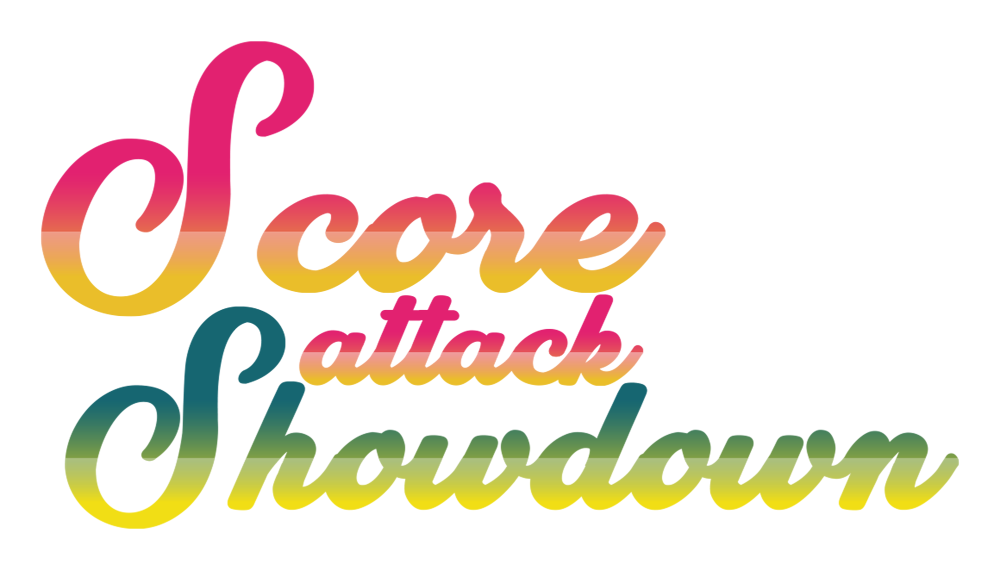

---
tags:
  - SAS
---

# Score Attack Showdown

The **Score Attack Showdown** (***SAS***) was a worldwide 1v1 osu!mania 4K tournament hosted by ::{ flag=US }:: ::KamaTheCrimson::{ user-id=6362259 }. The tournament featured a variety of customly made maps from the most unique and veteran osu!mania 4K mappers in its mappools. It was the first instalment of the Score Attack Showdown.

## Tournament schedule

| Event | Timestamp |
| --: | :-- |
| Registration phase | 2020-09-25/2020-10-19 |
| Screening phase | 2020-10-19 |
| Round 1 | 2020-10-26/2020-10-31 |
| Round 2 | 2020-11-02/2020-11-07 |
| Round 3 | 2020-11-09/2020-11-14 |
| Round 4 | 2020-11-16/2020-11-21 |
| Round 5 | 2020-11-23/2020-11-28 |

## Prizes

| Placing | Prize |
| :-: | :-- |
|  | $100 USD |
|  | $50 USD |
|  | $25 USD |

## Organisation

The Score Attack Showdown was run by various community members.

| Position | Member(s) |
| :-- | :-- |
| Organizer | ::{ flag=US }:: ::KamaTheCrimson::{ user-id=6362259 } |
| Mapper | ::{ flag=ID }:: ::\[Crz\]Crysarlene::{ user-id=5492871 }, ::{ flag=CA }:: ::BringoBrango::{ user-id=10274043 }, ::{ flag=DE }:: ::Cokiiplay::{ user-id=6760124 }, ::{ flag=SE }:: ::Davvy::{ user-id=10047413 }, ::{ flag=TH }:: ::HowToPlayLN::{ user-id=10879600 }, ::{ flag=AR }:: ::juankristal::{ user-id=443656 }, ::{ flag=US }:: ::Kamuy::{ user-id=7439226 }, ::{ flag=US }:: ::-Lethal-::{ user-id=5125822 }, ::{ flag=US }:: ::-mint-::{ user-id=8976576 }, ::{ flag=GB }:: ::Monheim::{ user-id=6814203 }, ::{ flag=US }:: ::Penguinosity::{ user-id=10235296 }, ::{ flag=GB }:: ::Pope Gadget::{ user-id=2288341 }, ::{ flag=SG }:: ::Raveille::{ user-id=1388767 }, ::{ flag=SG }:: ::riunosk::{ user-id=5594381 }, ::{ flag=ID }:: ::Rivals\_7::{ user-id=4610379 }, ::{ flag=TH }:: ::RuleBlazing::{ user-id=7312402 }, ::{ flag=US }:: ::Toaph Daddy::{ user-id=7616811 }, ::{ flag=US }:: ::Valedict::{ user-id=2537082 }, ::{ flag=SE }:: ::Vortex-::{ user-id=4999669 }, ::{ flag=HK }:: ::zero2snow::{ user-id=7751516 } |
| Score validator | ::{ flag=US }:: ::\[GS\]Diamond::{ user-id=13076648 }, ::{ flag=US }:: ::\[ Klondike \]::{ user-id=10946799 } ::{ flag=US }:: ::KamaTheCrimson::{ user-id=6362259 }, ::{ flag=BR }:: ::LeMarcinho::{ user-id=13347579 }, ::{ flag=US }:: ::NovaSagittarii::{ user-id=11664177 }, ::{ flag=US }:: ::Playboi Carti::{ user-id=4833676 }, ::{ flag=US }:: ::---Rose---::{ user-id=9481266 }, ::{ flag=DE }:: ::Sirbeyy::{ user-id=12917829 }, ::{ flag=PL }:: ::SitekX::{ user-id=3840946 }, ::{ flag=GB }:: ::XxNewson1234xX::{ user-id=9895650 } |
| Designer | ::{ flag=US }:: ::KamaTheCrimson::{ user-id=6362259 } |
| Statistician | ::{ flag=SE }:: ::Mestro::{ user-id=4798263 } |
| Wiki editor | ::{ flag=ID }:: ::fajar13k::{ user-id=7100002 } |

## Links

- [Discussion thread](https://osu.ppy.sh/community/forums/topics/1151413)
- [SAS Discord server](https://discord.gg/DJ239vF)
- [Livestream](https://www.twitch.tv/itsmestro)
- [Score submission form](https://forms.gle/B5Rcy618hi5pwamq6)
- **[Statistics sheet](https://docs.google.com/spreadsheets/d/1SN7zflqtF9mb37IeIdKzNbeZuiBttqUL-sdU0Eexwwg/edit#gid=0)**

## Participants

*Note: Global ranks were recorded at the end of registration.*

| Global rank | Player |
| --: | :-- |
| #16 | ::{ flag=MY }:: ::cheewee10::{ user-id=4477497 } |
| #59 | ::{ flag=CL }:: ::\[GS\]Myuka::{ user-id=10072733 } |
| #75 | ::{ flag=US }:: ::stupud man::{ user-id=2141612 } |
| #134 | ::{ flag=BR }:: ::Lothus::{ user-id=9530019 } |
| #274 | ::{ flag=FR }:: ::pimoux::{ user-id=6183047 } |
| #322 | ::{ flag=CA }:: ::loafusofbread::{ user-id=9278959 } |
| #378 | ::{ flag=MX }:: ::Plutes::{ user-id=11188249 } |
| #379 | ::{ flag=MX }:: ::Plutes::{ user-id=11188249 } |
| #404 | ::{ flag=VN }:: ::CPT\_Sivelia::{ user-id=12562107 } |
| #413 | ::{ flag=US }:: ::BaniiYanii::{ user-id=11888159 } |
| #418 | ::{ flag=FI }:: ::LovelyN::{ user-id=8370443 } |
| #427 | ::{ flag=RU }:: ::c1e4r::{ user-id=8693182 } |
| #434 | ::{ flag=BR }:: ::andreymc::{ user-id=5691061 } |
| #448 | ::{ flag=CL }:: ::Rhyzt\_cL::{ user-id=10235085 } |
| #469 | ::{ flag=BR }:: ::Kyut::{ user-id=9328824 } |
| #507 | ::{ flag=GB }:: ::AirSpan::{ user-id=5063207 } |
| #515 | ::{ flag=NL }:: ::Bakuretsue::{ user-id=10960533 } |
| #516 | ::{ flag=MX }:: ::\[Crz\]Crystalize::{ user-id=3072763 } |
| #533 | ::{ flag=US }:: ::mashu::{ user-id=12028216 } |
| #552 | ::{ flag=AU }:: ::Water is good::{ user-id=8222416 } |
| #555 | ::{ flag=ID }:: ::Mipha-::{ user-id=5767941 } |
| #561 | ::{ flag=TW }:: ::Ha0201::{ user-id=12243730 } |
| #594 | ::{ flag=ID }:: ::Yangga::{ user-id=12143152 } |
| #612 | ::{ flag=PH }:: ::Swarmsii::{ user-id=11716111 } |
| #613 | ::{ flag=US }:: ::\[GS\]linc::{ user-id=12093536 } |
| #616 | ::{ flag=GB }:: ::Zycrxd::{ user-id=14245127 } |
| #627 | ::{ flag=EE }:: ::ExludeX::{ user-id=14137067 } |
| #652 | ::{ flag=PH }:: ::Chuck::{ user-id=11517895 } |
| #655 | ::{ flag=ES }:: ::Komirin::{ user-id=4725379 } |
| #685 | ::{ flag=HK }:: ::Dream Fire::{ user-id=11198186 } |
| #691 | ::{ flag=BE }:: ::yetii::{ user-id=6914714 } |
| #727 | ::{ flag=BR }:: ::Remu::{ user-id=8700468 } |
| #747 | ::{ flag=SE }:: ::Lemmie::{ user-id=11700865 } |
| #756 | ::{ flag=US }:: ::\[\_Gearfrik\_\]::{ user-id=8198818 } |
| #787 | ::{ flag=MX }:: ::-Hellscythe-::{ user-id=7837147 } |
| #802 | ::{ flag=GB }:: ::TingTheFirst::{ user-id=12489832 } |
| #814 | ::{ flag=GB }:: ::Zoobin4::{ user-id=10055204 } |
| #835 | ::{ flag=CO }:: ::sebasthefast::{ user-id=14395814 } |
| #850 | ::{ flag=BR }:: ::Sprrumnk Lokii::{ user-id=10622472 } |
| #877 | ::{ flag=US }:: ::leyii::{ user-id=10206161 } |
| #938 | ::{ flag=ID }:: ::\[GS\]Rei::{ user-id=11964257 } |
| #943 | ::{ flag=US }:: ::Yu-::{ user-id=11082377 } |
| #947 | ::{ flag=BE }:: ::Mortelspawn\_::{ user-id=5331420 } |
| #1,004 | ::{ flag=US }:: ::ERA Zenith::{ user-id=7128063 } |
| #1,061 | ::{ flag=US }:: ::Unholy::{ user-id=7672414 } |
| #1,078 | ::{ flag=PY }:: ::MomonSama::{ user-id=7762488 } |
| #1,089 | ::{ flag=US }:: ::Halogen-::{ user-id=169992 } |
| #1,107 | ::{ flag=SG }:: ::IJosephI \[DS\]::{ user-id=13353749 } |
| #1,110 | ::{ flag=CA }:: ::Stability::{ user-id=6701738 } |
| #1,124 | ::{ flag=AU }:: ::siberbule::{ user-id=11495339 } |
| #1,166 | ::{ flag=UY }:: ::HopelessPlayer::{ user-id=12528267 } |
| #1,194 | ::{ flag=FR }:: ::DragonSonic::{ user-id=7294830 } |
| #1,197 | ::{ flag=VN }:: ::-Frostleaf-::{ user-id=11863174 } |
| #1,205 | ::{ flag=BR }:: ::LoockaNosRitmo::{ user-id=14312768 } |
| #1,259 | ::{ flag=US }:: ::\[GS\]Croniken::{ user-id=9989041 } |
| #1,260 | ::{ flag=FI }:: ::Fisu::{ user-id=12545346 } |
| #1,261 | ::{ flag=HK }:: ::Ricizus::{ user-id=10395139 } |
| #1,267 | ::{ flag=BR }:: ::Gabi Kamui::{ user-id=10658391 } |
| #1,295 | ::{ flag=FR }:: ::Magicraft::{ user-id=9274711 } |
| #1,305 | ::{ flag=CL }:: ::Charliegamer::{ user-id=6661676 } |
| #1,310 | ::{ flag=KR }:: ::kdj8381::{ user-id=13600684 } |
| #1,329 | ::{ flag=US }:: ::Trainer-::{ user-id=9331760 } |
| #1,334 | ::{ flag=SE }:: ::Trymatic::{ user-id=14762260 } |
| #1,364 | ::{ flag=PL }:: ::szuncoll::{ user-id=12393014 } |
| #1,395 | ::{ flag=PL }:: ::Hlimak::{ user-id=1340272 } |
| #1,409 | ::{ flag=US }:: ::KinokoOnlyHope::{ user-id=13963967 } |
| #1,524 | ::{ flag=FI }:: ::Oreo::{ user-id=5099222 } |
| #1,538 | ::{ flag=ID }:: ::Suichan203::{ user-id=9821346 } |
| #1,549 | ::{ flag=US }:: ::\[GS\]Antunder::{ user-id=10416995 } |
| #1,611 | ::{ flag=GB }:: ::welshevo79::{ user-id=10510684 } |
| #1,672 | ::{ flag=US }:: ::Logan636::{ user-id=9423766 } |
| #1,679 | ::{ flag=PR }:: ::Juuli13::{ user-id=15204782 } |
| #1,681 | ::{ flag=BR }:: ::Emat5::{ user-id=10475605 } |
| #1,693 | ::{ flag=KR }:: ::LedianORe::{ user-id=4402684 } |
| #1,709 | ::{ flag=SG }:: ::Japeynius::{ user-id=13993659 } |
| #1,743 | ::{ flag=DE }:: ::Niko\_Plays::{ user-id=9409456 } |
| #1,799 | ::{ flag=IT }:: ::WePlant::{ user-id=6997209 } |
| #1,823 | ::{ flag=ID }:: ::Fyl::{ user-id=10069307 } |
| #1,844 | ::{ flag=BR }:: ::Lenn::{ user-id=11236829 } |
| #1,863 | ::{ flag=TH }:: ::- Yomari -::{ user-id=11654947 } |
| #1,864 | ::{ flag=BR }:: ::Soore::{ user-id=15753462 } |
| #1,867 | ::{ flag=CL }:: ::xXCris13Xx::{ user-id=11480970 } |
| #1,905 | ::{ flag=FR }:: ::ZayyKen::{ user-id=8624433 } |
| #1,961 | ::{ flag=US }:: ::Firby\_28::{ user-id=6807462 } |
| #1,975 | ::{ flag=US }:: ::PositoniX::{ user-id=12443485 } |
| #2,008 | ::{ flag=NL }:: ::2fast4you98::{ user-id=5183940 } |
| #2,023 | ::{ flag=BE }:: ::spamblock::{ user-id=11968058 } |
| #2,063 | ::{ flag=HK }:: ::Irone OSU::{ user-id=10678230 } |
| #2,116 | ::{ flag=MX }:: ::\[OSC\]Amagai::{ user-id=9658070 } |
| #2,231 | ::{ flag=US }:: ::Revenant::{ user-id=10533955 } |
| #2,241 | ::{ flag=SG }:: ::doomsday50::{ user-id=11654310 } |
| #2,319 | ::{ flag=NL }:: ::Ready Perfectly::{ user-id=10944966 } |
| #2,337 | ::{ flag=FR }:: ::Kasumii-sama::{ user-id=6177263 } |
| #2,364 | ::{ flag=US }:: ::Vegan::{ user-id=9727747 } |
| #2,406 | ::{ flag=MY }:: ::\[-Leon-\]::{ user-id=13382147 } |
| #2,466 | ::{ flag=US }:: ::ayyOrca::{ user-id=7958845 } |
| #2,503 | ::{ flag=PL }:: ::s\_kolorowa::{ user-id=11430587 } |
| #2,531 | ::{ flag=BR }:: ::Zergh::{ user-id=3181281 } |
| #2,542 | ::{ flag=NL }:: ::NightNarumi::{ user-id=4381142 } |
| #2,621 | ::{ flag=BE }:: ::flyerbram002::{ user-id=12725421 } |
| #2,728 | ::{ flag=BR }:: ::Namirin-chan::{ user-id=6761832 } |
| #2,859 | ::{ flag=SG }:: ::IHxveNoWuhxn::{ user-id=15210942 } |
| #2,871 | ::{ flag=ID }:: ::Soraru Aoki::{ user-id=15636932 } |
| #2,933 | ::{ flag=ID }:: ::HerosonRhymes::{ user-id=12640004 } |
| #3,009 | ::{ flag=FI }:: ::Stiffu::{ user-id=12274556 } |
| #3,283 | ::{ flag=DO }:: ::Antalf::{ user-id=8793773 } |
| #3,295 | ::{ flag=ID }:: ::Fr05tyGD::{ user-id=14230684 } |
| #3,322 | ::{ flag=MY }:: ::Unicow::{ user-id=9444174 } |
| #3,354 | ::{ flag=BR }:: ::Yuragi::{ user-id=8501380 } |
| #3,430 | ::{ flag=AR }:: ::NEDEAAAHHHH::{ user-id=65724 } |
| #3,530 | ::{ flag=FR }:: ::KewaiiGames::{ user-id=14797411 } |
| #3,600 | ::{ flag=MY }:: ::aswdafxc::{ user-id=12054898 } |
| #3,613 | ::{ flag=US }:: ::3lijah::{ user-id=4686148 } |
| #3,654 | ::{ flag=US }:: ::\[LS\]Treeman::{ user-id=14677848 } |
| #3,678 | ::{ flag=VE }:: ::Neko-Pan::{ user-id=8676532 } |
| #3,685 | ::{ flag=PH }:: ::Edison::{ user-id=1325159 } |
| #3,824 | ::{ flag=US }:: ::Feylos::{ user-id=4565040 } |
| #3,931 | ::{ flag=US }:: ::Ninty::{ user-id=11631179 } |
| #3,938 | ::{ flag=BR }:: ::AlgocomB::{ user-id=12298887 } |
| #3,975 | ::{ flag=NZ }:: ::- Abby -::{ user-id=7740118 } |
| #4,024 | ::{ flag=ES }:: ::game\_maker26::{ user-id=4876699 } |
| #4,106 | ::{ flag=CL }:: ::-JustLenny::{ user-id=12793583 } |
| #4,215 | ::{ flag=KR }:: ::S ILY::{ user-id=9766317 } |
| #4,323 | ::{ flag=US }:: ::\[LS\]Crazy::{ user-id=12211556 } |
| #4,503 | ::{ flag=PL }:: ::Mr\_adamello::{ user-id=7420894 } |
| #4,870 | ::{ flag=AR }:: ::boligoma::{ user-id=13310563 } |
| #5,017 | ::{ flag=US }:: ::walnutt::{ user-id=8617859 } |
| #5,331 | ::{ flag=MX }:: ::\[LS\] Shuri::{ user-id=14593518 } |
| #5,546 | ::{ flag=NO }:: ::prebert123::{ user-id=7859738 } |
| #5,607 | ::{ flag=TW }:: ::Joylintp::{ user-id=13579078 } |
| #5,732 | ::{ flag=US }:: ::FlynnMac::{ user-id=13857986 } |
| #6,162 | ::{ flag=AU }:: ::\[LG\]aurusei::{ user-id=14430622 } |
| #6,748 | ::{ flag=BR }:: ::Halo-::{ user-id=7572142 } |

## Podium

This competition has come to an end and resulted in the following podium:

| Placing | Player |
| :-: | :-- |
|  | ::{ flag=MY }:: ::cheewee10::{ user-id=4477497 } |
|  | ::{ flag=CL }:: ::\[GS\]Myuka::{ user-id=10072733 } |
|  | ::{ flag=BR }:: ::Lothus::{ user-id=9530019 } |

## Mappools

### Round 5

**[Download the mappack here! (35 MB)](https://cdn.discordapp.com/attachments/711778005399109687/780169704618721300/SAS_Round_5.zip)**

- Hybrid: [Camellia - B L A C K - R A Y (Toaph Daddy) \[D A R K - M A G I C I A N x1.05\]](https://osu.ppy.sh/beatmapsets/1306124#mania/2707896)
- Tech: [Frums - Quantum Distress Signal (Valedict) \[Hysteria\]](https://osu.ppy.sh/beatmapsets/1233691#mania/2564612)
- LN: [KUMOKIRI - Shippujinrai (\[Crz\]Crysarlene) \[Fulguration\]](https://osu.ppy.sh/beatmapsets/1306632#mania/2709105)
- Wildcard: [The Dillinger Escape Plan - Limerent Death (Valedict) \[Stained Glass\]](https://osu.ppy.sh/beatmapsets/1306724#mania/2709255)

### Round 4

**[Download the mappack here! (30 MB)](https://cdn.discordapp.com/attachments/711778005399109687/777633478010339358/SAS_Round_4.zip)**

- Hybrid: [TRAELMYX - Late For Class! (HowToPlayLN) \[RuleNote don't want to make SV on this difficulty\]](https://osu.ppy.sh/beatmapsets/1279459#mania/2657939)
- Tech: [3l3d3p - Ibitbt (Monheim) \[F4w4rD\]](https://osu.ppy.sh/beatmapsets/1287682#mania/2673545)
- LN: [An - Encryption (Davvy) \[Enigmatic\]](https://osu.ppy.sh/beatmapsets/1298002#mania/2692515)
- Wildcard: [Gram - Sigmund (Sped Up Ver.) (riunosk) \[Conquer\]](https://osu.ppy.sh/beatmapsets/1299648#mania/2696192)

### Round 3

**[Download the mappack here! (24 MB)](https://cdn.discordapp.com/attachments/711778005399109687/775098856210694233/SAS_Round_3.zip)**

- Hybrid: [s-don vs. Hino Isuka - Trrricksters!! (zero2snow) \[Nooonsense!!\]](https://osu.ppy.sh/beatmapsets/1294819#mania/2686701)
- Tech: [Frums - Flashbacklog (Kamuy) \[\< flashback database to username sysdate - Dragolord;\>\]](https://osu.ppy.sh/beatmapsets/1294546#mania/2686268)
- LN: [SOUND HOLIC feat. Nana Takahashi - Wakusei\*Lollipop (-mint-) \[TV Size (Edit)\]](https://osu.ppy.sh/beatmapsets/1147012#mania/2689657)
- Wildcard: [Mili - RTRT (Rivals\_7) \[Black Another\]](https://osu.ppy.sh/beatmapsets/1295080#mania/2687120)

### Round 2

**[Download the mappack here! (27 MB)](https://cdn.discordapp.com/attachments/711778005399109687/772567150929641502/SAS_Round_2.zip)**

- Hybrid: [plusol - Angel Temple (BringoBrango) \[Ascension (SAS edit)\]](https://osu.ppy.sh/beatmapsets/1286284#mania/2670767)
- Tech: [Kola Kid - spaceman (cut) (Vortex-) \[I always wanted you to go, into space man (1.1x)\]](https://osu.ppy.sh/beatmapsets/1290983#mania/2679801)
- LN: [Camellia - potential curve (Raveille) \[diatomic\]](https://osu.ppy.sh/beatmapsets/1196957#mania/2493350)
- Wildcard: [Equinox7 - valerian coma (-Lethal-) \[atrophy\]](https://osu.ppy.sh/beatmapsets/1286278#mania/2670752)

### Round 1

**[Download the mappack here! (20 MB)](https://cdn.discordapp.com/attachments/711916285746872412/770020679361232896/SAS_Round_1.zip)**

- Hybrid: [WEDNESDAY CAMPANELLA - Shakushain (Penguinosity) \[Shakushaku\]](https://osu.ppy.sh/beatmapsets/1282584#mania/2663884)
- Tech: [Ben Briggs - Fearless Living (RuleBlazing) \[Coward\]](https://osu.ppy.sh/beatmapsets/1283930#mania/2666220)
- LN: [Drop x Hatsuki Yura - Le Bijoux (HowToPlayLN) \[Jewelry\]](https://osu.ppy.sh/beatmapsets/1282938#mania/2664488)
- Wildcard: [Jakub Zytecki - Letters (Cokiiplay) \[Voyage\]](https://osu.ppy.sh/beatmapsets/1282382#mania/2663564)

## Match results

*Note: All scores listed are the sum of scores from each mappool. More detailed results are available on the [statistics sheet](https://docs.google.com/spreadsheets/d/1SN7zflqtF9mb37IeIdKzNbeZuiBttqUL-sdU0Eexwwg/edit#gid=0).*

### Round 5

| Position | Player | Score |
| :-- | :-- | --: |
| #1 | ::{ flag=MY }:: ::cheewee10::{ user-id=4477497 } | 3,959,723 |
| #2 | ::{ flag=CL }:: ::\[GS\]Myuka::{ user-id=10072733 } | 3,957,339 |
| #3 | ::{ flag=BR }:: ::Lothus::{ user-id=9530019 } | 3,945,572 |
| #4 | ::{ flag=BR }:: ::andreymc::{ user-id=5691061 } | 3,912,319 |

### Round 4

Only the top 4 players advance to the next round.

| Position | Player | Score |
| :-- | :-- | --: |
| #1 | ::{ flag=BR }:: ::Lothus::{ user-id=9530019 } | 3,980,949 |
| #2 | ::{ flag=CL }:: ::\[GS\]Myuka::{ user-id=10072733 } | 3,978,612 |
| #3 | ::{ flag=BR }:: ::andreymc::{ user-id=5691061 } | 3,977,666 |
| #4 | ::{ flag=MY }:: ::cheewee10::{ user-id=4477497 } | 3,969,820 |
| #5 | ::{ flag=US }:: ::Halogen-::{ user-id=169992 } | 3,952,460 |
| #6 | ::{ flag=US }:: ::mashu::{ user-id=12028216 } | 3,948,095 |
| #7 | ::{ flag=GB }:: ::AirSpan::{ user-id=5063207 } | 0 |
| #8 | ::{ flag=PH }:: ::Chuck::{ user-id=11517895 } | 0 |
| #9 | ::{ flag=US }:: ::Unholy::{ user-id=7672414 } | 0 |

### Round 3

Only the top 9 players advance to the next round.

| Position | Player | Score |
| :-- | :-- | --: |
| #1 | ::{ flag=CL }:: ::\[GS\]Myuka::{ user-id=10072733 } | 3,984,939 |
| #2 | ::{ flag=BR }:: ::andreymc::{ user-id=5691061 } | 3,982,985 |
| #3 | ::{ flag=BR }:: ::Lothus::{ user-id=9530019 } | 3,981,948 |
| #4 | ::{ flag=MY }:: ::cheewee10::{ user-id=4477497 } | 3,980,722 |
| #5 | ::{ flag=US }:: ::Unholy::{ user-id=7672414 } | 3,970,171 |
| #6 | ::{ flag=PH }:: ::Chuck::{ user-id=11517895 } | 3,962,182 |
| #7 | ::{ flag=US }:: ::Halogen-::{ user-id=169992 } | 3,960,891 |
| #8 | ::{ flag=US }:: ::mashu::{ user-id=12028216 } | 3,959,240 |
| #9 | ::{ flag=GB }:: ::AirSpan::{ user-id=5063207 } | 3,952,657 |
| #10 | ::{ flag=SG }:: ::IJosephI \[DS\]::{ user-id=13353749 } | 3,951,549 |
| #11 | ::{ flag=RU }:: ::c1e4r::{ user-id=8693182 } | 3,950,325 |
| #12 | ::{ flag=US }:: ::\[GS\]linc::{ user-id=12093536 } | 3,941,896 |
| #13 | ::{ flag=NL }:: ::2fast4you98::{ user-id=5183940 } | 3,932,390 |
| #14 | ::{ flag=VN }:: ::-Frostleaf-::{ user-id=11863174 } | 0 |
| #15 | ::{ flag=US }:: ::\[GS\]Antunder::{ user-id=10416995 } | 0 |
| #16 | ::{ flag=NL }:: ::Bakuretsue::{ user-id=10960533 } | 0 |
| #17 | ::{ flag=AR }:: ::BossPlays::{ user-id=7341471 } | 0 |
| #18 | ::{ flag=US }:: ::Logan636::{ user-id=9423766 } | 0 |
| #19 | ::{ flag=FI }:: ::LovelyN::{ user-id=8370443 } | 0 |
| #20 | ::{ flag=MX }:: ::Plutes::{ user-id=11188249 } | 0 |
| #21 | ::{ flag=PH }:: ::Swarmsii::{ user-id=11716111 } | 0 |
| #22 | ::{ flag=GB }:: ::TingTheFirst::{ user-id=12489832 } | 0 |
| #23 | ::{ flag=FR }:: ::ZayyKen::{ user-id=8624433 } | 0 |

### Round 2

Only the top 23 players advance to the next round.

| Position | Player | Score |
| :-- | :-- | --: |
| #1 | ::{ flag=MY }:: ::cheewee10::{ user-id=4477497 } | 3,990,040 |
| #2 | ::{ flag=BR }:: ::Lothus::{ user-id=9530019 } | 3,989,689 |
| #3 | ::{ flag=CL }:: ::\[GS\]Myuka::{ user-id=10072733 } | 3,988,238 |
| #4 | ::{ flag=BR }:: ::andreymc::{ user-id=5691061 } | 3,987,346 |
| #5 | ::{ flag=MX }:: ::Plutes::{ user-id=11188249 } | 3,982,394 |
| #6 | ::{ flag=US }:: ::Unholy::{ user-id=7672414 } | 3,981,594 |
| #7 | ::{ flag=PH }:: ::Chuck::{ user-id=11517895 } | 3,980,160 |
| #8 | ::{ flag=FI }:: ::LovelyN::{ user-id=8370443 } | 3,977,297 |
| #9 | ::{ flag=US }:: ::Halogen-::{ user-id=169992 } | 3,972,985 |
| #10 | ::{ flag=US }:: ::Logan636::{ user-id=9423766 } | 3,972,773 |
| #11 | ::{ flag=US }:: ::mashu::{ user-id=12028216 } | 3,971,158 |
| #12 | ::{ flag=AR }:: ::BossPlays::{ user-id=7341471 } | 3,969,853 |
| #13 | ::{ flag=US }:: ::\[GS\]linc::{ user-id=12093536 } | 3,969,636 |
| #14 | ::{ flag=PH }:: ::Swarmsii::{ user-id=11716111 } | 3,969,303 |
| #15 | ::{ flag=VN }:: ::-Frostleaf-::{ user-id=11863174 } | 3,965,052 |
| #16 | ::{ flag=NL }:: ::2fast4you98::{ user-id=5183940 } | 3,963,760 |
| #17 | ::{ flag=GB }:: ::TingTheFirst::{ user-id=12489832 } | 3,962,559 |
| #18 | ::{ flag=US }:: ::\[GS\]Antunder::{ user-id=10416995 } | 3,962,207 |
| #19 | ::{ flag=FR }:: ::ZayyKen::{ user-id=8624433 } | 3,959,814 |
| #20 | ::{ flag=RU }:: ::c1e4r::{ user-id=8693182 } | 3,959,569 |
| #21 | ::{ flag=GB }:: ::AirSpan::{ user-id=5063207 } | 3,958,185 |
| #22 | ::{ flag=SG }:: ::IJosephI \[DS\]::{ user-id=13353749 } | 3,957,976 |
| #23 | ::{ flag=NL }:: ::Bakuretsue::{ user-id=10960533 } | 3,957,936 |
| #24 | ::{ flag=HK }:: ::Ricizus::{ user-id=10395139 } | 3,954,247 |
| #25 | ::{ flag=BE }:: ::Mortelspawn\_::{ user-id=5331420 } | 3,953,730 |
| #26 | ::{ flag=MY }:: ::\[-Leon-\]::{ user-id=13382147 } | 3,953,274 |
| #27 | ::{ flag=US }:: ::Yu-::{ user-id=11082377 } | 3,950,587 |
| #28 | ::{ flag=CA }:: ::Stability::{ user-id=6701738 } | 3,948,490 |
| #29 | ::{ flag=GB }:: ::Zoobin4::{ user-id=10055204 } | 3,946,023 |
| #30 | ::{ flag=BR }:: ::Lenn::{ user-id=11236829 } | 3,943,047 |
| #31 | ::{ flag=CL }:: ::Charliegamer::{ user-id=6661676 } | 3,941,662 |
| #32 | ::{ flag=US }:: ::leyii::{ user-id=10206161 } | 3,933,119 |
| #33 | ::{ flag=PL }:: ::s\_kolorowa::{ user-id=11430587 } | 3,920,454 |
| #34 | ::{ flag=DO }:: ::Antalf::{ user-id=8793773 } | 3,913,516 |
| #35 | ::{ flag=ID }:: ::Fr05tyGD::{ user-id=14230684 } | 3,910,442 |
| #36 | ::{ flag=NL }:: ::Ready Perfectly::{ user-id=10944966 } | 3,905,742 |
| #37 | ::{ flag=BR }:: ::Halo-::{ user-id=7572142 } | 3,898,992 |
| #38 | ::{ flag=PL }:: ::Mr\_adamello::{ user-id=7420894 } | 3,894,838 |
| #39 | ::{ flag=ID }:: ::Fyl::{ user-id=10069307 } | 3,877,272 |
| #40 | ::{ flag=NL }:: ::NightNarumi::{ user-id=4381142 } | 3,740,474 |
| #41 | ::{ flag=BE }:: ::spamblock::{ user-id=11968058 } | 3,735,516 |
| #42 | ::{ flag=US }:: ::BaniiYanii::{ user-id=11888159 } | 0 |
| #43 | ::{ flag=US }:: ::ERA Zenith::{ user-id=7128063 } | 0 |
| #44 | ::{ flag=TW }:: ::Ha0201::{ user-id=12243730 } | 0 |
| #45 | ::{ flag=HK }:: ::Irone OSU::{ user-id=10678230 } | 0 |
| #46 | ::{ flag=TW }:: ::Joylintp::{ user-id=13579078 } | 0 |
| #47 | ::{ flag=BR }:: ::Kyut::{ user-id=9328824 } | 0 |
| #48 | ::{ flag=CA }:: ::loafusofbread::{ user-id=9278959 } | 0 |
| #49 | ::{ flag=ID }:: ::Mipha-::{ user-id=5767941 } | 0 |
| #50 | ::{ flag=PY }:: ::MomonSama::{ user-id=7762488 } | 0 |
| #51 | ::{ flag=BR }:: ::Sprrumnk::{ user-id=10622472 } | 0 |
| #52 | ::{ flag=MY }:: ::Unicow::{ user-id=9444174 } | 0 |
| #53 | ::{ flag=BE }:: ::yetii::{ user-id=6914714 } | 0 |
| #54 | ::{ flag=BR }:: ::Yuragi::{ user-id=8501380 } | 0 |
| #55 | ::{ flag=BR }:: ::Zergh::{ user-id=3181281 } | 0 |

### Round 1

Only the top 55 players advance to the next round.

| Position | Player | Score |
| :-- | :-- | --: |
| #1 | ::{ flag=BR }:: ::andreymc::{ user-id=5691061 } | 3,992,459 |
| #2 | ::{ flag=BR }:: ::Lothus::{ user-id=9530019 } | 3,991,871 |
| #3 | ::{ flag=CL }:: ::\[GS\]Myuka::{ user-id=10072733 } | 3,991,599 |
| #4 | ::{ flag=US }:: ::Logan636::{ user-id=9423766 } | 3,990,380 |
| #5 | ::{ flag=MX }:: ::Plutes::{ user-id=11188249 } | 3,988,513 |
| #6 | ::{ flag=MY }:: ::cheewee10::{ user-id=4477497 } | 3,988,065 |
| #7 | ::{ flag=ID }:: ::Mipha-::{ user-id=5767941 } | 3,987,456 |
| #8 | ::{ flag=US }:: ::Unholy::{ user-id=7672414 } | 3,986,571 |
| #9 | ::{ flag=VN }:: ::-Frostleaf-::{ user-id=11863174 } | 3,985,174 |
| #10 | ::{ flag=FI }:: ::LovelyN::{ user-id=8370443 } | 3,984,596 |
| #11 | ::{ flag=PH }:: ::Chuck::{ user-id=11517895 } | 3,983,766 |
| #12 | ::{ flag=BR }:: ::Yuragi::{ user-id=8501380 } | 3,983,543 |
| #13 | ::{ flag=AR }:: ::BossPlays::{ user-id=7341471 } | 3,983,310 |
| #14 | ::{ flag=PH }:: ::Swarmsii::{ user-id=11716111 } | 3,982,067 |
| #15 | ::{ flag=US }:: ::mashu::{ user-id=12028216 } | 3,981,852 |
| #16 | ::{ flag=NL }:: ::NightNarumi::{ user-id=4381142 } | 3,977,636 |
| #17 | ::{ flag=NL }:: ::2fast4you98::{ user-id=5183940 } | 3,977,294 |
| #18 | ::{ flag=NL }:: ::Ready Perfectly::{ user-id=10944966 } | 3,977,079 |
| #19 | ::{ flag=GB }:: ::AirSpan::{ user-id=5063207 } | 3,976,734 |
| #20 | ::{ flag=US }:: ::\[GS\]linc::{ user-id=12093536 } | 3,976,185 |
| #21 | ::{ flag=BR }:: ::Kyut::{ user-id=9328824 } | 3,976,173 |
| #22 | ::{ flag=GB }:: ::TingTheFirst::{ user-id=12489832 } | 3,975,486 |
| #23 | ::{ flag=MY }:: ::\[-Leon-\]::{ user-id=13382147 } | 3,975,271 |
| #24 | ::{ flag=US }:: ::\[GS\]Antunder::{ user-id=10416995 } | 3,974,440 |
| #25 | ::{ flag=HK }:: ::Ricizus::{ user-id=10395139 } | 3,973,989 |
| #26 | ::{ flag=US }:: ::Halogen-::{ user-id=169992 } | 3,973,795 |
| #27 | ::{ flag=BE }:: ::yetii::{ user-id=6914714 } | 3,973,555 |
| #28 | ::{ flag=US }:: ::ERA Zenith::{ user-id=7128063 } | 3,970,122 |
| #29 | ::{ flag=CL }:: ::Charliegamer::{ user-id=6661676 } | 3,970,022 |
| #30 | ::{ flag=US }:: ::BaniiYanii::{ user-id=11888159 } | 3,970,000 |
| #31 | ::{ flag=NL }:: ::Bakuretsue::{ user-id=10960533 } | 3,968,570 |
| #32 | ::{ flag=SG }:: ::IJosephI \[DS\]::{ user-id=13353749 } | 3,968,363 |
| #33 | ::{ flag=BR }:: ::Zergh::{ user-id=3181281 } | 3,968,036 |
| #34 | ::{ flag=TW }:: ::Ha0201::{ user-id=12243730 } | 3,967,689 |
| #35 | ::{ flag=CA }:: ::Stability::{ user-id=6701738 } | 3,967,117 |
| #36 | ::{ flag=BE }:: ::Mortelspawn\_::{ user-id=5331420 } | 3,964,960 |
| #37 | ::{ flag=BR }:: ::Lenn::{ user-id=11236829 } | 3,964,464 |
| #38 | ::{ flag=CA }:: ::loafusofbread::{ user-id=9278959 } | 3,964,372 |
| #39 | ::{ flag=RU }:: ::c1e4r::{ user-id=8693182 } | 3,962,992 |
| #40 | ::{ flag=US }:: ::leyii::{ user-id=10206161 } | 3,962,968 |
| #41 | ::{ flag=FR }:: ::ZayyKen::{ user-id=8624433 } | 3,961,955 |
| #42 | ::{ flag=HK }:: ::Irone OSU::{ user-id=10678230 } | 3,961,413 |
| #43 | ::{ flag=PY }:: ::MomonSama::{ user-id=7762488 } | 3,960,762 |
| #44 | ::{ flag=GB }:: ::Zoobin4::{ user-id=10055204 } | 3,956,611 |
| #45 | ::{ flag=PL }:: ::s\1kolorowa::{ user-id=11430587 } | 3,954,786 |
| #46 | ::{ flag=PL }:: ::Mr\_adamello::{ user-id=7420894 } | 3,954,368 |
| #47 | ::{ flag=MY }:: ::Unicow::{ user-id=9444174 } | 3,951,033 |
| #48 | ::{ flag=BR }:: ::Halo-::{ user-id=7572142 } | 3,950,372 |
| #49 | ::{ flag=BR }:: ::Sprrumnk Lokii::{ user-id=10622472 } | 3,949,418 |
| #50 | ::{ flag=ID }:: ::Fyl::{ user-id=10069307 } | 3,946,570 |
| #51 | ::{ flag=DO }:: ::Antalf::{ user-id=8793773 } | 3,944,962 |
| #52 | ::{ flag=ID }:: ::Fr05tyGD::{ user-id=14230684 } | 3,942,418 |
| #53 | ::{ flag=TW }:: ::Joylintp::{ user-id=13579078 } | 3,941,747 |
| #54 | ::{ flag=BE }:: ::spamblock::{ user-id=11968058 } | 3,940,981 |
| #55 | ::{ flag=US }:: ::Yu-::{ user-id=11082377 } | 3,937,484 |
| #56 | ::{ flag=GB }:: ::Zycrxd::{ user-id=14245127 } | 3,934,815 |
| #57 | ::{ flag=IT }:: ::WePlant::{ user-id=6997209 } | 3,928,905 |
| #58 | ::{ flag=MY }:: ::aswdafxc::{ user-id=12054898 } | 3,928,039 |
| #59 | ::{ flag=PL }:: ::Hlimak::{ user-id=1340272 } | 3,925,376 |
| #60 | ::{ flag=US }:: ::\[GS\]Croniken::{ user-id=9989041 } | 3,921,714 |
| #61 | ::{ flag=AR }:: ::NEDEAAAHHHH::{ user-id=65724 } | 3,918,527 |
| #62 | ::{ flag=KR }:: ::kdj8381::{ user-id=13600684 } | 3,917,543 |
| #63 | ::{ flag=US }:: ::Revenant::{ user-id=10533955 } | 3,910,519 |
| #64 | ::{ flag=NZ }:: ::- Abby -::{ user-id=7740118 } | 3,909,521 |
| #65 | ::{ flag=US }:: ::walnutt::{ user-id=8617859 } | 3,893,814 |
| #66 | ::{ flag=US }:: ::Feylos::{ user-id=4565040 } | 3,892,215 |
| #67 | ::{ flag=KR }:: ::LedianORE::{ user-id=4402684 } | 3,888,044 |
| #68 | ::{ flag=ES }:: ::game\_maker26::{ user-id=4876699 } | 3,885,489 |
| #69 | ::{ flag=US }:: ::PositoniX::{ user-id=12443485 } | 3,884,766 |
| #70 | ::{ flag=DE }:: ::Niko\_Plays::{ user-id=9409456 } | 3,873,697 |
| #71 | ::{ flag=FI }:: ::Stiffu::{ user-id=12274556 } | 3,870,694 |
| #72 | ::{ flag=SG }:: ::Doomsday50::{ user-id=11654310 } | 3,855,655 |
| #73 | ::{ flag=NO }:: ::prebert123::{ user-id=7859738 } | 3,848,732 |
| #74 | ::{ flag=PR }:: ::Juuli13::{ user-id=15204782 } | 3,843,609 |
| #75 | ::{ flag=FR }:: ::Kasumii-sama::{ user-id=6177263 } | 3,829,809 |
| #76 | ::{ flag=TH }:: ::- Yomari -::{ user-id=11654947 } | 0 |
| #77 | ::{ flag=MX }:: ::-Hellscythe-::{ user-id=7837147 } | 0 |
| #78 | ::{ flag=CL }:: ::-JustLenny::{ user-id=12793583 } | 0 |
| #79 | ::{ flag=US }:: ::\[\_Gearfrik\_\]::{ user-id=8198818 } | 0 |
| #80 | ::{ flag=MX }:: ::\[Crz\]Crystalize::{ user-id=3072763 } | 0 |
| #81 | ::{ flag=ID }:: ::\[GS\]Rei::{ user-id=11964257 } | 0 |
| #82 | ::{ flag=US }:: ::\[LS\]Crazy::{ user-id=12211556 } | 0 |
| #83 | ::{ flag=MX }:: ::\[OSC\]Amagai::{ user-id=9658070 } | 0 |
| #84 | ::{ flag=US }:: ::3lijah::{ user-id=4686148 } | 0 |
| #85 | ::{ flag=BR }:: ::AlgocomB::{ user-id=12298887 } | 0 |
| #86 | ::{ flag=AU }:: ::\[LG\]aurusei::{ user-id=14430622 } | 0 |
| #87 | ::{ flag=US }:: ::ayyOrca::{ user-id=7958845 } | 0 |
| #88 | ::{ flag=AR }:: ::boligoma::{ user-id=13310563 } | 0 |
| #89 | ::{ flag=VN }:: ::CPT\_Sivelia::{ user-id=12562107 } | 0 |
| #90 | ::{ flag=FR }:: ::DragonSonic::{ user-id=7294830 } | 0 |
| #91 | ::{ flag=HK }:: ::Dream Fire::{ user-id=11198186 } | 0 |
| #92 | ::{ flag=PH }:: ::Edison::{ user-id=1325159 } | 0 |
| #93 | ::{ flag=BR }:: ::Emat5::{ user-id=10475605 } | 0 |
| #94 | ::{ flag=EE }:: ::ExludeX::{ user-id=14137067 } | 0 |
| #95 | ::{ flag=US }:: ::Firby\_28::{ user-id=6807462 } | 0 |
| #96 | ::{ flag=FI }:: ::Fisu::{ user-id=12545346 } | 0 |
| #97 | ::{ flag=BE }:: ::flyerbram002::{ user-id=12725421 } | 0 |
| #98 | ::{ flag=US }:: ::FlynnMac::{ user-id=13857986 } | 0 |
| #99 | ::{ flag=BR }:: ::Gabi Kamui::{ user-id=10658391 } | 0 |
| #100 | ::{ flag=ID }:: ::HerosonRhymes::{ user-id=12640004 } | 0 |
| #101 | ::{ flag=UY }:: ::HopelessPlayer::{ user-id=12528267 } | 0 |
| #102 | ::{ flag=SG }:: ::IHxveNoWuhxn::{ user-id=15210942 } | 0 |
| #103 | ::{ flag=SG }:: ::Japeynius::{ user-id=13993659 } | 0 |
| #104 | ::{ flag=FR }:: ::KewaiiGames::{ user-id=14797411 } | 0 |
| #105 | ::{ flag=US }:: ::KinokoOnlyHope::{ user-id=13963967 } | 0 |
| #106 | ::{ flag=ES }:: ::Komirin::{ user-id=4725379 } | 0 |
| #107 | ::{ flag=SE }:: ::Lemmie::{ user-id=11700865 } | 0 |
| #108 | ::{ flag=BR }:: ::LoockaNosRitmo::{ user-id=14312768 } | 0 |
| #109 | ::{ flag=MX }:: ::LukeTheSlug::{ user-id=14593518 } | 0 |
| #110 | ::{ flag=FR }:: ::Magicraft::{ user-id=9274711 } | 0 |
| #111 | ::{ flag=BR }:: ::Namirin-chan::{ user-id=6761832 } | 0 |
| #112 | ::{ flag=VE }:: ::Neko-Pan::{ user-id=8676532 } | 0 |
| #113 | ::{ flag=US }:: ::Ninty::{ user-id=11631179 } | 0 |
| #114 | ::{ flag=FI }:: ::Oreo::{ user-id=5099222 } | 0 |
| #115 | ::{ flag=FR }:: ::Pimoux::{ user-id=6183047 } | 0 |
| #116 | ::{ flag=BR }:: ::Remu::{ user-id=8700468 } | 0 |
| #117 | ::{ flag=CL }:: ::Rhyzt\_cL::{ user-id=10235085 } | 0 |
| #118 | ::{ flag=KR }:: ::S ILY::{ user-id=9766317 } | 0 |
| #119 | ::{ flag=CO }:: ::sebasthefast::{ user-id=14395814 } | 0 |
| #120 | ::{ flag=AU }:: ::siberbule::{ user-id=11495339 } | 0 |
| #121 | ::{ flag=BR }:: ::Soore::{ user-id=15753462 } | 0 |
| #122 | ::{ flag=ID }:: ::Soraru Aoki::{ user-id=15636932 } | 0 |
| #123 | ::{ flag=US }:: ::stupud man::{ user-id=2141612 } | 0 |
| #124 | ::{ flag=ID }:: ::Suichan203::{ user-id=9821346 } | 0 |
| #125 | ::{ flag=PL }:: ::szuncoll::{ user-id=12393014 } | 0 |
| #126 | ::{ flag=US }:: ::Trainer-::{ user-id=9331760 } | 0 |
| #127 | ::{ flag=US }:: ::treeman9923::{ user-id=14677848 } | 0 |
| #128 | ::{ flag=SE }:: ::Trymatic::{ user-id=14762260 } | 0 |
| #129 | ::{ flag=US }:: ::Vegan::{ user-id=9727747 } | 0 |
| #130 | ::{ flag=AU }:: ::Water is good::{ user-id=8222416 } | 0 |
| #131 | ::{ flag=GB }:: ::welshevo79::{ user-id=10510684 } | 0 |
| #132 | ::{ flag=CL }:: ::xXCris13Xx::{ user-id=11480970 } | 0 |
| #133 | ::{ flag=ID }:: ::Yangga::{ user-id=12143152 } | 0 |

## Ruleset

1. Score Attack Showdown is a **1v1 single-elimination tournament**, when participant lose a match, they will get eliminated from the tournament.
2. In order to be eligible to participate in the tournament, follow the instructions below:
   - Participant must have **osu!mania 4K** rank of at least **#5,000** or above when trying to submit their registration form **as well as** when the eligible participants are announced
   - Participant must have not violated the [osu! community rules](/wiki/Rules) within the past 12 months
3. In order for your registration to count, follow the instructions below:
   - Participant must filled the registration form
   - Participant must join the SAS Discord server
4. Failing to complete ruleset #2 or #3 **may result in your registration not being counted**.
5. The scoring system used will be **ScoreV2**.
6. There will be five rounds in the tournament. Each round, participants will be given 5 days (1 work week) to get the highest possible cumulative score across all 4 maps for the running round.
7. Maps will be played with FreeMod. The only allowed mods are FadeIn, Flashlight, Hidden, and SuddenDeath.
8. The mappool will consist of:
   - 1 Hybrid map
   - 1 Technical map
   - 1 Long Notes (LN) map
   - 1 Wildcard map
     - The map will vary from accuracy, speed, and jack oriented skillsets
9. When the participant has achieved a score they feel is the best score they can obtain on the map, they will submit their score in the form of a replay. After that, the score validators will review and verify them.
10. The bottom players from each round will get eliminated while the better players proceed to the next round until there are only 4 players remaining.
11. The player with the highest cumulative score in the Final showdown will be crowned the Score Attack Showdown Champion.
