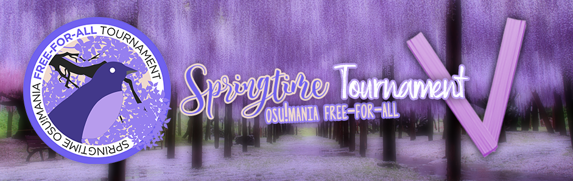

---
tags:
  - SOFT5
  - SOFT 5
---

# Springtime Osu!mania Free-for-all Tournament 5

> SOFT 5 when?\
> Now!

The **Springtime Osu!mania Free-for-all Tournament 5** (***SOFT 5***) was a 1v1 country-independent osu!mania 4-key tournament.

## Tournament schedule

| Event | Timestamp |
| --: | :-- |
| Registration phase | 2021-01-24/2021-02-14 (23:59 UTC) |
| Qualifiers showcase | 2021-02-20 (16:00 UTC) |
| Qualifiers | 2021-02-27/2021-02-28 |
| Playoffs week 1 | 2021-03-06/2021-03-07 |
| Playoffs week 2 | 2021-03-13/2021-03-14 |
| Group stage week 1 | 2021-03-20/2021-03-21 |
| Group stage week 2 | 2021-03-27/2021-03-28 |
| Round of 32 | 2021-04-03/2021-04-04 |
| Round of 16 | 2021-04-10/2021-04-11 |
| Quarterfinals | 2021-04-17/2021-04-18 |
| Semifinals | 2021-04-24/2021-04-25 |
| Finals | 2021-05-01/2021-05-02 |
| Grand Finals | 2021-05-08/2021-05-09 |

## Prizes

The Springtime Osu!mania Free-for-all Tournament 5 offered a $250 minimum cash prize pool!

| Placing | Prize(s) |
| :-: | :-- |
|  | 50% of the prize pool, profile badge |
|  | 34% of the prize pool, profile badge |
|  | 16% of the prize pool, profile badge |

  

## Organisation

| Position | Member(s) |
| :-- | :-- |
| Manager | ::{ flag=AR }:: [juankristal](https://osu.ppy.sh/users/443656), ::{ flag=US }:: [stupud man](https://osu.ppy.sh/users/2141612), ::{ flag=CL }:: [WalterToro](https://osu.ppy.sh/users/5281416) |
| Mappool selector | ::{ flag=BR }:: [Guilhermeziat](https://osu.ppy.sh/users/3661387), ::{ flag=US }:: [lemonguy](https://osu.ppy.sh/users/4693052), ::{ flag=SG }:: [Shoegazer](https://osu.ppy.sh/users/2520707), ::{ flag=US }:: [stupud man](https://osu.ppy.sh/users/2141612), ::{ flag=US }:: [Toaph Daddy](https://osu.ppy.sh/users/7616811) |
| Referee | ::{ flag=NL }:: [Albionthegreat](https://osu.ppy.sh/users/9853595), ::{ flag=PL }:: [Benzopirene](https://osu.ppy.sh/users/1887068), ::{ flag=IN }:: [Speshimen](https://osu.ppy.sh/users/7720204), ::{ flag=GB }:: [StartAndSelect](https://osu.ppy.sh/users/8720555), ::{ flag=US }:: [stupud man](https://osu.ppy.sh/users/2141612), ::{ flag=PH }:: [SurfChu85](https://osu.ppy.sh/users/4469895), ::{ flag=US }:: [Toaph Daddy](https://osu.ppy.sh/users/7616811), ::{ flag=CL }:: [WalterToro](https://osu.ppy.sh/users/5281416), ::{ flag=HK }:: [zero2snow](https://osu.ppy.sh/users/7751516) |
| Streamer | ::{ flag=NL }:: [Albionthegreat](https://osu.ppy.sh/users/9853595), ::{ flag=FI }:: [Camopoltergeist](https://osu.ppy.sh/users/8132964), ::{ flag=AR }:: [juankristal](https://osu.ppy.sh/users/443656), ::{ flag=PL }:: [Kamikaze](https://osu.ppy.sh/users/2124783), ::{ flag=SE }:: [Mestro](https://osu.ppy.sh/users/4798263), ::{ flag=BE }:: [NightNarumi](https://osu.ppy.sh/users/4381142), ::{ flag=US }:: [Penguinosity](https://osu.ppy.sh/users/10235296), ::{ flag=US }:: [stupud man](https://osu.ppy.sh/users/2141612) |
| Commentator | ::{ flag=NL }:: [Albionthegreat](https://osu.ppy.sh/users/9853595), ::{ flag=ID }:: [\[Crz\]Crysarlene](https://osu.ppy.sh/users/5492871), ::{ flag=SE }:: [Davvy](https://osu.ppy.sh/users/10047413), ::{ flag=US }:: [Halogen-](https://osu.ppy.sh/users/169992), ::{ flag=AR }:: [juankristal](https://osu.ppy.sh/users/443656), ::{ flag=PL }:: [Kamikaze](https://osu.ppy.sh/users/2124783), ::{ flag=US }:: [-mint-](https://osu.ppy.sh/users/8976576), ::{ flag=ID }:: [Mipha-](https://osu.ppy.sh/users/5767941), ::{ flag=FR }:: [Paturages](https://osu.ppy.sh/users/1375479), ::{ flag=AU }:: [PingLaw](https://osu.ppy.sh/users/5401523), ::{ flag=AU }:: [PotassiumF](https://osu.ppy.sh/users/4247722), ::{ flag=SG }:: [Raveille](https://osu.ppy.sh/users/1388767), ::{ flag=SG }:: [Shoegazer](https://osu.ppy.sh/users/2520707), ::{ flag=US }:: [stupud man](https://osu.ppy.sh/users/2141612), ::{ flag=US }:: [Toaph Daddy](https://osu.ppy.sh/users/7616811), ::{ flag=CL }:: [WalterToro](https://osu.ppy.sh/users/5281416) |
| Designer | ::{ flag=PH }:: [OsuMe65](https://osu.ppy.sh/users/852867), ::{ flag=US }:: [stupud man](https://osu.ppy.sh/users/2141612) |
| Statistician | ::{ flag=SG }:: [Shoegazer](https://osu.ppy.sh/users/2520707), ::{ flag=PH }:: [SurfChu85](https://osu.ppy.sh/users/4469895) |

## Links

- [Discussion thread](https://osu.ppy.sh/community/forums/topics/1232110)
- [Livestream](https://www.twitch.tv/osusoft)
- [SOFT Discord server](https://discord.gg/qd575a3)
- [Challonge](https://challonge.com/SOFT5)

## Participants

| Seed | Users |
| :-- | :-- |
| Top (#1 - #16) | ::{ flag=CL }:: [\[GS\]Myuka](https://osu.ppy.sh/users/10072733), ::{ flag=BR }:: [SillyFangirl](https://osu.ppy.sh/users/2288363), ::{ flag=GB }:: [XxNewson1234xX](https://osu.ppy.sh/users/9895650), ::{ flag=PH }:: [Silhoueska Elze](https://osu.ppy.sh/users/11517895), ::{ flag=GB }:: [Pope Gadget](https://osu.ppy.sh/users/2288341), ::{ flag=TH }:: [HowToPlayLN](https://osu.ppy.sh/users/10879600), ::{ flag=PH }:: [bojii](https://osu.ppy.sh/users/10083439), ::{ flag=US }:: [Alter-](https://osu.ppy.sh/users/4980256), ::{ flag=JP }:: [AMDuskia1996](https://osu.ppy.sh/users/10242062), ::{ flag=FR }:: [Auraah](https://osu.ppy.sh/users/10015908), ::{ flag=US }:: [BaniiYanii](https://osu.ppy.sh/users/11888159), ::{ flag=US }:: [mashu](https://osu.ppy.sh/users/12028216), ::{ flag=GB }:: [Yonk\_](https://osu.ppy.sh/users/5156656), ::{ flag=AR }:: [BossPlays](https://osu.ppy.sh/users/7341471), ::{ flag=US }:: [Halogen-](https://osu.ppy.sh/users/169992), ::{ flag=FR }:: [ZayyKen](https://osu.ppy.sh/users/8624433) |
| High (#17 - #32) | ::{ flag=VN }:: [Asrielly](https://osu.ppy.sh/users/2656302), ::{ flag=US }:: [Geno\_](https://osu.ppy.sh/users/19392649), ::{ flag=PH }:: [TheMysteryL](https://osu.ppy.sh/users/14113974), ::{ flag=US }:: [WaterMelonTube](https://osu.ppy.sh/users/11937337), ::{ flag=GB }:: [xSnaggles](https://osu.ppy.sh/users/3799946), ::{ flag=AR }:: [\[Crz\]kOvID-](https://osu.ppy.sh/users/13858488), ::{ flag=US }:: [ERA Zenith](https://osu.ppy.sh/users/7128063), ::{ flag=IT }:: [Jeersy](https://osu.ppy.sh/users/11636434), ::{ flag=BR }:: [\[LS\]LeMarcinho](https://osu.ppy.sh/users/13347579), ::{ flag=VN }:: [CPT\_Sivelia](https://osu.ppy.sh/users/12562107), ::{ flag=GB }:: [Zoobin4](https://osu.ppy.sh/users/10055204), ::{ flag=VE }:: [\_Yisus\_](https://osu.ppy.sh/users/1489811), ::{ flag=DE }:: [jkzu123](https://osu.ppy.sh/users/15806513), ::{ flag=TH }:: [ZCFirsTT](https://osu.ppy.sh/users/11179361), ::{ flag=UY }:: [etterna in osu](https://osu.ppy.sh/users/5243536), ::{ flag=AR }:: [gxrl](https://osu.ppy.sh/users/13226626) |
| Low (#33 - #96) | ::{ flag=PL }:: [DaDarkDragon](https://osu.ppy.sh/users/8902097), ::{ flag=US }:: [TTenko](https://osu.ppy.sh/users/13802345), ::{ flag=US }:: [etterna and osu](https://osu.ppy.sh/users/13712190), ::{ flag=US }:: [ASharpp](https://osu.ppy.sh/users/12657177), ::{ flag=AU }:: [ruka](https://osu.ppy.sh/users/6117525), ::{ flag=NL }:: [Bakuretsue](https://osu.ppy.sh/users/10960533), ::{ flag=TH }:: [SHOKO -](https://osu.ppy.sh/users/10279743), ::{ flag=CH }:: [Tupidix](https://osu.ppy.sh/users/8655604), ::{ flag=BR }:: [Yuragi](https://osu.ppy.sh/users/8501380), ::{ flag=CA }:: [Stability](https://osu.ppy.sh/users/6701738), ::{ flag=GB }:: [AirSpan](https://osu.ppy.sh/users/5063207), ::{ flag=CL }:: [\[Crz\]Arkener](https://osu.ppy.sh/users/4116072), ::{ flag=IE }:: [SPLOwON](https://osu.ppy.sh/users/15225195), ::{ flag=US }:: [HeZeuS](https://osu.ppy.sh/users/7387788), ::{ flag=GB }:: [Zycrxd](https://osu.ppy.sh/users/14245127), ::{ flag=US }:: [\[GS\]Antunder](https://osu.ppy.sh/users/10416995), ::{ flag=GB }:: [PikachuNick](https://osu.ppy.sh/users/4168230), ::{ flag=BR }:: [Gabi Kamui](https://osu.ppy.sh/users/10658391), ::{ flag=MY }:: [Cryolien](https://osu.ppy.sh/users/1626983), ::{ flag=SG }:: [AdamAckerville](https://osu.ppy.sh/users/12297375), ::{ flag=US }:: [oleka](https://osu.ppy.sh/users/9423766), ::{ flag=US }:: [Unholy](https://osu.ppy.sh/users/7672414), ::{ flag=PH }:: [\[LS\]Acestrol](https://osu.ppy.sh/users/13470043), ::{ flag=TH }:: [Freshky](https://osu.ppy.sh/users/11959687), ::{ flag=ES }:: [Guldakh](https://osu.ppy.sh/users/8553078), ::{ flag=FR }:: [Ping36](https://osu.ppy.sh/users/9388217), ::{ flag=BR }:: [Lenn](https://osu.ppy.sh/users/11236829), ::{ flag=GB }:: [Solleks](https://osu.ppy.sh/users/9683287), ::{ flag=PL }:: [Tidek](https://osu.ppy.sh/users/743282), ::{ flag=SG }:: [Polytetral](https://osu.ppy.sh/users/8612061), ::{ flag=BR }:: [Soore](https://osu.ppy.sh/users/15753462), ::{ flag=MY }:: [[-Leon-]](https://osu.ppy.sh/users/13382147), ::{ flag=AR }:: [Ingrid10](https://osu.ppy.sh/users/9786011), ::{ flag=PY }:: [MomonSama](https://osu.ppy.sh/users/7762488), ::{ flag=NZ }:: [CappK](https://osu.ppy.sh/users/16837177), ::{ flag=PL }:: [SitekX](https://osu.ppy.sh/users/3840946), ::{ flag=NL }:: [2fast4you98](https://osu.ppy.sh/users/5183940), ::{ flag=US }:: [Ery](https://osu.ppy.sh/users/9872668), ::{ flag=HU }:: [Verald](https://osu.ppy.sh/users/5766307), ::{ flag=AU }:: [Vegemite](https://osu.ppy.sh/users/13111686), ::{ flag=ID }:: [RetroEX](https://osu.ppy.sh/users/10540515), ::{ flag=TH }:: [LoliconTowa](https://osu.ppy.sh/users/8103540), ::{ flag=GB }:: [Hayabusa](https://osu.ppy.sh/users/3104108), ::{ flag=CL }:: [Xan-](https://osu.ppy.sh/users/5919873), ::{ flag=CA }:: [CommandoBlack](https://osu.ppy.sh/users/7025841), ::{ flag=FR }:: [DragonSonic](https://osu.ppy.sh/users/7294830), ::{ flag=ID }:: [\[ReyZ\]](https://osu.ppy.sh/users/16768803), ::{ flag=TH }:: [shokoha](https://osu.ppy.sh/users/14134289), ::{ flag=BE }:: [Mortelspawn_](https://osu.ppy.sh/users/5331420), ::{ flag=CA }:: [\[ro\]Nosteal](https://osu.ppy.sh/users/8160564), ::{ flag=US }:: [thatcow](https://osu.ppy.sh/users/10629473), ::{ flag=HK }:: [Quotient GD](https://osu.ppy.sh/users/11313227), ::{ flag=US }:: [-Lethal-](https://osu.ppy.sh/users/5125822), ::{ flag=US }:: [\_Seth](https://osu.ppy.sh/users/8111953), ::{ flag=BR }:: [Zergh](https://osu.ppy.sh/users/3181281), ::{ flag=SG }:: [\[LS\]PlzNjoyGame](https://osu.ppy.sh/users/15210942), ::{ flag=HK }:: [Dream Fire](https://osu.ppy.sh/users/11198186), ::{ flag=US }:: [blizzo](https://osu.ppy.sh/users/13581430), ::{ flag=NL }:: [samuelhklumpers](https://osu.ppy.sh/users/10945523), ::{ flag=PH }:: [MowseChow](https://osu.ppy.sh/users/11341964), ::{ flag=DE }:: [Sirbeyy](https://osu.ppy.sh/users/12917829), ::{ flag=ID }:: [Proxae](https://osu.ppy.sh/users/8410575), ::{ flag=DK }:: [Jole](https://osu.ppy.sh/users/2883132), ::{ flag=AR }:: [prodilex](https://osu.ppy.sh/users/9472628) |
| Bottom (#97 - #128) | ::{ flag=US }:: [Matthia](https://osu.ppy.sh/users/19804607), ::{ flag=US }:: [ok bye](https://osu.ppy.sh/users/15063813), ::{ flag=ID }:: [nayuu](https://osu.ppy.sh/users/12561379), ::{ flag=MY }:: [-Einar-](https://osu.ppy.sh/users/8782656), ::{ flag=PE }:: [Kien io](https://osu.ppy.sh/users/10055648), ::{ flag=ID }:: [Brinhildr](https://osu.ppy.sh/users/5833779), ::{ flag=MX }:: [\[LS\]Shuri](https://osu.ppy.sh/users/14593518), ::{ flag=VN }:: [Lottery61](https://osu.ppy.sh/users/13821222), ::{ flag=US }:: [Tazin\_](https://osu.ppy.sh/users/9499508), ::{ flag=ES }:: [RandomeLoL](https://osu.ppy.sh/users/7080063), ::{ flag=NZ }:: [sophhhia](https://osu.ppy.sh/users/14833226), ::{ flag=BR }:: [Crymeno](https://osu.ppy.sh/users/6165105), ::{ flag=PH }:: [Eon Musk](https://osu.ppy.sh/users/12239110), ::{ flag=IT }:: [Kiraz](https://osu.ppy.sh/users/3807675), ::{ flag=RU }:: [wolfpup08](https://osu.ppy.sh/users/11939641), ::{ flag=BR }:: [Namirin-chan](https://osu.ppy.sh/users/6761832), ::{ flag=BR }:: [soutin](https://osu.ppy.sh/users/11771029), ::{ flag=PH }:: [DaMeMeThEiFxD](https://osu.ppy.sh/users/14324153), ::{ flag=TH }:: [basicmaime](https://osu.ppy.sh/users/6537441), ::{ flag=AR }:: [jLuyalb](https://osu.ppy.sh/users/7093698), ::{ flag=BE }:: [spamblock](https://osu.ppy.sh/users/11968058), ::{ flag=PL }:: [\_underjoy](https://osu.ppy.sh/users/2235750), ::{ flag=US }:: [dinga dog](https://osu.ppy.sh/users/12206447), ::{ flag=DE }:: [Niko\_Plays](https://osu.ppy.sh/users/9409456), ::{ flag=ID }:: [Fyl](https://osu.ppy.sh/users/10069307), ::{ flag=NL }:: [NightNarumi](https://osu.ppy.sh/users/4381142), ::{ flag=TH }:: [MIkuaimbot](https://osu.ppy.sh/users/17699745), ::{ flag=DE }:: [medium kek](https://osu.ppy.sh/users/11625617), ::{ flag=US }:: [zVols](https://osu.ppy.sh/users/17057515), ::{ flag=PL }:: [Mr\_adamello](https://osu.ppy.sh/users/7420894), ::{ flag=SE }:: [Trymatic](https://osu.ppy.sh/users/14762260), ::{ flag=PH }:: [- O R E O](https://osu.ppy.sh/users/17802217) |

## Groups

| Group | Top | High | Mid | Low |
| :-: | :-- | :-- | :-- | :-- |
| **A** | ::{ flag=FR }:: ZayyKen | ::{ flag=AR }:: gxrl | ::{ flag=GB }:: Zycrxd | ::{ flag=ES }:: Guldakh |
| **B** | ::{ flag=GB }:: Yonk\_ | ::{ flag=US }:: etterna and osu | ::{ flag=SG }:: AdamAckerville | ::{ flag=BR }:: Lenn |
| **C** | ::{ flag=PH }:: bojii | ::{ flag=GB }:: Zoobin4 | ::{ flag=BR }:: Yuragi | ::{ flag=NL }:: NightNarumi |
| **D** | ::{ flag=US }:: Halogen- | ::{ flag=PL }:: DaDarkDragon | ::{ flag=BR }:: Gabi Kamui | ::{ flag=US }:: -Lethal- |
| **E** | ::{ flag=GB }:: XxNewson1234xX | ::{ flag=AR }:: \[Crz\]kOvID- | ::{ flag=CA }:: Stability | ::{ flag=PH }:: \[LS\]Acestrol |
| **F** | ::{ flag=AR }:: BossPlays | ::{ flag=US }:: ASharpp | ::{ flag=US }:: oleka | ::{ flag=PL }:: Tidek |
| **G** | ::{ flag=US }:: mashu | ::{ flag=US }:: WaterMelonTube | ::{ flag=CH }:: Tupidix | ::{ flag=ID }:: nayuu |
| **H** | ::{ flag=CL }:: \[GS\]Myuka | ::{ flag=BR }:: \[LS\]LeMarcinho | ::{ flag=IE }:: SPLOwON | ::{ flag=PY }:: MomonSama |
| **I** | ::{ flag=JP }:: AMDuskia1996 | ::{ flag=VN }:: Asrielly | ::{ flag=GB }:: AirSpan | ::{ flag=PE }:: Kien io |
| **J** | ::{ flag=GB }:: Pope Gadget | ::{ flag=UY }:: etterna in osu | ::{ flag=MY }:: Cryolien | ::{ flag=IT }:: Kiraz |
| **K** | ::{ flag=US }:: Alter- | ::{ flag=US }:: ERA Zenith | ::{ flag=AU }:: ruka | ::{ flag=SG }:: Polytetral |
| **L** | ::{ flag=PH }:: Silhoueska Elze | ::{ flag=DE }:: jkzu123 | ::{ flag=US }:: \[GS\]Antunder | ::{ flag=US }:: Unholy |
| **M** | ::{ flag=US }:: BaniiYanii | ::{ flag=GB }:: xSnaggles | ::{ flag=US }:: HeZeuS | ::{ flag=NL }:: 2fast4you98 |
| **N** | ::{ flag=TH }:: HowToPlayLN | ::{ flag=US }:: Geno\_ | ::{ flag=TH }:: SHOKO - | ::{ flag=MY }:: \[-Leon-\] |
| **O** | ::{ flag=BR }:: SillyFangirl | ::{ flag=IT }:: Jeersy | ::{ flag=GB }:: PikachuNick | ::{ flag=FR }:: Ping36 |
| **P** | ::{ flag=FR }:: Auraah | ::{ flag=US }:: TTenko | ::{ flag=NL }:: Bakuretsue | ::{ flag=TH }:: Freshky |

## Podium

This competition has come to an end and resulted in the following podium:

| Placing | User |
| :-: | :-- |
|  | ::{ flag=CL }:: [**\[GS\]Myuka**](https://osu.ppy.sh/users/10072733) |
|  | ::{ flag=PH }:: [**bojii**](https://osu.ppy.sh/users/10083439) |
|  | ::{ flag=BR }:: [**SillyFangirl**](https://osu.ppy.sh/users/2288363) |

## Mappools

### Grand Finals

- FreeMod
  1. [Kuribayashi Minami - ZERO!! (stupud man) \[Skwid's Challenge 1.1x\]](https://osu.ppy.sh/beatmapsets/1450344#mania/2981853)
  2. [DJ SHARPNEL - STRANGEPROGRAM (Shoegazer) \[Malfunction 1.3x (280bpm)\]](https://osu.ppy.sh/beatmapsets/1393835#mania/2888754)
  3. [Falcom Sound Team jdk - GENS D'ARMES (lemonguy) \[Gendarme\]](https://osu.ppy.sh/beatmapsets/1199166#mania/2497240)
  4. [BEMANI Sound Team "L.E.D. VS. L.E.D.-G" - KILL EACH OTHER (stupud man) \[SAVAGE COLOSSEUM\]](https://osu.ppy.sh/beatmapsets/1412098#mania/2910952)
  5. [Xanopticon - Psicicite (Shoegazer) \[Extra 1.2x (216bpm)\]](https://osu.ppy.sh/beatmapsets/659977#mania/2861210)
  6. [Outsider - Acquaintance (Guilhermeziat) \[Skwid's Challenge 1.15x\]](https://osu.ppy.sh/beatmapsets/1450363#mania/2981896)
  7. [YZYX - Dysnomia (Chrubble) \[Aphasia 1.15x\]](https://osu.ppy.sh/beatmapsets/867111#mania/2595609)
  8. [Aquellex - Tachyon Beam Cannon (lemonguy) \[Challenge\]](https://osu.ppy.sh/beatmapsets/1450333#mania/2981831)
  9. [Nanahoshi Kangen Gakudan feat.Matsushita - Dansu Nanbaa wo Tomo ni (juankristal) \[T1M1N6 H311\]](https://osu.ppy.sh/beatmapsets/1252675#mania/2603455)
  10. [DJ Genki vs Gram - Einherjar Joker (MyZterioN-) \[Andhrimnir\]](https://osu.ppy.sh/beatmapsets/1210981#mania/2520929)
  11. [Hatsuki Yura - The Clockwork Rose -Tokei Shikake no Bara Shoujo- (lemonguy) \[LN Master Cut x1.15\]](https://osu.ppy.sh/beatmapsets/1450330#mania/2981825)
  12. [LeaF - Kyouki Ranmai (\_underjoy) \[Schizoid\]](https://osu.ppy.sh/beatmapsets/864118#mania/1807364)
  13. [Camellia feat. Nanahira - finorza (Flappy_BOX) \[F1n4l Judg3m3nt\]](https://osu.ppy.sh/beatmapsets/1162945#mania/2425834)
  14. [Camellia - B L A C K - R A Y (Toaph Daddy) \[D A R K - M A G I C I A N x1.1\]](https://osu.ppy.sh/beatmapsets/1306124#mania/2707897)
  15. [Camellia - Xeroa (stupud man) \[Stage 0: Genesis\]](https://osu.ppy.sh/beatmapsets/1450345#mania/2981859)
  16. [Juggernaut - OLPHEUX (lemonguy) \[MAXIMUM\]](https://osu.ppy.sh/beatmapsets/1450331#mania/2981829)
- Tiebreaker
  1. **[HertzDevil - Apocynthion Drive (lemonguy) \[Oblivion x1.1\]](https://osu.ppy.sh/beatmapsets/1270416#mania/2981834)**

### Finals

- FreeMod
  1. [HOWL BE QUIET - Wake We Up (Guilhermeziat) \[Skwid's Challenge\]](https://osu.ppy.sh/beatmapsets/1443429#mania/2969170)
  2. [DJ SHARPNEL - SHIND BAD (Shoegazer) \[Nagisa 1.35x (cut)\]](https://osu.ppy.sh/beatmapsets/1386270#mania/2865241)
  3. [DJ SHARPNEL - BURST LINKER (Fullerene-) \[INCARNATE 1.3x\]](https://osu.ppy.sh/beatmapsets/1404148#mania/2896051)
  4. [kors k - the shadow (stupud man) \[realm\]](https://osu.ppy.sh/beatmapsets/1403650#mania/2895138)
  5. [KASHIWA Daisuke - Aqua Regia (Shoegazer) \[Crystalline (edit)\]](https://osu.ppy.sh/beatmapsets/1389980#mania/2959965)
  6. [teranoid & mc natsack feat. good-cool - M.A.G.I.C speed ball (Guilhermeziat) \[nothing magical here\]](https://osu.ppy.sh/beatmapsets/1174964#mania/2450703)
  7. [Virtual Riot - Shindeiru (lemonguy) \[Edit x1.1\]](https://osu.ppy.sh/beatmapsets/866120#mania/2968847)
  8. [Fear and Loathing in Las Vegas - Virtue and Vice (lemonguy) \[Klaius and Skwid's Challenge 1.15x\]](https://osu.ppy.sh/beatmapsets/1443334#mania/2968869)
  9. [Cilvery - Kamisama Nejimaki (juankristal) \[TIMING HELL\]](https://osu.ppy.sh/beatmapsets/1050794#mania/2196171)
  10. [Penoreri - Lancelot \~Flame of the Rebellion\~ (Gekido-) \[LN Master\]](https://osu.ppy.sh/beatmapsets/1211967#mania/2522704)
  11. [Camellia - Break The Silence ([Crz]Crysarlene) \[Serenity (intro cut)\]](https://osu.ppy.sh/beatmapsets/1027910#mania/2898504)
  12. [Kommisar - Turkey Turkey (lemonguy) \[LN Master (cut) 1.05x\]](https://osu.ppy.sh/beatmapsets/852916#mania/2968864)
  13. [funauo - Mousou Seizou Sanka (-mint-) \[Another (NSV) 1.1x\]](https://osu.ppy.sh/beatmapsets/1047347#mania/2189520)
  14. [Final Sketch feat. rgLed - Violent Arcade (Toaph Daddy) \[Sudden Death x1.1\]](https://osu.ppy.sh/beatmapsets/1245864#mania/2592116)
  15. [BEMANI Sound Team "HuMer vs dj Hellix" - EMERALDAS (stupud man) \[CHAOS CONTROL 1.15x\]](https://osu.ppy.sh/beatmapsets/1416026#mania/2918198)
  16. [Camellia - Arcology On Permafrost (stupud man) \[-mint-'s Frozen World (cut) 1.1x\]](https://osu.ppy.sh/beatmapsets/1443349#mania/2968918)
- Tiebreaker
  1. **[Camellia - Dans la mer de son (Toaph Daddy) \[Diabolos x1.05\]](https://osu.ppy.sh/beatmapsets/1443348#mania/2968915)**

### Semifinals

- FreeMod
  1. [amazarashi - Kisetsu wa Tsugitsugi Shindeiku (Valedict) \[Augenbinde\]](https://osu.ppy.sh/beatmapsets/433958#mania/935267)
  2. [Betwixt & Between - hydra (short edit) (Shoegazer) \[rebellion 1.35x (256bpm)\]](https://osu.ppy.sh/beatmapsets/1372891#mania/2840521)
  3. [Tech N9ne feat. Eminem & Krizz Kaliko - Speedom (Guilhermeziat) \[Skwid's Challenge\]](https://osu.ppy.sh/beatmapsets/1436332#mania/2955311)
  4. [Manabu Namiki - TENSHI (True Final Boss) (Mipha-) \[miphather 1.05x\]](https://osu.ppy.sh/beatmapsets/1187597#mania/2558167)
  5. [Terminal 11 - Staple On Smile (Guilhermeziat) \[hi19hi19's Extreme (OD8)\]](https://osu.ppy.sh/beatmapsets/1436328#mania/2955298)
  6. [Truongasm - Cutie Puffs (Guilhermeziat) \[Skwid's Challenge\]](https://osu.ppy.sh/beatmapsets/1436331#mania/2955306)
  7. [Venetian Snares - Frictional Nevada (Gekido-) \[Challenge x1.1\]](https://osu.ppy.sh/beatmapsets/1047387#mania/2503459)
  8. [MDK - Press Start (juankristal) \[1up\]](https://osu.ppy.sh/beatmapsets/850118#mania/1777456)
  9. [MAX MAXIMIZER VS DJ TOTTO - Rebellio (stupud man) \[BLOOD MEFIST\]](https://osu.ppy.sh/beatmapsets/1401067#mania/2890395)
  10. [Camellia - werewolf howls. (lemonguy) \[LNFINITE.\]](https://osu.ppy.sh/beatmapsets/1435835#mania/2954313)
  11. [Nekomata Master - Despair of ELFERIA (FelixSpade) \[LN Prodigy\]](https://osu.ppy.sh/beatmapsets/975960#mania/2063398)
  12. [Camellia - \* Erm, could it be a Spatiotemporal ShockWAVE Syndrome...? (Suu is my waifu) \[\*Maximum...?\]](https://osu.ppy.sh/beatmapsets/1089836#mania/2278486)
  13. [Frums - Star of the COME ON!! (Toaph Daddy) \[Supernova\]](https://osu.ppy.sh/beatmapsets/1313199#mania/2721473)
  14. [Camellia - #1f1e33 (Eclipse-) \[Eclipse & Sitek's Sapphire Dusk\]](https://osu.ppy.sh/beatmapsets/1241616#mania/2581351)
- Tiebreaker
  1. **[Camellia Vs. Expander - AZISAI (Long ver.) (MyZterioN-) \[Shattered Rain [1.05x Rate]\]](https://osu.ppy.sh/beatmapsets/1138055#mania/2427858)**

### Quarterfinals

- FreeMod
  1. [Tommy heavenly6 - PAPERMOON (lemonguy) \[Skwid's Challenge\]](https://osu.ppy.sh/beatmapsets/1429569#mania/2942945)
  2. [Kotori - Nanamori (youth Remix) (Shoegazer) \[Escapade 1.15x (247bpm)\]](https://osu.ppy.sh/beatmapsets/1360301#mania/2815021)
  3. [DJ Sharpnel - BLUE NOAH 2006 (Wh1teh) \[1.2x\]](https://osu.ppy.sh/beatmapsets/1392117#mania/2874328)
  4. [Echo !mage - Skulk (Guilhermeziat) \[Hidden\]](https://osu.ppy.sh/beatmapsets/1429639#mania/2943073)
  5. [PUP - DVP (Chrubble) \[still fucked up over you\]](https://osu.ppy.sh/beatmapsets/645460#mania/1367763)
  6. [callasoiled - Recombination (Elekton) \[meiosis\]](https://osu.ppy.sh/beatmapsets/754364#mania/1588236)
  7. [Pegboard Nerds - Swamp Thing (Shoegazer) \[Swampgator (162bpm)\]](https://osu.ppy.sh/beatmapsets/1227404#mania/2553540)
  8. [Nekomata Master - Scars of FAUNA (Raveille) \[Orchid\]](https://osu.ppy.sh/beatmapsets/846374#mania/1770185)
  9. [Hino Isuka - #be\_fortunate (HowToPlayLN) \[#be\_edited\]](https://osu.ppy.sh/beatmapsets/1099229#mania/2349916)
  10. [uno & D.watt (IOSYS TRAX) - #Endroll (ByeForNow) \[LN-VENLY\]](https://osu.ppy.sh/beatmapsets/759313#mania/2156119)
  11. [An - Catanoph (Toaph Daddy) \[Eternity (cut)\]](https://osu.ppy.sh/beatmapsets/696257#mania/2939618)
  12. [SLAM & NATO - PARADOXX (lemonguy) \[Challenge\]](https://osu.ppy.sh/beatmapsets/1166344#mania/2432909)
  13. [lapix - Carry Me Away (arpia97) \[Daybreak\]](https://osu.ppy.sh/beatmapsets/858142#mania/1793444)
  14. [Marmalade butcher - Ushinaharerurunazuki (Suu is my waifu) \[Uteruchesis\]](https://osu.ppy.sh/beatmapsets/1023160#mania/2495433)
- Tiebreaker
  1. **[Camellia - Arche (-mint-) \[Camellia\]](https://osu.ppy.sh/beatmapsets/1429563#mania/2942932)**

### Round of 16

- FreeMod
  1. [Phantasma - Illumination of the Sky (Guilhermeziat) \[It's dark tho\]](https://osu.ppy.sh/beatmapsets/1422636#mania/2929914)
  2. [The Quick Brown Fox - Serious Shit (Jole) \[ilikexd but the holds died\]](https://osu.ppy.sh/beatmapsets/842331#mania/2039249)
  3. [Betwixt & Between - 12 little fragments of silence (Shoegazer) \[absolution 1.05x (231bpm)\]](https://osu.ppy.sh/beatmapsets/905867#mania/2784535)
  4. [Zekk - Feelsleft0ut (Kamuy) \[chrubble's al0ne\]](https://osu.ppy.sh/beatmapsets/1145368#mania/2396091)
  5. [Her Bright Skies - The Glorious (Final Sketch Remix) (Shoegazer) \[Another\]](https://osu.ppy.sh/beatmapsets/852660#mania/2698431)
  6. [AAAA + Umeboshi Chazuke - Sayonara Cosmonaut (Toaph Daddy) \[Farewell x1.05\]](https://osu.ppy.sh/beatmapsets/1033243#mania/2929710)
  7. [Fall Out Boy - Thnks Fr Th Mmrs (Razzy) \[Thnks Fr Th Ndls\]](https://osu.ppy.sh/beatmapsets/741278#mania/1563668)
  8. [SYUNN - Cosy Catastrophe (stupud man) \[Typhoon\]](https://osu.ppy.sh/beatmapsets/1393751#mania/2877105)
  9. [ETIA. - Daisycutter (lemonguy) \[Firestorm\]](https://osu.ppy.sh/beatmapsets/1307846#mania/2711344)
  10. [litmus* - B612 (Toaph Daddy) \[Voyage\]](https://osu.ppy.sh/beatmapsets/1209671#mania/2518537)
  11. [Tipper - Bubble Control (cut) (lenpai) \[soapy\]](https://osu.ppy.sh/beatmapsets/781115#mania/2417385)
  12. [Venetian Snares - Ketsarku Mozgalom (Halogen-) \[Despondence\]](https://osu.ppy.sh/beatmapsets/1387232#mania/2865294)
- Tiebreaker
  1. **[Mameyudoufu - Citadel (RuleBlazing) \[The Last Frontier\]](https://osu.ppy.sh/beatmapsets/1331802#mania/2759223)**

### Round of 32

- FreeMod
  1. [Fudanshi Crisis - Scarlet Tempest (Shoegazer) \[Tempest 1.15x (190bpm)\]](https://osu.ppy.sh/beatmapsets/683086#mania/1444641)
  2. [nmk - Celestial Axes (Elekton) \[empyreal\]](https://osu.ppy.sh/beatmapsets/790529#mania/1658721)
  3. [DJ Sharpnel - Over the Fullereneshift (Shoegazer) \[Another\]](https://osu.ppy.sh/beatmapsets/1354679#mania/2803899)
  4. [Yuuyu - Scrap Syndrome (Vortex-) \[Fatal 1.05x\]](https://osu.ppy.sh/beatmapsets/1224810#mania/2547386)
  5. [iconoclasm - perditus paradisus (lemonguy) \[Leggendaria\]](https://osu.ppy.sh/beatmapsets/1302861#mania/2702007)
  6. [The Flashbulb - Ripcord (ilikexd) \[Insane\]](https://osu.ppy.sh/beatmapsets/1282006#mania/2662762)
  7. [HHHxMMxST - Follow Tomorrow (STARLiGHT Mix) (\_underjoy) \[UJCHAN!! (OD7)\]](https://osu.ppy.sh/beatmapsets/873621#mania/2806975)
  8. [SYUNN - Megalara Garuda (stupud man) \[Pestilence\]](https://osu.ppy.sh/beatmapsets/1393746#mania/2877094)
  9. [Hommarju - BEAST BASS BOMB (-MysticEyes) \[MAXIMUM\]](https://osu.ppy.sh/beatmapsets/929247#mania/1940816)
  10. [Camellia - LOST TECHNOLOGIE (stupud man) \[-.. .. ... -.-. --- ...- . .-.\]](https://osu.ppy.sh/beatmapsets/1273306#mania/2786241)
  11. [PSYQUI - Eyes on me feat. Such (HowToPlayLN) \[Stage 4: Focused\]](https://osu.ppy.sh/beatmapsets/1196939#mania/2493320)
  12. [succducc - me & u (Kara Edit) (LeiN-) \[yume (Lein Edit)\]](https://osu.ppy.sh/beatmapsets/1250106#mania/2598173)
- Tiebreaker
  1. **[Laur - Sound Chimera (Toaph Daddy) \[Polymerization\]](https://osu.ppy.sh/beatmapsets/1415755#mania/2917733)**

### Group stage

- FreeMod
  1. [Sai Oto / Komiya Mao - Yozakura (Mipha-) \[Prayer\]](https://osu.ppy.sh/beatmapsets/1180451#mania/2461500)
  2. [hsiu - auberica (FelixSpade) \[lost\]](https://osu.ppy.sh/beatmapsets/1248282#mania/2594424)
  3. [DET - Fives (Elekton) \[Multiplied\]](https://osu.ppy.sh/beatmapsets/539403#mania/1143735)
  4. [Blitz Lunar - Syncopatriarch (ilikexd) \[Insane\]](https://osu.ppy.sh/beatmapsets/1279853#mania/2658672)
  5. [Clonepa - Naive Hopelessness (Shoegazer) \[Yearning 1.1x\]](https://osu.ppy.sh/beatmapsets/1188949#mania/2477480)
  6. [Eagle - Boomy and The Boost (stupud man) \[Tempo\]](https://osu.ppy.sh/beatmapsets/1239184#mania/2576356)
  7. [Yooh - Butterfly Twist (lemonguy) \[Shima Rin's MAXIMUM (edit)\]](https://osu.ppy.sh/beatmapsets/1402436#mania/2893113)
  8. [toby fox - Another Medium (Toaph Daddy) \[Dreamer\]](https://osu.ppy.sh/beatmapsets/1203698#mania/2506453)
  9. [Veil of Maya - Mikasa (Shoegazer) \[Salvation (edit)\]](https://osu.ppy.sh/beatmapsets/828101#mania/2784527)
  10. [Various Artist - ATing's Mapping Req Pack (ATing) \[PYONTA - DJ'TEKINA//SOMETHING\]](https://osu.ppy.sh/beatmapsets/851886#mania/1783463)
- Tiebreaker
  1. **[technoplanet - Megastructure [Extended Mix] (UnluckyCroco) \[Tower of Ascension .,.,. 4K\]](https://osu.ppy.sh/beatmapsets/1190854#mania/2481163)**

### Playoffs

- FreeMod
  1. [cosMo@BousouP - Oceanus (Piano Version) (Toaph Daddy) \[Riptide x1.2\]](https://osu.ppy.sh/beatmapsets/1041313#mania/2779302)
  2. [t+pazolite - Electric Butterfly (ilikexd) \[Hard\]](https://osu.ppy.sh/beatmapsets/1291545#mania/2680757)
  3. [Tanchiky - ENERGY SYNERGY MATRIX (AutotelicBrown) \[Ayumu's E S M\]](https://osu.ppy.sh/beatmapsets/1044180#mania/2182871)
  4. [Niccolo Paganini - Caprice no. 5 (Davvy) \[Stage 4: Transcendental\]](https://osu.ppy.sh/beatmapsets/1162342#mania/2424691)
  5. [Infected Mushroom & BLiSS - Ani Mevushal (Cut Ver.) (aeoliancarp) \[dude wede lmao\]](https://osu.ppy.sh/beatmapsets/1348758#mania/2792808)
  6. [Junichi Masuda and Satoshi Tajiri - I Don't Want To Say Goodbye (BossMadWolf) \[Don't leave me alone ;-;\]](https://osu.ppy.sh/beatmapsets/1106856#mania/2313371)
  7. [Kinjishi vs Kirin feat. Baku - Snakey Kung-fu (stupud man) \[Cobra Kai\]](https://osu.ppy.sh/beatmapsets/1388661#mania/2867956)
  8. [M2U - H.O.W.Ling (Toaph Daddy) \[Insane\]](https://osu.ppy.sh/beatmapsets/972698#mania/2096223)
  9. [Mr. Asyu - Haunted Dance (wolfyou) \[Hard\]](https://osu.ppy.sh/beatmapsets/1192044#mania/2483938)
  10. [OISHII - ONIGIRI FREEWAY (Mentholzzz) \[Umeboshi Onigiri "MX"\]](https://osu.ppy.sh/beatmapsets/663098#mania/1403600)
- Tiebreaker
  1. **[Chroma - lost found melody (AHHHHHHHHHHHHHH) \[insane\]](https://osu.ppy.sh/beatmapsets/1287246#mania/2672609)**

### Qualifiers

- FreeMod
  1. [Laszlo - Tribal (Guilhermeziat) \[Stage 1: Observance\]](https://osu.ppy.sh/beatmapsets/1381489#mania/2854334)
  2. [TheSuperMarioBros2 (TSMB2) - Penger (Toaph Daddy) \[Stage 2: Soulless\]](https://osu.ppy.sh/beatmapsets/1381485#mania/2854329)
  3. [BEMANI Sound Team "Dustup" - 1116 (stupud man) \[Stage 3: Cataclysm\]](https://osu.ppy.sh/beatmapsets/1381486#mania/2854330)
  4. [Camellia as "fluX Xroise" - Xronier (lemonguy) \[Stage 4: Maxima\]](https://osu.ppy.sh/beatmapsets/1381482#mania/2854324)

## Match results

### Grand Finals

Saturday, 7 May 2021:

| Player 1 |  |  | Player 2 | Match link |
| --: | :-: | :-: | :-- | :-- |
| **\[GS\]Myuka** ::{ flag=CL }:: | **7** | 1 | ::{ flag=BR }:: SillyFangirl | [#1](https://osu.ppy.sh/community/matches/82877585) |

Sunday, 8 May 2021:

| Player 1 |  |  | Player 2 | Match link |
| --: | :-: | :-: | :-- | :-- |
| bojii ::{ flag=PH }:: | 2 | **7** | ::{ flag=CL }:: **\[GS\]Myuka** | [#1](https://osu.ppy.sh/community/matches/82933914) |
| **\[GS\]Myuka** ::{ flag=CL }:: | **7** | 2 | ::{ flag=PH }:: bojii | [#1](https://osu.ppy.sh/community/matches/82938115) |

### Finals

Saturday, 1 May 2021:

| Player 1 |  |  | Player 2 | Match link |
| --: | :-: | :-: | :-- | :-- |
| mashu ::{ flag=US }:: | 0 | **7** | ::{ flag=TH }:: **HowToPlayLN** | [#1](https://osu.ppy.sh/community/matches/82275323) |
| **SillyFangirl** ::{ flag=BR }:: | **7** | 2 | ::{ flag=US }:: BaniiYanii | [#1](https://osu.ppy.sh/community/matches/82317902) |

Sunday, 2 May 2021:

| Player 1 |  |  | Player 2 | Match link |
| --: | :-: | :-: | :-- | :-- |
| \[GS\]Myuka ::{ flag=CL }:: | 0 | **7** | ::{ flag=PH }:: **bojii** | *win by default* |
| HowToPlayLN ::{ flag=TH }:: | 3 | **7** | ::{ flag=BR }:: **SillyFangirl** | [#1](https://osu.ppy.sh/community/matches/82362098) |

### Semifinals

Saturday, 24 April 2021:

| Player 1 |  |  | Player 2 | Match link |
| --: | :-: | :-: | :-- | :-- |
| XxNewson1234xX ::{ flag=GB }:: | 4 | **6** | ::{ flag=JP }:: **AMDuskia1996** | [#1](https://osu.ppy.sh/community/matches/81670257) |
| **HowToPlayLN** ::{ flag=TH }:: | **6** | 0 | ::{ flag=GB }:: Zycrxd | [#1](https://osu.ppy.sh/community/matches/81674881) |
| Pope Gadget ::{ flag=GB }:: | 4 | **6** | ::{ flag=GB }:: **xSnaggles** | [#1](https://osu.ppy.sh/community/matches/81681409) |
| Halogen- ::{ flag=US }:: | 2 | **6** | ::{ flag=US }:: **BaniiYanii** | [#1](https://osu.ppy.sh/community/matches/81712907) |
| **\[GS\]Myuka** ::{ flag=CL }:: | **6** | 3 | ::{ flag=BR }:: SillyFangirl | [#1](https://osu.ppy.sh/community/matches/81719973) |

Sunday, 25 April 2021:

| Player 1 |  |  | Player 2 | Match link |
| --: | :-: | :-: | :-- | :-- |
| **bojii** ::{ flag=PH }:: | **6** | 0 | ::{ flag=US }:: mashu | [#1](https://osu.ppy.sh/community/matches/81731950) |
| **HowToPlayLN** ::{ flag=TH }:: | **6** | 5 | ::{ flag=JP }:: AMDuskia1996 | [#1](https://osu.ppy.sh/community/matches/81761980) |
| **BaniiYanii** ::{ flag=US }:: | **6** | 1 | ::{ flag=GB }:: xSnaggles | [#1](https://osu.ppy.sh/community/matches/81786358) |

### Quarterfinals

Saturday, 17 April 2021:

| Player 1 |  |  | Player 2 | Match link |
| --: | :-: | :-: | :-- | :-- |
| **AMDuskia1996** ::{ flag=JP }:: | **6** | 1 | ::{ flag=US }:: ASharpp | [#1](https://osu.ppy.sh/community/matches/81057898) |
| **bojii** ::{ flag=PH }:: | **6** | 0 | ::{ flag=GB }:: Pope Gadget | [#1](https://osu.ppy.sh/community/matches/81077756) |
| Silhoueska Elze ::{ flag=PH }:: | 1 | **6** | ::{ flag=GB }:: **xSnaggles** | [#1](https://osu.ppy.sh/community/matches/81081936) |
| **Auraah** ::{ flag=FR }:: | **6** | 1 | ::{ flag=SG }:: AdamAckerville | [#1](https://osu.ppy.sh/community/matches/81086548) |
| **Zycrxd** ::{ flag=GB }:: | **6** | 0 | ::{ flag=FR }:: ZayyKen | *win by default* |
| jkzu123 ::{ flag=DE }:: | 2 | **6** | ::{ flag=UY }:: **etterna in osu** | [#1](https://osu.ppy.sh/community/matches/81099567) |
| **Yonk\_** ::{ flag=GB }:: | **6** | 4 | ::{ flag=BR }:: \[LS\]LeMarcinho | [#1](https://osu.ppy.sh/community/matches/81107215) |
| **\[GS\]Myuka** ::{ flag=CL }:: | **6** | 0 | ::{ flag=GB }:: XxNewson1234xX | [#1](https://osu.ppy.sh/community/matches/81115990) |

Sunday, 18 April 2021:

| Player 1 |  |  | Player 2 | Match link |
| --: | :-: | :-: | :-- | :-- |
| **BossPlays** ::{ flag=AR }:: | **6** | 4 | ::{ flag=US }:: Alter- | [#1](https://osu.ppy.sh/community/matches/81139935) |
| **BaniiYanii** ::{ flag=US }:: | **6** | 3 | ::{ flag=MY }:: \[-Leon-\] | [#1](https://osu.ppy.sh/community/matches/81156967) |
| Auraah ::{ flag=FR }:: | 3 | **6** | ::{ flag=GB }:: **Zycrxd** | [#1](https://osu.ppy.sh/community/matches/81171987) |
| **AMDuskia1996** ::{ flag=JP }:: | **6** | 3 | ::{ flag=UY }:: etterna in osu | [#1](https://osu.ppy.sh/community/matches/81176086) |
| **SillyFangirl** ::{ flag=BR }:: | **6** | 2 | ::{ flag=TH }:: HowToPlayLN | [#1](https://osu.ppy.sh/community/matches/81182150) |
| **xSnaggles** ::{ flag=GB }:: | **6** | 3 | ::{ flag=GB }:: Yonk\_ | [#1](https://osu.ppy.sh/community/matches/81187946) |
| BossPlays ::{ flag=AR }:: | 2 | **6** | ::{ flag=US }:: **BaniiYanii** | [#1](https://osu.ppy.sh/community/matches/81202385) |
| Halogen- ::{ flag=US }:: | 5 | **6** | ::{ flag=US }:: **mashu** | [#1](https://osu.ppy.sh/community/matches/81209746) |

### Round of 16

Saturday, 10 April 2021:

| Player 1 |  |  | Player 2 | Match link |
| --: | :-: | :-: | :-- | :-- |
| **bojii** ::{ flag=PH }:: | **5** | 1 | ::{ flag=DE }:: jkzu123 | [#1](https://osu.ppy.sh/community/matches/80470672) |
| **HowToPlayLN** ::{ flag=TH }:: | **5** | 2 | ::{ flag=AR }:: BossPlays | [#1](https://osu.ppy.sh/community/matches/80475112) |
| Stability ::{ flag=CA }:: | 0 | **5** | ::{ flag=MY }:: **\[-Leon-\]** | [#1](https://osu.ppy.sh/community/matches/80479329) |
| **xSnaggles** ::{ flag=GB }:: | **5** | 2 | ::{ flag=PL }:: DaDarkDragon | [#1](https://osu.ppy.sh/community/matches/80484471) |
| **[LS]LeMarcinho** ::{ flag=BR }:: | **5** | 0 | ::{ flag=NL }:: Bakuretsue | [#1](https://osu.ppy.sh/community/matches/80494608) |
| **SillyFangirl** ::{ flag=BR }:: | **5** | 0 | ::{ flag=US }:: BaniiYanii | [#1](https://osu.ppy.sh/community/matches/80494724) |
| Zoobin4 ::{ flag=GB }:: | 4 | **5** | ::{ flag=US }:: **Alter-** | [#1](https://osu.ppy.sh/community/matches/80509883) |
| **AdamAckerville** ::{ flag=SG }:: | **5** | 4 | ::{ flag=US }:: WaterMelonTube | [#1](https://osu.ppy.sh/community/matches/80509919) |

Sunday, 11 April 2021:

| Player 1 |  |  | Player 2 | Match link |
| --: | :-: | :-: | :-- | :-- |
| ruka ::{ flag=AU }:: | 2 | **5** | ::{ flag=US }:: **ASharpp** | [#1](https://osu.ppy.sh/community/matches/80540602) |
| Asrielly ::{ flag=VN }:: | 0 | **5** | ::{ flag=FR }:: **ZayyKen** | *win by default* |
| **Pope Gadget** ::{ flag=GB }:: | **5** | 3 | ::{ flag=JP }:: AMDuskia1996 | [#1](https://osu.ppy.sh/community/matches/80563987) |
| **XxNewson1234xX** ::{ flag=GB }:: | **5** | 4 | ::{ flag=PH }:: Silhoueska Elze | [#1](https://osu.ppy.sh/community/matches/80567711) |
| Zycrxd ::{ flag=GB }:: | 2 | **5** | ::{ flag=US }:: **Halogen-** | [#1](https://osu.ppy.sh/community/matches/80575595) |
| **etterna in osu** ::{ flag=UY }:: | **5** | 2 | ::{ flag=IT }:: Jeersy | [#1](https://osu.ppy.sh/community/matches/80580222) |
| Auraah ::{ flag=FR }:: | 2 | **5** | ::{ flag=US }:: **mashu** | [#1](https://osu.ppy.sh/community/matches/80584963) |
| **\[GS\]Myuka** ::{ flag=CL }:: | **5** | 0 | ::{ flag=GB }:: Yonk\_ | [#1](https://osu.ppy.sh/community/matches/80590069) |

### Round of 32

Saturday, 3 April 2021:

| Player 1 |  |  | Player 2 | Match link |
| --: | :-: | :-: | :-- | :-- |
| **XxNewson1234xX** ::{ flag=GB }:: | **5** | 0 | ::{ flag=VN }:: Asrielly | *win by default* |
| **bojii** ::{ flag=PH }:: | **5** | 0 | ::{ flag=GB }:: Zoobin4 | [#1](https://osu.ppy.sh/community/matches/79843858) |
| **Silhoueska Elze** ::{ flag=PH }:: | **5** | 0 | ::{ flag=FR }:: ZayyKen | [#1](https://osu.ppy.sh/community/matches/79847698) |
| Alter- ::{ flag=US }:: | 3 | **5** | ::{ flag=DE }:: **jkzu123** | [#1](https://osu.ppy.sh/community/matches/79847672) |
| **Zycrxd** ::{ flag=GB }:: | **5** | 3 | ::{ flag=GB }:: xSnaggles | [#1](https://osu.ppy.sh/community/matches/79851780) |
| **Pope Gadget** ::{ flag=GB }:: | **5** | 0 | ::{ flag=CA }:: Stability | [#1](https://osu.ppy.sh/community/matches/79866981) |
| **mashu** ::{ flag=US }:: | **5** | 0 | ::{ flag=NL }:: Bakuretsue | [#1](https://osu.ppy.sh/community/matches/79872235) |

Sunday, 4 April 2021:

| Player 1 |  |  | Player 2 | Match link |
| --: | :-: | :-: | :-- | :-- |
| **BaniiYanii** ::{ flag=US }:: | **5** | 3 | ::{ flag=US }:: ASharpp | [#1](https://osu.ppy.sh/community/matches/79903645) |
| **AMDuskia1996** ::{ flag=JP }:: | **5** | 1 | ::{ flag=MY }:: \[-Leon-\] | [#1](https://osu.ppy.sh/community/matches/79926507) |
| **\[GS\]Myuka** ::{ flag=CL }:: | **5** | 2 | ::{ flag=SG }:: AdamAckerville | [#1](https://osu.ppy.sh/community/matches/79929883) |
| **HowToPlayLN** ::{ flag=TH }:: | **5** | 1 | ::{ flag=UY }:: etterna in osu | [#1](https://osu.ppy.sh/community/matches/79934067) |
| **SillyFangirl** ::{ flag=BR }:: | **5** | 0 | ::{ flag=AU }:: ruka | [#1](https://osu.ppy.sh/community/matches/79934369) |
| **Halogen-** ::{ flag=US }:: | **5** | 2 | ::{ flag=PL }:: DaDarkDragon | [#1](https://osu.ppy.sh/community/matches/79942812) |
| **Auraah** ::{ flag=FR }:: | **5** | 4 | ::{ flag=BR }:: \[LS\]LeMarcinho | [#1](https://osu.ppy.sh/community/matches/79946844) |
| **BossPlays** ::{ flag=AR }:: | **5** | 4 | ::{ flag=IT }:: Jeersy | [#1](https://osu.ppy.sh/community/matches/79951781) |
| **Yonk\_** ::{ flag=GB }:: | **5** | 4 | ::{ flag=US }:: WaterMelonTube | [#1](https://osu.ppy.sh/community/matches/79956707) |

### Group stage

Saturday, 20 March 2021:

| Player 1 |  |  | Player 2 | Match link |
| --: | :-: | :-: | :-- | :-- |
| **AMDuskia1996** ::{ flag=JP }:: | **4** | 1 | ::{ flag=VN }:: Asrielly | [#1](https://osu.ppy.sh/community/matches/78546358) |
| **HowToPlayLN** ::{ flag=TH }:: | **4** | 0 | ::{ flag=TH }:: SHOKO - | *forfeited* |
| **bojii** ::{ flag=PH }:: | **4** | 0 | ::{ flag=GB }:: Zoobin4 | [#1](https://osu.ppy.sh/community/matches/78551378) |
| Tupidix ::{ flag=CH }:: | 1 | **4** | ::{ flag=ID }:: **nayuu** | [#1](https://osu.ppy.sh/community/matches/78551443) |
| **TTenko** ::{ flag=US }:: | **4** | 0 | ::{ flag=TH }:: Freshky | *forfeited* |
| Yonk\_ ::{ flag=GB }:: | 3 | **4** | ::{ flag=SG }:: **AdamAckerville** | [#1](https://osu.ppy.sh/community/matches/78554545) |
| **Pope Gadget** ::{ flag=GB }:: | **4** | 1 | ::{ flag=MY }:: Cryolien | [#1](https://osu.ppy.sh/community/matches/78554516) |
| **\[Crz\]kOvID-** ::{ flag=AR }:: | **4** | 0 | ::{ flag=PH }:: \[LS\]Acestrol | *forfeited* |
| SHOKO - ::{ flag=TH }:: | 0 | **4** | ::{ flag=MY }:: **\[-Leon-\]** | *forfeited* |
| **Zoobin4** ::{ flag=GB }:: | **4** | 2 | ::{ flag=NL }:: NightNarumi | [#1](https://osu.ppy.sh/community/matches/78558025) |
| etterna and osu ::{ flag=US }:: | 3 | **4** | ::{ flag=SG }:: **AdamAckerville** | [#1](https://osu.ppy.sh/community/matches/78565622) |
| **Yuragi** ::{ flag=BR }:: | **4** | 3 | ::{ flag=NL }:: NightNarumi | [#1](https://osu.ppy.sh/community/matches/78568435) |
| **Jeersy** ::{ flag=IT }:: | **4** | 0 | ::{ flag=GB }:: PikachuNick | [#1](https://osu.ppy.sh/community/matches/78567971) |
| **DaDarkDragon** ::{ flag=PL }:: | **4** | 0 | ::{ flag=US }:: -Lethal- | [#1](https://osu.ppy.sh/community/matches/78573181) |
| SPLOwON ::{ flag=IE }:: | 3 | **4** | ::{ flag=PY }:: **MomonSama** | [#1](https://osu.ppy.sh/community/matches/78572703) |
| **ZayyKen** ::{ flag=FR }:: | **4** | 0 | ::{ flag=AR }:: gxrl | *disqualified* |
| **etterna and osu** ::{ flag=US }:: | **4** | 3 | ::{ flag=BR }:: Lenn | [#1](https://osu.ppy.sh/community/matches/78575784) |
| **etterna in osu** ::{ flag=UY }:: | **4** | 0 | ::{ flag=IT }:: Kiraz | [#1](https://osu.ppy.sh/community/matches/78576948) |
| **Yonk_** ::{ flag=GB }:: | **4** | 1 | ::{ flag=BR }:: Lenn | [#1](https://osu.ppy.sh/community/matches/78580255) |
| **Halogen-** ::{ flag=US }:: | **4** | 1 | ::{ flag=US }:: -Lethal- | [#1](https://osu.ppy.sh/community/matches/78605757) |

Sunday, 21 March 2021:

| Player 1 |  |  | Player 2 | Match link |
| --: | :-: | :-: | :-- | :-- |
| **AirSpan** ::{ flag=GB }:: | **4** | 0 | ::{ flag=PE }:: Kien io | [#1](https://osu.ppy.sh/community/matches/78611187) |
| **mashu** ::{ flag=US }:: | **4** | 0 | ::{ flag=ID }:: nayuu | [#1](https://osu.ppy.sh/community/matches/78619841) |
| **Alter-** ::{ flag=US }:: | **4** | 3 | ::{ flag=AU }:: ruka | [#1](https://osu.ppy.sh/community/matches/78619002) |
| **AMDuskia1996** ::{ flag=JP }:: | **4** | 2 | ::{ flag=PE }:: Kien io | [#1](https://osu.ppy.sh/community/matches/78622601) |
| **Asrielly** ::{ flag=VN }:: | **4** | 1 | ::{ flag=GB }:: AirSpan | [#1](https://osu.ppy.sh/community/matches/78621860) |
| **ruka** ::{ flag=AU }:: | **4** | 1 | ::{ flag=SG }:: Polytetral | [#1](https://osu.ppy.sh/community/matches/78641158) |
| AdamAckerville ::{ flag=SG }:: | 3 | **4** | ::{ flag=BR }:: **Lenn** | [#1](https://osu.ppy.sh/community/matches/78648418) |
| **Zoobin4** ::{ flag=GB }:: | **4** | 1 | ::{ flag=BR }:: Yuragi | [#1](https://osu.ppy.sh/community/matches/78654469) |
| **HowToPlayLN** ::{ flag=TH }:: | **4** | 0 | ::{ flag=US }:: Geno_ | *disqualified* |
| gxrl ::{ flag=AR }:: | 0 | **4** | ::{ flag=GB }:: **Zycrxd** | *disqualified* |
| Geno_ ::{ flag=US }:: | 0 | **4** | ::{ flag=TH }:: **SHOKO -** | *disqualified* |
| **Silhoueska Elze** ::{ flag=PH }:: | **4** | 0 | ::{ flag=US }:: Unholy | *forfeited* |
| **ZayyKen** ::{ flag=FR }:: | **4** | 0 | ::{ flag=ES }:: Guldakh | [#1](https://osu.ppy.sh/community/matches/78660835) |
| **Jeersy** ::{ flag=IT }:: | **4** | 0 | ::{ flag=FR }:: Ping36 | [#1](https://osu.ppy.sh/community/matches/78660352) |
| **xSnaggles** ::{ flag=GB }:: | **4** | 3 | ::{ flag=US }:: HeZeuS | [#1](https://osu.ppy.sh/community/matches/78664293) |
| **PikachuNick** ::{ flag=GB }:: | **4** | 1 | ::{ flag=FR }:: Ping36 | [#1](https://osu.ppy.sh/community/matches/78663760) |
| HeZeuS ::{ flag=US }:: | 3 | **4** | ::{ flag=NL }:: **2fast4you98** | [#1](https://osu.ppy.sh/community/matches/78667716) |
| **Auraah** ::{ flag=FR }:: | **4** | 1 | ::{ flag=NL }:: Bakuretsue | [#1](https://osu.ppy.sh/community/matches/78668593) |
| **ASharpp** ::{ flag=US }:: | **4** | 0 | ::{ flag=PL }:: Tidek | [#1](https://osu.ppy.sh/community/matches/78671590) |
| **Pope Gadget** ::{ flag=GB }:: | **4** | 1 | ::{ flag=UY }:: etterna in osu | [#1](https://osu.ppy.sh/community/matches/78671449) |
| gxrl ::{ flag=AR }:: | 0 | **4** | ::{ flag=ES }:: **Guldakh** | *disqualified* |
| **mashu** ::{ flag=US }:: | **4** | 0 | ::{ flag=CH }:: Tupidix | [#1](https://osu.ppy.sh/community/matches/78675148) |
| **Halogen-** ::{ flag=US }:: | **4** | 2 | ::{ flag=BR }:: Gabi Kamui | [#1](https://osu.ppy.sh/community/matches/78674977) |
| **XxNewson1234xX** ::{ flag=GB }:: | **4** | 3 | ::{ flag=AR }:: \[Crz\]kOvID- | [#1](https://osu.ppy.sh/community/matches/78678797) |
| **SillyFangirl** ::{ flag=BR }:: | **4** | 0 | ::{ flag=FR }:: Ping36 | [#1](https://osu.ppy.sh/community/matches/78678852) |
| **\[GS\]Myuka** ::{ flag=CL }:: | **4** | 0 | ::{ flag=PY }:: MomonSama | [#1](https://osu.ppy.sh/community/matches/78682547) |
| **BaniiYanii** ::{ flag=US }:: | **4** | 1 | ::{ flag=NL }:: 2fast4you98 | [#1](https://osu.ppy.sh/community/matches/78682994) |

Saturday, 27 March 2021:

| Player 1 |  |  | Player 2 | Match link |
| --: | :-: | :-: | :-- | :-- |
| **\[GS\]Antunder** ::{ flag=US }:: | **4** | 0 | ::{ flag=US }:: Unholy | *forfeited* |
| **Silhoueska Elze** ::{ flag=PH }:: | **4** | 0 | ::{ flag=US }:: \[GS\]Antunder | [#1](https://osu.ppy.sh/community/matches/79181839) |
| **Alter-** ::{ flag=US }:: | **4** | 2 | ::{ flag=SG }:: Polytetral | [#1](https://osu.ppy.sh/community/matches/79182144) |
| **jkzu123** ::{ flag=DE }:: | **4** | 0 | ::{ flag=US }:: \[GS\]Antunder | *forfeited* |
| **Bakuretsue** ::{ flag=NL }:: | **4** | 0 | ::{ flag=TH }:: Freshky | *forfeited* |
| **bojii** ::{ flag=PH }:: | **4** | 0 | ::{ flag=BR }:: Yuragi | [#1](https://osu.ppy.sh/community/matches/79203403) |
| **Stability** ::{ flag=CA }:: | **4** | 0 | ::{ flag=PH }:: \[LS\]Acestrol | *forfeited* |
| ZayyKen ::{ flag=FR }:: | 0 | **4** | ::{ flag=GB }:: **Zycrxd** | [#1](https://osu.ppy.sh/community/matches/79210134) |
| Geno\_ ::{ flag=US }:: | 0 | **4** | ::{ flag=MY }:: **\[-Leon-\]** | *disqualified* |
| **Zycrxd** ::{ flag=GB }:: | **4** | 0 | ::{ flag=ES }:: Guldakh | [#1](https://osu.ppy.sh/community/matches/79216458) |
| **DaDarkDragon** ::{ flag=PL }:: | **4** | 1 | ::{ flag=BR }:: Gabi Kamui | [#1](https://osu.ppy.sh/community/matches/79218712) |
| **Halogen-** ::{ flag=US }:: | **4** | 3 | ::{ flag=PL }:: DaDarkDragon | [#1](https://osu.ppy.sh/community/matches/79222234) |
| **\[LS\]LeMarcinho** ::{ flag=BR }:: | **4** | 0 | ::{ flag=IE }:: SPLOwON | [#1](https://osu.ppy.sh/community/matches/79222894) |
| **etterna in osu** ::{ flag=UY }:: | **4** | 2 | ::{ flag=MY }:: Cryolien | [#1](https://osu.ppy.sh/community/matches/79222261) |
| **WaterMelonTube** ::{ flag=US }:: | **4** | 0 | ::{ flag=CH }:: Tupidix | [#1](https://osu.ppy.sh/community/matches/79240564) |
| TTenko ::{ flag=US }:: | 0 | **4** | ::{ flag=NL }:: **Bakuretsue** | *forfeited* |
| **\[LS\]LeMarcinho** ::{ flag=BR }:: | **4** | 1 | ::{ flag=PY }:: MomonSama | [#1](https://osu.ppy.sh/community/matches/79246149) |
| **SillyFangirl** ::{ flag=BR }:: | **4** | 0 | ::{ flag=GB }:: PikachuNick | [#1](https://osu.ppy.sh/community/matches/79246158) |
| \[Crz\]kOvID- ::{ flag=AR }:: | 0 | **4** | ::{ flag=CA }:: **Stability** | *win by default* |
| **\[GS\]Myuka** ::{ flag=CL }:: | **4** | 0 | ::{ flag=BR }:: \[LS\]LeMarcinho | [#1](https://osu.ppy.sh/community/matches/79250668) |
| **BossPlays** ::{ flag=AR }:: | **4** | 1 | ::{ flag=US }:: oleka | [#1](https://osu.ppy.sh/community/matches/79257447) |

Sunday, 28 March 2021:

| Player 1 |  |  | Player 2 | Match link |
| --: | :-: | :-: | :-- | :-- |
| **BossPlays** ::{ flag=AR }:: | **4** | 2 | ::{ flag=US }:: ASharpp | [#1](https://osu.ppy.sh/community/matches/79264924) |
| **ASharpp** ::{ flag=US }:: | **4** | 0 | ::{ flag=US }:: oleka | *forfeited* |
| **Alter-** ::{ flag=US }:: | **4** | 3 | ::{ flag=US }:: ERA Zenith | [#1](https://osu.ppy.sh/community/matches/79270394) |
| **AMDuskia1996** ::{ flag=JP }:: | **4** | 0 | ::{ flag=GB }:: AirSpan | *forfeited* |
| **Asrielly** ::{ flag=VN }:: | **4** | 0 | ::{ flag=PE }:: Kien io | [#1](https://osu.ppy.sh/community/matches/79275638) |
| ERA Zenith ::{ flag=US }:: | 3 | **4** | ::{ flag=AU }:: **ruka** | [#1](https://osu.ppy.sh/community/matches/79275942) |
| **WaterMelonTube** ::{ flag=US }:: | **4** | 0 | ::{ flag=ID }:: nayuu | [#1](https://osu.ppy.sh/community/matches/79278734) |
| **XxNewson1234xX** ::{ flag=GB }:: | **4** | 0 | ::{ flag=PH }:: \[LS\]Acestrol | *forfeited* |
| **bojii** ::{ flag=PH }:: | **4** | 0 | ::{ flag=NL }:: NightNarumi | [#1](https://osu.ppy.sh/community/matches/79300252) |
| **Auraah** ::{ flag=FR }:: | **4** | 0 | ::{ flag=TH }:: Freshky | *forfeited* |
| **Silhoueska Elze** ::{ flag=PH }:: | **4** | 3 | ::{ flag=DE }:: jkzu123 | [#1](https://osu.ppy.sh/community/matches/79302863) |
| **HowToPlayLN** ::{ flag=TH }:: | **4** | 1 | ::{ flag=MY }:: \[-Leon-\] | [#1](https://osu.ppy.sh/community/matches/79303004) |
| ERA Zenith ::{ flag=US }:: | 0 | **4** | ::{ flag=SG }:: **Polytetral** | *forfeited* |
| **XxNewson1234xX** ::{ flag=GB }:: | **4** | 0 | ::{ flag=CA }:: Stability | *win by default* |
| **xSnaggles** ::{ flag=GB }:: | **4** | 3 | ::{ flag=NL }:: 2fast4you98 | [#1](https://osu.ppy.sh/community/matches/79306111) |
| **Cryolien** ::{ flag=MY }:: | **4** | 0 | ::{ flag=IT }:: Kiraz | [#1](https://osu.ppy.sh/community/matches/79311806) |
| **Pope Gadget** ::{ flag=GB }:: | **4** | 0 | ::{ flag=IT }:: Kiraz | [#1](https://osu.ppy.sh/community/matches/79315345) |
| **jkzu123** ::{ flag=DE }:: | **4** | 0 | ::{ flag=US }:: Unholy | *forfeited* |
| **SillyFangirl** ::{ flag=BR }:: | **4** | 1 | ::{ flag=IT }:: Jeersy | [#1](https://osu.ppy.sh/community/matches/79315500) |
| **Auraah** ::{ flag=FR }:: | **4** | 0 | ::{ flag=US }:: TTenko | *forfeited* |
| **Yonk\_** ::{ flag=GB }:: | **4** | 0 | ::{ flag=US }:: etterna and osu | [#1](https://osu.ppy.sh/community/matches/79322516) |
| **BaniiYanii** ::{ flag=US }:: | **4** | 1 | ::{ flag=US }:: HeZeuS | [#1](https://osu.ppy.sh/community/matches/79322875) |
| Gabi Kamui ::{ flag=BR }:: | 2 | **4** | ::{ flag=US }:: **-Lethal-** | [#1](https://osu.ppy.sh/community/matches/79326982) |
| oleka ::{ flag=US }:: | 0 | **4** | ::{ flag=PL }:: **Tidek** | *forfeited* |
| **\[GS\]Myuka** ::{ flag=CL }:: | **4** | 0 | ::{ flag=IE }:: SPLOwON | [#1](https://osu.ppy.sh/community/matches/79331692) |
| **BossPlays** ::{ flag=AR }:: | **4** | 0 | ::{ flag=PL }:: Tidek | [#1](https://osu.ppy.sh/community/matches/79335804) |
| **mashu** ::{ flag=US }:: | **4** | 3 | ::{ flag=US }:: WaterMelonTube | [#1](https://osu.ppy.sh/community/matches/79339599) |
| **BaniiYanii** ::{ flag=US }:: | **4** | 3 | ::{ flag=GB }:: xSnaggles | [#1](https://osu.ppy.sh/community/matches/79339589) |

### Playoffs

Saturday, 6 March 2021:

| Player 1 |  |  | Player 2 | Match link |
| --: | :-: | :-: | :-- | :-- |
| **wolfpup08** ::{ flag=RU }:: | **4** | 1 | ::{ flag=PH }:: DaMeMeThEiFxD | [#1](https://osu.ppy.sh/community/matches/77355263) |
| **Kiraz** ::{ flag=IT }:: | **4** | 3 | ::{ flag=TH }:: basicmaime | [#1](https://osu.ppy.sh/community/matches/77355256) |
| **Polytetral** ::{ flag=SG }:: | **4** | 1 | ::{ flag=NZ }:: CappK | [#1](https://osu.ppy.sh/community/matches/77356378) |
| sophhhia ::{ flag=NZ }:: | 0 | **4** | ::{ flag=PL }:: **\_underjoy** | [#1](https://osu.ppy.sh/community/matches/77356806) |
| **nayuu** ::{ flag=ID }:: | **4** | 2 | ::{ flag=PL }:: Mr\_adamello | [#1](https://osu.ppy.sh/community/matches/77363514) |
| **Eon Musk** ::{ flag=PH }:: | **4** | 0 | ::{ flag=AR }:: jLuyalb | [#1](https://osu.ppy.sh/community/matches/77366193) |
| **PikachuNick** ::{ flag=GB }:: | **4** | 1 | ::{ flag=TH }:: shokoha | [#1](https://osu.ppy.sh/community/matches/77369066) |
| **\[-Leon-\]** ::{ flag=MY }:: | **4** | 0 | ::{ flag=AR }:: Ingrid10 | [#1](https://osu.ppy.sh/community/matches/77370964) |
| **Ping36** ::{ flag=FR }:: | **4** | 2 | ::{ flag=HU }:: Verald | [#1](https://osu.ppy.sh/community/matches/77371086) |
| **etterna and osu** ::{ flag=US }:: | **4** | 0 | ::{ flag=ID }:: Proxae | [#1](https://osu.ppy.sh/community/matches/77372252) |
| **AdamAckerville** ::{ flag=SG }:: | **4** | 0 | ::{ flag=CA }:: CommandoBlack | [#1](https://osu.ppy.sh/community/matches/77373051) |
| **DaDarkDragon** ::{ flag=PL }:: | **4** | 0 | ::{ flag=AR }:: prodilex | [#1](https://osu.ppy.sh/community/matches/77391160) |
| **Bakuretsue** ::{ flag=NL }:: | **4** | 1 | ::{ flag=NL }:: samuelhklumpers | [#1](https://osu.ppy.sh/community/matches/77381644) |
| **Crymeno** ::{ flag=BR }:: | **4** | 1 | ::{ flag=BE }:: spamblock | [#1](https://osu.ppy.sh/community/matches/77385259) |
| **Kien io** ::{ flag=PE }:: | **4** | 0 | ::{ flag=DE }:: medium kek | [#1](https://osu.ppy.sh/community/matches/77389025) |
| RandomeLoL ::{ flag=ES }:: | 3 | **4** | ::{ flag=US }:: **dinga dog** | [#1](https://osu.ppy.sh/community/matches/77393637) |

Sunday, 7 March 2021:

| Player 1 |  |  | Player 2 | Match link |
| --: | :-: | :-: | :-- | :-- |
| **Lenn** ::{ flag=BR }:: | **4** | 0 | ::{ flag=US }:: Ery | [#1](https://osu.ppy.sh/community/matches/77413884) |
| **HeZeuS** ::{ flag=US }:: | **4** | 0 | ::{ flag=US }:: thatcow | [#1](https://osu.ppy.sh/community/matches/77426356) |
| **-Einar-** ::{ flag=MY }:: | **4** | 0 | ::{ flag=US }:: zVols | [#1](https://osu.ppy.sh/community/matches/77428197) |
| Matthia ::{ flag=US }:: | 1 | **4** | ::{ flag=PH }:: **- O R E O** | [#1](https://osu.ppy.sh/community/matches/77430695) |
| **Freshky** ::{ flag=TH }:: | **4** | 3 | ::{ flag=ID }:: RetroEX | [#1](https://osu.ppy.sh/community/matches/77445856) |
| Solleks ::{ flag=GB }:: | 0 | **4** | ::{ flag=NL }:: **2fast4you98** | [#1](https://osu.ppy.sh/community/matches/77447479) |
| **\[LS\]Acestrol** ::{ flag=PH }:: | **4** | 1 | ::{ flag=TH }:: LoliconTowa | [#1](https://osu.ppy.sh/community/matches/77452015) |
| **Brinhildr** ::{ flag=ID }:: | **4** | 1 | ::{ flag=TH }:: MIkuaimbot | [#1](https://osu.ppy.sh/community/matches/77451942) |
| **SHOKO -** ::{ flag=TH }:: | **4** | 0 | ::{ flag=US }:: blizzo | [#1](https://osu.ppy.sh/community/matches/77461829) |
| **Tupidix** ::{ flag=CH }:: | **4** | 2 | ::{ flag=HK }:: Dream Fire | [#1](https://osu.ppy.sh/community/matches/77462850) |
| **Zycrxd** ::{ flag=GB }:: | **4** | 0 | ::{ flag=CA }:: \[ro\]Nosteal | *win by default* |
| **Tidek** ::{ flag=PL }:: | **4** | 2 | ::{ flag=PL }:: SitekX | [#1](https://osu.ppy.sh/community/matches/77467680) |
| **ok bye** ::{ flag=US }:: | **4** | 0 | ::{ flag=SE }:: Trymatic | *win by default* |
| Tazin\_ ::{ flag=US }:: | 1 | **4** | ::{ flag=DE }:: **Niko\_Plays** | [#1](https://osu.ppy.sh/community/matches/77474340) |
| \[LS\]Shuri ::{ flag=MX }:: | 0 | **4** | ::{ flag=NL }:: **NightNarumi** | [#1](https://osu.ppy.sh/community/matches/77477979) |

Wednesday, 10 March 2021:

| Player 1 |  |  | Player 2 | Match link |
| --: | :-: | :-: | :-- | :-- |
| **ERA Zenith** ::{ flag=US }:: | **4** | 1 | ::{ flag=US }:: dinga dog | [#1](https://osu.ppy.sh/community/matches/77728586) |

Friday, 12 March 2021:

| Player 1 |  |  | Player 2 | Match link |
| --: | :-: | :-: | :-- | :-- |
| **\[Crz\]kOvID-** ::{ flag=AR }:: | **4** | 1 | ::{ flag=PL }:: \_underjoy | [#1](https://osu.ppy.sh/community/matches/77879438) |

Saturday, 13 March 2021:

| Player 1 |  |  | Player 2 | Match link |
| --: | :-: | :-: | :-- | :-- |
| **Gabi Kamui** ::{ flag=BR }:: | **4** | 0 | ::{ flag=ID }:: \[ReyZ\] | [#1](https://osu.ppy.sh/community/matches/77922577) |
| **\[GS\]Antunder** ::{ flag=US }:: | **4** | 3 | ::{ flag=BE }:: Mortelspawn\_ | [#1](https://osu.ppy.sh/community/matches/77942197) |
| TheMysteryL ::{ flag=PH }:: | 0 | **4** | ::{ flag=IT }:: **Kiraz** | *forfeited* |
| **Zoobin4** ::{ flag=GB }:: | **4** | 1 | ::{ flag=ID }:: Brinhildr | [#1](https://osu.ppy.sh/community/matches/77953011) |
| **Cryolien** ::{ flag=MY }:: | **4** | 2 | ::{ flag=FR }:: DragonSonic | [#1](https://osu.ppy.sh/community/matches/77955821) |
| **Lottery61** ::{ flag=VN }:: | **4** | 1 | ::{ flag=ID }:: Fyl | [#1](https://osu.ppy.sh/community/matches/77957618) |
| **Yuragi** ::{ flag=BR }:: | **4** | 0 | ::{ flag=SG }:: \[LS\]PlzNjoyGame | [#1](https://osu.ppy.sh/community/matches/77958785) |
| **gxrl** ::{ flag=AR }:: | **4** | 1 | ::{ flag=PH }:: - O R E O | [#1](https://osu.ppy.sh/community/matches/77959873) |
| CPT\_Sivelia ::{ flag=VN }:: | 0 | **4** | ::{ flag=NL }:: **NightNarumi** | *forfeited* |
| **Geno\_** ::{ flag=US }:: | **4** | 1 | ::{ flag=RU }:: wolfpup08 | [#1](https://osu.ppy.sh/community/matches/77972980) |
| **xSnaggles** ::{ flag=GB }:: | **4** | 2 | ::{ flag=BR }:: Crymeno | [#1](https://osu.ppy.sh/community/matches/77986628) |
| **Unholy** ::{ flag=US }:: | **4** | 1 | ::{ flag=GB }:: Hayabusa | [#1](https://osu.ppy.sh/community/matches/77991422) |
| Soore ::{ flag=BR }:: | 2 | **4** | ::{ flag=PY }:: **MomonSama** | [#1](https://osu.ppy.sh/community/matches/77995937) |
| **oleka** ::{ flag=US }:: | **4** | 0 | ::{ flag=CL }:: Xan- | [#1](https://osu.ppy.sh/community/matches/78000491) |
| **AirSpan** ::{ flag=GB }:: | **4** | 0 | ::{ flag=US }:: \_Seth | [#1](https://osu.ppy.sh/community/matches/78008232) |

Sunday, 14 March 2021:

| Player 1 |  |  | Player 2 | Match link |
| --: | :-: | :-: | :-- | :-- |
| **Stability** ::{ flag=CA }:: | **4** | 0 | ::{ flag=BR }:: Zergh | [#1](https://osu.ppy.sh/community/matches/78010434) |
| \_Yisus\_ ::{ flag=VE }:: | 3 | **4** | ::{ flag=PE }:: **Kien io** | [#1](https://osu.ppy.sh/community/matches/78011725) |
| **etterna in osu** ::{ flag=UY }:: | **4** | 0 | ::{ flag=US }:: ok bye | [#1](https://osu.ppy.sh/community/matches/78014136) |
| **Namirin-chan** ::{ flag=BR }:: | **4** | 1 | ::{ flag=BR }:: soutin | [#1](https://osu.ppy.sh/community/matches/78019150) |
| **WaterMelonTube** ::{ flag=US }:: | **4** | 2 | ::{ flag=PH }:: Eon Musk | [#1](https://osu.ppy.sh/community/matches/78024721) |
| **ruka** ::{ flag=AU }:: | **4** | 0 | ::{ flag=PH }:: MowseChow | [#1](https://osu.ppy.sh/community/matches/78042497) |
| **Guldakh** ::{ flag=ES }:: | **4** | 0 | ::{ flag=AU }:: Vegemite | *forfeited* |
| **SPLOwON** ::{ flag=IE }:: | **4** | 1 | ::{ flag=HK }:: Quotient GD | [#1](https://osu.ppy.sh/community/matches/78045548) |
| **\[LS\]LeMarcinho** ::{ flag=BR }:: | **4** | 1 | ::{ flag=VN }:: Lottery61 | [#1](https://osu.ppy.sh/community/matches/78045943) |
| **jkzu123** ::{ flag=DE }:: | **4** | 2 | ::{ flag=MY }:: -Einar- | [#1](https://osu.ppy.sh/community/matches/78047764) |
| ZCFirsTT ::{ flag=TH }:: | 3 | **4** | ::{ flag=ID }:: **nayuu** | [#1](https://osu.ppy.sh/community/matches/78050280) |
| **Asrielly** ::{ flag=VN }:: | **4** | 0 | ::{ flag=BR }:: Namirin-chan | [#1](https://osu.ppy.sh/community/matches/78053242) |
| **Jeersy** ::{ flag=IT }:: | **4** | 0 | ::{ flag=DE }:: Niko\_Plays | [#1](https://osu.ppy.sh/community/matches/78068419) |
| **TTenko** ::{ flag=US }:: | **4** | 2 | ::{ flag=DK }:: Jole | [#1](https://osu.ppy.sh/community/matches/78071588) |
| \[Crz\]Arkener ::{ flag=CL }:: | 0 | **4** | ::{ flag=US }:: **-Lethal-** | *forfeited* |
| **ASharpp** ::{ flag=US }:: | **4** | 0 | ::{ flag=DE }:: Sirbeyy | [#1](https://osu.ppy.sh/community/matches/78078778) |

### Qualifiers

The results of the Qualifiers can be found in [this spreadsheet](https://docs.google.com/spreadsheets/d/110aVysi6hBh6BAXs1_UJUaA5od589SXUSLJzc4Xcamk/edit?usp=sharing).

## Ruleset

### Tournament organisation

#### Round overview

- With the exception of the qualification stage (which does not have a winning condition), each tournament round will have a selectable mappool of a certain size, a tiebreaker song, and a winning condition. The format is as follows:
  - **Qualification Stage:** 4 song mappool, no winning condition, no tiebreaker song
  - **Playoffs Stage and Group Stage:** 10 song mappool, best of 7 (first to 4), one tiebreaker song
  - **Round of 32 and Round of 16:** 12 song mappool, best of 9 (first to 5), one tiebreaker song
  - **Quarterfinals and Semifinals:** 14 song mappool, best of 11 (first to 6), one tiebreaker song
  - **Finals and Grand Finals:** 16 song mappool, best of 13 (first to 7), one tiebreaker song

#### Qualification process

- All players that enter the tournament will be eligible to play in the qualification round. However, the number of participants who will advance to the next round will be cut down to the nearest power of 2. **The maximum number of players who can advance to the subsequent round is 128**. The criterion used to determine whether a player will progress to the next round is their performance in the qualification stage.
  - If 32 players enter, all 32 players will qualify and no one gets eliminated.
  - If 33 players enter, the worst-performing player gets eliminated and the top 32 will advance to the next round.
  - If 49 players enter, the 17 worst-performing players get eliminated and the top 32 will advance to the next round.
  - If 63 players enter, the 31 worst-performing players get eliminated and the top 32 will advance to the next round.
  - If 64 players enter, all 64 players will qualify and no one gets eliminated.
  - If 127 players enter, the 63 worst-performing players get eliminated and the top 64 will advance to the next round.
- The qualification round will have a 4 song mappool that widely varies in skillsets tested. These tested skillsets will correspond to skillsets commonly seen in mappools throughout the tournament.
- **All four maps will be created by the map selectors and will be unreleased prior to the tournament qualification stage, to provide 0 opportunity for advantage through familiarity**.
- All players will play the qualifier maps in the designated stage order, to get a valid participation every participant needs to play each map fully at least once.
- All players will have two chances at each qualifier map, in which the highest of the two runs on each qualifier map will be used to calculate your final score.
- Players will be organized into groups based on their availability. Because qualification is not a process that involves 1 on 1 matchups, it is actually possible to have 8 players go through the qualification process at once. If this is a confusing process, do not worry: simply adhere to the schedule that will be released and follow referee instructions during the match. The purpose of putting you in groups of 8 is to give everyone streaming time, for qualifiers will be streamed as well!
- Regardless of the number of entrants and eliminations, the qualification process will also be done to seed players. Players will be ordered based on their average score rating on all four songs, with the best average score rating being seed \#1, and the worst average score rating being seed n; n being the number of players in the qualification stage.
- We will be using **Score V2** for all rounds of the tournament.

#### Post-qualification

- The round after the qualification stage (also known as the play-offs stage) is a **single elimination** stage with specific rules.
- After the qualification round, the remaining players, based on their qualification seeds, will be divided into 4 different groups. Each group will have a different set of protocol to follow.
  - **1st-16th seeds**: The top 16 seeds of the qualification stage will advance directly into the group stage of the tournament. They do not need to participate in any matches in this stage.
  - **17th-32nd seeds**: Players within this group will participate in one match in the Play-Offs stage. Their opponent will be a player from the 97th to 128th seed group. Players who win their matches in this stage will advance to the Group Stage.
  - **33rd-96th seeds**: Players within this group will participate in one match in the Play-Offs stage. Their opponent will be a player in the 33rd to 96th seed group. In particular, their opponent's seed will be `(129 - player's seed)`. Players who win their match in this stage will advance to the Group Stage.
  - **97th-128th seeds**: Players within this group will participate in **two matches** in the Play-Offs stage. Their first opponent will be a player in the 97th to 128th seed group. In particular, their opponent's seed will be `(225 - player's seed)`. If the player wins their first match, their second opponent will be a player in the 17th to 32nd seed group. Players who win both of their matches in this stage will advance to the Group Stage.

#### Group stage

- After the Play-Offs stage, the remaining players will be divided into 4 different groups based on their qualification seed. These groups will be labelled "Top Seed", "High Seed", "Low Seed", and "Bottom Seed". Groups (for the Group Stage) are then formed by randomly selecting one player from each seed group.
- Each player in these groups will face each other once. In total, every player in the Group Stage will participate in **three matches**. The two best-performing players in each group will advance to the bracket stage.
- A player's performance in the group is determined through these metrics, arranged from highest priority to lowest:
  - Number of matches won.
  - `Number of rounds won - numbers of round lost`.
  - Number of losses by default (lower is better).
  - Higher qualification seed.
- The two worst-performing players of each group will be eliminated from the tournament.

#### Bracket stage

- The bracket stage is a **double elimination** stage. This means that a player who is participating in this stage must lose two matches in this stage to be eliminated from the tournament.
- After the Group Stage, the remaining players will be seeded based on their performance in the Group Stage. We use the same metric as the one that we used to determine the two best-performing players in a group, minus the "number of losses by default" metric. This will be used to determine the remaining players' opponents for the bracket stage. In particular, their opponent for the bracket stage will be `(33 - player's GS seed)`.
- In a winners bracket match, the player who meets the winning condition in a match will be declared the winner of the match and will move further into the bracket. The loser of the match will fall into the losers bracket.
- In a losers bracket match, the player who meets the winning condition in a match will be declared the winner of the match and will move further into the bracket. The loser of the match will be eliminated from the tournament.
- Players who are in the winners bracket are required to play in one match in each stage. The only exception to this is if the player is the sole player in winner bracket in the Grand Finals stage, where the player is required to play in up to two matches if the player were to lose his first match in the Grand Finals stage.
- Players who are in the losers bracket at the start of the Quarterfinals stage or further are required to play in two matches in a single stage. However, players who lose their first match in the losers bracket in those stages will no longer need to play in any further matches in the tournament, for they are eliminated from the tournament.

### Tournament play

#### Protocol

- Overlaps between matches may happen in certain stages, and streaming every match is not viable because of these overlaps. However, we will do our best to give every player in the tourney some stream time.
- Your matches will be listed in schedules. **It is your duty as a player to properly identify your timeslot and reschedule your match with your opponent as soon as possible if a reschedule is necessary.**
- Reschedules will only be considered if both players agree to a time, this needs to be done and notified to the tournament staff before **Wednesday at 23:59 UTC+0** in that particular week when your match takes place.
- ***It is your right as a player and tournament entrant to expect that staff will perform to the best of their abilities in moderating matches in such a way that they will conclude in a timely manner***.
  - Rooms with matches will be created before the match start time, and you will be invited to the corresponding tournament room before the match start time.
  - For maximal accountability on the SOFT5 staff, each match will have a primary referee and a backup referee. That way, we will assure you that there will be someone present to handle your tournament match.
  - If both players arrive on time, tournament proceedings will begin promptly at the start time of the match, no earlier and no later.
  - Take care of any priorities you may have immediately before and/or after the match, for we will be running on a fixed schedule.
  - If your match starts in less than 5 minutes and you have not been invited to your corresponding multiplayer room, notify any Tournament Staff member who is online on Discord or in-game that you are a player in SOFT5 and you currently do not have an invitation to your match. They will ameliorate the situation by notifying the designated referees for your match to give you an invitation to your corresponding multiplayer room.
- ***It is our right as tournament staff to expect that you will arrive for your matches before your expected time***.
  - Players will be given a ten (10) minute grace period after the match start time to enter their room; if they have not entered by this point. The match will be forfeited and the player that has arrived will win by default. However, exceptions will be given to players who were late due to the negligence of the SOFT5 staff.
    - **Players who enter the room during the grace period cant select a warm-up for the match.**
  - In the extreme circumstance where both players did not show up, **the player with the higher group stage seed in the match-up will advance automatically**. In the Post-Qualification stage **the player with the higher qualifier seed in the match-up will advance automatically**
- ***It is your privilege as a player and tournament entrant to have an opinion about the content/structure used in the tournament***.
  - You are experiencing this event as a competitor, and every choice made in the process directly affects how you will progress in the tournament.
  - If you dislike something, you are allowed to state your concerns -- however, do so reasonably. Speaking in absolutes or a matter-of-fact tone is the fastest way for an argument to start, especially over an opinionated statement. Keep in mind that some of your fellow competitors and other users on this website will have content that will inevitably be used in the tournament, and it is best advised that you make it clear that it is your opinion so as to not be hurtful.
- ***It is our right as the SOFT5 staff to reprimand users for intolerable behavior***.
  - SOFT5 staff will have sole discretion over decisions that affect a player's standing in the tournament; however, other members of the tournament may forward any information to staff members that in any way represents uncalled for behavior towards other users or staff in this tournament. Staff members will attempt to escalate serious situations beyond the scope of this event if need be, so be respectful
  - Minor instances will receive warnings, and continued instances will result in forceful removal from the tournament.

#### Warm-up songs

- Each player in the match will be allowed one (1) warm-up song to be played, making for two (2) warm-ups in total between both players. All warm-up songs must be osu!mania 4K specific beatmaps.
- The warm-up must be uploaded to the osu! website and accessible by everyone prior to the tournament match. Bloodcat links are **not allowed**, and neither are personal links featuring the beatmap that you want downloaded.
- Maps that have a beatmap listing but cannot be downloaded are not allowed for the purpose of warming up.
- Warm-up songs will be on FreeMod, which allows for any special modifications that players see fit for the purpose of warming up properly.
- In the early stages, your warmup song cannot have a drain time of longer than 3 minutes. This includes the first 2 stages of the tournament after the qualifiers.

#### Bans, protects, rolls, and song selection

- With the exception of warm-ups, all songs played in a given round must match those that are selectable in the corresponding mappool. Maps are to be played on a restrictive FreeMod: only Mirror, Hidden, Fade In, Flashlight and NoFail can be used.
- Players are to ban one (1) map within the map pool that they are playing for the given round.
- Players are to protect one (1) map from being banned within the map pool that they are playing for the given round.
- Players will be instructed to do a `!roll` command by the referee that is overseeing the match; the winning roll picks the first protected map, the losing roll picks the second protected map and the first ban, finally the winning roll picks the second ban and the first song of the match.
- After the bans, protects and rolls have concluded, the player with the winning roll instructs the referee of their song selection, and the referee will switch to that song. After that song concludes, the other player will pick a song, and this process will continue until one of the two conditions is satisfied:
  1. One player has achieved enough wins in such a way that the other player cannot successfully win the round.
     - The winning player moves onto the next match.
     - The losing player falls to the losers bracket. If a player loses in the loser’s bracket, they are eliminated from the tournament.
  2. Both players are at match point at the same time.
     - Both players will play the song designated as the tiebreaker.
     - The winner of the tiebreaker will progress to the next match of the tournament, while the loser will be eliminated or sent to the losers bracket, depending on the position of the tournament.
- Players will have 2 minutes to pick a map and 2 minutes to get ready.
  - In case a player takes more than 2 minutes to pick a map, they will receive a warning from the referee, on subsequent occurrences the referee will pick a random map available to pick from the mappool using `!roll X`, where X is the number of available maps to pick in the mappool.
  - Each player will receive a "tactical timeout" of **two minutes**, which can be used at any time during their own pick, **once per match**. *The tactical timeout is optional, and is not required to be used*.
- If the beatmap ends in a draw, the game will be nullified and the beatmap will be replayed.

#### Disconnections

- Maps with a player disconnection that occurs within the first 30 seconds, or 25% of the song (whichever comes first) will be nullified and re-attempted.
- Matches will have a two disconnection limit -- upon the third disconnection, a point will be handed immediately to the player still active within the lobby.
- A two minute timer will be placed on a disconnected player when the song played has concluded. When this timer hits 0, the grace period mentioned in **Protocol** will be (re)activated. If the grace period timer hits 0, the match is forfeited, and the other remaining player will be declared the winner.
- Situations with two player disconnections will be executed similarly to two missing players for a given match: the higher seed will be declared the winner if both players have no time left in their grace period.
