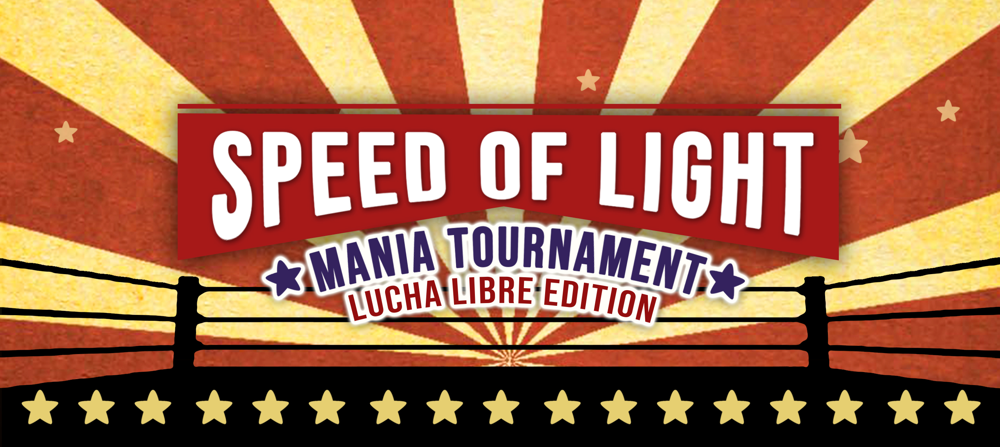

---
tags:
  - SOL
  - SOL2
---

# Speed of Light 2: Lucha Libre Edition

**Speed of Light 2: Lucha Libre Edition** (***SOL2***) was a double-elimination 1v1 osu!mania 4-key tournament hosted by ::{ flag=US }:: [stupud man](https://osu.ppy.sh/users/2141612), ::{ flag=MX }:: [\[Crz\]Crystalize](https://osu.ppy.sh/users/3072763), ::{ flag=US }:: [ZeroRam](https://osu.ppy.sh/users/8454732), ::{ flag=SE }:: [Mestro](https://osu.ppy.sh/users/4798263), ::{ flag=US }:: [Penguinosity](https://osu.ppy.sh/users/10235296), and ::{ flag=US }:: [Logan636](https://osu.ppy.sh/users/9423766). It was the second instalment of the Speed of Light.

## Tournament schedule

| Event | Timestamp |
| --: | :-- |
| Registration phase | 2020-10-07/2020-10-28 |
| Qualifiers | 2020-11-14/2020-11-15 |
| Group stage week 1 | 2020-11-21/2020-11-22 |
| Group stage week 2 | 2020-11-28/2020-11-29 |
| Round of 32 | 2020-12-04/2020-12-06 |
| Round of 16 | 2020-12-12/2020-12-13 |
| Quarterfinals | 2020-12-19/2020-12-20 |
| Semifinals | 2021-01-02/2021-01-03 |
| Finals | 2021-01-09/2021-01-10 |
| Grand Finals | 2021-01-23/2021-01-24 |

## Prizes

| Placing | Prize(s) |
| :-: | :-- |
|  | Unique profile badge, $125 for each team member |
|  | $80 for each team member |
|  | $50 for each team member |
| *4th place* | 6 months of osu!supporter for each team member |

## Organisation

| Position | Member(s) |
| :-- | :-- |
| Manager | ::{ flag=US }:: [stupud man](https://osu.ppy.sh/users/2141612), ::{ flag=MX }:: [\[Crz\]Crystalize](https://osu.ppy.sh/users/3072763), ::{ flag=US }:: [ZeroRam](https://osu.ppy.sh/users/8454732), ::{ flag=SE }:: [Mestro](https://osu.ppy.sh/users/4798263), ::{ flag=US }:: [Penguinosity](https://osu.ppy.sh/users/10235296), ::{ flag=US }:: [Logan636](https://osu.ppy.sh/users/9423766) |
| Mappool selector | ::{ flag=BR }:: [Halo-](https://osu.ppy.sh/users/7572142), ::{ flag=MX }:: [\[Crz\]Crystalize](https://osu.ppy.sh/users/3072763), ::{ flag=US }:: [-Lethal-](https://osu.ppy.sh/users/5125822), ::{ flag=US }:: [stupud man](https://osu.ppy.sh/users/2141612), ::{ flag=US }:: [Logan636](https://osu.ppy.sh/users/9423766), ::{ flag=US }:: [Penguinosity](https://osu.ppy.sh/users/10235296) |
| Mappool tester | ::{ flag=TH }:: [HowToPlayLN](https://osu.ppy.sh/users/10879600), ::{ flag=US }:: [Hubert](https://osu.ppy.sh/users/6430626) |
| Referee | ::{ flag=US }:: [Logan636](https://osu.ppy.sh/users/9423766), ::{ flag=MX }:: [urielbg](https://osu.ppy.sh/users/4598040), ::{ flag=DE }:: [GDLenny](https://osu.ppy.sh/users/8406711), ::{ flag=PH }:: [vincent4399](https://osu.ppy.sh/users/9764388), ::{ flag=PH }:: [bojii](https://osu.ppy.sh/users/10083439), ::{ flag=AU }:: [shnacc](https://osu.ppy.sh/users/11373924), ::{ flag=PL }:: [crafciak31](https://osu.ppy.sh/users/8426128), ::{ flag=GB }:: [StartAndSelect](https://osu.ppy.sh/users/8720555), ::{ flag=SG }:: [Rycy](https://osu.ppy.sh/users/7394522), ::{ flag=US }:: [\[K\]](https://osu.ppy.sh/users/16551387), ::{ flag=HK }:: [zero2snow](https://osu.ppy.sh/users/7751516), ::{ flag=IN }:: [Speshimen](https://osu.ppy.sh/users/7720204), ::{ flag=NL }:: [Albionthegreat](https://osu.ppy.sh/users/9853595) |
| Streamer | ::{ flag=CL }:: [T o u c h e](https://osu.ppy.sh/users/1603962), ::{ flag=FR }:: [Kasumii-sama](https://osu.ppy.sh/users/6177263), ::{ flag=US }:: [sillypilly](https://osu.ppy.sh/users/10663240), ::{ flag=CA }:: [Syako](https://osu.ppy.sh/users/8184715), ::{ flag=NL }:: [NightNarumi](https://osu.ppy.sh/users/4381142), ::{ flag=SE }:: [Mestro](https://osu.ppy.sh/users/4798263), ::{ flag=US }:: [Halogen-](https://osu.ppy.sh/users/169992), ::{ flag=US }:: [stupud man](https://osu.ppy.sh/users/2141612), ::{ flag=US }:: [-Lethal-](https://osu.ppy.sh/users/5125822) |
| Commentator | ::{ flag=CL }:: [\[GS\]Myuka](https://osu.ppy.sh/users/10072733), ::{ flag=GB }:: [Young Alpha](https://osu.ppy.sh/users/15383957), ::{ flag=SG }:: [Raveille](https://osu.ppy.sh/users/1388767), ::{ flag=US }:: [Hubert](https://osu.ppy.sh/users/6430626), ::{ flag=US }:: [\[Crz\]sel](https://osu.ppy.sh/users/9452257), ::{ flag=US }:: [\[GS\]Antunder](https://osu.ppy.sh/users/10416995), ::{ flag=US }:: [\[GS\]Croniken](https://osu.ppy.sh/users/9989041), ::{ flag=US }:: [EtienneXC](https://osu.ppy.sh/users/5610085), ::{ flag=US }:: [Halogen-](https://osu.ppy.sh/users/169992), ::{ flag=US }:: [-Lethal-](https://osu.ppy.sh/users/5125822), ::{ flag=US }:: [Toaph Daddy](https://osu.ppy.sh/users/7616811), ::{ flag=US }:: [chxu](https://osu.ppy.sh/users/13712190), ::{ flag=US }:: [Logan636](https://osu.ppy.sh/users/9423766), ::{ flag=US }:: [Penguinosity](https://osu.ppy.sh/users/10235296), ::{ flag=US }:: [stupud man](https://osu.ppy.sh/users/2141612), ::{ flag=SE }:: [Davvy](https://osu.ppy.sh/users/10047413), ::{ flag=PH }:: [vincent4399](https://osu.ppy.sh/users/9764388) |
| Designer | ::{ flag=MX }:: [-Candy-](https://osu.ppy.sh/users/3964918) |
| Statistician | ::{ flag=SE }:: [Mestro](https://osu.ppy.sh/users/4798263) |
| Wiki editor | ::{ flag=SE }:: [Mestro](https://osu.ppy.sh/users/4798263) |

## Links

- [Discussion thread](https://osu.ppy.sh/community/forums/topics/1158000)
- [SOL Discord server](https://discord.gg/xWet4ug)
- [Livestream](https://www.twitch.tv/zeroram0)
- [Statistics sheet](https://docs.google.com/spreadsheets/d/e/2PACX-1vQ1J0ciAoWtGNPzzIegAMYdDoR579vjEajjgwvm5PyZUFnqZZWS1GoYaJZvIWuYh-JzqZwT0VKLvQXm/pubhtml)
- **[Master sheet](https://docs.google.com/spreadsheets/d/16cbh7tHxKbyGuRC7-jGY6wounw2Lp9hgG-YdpfsqYPY/edit?usp=sharing)**

## Participants

| Seed | Team | Members |
| :-: | :-- | :-- |
| 1 | **regular team** | ::{ flag=MY }:: [cheewee10](https://osu.ppy.sh/users/4477497), ::{ flag=KR }:: [Yeoul](https://osu.ppy.sh/users/4698728) |
| 2 | **World's Fastest Gamers** | ::{ flag=US }:: [Toaph Daddy](https://osu.ppy.sh/users/7616811), ::{ flag=US }:: [EtienneXC](https://osu.ppy.sh/users/5610085) |
| 3 | **Oh Ten** | ::{ flag=PH }:: [Swarmsii](https://osu.ppy.sh/users/11716111), ::{ flag=PH }:: [Silhoueska Elze](https://osu.ppy.sh/users/11517895) |
| 4 | **\[9:30 PM\] Remu: good eletric computer team** | ::{ flag=BR }:: [Lothus](https://osu.ppy.sh/users/9530019), ::{ flag=BR }:: [andreymc](https://osu.ppy.sh/users/5691061) |
| 5 | **COME TO BRAZIL** | ::{ flag=UY }:: [AnMaO](https://osu.ppy.sh/users/5243536), ::{ flag=BR }:: [SillyFangirl](https://osu.ppy.sh/users/2288363) |
| 6 | **Guayando Squad** | ::{ flag=PE }:: [DaZeRo5](https://osu.ppy.sh/users/6114633), ::{ flag=US }:: [\[GS\]linc](https://osu.ppy.sh/users/12093536) |
| 7 | **Xx\_OWO\_xX** | ::{ flag=GB }:: [XxNewson1234xX](https://osu.ppy.sh/users/9895650), ::{ flag=GB }:: [xSnaggles](https://osu.ppy.sh/users/3799946) |
| 8 | **MajulahSGET** | ::{ flag=SG }:: [Emiratess123](https://osu.ppy.sh/users/13390529), ::{ flag=SG }:: [AdamAckerville](https://osu.ppy.sh/users/12297375) |
| 9 | **El poullios del gold pimousse** | ::{ flag=FR }:: [Auraah](https://osu.ppy.sh/users/10015908), ::{ flag=FR }:: [pimoux](https://osu.ppy.sh/users/6183047) |
| 10 | **delta men** | ::{ flag=US }:: [BaniiYanii](https://osu.ppy.sh/users/11888159), ::{ flag=US }:: [neptunefun](https://osu.ppy.sh/users/11734610) |
| 11 | **Duck Spinning To Geometry Dash Practice Mode Song 10 Hours** | ::{ flag=US }:: [iylwrychi](https://osu.ppy.sh/users/7794488), ::{ flag=US }:: [mashu](https://osu.ppy.sh/users/12028216) |
| 12 | **GLIZZY GLADIATORS :face\_with\_raised\_eyebrow:** | ::{ flag=US }:: [Unholy](https://osu.ppy.sh/users/7672414), ::{ flag=GB }:: [AirSpan](https://osu.ppy.sh/users/5063207) |
| 13 | **EggFriendRiceWithWokHay** | ::{ flag=MY }:: [xxxxxx2800](https://osu.ppy.sh/users/4084853), ::{ flag=TW }:: [\[Crz\]FolAH1217](https://osu.ppy.sh/users/6232458) |
| 14 | **Dy Cho** | ::{ flag=GB }:: [Eliminate294](https://osu.ppy.sh/users/9169747), ::{ flag=GB }:: [Wagg](https://osu.ppy.sh/users/7415829) |
| 15 | **Adorable Sweet Synergy** | ::{ flag=FI }:: [LovelyN](https://osu.ppy.sh/users/8370443), ::{ flag=MX }:: [Plutes](https://osu.ppy.sh/users/11188249) |
| 16 | **Crewhop\_fury** | ::{ flag=JP }:: [CrewK](https://osu.ppy.sh/users/11488604), ::{ flag=KR }:: [bhop\_fury](https://osu.ppy.sh/users/9920067) |
| 17 | **niet echt lol** | ::{ flag=BE }:: [Yetii](https://osu.ppy.sh/users/6914714), ::{ flag=NL }:: [Bakuretsue](https://osu.ppy.sh/users/10960533) |
| 18 | **Noodles & Rice** | ::{ flag=US }:: [KamaTheCrimson](https://osu.ppy.sh/users/6362259), ::{ flag=BR }:: [LeMarcinho](https://osu.ppy.sh/users/13347579) |
| 19 | **THEY WENT MISSING** | ::{ flag=SG }:: [riunosk](https://osu.ppy.sh/users/5594381), ::{ flag=GB }:: [TingTheFirst](https://osu.ppy.sh/users/12489832) |
| 20 | **sepia** | ::{ flag=RU }:: [\[Crz\]Arachnon](https://osu.ppy.sh/users/9074986), ::{ flag=RU }:: [c1e4r](https://osu.ppy.sh/users/8693182) |
| 21 | **Winning Team** | ::{ flag=CA }:: [loafusofbread](https://osu.ppy.sh/users/9278959), ::{ flag=CA }:: [GDMem](https://osu.ppy.sh/users/10804091) |
| 22 | **BOTTOM GEAR** | ::{ flag=GB }:: [Pope Gadget](https://osu.ppy.sh/users/2288341), ::{ flag=GB }:: [Yonk\_](https://osu.ppy.sh/users/5156656) |
| 23 | **Hololive VSRG** | ::{ flag=CL }:: [Sebaex](https://osu.ppy.sh/users/4686036), ::{ flag=CL }:: [\[Crz\]Arkener](https://osu.ppy.sh/users/4116072) |
| 24 | **Team-ang** | ::{ flag=PH }:: [Buenoo](https://osu.ppy.sh/users/11799958), ::{ flag=SG }:: [IJosephI \[DS\]](https://osu.ppy.sh/users/13353749) |
| 25 | **masno gang** | ::{ flag=PL }:: [s\_kolorowa](https://osu.ppy.sh/users/11430587), ::{ flag=PL }:: [paprotkaaaa](https://osu.ppy.sh/users/7233032) |
| 26 | **random brits** | ::{ flag=GB }:: [Zycrxd](https://osu.ppy.sh/users/14245127), ::{ flag=GB }:: [Lelloq](https://osu.ppy.sh/users/8610776) |
| 27 | **chut** | ::{ flag=BR }:: [Kyut](https://osu.ppy.sh/users/9328824), ::{ flag=US }:: [chxu](https://osu.ppy.sh/users/13712190) |
| 28 | **NOT Emergency Food!!** | ::{ flag=SG }:: [Japeynius](https://osu.ppy.sh/users/13993659), ::{ flag=PH }:: [J1002](https://osu.ppy.sh/users/11958940) |
| 29 | **OPOLSKIE GANG** | ::{ flag=PL }:: [SitekX](https://osu.ppy.sh/users/3840946), ::{ flag=PL }:: [TheFalek](https://osu.ppy.sh/users/10214260) |
| 30 | **Twinkle Wish** | ::{ flag=TH }:: [-\[DaNieL\_TH\]-](https://osu.ppy.sh/users/6456531), ::{ flag=TH }:: [HowToBeIntel](https://osu.ppy.sh/users/6535376) |
| 31 | **Lisa U Solnyshka** | ::{ flag=RU }:: [Lerck](https://osu.ppy.sh/users/10450696), ::{ flag=RU }:: [FoXCHANNEL](https://osu.ppy.sh/users/8454236) |
| 32 | **LES BROS** | ::{ flag=FR }:: [ZayyKen](https://osu.ppy.sh/users/8624433), ::{ flag=FR }:: [Koiidex](https://osu.ppy.sh/users/5193488) |
| 33 | **Guayando Squad II** | ::{ flag=US }:: [\[GS\]Croniken](https://osu.ppy.sh/users/9989041), ::{ flag=US }:: [\[GS\]Teo](https://osu.ppy.sh/users/7081478) |
| 34 | **Gekoloniseerd** | ::{ flag=BE }:: [Mortelspawn\_](https://osu.ppy.sh/users/5331420), ::{ flag=NL }:: [2fast4you98](https://osu.ppy.sh/users/5183940) |
| 35 | **No acc** | ::{ flag=MX }:: [-Hellscythe-](https://osu.ppy.sh/users/7837147), ::{ flag=MX }:: [Ghoul-](https://osu.ppy.sh/users/8859756) |
| 36 | **Matiql** | ::{ flag=CL }:: [ItzBenja616](https://osu.ppy.sh/users/8538906), ::{ flag=CL }:: [faz\_cl](https://osu.ppy.sh/users/7853143) |
| 37 | **get out SV** | ::{ flag=DE }:: [medium kek](https://osu.ppy.sh/users/11625617), ::{ flag=KR }:: [yz1155](https://osu.ppy.sh/users/2071008) |
| 38 | **word** | ::{ flag=US }:: [PositoniX](https://osu.ppy.sh/users/12443485), ::{ flag=US }:: [ERA Zenith](https://osu.ppy.sh/users/7128063) |
| 39 | **Teamba** | ::{ flag=PH }:: [Steeeven](https://osu.ppy.sh/users/15503384), ::{ flag=PH }:: [Acestrol](https://osu.ppy.sh/users/13470043) |
| 40 | **LNCC** | ::{ flag=DE }:: [Cyaewin](https://osu.ppy.sh/users/10027302), ::{ flag=DE }:: [-SparklingCat-](https://osu.ppy.sh/users/15440118) |
| 41 | **cagoTrainer** | ::{ flag=CL }:: [cagofuego](https://osu.ppy.sh/users/12485149), ::{ flag=US }:: [Trainer-](https://osu.ppy.sh/users/9331760) |
| 42 | **power poc girls** | ::{ flag=BR }:: [Gabi Kamui](https://osu.ppy.sh/users/10658391), ::{ flag=BR }:: [Yuragi](https://osu.ppy.sh/users/8501380) |
| 43 | **Simping for Sinbae** | ::{ flag=CA }:: [\[ro\]Nosteal](https://osu.ppy.sh/users/8160564), ::{ flag=CA }:: [Sinaeb](https://osu.ppy.sh/users/1576095) |
| 44 | **RICE ZEUS** | ::{ flag=ID }:: [\[GS\]Rei](https://osu.ppy.sh/users/11964257), ::{ flag=HK }:: [Ricizus](https://osu.ppy.sh/users/10395139) |
| 45 | **dale scares me** | ::{ flag=CA }:: [Stability](https://osu.ppy.sh/users/6701738), ::{ flag=CA }:: [Dale940](https://osu.ppy.sh/users/13847951) |
| 46 | **BrainPowerin2020** | ::{ flag=HK }:: [Irone OSU](https://osu.ppy.sh/users/10678230), ::{ flag=HK }:: [Quotient GD](https://osu.ppy.sh/users/11313227) |
| 47 | **ESPRIT SHONEN** | ::{ flag=FR }:: [DragonSonic](https://osu.ppy.sh/users/7294830), ::{ flag=FR }:: [Ping36](https://osu.ppy.sh/users/9388217) |
| 48 | **QUIQUE TOQUES** | ::{ flag=ES }:: [IDontUnderstood](https://osu.ppy.sh/users/8608903), ::{ flag=ES }:: [Carxof](https://osu.ppy.sh/users/10695431) |
| 49 | **Pog** | ::{ flag=BR }:: [Lenn](https://osu.ppy.sh/users/11236829), ::{ flag=FI }:: [Fireable](https://osu.ppy.sh/users/12624280) |
| 50 | **coca cola espuma** | ::{ flag=CL }:: [Xan-](https://osu.ppy.sh/users/5919873), ::{ flag=PE }:: [Encoded](https://osu.ppy.sh/users/11930795) |
| 51 | **Chaise** | ::{ flag=CH }:: [Tupidix](https://osu.ppy.sh/users/8655604), ::{ flag=CH }:: [CrashSmash](https://osu.ppy.sh/users/13942150) |
| 52 | **Guayando Squad III** | ::{ flag=US }:: [\[GS\]Antunder](https://osu.ppy.sh/users/10416995), ::{ flag=US }:: [\[GS\]Diamond](https://osu.ppy.sh/users/13076648) |
| 53 | **mr gamma skippers** | ::{ flag=BE }:: [flyerbram002](https://osu.ppy.sh/users/12725421), ::{ flag=IT }:: [Veryi](https://osu.ppy.sh/users/13878539) |
| 54 | **pantek** | ::{ flag=ID }:: [Proxae](https://osu.ppy.sh/users/8410575), ::{ flag=ID }:: [FelixSpade](https://osu.ppy.sh/users/2651304) |
| 55 | **Capoo** | ::{ flag=TW }:: [\[Rweiru\]](https://osu.ppy.sh/users/11234907), ::{ flag=TW }:: [XPING](https://osu.ppy.sh/users/3944664) |
| 56 | **Team 2hu** | ::{ flag=FI }:: [Nauchi](https://osu.ppy.sh/users/10157316), ::{ flag=FI }:: [Fisu](https://osu.ppy.sh/users/12545346) |
| 57 | **Los Guayando** | ::{ flag=CL }:: [xXCris13Xx](https://osu.ppy.sh/users/11480970), ::{ flag=CL }:: [\[ShApi\]](https://osu.ppy.sh/users/13594429) |
| 58 | **Karen best girl** | ::{ flag=NL }:: [Ready Perfectly](https://osu.ppy.sh/users/10944966), ::{ flag=NL }:: [samuelhklumpers](https://osu.ppy.sh/users/10945523) |
| 59 | **Renato** | ::{ flag=BR }:: [Soutin](https://osu.ppy.sh/users/11771029), ::{ flag=BR }:: [Namirin-chan](https://osu.ppy.sh/users/6761832) |
| 60 | **Panda del Porro** | ::{ flag=ES }:: [Akumatose](https://osu.ppy.sh/users/8467604), ::{ flag=ES }:: [Guldakh](https://osu.ppy.sh/users/8553078) |
| 61 | **Kafuu Fumino** | ::{ flag=MY }:: [Unicow](https://osu.ppy.sh/users/9444174), ::{ flag=MY }:: [\[-Leon-\]](https://osu.ppy.sh/users/13382147) |
| 62 | **YEEHAW :cowboy:** | ::{ flag=US }:: [---Rose---](https://osu.ppy.sh/users/9481266), ::{ flag=US }:: [Firby\_28](https://osu.ppy.sh/users/6807462) |
| 63 | **Lettuce** | ::{ flag=US }:: [\[LS\]Skye](https://osu.ppy.sh/users/14714088), ::{ flag=US }:: [Retina](https://osu.ppy.sh/users/11392859) |
| 64 | **Late Night Gamers** | ::{ flag=PL }:: [Hlimak](https://osu.ppy.sh/users/1340272), ::{ flag=NL }:: [Freek](https://osu.ppy.sh/users/9630674) |

More detailed qualifiers results can be accessed via this [spreadsheet](https://docs.google.com/spreadsheets/d/e/2PACX-1vQ1J0ciAoWtGNPzzIegAMYdDoR579vjEajjgwvm5PyZUFnqZZWS1GoYaJZvIWuYh-JzqZwT0VKLvQXm/pubhtml#)

## Groups

| Group | Top | High | Low | Unseeded |
| :-: | :-- | :-- | :-- | :-- |
| **A** | Dy Cho | sepia | QUIQUE TOQUES | YEEHAW :cowboy: |
| **B** | MajulahSGET | random brits | Teamba | Capoo |
| **C** | Xx\_OWO\_xX | Noodles & Rice | Gekoloniseerd | Lettuce |
| **D** | Oh Ten | Winning Team | LNCC | Chaise |
| **E** | Guayando Squad | NOT Emergency Food!! | get out SV | pantek |
| **F** | World's Fastest Gamers | Hololive VSRG | Matiql | Pog |
| **G** | Adorable Sweet Synergy | masno gang | ESPRIT SHONEN | Team 2hu |
| **H** | GLIZZY GLADIATORS :face\_with\_raised\_eyebrow: | niet echt lol | cagoTrainer | Los Guayando |
| **I** | delta men | Lisa U Solnyshka | No acc | coca cola espuma |
| **J** | \[9:30 PM\] Remu: good eletric computer team | LES BROS | Simping for Sinbae | Kafuu Fumino |
| **K** | COME TO BRAZIL | THEY WENT MISSING | word | Guayando Squad III |
| **L** | Duck Spinning To Geometry Dash Practice Mode Song 10 Hours | BOTTOM GEAR | dale scares me | Renato |
| **M** | Crewhop\_fury | OPOLSKIE GANG | power poc girls | Panda del Porro |
| **N** | EggFriendRiceWithWokHay | Team-ang | BrainPowerin2020 | Late Night Gamers |
| **O** | El poullios del gold pimousse | Twinkle Wish | Guayando Squad II | Karen best girl |
| **P** | regular team | chut | RICE ZEUS | mr gamma skippers |

## Podium

This competition has come to an end and resulted in the following podium:

| Placing | Team |
| :-: | :-- |
|  | **regular team** (::{ flag=MY }:: [cheewee10](https://osu.ppy.sh/users/4477497), ::{ flag=KR }:: [Yeoul](https://osu.ppy.sh/users/4698728)) |
|  | **World's Fastest Gamers** (::{ flag=US }:: [Toaph Daddy](https://osu.ppy.sh/users/7616811), ::{ flag=US }:: [EtienneXC](https://osu.ppy.sh/users/5610085)) |
|  | **BOTTOM GEAR** (::{ flag=GB }:: [Pope Gadget](https://osu.ppy.sh/users/2288341), ::{ flag=GB }:: [Yonk\_](https://osu.ppy.sh/users/5156656)) |
| *4th place* | **Duck Spinning To Geometry Dash Practice Mode Song 10 Hours** (::{ flag=US }:: [iylwrychi](https://osu.ppy.sh/users/7794488), ::{ flag=US }:: [mashu](https://osu.ppy.sh/users/12028216)) |

## Mappools

### Grand Finals

- FreeMod
  1. [BLANKFIELD - Far From Truth (HowToPlayLN) \[Unreasonable x1.1\]](https://osu.ppy.sh/beatmapsets/1277379#mania/2784350)
  2. [Bring Me The Horizon - Can You Feel My Heart (Guilhermeziat) \[Guilhermeziat's Beginner 1.05\]](https://osu.ppy.sh/beatmapsets/1344358#mania/2784233)
  3. [Infected Mushroom - Sa'eed (IcyWorld) \[IcyWorld's Challenge 1.25\]](https://osu.ppy.sh/beatmapsets/1344456#mania/2784390)
  4. [Xanopticon - Drunxpla (axtrmnt) \[static \[105x Rate\]\]](https://osu.ppy.sh/beatmapsets/1329447#mania/2754137)
  5. [Terminal 11 - UNDICI (ZetaSM) \[Zeta's The End 1.05x\]](https://osu.ppy.sh/beatmapsets/1340137#mania/2776359)
  6. [Terminal 11 - Staple On Smile (hi19hi19) \[Extreme 1.15x\]](https://osu.ppy.sh/beatmapsets/1309129#mania/2767504)
  7. [Akira Complex - Odyssey (Au5 Remix) (Shoegazer) \[Shoegazer's Dreamless 1.25x\]](https://osu.ppy.sh/beatmapsets/1344333#mania/2784198)
  8. [Syatten - Beyond The Limit (Cataclysm-) \[aeyeong's Challenge (167bpm)\]](https://osu.ppy.sh/beatmapsets/1344339#mania/2784205)
  9. [Camellia feat. Nanahira - finorza (HowToPlayLN) \[HowToPlayLN's Defiance 1.05 (cut/edit)\]](https://osu.ppy.sh/beatmapsets/1344353#mania/2784224)
  10. [Camellia - Arcology On Permafrost (-mint-) \[Frozen World 1.2x\]](https://osu.ppy.sh/beatmapsets/1339461#mania/2775322)
  11. [Camellia - GHOST (lemonguy) \[Gekido's Conspicuous 1.1\]](https://osu.ppy.sh/beatmapsets/1344357#mania/2784231)
  12. [DJ Genki vs Gram - Einherjar Joker (MyZterioN-) \[MyZterioN's Andhrimnir 1.05\]](https://osu.ppy.sh/beatmapsets/1344327#mania/2784192)
  13. [umu. - humanly (Raveille) \[Raveille's timing hell? 1.1 (edit)\]](https://osu.ppy.sh/beatmapsets/1344321#mania/2784184)
  14. [Frums - Nisemono (\[Crz\]Crysarlene) \[Crysarlene's Fleece (cut)\]](https://osu.ppy.sh/beatmapsets/1344329#mania/2784194)
  15. [lapix - You're Beautiful (DannyPX) \[You're Mine (cut/edit) \[1.2x Rate\]\]](https://osu.ppy.sh/beatmapsets/1309671#mania/2774411)
- Tiebreaker
  1. **[Camellia - OOPARTS (Halogen-) \[Indecipherable\]](https://osu.ppy.sh/beatmapsets/1344963#mania/2785547)**

### Finals

- FreeMod
  1. [Falcom Sound Team J.D.K. - TO MAKE THE END OF BATTLE (lemonguy) \[Challenge x1.22\]](https://osu.ppy.sh/beatmapsets/1205858#mania/2772986)
  2. [Kraus - Reach (-Lethal-) \[invisible 1.25x\]](https://osu.ppy.sh/beatmapsets/989100#mania/2773267)
  3. [Occams Laser - Heck Tech (Penguinosity) \[ORBITAL FAILURE 1.05\]](https://osu.ppy.sh/beatmapsets/1338648#mania/2772965)
  4. [Frums - Pictured as Perfect (-mint-) \[Daze (cut edit 1.1x)\]](https://osu.ppy.sh/beatmapsets/981508#mania/2759072)
  5. [Underoath - Writing On The Walls (Final Sketch Remix) (Shoegazer) \[Memory (282bpm)\]](https://osu.ppy.sh/beatmapsets/1210223#mania/2524417)
  6. [Bong Ra vs Igorrr - Pallbearer (DannyPX) \[Necropolis (intro cut)\]](https://osu.ppy.sh/beatmapsets/1250516#mania/2757808)
  7. [Sweet Trip - Tekka (stupud man) \[Windoze's Challenge 1.05\]](https://osu.ppy.sh/beatmapsets/1338808#mania/2773292)
  8. [dj TAKA - Last Dance (stupud man) \[1.1... 2.2...\]](https://osu.ppy.sh/beatmapsets/1082122#mania/2773305)
  9. [Camellia - +ERABY+E CONNEC+10N (HowToPlayLN) \[504 ServerError: Gateway Timeout\]](https://osu.ppy.sh/beatmapsets/1338625#mania/2772922)
  10. [Chroma - Destroy Destroy, Destroy The Happy End (Penguinosity) \[Buffalo Chicken 1.1\]](https://osu.ppy.sh/beatmapsets/1338640#mania/2772946)
  11. [Ling tosite sigure - abnormalize (Shoegazer) \[Shoegazer's desperation 1.25\]](https://osu.ppy.sh/beatmapsets/1338810#mania/2773296)
  12. [Hino Isuka - #be\_fortunate (HowToPlayLN) \[#be\_columnlocked\]](https://osu.ppy.sh/beatmapsets/1099229#mania/2296388)
  13. [Helix6 - No. 6 (\[Crz\]Crysarlene) \[X\]](https://osu.ppy.sh/beatmapsets/881711#mania/2466829)
  14. [a\_hisa - Logical Stimulus (FelixSpade) \[LN Prodigy \[1.1x Rate\]\]](https://osu.ppy.sh/beatmapsets/1072971#mania/2246337)
  15. [Feryquitous - Central Nucleus (Davvy) \[Davvy's Endoplasmic Reticulum (Edit)\]](https://osu.ppy.sh/beatmapsets/1338805#mania/2773284)
- Tiebreaker
  1. **[Camellia - Stealth-Dash (HowToPlayLN) \[Undetectable 1.05 (nsv)\]](https://osu.ppy.sh/beatmapsets/1278064#mania/2655224)**

### Semifinals

- FreeMod
  1. [9mm Parabellum Bullet - Punishment (Shoegazer) \[Shoegazer's Termination (233bpm)\]](https://osu.ppy.sh/beatmapsets/1326777#mania/2748727)
  2. [Fleshgod Apocalypse - The Fool (Mipha-) \[Tyrant (Edit / 253bpm)\]](https://osu.ppy.sh/beatmapsets/1301878#mania/2743560)
  3. [Dethklok - Laser Canon Deth Sentence (IcyWorld) \[IcyWorld's Hard \[1.05x\]\]](https://osu.ppy.sh/beatmapsets/1328253#mania/2751540)
  4. [Silentroom - Rainshower (Shoegazer) \[Another 1.1x (191bpm)\]](https://osu.ppy.sh/beatmapsets/1307803#mania/2711273)
  5. [Eve - Tokyo Ghetto (isokasapupuja) \[Medium (cut)\]](https://osu.ppy.sh/beatmapsets/1324319#mania/2743106)
  6. [kaitendaentai - Hizai ni Negu (guden) \[:/materialize\\\]](https://osu.ppy.sh/beatmapsets/1304769#mania/2747088)
  7. [DARK SAMBA MASTER -SATOH- - DARK SAMBA LAND (Mipha-) \[miphather 1.1x\]](https://osu.ppy.sh/beatmapsets/1326773#mania/2748723)
  8. [Camellia as "fluX Xroise" - Xronier ("geneXe" Long ver.) (Suu is my waifu) \[HEAVENLY (cut)\]](https://osu.ppy.sh/beatmapsets/1132832#mania/2738339)
  9. [Camellia - Dyscontrolled Galaxy (Penguinosity) \[H2PxP\]](https://osu.ppy.sh/beatmapsets/1328257#mania/2751545)
  10. [Apo11o"QUASAR"program - Saihate (Tidek) \[Coma\]](https://osu.ppy.sh/beatmapsets/1178017#mania/2456770)
  11. [L.E.D.Master+ - Chrono Diver -PENDULUMs- (pieerre) \[pieerre's LN Diver (edit)\]](https://osu.ppy.sh/beatmapsets/1326767#mania/2748714)
  12. [MiddleIsland - Delrio (Raveille) \[for the rivers\]](https://osu.ppy.sh/beatmapsets/1251408#mania/2601016)
  13. [Aethral - Victorious Journey (Kamuy) \[drago vs. rave's odyssey\]](https://osu.ppy.sh/beatmapsets/1157663#mania/2416038)
- Tiebreaker
  1. **[TryHardNinja feat. CaptainSparklez - Revenge (ReeK's "Dude What's A Genre?" Remix) (-mint-) \[Aw Man!\]](https://osu.ppy.sh/beatmapsets/1205236#mania/2747194)**

### Quarterfinals

- FreeMod
  1. [Fightstar - Floods (\[Crz\]Crysarlene) \[Crysarlene's Uprising\]](https://osu.ppy.sh/beatmapsets/1322250#mania/2738693)
  2. [SP-# - tinnitus (Penguinosity) \[Diplacusis 1.15x\]](https://osu.ppy.sh/beatmapsets/1315056#mania/2725300)
  3. [goreshit - looming shadow of a tree long gone (Shoegazer) \[asphyxia (255bpm)\]](https://osu.ppy.sh/beatmapsets/360765#mania/2569224)
  4. [puru - Toki (maidable remix) (Shoegazer) \[Another\]](https://osu.ppy.sh/beatmapsets/1306576#mania/2710192)
  5. [Mindless Self Indulgence - My World (Demo Version) (Valedict) \[My Headspace (Low LN)\]](https://osu.ppy.sh/beatmapsets/1227629#mania/2728391)
  6. [The Flashbulb - Maybe All This Time I Was Wrong (riktoi) \[edit\]](https://osu.ppy.sh/beatmapsets/808778#mania/2729383)
  7. [Leaf - N-Generation (Penguinosity) \[Jack-King\]](https://osu.ppy.sh/beatmapsets/1315028#mania/2725252)
  8. [FOLiACETATE - Heterochromia Iridis (Gekido-) \[Stage 4: Mutation\]](https://osu.ppy.sh/beatmapsets/948787#mania/1981395)
  9. [Camellia - Alone intelligence (guden) \[Solace\]](https://osu.ppy.sh/beatmapsets/1235533#mania/2568385)
  10. [Ashrount - Cataraxir (NovaSagittarii) \[Intervention\]](https://osu.ppy.sh/beatmapsets/1072697#mania/2245055)
  11. [toby fox - Battle Against a True Hero (Mipha-) \[Howling (165bpm)\]](https://osu.ppy.sh/beatmapsets/1093396#mania/2285299)
  12. [Linkin Park - Somewhere I Belong (\[Crz\]Crysarlene) \[Crysarlene's Unreal\]](https://osu.ppy.sh/beatmapsets/1322251#mania/2738694)
  13. [ETIA. - Daisycutter (lemonguy) \[Firestorm\]](https://osu.ppy.sh/beatmapsets/1307846#mania/2711344)
- Tiebreaker
  1. **[Camellia - Quantum Entanglement (HowToPlayLN) \[Precedently Determined\]](https://osu.ppy.sh/beatmapsets/1230999#mania/2727256)**

### Round of 16

- FreeMod
  1. [Katy B - Witches Brew (BossMadWolf) \[Speed Potion \[1.1x Rate\]\]](https://osu.ppy.sh/beatmapsets/1205913#mania/2724769)
  2. [DJKurara - Last First Kingdom (Toaph Daddy) \[Destiny (update)\]](https://osu.ppy.sh/beatmapsets/886403#mania/2408124)
  3. [goreshit - o'er the flood (riunosk) \[riunosk's underwater tranquility \[edit\]\]](https://osu.ppy.sh/beatmapsets/1315009#mania/2725223)
  4. [Yunomi ft. TORIENA - Oedo Controller (Jun Kuroda remix) (\[Crz\]Crystalize) \[Klaius' Challenge\]](https://osu.ppy.sh/beatmapsets/1315006#mania/2725220)
  5. [Venetian Snares - Frictional Nevada (Gekido-) \[Challenge\]](https://osu.ppy.sh/beatmapsets/1047387#mania/2189312)
  6. ["Weird Al" Yankovic - Hardware Store (Tidek) \[Chordjack Store\]](https://osu.ppy.sh/beatmapsets/984549#mania/2060036)
  7. [Laur - Viyella's Tears (arpia97) \[MASTER\]](https://osu.ppy.sh/beatmapsets/1315273#mania/2725694)
  8. [nitro - \[line:Delta\] (araragigun) \[Pro:gressive\]](https://osu.ppy.sh/beatmapsets/1121893#mania/2344275)
  9. [void (Mournfinale) - World Vanquisher (Raveille) \[Subdued Overtime\]](https://osu.ppy.sh/beatmapsets/808157#mania/1695957)
  10. [Blue Stahli - Shotgun Senorita (Zardonic Remix) (juankristal) \[Machine Gun \[7.5\]\]](https://osu.ppy.sh/beatmapsets/1310723#mania/2716941)
  11. [Chroma - Flower Keeper (Geo\_ooo) \[Guardian (NSV)\]](https://osu.ppy.sh/beatmapsets/1171693#mania/2700528)
- Tiebreaker
  1. **[Camellia - Another Xronixle (DannyPX) \[Xenguinosity x Xanny Edit\]](https://osu.ppy.sh/beatmapsets/1182546#mania/2724583)**

### Round of 32

- FreeMod
  1. [Cardboard Box - ++ (Xonica) \[Advanced\]](https://osu.ppy.sh/beatmapsets/833489#mania/1745906)
  2. [ARForest - Metheus (DawnX) \[Rebirth\]](https://osu.ppy.sh/beatmapsets/984642#mania/2060202)
  3. [ONE OK ROCK - Mikansei Koukyoukyoku (\[Crz\]Crystalize) \[my first long note map x1.05\]](https://osu.ppy.sh/beatmapsets/1305403#mania/2712467)
  4. [The Ghost of 3.13 - Path To Nowhere (Shoegazer) \[Hopeless\]](https://osu.ppy.sh/beatmapsets/422800#mania/913882)
  5. [Squarepusher - Iambic 9 Poetry (Cut Ver.) (Davvy) \[Sonnet\]](https://osu.ppy.sh/beatmapsets/1236247#mania/2569839)
  6. [Nekomata Master - Avalon no Oka (PianoLuigi) \[Expert\]](https://osu.ppy.sh/beatmapsets/1111877#mania/2323041)
  7. [onumi - REGRET PART TWO (FAMoss) \[CURIOSSITY'S HARD\]](https://osu.ppy.sh/beatmapsets/1033765#mania/2564575)
  8. [David Bergeaud - Arena Boss (Penguinosity) \[Lombax\]](https://osu.ppy.sh/beatmapsets/1273764#mania/2646797)
  9. [M2U - Quo Vadis (\[Crz\]Crystalize) \[Yana Feiya's Departure \[edit\]\]](https://osu.ppy.sh/beatmapsets/1311786#mania/2718776)
  10. [Eve - Heart Forecast (Firiya) \[I want to be dyed with your colors\]](https://osu.ppy.sh/beatmapsets/1182680#mania/2465769)
  11. [Nikki Simmons - Fireflies (Funk Fiction Remix) (Penguinosity) \[Light\]](https://osu.ppy.sh/beatmapsets/1282000#mania/2662753)
- Tiebreaker
  1. **[lapix - Voice of Galaxy (\_Asha) \[Overlap Hertz\]](https://osu.ppy.sh/beatmapsets/905398#mania/1889765)**

### Group stage

- FreeMod
  1. [2814 - Huifu (Recovery) (Shoegazer) \[Metropolis\]](https://osu.ppy.sh/beatmapsets/1194892#mania/2489294)
  2. [D.J.Amuro - X (stupud man) \[Harlequin\]](https://osu.ppy.sh/beatmapsets/1193447#mania/2486670)
  3. [Between The Buried And Me - Bloom (XeoStyle) \[Hypnosis Dance\]](https://osu.ppy.sh/beatmapsets/685835#mania/1451726)
  4. [Insert Rupee - Facing Fears \[Remaster\] (Kaito-kun) \[World 3\]](https://osu.ppy.sh/beatmapsets/646366#mania/1915233)
  5. [Unseenmachine - Harmonically Carved Structures (Part 1) (Cokiiplay) \[Deconstruction\]](https://osu.ppy.sh/beatmapsets/808651#mania/1696981)
  6. [DJ TOTTO - Adularia (LeiN-) \[4K Another\]](https://osu.ppy.sh/beatmapsets/175050#mania/422350)
  7. [kors k - Insane Techniques (Madoka2574) \[Reversal\]](https://osu.ppy.sh/beatmapsets/1144083#mania/2388838)
  8. [Gentle Stick x M2U - Ineffabilis (Yana Feiya) \[Secret\]](https://osu.ppy.sh/beatmapsets/1205223#mania/2509704)
  9. [Morikazu Aoki - Route 201 (Theresa May) \[The Route We First Met\]](https://osu.ppy.sh/beatmapsets/1032245#mania/2158492)
- Tiebreaker
  1. **[Hatsuki Yura - Black Princess (Noch Einen) \[nsv\]](https://osu.ppy.sh/beatmapsets/1233894#mania/2567735)**

### Qualifiers

- FreeMod
  1. [The Flashbulb - Amen Iraq (Halo-) \[Stage 1: Freedom\]](https://osu.ppy.sh/beatmapsets/1294785#mania/2686640)
  2. [KIVA - Dasein (Penguinosity) \[Stage 2: Empyrean\]](https://osu.ppy.sh/beatmapsets/1294793#mania/2686650)
  3. [SYUNN - Sulk (stupud man) \[Stage 3: Bittersweet\]](https://osu.ppy.sh/beatmapsets/1294885#mania/2686796)
  4. [Dictate - Militant (HowToPlayLN) \[Stage 4: Crewmate\]](https://osu.ppy.sh/beatmapsets/1294796#mania/2686656)

## Match results

### Grand Finals

Saturday, 23 January 2021:

| Team 1 |  |  | Team 2 | Match link |
| --: | :-: | :-: | :-- | :-- |
| BOTTOM GEAR | 0 | **7** | **regular team** | [#1](https://osu.ppy.sh/community/matches/74040019) |

Sunday, 24 January 2021:

| Team 1 |  |  | Team 2 | Match link |
| --: | :-: | :-: | :-- | :-- |
| World's Fastest Gamers | 2 | **7** | **regular team** | [#1](https://osu.ppy.sh/community/matches/74119565) |
| **regular team** | **7** | 0 | World's Fastest Gamers | [#1](https://osu.ppy.sh/community/matches/74123558) |

### Finals

Saturday, 9 January 2021:

| Team 1 |  |  | Team 2 | Match link |
| --: | :-: | :-: | :-- | :-- |
| **regular team** | **7** | 4 | Oh Ten | [#1](https://osu.ppy.sh/community/matches/73080463) |
| Xx\_OWO\_xX | 0 | **7** | **Duck Spinning To Geometry Dash Practice Mode Song 10 Hours** | [#1](https://osu.ppy.sh/community/matches/73098057) |

Sunday, 10 January 2021:

| Team 1 |  |  | Team 2 | Match link |
| --: | :-: | :-: | :-- | :-- |
| Duck Spinning To Geometry Dash Practice Mode Song 10 Hours | 0 | **7** | **regular team** | [#1](https://osu.ppy.sh/community/matches/73154873) |
| **World's Fastest Gamers** | **7** | 2 | BOTTOM GEAR | [#1](https://osu.ppy.sh/community/matches/73169981) |

### Semifinals

Saturday, 2 January 2021:

| Team 1 |  |  | Team 2 | Match link |
| --: | :-: | :-: | :-- | :-- |
| Crewhop\_fury | 2 | **6** | **Duck Spinning To Geometry Dash Practice Mode Song 10 Hours** | [#1](https://osu.ppy.sh/community/matches/72628976) |
| **Oh Ten** | **6** | 3 | MajulahSGET | [#1](https://osu.ppy.sh/community/matches/72648317) |
| **EggFriendRiceWithWokHay** | **6** | 0 | COME TO BRAZIL | *win by default* |
| El poullios del gold pimousse | 4 | **6** | **\[9:30 PM\] Remu: good eletric computer team** | [#1](https://osu.ppy.sh/community/matches/72668053) |

Sunday, 3 January 2021:

| Team 1 |  |  | Team 2 | Match link |
| --: | :-: | :-: | :-- | :-- |
| \[9:30 PM\] Remu: good eletric computer team | 5 | **6** | **Oh Ten** | [#1](https://osu.ppy.sh/community/matches/72684450) |
| **Duck Spinning To Geometry Dash Practice Mode Song 10 Hours** | **6** | 0 | EggFriendRiceWithWokHay | [#1](https://osu.ppy.sh/community/matches/72686683) |
| **World's Fastest Gamers** | **6** | 3 | regular team | [#1](https://osu.ppy.sh/community/matches/72706831) |
| **BOTTOM GEAR** | **6** | 3 | Xx\_OWO\_xX | [#1](https://osu.ppy.sh/community/matches/72714687) |

### Quarterfinals

Saturday, 19 December 2020:

| Team 1 |  |  | Team 2 | Match link |
| --: | :-: | :-: | :-- | :-- |
| niet echt lol | 0 | **6** | **Twinkle Wish** | *win by default* |
| Oh Ten | 5 | **6** | **BOTTOM GEAR** | [#1](https://osu.ppy.sh/community/matches/71848373) |
| Guayando Squad | 5 | **6** | **MajulahSGET** | [#1](https://osu.ppy.sh/community/matches/71850587) |
| **\[9:30 PM\] Remu: good eletric computer team** | **6** | 0 | LES BROS | *win by default* |
| **World's Fastest Gamers** | **6** | 0 | EggFriendRiceWithWokHay | [#1](https://osu.ppy.sh/community/matches/71853947) |
| sepia | 0 | **6** | **Dy Cho** | *win by default* |
| power poc girls | 3 | **6** | **Lisa U Solnyshka** | [#1](https://osu.ppy.sh/community/matches/71860423) |
| word | 0 | **6** | **masno gang** | *win by default* |
| **Duck Spinning To Geometry Dash Practice Mode Song 10 Hours** | **6** | 1 | chut | [#1](https://osu.ppy.sh/community/matches/71880250) |

Sunday, 20 December 2020:

| Team 1 |  |  | Team 2 | Match link |
| --: | :-: | :-: | :-- | :-- |
| **COME TO BRAZIL** | **6** | 0 | Adorable Sweet Synergy | [#1](https://osu.ppy.sh/community/matches/71887481) |
| **\[9:30 PM\] Remu: good eletric computer team** | **6** | 0 | Twinkle Wish | [#1](https://osu.ppy.sh/community/matches/71890834) |
| Crewhop\_fury | 0 | **6** | **regular team** | [#1](https://osu.ppy.sh/community/matches/71906324) |
| **MajulahSGET** | **6** | 0 | masno gang | *win by default* |
| Lisa U Solnyshka | 0 | **6** | **Duck Spinning To Geometry Dash Practice Mode Song 10 Hours** | [#1](https://osu.ppy.sh/community/matches/71920381) |
| Dy Cho | 0 | **6** | **COME TO BRAZIL** | [#1](https://osu.ppy.sh/community/matches/71923392) |
| El poullios del gold pimousse | 4 | **6** | **Xx\_OWO\_xX** | [#1](https://osu.ppy.sh/community/matches/71933189) |

### Round of 16

Saturday, 12 December 2020:

| Team 1 |  |  | Team 2 | Match link |
| --: | :-: | :-: | :-- | :-- |
| **Twinkle Wish** | **5** | 1 | random brits | [#1](https://osu.ppy.sh/community/matches/71417989) |
| \[9:30 PM\] Remu: good eletric computer team | 4 | **5** | **regular team** | [#1](https://osu.ppy.sh/community/matches/71420018) |
| NOT Emergency Food!! | 0 | **5** | **chut** | *win by default* |
| niet echt lol | 2 | **5** | **Crewhop\_fury** | [#1](https://osu.ppy.sh/community/matches/71428351) |
| **LES BROS** | **5** | 2 | No acc | *win by default* |
| **Oh Ten** | **5** | 0 | COME TO BRAZIL | [#1](https://osu.ppy.sh/community/matches/71434920) |
| **El poullios del gold pimousse** | **5** | 2 | Duck Spinning To Geometry Dash Practice Mode Song 10 Hours | [#1](https://osu.ppy.sh/community/matches/71441653) |

Sunday, 13 December 2020:

| Team 1 |  |  | Team 2 | Match link |
| --: | :-: | :-: | :-- | :-- |
| Guayando Squad | 3 | **5** | **EggFriendRiceWithWokHay** | [#1](https://osu.ppy.sh/community/matches/71467855) |
| Team-ang | 2 | **5** | **Adorable Sweet Synergy** | [#1](https://osu.ppy.sh/community/matches/71482685) |
| Gekoloniseerd | 0 | **5** | **Dy Cho** | *win by default* |
| Pog | 2 | **5** | **MajulahSGET** | [#1](https://osu.ppy.sh/community/matches/71484864) |
| sepia | 0 | **5** | **BOTTOM GEAR** | [#1](https://osu.ppy.sh/community/matches/71490052) |
| Winning Team | 1 | **5** | **masno gang** | [#1](https://osu.ppy.sh/community/matches/71492814) |
| cagoTrainer | 0 | **5** | **Lisa U Solnyshka** | *win by default* |
| **Xx\_OWO\_xX** | **5** | 0 | power poc girls | [#1](https://osu.ppy.sh/community/matches/71501450) |
| **World's Fastest Gamers** | **5** | 0 | word | [#1](https://osu.ppy.sh/community/matches/71510062) |

### Round of 32

Friday, 4 December 2020:

| Team 1 |  |  | Team 2 | Match link |
| --: | :-: | :-: | :-- | :-- |
| **\[9:30 PM\] Remu: good eletric computer team** | **5** | 0 | Team-ang | [#1](https://osu.ppy.sh/community/matches/70942327) |

Saturday, 5 December 2020:

| Team 1 |  |  | Team 2 | Match link |
| --: | :-: | :-: | :-- | :-- |
| **sepia** | **5** | 4 | Twinkle Wish | [#1](https://osu.ppy.sh/community/matches/71011890) |
| **Crewhop\_fury** | **5** | 2 | Dy Cho | [#1](https://osu.ppy.sh/community/matches/71014633) |
| **EggFriendRiceWithWokHay** | **5** | 0 | chut | [#1](https://osu.ppy.sh/community/matches/71017982) |
| **El poullios del gold pimousse** | **5** | 0 | Pog | [#1](https://osu.ppy.sh/community/matches/71021622) |
| **word** | **5** | 2 | Lisa U Solnyshka | [#1](https://osu.ppy.sh/community/matches/71028963) |
| **World's Fastest Gamers** | **5** | 0 | cagoTrainer | [#1](https://osu.ppy.sh/community/matches/71046097) |

Sunday, 6 December 2020:

| Team 1 |  |  | Team 2 | Match link |
| --: | :-: | :-: | :-- | :-- |
| **Guayando Squad** | **5** | 0 | NOT Emergency Food!! | *win by default* |
| MajulahSGET | 3 | **5** | **Duck Spinning To Geometry Dash Practice Mode Song 10 Hours** | [#1](https://osu.ppy.sh/community/matches/71059921) |
| **Oh Ten** | **5** | 0 | LES BROS | [#1](https://osu.ppy.sh/community/matches/71080196) |
| **regular team** | **5** | 0 | Adorable Sweet Synergy | [#1](https://osu.ppy.sh/community/matches/71082913) |
| masno gang | 1 | **5** | **power poc girls** | [#1](https://osu.ppy.sh/community/matches/71085944) |
| **niet echt lol** | **5** | 4 | Gekoloniseerd | [#1](https://osu.ppy.sh/community/matches/71088769) |
| **BOTTOM GEAR** | **5** | 1 | random brits | [#1](https://osu.ppy.sh/community/matches/71091670) |
| **Xx\_OWO\_xX** | **5** | 2 | Winning Team | [#1](https://osu.ppy.sh/community/matches/71100862) |
| No acc | 0 | **5** | **COME TO BRAZIL** | *win by default* |

### Group stage

Saturday, 21 November 2020:

| Team 1 |  |  | Team 2 | Match link |
| --: | :-: | :-: | :-- | :-- |
| **Oh Ten** | **4** | 0 | Winning Team | [#1](https://osu.ppy.sh/community/matches/70192466) |
| **Twinkle Wish** | **4** | 1 | Guayando Squad II | [#1](https://osu.ppy.sh/community/matches/70194708) |
| **get out SV** | **4** | 0 | pantek | [#1](https://osu.ppy.sh/community/matches/70209949) |
| **MajulahSGET** | **4** | 3 | random brits | [#1](https://osu.ppy.sh/community/matches/70211807) |
| **Twinkle Wish** | **4** | 0 | Karen best girl | [#1](https://osu.ppy.sh/community/matches/70211808) |
| Teamba | 1 | **4** | **Capoo** | [#1](https://osu.ppy.sh/community/matches/70213372) |
| **Crewhop\_fury** | **4** | 2 | OPOLSKIE GANG | [#1](https://osu.ppy.sh/community/matches/70213796) |
| **sepia** | **4** | 0 | QUIQUE TOQUES | [#1](https://osu.ppy.sh/community/matches/70216428) |
| **MajulahSGET** | **4** | 1 | Capoo | [#1](https://osu.ppy.sh/community/matches/70216475) |
| **OPOLSKIE GANG** | **4** | 0 | Panda del Porro | [#1](https://osu.ppy.sh/community/matches/70215893) |
| **Xx\_OWO\_xX** | **4** | 1 | Gekoloniseerd | [#1](https://osu.ppy.sh/community/matches/70218852) |
| Hololive VSRG | 2 | **4** | **Pog** | [#1](https://osu.ppy.sh/community/matches/70218806) |
| **ESPRIT SHONEN** | **4** | 0 | Team 2hu | [#1](https://osu.ppy.sh/community/matches/70219077) |
| LNCC | 1 | **4** | **Chaise** | [#1](https://osu.ppy.sh/community/matches/70221768) |
| **sepia** | **4** | 0 | YEEHAW :cowboy: | *win by default* |
| **World's Fastest Gamers** | **4** | 0 | Pog | [#1](https://osu.ppy.sh/community/matches/70225058) |
| **Hololive VSRG** | **4** | 3 | Matiql | [#1](https://osu.ppy.sh/community/matches/70226102) |
| Noodles & Rice | 2 | **4** | **Gekoloniseerd** | [#1](https://osu.ppy.sh/community/matches/70228748) |
| **World's Fastest Gamers** | **4** | 0 | Matiql | [#1](https://osu.ppy.sh/community/matches/70232158) |
| Adorable Sweet Synergy | 0 | **4** | **masno gang** | *win by default* |
| **niet echt lol** | **4** | 0 | cagoTrainer | *win by default* |
| delta men | 0 | **4** | **Lisa U Solnyshka** | *win by default* |
| **Xx\_OWO\_xX** | **4** | 0 | Lettuce | [#1](https://osu.ppy.sh/community/matches/70239977) |
| GLIZZY GLADIATORS :face\_with\_raised\_eyebrow: | 0 | **4** | **cagoTrainer** | *win by default* |
| **Noodles & Rice** | **4** | 0 | Lettuce | [#1](https://osu.ppy.sh/community/matches/70243933) |
| Duck Spinning To Geometry Dash Practice Mode Song 10 Hours | 1 | **4** | **BOTTOM GEAR** | [#1](https://osu.ppy.sh/community/matches/70243416) |
| GLIZZY GLADIATORS :face\_with\_raised\_eyebrow: | 0 | **4** | **Los Guayando** | *win by default* |

Sunday, 22 November 2020:

| Team 1 |  |  | Team 2 | Match link |
| --: | :-: | :-: | :-- | :-- |
| **NOT Emergency Food!!** | **4** | 0 | pantek | [#1](https://osu.ppy.sh/community/matches/70272397) |
| **random brits** | **4** | 3 | Capoo | [#1](https://osu.ppy.sh/community/matches/70274183) |
| **Oh Ten** | **4** | 0 | Chaise | [#1](https://osu.ppy.sh/community/matches/70274296) |
| **NOT Emergency Food!!** | **4** | 2 | get out SV | [#1](https://osu.ppy.sh/community/matches/70274184) |
| **random brits** | **4** | 1 | Teamba | [#1](https://osu.ppy.sh/community/matches/70275892) |
| **\[9:30 PM\] Remu: good eletric computer team** | **4** | 1 | Kafuu Fumino | [#1](https://osu.ppy.sh/community/matches/70278491) |
| Dy Cho | 1 | **4** | **sepia** | [#1](https://osu.ppy.sh/community/matches/70280667) |
| **Guayando Squad** | **4** | 0 | pantek | [#1](https://osu.ppy.sh/community/matches/70280567) |
| **Dy Cho** | **4** | 0 | QUIQUE TOQUES | *win by default* |
| **Guayando Squad** | **4** | 1 | get out SV | [#1](https://osu.ppy.sh/community/matches/70283529) |
| **masno gang** | **4** | 0 | Team 2hu | *win by default* |
| Matiql | 0 | **4** | **Pog** | *win by default* |
| **masno gang** | **4** | 3 | ESPRIT SHONEN | [#1](https://osu.ppy.sh/community/matches/70289733) |
| **Gekoloniseerd** | **4** | 1 | Lettuce | [#1](https://osu.ppy.sh/community/matches/70292169) |
| **Winning Team** | **4** | 1 | LNCC | [#1](https://osu.ppy.sh/community/matches/70292190) |
| **World's Fastest Gamers** | **4** | 0 | Hololive VSRG | *win by default* |
| **cagoTrainer** | **4** | 3 | Los Guayando | [#1](https://osu.ppy.sh/community/matches/70291993) |
| **Winning Team** | **4** | 1 | Chaise | [#1](https://osu.ppy.sh/community/matches/70295414) |
| **Xx\_OWO\_xX** | **4** | 0 | Noodles & Rice | [#1](https://osu.ppy.sh/community/matches/70295337) |
| **Adorable Sweet Synergy** | **4** | 0 | Team 2hu | *win by default* |
| **Adorable Sweet Synergy** | **4** | 0 | ESPRIT SHONEN | [#1](https://osu.ppy.sh/community/matches/70298514) |
| **\[9:30 PM\] Remu: good eletric computer team** | **4** | 0 | LES BROS | [#1](https://osu.ppy.sh/community/matches/70298503) |
| GLIZZY GLADIATORS :face\_with\_raised\_eyebrow: | 0 | **4** | **niet echt lol** | *win by default* |
| **\[9:30 PM\] Remu: good eletric computer team** | **4** | 0 | Simping for Sinbae | [#1](https://osu.ppy.sh/community/matches/70304450) |

Wednesday, 25 November 2020:

| Team 1 |  |  | Team 2 | Match link |
| --: | :-: | :-: | :-- | :-- |
| **QUIQUE TOQUES** | **4** | 0 | YEEHAW :cowboy: | [#1](https://osu.ppy.sh/community/matches/70430290) |

Saturday, 28 November 2020:

| Team 1 |  |  | Team 2 | Match link |
| --: | :-: | :-: | :-- | :-- |
| **EggFriendRiceWithWokHay** | **4** | 1 | Team-ang | [#1](https://osu.ppy.sh/community/matches/70598728) |
| **Oh Ten** | **4** | 0 | LNCC | [#1](https://osu.ppy.sh/community/matches/70607043) |
| **chut** | **4** | 3 | RICE ZEUS | [#1](https://osu.ppy.sh/community/matches/70608893) |
| **MajulahSGET** | **4** | 1 | Teamba | [#1](https://osu.ppy.sh/community/matches/70611227) |
| **LES BROS** | **4** | 3 | Kafuu Fumino | [#1](https://osu.ppy.sh/community/matches/70611232) |
| **Crewhop\_fury** | **4** | 2 | power poc girls | [#1](https://osu.ppy.sh/community/matches/70611238) |
| **Guayando Squad** | **4** | 1 | NOT Emergency Food!! | [#1](https://osu.ppy.sh/community/matches/70614257) |
| **THEY WENT MISSING** | **4** | 3 | word | [#1](https://osu.ppy.sh/community/matches/70614419) |
| **power poc girls** | **4** | 0 | Panda del Porro | [#1](https://osu.ppy.sh/community/matches/70615902) |
| **BOTTOM GEAR** | **4** | 0 | Renato | [#1](https://osu.ppy.sh/community/matches/70617729) |
| **El poullios del gold pimousse** | **4** | 0 | Karen best girl | [#1](https://osu.ppy.sh/community/matches/70617402) |
| **regular team** | **4** | 0 | mr gamma skippers | *win by default* |
| **Dy Cho** | **4** | 1 | YEEHAW :cowboy: | [#1](https://osu.ppy.sh/community/matches/70620659) |
| Simping for Sinbae | 3 | **4** | **Kafuu Fumino** | [#1](https://osu.ppy.sh/community/matches/70620741) |
| **No acc** | **4** | 3 | coca cola espuma | [#1](https://osu.ppy.sh/community/matches/70625186) |
| **THEY WENT MISSING** | **4** | 0 | Guayando Squad III | [#1](https://osu.ppy.sh/community/matches/70627465) |
| **BOTTOM GEAR** | **4** | 1 | dale scares me | [#1](https://osu.ppy.sh/community/matches/70626929) |
| **El poullios del gold pimousse** | **4** | 0 | Guayando Squad II | [#1](https://osu.ppy.sh/community/matches/70627630) |
| **chut** | **4** | 0 | mr gamma skippers | *win by default* |
| **niet echt lol** | **4** | 0 | Los Guayando | [#1](https://osu.ppy.sh/community/matches/70634826) |
| COME TO BRAZIL | 2 | **4** | **word** | [#1](https://osu.ppy.sh/community/matches/70635108) |
| **Duck Spinning To Geometry Dash Practice Mode Song 10 Hours** | **4** | 1 | Renato | [#1](https://osu.ppy.sh/community/matches/70634727) |
| **COME TO BRAZIL** | **4** | 0 | Guayando Squad III | [#1](https://osu.ppy.sh/community/matches/70642249) |

Sunday, 29 November 2020:

| Team 1 |  |  | Team 2 | Match link |
| --: | :-: | :-: | :-- | :-- |
| **word** | **4** | 0 | Guayando Squad III | *win by default* |
| **regular team** | **4** | 2 | chut | [#1](https://osu.ppy.sh/community/matches/70651945) |
| **EggFriendRiceWithWokHay** | **4** | 1 | BrainPowerin2020 | [#1](https://osu.ppy.sh/community/matches/70660467) |
| **Team-ang** | **4** | 3 | BrainPowerin2020 | [#1](https://osu.ppy.sh/community/matches/70665229) |
| **regular team** | **4** | 2 | RICE ZEUS | [#1](https://osu.ppy.sh/community/matches/70666744) |
| **Crewhop\_fury** | **4** | 0 | Panda del Porro | *win by default* |
| **BrainPowerin2020** | **4** | 1 | Late Night Gamers | [#1](https://osu.ppy.sh/community/matches/70670533) |
| **El poullios del gold pimousse** | **4** | 0 | Twinkle Wish | *win by default* |
| **RICE ZEUS** | **4** | 0 | mr gamma skippers | *win by default* |
| **EggFriendRiceWithWokHay** | **4** | 0 | Late Night Gamers | [#1](https://osu.ppy.sh/community/matches/70672676) |
| **Team-ang** | **4** | 0 | Late Night Gamers | [#1](https://osu.ppy.sh/community/matches/70675309) |
| **LES BROS** | **4** | 0 | Simping for Sinbae | [#1](https://osu.ppy.sh/community/matches/70678041) |
| **Lisa U Solnyshka** | **4** | 0 | coca cola espuma | *win by default* |
| **COME TO BRAZIL** | **4** | 2 | THEY WENT MISSING | [#1](https://osu.ppy.sh/community/matches/70680530) |
| Lisa U Solnyshka | 2 | **4** | **No acc** | [#1](https://osu.ppy.sh/community/matches/70686720) |
| OPOLSKIE GANG | 2 | **4** | **power poc girls** | [#1](https://osu.ppy.sh/community/matches/70689885) |
| Guayando Squad II | 0 | **4** | **Karen best girl** | *win by default* |
| **delta men** | **4** | 0 | coca cola espuma | *win by default* |
| delta men | 2 | **4** | **No acc** | [#1](https://osu.ppy.sh/community/matches/70698872) |
| **dale scares me** | **4** | 0 | Renato | [#1](https://osu.ppy.sh/community/matches/70698791) |
| **Duck Spinning To Geometry Dash Practice Mode Song 10 Hours** | **4** | 0 | dale scares me | [#1](https://osu.ppy.sh/community/matches/70700795) |

## Ruleset

### General rules

1. Speed of Light 2: Lucha Libre Edition uses a double-elimination bracket and a one-on-one format.
2. Beatmap scoring is based on Score V2.
3. **Teams will consist of 2 members.**
4. A player is not permitted to play more than 3 maps in a row during a match.
5. Both players of a team must be present for a match to continue.
6. The beatmaps for each round will be announced by the Map Selectors after the previous round has finished and before matches for the next one will begin. Only these will be used during the respective matches.
   - One beatmap will be given as a tiebreaker beatmap. This beatmap will only be played in case of a tie.
7. Match schedule will be settled by the Tournament Management with reschedules being available.
8. If no staff or referee is available, the match will be postponed.
9. Failed players' scores do not get added to the team score.
   - Reviving and surviving during a beatmap is considered as passing it.
10. Use of the Visual Settings to alter background dim or disable beatmap elements like storyboards and skins are allowed.
11. If the beatmap ends in a draw, the game will be nullified.
12. If a player disconnects, they get treated as if they failed the beatmap.
    - Disconnects within 30 seconds after beatmap begin can be rematched. This is up to the referee's discretion. The played beatmap might be aborted for this.
13. Lag is not a valid reason to nullify a beatmap.
14. Beatmaps cannot be reused in the same match unless the game was nullified.
15. If less than the minimum required players attend, the maximum time the match can be postponed is 15 minutes. A 'Win by default' will be declared if there isn't enough players after this deadline.
16. All players are supposed to keep the match running fluent and without delays. Excessive match delays coming from the player's side can be issued with penalties.
17. All players and referees must to be treated with respect. Instructions of the referees and tournament management is to be followed. Decisions labeled as final are not to be objected.
18. Disrupting the match by foul play, picking inappropriate warmup beatmaps (see below), insulting and provoking other players or referees, delaying the match or other deliberate inappropriate misbehavior is strictly prohibited.
19. The multiplayer chatrooms underlie the [osu! community rules](/wiki/Rules). All chat rules apply to the multiplayer chatrooms, too.
    - Breaking the chat rules results in a silence. Silenced players can not participate at multiplayer matches and will therefore be unable to compete.
20. Unexpected incidences are handled by the tournament management. Referees may allow higher tolerance depending on the given circumstances. This is up to their discretion.

### Rank restrictions

1. There is no rank limit for this tournament.
2. Players must have not violated the [osu! community rules](/wiki/Rules) in the past 12 months.

### Stage regulations

#### Qualifiers

1. After player screening has concluded, the first stage of the tournament will be Qualifiers. The purpose of qualifiers is to properly seed the teams involved through a series of 4 maps, all testing different skillsets. These 4 maps will be made by the members of the map selection team, and will be not be released until the week before the Qualifier Stage happens to ensure no players will have an advantage through map familiarity.
2. For this stage, each team will play these four maps in a scheduled lobby. All teams will have the opportunity to play each map twice. Only the highest individual score for each beatmap will be recorded.
3. All registered teams are eligible for the qualifier stage, and a teams "score rating" is being used to determine how highly a team is seeded post-qualifiers. However, the number of teams that advance to the next round will be cut by the nearest power of two. Examples:
   - If 32 teams enter, all teams will qualify and no one gets eliminated.
   - If 33 teams enter, the worst-performing team gets eliminated and the top 32 will advance to the next round.
   - If 49 teams enter, the 17 worst-performing teams get eliminated and the top 32 will advance to the next round.
   - If 63 teams enter, the 31 worst-performing teams get eliminated and the top 32 will advance to the next round.
   - If 64 teams enter, all 64 teams will qualify and no one gets eliminated.
   - If 127 teams enter, the 63 worst-performing teams get eliminated and the top 64 will advance to the next round.
   - If 128 teams enter, all 128 teams will qualify and no one gets eliminated.

#### Group stage

1. After the qualifiers stage, the remaining teams will be divided into 4 different groups based on their seed. These groups will be labelled "Top Seed", "High Seed", "Low Seed", and "Bottom Seed". Groups (for the Group Stage) are then formed by randomly drawing one team from each seed group.
2. Each team in these groups will face each other once in a Best-of-7 match (first to 4 points wins) on a mappool containing 9 freemod maps and 1 tiebreaker map.. In total, every team in the Group Stage will participate in three matches. The two best-performing teams in each group will advance to the bracket stage and the two worst-performing teams of each group will be eliminated from the tournament.
3. Rankings of each group are determined by sorting the results of each team's performance in the following priority:
   - Most matches won.
   - Have higher `{(the number of beatmaps won) - (the number of beatmaps defeated)}`.
   - Most beatmaps won.
   - Winner of the match played previously between the tied teams.
4. In the event of a triple tie:
   - Have higher `∑{(total score difference) / (maximum score)}`.
   - Winner of the rematch.

#### Bracket stages

1. After the Group Stage, the remaining teams will be placed into a double-elimination bracket. The number of points needed to win each match as well as the size of the mappool used for the match will vary depending on stage. Mappools will be released approximately one week prior to their respective stages.
2. Round of 32 and Round of 16: 11 FreeMod, 1 Tiebreaker, Best of 9 (First to 5), 1 Protect and 1 Ban per team.
3. Quarterfinals and Semifinals: 13 FreeMod, 1 Tiebreaker, Best of 11 (First to 6), 1 Protect and 1 Ban per team.
4. Finals and Grand Finals: 15 FreeMod, 1 Tiebreaker, Best of 13 (First to 7), 1 Protect and 1 Ban per team.

### Match procedures

1. Teams will be invited to their match lobby by a referee no less than 5 minutes before the match is scheduled to commence.
2. When both teams are present in the lobby, the match will commence by each team selecting a warmup map to play. This map must be an osu!mania 4k map and be less than 4 minutes long.
3. After warmups, one player from each team will `!roll` in the lobby chat. The team with the higher of the two rolls will choose a map in the freemod pool to protect from being banned, then the team with the lower roll will choose a map in the freemod pool to protect from being banned as well as a map to ban from play, then the team with the higher of the two rolls will choose a map in the freemod pool to ban from play, as well as their first pick to play from the freemod pool.
4. After each map concludes, the team with the highest score on the map will be awarded one point.
5. Picks will alternate between team until a winner is decided by being the first to get the required amount of points to win that round.
6. If both teams tie at match point, the tiebreaker map will be played, the team who wins the tiebreaker map will win the game.
7. Matches will be played with the Head-to-head mode on **Score V2**.
8. The First Team will occupy slot 1, and the Second Team will occupy slots 2.
9. Allowed mods in the FreeMod pool are Hidden, FadeIn, Flashlight, Mirror and NoFail. The tiebreaker map is also played under FreeMod conditions.
10. If a player disconnects during a match, their score is counted as a failed score. However, if this disconnect happens before 30 seconds of the map is played, the referee can decide to let the teams rematch.
11. If a team doesn't have a player in the match lobby by 15 minutes after the match’s scheduled start time, the opposing team will be declared a win by default.
