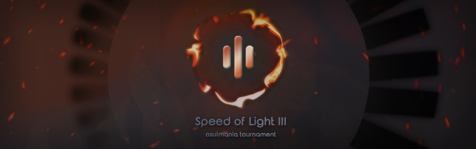

---
tags:
  - SOL
  - SOL3
---

# Speed of Light 3

**Speed of Light 3** (***SOL3***) was a double-elimination 1v1 osu!mania 4-key tournament hosted by ::{ flag=US }:: [Penguinosity](https://osu.ppy.sh/users/10235296), ::{ flag=MX }:: [\[Crz\]Crystalize](https://osu.ppy.sh/users/3072763), ::{ flag=US }:: [Lemonguy](https://osu.ppy.sh/users/4693052), ::{ flag=US }:: [-Sparky-](https://osu.ppy.sh/users/3187959), ::{ flag=NL }:: [Albionthegreat](https://osu.ppy.sh/users/9853595) and ::{ flag=SE }:: [Mestro](https://osu.ppy.sh/users/4798263). It was the third instalment of the Speed of Light series.

## Tournament schedule

| Event | Timestamp |
| --: | :-- |
| Registration phase | 2022-12-06/2022-12-28 |
| Screening phase | 2022-12-28/2023-01-06 |
| Qualifiers | 2023-01-13/2023-01-15 |
| Group stage week 1 | 2023-01-20/2023-01-22 |
| Group stage week 2 | 2023-01-27/2023-01-29 |
| Round of 32 | 2023-02-03/2023-02-05 |
| Round of 16 | 2023-02-10/2023-02-12 |
| Quarterfinals | 2023-02-17/2023-02-19 |
| Semifinals | 2023-02-24/2023-02-26 |
| Finals | 2023-03-03/2023-03-05 |
| Grand Finals | 2023-03-10/2023-03-12 |

## Prizes

| Placing | Prize(s) |
| :-: | :-- |
|  | $100 for each team member, profile badge |
|  | $45 for each team member |
|  | $25 for each team member |
| *4th place* | 6 months of osu!supporter for each team member |

## Organisation

| Position | Member(s) |
| :-- | :-- |
| Host | ::{ flag=US }:: [Penguinosity](https://osu.ppy.sh/users/10235296), ::{ flag=MX }:: [\[Crz\]Crystalize](https://osu.ppy.sh/users/3072763), ::{ flag=US }:: [Lemonguy](https://osu.ppy.sh/users/4693052),  ::{ flag=US }:: [-Sparky-](https://osu.ppy.sh/users/3187959), ::{ flag=NL }:: [Albionthegreat](https://osu.ppy.sh/users/9853595), ::{ flag=SE }:: [Mestro](https://osu.ppy.sh/users/4798263) |
| Mappool Selector | ::{ flag=US }:: [Penguinosity](https://osu.ppy.sh/users/10235296), ::{ flag=US }:: [lemonguy](https://osu.ppy.sh/users/4693052) |
| Mapper | ::{ flag=US }:: [Penguinosity](https://osu.ppy.sh/users/10235296), ::{ flag=US }:: [lemonguy](https://osu.ppy.sh/users/4693052), ::{ flag=US }:: [Biosphere](https://osu.ppy.sh/users/6357823), ::{ flag=FR }:: [Paturages](https://osu.ppy.sh/users/1375479), ::{ flag=JP }:: [CrewK](https://osu.ppy.sh/users/11488604), ::{ flag=US }:: [Toaph Daddy](https://osu.ppy.sh/users/7616811), ::{ flag=US }:: [elexire](https://osu.ppy.sh/users/9206093), ::{ flag=PL }:: [zaalseen](https://osu.ppy.sh/users/17482556), ::{ flag=US }:: [-mint-](https://osu.ppy.sh/users/8976576), ::{ flag=PL }:: [Paraxia](https://osu.ppy.sh/users/14001000), ::{ flag=CA }:: [guden](https://osu.ppy.sh/users/11626065), ::{ flag=US }:: [stupud man](https://osu.ppy.sh/users/2141612), ::{ flag=KR }:: [Beatmap](https://osu.ppy.sh/users/1421827), ::{ flag=TH }:: [MyZterioN-](https://osu.ppy.sh/users/8521723), ::{ flag=CN }:: [YuEast 2018](https://osu.ppy.sh/users/13953619), ::{ flag=ID }:: [FelixSpade](https://osu.ppy.sh/users/2651304), ::{ flag=ES }:: [Ska](https://osu.ppy.sh/users/10313023), ::{ flag=SG }:: [TheFunk](https://osu.ppy.sh/users/13981991), ::{ flag=CN }:: [Hylotl](https://osu.ppy.sh/users/18270260), ::{ flag=VN }:: [Micleak](https://osu.ppy.sh/users/16140674), ::{ flag=US }:: [chxu](https://osu.ppy.sh/users/13712190), ::{ flag=ID }:: [\[Crz\]Crysarlene](https://osu.ppy.sh/users/5492871), ::{ flag=TH }:: [HowToPlayLN](https://osu.ppy.sh/users/10879600), ::{ flag=BR }:: [Guilhermeziat](https://osu.ppy.sh/users/3661387), ::{ flag=GB }:: [Pope Gadget](https://osu.ppy.sh/users/2288341), ::{ flag=GB }:: [Percyqaz](https://osu.ppy.sh/users/9218461), ::{ flag=BE }:: [yetii](https://osu.ppy.sh/users/6914714) |
| Helper | ::{ flag=GB }:: [Pope Gadget](https://osu.ppy.sh/users/2288341), ::{ flag=US }:: [trans rights](https://osu.ppy.sh/users/5125822), ::{ flag=NL }:: [Albionthegreat](https://osu.ppy.sh/users/9853595), ::{ flag=US }:: [Matthia](https://osu.ppy.sh/users/19804607), ::{ flag=TH }:: [MyZterioN-](https://osu.ppy.sh/users/8521723), ::{ flag=MX }:: [demiantorp](https://osu.ppy.sh/users/8291099), ::{ flag=US }:: [elexire](https://osu.ppy.sh/users/9206093), ::{ flag=CA }:: [Piggy](https://osu.ppy.sh/users/5390121), ::{ flag=US }:: [chxu](https://osu.ppy.sh/users/13712190), ::{ flag=PL }:: [zaalseen](https://osu.ppy.sh/users/17482556), ::{ flag=ID }:: [Mipha-](https://osu.ppy.sh/users/5767941), ::{ flag=US }:: [Hubert](https://osu.ppy.sh/users/6430626), ::{ flag=NL }:: [Toxic Scent](https://osu.ppy.sh/users/12599154), ::{ flag=NL }:: [Shoira](https://osu.ppy.sh/users/13377652), ::{ flag=CA }:: [arpia97](https://osu.ppy.sh/users/6363008), ::{ flag=PH }:: [bojii](https://osu.ppy.sh/users/10083439), ::{ flag=CA }:: [UmmmMrMoo](https://osu.ppy.sh/users/15314355), ::{ flag=TH }:: [MIkuaimbot](https://osu.ppy.sh/users/17699745), ::{ flag=KR }:: [SuddenDeath](https://osu.ppy.sh/users/6699923), ::{ flag=CZ }:: [grillroasted](https://osu.ppy.sh/users/18271627) |
| Referee | ::{ flag=NL }:: [Albionthegreat](https://osu.ppy.sh/users/9853595), ::{ flag=US }:: [-mint-](https://osu.ppy.sh/users/8976576), ::{ flag=US }:: [bonkmi](https://osu.ppy.sh/users/21148690), ::{ flag=GB }:: [StartAndSelect](https://osu.ppy.sh/users/8720555), ::{ flag=US }:: [RhymesWithMash](https://osu.ppy.sh/users/18834550), ::{ flag=SG }:: [Polytetral](https://osu.ppy.sh/users/8612061), ::{ flag=TH }:: [Infinitstart](https://osu.ppy.sh/users/4026124), ::{ flag=DE }:: [TheHunter1](https://osu.ppy.sh/users/6496016), ::{ flag=MX }:: [urielbg](https://osu.ppy.sh/users/4598040), ::{ flag=CN }:: [YuEast 2018](https://osu.ppy.sh/users/13953619), ::{ flag=NL }:: [DannyPX](https://osu.ppy.sh/users/11253722), ::{ flag=ID }:: [-Yubi-](https://osu.ppy.sh/users/17851478), ::{ flag=PH }:: [vincent4399](https://osu.ppy.sh/users/9764388), ::{ flag=GB }:: [Danielstigman](https://osu.ppy.sh/users/9407594), ::{ flag=VN }:: [MashedPotato](https://osu.ppy.sh/users/10494860), ::{ flag=US }:: [ERA PorkIsGreat](https://osu.ppy.sh/users/10756322), ::{ flag=US }:: [trans rights](https://osu.ppy.sh/users/5125822) |
| Streamer | ::{ flag=FR }:: [Paturages](https://osu.ppy.sh/users/1375479),    ::{ flag=US }:: [SunApple](https://osu.ppy.sh/users/11817622), ::{ flag=NL }:: [Albionthegreat](https://osu.ppy.sh/users/9853595), ::{ flag=US }:: [EpsilonMaiagare](https://osu.ppy.sh/users/3855052), ::{ flag=US }:: [bonkmi](https://osu.ppy.sh/users/21148690), ::{ flag=TH }:: [konkawe](https://osu.ppy.sh/users/15665805), ::{ flag=CA }:: [guden](https://osu.ppy.sh/users/11626065), ::{ flag=GB }:: [Danielstigman](https://osu.ppy.sh/users/9407594) |
| Commentator | ::{ flag=US }:: [-Sparky-](https://osu.ppy.sh/users/3187959), ::{ flag=ID }:: [\[Crz\]Crysarlene](https://osu.ppy.sh/users/5492871), ::{ flag=US }:: [Penguinosity](https://osu.ppy.sh/users/10235296), ::{ flag=US }:: [ERA PorkIsGreat](https://osu.ppy.sh/users/10756322), ::{ flag=BR }:: [Halo-](https://osu.ppy.sh/users/7572142), ::{ flag=US }:: [Dynascape](https://osu.ppy.sh/users/8784587), ::{ flag=US }:: [RhymesWithMash](https://osu.ppy.sh/users/18834550), ::{ flag=PH }:: [Silhoueska Elze](https://osu.ppy.sh/users/11517895), ::{ flag=US }:: [Toaph Daddy](https://osu.ppy.sh/users/7616811/osu), ::{ flag=US }:: [SunApple](https://osu.ppy.sh/users/11817622), ::{ flag=US }:: [-mint-](https://osu.ppy.sh/users/8976576), ::{ flag=CA }:: [walmart5193](https://osu.ppy.sh/users/16468962), ::{ flag=SG }:: [AdamAckerville](https://osu.ppy.sh/users/12297375) |
| Graphic Designer | ::{ flag=MX }:: [Candy](https://osu.ppy.sh/users/3964918) |
| Statistician | ::{ flag=NL }:: [Albionthegreat](https://osu.ppy.sh/users/9853595), ::{ flag=SE }:: [Mestro](https://osu.ppy.sh/users/4798263) |

## Links

- [Discussion thread](https://osu.ppy.sh/community/forums/topics/1686361)
- [SOL Discord server](https://discord.gg/xWet4ug)
- [Livestream](https://www.twitch.tv/speedoflightosu)
- [Pick'em predictions website](https://pickem.hwc.hr/tournaments/105)
- [Tournament bracket](https://challonge.com/o1cc9rmh)
- Spreadsheets
  - **[Master sheet](https://docs.google.com/spreadsheets/d/13kCfQF1oH_4Y-nqD6C_qVg5PvZ_MNx4UxLWgN-ElmFc)**
  - [Statistics](https://docs.google.com/spreadsheets/d/e/2PACX-1vSaec74DtFx56vJl1roud3YV4GPFA54gcn7lpiaKm4Q8uYpCJ32lQ1b2vdlV7DGBVn6Mq_OVpXO6kN5/pubhtml)

## Participants

| Seed | Team | Members |
| :-: | :-- | :-- |
| 1 | **Canned Thought** | ::{ flag=PH }:: [Silhoueska Elze](https://osu.ppy.sh/users/11517895), ::{ flag=PH }:: [Swarmsii](https://osu.ppy.sh/users/11716111) |
| 2 | **irregular team** | ::{ flag=CL }:: [\[GS\]Myuka](https://osu.ppy.sh/users/10072733), ::{ flag=MY }:: [cheewee10](https://osu.ppy.sh/users/4477497) |
| 3 | **shiro's coffee shop** | ::{ flag=SG }:: [sukidayo-](https://osu.ppy.sh/users/16870002), ::{ flag=ID }:: [Reyi](https://osu.ppy.sh/users/13385865) |
| 4 | **the ffr d8 team** | ::{ flag=GB }:: [TingMomentum](https://osu.ppy.sh/users/12489832), ::{ flag=GB }:: [Zoobin4](https://osu.ppy.sh/users/10055204) |
| 5 | **Nepoca** | ::{ flag=US }:: [Nepijin](https://osu.ppy.sh/users/11734610), ::{ flag=KR }:: [Poca](https://osu.ppy.sh/users/8581031) |
| 6 | **Capybara Lovers** | ::{ flag=BR }:: [Lothus](https://osu.ppy.sh/users/9530019), ::{ flag=BR }:: [DemiFiendSMT](https://osu.ppy.sh/users/20051971) |
| 7 | **TUYU fans** | ::{ flag=KR }:: [Lami-](https://osu.ppy.sh/users/16505281), ::{ flag=CZ }:: [grillroasted](https://osu.ppy.sh/users/18271627) |
| 8 | **boba** | ::{ flag=PH }:: [bojii](https://osu.ppy.sh/users/10083439), ::{ flag=TH }:: [MIkuaimbot](https://osu.ppy.sh/users/17699745) |
| 9 | **Peach Cat** | ::{ flag=GB }:: [Eliminate](https://osu.ppy.sh/users/9169747), ::{ flag=MY }:: [xxxxxx2800](https://osu.ppy.sh/users/4084853) |
| 10 | **MANIP :handshake: MANIP** | ::{ flag=DE }:: [jkzu123](https://osu.ppy.sh/users/15806513), ::{ flag=BR }:: [SillyFangirl](https://osu.ppy.sh/users/2288363) |
| 11 | **HUUUGE People Palace** | ::{ flag=JP }:: [jhleetgirl](https://osu.ppy.sh/users/10745260), ::{ flag=JP }:: [AMDuskia1996](https://osu.ppy.sh/users/10242062) |
| 12 | **Terrorists** | ::{ flag=KR }:: [SuddenDeath](https://osu.ppy.sh/users/6699923), ::{ flag=US }:: [\[LS\]Mitter](https://osu.ppy.sh/users/14551764) |
| 13 | **Team Welfare** | ::{ flag=BR }:: [LeMarcinho](https://osu.ppy.sh/users/13347579), ::{ flag=US }:: [\[GS\]linc](https://osu.ppy.sh/users/12093536) |
| 14 | **No SV** | ::{ flag=DE }:: [ERA medium kek](https://osu.ppy.sh/users/11625617), ::{ flag=KR }:: [yz1155](https://osu.ppy.sh/users/2071008) |
| 15 | **LNCryption** | ::{ flag=TH }:: [Achino](https://osu.ppy.sh/users/13349388), ::{ flag=TH }:: [--Pavin--](https://osu.ppy.sh/users/12046267) |
| 16 | **GOD LN+FNF MASHERsob** | ::{ flag=IT }:: [- Pixie -](https://osu.ppy.sh/users/13878539), ::{ flag=VN }:: [CPT_Sivelia](https://osu.ppy.sh/users/12562107) |
| 17 | **yapecausa** | ::{ flag=PE }:: [-Lalito898](https://osu.ppy.sh/users/15098503), ::{ flag=PE }:: [dendro_](https://osu.ppy.sh/users/17152485) |
| 18 | **CaiXK** | ::{ flag=CN }:: [\[Crz\]Caicium](https://osu.ppy.sh/users/10702235), ::{ flag=CN }:: [Kuiiiiteeee](https://osu.ppy.sh/users/7304075) |
| 19 | **Nightcord at SOL3** | ::{ flag=PH }:: [4Kenn](https://osu.ppy.sh/users/20496815), ::{ flag=ID }:: [adihza](https://osu.ppy.sh/users/18309106) |
| 20 | **tidur** | ::{ flag=MY }:: [ERA Leon](https://osu.ppy.sh/users/13382147), ::{ flag=MY }:: [\[LS\]Icetify](https://osu.ppy.sh/users/14931745) |
| 21 | **no idea** | ::{ flag=CA }:: [Stability](https://osu.ppy.sh/users/6701738), ::{ flag=CA }:: [mae0149](https://osu.ppy.sh/users/9188975) |
| 22 | **Zibo no.1** | ::{ flag=CN }:: [Miyes](https://osu.ppy.sh/users/12942073), ::{ flag=CN }:: [Zyuuu](https://osu.ppy.sh/users/15389275) |
| 23 | **W RIZZ** | ::{ flag=US }:: [ok bye](https://osu.ppy.sh/users/15063813), ::{ flag=CA }:: [GDMem](https://osu.ppy.sh/users/10804091) |
| 24 | **TaiwanPieceAintReal** | ::{ flag=US }:: [FullCombro](https://osu.ppy.sh/users/12045149), ::{ flag=US }:: [\[LS\]Dev](https://osu.ppy.sh/users/16407268) |
| 25 | **TSD 4 Line PC B2B** | ::{ flag=CA }:: [walmart5193](https://osu.ppy.sh/users/16468962), ::{ flag=PH }:: [Silicosis](https://osu.ppy.sh/users/15548876) |
| 26 | **sylveon eats noodles** | ::{ flag=BH }:: [Unitori-](https://osu.ppy.sh/users/15772814), ::{ flag=AE }:: [drag_](https://osu.ppy.sh/users/17959501) |
| 27 | **we eat omega cake** | ::{ flag=JP }:: [omegaY_](https://osu.ppy.sh/users/14727263), ::{ flag=JP }:: [ICECAKE](https://osu.ppy.sh/users/16100800) |
| 28 | **Solestio** | ::{ flag=VN }:: [magnifestio](https://osu.ppy.sh/users/22725724), ::{ flag=MY }:: [\[MY\]Sol](https://osu.ppy.sh/users/12054898) |
| 29 | **rizzards of oz** | ::{ flag=NZ }:: [Robeats](https://osu.ppy.sh/users/19446399), ::{ flag=AU }:: [hello123amogus](https://osu.ppy.sh/users/11824060) |
| 30 | **Transatlantique** | ::{ flag=FR }:: [Auraah](https://osu.ppy.sh/users/10015908), ::{ flag=US }:: [DarkMew2](https://osu.ppy.sh/users/13921965) |
| 31 | **TeamNameMustBe4-20Ch** | ::{ flag=SG }:: [Neon-Hooray](https://osu.ppy.sh/users/24058560), ::{ flag=SG }:: [icxfire](https://osu.ppy.sh/users/21207265) |
| 32 | **Correction Is Needed** | ::{ flag=SG }:: [MyukaMyMommy](https://osu.ppy.sh/users/12297375), ::{ flag=GB }:: [syaro-](https://osu.ppy.sh/users/15716021) |
| 33 | **hewkaotonteesam** | ::{ flag=TH }:: [AomDCO](https://osu.ppy.sh/users/21072569), ::{ flag=TH }:: [SHOKO -](https://osu.ppy.sh/users/10279743) |
| 34 | **Brainfog** | ::{ flag=CA }:: [Dale940](https://osu.ppy.sh/users/13847951), ::{ flag=NO }:: [carpal tunnel](https://osu.ppy.sh/users/23726452) |
| 35 | **LNLC** | ::{ flag=DE }:: [ERA Leo](https://osu.ppy.sh/users/15440118), ::{ flag=DE }:: [Cyaewin](https://osu.ppy.sh/users/10027302) |
| 36 | **Broke Like A Banana** | ::{ flag=US }:: [SunApple](https://osu.ppy.sh/users/11817622), ::{ flag=US }:: [_Seth](https://osu.ppy.sh/users/8111953) |
| 37 | **Zundamon dayoi** | ::{ flag=JP }:: [G2t](https://osu.ppy.sh/users/15216030), ::{ flag=JP }:: [yoppy-yugen](https://osu.ppy.sh/users/11799103) |
| 38 | **BOLITALIANO** | ::{ flag=AR }:: [jLuyalb](https://osu.ppy.sh/users/7093698), ::{ flag=AR }:: [Rocstarxd](https://osu.ppy.sh/users/18566390) |
| 39 | **Papua Merdeka** | ::{ flag=ID }:: [Dellia](https://osu.ppy.sh/users/12143152), ::{ flag=ID }:: [Proxae](https://osu.ppy.sh/users/8410575) |
| 40 | **Vibro haters** | ::{ flag=PA }:: [Bolelo](https://osu.ppy.sh/users/23819962), ::{ flag=MX }:: [Darkhechiser](https://osu.ppy.sh/users/23392961) |
| 41 | **\[SYS\] Owl** | ::{ flag=KR }:: [kty071016](https://osu.ppy.sh/users/17742286), ::{ flag=KR }:: [lianic](https://osu.ppy.sh/users/13975661) |
| 42 | **Women, am I right?** | ::{ flag=ES }:: [ERA Guldakh](https://osu.ppy.sh/users/8553078), ::{ flag=US }:: [ERA Basil](https://osu.ppy.sh/users/7097990) |
| 43 | **the nuts squad** | ::{ flag=DO }:: [\[GS\]Antonio](https://osu.ppy.sh/users/21599285), ::{ flag=PE }:: [henryalexbr](https://osu.ppy.sh/users/23528661) |
| 44 | **ban LN** | ::{ flag=CL }:: [nyawaa](https://osu.ppy.sh/users/10235085), ::{ flag=US }:: [CheemsBall](https://osu.ppy.sh/users/21810979) |
| 45 | **SV idiots** | ::{ flag=JP }:: [gyoza_goki](https://osu.ppy.sh/users/18144664), ::{ flag=JP }:: [yomogi237](https://osu.ppy.sh/users/28571440) |
| 46 | **Toyota Land Cruisers** | ::{ flag=QA }:: [cyta_](https://osu.ppy.sh/users/15444660), ::{ flag=QA }:: [bustinman](https://osu.ppy.sh/users/19089928) |
| 47 | **dd e** | ::{ flag=HK }:: [Ricizus](https://osu.ppy.sh/users/10395139), ::{ flag=SG }:: [IJosephI\[GS\]](https://osu.ppy.sh/users/13353749) |
| 48 | **Eeriesolent** | ::{ flag=US }:: [\[LS\]Eeriee](https://osu.ppy.sh/users/19133938), ::{ flag=US }:: [\[LS\]Resolent](https://osu.ppy.sh/users/19113292) |
| 49 | **robEATs burger $15** | ::{ flag=US }:: [\[LS\]Mari](https://osu.ppy.sh/users/15270411), ::{ flag=US }:: [Znow](https://osu.ppy.sh/users/15513303) |
| 50 | **CAUSA** | ::{ flag=PE }:: [RafaelPC](https://osu.ppy.sh/users/23297156), ::{ flag=PE }:: [Pokedogga](https://osu.ppy.sh/users/21682880) |
| 51 | **Toilettes** | ::{ flag=FR }:: [narahashi](https://osu.ppy.sh/users/18867523), ::{ flag=FR }:: [Babibelbleu](https://osu.ppy.sh/users/16892459) |
| 52 | **Zonrox ColorSafe** | ::{ flag=PH }:: [\[KN\]CuB-03](https://osu.ppy.sh/users/18560307), ::{ flag=PH }:: [DiamondGenius75](https://osu.ppy.sh/users/19107638) |
| 53 | **E-girl haters** | ::{ flag=FR }:: [Kaya_](https://osu.ppy.sh/users/11643399), ::{ flag=FR }:: [SpaceVader](https://osu.ppy.sh/users/21503296) |
| 54 | **XSANZTIBUCKS** | ::{ flag=PH }:: [iid3rp](https://osu.ppy.sh/users/23274559), ::{ flag=PH }:: [ManiaDegengod](https://osu.ppy.sh/users/13193798) |
| 55 | **T1dur** | ::{ flag=MY }:: [\[GS\]Einar](https://osu.ppy.sh/users/8782656), ::{ flag=MY }:: [JayLye](https://osu.ppy.sh/users/14892447) |
| 56 | **Glagglers** | ::{ flag=US }:: [beta carotene](https://osu.ppy.sh/users/22839620), ::{ flag=US }:: [loser\ |
| 57 | **Volvo Gaming** | ::{ flag=US }:: [ERA Jungle](https://osu.ppy.sh/users/9709652), ::{ flag=CA }:: [ZeMaB](https://osu.ppy.sh/users/15633324) |
| 58 | **Portion Boys** | ::{ flag=FI }:: [Fisu](https://osu.ppy.sh/users/12545346), ::{ flag=FI }:: [Albania Illya](https://osu.ppy.sh/users/10393606) |
| 59 | **Pucc gaming** | ::{ flag=CA }:: [ERA Mystiik](https://osu.ppy.sh/users/17242265), ::{ flag=US }:: [ERA Zenith](https://osu.ppy.sh/users/7128063) |
| 60 | **LEKA TRE** | ::{ flag=FI }:: [Tre](https://osu.ppy.sh/users/10024264), ::{ flag=FI }:: [Leka](https://osu.ppy.sh/users/11408653) |
| 61 | **The Pulverizers** | ::{ flag=US }:: [Venomsypher](https://osu.ppy.sh/users/24421954), ::{ flag=US }:: [CroffeeeY](https://osu.ppy.sh/users/17419075) |
| 62 | **0201god** | ::{ flag=TW }:: [\[Jrc\]EubC](https://osu.ppy.sh/users/18188796), ::{ flag=TW }:: [amano_hina](https://osu.ppy.sh/users/19882148) |
| 63 | **Choke Gang** | ::{ flag=MY }:: [\[RGK\]Cheoky29](https://osu.ppy.sh/users/14901072), ::{ flag=MY }:: [StyGix](https://osu.ppy.sh/users/7745408) |
| 64 | **1217HOW** | ::{ flag=TW }:: [Pdog4ni](https://osu.ppy.sh/users/14581544), ::{ flag=TW }:: [\[Jrc\]tommy125](https://osu.ppy.sh/users/15189878) |

More detailed qualifiers results can be accessed via this [spreadsheet](https://docs.google.com/spreadsheets/d/e/2PACX-1vSaec74DtFx56vJl1roud3YV4GPFA54gcn7lpiaKm4Q8uYpCJ32lQ1b2vdlV7DGBVn6Mq_OVpXO6kN5/pubhtml).

## Groups

| Group | Top | High | Low | Unseeded |
| :-: | :-- | :-- | :-- | :-- |
| **A** | Capybara Lovers | TaiwanPieceAintReal | SV idiots | Pucc Gaming |
| **B** | the ffr d8 team | Nightcord at SOL3 | Brainfog | Choke Gang |
| **C** | irregular team | Correction Is Needed | hewkaotonteesam | LEKA TRE |
| **D** | LNCryption | TeamNameMustBe4-20Ch | Broke Like A Banana | Portion Boys |
| **E** | shiro's coffee shop | Solestio | \[SYS\] Owl | robEATs burger $15 |
| **F** | HUUUGE People Palace | TSD 4 Line PC B2B | dd e | Volvo Gaming |
| **G** | Canned Thought | Zibo no.1 | Women, am I right? | 1217HOW |
| **H** | TUYU fans | W RIZZ | Vibro haters | Glagglers |
| **I** | Peach Cat | sylveon eats noodles | Eeriesolent | Toilettes |
| **J** | Nepoca | no idea | ban LN | T1dur |
| **K** | MANIP :handshake: MANIP | yapecausa | Zundamon dayoi | E-girl haters |
| **L** | Team Welfare | rizzards of oz | Papua Merdeka | The Pulverizers |
| **M** | Terrorists | we eat omega cake | Toyota Land Cruisers | CAUSA |
| **N** | GOD LN+FNF MASHERsob | tidur | BOLITALIANO | Zonrox ColorSafe |
| **O** | boba | CaiXK | the nuts squad | XSANZTIBUCKS |
| **P** | No SV | Transatlantique | LNLC | 0201god |

## Podium

This competition has come to an end and resulted in the following podium:

| Placing | Team |
| :-: | :-- |
|  | **irregular team** (::{ flag=CL }:: [\[GS\]Myuka](https://osu.ppy.sh/users/10072733), ::{ flag=MY }:: [cheewee10](https://osu.ppy.sh/users/4477497)) |
|  | **Nepoca** (::{ flag=US }:: [Nepijin](https://osu.ppy.sh/users/11734610), ::{ flag=KR }:: [Poca](https://osu.ppy.sh/users/8581031)) |
|  | **the ffr d8 team** (::{ flag=GB }:: [TingMomentum](https://osu.ppy.sh/users/12489832), ::{ flag=GB }:: [Zoobin4](https://osu.ppy.sh/users/10055204)) |
| *4th place* | **shiro's coffee shop** (::{ flag=SG }:: [sukidayo-](https://osu.ppy.sh/users/16870002), ::{ flag=ID }:: [Reyi](https://osu.ppy.sh/users/13385865)) |

## Mappools

### Grand Finals

- Rice
  1. [Merico - Scary (law38204) \[Unable (rice version 1.2x\]](https://osu.ppy.sh/beatmapsets/1945895#mania/4025853)
  2. [S3RL ft Lexi - Earth Bb (Ska) \[Ska's b (edit 1.25x)\]](https://osu.ppy.sh/beatmapsets/1950977#mania/4039707)
  3. [tarolabo - Fireball (lemonguy) \[Challenge x1.05\]](https://osu.ppy.sh/beatmapsets/1861704#mania/4014340)
  4. [Blood Stain Child - Electricity (0DZ0) \[DZ's Thunderclap 1.3x\]](https://osu.ppy.sh/beatmapsets/1875801#mania/3860172)
  5. [Function Phantom - Algebra (Guilhermeziat) \[(B + R)2 = 1Az (i + L) ~ 1.05x\]](https://osu.ppy.sh/beatmapsets/1949217#mania/4035212)
  6. [Junpaku no IVORY - BELOBOG (CrewK) \[Tenshi\]](https://osu.ppy.sh/beatmapsets/1947982#mania/4031439)
  7. [Frums - goTe EX (Biosphere) \[Metacognition\]](https://osu.ppy.sh/beatmapsets/1937381#mania/4004787)
  8. [Caramell - Caramelldansen (Speedycake Remix) (Pope Gadget) \[1.05\]](https://osu.ppy.sh/beatmapsets/1950174#mania/4037688)
- Hybrid
  1. [cosMo@bousouPAlterEgo - Apocalypse Rebellion (lemonguy) \[Armageddon\]](https://osu.ppy.sh/beatmapsets/1941144#mania/4014355)
  2. [ProjectG - Fake Life (Toaph Daddy) \[Simulation\]](https://osu.ppy.sh/beatmapsets/1951477#mania/4040907)
  3. [Mono. - Everlasting Game (CrewK) \[Checkmate\]](https://osu.ppy.sh/beatmapsets/1948932#mania/4034178)
  4. [ISOMERZ(seatrus+DJ Raisei) - DiXaster (yetii) \[BeXinner\]](https://osu.ppy.sh/beatmapsets/1948109#mania/4031732)
- LN
  1. [Gram - Nibelungen (Penguinosity) \[Saga 1.1\]](https://osu.ppy.sh/beatmapsets/1856934#mania/3816443)
  2. [Usagi Aikouka PSYCHOPATH (cosMo x syuri22) - Psychopath Rabbit (lemonguy) \[LN Master x1.05\]](https://osu.ppy.sh/beatmapsets/1941141#mania/4014344)
  3. [Omoi - Snow Drive (Cut version) (Hylotl) \[Snowblind \[1.15x Rate\]\]](https://osu.ppy.sh/beatmapsets/1934906#mania/3998599)
  4. [Kobaryo - Cartoon Candy (Penguinosity) \[Taffy Puller\]](https://osu.ppy.sh/beatmapsets/1951497#mania/4040945)
- Tiebreaker
  1. **[Laur - SYSTEM ERROR (Penguinosity) \[del /s /q C:\\Windows\\System32\\\]](https://osu.ppy.sh/beatmapsets/1951675#mania/4041357)**

### Finals

- Rice
  1. [Jun Ishikawa - Zero-Two Battle Theme (Windoze) \[Windoze's Challenge (Edit) (160bpm)\]](https://osu.ppy.sh/beatmapsets/1943819#mania/4021133)
  2. [Apashe feat. Geoffroy - Distance (KOAN Sound Remix) (elexire) \[Renaissance 1.15x (edit)\]](https://osu.ppy.sh/beatmapsets/1941231#mania/4014585)
  3. [ZiGZaG HACKER - V^3 (Hello World) (Penguinosity) \[SYNOPSIS \[agony\]\]](https://osu.ppy.sh/beatmapsets/1943794#mania/4021094)
  4. [NAOKI, Jamison Boaz - Love The Subhuman Self (Biosphere) \[Iron Maiden 1.15x\]](https://osu.ppy.sh/beatmapsets/1941147#mania/4014359)
  5. [E-Type - True Believer (Hylotl) \[Inspiration \[1.2x Rate\]\]](https://osu.ppy.sh/beatmapsets/1920539#mania/3963839)
  6. [Excision - Crusher (zaalseen) \[Empty Hand\]](https://osu.ppy.sh/beatmapsets/1944066#mania/4021740)
  7. [goreshit - incessant smiles (Cadmium-113) \[Cadmium's happy 1.3x\]](https://osu.ppy.sh/beatmapsets/1946563#mania/4027246)
  8. [255 - 255 (st2020 Mix) (CrewK) \[MAX SPEED 268\]](https://osu.ppy.sh/beatmapsets/1944361#mania/4022386)
- Hybrid
  1. [Rabbit House - Gehenna (HowToPlayLN) \[Pandemonium \[1.15x Rate\]\]](https://osu.ppy.sh/beatmapsets/1943750#mania/4021019)
  2. [Ik4sumi - Amorphous (Micleak) \[Indeterminate 1.15x\]](https://osu.ppy.sh/beatmapsets/1890122#mania/4027873)
  3. [7mai - Boxel Adventure (lemonguy) \[New Game Plus\]](https://osu.ppy.sh/beatmapsets/1941136#mania/4014336)
  4. [@kyou1110 - Senpuuki (Dz'Xa Remix) (chxu) \[chxu's Incendiary 1.05x\]](https://osu.ppy.sh/beatmapsets/1943824#mania/4021140)
- LN
  1. [wa. - Cerenkov Radiation (-mint-) \[Luminescent 1.1x (261bpm)\]](https://osu.ppy.sh/beatmapsets/1943764#mania/4021052)
  2. [Katagiri - Katagiri Catch Ball (YuEast 2018) \[Hani Hani Honey Honey x1.05\]](https://osu.ppy.sh/beatmapsets/1909953#mania/3939521)
  3. [Relect - Get Crunk (chxu) \[SHA GUA\]](https://osu.ppy.sh/beatmapsets/1876516#mania/3861846)
  4. [Helix - Overkill (\[Crz\]Crysarlene) \[Y (cut)\]](https://osu.ppy.sh/beatmapsets/1943729#mania/4020968)
- Tiebreaker
  1. **[Camellia feat. Camellia - Ashed Wings (lemonguy) \[Tarnished\]](https://osu.ppy.sh/beatmapsets/1947778#mania/4030417)**

### Semifinals

- Rice
  1. [The Rasmus - In the shadows (isokasapupuja) \[Medium 1.15x\]](https://osu.ppy.sh/beatmapsets/1942855#mania/4018860)
  2. [Frums - dimensionalize nervous breakdown \[rev.flat\] (Penguinosity) \[Medulla 1.2\]](https://osu.ppy.sh/beatmapsets/1607052#mania/3281550)
  3. [DJ Sharpnel - Dokudenpa (Penguinosity) \[Yome's Hard 8 1.3x\]](https://osu.ppy.sh/beatmapsets/1941127#mania/4014301)
  4. [OceanLab - Satellite (trans rights) \[DmX3k's Reform (157bpm)\]](https://osu.ppy.sh/beatmapsets/1941341#mania/4015301)
  5. [Utata-P feat. Yuzuki Yukari - Shiawase ni Nareru Kakushi Command ga Arurashii (\[Crz\]Crystalize) \[Ska's :) (edit)\]](https://osu.ppy.sh/beatmapsets/1941350#mania/4015345)
  6. [Erika Vikman - Syntisten Poyta (Penguinosity) \[Lofty's Beginner 3 1.25x\]](https://osu.ppy.sh/beatmapsets/1942980#mania/4019078)
  7. [MITCH DOWNVELL - not SAKURA (tyrcs) \[vely TECHNICAL 1.05x\]](https://osu.ppy.sh/beatmapsets/1815215#mania/3723857)
- Hybrid
  1. [Kikuo x cosMo@bousouP feat. Kagenui Hana - Spider's Thread (lemonguy) \[Hell (Edit)\]](https://osu.ppy.sh/beatmapsets/1941125#mania/4014297)
  2. [LeaF - Ongaku -Kaiongaku mix- (guden) \[ANARCHY!!\]](https://osu.ppy.sh/beatmapsets/1941194#mania/4014447)
  3. [Laur - Chimi Moryo (TheFunk) \[The Dawn of the Awakening\]](https://osu.ppy.sh/beatmapsets/1940989#mania/4014022)
- LN
  1. [Chroma - tiny tales continue (MyZterioN-) \[episode 1.15x\]](https://osu.ppy.sh/beatmapsets/1940950#mania/4013915)
  2. [Kobaryo - My Music Playlist (Hylotl) \[Track 01\]](https://osu.ppy.sh/beatmapsets/1940386#mania/4011991)
  3. [DJ TOTTO - VOLAQUAS (lemonguy) \[voLcaNo x1.05\]](https://osu.ppy.sh/beatmapsets/1941124#mania/4014294)
  4. [yowanecity - SAMURAI COMPLEX (CrewK) \[Harakiri Banzai \[1.1x Rate\]\]](https://osu.ppy.sh/beatmapsets/1868457#mania/4018481)
- Tiebreaker
  1. **[Billain - NEWGROOVEORDER (elexire) \[\\ \\ \\ \\ \\ \\ \\ \\ \\\]](https://osu.ppy.sh/beatmapsets/1942347#mania/4017832)**

### Quarterfinals

- Rice
  1. [JAKAZiD - Pocari Freakz (JAKAZiD's Jet Sweat Radio Remix) (Celebelian) \[Celeb's 24 1.2x\]](https://osu.ppy.sh/beatmapsets/1936352#mania/4002170)
  2. [None Like Joshua - Naruto's Ninja Way (0DZ0) \[DZ's 1000 Years of Pain 1.2x\]](https://osu.ppy.sh/beatmapsets/1671839#mania/3860115)
  3. [Hommarju - GEROL (CrewK) \[GROOVE\]](https://osu.ppy.sh/beatmapsets/1581779#mania/3230076)
  4. [Supire - Forgotten Hate (Celebelian) \[Celeb's 25 1.15x\]](https://osu.ppy.sh/beatmapsets/1936390#mania/4002268)
  5. [Anamanaguchi - Helix Nebula (YuEast 2018) \[spaceship x1.05\]](https://osu.ppy.sh/beatmapsets/1913187#mania/3946617)
  6. [Nfract - Phantasia 2000 (TranceANGEL) (Penguinosity) \[Screening 1.25\]](https://osu.ppy.sh/beatmapsets/1935900#mania/4001200)
  7. [3R2 - Voices of Belief (Silaver Remix) (DourGent) \[Challenge 1.05x\]](https://osu.ppy.sh/beatmapsets/1936229#mania/4001914)
- Hybrid
  1. [sasakure.UK x TJ.hangneil - World Ender (AlexDunk) \[Evergreen. w/ Muses 1.05x\]](https://osu.ppy.sh/beatmapsets/1805329#mania/3702249)
  2. [seatrus - MONONOKE (Ricizus) \[Insane\]](https://osu.ppy.sh/beatmapsets/1905544#mania/3929276)
  3. [Silentroom vs Frums - Aegleseeker (Paraxia) \[Deliverance from Mistake and its Consequences\]](https://osu.ppy.sh/beatmapsets/1935945#mania/4001303)
- LN
  1. [Yooh - Ice Angel (elexire) \[Cryogenic (Cut) 1.05x\]](https://osu.ppy.sh/beatmapsets/1891645#mania/3897545)
  2. [Tomoya Ohtani - CRISIS CITY - ACT 2 (Penguinosity) \[Iblis 1.05x\]](https://osu.ppy.sh/beatmapsets/1936357#mania/4002193)
  3. [Helblinde - Heaven's Fall (FelixSpade) \[LN Prodigy\]](https://osu.ppy.sh/beatmapsets/1935893#mania/4001163)
  4. [Mono. - skip&step (\[Crz\]FolAH1217) \[new step forward 1.05x\]](https://osu.ppy.sh/beatmapsets/1924617#mania/3973364)
- Tiebreaker
  1. **[Kou! - TERABYTE ("XETTABYTE" Long Version) (-mint-) \[HARD DRIVE\]](https://osu.ppy.sh/beatmapsets/1939285#mania/4009456)**

### Round of 16

- Rice
  1. [Axolotes Mexicanos - Heavens Gate (Leo137) \[Departure (edit)\]](https://osu.ppy.sh/beatmapsets/1772697#mania/4001787)
  2. [Camellia - INSANE INFLAME (0DZ0) \[DZ's Nferno 1.1x\]](https://osu.ppy.sh/beatmapsets/1671838#mania/3860127)
  3. [Is-m - Anti Function (Elekton) \[bopis\]](https://osu.ppy.sh/beatmapsets/1422457#mania/2929583)
  4. [TERRA - -ZERO- (Valedict) \[ENDLESS WALTZ 1.05x\]](https://osu.ppy.sh/beatmapsets/1876935#mania/3863199)
  5. [Hyun - Encounter (Beatmap) \[Eternal 1.1x\]](https://osu.ppy.sh/beatmapsets/1930553#mania/3988012)
  6. [Inabakumori - Lost Umbrella (DennEEker) \[DennEEker's Puddle (1.05x edit)\]](https://osu.ppy.sh/beatmapsets/1935079#mania/3999040)
- Hybrid
  1. [Sound piercer - Codename:Yuria (Penguinosity) \[System Repair\]](https://osu.ppy.sh/beatmapsets/1839620#mania/3778136)
  2. [saaa + kei_iwata + stuv + wakadori - New York Back Raise (MyZterioN-) \[gamesters\]](https://osu.ppy.sh/beatmapsets/1934430#mania/3997461)
  3. [seatrus - O (\[Crz\]FolAH1217) \[Gravitational Collapse (edit)\]](https://osu.ppy.sh/beatmapsets/1814436#mania/3722225)
- LN
  1. [Ras - EMOMOMO (lemonguy) \[:thinking: x1.05\]](https://osu.ppy.sh/beatmapsets/1934831#mania/3998426)
  2. [SUPER STAR -MITSURU- - NEW GENERATION -mou, omae shika mienai- (Penguinosity) \[i lub yu 1.05x\]](https://osu.ppy.sh/beatmapsets/1934969#mania/3998761)
  3. [69 de 74 a.k.a. Sheena Ed Crow - THE RAVAGE (\[Crz\]FolAH1217) \[MERCILNESS\]](https://osu.ppy.sh/beatmapsets/1848053#mania/3796259)
- Tiebreaker
  1. **[kors k - Insane Techniques (Extended) (Penguinosity) \[Lemonosity (FASTER)\]](https://osu.ppy.sh/beatmapsets/1935259#mania/3999521)**

### Round of 32

- Rice
  1. [Juggernaut. - Gehirn (DannyPX) \[Apocrypha \[1.1x Rate\]\]](https://osu.ppy.sh/beatmapsets/1798113#mania/3685972)
  2. [tarolabo - eth ken (zaalseen) \[BOKKEN PINK\]](https://osu.ppy.sh/beatmapsets/1802001#mania/3695039)
  3. [Shaka Ponk - How we kill stars (isokasapupuja) \[Challenge 1.05x\]](https://osu.ppy.sh/beatmapsets/1875769#mania/3860085)
  4. [TK from Ling tosite Sigure - Signal (Celebelian) \[Celeb's 26\]](https://osu.ppy.sh/beatmapsets/1930982#mania/3988982)
  5. [Rche - Todestrieb (Blessia) \[Thanatos x1.2\]](https://osu.ppy.sh/beatmapsets/1754716#mania/3590989)
  6. [AntXres - RACER (Penguinosity) \[138MPH\]](https://osu.ppy.sh/beatmapsets/1853419#mania/3808383)
- Hybrid
  1. [Camellia - Final Flash Flight (Murumoo) \[Murumoo's Beyond The Dream\]](https://osu.ppy.sh/beatmapsets/1930962#mania/3988947)
  2. [Frums - Q.E. (Paraxia) \[Paraxia & m666's A Short Tale. 1.05x\]](https://osu.ppy.sh/beatmapsets/1930964#mania/3988951)
  3. [BEMANI Sound Team "HuMeR" - \[ \]DENTITY (Ascendance) \[guden's PROM\[\]NENCE\]](https://osu.ppy.sh/beatmapsets/1889894#mania/3903471)
- LN
  1. [CHON - Sleepy Tea (DonKiwi) \[Doze\]](https://osu.ppy.sh/beatmapsets/1735172#mania/3546335)
  2. [Diao Ye Zong feat. Meramipop - Tamesugame (-\[Ulazis\]-) \[Ayayayaya~ (OD8 cut)\]](https://osu.ppy.sh/beatmapsets/1736759#mania/3891158)
  3. [BEMANI Sound Team "D.J.Amuro" - Binary Black Hole (stupud man) \[Event Horizon\]](https://osu.ppy.sh/beatmapsets/1930517#mania/3987895)
- Tiebreaker
  1. **[Sad Keyboard Guy, Myntian & Sleepless - Chroma//Surge (Penguinosity) \[SECURITY BREACH\]](https://osu.ppy.sh/beatmapsets/1692593#mania/3458598)**

### Group Stage

- Rice
  1. [Nagiha - Paradizm (Biosphere) \[Sweatin', Groovin'!\]](https://osu.ppy.sh/beatmapsets/1885031#mania/3881162)
  2. [colate - Catch your Eyes (Leo137) \[Medium 1.05x (147bpm)\]](https://osu.ppy.sh/beatmapsets/1916004#mania/3952853)
  3. [Zekk - Gemini (DonKiwi) \[.z\]](https://osu.ppy.sh/beatmapsets/1712507#mania/3499194)
  4. [Subshock And Evangelos Vs. Midnight Cvlt - 2077 (DannyPX) \[Friends\]](https://osu.ppy.sh/beatmapsets/1626606#mania/3320753)
  5. [Rin - Prism Magical (DJ SHARPNEL hardrave remix) (Couil) \[Magical 1.1x\]](https://osu.ppy.sh/beatmapsets/1245301#mania/2588518)
- Hybrid
  1. [METAROOM - PINK ORIGINS (elexire) \[EXTRA\]](https://osu.ppy.sh/beatmapsets/1615531#mania/3370583)
  2. [Iglooghost - Super Ink Burst (svp-) \[wowzers\]](https://osu.ppy.sh/beatmapsets/1768023#mania/3619062)
- LN
  1. [Protest The Hero - Hair-Trigger (Cut Ver.) (Paturages) \[Bald Decision\]](https://osu.ppy.sh/beatmapsets/1919028#mania/3960094)
  2. [rejection - The Way of Adventure (feat. Kusaka Akira) (osu! edit) (\[Crz\]FolAH1217) \[Ambitious (edit)\]](https://osu.ppy.sh/beatmapsets/1850865#mania/3907818)
  3. [A.SAKA - Nanatsu Issenzakura (CrewK) \[Hyakka Ryouran\]](https://osu.ppy.sh/beatmapsets/1891183#mania/3896566)
- Tiebreaker
  1. **[Strawberry Girls - First Kiss (elexire) \[Tasmanian Glow\]](https://osu.ppy.sh/beatmapsets/1923211#mania/3970175)**

### Qualifiers

1. [kors k - Love Is Eternity (elexire) \[Stage 1: Sempiternal\]](https://osu.ppy.sh/beatmapsets/1917712#mania/3957380)
2. [Laszlo - Supernova (Toaph Daddy) \[Stage 2: Intro to Computer Science\]](https://osu.ppy.sh/beatmapsets/1917766#mania/3957486)
3. [Sharks & Chimes - Water Elemental (Guilhermeziat) \[Stage 3: Stormbound\]](https://osu.ppy.sh/beatmapsets/1917756#mania/3957466)
4. [cosMo@BousouP - You Are My Best RivaL!! (lemonguy) \[Stage 4: Cow\]](https://osu.ppy.sh/beatmapsets/1917761#mania/3957472)
5. [Sota Fujimori - polygon (Penguinosity) \[Stage 5: Shielded\]](https://osu.ppy.sh/beatmapsets/1917759#mania/3957470)
6. [Seiryu - 3y3s (FelixSpade) \[Stage 6: Seer\]](https://osu.ppy.sh/beatmapsets/1917760#mania/3957471)

## Match results

### Grand Finals

Saturday, 11 March 2023:

| Team 1 |  |  | Team 2 | Match link |
| --: | :-: | :-: | :-- | :-- |
| the ffr d8 team | 2 | **7** | **Nepoca** | [#1](https://osu.ppy.sh/community/matches/107300502) |

Sunday, 12 March 2023:

| Team 1 |  |  | Team 2 | Match link |
| --: | :-: | :-: | :-- | :-- |
| **irregular team** | **7** | 2 | Nepoca | [#1](https://osu.ppy.sh/community/matches/107320294) |

### Finals

Saturday, 4 March 2023:

| Team 1 |  |  | Team 2 | Match link |
| --: | :-: | :-: | :-- | :-- |
| Canned Thought | 1 | **7** | **shiro's coffee shop** | [#1](https://osu.ppy.sh/community/matches/107171068) |

Sunday, 5 March 2023:

| Team 1 |  |  | Team 2 | Match link |
| --: | :-: | :-: | :-- | :-- |
| **Nepoca** | **7** | 6 | Capybara Lovers | [#1](https://osu.ppy.sh/community/matches/107185031) |
| shiro's coffee shop | 6 | **7** | **Nepoca** | [#1](https://osu.ppy.sh/community/matches/107191216) |
| **irregular team** | **7** | 2 | the ffr d8 team | [#1](https://osu.ppy.sh/community/matches/107199847) |

### Semifinals

Saturday, 25 February 2023:

| Team 1 |  |  | Team 2 | Match link |
| --: | :-: | :-: | :-- | :-- |
| Canned Thought | 5 | **6** | **the ffr d8 team** | [#1](https://osu.ppy.sh/community/matches/107045902) |
| **TUYU fans** | **6** | 2 | CaiXK | [#1](https://osu.ppy.sh/community/matches/107047169) |
| **shiro's coffee shop** | **6** | 1 | HUUUGE People Palace | [#1](https://osu.ppy.sh/community/matches/107048323) |
| Peach Cat | 5 | **6** | **MANIP :handshake: MANIP** | [#1](https://osu.ppy.sh/community/matches/107050746) |
| **Capybara Lovers** | **6** | 2 | Team Welfare | [#1](https://osu.ppy.sh/community/matches/107059543) |

Sunday, 26 February 2023:

| Team 1 |  |  | Team 2 | Match link |
| --: | :-: | :-: | :-- | :-- |
| **irregular team** | **6** | 1 | Nepoca | [#1](https://osu.ppy.sh/community/matches/107062344) |
| **shiro's coffee shop** | **6** | 4 | MANIP :handshake: MANIP | [#1](https://osu.ppy.sh/community/matches/107072423) |
| **Capybara Lovers** | **6** | 0 | TUYU fans | [#1](https://osu.ppy.sh/community/matches/107073809) |

### Quarterfinals

Saturday, 18 February 2023:

| Team 1 |  |  | Team 2 | Match link |
| --: | :-: | :-: | :-- | :-- |
| boba | 0 | **6** | **CaiXK** | *win by default* |
| **Team Welfare** | **6** | 3 | tidur | [#1](https://osu.ppy.sh/community/matches/106904142) |
| **LNCryption** | **6** | 1 | W RIZZ | [#1](https://osu.ppy.sh/community/matches/106905661) |
| **we eat omega cake** | **6** | 0 | Solestio | *win by default* |
| **Nightcord at SOL3** | **6** | 0 | Zibo no.1 | *win by default* |
| **Canned Thought** | **6** | 4 | TUYU fans | [#1](https://osu.ppy.sh/community/matches/106911143) |
| **HUUUGE People Palace** | **6** | 0 | Terrorists | *win by default* |
| **the ffr d8 team** | **6** | 3 | Capybara Lovers | [#1](https://osu.ppy.sh/community/matches/106914515) |
| **MANIP :handshake: MANIP** | **6** | 4 | No SV | [#1](https://osu.ppy.sh/community/matches/106916010) |
| **GOD LN+FNF MASHERsob** | **6** | 5 | Transatlantique | [#1](https://osu.ppy.sh/community/matches/106915850) |

Sunday, 19 February 2023:

| Team 1 |  |  | Team 2 | Match link |
| --: | :-: | :-: | :-- | :-- |
| shiro's coffee shop | 3 | **6** | **Nepoca** | [#1](https://osu.ppy.sh/community/matches/106931417) |
| **HUUUGE People Palace** | **6** | 0 | LNCryption | *win by default* |
| **CaiXK** | **6** | 5 | we eat omega cake | [#1](https://osu.ppy.sh/community/matches/106934353) |
| **MANIP :handshake: MANIP** | **6** | 4 | Nightcord at SOL3 | [#1](https://osu.ppy.sh/community/matches/106935464) |
| **irregular team** | **6** | 1 | Peach Cat | [#1](https://osu.ppy.sh/community/matches/106937491) |
| **Team Welfare** | **6** | 4 | GOD LN+FNF MASHERsob | [#1](https://osu.ppy.sh/community/matches/106938652) |

### Round of 16

Saturday, 11 February 2023:

| Team 1 |  |  | Team 2 | Match link |
| --: | :-: | :-: | :-- | :-- |
| rizzards of oz | 0 | **5** | **Transatlantique** | *win by default* |
| **the ffr d8 team** | **5** | 2 | LNCryption | [#1](https://osu.ppy.sh/community/matches/106781751) |
| hewkaotonteesam | 3 | **5** | **Solestio** | [#1](https://osu.ppy.sh/community/matches/106782335) |
| **Canned Thought** | **5** | 2 | Nightcord at SOL3 | [#1](https://osu.ppy.sh/community/matches/106783083) |
| Portion Boys | 0 | **5** | **tidur** | [#1](https://osu.ppy.sh/community/matches/106784430) |
| **TUYU fans** | **5** | 4 | MANIP :handshake: MANIP | [#1](https://osu.ppy.sh/community/matches/106785436) |
| T1dur | 0 | **5** | **Terrorists** | *win by default* |
| TSD 4 Line PC B2B | 0 | **5** | **Zibo no.1** | [#1](https://osu.ppy.sh/community/matches/106786783) |
| Zundamon dayoi | 0 | **5** | **No SV** | *win by default* |

Sunday, 12 February 2023:

| Team 1 |  |  | Team 2 | Match link |
| --: | :-: | :-: | :-- | :-- |
| TaiwanPieceAintReal | 0 | **5** | **W RIZZ** | *win by default* |
| **Nepoca** | **5** | 0 | Team Welfare | [#1](https://osu.ppy.sh/community/matches/106798663) |
| **irregular team** | **5** | 2 | we eat omega cake | [#1](https://osu.ppy.sh/community/matches/106799349) |
| sylveon eats noodles | 0 | **5** | **CaiXK** | *win by default* |
| boba | 0 | **5** | **Peach Cat** | *win by default* |
| **shiro's coffee shop** | **5** | 2 | GOD LN+FNF MASHERsob | [#1](https://osu.ppy.sh/community/matches/106808981) |
| **Capybara Lovers** | **5** | 1 | HUUUGE People Palace | [#1](https://osu.ppy.sh/community/matches/106808859) |

### Round of 32

Saturday, 4 February 2023:

| Team 1 |  |  | Team 2 | Match link |
| --: | :-: | :-: | :-- | :-- |
| **Nepoca** | **5** | 1 | TSD 4 Line PC B2B | [#1](https://osu.ppy.sh/community/matches/106642885) |
| **shiro's coffee shop** | **5** | 0 | Zundamon dayoi | *win by default* |
| **the ffr d8 team** | **5** | 0 | sylveon eats noodles | [#1](https://osu.ppy.sh/community/matches/106653817) |
| **Capybara Lovers** | **5** | 0 | hewkaotonteesam | [#1](https://osu.ppy.sh/community/matches/106653847) |
| **Canned Thought** | **5** | 0 | Portion Boys | [#1](https://osu.ppy.sh/community/matches/106655192) |
| **Peach Cat** | **5** | 0 | W RIZZ | *win by default* |
| **MANIP :handshake: MANIP** | **5** | 1 | Transatlantique | [#1](https://osu.ppy.sh/community/matches/106659925) |

Sunday, 5 February 2023:

| Team 1 |  |  | Team 2 | Match link |
| --: | :-: | :-: | :-- | :-- |
| **TUYU fans** | **5** | 0 | rizzards of oz | *win by default* |
| **we eat omega cake** | **5** | 4 | Terrorists | [#1](https://osu.ppy.sh/community/matches/106672948) |
| tidur | 3 | **5** | **Nightcord at SOL3** | [#1](https://osu.ppy.sh/community/matches/106675324) |
| **Team Welfare** | **5** | 2 | Zibo no.1 | [#1](https://osu.ppy.sh/community/matches/106677678) |
| **LNCryption** | **5** | 2 | CaiXK | [#1](https://osu.ppy.sh/community/matches/106677538) |
| **boba** | **5** | 0 | TaiwanPieceAintReal | *win by default* |
| **HUUUGE People Palace** | **5** | 4 | Solestio | [#1](https://osu.ppy.sh/community/matches/106678909) |
| **irregular team** | **5** | 0 | T1dur | *win by default* |

Monday, 6 February 2023:

| Team 1 |  |  | Team 2 | Match link |
| --: | :-: | :-: | :-- | :-- |
| No SV | 2 | **5** | **GOD LN+FNF MASHERsob** | [#1](https://osu.ppy.sh/community/matches/106697639) |

### Group stage

Saturday, 21 January 2023:

| Team 1 |  |  | Team 2 | Match link |
| --: | :-: | :-: | :-- | :-- |
| **Team Welfare** | **4** | 1 | rizzards of oz | [#1](https://osu.ppy.sh/community/matches/106373374) |
| **Nepoca** | **4** | 0 | no idea | [#1](https://osu.ppy.sh/community/matches/106374965) |
| **tidur** | **4** | 1 | BOLITALIANO | [#1](https://osu.ppy.sh/community/matches/106379506) |
| **shiro's coffee shop** | **4** | 0 | \[SYS\] Owl | [#1](https://osu.ppy.sh/community/matches/106380215) |
| **Terrorists** | **4** | 1 | Toyota Land Cruisers | [#1](https://osu.ppy.sh/community/matches/106380203) |
| **hewkaotonteesam** | **4** | 0 | LEKA TRE | [#1](https://osu.ppy.sh/community/matches/106381791) |
| BOLITALIANO | 0 | **4** | **Zonrox ColorSafe** | [#1](https://osu.ppy.sh/community/matches/106381727) |
| **shiro's coffee shop** | **4** | 0 | robEATs burger $15 | *win by default* |
| **Solestio** | **4** | 0 | \[SYS\] Owl | [#1](https://osu.ppy.sh/community/matches/106383889) |
| **Capybara Lovers** | **4** | 0 | SV idiots | [#1](https://osu.ppy.sh/community/matches/106385048) |
| **No SV** | **4** | 0 | LNLC | [#1](https://osu.ppy.sh/community/matches/106384967) |
| **irregular team** | **4** | 0 | LEKA TRE | [#1](https://osu.ppy.sh/community/matches/106386345) |
| **Peach Cat** | **4** | 0 | Eeriesolent | [#1](https://osu.ppy.sh/community/matches/106386318) |
| **MANIP :handshake: MANIP** | **4** | 1 | Zundamon dayoi | [#1](https://osu.ppy.sh/community/matches/106386374) |
| Brainfog | 0 | **4** | **Choke Gang** | *win by default* |
| **MANIP :handshake: MANIP** | **4** | 0 | yapecausa | [#1](https://osu.ppy.sh/community/matches/106389055) |
| **Transatlantique** | **4** | 1 | LNLC | [#1](https://osu.ppy.sh/community/matches/106391701) |
| **no idea** | **4** | 0 | ban LN | [#1](https://osu.ppy.sh/community/matches/106393068) |
| **Vibro haters** | **4** | 2 | Glagglers | [#1](https://osu.ppy.sh/community/matches/106394271) |
| **Team Welfare** | **4** | 0 | Papua Merdeka | *win by default* |

Sunday, 22 January 2023:

| Team 1 |  |  | Team 2 | Match link |
| --: | :-: | :-: | :-- | :-- |
| **rizzards of oz** | **4** | 0 | The Pulverizers | [#1](https://osu.ppy.sh/community/matches/106398860) |
| Terrorists | 2 | **4** | **we eat omega cake** | [#1](https://osu.ppy.sh/community/matches/106403283) |
| **boba** | **4** | 0 | XSANZTIBUCKS | [#1](https://osu.ppy.sh/community/matches/106403968) |
| **the ffr d8 team** | **4** | 0 | Nightcord at SOL3 | [#1](https://osu.ppy.sh/community/matches/106404711) |
| **rizzards of oz** | **4** | 1 | Papua Merdeka | [#1](https://osu.ppy.sh/community/matches/106404714) |
| **the ffr d8 team** | **4** | 0 | Choke Gang | [#1](https://osu.ppy.sh/community/matches/106405677) |
| **TUYU fans** | **4** | 0 | W RIZZ | [#1](https://osu.ppy.sh/community/matches/106405684) |
| **Canned Thought** | **4** | 1 | Zibo no.1 | [#1](https://osu.ppy.sh/community/matches/106406433) |
| **irregular team** | **4** | 0 | Correction Is Needed | [#1](https://osu.ppy.sh/community/matches/106407637) |
| **HUUUGE People Palace** | **4** | 2 | dd e | [#1](https://osu.ppy.sh/community/matches/106407662) |
| **Peach Cat** | **4** | 0 | sylveon eats noodles | [#1](https://osu.ppy.sh/community/matches/106408239) |
| **boba** | **4** | 1 | the nuts squad | [#1](https://osu.ppy.sh/community/matches/106407670) |
| **LNCryption** | **4** | 2 | Portion Boys | [#1](https://osu.ppy.sh/community/matches/106409183) |
| **No SV** | **4** | 3 | Transatlantique | [#1](https://osu.ppy.sh/community/matches/106408870) |
| yapecausa | 3 | **4** | **Zundamon dayoi** | [#1](https://osu.ppy.sh/community/matches/106411376) |
| Broke Like A Banana | 2 | **4** | **Portion Boys** | [#1](https://osu.ppy.sh/community/matches/106413836) |
| Eeriesolent | 2 | **4** | **Toilettes** | [#1](https://osu.ppy.sh/community/matches/106413842) |
| **W RIZZ** | **4** | 0 | Vibro haters | [#1](https://osu.ppy.sh/community/matches/106415191) |
| **Capybara Lovers** | **4** | 1 | TaiwanPieceAintReal | [#1](https://osu.ppy.sh/community/matches/106417316) |
| **yapecausa** | **4** | 0 | E-girl haters | *win by default* |
| Toyota Land Cruisers | 2 | **4** | **CAUSA** | [#1](https://osu.ppy.sh/community/matches/106418080) |

Friday, 27 January 2023:

| Team 1 |  |  | Team 2 | Match link |
| --: | :-: | :-: | :-- | :-- |
| **Women, am I right?** | **4** | 2 | 1217HOW | [#1](https://osu.ppy.sh/community/matches/106492761) |

Saturday, 28 January 2023:

| Team 1 |  |  | Team 2 | Match link |
| --: | :-: | :-: | :-- | :-- |
| **CaiXK** | **4** | 2 | the nuts squad | [#1](https://osu.ppy.sh/community/matches/106510209) |
| **LNCryption** | **4** | 0 | Broke Like A Banana | [#1](https://osu.ppy.sh/community/matches/106510595) |
| **W RIZZ** | **4** | 2 | Glagglers | [#1](https://osu.ppy.sh/community/matches/106510582) |
| **Nepoca** | **4** | 0 | T1dur | [#1](https://osu.ppy.sh/community/matches/106510667) |
| **No SV** | **4** | 0 | 0201god | *win by default* |
| **Canned Thought** | **4** | 0 | 1217HOW | [#1](https://osu.ppy.sh/community/matches/106515421) |
| **TaiwanPieceAintReal** | **4** | 0 | SV idiots | *win by default* |
| **Correction Is Needed** | **4** | 0 | LEKA TRE | [#1](https://osu.ppy.sh/community/matches/106516352) |
| Correction Is Needed | 0 | **4** | **hewkaotonteesam** | [#1](https://osu.ppy.sh/community/matches/106517267) |
| **Zibo no.1** | **4** | 0 | 1217HOW | [#1](https://osu.ppy.sh/community/matches/106517182) |
| TeamNameMustBe4-20Ch | 1 | **4** | **Portion Boys** | [#1](https://osu.ppy.sh/community/matches/106518487) |
| GOD LN+FNF MASHERsob | 2 | **4** | **tidur** | [#1](https://osu.ppy.sh/community/matches/106518447) |
| **boba** | **4** | 1 | CaiXK | [#1](https://osu.ppy.sh/community/matches/106518443) |
| **HUUUGE People Palace** | **4** | 1 | TSD 4 Line PC B2B | [#1](https://osu.ppy.sh/community/matches/106519742) |
| **dd e** | **4** | 3 | Volvo Gaming | [#1](https://osu.ppy.sh/community/matches/106519712) |
| **sylveon eats noodles** | **4** | 3 | Toilettes | [#1](https://osu.ppy.sh/community/matches/106520204) |
| **Solestio** | **4** | 0 | robEATs burger $15 | [#1](https://osu.ppy.sh/community/matches/106521812) |
| **Peach Cat** | **4** | 1 | Toilettes | [#1](https://osu.ppy.sh/community/matches/106520841) |
| **GOD LN+FNF MASHERsob** | **4** | 0 | BOLITALIANO | *win by default* |
| **Transatlantique** | **4** | 0 | 0201god | [#1](https://osu.ppy.sh/community/matches/106521075) |
| **Canned Thought** | **4** | 0 | Women, am I right? | [#1](https://osu.ppy.sh/community/matches/106522316) |
| no idea | 0 | **4** | **T1dur** | *win by default* |
| **sylveon eats noodles** | **4** | 0 | Eeriesolent | *win by default* |
| **MANIP :handshake: MANIP** | **4** | 0 | E-girl haters | *win by default* |
| **the ffr d8 team** | **4** | 0 | Brainfog | *win by default* |
| **Capybara Lovers** | **4** | 0 | Pucc Gaming | *win by default* |
| **TaiwanPieceAintReal** | **4** | 0 | Pucc Gaming | *win by default* |
| **TUYU fans** | **4** | 1 | Glagglers | [#1](https://osu.ppy.sh/community/matches/106529375) |
| **Team Welfare** | **4** | 0 | The Pulverizers | [#1](https://osu.ppy.sh/community/matches/106529341) |

Sunday, 29 January 2023:

| Team 1 |  |  | Team 2 | Match link |
| --: | :-: | :-: | :-- | :-- |
| **Nightcord at SOL3** | **4** | 0 | Brainfog | *win by default* |
| **Zundamon dayoi** | **4** | 0 | E-girl haters | *win by default* |
| **we eat omega cake** | **4** | 0 | CAUSA | [#1](https://osu.ppy.sh/community/matches/106531387) |
| \[SYS\] Owl | 0 | **4** | **robEATs burger $15** | *win by default* |
| **Nepoca** | **4** | 1 | ban LN | [#1](https://osu.ppy.sh/community/matches/106533659) |
| **SV idiots** | **4** | 1 | Pucc Gaming | [#1](https://osu.ppy.sh/community/matches/106534419) |
| the nuts squad | 0 | **4** | **XSANZTIBUCKS** | *win by default* |
| **CaiXK** | **4** | 0 | XSANZTIBUCKS | *win by default* |
| **Zibo no.1** | **4** | 1 | Women, am I right? | [#1](https://osu.ppy.sh/community/matches/106538063) |
| **Nightcord at SOL3** | **4** | 0 | Choke Gang | [#1](https://osu.ppy.sh/community/matches/106540282) |
| **shiro's coffee shop** | **4** | 1 | Solestio | [#1](https://osu.ppy.sh/community/matches/106540333) |
| **LNLC** | **4** | 0 | 0201god | [#1](https://osu.ppy.sh/community/matches/106540253) |
| **irregular team** | **4** | 0 | hewkaotonteesam | [#1](https://osu.ppy.sh/community/matches/106541395) |
| **HUUUGE People Palace** | **4** | 0 | Volvo Gaming | [#1](https://osu.ppy.sh/community/matches/106541343) |
| **we eat omega cake** | **4** | 1 | Toyota Land Cruisers | [#1](https://osu.ppy.sh/community/matches/106541372) |
| **tidur** | **4** | 1 | Zonrox ColorSafe | [#1](https://osu.ppy.sh/community/matches/106541380) |
| **TSD 4 Line PC B2B** | **4** | 2 | dd e | [#1](https://osu.ppy.sh/community/matches/106542697) |
| **GOD LN+FNF MASHERsob** | **4** | 2 | Zonrox ColorSafe | [#1](https://osu.ppy.sh/community/matches/106543213) |
| **LNCryption** | **4** | 1 | TeamNameMustBe4-20Ch | [#1](https://osu.ppy.sh/community/matches/106543810) |
| **TeamNameMustBe4-20Ch** | **4** | 0 | Broke Like A Banana | *win by default* |
| **TSD 4 Line PC B2B** | **4** | 1 | Volvo Gaming | [#1](https://osu.ppy.sh/community/matches/106544898) |
| ban LN | 0 | **4** | **T1dur** | *win by default* |
| **Terrorists** | **4** | 0 | CAUSA | *win by default* |
| **Papua Merdeka** | **4** | 2 | The Pulverizers | [#1](https://osu.ppy.sh/community/matches/106548487) |
| TUYU fans | 0 | **4** | **Vibro haters** | *win by default* |

## Ruleset

### General rules

1. Speed of Light 3 uses a double-elimination bracket and a one-on-one format.
2. Beatmap scoring is based on ScoreV2.
3. **Teams will consist of 2 members.**
4. A player is not permitted to play more than 3 maps in a row during a match.
5. Both players of a team must be present for a match to continue.
6. The beatmaps for each round will be announced by the Mappool Selectors after the previous round has finished and before matches for the next one will begin. Only these will be used during the respective matches.
   - One beatmap will be given as a tiebreaker beatmap. This beatmap will only be played in case of a tie.
7. Match schedule will be settled by the Tournament Management with reschedules being available.
8. If no staff or referee is available, the match will be postponed.
9. Failed players' scores do not get added to the team score.
   - Reviving and surviving during a beatmap is considered as passing it.
10. Use of the Visual Settings to alter background dim or disable beatmap elements like storyboards and skins is allowed.
11. If the beatmap ends in a draw, the game will be nullified.
12. If a player disconnects, they get treated as if they failed the beatmap.
    - Disconnects within 30 seconds after beatmap begin can be rematched. This is up to the referee's discretion. The played beatmap may be aborted for this.
13. Lag is not a valid reason to nullify a beatmap.
14. Beatmaps cannot be reused in the same match unless the game was nullified.
15. If less than the minimum required players attend, the maximum time the match can be postponed is 15 minutes. A 'win by default' will be declared if there aren't enough players after this deadline.
16. All players are supposed to keep the match running fluently and without delays. Excessive match delays coming from the player's side can be issued with penalties.
17. All players and referees must to be treated with respect. Instructions of the referees and tournament management are to be followed. Decisions labeled as final are not to be objected.
18. Disrupting the match by foul play, picking inappropriate warmup beatmaps (see below), insulting and provoking other players or referees, delaying the match or other deliberate inappropriate misbehavior is strictly prohibited.
19. The multiplayer chatrooms underlie the [osu! community rules](/wiki/Rules). All chat rules apply to the multiplayer chatrooms too.
    - Breaking the chat rules results in a silence. Silenced players can not participate in multiplayer matches and will therefore be unable to compete.
20. Unexpected incidents are handled by the tournament management. Referees may allow higher tolerance depending on the given circumstances. This is up to their discretion.

### Rank restrictions

1. There is no rank limit for this tournament.
2. Players must not have violated the [osu! community rules](/wiki/Rules) in the past 12 months.

### Stage regulations

#### Qualifiers

1. After player screening has concluded, the first stage of the tournament will be Qualifiers. The purpose of qualifiers is to properly seed the teams involved through a series of 6 maps, all testing different skillsets. These 6 maps will be made by the members of the map selection team, and will be not be released until the week before the Qualifier Stage happens to ensure no players will have an advantage through map familiarity.
2. For this stage, each team will play these four maps in a scheduled lobby. All teams will have the opportunity to play each map twice. Only the highest individual score for each beatmap will be recorded.
3. All registered teams are eligible for the qualifier stage, and a teams "score rating" is being used to determine how highly a team is seeded post-qualifiers. However, only 64 teams will advance to the Group Stage.

#### Group stage

1. After the qualifiers stage, the remaining teams will be divided into 4 different groups based on their seed. These groups will be labelled "Top Seed", "High Seed", "Low Seed", and "Bottom Seed". Groups (for the Group Stage) are then formed by randomly drawing one team from each seed group.
2. Each team in these groups will face each other once in a Best-of-7 match (first to 4 points wins) on a mappool containing 10 Free Mod maps and 1 tiebreaker map. In total, every team in the Group Stage will participate in three matches. The two best-performing teams in each group will advance to the bracket stage and the two worst-performing teams of each group will be eliminated from the tournament.

#### Bracket stages

1. After the Group Stage, the remaining teams will be placed into a double-elimination bracket. The number of points needed to win each match as well as the size of the mappool used for the match will vary depending on stage. Mappools will be released approximately one week prior to their respective stages.
2. Round of 32 and Round of 16: 12 Free Mod, 1 Tiebreaker, Best of 9 (First to 5), 1 Protect and 1 Ban per team.
3. Quarterfinals and Semifinals: 14 Free Mod, 1 Tiebreaker, Best of 11 (First to 6), 1 Protect and 1 Ban per team.
4. Finals and Grand Finals: 16 Free Mod, 1 Tiebreaker, Best of 13 (First to 7), 1 Protect and 1 Ban per team.

### Match procedures

1. Teams will be invited to their match lobby by a referee no less than 5 minutes before the match is scheduled to commence.
2. When both teams are present in the lobby, the match will commence by each team selecting a warmup map to play. This map must be an osu!mania 4K map and be less than 4 minutes long.
3. After warmups, one player from each team will `!roll` in the lobby chat. The team with the higher of the two rolls will choose a map in the Free Mod pool to protect from being banned, then the team with the lower roll will choose a map in the Free Mod pool to protect from being banned as well as a map to ban from play, then the team with the higher of the two rolls will choose a map in the Free Mod pool to ban from play, as well as their first pick to play from the Free Mod pool.
4. After each map concludes, the team with the highest score on the map will be awarded one point.
5. Picks will alternate between team until a winner is decided by being the first to get the required amount of points to win that round.
6. If both teams tie at match point, the tiebreaker map will be played, the team who wins the tiebreaker map will win the game.
7. Matches will be played with the Head-to-head mode on **ScoreV2**.
8. The First Team will occupy slot 1, and the Second Team will occupy slot 2.
9. Allowed mods are Hidden, Fade In, Flashlight, Mirror and No Fail. The tiebreaker map is also played under Free Mod conditions.
10. If a player disconnects during a match, their score is counted as a failed score. However, if this disconnect happens before 30 seconds of the map is played, the referee can decide to let the teams rematch.
11. If a team doesn't have a player in the match lobby by 15 minutes after the match’s scheduled start time, the opposing team will be declared a win by default.
