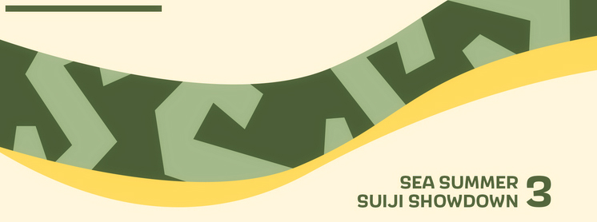

---
tags:
  - SSSS3
  - SSSS 3
---

# SEA Summer Suiji Showdown 3

The **SEA Summer Suiji Showdown 3** (***SSSS 3***) was a South East Asian team-based (3v3) osu! tournament hosted by ::{ flag=SG }:: [phox](https://osu.ppy.sh/users/3484548) and ::{ flag=US }:: [Kahli](https://osu.ppy.sh/users/8926244). The tournament featured a [Suiji-style team matchmaking system](https://osu.ppy.sh/community/forums/topics/1305570), in which players were assigned to a team at random prior to the start of the tournament based on each other's [BWS rank](/wiki/Tournaments/Badge-weighted_seeding). It was open to all players from all ten [ASEAN member states](https://asean.org/member-states/) (::{ flag=BN }:: Brunei Darussalam, ::{ flag=KH }:: Cambodia, ::{ flag=ID }:: Indonesia, ::{ flag=LA }:: Laos, ::{ flag=MY }:: Malaysia, ::{ flag=MM }:: Myanmar, ::{ flag=PH }:: The Philippines, ::{ flag=SG }:: Singapore, ::{ flag=TH }:: Thailand, and ::{ flag=VN }:: Vietnam) regardless of rank, and was the third iteration of the SEA Summer Suiji Showdown.

## Tournament schedule

| Event | Timestamp |
| --: | :-- |
| Registration phase | 2023-05-07/2023-05-22 |
| Screening phase | 2023-05-23/2023-05-28 |
| Team drawing | 2023-05-28 (14:00 UTC) |
| Swiss round (week 1) | 2023-06-05/2023-06-11 |
| Swiss round (week 2) | 2023-06-12/2023-06-18 |
| Swiss round (week 3) | 2023-06-19/2023-06-25 |
| Round of 16 | 2023-06-26/2023-07-02 |
| Quarterfinals | 2023-07-03/2023-07-09 |
| Semifinals | 2023-07-10/2023-07-16 |
| Finals (week 1) | 2023-07-17/2023-07-23 |
| Finals (week 2) | 2023-07-24/2023-07-30 |

## Prizes

| Placing | Prize(s) |
| :-: | :-- |
|  | 4 months of osu!supporter for each team member |
|  | 2 months of osu!supporter for each team member |
|  | 1 months of osu!supporter for each team member |

## Organisation

The SEA Summer Suiji Showdown 3 was run by various osu! community members from the South East Asia region and beyond.

| Position | Member(s) |
| :-- | :-- |
| Host | ::{ flag=SG }:: [phox](https://osu.ppy.sh/users/772295), ::{ flag=US }:: [Kahli](https://osu.ppy.sh/users/8926244) |
| Mappool selector | ::{ flag=SG }:: [phox](https://osu.ppy.sh/users/772295), ::{ flag=US }:: [Kahli](https://osu.ppy.sh/users/8926244), ::{ flag=TH }:: [Deppyforce](https://osu.ppy.sh/users/5286213), ::{ flag=VN }:: [realshin](https://osu.ppy.sh/users/8006029), ::{ flag=SG }:: [m0fum0fu](https://osu.ppy.sh/users/8006029) |
| Playtester | ::{ flag=SG }:: [\_gt](https://osu.ppy.sh/users/8301957), ::{ flag=ID }:: [SDKO](hhttps://osu.ppy.sh/users/4858555), ::{ flag=SG }:: [Dawnwing](https://osu.ppy.sh/users/5144534), ::{ flag=ID }:: [TheRealPlayer](https://osu.ppy.sh/users/8688737) |
| Streamer | ::{ flag=US }:: [Kahli](https://osu.ppy.sh/users/8926244), ::{ flag=MY }:: [Laphii](https://osu.ppy.sh/users/9364594) |
| Commentator | ::{ flag=SG }:: [phox](https://osu.ppy.sh/users/772295), ::{ flag=ID }:: [BlankTap](https://osu.ppy.sh/users/10137131), ::{ flag=MY }:: [Banner](https://osu.ppy.sh/users/14290988), ::{ flag=MY }:: [Racers03](https://osu.ppy.sh/users/11621976) |
| Referee | ::{ flag=MY }:: [Laphii](https://osu.ppy.sh/users/9364594), ::{ flag=ID }:: [nabirra](https://osu.ppy.sh/users/16053739), ::{ flag=PH }:: [-PeKoRa-](https://osu.ppy.sh/users/17959882), ::{ flag=SG }:: [Galeath](https://osu.ppy.sh/users/16626784), ::{ flag=TH }:: [Infinitstart](https://osu.ppy.sh/users/4026124), ::{ flag=HK }:: [ShadeCegLgMn](https://osu.ppy.sh/users/12609866), ::{ flag=GB }:: [SSScotty](https://osu.ppy.sh/users/10319851), ::{ flag=GB }:: [reforna](https://osu.ppy.sh/users/16199365), ::{ flag=CA }:: [YeetMeister47](https://osu.ppy.sh/users/13929880) |
| Graphic designer | ::{ flag=SG }:: [megumic](https://osu.ppy.sh/users/7537133) |
| Spreadsheet manager | ::{ flag=SG }:: [phox](https://osu.ppy.sh/users/772295) |
| Wiki editor | ::{ flag=ID }:: [Niva](https://osu.ppy.sh/users/197805) |

## Links

- **[Master spreadsheet](https://docs.google.com/spreadsheets/d/1_YHvCM0lrQeOORkuAIUksC9V-PP4KW7P_lVMJkk4ifo/edit?usp=sharing)**
- [Forum thread](https://osu.ppy.sh/community/forums/topics/1761142)
- [Discord server](https://discord.gg/9jA9r3bd7N)
- [Livestream channel](https://www.twitch.tv/osusea)
- [Challonge brackets](https://challonge.com/seasuiji3)
- [Statistics document](https://drive.google.com/drive/folders/1PLz2mP2KXECKjJ536gZDnhA4EhiTQ_xl)

## Participants

Listed below are the teams participating in SSSS 3 along with their respective team members, with players in **bold** acting as team captains.

| Team name | Seed S player | Seed A player | Seed B player #1 | Seed B player #2 | Seed C player #1 | Seed C player #2 |
| :-- | :-- | :-- | :-- | :-- | :-- | :-- |
| Ang Pogi mo Oodriin | ::{ flag=PH }:: **[OsuSeulgiDragon](https://osu.ppy.sh/users/6073492)** | ::{ flag=ID }:: [Egao](https://osu.ppy.sh/users/12419257) | ::{ flag=MY }:: [TequilaWolf](https://osu.ppy.sh/users/3633477) | ::{ flag=SG }:: [\_kaie](https://osu.ppy.sh/users/8876938) | ::{ flag=PH }:: [Oooodriiin](https://osu.ppy.sh/users/7223737) | ::{ flag=MY }:: [niksx](https://osu.ppy.sh/users/24442298) |
| Banana | ::{ flag=ID }:: **[Suikami](https://osu.ppy.sh/users/1929336)** | ::{ flag=TH }:: [\_Arigato](https://osu.ppy.sh/users/9317938) | ::{ flag=PH }:: [Akezaris](https://osu.ppy.sh/users/11098454) | ::{ flag=MY }:: [MyDTAccSucks](https://osu.ppy.sh/users/15402914) | ::{ flag=MY }:: [decaykets](https://osu.ppy.sh/users/3404543) | ::{ flag=ID }:: [lucidators](https://osu.ppy.sh/users/10154981) |
| blind people | ::{ flag=MY }:: **[Chiyuu](https://osu.ppy.sh/users/8226107)** | ::{ flag=VN }:: [\_kasaezic](https://osu.ppy.sh/users/848961) | ::{ flag=SG }:: [moosepi](https://osu.ppy.sh/users/1868745) | ::{ flag=MY }:: [Wish\_](https://osu.ppy.sh/users/14300067) | ::{ flag=SG }:: [Moltenfury](https://osu.ppy.sh/users/3395820) | ::{ flag=TH }:: [Vixera](https://osu.ppy.sh/users/14423163) |
| Chicken Rice | ::{ flag=PH }:: [Alue](https://osu.ppy.sh/users/7467327) | ::{ flag=SG }:: [ManicMacho](https://osu.ppy.sh/users/14490563) | ::{ flag=PH }:: [puffonxe](https://osu.ppy.sh/users/15771173) | ::{ flag=MY }:: [Racers03](https://osu.ppy.sh/users/11621976) | ::{ flag=ID }:: [Icun](https://osu.ppy.sh/users/17908427) | ::{ flag=TH }:: **[Simple-](https://osu.ppy.sh/users/13267213)** |
| Fuuka Motor | ::{ flag=ID }:: **[Rosemi Lovelock](https://osu.ppy.sh/users/1987591)** | ::{ flag=MY }:: [RyzenPP](https://osu.ppy.sh/users/16391241) | ::{ flag=ID }:: [WhiteCab](https://osu.ppy.sh/users/11849244) | ::{ flag=ID }:: [FAW](https://osu.ppy.sh/users/11070577) | ::{ flag=BN }:: [FourCan](https://osu.ppy.sh/users/7779545) | ::{ flag=PH }:: [MPDisplay](https://osu.ppy.sh/users/15424137) |
| geoguessr | ::{ flag=VN }:: **[Phoeni\_](https://osu.ppy.sh/users/14953642)** | ::{ flag=PH }:: [bluezenithgames](https://osu.ppy.sh/users/12681578) | ::{ flag=ID }:: [JSpiriT](https://osu.ppy.sh/users/16804164) | ::{ flag=ID }:: [NaFish](https://osu.ppy.sh/users/9974314) | ::{ flag=MY }:: [squidstain](https://osu.ppy.sh/users/11073207) | ::{ flag=PH }:: [seeen11l1](https://osu.ppy.sh/users/18047706) |
| Hina Motor | ::{ flag=MY }:: **[KonKonKitsuNe](https://osu.ppy.sh/users/16436446)** | ::{ flag=SG }:: [Rtyzen](https://osu.ppy.sh/users/2439822) | ::{ flag=SG }:: [lweexe](https://osu.ppy.sh/users/10862128) | ::{ flag=MY }:: [dragonlemmy](https://osu.ppy.sh/users/14053835) | ::{ flag=SG }:: [i love rinko](https://osu.ppy.sh/users/19903338) | ::{ flag=MY }:: [YankeeSnow213](https://osu.ppy.sh/users/13335554) |
| Kageno | ::{ flag=PH }:: **[2 and eight](https://osu.ppy.sh/users/8923608)** | ::{ flag=SG }:: [Hecatia](https://osu.ppy.sh/users/8244635) | ::{ flag=PH }:: [NathanSS](https://osu.ppy.sh/users/8500628) | ::{ flag=PH }:: [JayAreEee](https://osu.ppy.sh/users/10852557) | ::{ flag=SG }:: [eterrius](https://osu.ppy.sh/users/11015571) | ::{ flag=SG }:: [Junkmaniac](https://osu.ppy.sh/users/5909569) |
| kedama milk | ::{ flag=TH }:: [-Kedama](https://osu.ppy.sh/users/12147277) | ::{ flag=SG }:: [Armadayeet](https://osu.ppy.sh/users/18974182) | ::{ flag=SG }:: [LDerpy](https://osu.ppy.sh/users/3100799) | ::{ flag=MY }:: **[AkariAoi](https://osu.ppy.sh/users/14067834)** | ::{ flag=MY }:: [GodKnows](https://osu.ppy.sh/users/11058193) | ::{ flag=VN }:: [dngcheng](https://osu.ppy.sh/users/12351533) |
| kisaki motor | ::{ flag=SG }:: **[Tebi](https://osu.ppy.sh/users/5407620)** | ::{ flag=MY }:: [DuoX](https://osu.ppy.sh/users/9560694) | ::{ flag=MY }:: [Zygody](https://osu.ppy.sh/users/3677251) | ::{ flag=ID }:: [xHirayuki](https://osu.ppy.sh/users/3245206) | ::{ flag=MY }:: [Blethz](https://osu.ppy.sh/users/11918602) | ::{ flag=MY }:: [Hanami-](https://osu.ppy.sh/users/8703188) |
| maimai | ::{ flag=SG }:: **[Eagle5324](https://osu.ppy.sh/users/11987104)** | ::{ flag=ID }:: [DeathHydra](https://osu.ppy.sh/users/7457788) | ::{ flag=SG }:: [moroha29](https://osu.ppy.sh/users/9182389) | ::{ flag=SG }:: [Quickeryes](https://osu.ppy.sh/users/18227681) | ::{ flag=SG }:: [uniqly](https://osu.ppy.sh/users/8876527) | ::{ flag=VN }:: [smthelse](https://osu.ppy.sh/users/13238121) |
| Mica Motor | ::{ flag=SG }:: [dlwlrma-](https://osu.ppy.sh/users/7908994) | ::{ flag=ID }:: [Caruma](https://osu.ppy.sh/users/13187450) | ::{ flag=MY }:: [not\_aweeb](https://osu.ppy.sh/users/9375317) | ::{ flag=MY }:: **[Jolene](https://osu.ppy.sh/users/13626098)** | ::{ flag=MY }:: [LITFAM123](https://osu.ppy.sh/users/13584478) | ::{ flag=SG }:: [Touruu](https://osu.ppy.sh/users/9484080) |
| Rumah Makan Padang | ::{ flag=ID }:: **[Daffy](https://osu.ppy.sh/users/5968633)** | ::{ flag=TH }:: [SakaIndy](https://osu.ppy.sh/users/2165622) | ::{ flag=VN }:: [thanh792001](https://osu.ppy.sh/users/10029074) | ::{ flag=ID }:: [BlankTap](https://osu.ppy.sh/users/10137131) | ::{ flag=SG }:: [Robed](https://osu.ppy.sh/users/11258741) | ::{ flag=SG }:: [Baechuu](https://osu.ppy.sh/users/13988393) |
| ryowari da | ::{ flag=US }:: (::{ flag=PH }::) **[SilenceSuzuka](https://osu.ppy.sh/users/7249644)**[^flag-note] | ::{ flag=PH }:: [Blemishki](https://osu.ppy.sh/users/14664996) | ::{ flag=ID }:: [malvon](https://osu.ppy.sh/users/11113661) | ::{ flag=SG }:: [ProjectGreat](https://osu.ppy.sh/users/15516059) | ::{ flag=SG }:: [Definition](https://osu.ppy.sh/users/7819055) | ::{ flag=ID }:: [rethinkrubiks](https://osu.ppy.sh/users/17996877) |
| Schale | ::{ flag=ID }:: [Hakui Koyori](https://osu.ppy.sh/users/10717635) | ::{ flag=MY }:: [Agagak](https://osu.ppy.sh/users/3645490) | ::{ flag=VN }:: **[Chipperonio](https://osu.ppy.sh/users/13141032)** | ::{ flag=PH }:: [Yukixo](https://osu.ppy.sh/users/17847877) | ::{ flag=VN }:: [MisonoMika](https://osu.ppy.sh/users/16583941) | ::{ flag=SG }:: [hollowknees](https://osu.ppy.sh/users/15195364) |
| Spacediver | ::{ flag=SG }:: **[megumic](https://osu.ppy.sh/users/7537133)** | ::{ flag=MY }:: [Chibi Maruko](https://osu.ppy.sh/users/5585377) | ::{ flag=SG }:: [kirkirs](https://osu.ppy.sh/users/9902622) | ::{ flag=TH }:: [Iyori](https://osu.ppy.sh/users/2659707) | ::{ flag=TH }:: [Goaw2551](https://osu.ppy.sh/users/16055740) | ::{ flag=PH }:: [Dunn](https://osu.ppy.sh/users/7241691) |
| Stelle x Trash Can | ::{ flag=TH }:: **[Lesperry](https://osu.ppy.sh/users/18092331)** | ::{ flag=TH }:: [namirin1](https://osu.ppy.sh/users/10249166) | ::{ flag=PH }:: [Desmond823](https://osu.ppy.sh/users/14582737) | ::{ flag=ID }:: [Sunohara Shun](https://osu.ppy.sh/users/3484548) | ::{ flag=SG }:: [Can Never FC](https://osu.ppy.sh/users/8420023) | ::{ flag=PH }:: [Setsoku](https://osu.ppy.sh/users/10888411) |
| Team | ::{ flag=ID }:: **[XenoitesBadPog](https://osu.ppy.sh/users/11461426)** | ::{ flag=SG }:: [Grantorio](https://osu.ppy.sh/users/5623529) | ::{ flag=PH }:: [xidorn](https://osu.ppy.sh/users/7904667) | ::{ flag=PH }:: [Geanyl](https://osu.ppy.sh/users/10038631) | ::{ flag=MY }:: [Sh1moto](https://osu.ppy.sh/users/4830350) | ::{ flag=MY }:: [GG\_com2016](https://osu.ppy.sh/users/9229968) |
| Tingyun Motor | ::{ flag=ID }:: **[ThatNOOBGuy](https://osu.ppy.sh/users/11091594)** | ::{ flag=MY }:: [Tzero](https://osu.ppy.sh/users/6088976) | ::{ flag=MY }:: [milo Penguin](https://osu.ppy.sh/users/10702232) | ::{ flag=ID }:: [Mashima Himeko](https://osu.ppy.sh/users/10474988) | ::{ flag=SG }:: [CopyPasted](https://osu.ppy.sh/users/9341983) | ::{ flag=SG }:: [JokThree](https://osu.ppy.sh/users/7713152) |
| TTzida | ::{ flag=VN }:: [Tuon](https://osu.ppy.sh/users/6673790) | ::{ flag=MY }:: [iraozm](https://osu.ppy.sh/users/12443104) | ::{ flag=ID }:: [-TwiHD](https://osu.ppy.sh/users/5470299) | ::{ flag=SG }:: **[Anderwear](https://osu.ppy.sh/users/14429830)** | ::{ flag=SG }:: [ZIENARD](https://osu.ppy.sh/users/9157643) | ::{ flag=MY }:: [Dreaming-](https://osu.ppy.sh/users/13516784) |

## Podium

This competition has come to an end and resulted in the following podium:

| Placing | Team |
| :-: | :-- |
|  | **Schale** (::{ flag=ID }:: [Hakui Koyori](https://osu.ppy.sh/users/10717635), ::{ flag=MY }:: [Agagak](https://osu.ppy.sh/users/3645490), ::{ flag=VN }:: [Chipperonio](https://osu.ppy.sh/users/13141032), ::{ flag=PH }:: [Yukixo](https://osu.ppy.sh/users/17847877), ::{ flag=VN }:: [MisonoMika](https://osu.ppy.sh/users/16583941), ::{ flag=SG }:: [hollowknees](https://osu.ppy.sh/users/15195364)) |
|  | **Tingyun Motor** (::{ flag=ID }:: [ThatNOOBGuy](https://osu.ppy.sh/users/11091594), ::{ flag=MY }:: [Tzero](https://osu.ppy.sh/users/6088976), ::{ flag=MY }:: [milo Penguin](https://osu.ppy.sh/users/10702232), ::{ flag=ID }:: [Mashima Himeko](https://osu.ppy.sh/users/10474988), ::{ flag=SG }:: [CopyPasted](https://osu.ppy.sh/users/9341983), ::{ flag=SG }:: [JokThree](https://osu.ppy.sh/users/7713152)) |
|  | **maimai** (::{ flag=SG }:: [Eagle5324](https://osu.ppy.sh/users/11987104), ::{ flag=ID }:: [DeathHydra](https://osu.ppy.sh/users/7457788), ::{ flag=SG }:: [moroha29](https://osu.ppy.sh/users/9182389), ::{ flag=SG }:: [Quickeryes](https://osu.ppy.sh/users/18227681), ::{ flag=SG }:: [uniqly](https://osu.ppy.sh/users/8876527), ::{ flag=VN }:: [smthelse](https://osu.ppy.sh/users/13238121)) |

## Mappools

### Finals (week 2)

**[Download the mappack here! (160 MB)](https://cdn.discordapp.com/attachments/1093554466885738558/1132682381510324366/Downloads.zip)**

- NoMod
  1. [Kakusei no Prim - Kurui Sake Homura no Hana (keevy) \[I'm losing my braincells\]](https://osu.ppy.sh/beatmapsets/2028089#osu/4226165)
  2. [cosMo@BousouP - Sekai no Owari ni Aimashou (knowledgeking) \[Eternal Ending 0.95x spaced\]](https://osu.ppy.sh/beatmapsets/1382556#osu/2856401)
  3. [DragonForce - Symphony Of The Night (val0108) \[Valiant, A Legend 0vercomes 1nsurmountable 0dds 8loriously\]](https://osu.ppy.sh/beatmapsets/1957291#osu/4054809)
  4. [PSYQUI - Endless (Mameyudoufu Remix) (hehe) \[Unlimited\]](https://osu.ppy.sh/beatmapsets/1963914#osu/4070881)
  5. [Shittypedia - my dad after hearing my mom was pregnant: (Down) \[run\]](https://osu.ppy.sh/beatmapsets/1897281#osu/3910307)
  6. [Unknown Artist - Spelunker (IOException) \[Prece Enter Key\]](https://osu.ppy.sh/beatmapsets/1145452#osu/2655982)
- Hidden
  1. [Omoi - Chiisana Koi no Uta (Synth Rock Cover) (val0108) \[Extreme\]](https://osu.ppy.sh/beatmapsets/609189#osu/1382021)
  2. [SICK HACK - Watashi Dake Yuurei (Amateurre) \[sober\]](https://osu.ppy.sh/beatmapsets/1982264#osu/4116789)
  3. [onumi - Spider Tank (Capu) \[Impeccable Essence\]](https://osu.ppy.sh/beatmapsets/1129044#osu/2358718)
  4. [Yonder Voice - Shrine Maiden - Eien no Miko (\_\_Ag) \[Sanzen Sekai Yori Rinne Miko\]](https://osu.ppy.sh/beatmapsets/1607795#osu/3283179)
- HardRock
  1. [RADWIMPS - Hyperventilation (seros) \[What are you gonna do to my booze?\]](https://osu.ppy.sh/beatmapsets/1924212#osu/3972485)
  2. [ZUN - Mottomo Sumiwataru Sora to Umi (Nyanaro) \[Nyanaro & Parachute's 53-minute conversation\]](https://osu.ppy.sh/beatmapsets/1961523#osu/4115513)
  3. [Monster Siren Records - Fading Sky (Bellicose) \[Flaming Edge\]](https://osu.ppy.sh/beatmapsets/1770637#osu/3624614)
  4. [PRASTIK DANCEFLOOR - Cansei de S NIK (Icekalt) \[Ayaya's Extra\]](https://osu.ppy.sh/beatmapsets/1229581#osu/2584902)
- DoubleTime
  1. [Aimer - twoface (toybot) \[captin & niva's another\]](https://osu.ppy.sh/beatmapsets/1968432#osu/4094568)
  2. [rei sirose - Hakidasu (Lunicia) \[fooders' Insane\]](https://osu.ppy.sh/beatmapsets/1759673#osu/3685433)
  3. [MYUKKE. - ViViTAL MONO (Laquarius) \[InsAnE\]](https://osu.ppy.sh/beatmapsets/1753391#osu/3589908)
  4. [Nekomata Master feat. Nagayama Maki - Watari Sousou (fanzhen0019) \[Flourish\]](https://osu.ppy.sh/beatmapsets/1461782#osu/3003163)
- FreeMod
  1. [inabakumori - Tsukuri Kake no Shinshou (Tycani) \[whitegungachungablebusiness collab\]](https://osu.ppy.sh/beatmapsets/1842666#osu/3784873)
  2. [takehirotei - Chocolate Scramble (alden) \[Wisteria\]](https://osu.ppy.sh/beatmapsets/1968809#osu/4083618)
  3. [xi - Heavenly Blast (xidorn) \[The Fourth\]](https://osu.ppy.sh/beatmapsets/1537452#osu/3143545)

### Finals (week 1)

**[Download the mappack here! (169 MB)](https://drive.google.com/file/d/18LRpaR1sX2wzenKcaVLUC9y7iOk9qxkB/view?usp=sharing)**

- NoMod
  1. [sungazer - Sequence Start (dsco) \[Play\]](https://osu.ppy.sh/beatmapsets/647360#osu/1371397)
  2. [Demetori - Strawberry Crisis!! (jonathanlfj) \[Extra Stage\]](https://osu.ppy.sh/beatmapsets/1833730#osu/3764532)
  3. [Hanon x Kotoha - (Not) A Devil (Kotoha) \[(Not) Inting\]](https://osu.ppy.sh/beatmapsets/1937425#osu/4004882)
  4. [LucaProject - Nidhoggr (iLyne) \[Revelation 13:1\]](https://osu.ppy.sh/beatmapsets/1947987#osu/4031447)
  5. [Kozakai Yurie, Oomori Nichika, Hasegawa Rena - Hyper Bass (feat. Yunomi) (UberFazz) \[Maximum\]](https://osu.ppy.sh/beatmapsets/1709206#osu/3492611)
  6. [Shibayan feat. Ichimatsu Tsubaki - Wo Qin Ai Kui Lei (UberFazz) \[Desire\]](https://osu.ppy.sh/beatmapsets/1359291#osu/2969884)
- Hidden
  1. [Hanon x Megu x Kotoha - Shiroi Yuki no Princess wa (-karUpA-) \[Happiness\]](https://osu.ppy.sh/beatmapsets/1707021#osu/3488032)
  2. [Narjahanam - Taht Alamat Al Nujoom (TheKingHenry) \[Wara'a Al Yawm Al Mawti\]](https://osu.ppy.sh/beatmapsets/1623074#osu/3313945)
  3. [niki x EZFG feat. Reol - WAVE (Sparhten) \[ar8 test\]](https://osu.ppy.sh/beatmapsets/1922218#osu/3967816)
  4. [Masqed Pierrot - THE FAUST (fanzhen0019) \[PaRaDogi's cheesecake\]](https://osu.ppy.sh/beatmapsets/1418075#osu/2924836)
- HardRock
  1. [Reol - Saisaki ( cRyo\[iceeicee\]) \[Extra\]](https://osu.ppy.sh/beatmapsets/858075#osu/1793422)
  2. [Nor - Usagi Flap (syuq) \[Bunny Flap\]](https://osu.ppy.sh/beatmapsets/1966862#osu/4078680)
  3. [Kotoha - Zecchou Sanka (achyoo) \[Climax\]](https://osu.ppy.sh/beatmapsets/1862243#osu/3828999)
  4. [Tove Styrke - Sway (schoolboy) \[Are We Gonna Stay Up?\]](https://osu.ppy.sh/beatmapsets/1316289#osu/2727565)
- DoubleTime
  1. [HoneyWorks feat. Hanon x Kotoha - Sis x Love (Ayucchi) \[I LOVE my sister!\]](https://osu.ppy.sh/beatmapsets/1358634#osu/2828061)
  2. [DJ Mashiro - Prismatic Lollipops (PayneTrain) \[Insane\]](https://osu.ppy.sh/beatmapsets/1565432#osu/3196642)
  3. [ZUN - Voyage 1970 (Shurelia) \[Aeril's Lunatic\]](https://osu.ppy.sh/beatmapsets/1913796#osu/4006919)
  4. [Blacklolita - Praeteritum (JeZag) \[Another\]](https://osu.ppy.sh/beatmapsets/651006#osu/1515012)
- FreeMod
  1. [Ryu\* - Mind Mapping (kors k mix) (AJT) \[Callie's EXTREME\]](https://osu.ppy.sh/beatmapsets/1774369#osu/4019804)
  2. [Noah - Celestial stinger (Kroytz) \[PoNo's GRAVITY\]](https://osu.ppy.sh/beatmapsets/687129#osu/1454089)
  3. [Mitsukiyo - Future Bossa (Stompy\_) \[Shurelia Sensei's Special Lesson\]](https://osu.ppy.sh/beatmapsets/1981110#osu/4113746)

### Semifinals

**[Download the mappack here! (177 MB)](https://drive.google.com/file/d/1StL2cyAjXQMqVm0w64uoQS_sWH0Jjlce/view?usp=sharing)**

- NoMod
  1. [Oozora Subaru - Do My Best! (Bokamin) \[Shuba!Shuba!Shuba!\]](https://osu.ppy.sh/beatmapsets/1108769#osu/2317140)
  2. [technoplanet - Intuition (MegaMK) \[Blossom\]](https://osu.ppy.sh/beatmapsets/2013382#osu/4189819)
  3. [Ushirokara Haiyoritai G - Koi wa Chaos no Shimobenari (Amamya) \[Rihan's Extra\]](https://osu.ppy.sh/beatmapsets/1717491#osu/3529703)
  4. [Akira Complex - LVL.99 (Cubby) \[Expert;\]](https://osu.ppy.sh/beatmapsets/2017797#osu/4201371)
  5. [Silentroom - NULCTRL (DeviousPanda) \[Expert\]](https://osu.ppy.sh/beatmapsets/1969316#osu/4084958)
  6. [MANY THANKS! feat. Setsunan - Banka (ktgster) \[Extreme\]](https://osu.ppy.sh/beatmapsets/1939593#osu/4010164)
- Hidden
  1. [momosu momosu - Esoa (Dailycare) \[Love\]](https://osu.ppy.sh/beatmapsets/2001099#osu/4160997)
  2. [DECO*27 - Cinderella (\[Jameson\]) \[Reading Challenge\]](https://osu.ppy.sh/beatmapsets/1969911#osu/4086893)
  3. [Abuse - Flower War (Shiny Braixen) \[Shunionuu\]](https://osu.ppy.sh/beatmapsets/1840853#osu/3792912)
- HardRock
  1. [Petit Rabbit's - Daydream cafe(you Remix) (M o k o r i) \[ExtRabbit's\]](https://osu.ppy.sh/beatmapsets/205660#osu/560522)
  2. [iojjj - Deus Ex Machina (Flowziee) \[PaRaDogi's Extra\]](https://osu.ppy.sh/beatmapsets/1314583#osu/2782516)
  3. [BlackY - Sakura Ranman Cleopatra (Down) \[Extra\]](https://osu.ppy.sh/beatmapsets/1595193#osu/3258136)
- DoubleTime
  1. [Ceui - Rainbow Day (Shikibe Mayu) \[Insane\]](https://osu.ppy.sh/beatmapsets/1181354#osu/2464147)
  2. [Shiiba Tsumugi (CV: Kurosaki Sora) - Sweet Sweet Alice (Shikibe Mayu) \[Insane\]](https://osu.ppy.sh/beatmapsets/1039725#osu/2173284)
  3. [Yonekura Chihiro - Harutoki \~Spring Moment\~ (Shikibe Mayu) \[Insane\]](https://osu.ppy.sh/beatmapsets/1447866#osu/3263292)
  4. [Suzuyu - Syndetos (Shikibe Mayu) \[Insane\]](https://osu.ppy.sh/beatmapsets/1711198#osu/3510636)
- FreeMod
  1. [Doin - Vacuum Cleaner (PandaHero) \[Expert\]](https://osu.ppy.sh/beatmapsets/1972519#osu/4097217)
  2. [Rabbit House - das Leben nach dem Tode (Rentia) \[Unterwelt\]](https://osu.ppy.sh/beatmapsets/1733348#osu/3542916)
  3. [Ocelot - IROHA (feat. Hatsune Miku) (Axaptice) \[ABC\]](https://osu.ppy.sh/beatmapsets/1670972#osu/3412767)

### Quarterfinals

**[Download the mappack here! (151 MB)](https://drive.google.com/file/d/1orv1TzXYwG8F_gxZNgUycVirMxIB-qph/view?usp=sharing)**

- NoMod
  1. [Ranji x Omiki - Psycho (Remix) ft. Aviva (-Inyafaze-) \[2nd Drop\]](https://osu.ppy.sh/beatmapsets/1409610#osu/2935638)
  2. [yuikonnu - Gigantic O.T.N (Camo) \[Climax\]](https://osu.ppy.sh/beatmapsets/1362797#osu/2819481)
  3. [LiSA - REALiZE (Pepekcz) \[Spider-Verse N°42\]](https://osu.ppy.sh/beatmapsets/2010962#osu/4184551)
  4. [nora2r - Memory Of Sunrise (KogumaX) \[Genshin Impact\]](https://osu.ppy.sh/beatmapsets/1503674#osu/3080649)
  5. [will.i.am - \#thatPOWER feat. Justin Bieber (Woey) \[\#thatINSANE\]](https://osu.ppy.sh/beatmapsets/1995162#osu/4146360)
  6. [Yakushimaru Etsuko - I'm Humanity (DeppyForce) \[ATATCCGGGAATTGATATGTACAATTTCGGATAGGCCCATTAATGGATTAACAATGAATTTCGGACCTACGCAGGCTAAA\]](https://osu.ppy.sh/beatmapsets/1945582#osu/4025180)
- Hidden
  1. [Crystal Castles - Vietnam (Spork Lover) \[A journey to a sinister past\]](https://osu.ppy.sh/beatmapsets/1015980#osu/2126494)
  2. [x0o0x\_ - '''''' (Ryuusei Aika) \[....\]](https://osu.ppy.sh/beatmapsets/1922665#osu/3968917)
  3. [Rohi - Virtual Angel (verychill) \[Extra\]](https://osu.ppy.sh/beatmapsets/2014090#osu/4195129)
- HardRock
  1. [Chikamori Kayako - Kigurumi Sungeki (Mirash) \[KogumaX's Extra\]](https://osu.ppy.sh/beatmapsets/1312079#osu/2921013)
  2. [Islet - Yukidoke (feat. isui) (\_Epreus) \[apart\]](https://osu.ppy.sh/beatmapsets/1963156#osu/4068898)
  3. [Crazy Frog - Axel F (TV Size) (Mismagius) \[Epic Win\]](https://osu.ppy.sh/beatmapsets/1264993#osu/2629059)
- DoubleTime
  1. [King Gnu - Sakayume (godhorsekun) \[Masayume\]](https://osu.ppy.sh/beatmapsets/1666570#osu/3402870)
  2. [Cuvelia - Tenkuu no Yoake (THORWAVE) \[Insane\]](https://osu.ppy.sh/beatmapsets/1715521#osu/3505346)
  3. [mikeneko - drop (Rentia) \[rushtai\]](https://osu.ppy.sh/beatmapsets/1925910#osu/3985150)
  4. [Renegade Masterz - Nasty Girl (Nightcore Mix) (ztrot) \[Insane\]](https://osu.ppy.sh/beatmapsets/23940#osu/81668)
- FreeMod
  1. [Chisanahana - BREAKTHE\*\*\*\*\*\*\*WORLD (verychill) \[EX\*\*\*\*\*\*\*TRA\]](https://osu.ppy.sh/beatmapsets/1985468#osu/4124003)
  2. [Kashii Moimi feat. KAFU - Cat loving (covered by Kotoha) (FlasTEH) \[tu prends ta hd2 (covered by Kotoha)\]](https://osu.ppy.sh/beatmapsets/1888538#osu/3889378)
  3. [Nhato - Magic (Azer) \[Harmonious\]](https://osu.ppy.sh/beatmapsets/371315#osu/813588)

### Round of 16

**[Download the mappack here! (152 MB)](https://drive.google.com/file/d/1IhkNT52D7Xl-ND-jAR9k6lFwE4FAxURA/view?usp=sharing)**

- NoMod
  1. [katagiri - ch3rry (Julaaaan) \[Big Bloom\]](https://osu.ppy.sh/beatmapsets/1620594#osu/3308920)
  2. [cosMo@BousouP feat. Hatsune Miku - Hyper LATiON (-Tynamo) \[Expert\]](https://osu.ppy.sh/beatmapsets/1281410#osu/4126156)
  3. [EZFG - Hurting for a Very Hurtful Pain (tutuhaha) \[Dance\]](https://osu.ppy.sh/beatmapsets/46848#osu/145669)
  4. [Wowkie Zhang - Yang Guang Cai Hong Xiao Bai Ma (JustALeaf) \[the good\]](https://osu.ppy.sh/beatmapsets/1351033#osu/2797076)
  5. [Feryquitous feat. Aitsuki Nakuru - Tsukuyomi ni Naru (captin1) \[Ethereal\]](https://osu.ppy.sh/beatmapsets/1699172#osu/3471908)
  6. [Silver Forest - Tsurupettan (NekuMagetsu) \[Flat Chest\]](https://osu.ppy.sh/beatmapsets/1562683#osu/3191129)
- Hidden
  1. [Minato Aqua - Take Over (09kami) \[buhei & Yoshino's Collab Extra\]](https://osu.ppy.sh/beatmapsets/1286115#osu/2671440)
  2. [subeteanatanoseidesu. - N (wafer) \[ii\]](https://osu.ppy.sh/beatmapsets/1909071#osu/3937516)
  3. [Maoto Naka - Chicken Game (Chris Jasorka) \[Don't look at this Chicken\]](https://osu.ppy.sh/beatmapsets/1764011#osu/3610547)
- HardRock
  1. [Hatsune Miku - FINGERCONTROL SPEED BENCHMARK (Seamob) \[227 (+DT 340)\]](https://osu.ppy.sh/beatmapsets/1850180#osu/3800698)
  2. [Monster Siren Records - Magic Theorem (CebollaVladimir) \[A theorem of a fantasy\]](https://osu.ppy.sh/beatmapsets/1856763#osu/3816056)
  3. [Nanahira - Pasta Scat (Snow Note) \[Snother\]](https://osu.ppy.sh/beatmapsets/1426422#osu/2937351)
- DoubleTime
  1. [Scop - Irony (Siae) \[baka ar9\]](https://osu.ppy.sh/beatmapsets/638444#osu/2207037)
  2. [Feryquitous - Ordirehv (JeZag) \[Insane\]](https://osu.ppy.sh/beatmapsets/935602#osu/2154187)
  3. [KARUT - Glitch Street (Shurelia) \[Kowari's Insane\]](https://osu.ppy.sh/beatmapsets/1817644#osu/3783845)
  4. [RURUTIA - Little in my Little (Deppyforce) \[Score Synthesis\]](https://osu.ppy.sh/beatmapsets/2009979#osu/4182223)
- FreeMod
  1. [ZUN feat. Lady Gaga - Night of Gaga (SapphireGhost) \[Gaga\]](https://osu.ppy.sh/beatmapsets/27320#osu/91674)
  2. [KAMELOT - Veil of Elysium (LMT) \[ar9\]](https://osu.ppy.sh/beatmapsets/1252853#osu/2761040)
  3. [kessoku band - Seiza ni Naretara (TV Size) (Mizunashi Akari) \[LIVE at Shukasai (Extra)\]](https://osu.ppy.sh/beatmapsets/1919446#osu/3962346)

### Swiss round (week 3)

**[Download the mappack here! (115 MB)](https://drive.google.com/file/d/1oOdvlJxYzAB9HHu-CIO9R_2WL1e87JuP/view?usp=sharing)**

- NoMod
  1. [Marcin Maliszewski, Marek Krejzler - Beyblade: Metal Masters - Polish Opening (Wraith) \[5d's UCHWYC GO\]](https://osu.ppy.sh/beatmapsets/1956682#osu/4053406)
  2. [Leah Kate - 10 Things I Hate About You (Sped Up & Cut Ver.) (Log Off Now) \[Mommy Issues\]](https://osu.ppy.sh/beatmapsets/1881428#osu/3873445)
  3. [Polyphia - ABC feat. Sophia Black (HinaMommy) \[Wanpachi's aiue(xpert)o\]](https://osu.ppy.sh/beatmapsets/1931669#osu/3997326)
  4. [xaev - pronoun picker sing berdlycore (wafer) \[Oh Um Oh Uh It It's Oh Well Um Mmm It's How Do I Put This Very... ... Smart\]](https://osu.ppy.sh/beatmapsets/1961676#osu/4129460)
  5. [Igorrr - Unpleasant Sonata (Sieg) \[Pagli's Sonata\]](https://osu.ppy.sh/beatmapsets/90385#osu/262302)
- Hidden
  1. [IOSYS - Qualia (wetdog123) \[Lunatic\]](https://osu.ppy.sh/beatmapsets/1213880#osu/2526517)
  2. [Swan Lake Orchestra - Hakuchou no Mizuumi (AngelHoney) \[Another\]](https://osu.ppy.sh/beatmapsets/25922#osu/87728)
- HardRock
  1. [NewJeans - Ditto (Nijika Ijichi) \[1e-9\]](https://osu.ppy.sh/beatmapsets/1940274#osu/4011742)
  2. [Malk De Koijn - Vi Tager Fuglen Paa Dig (waefwerf) \[Strider's Insane\]](https://osu.ppy.sh/beatmapsets/1143263#osu/2410524)
- DoubleTime
  1. [Hanyuu Miina - Koi Dayori (Iceluin) \[Love Letter\]](https://osu.ppy.sh/beatmapsets/1966286#osu/4077338)
  2. [Tomoya Ohtani - Undefeatable (feat. Kellin Quinn) (Voli) \[Light Insane\]](https://osu.ppy.sh/beatmapsets/1892271#osu/3900704)
  3. [Lia - Light colors (azuki) \[Alazy\]](https://osu.ppy.sh/beatmapsets/7124#osu/32233)
- FreeMod
  1. [Tsukino x Kurousagi Uru - Mental Chainsaw (MuChin) \[Paranoid\]](https://osu.ppy.sh/beatmapsets/1806660#osu/3705040)
  2. [IOSYS - Alice wa Taihen na Kashi Wo Urooboe Deshita (Zekira) \[DJWho?\]](https://osu.ppy.sh/beatmapsets/11076#osu/42683)
  3. [15 Voices - Non-breath oblige (Delis) \[allein's no slider extra\]](https://osu.ppy.sh/beatmapsets/1919446#osu/3962346)

### Swiss round (week 2)

**[Download the mappack here! (124 MB)](https://drive.google.com/file/d/1XJUuBSf0Fxfi0LuTYMeDHdJ9nmUgDAPV/view?usp=sharing)**

- NoMod
  1. [Maid-chan (CV: Horie Yui) - Maid-chan yori. (Yakisoba\_Pan) \[rollpan's Extra\]](https://osu.ppy.sh/beatmapsets/369623#osu/809914)
  2. [DJ Genki feat. yukacco - Ready Go(2017 Updata MIX) (Abelia) \[ULTRA HAPPY!!!\]](https://osu.ppy.sh/beatmapsets/1105263#osu/2310075)
  3. [Perfume - Daijobanai (\_derp) \[Daijobu\]](https://osu.ppy.sh/beatmapsets/659613#osu/1396912)
  4. [Getty vs. DJ DiA - Ops:Code -Rapture- (Realazy) \[sahuang's Extra\]](https://osu.ppy.sh/beatmapsets/776328#osu/1656233)
  5. [YUC'e - Night Club Junkie (Nathan) \[fanzhen's Extra\]](https://osu.ppy.sh/beatmapsets/756066#osu/1723473)
- Hidden
  1. [PSYQUI - Still in my heart feat. Punipuni Denki (Typ4) \[Insane the Tea\]](https://osu.ppy.sh/beatmapsets/961460#osu/2072692)
  2. [Rokudenashi - Tada Koe Hitotsu (Aruyy) \[he\]](https://osu.ppy.sh/beatmapsets/1950993#osu/4039753)
- HardRock
  1. [Mitsukiyo - Kimi to Boku no Sekai (feat. \*namirin) (Kingo) \[You and my World\]](https://osu.ppy.sh/beatmapsets/2002760#osu/4164898)
  2. [Aiobahn - Sugiyuku Hi to Kimi e (feat. nayuta) (SeeL) \[The passing seasons\]](https://osu.ppy.sh/beatmapsets/1040769#osu/2175175)
- DoubleTime
  1. [convolk - i fucked up (Gordon123) \[riffy's insane\]](https://osu.ppy.sh/beatmapsets/1212361#osu/2523524)
  2. [Circle of Dust - Humanarchy (Cut Ver.) (Riana) \[Hyper\]](https://osu.ppy.sh/beatmapsets/1212361#osu/2523524)
  3. [King Gnu - BOY (MetroDiver) \[Insane\]](https://osu.ppy.sh/beatmapsets/1630078#osu/3327762)
- FreeMod
  1. [katagiri - Scattered Pancakes (Saika0k1) \[Pancake Batter\]](https://osu.ppy.sh/beatmapsets/1530055#osu/3129616)
  2. [Tu Tu Wan - Jin Ke La Mei Ri Fei K Ge Jin Qu CD (Pata-Mon) \[Kela-Mon\]](https://osu.ppy.sh/beatmapsets/1246036#osu/2590006)
  3. [Mitsukiyo - Hifumi Daisuki (Setu) \[Kyuuteurre's Extraordinary\]](https://osu.ppy.sh/beatmapsets/1883263#osu/3899162)

### Swiss round (week 1)

**[Download the mappack here! (136 MB)](https://drive.google.com/file/d/1M5Nr6XOymrwhy4XJDjDwf5JyAtjbiGO1/view?usp=sharing)**

- NoMod
  1. [Feryquitous feat. Aitsuki Nakuru - Ether (Acyl) \[Lami x lit120's Extra\]](https://osu.ppy.sh/beatmapsets/902425#osu/1947619)
  2. [Feint - Tower Of Heaven (You Are Slaves) (eLy) \[Heaven\]](https://osu.ppy.sh/beatmapsets/128931#osu/845391)
  3. [Criticrista - Kyu Kyu Kyun Heart Shaker (TV Size) (Garden) \[Expert\]](https://osu.ppy.sh/beatmapsets/1449815#osu/2980818)
  4. [REOL - VIORA (Sparhten) \[Addiction\]](https://osu.ppy.sh/beatmapsets/989745#osu/2070365)
  5. [Minstrel - Yotogibanashi no Kamikakushi (Ryuusei Aika) \[Garden's Expert\]](https://osu.ppy.sh/beatmapsets/1900605#osu/3917717)
- Hidden
  1. [ELECTROCUTICA feat. EVO+ - Moon Seeker (Lulu-) \[Lulu x Bonzi — Pulsation\]](https://osu.ppy.sh/beatmapsets/1235544#osu/2568398)
  2. [Kali Uchis - telepatia (mnyui) \[my bed is empty\]](https://osu.ppy.sh/beatmapsets/1575809#osu/3217272)
- HardRock
  1. [senya - Iro wa Jou e to Izanau (Okoratu) \[Extra Stage\]](https://osu.ppy.sh/beatmapsets/1579161#osu/3224505)
  2. [Pastel\*Palettes - Happy Synthesizer (ktgster) \[Expert\]](https://osu.ppy.sh/beatmapsets/932654#osu/1989147)
- DoubleTime
  1. [Minami - Kono Machi ni Hare wa Konai (Mimiliaa) \[Shady's Insane\]](https://osu.ppy.sh/beatmapsets/1683871#osu/3442054)
  2. [Ryu\* - Sakura Mirage (STARLiGHT Mix) (Jean-Michel Jr) \[gtfo's Light Insane\]](https://osu.ppy.sh/beatmapsets/765795#osu/1610037)
  3. [U1 overground - Endorphin (Yooh) \[Kalindraz's DIFFICULT\]](https://osu.ppy.sh/beatmapsets/1043723#osu/2257307)
- FreeMod
  1. [HOYO-MiX - Termination of Desires (ScubDomino) \[Musou no Hitotachi\]](https://osu.ppy.sh/beatmapsets/1585145#osu/3237780)
  2. [ginkiha - EOS (Cytusine) \[Extra\]](https://osu.ppy.sh/beatmapsets/1754349#osu/3590175)
  3. [Isekai Joucho - Kyoukankaku Obake (Calvaria) \[melloe's Desperation\]](https://osu.ppy.sh/beatmapsets/1141909#osu/2385598)

## Match results

### Finals (week 2)

Sunday, 30 July 2023:

| Bracket | Team 1 |  |  | Team 2 | Match link |
| :-: | --: | :-: | :-: | :-- | :-- |
| Lower | maimai | 3 | **8** | **Schale** | [#1](https://osu.ppy.sh/community/matches/109739514) |

Monday, 31 July 2023, Grand Final:

| Bracket | Team 1 |  |  | Team 2 | Match link |
| :-: | --: | :-: | :-: | :-- | :-- |
| Lower | Tingyun Motor | 6 | **9** | **Schale** | [#1](https://osu.ppy.sh/community/matches/109754849) |

### Finals (week 1)

Friday, 21 July 2023:

| Bracket | Team 1 |  |  | Team 2 | Match link |
| :-: | --: | :-: | :-: | :-- | :-- |
| Lower | kisaki motor | 7 | **8** | **Fuuka Motor** | [#1](https://osu.ppy.sh/community/matches/109606923) |

Sunday, 23 July 2023:

| Bracket | Team 1 |  |  | Team 2 | Match link |
| :-: | --: | :-: | :-: | :-- | :-- |
| Upper | maimai | 1 | **8** | **Tingyun Motor** | [#1](https://osu.ppy.sh/community/matches/109624801) |
| Lower | **Schale** | **8** | 0 | Rumah Makan Padang | [#1](https://osu.ppy.sh/community/matches/109634101) |

Wednesday, 26 July 2023:

| Bracket | Team 1 |  |  | Team 2 | Match link |
| :-: | --: | :-: | :-: | :-- | :-- |
| Lower | **Schale** | **8** | 1 | Fuuka Motor | [#1](https://osu.ppy.sh/community/matches/109687062) |

### Semifinals

Friday, 14 July 2023:

| Bracket | Team 1 |  |  | Team 2 | Match link |
| :-: | --: | :-: | :-: | :-- | :-- |
| Lower | **Kageno** | **7** | 3 | Spacediver | [#1](https://osu.ppy.sh/community/matches/109490486) |

Saturday, 15 July 2023:

| Bracket | Team 1 |  |  | Team 2 | Match link |
| :-: | --: | :-: | :-: | :-- | :-- |
| Lower | **Rumah Makan Padang** | **7** | 5 | hina motor | [#1](https://osu.ppy.sh/community/matches/109522492) |
| Upper | Schale | 5 | **7** | **maimai** | [#1](https://osu.ppy.sh/community/matches/109507599) |
| Lower | **blind people** | **7** | 3 | Stelle x Trash Can | [#1](https://osu.ppy.sh/community/matches/109508192) |
| Lower | **Fuuka Motor** | **7** | 5 | geoguessr | [#1](https://osu.ppy.sh/community/matches/109507591) |

Sunday, 16 July 2023:

| Bracket | Team 1 |  |  | Team 2 | Match link |
| :-: | --: | :-: | :-: | :-- | :-- |
| Lower | **Rumah Makan Padang** | **7** | 1 | Kageno | [#1](https://osu.ppy.sh/community/matches/109523923) |
| Lower | **Fuuka Motor** | **7** | 3 | blind people | [#1](https://osu.ppy.sh/community/matches/109521475) |
| Upper | kisaki motor | 4 | **7** | **Tingyun Motor** | [#1](https://osu.ppy.sh/community/matches/109523610) |

### Quarterfinals

Friday, 7 July 2023:

| Bracket | Team 1 |  |  | Team 2 | Match link |
| :-: | --: | :-: | :-: | :-- | :-- |
| Upper | **Schale** | **7** | 5 | blind people | [#1](https://osu.ppy.sh/community/matches/109375324) |

Saturday, 8 July 2023:

| Bracket | Team 1 |  |  | Team 2 | Match link |
| :-: | --: | :-: | :-: | :-- | :-- |
| Lower | ryowari da | 3 | **7** | **Spacediver** | [#1](https://osu.ppy.sh/community/matches/109392063) |
| Upper | **Tingyun Motor** | **7** | 6 | Rumah Makan Padang | [#1](https://osu.ppy.sh/community/matches/109393098) |

Sunday, 9 July 2023:

| Bracket | Team 1 |  |  | Team 2 | Match link |
| :-: | --: | :-: | :-: | :-- | :-- |
| Lower | TTzida | 5 | **7** | **geoguessr** | [#1](https://osu.ppy.sh/community/matches/109407675) |
| Lower | Banana | 0 | **7** | **hina motor** | [#1](https://osu.ppy.sh/community/matches/109408430) |
| Upper | **kisaki motor** | **7** | 1 | Kageno | [#1](https://osu.ppy.sh/community/matches/109408390) |

Monday, 10 July 2023:

| Bracket | Team 1 |  |  | Team 2 | Match link |
| :-: | --: | :-: | :-: | :-- | :-- |
| Lower | Ang Pogi mo Oodriin | 1 | **7** | **Stelle x Trash Can** | [#1](https://osu.ppy.sh/community/matches/109423930) |
| Upper | **maimai** | **7** | 6 | Fuuka Motor | [#1](https://osu.ppy.sh/community/matches/109424639) |

### Round of 16

Friday, 30 June 2023:

| Bracket | Team 1 |  |  | Team 2 | Match link |
| :-: | --: | :-: | :-: | :-- | :-- |
| Upper | **maimai** | **7** | 2 | ryowari da | [#1](https://osu.ppy.sh/community/matches/109264326) |

Saturday, 1 July 2023:

| Bracket | Team 1 |  |  | Team 2 | Match link |
| :-: | --: | :-: | :-: | :-- | :-- |
| Upper | Spacediver | 4 | **7** | **Fuuka Motor** | [#1](https://osu.ppy.sh/community/matches/109278932) |
| Upper | **Schale** | **7** | 0 | Banana | [#1](https://osu.ppy.sh/community/matches/109281450) |
| Upper | geoguessr | 4 | **7** | **Kageno** | [#1](https://osu.ppy.sh/community/matches/109279210) |
| Upper | **blind people** | **7** | 4 | hina motor | [#1](https://osu.ppy.sh/community/matches/109280735) |
| Upper | **kisaki motor** | **7** | 1 | TTzida | [#1](https://osu.ppy.sh/community/matches/109281388) |

Sunday, 2 July 2023:

| Bracket | Team 1 |  |  | Team 2 | Match link |
| :-: | --: | :-: | :-: | :-- | :-- |
| Upper | Stelle x Trash Can | 6 | **7** | **Rumah Makan Padang** | [#1](https://osu.ppy.sh/community/matches/109297739) |
| Upper | **Tingyun Motor** | **7** | 2 | Ang Pogi mo Oodriin | [#1](https://osu.ppy.sh/community/matches/109297655) |

### Swiss round

#### Overall standings

| Rank | Team name | Points | Wins | Draws | Losses | Map difference |
| :-: | :-: | :-: | :-: | :-: | :-: | :-: |
| 1 | Schale | 5 | 5 | 0 | 1 | +17 |
| 2 | kisaki motor | 5 | 5 | 0 | 1 | +16 |
| 3 | Tingyun Motor | 5 | 5 | 0 | 1 | +10 |
| 4 | maimai | 4.5 | 4 | 1 | 1 | +12 |
| 5 | geoguessr | 4 | 4 | 0 | 2 | +6 |
| 6 | blind people | 3.5 | 3 | 1 | 2 | +3 |
| 7 | Spacediver | 3 | 3 | 0 | 3 | +4 |
| 8 | Stelle x Trash Can | 3 | 3 | 0 | 3 | +3 |
| 9 | Rumah Makan Padang | 3 | 2 | 2 | 2 | +3 |
| 10 | Fuuka Motor | 3 | 3 | 0 | 3 | +1 |
| 11 | ryowari da | 3 | 2 | 2 | 2 | +1 |
| 12 | hina motor | 3 | 2 | 2 | 2 | 0 |
| 13 | Banana | 2.5 | 1 | 3 | 2 | -3 |
| 14 | Kageno | 2.5 | 1 | 3 | 2 | -5 |
| 15 | TTzida | 2 | 1 | 2 | 3 | -11[^three-way-tie-note] |
| 16 | Ang Pogi mo Oodriin | 2 | 1 | 2 | 3 | -11[^three-way-tie-note] |
| 17 | kedama milk | 2 | 2 | 0 | 4 | -11[^three-way-tie-note] |
| 18 | Mica Motor | 1.5 | 1 | 1 | 4 | -8 |
| 19 | Chicken Rice | 1.5 | 1 | 1 | 4 | -11 |
| 20 | Team | 1 | 1 | 0 | 5 | -16 |

#### Swiss week 3

Thursday, 22 June 2023:

| Match code | Team 1 |  |  | Team 2 | Match link |
| :-: | --: | :-: | :-: | :-- | :-- |
| 3-19 | Chicken Rice | 3 | **5** | **Team** | [#1](https://osu.ppy.sh/community/matches/109146573) |

Friday, 23 June 2023:

| Match code | Team 1 |  |  | Team 2 | Match link |
| :-: | --: | :-: | :-: | :-- | :-- |
| 3-4 | geoguessr | 0 | **5** | **Schale** | [#1](https://osu.ppy.sh/community/matches/109131210) |

Saturday, 24 June 2023:

| Match code | Team 1 |  |  | Team 2 | Match link |
| :-: | --: | :-: | :-: | :-- | :-- |
| 3-18 | **Banana** | **5** | 2 | kedama milk | [#1](https://osu.ppy.sh/community/matches/109180460) |
| 3-14 | Kageno | 4 | 4 | Mica Motor | [#1](https://osu.ppy.sh/community/matches/109163121) |
| 3-10 | **Fuuka Motor** | **5** | 2 | hina motor | [#1](https://osu.ppy.sh/community/matches/109163097) |
| 3-5 | **geoguessr** | **5** | 3 | blind people | [#1](https://osu.ppy.sh/community/matches/109164190) |
| 3-20 | **kedama milk** | **5** | 3 | Team | [#1](https://osu.ppy.sh/community/matches/109182705) |
| 3-9 | Spacediver | 2 | **5** | **hina motor** | [#1](https://osu.ppy.sh/community/matches/109165166) |

Sunday, 25 June 2023:

| Match code | Team 1 |  |  | Team 2 | Match link |
| :-: | --: | :-: | :-: | :-- | :-- |
| 3-7 | blind people | 4 | 4 | Rumah Makan Padang | [#1](https://osu.ppy.sh/community/matches/109181363) |
| 3-3 | Tingyun Motor | 1 | **5** | **maimai** | [#1](https://osu.ppy.sh/community/matches/109182233) |
| 3-12 | **ryowari da** | **5** | 1 | TTzida | [#1](https://osu.ppy.sh/community/matches/109177733) |
| 3-15 | Ang Pogi mo Oodriin | 0 | **5** | **Stelle x Trash Can** | [#1](https://osu.ppy.sh/community/matches/109179339) |
| 3-17 | Banana | 4 | 4 | Chicken Rice | [#1](https://osu.ppy.sh/community/matches/109179398) |
| 3-6 | **Schale** | **5** | 1 | Rumah Makan Padang | [#1](https://osu.ppy.sh/community/matches/109177736) |
| 3-8 | **Spacediver** | **5** | 2 | Fuuka Motor | [#1](https://osu.ppy.sh/community/matches/109162442) |
| 3-16 | **Stelle x Trash Can** | **5** | 3 | Mica Motor | [#1](https://osu.ppy.sh/community/matches/109180113) |
| 3-2 | **Kisaki Motor** | **5** | 1 | maimai | [#1](https://osu.ppy.sh/community/matches/109180501) |
| 3-13 | Ang Pogi mo Oodriin | 4 | 4 | TTzida | [#1](https://osu.ppy.sh/community/matches/109180078) |
| 3-11 | ryowari da | 4 | 4 | Kageno | [#1](https://osu.ppy.sh/community/matches/109180904) |
| 3-1 | kisaki motor | 3 | **5** | **Tingyun Motor** | [#1](https://osu.ppy.sh/community/matches/109181357) |

#### Swiss week 2

Tuesday, 13 July 2023:

| Match code | Team 1 |  |  | Team 2 | Match link |
| :-: | --: | :-: | :-: | :-- | :-- |
| 2-7 | TTzida | 0 | **5** | **maimai** | [#1](https://osu.ppy.sh/community/matches/108984334) |

Thursday, 15 July 2023:

| Match code | Team 1 |  |  | Team 2 | Match link |
| :-: | --: | :-: | :-: | :-- | :-- |
| 2-6 | Kageno | 0 | **5** | **maimai** | [#1](https://osu.ppy.sh/community/matches/109014554) |

Friday, 16 July 2023:

| Match code | Team 1 |  |  | Team 2 | Match link |
| :-: | --: | :-: | :-: | :-- | :-- |
| 2-19 | **Stelle x Trash Can** | **5** | 2 | Team | [#1](https://osu.ppy.sh/community/matches/109063959) |

Saturday, 17 July 2023:

| Match code | Team 1 |  |  | Team 2 | Match link |
| :-: | --: | :-: | :-: | :-- | :-- |
| 2-5 | **Rumah Makan Padang** | **5** | 1 | TTzida | [#1](https://osu.ppy.sh/community/matches/109049102) |
| 2-16 | Banana | 4 | 4 | hina motor | [#1](https://osu.ppy.sh/community/matches/109046237) |
| 2-9 | Mica Motor | 0 | **5** | **geoguessr** | [#1](https://osu.ppy.sh/community/matches/109046983) |
| 2-13 | Chicken Rice | 2 | **5** | **blind people** | [#1](https://osu.ppy.sh/community/matches/109048575) |
| 2-4 | **kisaki motor** | **5** | 1 | Kageno | [#1](https://osu.ppy.sh/community/matches/109050308) |
| 2-17 | **hina motor** | **5** | 1 | Ang Pogi mo Oodriin | [#1](https://osu.ppy.sh/community/matches/109049098) |
| 2-14 | **ryowari da** | **5** | 3 | Banana | [#1](https://osu.ppy.sh/community/matches/109047152) |
| 2-3 | **Tingyun Motor** | **5** | 3 | Rumah Makan Padang | [#1](https://osu.ppy.sh/community/matches/109031407) |
| 2-10 | kedama milk | 0 | **5** | **geoguessr** | [#1](https://osu.ppy.sh/community/matches/109064998) |
| 2-2 | Spacediver | 1 | **5** | **kisaki motor** | [#1](https://osu.ppy.sh/community/matches/109065070) |
| 2-18 | Stelle x Trash Can | 3 | **5** | **Fuuka Motor** | [#1](https://osu.ppy.sh/community/matches/109063244) |

Sunday, 18 July 2023:

| Match code | Team 1 |  |  | Team 2 | Match link |
| :-: | --: | :-: | :-: | :-- | :-- |
| 2-20 | **Fuuka Motor** | **5** | 0 | Team | [#1](https://osu.ppy.sh/community/matches/109065079) |
| 2-8 | Mica Motor | 1 | **5** | **kisaki motor** | [#1](https://osu.ppy.sh/community/matches/109065602) |
| 2-1 | Spacediver | 3 | **5** | **Tingyun Motor** | [#1](https://osu.ppy.sh/community/matches/109065857) |
| 2-12 | kedama milk | 0 | **5** | **blind people** | [#1](https://osu.ppy.sh/community/matches/109066860) |
| 2-11 | **Schale** | **5** | 2 | Chicken Rice | [#1](https://osu.ppy.sh/community/matches/109066832) |
| 2-15 | ryowari da | 2 | **5** | **Ang Pogi mo Oodriin** | [#1](https://osu.ppy.sh/community/matches/109065934) |

#### Swiss week 1

Thursday, 8 June 2023:

| Match code | Team 1 |  |  | Team 2 | Match link |
| :-: | --: | :-: | :-: | :-- | :-- |
| 1-3 | **Rumah Makan Padang** | **5** | 0 | Chicken Rice | [#1](https://osu.ppy.sh/community/matches/108948102) |

Saturday, 10 June 2023:

| Match code | Team 1 |  |  | Team 2 | Match link |
| :-: | --: | :-: | :-: | :-- | :-- |
| 1-13 | geoguessr | 0 | **5** | **Spacediver** | [#1](https://osu.ppy.sh/community/matches/108932554) |
| 1-15 | **blind people** | **5** | 3 | Stelle x Trash Can | [#1](https://osu.ppy.sh/community/matches/108898547) |
| 1-5 | ryowari da | 4 | 4 | hina motor | [#1](https://osu.ppy.sh/community/matches/108928577) |
| 1-8 | Ang Pogi mo Oodriin | 0 | **5** | **Mica Motor** | [#1](https://osu.ppy.sh/community/matches/108932632) |
| 1-6 | hina motor | 1 | **5** | **Kageno** | [#1](https://osu.ppy.sh/community/matches/108932985) |
| 1-18 | **Kisaki Motor** | **5** | 1 | Team | [#1](https://osu.ppy.sh/community/matches/108933545) |
| 1-12 | Banana | 1 | **5** | **geoguessr** | [#1](https://osu.ppy.sh/community/matches/108933472) |
| 1-14 | **Spacediver** | **5** | 0 | blind people | [#1](https://osu.ppy.sh/community/matches/108934656) |
| 1-7 | Kageno | 4 | 4 | Ang Pogi mo Oodriin | [#1](https://osu.ppy.sh/community/matches/108934769) |
| 1-1 | Fuuka Motor | 3 | **5** | **maimai** | [#1](https://osu.ppy.sh/community/matches/108935940) |
| 1-16 | Stelle x Trash Can | 2 | **5** | **Schale** | [#1](https://osu.ppy.sh/community/matches/108946964) |

Sunday, 11 June 2023:

| Match code | Team 1 |  |  | Team 2 | Match link |
| :-: | --: | :-: | :-: | :-- | :-- |
| 1-20 | **Tingyun Motor** | **5** | 1 | Fuuka Motor | [#1](https://osu.ppy.sh/community/matches/108951643) |
| 1-14 | TTzida | 4 | 4 | Banana | [#1](https://osu.ppy.sh/community/matches/108947523) |
| 1-17 | Mica Motor | 3 | **5** | **kedama milk** | [#1](https://osu.ppy.sh/community/matches/108951482) |
| 1-17 | Schale | 3 | **5** | **kisaki motor** | [#1](https://osu.ppy.sh/community/matches/108948097) |
| 1-4 | **Chicken Rice** | **5** | 3 | ryowari da | [#1](https://osu.ppy.sh/community/matches/108951470) |
| 1-19 | Team | 1 | **5** | **Tingyun Motor** | [#1](https://osu.ppy.sh/community/matches/108949803) |
| 1-2 | maimai | 4 | 4 | Rumah Makan Padang | [#1](https://osu.ppy.sh/community/matches/108952598) |
| 1-10 | kedama milk | 3 | **5** | **TTzida** | [#1](https://osu.ppy.sh/community/matches/108948106) |

## Ruleset

### General rules

1. Beatmap scoring is based on **[ScoreV2](/wiki/Gameplay/Score#scorev2)**.
2. The mappools for each round will be announced by the tournament management in advance before the actual matches take place.
3. Match schedules will be predetermined by the tournament management. If there are any teams who are unable to attend the current schedule for any reason, all other affected teams may apply and settle for a reschedule at the `#reschedule` channel in the tournament's Discord server.
4. A referee will create a multiplayer room 10 minutes in advance and will start to send out invites.
5. If a team fails to field the required amount of players within **10 minutes** of the start time, their opponent wins by default.
6. If no staff or referee is available, the match will be postponed.
7. **NoFail will be enforced in all beatmaps.** This is to ensure that the points are to be awarded more fairly towards teams who perform better in general during the course of the beatmap regardless of their remaining health at the end.
8. If a player disconnects, it will be treated as if they had failed the beatmap.
   - A match can be rematched for disconnects that occur within a few seconds after the beatmap has been started by the referee.
9. Lag is not a valid reason to nullify a beatmap.
10. If any problems during the match occur, the tournament management will make a decision based on the referee's report.
11. It is expected that all players be polite and respectful to each other. Penalties will be given upon violation.
    - If a player is found to be engaging in an act that is deemed to be distasteful or provocative, the corresponding player may be disqualified right away from the tournament and/or blacklisted from future iterations of the tournament by the tournament management.
    - Usage of any tools or programs that are against the [osu! community rules](/wiki/Rules#community-rules) is strictly prohibited and will be straight up reported to the osu! team at will.

### Tournament registration

1. All interested players are required to register into the tournament individually through [this form](https://forms.gle/E4R7kvcUED4r2bSGA).
   - In order to be eligible to play in the tournament, a player must:
     - Have the flag of any of the ten ASEAN member states (::{ flag=BN }:: Brunei Darussalam, ::{ flag=KH }:: Cambodia, ::{ flag=ID }:: Indonesia, ::{ flag=LA }:: Laos, ::{ flag=MY }:: Malaysia, ::{ flag=MM }:: Myanmar, ::{ flag=PH }:: The Philippines, ::{ flag=SG }:: Singapore, ::{ flag=TH }:: Thailand, or ::{ flag=VN }:: Vietnam) displayed on their profile, ***or***
     - Be in possession of a valid primary national identity document (i.e. passport or ID card) issued by one of the aforementioned countries.
2. The tournament management reserves the right to decline players who are [blacklisted from SSSS 3](https://cdn.discordapp.com/attachments/548378597476532236/1134159205897601174/image.png) due to their misconduct in previous South East Asian regional tournaments (including, but not limited to, [oSEAT 5](/wiki/Tournaments/oSEAT/5) and [UCUP 2022](/wiki/Tournaments/UCUP/2022)) from competing.
3. To ensure that all incoming registrations are serious and valid, every registered player will be checked in detail by the tournament management.
4. The list of players who are deemed to be eligible to compete in the tournament will be published by the tournament management after the registration phase has ended.
5. As the tournament features no Qualifiers, only the **top 144 players** based on their [BWS rank](/wiki/Tournaments/Badge-weighted_seeding) will be admitted into the tournament.
6. Testplayers, referees, and mappool selectors may not participate as players in this tournament.

### Team matchmaking

1. The 144 players who made it through the registration process will be divided into four seeds based on their [BWS rank](/wiki/Tournaments/Badge-weighted_seeding) as follows:
   - #1 – #24: Seed S
   - #25 – #48: Seed A
   - #49 – #96: Seed B
   - #97 – #144: Seed C
2. During the team matchmaking stream, players will be assigned into twenty different teams at random with each team consisting of one seed S player, one seed A player, two seed B players, and two seed C players respectively.
3. All teams are required to nominate a player as their captain and submit a team name to the tournament management within one week of the team matchmaking stream.
   - Choosing an inappropriate team name is not allowed.

### Round-specific rules

#### Swiss round rules

1. The Swiss round will be held over the course of three weeks with a different mappool for each week.
2. During each week, each team will play 2 matches against opponents determined by the [Swiss algorithm](https://help.start.gg/en/articles/2679435-start-gg-s-swiss-algorithm-and-additional-swiss-info).
3. Matches in the Swiss round will only be played until either team scores 5 points or that a total of eight maps have been contested (whichever comes first) with **no tiebreakers**.
   - When a match extends to the 4-4 mark, it will be considered as a *draw*.
4. Based on their performance in a match, each team will be awarded points that go to their Swiss round standings as follows:
   - Winning a match: +1 point
   - Drawing a match: +0.5 points
   - Losing a match: 0 points
5. The Swiss round standings are determined by (in order):
   - Points accumulated
   - Map difference (# of maps won - # of maps lost)
   - Head-to-head records between the tied teams
   - Number of wins
   - Sum of wins of the tied team's opponents
   - The result of an extra play-off match (if needed)
6. Forfeiting a match will be treated as an instant loss with a -5 map difference to the forfeiting team's name.
7. The top 16 teams based on the Swiss round standings will advance into the knock-out stage.

#### Knock-out stage rules

1. The 16 teams who managed to get through from the Swiss round will be matched to each other based on the following system:
   - The top 4 teams in order will be given the first choice to pick their Round of 16 opponent among the teams that placed 9th–16th.
   - The teams that placed 5th–8th will then be faced against the unchosen teams based on reverse placement order in the Round of 16.
2. Teams will compete against each other using the double-elimination system:
   - Teams who lose in the upper bracket can still play again in the lower bracket.
   - Teams who lose in the lower bracket will be eliminated from the tournament.
   - In the Grand Final, the winner of the upper bracket will be given a 2-point advantage against the winner of the lower bracket. **There will be no bracket reset in the tournament.**
3. Players who can compete in the next round are determined by:
   - In the the Round of 16, the Quarterfinals, and the Semifinals, each team needs to win 7 points in order to win a match. (Best of 13)
   - In both of the Finals weeks, excluding the Grand Final match, each team needs to win 8 points in order to win a match. (Best of 15)
   - In the Grand Final match, each player needs to win 9 points in order to win a match (Best of 17) with the winner of the upper bracket given a 2-point advantage at the start of the match.
   - Whether there are teams who are declared to win the match by default.
   - Whether there are teams who are disqualified from the tournament.

### Match regulations

1. Each team captain must use the `!roll` command once in the multiplayer lobby in order to determine the banning and picking order.
   - The winner of the `!roll` gets to determine who gets the first pick and the second ban.
   - The loser of the `!roll` gets the opposite by default.
2. Each team has to ban **one beatmap** prior to the start of the match and **one other beatmap** prior to the third round of picks (that are yet to be banned or picked at that point) from the corresponding mappool. These beatmaps will not be allowed to be picked by any player during the entire match.
3. For each map, each team is required to field either **1 seed B player and 1 seed C player** or **2 seed C players** at minimum.
   - If a team is missing or otherwise not able to ready their lower seed players for the match, they are still allowed to continue playing at a player disadvantage (2v3 or 1v3) should they wish to.
4. **There will be no warm-up beatmaps to be played in the multiplayer lobby.** Players and teams who are looking to warm up before the match are expected to do so by their own before the match commences.
5. In a FreeMod pick, each team has to apply at least two unique mod combinations to play the beatmap with. Allowed mods are either NoMod or Easy, HardRock, Hidden, Flashlight, or any possible combinations of the four.
   - NoMod is treated as a mod combination of its own, in which NoMod scores will be mutiplied by `x0.7`.
   - For balancing reasons, HardRock along with Hidden + HardRock as well as Easy along with Easy + Hidden are not considered as a unique combination.
6. The tiebreaking system works as follows:
   - As the mappool for each stage is tailored so that the tiebreak occurs when there is exactly three maps left available to pick, during the tiebreaker, both team captains will be discreetly asked by the referee to ban one of the three remaining beatmaps from the mappool. The one beatmap that ends up not being banned will be played as the tiebreaker.
   - If both team captains ban the same beatmap, the referee will run the `!roll 2` command in the lobby to determine which of the two remaining possible maps will be played as the tiebreaker.
7. The results of each match and any other relevant information regarding the match will be noted by the referee after the match has been concluded.

## Notes

[^flag-note]: Despite having the ::{ flag=US }:: American flag, [SilenceSuzuka](https://osu.ppy.sh/users/7249644) is eligible to participate in the tournament as the player is in possession of a ::{ flag=PH }:: [Philippine passport](https://en.wikipedia.org/wiki/Philippine_passport).
[^three-way-tie-note]: Three-way head-to-head points: TTzida 1.5, Ang Pogi mo Oodriin 1, kedama milk 0.5.
