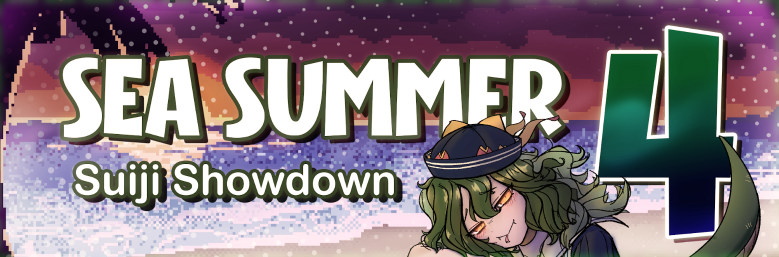

---
tags:
  - SSSS4
  - SSSS 4
---

# SEA Summer Suiji Showdown 4

The **SEA Summer Suiji Showdown 4** (***SSSS 4***) was a South East Asian team-based (3v3) osu! tournament hosted by ::{ flag=VN }:: [Meowscarada](https://osu.ppy.sh/users/12048072). The tournament featured a [Suiji-style team matchmaking system](https://osu.ppy.sh/community/forums/topics/1305570), in which players were assigned to a team at random prior to the start of the tournament based on each other's [BWS rank](/wiki/Tournaments/Badge-weighted_seeding) and Qualifier results. It was open to all players from all [ASEAN member states](https://asean.org/member-states/) (::{ flag=BN }::/::{ flag=KH }::/::{ flag=ID }::/::{ flag=LA }::/::{ flag=MM }::/::{ flag=MY }::/::{ flag=PH }::/::{ flag=SG }::/::{ flag=TL }::/::{ flag=TH }::/::{ flag=VN }::) regardless of rank, and was the fourth iteration of the SEA Summer Suiji Showdown.

## Tournament schedule

| Event | Timestamp |
| --: | :-- |
| Registration phase | 2026-05-22/2026-06-07 |
| Screening phase | 2026-06-08/2026-06-14 |
| Qualifiers | 2026-06-15/2026-06-21 |
| Swiss round (week 1) | 2026-06-22/2026-06-28 |
| Swiss round (week 2) | 2026-06-29/2026-07-05 |
| Quarterfinals | 2026-07-06/2026-07-12 |
| Semifinals | 2026-07-13/2026-07-19 |
| Finals (week 1) | 2026-07-20/2026-07-26 |
| *Break* | 2026-07-27/2026-08-02 |
| Finals (week 2) | 2026-08-03/2026-08-09 |

## Prizes

| Placing | Prize(s) |
| :-: | :-- |
|  | 4 months of osu!supporter for each team member, 3 months of [o!rdr subscription](https://ordr.issou.best/) for each team member, customised profile banner, profile badge |
|  | 2 months of osu!supporter for each team member, 2 months of [o!rdr subscription](https://ordr.issou.best/) for each team member, customised profile banner |
|  | 1 month of osu!supporter for each team member, 1 month of [o!rdr subscription](https://ordr.issou.best/) for each team member, customised profile banner |
| 4th place | Customised profile banner |

## Organisation

The SEA Summer Suiji Showdown 4 was run by various osu! community members from South East Asia and beyond.

| Position | Member(s) |
| :-- | :-- |
| Host | ::{ flag=VN }:: [Meowscarada](https://osu.ppy.sh/users/12048072) |
| Mappool selector | ::{ flag=TH }:: [Deppyforce](https://osu.ppy.sh/users/5286213), ::{ flag=VN }:: [vouillet](https://osu.ppy.sh/users/16823917), ::{ flag=TH }:: [chests](https://osu.ppy.sh/users/14806365) |
| Custom mapper | ::{ flag=ID }:: [DaCH1](https://osu.ppy.sh/users/26705942), ::{ flag=TH }:: [1D\_M0n](https://osu.ppy.sh/users/15778575), ::{ flag=VN }:: [Amano Tooko](https://osu.ppy.sh/users/23764328), ::{ flag=PH }:: [LeCandy](https://osu.ppy.sh/users/6626249), ::{ flag=TH }:: [Zuika](https://osu.ppy.sh/users/10222009), ::{ flag=VN }:: [Ducky-](https://osu.ppy.sh/users/9351565), ::{ flag=AU }:: [ralsricat](https://osu.ppy.sh/users/12318332), ::{ flag=CY }:: [ravensong](https://osu.ppy.sh/users/10772580), ::{ flag=NL }:: [CMeFly](https://osu.ppy.sh/users/12195391), ::{ flag=CR }:: [UniUniverse](https://osu.ppy.sh/users/15568608), ::{ flag=US }:: [Hobbes2](https://osu.ppy.sh/users/8157492), ::{ flag=AR }:: [Stupid Femboy](https://osu.ppy.sh/users/13714351) |
| Playtester | ::{ flag=ID }:: [FAW](https://osu.ppy.sh/users/11070577), ::{ flag=HK }:: [Stythiii](https://osu.ppy.sh/users/18467846), ::{ flag=SA }:: [Zesdash](https://osu.ppy.sh/users/5965797), ::{ flag=TW }:: [MeowHou](https://osu.ppy.sh/users/16997804), ::{ flag=HK }:: [nuthing](https://osu.ppy.sh/users/6386735), ::{ flag=TR }:: [spray-](https://osu.ppy.sh/users/16750823), ::{ flag=PE }:: [G4rdevoir](https://osu.ppy.sh/users/11646616), ::{ flag=AR }:: [Stupid Femboy](https://osu.ppy.sh/users/13714351), ::{ flag=ID }:: [Hakui Koyori](https://osu.ppy.sh/users/10717635)[^staff-note], ::{ flag=MY }:: [Lunasa](https://osu.ppy.sh/users/16436446)[^staff-note], ::{ flag=VN }:: [\_Kasaezic](https://osu.ppy.sh/users/848961)[^staff-note] |
| Streamer | ::{ flag=ID }:: [Xentaaa](https://osu.ppy.sh/users/16998672), ::{ flag=VN }:: [ngoc17](https://osu.ppy.sh/users/12463311), ::{ flag=VN }:: [\[TCD\] Dzar03](https://osu.ppy.sh/users/16712231), ::{ flag=TH }:: [InnocentHuman](https://osu.ppy.sh/users/17223415) |
| Commentator | ::{ flag=VN }:: [Meowscarada](https://osu.ppy.sh/users/12048072), ::{ flag=ID }:: [BlankTap](https://osu.ppy.sh/users/10137131), ::{ flag=MY }:: [FaZe\_Rakuen](https://osu.ppy.sh/users/13668175), ::{ flag=MY }:: [Banner](https://osu.ppy.sh/users/14290988), ::{ flag=SA }:: [Zesdash](https://osu.ppy.sh/users/5965797), ::{ flag=FR }:: [Crystal Enjoyer](https://osu.ppy.sh/users/6968364) |
| Referee | ::{ flag=VN }:: [Meowscarada](https://osu.ppy.sh/users/12048072), ::{ flag=ID }:: [Xentaaa](https://osu.ppy.sh/users/16998672), ::{ flag=VN }:: [Beegamer](https://osu.ppy.sh/users/14827521), ::{ flag=ID }:: [Chromeng](https://osu.ppy.sh/users/9469764), ::{ flag=VN }:: [\[TCD\] EnaCute](https://osu.ppy.sh/users/16094268), ::{ flag=ID }:: [Suruya](https://osu.ppy.sh/users/18616423), ::{ flag=MY }:: [Chrueso](https://osu.ppy.sh/users/11913173), ::{ flag=ID }:: [nabirra](https://osu.ppy.sh/users/16053739), ::{ flag=TH }:: [FlynnMartinez](https://osu.ppy.sh/users/21574501), ::{ flag=PH }:: [GD Jed](https://osu.ppy.sh/users/11633163), ::{ flag=VN }:: [isuis1](https://osu.ppy.sh/users/18658251), ::{ flag=PH }:: [Aclymph](https://osu.ppy.sh/users/34222047), ::{ flag=TW }:: [MeowHou](https://osu.ppy.sh/users/16997804), ::{ flag=NZ }:: [EurasianEagleOw](https://osu.ppy.sh/users/37711120), ::{ flag=ID }:: [SDKO](https://osu.ppy.sh/users/4858555)[^staff-note] |
| Graphic designer | ::{ flag=VN }:: [Meowscarada](https://osu.ppy.sh/users/12048072) |
| Spreadsheet manager | ::{ flag=VN }:: [BCraftMG](https://osu.ppy.sh/users/13456818), ::{ flag=CA }:: [femboy lover](https://osu.ppy.sh/users/16987588) |
| Wiki editor | ::{ flag=ID }:: [Niva](https://osu.ppy.sh/users/197805) |

## Links

- **[Master spreadsheet](https://docs.google.com/spreadsheets/d/17iy1kshVWXtzJM9pY9p410hDtbOwg1UN5ez2v_QUpTo/edit?usp=sharing)**
- [Forum thread](https://osu.ppy.sh/community/forums/topics/2208344)
- [Discord server](https://discord.gg/9jA9r3bd7N)
- [Challonge brackets](https://challonge.com/hapb2jmd)
- [Livestream channel](https://www.twitch.tv/osusea)

## Participants

Listed below are the teams participating in SSSS 4 and their respective team members, with players in **bold** acting as team captains.

| Team name | Seed S player | Seed A player | Seed B player #1 | Seed B player #2 | Seed C player #1 | Seed C player #2 |
| :-- | :-- | :-- | :-- | :-- | :-- | :-- |
| **Astralis** | ::{ flag=VN }:: [Tonnisdk](https://osu.ppy.sh/users/10890712) | ::{ flag=PH }:: [francisqueso](https://osu.ppy.sh/users/20840121) | ::{ flag=VN }:: [ThuNguyen Grape](https://osu.ppy.sh/users/20864743) | ::{ flag=SG }:: **[Hecatia](https://osu.ppy.sh/users/8244635)** | ::{ flag=ID }:: [Crownest](https://osu.ppy.sh/users/18135280) | ::{ flag=SG }:: [Axiqn](https://osu.ppy.sh/users/21130016) |
| **Bad News Eagles** | ::{ flag=SG }:: [Eagle5324](https://osu.ppy.sh/users/11987104) | ::{ flag=TH }:: [soft bunny](https://osu.ppy.sh/users/9317938) | ::{ flag=ID }:: [c4w](https://osu.ppy.sh/users/15815159) | ::{ flag=PH }:: [rwnd_](https://osu.ppy.sh/users/14916935) | ::{ flag=PH }:: [zSidd](https://osu.ppy.sh/users/14146602) | ::{ flag=SG }:: **[Tapses](https://osu.ppy.sh/users/8852426)** |
| **Brazil** | ::{ flag=SG }:: [koyo](https://osu.ppy.sh/users/13623476) | ::{ flag=MY }:: [stumphole145](https://osu.ppy.sh/users/14623152) | ::{ flag=ID }:: [wendy](https://osu.ppy.sh/users/8626190) | ::{ flag=PH }:: **[qaur](https://osu.ppy.sh/users/24470395)** | ::{ flag=ID }:: [-TwiHD](https://osu.ppy.sh/users/5470299) | ::{ flag=SG }:: [SoPqnda](https://osu.ppy.sh/users/15751922) |
| **Edward Gaming** | ::{ flag=PH }:: **[_Chonker](https://osu.ppy.sh/users/13858963)** | ::{ flag=PH }:: [puffonxe](https://osu.ppy.sh/users/15771173) | ::{ flag=ID }:: [macabea](https://osu.ppy.sh/users/8688737) | ::{ flag=TH }:: [TzArtifactz](https://osu.ppy.sh/users/14833619) | ::{ flag=MY }:: [CelestiaKT](https://osu.ppy.sh/users/26357728) | ::{ flag=PH }:: [callyfour](https://osu.ppy.sh/users/17290521) |
| **Falcons** | ::{ flag=ID }:: **[Skydiver](https://osu.ppy.sh/users/4750008)** | ::{ flag=VN }:: [_Kasaezic](https://osu.ppy.sh/users/848961) | ::{ flag=MY }:: [Tairaa](https://osu.ppy.sh/users/20024121) | ::{ flag=PH }:: [Maron](https://osu.ppy.sh/users/26277369) | ::{ flag=ID }:: [AlpiAz](https://osu.ppy.sh/users/26321771) | ::{ flag=SG }:: [kiraze](https://osu.ppy.sh/users/7290359) |
| **FaZe Clan** | ::{ flag=PH }:: **[zonelouise](https://osu.ppy.sh/users/1492995)** | ::{ flag=MY }:: [mabayu](https://osu.ppy.sh/users/11918602) | ::{ flag=VN }:: [BiaHaNoi](https://osu.ppy.sh/users/16616672) | ::{ flag=MY }:: [Agagak](https://osu.ppy.sh/users/3645490) | ::{ flag=SG }:: [goo fling](https://osu.ppy.sh/users/17689709) | ::{ flag=TH }:: [Nyz](https://osu.ppy.sh/users/5408255) |
| **FURIA** | ::{ flag=ID }:: **[Stixe](https://osu.ppy.sh/users/18351160)** | ::{ flag=VN }:: [[ReiKo_Relax]](https://osu.ppy.sh/users/12609743) | ::{ flag=VN }:: [larper2](https://osu.ppy.sh/users/10953457) | ::{ flag=SG }:: [Galahad80](https://osu.ppy.sh/users/13986379) | ::{ flag=SG }:: [m0fum0fu](https://osu.ppy.sh/users/5143605) | ::{ flag=SG }:: [LycaonMyHusband](https://osu.ppy.sh/users/14436770) |
| **G2 Esports** | ::{ flag=TH }:: [ywd](https://osu.ppy.sh/users/14017762) | ::{ flag=TH }:: **[Arz3](https://osu.ppy.sh/users/6571991)** | ::{ flag=MY }:: [Wish_](https://osu.ppy.sh/users/14300067) | ::{ flag=ID }:: [Bbriant](https://osu.ppy.sh/users/30074705) | ::{ flag=SG }:: [Fuwub](https://osu.ppy.sh/users/14238097) | ::{ flag=VN }:: [VenomPuffs](https://osu.ppy.sh/users/8715313) |
| **GAM Esports** | ::{ flag=TH }:: **[Lesperry](https://osu.ppy.sh/users/18092331)** | ::{ flag=VN }:: [Ho Quang Hieu](https://osu.ppy.sh/users/14953642) | ::{ flag=VN }:: [Ayamaki](https://osu.ppy.sh/users/16396650) | ::{ flag=VN }:: [Chipperonio](https://osu.ppy.sh/users/13141032) | ::{ flag=VN }:: [JerryJumbo](https://osu.ppy.sh/users/27634475) | ::{ flag=MY }:: [Ramizel](https://osu.ppy.sh/users/9560694) |
| **Koyori MBG (My Bini Gue)** | ::{ flag=ID }:: **[Hakui Koyori](https://osu.ppy.sh/users/10717635)** | ::{ flag=ID }:: [Such](https://osu.ppy.sh/users/11844371) | ::{ flag=MY }:: [Tzero](https://osu.ppy.sh/users/6088976) | ::{ flag=VN }:: [-UniRain-](https://osu.ppy.sh/users/9389164) | ::{ flag=SG }:: [Anderwear](https://osu.ppy.sh/users/14429830) | ::{ flag=SG }:: [fixie kia](https://osu.ppy.sh/users/9343056) |
| **Leviatán** | ::{ flag=TH }:: [fuzzyu](https://osu.ppy.sh/users/21958501) | ::{ flag=ID }:: **[Thatnoobguy](https://osu.ppy.sh/users/11091594)** | ::{ flag=MY }:: [Chibi Maruko](https://osu.ppy.sh/users/5585377) | ::{ flag=PH }:: [- Ciel -](https://osu.ppy.sh/users/10166961) | ::{ flag=PH }:: [JayAreEee](https://osu.ppy.sh/users/10852557) | ::{ flag=VN }:: [aiyern](https://osu.ppy.sh/users/13826244) |
| **Matagi Snipers** | ::{ flag=TH }:: [-Kedama](https://osu.ppy.sh/users/12147277) | ::{ flag=PH }:: [Impowster](https://osu.ppy.sh/users/13484596) | ::{ flag=VN }:: [25 FPS](https://osu.ppy.sh/users/31659938) | ::{ flag=SG }:: [moosepi](https://osu.ppy.sh/users/1868745) | ::{ flag=PH }:: [Xyphox](https://osu.ppy.sh/users/8315885) | ::{ flag=PH }:: **[xidorn](https://osu.ppy.sh/users/7904667)** |
| **NAVI** | ::{ flag=MY }:: **[Lunasa](https://osu.ppy.sh/users/16436446)** | ::{ flag=TH }:: [chantarazu](https://osu.ppy.sh/users/15630936) | ::{ flag=ID }:: [malvon](https://osu.ppy.sh/users/11113661) | ::{ flag=ID }:: [Caruma](https://osu.ppy.sh/users/13187450) | ::{ flag=MY }:: [LeivanTZH](https://osu.ppy.sh/users/20586695) | ::{ flag=PH }:: [Ksorchou](https://osu.ppy.sh/users/18549932) |
| **Paper Rex** | ::{ flag=ID }:: [tsunagite](https://osu.ppy.sh/users/10069909) | ::{ flag=VN }:: [Another Guy](https://osu.ppy.sh/users/4540667) | ::{ flag=MY }:: [MadDdDio](https://osu.ppy.sh/users/15086959) | ::{ flag=PH }:: [Yukixo](https://osu.ppy.sh/users/17847877) | ::{ flag=PH }:: **[GuardiaN](https://osu.ppy.sh/users/11001039)** | ::{ flag=SG }:: [Moltenfury](https://osu.ppy.sh/users/3395820) |
| **Rex Regum Qeon** | ::{ flag=ID }:: **[i love manosaba](https://osu.ppy.sh/users/7108275)** | ::{ flag=ID }:: [Rosemi Lovelock](https://osu.ppy.sh/users/1987591) | ::{ flag=PH }:: [Hinatsuru Ai](https://osu.ppy.sh/users/10442993) | ::{ flag=ID }:: [Suikami](https://osu.ppy.sh/users/1929336) | ::{ flag=PH }:: [EViLseeeen11l1](https://osu.ppy.sh/users/18047706) | ::{ flag=SG }:: [Junkmaniac](https://osu.ppy.sh/users/5909569) |
| **Smart Falcons** | ::{ flag=SG }:: **[Bronya](https://osu.ppy.sh/users/5407620)** | ::{ flag=MY }:: [Chiyuu](https://osu.ppy.sh/users/8226107) | ::{ flag=MY }:: [AHotDawg](https://osu.ppy.sh/users/15271985) | ::{ flag=ID }:: [Mashima Himeko](https://osu.ppy.sh/users/10474988) | ::{ flag=MY }:: [squidstain](https://osu.ppy.sh/users/11073207) | ::{ flag=VN }:: [electrostrike](https://osu.ppy.sh/users/11538640) |
| **T1** | ::{ flag=ID }:: **[elituqinn](https://osu.ppy.sh/users/20315228)** | ::{ flag=SG }:: [GSBlank](https://osu.ppy.sh/users/2312106) | ::{ flag=VN }:: [-Kiyoko-](https://osu.ppy.sh/users/10542491) | ::{ flag=VN }:: [hotcat190](https://osu.ppy.sh/users/10143086) | ::{ flag=SG }:: [Lumish264](https://osu.ppy.sh/users/20212225) | ::{ flag=SG }:: [AlmondMal](https://osu.ppy.sh/users/12831353) |
| **Team Spirit** | ::{ flag=MY }:: [Rampax](https://osu.ppy.sh/users/3995630) | ::{ flag=ID }:: [Fuma](https://osu.ppy.sh/users/1501956) | ::{ flag=ID }:: [Seox](https://osu.ppy.sh/users/3793938) | ::{ flag=ID }:: [Patto](https://osu.ppy.sh/users/10613132) | ::{ flag=SG }:: [CopyPasted](https://osu.ppy.sh/users/9341983) | ::{ flag=SG }:: **[JokThree](https://osu.ppy.sh/users/7713152)** |
| **The Mongolz** | ::{ flag=SG }:: **[Mekeyo](https://osu.ppy.sh/users/10270787)** | ::{ flag=PH }:: [Akiyama-Mizuki](https://osu.ppy.sh/users/11865009) | ::{ flag=PH }:: [Geanyl](https://osu.ppy.sh/users/10038631) | ::{ flag=SG }:: [wick](https://osu.ppy.sh/users/8004317) | ::{ flag=MY }:: [not_aweeb](https://osu.ppy.sh/users/9375317) | ::{ flag=SG }:: [Sorasaki Hina](https://osu.ppy.sh/users/17493320) |
| **Vitality** | ::{ flag=VN }:: [MumeiLover](https://osu.ppy.sh/users/12068522) | ::{ flag=ID }:: [MejiroMcQueen](https://osu.ppy.sh/users/11320627) | ::{ flag=VN }:: [realshin](https://osu.ppy.sh/users/8006029) | ::{ flag=PH }:: **[Seija Kijin](https://osu.ppy.sh/users/22690359)** | ::{ flag=VN }:: [Quy An Keo](https://osu.ppy.sh/users/16480465) | ::{ flag=ID }:: [Ascaveth](https://osu.ppy.sh/users/3245206) |

## Podium

This competition has come to an end and resulted in the following podium:

| Placing | Player |
| :-: | :-- |
|  | **Paper Rex** (::{ flag=ID }:: [tsunagite](https://osu.ppy.sh/users/10069909), ::{ flag=VN }:: [Another Guy](https://osu.ppy.sh/users/4540667), ::{ flag=MY }:: [MadDdDio](https://osu.ppy.sh/users/15086959), ::{ flag=PH }:: [Yukixo](https://osu.ppy.sh/users/17847877), ::{ flag=PH }:: [GuardiaN](https://osu.ppy.sh/users/11001039), ::{ flag=SG }:: [Moltenfury](https://osu.ppy.sh/users/3395820)) |
|  | **Matagi Snipers** (::{ flag=TH }:: [-Kedama](https://osu.ppy.sh/users/12147277), ::{ flag=PH }:: [Impowster](https://osu.ppy.sh/users/13484596), ::{ flag=VN }:: [25 FPS](https://osu.ppy.sh/users/31659938), ::{ flag=SG }:: [moosepi](https://osu.ppy.sh/users/1868745), ::{ flag=PH }:: [Xyphox](https://osu.ppy.sh/users/8315885), ::{ flag=PH }:: [xidorn](https://osu.ppy.sh/users/7904667)) |
|  | **Leviatán** (::{ flag=TH }:: [fuzzyu](https://osu.ppy.sh/users/21958501), ::{ flag=ID }:: [Thatnoobguy](https://osu.ppy.sh/users/11091594), ::{ flag=MY }:: [Chibi Maruko](https://osu.ppy.sh/users/5585377), ::{ flag=PH }:: [- Ciel -](https://osu.ppy.sh/users/10166961), ::{ flag=PH }:: [JayAreEee](https://osu.ppy.sh/users/10852557), ::{ flag=VN }:: [aiyern](https://osu.ppy.sh/users/13826244)) |

## Mappools

### Finals (week 2)

**[Download the mappack here! (125 MB)](https://drive.google.com/file/d/1n6fI8tO1Su_xiaRdv2ygo8Cx28pwi0z_/view?usp=sharing)**

- No Mod
  1. [USAO - BACK COVER (Nuvolina) \[Expert\]](https://osu.ppy.sh/beatmapsets/2530634#osu/5593531)
  2. [AAAA - 8bit Shooting Star\* (1D\_M0n) \[Stella\]](https://osu.ppy.sh/beatmapsets/2593656#osu/5791683)
  3. [ZUTOMAYO - TAIDADA (Petal) \[RESONATION\]](https://osu.ppy.sh/beatmapsets/2270896#osu/4836943)
  4. [Teminite & Boom Kitty - The Master (ralsricat) \[Expert (SEA Suiji Showdown Nerf)\]](https://osu.ppy.sh/beatmapsets/2593978#osu/5792828)
  5. [Into Infernus - Shimmy (Mazzerin) \[Perplexed Dementia\]](https://osu.ppy.sh/beatmapsets/1568026#osu/3201572)
  6. [TM - Shinseikatsu (Deppyforce) \[Extra\]](https://osu.ppy.sh/beatmapsets/2466542#osu/5400185)
- Hidden
  1. [Pitcher56 - Your Name (Rebo) \[Moonlight\]](https://osu.ppy.sh/beatmapsets/2510045#osu/5530108)
  2. [Mili - Peach Pit and Cyanide (vetoed) \[Sweet Cyanide\]](https://osu.ppy.sh/beatmapsets/2468654#osu/5405912)
  3. [MIDORI - YUKIKO san (Mangie\_) \[total annihilation\]](https://osu.ppy.sh/beatmapsets/2368685#osu/5110158)
- Hard Rock
  1. [agu - unbound (bob) \[collab expert\]](https://osu.ppy.sh/beatmapsets/2412346#osu/5238884)
  2. [Black Crown Initiate - Death Comes in Reverse (ravensong) \[Time is Worthless\]](https://osu.ppy.sh/beatmapsets/2594291#osu/5793900)
  3. [mafumafu - I wanna be a girl (Night Mare) \[Can I Become One, Please?\]](https://osu.ppy.sh/beatmapsets/1069248#osu/2238336)
- Double Time
  1. [LAIKA - Dao Nuea (GalaxySkys) \[Wistful at the day I let you go.\]](https://osu.ppy.sh/beatmapsets/1915504#osu/3951746)
  2. [-45 - XXX multiply (YokesPai) \[Insane\]](https://osu.ppy.sh/beatmapsets/1941772#osu/4016365)
  3. [Archspire - Remote Tumour Seeker (quantumvortex) \[Insane\]](https://osu.ppy.sh/beatmapsets/2459027#osu/5377803)
  4. [Gesu no Kiwami Otome. - Jinsei no Hari (eiri-) \[Rewind\]](https://osu.ppy.sh/beatmapsets/1307420#osu/2710582)
- Free Mod
  1. [Project Pop - Metal vs Dugem (Shurelia) \[Joget Maut Scub dan Shurelia\]](https://osu.ppy.sh/beatmapsets/2183079#osu/4613136)
  2. [Coaltar of the Deepers - Cell (Azer) \[The Trip\]](https://osu.ppy.sh/beatmapsets/2281525#osu/4864380)
  3. [Jamie Paige - Machine Love (Ducky-) \[Is this real?\]](https://osu.ppy.sh/beatmapsets/2593676#osu/5791741)

### Finals (week 1)

**[Download the mappack here! (164 MB)](https://drive.google.com/file/d/1-g0mhEWYYw8bY9XFhX9u0DRXrxKPaiWL/view?usp=sharing)**

- No Mod
  1. [Neru feat. Kagamine Rin - Tokyo Teddy Bear (Wanpachi) \[384's 0x8FF75931 "0x4c6f7374"\]](https://osu.ppy.sh/beatmapsets/2313885#osu/4951704)
  2. [xi - Fiat Lux (BronyPT) \[mahlooDonalds2678's GAME ENDING FOUR DIMENSIONAL TRAGIC LOVE\]](https://osu.ppy.sh/beatmapsets/1645931#osu/3359658)
  3. [siraph - Jikan wa Tsugu (Voxnola) \[Chronostasis\]](https://osu.ppy.sh/beatmapsets/1514684#osu/3101133)
  4. [sakuraburst - SELF DESTRUCT (pocket-) \[REMOTE\]](https://osu.ppy.sh/beatmapsets/1411188#osu/3844605)
  5. [unfeeling - good life pattern (fergas) \[a long way\]](https://osu.ppy.sh/beatmapsets/2029093#osu/4228118)
  6. [Kashii Moimi feat. KAFU - Cat Loving (Ryuusei Aika) \[Courtship\]](https://osu.ppy.sh/beatmapsets/2266922#osu/4827135)
- Hidden
  1. [hitorie - Shinkokyuu (captin1) \[ducthai's extreme\]](https://osu.ppy.sh/beatmapsets/2287961#osu/5330821)
  2. [NIWASHI - I Am Amethyst (-jordan-) \[Violet\]](https://osu.ppy.sh/beatmapsets/2002849#osu/4165053)
  3. [The Musical Ghost - Thinking Of (LeCandy) \[tourney ver.\]](https://osu.ppy.sh/beatmapsets/2588855#osu/5775619)
- Hard Rock
  1. [mor ve otesi - Forsa (Fursum) \[ft. Skytuna\]](https://osu.ppy.sh/beatmapsets/1729824#osu/3535240)
  2. [Ninajirachi - Infohazard (GRR SNARL GROWL) \[2521\]](https://osu.ppy.sh/beatmapsets/2489481#osu/5467837)
  3. [steelplus - Skywired Beatscape (Azer) \[Mir's Extra\]](https://osu.ppy.sh/beatmapsets/2468647#osu/5405888)
- Double Time
  1. [Aoi Eir - IGNITE (Frostmourne) \[Insane\]](https://osu.ppy.sh/beatmapsets/209170#osu/492285)
  2. [SB\_YUNE - Dread of the grave -More fear- (Luscent) \[Insane\]](https://osu.ppy.sh/beatmapsets/1878532#osu/3866843)
  3. [Ryokuoushoku Shakai - Hana ni Natte (xLolicore-) \[Enon's Insane\]](https://osu.ppy.sh/beatmapsets/2099854#osu/4445788)
  4. [bermei.inazawa feat. Chata - Hippopotamus (ac8129464363) \[445\]](https://osu.ppy.sh/beatmapsets/2474215#osu/5427067)
- Free Mod
  1. [TrySail - Utsuroi (Mir) \[Vivy's Extra\]](https://osu.ppy.sh/beatmapsets/1433678#osu/3266341)
  2. [Tanger - BIKE (Silyn Remix) (Timevid) \[Alvearia's Special\]](https://osu.ppy.sh/beatmapsets/2299376#osu/4913072)
  3. [Camellia feat. Hatsune Miku - Seimeisei Syndrome (faxaxaxa) \[paper's Extra\]](https://osu.ppy.sh/beatmapsets/2369421#osu/5152894)

### Semifinals

**[Download the mappack here! (126 MB)](https://drive.google.com/file/d/12TmLV8jm7m2phU3MghSq9R_F2SsdEgyQ/view?usp=sharing)**

- No Mod
  1. [Sayuri - Heikousen (Liyuu) \[Meg's Taboo\]](https://osu.ppy.sh/beatmapsets/2456909#osu/5370968)
  2. [Raimukun - Invitation from Dreamland (FcEazy) \[Eternal\]](https://osu.ppy.sh/beatmapsets/2401489#osu/5207681)
  3. [May'n - Scarlet Ballet (bakabaka) \[Expert\]](https://osu.ppy.sh/beatmapsets/105090#osu/4375293)
  4. [Toromaru - Ebb Tide (CallieCube) \[Expert\]](https://osu.ppy.sh/beatmapsets/2082040#osu/4360358)
  5. [System of a Down - Vicinity of Obscenity (Larto) \[Impossible\]](https://osu.ppy.sh/beatmapsets/13768#osu/50712)
- Hidden
  1. [Amy - Lo. (DaCh1) \[The Words I Never Said\]](https://osu.ppy.sh/beatmapsets/2585134#osu/5765665)
  2. [Ave Mujica - Symbol II : Air (MakiDonalds Jr) \[Specialis cnfyy et dakiwii\]](https://osu.ppy.sh/beatmapsets/2498959#osu/5526466)
  3. [qfeileadh feat. Resonance Moeko - Ars Nova ni Kassai o (iBell) \[Explorer\]](https://osu.ppy.sh/beatmapsets/2301820#osu/4919444)
- Hard Rock
  1. [siraph - damp damp (Surgis) \[incandescence\]](https://osu.ppy.sh/beatmapsets/2404208#osu/5215307)
  2. [Sore - Setengah Lima (Scub) \[Sudirman, 1998.\]](https://osu.ppy.sh/beatmapsets/2078335#osu/4351866)
  3. [Toby Fox - Black Knife (nebuwua) \[Suddenly, the North and East Winds Blew Fiercely.\]](https://osu.ppy.sh/beatmapsets/2414249#osu/5245290)
- Double Time
  1. [THE ORAL CIGARETTES - Miss Tail (iljaaz) \[Kowari's Insane\]](https://osu.ppy.sh/beatmapsets/1022426#osu/2139063)
  2. [PinocchioP - Non-breath oblige feat. Hatsune Miku (vouillet) \[kakaw\]](https://osu.ppy.sh/beatmapsets/2476013#osu/5748604)
  3. [Mandy Moore - Not Too Young (Aranel) \[Please just go away...\]](https://osu.ppy.sh/beatmapsets/1766054#osu/3615016)
- Free Mod
  1. [Louis Cole - Park Your Car on My Face (boifrosty) \[gurl\]](https://osu.ppy.sh/beatmapsets/2332641#osu/5005352)
  2. [UNDEAD CORPORATION - Karakurenai feat. Ranko (Cris-) \[Yumerios' Extra Stage\]](https://osu.ppy.sh/beatmapsets/2415448#osu/5283846)
  3. [Kobaryo - northern\_limit [feat. Sennzai] (Kojio) \[Respirte's Extreme\]](https://osu.ppy.sh/beatmapsets/1983007#osu/4728105)

### Quarterfinals

**[Download the mappack here! (134 MB)](https://drive.google.com/file/d/15PKmra6SJvIxdNWfzt-AUhWNqYPdD_s7/view?usp=sharing)**

- No Mod
  1. [hasu - Lightning Strike (luxSal) \[ELECTRON DISCHARGE\]](https://osu.ppy.sh/beatmapsets/2417220#osu/5255306)
  2. [Victorius - Twilight Skies (YEYHA) \[Running to the Stars\]](https://osu.ppy.sh/beatmapsets/2477642#osu/5432931)
  3. [Nekomata Master+ - AFRO KNUCKLE (UniUniverse) \[Un(li)mited Flavor\]](https://osu.ppy.sh/beatmapsets/2580961#osu/5752682)
  4. [Demiurge Zero - Eynohr (KChronoZ) \[Expert\]](https://osu.ppy.sh/beatmapsets/2412250#osu/5238538)
  5. [HARU NEMURI - lostplanet (Orkay) \[myownuniverse\]](https://osu.ppy.sh/beatmapsets/2261862#osu/4814345)
- Hidden
  1. [KOTOKO - Tobiuo (Lasse) \[Extra\]](https://osu.ppy.sh/beatmapsets/2533749#osu/5602360)
  2. [Inabakumori - Rainy Boots (_necroplasma) \[Monsoon\]](https://osu.ppy.sh/beatmapsets/2061527#osu/4309678)
  3. [UNDEAD CORPORATION - and Say Good Bye... (Halfslashed) \[cob's Extra\]](https://osu.ppy.sh/beatmapsets/1779479#osu/5426171)
- Hard Rock
  1. [Origami Angel - The Title Track (an3) \[Irgendwo Stadt\]](https://osu.ppy.sh/beatmapsets/2196057#osu/4646916)
  2. [chouchou merged syrups. - Hakuchuumu wa Shiisai no Nai (PandaHero) \[App's Expert\]](https://osu.ppy.sh/beatmapsets/2463069#osu/5395390)
  3. [MYUKKE. - Fete of Fate (CMeFly) \[Kismet\]](https://osu.ppy.sh/beatmapsets/2580830#osu/5752261)
- Double Time
  1. [Sasaki Sayaka - Atlantico Blue (believer\_i) \[Collab Insane\]](https://osu.ppy.sh/beatmapsets/2317331#osu/5424291)
  2. [TAMAONSEN - Gensou Kappa Koushinkyoku feat. ytr (Suicune3) \[Lunatic Kappa\]](https://osu.ppy.sh/beatmapsets/2239541#osu/4762076)
  3. [Charli xcx - Club classics (Delta\_) \[Alty's insane\]](https://osu.ppy.sh/beatmapsets/2215605#osu/4866889)
- Free Mod
  1. [minato feat. Hatsune Miku, Megurine Luka - magnet (muya-) \[h1dron & enri's extreme yuri ship\]](https://osu.ppy.sh/beatmapsets/2134600#osu/4977435)
  2. [Rissyuu feat. Choko - Bamboo (JeZag) \[KKip's Take\]](https://osu.ppy.sh/beatmapsets/1303843#osu/2725951)
  3. [Shikata Akiko - Arcadia (Scub) \[Turaida\]](https://osu.ppy.sh/beatmapsets/1882896#osu/3876648)

### Swiss round (week 2)

**[Download the mappack here! (94 MB)](https://drive.google.com/file/d/1asgYrYWgP8hgfvsu9W8xqnGOS6l3yvob/view?usp=sharing)**

- No Mod
  1. [My Chemical Romance - Thank You for the Venom (2025 Mix) (SupaV) \[Revenge\]](https://osu.ppy.sh/beatmapsets/2382290#osu/5437487)
  2. [Street - Sakura Fubuki (Ata Remix) (TWEEKER) \[Cherry Blossom\]](https://osu.ppy.sh/beatmapsets/2039767#osu/4254840)
  3. [DJKurara - Japanese Transformation (wjddjs) \[HyperPigeon's Extreme\]](https://osu.ppy.sh/beatmapsets/2310987#osu/5715082)
  4. [onumi X Fluff Pink & Belak - TRAUMA (Wispy) \[Ksardas' ORACLE EXTRA feat. Sharu\]](https://osu.ppy.sh/beatmapsets/2408890#osu/5269080)
  5. [mimizu - Everything will be broken. (iBell) \[extresque's Extra\]](https://osu.ppy.sh/beatmapsets/2492045#osu/5487088)
- Hidden
  1. [F9 - Kagaribito (captin1) \[Fragments\]](https://osu.ppy.sh/beatmapsets/1087452#osu/2274038)
  2. [A.SAKA - Kannagi (Buster) \[YeLing's Extra\]](https://osu.ppy.sh/beatmapsets/2530218#osu/5603409)
- Hard Rock
  1. [Marmalade butcher - Open Scar Unending (revoh) \[Wispy's Extra\]](https://osu.ppy.sh/beatmapsets/2471983#osu/5416140)
  2. [Shawn Wasabi + YDG - Burnt Rice (feat. YUNG GEMMY) (Alphabet) \[Spork Lover's Scorched\]](https://osu.ppy.sh/beatmapsets/710329#osu/1502636)
- Double Time
  1. [NOMELON NOLEMON - Midnight Reflection (Takusa\_) \[Shady's STABILIZER FAULT: INSANE Alert\]](https://osu.ppy.sh/beatmapsets/2382583#osu/5312638)
  2. [-45 - Kurenaikakei (Okoratu) \[allein's Insane\]](https://osu.ppy.sh/beatmapsets/1893565#osu/3982739)
  3. [Shibayan feat. yana - Oznei Haman wa Mou Iranai (itay) \[Selfish Desire\]](https://osu.ppy.sh/beatmapsets/1778687#osu/3642792)
- Free Mod
  1. [TK from Ling tosite sigure - Bonnou (melwoine) \[Vell's Extra\]](https://osu.ppy.sh/beatmapsets/2043955#osu/4452323)
  2. [P-Model - Logic Airforce (nullset) \[KIRBY Mix\]](https://osu.ppy.sh/beatmapsets/29267#osu/100237)

### Swiss round (week 1)

**[Download the mappack here! (98 MB)](https://drive.google.com/file/d/1FK99VCQty0LQoQz5qmdZrgfSmUEgIa5T/view?usp=sharing)**

- No Mod
  1. [ZUTOMAYO - SHADE (xLolicore-) \[Melancholy\]](https://osu.ppy.sh/beatmapsets/2376632#osu/5133893)
  2. [DJ SHARPNEL - CYBER INDUCTANCE (mithew) \[FINAL\]](https://osu.ppy.sh/beatmapsets/2342474#osu/5034823)
  3. [HIMEHINA - Senkou Hanabi (pnky) \[Farewell\]](https://osu.ppy.sh/beatmapsets/2053545#osu/4289564)
  4. [N2 - NULL APOPHENIA (Kardshark) \[~\]](https://osu.ppy.sh/beatmapsets/2003956#osu/4167396)
  5. [DECO\*27 - Monitoring (Best Friend Remix) feat. Hatsune Miku (MeAqua tete) \[Len's Not Classic Extra\]](https://osu.ppy.sh/beatmapsets/2431107#osu/5312665)
- Hidden
  1. [M2U - Dual Fractal (Hailie) \[Icekalt's Extra\]](https://osu.ppy.sh/beatmapsets/865577#osu/1823007)
  2. [Porter Robinson - Everything To Me (quila) \[soft mind\]](https://osu.ppy.sh/beatmapsets/2506004#osu/5517688)
- Hard Rock
  1. [CQ - Emil (App) \[Appzki\]](https://osu.ppy.sh/beatmapsets/2426226#osu/5437666)
  2. [Kingyo kousen - Tobenai Shinkai gyo (Phten02) \[ar5\]](https://osu.ppy.sh/beatmapsets/2388078#osu/5167863)
- Double Time
  1. [SHIKI - Himitsu (Yugu) \[Insane\]](https://osu.ppy.sh/beatmapsets/1707540#osu/3559941)
  2. [underscores - Music (blixys) \[quantumvortex's Insane\]](https://osu.ppy.sh/beatmapsets/2542651#osu/5647257)
  3. [Mili - Space Colony (plork) \[Kepler-62e/f (981 light-years away)\]](https://osu.ppy.sh/beatmapsets/2090448#osu/5653796)
- Free Mod
  1. [AAAA - reach for your victory!!! (toybot) \[-tynamo's extra!!!\]](https://osu.ppy.sh/beatmapsets/2227145#osu/4883806)
  2. [Hatsune Miku - Hatsune Miku no Bunretsu->Hakai (DoraX) \[Destroy\]](https://osu.ppy.sh/beatmapsets/33815#osu/110082)

### Qualifiers

**[Download the mappack here! (75 MB)](https://drive.google.com/file/d/13d6zVyZmpkGKQ6Top2v1e8S0lx4hIm-l/view?usp=sharing)**

- No Mod
  1. [Aqours - Aozora Jumping Heart (SkyFlame) \[Sunburst\]](https://osu.ppy.sh/beatmapsets/588620#osu/3361023)
  2. [Various Artists - Ms. VICTORIA (Game Size) (lushifer) \[\#freeiloveuma\]](https://osu.ppy.sh/beatmapsets/1897432#osu/3910634)
  3. [GOHOBI - Boku no Rimokon Kaeshite (emilia) \[ar9.4 for the babies\]](https://osu.ppy.sh/beatmapsets/1900684#osu/3928035)
  4. [Getty - B WiZ U (Cubby) \[Me & U\]](https://osu.ppy.sh/beatmapsets/2054627#osu/4292677)
  5. [yuri - Heart111 (Ekoro) \[11\]](https://osu.ppy.sh/beatmapsets/2513719#osu/5547663)
- Hidden
  1. [PSYQUI - Multicoloured (yaspo) \[chonk\]](https://osu.ppy.sh/beatmapsets/1262413#osu/2623955)
  2. [P-MODEL - Go for it! Halycon (an3) \[I'll gift 1x supporter for fcing this mid match\]](https://osu.ppy.sh/beatmapsets/2134745#osu/4491576)
- Hard Rock
  1. [Apink - NoNoNo (Ascended) \[baka\]](https://osu.ppy.sh/beatmapsets/2142931#osu/4511063)
  2. [Two Door Cinema Club - Cigarettes in the Theatre (entsetzen) \[please don't stop talking\]](https://osu.ppy.sh/beatmapsets/1598238#osu/3264072)
- Double Time
  1. [paraoka - Manima ni (Sandpig) \[('(oo)')\]](https://osu.ppy.sh/beatmapsets/43107#osu/135396)
  2. [Sasaki Sayaka - Never the Fever!! (Respirte) \[Insane\]](https://osu.ppy.sh/beatmapsets/2202864#osu/4662384)
  3. [sasanomaly - Onomatopoeia Glasses (Sagu) \[o-o-.\]](https://osu.ppy.sh/beatmapsets/1439058#osu/2960994)

## Match results

### Finals (week 2)

Saturday, 8 August 2026:

| Bracket | Team 1 |  |  | Team 2 | Match link |
| :-: | --: | :-: | :-: | :-- | :-- |
| Lower | Leviatán | 1 | **7** | **Matagi Snipers** | [#1](https://osu.ppy.sh/community/matches/121655530) |

Sunday, 9 August 2026:

| Bracket | Player 1 |  |  | Player 2 | Match link |
| :-: | --: | :-: | :-: | :-- | :-- |
| Grand Final | **Paper Rex** | **7** | 3 | Matagi Snipers | [#1](https://osu.ppy.sh/community/matches/121662541) |

### Finals (week 1)

Saturday, 25 July 2026:

| Bracket | Team 1 |  |  | Team 2 | Match link |
| :-: | --: | :-: | :-: | :-- | :-- |
| Lower | Rex Regum Qeon | 3 | **7** | **Matagi Snipers** | [#1](https://osu.ppy.sh/community/matches/121577096) |
| Lower | **Falcons** | **7** | 0 | Brazil | [#1](https://osu.ppy.sh/community/matches/121576533) |

Sunday, 26 July 2026:

| Bracket | Team 1 |  |  | Team 2 | Match link |
| :-: | --: | :-: | :-: | :-- | :-- |
| Upper | **Paper Rex** | **7** | 6 | Leviatán | [#1](https://osu.ppy.sh/community/matches/121582937) |
| Lower | **Matagi Snipers** | **7** | 6 | Falcons | [#1](https://osu.ppy.sh/community/matches/121582941) |

### Semifinals

Saturday, 18 July 2026:

| Bracket | Team 1 |  |  | Team 2 | Match link |
| :-: | --: | :-: | :-: | :-- | :-- |
| Lower | Smart Falcon | 4 | **6** | **Brazil** | [#1](https://osu.ppy.sh/community/matches/121534588) |
| Lower | **Team Spirit** | **6** | 1 | Bad News Eagles | [#1](https://osu.ppy.sh/community/matches/121534590) |
| Lower | Vitality | 4 | **6** | **Matagi Snipers** | [#1](https://osu.ppy.sh/community/matches/121534708) |

Sunday, 19 July 2026:

| Bracket | Team 1 |  |  | Team 2 | Match link |
| :-: | --: | :-: | :-: | :-- | :-- |
| Lower | **G2 Esports** | **6** | 2 | NAVI | [#1](https://osu.ppy.sh/community/matches/121540725) |
| Upper | Falcons | 1 | **6** | **Leviatán** | [#1](https://osu.ppy.sh/community/matches/121542092) |
| Lower | **Brazil** | **6** | 2 | Team Spirit | [#1](https://osu.ppy.sh/community/matches/121542394) |
| Upper | **Paper Rex** | **6** | 3 | Rex Regum Qeon | [#1](https://osu.ppy.sh/community/matches/121542063) |
| Lower | **Matagi Snipers** | **6** | 3 | G2 Esports | [#1](https://osu.ppy.sh/community/matches/121541806) |

### Quarterfinals

Saturday, 11 July 2026:

| Bracket | Team 1 |  |  | Team 2 | Match link |
| :-: | --: | :-: | :-: | :-- | :-- |
| Play-in[^two-way-tie-note] | **NAVI** | **6** | 5 | Astralis | [#1](https://osu.ppy.sh/community/matches/121492666) |

Sunday, 12 July 2026:

| Bracket | Team 1 |  |  | Team 2 | Match link |
| :-: | --: | :-: | :-: | :-- | :-- |
| Upper | **Rex Regum Qeon** | **6** | 2 | Astralis | [#1](https://osu.ppy.sh/community/matches/121498962) |
| Upper | **Leviatán** | **6** | 1 | Vitality | [#1](https://osu.ppy.sh/community/matches/121499265) |
| Upper | **Falcons** | **6** | 5 | G2 Esports | [#1](https://osu.ppy.sh/community/matches/121505365) |
| Upper | **Paper Rex** | **6** | 3 | Team Spirit | [#1](https://osu.ppy.sh/community/matches/121499331) |

### Swiss round

#### Overall standings

**Group A**

| Rank | Team name | Score | Wins | Draws | Losses | Beatmaps won | Beatmap difference |
| :-: | :-: | :-: | :-: | :-: | :-: | :-: | :-: |
| 1 | Falcons | 3.5 | 3 | 1 | 0 | 19 | +10 |
| 2 | Rex Regum Qeon | 3.0 | 2 | 2 | 0 | 18 | +8 |
| 3 | Vitality | 2.5 | 2 | 1 | 1 | 17 | +7 |
| 4 | Team Spirit | 2.0 | 1 | 2 | 1 | 15 | +1 |
| 5 | Brazil | 2.0 | 1 | 2 | 1 | 14 | 0 |
| 6 | NAVI | 2.0 | 1 | 2 | 1 | 14 | -1[^two-way-tie-note] |
| 7 | Astralis | 2.0 | 1 | 2 | 1 | 14 | -1[^two-way-tie-note] |
| 8 | T1 | 2.0 | 2 | 0 | 2 | 12 | -2 |
| 9 | The Mongolz | 1.0 | 1 | 0 | 3 | 7 | -11 |
| 10 | Edward Gaming | 0.0 | 0 | 0 | 4 | 9 | -11 |

**Group B**

| Rank | Team name | Score | Wins | Draws | Losses | Beatmaps won | Beatmap difference |
| :-: | :-: | :-: | :-: | :-: | :-: | :-: | :-: |
| 1 | Paper Rex | 4.0 | 4 | 0 | 0 | 20 | +15 |
| 2 | Leviatán | 3.0 | 2 | 2 | 0 | 18 | +6 |
| 3 | Smart Falcon | 2.5 | 2 | 1 | 1 | 16 | +4 |
| 4 | G2 Esports | 2.5 | 2 | 1 | 1 | 15 | +2 |
| 5 | Matagi Snipers | 2.0 | 0 | 4 | 0 | 16 | 0 |
| 6 | Bad News Eagles | 2.0 | 2 | 0 | 2 | 15 | +4 |
| 7 | Koyori MBG (My Bini Gue) | 2.0 | 1 | 2 | 1 | 15 | -1 |
| 8 | FURIA | 1.0 | 0 | 2 | 2 | 12 | -6 |
| 9 | FaZe Clan | 0.5 | 0 | 1 | 3 | 8 | -11 |
| 10 | GAM Esports | 0.5 | 0 | 1 | 3 | 6 | -13 |

#### Week 2

Friday, 3 July 2026:

| Match code | Team 1 |  |  | Team 2 | Match link |
| :-: | --: | :-: | :-: | :-- | :-- |
| 2-7 | Leviatán | 4 | 4 | G2 Esports | [#1](https://osu.ppy.sh/community/matches/121444113) |

Saturday, 4 July 2026:

| Match code | Team 1 |  |  | Team 2 | Match link |
| :-: | --: | :-: | :-: | :-- | :-- |
| 2-9 | **Koyori MBG (My Bini Gue)** | **5** | 3 | FaZe Clan | [#1](https://osu.ppy.sh/community/matches/121449829) |
| 2-1 | Vitality | 3 | **5** | **Falcons** | [#1](https://osu.ppy.sh/community/matches/121449779) |
| 2-16 | **Paper Rex** | **5** | 1 | G2 Esports | [#1](https://osu.ppy.sh/community/matches/121450152) |
| 2-8 | Matagi Snipers | 4 | 4 | FURIA | [#1](https://osu.ppy.sh/community/matches/121449736) |
| 2-14 | **T1** | **5** | 2 | The Mongolz | [#1](https://osu.ppy.sh/community/matches/121449757) |
| 2-2 | **Rex Regum Qeon** | **5** | 1 | Brazil | [#1](https://osu.ppy.sh/community/matches/121450156) |
| 2-6 | **Paper Rex** | **5** | 2 | Smart Falcon | [#1](https://osu.ppy.sh/community/matches/121449827) |
| 2-4 | NAVI | 4 | 4 | Astralis | [#1](https://osu.ppy.sh/community/matches/121450543) |
| 2-3 | **Team Spirit** | **5** | 1 | T1 | [#1](https://osu.ppy.sh/community/matches/121450217) |
| 2-10 | GAM Esports | 0 | **5** | **Bad News Eagles** | [#1](https://osu.ppy.sh/community/matches/121457108) |
| 2-18 | Smart Falcon | 4 | 4 | Koyori MBG (My Bini Gue) | [#1](https://osu.ppy.sh/community/matches/121450173) |

Sunday, 5 July 2026:

| Match code | Team 1 |  |  | Team 2 | Match link |
| :-: | --: | :-: | :-: | :-- | :-- |
| 2-19 | FaZe Clan | 1 | **5** | **Bad News Eagles** | [#1](https://osu.ppy.sh/community/matches/121456142) |
| 2-5 | **The Mongolz** | **5** | 3 | Edward Gaming | [#1](https://osu.ppy.sh/community/matches/121456139) |
| 2-13 | Team Spirit | 2 | **5** | **Astralis** | [#1](https://osu.ppy.sh/community/matches/121456398) |
| 2-17 | Matagi Snipers | 4 | 4 | Leviatán | [#1](https://osu.ppy.sh/community/matches/121456603) |
| 2-15 | Edward Gaming | 2 | **5** | **NAVI** | [#1](https://osu.ppy.sh/community/matches/121455653) |
| 2-11 | GAM Esports | 4 | 4 | Furia | [#1](https://osu.ppy.sh/community/matches/121456786) |
| 2-12 | Falcons | 4 | 4 | Rex Regum Qeon | [#1](https://osu.ppy.sh/community/matches/121456706) |
| 2-11 | Vitality | 4 | 4 | Brazil | [#1](https://osu.ppy.sh/community/matches/121456780) |

#### Week 1

Friday, 26 June 2026:

| Match code | Team 1 |  |  | Team 2 | Match link |
| :-: | --: | :-: | :-: | :-- | :-- |
| 1-15 | **Brazil** | **5** | 1 | T1 | [#1](https://osu.ppy.sh/community/matches/121402453) |

Saturday, 27 June 2026:

| Match code | Team 1 |  |  | Team 2 | Match link |
| :-: | --: | :-: | :-: | :-- | :-- |
| 1-20 | **G2 Esports** | **5** | 1 | GAM Esports | [#1](https://osu.ppy.sh/community/matches/121409007) |
| 1-7 | **Paper Rex** | **5** | 0 | FaZe Clan | [#1](https://osu.ppy.sh/community/matches/121407769) |
| 1-11 | NAVI | 4 | 4 | Team Spirit | [#1](https://osu.ppy.sh/community/matches/121407688) |
| 1-8 | **Leviatán** | **5** | 2 | FURIA | [#1](https://osu.ppy.sh/community/matches/121408114) |
| 1-5 | Brazil | 4 | 4 | Astralis | [#1](https://osu.ppy.sh/community/matches/121408061) |
| 1-4 | Edward Gaming | 2 | **5** | **T1** | [#1](https://osu.ppy.sh/community/matches/121408449) |
| 1-10 | **G2 Esports** | **5** | 3 | Bad News Eagles | [#1](https://osu.ppy.sh/community/matches/121408478) |
| 1-2 | Rex Regum Qeon | 4 | 4 | Team Spirit | [#1](https://osu.ppy.sh/community/matches/121408113) |

Sunday, 28 June 2026:

| Match code | Team 1 |  |  | Team 2 | Match link |
| :-: | --: | :-: | :-: | :-- | :-- |
| 1-9 | **Smart Falcon** | **5** | 1 | GAM Esports | [#1](https://osu.ppy.sh/community/matches/121414196) |
| 1-3 | The Mongolz | 0 | **5** | **Falcons** | [#1](https://osu.ppy.sh/community/matches/121414193) |
| 1-12 | **Rex Regum Qeon** | **5** | 1 | Astralis | [#1](https://osu.ppy.sh/community/matches/121414542) |
| 1-1 | NAVI | 1 | **5** | **Vitality** | [#1](https://osu.ppy.sh/community/matches/121414130) |
| 1-18 | **Leviatán** | **5** | 2 | Koyori MBG (My Bini Gue) | [#1](https://osu.ppy.sh/community/matches/121414200) |
| 1-16 | Matagi Snipers | 4 | 4 | FaZe Clan | [#1](https://osu.ppy.sh/community/matches/121414198) |
| 1-19 | **Smart Falcon** | **5** | 2 | FURIA | [#1](https://osu.ppy.sh/community/matches/121414493) |
| 1-14 | Edward Gaming | 2 | **5** | **Falcons** | [#1](https://osu.ppy.sh/community/matches/121414543) |
| 1-17 | **Paper Rex** | **5** | 2 | Bad News Eagles | [#1](https://osu.ppy.sh/community/matches/121414929) |
| 1-13 | The Mongolz | 0 | **5** | **Vitality** | [#1](https://osu.ppy.sh/community/matches/121414738) |
| 1-6 | Matagi Snipers | 4 | 4 | Koyori MBG (My Bini Gue) | [#1](https://osu.ppy.sh/community/matches/121414531) |

### Qualifiers

The full details of the Qualifier results can be found [here](https://docs.google.com/spreadsheets/d/17iy1kshVWXtzJM9pY9p410hDtbOwg1UN5ez2v_QUpTo/edit?gid=1162863454#gid=1162863454).

| Seed no. | Player | `%MAX` avg. |
| :-- | :-- | :-- |
| 1 | ::{ flag=ID }:: [-TwiHD](https://osu.ppy.sh/users/5470299) | 0.758 |
| 2 | ::{ flag=SG }:: [Tapses](https://osu.ppy.sh/users/8852426) | 0.721 |
| 3 | ::{ flag=PH }:: [GuardiaN](https://osu.ppy.sh/users/11001039) | 0.578 |
| 4 | ::{ flag=VN }:: [VenomPuffs](https://osu.ppy.sh/users/8715313) | 0.561 |
| 5 | ::{ flag=PH }:: [EViLseeeen11l1](https://osu.ppy.sh/users/18047706) | 0.549 |
| 6 | ::{ flag=PH }:: [Xyphox](https://osu.ppy.sh/users/8315885) | 0.546 |
| 7 | ::{ flag=SG }:: [JokThree](https://osu.ppy.sh/users/7713152) | 0.529 |
| 8 | ::{ flag=VN }:: [electrostrike](https://osu.ppy.sh/users/11538640) | 0.522 |
| 9 | ::{ flag=SG }:: [SoPqnda](https://osu.ppy.sh/users/15751922) | 0.489 |
| 10 | ::{ flag=SG }:: [goo fling](https://osu.ppy.sh/users/17689709) | 0.458 |
| 11 | ::{ flag=SG }:: [LycaonMyHusband](https://osu.ppy.sh/users/14436770) | 0.454 |
| 12 | ::{ flag=SG }:: [Lumish264](https://osu.ppy.sh/users/20212225) | 0.452 |
| 13 | ::{ flag=MY }:: [not_aweeb](https://osu.ppy.sh/users/9375317) | 0.447 |
| 14 | ::{ flag=PH }:: [JayAreEee](https://osu.ppy.sh/users/10852557) | 0.443 |
| 15 | ::{ flag=SG }:: [AlmondMal](https://osu.ppy.sh/users/12831353) | 0.427 |
| 16 | ::{ flag=SG }:: [Anderwear](https://osu.ppy.sh/users/14429830) | 0.426 |
| 17 | ::{ flag=ID }:: [AlpiAz](https://osu.ppy.sh/users/26321771) | 0.426 |
| 18 | ::{ flag=PH }:: [Ksorchou](https://osu.ppy.sh/users/18549932) | 0.424 |
| 19 | ::{ flag=SG }:: [Junkmaniac](https://osu.ppy.sh/users/5909569) | 0.420 |
| 20 | ::{ flag=PH }:: [zSidd](https://osu.ppy.sh/users/14146602) | 0.414 |
| 21 | ::{ flag=MY }:: [Ramizel](https://osu.ppy.sh/users/9560694) | 0.388 |
| 22 | ::{ flag=ID }:: [Crownest](https://osu.ppy.sh/users/18135280) | 0.376 |
| 23 | ::{ flag=SG }:: [fixie kia](https://osu.ppy.sh/users/9343056) | 0.371 |
| 24 | ::{ flag=VN }:: [Quy An Keo](https://osu.ppy.sh/users/16480465) | 0.365 |
| 25 | ::{ flag=SG }:: [CopyPasted](https://osu.ppy.sh/users/9341983) | 0.359 |
| 26 | ::{ flag=SG }:: [Axiqn](https://osu.ppy.sh/users/21130016) | 0.354 |
| 27 | ::{ flag=MY }:: [CelestiaKT](https://osu.ppy.sh/users/26357728) | 0.351 |
| 28 | ::{ flag=TH }:: [Nyz](https://osu.ppy.sh/users/5408255) | 0.339 |
| 29 | ::{ flag=SG }:: [Fuwub](https://osu.ppy.sh/users/14238097) | 0.337 |
| 30 | ::{ flag=MY }:: [squidstain](https://osu.ppy.sh/users/11073207) | 0.337 |
| 31 | ::{ flag=VN }:: [aiyern](https://osu.ppy.sh/users/13826244) | 0.334 |
| 32 | ::{ flag=PH }:: [callyfour](https://osu.ppy.sh/users/17290521) | 0.333 |
| 33 | ::{ flag=SG }:: [Sorasaki Hina](https://osu.ppy.sh/users/17493320) | 0.321 |
| 34 | ::{ flag=PH }:: [xidorn](https://osu.ppy.sh/users/7904667) | 0.320 |
| 35 | ::{ flag=VN }:: [JerryJumbo](https://osu.ppy.sh/users/27634475) | 0.312 |
| 36 | ::{ flag=ID }:: [Ascaveth](https://osu.ppy.sh/users/3245206) | 0.308 |
| 37 | ::{ flag=SG }:: [kiraze](https://osu.ppy.sh/users/7290359) | 0.306 |
| 38 | ::{ flag=SG }:: [Moltenfury](https://osu.ppy.sh/users/3395820) | 0.305 |
| 39 | ::{ flag=MY }:: [LeivanTZH](https://osu.ppy.sh/users/20586695) | 0.294 |
| 40 | ::{ flag=SG }:: [m0fum0fu](https://osu.ppy.sh/users/5143605) | 0.293 |
| 41 | ::{ flag=SG }:: [Definition](https://osu.ppy.sh/users/7819055) | 0.287 |
| 42 | ::{ flag=PH }:: [noskaia](https://osu.ppy.sh/users/19494789) | 0.286 |
| 43 | ::{ flag=VN }:: [Wubip](https://osu.ppy.sh/users/17469191) | 0.283 |
| 44 | ::{ flag=VN }:: [- Tojio -](https://osu.ppy.sh/users/11864454) | 0.279 |
| 45 | ::{ flag=VN }:: [anhnhatbui](https://osu.ppy.sh/users/16346970) | 0.273 |
| 46 | ::{ flag=MY }:: [Zygody](https://osu.ppy.sh/users/3677251) | 0.264 |
| 47 | ::{ flag=ID }:: [WhiteCab](https://osu.ppy.sh/users/11849244) | 0.261 |
| 48 | ::{ flag=ID }:: [SDKO](https://osu.ppy.sh/users/4858555) | 0.255 |
| 49 | ::{ flag=MY }:: [Sagume Kishin](https://osu.ppy.sh/users/14053835) | 0.248 |
| 50 | ::{ flag=ID }:: [Cygni](https://osu.ppy.sh/users/12517079) | 0.246 |
| 51 | ::{ flag=VN }:: [\[-Hoshino-\]](https://osu.ppy.sh/users/33899498) | 0.242 |
| 52 | ::{ flag=PH }:: [ashwa](https://osu.ppy.sh/users/9834366) | 0.237 |
| 53 | ::{ flag=SG }:: [-wakumi](https://osu.ppy.sh/users/10619454) | 0.233 |
| 54 | ::{ flag=MY }:: [Nabari Anju](https://osu.ppy.sh/users/9773374) | 0.228 |
| 55 | ::{ flag=VN }:: [k4r1cow](https://osu.ppy.sh/users/16087001) | 0.221 |
| 56 | ::{ flag=SG }:: [zacfr](https://osu.ppy.sh/users/19094096) | 0.218 |
| 57 | ::{ flag=VN }:: [JinPots](https://osu.ppy.sh/users/12790525) | 0.203 |
| 58 | ::{ flag=MY }:: [seoster](https://osu.ppy.sh/users/12841949) | 0.202 |
| 59 | ::{ flag=VN }:: [IceKori](https://osu.ppy.sh/users/19366323) | 0.199 |
| 60 | ::{ flag=MY }:: [Makise Kurisu](https://osu.ppy.sh/users/6996926) | 0.194 |
| 61 | ::{ flag=ID }:: [kropto](https://osu.ppy.sh/users/34828325) | 0.189 |
| 62 | ::{ flag=SG }:: [LDerpy](https://osu.ppy.sh/users/3100799) | 0.177 |
| 63 | ::{ flag=VN }:: [tiurla](https://osu.ppy.sh/users/16847092) | 0.154 |
| 64 | ::{ flag=SG }:: [stupidcheesecat](https://osu.ppy.sh/users/13216382) | 0.141 |
| 65 | ::{ flag=MM }:: [Macho\_](https://osu.ppy.sh/users/28788334) | 0.140 |
| 66 | ::{ flag=MY }:: [IzH3Re](https://osu.ppy.sh/users/25016898) | 0.132 |
| 67 | ::{ flag=SG }:: [OyaOya](https://osu.ppy.sh/users/23301694) | 0.129 |
| 68 | ::{ flag=PH }:: [FinanceRyugu](https://osu.ppy.sh/users/31134597) | 0.128 |
| 69 | ::{ flag=VN }:: [PolarPowah](https://osu.ppy.sh/users/13229498) | 0.113 |
| 70 | ::{ flag=PH }:: [Yanoish](https://osu.ppy.sh/users/22712749) | 0.109 |
| 71 | ::{ flag=MY }:: [Ch3rryL](https://osu.ppy.sh/users/20272150) | 0.103 |
| 72 | ::{ flag=ID }:: [zreiF](https://osu.ppy.sh/users/16587039) | 0.097 |
| 73 | ::{ flag=MY }:: [WanHigh](https://osu.ppy.sh/users/24265798) | 0.060 |
| 74 | ::{ flag=VN }:: [JackGamerCYT](https://osu.ppy.sh/users/29909606) | 0.028 |

## Ruleset

### General rules

1. Match lobbies across the tournament will adhere to the following room settings:
   - Team Mode: `Team Vs`
   - Win Condition: [`ScoreV2`](/wiki/Gameplay/Score#scorev2)
2. The mappools for each round will be announced by the tournament management in advance before the actual matches take place.
3. Match schedules will be predetermined by the tournament management. If there are any teams who are unable to attend the current schedule for any reason, all other affected teams may apply and settle for a reschedule at the `#schedule` channel in the tournament's Discord server.
4. A referee will create a multiplayer room 10 minutes in advance and will start to send out invites.
5. If a team does not show up with at least three players within **ten minutes** of the start time, their opponent gets to win by default.
6. If no staff or referee is available, the match will be postponed.
7. **No Fail will be enforced in all beatmaps.** This is to ensure that the points are to be awarded more fairly towards teams who perform better in general during the course of the beatmap regardless of their remaining health at the end.
8. If a player disconnects, it will be treated as if they had failed the beatmap.
   - A match can be rematched for disconnects that occur within a few seconds after the beatmap has been started by the referee.
9. Lag is not a valid reason to nullify a beatmap.
10. If any problems during the match occur, the tournament management will make a decision based on the referee's report.
11. It is expected that all players be polite and respectful to each other. Penalties will be given upon violation.
    - If a player is found to be engaging in an act that is deemed to be distasteful or provocative, the corresponding player or their team may be disqualified right away from the tournament and/or blacklisted from future iterations of the tournament by the tournament management.
    - Usage of any tools or programs that are against the [osu! community rules](/wiki/Rules#community-rules) is strictly prohibited and will be reported to the [Tournament Committee](/wiki/People/Tournament_Committee).

### Tournament registration

1. Players are required to register into the tournament individually through [this form](https://forms.gle/qJqVwgBSkumg3zg9A).
   - In order to be eligible to play in the tournament, a player must:
     - Have the flag of any of the ASEAN member states (::{ flag=BN }:: Brunei Darussalam, ::{ flag=KH }:: Cambodia, ::{ flag=ID }:: Indonesia, ::{ flag=LA }:: Laos, ::{ flag=MY }:: Malaysia, ::{ flag=MM }:: Myanmar, ::{ flag=PH }:: The Philippines, ::{ flag=SG }:: Singapore, ::{ flag=TL }:: Timor-Leste, ::{ flag=TH }:: Thailand, or ::{ flag=VN }:: Vietnam) on their profile, ***or***
     - Be in possession of a valid national identity document (i.e. passport or ID card) issued by one of the aforementioned countries.
2. To ensure that all incoming registrations are serious and valid, every registered player will be checked in detail by the tournament management.
3. The list of players who are deemed to be eligible to compete in the tournament will be published by the tournament management after the registration phase has ended.
4. Testplayers, referees, custom mappers, mappool selectors, and replayers may not participate as players in the tournament.
   - Eliminated players are free to enlist in any of these roles for the later stages of the tournament in accordance with the [official tournament support guidelines](/wiki/Tournaments/Official_support#staff). 

### Round-specific rules

#### Qualifier rules

1. The Qualifier will only be contested by players whose [BWS-adjusted rankings](/wiki/Tournaments/Badge-weighted_seeding) are outside of the top 80 out of all players by the end of the registration. **The top 80 players do not have to play in the Qualifier.**
2. Players will have to sign up to one of the Qualifier lobbies that have been scheduled and prepared by the tournament management in advance.
3. In the lobby, players will have to consecutively play all of the Qualifier beatmaps in the order of NM1 -> NM2 -> NM3 -> NM4 -> NM5 -> HD1 -> HD2 -> HR1 -> HR2 -> DT1 -> DT2 -> DT3.
4. Players **are not allowed** to ban any beatmaps in the Qualifiers.
5. Players **are not allowed** to join (or register for) more than one Qualifier lobby.
6. Based on their performance in the Qualifier, players will be ranked based on their **`%MAX` value**, which is the percentage of their score relative to the highest achieved score of all players in a map.
7. The 40 players with the **highest average `%MAX` value** across all the Qualifier beatmaps will advance to the team matchmaking phase.
   - If there are two (or more) players who share the same `%MAX` value, the player that holds the higher total raw score will be placed in the higher seed.
8. Failure to attend in any of the Qualifier lobbies will result in immediate elimination.

#### Team matchmaking

1. The top 80 [BWS-ranked](/wiki/Tournaments/Badge-weighted_seeding) players (along with the 40 qualifier winners) will be divided into four seeds as follows:
   - #1 – #20: Seed S
   - #21 – #40: Seed A
   - #41 – #80: Seed B
   - Qualifier winners: Seed C
2. During the team matchmaking stream, players will be assigned into 20 different teams at random with each team consisting of one seed S player, one seed A player, two seed B players, and two seed C players respectively.
3. All teams are required to nominate a player as their captain and submit a team name to the tournament management within one week of the team matchmaking stream.
   - Choosing an inappropriate team name is not allowed.

#### Swiss round rules

1. The Swiss round will be held over the course of two weeks with a different mappool for each week.
2. Teams will be divided into two Swiss groups of ten teams each.
   - Group drawings will be done based on each team's average player ranks.
3. During each week, teams will play two matches against opponents in their group as determined by the [Swiss algorithm](https://help.start.gg/en/articles/2679435-start-gg-s-swiss-algorithm-and-additional-swiss-info).
4. Matches in the Swiss round will run until either team scores five points or total of eight beatmaps have been played (whichever comes first) with **no tiebreakers**.
   - When a match reaches the 4-4 score, it will be considered as a *draw*.
5. Based on their match results, teams will be awarded points that go to their Swiss round standings as follows:
   - Winning a match: +1 point
   - Drawing a match: +0.5 points
   - Losing a match: 0 points
6. The Swiss round standings are determined by (in order):
   - Points accumulated
   - Total number of beatmaps won
   - Beatmap difference (`# of beatmaps won` - `# of beatmaps lost`)
   - [Median Buchholz](https://en.wikipedia.org/wiki/Buchholz_system) score
   - Head-to-head records between the tied teams
   - The result of an extra play-in match (if required)
7. Forfeiting a match will be treated as an outright loss with a -5 map difference to the forfeiting team.
8. The top 6 teams from each group based on the Swiss round standings will advance into the knock-out stage.
   - The top two teams will advance to the upper bracket directly, while the other four will advance to the lower bracket.

#### Knock-out stage rules

1. Teams will be matched against each other based on their Swiss round standings.
2. Teams will compete against each other using the double-elimination system.
3. The double-elimination system works as follows:
   - Teams that lose in the upper bracket can still play again in the lower bracket.
   - Teams that lose in the lower bracket will be eliminated from the tournament.
   - In the Grand Final match, the winner of the upper bracket will only need to win a single match in order to claim the championship title. The winner of the lower bracket, however, will need to win two matches and enforce a *bracket reset* in order to clinch the championship title.
4. Teams that can compete in the next round are determined by:
   - In the Quarterfinals and the Semifinals, each team needs to win 6 points in order to win a match. (Best of 11)
   - In both of the Finals weeks, each team needs to win 7 points in order to win a match. (Best of 13)
   - Whether there are teams that are declared to win the match by default.
   - Whether there are teams that are disqualified from the tournament.

### Match regulations

1. Prior to starting the match, team captains must run the `!roll` command once in the multiplayer lobby in order to determine the banning and picking order. 
   - The winner of the `!roll` gets to determine who gets the first pick and the second ban.
   - The loser of the `!roll` gets the opposite by default.
   - This rule does not apply in the Qualifier lobbies.
2. Teams will have to ban **two beatmaps** from the corresponding mappool. These beatmaps will not be allowed to be picked by any player during the entire match. 
   - Barring the tiebreaker, there are no restrictions as to which beatmaps may and may not be banned in a match.
   - Banning does not apply in the Qualifier lobbies.
3. **There will be no warm-up beatmaps to be played in the multiplayer lobby**. Players who are looking to warm up before the match are expected to do so by their own before the match commences.
4. Players are expected to exercise common sense in pick time windows.
   - If a player is unable to come up with a pick within a 90-second time window of their picking turn, the pick will be given to the other player.
5. In a Free Mod pick, teams have to play the beatmap with at least two unique mod combinations. Allowed mods are No Mod, Easy, Hard Rock, Hidden, Flashlight, or any possible combinations of the four.
   - For more information as to which mod combinations are considered unique, refer to [this screenshot](https://leopard.hosting.pecon.us/dl/knylq).
6. The tiebreaking system works as follows:
   - As the mappools are designed so that the tiebreak occurs when there are exactly three beatmaps left, team captains will be asked separately by the referee in a private channel to ban one of the three remaining beatmaps from the mappool. The one beatmap that ends up not being banned will be played as the tiebreaker.
   - If both team captains end up banning the same beatmap, the referee will run the `!roll 2` command in the lobby to determine which of the two remaining beatmaps will be played as the tiebreaker.
7. The results of each match and any other relevant information regarding the match will be noted by the referee after the match has been concluded.

## Notes

[^two-way-tie-note]: Both NAVI and Astralis were tied in all the tiebreaker criteria. As such, the two teams were playing an extra play-in match to determine the final qualifying spot in their group.
[^staff-note]: ::{ flag=ID }:: [Hakui Koyori](https://osu.ppy.sh/users/10717635), ::{ flag=MY }:: [Lunasa](https://osu.ppy.sh/users/16436446), ::{ flag=VN }:: [\_Kasaezic](https://osu.ppy.sh/users/848961), and ::{ flag=ID }:: [SDKO](https://osu.ppy.sh/users/4858555) were all admitted as staff members after their respective eliminations in accordance with the [official tournament support guidelines](/wiki/Tournaments/Official_support#staff).
