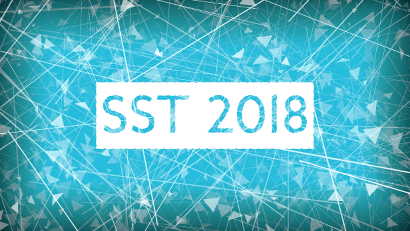
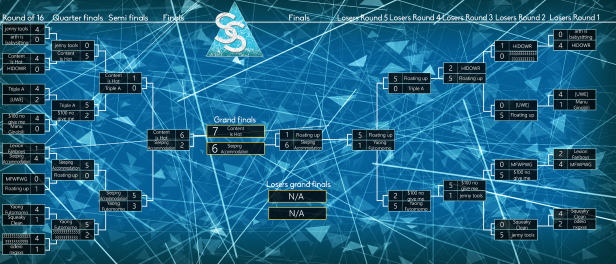
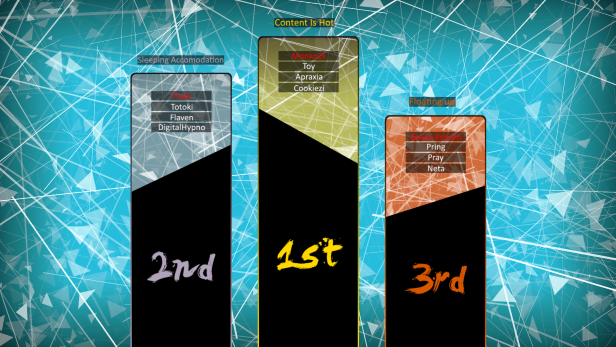

# SS Tournament 2018

The **SS Tournament 2018** (***SST 2018***) was a 3v3 open-rank double-elimination osu! tournament organised by ::{ flag=CA }:: [Sparhten](https://osu.ppy.sh/users/7601720), ::{ flag=US }:: [NeonLights](https://osu.ppy.sh/users/5277199), and ::{ flag=DE }:: [FrozenPheonix](https://osu.ppy.sh/users/9696149). It was the second instalment of the SS Tournament.

## Tournament schedule

| Event | Timestamp |
| --: | :-- |
| Registration phase | 2018-01-02/2018-01-20 |
| Qualifiers | 2018-01-27/2018-01-28 |
| Group stage | 2018-02-02/2018-02-04 |
| Round of 16 and Losers round 1 | 2018-02-16/2018-02-18 |
| Quarterfinals and Losers round 2 | 2018-02-23/2018-02-25 |
| Semifinals and Losers round 3 | 2018-03-02/2018-03-04 |
| Finals and Losers round 4 & 5 | 2018-03-09/2018-03-11 |
| Grand Finals | 2018-03-16/2018-03-18 |

## Prizes

The SS Tournament 2018 had a prize pool of USD 200.

| Placing | Prize(s) |
| :-: | :-- |
|  | 50% of total prize pool, unique profile badge |
|  | 30% of total prize pool |
|  | 20% of total prize pool |

## Organisation

| Position | Member(s) |
| --: | :-- |
| Host | ::{ flag=CA }:: [Sparhten](https://osu.ppy.sh/users/7601720), ::{ flag=US }:: [NeonLights](https://osu.ppy.sh/users/5277199), ::{ flag=DE }:: [FrozenPheonix](https://osu.ppy.sh/users/9696149) |
| Head of staff | ::{ flag=US }:: [Californian](https://osu.ppy.sh/users/4994598), ::{ flag=CA }:: [HaruHong](https://osu.ppy.sh/users/2971423), ::{ flag=US }:: [dblade](https://osu.ppy.sh/users/4272841), ::{ flag=FR }:: [Kasumii-sama](https://osu.ppy.sh/users/6177263) |
| Head of mappools | ::{ flag=BR }:: [Dada](https://osu.ppy.sh/users/9119507), ::{ flag=US }:: [\_p0ke\_](https://osu.ppy.sh/users/5434711) |
| Mappool selector | ::{ flag=US }:: [Nightlys](https://osu.ppy.sh/users/7094489), ::{ flag=CA }:: [Anopob](https://osu.ppy.sh/users/728332), ::{ flag=US }:: [ailv](https://osu.ppy.sh/users/6933054) |
| Referee | ::{ flag=US }:: [KuraresaCupcake](https://osu.ppy.sh/users/6953271), ::{ flag=US }:: [noctisv_v](https://osu.ppy.sh/users/6775083), ::{ flag=US }:: [clayton](https://osu.ppy.sh/users/3666350), ::{ flag=HK }:: [-GN Junior](https://osu.ppy.sh/users/3901754), ::{ flag=PH }:: [Deadpulse](https://osu.ppy.sh/users/8575527), ::{ flag=CA }:: [ImNotBrandon](https://osu.ppy.sh/users/6917313) |
| Streamer | ::{ flag=CA }:: [xenonius](https://osu.ppy.sh/users/7426260), ::{ flag=NL }:: [cavoeboy](https://osu.ppy.sh/users/7361815) |
| Commentator | ::{ flag=FR }:: [SiYes](https://osu.ppy.sh/users/8868144), ::{ flag=CA }:: [xenonius](https://osu.ppy.sh/users/7426260), ::{ flag=AU }:: [AmateurMonkeyYT](https://osu.ppy.sh/users/8379046) |
| Statistician | ::{ flag=US }:: [YoshiLover456](https://osu.ppy.sh/users/6843383) |

## Links

- [Discussion thread](https://osu.ppy.sh/community/forums/topics/684960)
- **[Statistics sheet](https://docs.google.com/spreadsheets/d/e/2PACX-1vTuQuDZWKprRs_wKi235lawGj9SvdL4mvqjZJrPc9Mk0lDSbJypoDDJxg8tgPysaPyRowXcnol9A3HA/pubhtml)**

## Participants

| Team | Members |
| :-- | :-- |
| !roll | ::{ flag=IL }:: [Xilver](https://osu.ppy.sh/users/3099689), ::{ flag=CA }:: [Toke](https://osu.ppy.sh/users/2601166), ::{ flag=CA }:: [Kaifin](https://osu.ppy.sh/users/2596942), ::{ flag=US }:: [Ritzeh](https://osu.ppy.sh/users/1028387) |
| Content is Hot | ::{ flag=US }:: [Apraxia](https://osu.ppy.sh/users/4194445), ::{ flag=US }:: [Monko2k](https://osu.ppy.sh/users/4852013), ::{ flag=US }:: [Toy](https://osu.ppy.sh/users/2757689), ::{ flag=JP }:: [Cookiezi](https://osu.ppy.sh/users/124493) |
| Anime was a mistake | ::{ flag=PL }:: [Ayke](https://osu.ppy.sh/users/6384590), ::{ flag=PL }:: [Alien](https://osu.ppy.sh/users/4743869), ::{ flag=DE }:: [- Tanakimaru -](https://osu.ppy.sh/users/7233153), ::{ flag=PL }:: [Nexo C17H17Cl2n](https://osu.ppy.sh/users/6951719) |
| Happy New YEAR | ::{ flag=FR }:: [Clamati](https://osu.ppy.sh/users/9049282), ::{ flag=FR }:: [Vakeros](https://osu.ppy.sh/users/5224889), ::{ flag=FR }:: [Kaishen](https://osu.ppy.sh/users/7742208) |
| Cool Grills | ::{ flag=CL }:: [[-Neon-]](https://osu.ppy.sh/users/6064382), ::{ flag=CL }:: [Yumbtah](https://osu.ppy.sh/users/2784663), ::{ flag=US }:: [Megatron is bad](https://osu.ppy.sh/users/2570828), ::{ flag=NL }:: [Lazer](https://osu.ppy.sh/users/1799925) |
| 333333333333333333333333 | ::{ flag=US }::[Squilly](https://osu.ppy.sh/users/4681578), ::{ flag=US }:: [Aireu](https://osu.ppy.sh/users/4681578), ::{ flag=US }::[he rack](https://osu.ppy.sh/users/2644828), ::{ flag=US }:: [fieryerage](https://osu.ppy.sh/users/3533958) |
| Lexion Fanboys | ::{ flag=HU }::[Lexion](https://osu.ppy.sh/users/5271371), ::{ flag=HU }:: [RatinA0](https://osu.ppy.sh/users/3436625), ::{ flag=HU }:: [csaba21123](https://osu.ppy.sh/users/7764237), ::{ flag=HU }:: [Jugment](https://osu.ppy.sh/users/3727686) |
| ReedBestPlayerAndNoobTeam | ::{ flag=SE }:: [Reedkatt](https://osu.ppy.sh/users/8335950), ::{ flag=US }:: [Its Wicked](https://osu.ppy.sh/users/7250583), ::{ flag=US }:: [Mercyremix](https://osu.ppy.sh/users/9145865) |
| Free Flowing Gongs | ::{ flag=GB }:: [meltz](https://osu.ppy.sh/users/6741042), ::{ flag=GB }:: [Morbid](https://osu.ppy.sh/users/6963690), ::{ flag=GB }:: [Obese](https://osu.ppy.sh/users/3937808) |
| Holy Saints | ::{ flag=RU }:: [beyondpb](https://osu.ppy.sh/users/9903584) ::{ flag=RU }:: [OnePixel1](https://osu.ppy.sh/users/7124962), ::{ flag=RU }:: [Stevci](https://osu.ppy.sh/users/8601136), ::{ flag=RU }:: [Peastro](https://osu.ppy.sh/users/8283149) |
| Kotyatki | ::{ flag=RU }:: [kTN](https://osu.ppy.sh/users/7050137), ::{ flag=RU }:: [SadnessWillSear](https://osu.ppy.sh/users/6591496), ::{ flag=UA }:: [LimyY](https://osu.ppy.sh/users/7855006), ::{ flag=RU }:: [Avernus](https://osu.ppy.sh/users/4405325) |
| CaptainKiznaryTech | ::{ flag=EE }:: [Kizmah](https://osu.ppy.sh/users/8325847), ::{ flag=US }:: [CaptainEChan](https://osu.ppy.sh/users/9536977), ::{ flag=GB }:: [Binarytech](https://osu.ppy.sh/users/9801778) |
| EROLOLI | ::{ flag=CA }:: [[ Haruka-chan ]](https://osu.ppy.sh/users/2445727), ::{ flag=CA }:: [erOL0liSENSei](https://osu.ppy.sh/users/2077668), ::{ flag=US }:: [Poofin](https://osu.ppy.sh/users/2237979) |
| mode is a loli | ::{ flag=US }:: [- M o D e -](https://osu.ppy.sh/users/4580287), ::{ flag=US }:: [-Tynamo](https://osu.ppy.sh/users/3638962), ::{ flag=US }:: [trey-](https://osu.ppy.sh/users/8784747), ::{ flag=US }:: [conradmittn](https://osu.ppy.sh/users/8208289) |
| Yaong Futomomo | ::{ flag=KR }:: [Yaong](https://osu.ppy.sh/users/1883865), ::{ flag=JP }:: [Shirasaka Koume](https://osu.ppy.sh/users/3062998), ::{ flag=JP }:: [Angel Arrow](https://osu.ppy.sh/users/1970239), ::{ flag=JP }:: [benki](https://osu.ppy.sh/users/1021944) |
| Triple A | ::{ flag=PL }:: [WubWoofWolf](https://osu.ppy.sh/users/39828), ::{ flag=PL }:: [Rafis](https://osu.ppy.sh/users/2558286), ::{ flag=GB }:: [Bubbleman](https://osu.ppy.sh/users/5182050) |
| arth is babysitting | ::{ flag=US }:: [arth](https://osu.ppy.sh/users/3600549), ::{ flag=US }:: [chezbananas](https://osu.ppy.sh/users/7941423), ::{ flag=US }:: [explosionboom](https://osu.ppy.sh/users/4681410), ::{ flag=US }:: [[Xenon]](https://osu.ppy.sh/users/3638099) |
| odeio nxgxxs | ::{ flag=BR }:: [favela](https://osu.ppy.sh/users/5295743), ::{ flag=BR }:: [Texats](https://osu.ppy.sh/users/1638293), ::{ flag=IL }:: [MrPotato](https://osu.ppy.sh/users/2787415), ::{ flag=NL }:: [GiraffekNuL](https://osu.ppy.sh/users/3506793) |
| Dream XD | ::{ flag=CL }:: [-Natezi](https://osu.ppy.sh/users/5990099), ::{ flag=CL }:: [Lasseh](https://osu.ppy.sh/users/4881251), ::{ flag=CL }:: [Crissa](https://osu.ppy.sh/users/5405836) |
| HalfPing | ::{ flag=AU }:: [GranDSenpai](https://osu.ppy.sh/users/3997580), ::{ flag=AU }:: [Ezipie](https://osu.ppy.sh/users/5978907), ::{ flag=AU }:: [TheOmyNomy](https://osu.ppy.sh/users/4241054), ::{ flag=AU }:: [Rairiku](https://osu.ppy.sh/users/4945688) |
| Sleeping Accommodation | ::{ flag=TW }:: [Flask](https://osu.ppy.sh/users/959763), ::{ flag=CN }:: [Totoki](https://osu.ppy.sh/users/557197), ::{ flag=FR }:: [Flaven](https://osu.ppy.sh/users/3213239), ::{ flag=US }:: [DigitalHypno](https://osu.ppy.sh/users/4384207) |
| Sad Nibba Association | ::{ flag=EG }:: [Alfonso](https://osu.ppy.sh/users/7522642), ::{ flag=EG }:: [ScrimShaw5](https://osu.ppy.sh/users/6534461), ::{ flag=EG }:: [Joeeey](https://osu.ppy.sh/users/8784360) |
| Vladimir Putin | ::{ flag=RU }:: [koteyka20](https://osu.ppy.sh/users/7665175), ::{ flag=RU }:: [YaVOR](https://osu.ppy.sh/users/3235892), ::{ flag=RU }:: [Byrilo](https://osu.ppy.sh/users/5347067), ::{ flag=RU }:: [Chayokkofeyok](https://osu.ppy.sh/users/9199948) |
| Da Wae | ::{ flag=US }:: [mindovermanners](https://osu.ppy.sh/users/10028891), ::{ flag=US }:: [Setnom](https://osu.ppy.sh/users/6261488), ::{ flag=US }:: [Nefariouz](https://osu.ppy.sh/users/7673312) |
| MinecraftDabMod | ::{ flag=US }:: [Gifted](https://osu.ppy.sh/users/7971757), ::{ flag=US }:: [ryyushi](https://osu.ppy.sh/users/6014327), ::{ flag=US }:: [WillCookie](https://osu.ppy.sh/users/6404488), ::{ flag=PH }:: [HaruTachi-](https://osu.ppy.sh/users/6244066) |
| Marbs | ::{ flag=NO }:: [Reddd](https://osu.ppy.sh/users/8379270), ::{ flag=US }:: [Naaise](https://osu.ppy.sh/users/10531760), ::{ flag=CA }:: [[Lethal]](https://osu.ppy.sh/users/9165981), ::{ flag=SE }:: [MangeHD](https://osu.ppy.sh/users/8553070) |
| caipirinha hamburger | ::{ flag=BR }:: [Tell](https://osu.ppy.sh/users/2125109), ::{ flag=BR }:: [Mystia](https://osu.ppy.sh/users/4277702), ::{ flag=US }:: [Woey](https://osu.ppy.sh/users/3792472), ::{ flag=BR }:: [Sickoh](https://osu.ppy.sh/users/5411474) |
| Noobs1337_ | ::{ flag=RU }:: [Darko234](https://osu.ppy.sh/users/11062478), ::{ flag=KZ }:: [Sagas08](https://osu.ppy.sh/users/9588965), ::{ flag=RU }:: [MrNobody1337s](https://osu.ppy.sh/users/10056827) |
| nada | ::{ flag=MX }:: [Trooper-](https://osu.ppy.sh/users/7301672), ::{ flag=GB }:: [-Kisaki](https://osu.ppy.sh/users/7305067), ::{ flag=US }:: [Butlergunner](https://osu.ppy.sh/users/6031237), ::{ flag=US }:: [Frost](https://osu.ppy.sh/users/4182788) |
| carpal tunnels | ::{ flag=US }:: [IBhop](https://osu.ppy.sh/users/8222901) |
| very nice | ::{ flag=US }:: [-Revoh](https://osu.ppy.sh/users/8165181), ::{ flag=US }:: [Tommicrayon](https://osu.ppy.sh/users/4090133), ::{ flag=FR }:: [Carbone](https://osu.ppy.sh/users/5783315) |
| Floating up | ::{ flag=KR }:: [Gomo Pslvarh](https://osu.ppy.sh/users/1206417), ::{ flag=KR }:: [Pring](https://osu.ppy.sh/users/3478883), ::{ flag=KR }:: [Pray](https://osu.ppy.sh/users/2190336), ::{ flag=KR }:: [Neta](https://osu.ppy.sh/users/832084) |
| $100 no give me | ::{ flag=SG }::[Nakano-](https://osu.ppy.sh/users/1893953), ::{ flag=SG }:: [Elegant Loli](https://osu.ppy.sh/users/3010281), ::{ flag=SG }:: [GSBlank](https://osu.ppy.sh/users/2312106), ::{ flag=HK }:: [Koltay](https://osu.ppy.sh/users/4787843) |
| Acchu ma Seishun | ::{ flag=BE }:: [5joshi](https://osu.ppy.sh/users/4279650), ::{ flag=BE }:: [Jodehh-](https://osu.ppy.sh/users/6471366), ::{ flag=BE }:: [Bastia](https://osu.ppy.sh/users/3355362), ::{ flag=NO }:: [- Markus -](https://osu.ppy.sh/users/8414284) |
| Los Sudacas #GAMERS | ::{ flag=PE }:: [Arnold24x24](https://osu.ppy.sh/users/2291265), ::{ flag=CL }:: [Kumagai Eri](https://osu.ppy.sh/users/5339515), ::{ flag=CO }:: [Fiorela](https://osu.ppy.sh/users/8065626), ::{ flag=CO }:: [crisco13](https://osu.ppy.sh/users/3562488) |
| MFWPTG | ::{ flag=US }:: [Corim](https://osu.ppy.sh/users/4242767), ::{ flag=US }:: [Exarch](https://osu.ppy.sh/users/5370153), ::{ flag=US }:: [Noname0](https://osu.ppy.sh/users/280147), ::{ flag=CA }:: [ChronoNig](https://osu.ppy.sh/users/3545323) |
| `discord.gg/hhVMaZ4 | ::{ flag=TH }:: [Trigonoculus](https://osu.ppy.sh/users/7627013), ::{ flag=SG }:: [moosepi](https://osu.ppy.sh/users/1868745), ::{ flag=ID }:: [Landegre-](https://osu.ppy.sh/users/3654630), ::{ flag=SG }:: [Jolene](https://osu.ppy.sh/users/2672025) |
| Die Augen | ::{ flag=DE }:: [Refrum](https://osu.ppy.sh/users/7064509), ::{ flag=DE }:: [Auge](https://osu.ppy.sh/users/7115794), ::{ flag=DE }:: [Xenorin](https://osu.ppy.sh/users/6759462), ::{ flag=DE }:: [tagorin](https://osu.ppy.sh/users/7243516) |
| Pszne Rzybki | ::{ flag=PL }:: [MajsterDeeJay](https://osu.ppy.sh/users/6329597), ::{ flag=PL }:: [-Mario-](https://osu.ppy.sh/users/4950514), ::{ flag=PL }:: [Hatiso](https://osu.ppy.sh/users/9011751), ::{ flag=PL }:: [LowAccDeadMan](https://osu.ppy.sh/users/8417559) |
| Jorge | ::{ flag=BR }:: [- Emerald](https://osu.ppy.sh/users/6488891), ::{ flag=BR }:: [Crimson Dragon](https://osu.ppy.sh/users/5085555), ::{ flag=BR }:: [Astris](https://osu.ppy.sh/users/6173856) |
| Adrenaline Rush | ::{ flag=CA }:: [Xoul](https://osu.ppy.sh/users/7856835), ::{ flag=US }:: [[ Scarlet Red ]](https://osu.ppy.sh/users/3257340), ::{ flag=US }:: [Arsene](https://osu.ppy.sh/users/4427983), ::{ flag=US }:: [Tobirama Senju](https://osu.ppy.sh/users/3188127) |
| gommehd.net | ::{ flag=DE }:: [[Swegloerd]](https://osu.ppy.sh/users/7382962), ::{ flag=DE }:: [Amanion](https://osu.ppy.sh/users/7382973), ::{ flag=DE }:: [prhtnsm](https://osu.ppy.sh/users/6702666), ::{ flag=DE }:: [Sandwich](https://osu.ppy.sh/users/7528409) |
| jenny tools | ::{ flag=RO }:: [Chamosiala](https://osu.ppy.sh/users/1469892), ::{ flag=LT }:: [Auji](https://osu.ppy.sh/users/4114438), ::{ flag=ES }:: [yotampoco](https://osu.ppy.sh/users/7073613), ::{ flag=IT }:: [Koba](https://osu.ppy.sh/users/4448118) |
| interatlantic baguettes | ::{ flag=CA }:: [DivineRose](https://osu.ppy.sh/users/8151359), ::{ flag=FR }:: [Hichinoro](https://osu.ppy.sh/users/5410051), ::{ flag=GB }:: [Cornfield](https://osu.ppy.sh/users/4087422) |
| Tsutaerarenakatta | ::{ flag=PL }:: [Reifa](https://osu.ppy.sh/users/5725033), ::{ flag=PL }:: [-Sylvari](https://osu.ppy.sh/users/3493804), ::{ flag=PL }:: [Cypriane](https://osu.ppy.sh/users/7703578), ::{ flag=PL }:: [ChainedTomb](https://osu.ppy.sh/users/4966523) |
| Squeaky clean | ::{ flag=MX }:: [Janssen](https://osu.ppy.sh/users/2279351), ::{ flag=US }:: [mniminwoo](https://osu.ppy.sh/users/3929529), ::{ flag=MX }:: [-Hebel-](https://osu.ppy.sh/users/6169483), ::{ flag=US }:: [Mlaw22](https://osu.ppy.sh/users/3126596) |
| 669955 | ::{ flag=CA }:: [alkalde](https://osu.ppy.sh/users/7314046), ::{ flag=CA }:: [-Kurisu](https://osu.ppy.sh/users/4192842), ::{ flag=US }:: [WagnerWarrior](https://osu.ppy.sh/users/4149140) |
| \[UWE\] | ::{ flag=DE }:: [hallowatcher](https://osu.ppy.sh/users/1874761), ::{ flag=DE }:: [Vyshus](https://osu.ppy.sh/users/7812798), ::{ flag=DE }:: [Veth](https://osu.ppy.sh/users/1715441), ::{ flag=DE }:: [Risiing](https://osu.ppy.sh/users/2282047) |
| Imperium | ::{ flag=RU }:: [ABERON](https://osu.ppy.sh/users/7133185), ::{ flag=RU }:: [zin](https://osu.ppy.sh/users/7447249), ::{ flag=RU }:: [_Forse](https://osu.ppy.sh/users/7236909), ::{ flag=RU }:: [Sawagi](https://osu.ppy.sh/users/8768283) |
| Bildungsabwendungspramie | ::{ flag=PL }:: [_demo](https://osu.ppy.sh/users/3556891), ::{ flag=PL }:: [Malolat](https://osu.ppy.sh/users/4317480), ::{ flag=PL }:: [Wakson](https://osu.ppy.sh/users/3048222), ::{ flag=PL }:: [c00kiezechy](https://osu.ppy.sh/users/2225267) |
| BonelessCarry | ::{ flag=CA }:: [Joryan_Inkling](https://osu.ppy.sh/users/8240995), ::{ flag=US }:: [mcgen](https://osu.ppy.sh/users/5353025), ::{ flag=US }:: [Veniry](https://osu.ppy.sh/users/8990259), ::{ flag=LV }:: [rih23](https://osu.ppy.sh/users/9883508) |
| Manu Ginobili | ::{ flag=US }:: [Conyoh](https://osu.ppy.sh/users/4844496), ::{ flag=US }:: [SlimeDrippy](https://osu.ppy.sh/users/6119147), ::{ flag=AR }:: [Pein](https://osu.ppy.sh/users/2212941), ::{ flag=AR }:: [Enhu](https://osu.ppy.sh/users/2840499) |
| Meme team | ::{ flag=FR }:: [SiYes](https://osu.ppy.sh/users/8868144), ::{ flag=FR }:: [Spartan Plume](https://osu.ppy.sh/users/2553166), ::{ flag=PL }:: [MechJar](https://osu.ppy.sh/users/7527282) |
| HIDOWR | ::{ flag=RU }:: [-Miruku-](https://osu.ppy.sh/users/4712799), ::{ flag=RU }:: [iok144](https://osu.ppy.sh/users/2171652), ::{ flag=RU }:: [Enns](https://osu.ppy.sh/users/6375834) |
| Childhood Issues | ::{ flag=DE }:: [-Hwangbo](https://osu.ppy.sh/users/7467183), ::{ flag=DE }:: [Anroyz](https://osu.ppy.sh/users/1818573), ::{ flag=DE }:: [Shiku](https://osu.ppy.sh/users/3970174), ::{ flag=DE }:: [Shiguri](https://osu.ppy.sh/users/2665207) |
| Sas(so) | ::{ flag=IT }:: [SIMONETRAPANI](https://osu.ppy.sh/users/7329177), ::{ flag=ES }:: [-Hideki-](https://osu.ppy.sh/users/8688804), ::{ flag=IT }:: [_Akio](https://osu.ppy.sh/users/8676866), ::{ flag=IT }:: [-Katsuo-](https://osu.ppy.sh/users/3460798) |

## Podium

## Mappools

### Finals

- NoMod
  1. [nano - Bull's Eye (Depths) [Aria]](https://osu.ppy.sh/beatmapsets/376203#osu/823710)
  2. [BLOOD STAIN CHILD - MOON LIGHT WAVE (Silleth) [Effulgence]](https://osu.ppy.sh/beatmapsets/296543#osu/665787)
  3. [OSTER project - Capriccio of My Mind (7odoa) [Extra]](https://osu.ppy.sh/beatmapsets/107475#osu/281632)
  4. [monet - Kagami no Sekai ni wa Watashi shika Inai -another version- (Mirash) [End sky]](https://osu.ppy.sh/beatmapsets/685725#osu/1451540)
  5. [P*Light - 2 MINUTES FIGHTERS (Regraz) [toybot's MASTER]](https://osu.ppy.sh/beatmapsets/542163#osu/1156568)
  6. [WSTR - Eastbound & Down (HanzeR) [Irre <3 HanzeR]](https://osu.ppy.sh/beatmapsets/598677#osu/1271476)
- DoubleTime
  1. [Goose house - Hikaru nara (ProffesionalBox) [Synethesia]](https://osu.ppy.sh/beatmapsets/440169#osu/947166)
  2. [zts - miragecoordinator (Mirash) [Perversion]](https://osu.ppy.sh/beatmapsets/652668#osu/1383876)
  3. [Susumu Hirasawa - Forces (Card N'FoRcE) [KIRBY Mix]](https://osu.ppy.sh/beatmapsets/20447#osu/72419)
- Hidden
  1. [xi vs sakuzyo - STORIA (Len) [Collab Ultra]](https://osu.ppy.sh/beatmapsets/586622#osu/1260751)
  2. [FOLiACETATE - Heterochromia Iridis (ktgster) [Terror]](https://osu.ppy.sh/beatmapsets/106443#osu/279481)
  3. [Dragonforce - Fury Of The Storm (lesjuh) [Expert]](https://osu.ppy.sh/beatmapsets/10460#osu/40753)
- HardRock
  1. [Mago de Oz - Xanandra (Xanandra) [Insane]](https://osu.ppy.sh/beatmapsets/74313#osu/221026)
  2. [MY FIRST STORY - Fukagyaku Replace (Broccoly) [Weakness]](https://osu.ppy.sh/beatmapsets/383270#osu/837946)
  3. [Camellia - Drumstep4 (Taikuta) [The project file of this song was deleted X\[]](https://osu.ppy.sh/beatmapsets/386979#osu/844722)
- FreeMod
  1. [SawanoHiroyuki[nZk]:Tielle & Gemie - sh0ut (Gaia) [aL†aiR]](https://osu.ppy.sh/beatmapsets/641854#osu/1360912)
  2. [mafumafu - Yuugure Semi Nikki (Axarious) [mawaru, mawaru]](https://osu.ppy.sh/beatmapsets/580936#osu/1229863)
  3. [sasakure.UK - Jack-the-Ripper (Sprosive) [ReMiX]](https://osu.ppy.sh/beatmapsets/23907#osu/94264)
- Tiebreaker
  1. **[Ariabl'eyeS - Kegare Naki Bara Juuji (yf\_bmp) [Twin-Renatic]](https://osu.ppy.sh/beatmapsets/448818#osu/1003565)**

### Semifinals

- NoMod
  1. [Shinigiwa Satellite - Nenten Puranetto (Scarsnic) [A World Without Form]](https://osu.ppy.sh/beatmapsets/605383#osu/1279068)
  2. [Hanatan - Ai no Scenario (Chaoslitz) [Skystar's Extra]](https://osu.ppy.sh/beatmapsets/343365#osu/760743)
  3. [Hakuryu - Genesis At Oasis (MOONLiGHT Mix) (Krimek) [NiNo's Extra]](https://osu.ppy.sh/beatmapsets/500816#osu/1073789)
  4. [Nanahoshi Kangengakudan - anoko dokonoko (kwk) [Extra]](https://osu.ppy.sh/beatmapsets/654452#osu/1387233)
  5. [STEREO DIVE FOUNDATION - Genesis (Akitoshi) [Conviction]](https://osu.ppy.sh/beatmapsets/655970#osu/1389960)
  6. [Nekomata Master+ - squall (RLC) [WIND]](https://osu.ppy.sh/beatmapsets/92052#osu/248991)
- DoubleTime
  1. [senya - Saihate no Kotoba (Satellite) [Ghostly]](https://osu.ppy.sh/beatmapsets/174417#osu/905424)
  2. [Busta Rhymes ft. Linkin Park - We Made It (YGOkid8) [Insane]](https://osu.ppy.sh/beatmapsets/12719#osu/47487)
  3. [zts - resurrectedreplayer (EvilElvis) [Intricate]](https://osu.ppy.sh/beatmapsets/304672#osu/693412)
- Hidden
  1. [maras k - Play Time!! (Reol) [Let's Play]](https://osu.ppy.sh/beatmapsets/345325#osu/762631)
  2. [USAO - Dynamite (W h i t e) [Ultimate]](https://osu.ppy.sh/beatmapsets/621565#osu/1310581)
  3. [SHO - Plain Asia \~ Guardian of the Village (Kite) [Insane]](https://osu.ppy.sh/beatmapsets/26071#osu/88176)
- HardRock
  1. [Primary - Awake (xChippy) [Goodbye]](https://osu.ppy.sh/beatmapsets/308179#osu/689290)
  2. [Streetlight Manifesto - Everything Went Numb (pishifat) [Extra]](https://osu.ppy.sh/beatmapsets/414289#osu/899552)
  3. [Kucchi vs Akki - Yakumo >>JOINT STRUGGLE (Muya) [Another]](https://osu.ppy.sh/beatmapsets/688877#osu/1463054)
- FreeMod
  1. [ONE OK ROCK - Mikansei Koukyoukyoku (Saut) [Extreme]](https://osu.ppy.sh/beatmapsets/348604#osu/768986)
  2. [REDALiCE ft. Ayumi Nomiya - Foughten Field (t+pazolite Remix) (Foreverends) [Ends]](https://osu.ppy.sh/beatmapsets/50777#osu/225296)
  3. [DCX - Flying High (DJ Splash Remix) (yeahyeahyeahhh) [InoSane]](https://osu.ppy.sh/beatmapsets/22194#osu/76663)
- Tiebreaker
  1. **[shoujo byou - Gareki no Shuuon (Kibbleru) [Flore Albo]](https://osu.ppy.sh/beatmapsets/618290#osu/1303380)**

### Quarterfinals

- NoMod
  1. [Suzuki Konomi - Blow out (Kalibe) [Meg's Another]](https://osu.ppy.sh/beatmapsets/617203#osu/1303641)
  2. [Sayuri - Heikousen (Rizia) [Hanabi]](https://osu.ppy.sh/beatmapsets/583370#osu/1234535)
  3. [orangentle / Yu_Asahina - HAELEQUINZ -the clown of 24stairs- (xLolicore-) [Lince's Schizophrenia]](https://osu.ppy.sh/beatmapsets/618645#osu/1306871)
  4. [Delain - Go Away (pishifat) [Extra]](https://osu.ppy.sh/beatmapsets/475676#osu/1016263)
  5. [Getty vs. DJ DiA - Fox4-Raize- (Kaifin) [Doorfin's Extra]](https://osu.ppy.sh/beatmapsets/482552#osu/1097509)
  6. [N-Trance - Destiny (Nightcore Mix) (jericho2442) [MADNESS VER3!!]](https://osu.ppy.sh/beatmapsets/20483#osu/71562)
- DoubleTime
  1. [Yun\*chi - Your song\* (Beomsan) [Your song\*]](https://osu.ppy.sh/beatmapsets/370528#osu/812010)
  2. [07th Expansion - Dread of the Grave (y u c a) [Collab]](https://osu.ppy.sh/beatmapsets/22333#osu/81007)
  3. [Milky Holmes - Future after Rain (digiaria) [Insane]](https://osu.ppy.sh/beatmapsets/20655#osu/79798)
- Hidden
  1. [ayaponzu\* - Yakubyougami (Pho) [Collab Extra]](https://osu.ppy.sh/beatmapsets/501001#osu/1495657)
  2. [Reol & nqrse - Ooedo Ranvu (Pho) [Wild Dance]](https://osu.ppy.sh/beatmapsets/357544#osu/833389)
  3. [a\*ru - Kizuato (Halfslashed) [Extra Stage]](https://osu.ppy.sh/beatmapsets/569843#osu/1207948)
- HardRock
  1. [EGOIST - Fallen (jonathanlfj) [Extra]](https://osu.ppy.sh/beatmapsets/232052#osu/538930)
  2. [Traktion - Gid V (Nhawak) [Asphyxia's Extra]](https://osu.ppy.sh/beatmapsets/285249#osu/793350)
  3. [Street - Sakura Fubuki (Cherry Blossom) [Sakura no Hana]](https://osu.ppy.sh/beatmapsets/362989#osu/797108)
- FreeMod
  1. [TK from Ling tosite sigure - haze (Ametrin) [Extra]](https://osu.ppy.sh/beatmapsets/568305#osu/1204502)
  2. [xi - Halcyon (gowww) [Another]](https://osu.ppy.sh/beatmapsets/20871#osu/73699)
  3. [Yousei Teikoku - Hades: The rise (Delis) [Extra]](https://osu.ppy.sh/beatmapsets/662526#osu/1403588)
- Tiebreaker
  1. **[LiSA - Rising Hope (LU-I Remix) (Ohwow) [Irregularity]](https://osu.ppy.sh/beatmapsets/561679#osu/1420353)**

### Round of 16

- NoMod
  1. [Eiko Shimamiya - Higurashi no Naku Koro ni (Okorin) [Extra]](https://osu.ppy.sh/beatmapsets/333543#osu/738088)
  2. [EYKHA (CV : Sawashiro Miyuki) LOU (CV : Uchida Maaya) MERYL (CV : Terui Haruka) - Delta Decision (Sotarks) [Linada's Extra]](https://osu.ppy.sh/beatmapsets/494606#osu/1097612)
  3. [Suzaku - Anisakis -somatic mutation type"Forza" (ouranhshc) [Ultra]](https://osu.ppy.sh/beatmapsets/60521#osu/199593)
  4. [Megpoid GUMI - Cosmos (val0108) [Cosmos]](https://osu.ppy.sh/beatmapsets/37054#osu/123374)
  5. [LeaF - Evanescent (Anxient) [Extra]](https://osu.ppy.sh/beatmapsets/440997#osu/950963)
  6. [Nico Nico Douga - Owens (AngelHoney) [Another]](https://osu.ppy.sh/beatmapsets/20406#osu/72469)
- DoubleTime
  1. [Pile, Mimori Suzuko, Nanjo Yoshino - soldier game (ZZHBOY) [Insane]](https://osu.ppy.sh/beatmapsets/212091#osu/498711)
  2. [T.M.Revolution - FLAGS (P A N) [Euny's Hard]](https://osu.ppy.sh/beatmapsets/395160#osu/864204)
  3. [Komine Lisa - Resuscitated Hope (Okorin) [Insane]](https://osu.ppy.sh/beatmapsets/347023#osu/765880)
- Hidden
  1. [baker - Kimi ga Kimi ga -vocanico remix- (jonathanlfj) [Extra]](https://osu.ppy.sh/beatmapsets/682595#osu/1443510)
  2. [FLOOR LEGENDS -KAC 2012- - KAC 2012 ULTIMATE MEDLEY -HISTORIA SOUND VOLTEX- (Gamu) [N a s y a's INFINITE]](https://osu.ppy.sh/beatmapsets/296505#osu/682020)
  3. [Wayne Lytle - Pipe Dream (Tanmak) [Insane]](https://osu.ppy.sh/beatmapsets/9850#osu/38912)
- HardRock
  1. [Nitta Emi - White Eternity (Sellenite) [AstralAir]](https://osu.ppy.sh/beatmapsets/276963#osu/645342)
  2. [An - artcore JINJA (Flower) [Lunatic]](https://osu.ppy.sh/beatmapsets/114987#osu/297411)
  3. [UNDEAD CORPORATION - In the Night Where the Kasha Screamed (Blackiez) [Insane]](https://osu.ppy.sh/beatmapsets/1079140#osu/2257875)
- FreeMod
  1. [Amatsuki - Higurashi Moratorium (HelloSCV) [Frobe's Extra]](https://osu.ppy.sh/beatmapsets/94506#osu/254370)
  2. [UNDEAD CORPORATION - Everything will freeze (Ekoro) [Lunatic]](https://osu.ppy.sh/beatmapsets/158023#osu/553131)
  3. [Myrath - Endure The Silence (LMT) [BOUYAAA's Extra]](https://osu.ppy.sh/beatmapsets/555454#osu/1303812)
- Tiebreaker
  1. **[Taishi - Aviator in the Soul (-Tochi) [Endurance]](https://osu.ppy.sh/beatmapsets/675666#osu/1429225)**

### Group stage

- NoMod
  1. [GARNiDELiA - ambiguous (captin1) [Insane]](https://osu.ppy.sh/beatmapsets/303867#osu/680886)
  2. [Mind Vortex - Arc (Natteke) [NSane]](https://osu.ppy.sh/beatmapsets/87509#osu/239037)
  3. [sakuzyo - VALLISTA (Shiirn) [Another]](https://osu.ppy.sh/beatmapsets/40056#osu/127313)
  4. [B-ko(Cv:Touyama Nao) - Nisemono Chuuihou (Musty) [Insane]](https://osu.ppy.sh/beatmapsets/531751#osu/1253351)
  5. [Mediks - Doomsday (Strategas) [Insane]](https://osu.ppy.sh/beatmapsets/545677#osu/1290316)
  6. [Dark PHOENiX - Taketori Hishou (KanbeKotori) [Extra]](https://osu.ppy.sh/beatmapsets/22276#osu/86324)
- DoubleTime
  1. [Two Steps From Hell - Star Sky (Wishkey) [Unstoppable]](https://osu.ppy.sh/beatmapsets/601657#osu/1270965)
  2. [Petit Rabbit's - No Poi!(nenpulse bootleg remix) (Skystar) [YakiBoss's Hard]](https://osu.ppy.sh/beatmapsets/414348#osu/937188)
  3. [Chata - Koi wo Shiyouyo (goodbye) [Insane]](https://osu.ppy.sh/beatmapsets/23787#osu/81200)
- Hidden
  1. [Kano - Yuudachi no Ribbon (moph) [Dailycare's Insane]](https://osu.ppy.sh/beatmapsets/456237#osu/1078420)
  2. [Renard - Terminal (nold\_1702) [Ends' Insane]](https://osu.ppy.sh/beatmapsets/102282#osu/270363)
  3. [Ne;on & Haiji - Haruka Tooki Gensoukyo - Dream of fantasy (Kanon) [lkp's Lunatic]](https://osu.ppy.sh/beatmapsets/29780#osu/106475)
- HardRock
  1. [Rchetype - V Is For (Blue Dragon) [Insane]](https://osu.ppy.sh/beatmapsets/111914#osu/290919)
  2. [MOMOIRO CLOVER Z - SARABA ITOSHIKI KANASHIMI TACHIYO (Sellenite) [Master]](https://osu.ppy.sh/beatmapsets/215977#osu/507098)
  3. [Sota Fujimori - Move That Body -Extended Mix- (Amamiya Yuko) [RLC's Insane]](https://osu.ppy.sh/beatmapsets/220220#osu/547229)
- FreeMod
  1. [Kozato Snow - Izayoi Sakura (Mystica) [Insane]](https://osu.ppy.sh/beatmapsets/25491#osu/86352)
  2. [iojjj - Deus Ex Machina (Okoratu) [EXTRA]](https://osu.ppy.sh/beatmapsets/107747#osu/688907)
  3. [Mutsuhiko Izumi - Red Goose (nold\_1702) [Another]](https://osu.ppy.sh/beatmapsets/46239#osu/144028)
- Tiebreaker
  1. **[Demetori - The Grimoire of Alice ~ Alice in Wonderland (sjoy) [Lolis]](https://osu.ppy.sh/beatmapsets/277279#osu/628369)**

### Qualifiers

- NoMod
  1. [Ceui - COLORFUL DAYS!! (SamiPale) [Insane]](https://osu.ppy.sh/beatmapsets/70744#osu/203315)
  2. [Mastermind(xi+nora2r) - Dreadnought (Cherry Blossom) [Another]](https://osu.ppy.sh/beatmapsets/361306#osu/813331)
  3. [Function Phantom - Euclid (byfar) [toybot's Insane]](https://osu.ppy.sh/beatmapsets/419614#osu/971086)
- DoubleTime
  1. [Duca - Clover (Cilvery) [Collab]](https://osu.ppy.sh/beatmapsets/51515#osu/157856)
  2. [Icon For Hire - Make A Move (wajinshu) [Hard]](https://osu.ppy.sh/beatmapsets/506483#osu/1077369)
- Hidden
  1. [Dreamcatcher - Sleep-walking (Natsu) [Insane]](https://osu.ppy.sh/beatmapsets/645655#osu/1370703)
  2. [yuiko - petit bonheur (Lasse) [Insane.]](https://osu.ppy.sh/beatmapsets/627354#osu/1327955)
- HardRock
  1. [ALiCE'S EMOTiON - Dark Flight Dreamer (Sakaue Nachi) [Twaoi's Insane]](https://osu.ppy.sh/beatmapsets/185250#osu/763294)
  2. [Otokaze - Karen (Short Ver.) (spboxer3) [Hanabi]](https://osu.ppy.sh/beatmapsets/50177#osu/154357)

## Ruleset

### General info

- Teams may consist of 4 Members.
- There is no rank range the higher the rank (1 being highest) the more likely you are to avoid being cut off from a rank cut off of overflow sign ups.
- Seeding will take into account all Players PP (formula being `<Member 1 PP> + <Member 2 PP> + … / <# of players on team>`).
- The tournament will be held in 3v3 double-elimination format with Groups having one top high mid low and bottom seed selected from the tournament drawings client.
- Brackets will then be made with the top placing team in group A vs the second top placing seed in group H, the second seed of group A facing the top placing team of group A, Group B will match up G and so fourth.
- The matches will be played using Score V2 and TeamVS.
- Map pools will be released The Monday before the stage starts.
- Teams must reschedule 12 Hours in Advance to the start of the current stage. If for whatever reason a team needs to reschedule during the stage, it will be done on a case by case basis with the opposing team being prioritized if a reschedule cannot be arranged.
- Staff is not allowed to play excluding commentators and streamers.
- Group Stage Matches will be best of 5.
- Round of 16 will be best of 7.
- Quarter Finals and Semi Finals will be best of 9.
- Finals will be best of 11.
- Grand Finals will be best of 13.
- In the case of a tie in group stage, team advancement will be based off a team's `[map wins - map losses = Points]` where higher points advance. If the score is equal, the score of Team A Vs Team B will be taken into account, i.e. Team A and Team B both have 6 wins and 6 losses, but Team A beat Team B 3-2 Team A will advance. If there is still a tie it will be average score difference gathered by the formula `[Team A's scores of all played maps - All opposing teams scores / maps played]`. If there is still a tie after this, it will be based off seeding.

### Match rules

1. The designated referee will have the lobby open using the format SST: (blue team) vs. (red team).
2. The referee will message the team captains or anyone online from the team.
3. Teams will join here. Once all 6 players are in the referee will ask for their warm ups. Order in which they are played is irrelevant. (this step is skipped for group stages).
4. Both teams will user `!roll`, the higher number rolled will be the team who will ban first.
5. Both teams will alternate banning maps until both teams have banned out 2 maps.
6. The team that lost the roll is the team that picks first and it it alternates from there.
   - Example: BLUE rolls 67 RED rolls 10 the order would be `Blue BAN Red BAN  Blue BAN Red BAN : Red MAP Blue MAP Red MAP Blue MAP …`
7. Teams have 60 seconds to pick a map and 120 seconds to ready up.
8. Referees will use `!mp timer` to keep time.
9. If a team doesn't pick in the first 60 seconds, the opposing team will pick instead.
10. If the players are not ready after 120 seconds, the referee will at their discretion start the match. *Referees are in full control of any leniency here and may choose not to enforce this until Semifinals at which point enforcement will be mandatory*.
11. Once a map has been picked and everyone is ready the map will start after 5 seconds using `!mp start 5`.
12. If a player disconnects within the first 15 seconds of a map the referee will abort the match and the map will be restarted. Anyone found abusing this will be disqualified from the tournament. This may only happen once per team per match after the first dc the referee is not to abort.
