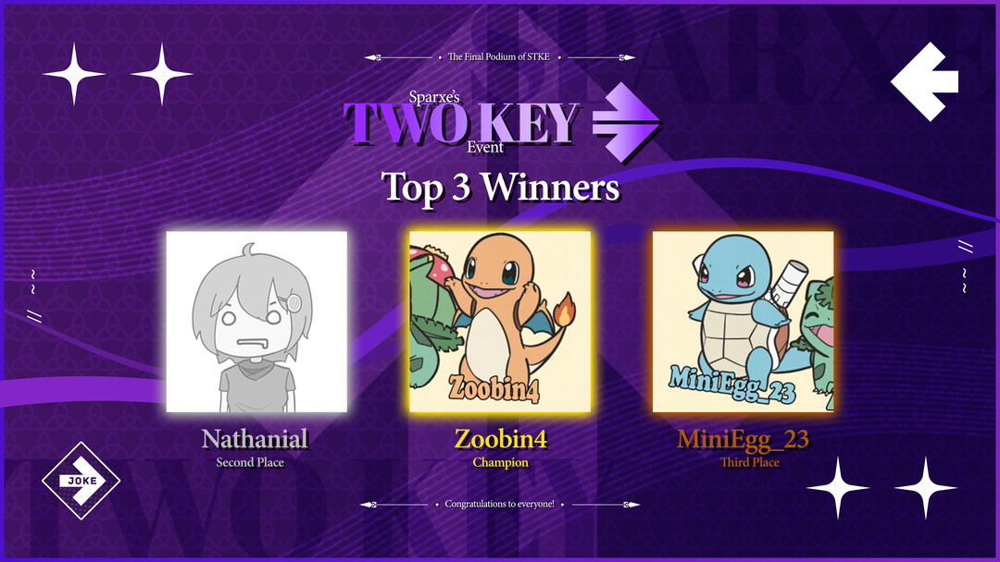

---
tags:
  - STKE
---

# Sparxe's Two Key Event

**Sparxe's Two Key Event** (***STKE***) was a 1v1, double-elimination, global osu!mania 2-key tournament hosted by ::{ flag=NZ }:: [Sparxe](https://osu.ppy.sh/users/5750235) and ::{ flag=US }:: [Sydosys](https://osu.ppy.sh/users/17523947).

## Tournament schedule

| Event | Timestamp |
| --: | :-- |
| Registration phase | 2024-10-05/2024-10-18 |
| Screening phase | 2024-10-19/2024-11-01 |
| Qualifiers showcase | 2024-10-27 |
| Qualifiers | 2024-11-02/2024-11-03 |
| Round of 32 | 2024-11-09/2024-11-10 |
| Round of 16 | 2024-11-16/2024-11-17 |
| Quarterfinals | 2024-11-23/2024-11-24 |
| Semifinals | 2024-11-30/2024-12-01 |
| Finals | 2024-12-07/2024-12-08 |
| Grand Finals | 2024-12-14/2024-12-15 |

## Prizes

| Placing | Prize(s) |
| :-: | :-- |
|  | Profile badge |

## Organisation

| Position | Member(s) |
| :-- | :-- |
| Host | ::{ flag=NZ }:: [Sparxe](https://osu.ppy.sh/users/5750235), ::{ flag=US }:: [Sydosys](https://osu.ppy.sh/users/17523947) |
| Mapper | ::{ flag=AU }:: [\[Iron\]](https://osu.ppy.sh/users/13171482), ::{ flag=JP }:: [Maimaing](https://osu.ppy.sh/users/14520910), ::{ flag=TH }:: [MyZterioN-](https://osu.ppy.sh/users/8521723), ::{ flag=US }:: [Nivrad00](https://osu.ppy.sh/users/1984634), ::{ flag=NO }:: [roufou](https://osu.ppy.sh/users/1109122), ::{ flag=NZ }:: [Sparxe](https://osu.ppy.sh/users/5750235), ::{ flag=US }:: [Sydosys](https://osu.ppy.sh/users/17523947) |
| Streamer | ::{ flag=US }:: [ethfan922](https://osu.ppy.sh/users/10402769), ::{ flag=VN }:: [rock-on](https://osu.ppy.sh/users/9676089) |
| Commentator | ::{ flag=GB }:: [--Dragon--](https://osu.ppy.sh/users/11924624), ::{ flag=AU }:: [\[Iron\]](https://osu.ppy.sh/users/13171482), ::{ flag=AU }:: [Beat43210](https://osu.ppy.sh/users/5664171), ::{ flag=US }:: [ERA Basil](https://osu.ppy.sh/users/7097990), ::{ flag=CA }:: [ERA Sunny](https://osu.ppy.sh/users/16468962), ::{ flag=AU }:: [Jaye](https://osu.ppy.sh/users/4841352), ::{ flag=US }:: [Sleeby Maddy](https://osu.ppy.sh/users/7001787), ::{ flag=US }:: [Sparky](https://osu.ppy.sh/users/3187959), ::{ flag=NZ }:: [Sparxe](https://osu.ppy.sh/users/5750235), ::{ flag=GB }:: [Teezel](https://osu.ppy.sh/users/7528639) |
| Referee | ::{ flag=VN }:: [\[LS\]Sagirium](https://osu.ppy.sh/users/16530364), ::{ flag=US }:: [akace100](https://osu.ppy.sh/users/9308128), ::{ flag=NL }:: [Albionthegreat](https://osu.ppy.sh/users/9853595), ::{ flag=US }:: [EpsilonMaiagare](https://osu.ppy.sh/users/3855052), ::{ flag=CA }:: [ERA Sunny](https://osu.ppy.sh/users/16468962), ::{ flag=PE }:: [ERA Xuste](https://osu.ppy.sh/users/17989444), ::{ flag=US }:: [ethfan922](https://osu.ppy.sh/users/10402769), ::{ flag=FI }:: [Laurakko](https://osu.ppy.sh/users/7253731), ::{ flag=AU }:: [shnacc](https://osu.ppy.sh/users/11373924), ::{ flag=NZ }:: [Sparxe](https://osu.ppy.sh/users/5750235) |
| Designer | ::{ flag=SG }:: [TheFunk](https://osu.ppy.sh/users/13981991) |
| Statistician | ::{ flag=NL }:: [Albionthegreat](https://osu.ppy.sh/users/9853595), ::{ flag=AU }:: [Jaye](https://osu.ppy.sh/users/4841352) |

## Links

- [Discussion thread](https://osu.ppy.sh/community/forums/topics/1986221)
- [Discord server](https://discord.gg/35kN3dF)
- [Livestream](https://www.twitch.tv/jokeOfficial)
- [Tournament bracket](https://challonge.com/STKE2024)
- Spreadsheets:
  - **[Master](https://docs.google.com/spreadsheets/d/1CJKQTg7HdMJ0M6SU0ve0WPENOchuPhaSDJPeUqCnxIw)**
  - [Statistics](https://docs.google.com/spreadsheets/d/1Q9Ouxv7-iG9PE4hkZeVsV-bjeg2eD6sy5USyIeASVo8)

## Participants

| Seed | Player |
| :-- | :-- |
| 1 | ::{ flag=GB }:: [Nathanial](https://osu.ppy.sh/users/9169747) |
| 2 | ::{ flag=PH }:: [Silicosis 2](https://osu.ppy.sh/users/18560307) |
| 3 | ::{ flag=FI }:: [KullaiPora](https://osu.ppy.sh/users/31956722) |
| 4 | ::{ flag=US }:: [ERA Basil](https://osu.ppy.sh/users/7097990) |
| 5 | ::{ flag=GB }:: [Zoobin4](https://osu.ppy.sh/users/10055204) |
| 6 | ::{ flag=GB }:: [--Dragon--](https://osu.ppy.sh/users/11924624) |
| 7 | ::{ flag=GB }:: [MiniEgg_23](https://osu.ppy.sh/users/25914360) |
| 8 | ::{ flag=US }:: [AstalFanBoy](https://osu.ppy.sh/users/15513303) |
| 9 | ::{ flag=DE }:: [datnonameboi](https://osu.ppy.sh/users/14217761) |
| 10 | ::{ flag=PL }:: [bagjettka](https://osu.ppy.sh/users/18338179) |
| 11 | ::{ flag=US }:: [\[LS\]Mari](https://osu.ppy.sh/users/15270411) |
| 12 | ::{ flag=US }:: [Sleeby Maddy](https://osu.ppy.sh/users/7001787) |
| 13 | ::{ flag=CZ }:: [TomisNotGood](https://osu.ppy.sh/users/16360055) |
| 14 | ::{ flag=AR }:: [Mahiru-No-Yo](https://osu.ppy.sh/users/24649329) |
| 15 | ::{ flag=US }:: [tylersfoot](https://osu.ppy.sh/users/17731488) |
| 16 | ::{ flag=US }:: [cyger](https://osu.ppy.sh/users/20020441) |
| 17 | ::{ flag=US }:: [Sparky](https://osu.ppy.sh/users/3187959) |
| 18 | ::{ flag=MX }:: [happergamer](https://osu.ppy.sh/users/15513319) |
| 19 | ::{ flag=PE }:: [Dinki](https://osu.ppy.sh/users/23361435) |
| 20 | ::{ flag=PE }:: [alemagno333](https://osu.ppy.sh/users/11411697) |
| 21 | ::{ flag=US }:: [\[LS\]skob](https://osu.ppy.sh/users/16018923) |
| 22 | ::{ flag=TW }:: [JeerSuS](https://osu.ppy.sh/users/24533726) |
| 23 | ::{ flag=AU }:: [Blobby3000](https://osu.ppy.sh/users/6916774) |
| 24 | ::{ flag=US }:: [Prongle](https://osu.ppy.sh/users/16884064) |
| 25 | ::{ flag=VN }:: [--Glitchy--](https://osu.ppy.sh/users/30644569) |
| 26 | ::{ flag=US }:: [Astronian](https://osu.ppy.sh/users/22028323) |
| 27 | ::{ flag=PL }:: [Murtaj](https://osu.ppy.sh/users/18962055) |
| 28 | ::{ flag=FR }:: [La La](https://osu.ppy.sh/users/11345268) |
| 29 | ::{ flag=CA }:: [DimplesRMe](https://osu.ppy.sh/users/13348268) |
| 30 | ::{ flag=GB }:: [Teezel](https://osu.ppy.sh/users/7528639) |
| 31 | ::{ flag=MA }:: [OSUjanaiKATSURAda](https://osu.ppy.sh/users/2154499) |
| 32 | ::{ flag=CN }:: [eiqmy](https://osu.ppy.sh/users/35404573) |

## Podium

This competition has come to an end and resulted in the following podium:

| Placing | Player |
| :-: | :-- |
|  | ::{ flag=GB }:: [Zoobin4](https://osu.ppy.sh/users/10055204) |
|  | ::{ flag=GB }:: [Nathanial](https://osu.ppy.sh/users/9169747) |
|  | ::{ flag=GB }:: [MiniEgg_23](https://osu.ppy.sh/users/25914360) |

 

## Mappools

### Grand Finals

- Rice
  1. [Frums - END OF SYSTEM (\[Iron\])](https://osu.ppy.sh/beatmapsets/2291128#mania/4890650)
  2. [kuatari - Bulk Modulus (Cut Ver.) (Sydosys)](https://osu.ppy.sh/beatmapsets/2291128#mania/4890654)
  3. [Terminal 11 - Arthralgia (\[Iron\])](https://osu.ppy.sh/beatmapsets/2291128#mania/4890658)
  4. [goreshit - toromi hearts 2 (Sparxe, Nivrad00)](https://osu.ppy.sh/beatmapsets/2291128#mania/4890651)
  5. [The Queenstons - Ready (From BONUS! 2012 LFT MINIMIX) (Nivrad00)](https://osu.ppy.sh/beatmapsets/2291128#mania/4890659)
- LN
  1. [leroy - i never go swimming without my lip liner (\[Iron\], Nivrad00)](https://osu.ppy.sh/beatmapsets/2291128#mania/4890655)
  2. [uynet - Mach space journey (Nivrad00)](https://osu.ppy.sh/beatmapsets/2291128#mania/4890660)
  3. [Camellia - Unsan-musho (Sydosys)](https://osu.ppy.sh/beatmapsets/2291128#mania/4890648)
- Hybrid
  1. [7_7 - KonU (Nivrad00)](https://osu.ppy.sh/beatmapsets/2291128#mania/4890645)
  2. [BANDETTO - sky above (Nivrad00)](https://osu.ppy.sh/beatmapsets/2291128#mania/4890646)
  3. [DJ Mass MAD Izm - SHAKUNETSU Pt.2 Long Train Running (Nivrad00)](https://osu.ppy.sh/beatmapsets/2291128#mania/4890649)
  4. [Hommarju - Cytokinesis (Sparxe)](https://osu.ppy.sh/beatmapsets/2291128#mania/4890652)
- Speed
  1. [Camellia - Rampage Rag (\[Iron\])](https://osu.ppy.sh/beatmapsets/2291128#mania/4890647)
  2. [Kobaryo - PLASTIC BUNNY (\[Iron\])](https://osu.ppy.sh/beatmapsets/2291128#mania/4890653)
- SV
  1. [Marcioz - My First Time Dying ($hristal, $hristal Eye) (Cut Ver.) (Nivrad00)](https://osu.ppy.sh/beatmapsets/2291128#mania/4890656)
- Tiebreaker
  1. **[Sydosys - 2KYPHOS (\[Iron\], Nivrad00, Sydosys) [2INGULARITY]](https://osu.ppy.sh/beatmapsets/2291127#mania/4890644)**

### Finals

- Rice
  1. [Marc-Andre Hamelin - Circus Galop (Cut Ver.) (\[Iron\])](https://osu.ppy.sh/beatmapsets/2288046#mania/4881921)
  2. [kuatari - Blower's Plaza, the Spark (Cut Ver.) (Sydosys)](https://osu.ppy.sh/beatmapsets/2288046#mania/4881918)
  3. [Shounen Radio - neu (Sparxe)](https://osu.ppy.sh/beatmapsets/2288046#mania/4881927)
  4. [pencil - I'll be crazy thinking of you (Cut Ver.) (Nivrad00)](https://osu.ppy.sh/beatmapsets/2288046#mania/4881925)
- LN
  1. [Gullyteen - L3T U G0 (Nivrad00)](https://osu.ppy.sh/beatmapsets/2288046#mania/4881917)
  2. [exjaynine - TEN PIECE BABY (Cut Ver.) (Nivrad00)](https://osu.ppy.sh/beatmapsets/2288046#mania/4881916)
  3. [PSYQUI - Vital Error (Cut Ver.) (Sydosys)](https://osu.ppy.sh/beatmapsets/2288046#mania/4881926)
- Hybrid
  1. [MEI VS KILLER FISH - THE ULTIMATE BATTLE!!! (Nivrad00)](https://osu.ppy.sh/beatmapsets/2288046#mania/4881922)
  2. [TJ.Hangneil - Kamui (\[Iron\])](https://osu.ppy.sh/beatmapsets/2288046#mania/4881929)
  3. [steej - durst day (Nivrad00)](https://osu.ppy.sh/beatmapsets/2288046#mania/4881928)
- Speed
  1. [Lime - BEYOND (\[Iron\])](https://osu.ppy.sh/beatmapsets/2288046#mania/4881919)
  2. [Ludicin - Onus Regulus (\[Iron\])](https://osu.ppy.sh/beatmapsets/2288046#mania/4881920)
- SV
  1. [Monobody - Exformation (Cut Ver.) (Nivrad00)](https://osu.ppy.sh/beatmapsets/2288046#mania/4881924)
- Tiebreaker
  1. **[Camellia - OOPARTS (\[Iron\], Sydosys)](https://osu.ppy.sh/beatmapsets/2288046#mania/4881915)**

### Semifinals

- Rice
  1. [Maou (CV Sato Takafumi (BNEI)) - Maou no Showtime (roufou)](https://osu.ppy.sh/beatmapsets/2284773#mania/4873066)
  2. [StripE - FIRE FIRE (roufou)](https://osu.ppy.sh/beatmapsets/2284773#mania/4873071)
  3. [YYVNG - WYNEHOUSE (Nightcore Mix) (\[Iron\])](https://osu.ppy.sh/beatmapsets/2284773#mania/4873075)
  4. [The Flashbulb - Passage D (\[Iron\])](https://osu.ppy.sh/beatmapsets/2284773#mania/4873072)
- LN
  1. [Toromaru - Synapse (Nivrad00)](https://osu.ppy.sh/beatmapsets/2284773#mania/4873073)
  2. [Chroma - Sayonara Planet Wars (MyZterioN-)](https://osu.ppy.sh/beatmapsets/2284773#mania/4873062)
  3. [Curlwond - NEW DAWN (Scene Mix) (Nivrad00)](https://osu.ppy.sh/beatmapsets/2284773#mania/4873063)
- Hybrid
  1. [Warak - REANIMATE (Nivrad00)](https://osu.ppy.sh/beatmapsets/2284773#mania/4873074)
  2. [greenhouse - radiokids (Nivrad00)](https://osu.ppy.sh/beatmapsets/2284773#mania/4873065)
  3. [Reol - Konoyo Loading... (Cut Ver.) (Sparxe)](https://osu.ppy.sh/beatmapsets/2284773#mania/4873069)
- Speed
  1. [Mikito-P feat. Kagamine Rin - Loki (7_7's frenchcore(?) bootleg) (Sydosys)](https://osu.ppy.sh/beatmapsets/2284773#mania/4873068)
  2. [shio - Hanabi no Saku Yoru (Maimaing)](https://osu.ppy.sh/beatmapsets/2284773#mania/4873070)
- SV
  1. [bill wurtz - i'm scared (Nivrad00)](https://osu.ppy.sh/beatmapsets/2284773#mania/4873061)
- Tiebreaker
  1. **[Frums - Hall (Sydosys)](https://osu.ppy.sh/beatmapsets/2284773#mania/4873064)**

### Quarterfinals

- Rice
  1. [Bulluvegola - In The Blackest Den (roufou)](https://osu.ppy.sh/beatmapsets/2281516#mania/4864352)
  2. [PinocchioP - Common World Domination (Sparxe)](https://osu.ppy.sh/beatmapsets/2281516#mania/4864359)
  3. [sakuzyo - Imprinting (Sydosys)](https://osu.ppy.sh/beatmapsets/2281516#mania/4864362)
  4. [Natalie Greffel - Para Todos (Stuttgart) (Cut Ver.) (Nivrad00)](https://osu.ppy.sh/beatmapsets/2281516#mania/4864358)
- LN
  1. [Louis Cole - Dead Inside Shuffle (Nivrad00)](https://osu.ppy.sh/beatmapsets/2281516#mania/4864356)
  2. [sky_delta - SIVA (Nivrad00)](https://osu.ppy.sh/beatmapsets/2281516#mania/4864363)
- Hybrid
  1. [PSYQUI - Still in my heart feat. Punpini Denki (Sydosys)](https://osu.ppy.sh/beatmapsets/2281516#mania/4864361)
  2. [Frums - Credits (\[Iron\])](https://osu.ppy.sh/beatmapsets/2281516#mania/4864354)
  3. [Eagle - Purple Perplex (roufou)](https://osu.ppy.sh/beatmapsets/2281516#mania/4864353)
- Speed
  1. [PinocchioP - Kusaregedou to Chocolate (Nivrad00)](https://osu.ppy.sh/beatmapsets/2281516#mania/4864360)
- SV
  1. [spellcasting - me and my robot wife (Nivrad00)](https://osu.ppy.sh/beatmapsets/2281516#mania/4864364)
- Tiebreaker
  1. **[lapix - Carry Me Away (Extended Mix) (Sydosys)](https://osu.ppy.sh/beatmapsets/2281516#mania/4864355)**

### Round of 16

- Rice
  1. [Junichi Masuda - Gym Leader Battle (Black/White ver.) (Sparxe)](https://osu.ppy.sh/beatmapsets/2278285#mania/4855833)
  2. [Owata-P - Kataomoi Samba (Sparxe)](https://osu.ppy.sh/beatmapsets/2278285#mania/4855838)
  3. [Manabu Namiki - Ai (Stage 3) (Sparxe)](https://osu.ppy.sh/beatmapsets/2278285#mania/4855835)
  4. [Amarhac - Petrobio (Nivrad00)](https://osu.ppy.sh/beatmapsets/2278285#mania/4855827)
- LN
  1. [Manabu Namiki - Ran (Stage 1) (Sparxe)](https://osu.ppy.sh/beatmapsets/2278285#mania/4855836)
  2. [Ken Ashcorp - Supernatural (Glaze Remix) (Nivrad00)](https://osu.ppy.sh/beatmapsets/2278285#mania/4855834)
- Hybrid
  1. [cosMo@bousouP - ANTI THE Infinite HOLiC (Sparxe)](https://osu.ppy.sh/beatmapsets/2278285#mania/4855828)
  2. [Alice Schach and the Magic Orchestra - Chocolate Missile (Nivrad00)](https://osu.ppy.sh/beatmapsets/2278285#mania/4855826)
  3. [cYsmix - House With Legs (Nivrad00)](https://osu.ppy.sh/beatmapsets/2278285#mania/4855829)
- Speed
  1. [HALFBY - Tropical club (roufou)](https://osu.ppy.sh/beatmapsets/2278285#mania/4855832)
- SV
  1. [greenhouse - sweetness (Cut Ver.) (Nivrad00)](https://osu.ppy.sh/beatmapsets/2278285#mania/4855831)
- Tiebreaker
  1. **[Down - Chosun (Nivrad00)](https://osu.ppy.sh/beatmapsets/2278285#mania/4855830)**

### Round of 32

- Rice
  1. [tumult - Cave Story (Sparxe)](https://osu.ppy.sh/beatmapsets/2275016#mania/4847668)
  2. [DOMi & JD BECK - WHATUP (Nivrad00)](https://osu.ppy.sh/beatmapsets/2275016#mania/4847663)
  3. [Owata-P - Anti-chlorobenzene (Sparxe)](https://osu.ppy.sh/beatmapsets/2275016#mania/4847667)
- LN
  1. [Noriyuki Kamikura - Flotage (Stage 3-A) (Sparxe)](https://osu.ppy.sh/beatmapsets/2275016#mania/4847666)
  2. [Yasui Yousuke - YO-KAI Disco (Sparxe)](https://osu.ppy.sh/beatmapsets/2275016#mania/4847670)
- Hybrid
  1. [IOSYS - Cirno's Perfect Math Class (Nivrad00)](https://osu.ppy.sh/beatmapsets/2275016#mania/4847664)
  2. [Manabu Namiki - Niji (Stage 2) (Sparxe)](https://osu.ppy.sh/beatmapsets/2275016#mania/4847665)
- Speed
  1. [C-Show - Invitation from Mr.C (Nivrad00)](https://osu.ppy.sh/beatmapsets/2275016#mania/4847662)
- SV
  1. [Ushirokara Haiyoritai G - Koi wa Chaos no Shimobenari (TV Size) (Nivrad00)](https://osu.ppy.sh/beatmapsets/2275016#mania/4847669)
- Tiebreaker
  1. **[Boom Kitty - Firewall (Sparxe)](https://osu.ppy.sh/beatmapsets/2275016#mania/4847661)**

### Qualifiers

1. [Danny Baranowski - Dr. Fetus' Castle (Sparxe)](https://osu.ppy.sh/beatmapsets/2271333#mania/4837999)
2. [Cres. - Devourer (Sparxe)](https://osu.ppy.sh/beatmapsets/2271333#mania/4837998)
3. [Camellia feat. Nanahira - POLKAMANIA (Sparxe)](https://osu.ppy.sh/beatmapsets/2271333#mania/4837997)
4. [Kentaro Ishisaka - Boss Theme Medley (Kirby Series) (roufou)](https://osu.ppy.sh/beatmapsets/2271333#mania/4838000)

## Match results

### Grand Finals

Sunday, 15 December 2024:

| Player 1 |  |  | Player 2 | Match link |
| --: | :-: | :-: | :-- | :-: |
| MiniEgg_23 ::{ flag=GB }:: | 3 | **7** | ::{ flag=GB }:: **Zoobin4** |  |
| Nathanial ::{ flag=GB }:: | 0 | **7** | ::{ flag=GB }:: **Zoobin4** | *win by default* |
| **Zoobin4** ::{ flag=GB }:: | **7** | 0 | ::{ flag=GB }:: Nathanial | *win by default* |

### Finals

Friday, 6 December 2024:

| Player 1 |  |  | Player 2 | Match link |
| --: | :-: | :-: | :-- | :-: |
| **ERA Basil** ::{ flag=US }:: | **6** | 1 | ::{ flag=GB }:: --Dragon-- |  |

Saturday, 7 December 2024:

| Player 1 |  |  | Player 2 | Match link |
| --: | :-: | :-: | :-- | :-: |
| KullaiPora ::{ flag=FI }:: | 0 | **6** | ::{ flag=GB }:: **Zoobin4** | *win by default* |
| **Nathanial** ::{ flag=GB }:: | **6** | 4 | ::{ flag=GB }:: MiniEgg_23 |  |

Sunday, 8 December 2024:

| Player 1 |  |  | Player 2 | Match link |
| --: | :-: | :-: | :-- | :-: |
| ERA Basil ::{ flag=US }:: | 2 | **6** | ::{ flag=GB }:: **Zoobin4** |  |

### Semifinals

Friday, 29 November 2024:

| Player 1 |  |  | Player 2 | Match link |
| --: | :-: | :-: | :-- | :-: |
| **Silicosis 2** ::{ flag=PH }:: | **6** | 0 | ::{ flag=DE }:: datnonameboi | *win by default* |
| **AstalFanBoy** ::{ flag=US }:: | **6** | 0 | ::{ flag=PL }:: bagjettka |  |
| **Zoobin4** ::{ flag=GB }:: | **6** | 0 | ::{ flag=US }:: \[LS\]Mari |  |

Saturday, 30 November 2024:

| Player 1 |  |  | Player 2 | Match link |
| --: | :-: | :-: | :-- | :-: |
| **--Dragon--** ::{ flag=GB }:: | **6** | 1 | ::{ flag=US }:: Sleeby Maddy |  |
| **Zoobin4** ::{ flag=GB }:: | **6** | 2 | ::{ flag=US }:: AstalFanBoy |  |

Sunday, 1 December 2024:

| Player 1 |  |  | Player 2 | Match link |
| --: | :-: | :-: | :-- | :-: |
| **MiniEgg_23** ::{ flag=GB }:: | **6** | 5 | ::{ flag=FI }:: KullaiPora |  |
| **--Dragon--** ::{ flag=GB }:: | **6** | 0 | ::{ flag=PH }:: Silicosis 2 |  |
| **Nathanial** ::{ flag=GB }:: | **6** | 1 | ::{ flag=US }:: ERA Basil |  |

### Quarterfinals

Friday, 22 November 2024:

| Player 1 |  |  | Player 2 | Match link |
| --: | :-: | :-: | :-- | :-: |
| **Nathanial** ::{ flag=GB }:: | **5** | 0 | ::{ flag=US }:: AstalFanBoy |  |

Saturday, 23 November 2024:

| Player 1 |  |  | Player 2 | Match link |
| --: | :-: | :-: | :-- | :-: |
| **\[LS\]Mari** ::{ flag=US }:: | **5** | 1 | ::{ flag=US }:: cyger |  |
| Mahiru-No-Yo ::{ flag=AR }:: | 0 | **5** | ::{ flag=US }:: **Prongle** | *win by default* |
| **happergamer** ::{ flag=MX }:: | **5** | 1 | ::{ flag=US }:: \[LS\]skob |  |
| **Sleeby Maddy** ::{ flag=US }:: | **5** | 1 | ::{ flag=US }:: tylersfoot |  |
| **bagjettka** ::{ flag=PL }:: | **5** | 0 | ::{ flag=CZ }:: TomisNotGood | *win by default* |
| **Sparky** ::{ flag=US }:: | **5** | 0 | ::{ flag=TW }:: JeerSuS | *win by default* |
| **datnonameboi** ::{ flag=DE }:: | **5** | 0 | ::{ flag=PE }:: Dinki |  |
| **ERA Basil** ::{ flag=US }:: | **5** | 0 | ::{ flag=GB }:: Zoobin4 |  |

Sunday, 24 November 2024:

| Player 1 |  |  | Player 2 | Match link |
| --: | :-: | :-: | :-- | :-: |
| **alemagno333** ::{ flag=PE }:: | **5** | 3 | ::{ flag=US }:: Astronian |  |
| **\[LS\]Mari** ::{ flag=US }:: | **5** | 0 | ::{ flag=US }:: Prongle |  |
| **Sleeby Maddy** ::{ flag=US }:: | **5** | 0 | ::{ flag=PE }:: alemagno333 |  |
| Silicosis 2 ::{ flag=PH }:: | 0 | **5** | ::{ flag=GB }:: **MiniEgg_23** |  |
| **bagjettka** ::{ flag=PL }:: | **5** | 4 | ::{ flag=MX }:: happergamer |  |
| **datnonameboi** ::{ flag=DE }:: | **5** | 1 | ::{ flag=US }:: Sparky |  |

Monday, 25 November 2024:

| Player 1 |  |  | Player 2 | Match link |
| --: | :-: | :-: | :-- | :-: |
| **KullaiPora** ::{ flag=FI }:: | **5** | 4 | ::{ flag=GB }:: --Dragon-- |  |

### Round of 16

Friday, 15 November 2024:

| Player 1 |  |  | Player 2 | Match link |
| --: | :-: | :-: | :-- | :-: |
| OSUjanaiKATSURAda ::{ flag=MA }:: | 0 | **5** | ::{ flag=US }:: **tylersfoot** |  |

Saturday, 16 November 2024:

| Player 1 |  |  | Player 2 | Match link |
| --: | :-: | :-: | :-- | :-: |
| eiqmy ::{ flag=CN }:: | 0 | **5** | ::{ flag=US }:: **cyger** |  |
| **Nathanial** ::{ flag=GB }:: | **5** | 0 | ::{ flag=US }:: Sparky |  |
| DimplesRMe ::{ flag=CA }:: | 1 | **5** | ::{ flag=CZ }:: **TomisNotGood** |  |
| **AstalFanBoy** ::{ flag=US }:: | **5** | 0 | ::{ flag=DE }:: datnonameboi |  |
| La La ::{ flag=FR }:: | 0 | **5** | ::{ flag=US }:: **\[LS\]skob** |  |
| **ERA Basil** ::{ flag=US }:: | **5** | 0 | ::{ flag=PE }:: alemagno333 | *win by default* |

Sunday, 17 November 2024:

| Player 1 |  |  | Player 2 | Match link |
| --: | :-: | :-: | :-- | :-: |
| --Glitchy-- ::{ flag=VN }:: | 1 | **5** | ::{ flag=US }:: **Prongle** |  |
| **Astronian** ::{ flag=US }:: | **5** | 0 | ::{ flag=AU }:: Blobby3000 |  |
| Murtaj ::{ flag=PL }:: | 4 | **5** | ::{ flag=TW }:: **JeerSuS** |  |
| **MiniEgg_23** ::{ flag=GB }:: | **5** | 0 | ::{ flag=PL }:: bagjettka | *win by default* |
| **Silicosis 2** ::{ flag=PH }:: | **5** | 2 | ::{ flag=MX }:: happergamer |  |
| **KullaiPora** ::{ flag=FI }:: | **5** | 0 | ::{ flag=AR }:: Mahiru-No-Yo | *win by default* |
| Teezel ::{ flag=GB }:: | 0 | **5** | ::{ flag=PE }:: **Dinki** |  |
| **--Dragon--** ::{ flag=GB }:: | **5** | 0 | ::{ flag=US }:: \[LS\]Mari | *win by default* |
| **Zoobin4** ::{ flag=GB }:: | **5** | 2 | ::{ flag=US }:: Sleeby Maddy |  |

### Round of 32

Saturday, 9 November 2024:

| Player 1 |  |  | Player 2 | Match link |
| --: | :-: | :-: | :-- | :-: |
| **Zoobin4** ::{ flag=GB }:: | **4** | 0 | ::{ flag=FR }:: La La |  |
| **KullaiPora** ::{ flag=FI }:: | **4** | 0 | ::{ flag=GB }:: Teezel |  |
| **datnonameboi** ::{ flag=DE }:: | **4** | 0 | ::{ flag=US }:: Prongle |  |
| cyger ::{ flag=US }:: | 1 | **4** | ::{ flag=US }:: **Sparky** |  |
| **ERA Basil** ::{ flag=US }:: | **4** | 0 | ::{ flag=CA }:: DimplesRMe | *win by default* |

Sunday, 10 November 2024:

| Player 1 |  |  | Player 2 | Match link |
| --: | :-: | :-: | :-- | :-: |
| tylersfoot ::{ flag=US }:: | 3 | **4** | ::{ flag=MX }:: **happergamer** |  |
| **AstalFanBoy** ::{ flag=US }:: | **4** | 0 | ::{ flag=VN }:: --Glitchy-- |  |
| **--Dragon--** ::{ flag=GB }:: | **4** | 0 | ::{ flag=PL }:: Murtaj |  |
| **Nathanial** ::{ flag=GB }:: | **4** | 0 | ::{ flag=CN }:: eiqmy |  |
| **bagjettka** ::{ flag=PL }:: | **4** | 0 | ::{ flag=AU }:: Blobby3000 |  |
| **Silicosis 2** ::{ flag=PH }:: | **4** | 0 | ::{ flag=MA }:: OSUjanaiKATSURAda |  |
| **\[LS\]Mari** ::{ flag=US }:: | **4** | 1 | ::{ flag=TW }:: JeerSuS |  |
| **MiniEgg_23** ::{ flag=GB }:: | **4** | 0 | ::{ flag=US }:: Astronian |  |
| TomisNotGood ::{ flag=CZ }:: | 0 | **4** | ::{ flag=PE }:: **alemagno333** |  |
| **Mahiru-No-Yo** ::{ flag=AR }:: | **4** | 2 | ::{ flag=PE }:: Dinki |  |
| **Sleeby Maddy** ::{ flag=US }:: | **4** | 2 | ::{ flag=US }:: \[LS\]skob |  |

### Qualifiers

Seeding results are calculated based on the rank sum across the 4 qualifier stages, with total score used to break ties. The results of the Qualifiers can be found in [this spreadsheet](https://docs.google.com/spreadsheets/d/1Q9Ouxv7-iG9PE4hkZeVsV-bjeg2eD6sy5USyIeASVo8).

## Ruleset

### Tournament information

1. Sparxe's Two Key Event (STKE) is a 1v1 tournament.
2. Beatmap scoring is based on **ScoreV2**.
3. All maps used in the tournament are dedicated 2-key osu!mania maps.
4. The tournament is Free Mod: players are allowed to use Hidden, Fade In, Flashlight, Mirror, any of the xK mods, or No Mod.
5. The NF mod may be used but is not mandatory; failed scores do not count to the end result. In the event that both players fail: the higher scoring player will claim one point.
6. If the map ends in a draw: Picker's Privilege - the team that picked the map will be awarded 1 point, and the match will proceed as normal. In the unlikely event that a draw happens on the Tiebreaker map, the map will be replayed.
7. If a player disconnects: they are treated as if they failed. Map aborting for a "false start" is up to the referee's discretion (and is guaranteed to take place if a disconnect occurs within the first 30 seconds of a map).
8. Warmups should preferably be 2-key osu!mania maps or 2-key osu!mania converts, but teams are free to use something else if their opponent agrees.
9. The usual osu! rules apply; therefore, macroing and the likes is strictly prohibited. If you want to be 100% safe, please just use two keys for input. If you want to try something unique out for yourself: don't hesitate to ask staff if your play method is allowed.
10. Please be kind to other players and members of staff; referees have the ability to issue punishments to players or teams based on the severity of rudeness/disruptiveness.

### Registrations

1. The registration form can be found both on the Master Sheet as well as in our Discord server.
2. Participants are required to both complete the form and be a member of our Discord server. This is for identification/legitimacy of registration purposes and for convenience in posting updates about the tournament. If the registration form is filled out and the user is not present in the server when the Registration Phase concludes they will automatically be withdrawn from the registrant list.
3. There are no restrictions for signing up: any rank, any mode, any region is allowed. Please note that osu! tournament staff hold the right to screen you out of the tournament.

### Stage instructions

1. The first weekend will be the Qualifiers. All players will nominate a day/time for them to participate. All players will then play through the Qualifiers mappool, followed by a 5 minute break (players may opt to skip this), and then through the Qualifiers mappool for a second time (players may opt to skip playing certain maps again, or the whole pool).
2. The Bracket Stage (following Qualifiers) is double-elimination.
3. The winning condition for each stage is as follows:

| Round | Format |
| :-- | :-- |
| Round of 32 | Best of 7 |
| Round of 16 | Best of 9 |
| Quarterfinals | Best of 9 |
| Semifinals | Best of 11 |
| Finals | Best of 11 |
| Grand Finals | Best of 13 |

### Match instructions

1. A referee will create a multiplayer room approx 10 minutes in advance. Players must gather during this period.
2. Room settings are `Game mode: "osu!mania"`, `Team mode: "Head-to-head"`, `Score mode: "ScoreV2"`. Room name must be `STKE: lobby #` for Qualifiers, and `STKE: ({Player 1}) vs ({Player 2})` for every other round.
3. Players will be listed as having forfeited should they fail to show up 10 minutes after the scheduled match time.
4. Excluding Qualifiers, each player is free to select 1 warmup per match, which may not be longer than 4 minutes.
5. Each Player must ban one beatmap selected from the pool. These beatmaps are not allowed to be picked by any Player during the match.
6. Each player must use `!roll` in #multiplayer.
   - The loser of the `!roll` will nominate the first ban of the pool.
   - The winner of the `!roll` will then nominate the second ban, and then the first pick of the pool.
7. In case of a tie, the tiebreaker map will be played.

### Mappool instructions

1. There will be one mappool per week.
2. Mappools do not contain mod categories, but are instead aimed at meeting certain mapping-styled criteria. These include: Rice, LN, Hybrid, Speed, and SV.
3. The size of the mappool will increase by 2 when the win condition calls for it (see Stage Instructions).

### Scheduling instructions

1. Each stage will be held on a single weekend.
2. Scheduling will be handled by the staff team; match times will be based on the local times of the participating players.
3. To successfully complete a reschedule: agreement between the players must be provided (excluding Qualifiers, where players are free to pick a lobby time that they wish to enter).
4. The deadline for rescheduling is always **Thursday, 23:59 UTC**. The latest a match can be rescheduled to is **Sunday, 19:00 UTC**. Times outside of this range or reschedules requested after the deadline are subject to staff availability and may be rejected.
