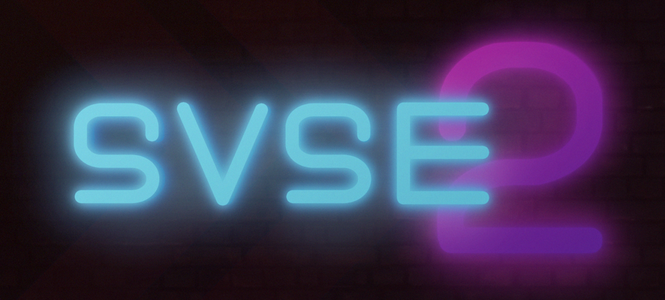

---
tags:
  - SVSE2
  - SVSE 2
---

# SV: Summer Exhibition 2

The **SV: Summer Exhibition 2** (***SVSE 2***) was a team-based osu!mania 4K tournament hosted by ::{ flag=CL }:: [WalterToro](https://osu.ppy.sh/users/5281416).

## Tournament schedule

| Event | Timestamp |
| --: | :-- |
| Registration phase | 2023-04-22/2023-05-27 |
| Qualifiers | 2023-06-17/2023-06-18 |
| Week 1 stage | 2023-06-24/2023-06-25 |
| Week 2 stage | 2023-07-01/2023-07-02 |
| Week 3 stage | 2023-07-08/2023-07-09 |
| Week 4 stage | 2023-07-15/2023-07-16 |
| Finals | 2023-07-29/2023-08-06 |

## Prizes

| Placing | Prizes |
| :-: | :-- |
|  | 120 USD, profile badge |
|  | 80 USD |
|  | 60 USD |
| *4th place* | 40 USD |
| *Surviving teams* | 2 months of osu!supporter |

## Organisation

The SV: Summer Exhibition 2 was run by various community members.

| Position | Member(s) |
| :-- | :-- |
| Host | ::{ flag=CL }:: [WalterToro](https://osu.ppy.sh/users/5281416), ::{ flag=NL }:: [Albionthegreat](https://osu.ppy.sh/users/9853595), ::{ flag=US }:: [Orca-](https://osu.ppy.sh/users/7958845) |
| Mappers | ::{ flag=JP }:: [\[Fairy\]Phy](https://osu.ppy.sh/users/4777360), ::{ flag=PL }:: [Archaic84](https://osu.ppy.sh/users/8611177), ::{ flag=SG }:: [awdse22](https://osu.ppy.sh/users/8743513), ::{ flag=FR }:: [BlackyDay](https://osu.ppy.sh/users/5724831), ::{ flag=GB }:: [H1Pur](https://osu.ppy.sh/users/15756120), ::{ flag=SG }:: [Neon-Hooray](https://osu.ppy.sh/users/24058560), ::{ flag=PH }:: [notapplicable](https://osu.ppy.sh/users/7170536), ::{ flag=US }:: [NovaSagittarii](https://osu.ppy.sh/users/11664177), ::{ flag=US }:: [Orca-](https://osu.ppy.sh/users/7958845), ::{ flag=TH }:: [RuleBlazing](https://osu.ppy.sh/users/7312402) |
| Map Testers | ::{ flag=VN }:: [\[LS\]Tokiyume](https://osu.ppy.sh/users/13219309), ::{ flag=SG }:: [awdse22](https://osu.ppy.sh/users/8743513), ::{ flag=ID }:: [AZKiFanboy](https://osu.ppy.sh/users/5179764), ::{ flag=FR }:: [BlackyDay](https://osu.ppy.sh/users/5724831), ::{ flag=US }:: [Orca-](https://osu.ppy.sh/users/7958845), ::{ flag=CL }:: [WalterToro](https://osu.ppy.sh/users/5281416) |
| Referee | ::{ flag=US }:: [akace100](https://osu.ppy.sh/users/9308128), ::{ flag=NL }:: [AlbionTheGreat](https://osu.ppy.sh/users/9853595), ::{ flag=US }:: [Dynascape](https://osu.ppy.sh/users/8784587), ::{ flag=TH }:: [Infinitstart](https://osu.ppy.sh/users/4026124), ::{ flag=SE }:: [Logg45vs](https://osu.ppy.sh/users/8684540), ::{ flag=VN }:: [Poity](https://osu.ppy.sh/users/17148657), ::{ flag=CN }:: [shizehao](https://osu.ppy.sh/users/4928674), ::{ flag=US }:: [SunApple](https://osu.ppy.sh/users/11817622), ::{ flag=DE }:: [TheHunter1](https://osu.ppy.sh/users/6496016), ::{ flag=CL }:: [WalterToro](https://osu.ppy.sh/users/5281416) |
| Statistician | ::{ flag=SE }:: [Mestro](https://osu.ppy.sh/users/4798263) |
| Designer | ::{ flag=PH }:: [Normiplier](https://osu.ppy.sh/users/10069850) |

## Links

- [Discussion thread](https://osu.ppy.sh/community/forums/topics/1754542)
- [Livestream](https://www.twitch.tv/svsummerexhibition)
- [SVSE Discord server](https://discord.gg/wp9PFZq599)
- [Results sheet](https://docs.google.com/spreadsheets/d/1H7GLbMXF6pTstYnlpmvR0ikAL7pMWMePS1qWNph-sFg)

## Participants

| Team Name | Members |
| :-: | :-- |
| 25110054 | ::{ flag=US }:: [DarkMew2](https://osu.ppy.sh/users/13921965), ::{ flag=FR }:: [quentin5110054](https://osu.ppy.sh/users/8756421) |
| :1217angry: | ::{ flag=TW }:: [blacktea12](https://osu.ppy.sh/users/13389861), ::{ flag=TW }:: [Pdog4ni](https://osu.ppy.sh/users/14581544) |
| :yangu: | ::{ flag=ID }:: [Mipha-](https://osu.ppy.sh/users/5767941), ::{ flag=AU }:: [PotassiumF](https://osu.ppy.sh/users/4247722) |
| 3 tortues trotaient sur 1 toit | ::{ flag=FR }:: [Babibelbleu](https://osu.ppy.sh/users/16892459), ::{ flag=FR }:: [narahashi](https://osu.ppy.sh/users/18867523) |
| barudak gulanova | ::{ flag=ID }:: [-Yubi-](https://osu.ppy.sh/users/17851478), ::{ flag=ID }:: [Reihynn](https://osu.ppy.sh/users/16630515) |
| Beans On Toast | ::{ flag=US }:: [\[GS\]LeBean](https://osu.ppy.sh/users/10472266), ::{ flag=GB }:: [ToastY\_086](https://osu.ppy.sh/users/24606667) |
| Billy et son chien | ::{ flag=FR }:: [Elementaires](https://osu.ppy.sh/users/2284328), ::{ flag=FR }:: [billiack](https://osu.ppy.sh/users/14013641) |
| Boykissers | ::{ flag=BR }:: [Kenyuri](https://osu.ppy.sh/users/30467254), ::{ flag=BR }:: [MilesNoobkk](https://osu.ppy.sh/users/22656756) |
| broke on mems | ::{ flag=US }:: [\[TCJ\]ScanL](https://osu.ppy.sh/users/11762834), ::{ flag=US }:: [Yucky](https://osu.ppy.sh/users/7842506) |
| Chomper From PVZ | ::{ flag=US }:: [Znow](https://osu.ppy.sh/users/15513303), ::{ flag=US }:: [\[LS\]Mari](https://osu.ppy.sh/users/15270411) |
| CrôälaïnË | ::{ flag=FR }:: [Baguette2Pain](https://osu.ppy.sh/users/11818585), ::{ flag=FR }:: [poketoine](https://osu.ppy.sh/users/27254270) |
| cta lovers | ::{ flag=VN }:: [\_Moni\_](https://osu.ppy.sh/users/9710653), ::{ flag=VN }:: [Mystil Dino](https://osu.ppy.sh/users/6171675) |
| De Grachtengordelse Shavuiten | ::{ flag=NL }:: [kyudomaster](https://osu.ppy.sh/users/7267807), ::{ flag=NL }:: [Promachos](https://osu.ppy.sh/users/14069486) |
| Descendants of Arccat | ::{ flag=PH }:: [\[KN\]CuB-03](https://osu.ppy.sh/users/18560307), ::{ flag=PH }:: [Silhoueska Elze](https://osu.ppy.sh/users/11517895) |
| emballé c'est pesé | ::{ flag=FR }:: [Mokett](https://osu.ppy.sh/users/14535598), ::{ flag=FR }:: [Simca\_](https://osu.ppy.sh/users/9718775) |
| Forniteloliclub | ::{ flag=MX }:: [TheMoonLoop](https://osu.ppy.sh/users/15628036), ::{ flag=BO }:: [xhalez](https://osu.ppy.sh/users/21478615) |
| gaki wa oshimai! | ::{ flag=JP }:: [ICECAKE](https://osu.ppy.sh/users/16100800), ::{ flag=JP }:: [gyoza\_goki](https://osu.ppy.sh/users/18144664) |
| gensokyo harem | ::{ flag=DE }:: [araciumhd](https://osu.ppy.sh/users/15882740), ::{ flag=BH }:: [Unitori-](https://osu.ppy.sh/users/15772814) |
| HiraNewsonFlow (by ChatGPT) | ::{ flag=GB }:: [Fanahira](https://osu.ppy.sh/users/7415829), ::{ flag=GB }:: [XxNewson1234xX](https://osu.ppy.sh/users/9895650) |
| Jouœurs rincés | ::{ flag=FR }:: [Paturages](https://osu.ppy.sh/users/1375479), ::{ flag=FR }:: [jeremkyurem](https://osu.ppy.sh/users/13431947) |
| Kim Petras ft. Mili | ::{ flag=PH }:: [iid3rp](https://osu.ppy.sh/users/23274559), ::{ flag=AU }:: [AnatharaX](https://osu.ppy.sh/users/14390680) |
| kouvola mcdonalds meetup | ::{ flag=FI }:: [Mazzuli500](https://osu.ppy.sh/users/10648818), ::{ flag=FI }:: [ERA Fisu](https://osu.ppy.sh/users/12545346) |
| KuruMi KonbanMi | ::{ flag=JP }:: [Mi0117](https://osu.ppy.sh/users/15501680), ::{ flag=JP }:: [CrewK](https://osu.ppy.sh/users/11488604) |
| Los Simsimi | ::{ flag=MX }:: [N4iveDx](https://osu.ppy.sh/users/21340543), ::{ flag=MX }:: [Sillot](https://osu.ppy.sh/users/29716889) |
| Losmatapro | ::{ flag=CO }:: [JoseMGS](https://osu.ppy.sh/users/21389992), ::{ flag=CO }:: [Foxy2431](https://osu.ppy.sh/users/23708040) |
| Makuron de misshon | ::{ flag=FR }:: [PatouZ](https://osu.ppy.sh/users/7306522), ::{ flag=JP }:: [yomogi237](https://osu.ppy.sh/users/28571440) |
| mlem | ::{ flag=DE }:: [ERA Punish](https://osu.ppy.sh/users/10615367), ::{ flag=PE }:: [Kamikho](https://osu.ppy.sh/users/12664851) |
| mrrp mrrp meow | ::{ flag=SG }:: [McButt](https://osu.ppy.sh/users/18018708), ::{ flag=SG }:: [megasheeper](https://osu.ppy.sh/users/21903060) |
| Nepka Hunters | ::{ flag=RU }:: [Waring0](https://osu.ppy.sh/users/24972284), ::{ flag=RU }:: [kloofhi](https://osu.ppy.sh/users/29627572) |
| no we're not boyfriends | ::{ flag=VN }:: [mightyxd](https://osu.ppy.sh/users/12204127), ::{ flag=VN }:: [Lott](https://osu.ppy.sh/users/13821222) |
| north sentinel island | ::{ flag=IE }:: [\[LS\]SureFir3](https://osu.ppy.sh/users/24495218), ::{ flag=US }:: [cyger](https://osu.ppy.sh/users/20020441) |
| play rabi-ribi after this | ::{ flag=CN }:: [\[Lily\_White\]](https://osu.ppy.sh/users/12749779), ::{ flag=CN }:: [Blue\_Potion](https://osu.ppy.sh/users/13094831) |
| sata andagi! | ::{ flag=DE }:: [ERA medium kek](https://osu.ppy.sh/users/11625617), ::{ flag=DE }:: [ERA Sirbeyy](https://osu.ppy.sh/users/12917829) |
| Schizo Velocity | ::{ flag=MX }:: [\[Crz\]Envy](https://osu.ppy.sh/users/11817815), ::{ flag=US }:: [ASharpp](https://osu.ppy.sh/users/12657177) |
| Scrambled Eggs | ::{ flag=GB }:: [MiniEgg\_23](https://osu.ppy.sh/users/25914360), ::{ flag=GB }:: [\_Squiddy\_](https://osu.ppy.sh/users/24227505) |
| SVn't | ::{ flag=US }:: [AdrianLazer](https://osu.ppy.sh/users/10292643), ::{ flag=PH }:: [trappy](https://osu.ppy.sh/users/19481261) |
| svssy baka | ::{ flag=SG }:: [Polytetral](https://osu.ppy.sh/users/8612061), ::{ flag=PE }:: [ERA Xuste](https://osu.ppy.sh/users/17989444) |
| Taiko Main forced into SV | ::{ flag=US }:: [ERA Zenith](https://osu.ppy.sh/users/7128063), ::{ flag=US }:: [Klarion](https://osu.ppy.sh/users/13857986) |
| team a | ::{ flag=NL }:: [Shoira](https://osu.ppy.sh/users/13377652), ::{ flag=NL }:: [Saemitsu](https://osu.ppy.sh/users/14262789) |
| Team at | ::{ flag=NL }:: [DannyPX](https://osu.ppy.sh/users/11253722), ::{ flag=NL }:: [NightNarumi](https://osu.ppy.sh/users/4381142) |
| TescoMealDeal | ::{ flag=GB }:: [Usie](https://osu.ppy.sh/users/16162078), ::{ flag=GB }:: [--Dragon--](https://osu.ppy.sh/users/11924624) |
| The Hard Balls | ::{ flag=CA }:: [walmart5193](https://osu.ppy.sh/users/16468962), ::{ flag=US }:: [ERA Basil](https://osu.ppy.sh/users/7097990) |
| vingt-sept | ::{ flag=FR }:: [Satsukel](https://osu.ppy.sh/users/9066390), ::{ flag=FR }:: [Adri](https://osu.ppy.sh/users/4579132) |
| 不玩原神不玩的 | ::{ flag=CN }:: [\[GB\]ChickenGold](https://osu.ppy.sh/users/16586663), ::{ flag=CN }:: [Echo\_XF](https://osu.ppy.sh/users/25630297) |

## Podium

This competition has come to an end and resulted in the following podium:

| Placing | Team | Players |
| :-: | :-: | :-- |
|  | **gaki wa oshimai!** | ::{ flag=JP }:: [ICECAKE](https://osu.ppy.sh/users/16100800), ::{ flag=JP }:: [gyoza\_goki](https://osu.ppy.sh/users/18144664) |
|  | **no we're not boyfriends** | ::{ flag=VN }:: [mightyxd](https://osu.ppy.sh/users/12204127), ::{ flag=VN }:: [Lott](https://osu.ppy.sh/users/13821222) |
|  | **The Hard Balls** | ::{ flag=CA }:: [walmart5193](https://osu.ppy.sh/users/16468962), ::{ flag=US }:: [ERA Basil](https://osu.ppy.sh/users/7097990) |
| *4th place* | **mlem** | ::{ flag=DE }:: [ERA Punish](https://osu.ppy.sh/users/10615367), ::{ flag=PE }:: [Kamikho](https://osu.ppy.sh/users/12664851) |

## Mappools

### Final stage

- FreeMod
  - [Synthion - VIVIDVELOCITY (Orca-) \[First Stage | a celestial journey;\]](https://osu.ppy.sh/beatmapsets/2031971#mania/4235473)
  - [muyu - Cosmic Radio Station (Neon-Hooray) \[Second Stage | Star Voyage!!!\]](https://osu.ppy.sh/beatmapsets/2032010#mania/4235529)
  - [N2 - NULL APOPHENIA (Archaic84) \[Third Stage | Warped Reflection\]](https://osu.ppy.sh/beatmapsets/2031946#mania/4235411)
  - [Laur feat. Mishamo - Let's! Miracle HARDCORE! (awdse22) \[Fourth Stage | Magical SV rescue!!\]](https://osu.ppy.sh/beatmapsets/2032056#mania/4235633)
- Tiebreaker
  - **[Camellia - GHOUL (Orca-) \[EXTRA STAGE | LAST BREATH OF A SPECTRE;\]](https://osu.ppy.sh/beatmapsets/2031975#mania/4235479)**

### Week 4 stage

- Side A: [Zekk - Foresight (Orca-) \[beyond the visible;\]](https://osu.ppy.sh/beatmapsets/2026129#mania/4221487)
- Side B: [DenDora - painkiller (NovaSagittarii) \[Ibuprofen\]](https://osu.ppy.sh/beatmapsets/2026131#mania/4221490)

### Week 3 stage

- Side A: [Eliminate - Moisture (BlackyDay) \[SVVeaty\]](https://osu.ppy.sh/beatmapsets/2021948#mania/4210903)
- Side B: [Chito (CV: Minase Inori), Yuuri (CV: Kubo Yurika) - More One Night (Assertive Hardcore Bootleg) (\[Fairy\]Phy) \[SV Night\]](https://osu.ppy.sh/beatmapsets/2021947#mania/4210901)

### Week 2 stage

- Side A: [Reaper - Circulator (notapplicable) \[EXHAUST\]](https://osu.ppy.sh/beatmapsets/2017990#mania/4201921)
- Side B: [HIGHSOCIETY (feat. Anna M'Queen) - New Drug (BlackyDay) \[SV\]](https://osu.ppy.sh/beatmapsets/2018043#mania/4202133)

### Week 1 stage

- Side A: [Anyar - n0 Err0R (RuleBlazing) \[Fafnir 16F\]](https://osu.ppy.sh/beatmapsets/2014327#mania/4191899)
- Side B: [Maozon - Equilibrium (Archaic84) \[Future\]](https://osu.ppy.sh/beatmapsets/2013971#mania/4191074)

### Qualifiers

1. [CcC - Dusk & Dawn (RuleBlazing) \[First Stage | Duality\]](https://osu.ppy.sh/beatmapsets/2007323#mania/4175264)
2. [Tanger - ! PARTY SIRENS ! (H1Pur) \[Second Stage | ! GROOVY TIME !\]](https://osu.ppy.sh/beatmapsets/2007283#mania/4175187)
3. [ALESDA! - Nikoniko (BlackyDay) \[Third Stage | SiVoSiVo\]](https://osu.ppy.sh/beatmapsets/2007317#mania/4175257)
4. [Akira Complex & PSYQUI - Come to me (Orca-) \[Fourth Stage | a cathartic return;\]](https://osu.ppy.sh/beatmapsets/2007311#mania/4175239)

## Results

### Finals

Saturday, 29 July 2023:

| Player A |  |  | Player B | Match Link |
| --: | :-: | :-: | :-- | :-- |
| **gyoza_goki** ::{ flag=JP }:: | **3** | 0 | ::{ flag=CA }:: walmart5193 | [#1](https://osu.ppy.sh/community/matches/109729917) |
| **ICECAKE** ::{ flag=JP }:: | **3** | 1 | ::{ flag=US }:: ERA Basil | [#1](https://osu.ppy.sh/community/matches/109730191) |

Monday, 31 July 2023:

| Player A |  |  | Player B | Match Link |
| --: | :-: | :-: | :-- | :-- |
| Kamikho ::{ flag=PE }:: | 0 | **3** | ::{ flag=VN }:: **mightyxd** | [#1](https://osu.ppy.sh/community/matches/109770469) |
| ERA Punish ::{ flag=DE }:: | 0 | **3** | ::{ flag=VN }:: **Lott** | [#1](https://osu.ppy.sh/community/matches/109770747) |

Saturday, 5 August 2023:

| Player A |  |  | Player B | Match Link |
| --: | :-: | :-: | :-- | :-- |
| Kamikho ::{ flag=PE }:: | 0 | **3** | ::{ flag=CA }:: **walmart5193** | *win by default* |
| ERA Punish ::{ flag=DE }:: | 0 | **3** | ::{ flag=US }:: **ERA Basil** | *win by default* |
| **gyoza_goki** ::{ flag=JP }:: | **3** | 0 | ::{ flag=VN }:: mightyxd | [#1](https://osu.ppy.sh/community/matches/109849609) |
| ICECAKE ::{ flag=JP }:: | 2 | **3** | ::{ flag=VN }:: **Lott** | [#1](https://osu.ppy.sh/community/matches/109849855) |
| **gaki wa oshimai!** ::{ flag=JP }:: | **3** | 0 | ::{ flag=VN }:: no we're not boyfriends | [#1](https://osu.ppy.sh/community/matches/109850211) |

### Week 4

Teams with emboldened names advance to finals and teams with names crossed out are eliminated.

| Position | Team | Side A position | Side B position | Avg. position | Team score |
| --: | :-: | :-: | :-: | :-: | --: |
| #1 | **gaki wa oshimai!** | 2 | 3 | 2.5 | 1,989,158 |
| #2 | **mlem** | 1 | 6 | 3.5 | 1,985,314 |
| #3 | **no we're not boyfriends** | 7 | 1 | 4 | 1,983,572 |
| #4 | **The Hard Balls** | 8 | 2 | 5 | 1,977,465 |
| #5 | Descendants of Arccat | 6 | 5 | 5.5 | 1,977,659 |
| #6 | KuruMi KonbanMi | 5 | 7 | 6 | 1,977,037 |
| #7 | Makuron de misshon | 4 | 9 | 6.5 | 1,966,813 |
| #8 | ~~:yangu:~~ | 3 | 10 | 6.5 | 1,963,982 |
| #9 | ~~Billy et son chien~~ | 10 | 4 | 7 | 1,954,437 |
| #10 | ~~kouvola mcdonalds meetup~~ | 9 | 8 | 8.5 | 1,960,057 |
| #11 | ~~broke on mems~~ | 11 | 11 | 11 | 955,101 |

### Week 3

Teams with italicised names are in a last-chance situation and teams with names crossed out are eliminated.

| Position | Team | Side A position | Side B position | Avg. position | Team score |
| --: | :-: | :-: | :-: | :-: | --: |
| #1 | KuruMi KonbanMi | 3 | 1 | 2 | 1,993,885 |
| #2 | Makuron de misshon | 5 | 2 | 3.5 | 1,991,461 |
| #3 | mlem | 2 | 6 | 4 | 1,990,409 |
| #4 | Descendants of Arccat | 7 | 3 | 5 | 1,989,324 |
| #5 | The Hard Balls | 6 | 5 | 5.5 | 1,989,517 |
| #6 | no we're not boyfriends | 8 | 4 | 6 | 1,988,114 |
| #7 | gaki wa oshimai! | 4 | 8 | 6 | 1,983,075 |
| #8 | :yangu: | 1 | 15 | 8 | 1,866,632 |
| #9 | Billy et son chien | 12 | 7 | 9.5 | 1,943,655 |
| #10 | *kouvola mcdonalds meetup* | 10 | 10 | 10 | 1,965,878 |
| #11 | ~~Scrambled Eggs~~ | 11 | 12 | 11.5 | 1,925,755 |
| #12 | *broke on mems* | 15 | 9 | 12 | 1,921,038 |
| #13 | ~~svssy baka~~ | 13 | 11 | 12 | 1,908,569 |
| #14 | ~~Jouœurs rincés~~ | 9 | 18 | 13.5 | 1,687,143 |
| #15 | ~~De Grachtengordelse Schavuiten~~ | 17 | 13 | 15 | 1,878,081 |
| #16 | ~~team a~~ | 14 | 16 | 15 | 1,789,481 |
| #17 | ~~Team at~~ | 18 | 14 | 16 | 1,866,262 |
| #18 | ~~Taiko Main forced into SV~~ | 16 | 17 | 16.5 | 1,715,982 |

### Week 2

Teams with italicised names are in a last-chance situation and teams with names crossed out are eliminated.

| Position | Team | Side A position | Side B position | Avg. position | Team score |
| --: | :-: | :-: | :-: | :-: | --: |
| #1 | gaki wa oshimai! | 6 | 1 | 3.5 | 1,991,745 |
| #2 | KuruMi KonbanMi | 5 | 3 | 4 | 1,987,242 |
| #3 | Descendants of Arccat | 4 | 4 | 4 | 1,987,179 |
| #4 | The Hard Balls | 8 | 2 | 5 | 1,986,787 |
| #5 | Makuron de misshon | 3 | 8 | 5.5 | 1,985,067 |
| #6 | mlem | 2 | 9 | 5.5 | 1,979,887 |
| #7 | no we're not boyfriends | 7 | 5 | 6 | 1,986,058 |
| #8 | :yangu: | 1 | 13 | 7 | 1,963,131 |
| #9 | kouvola mcdonalds meetup | 14 | 7 | 10.5 | 1,980,380 |
| #10 | Team at | 11 | 11 | 11 | 1,970,637 |
| #11 | team a | 13 | 12 | 12.5 | 1,964,555 |
| #12 | Billy et son chien | 9 | 21 | 15 | 1,928,830 |
| #13 | *svssy baka* | 26 | 6 | 16 | 1,953,060 |
| #14 | Taiko Main forced into SV | 15 | 17 | 16 | 1,941,175 |
| #15 | broke on mems | 23 | 10 | 16.5 | 1,949,580 |
| #16 | *Scrambled Eggs* | 16 | 18 | 17 | 1,933,258 |
| #17 | ~~barudak gulanova~~ | 12 | 22 | 17 | 1,925,581 |
| #18 | *Jouœurs rincés* | 10 | 24 | 17 | 1,912,513 |
| #19 | ~~HiraNewsonFlow (by ChatGPT)~~ | 21 | 16 | 18.5 | 1,930,252 |
| #20 | *De Grachtengordelse Schavuiten* | 19 | 19 | 19 | 1,925,208 |
| #21 | ~~Los Simsimi~~ | 25 | 14 | 19.5 | 1,928,388 |
| #22 | ~~Boykissers~~ | 20 | 20 | 20 | 1,918,724 |
| #23 | ~~25110054~~ | 28 | 15 | 21.5 | 1,917,391 |
| #24 | ~~mrrp mrrp meow~~ | 17 | 27 | 22 | 1,818,256 |
| #25 | ~~TescoMealDeal~~ | 18 | 28 | 23 | 1,730,574 |
| #26 | ~~play rabi-ribi after this~~ | 22 | 26 | 24 | 1,815,739 |
| #27 | ~~sata andagi!~~ | 24 | 25 | 24.5 | 1,884,784 |
| #28 | ~~north sentinel island~~ | 30 | 23 | 26.5 | 1,872,987 |
| #29 | ~~:1217angry:~~ | 27 | 29 | 28 | 1,682,550 |
| #30 | ~~3 tortues trotaient sur 1 toit~~ | 29 | 30 | 29.5 | 1,387,927 |
| #31 | ~~Schizo Velocity~~ | 31 | 32 | 31.5 | 895,544 |
| #32 | ~~cta lovers~~ | 32 | 32 | 32 | 0 |

### Week 1

Teams with italicised names are in a last-chance situation

| Position | Team | Side A position | Side B position | Avg. position | Team score |
| --: | :-: | :-: | :-: | :-: | --: |
| #1 | gaki wa oshimai! | 1 | 2 | 1.5 | 1,993,091 |
| #2 | KuruMi KonbanMi | 5 | 1 | 3 | 1,992,218 |
| #3 | Makuron de misshon | 3 | 3 | 3 | 1,991,686 |
| #4 | mlem | 1 | 8 | 4.5 | 1,985,974 |
| #5 | no we're not boyfriends | 9 | 4 | 6.5 | 1,989,573 |
| #6 | team a | 11 | 5 | 8 | 1,985,562 |
| #7 | Descendants of Arccat | 10 | 7 | 8.5 | 1,984,633 |
| #8 | kouvola mcdonalds meetup | 8 | 9 | 8.5 | 1,983,382 |
| #9 | Billy et son chien | 11 | 13 | 12 | 1,978,272 |
| #10 | Taiko Main forced into SV | 7 | 17 | 12 | 1,973,594 |
| #11 | The Hard Balls | 19 | 6 | 12.5 | 1,981,105 |
| #12 | :yangu: | 16 | 10 | 13 | 1,981,022 |
| #13 | Team at | 6 | 20 | 13 | 1,969,225 |
| #14 | De Grachtengordelse Schavuiten | 15 | 16 | 15.5 | 1,974,043 |
| #15 | Jouœurs rincés | 4 | 30 | 17 | 1,925,974 |
| #16 | broke on mems | 24 | 12 | 18 | 1,972,070 |
| #17 | *barudak gulanova* | 17 | 19 | 18 | 1,967,874 |
| #18 | *HiraNewsonFlow (by ChatGPT)* | 25 | 11 | 18 | 1,966,779 |
| #19 | *25110054* | 13 | 27 | 20 | 1,944,281 |
| #20 | *sata andagi!* | 20 | 21 | 20.5 | 1,956,479 |
| #21 | *Los Simsimi* | 28 | 14 | 21 | 1,958,857 |
| #22 | *Scrambled Eggs* | 21 | 22 | 21.5 | 1,955,196 |
| #23 | *:1217angry:* | 18 | 25 | 21.5 | 1,950,095 |
| #24 | *Boykissers* | 22 | 23 | 22.5 | 1,954,136 |
| #25 | *mrrp mrrp meow* | 30 | 15 | 22.5 | 1,944,081 |
| #26 | *svssy baka* | 13 | 32 | 22.5 | 1,893,063 |
| #27 | *TescoMealDeal* | 29 | 18 | 23.5 | 1,950,770 |
| #28 | *Schizo Velocity* | 23 | 24 | 23.5 | 1,949,773 |
| #29 | *north sentinel island* | 27 | 28 | 27.5 | 1,928,965 |
| #30 | *3 tortues trotaient sur 1 toit* | 26 | 29 | 27.5 | 1,923,010 |
| #31 | *play rabi-ribi after this* | 31 | 26 | 28.5 | 1,919,112 |
| #32 | *cta lovers* | 32 | 31 | 31.5 | 1,872,504 |

### Qualifiers

Only the top 32 teams advance to the next round.

| Position | Team | Team score |
| --: | :-: | --: |
| #1 | gaki wa oshimai! | 3,991,097 |
| #2 | KuruMi KonbanMi | 3,987,369 |
| #3 | Descendants of Arccat | 3,982,565 |
| #4 | Makuron de misshon | 3,968,273 |
| #5 | no we're not boyfriends | 3,966,141 |
| #6 | mlem | 3,964,382 |
| #7 | Team at | 3,946,064 |
| #8 | kouvola mcdonalds meetup | 3,930,883 |
| #9 | Billy et son chien | 3,912,984 |
| #10 | The Hard Balls | 3,881,979 |
| #11 | barudak gulanova | 3,879,375 |
| #12 | :yangu: | 3,878,486 |
| #13 | Los Simsimi | 3,859,058 |
| #14 | 25110054 | 3,858,455 |
| #15 | team a | 3,857,094 |
| #16 | svssy baka | 3,850,488 |
| #17 | Jouœurs rincés | 3,840,449 |
| #18 | sata andagi! | 3,839,344 |
| #19 | Taiko Main forced into SV | 3,836,334 |
| #20 | mrrp mrrp meow | 3,820,034 |
| #21 | play rabi-ribi after this | 3,817,033 |
| #22 | Scrambled Eggs | 3,805,346 |
| #23 | Boykissers | 3,788,681 |
| #24 | north sentinel island | 3,772,590 |
| #25 | TescoMealDeal | 3,769,282 |
| #26 | De Grachtengordelse Shavuiten | 3,757,118 |
| #27 | :1217angry: | 3,751,494 |
| #28 | broke on mems | 3,717,879 |
| #29 | cta lovers | 3,713,704 |
| #30 | Schizo Velocity | 3,670,547 |
| #31 | HiraNewsonFlow (by ChatGPT) | 3,665,213 |
| #32 | 3 tortues trotaient sur 1 toit | 3,641,099 |
| #33 | Chomper From PVZ | 3,633,886 |
| #34 | gensokyo harem | 3,624,928 |
| #35 | emballé c'est pesé | 3,614,387 |
| #36 | vingt-sept | 3,533,487 |
| #37 | 不玩原神不玩的 | 3,532,877 |
| #38 | Nepka Hunters | 3,504,400 |
| #39 | CrôälaïnË | 3,452,041 |
| #40 | Kim Petras ft. Mili | 3,369,037 |
| #41 | Beans On Toast | 3,303,355 |
| #42 | Forniteloliclub | 3,050,612 |
| #43 | SVn't | 2,705,243 |
| #44 | Losmatapro | 2,529,694 |

## Ruleset

### General

1. SV: Summer Exhibition 2 is an osu!mania **team tournament**.
   - Teams are formed with 2 players each.
2. The scoring system used will be **ScoreV2**.
3. There will be a Qualifier stage, 4 weeks of leaderboard play and a final single elimination stage.
   - **The maximum number of teams who can advance to the weekly stages is 32**.
   - **Top 4 teams by the end of week 4 will advance to the final stage**.
4. Every week an "Information Compass" will be released of each map of the pool which will give players important information on the content of each chart.
   - The Information Compass is a 5x5 grid where the X-axis represents the chart type bias and the Y-axis represents the complexity bias.
5. Mappool will be released on different dates depending of the stage:
   - **Qualifiers and Finals**: Mappool will be released one week in advance, right after the mappool showcase.
   - **Weekly stages**: Mappool will be released every Friday at 0 UTC.
6. Maps will be played with [FreeMod](/wiki/Gameplay/Game_modifier#free-mod). The only allowed mods are FadeIn, Flashlight, Hidden, and Mirror.

### Tournament structure

#### Qualifiers

1. The Qualifier pool contains 4 maps, all of which will use [FreeMod](/wiki/Gameplay/Game_modifier#free-mod) rules.
2. Each player will play 2 unique maps of the qualifier mappool.
3. When joining the lobby, the teams will tell the referee what maps each player will be playing.
   - From this point, players cannot change selected maps.
4. Each team will have two tries at each map, their best score will count for seeding.
5. The top 32 seeded teams will advance to the weekly stages.
   - This seeding is done by the sum of all the best scores in each map.

#### Weekly stages

1. There will be 4 weeks of match play.
2. Every week 2 maps will be released, one for "Side A" and another for "Side B".
3. An Information Compass will be released for each of these maps every Monday at 00:00 UTC.
4. After the Information Compasses are released, teams will sign up one player to the Side A lobby, and the other for the Side B lobby.
   - They can do this until Thursday 23:59 UTC.
5. On Friday at 0 UTC the maps are uploaded and posted in the server.
6. Each player will have three tries at each map, their best score will count for each weekly stage.
7. Each map will have a leaderboard with the best recorded scores on it, and their placement on those will be used for the overall week placement
8. Teams advance to the next week stage if they are not eliminated, elimination happens if a team fulfills one of the folowing conditions:
   - They get 2 "Last Chance" flags, which are given to the teams in the bottom half of the leaderboard each week.
   - They are one of the bottom 4 teams on the leaderboard on a given week.
9. Top 4 teams on the leaderboard by week 4 advance to finals.
   - Teams outside of top 4 not eliminated by the end of week 4 are considered survivors and get a small prize.

#### Finals

1. Teams that advance to finals will play a small single-elimination bracket.
2. The Finals pool contains 5 maps, all of which will use [FreeMod](/wiki/Gameplay/Game_modifier#free-mod) rules.
3. Matches are defined as follows:
   - First place faces fourth place.
   - Second place faces third place.
   - Losers of each match will define the 3rd and 4th places of the tournament.
   - Winners of each match will define the Grand Champion of SVSE2.
4. Teams needs to win 2 sets to win a match, to win a set they need to win 3 maps (best of 5).
5. Teams will select an "A player" and a "B player", the A player of each team will face each other, similar to the B player on a 1 versus 1 set. These will be the first and second set of the match.
   - These A and B players cannot be swapped for the entire stage.
6. If both teams tie on set points by the end of the second set, a third set will be played, this time a 2 versus 2.
7. Each team must use the `!roll` command at the start of every set in `#multiplayer`.
   - The winner of the `!roll` starts picking first.
   - The loser of the `!roll` picks second.
8. There will be no bans in this stage.
