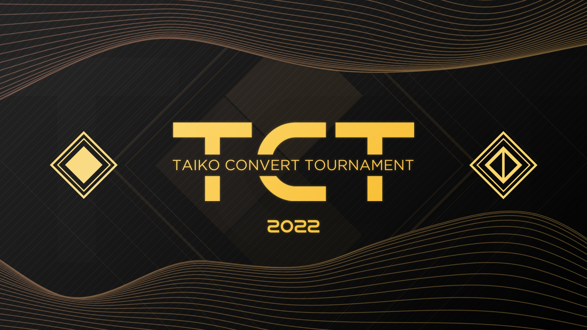

---
tags:
  - TCT
  - TCTv4
  - TCT v4
---

# Taiko Convert Tournament v4

The **Taiko Convert Tournament v4** (***TCT v4***) was a double-elimination 2v2 osu!taiko tournament hosted by ::{ flag=JP }:: [Noko\_BSF](https://osu.ppy.sh/users/3811831), ::{ flag=DE }:: [Drecksackblase](https://osu.ppy.sh/users/6278008), ::{ flag=PL }:: [fafik99](https://osu.ppy.sh/users/1787011), ::{ flag=DE }:: [Jason X](https://osu.ppy.sh/users/2904140), and ::{ flag=US }:: [JDrago14](https://osu.ppy.sh/users/7690078). The tournament features a variety of maps converted from the osu!standard gamemode in its mappools. It was the fourth instalment of the Taiko Convert Tournament.

## Tournament schedule

| Event | Timestamp |
| --: | :-- |
| Registration phase | 2022-05-01/2022-05-27 |
| Screening phase | 2022-05-28/2022-06-02 |
| Live drawings | 2022-06-03 |
| Qualifiers | 2022-06-05/2022-06-12 |
| Group Stage | 2022-06-18/2022-06-19 |
| Round of 16 | 2022-06-25/2022-06-26 |
| Quarterfinals | 2022-07-02/2022-07-03 |
| Semifinals | 2022-07-09/2022-07-10 |
| Finals | 2022-07-23/2022-07-24 |
| Grand Finals | 2022-07-30/2022-07-31 |

## Prizes

| Placing | Prize |
| :-: | :-- |
|  | Unique profile badge |

## Organisation

The Taiko Convert Tournament v4 was run by various community members.

| Position | Member(s) |
| :-- | :-- |
| Administrator | ::{ flag=DE }:: [Drecksackblase](https://osu.ppy.sh/users/6278008), ::{ flag=PL }:: [fafik99](https://osu.ppy.sh/users/1787011), ::{ flag=DE }:: [Jason X](https://osu.ppy.sh/users/2904140), ::{ flag=US }:: [JDrago14](https://osu.ppy.sh/users/7690078), ::{ flag=JP }:: [Noko\_BSF](https://osu.ppy.sh/users/3811831) |
| Mappool selector | ::{ flag=GB }:: [Daniels](https://osu.ppy.sh/users/12439209), ::{ flag=DE }:: [Drecksackblase](https://osu.ppy.sh/users/6278008), ::{ flag=PL }:: [fafik99](https://osu.ppy.sh/users/1787011), ::{ flag=JP }:: [Noko\_BSF](https://osu.ppy.sh/users/3811831), ::{ flag=US }:: [Shyguy](https://osu.ppy.sh/users/178038) |
| Playtester | ::{ flag=GB }:: [Dusk-](https://osu.ppy.sh/users/6092181), ::{ flag=US }:: [Shyguy](https://osu.ppy.sh/users/178038) |
| Referee | ::{ flag=HK }:: [Akali393394](https://osu.ppy.sh/users/9686628), ::{ flag=DE }:: [Drecksackblase](https://osu.ppy.sh/users/6278008), ::{ flag=DE }:: [Jason X](https://osu.ppy.sh/users/2904140), ::{ flag=US }:: [maxie](https://osu.ppy.sh/users/6447505), ::{ flag=JP }:: [Noko\_BSF](https://osu.ppy.sh/users/3811831), ::{ flag=US }:: [Shyguy](https://osu.ppy.sh/users/178038), ::{ flag=SG }:: [Spartric](https://osu.ppy.sh/users/7740442) |
| Streamer | ::{ flag=US }:: [ITotallyGetThat](https://osu.ppy.sh/users/8770622), ::{ flag=US }:: [Rukairi](https://osu.ppy.sh/users/6642597), ::{ flag=SG }:: [Spartric](https://osu.ppy.sh/users/7740442) |
| Commentator | ::{ flag=DE }:: [Drecksackblase](https://osu.ppy.sh/users/6278008), ::{ flag=US }:: [Ethaaaan](https://osu.ppy.sh/users/9536977), ::{ flag=PL }:: [fafik99](https://osu.ppy.sh/users/1787011), ::{ flag=GR }:: [Genjuro](https://osu.ppy.sh/users/3196091), ::{ flag=US }:: [ITotallyGetThat](https://osu.ppy.sh/users/8770622), ::{ flag=US }:: [maxie](https://osu.ppy.sh/users/6447505), ::{ flag=US }:: [Rukairi](https://osu.ppy.sh/users/6642597), ::{ flag=GB }:: [willowww](https://osu.ppy.sh/users/11406987) |
| Designer | ::{ flag=MY }:: [Jerry](https://osu.ppy.sh/users/605973) |
| Statistician | ::{ flag=JP }:: [Noko\_BSF](https://osu.ppy.sh/users/3811831) |
| Wiki writer | ::{ flag=ID }:: [fajar13k](https://osu.ppy.sh/users/7100002) |

## Links

- [Discussion thread](https://osu.ppy.sh/community/forums/topics/1568153)
- [TCT Discord server](https://discord.gg/56WRzpQUV2)
- [Livestream](https://www.twitch.tv/taikoconverttournament)
- [Challonge brackets](https://challonge.com/TCTv4)
- **[Statistics sheet](https://docs.google.com/spreadsheets/d/1irT-oEpMu6QfUzKBosyeZJtfKZzcqKmRYAJu9nyWj7s/edit?usp=sharing)**

## Participants

| Team | Members |
| :-- | :-- |
| **:D** | ::{ flag=SE }:: **[nc enjoyer](https://osu.ppy.sh/users/16669841)**, ::{ flag=VN }:: [-NTD-](https://osu.ppy.sh/users/19787040) |
| **404 enrin not found** | ::{ flag=PL }:: **[404usernotfound](https://osu.ppy.sh/users/5274209)**, ::{ flag=TW }:: [Sammu](https://osu.ppy.sh/users/17664300) |
| **a dom** | ::{ flag=NO }:: **[Loff](https://osu.ppy.sh/users/8947341)**, ::{ flag=NO }:: [Vendelicious](https://osu.ppy.sh/users/8818089) |
| **Average Convert Enjoyers** | ::{ flag=RU }:: **[xovazka](https://osu.ppy.sh/users/14544810)**, ::{ flag=RU }:: [Flexo](https://osu.ppy.sh/users/906825) |
| **B-Team** | ::{ flag=JP }:: **[BluePlusSymbol](https://osu.ppy.sh/users/6503700)**, ::{ flag=NL }:: [Boaz](https://osu.ppy.sh/users/13302996) |
| **bingle** | ::{ flag=HK }:: **[Cynplytholowazy](https://osu.ppy.sh/users/3901754)**, ::{ flag=TW }:: [X a v y](https://osu.ppy.sh/users/3738344) |
| **Bongo Gamers** | ::{ flag=US }:: **[AuroraPhasmata](https://osu.ppy.sh/users/13664116)**, ::{ flag=US }:: [Pineapplerss](https://osu.ppy.sh/users/14356353) |
| **can we just play this in std** | ::{ flag=KR }:: **[South Korea](https://osu.ppy.sh/users/12242622)**, ::{ flag=SG }:: [arcpotato](https://osu.ppy.sh/users/12842392) |
| **Delete all finisher and sv pls** | ::{ flag=JP }:: **[Six b0xes](https://osu.ppy.sh/users/8303357)**, ::{ flag=JP }:: [supesan](https://osu.ppy.sh/users/14623658) |
| **Dribblers** | ::{ flag=IT }:: **[D3kuu](https://osu.ppy.sh/users/7807444)**, ::{ flag=AR }:: [Axer](https://osu.ppy.sh/users/7299864) |
| **Foukat cukr do prdele** | ::{ flag=SK }:: **[Golden](https://osu.ppy.sh/users/12639462)**, ::{ flag=CZ }:: [iTzzMar0](https://osu.ppy.sh/users/13108155) |
| **Hoteddi\_18** | ::{ flag=CR }:: **[Hotman](https://osu.ppy.sh/users/7902082)**, ::{ flag=CR }:: [eddi\_18](https://osu.ppy.sh/users/1175892) |
| **Imagine Playing Basketball with Jesus and Getting Crossed Up** | ::{ flag=US }:: **[SlipperyPickle](https://osu.ppy.sh/users/11969691)**, ::{ flag=US }:: [SolaEclipse](https://osu.ppy.sh/users/6621158) |
| **israel** | ::{ flag=GR }:: **[Genjuro](https://osu.ppy.sh/users/3196091)**, ::{ flag=FI }:: [Antti](https://osu.ppy.sh/users/13281473) |
| **Lipton** | ::{ flag=JP }:: **[Grape\_Tea](https://osu.ppy.sh/users/9540073)**, ::{ flag=JP }:: [Peach\_Tea](https://osu.ppy.sh/users/5506349) |
| **mikeneko** | ::{ flag=JP }:: **[Maimaing](https://osu.ppy.sh/users/14520910)**, ::{ flag=JP }:: [Maeda](https://osu.ppy.sh/users/12615278) |
| **MLF enjoyers** | ::{ flag=RU }:: **[Rendow](https://osu.ppy.sh/users/8090603)**, ::{ flag=RU }:: [8mi8](https://osu.ppy.sh/users/11359985) |
| **Navic** | ::{ flag=FR }:: **[polemik victor](https://osu.ppy.sh/users/11592579)**, ::{ flag=FR }:: [397 Natsu](https://osu.ppy.sh/users/24543173) |
| **not hehe** | ::{ flag=DE }:: **[Sayira](https://osu.ppy.sh/users/7253958)**, ::{ flag=DE }:: [Mew](https://osu.ppy.sh/users/2345156) |
| **Reen's Students** | ::{ flag=ID }:: **[raynald](https://osu.ppy.sh/users/25094413)**, ::{ flag=ID }:: [Zest2822](https://osu.ppy.sh/users/24002878) |
| **SwitzerFrance** | ::{ flag=CH }:: **[Glacy](https://osu.ppy.sh/users/12819177)**, ::{ flag=FR }:: [Lougui](https://osu.ppy.sh/users/13766261) |
| **Tiger Mafia** | ::{ flag=GB }:: **[Horiiizon](https://osu.ppy.sh/users/8071438)**, ::{ flag=US }:: [Ney](https://osu.ppy.sh/users/5991961) |
| **Universidad de Chile** | ::{ flag=CL }:: **[Aisha](https://osu.ppy.sh/users/2192669)**, ::{ flag=AR }:: [Jintsuu](https://osu.ppy.sh/users/7165127) |
| **we can't convert** | ::{ flag=TW }:: **[CheeseStingy](https://osu.ppy.sh/users/16462012)**, ::{ flag=TW }:: [Hatsuse](https://osu.ppy.sh/users/697007) |
| **XaiKoro** | ::{ flag=JP }:: **[Saikoro](https://osu.ppy.sh/users/741819)**, ::{ flag=ID }:: [XK2238](https://osu.ppy.sh/users/1139209) |
| **yiff dungeon** | ::{ flag=PL }:: **[-Green tea-](https://osu.ppy.sh/users/12130367)**, ::{ flag=CA }:: [MrHawk301](https://osu.ppy.sh/users/9617608) |

## Podium

This competition has come to an end and resulted in the following podium:

| Placing | Team |
| :-: | :-- |
|  | **Tiger Mafia** (::{ flag=GB }:: **[Horiiizon](https://osu.ppy.sh/users/8071438)**, ::{ flag=US }:: [Ney](https://osu.ppy.sh/users/5991961)) |
|  | **israel** (::{ flag=GR }:: **[Genjuro](https://osu.ppy.sh/users/3196091)**, ::{ flag=FI }:: [Antti](https://osu.ppy.sh/users/13281473)) |
|  | **mikeneko** (::{ flag=JP }:: **[Maimaing](https://osu.ppy.sh/users/14520910)**, ::{ flag=JP }:: [Maeda](https://osu.ppy.sh/users/12615278)) |

## Mappools

### Grand Finals

- NoMod
  1. [Kobaryo - Villain Virus \[feat. Camellia\] (x\_angelkawaii\_x) \[Deluge\]](https://osu.ppy.sh/beatmapsets/1689443#fruits/3519510)
  2. [Studio EIM - Crescent Moon Island Boss Theme (Emiru) \[Keaghan\]](https://osu.ppy.sh/beatmapsets/817364#fruits/1714006)
  3. [siqlo - parsley (autofanboy) \[/eftover\]](https://osu.ppy.sh/beatmapsets/1856063#fruits/3814171)
  4. [SHK - Imagination (ktgster) \[SHD\]](https://osu.ppy.sh/beatmapsets/1078340#fruits/2256378)
  5. [LiSA - Gurenge (Crissa) \[Dance of the Fire God\]](https://osu.ppy.sh/beatmapsets/1025171#fruits/2144225)
  6. [gmtn. (witch's slave) - Daraku no Sono (yf\_bmp) \[SB's Extra\]](https://osu.ppy.sh/beatmapsets/1470956#fruits/3302302)
- Hidden
  1. [kanemiko - Electrolytes (Unlucky_w) \[Overdose\]](https://osu.ppy.sh/beatmapsets/1774562#fruits/3633672)
  2. [Laur - Fairy in Strasbourg (Crowley) \[Billiam, my beloved.\]](https://osu.ppy.sh/beatmapsets/1373059#fruits/2838713)
  3. [Nekomata Master - Smile of Split (Charles445) \[Insane\]](https://osu.ppy.sh/beatmapsets/56847#fruits/171678)
  4. [Kenshi Yonezu - MAD HEAD LOVE (Keqing) \[CRAZY\]](https://osu.ppy.sh/beatmapsets/1429536#fruits/2942890)
- HardRock
  1. [Camellia feat. Nanahira - Bassline Yatteru? w (Kukkai) \[Overdose\]](https://osu.ppy.sh/beatmapsets/1643938#fruits/3355835)
  2. [CELLON. - Virtual mode (JBHyperion) \[Sanyi's Overdose\]](https://osu.ppy.sh/beatmapsets/1069501#fruits/2291062)
  3. [Camellia - Routing (Shiirn) \[Extra\]](https://osu.ppy.sh/beatmapsets/403282#fruits/967558)
  4. [Sta - Shadows in the Light (Nerova Riuz GX) \[-presence?\]](https://osu.ppy.sh/beatmapsets/504690#fruits/1073731)
- DoubleTime
  1. [Luna - Shinsekai no Alpha (amulet-pp) \[Lumi's Rain\]](https://osu.ppy.sh/beatmapsets/1319986#fruits/2747990)
  2. [LiSA - Homura (Secre) \[Purgatory\]](https://osu.ppy.sh/beatmapsets/1397428#fruits/2883811)
  3. [K/DA - MORE feat. Madison Beer, (G)I-DLE, Lexie Liu, Jaira Burns, Seraphine (Elinor) \[Halgoh & Eli's Insane\]](https://osu.ppy.sh/beatmapsets/1288125#fruits/2674544)
  4. [The Fray - How to Save a Life (- Heatwave -) \[Powerless\]](https://osu.ppy.sh/beatmapsets/1767475#fruits/3742749)
- Tiebreaker
  1. **[DragonForce - Defenders (fuhie) \[fuhie & Verti's Primordial Guardians\]](https://osu.ppy.sh/beatmapsets/1557758#fruits/3182142)**

### Finals

- NoMod
  1. [DJ Myosuke & Noizenecio - Architecture (Razor Sharp) \[Kukkai's Overdose\]](https://osu.ppy.sh/beatmapsets/1508396#fruits/3357235)
  2. [The Wrecks - Favorite Liar (Crowley) \[BLOODY FUCKING LIAR!\]](https://osu.ppy.sh/beatmapsets/691527#fruits/1463436)
  3. [xi - Valhalla (Jemzuu) \[Agartha\]](https://osu.ppy.sh/beatmapsets/1671304#fruits/3413668)
  4. [Cilvery - Kamisama Nejimaki (sukiNathan) \[pk's Extra\]](https://osu.ppy.sh/beatmapsets/374900#fruits/827835)
  5. [The Red Jumpsuit Apparatus - Face Down (theramdans) \[Akitoshi's Suffering\]](https://osu.ppy.sh/beatmapsets/619824#fruits/1413439)
  6. [NIWASHI - Sapphire On Fire (DeviousPanda) \[Extravaganza\]](https://osu.ppy.sh/beatmapsets/1461145#fruits/3002063)
- Hidden
  1. [katagiri - Urushi (Jemzuu) \[Jemzuu & Nelly's Overdose\]](https://osu.ppy.sh/beatmapsets/1482723#fruits/3046611)
  2. [A-One feat. Shihori - Magic Girl !! (Greaper) \[Deif's Rain\]](https://osu.ppy.sh/beatmapsets/1644488#fruits/3356803)
  3. [Alfakyun. - KING (Ryuusei Aika) \[Altai's Expert\]](https://osu.ppy.sh/beatmapsets/1354539#fruits/2810356)
  4. [Sakuzyo - Instinct (Zelq) \[Circles\]](https://osu.ppy.sh/beatmapsets/1291263#fruits/2680275)
- HardRock
  1. [Mili - Ga1ahad and Scientific Witchery (Benita) \[Lacrima's Incantation\]](https://osu.ppy.sh/beatmapsets/1361768#fruits/2817663)
  2. [Christopher Larkin - Mantis Lords (0 K Remix) (JBHyperion) \[Ascendance's Overdose\]](https://osu.ppy.sh/beatmapsets/1763744#fruits/3671624)
  3. [BAND-MAID - RINNE (ShirohaMyMommy) \[MIRASH'S EXTRA\]](https://osu.ppy.sh/beatmapsets/1193063#fruits/2485991)
  4. [fiend - FEVER DREAM (feat. yzzyx) (Niva) \[INSANE\]](https://osu.ppy.sh/beatmapsets/1405913#fruits/2916771)
- DoubleTime
  1. [UNDEAD CORPORATION - Embraced by the Flame (Daletto) \[Hex's Platter\]](https://osu.ppy.sh/beatmapsets/1179938#fruits/2460432)
  2. [Hylian Lemon - Foresight Is for Losers (ZiRoX) \[Collab Rain\]](https://osu.ppy.sh/beatmapsets/342751#fruits/757539)
  3. [DJ Fresh (feat. Rita Ora) - Hot Right Now (Radio Edit) (Asphyxia) \[Kysphyxia's Insane\]](https://osu.ppy.sh/beatmapsets/231114#fruits/539090)
  4. [Kamiyama Yoh - Oyasumi, Kamisama (Peter) \[Adolescence\]](https://osu.ppy.sh/beatmapsets/1079359#fruits/2258250)
- Tiebreaker
  1. **[GALNERYUS - RAISE MY SWORD (Ascendance) \[FINAL DESTINATION\]](https://osu.ppy.sh/beatmapsets/904065#fruits/1887260)**

### Semifinals

- NoMod
  1. [tokiwa - Memoirs feat. Aitsuki Nakuru (Sanyi) \[Memories\]](https://osu.ppy.sh/beatmapsets/1664624#fruits/3398199)
  2. [DJ TOTTO feat. \*spiLa\* - illumina (Imai Lisa) \[Special\]](https://osu.ppy.sh/beatmapsets/880513#fruits/1841248)
  3. [Yooh - Heracles (Secre) \[Overdose\]](https://osu.ppy.sh/beatmapsets/1842648#fruits/3784847)
  4. [BLOOD STAIN CHILD - MOON LIGHT WAVE (Silleth) \[Extra\]](https://osu.ppy.sh/beatmapsets/296543#fruits/1041934)
  5. [aran - Mazy Metroplex (VoiceCore) \[Expert\]](https://osu.ppy.sh/beatmapsets/1382603#fruits/2856473)
- Hidden
  1. [Camellia feat. Nanahira - Looking For A New Adventure (Jemzuu) \[Technological Escapade\]](https://osu.ppy.sh/beatmapsets/1197924#fruits/2495104)
  2. [Akiyama Uni - The Grimoire of Alice (Hollow Wings) \[Lunatic\]](https://osu.ppy.sh/beatmapsets/123839#fruits/344620)
  3. [inabakumori - Tokoshizume (xyperX) \[Mahiru's Expert\]](https://osu.ppy.sh/beatmapsets/1777533#fruits/3674557)
- HardRock
  1. [Kobaryo - Sulyvahn \[feat. USAO\] (Sinnoh) \[Rain\]](https://osu.ppy.sh/beatmapsets/1647251#fruits/3362245)
  2. [Nekomata Master feat. Hayashi Momoko - Rainbow after snow (Juansy-) \[Overdose\]](https://osu.ppy.sh/beatmapsets/1493152#fruits/3060701)
  3. [Aethral - It's Boss Time, dude (PaRaDogi) \[Expert\]](https://osu.ppy.sh/beatmapsets/1724172#fruits/3552792)
- DoubleTime
  1. [Syaro(CV.Uchida Maaya) - Caffeine Fighter (Ascendance) \[Rain\]](https://osu.ppy.sh/beatmapsets/538511#fruits/1141721)
  2. [Dua Lipa - Physical (schoolboy) \[Gladi's Insane\]](https://osu.ppy.sh/beatmapsets/1169699#fruits/2455816)
  3. [eufonius - Hiyoku no Hane (Bellicose) \[Promise\]](https://osu.ppy.sh/beatmapsets/1346489#fruits/2788522)
- Tiebreaker
  1. **[rejection - Signal feat. Such (-MomoX) \[Disconnection\]](https://osu.ppy.sh/beatmapsets/1129636#fruits/2359821)**

### Quarterfinals

- NoMod
  1. [Kobaryo - Cartoon Candy (Kukkai) \[Overdose\]](https://osu.ppy.sh/beatmapsets/1704256#fruits/3482512)
  2. [technoplanet - Secret of the Moon (Spectator) \[Overdose\]](https://osu.ppy.sh/beatmapsets/1589377#fruits/3246414)
  3. [ZxNX - Schadenfreude (Jemzuu) \[Sinnoh's Overdose\]](https://osu.ppy.sh/beatmapsets/1698949#fruits/3617889)
  4. [SEPHID - Critical Cannonball (Extended ver.) (DeviousPanda) \[Zelq & Panda's Expert\]](https://osu.ppy.sh/beatmapsets/1189616#fruits/3076066)
  5. [Jamie Christopherson - Rules of Nature (Revolver) \[AND THEY RUN WHEN THE SUN COMES UP\]](https://osu.ppy.sh/beatmapsets/1614414#fruits/3296020)
- Hidden
  1. [t+pazolite - Never Let me Go (Unlucky\_w) \[Overdose\]](https://osu.ppy.sh/beatmapsets/1393508#fruits/2876730)
  2. [EISEI - Planetarium (MARI-kun Edit) (Pennek) \[hypercyte's Expert\]](https://osu.ppy.sh/beatmapsets/1362166#fruits/3374035)
  3. [Mitsukiyo - Unwelcome School (gazimal) \[AdveNt's Insane\]](https://osu.ppy.sh/beatmapsets/1541421#fruits/3158362)
- HardRock
  1. [FOMARE - Grey (rew0825) \[Rain\]](https://osu.ppy.sh/beatmapsets/1522175#fruits/3115097)
  2. [Cartoon - Howling (feat. Asena) (Andromedik Remix) (Asphyxia) \[Altai's Insane\]](https://osu.ppy.sh/beatmapsets/1212541#fruits/2674124)
  3. [M2U - Velocity (Gero) \[Insane\]](https://osu.ppy.sh/beatmapsets/593883#fruits/1256329)
- DoubleTime
  1. [Amaranthe - Hunger (Chatie) \[AFB's Platter\]](https://osu.ppy.sh/beatmapsets/1425623#fruits/3002085)
  2. [bj.HaLo - Ende (ZiRoX) \[Platter\]](https://osu.ppy.sh/beatmapsets/188401#fruits/744230)
  3. [Igorrr - Double Monk (Sieg) \[Hard\]](https://osu.ppy.sh/beatmapsets/180657#fruits/434022)
- Tiebreaker
  1. **[FATE GEAR - Headless Goddess (Secre) \[Untouched Dream\]](https://osu.ppy.sh/beatmapsets/1634659#fruits/3336413)**

### Round of 16

**[Download the mappack here! (86 MB)](https://mega.nz/file/X5FkVICS#F3Zfl4Q2uzGZKw5W1yXKJPQcnk8JGMFydTYqh5vrySs)**

- NoMod
  1. [La priere - Atonement Twins (bigh) \[Team Various Countries 2's Overdose\]](https://osu.ppy.sh/beatmapsets/1652079#fruits/3372609)
  2. [tokiwa - wasurena feat. Sennzai (Sanyi) \[Souvenir's Overdose\]](https://osu.ppy.sh/beatmapsets/1638487#fruits/3344286)
  3. [Killswitch Engage - In Due Time (K4L1) \[SharitsuTv's Extra\]](https://osu.ppy.sh/beatmapsets/941053#fruits/2103164)
  4. [Silentroom - Primatrix (Pentori) \[Itsuki's EX\]](https://osu.ppy.sh/beatmapsets/1247457#fruits/2667753)
- Hidden
  1. [Feryquitous feat. Sennzai - Rugie (Jemzuu) \[Sinnoh's Rain\]](https://osu.ppy.sh/beatmapsets/1338217#fruits/2798700)
  2. [sasakure.UK - Jack-the-Ripper (Sprosive) \[ReMiX\]](https://osu.ppy.sh/beatmapsets/23907#fruits/94264)
- HardRock
  1. [Igorrr - Pavor Nocturnus (Spectator) \[Secre's Platter\]](https://osu.ppy.sh/beatmapsets/1334111#fruits/2814444)
  2. [Kitsune^2 - Rainbow Tylenol (Blue Dragon) \[Hell\]](https://osu.ppy.sh/beatmapsets/20789#fruits/72585)
- DoubleTime
  1. [Waterflame - Ricochet Love (JBHyperion) \[Platter\]](https://osu.ppy.sh/beatmapsets/1799889#fruits/3689906)
  2. [Justice - D.A.N.C.E. (Mechanizen) \[Rehearsal\]](https://osu.ppy.sh/beatmapsets/875221#fruits/1952012)
- Tiebreaker
  1. **[rejection - The Way Of Adventure (feat. Kusaka Akira) (-Rustyy) \[Joyful Escapade\]](https://osu.ppy.sh/beatmapsets/1586972#fruits/3241244)**

### Qualifiers

**[Download the mappack here! (34 MB)](https://mega.nz/file/iktEmYJK#HlI-F0sIjNeMRuamMl-2owzyg4-t9Af5jVeDqAEF6Ks)**

- NoMod
  1. [Ni-Sokkususu - Shukusai no Elementalia (Minato Yukina) \[Tenshichan's Overdose\]](https://osu.ppy.sh/beatmapsets/640441#fruits/1715601)
  2. [Rise Against - Prayer of the Refugee (EvilElvis) \[Dawn\]](https://osu.ppy.sh/beatmapsets/181689#fruits/435994)
- Hidden
  1. [TOMOSUKE - Ergosphere (Charles445) \[Extra\]](https://osu.ppy.sh/beatmapsets/53547#fruits/163155)
- HardRock
  1. [Mitsuki - Eeliaas (Deif) \[Rain\]](https://osu.ppy.sh/beatmapsets/1724385#fruits/3533259)
- DoubleTime
  1. [Silentroom vs. Frums - Aegleseeker (Jemzuu) \[AFB's Platter\]](https://osu.ppy.sh/beatmapsets/1460413#fruits/3024973)

## Match results

### Grand Finals

Sunday, 2 October 2022:

| Team 1 |  |  | Team 2 | Match link |
| --: | :-: | :-: | :-- | :-- |
| **5€** | **7** | 3 | French Penguins | [#1](https://osu.ppy.sh/community/matches/104176370) |
| :pleading_face: | 4 | **7** | **5€** | [#1](https://osu.ppy.sh/community/matches/104177993) |
| **5€** | **7** | 3 | :pleading_face: | [#1](https://osu.ppy.sh/community/matches/104179900) |

### Finals

Saturday, 24 September 2022:

| Team 1 |  |  | Team 2 | Match link |
| --: | :-: | :-: | :-- | :-- |
| Quesedilla avec les frites BELGES | -1 | **0** | **Florika** | *win by default* |
| FR X US coalition | 2 | **7** | **French Penguins** | [#1](https://osu.ppy.sh/community/matches/103996932) |

Sunday, 25 September 2022:

| Team 1 |  |  | Team 2 | Match link |
| --: | :-: | :-: | :-- | :-- |
| 5€ | 4 | **7** | **:pleading_face:** | [#1](https://osu.ppy.sh/community/matches/104021542) |
| **French Penguins** | **7** | 2 | Florika | [#1](https://osu.ppy.sh/community/matches/104023985) |

### Semifinals

Saturday, 10 September 2022:

| Team 1 |  |  | Team 2 | Match link |
| --: | :-: | :-: | :-- | :-- |
| Le Grand Jordan23 | -1 | **0** | **Timezone diff** | *win by default* |
| **Taco w/ Baguette** | **6** | 0 | Not French | [#1](https://osu.ppy.sh/community/matches/103694062) |
| **French Penguins** | **6** | 0 | :nanasmil: | [#1](https://osu.ppy.sh/community/matches/103696984) |

Sunday, 11 September 2022:

| Team 1 |  |  | Team 2 | Match link |
| --: | :-: | :-: | :-- | :-- |
| **Florika** | **6** | 5 | JP DANS DA TOURNOI | [#1](https://osu.ppy.sh/community/matches/103708019) |
| **5€** | **6** | 1 | FR X US coalition | [#1](https://osu.ppy.sh/community/matches/103717587) |
| **:pleading_face:** | **6** | 0 | Quesedilla avec les frites BELGES | [#1](https://osu.ppy.sh/community/matches/103719087) |

Saturday, 17 September 2022:

| Team 1 |  |  | Team 2 | Match link |
| --: | :-: | :-: | :-- | :-- |
| Timezone diff | 1 | **6** | **French Penguins** | [#1](https://osu.ppy.sh/community/matches/103843733) |
| **Florika** | **6** | 3 | Taco w/ Baguette | [#1](https://osu.ppy.sh/community/matches/103843022) |

### Quarterfinals

Saturday, 3 September 2022:

| Team 1 |  |  | Team 2 | Match link |
| --: | :-: | :-: | :-- | :-- |
| Red Hawk | -1 | **0** | **JP DANS DA TOURNOI** | *win by default* |

Sunday, 4 September 2022:

| Team 1 |  |  | Team 2 | Match link |
| --: | :-: | :-: | :-- | :-- |
| dégénéré | 0 | **5** | **Timezone diff** | [#1](https://osu.ppy.sh/community/matches/103560540) |
| **:pleading_face:** | **0** | -1 | French Penguins | *win by default* |
| **FR X US coalition** | **5** | 1 | Florika | [#1](https://osu.ppy.sh/community/matches/103563124) |
| Black Ice | 3 | **5** | **:nanasmil:** | [#1](https://osu.ppy.sh/community/matches/103563162) |
| **5€** | **5** | 0 | Taco w/ Baguette | [#1](https://osu.ppy.sh/community/matches/103565414) |
| **Not French** | **0** | -1 | hecatia fanclub | *win by default* |
| **Quesedilla avec les frites BELGES** | **5** | 0 | Le Grand Jordan23 | [#1](https://osu.ppy.sh/community/matches/103569382) |

### Round of 16

Saturday, 27 August 2022:

| Team 1 |  |  | Team 2 | Match link |
| --: | :-: | :-: | :-- | :-- |
| Timezone diff | 0 | **4** | **Taco w/ Baguette** | [#1](https://osu.ppy.sh/community/matches/103372604) |
| **:pleading_face:** | **4** | 0 | Red Hawk | [#1](https://osu.ppy.sh/community/matches/103371867) |
| **French Penguins** | **0** | -1 | JP DANS DA TOURNOI | *win by default* |
| **Quesedilla avec les frites BELGES** | **4** | 0 | Not French | [#1](https://osu.ppy.sh/community/matches/103380321) |
| **Le Grand Jordan23** | **4** | 2 | hecatia fanclub | [#1](https://osu.ppy.sh/community/matches/103380401 ) |

Sunday, 28 August 2022:

| Team 1 |  |  | Team 2 | Match link |
| --: | :-: | :-: | :-- | :-- |
| **5€** | **4** | 0 | dégénéré | [#1](https://osu.ppy.sh/community/matches/103395751) |
| **Florika** | **4** | 0 | :nanasmil: | [#1](https://osu.ppy.sh/community/matches/103395635) |
| **FR X US coalition** | **4** | 1 | Black Ice | [#1](https://osu.ppy.sh/community/matches/103398198) |

### Qualifiers

Detailed statistics for this round can be found in [this spreadsheet](https://docs.google.com/spreadsheets/d/1XAdGOnI3yZ1-i_5AOdsZZong_EwiV_S2AjzxxQOdFwg/edit) alongside the final standings on which team made it through to the next stage.

## Ruleset

### General rules

1. A valid team formation will be:
   - A participant with rank range between #1 and #500
   - A participant with rank range below #501
   - One of the participant must be able to speak french or has a french flag in their profile
2. The Score System used will be **Score V2**.
3. If team can't attend within the span of **10 minutes**, the other team will win by default.
4. Even in a tournament scene osu! is still a game. Please respect each other to everyone, be friendly, and fair play.
5. Taiko Convert Tournament v4 will use double-elimination bracket, which means that there will be a loser's bracket.

### Match regulations

1. Teams will do `!roll` at the start of the match to determine the order of who picks and bann first.
   - Team with higher roll will pick first and bann second
   - Team with lower roll will bann first and pick second
2. Warmups are not allowed, so make sure to be well warmed up before playing.
3. Regarding map bans, the amount of map should be banned are as follows:
   - From Round of 16 until Semifinals, each player will ban 1 map per match.
   - In the Finals and Grand Finals, each player will ban 2 maps per match.
4. Failed scores count, with that NoFail will be enforced for everyone
5. The same team is not allowed to ban or the same mod twice in a row (e.g. banning two HardRock maps).
6. Hidden mod is combineable with HardRock and DoubleTime mod.
7. The Tiebreaker can be played under NoMod or Hidden.

### Winning conditions

1. Round of 16: Best-of-7 (first to 4 points)
2. Quarterfinals: Best-of-9 (first to 5 points)
3. Semifinals: Best-of-11 (first to 6 points)
4. **Finals and Grand Finals**: Best-of-13 (first to 7 points)
