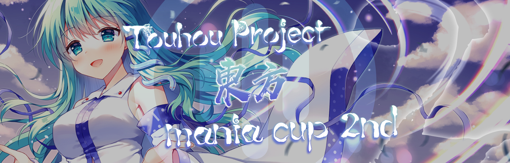

---
tags:
  - TMC
  - TMC 2nd
  - TMC2nd
---

# Touhou Project Mania Cup 2nd

The **Touhou Project Mania Cup 2nd** (***TMC 2nd***) was a team-based 2v2 osu!mania 4K tournament hosted by ::{ flag=CN }:: [\[GB\]Sanae](https://osu.ppy.sh/users/11238501). The main theme of this tournament the Touhou Project. Unlike the previous year, the pool used for TMC 2nd is 100% based on original and fan-made Touhou music. It is the second instalment of the Touhou Project Mania Cup.

## Tournament schedule

| Event | Timestamp |
| --: | :-- |
| Registration phase | 2021-12-20/2022-01-12 |
| Qualifier showcase | 2022-01-23 (12:00 UTC) |
| Qualifier stage | 2022-02-05/2022-02-06 |
| Round of 32 | 2022-02-12/2022-02-13 |
| Round of 16 | 2022-02-19/2022-02-20 |
| Quarterfinals | 2022-02-26/2022-02-27 |
| Semifinals | 2022-03-05/2022-03-06 |
| Finals | 2022-03-12/2022-03-13 |
| Grand Finals | 2022-03-19/2022-03-20 |

## Prizes

| Placing | Prize(s) |
| :-: | :-- |
|  | 4 months of osu!supporter tag, profile badge |
|  | 2 months of osu!supporter tag |
|  | 1 month of osu!supporter tag |

## Organisation

The Touhou Project Mania Cup 2nd was run by the TMC team and various community members.

| Position | Member(s) |
| :-- | :-- |
| Host | ::{ flag=CN }:: [\[GB\]Sanae](https://osu.ppy.sh/users/11238501) |
| Co-host | ::{ flag=GB }:: [-Deepdive-](https://osu.ppy.sh/users/13338645), ::{ flag=CN }:: [cdwcgt](https://osu.ppy.sh/users/14721101) |
| Mappool selector | ::{ flag=GB }:: [-Deepdive-](https://osu.ppy.sh/users/13338645), ::{ flag=CN }:: [\[Crz\]hinako1804](https://osu.ppy.sh/users/13747903), ::{ flag=MX }:: [\[OSC\]Amagai](https://osu.ppy.sh/users/9658070), ::{ flag=ID }:: [eZmmR](https://osu.ppy.sh/users/8647138), ::{ flag=GB }:: [H1Pur](https://osu.ppy.sh/users/15756120), ::{ flag=CN }:: [\[GB\]Sanae](https://osu.ppy.sh/users/11238501), ::{ flag=CN }:: [YuEast 2018](https://osu.ppy.sh/users/13953619) |
| Mappool tester | ::{ flag=CN }:: [\[GB\]Mafufu](https://osu.ppy.sh/users/10884561), ::{ flag=GB }:: [Eliminate](https://osu.ppy.sh/users/9169747), ::{ flag=GB }:: [H1Pur](https://osu.ppy.sh/users/15756120), ::{ flag=SG }:: [Kings](https://osu.ppy.sh/users/1016926) |
| Custom mapper | ::{ flag=GB }:: [-Deepdive-](https://osu.ppy.sh/users/13338645), ::{ flag=CN }:: [\[Crz\]hinako1804](https://osu.ppy.sh/users/13747903), ::{ flag=CN }:: [\[GB\]Mafufu](https://osu.ppy.sh/users/10884561), ::{ flag=MX }:: [\[OSC\]Amagai](https://osu.ppy.sh/users/9658070), ::{ flag=CN }:: [Blue_Potion](https://osu.ppy.sh/users/13094831), ::{ flag=CN }:: [cherrychou](https://osu.ppy.sh/users/7214023), ::{ flag=ID }:: [eZmmR](https://osu.ppy.sh/users/8647138), ::{ flag=GB }:: [H1Pur](https://osu.ppy.sh/users/15756120), ::{ flag=CN }:: [\[GB\]Sanae](https://osu.ppy.sh/users/11238501), ::{ flag=CN }:: [Miscedence](https://osu.ppy.sh/users/15382838), ::{ flag=CN }:: [YuEast 2018](https://osu.ppy.sh/users/13953619), ::{ flag=HK }:: [zero2snow](https://osu.ppy.sh/users/7751516) |
| Showcaser | ::{ flag=GB }:: [-Deepdive-](https://osu.ppy.sh/users/13338645), ::{ flag=TW }:: [\[Crz\]Ha0201](https://osu.ppy.sh/users/12243730), ::{ flag=CN }:: [\[GB\]AelSan](https://osu.ppy.sh/users/14095291), ::{ flag=CN }:: [\[GB\]Mafufu](https://osu.ppy.sh/users/10884561), ::{ flag=CN }:: [\[GB\]Thaumiel](https://osu.ppy.sh/users/15017771), ::{ flag=GB }:: [Eliminate](https://osu.ppy.sh/users/9169747), ::{ flag=GB }:: [H1Pur](https://osu.ppy.sh/users/15756120), ::{ flag=HK }:: [zero2snow](https://osu.ppy.sh/users/7751516) |
| Referee | ::{ flag=GB }:: [-Deepdive-](https://osu.ppy.sh/users/13338645), ::{ flag=CN }:: [\[GB\]Mafufu](https://osu.ppy.sh/users/10884561), ::{ flag=CN }:: [cdwcgt](https://osu.ppy.sh/users/14721101), ::{ flag=GB }:: [H1Pur](https://osu.ppy.sh/users/15756120), ::{ flag=CN }:: [\[GB\]Sanae](https://osu.ppy.sh/users/11238501), ::{ flag=BR }:: [Konohana Lucia](https://osu.ppy.sh/users/8642224), ::{ flag=ID }:: [SanjayaIH](https://osu.ppy.sh/users/12202728), ::{ flag=DE }:: [TheHunter1](https://osu.ppy.sh/users/6496016), ::{ flag=ID }:: [Yukari\_Sama](https://osu.ppy.sh/users/6316524) |
| Streamer | ::{ flag=GB }:: [-Deepdive-](https://osu.ppy.sh/users/13338645), ::{ flag=PH }:: [\[KN\]Tenshi](https://osu.ppy.sh/users/18520056), ::{ flag=CN }:: [aiyulu](https://osu.ppy.sh/users/189617), ::{ flag=PL }:: [Bexi](https://osu.ppy.sh/users/11548612), ::{ flag=CN }:: [cdwcgt](https://osu.ppy.sh/users/14721101), ::{ flag=US }:: [Doelon](https://osu.ppy.sh/users/17422924), ::{ flag=US }:: [SunApple](https://osu.ppy.sh/users/11817622) |
| Commentator | ::{ flag=GB }:: [-Deepdive-](https://osu.ppy.sh/users/13338645), ::{ flag=US }:: [-Sparky-](https://osu.ppy.sh/users/3187959), ::{ flag=CN }:: [\[GB\]yobrevelc](https://osu.ppy.sh/users/14128407), ::{ flag=PH }:: [\[KN\]Tenshi](https://osu.ppy.sh/users/18520056), ::{ flag=KR }:: [\[LS\] Rollpan](https://osu.ppy.sh/users/19584910),  ::{ flag=US }:: [Dynascape](https://osu.ppy.sh/users/8784587), ::{ flag=GB }:: [H1Pur](https://osu.ppy.sh/users/15756120), ::{ flag=SG }:: [Kings](https://osu.ppy.sh/users/1016926), ::{ flag=VN }:: [MashedPotato](https://osu.ppy.sh/users/10494860), ::{ flag=US }:: [PorkIsGreat](https://osu.ppy.sh/users/10756322)，::{ flag=PH }:: [Silhoueska Elze](https://osu.ppy.sh/users/11517895), ::{ flag=US }:: [SunApple](https://osu.ppy.sh/users/11817622), ::{ flag=GB }:: [TingMomentum](https://osu.ppy.sh/users/12489832), ::{ flag=BH }:: [Unitori-](https://osu.ppy.sh/users/15772814) |
| Statistician | ::{ flag=VN }:: [MashedPotato](https://osu.ppy.sh/users/10494860) |
| Banner designer | ::{ flag=HK }:: [Chaoslitz](https://osu.ppy.sh/users/3621552) |
| Storyboarder | ::{ flag=CN }:: [\[RT\]Alleyne](https://osu.ppy.sh/users/11279273), ::{ flag=CN }:: [aiyulu](https://osu.ppy.sh/users/189617) |
| Community contributor | ::{ flag=CN }:: [\[RT\]Alleyne](https://osu.ppy.sh/users/11279273), ::{ flag=CA }:: [Nezu-](https://osu.ppy.sh/users/21963245) |
| Wiki editor | ::{ flag=CN }:: [cdwcgt](https://osu.ppy.sh/users/14721101), ::{ flag=CN }:: [Rush\_FTK](https://osu.ppy.sh/users/3046856) |

## Links

- [Discussion thread](https://osu.ppy.sh/community/forums/topics/1481811)
- [Livestream (Twitch)](https://www.twitch.tv/touhoumaniacup_official)
- [Livestream (YouTube)](https://www.youtube.com/channel/UClgz9mNT7ny7YlesOwiitNw)
- [Challonge bracket](https://challonge.com/TMC2nd)
- [Information spreadsheet](https://cdwcgt-my.sharepoint.com/:x:/g/personal/cdwcgt_cdwcgt_top1/EaVVMZD2MeZEjpGFZJgoWGEBhgxQM5ubRWOpaQynzydFSw?e=6t0trY)
- [Statistics spreadsheet](https://docs.google.com/spreadsheets/d/1Nf7XhtkQkl90291EPaIJm5ubdzSbS_3W9xDmEDYiYw0/edit?usp=sharing)

## Participants

| Team | Members |
| :-: | :-- |
| **:1217angry:** | ::{ flag=TW }:: **[Pdog4ni](https://osu.ppy.sh/users/14581544)**, ::{ flag=MY }:: [Auxesiaa](https://osu.ppy.sh/users/16417718), ::{ flag=TW }:: [\[Rweiru\]](https://osu.ppy.sh/users/11234907), ::{ flag=TW }:: [blacktea12](https://osu.ppy.sh/users/13389861) |
| **Komeiji Sisters** | ::{ flag=NL }:: **[LuluChanTV](https://osu.ppy.sh/users/10192760)**, ::{ flag=NO }:: [-TeaBee-](https://osu.ppy.sh/users/12304069) |
| **Chrome Beretta** | ::{ flag=TW }:: **[Nobu150](https://osu.ppy.sh/users/12296460)**, ::{ flag=PH }:: [Samu_2211](https://osu.ppy.sh/users/20689466), ::{ flag=PH }:: [Voidkun](https://osu.ppy.sh/users/19808091) |
| **ICHIGAY!!!** | ::{ flag=MY }:: **[\[Break\]LCJQ](https://osu.ppy.sh/users/11283859)**, ::{ flag=TW }:: [\[-ICHINO-\]](https://osu.ppy.sh/users/13643601), ::{ flag=MY }:: [StyGix](https://osu.ppy.sh/users/7745408), ::{ flag=TH }:: [palmEuEi](https://osu.ppy.sh/users/13656264) |
| **ATKR** | ::{ flag=ID }:: **[Lumierce](https://osu.ppy.sh/users/16706212)**, ::{ flag=ID }:: [NikanzuGZ](https://osu.ppy.sh/users/16198858), ::{ flag=ID }:: [VeganFanBoy](https://osu.ppy.sh/users/16768803) |
| **Œil** | ::{ flag=FR }:: **[Auraah](https://osu.ppy.sh/users/10015908)**, ::{ flag=FR }:: [Elementaires](https://osu.ppy.sh/users/2284328), ::{ flag=FR }:: [Koiidex](https://osu.ppy.sh/users/5193488), ::{ flag=FR }:: [ZayyKen](https://osu.ppy.sh/users/8624433) |
| **Junimo** | ::{ flag=US }:: **[GripWarrior](https://osu.ppy.sh/users/11734610)**, ::{ flag=US }:: [Iylwrychi](https://osu.ppy.sh/users/7794488), ::{ flag=US }:: [mashu](https://osu.ppy.sh/users/12028216), ::{ flag=US }:: [\[GS\]Diamond](https://osu.ppy.sh/users/13076648) |
| **offbrand mwc** | ::{ flag=PH }:: **[Silhoueska Elze](https://osu.ppy.sh/users/11517895)**, ::{ flag=US }:: [ok bye](https://osu.ppy.sh/users/15063813), ::{ flag=PH }:: [- O R E O](https://osu.ppy.sh/users/17802217) |
| **qgmodfanclub** | ::{ flag=CH }:: **[Tubey](https://osu.ppy.sh/users/16790509)**, ::{ flag=HK }:: [Larksymoo](https://osu.ppy.sh/users/19593133), ::{ flag=MY }:: [Hong727](https://osu.ppy.sh/users/15194755) |
| **TheAnswerIsPorn** | ::{ flag=US }:: **[SunApple](https://osu.ppy.sh/users/11817622)**, ::{ flag=US }:: [RhymesWithMash](https://osu.ppy.sh/users/18834550), ::{ flag=US }:: [Orca-](https://osu.ppy.sh/users/7958845), ::{ flag=US }:: [\[LS\]Fox](https://osu.ppy.sh/users/15270411) |
| **bru.** | ::{ flag=VN }:: **[Lott](https://osu.ppy.sh/users/13821222)**, ::{ flag=PL }:: [Likieras](https://osu.ppy.sh/users/17548825), ::{ flag=TH }:: [Trushi](https://osu.ppy.sh/users/19629933), ::{ flag=PH }:: [XxSmuckxX](https://osu.ppy.sh/users/15748558) |
| **Knation** | ::{ flag=PH }:: **[4Kenn](https://osu.ppy.sh/users/20496815)**, ::{ flag=PH }:: [Axfaerie](https://osu.ppy.sh/users/13857689), ::{ flag=PH }:: [TheMysteryL](https://osu.ppy.sh/users/14113974), ::{ flag=PH }:: [betanrobot](https://osu.ppy.sh/users/16021427) |
| **badplayers49** | ::{ flag=SG }:: **[Roxybuff](https://osu.ppy.sh/users/11917711)**, ::{ flag=SG }:: [ecfecfehycbey](https://osu.ppy.sh/users/15323784), ::{ flag=SG }:: [Eliminate 2](https://osu.ppy.sh/users/12297375) |
| **ExtraRipeApples** | ::{ flag=DE }:: **[ERA Punish](https://osu.ppy.sh/users/10615367)**, ::{ flag=DE }:: [ERA medium kek](https://osu.ppy.sh/users/11625617), ::{ flag=US }:: [ERA Zenith](https://osu.ppy.sh/users/7128063), ::{ flag=US }:: [ERA Klarion](https://osu.ppy.sh/users/13857986) |
| **monkey bussines** | ::{ flag=NL }:: **[Shoira](https://osu.ppy.sh/users/13377652)**, ::{ flag=NL }:: [Freek](https://osu.ppy.sh/users/9630674), ::{ flag=NL }:: [samuelhklumpers](https://osu.ppy.sh/users/10945523), ::{ flag=NL }:: [Ready Perfectly](https://osu.ppy.sh/users/10944966) |
| **FNF Club Germany** | ::{ flag=DE }:: **[d3lt3x](https://osu.ppy.sh/users/14283669)**, ::{ flag=DE }:: [Sazkey](https://osu.ppy.sh/users/10039087), ::{ flag=DE }:: [Der_Entsafter69](https://osu.ppy.sh/users/13210231), ::{ flag=DE }:: [-SparklingCat-](https://osu.ppy.sh/users/15440118) |
| **I MUST SESE** | ::{ flag=CN }:: **[Rizazyh](https://osu.ppy.sh/users/13673300)**, ::{ flag=CN }:: [Black Aurora](https://osu.ppy.sh/users/17861631), ::{ flag=CN }:: [hitohad](https://osu.ppy.sh/users/13651980), ::{ flag=CN }:: [\[GB\]Foxy1459](https://osu.ppy.sh/users/14938400) |
| **Polygon** | ::{ flag=JP }:: **[yuukituk](https://osu.ppy.sh/users/11998955)**, ::{ flag=TH }:: [Achino](https://osu.ppy.sh/users/13349388) |
| **Fumo** | ::{ flag=MY }:: **[-Einar-](https://osu.ppy.sh/users/8782656)**, ::{ flag=PH }:: [Akatsumi Chan](https://osu.ppy.sh/users/11306351), ::{ flag=MY }:: [Ju1nY11](https://osu.ppy.sh/users/14743871), ::{ flag=CN }:: [WLYMinato](https://osu.ppy.sh/users/12703319) |
| **Appendicitis** | ::{ flag=BR }:: **[DemiFiendSMT](https://osu.ppy.sh/users/20051971)**, ::{ flag=BR }:: [LeMarcinho](https://osu.ppy.sh/users/13347579), ::{ flag=VN }:: [Tuyet](https://osu.ppy.sh/users/14821320), ::{ flag=BR }:: [Sprrumnk Lokii](https://osu.ppy.sh/users/10622472) |
| **Ricemakers** | ::{ flag=ID }:: **[I_cantplay](https://osu.ppy.sh/users/18309106)**, ::{ flag=ID }:: [\[Albert\]](https://osu.ppy.sh/users/12689667), ::{ flag=ID }:: [IceVee](https://osu.ppy.sh/users/8108213), ::{ flag=ID }:: [Dogethedoge25](https://osu.ppy.sh/users/15597315) |
| **omsim** | ::{ flag=PH }:: **[\[Crz\]joseee-](https://osu.ppy.sh/users/10083439)**, ::{ flag=PH }:: [Arccat](https://osu.ppy.sh/users/4848294), ::{ flag=PH }:: [J1002](https://osu.ppy.sh/users/11958940), ::{ flag=PH }:: [Vulpsi](https://osu.ppy.sh/users/12584420) |
| **Black Stick Rot** | ::{ flag=GB }:: **[TingMomentum](https://osu.ppy.sh/users/12489832)**, ::{ flag=DE }:: [nanhira](https://osu.ppy.sh/users/15806513), ::{ flag=PH }:: [Silicosis](https://osu.ppy.sh/users/15548876) |
| **oh10** | ::{ flag=PH }:: **[\[KN\]CuB-03](https://osu.ppy.sh/users/18560307)**, ::{ flag=PH }:: [Dyei](https://osu.ppy.sh/users/23643731), ::{ flag=PH }:: [Hagorromoo](https://osu.ppy.sh/users/11923046), ::{ flag=PH }:: [EpicBaconBoi](https://osu.ppy.sh/users/16391523) |
| **house deepwoken** | ::{ flag=US }:: **[BaniiYanii](https://osu.ppy.sh/users/11888159)**, ::{ flag=US }:: [\[GS\]Antunder](https://osu.ppy.sh/users/10416995), ::{ flag=US }:: [SplegoNinjago](https://osu.ppy.sh/users/13488298), ::{ flag=CA }:: [\[ro\]Nosteal](https://osu.ppy.sh/users/8160564) |
| **yes** | ::{ flag=CZ }:: **[grillroasted](https://osu.ppy.sh/users/18271627)**, ::{ flag=BR }:: [Gabi Kamui](https://osu.ppy.sh/users/10658391) |
| **Shion Lovers** | ::{ flag=JP }:: **[kazuin](https://osu.ppy.sh/users/10739680)**, ::{ flag=US }:: [walnutt](https://osu.ppy.sh/users/8617859), ::{ flag=US }:: [\[GS\]Pusheen](https://osu.ppy.sh/users/10192251), ::{ flag=US }:: [dinga dog](https://osu.ppy.sh/users/12206447) |
| **Estudia Sonso** | ::{ flag=PE }:: **[bxd_juice](https://osu.ppy.sh/users/17152485)**, ::{ flag=PE }:: [-Lalito898](https://osu.ppy.sh/users/15098503), ::{ flag=PE }:: [no6hope](https://osu.ppy.sh/users/12193700) |
| **Hourai Elixir** | ::{ flag=CA }:: **[Stability](https://osu.ppy.sh/users/6701738)**, ::{ flag=CA }:: [GDMem](https://osu.ppy.sh/users/10804091), ::{ flag=CA }:: [loafusofbread](https://osu.ppy.sh/users/9278959), ::{ flag=CA }:: [arpia97](https://osu.ppy.sh/users/6363008) |
| **TouWhou?** | ::{ flag=CA }:: **[AmariaLove](https://osu.ppy.sh/users/17036270)**, ::{ flag=CA }:: [RaGe Radical](https://osu.ppy.sh/users/13887380), ::{ flag=CA }:: [Nezukiki](https://osu.ppy.sh/users/21963245), ::{ flag=CA }:: [walmart5193](https://osu.ppy.sh/users/16468962) |
| **holiv reprdution** | ::{ flag=BH }:: **[Unitori-](https://osu.ppy.sh/users/15772814)**, ::{ flag=QA }:: [cyta\_](https://osu.ppy.sh/users/15444660), ::{ flag=ID }:: [Revv-](https://osu.ppy.sh/users/12424909), ::{ flag=SA }:: [HeSo71](https://osu.ppy.sh/users/12556314) |
| **los uras** | ::{ flag=AR }:: **[aluuu](https://osu.ppy.sh/users/4585260)**, ::{ flag=AR }:: [lxLucasxl](https://osu.ppy.sh/users/3632846), ::{ flag=AR }:: [C90](https://osu.ppy.sh/users/13858488) |
| **Manip as Gaeilge** | ::{ flag=IE }:: **[evanxo](https://osu.ppy.sh/users/10681173)**, ::{ flag=IE }:: [Just FC](https://osu.ppy.sh/users/14646283) |
| **sllab amogus** | ::{ flag=HK }:: **[MegMewtwoZ](https://osu.ppy.sh/users/13235067)**, ::{ flag=TH }:: [banan](https://osu.ppy.sh/users/16011592), ::{ flag=VN }:: [CPT_Sivelia](https://osu.ppy.sh/users/12562107), ::{ flag=SG }:: [IJosephI\[GS\]](https://osu.ppy.sh/users/13353749) |
| **rice quadruplets** | ::{ flag=US }:: **[\[Crz\]Mitter](https://osu.ppy.sh/users/14551764)**, ::{ flag=SG }:: [Xvenn](https://osu.ppy.sh/users/13390529), ::{ flag=SG }:: [upr-](https://osu.ppy.sh/users/14099962), ::{ flag=US }:: [Darkmew2](https://osu.ppy.sh/users/13921965) |
| **Watermelon** | ::{ flag=ID }:: **[Fr05tyGD](https://osu.ppy.sh/users/14230684)**, ::{ flag=VN }:: [Micleak](https://osu.ppy.sh/users/16140674), ::{ flag=PH }:: [DaMeMeThEiFxD](https://osu.ppy.sh/users/14324153) |
| **Cirno Fumo** | ::{ flag=MY }:: **[Solify](https://osu.ppy.sh/users/12054898)**, ::{ flag=MY }:: [LouisZpro](https://osu.ppy.sh/users/6231292), ::{ flag=US }:: [KamaCrimson](https://osu.ppy.sh/users/6362259) |
| **CHONGER** | ::{ flag=GB }:: **[jamge](https://osu.ppy.sh/users/2377299)**, ::{ flag=US }:: [amge](https://osu.ppy.sh/users/5116922) |
| **Among Sus** | ::{ flag=FR }:: **[LuKxHiro](https://osu.ppy.sh/users/13363947)**, ::{ flag=US }:: [Ant](https://osu.ppy.sh/users/6725338) |
| **Why not** | ::{ flag=PH }:: **[Euanofthedead](https://osu.ppy.sh/users/15676812)**, ::{ flag=PH }:: [Giannithegdnoob](https://osu.ppy.sh/users/15673828) |
| **Amongus w** | ::{ flag=ID }:: **[NoEL123n](https://osu.ppy.sh/users/3602232)**, ::{ flag=ID }:: [chantomoe](https://osu.ppy.sh/users/20835843), ::{ flag=ID }:: [Ihram-San](https://osu.ppy.sh/users/9908055), ::{ flag=ID }:: [KinoJourney](https://osu.ppy.sh/users/15798093) |
| **random people yes** | ::{ flag=PH }:: **[theXiMOON12](https://osu.ppy.sh/users/23541667)**, ::{ flag=PH }:: [Redreig](https://osu.ppy.sh/users/22716609) |
| **Sierra Leone** | ::{ flag=US }:: **[cygerion](https://osu.ppy.sh/users/20020441)**, ::{ flag=US }:: [EpsilonMaiagare](https://osu.ppy.sh/users/3855052), ::{ flag=US }:: [AwsumKyl3](https://osu.ppy.sh/users/9620690), ::{ flag=US }:: [- Sky -](https://osu.ppy.sh/users/15255368) |
| **Ordirehv** | ::{ flag=NL }:: **[2fast4you98](https://osu.ppy.sh/users/5183940)**, ::{ flag=NL }:: [Bakuretsue](https://osu.ppy.sh/users/10960533), ::{ flag=NL }:: [Toxic scent](https://osu.ppy.sh/users/12599154), ::{ flag=CN }:: [\[Crz\]Caicium](https://osu.ppy.sh/users/10702235) |
| **cutecat.jpeg** | ::{ flag=BR }:: **[Sandroca](https://osu.ppy.sh/users/13221078)**, ::{ flag=BR }:: [Joaodapesti](https://osu.ppy.sh/users/12140623) |
| **YEP** | ::{ flag=MY }:: **[Kibitz](https://osu.ppy.sh/users/7418493)**,  ::{ flag=US }:: [Dhark](https://osu.ppy.sh/users/18662422) |
| **ODV** | ::{ flag=FR }:: **[Langoustins](https://osu.ppy.sh/users/17194567)**, ::{ flag=FR }:: [Celian43](https://osu.ppy.sh/users/20046970) |
| **skill issue** | ::{ flag=AR }:: **[astoneworm](https://osu.ppy.sh/users/23410931)**, ::{ flag=US }:: [silicosis et](https://osu.ppy.sh/users/12253636) |
| **OibdciHvete** | ::{ flag=PH }:: **[JayAreEee](https://osu.ppy.sh/users/10852557)**, ::{ flag=PH }:: [FiddleMinger](https://osu.ppy.sh/users/10300115), ::{ flag=PH }:: [Flare_Drake](https://osu.ppy.sh/users/11628350) |
| **sham macro** | ::{ flag=NZ }:: **[kit-](https://osu.ppy.sh/users/10981171)**, ::{ flag=AU }:: [Merami Crab](https://osu.ppy.sh/users/11523326), ::{ flag=AU }:: [Kites](https://osu.ppy.sh/users/4922584) |
| **BEAN TEAM** | ::{ flag=US }:: **[-Sparky-](https://osu.ppy.sh/users/3187959)**, ::{ flag=US }:: [LeftyRighty](https://osu.ppy.sh/users/2934698) |
| **Volvo Gaming** | ::{ flag=US }:: **[ERA Jungle](https://osu.ppy.sh/users/9709652)**, ::{ flag=US }:: [swagmember](https://osu.ppy.sh/users/23005425), ::{ flag=CA }:: [ZeMaB](https://osu.ppy.sh/users/15633324) |
| **Mage's Orphans** | ::{ flag=DE }:: **[Yenaek](https://osu.ppy.sh/users/10967343)**, ::{ flag=GB }:: [SinCrone](https://osu.ppy.sh/users/9426809) |
| **Assmen** | ::{ flag=BE }:: **[flyerbram002](https://osu.ppy.sh/users/12725421)**, ::{ flag=BE }:: [shaafs](https://osu.ppy.sh/users/8811695), ::{ flag=BE }:: [Reilyy](https://osu.ppy.sh/users/6539319) |
| **Team Pixula** | ::{ flag=CL }:: **[Rhyzt_cL](https://osu.ppy.sh/users/10235085)**, ::{ flag=CL }:: [Xan-](https://osu.ppy.sh/users/5919873), ::{ flag=CL }:: [\[GS\]Myuka](https://osu.ppy.sh/users/10072733), ::{ flag=CL }:: [\[LS\]Choc_cL](https://osu.ppy.sh/users/9729501) |
| **maimai 4ever** | ::{ flag=ID }:: **[dendygaming](https://osu.ppy.sh/users/8678715)**, ::{ flag=ID }:: [aryadevil](https://osu.ppy.sh/users/5514809) |
| **mkwii>mk8** | ::{ flag=DE }:: **[Niko_Plays](https://osu.ppy.sh/users/9409456)**, ::{ flag=DE }:: [Cobraxx](https://osu.ppy.sh/users/9620182) |
| **We Luv Alpaca** | ::{ flag=PE }:: **[Sebas1234213](https://osu.ppy.sh/users/23218007)**, ::{ flag=PE }:: [Lya-](https://osu.ppy.sh/users/23248625), ::{ flag=PE }:: [\[Boywhat\]](https://osu.ppy.sh/users/17551398), ::{ flag=PE }:: [Bultrax](https://osu.ppy.sh/users/20854233) |
| **Trash** | ::{ flag=IE }:: **[MilkWatcher](https://osu.ppy.sh/users/13794811)**, ::{ flag=US }:: [Trontin](https://osu.ppy.sh/users/17785322) |

## Podium

This competition has come to an end and resulted in the following podium:

| Placing | Team |
| :-: | :-- |
|  | Black Stick Rot |
|  | rice quadruplets |
|  | Hourai Elixir |

## Mappools

### Finals

- Rice
  1. [Various Artists - Xingyue's 4K > JackMonster < EP.2 (Xingyue-) \[Halozy / 143 (extended mix)\]](https://osu.ppy.sh/beatmapsets/1113922#mania/2327118)
  2. [Hachimitsu Lemon - far away (YuEast 2018)\[Nocturne\]](https://osu.ppy.sh/beatmapsets/1661860#mania/3392621)
  3. [Pizuya's Cell - Particle Observer (AutotelicBrown) \[Ayumu's Answer\]](https://osu.ppy.sh/beatmapsets/505330#mania/1075628)
  4. [DJKurara - White Hair Little Swords Girl (guden) \[Massacre\]](https://osu.ppy.sh/beatmapsets/1438522#mania/2959918)
  5. [Shiiki Reku - Rhythmy (-Deepdive-) \[Till I'm laid\]](https://osu.ppy.sh/beatmapsets/1648145#mania/3364159)
  6. [t+pazolite - World End's Yama Xanadu (Shoegazer) \[Parousia 1.2x (228bpm)\]](https://osu.ppy.sh/beatmapsets/1397860#mania/2887055)
  7. [Ryu-5150 - Louder than steel (Ryu-5150 - Louder than steel) \[1x\]](https://osu.ppy.sh/beatmapsets/1237160#mania/2745128)
- SV
  1. [t+pazolite - Luv the Lunatic?? (H1Pur) \[Wacky!!\])](https://osu.ppy.sh/beatmapsets/1714032#mania/3502334)
  2. [C-CLAYS - Welcome to Hell (\[GB\]Mafufu) \[Welcome to SV Hell \[Edit\]\]](https://osu.ppy.sh/beatmapsets/1703338#mania/3480234)
- LN
  1. [Camellia - Ultimate Ascension (Penguinosity) \[Vitality 1.1\]](https://osu.ppy.sh/beatmapsets/1589946#mania/3247527)
  2. [loz - Cinderella Cage -Trancecore Mix- (Kamikaze) \[Tails' vs Kami's Lunatic\]](https://osu.ppy.sh/beatmapsets/925063#mania/2022076)
  3. [BUTAOTOME - RAKUEN (\[OSC\]Amagai) \[Lost Paradise\]](https://osu.ppy.sh/beatmapsets/1705604#mania/3485167)
- Hybrid
  1. [Foreground Eclipse - Last Liar Standing (eZmmR) \[Exteeeending Aaaaarm\]](https://osu.ppy.sh/beatmapsets/1628528#mania/3324706)
  2. [ZYTOKINE - Dancing Dollz feat. cold kiss - REDALiCE Remix (\[OSC\]Amagai) \[1.2x Edit\]](https://osu.ppy.sh/beatmapsets/1650227#mania/3485172)
- TieBreaker
  1. **[SEPHID feat. darkxixin - Fu Xiang Di Xin De Luo Ri Liu Hao ~ Little Raven (-Deepdive-) \[Dai Shang Ta De Yan Jing\]](https://osu.ppy.sh/beatmapsets/1714434#mania/3503075)**

### Semi Finals

- Rice
  1. [SOUND HOLIC - Apollo 13 (-Deepdive-) \[Last Word \[\_underjoy\]\]](https://osu.ppy.sh/beatmapsets/1705564#mania/3485080)
  2. [er - Super Izanagi Object (Evening) \[Da \[1.3x Rate\]\]](https://osu.ppy.sh/beatmapsets/1496109#mania/3067002)
  3. [SOUND HOLIC - PAIN DIED AGAIN (YuEast 2018) \[Himitsu.\]](https://osu.ppy.sh/beatmapsets/1661989#mania/3392921)
  4. [t+pazolite feat. Rizna - Ghostly Parapara Ship (Horror struck Edit) (-Deepdive-) \[Parapara Night 1.1x (242bpm) OD8\]](https://osu.ppy.sh/beatmapsets/1665834#mania/3400867)
  5. [TAMAONSEN - Tailin no Soul (\[Crz\]hinako1804) \[The Spirit of Numen x1.1\]](https://osu.ppy.sh/beatmapsets/1678453#mania/3429137)
  6. [UNDEAD CORPORATION - Embraced by the Flame (XingRen) \[XingRen's 14\]](https://osu.ppy.sh/beatmapsets/1611863#mania/3290918)
  7. [Demetori - 幽雅に咲かせ、墨染の桜 ～ Border of Life - (\[GB\]Sanae) \[1.1 \[XingRen\]\]](https://osu.ppy.sh/beatmapsets/1706301#mania/3486480)
- SV
  1. [yamata - Like a flower (Amathcat Remix) (-Deepdive-) \[Blossom\]](https://osu.ppy.sh/beatmapsets/1709481#mania/3493188)
  2. [Kolaa - Witches Rule (Miscedence) \[SV\]](https://osu.ppy.sh/beatmapsets/1628191#mania/3324087)
- LN
  1. [Rerun - icicle,icicle (YuEast 2018) \[noodle,noodle x1.05\]](https://osu.ppy.sh/beatmapsets/1610573#mania/3288374)
  2. [uma feat. SHACHI - take me to the moon (Ballistic) \[Daydream\]](https://osu.ppy.sh/beatmapsets/1562738#mania/3191238)
  3. [Shoujo Fractal - Hatenaki Kaze no Kiseki sae (AuraahDono) \[Even the Endless Wind's Wall\]](https://osu.ppy.sh/beatmapsets/988816#mania/2068407)
- Hybrid
  1. [BUTAOTOME - Guuzou Yuutopia (\[OSC\]Amagai) \[Lunatic 1.05x\]](https://osu.ppy.sh/beatmapsets/1705602#mania/3485161)
  2. [Masayoshi Minoshima feat. nomico - Bad Apple (Camellia's "Bad Psy!!" Remix) (guden) \[Another 1.2x (192bpm)\]](https://osu.ppy.sh/beatmapsets/1490202#mania/3159375)
- TieBreaker
  1. **[Shinra-Bansho - Kakumei no bullet (-Deepdive-) \[Hakurei Danmaku Collab\]](https://osu.ppy.sh/beatmapsets/1706414#mania/3486671)**

### Quarter Finals

- Rice
  1. [nmk feat. Kanaeyume - Memoria (Mipha-) \[miphather\]](https://osu.ppy.sh/beatmapsets/1564347#mania/3194488)
  2. [Shoegazer - Everything Will Freeze (Shoegazer) \[Calamity\]](https://osu.ppy.sh/beatmapsets/728496#mania/1538017)
  3. [ClumsyRecord - Naughty Kitten (Blue\_Potion) \[Naughty Streams 0.95x\]](https://osu.ppy.sh/beatmapsets/1670259#mania/3411405)
  4. [Various - YSOF#2 -Fairy- (YuEast 2018) \[Morimori Atsushi - Tits or get the fuck out!!\]](https://osu.ppy.sh/beatmapsets/1306263#mania/2708327)
  5. [Akiyama Uni - Odoru Mizushibuki (Shoegazer) \[Macabre\]](https://osu.ppy.sh/beatmapsets/376703#mania/3090565)
  6. [AQUAELIE - Broken the Moon (\[Crz\]hinako1804) \[Yue x1.05_P\]](https://osu.ppy.sh/beatmapsets/1180540#mania/3419925)
- SV
  1. [uno(IOSYS) - #Fairy_dancing_in_lake (notapplicable) \[#Fairy_dancing_in_the_world\]](https://osu.ppy.sh/beatmapsets/1128020#mania/2356532)
  2. [Camellia feat. Nanahira - Seashore on the moon (cut ver.) (Bentai Bosmic) \[Tsuki\]](https://osu.ppy.sh/beatmapsets/914391#mania/1909870)
- LN
  1. [Rolling Contact - Jerking Zipper (\[OSC\]Amagai) \[Extra Stage\]](https://osu.ppy.sh/beatmapsets/1700816#mania/3475356)
  2. [TAMAONSEN - Touhou Tanoshii feat. Matsu (YuEast 2018) \[x1.00\]](https://osu.ppy.sh/beatmapsets/1700387#mania/3474376)
- Hybrid
  1. [Shiiki Reku - IDOL (-Deepdive-) \[Haniwa\]](https://osu.ppy.sh/beatmapsets/1642953#mania/3353563)
  2. [Milky - LAST REMOTE (MintApril) \[sleet\]](https://osu.ppy.sh/beatmapsets/741280#mania/1563670)
- Tiebreaker
  1. **[Shinra-Bansho - Observers' Theory (-Deepdive-) \[Collab Insomnia\]](https://osu.ppy.sh/beatmapsets/1701047#mania/3475860)**

### Round of 16

- Rice
  1. [Kohmi Hirose - Promise (Kamikaze) \[GET DOWN\]](https://osu.ppy.sh/beatmapsets/1409056#mania/2938342)
  2. [LeaF - Arianrhod (hi19hi19) \[Mabinogi 1.1x (176bpm)\]](https://osu.ppy.sh/beatmapsets/1676381#mania/3424741)
  3. [ZUN arr.Myon - Plastic Mind(8bit) (Kuo Kyoka) \[snover\'s Phantasm\]](https://osu.ppy.sh/beatmapsets/361936#mania/795044)
  4. [Akiyama Uni - Touhou Hisouten (Blue\_Potion) \[Streams Rhapsody\]](https://osu.ppy.sh/beatmapsets/1670260#mania/3411388)
  5. [FELT - Crescent Moon (\[Crz\]hinako1804\]) \[Bereft Emotion\]](https://osu.ppy.sh/beatmapsets/1655733#mania/3379728)
  6. [Momokami\/SPACELECTRO - DANCING FOX!!! (\[Crz\]hinako1804\]) \[Pure Furies\]](https://osu.ppy.sh/beatmapsets/1661988#mania/3392920)
- SV
  1. [Demetori - Higan no dorei \~ One Conclusion (Tidek) \[Old Rain\]](https://osu.ppy.sh/beatmapsets/1434343#mania/2951779)
  2. [StarX - The little devil dance (Tamaki Iroha) \[Lunatic\]](https://osu.ppy.sh/beatmapsets/1190312#mania/2611063)
- LN
  1. [Marcia - Ashita Chiru Unmei Nara (IA daisuki) \[LuNatic\]](https://osu.ppy.sh/beatmapsets/1660916#mania/3390757)
  2. [ZUN Arranged by er - Gogo No Koishi-chan (Elementaires) \[Tea Time\]](https://osu.ppy.sh/beatmapsets/632689#mania/1343000)
- Hybrid
  1. [Rin - Eientewi set 15 \~ Evening Primrose (-Deepdive-) \[Dark Sleep...\[Rio1-\]\]](https://osu.ppy.sh/beatmapsets/1694322#mania/3462059)<!-- TODO: broken link -->
  2. [Camellia - CLOUDY WITH INTERMITTENT RAIN (Cut Ver.) (Salty Mermaid) \[Flowing Skies\]](https://osu.ppy.sh/beatmapsets/1366426#mania/2826087)
- Tiebreaker
  1. **[FELT - JOURNEY (-Deepdive-) \[Caelum\]](https://osu.ppy.sh/beatmapsets/1693521#mania/3460519)**

### Round of 32

- Rice
  1. [Naukorin - Luv of Magical Synth (-Deepdive-) \[Adoration\]](https://osu.ppy.sh/beatmapsets/1619719#mania/3408041)
  2. [t+pazolite -Kansabi (Zyph) \[Desolation\]](https://osu.ppy.sh/beatmapsets/1125904#mania/2352472)
  3. [REDALiCE - Kizuato (Xingyue) \[ANEGL\]](https://osu.ppy.sh/beatmapsets/1415108#mania/2916557)
  4. [FELT - Puppet in the Dark (Part2 : Buried Away) (\[Crz\]hinako1804) \[INTER\]](https://osu.ppy.sh/beatmapsets/1396066#mania/2881454)
  5. [C.H.S- Luv\*Lab\*Poison 22ate! (Cut Ver.) (Hytex) \[Insane\]](https://osu.ppy.sh/beatmapsets/1349559#mania/2795107)
- SV
  1. [Dat File Records, kju:8 - Greenwich burned down III (GetDatGreen) \[Trapped\]](https://osu.ppy.sh/beatmapsets/1317026#mania/2728913)
  2. [Mei Ayakura - MANIACAL DEGREE (IA daisuki) \[Hard\]](https://osu.ppy.sh/beatmapsets/1685095#mania/3443245)
- LN
  1. [cYsmix - Abandoned Shrine Party (juankristal) \[Stage 3: Outliers\]](https://osu.ppy.sh/beatmapsets/948789#mania/1981397)
  2. [FELT - FELT LN Collection (-\[Ulazis\]-) \[Uta kata no to zenu\]](https://osu.ppy.sh/beatmapsets/1532787#mania/3250868)
- Hybrid
  1. [Akiyama Uni - Kanpan Tasogare Shinbun (Larc) \[Lunatic\]](https://osu.ppy.sh/beatmapsets/969976#mania/2303842)
- Tiebreaker
  1. **[UNDEAD CORPORATION - Yoru Naku Usagi wa Yume wo Miru (Antori) \[Invisible Full Moon\]](https://osu.ppy.sh/beatmapsets/1224030#mania/2565290)**

### Qualifier

- Accuracy
  1. [ZUN - Mou Uta Shika Kikoenai (IA daisuki) \[Stage 1: Night Bird\]](https://osu.ppy.sh/beatmapsets/1681554#mania/3435266)
- LN
  2. [Amane - Through The Tunnel (eZmmR) \[Stage 2: Fox Winder\]](https://osu.ppy.sh/beatmapsets/1681573#mania/3435296)
- SV
  3. [Mican\* - Sensitive Crisis (zero2snow) \[Stage 3: Ichigo\]](https://osu.ppy.sh/beatmapsets/1681559#mania/3435276)
- Hybrid
  4. [xi - Q.E.D.-Ripples of 495 years- (cherrychou) \[Stage 4: Catadioptricl\]](https://osu.ppy.sh/beatmapsets/1681555#mania/3435269)
- Mixed Rice
  5. [Kyou1110 - Revavavavava Ideoloololololololo (\_-Deepdive-) \[Stage 5: Reverse Ideology\]](https://osu.ppy.sh/beatmapsets/1681566#mania/3435287)

## Match results

### Finals

Saturday, March 12, 2022

| Team A |  |  | Team B | Match link |
| --: | :-: | :-: | :-- | :-- |
| sllab amogus | 3 | **7** | **Ordirehv** | [#1](https://osu.ppy.sh/community/matches/98657070) |
| **rice quadruplets** | **7** | 1 | offbrand mwc | [#1](https://osu.ppy.sh/community/matches/98648075) |

Sunday, March 13, 2022

| Team A |  |  | Team B | Match link |
| --: | :-: | :-: | :-- | :-- |
| Hourai Elixir | 0 | **7** | **Black Stick Rot** | [#1](https://osu.ppy.sh/community/matches/98873851) |
| Ordirehv | 1 | **7** | **rice quadruplets** | [#1](https://osu.ppy.sh/community/matches/98690929) |

Saturday, March 19, 2022

| Team A |  |  | Team B | Match link |
| --: | :-: | :-: | :-- | :-- |
| Hourai Elixir | 1 | **7** | **rice quadruplets** | [#1](https://osu.ppy.sh/community/matches/98873851) |
| **Black Stick Rot** | **7** | 2 | rice quadruplets | [#1](https://osu.ppy.sh/community/matches/99123840) |

Sunday, March 26, 2022

| Team A |  |  | Team B | Match link |
| --: | :-: | :-: | :-- | :-- |
|  |  |  |  |  |

### Semifinals

Saturday, March 5, 2022

| Team A |  |  | Team B | Match link |
| --: | :-: | :-: | :-- | :-- |
| Knation | 4 | **7** | **Team Pixula** | [#1](https://osu.ppy.sh/community/matches/98412630) |
| Fumo | 0 | **7** | **Ordirehv** | [#1](https://osu.ppy.sh/community/matches/98426262) |
| ExtraRipeApples | 2 | **7** | **offbrand mwc** | [#1](https://osu.ppy.sh/community/matches/98430654) |
| **Appendicitis** | **7** | 0 | Œil | [#1](https://osu.ppy.sh/community/matches/98433915) |

Sunday, March 6, 2022

| Team A |  |  | Team B | Match link |
| --: | :-: | :-: | :-- | :-- |
| rice quadruplets | 5 | **7** | **Hourai Elixir** | [#1](https://osu.ppy.sh/community/matches/98456131), [#2](https://osu.ppy.sh/community/matches/98458144) |
| sllab amogus | 4 | **7** | **Black Stick Rot** | [#1](https://osu.ppy.sh/community/matches/98465507) |
| **Ordirehv** | **7** | 6 | Appendicitis | [#1](https://osu.ppy.sh/community/matches/98471338) |
| Team Pixula | -1 | **0** | offbrand mwc | *win by default* |

### Quarterfinals

Saturday, February 26, 2022

| Team A |  |  | Team B | Match link |
| --: | :-: | :-: | :-- | :-- |
| badplayers49 | 0 | **6** | **Team Pixula** | [#1](https://osu.ppy.sh/community/matches/98185056) |
| ICHIGAY!!! | -1 | **0** | **TheAnswerIsPorn** | *win by default* |
| **Œil** | **0** | -1 | Watermelon | *win by default* |
| **offbrand mwc** | **6** | 4 | Ricemakers | [#1](https://osu.ppy.sh/community/matches/98200009) |
| :1217angry: | 2 | **6** | **yes** | [#1](https://osu.ppy.sh/community/matches/98200825) |
| **Ordirehv** | **0** | -1 | TouWhou? | *win by default* |
| monkey bussines | 4 | **6** | **skill issue** | [#1](https://osu.ppy.sh/community/matches/98217705) |
| **Estudia Sonso** | **6** | 0 | Shion Lovers | [#1](https://osu.ppy.sh/community/matches/98219303) |

Sunday, February 27, 2022

| Team A |  |  | Team B | Match link |
| --: | :-: | :-: | :-- | :-- |
| Appendicitis | 3 | **6** | **rice quadruplets** | [#1](https://osu.ppy.sh/community/matches/98223017) |
| **Hourai Elixir** | **6** | 1 | Fumo | [#1](https://osu.ppy.sh/community/matches/98228674) |
| **Black Stick Rot** | **0** | -1 | Knation | *win by default* |
| **sllab amogus** | **6** | 0 | ExtraRipeApples | [#1](https://osu.ppy.sh/community/matches/98244293) |
| skill issue | 2 | **6** | **offbrand mwc** | [#1](https://osu.ppy.sh/community/matches/98228818) |
| **Ordirehv** | **6** | 1 | TheAnswerIsPorn | [#1](https://osu.ppy.sh/community/matches/98249414) |
| **Œil** | **6** | 1 | yes | [#1](https://osu.ppy.sh/community/matches/98249372) |
| Estudia Sonso | 1 | **6** | **Team Pixula** | [#1](https://osu.ppy.sh/community/matches/98258975) |

### Round of 16

Saturday, February 19, 2022

| Team A |  |  | Team B | Match link |
| --: | :-: | :-: | :-- | :-- |
| **Knation** | **6** | 2 | Ordirehv | [#1](https://osu.ppy.sh/community/matches/97945770) |
| Black Stick Rot | **6** | 0 | ICHIGAY!!! | [#1](https://osu.ppy.sh/community/matches/97949454) |
| monkey bussines | 1 | **6** | **rice quadruplets** | [#1](https://osu.ppy.sh/community/matches/97954235) |
| **Hourai Elixir** | **6** | 0 | badplayers49 | [#1](https://osu.ppy.sh/community/matches/97961927) |
| Œil | 5 | **6** | **ExtraRipeApples** | [#1](https://osu.ppy.sh/community/matches/97965002) |

Sunday, February 20, 2022

| Team A |  |  | Team B | Match link |
| --: | :-: | :-: | :-- | :-- |
| Sierra Leone | 0 | **6** | **TheAnswerIsPorn** | [#1](https://osu.ppy.sh/community/matches/98014533) |
| YEP | -1 | **0** | **TouWhou?** | *win by default* |
| oh10 | 1 | **6** | **Watermelon** | [#1](https://osu.ppy.sh/community/matches/97987634) |
| **Appendicitis** | **6** | 2 | offbrand mwc | [#1](https://osu.ppy.sh/community/matches/97992454) |
| **sllab amogus** | **6** | 0 | :1217angry: | [#1](https://osu.ppy.sh/community/matches/97993353) |
| **yes** | **0** | -1 | omsim | *win by default* |
| Estudia Sonso | 3 | **6** | **Fumo** | [#1](https://osu.ppy.sh/community/matches/97995055) |
| FNF Club Germany | 3 | **6** | **Ricemakers** | [#1](https://osu.ppy.sh/community/matches/97997465) |
| **skill issue** | **6** | 2 | bru. | [#1](https://osu.ppy.sh/community/matches/97984442) |
| **Shion Lovers** | **6** | 5 | holiv reprdution | [#1](https://osu.ppy.sh/community/matches/98003567) |
| Assmen | 0 | **6** | **Team Pixula** | [#1](https://osu.ppy.sh/community/matches/98011009) |

### Round of 32

Saturday, January 12, 2022

| Team A |  |  | Team B | Match link |
| --: | :-: | :-: | :-- | :-- |
| **Appendicitis** | **5** | 1 | YEP | [#1](https://osu.ppy.sh/community/matches/97677061) |
| **Hourai  Elixir** | **5** | 0 | oh10 | [#1](https://osu.ppy.sh/community/matches/97677026) |
| **Ordirehv** | **5** | 0 | Ricemakers | [#1](https://osu.ppy.sh/community/matches/97689810) |
| **Knation** | **5** | 0 | FNF Club  Germany | [#1](https://osu.ppy.sh/community/matches/97691432) |
| **ICHIGAY!!!** | **5** | 2 | bru. | [#1](https://osu.ppy.sh/community/matches/97693777) |
| **Œil** | **5** | 1 | Assmen | [#1](https://osu.ppy.sh/community/matches/97694045) |
| **Black Stick  Rot** | **0** | -1 | skill issue | *win by default* |
| yes | 3 | **5** | **Estudia Sonso** | [#1](https://osu.ppy.sh/community/matches/97706983) |
| **monkey  bussines** | **5** | 1 | Sierra Leone | [#1](https://osu.ppy.sh/community/matches/97708186) |

Sunday, January 13, 2022

| Team A |  |  | Team B | Match link |
| --: | :-: | :-: | :-- | :-- |
| TouWhou? | 4 | **5** | **offbrand  mwc** | [#1](https://osu.ppy.sh/community/matches/97718307) |
| TheAnswerIsPorn | 1 | **5** | **rice  quadruplets** | [#1](https://osu.ppy.sh/community/matches/97723198) |
| **sllab amogus** | **5** | 0 | Shion Lovers | [#1]( https://osu.ppy.sh/community/matches/97725051) |
| **badplayers49** | **5** | 4 | Watermelon | [#1]( https://osu.ppy.sh/community/matches/97731754) |
| **:1217angry:** | **5** | 4 | holiv  reprdution | [#1](https://osu.ppy.sh/community/matches/97734519) |
| **Fumo** | **5** | 3 | omsim | [#1]( https://osu.ppy.sh/community/matches/97734449) |
| Team Pixula | -1 | **0** | **ExtraRipeApples** | *win by default* |

### Qualifiers

The final standings for the Qualifier stage can be found on [information spreadsheet](https://cdwcgt-my.sharepoint.com/:x:/g/personal/cdwcgt_cdwcgt_top1/EaVVMZD2MeZEjpGFZJgoWGEBhgxQM5ubRWOpaQynzydFSw?e=6t0trY), and detailed statistics can be found on the [statistic spreadsheet](https://docs.google.com/spreadsheets/d/1Nf7XhtkQkl90291EPaIJm5ubdzSbS_3W9xDmEDYiYw0/edit?usp=sharing).

## Ruleset

The ruleset is mainly based on [osu!mania 4K World Cup 2021](/wiki/Tournaments/MWC/2021_4K) and [4 Digit osu!mania World Cup 4](/wiki/Tournaments/4DM/4).

- Any general rules not showns below, but listed in referance tournament are still valid.
- See [discussion thread](https://osu.ppy.sh/community/forums/topics/1481811) for a more detailed ruleset.

### Tournament rules

1. The Touhou Project Mania Cup 2nd is a team-based team tournament, played on the osu!mania game mode.
2. Beatmap scoring will be based on Score V2.
3. The beatmaps for each round will be announced by the mappool selectors on the Sunday before the actual matches take place.
   - Every mappool, except during Qualifiers, will contain a *tiebreaker* beatmap. It will only be played in case of a tie in the scoreline in the *best of* system, e.g. if the scoreline is 4-4 and the match is best of 9, then the tiebreaker will be played.
4. Match scheduling will be handled by the Tournament Management.
5. If no referee is available at match time, the match will be postponed.
6. Failed players' scores do not get added to the team score.
   - Reviving and surviving during a beatmap is considered as passing it.
7. Use of the Visual Settings to alter background dim or disable beatmap elements like storyboards and skins are allowed.
   - Custom skin elements must not be used to alter core gameplay elements or mechanics.
8. If a game ends in a draw it will be nullified and the beatmap replayed, called a *rematch*.
9. Teams may ask for a rematch if a team member encounters technical difficulties while playing.
   - "Lag spikes" are not considered a valid reason to nullify a beatmap.
   - If a rematch happens, the original roster for each team during that particular beatmap must remain the same. If that is not possible, e.g. by virtue of a technical issue, *both* teams will be allowed to swap rosters.
   - This rule is not to be abused. Referees may veto a rematch request if they find that this is the case.
10. Disconnects within 30 seconds or 25% of the beatmap length (whichever happens first) can be rematched, at the referee's discretion, as long as it's clearly communicated in the chatroom.
11. If a player disconnects, their scores will not be counted towards their team's total, unless adequate proof of said score is provided. The following are considered acceptable proof:
    - Livestream clips or VODs from the player's point of view. The entirety of the play and the results screen must be clearly visible along with the affected player's score.
    - Replay files of the play, taken directly from the "Local scores" tab on the affected player's client (the timestamps must exactly match the time at which the game took place, as seen in the multiplayer match history).
    - Screenshots from other players taken directly in-game that show the affected player's score.
      - Screenshots from the results screen must clearly show the affected player's score. This is the preferred method.
      - Screenshots taken in-game at the time of disconnection may be accepted. Note that this method does not provide a one-to-one representation of that player's score. Using this method is not encouraged and it may be denied at the referee's discretion if the information provided is not sufficient to determine the player's score.
      - All screenshots **MUST** be taken using the game itself, that is, they must be hosted on the `https://osu.ppy.sh/` domain (using `Shift` + `F12`). Any other form of screenshot will be denied.
    - Player scores may be derived from the official stream as a last resort, in cases where the match is streamed.
12. If less than the minimum amount of required players are present at match time, the match can be postponed for up to 10 minutes. If after this period there are still not enough players for either team, a *win by default* will be declared for the side with the most members present.
    - The minimum amount of required players is considered as the amount of players needed to play a beatmap without any vacant spots on the lobby (i.e. 2 participants must be present for the match to begin).
13. If a player disconnects between beatmaps and the team cannot provide a substitute, the match can be delayed for up to 10 minutes (limited to once per team, per match).
14. Exchanging players between games is allowed without limitations.
15. Beatmaps must not be reused in the same match, except for rematches.
16. **The minimum size for a team is 2 players, and the maximum is 4.**
17. Players are expected to keep the match running fluently and without delays. Excessive match delays from the players' side may result in penalties being applied at the referee's discretion. Disrupting the match by foul play, insulting or provoking other players or staff, delaying the match, and other deliberate inappropriate misbehaviour are strictly prohibited, and will be punished accordingly.
18. All players and staff must be treated with respect. Instructions of the referees and the Tournament Management are to be followed. Decisions labelled as final are not to be objected.
19. The multiplayer chatrooms underlie the [osu! community rules](/wiki/Rules). All chat rules apply to the multiplayer chatrooms, too.
    - Breaking the chat rules may result in a silence. Silenced players cannot participate in multiplayer matches and must be exchanged for the duration of the punishment.
20. Penalties for violating the tournament rules include, but are not limited to:
    - Exclusion of specific players for one beatmap.
    - Exclusion of specific players for an entire match.
    - Declaring the match as forfeited, or as a win by default for the other team.
    - Disqualification from the entire tournament.
    - Disqualification from the current and future official tournaments, until appealed.
21. Referees may allow, at their discretion, lower or higher tolerances for timers.
22. The Tournament Management reserves the right to modify these rules at any moment. Any such changes will be announced in advance.

### Tournament registration

1. Please complete the [registration form](https://forms.gle/41fgDJ5XV3PzUGD2A) to registrate.
2. Participants are required to join as teams.
3. The size of a team has a minimum of 2 and a maximum of 4.
4. To ensure valid registrations, every prospective participant will be manually checked by via [tournament screening](/wiki/Tournaments/Official_support#tournament-screening).
   - If any member in a team is blacklisted by organisers or considered "suspicious" by the account support team, the whole team will be disqualified. **Blacklists in other tournaments will be considered as well.**
   - There are no rank requirements for this tournament, but player must not have violated the [osu! community rules](/wiki/Rules) within the last 12 months.
5. All successfully formed teams will be published after the registration phase.
   - A team should have at least 2 players registered to have the chance to play in the Qualifiers.
   - The top 32 seeded teams will qualify to the Round of 32.
6. Tournament staff members are **not** allowed to play in the tournament, with the exception of the commentators.
7. All information of the tournament will be ONLY available on the [Discord server](https://discord.gg/NQkEKqj). All captains are asked to join the server in case of any issues.

### Qualifier instructions

1. During Qualifiers, all teams will play a specific pool designed by the mappool selectors.
2. The qualifier pool contains 5 maps, all of which will use FreeMod rules. There will be no tiebreakers for this stage.
3. The qualifier pool will follow this structure:
   1. Stage 1: Mixed Rice (accuracy)
   2. Stage 2: LN
   3. Stage 3: SV
   4. Stage 4: Hybrid
   5. Stage 5: Mixed Rice (technical/stamina)
4. Teams will have to play the mappool twice at a designated time. The team's best playthrough will be used for seeding.
   - Teams may skip individual maps or the second run altogether if they so desire.
5. The mappool will be played according to the order listed above.
6. Each team must have 2 players for each map. They can be exchanged freely after a map is concluded.
7. An optional 5-minute break will be offered between the first and second playthrough of the mappool.
8. All teams will play their qualifier matches in separate rooms. It is suggested that teams do not broadcast or share their results publicly to avoid seed manipulation.
9. Only the top 32 seeded teams will advance to the Round of 32.

### Stage instructions

1. Following the Qualifiers, a double-elimination bracket will be played. This means that the winning team moves to the next stage while the loser gets moved to the losers' bracket.
2. Teams in the losers bracket must play 2 matches each weekend starting from the Quarterfinals.
3. Teams that lose a match in the losers' bracket are eliminated from the tournament.

### Win conditions

- In the Qualifiers, teams need to place in the top 32 seeded teams in order to advance to the double-elimination stage.
- In the Round of 32, teams need to win 5 maps to win a match (best of 9).
- In the Round of 16 and Quarterfinals, teams need to win 6 maps to win a match (best of 11).
- In the Semifinals, Finals, and Grand Finals, teams need to win 7 maps to win the match (best of 13).

### Match instructions

1. A referee will create a multiplayer room 15 minutes before the scheduled match time. Players must join the lobby in that period.
   - Team captains will be notified of their match via ping on Discord by the referee of their match 15 minutes before the match is scheduled to commence.
   - The room settings are: Game mode: "osu!mania"; Team mode: "Team Vs"; and Score mode: "ScoreV2". The room name must follow this pattern: `TMC2 ({Stage}): ({Blue Team}) vs ({Red Team})`. The team mentioned first in the room name must be the blue team, the team mentioned second in the room name must be the red team.
2. Each captain can ban **one beatmap** from the pool. These beatmaps can not be picked by any team for the entire duration of the match.
3. Beatmap selection will alternate between each captain selecting a beatmap out of the mappool.
4. Each captain must use `!roll` once in `#multiplayer`.
   - The winner of the `!roll` will select which team will pick first.
   - The loser of the `!roll` will select which team will ban first.
5. Teams will have 2 minutes to pick a beatmap and 2 minutes to get ready. If a team takes more time than allotted, the procedure adopted will be as follows:
   - For the first occurrence:
     - The team will receive a verbal warning from the referee
   - On subsequent occurrences:
     - For a pick timer: a random map will be chosen from the mappool using `!roll X`, where X is the number of maps that were neither picked nor banned, excluding the Tiebreaker.
     - For a ready timer: the referee will issue the `!mp start 10` command, regardless of how many players from each team are present in the lobby, using `!mp kick` on any extra players for each team, starting from the top (i.e. the first valid player combination for each team will be forced to play the pick). The results for such games are to be taken as is.
   - Repeat offenders may receive further sanctions from the Tournament Management.
   - Each team will receive one "tactical timeout" of two minutes, to be used as extra time to pick or ban a beatmap. *The tactical timeout is optional*.
     - This timeout is autimatically consumed when regular picking time runs out.
     - The tactical timeout may be called on a tiebreaker, provided that both team's captains agree to it.
   - Each team will receive one technical timeout of 5 minutes, to be used only when a technical issue occurs.
6. Results for the Qualifiers will be published via a statistics sheet.

### Mappool instructions

1. There will be an independent mappool for each stage.
2. Each mappool consists of a fixed amount of maps each stage which will all be played under FreeMod conditions. This means that there is a unique FreeMod bracket.
3. The mappool sizes are as follows:
   - Qualifiers: 5 beatmaps
   - Round of 32: 11 beatmaps
     - Containing: 5 Rice maps, 2 SV maps, 2 LN maps, 1 Hybrid map, 1 Tiebreaker.
   - Round of 16 and Quarter-finals: 13 beatmaps
     - Containing: 6 Rice maps, 2 SV maps, 2 LN maps, 2 Hybrid maps, 1 Tiebreaker.
   - Semifinals, Finals, and Grand Finals: 15 beatmaps
     - Containing: 7 Rice maps, 2 SV maps, 3 LN maps, 2 Hybrid maps, 1 Tiebreaker.
4. Each mappool has one tiebreaker, except for the Qualifiers.
5. Possible mod choices for all maps are [Hidden](/wiki/Gameplay/Game_modifier/Hidden), [FadeIn](/wiki/Gameplay/Game_modifier/Fade_In), [Flashlight](/wiki/Gameplay/Game_modifier/Flashlight), and [Mirror](/wiki/Gameplay/Game_modifier/Mirror).
6. The tiebreaker will be played under FreeMod conditions.

### Scheduling instructions

1. Each stage will be held on **a single weekend**.
2. Matches in Qualifiers will be held during specific time slots proposed by the tournament staff. Each team is free to choose a time slot in which they want to play.
3. All bracket stages will be held between Saturday 0:00 and Sunday 23:59 (UTC).
4. Scheduling will be handled by the Tournament Management. Schedules will be released on the Sunday before the first matches of the stage. The Tournament Management will try to create the schedule to respect the participants' time zones.
   - In the Semifinals and subsequent stages, team captains may inform the Tournament Management if they expect a specific time slot to be unavailable in the following week. Schedule updates will be granted to the best of the Tournament Management's ability.
5. **Reschedules will only be considered if both teams agree to a time.**
   - Reschedules may only be requested by a team captain.
   - Matches may not be scheduled to any time beyond **Sunday 23:59 (UTC)** of the week they are to be played at.
   - If a team needs to reschedule, the captain may make their demand **at least 24 hours** (48 hours recommended) before their match in the reschedule channel.
   - **Do not ask for a reschedule unless it is absolutely needed. The Tournament Management reserves the right to deny any rescheduling request.**
6. Captains are responsible for their teams' availability. Any mishaps resulting from a lack of transparency from a team are to be resolved internally, the Tournament Management will not intervene.
