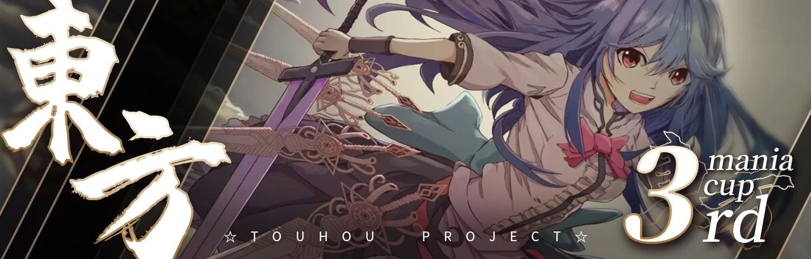

---
tags:
  - TMC
  - THMC
  - THMC 3rd
  - THMC3rd
---

# Touhou Project Mania Cup 3rd

The **Touhou Project Mania Cup 3rd** (***THMC 3rd***) was a team-based 2v2 osu!mania 4K tournament hosted by ::{ flag=CN }:: [\[GB\]Sanae](https://osu.ppy.sh/users/11238501). The main theme of this tournament was the *Touhou Project*. The pool used for THMC 3rd is 100% based on original and fan-made *Touhou* music. It was the third instalment of the Touhou Project Mania Cup.

## Tournament schedule

| Event | Timestamp |
| --: | :-- |
| Registration phase | 2023-04-17/2023-05-01 |
| Qualifier showcase | 2023-05-07 (12:00 UTC) |
| Qualifier stage | 2023-05-07/2022-05-14 |
| Round of 32 | 2023-05-20/2023-05-21 |
| Round of 16 | 2023-05-27/2023-05-28 |
| Quarterfinals | 2023-06-03/2023-06-04 |
| Semifinals | 2023-06-10/2023-06-11 |
| Finals | 2023-06-17/2023-06-18 |
| Grand Finals | 2023-06-24/2023-07-16 |

## Prizes

| Placing | Prize(s) |
| :-: | :-- |
|  | 4 months of osu!supporter tag, profile badge |
|  | 2 months of osu!supporter tag |
|  | 1 month of osu!supporter tag |

## Organisation

The Touhou Project Mania Cup 3rd was run by the THMC team and various community members.

| Position | Member(s) |
| :-- | :-- |
| Host | ::{ flag=CN }:: [\[GB\]Sanae](https://osu.ppy.sh/users/11238501) |
| Co-host | ::{ flag=GB }:: [-Deepdive-](https://osu.ppy.sh/users/13338645), ::{ flag=CN }:: [cdwcgt](https://osu.ppy.sh/users/14721101), ::{ flag=CN }:: [\[GB\]Rush_FTK](https://osu.ppy.sh/users/3046856) |
| Mappool selectors | ::{ flag=CN }:: [YuEast 2018](https://osu.ppy.sh/users/13953619), ::{ flag=CN }:: [\[GB\]Sanae](https://osu.ppy.sh/users/11238501), ::{ flag=CN }:: [\[GB\]Reisen](https://osu.ppy.sh/users/8586018), ::{ flag=CN }:: [cherrychou](https://osu.ppy.sh/users/7214023), ::{ flag=GB }:: [epic man 2](https://osu.ppy.sh/users/14566000), ::{ flag=GB }:: [-Deepdive-](https://osu.ppy.sh/users/13338645) |
| Mappool playtester | ::{ flag=CN }:: [YuEast 2018](https://osu.ppy.sh/users/13953619), ::{ flag=GB }:: [-Deepdive-](https://osu.ppy.sh/users/13338645), ::{ flag=CN }:: [\[GB\]Reisen](https://osu.ppy.sh/users/8586018), ::{ flag=CN }:: [Echo_XF](https://osu.ppy.sh/users/25630297), ::{ flag=CN }:: [\[GB\]r3uz](https://osu.ppy.sh/users/27583184) |
| Custom mapper | ::{ flag=CN }:: [YuEast 2018](https://osu.ppy.sh/users/13953619), ::{ flag=CN }:: [\[GB\]Sanae](https://osu.ppy.sh/users/11238501), ::{ flag=CN }:: [\[GB\]Reisen](https://osu.ppy.sh/users/8586018), ::{ flag=CN }:: [cherrychou](https://osu.ppy.sh/users/7214023), ::{ flag=GB }:: [epic man 2](https://osu.ppy.sh/users/14566000), ::{ flag=GB }:: [-Deepdive-](https://osu.ppy.sh/users/13338645), ::{ flag=CN }:: [\[GB\]V1do](https://osu.ppy.sh/users/17527968), ::{ flag=CN }:: [PORTTAYER](https://osu.ppy.sh/users/8790200), ::{ flag=CN }:: [AelSan](https://osu.ppy.sh/users/14095291), ::{ flag=CN }:: [Blue_Potion](https://osu.ppy.sh/users/13094831) |
| Referee | ::{ flag=CN }:: [\[GB\]Sanae](https://osu.ppy.sh/users/11238501), ::{ flag=CN }:: [YuEast 2018](https://osu.ppy.sh/users/13953619), ::{ flag=CN }:: [cdwcgt](https://osu.ppy.sh/users/14721101), ::{ flag=CN }:: [\[GB\]Rush_FTK](https://osu.ppy.sh/users/3046856), ::{ flag=CN }:: [shizehao](https://osu.ppy.sh/users/4928674), ::{ flag=BR }:: [Konohana Lucia](https://osu.ppy.sh/users/8642224), ::{ flag=PH }:: [Normiplier](https://osu.ppy.sh/users/10069850), ::{ flag=TH }:: [Infinitstart](https://osu.ppy.sh/users/4026124), ::{ flag=US }:: [akace100](https://osu.ppy.sh/users/9308128), ::{ flag=DE }:: [TheHunter1](https://osu.ppy.sh/users/6496016), ::{ flag=GB }:: [-Deepdive-](https://osu.ppy.sh/users/13338645), ::{ flag=CN }:: [\[GB\]ChickenGold](https://osu.ppy.sh/users/16586663), ::{ flag=CN }:: [\[GB\]r3uz](https://osu.ppy.sh/users/27583184) |
| Commentator | ::{ flag=CN }:: [\[GB\]yobrevelc](https://osu.ppy.sh/users/14128407), ::{ flag=GB }:: [-Deepdive-](https://osu.ppy.sh/users/13338645), ::{ flag=CN }:: [\[GB\]Sanae](https://osu.ppy.sh/users/11238501), ::{ flag=CN }:: [\[GB\]Reisen](https://osu.ppy.sh/users/8586018), ::{ flag=CN }:: [\[GB\]Rush_FTK](https://osu.ppy.sh/users/3046856) |
| Streamer | ::{ flag=CN }:: [cdwcgt](https://osu.ppy.sh/users/14721101), ::{ flag=CN }:: [\[GB\]Rush_FTK](https://osu.ppy.sh/users/3046856), ::{ flag=CN }:: [\[GB\]ChickenGold](https://osu.ppy.sh/users/16586663), ::{ flag=CN }:: [Selis](https://osu.ppy.sh/users/5112995), ::{ flag=GB }:: [-Deepdive-](https://osu.ppy.sh/users/13338645), ::{ flag=US }:: [EpsilonMaiagare](https://osu.ppy.sh/users/3855052) |
| Graphic designer | ::{ flag=CN }:: [\[GB\]King Fish](https://osu.ppy.sh/users/8468203), ::{ flag=CN }:: [lovely_hyahya](https://osu.ppy.sh/users/10318380), ::{ flag=CN }:: [\[GB\]PlayandyoU](https://osu.ppy.sh/users/14759634), ::{ flag=CN }:: [RiceSS](https://osu.ppy.sh/users/8271436) |
| Musician | ::{ flag=CN }:: [\[GB\]Azukisan](https://osu.ppy.sh/users/5378805) |
| Statistician & wiki editor | ::{ flag=CN }:: [cdwcgt](https://osu.ppy.sh/users/14721101), ::{ flag=CN }:: [\[GB\]Rush_FTK](https://osu.ppy.sh/users/3046856), ::{ flag=FR }:: [PatouZ](https://osu.ppy.sh/users/7306522), ::{ flag=CN }:: [YuEast 2018](https://osu.ppy.sh/users/13953619) |

## Links

- [Discussion thread](https://osu.ppy.sh/community/forums/topics/1751979)
- [Livestream (Twitch)](https://www.twitch.tv/touhoumaniacup_official)
- [Livestream (YouTube)](https://www.youtube.com/channel/UClgz9mNT7ny7YlesOwiitNw)
- [Challonge bracket](https://challonge.com/THMC3)
- [Information spreadsheet](https://docs.google.com/spreadsheets/d/1ZVZwRSBjtmjYHozK_WEvgNuUx-aoOEwFLLvMtGJevRY/edit?usp=sharing)
- [Statistics spreadsheet](https://docs.google.com/spreadsheets/d/1VQzTrKuRg0eo9Y0HoALe7qzyltvbXYoURO9wJGdAZdg/edit?usp=sharing) made by [PatouZ](https://osu.ppy.sh/users/7306522)

## Participants

| Team | Members |
| :-: | :-- |
| **:1217angry:** | ::{ flag=TW }:: **[blacktea12](https://osu.ppy.sh/users/13389861)**, ::{ flag=TW }:: [Axium0w0](https://osu.ppy.sh/users/16125443), ::{ flag=TW }:: [Pdog4ni](https://osu.ppy.sh/users/14581544) |
| **"undecided"** | ::{ flag=PH }:: **[DaMeMeThEiFxD](https://osu.ppy.sh/users/14324153)**, ::{ flag=SG }:: [ERA Adam](https://osu.ppy.sh/users/12297375), ::{ flag=US }:: [carpal tunnel](https://osu.ppy.sh/users/34314648), ::{ flag=CL }:: [nyawaa](https://osu.ppy.sh/users/10235085) |
| **4VKZ** | ::{ flag=RU }:: **[tchyoouschqueey](https://osu.ppy.sh/users/6691100)**, ::{ flag=RU }:: [HV4](https://osu.ppy.sh/users/25913397), ::{ flag=RU }:: [ZugamiRA](https://osu.ppy.sh/users/11026954), ::{ flag=RU }:: [Zavodila2121](https://osu.ppy.sh/users/26938475) |
| **5 Digit Warriors** | ::{ flag=US }:: **[xBasicReamcy](https://osu.ppy.sh/users/15990628)**, ::{ flag=VN }:: [DNABBTBT](https://osu.ppy.sh/users/28188220) |
| **Alisa Mikhailovna Kujou** | ::{ flag=SG }:: **[sukidayo-](https://osu.ppy.sh/users/16870002)**, ::{ flag=SG }:: [McButt](https://osu.ppy.sh/users/18018708), ::{ flag=SG }:: [TheOPMeme](https://osu.ppy.sh/users/15763622), ::{ flag=HK }:: [RyanWong1216](https://osu.ppy.sh/users/19030562) |
| **Amogus** | ::{ flag=SA }:: **[Raiden129](https://osu.ppy.sh/users/23034813)**, ::{ flag=MY }:: [YtAlbin0](https://osu.ppy.sh/users/21873512), ::{ flag=HK }:: [WhiteKyleIsANub](https://osu.ppy.sh/users/18824384) |
| **Ariana Grande Fanboys** | ::{ flag=CA }:: **[Holo The Wise](https://osu.ppy.sh/users/17036270)**, ::{ flag=CA }:: [Robert6400](https://osu.ppy.sh/users/11467559), ::{ flag=CA }:: [Twitch Chat](https://osu.ppy.sh/users/12723207), [betsuni](https://osu.ppy.sh/users/21020437) |
| **AustralianSpiders** | ::{ flag=US }:: **[astal_](https://osu.ppy.sh/users/32151196)**, ::{ flag=GB }:: [AspectOfTheDie](https://osu.ppy.sh/users/19191509), ::{ flag=CA }:: [Bushidored98](https://osu.ppy.sh/users/15570263) |
| **Bloxy cola** | ::{ flag=ID }:: **[adihza](https://osu.ppy.sh/users/18309106)**, ::{ flag=PH }:: [4kenn](https://osu.ppy.sh/users/20496815), ::{ flag=ID }:: [bad hd player](https://osu.ppy.sh/users/13385865) |
| **bob** | ::{ flag=NL }:: **[Shoira](https://osu.ppy.sh/users/13377652)**, ::{ flag=NL }:: [samuelhklumpers](https://osu.ppy.sh/users/10945523), ::{ flag=TH }:: [\[Ping\]](https://osu.ppy.sh/users/6291395), ::{ flag=NL }:: [Quinnie why](https://osu.ppy.sh/users/16999311) |
| **BOCA JUNIORS** | ::{ flag=BR }:: **[Netroo](https://osu.ppy.sh/users/13769101)**, ::{ flag=US }:: [Surcanp](https://osu.ppy.sh/users/19862784), ::{ flag=VN }:: [BC1_CI9](https://osu.ppy.sh/users/25923595), ::{ flag=AR }:: [- Kuru](https://osu.ppy.sh/users/24649329) |
| **bounter gaming** | ::{ flag=AU }:: **[shorts](https://osu.ppy.sh/users/8021372)**, ::{ flag=PH }:: [Axfaerie](https://osu.ppy.sh/users/13857689), ::{ flag=AU }:: [-Ainsel-](https://osu.ppy.sh/users/27855382), ::{ flag=PH }:: [choydoru_meep28](https://osu.ppy.sh/users/23327830) |
| **BurguerDeFresa** | ::{ flag=ES }:: **[yordi](https://osu.ppy.sh/users/17968946)**, ::{ flag=ES }:: [ShiropeDeFresa](https://osu.ppy.sh/users/16020685), ::{ flag=CL }:: [\[LS\]bambi fnf](https://osu.ppy.sh/users/20360332), ::{ flag=HN }:: [\[HD\]Weathersito](https://osu.ppy.sh/users/24167604) |
| **Catcat** | ::{ flag=CN }:: **[\[Crz\]Xinyi2016](https://osu.ppy.sh/users/14213841)**, ::{ flag=CN }:: [\[ Classic \]](https://osu.ppy.sh/users/5858053), ::{ flag=CN }:: [\[GB\]QAQlingjiu](https://osu.ppy.sh/users/27288518), ::{ flag=CN }:: [\[GB\]namelest](https://osu.ppy.sh/users/17812436) |
| **cirno car** | ::{ flag=NZ }:: **[Robeats](https://osu.ppy.sh/users/19446399)**, ::{ flag=PH }:: [iid3rp](https://osu.ppy.sh/users/23274559), ::{ flag=AU }:: [Orcanos](https://osu.ppy.sh/users/13762441), ::{ flag=AU }:: [AnatharaX](https://osu.ppy.sh/users/14390680) |
| **cirno overrated** | ::{ flag=TH }:: **[Natsurio](https://osu.ppy.sh/users/17721836)**, ::{ flag=TH }:: [Mkurisutina-](https://osu.ppy.sh/users/15514768) |
| **CovidPoeRoblox** | ::{ flag=TH }:: **[- Rinmoz -](https://osu.ppy.sh/users/16639144)**, ::{ flag=TH }:: [SHOKO -](https://osu.ppy.sh/users/10279743), ::{ flag=TH }:: [Freshky](https://osu.ppy.sh/users/11959687), ::{ flag=TH }:: [basicmaime](https://osu.ppy.sh/users/6537441) |
| **Dizzy Troopers** | ::{ flag=US }:: **[trooperboi](https://osu.ppy.sh/users/32028459)**, ::{ flag=CA }:: [dizzywood3](https://osu.ppy.sh/users/15648394) |
| **Dual Mania'cs** | ::{ flag=UA }:: **[jrjin228](https://osu.ppy.sh/users/19927608)**, ::{ flag=PH }:: [Drew_TheMaster](https://osu.ppy.sh/users/13455818) |
| **El Fortnite Legends \[EFL\]** | ::{ flag=MA }:: **[ZeD_](https://osu.ppy.sh/users/14973137)**, ::{ flag=MA }:: [Enissay](https://osu.ppy.sh/users/26637662), ::{ flag=ES }:: [P_F_C_PRO](https://osu.ppy.sh/users/23731093) |
| **eswatini (real) + 1** | ::{ flag=US }:: **[cyger](https://osu.ppy.sh/users/20020441)**, ::{ flag=CA }:: [7Reinn-](https://osu.ppy.sh/users/25766718), ::{ flag=US }:: [Cirbyy](https://osu.ppy.sh/users/15582703), ::{ flag=CA }:: [\[OSG\] rosetta](https://osu.ppy.sh/users/27166588) |
| **Extreme Reimu Admirers** | ::{ flag=US }:: **[junglesnipes](https://osu.ppy.sh/users/9709652)**, ::{ flag=CA }:: [ZeMaB](https://osu.ppy.sh/users/15633324), ::{ flag=US }:: [ERA Imperial](https://osu.ppy.sh/users/5066305), ::{ flag=US }:: [ERA Zenith](https://osu.ppy.sh/users/7128063) |
| **Fortniteloliclub** | ::{ flag=MX }:: **[TheMoonLoop](https://osu.ppy.sh/users/15628036)**, ::{ flag=CL }:: [KrNatomi](https://osu.ppy.sh/users/15922672), ::{ flag=BO }:: [xhalez](https://osu.ppy.sh/users/21478615) |
| **Fumados** | **[altros](https://osu.ppy.sh/users/10794280)**, ::{ flag=MX }:: [Shadow_GM](https://osu.ppy.sh/users/19554046), ::{ flag=PA }:: [Bolelo](https://osu.ppy.sh/users/23819962), ::{ flag=MX }:: [Darkhechiser](https://osu.ppy.sh/users/23392961) |
| **Fumi gaming** | ::{ flag=CZ }:: **[huypham_gm](https://osu.ppy.sh/users/16978354)**, ::{ flag=VN }:: [Qi-ryu](https://osu.ppy.sh/users/21211350), ::{ flag=VN }:: [HuyK4sp3r](https://osu.ppy.sh/users/18071968) |
| **Goofy Team** | ::{ flag=FR }:: **[Kaya_](https://osu.ppy.sh/users/11643399)**, ::{ flag=FR }:: [Hazalax](https://osu.ppy.sh/users/8916324), ::{ flag=FR }:: [makiba dt](https://osu.ppy.sh/users/12214401) |
| **Great Value Xanthan Gum** | ::{ flag=US }:: **[Crogzy Wogzy](https://osu.ppy.sh/users/25727211)**, ::{ flag=GB }:: [Chimchar](https://osu.ppy.sh/users/18646531), ::{ flag=US }:: [_jpg](https://osu.ppy.sh/users/17300655), ::{ flag=ID }:: [\[ReyZ\]](https://osu.ppy.sh/users/16768803) |
| **gyoza+VN bois in Gensokyo** | ::{ flag=VN }:: **[Lott](https://osu.ppy.sh/users/13821222)**, ::{ flag=VN }:: [magnifestio](https://osu.ppy.sh/users/22725724), ::{ flag=JP }:: [gyoza_goki](https://osu.ppy.sh/users/18144664), ::{ flag=VN }:: [\[LS\]Vixile](https://osu.ppy.sh/users/26233321) |
| **Haguki Brothers** | ::{ flag=JP }:: **[jhleetgirl](https://osu.ppy.sh/users/10745260)**, ::{ flag=JP }:: [CrewK](https://osu.ppy.sh/users/11488604) |
| **hasale sum balls** | ::{ flag=ID }:: **[Oofyxl](https://osu.ppy.sh/users/20599160)**, ::{ flag=ID }:: [\[LS\]Robi](https://osu.ppy.sh/users/21900872), ::{ flag=ID }:: [Fr05tyGD](https://osu.ppy.sh/users/14230684), ::{ flag=TH }:: [konkawe](https://osu.ppy.sh/users/15665805) |
| **hey babe hop on overwatch** | ::{ flag=BR }:: **[-wahl-](https://osu.ppy.sh/users/29727936)**, ::{ flag=BR }:: [braianxit](https://osu.ppy.sh/users/29915327) |
| **Hot Guys from Gensokyo** | ::{ flag=SE }:: **[NeonDrakon](https://osu.ppy.sh/users/6315000)**, ::{ flag=DE }:: [ERA medium kek](https://osu.ppy.sh/users/11625617), ::{ flag=KR }:: [yz1155](https://osu.ppy.sh/users/2071008), ::{ flag=TH }:: [AomDCO](https://osu.ppy.sh/users/21072569) |
| **KingOfKongKong** | ::{ flag=FR }:: **[ssiizz_](https://osu.ppy.sh/users/16487992)**, ::{ flag=FR }:: [Arsene30](https://osu.ppy.sh/users/33011176) |
| **kyaChiπ** | ::{ flag=PE }:: **[-Lalito898](https://osu.ppy.sh/users/15098503)**, ::{ flag=PE }:: [FabrizzioGd](https://osu.ppy.sh/users/18693260), ::{ flag=US }:: [Ex0n](https://osu.ppy.sh/users/21684169), ::{ flag=PE }:: [7eo-](https://osu.ppy.sh/users/15769288) |
| **La Añarmy** | ::{ flag=PE }:: **[AkemiWaton](https://osu.ppy.sh/users/22660023)**, ::{ flag=PE }:: [\[ Defuu- \]](https://osu.ppy.sh/users/25129861) |
| **Last But Not Least** | ::{ flag=FR }:: **[PouletFurtif](https://osu.ppy.sh/users/1271018)**, ::{ flag=FR }:: [\[Trz\] Zulsramno](https://osu.ppy.sh/users/12563193) |
| **let Miyoi cook noodle** | ::{ flag=BH }:: **[Unitori-](https://osu.ppy.sh/users/15772814)**, ::{ flag=GB }:: [--Dragon--](https://osu.ppy.sh/users/11924624), ::{ flag=QA }:: [cyta_](https://osu.ppy.sh/users/15444660), ::{ flag=HK }:: [DC2_727](https://osu.ppy.sh/users/17483369) |
| **Literally touhouing rn** | ::{ flag=IT }:: **[Eitherdiamond19](https://osu.ppy.sh/users/20705155)**, ::{ flag=NO }:: [Chrisse](https://osu.ppy.sh/users/18382591), ::{ flag=FR }:: [Le_Zozoien](https://osu.ppy.sh/users/25354335), ::{ flag=IT }:: [Carlo1998](https://osu.ppy.sh/users/15590332) |
| **ln offenders** | ::{ flag=KR }:: **[vanstav](https://osu.ppy.sh/users/17336213)**, ::{ flag=KR }:: [hato](https://osu.ppy.sh/users/19838492) |
| **Los Bacalaos** | ::{ flag=PR }:: **[Dari_](https://osu.ppy.sh/users/15905527)**, ::{ flag=PR }:: [\[LS\]Jadix](https://osu.ppy.sh/users/19735496), ::{ flag=PR }:: [augie-](https://osu.ppy.sh/users/17753250), ::{ flag=PR }:: [FoxyGaming398YT_old](https://osu.ppy.sh/users/14322727) |
| **Los pe bastidas E-Sports** | ::{ flag=PE }:: **[ERA Xuste](https://osu.ppy.sh/users/17989444)**, ::{ flag=PE }:: [henryalexbr](https://osu.ppy.sh/users/23528661), ::{ flag=PE }:: [\[Crz\]RafaelPC](https://osu.ppy.sh/users/23297156), ::{ flag=PE }:: [Pokedogga](https://osu.ppy.sh/users/21682880) |
| **los tilines** | ::{ flag=AR }:: **[C90](https://osu.ppy.sh/users/13858488)**, ::{ flag=MX }:: [\[BBC\] -Zanix-](https://osu.ppy.sh/users/21819427), ::{ flag=CL }:: [brunaso](https://osu.ppy.sh/users/22386768), ::{ flag=AR }:: [Greedom](https://osu.ppy.sh/users/10696707) |
| **Lostcool my beloved** | ::{ flag=TH }:: **[palmEuEi](https://osu.ppy.sh/users/13656264)**, ::{ flag=TH }:: [bokuwahokku](https://osu.ppy.sh/users/9565593), ::{ flag=TH }:: [yoth99](https://osu.ppy.sh/users/15727775) |
| **MAGARODON XXX** | ::{ flag=TH }:: **[pboo2424](https://osu.ppy.sh/users/17303433)**, ::{ flag=TH }:: [Monpluk](https://osu.ppy.sh/users/23299675) |
| **Mangle Dan** | ::{ flag=KR }:: **[SuddenDeath](https://osu.ppy.sh/users/6699923)**, ::{ flag=KR }:: [Lami-](https://osu.ppy.sh/users/16505281), ::{ flag=KR }:: [H5N](https://osu.ppy.sh/users/26140861), ::{ flag=KR }:: [VanillaLatte](https://osu.ppy.sh/users/10329095) |
| **Mania Kung Fu Generation** | ::{ flag=IT }:: **[Veryi](https://osu.ppy.sh/users/13878539)**, ::{ flag=VN }:: [CPT_Sivelia](https://osu.ppy.sh/users/12562107), ::{ flag=PH }:: [Silicosis](https://osu.ppy.sh/users/15548876), ::{ flag=DE }:: [Jkzu123](https://osu.ppy.sh/users/15806513) |
| **Marisa Meme (Touhou)** | ::{ flag=IT }:: **[Kiraz](https://osu.ppy.sh/users/3807675)**, ::{ flag=IT }:: [Bestfast](https://osu.ppy.sh/users/11616192), ::{ flag=IT }:: [\[SPNG\] Sim0](https://osu.ppy.sh/users/3262821) |
| **messi chiquito** | ::{ flag=AR }:: **[clonedroid](https://osu.ppy.sh/users/21114236)**, ::{ flag=ES }:: [ErAlvagitusXD](https://osu.ppy.sh/users/25769893), ::{ flag=CL }:: [emi_dake](https://osu.ppy.sh/users/24181636) |
| **Metal Pipe SFX** | ::{ flag=RO }:: **[Kiirbo](https://osu.ppy.sh/users/14985143)**, ::{ flag=RO }:: [RteEz](https://osu.ppy.sh/users/15265534), ::{ flag=ID }:: [Chronal](https://osu.ppy.sh/users/20811736) |
| **Mew's Bodyguards** | ::{ flag=FR }:: **[DarkMew2](https://osu.ppy.sh/users/13921965)**, ::{ flag=PH }:: [bojii](https://osu.ppy.sh/users/10083439), ::{ flag=US }:: [\[LS\]Mitter](https://osu.ppy.sh/users/14551764), ::{ flag=SG }:: [-Aishiteru-](https://osu.ppy.sh/users/13390529) |
| **Milo Truck Drivers** | ::{ flag=MY }:: **[Onlinee](https://osu.ppy.sh/users/13630137)**, ::{ flag=MY }:: [\[MY\]Sol](https://osu.ppy.sh/users/12054898), ::{ flag=MY }:: [JayLye](https://osu.ppy.sh/users/14892447), ::{ flag=MY }:: [IvanOfficial](https://osu.ppy.sh/users/12818249) |
| **Niflheim** | ::{ flag=ID }:: **[KinoJourney](https://osu.ppy.sh/users/15798093)**, ::{ flag=ID }:: [\[ -Asriel- \]](https://osu.ppy.sh/users/11829623) |
| **Noodle Team** | ::{ flag=RO }:: **[Lowuki](https://osu.ppy.sh/users/18341280)**, ::{ flag=RO }:: [Lifilled](https://osu.ppy.sh/users/11711666), ::{ flag=RO }:: [Mich_](https://osu.ppy.sh/users/11784492), ::{ flag=RO }:: [Bluestone413](https://osu.ppy.sh/users/17705451) |
| **nyanya** | ::{ flag=CN }:: **[\[GB\]mmttyy233](https://osu.ppy.sh/users/28639641)**, ::{ flag=CN }:: [\[GB\]nyasun](https://osu.ppy.sh/users/16277321), ::{ flag=CN }:: [\[GB\]ParasolTree](https://osu.ppy.sh/users/27552902), ::{ flag=CN }:: [xc165543337](https://osu.ppy.sh/users/15246697) |
| **oblikulivo** | ::{ flag=GB }:: **[MiniEgg_23](https://osu.ppy.sh/users/25914360)**, ::{ flag=GB }:: [Abyss 0](https://osu.ppy.sh/users/24780565) |
| **Partly Zesty** | ::{ flag=US }:: **[\[LS\]Picklez](https://osu.ppy.sh/users/19589233)**, ::{ flag=US }:: [\[LS\]Dev](https://osu.ppy.sh/users/16407268), ::{ flag=US }:: [\[LS\]Mari](https://osu.ppy.sh/users/15270411), ::{ flag=CA }:: [ERA Mystiik](https://osu.ppy.sh/users/17242265) |
| **Pear Pair** | ::{ flag=FI }:: **[Eezkuliz](https://osu.ppy.sh/users/15190519)**, ::{ flag=NG }:: [KidFast](https://osu.ppy.sh/users/17815168) |
| **Pendejos No Duran Nada** | ::{ flag=CO }:: **[billabong89](https://osu.ppy.sh/users/13896159)**, ::{ flag=CO }:: [2kyFangirl](https://osu.ppy.sh/users/10442657), ::{ flag=CO }:: [Dacraf](https://osu.ppy.sh/users/22610631), ::{ flag=CO }:: [Saikuto](https://osu.ppy.sh/users/22095766) |
| **pepega team reborn** | ::{ flag=ID }:: **[\[ Raiid \]](https://osu.ppy.sh/users/20037405)**, ::{ flag=ID }:: [\[ Heez \]](https://osu.ppy.sh/users/17957861), ::{ flag=ID }:: [MudoffarMubarak](https://osu.ppy.sh/users/14880981) |
| **POHORONNIy Team** | ::{ flag=BY }:: **[GloWer](https://osu.ppy.sh/users/15442379)**, ::{ flag=UA }:: [Jek1](https://osu.ppy.sh/users/11591198), ::{ flag=RU }:: [SonicBMX](https://osu.ppy.sh/users/13151959) |
| **Polygon** | ::{ flag=JP }:: **[yuukituk](https://osu.ppy.sh/users/11998955)**, ::{ flag=TH }:: [Kanimiko](https://osu.ppy.sh/users/17491817), ::{ flag=TH }:: [Phachon](https://osu.ppy.sh/users/20179559), ::{ flag=TH }:: [Achino](https://osu.ppy.sh/users/13349388) |
| **Pterodactyl Enthusiasts** | ::{ flag=US }:: **[Tevelkin](https://osu.ppy.sh/users/18508394)**, ::{ flag=US }:: [dojin](https://osu.ppy.sh/users/11828494) |
| **QUŒCOUBEH** | ::{ flag=FR }:: **[PatouZ](https://osu.ppy.sh/users/7306522)**, ::{ flag=FR }:: [Auraah](https://osu.ppy.sh/users/10015908), ::{ flag=FR }:: [Azubeur](https://osu.ppy.sh/users/1594604), ::{ flag=FR }:: [Jeremkyurem](https://osu.ppy.sh/users/13431947) |
| **Real Skill issue** | ::{ flag=TH }:: **[--Pavin--](https://osu.ppy.sh/users/12046267)**, ::{ flag=KZ }:: [revokeww](https://osu.ppy.sh/users/18267981), ::{ flag=GB }:: [XxNewson1234xX](https://osu.ppy.sh/users/9895650) |
| **Really Rubbish Mania Team** | ::{ flag=US }:: **[BottleXYZ](https://osu.ppy.sh/users/31774568)**, ::{ flag=US }:: [Destroyer5796](https://osu.ppy.sh/users/17628338), ::{ flag=PH }:: [trappy](https://osu.ppy.sh/users/19481261), ::{ flag=US }:: [looig](https://osu.ppy.sh/users/20869640) |
| **retail store** | ::{ flag=US }:: **[PixlYoshi](https://osu.ppy.sh/users/17333685)**, ::{ flag=US }:: [ketzu](https://osu.ppy.sh/users/13557639), ::{ flag=US }:: [thatcow](https://osu.ppy.sh/users/10629473), ::{ flag=VN }:: [Yuzuki](https://osu.ppy.sh/users/8447861) |
| **Roblox Fumo Tycoon** | ::{ flag=IE }:: **[iParacosm](https://osu.ppy.sh/users/19466314)**, ::{ flag=US }:: [Tonels](https://osu.ppy.sh/users/15179858), ::{ flag=IE }:: [-Nightkore](https://osu.ppy.sh/users/26311862), ::{ flag=US }:: [himynameiscyril](https://osu.ppy.sh/users/30645132) |
| **rock lobsters** | ::{ flag=ES }:: **[cartografiar](https://osu.ppy.sh/users/16118849)**, ::{ flag=ES }:: [ime](https://osu.ppy.sh/users/11649450), ::{ flag=ES }:: [Enthalpy](https://osu.ppy.sh/users/9552883), ::{ flag=ES }:: [White Hare](https://osu.ppy.sh/users/19687112) |
| **RuJackMains** | ::{ flag=RU }:: **[Nepko](https://osu.ppy.sh/users/11898245)**, ::{ flag=RU }:: [-Oni-Chan-](https://osu.ppy.sh/users/10036005), ::{ flag=RU }:: [Soldier_Hibi](https://osu.ppy.sh/users/18867357), ::{ flag=RU }:: [MRKarl](https://osu.ppy.sh/users/26995459) |
| **shafish** | ::{ flag=TW }:: **[shashashasha](https://osu.ppy.sh/users/18888616)**, ::{ flag=TW }:: [jackyjacky607](https://osu.ppy.sh/users/16191405), ::{ flag=TW }:: [linjingyan528](https://osu.ppy.sh/users/14627441) |
| **shawarma beurre** | ::{ flag=AE }:: **[dragiee](https://osu.ppy.sh/users/17959501)**, ::{ flag=FR }:: [narahashi](https://osu.ppy.sh/users/18867523), ::{ flag=FR }:: [Babibelbleu](https://osu.ppy.sh/users/16892459), ::{ flag=AE }:: [Phagosaur](https://osu.ppy.sh/users/11365333) |
| **Speed Chicken** | ::{ flag=BR }:: **[MilesNoobkk](https://osu.ppy.sh/users/22656756)**, ::{ flag=BR }:: [Buvuw](https://osu.ppy.sh/users/22921542), ::{ flag=BR }:: [Miku Meru](https://osu.ppy.sh/users/18943504), ::{ flag=DE }:: [araciumhd](https://osu.ppy.sh/users/15882740) |
| **STRONG 280000000** | ::{ flag=JP }:: **[ICECAKE](https://osu.ppy.sh/users/16100800)**, ::{ flag=JP }:: [9990_y](https://osu.ppy.sh/users/25588443), ::{ flag=JP }:: [yomogi237](https://osu.ppy.sh/users/28571440), ::{ flag=JP }:: [Bacon Haniwa](https://osu.ppy.sh/users/16562681) |
| **Sugos Sweep** | ::{ flag=CA }:: **[dolen](https://osu.ppy.sh/users/13145344)**, ::{ flag=ID }:: [iSxga](https://osu.ppy.sh/users/15801261), ::{ flag=US }:: [Sugos_](https://osu.ppy.sh/users/18667256), ::{ flag=US }:: [YoungBurger14](https://osu.ppy.sh/users/16787675) |
| **Taiwan peace** | ::{ flag=US }:: **[Yeeterboi135](https://osu.ppy.sh/users/25283583)**, ::{ flag=US }:: [Cheemsball](https://osu.ppy.sh/users/21810979) |
| **Taylor Swift Fanboys** | ::{ flag=CA }:: **[walmart5193](https://osu.ppy.sh/users/16468962)**, ::{ flag=CA }:: [arpia97](https://osu.ppy.sh/users/6363008), ::{ flag=CA }:: [mae0149](https://osu.ppy.sh/users/9188975), ::{ flag=CA }:: [UmmmMrMoo](https://osu.ppy.sh/users/15314355) |
| **Team Inflation** | ::{ flag=AR }:: **[stupid femboy](https://osu.ppy.sh/users/28439927)**, ::{ flag=AR }:: [-Mitsubishi](https://osu.ppy.sh/users/27257701), ::{ flag=VE }:: [mAxkale](https://osu.ppy.sh/users/24360169), ::{ flag=PE }:: [diaz amancay](https://osu.ppy.sh/users/30853145) |
| **The Benchwarmers** | ::{ flag=US }:: **[PorkIsGreat](https://osu.ppy.sh/users/10756322)**, ::{ flag=SE }:: [Johnney101](https://osu.ppy.sh/users/11928361), ::{ flag=US }:: [Breaker1233](https://osu.ppy.sh/users/23491397), ::{ flag=US }:: [TPColor](https://osu.ppy.sh/users/19102458) |
| **the farters** | ::{ flag=NZ }:: **[memewhat123](https://osu.ppy.sh/users/21846136)**, ::{ flag=US }:: [FloopChoop](https://osu.ppy.sh/users/25156022), ::{ flag=NZ }:: [do you fart](https://osu.ppy.sh/users/15690480) |
| **The Funkineers** | ::{ flag=US }:: **[NotJustR3D](https://osu.ppy.sh/users/25916084)**, ::{ flag=TH }:: [1NCredibleBacon](https://osu.ppy.sh/users/21921071), ::{ flag=PH }:: [c_latte](https://osu.ppy.sh/users/22668430), ::{ flag=US }:: [Voolish](https://osu.ppy.sh/users/27446450) |
| **the malaysians** | ::{ flag=MY }:: **[Qosu_](https://osu.ppy.sh/users/25660423)**, ::{ flag=MY }:: [\[MY\] Ril](https://osu.ppy.sh/users/13359872), , ::{ flag=MY }:: [ClassicNickey](https://osu.ppy.sh/users/26468007), ::{ flag=MY }:: [VASD Player](https://osu.ppy.sh/users/29929002) |
| **The Rhythm Thieves** | ::{ flag=HK }:: **[Pofnkul](https://osu.ppy.sh/users/23717210)**, ::{ flag=US }:: [KimMui](https://osu.ppy.sh/users/26090734), ::{ flag=SG }:: [skythedumbdumb](https://osu.ppy.sh/users/21749745), ::{ flag=PH }:: [Jarodpog](https://osu.ppy.sh/users/23604857) |
| **thonk** | ::{ flag=NZ }:: **[JimmyEpic](https://osu.ppy.sh/users/28831164)**, ::{ flag=ID }:: [Nqinn](https://osu.ppy.sh/users/11312272), ::{ flag=VN }:: [Frostleaf](https://osu.ppy.sh/users/11863174), ::{ flag=US }:: [RED POCKET](https://osu.ppy.sh/users/10274449) |
| **thug hunters** | ::{ flag=US }:: **[beta carotene](https://osu.ppy.sh/users/22839620)**, [\[LS\] breadles](https://osu.ppy.sh/users/25981673), ::{ flag=US }:: [\[LS\]Ko](https://osu.ppy.sh/users/18983998), ::{ flag=US }:: [z2a](https://osu.ppy.sh/users/12542173) |
| **toehoe virgins** | ::{ flag=BG }:: **[-Deno-](https://osu.ppy.sh/users/21798971)**, ::{ flag=US }:: [J5 is Life](https://osu.ppy.sh/users/4690822), ::{ flag=US }:: [Howhow](https://osu.ppy.sh/users/10321714), ::{ flag=VN }:: [-dex-](https://osu.ppy.sh/users/21188734) |
| **tree people** | ::{ flag=CA }:: **[Amnesiaioi](https://osu.ppy.sh/users/20502257)**, ::{ flag=CA }:: [ItsTheRiko](https://osu.ppy.sh/users/20600437) |
| **Typhoon** | ::{ flag=CA }:: **[squiddy](https://osu.ppy.sh/users/30465583)**, ::{ flag=GB }:: [AJgamer07](https://osu.ppy.sh/users/25950685), ::{ flag=PA }:: [\[HD\]Softer64](https://osu.ppy.sh/users/8704966), ::{ flag=MY }:: [ReJust](https://osu.ppy.sh/users/20670028) |
| **Walnuts** | ::{ flag=GB }:: **[\[Crz\]Envy](https://osu.ppy.sh/users/11817815)**, ::{ flag=US }:: [Asharpp](https://osu.ppy.sh/users/12657177), ::{ flag=US }:: [Znow](https://osu.ppy.sh/users/15513303), ::{ flag=US }:: [\[LS\]eeriee](https://osu.ppy.sh/users/19133938) |
| **Weakest Captain** | ::{ flag=KR }:: **[GungunK](https://osu.ppy.sh/users/25311011)**, ::{ flag=KR }:: [PocaFanboy](https://osu.ppy.sh/users/6912079), ::{ flag=KR }:: [qtepote](https://osu.ppy.sh/users/18278945), ::{ flag=KR }:: [fhdmtmf](https://osu.ppy.sh/users/14454420) |
| **What's Meramipoppin** | ::{ flag=US }:: **[PeachMarrow](https://osu.ppy.sh/users/15926730)**, ::{ flag=SG }:: [Messica](https://osu.ppy.sh/users/19838168), ::{ flag=VN }:: [Qutilt](https://osu.ppy.sh/users/16214723), ::{ flag=SG }:: [Seiron](https://osu.ppy.sh/users/18666852) |
| **who cooked this team** | ::{ flag=RU }:: **[Kloofhi](https://osu.ppy.sh/users/29627572)**, ::{ flag=US }:: [- Sky -](https://osu.ppy.sh/users/15255368), ::{ flag=RU }:: [Waring0](https://osu.ppy.sh/users/24972284), ::{ flag=MY }:: [\[Mom\] Edmund](https://osu.ppy.sh/users/21015090) |
| **whoever tf they are** | ::{ flag=FI }:: **[Albania Illya](https://osu.ppy.sh/users/10393606)**, ::{ flag=FI }:: [Fisu](https://osu.ppy.sh/users/35431390), ::{ flag=DE }:: [ERA Leo](https://osu.ppy.sh/users/15440118), ::{ flag=DE }:: [Cyaewin](https://osu.ppy.sh/users/10027302) |
| **Winx Club** | ::{ flag=BR }:: **[LeMarcinho](https://osu.ppy.sh/users/13347579)**, ::{ flag=BR }:: [DemiFiendSMT](https://osu.ppy.sh/users/20051971), ::{ flag=US }:: [\[GS\]linc](https://osu.ppy.sh/users/12093536), ::{ flag=PH }:: [Silhoueska Elze](https://osu.ppy.sh/users/11517895) |
| **yotsubaStare@YummyBuffet** | ::{ flag=US }:: **[SunApple](https://osu.ppy.sh/users/11817622)**, ::{ flag=US }:: [_Seth](https://osu.ppy.sh/users/8111953), ::{ flag=US }:: [-mint-](https://osu.ppy.sh/users/8976576), ::{ flag=US }:: [\[GS\]Astra](https://osu.ppy.sh/users/15835499) |
| **Zonrox GentleClean** | ::{ flag=PH }:: **[Silicosis 2](https://osu.ppy.sh/users/18560307)**, ::{ flag=PH }:: [ManiaDegengod](https://osu.ppy.sh/users/13193798), ::{ flag=PH }:: [DiamondGenius75](https://osu.ppy.sh/users/19107638), ::{ flag=PH }:: [jianawesome22](https://osu.ppy.sh/users/23609936) |

## Podium

This competition has come to an end and resulted in the following podium:

| Placing | Team |
| :-: | :-- |
|  | Bloxy cola |
|  | Winx Club |
|  | Mew's Bodyguards |

## Mappools

### Grand Finals

- Rice
  1. [Nekomata master - Sennen no Kotowari (Bacon Haniwa) \[reason \[1.15x Rate\]\]](https://osu.ppy.sh/beatmapsets/1864211#mania/3833728)
  2. [Camellia - Venomous Firefly (-mint-) \[Insecticide 1.05x (277bpm)\]](https://osu.ppy.sh/beatmapsets/1840749#mania/3780755)
  3. [Demetori - Faith is for the Transient People ~ Jehovah's YaHVeH (Alptraum) \[SANAEchor 1.1x (242bpm)\]](https://osu.ppy.sh/beatmapsets/2012534#mania/4187832)
  4. [SOUND HOLIC - Zen Jinrui no Hisoutensoku \[DJ Command Remix\] (feat. /Nana Takahashi) (\[GB\]Sanae) \[Extra\]](https://osu.ppy.sh/beatmapsets/1699580#mania/3482484)
  5. [Sakaue Nachi - Crazy Hot (\[GB\]Reisen) \[Nixo's Work in progress (170bpm)\]](https://osu.ppy.sh/beatmapsets/2014755#mania/4193112)
  6. [katagiri - Breakin' Asia (\[GB\]Sanae) \[Catastrophe\]](https://osu.ppy.sh/beatmapsets/2006486#mania/4173474)
  7. [Kobaryo - CU73-D3V1L (Alptraum) \[LVN471C\]](https://osu.ppy.sh/beatmapsets/2014377#mania/4193105)
- Long Note
  1. [TAMAMOSEN - HOSHI NO UTSUWA (\[GB\]Reisen) \[Phantasm Starry Sky (w/ sherweifa)\]](https://osu.ppy.sh/beatmapsets/2009888#mania/4181914)
  2. [katagiri - WallHakkr (YuEast 2018) \[DRIVE UP!\]](https://osu.ppy.sh/beatmapsets/2014300#mania/4191829)
  3. [IOSYS - Scarlet Keisatsu no Ghetto Patrol 24-ji (RoughSketch Remix) (PORTTAYER) \[Funky! x1.15\]](https://osu.ppy.sh/beatmapsets/2010963#mania/4184552)
  4. [Laur - Nostalgic Blood of the Strife (Logan636) \[Logan x Felix's World End\]](https://osu.ppy.sh/beatmapsets/1889195#mania/3890953)
- Hybrid
  1. [Pizuya feat. Futoumeido - NOiSE - noise- (-Deepdive-) \[Attenuation\]](https://osu.ppy.sh/beatmapsets/1718985#mania/3512941)
  2. [Morimori Atsushi vs. uma - Only I'm Holy (My Angel Nilou) \[1.1\]](https://osu.ppy.sh/beatmapsets/2014396#mania/4192076)
  3. [Sephid - OVERPROTECTION (\[Crz\]FolAH1217) \[EXCEEDIT x1.15\]](https://osu.ppy.sh/beatmapsets/1829770#mania/4185545)
- Tiebreaker
  1. **[Noma Nadeshiko - Sanzu no Kawa Ninngyou Gekijyou (\[GB\]Azukisan) \[Three Scenarios Between Life and Death\]](https://osu.ppy.sh/beatmapsets/2016006#mania/4197016)**

### Finals

- Rice
  1. [Tian zZ feat.Yuezheng Ling - Chun Guang Xian Zu Guo (\[GB\]Reisen) \[Suwa SUPER DANCE!!!!!\]](https://osu.ppy.sh/beatmapsets/2005065#mania/4169938)
  2. [A? - Marisa Nouigai Zenbu Tekishutsu (PORTTAYER) \[Girls Dissection\[edit\] ×0.95\]](https://osu.ppy.sh/beatmapsets/2007022#mania/4174642)
  3. [mocchie - Nyan Nyan Drive (D: (Penguinosity) \[mrow >:3 ~ 1.25\]](https://osu.ppy.sh/beatmapsets/1415963#mania/2918098)
  4. [uma_0002 - Sunburnt naughty innocent girl (Doshowz) \[Hard x1.15_P\]](https://osu.ppy.sh/beatmapsets/2007137#mania/4174888)
  5. [Adust Rain - psychology (FelixSpade) \[despondent 1.1x (168bpm)\]](https://osu.ppy.sh/beatmapsets/1631776#mania/3330904)
  6. [3L - Tiny Little Adiantum (\[GB\]Reisen) \[Ska's smol 1.05x (cut)\]](https://osu.ppy.sh/beatmapsets/2007649#mania/4176067)
- Long Note
  1. [Akatsuki Records - HANIPAGANDA (YuEast 2018) \[HAHAHA\]](https://osu.ppy.sh/beatmapsets/2006946#mania/4174471)
  2. [COOL&CREATE - Lunatic Eyes ~ Invisible Full Moon (Cut Ver.) (TheFunk) \[Blood Moon 1.05x (210bpm)\]](https://osu.ppy.sh/beatmapsets/1888601#mania/3889543)
  3. [ZUN - At the end of spring (pieerre) \[Normal\]](https://osu.ppy.sh/beatmapsets/1726430#mania/3528171)
- Hybrid
  1. [DJKurara - Law Of The Concrete Jungle (-Deepdive-) \[Showdown\]](https://osu.ppy.sh/beatmapsets/2007984#mania/4176840)
  2. [uma vs. Morimori Atsushi - Kibou no Hoshi wa Seishou ni Noboru (uma vs. Morimori Atsushi Remix) (cherrychou) \[Future\]](https://osu.ppy.sh/beatmapsets/2008806#mania/4179015)
  3. [Chroma - Sukoshi Saiba a, Oeyama (PORTTAYER) \[Kairiyokuranshin\]](https://osu.ppy.sh/beatmapsets/2007826#mania/4176516)
- Tiebreaker
  1. **[Kobaryo - Outer Occult Occupation (\[GB\]V1do) \[Beyond Devastation\]](https://osu.ppy.sh/beatmapsets/2006990#mania/4174569)**

### Semi Finals

- Rice
  1. [EastNewSound - Hana wa gensou no Hate ni (PORTTAYER) \[Phantasmagoria x1.15\]](https://osu.ppy.sh/beatmapsets/2002645#mania/4164636)
  2. [Spacelectro feat. Shiiki Reku - Rhythmy \[Joulez Remix\] (LeiN-) \[Equinox // 4K 1.35x (232bpm)\]](https://osu.ppy.sh/beatmapsets/1665954#mania/3401286)
  3. [3L - Three Magic (DiGiTAL WiNG TRANCE Remix) (Hylotl) \[<3 [1.05x Rate]\]](https://osu.ppy.sh/beatmapsets/2002689#mania/4164754)
  4. [UNDEAD CORPORATION - Necrophilia (Gekido-) \[Desire\]](https://osu.ppy.sh/beatmapsets/738235#mania/1557879)
  5. [ZYTOKINE - Hyakka (-Deepdive-) \[Hundred Flower\]](https://osu.ppy.sh/beatmapsets/2002622#mania/4164586)
- Long Note
  1. [BUTAOTOME - Hakanaki Mono Ningen (YuEast 2018) \[fake x1.10\]](https://osu.ppy.sh/beatmapsets/2003096#mania/4165581)
  2. [ALiCE'S EMOTiON - Last Time (t+pazolite Remix) (\[GB\]Reisen) \[Dreamy Path\]](https://osu.ppy.sh/beatmapsets/2003293#mania/4166066)
  3. [Camellia - werewolf howls. (lemonguy) \[LNFINITE.\]](https://osu.ppy.sh/beatmapsets/1435835#mania/2954313)
- Hybrid
  1. [t+pazolite - Grimed Grim Grimoire (-Deepdive-) \[Mixed Mix Mixture\]](https://osu.ppy.sh/beatmapsets/2002599#mania/4168595)
  2. [Yuuyu / Yuuna sasara - Imperishable Night 2006 (2016 Refine) (\[GB\]Sanae) \[Master (169bpm)\]](https://osu.ppy.sh/beatmapsets/1997574#mania/4151908)
- Tiebreaker
  1. **[Spacelectro - EAT!EAT!EAT! feat. Momokami (PSYQUI Remix) (\[GB\]Sanae) \[THMC Edit\]](https://osu.ppy.sh/beatmapsets/1994471#mania/4165711)**

### Quarter Finals

- Rice
  1. [senya - Mahou ga Umareta Hi (\[GB\]Sanae) \[Magical Girl (136bpm)\]](https://osu.ppy.sh/beatmapsets/1998900#mania/4159625)
  2. [Noah - Black Night (N3k0ha_5h12uku) \[Debug in Late at Night\]](https://osu.ppy.sh/beatmapsets/1998346#mania/4153672)
  3. [Yonder Voice - Flight Night Flight (Tairits7) \[Rice Jack Cake x1.15(140bpm)\]](https://osu.ppy.sh/beatmapsets/1994489#mania/4144917)
  4. [Camellia - potential curve (\[GB\]V1do) \[Challenge\]](https://osu.ppy.sh/beatmapsets/2000177#mania/4158359)
  5. [T.B.K - Louve d'Automne (-Deepdive-) \[Automne d'Automne 1.1x (177bpm) OD8\]](https://osu.ppy.sh/beatmapsets/1827113#mania/3772200)
- Long Note
  1. [Halozy - Starry Presto (arccat) \[LN\]](https://osu.ppy.sh/beatmapsets/1680643#mania/3459364)
  2. [Demetori - Inchlings of the Shining Needle ~ Counter-Attack of the Weak (\[GB\]Sanae) \[Lighting Sword\]](https://osu.ppy.sh/beatmapsets/1853689#mania/3810011)
  3. [t+pazolite - CENSORED!! (-mint-) \[EXPLICIT\]](https://osu.ppy.sh/beatmapsets/1878634#mania/3867039)
- Hybrid
  1. [SPACELECTRO - Free my mind,Free your mind \[Zekk Remix\] (cherrychou) \[Imaginary\]](https://osu.ppy.sh/beatmapsets/1991502#mania/4143719)
  2. [Kyuushoku Touban - Deception (YuEast 2018) \[omo\]](https://osu.ppy.sh/beatmapsets/1999921#mania/4157670)
- Tiebreaker
  1. **[Masayoshi Minoshima feat. nomico - Lost Emotion (Amane UK Hardcore Remix) (cherrychou) \[Last Dance Heaven..\]](https://osu.ppy.sh/beatmapsets/1992172#mania/4139445)**

### Round of 16

- Rice
  1. [Akatsuki Records - Mizuiro Raindrop (\[GB\]V1do) \[Lunat1c (Cut ver.)\]](https://osu.ppy.sh/beatmapsets/1996041#mania/4148347)
  2. [Stack - Deep Dream Dominator (\[GB\]Sanae) \[Dream Catcher (200bpm)\]](https://osu.ppy.sh/beatmapsets/1922257#mania/4147278)
  3. [FELT - START (-Deepdive-) \[Rebirth\]](https://osu.ppy.sh/beatmapsets/1726334#mania/3527980)
  4. [t+pazolite - Magical Higan Tour 2009 (-Deepdive-) \[Technical Higan Tour 2023 1.05x\]](https://osu.ppy.sh/beatmapsets/1993067#mania/4141713)
- Long Note
  1. [IOSYS - Marisa wa Taihen na Mono wo Nusunde Ikimashita (lemonguy) \[LuNatic\]](https://osu.ppy.sh/beatmapsets/1738003#mania/3552265)
  2. [senya - Nagori Tori (Hidden is fun) \[Lunatic\]](https://osu.ppy.sh/beatmapsets/1993909#mania/4143528)
- Hybrid
  1. [YURiCa - VANISHING DREAM (\[GB\]Sanae) \[CS' 4K MEMORIES OF PHANTASM(Cut.Edit) 1.05x\]](https://osu.ppy.sh/beatmapsets/1994340#mania/4144555)
  2. [Alstroemeria Records - ARROW RAIN (\[Crz\]xz1z1z) \[Yuesat's | | | | | | | | | | | |\]](https://osu.ppy.sh/beatmapsets/1996240#mania/4148811)
- Tiebreaker
  1. **[Sephid - Hypothesize (AelSan) \[Foresee. (w/ AlexDunk)\]](https://osu.ppy.sh/beatmapsets/1992125#mania/4139321)**

### Round of 32

- Rice
  1. [Sunasya Asuka - Yozakura Kaidou (To2) \[Blossom Night\]](https://osu.ppy.sh/beatmapsets/1852062#mania/3805392)
  2. [sun3 - Meikai Kikou (Hidden is fun) \[thmc3_edit\]](https://osu.ppy.sh/beatmapsets/1991655#mania/4138152)
  3. [ZUN - Maho no kasajizo (\[Crz\]hinako1804) \[Namoamituofo\]](https://osu.ppy.sh/beatmapsets/1736124#mania/3548272)
  4. [ELECTR - Black Fluid (-Deepdive-) \[Turbulence\]](https://osu.ppy.sh/beatmapsets/1993055#mania/4141692)
- Long Note
  1. [Komiya Mao - (can you) understand me? (Hidden is fun) \[?\]](https://osu.ppy.sh/beatmapsets/1991656#mania/4138153)
  2. [FELT - Katsukusa ya sarishi Nichinichi no Kageboushi (-\[Ulazis\]-) \[Koi\]](https://osu.ppy.sh/beatmapsets/1991141#mania/4136834)
- Hybrid
  1. [Frozen Starfall - Paint My Life (-Deepdive-) \[Another Dream\]](https://osu.ppy.sh/beatmapsets/1993059#mania/4141699)
  2. [IOSYS - Kanbu de Tomatte Sugu Tokeru ~ Kyouki no Udongein (\[GB\]Reisen) \[C13H16N2.HCl (Edit)\]](https://osu.ppy.sh/beatmapsets/1993039#mania/4141642)
- Tiebreaker
  1. **[Shinra-Bansho - Brain Rigid Girl (\[GB\]sherweifa) \[THMC mapping staff'sTHMC Edit\]](https://osu.ppy.sh/beatmapsets/1993461#mania/4142565)**

### Qualifiers

1. [LCMF - bankai shitekidayouda (\[GB\]Sanae) \[Stage 1: Descend\]](https://osu.ppy.sh/beatmapsets/1987665#mania/4128922)
2. [Shibayan - Echo Gate (Cut Ver.) (epic man 2) \[Stage 2: Desire Drive\]](https://osu.ppy.sh/beatmapsets/1987672#mania/4128929)
3. [Iroha Mochi - Yama Kouyou (cherrychou) \[Stage 3: Candid Friend\]](https://osu.ppy.sh/beatmapsets/1987682#mania/4128945)
4. [IOSYS - Neko Miko Reimu B (Cut Ver.) (YuEast 2018) \[Stage 4: hakuneko\]](https://osu.ppy.sh/beatmapsets/1987668#mania/4128925)
5. [Dark PHOENiX - Hiroari Shoots a Strange Bird (\[GB\]Reisen) \[Stage 5: Till When?\]](https://osu.ppy.sh/beatmapsets/1987666#mania/4128923)
6. [DJ Command feat. Nana Takahashi - Divine War 20XX (-Deepdive-) \[Stage 6: Deus Ex Idola\]](https://osu.ppy.sh/beatmapsets/1987670#mania/4128927)

## Match results

### Grand Finals

Friday, July 7, 2023

| Team A |  |  | Team B | Match link |
| --: | :-: | :-: | :-- | :-- |
| **Winx Club** | **0** | -1 | Mew's Bodyguards | *win by default* |

Sunday, July 16, 2023

| Team A |  |  | Team B | Match link |
| --: | :-: | :-: | :-- | :-- |
| **Bloxy cola** | **7** | 3 | Winx Club | [#1](https://osu.ppy.sh/community/matches/109524678) |

### Finals

Saturday, June 17, 2023

| Team A |  |  | Team B | Match link |
| --: | :-: | :-: | :-- | :-- |
| Real Skill issue | -1 | **0** | **Mangle Dan** | *win by default* |
| STRONG 280000000 | 2 | **6** | **Mew's Bodyguards** | [#1](https://osu.ppy.sh/community/matches/109048357) |

Sunday, June 18, 2023

| Team A |  |  | Team B | Match link |
| --: | :-: | :-: | :-- | :-- |
| **Mew's Bodyguards** | **6** | 3 | Mangle Dan | [#1](https://osu.ppy.sh/community/matches/109060899) |
| Winx Club | 4 | **6** | **Bloxy cola** | [#1](https://osu.ppy.sh/community/matches/109066833) |

### Semifinals

Saturday, June 10, 2023

| Team A |  |  | Team B | Match link |
| --: | :-: | :-: | :-- | :-- |
| **Hot Guys from Gensokyo** | **5** | 2 | Weakest Captain | [#1](https://osu.ppy.sh/community/matches/108929123) |
| **Mangle Dan** | **5** | 3 | Haguki Brothers | [#1](https://osu.ppy.sh/community/matches/108932411) |
| **Mania Kung Fu Generation** | **5** | 3 | Alisa Mikhailovna Kujou | [#1](https://osu.ppy.sh/community/matches/108933022) |

Sunday, June 11, 2023

| Team A |  |  | Team B | Match link |
| --: | :-: | :-: | :-- | :-- |
| **Mew's Bodyguards** | **0** | -1 | kyaChiπ | *win by default* |
| Real Skill issue | 3 | **5** | **Bloxy cola** | [#1](https://osu.ppy.sh/community/matches/108950620) |
| Hot Guys from Gensokyo | 0 | **5** | **Mangle Dan** | [#1](https://osu.ppy.sh/community/matches/108950661) |
| **Winx Club** | **5** | 2 | STRONG 280000000 | [#1](https://osu.ppy.sh/community/matches/108952463) |
| **Mew's Bodyguards** | **5** | 1 | Mania Kung Fu Generation | [#1](https://osu.ppy.sh/community/matches/108953606) |

### Quarterfinals

Saturday, June 3, 2023

| Team A |  |  | Team B | Match link |
| --: | :-: | :-: | :-- | :-- |
| **Alisa Mikhailovna Kujou** | **5** | 2 | let Miyoi cook noodle | [#1](https://osu.ppy.sh/community/matches/108813835) |
| **gyoza+VN bois in Gensokyo** | **5** | 4 | nyanya | [#1](https://osu.ppy.sh/community/matches/108815286) |
| Mania Kung Fu Generation | 2 | **5** | **Bloxy cola** | [#1](https://osu.ppy.sh/community/matches/108815786) |
| **Weakest Captain** | **5** | 1 | "undecided" | [#1](https://osu.ppy.sh/community/matches/108816266) |
| Fumados | 4 | **5** | **rock lobsters** | [#1](https://osu.ppy.sh/community/matches/108816253) |
| Walnuts | 2 | **5** | **Haguki Brothers** | [#1](https://osu.ppy.sh/community/matches/108818486) |
| **Real Skill issue** | **5** | 1 | Mew's Bodyguards | [#1](https://osu.ppy.sh/community/matches/108818544) |
| QUŒCOUBEH | 2 | **5** | **Ariana Grande Fanboys** | [#1](https://osu.ppy.sh/community/matches/108820791) |

Sunday, June 4, 2023

| Team A |  |  | Team B | Match link |
| --: | :-: | :-: | :-- | :-- |
| **kyaChiπ** | **5** | 0 | Los pe bastidas E-Sports | [#1](https://osu.ppy.sh/community/matches/108828503) |
| **hasale sum balls** | **5** | 3 | yotsubaStare@YummyBuffet | [#1](https://osu.ppy.sh/community/matches/108830261) |
| **STRONG 280000000** | **5** | 3 | Mangle Dan | [#1](https://osu.ppy.sh/community/matches/108831414) |
| gyoza+VN bois in Gensokyo | 2 | **5** | **Weakest Captain** | [#1](https://osu.ppy.sh/community/matches/108834513) |
| **Haguki Brothers** | **5** | 1 | hasale sum balls | [#1](https://osu.ppy.sh/community/matches/108834969) |
| **Alisa Mikhailovna Kujou** | **5** | 1 | rock lobsters | [#1](https://osu.ppy.sh/community/matches/108835446) |
| **Winx Club** | **5** | 0 | Hot Guys from Gensokyo | [#1](https://osu.ppy.sh/community/matches/108837739) |

Monday, June 5, 2023

| Team A |  |  | Team B | Match link |
| --: | :-: | :-: | :-- | :-- |
| **kyaChiπ** | **5** | 1 | Ariana Grande Fanboys | [#1](https://osu.ppy.sh/community/matches/108846590) |

### Round of 16

Saturday, May 27, 2023

| Team A |  |  | Team B | Match link |
| --: | :-: | :-: | :-- | :-- |
| **rock lobsters** | **4** | 2 | Catcat | [#1](https://osu.ppy.sh/community/matches/108694842) |
| **Real Skill issue** | **4** | 0 | hasale sum balls | [#1](https://osu.ppy.sh/community/matches/108695869) |
| gyoza+VN bois in Gensokyo | 2 | **4** | **Bloxy cola** | [#1](https://osu.ppy.sh/community/matches/108695769) |
| **Mew's Bodyguards** | **4** | 0 | Walnuts | [#1](https://osu.ppy.sh/community/matches/108699965) |
| Taylor Swift Fanboys | 0 | **4** | **"undecided"** | [#1](https://osu.ppy.sh/community/matches/108700150) |
| shawarma beurre | 2 | **4** | **Los pe bastidas E-Sports** | [#1](https://osu.ppy.sh/community/matches/108701104) |

Sunday, May 28, 2023

| Team A |  |  | Team B | Match link |
| --: | :-: | :-: | :-- | :-- |
| **Winx Club** | **4** | 0 | Fumados | [#1](https://osu.ppy.sh/community/matches/108707235) |
| **Mangle Dan** | **4** | 2 | kyaChiπ | [#1](https://osu.ppy.sh/community/matches/108708508) |
| **nyanya** | **4** | 1 | BOCA JUNIORS | [#1](https://osu.ppy.sh/community/matches/108708452) |
| Milo Truck Drivers | 1 | **4** | **yotsubaStare@YummyBuffet** | [#1](https://osu.ppy.sh/community/matches/108720109) |
| **Haguki Brothers** | **4** | 0 | CovidPoeRoblox | [#1](https://osu.ppy.sh/community/matches/108713974) |
| **Mania Kung Fu Generation** | **4** | 1 | Weakest Captain | [#1](https://osu.ppy.sh/community/matches/108714889) |
| **STRONG 280000000** | **4** | 0 | QUŒCOUBEH | [#1](https://osu.ppy.sh/community/matches/108715832) |
| **Hot Guys from Gensokyo** | **4** | 3 | Alisa Mikhailovna Kujou | [#1](https://osu.ppy.sh/community/matches/108715907) |
| bob | 2 | **4** | **Ariana Grande Fanboys** | [#1](https://osu.ppy.sh/community/matches/108716976) |
| **let Miyoi cook noodle** | **4** | 2 | Extreme Reimu Admirers | [#1](https://osu.ppy.sh/community/matches/108718114) |

### Round of 32

Saturday, May 20, 2023

| Team A |  |  | Team B | Match link |
| --: | :-: | :-: | :-- | :-- |
| Zonrox GentleClean | 2 | **4** | **Extreme Reimu Admirers** | [#1](https://osu.ppy.sh/community/matches/108572783) |
| **Haguki Brothers** | **4** | 0 | Los Bacalaos | [#1](https://osu.ppy.sh/community/matches/108573335) |
| **bob** | **4** | 1 | MAGARODON XXX | [#1](https://osu.ppy.sh/community/matches/108577541) |
| **Catcat** | **4** | 0 | RuJackMains | [#1](https://osu.ppy.sh/community/matches/108579270) |
| **Ariana Grande Fanboys** | **4** | 1 | whoever tf they are | [#1](https://osu.ppy.sh/community/matches/108580371) |
| **"undecided"** | **4** | 0 | BurguerDeFresa | [#1](https://osu.ppy.sh/community/matches/108581070) |
| What's Meramipoppin | 1 | **4** | **shawarma beurre** | [#1](https://osu.ppy.sh/community/matches/108582891) |
| **Los pe bastidas E-Sports** | **4** | 1 | Noodle Team | [#1](https://osu.ppy.sh/community/matches/108583939) |
| **rock lobsters** | **4** | 1 | los tilines | [#1](https://osu.ppy.sh/community/matches/108588505) |

Sunday, May 21, 2023

| Team A |  |  | Team B | Match link |
| --: | :-: | :-: | :-- | :-- |
| cirno car | FF | **0** | **BOCA JUNIORS** | [#1](https://osu.ppy.sh/community/matches/108591732) |
| **Milo Truck Drivers** | **4** | 3 | Partly Zesty | [#1](https://osu.ppy.sh/community/matches/108593897) |
| **nyanya** | **4** | 3 | The Rhythm Thieves | [#1](https://osu.ppy.sh/community/matches/108594485) |
| **CovidPoeRoblox** | **4** | 1 | Lostcool my beloved | [#1](https://osu.ppy.sh/community/matches/108599417) |
| **let Miyoi cook noodle** | **4** | 0 | Pendejos No Duran Nada | [#1](https://osu.ppy.sh/community/matches/108602668) |
| **yotsubaStare@YummyBuffet** | **4** | 3 | Roblox Fumo Tycoon | [#1](https://osu.ppy.sh/community/matches/108606772) |

Monday, May 22, 2023

| Team A |  |  | Team B | Match link |
| --: | :-: | :-: | :-- | :-- |
| **Taylor Swift Fanboys** | **4** | 1 | La Añarmy | [#1](https://osu.ppy.sh/community/matches/108609554) |

### Qualifiers

The final standings for the Qualifier stage can be found on [information spreadsheet](https://docs.google.com/spreadsheets/d/1ZVZwRSBjtmjYHozK_WEvgNuUx-aoOEwFLLvMtGJevRY/edit?usp=sharing), and detailed statistics can be found on the [statistic spreadsheet](https://docs.google.com/spreadsheets/d/1VQzTrKuRg0eo9Y0HoALe7qzyltvbXYoURO9wJGdAZdg/edit?usp=sharing).

## Ruleset

The ruleset is mainly based on [osu!mania 4K World Cup 2022](/wiki/Tournaments/MWC/2022_4K#ruleset) and [4 Digit osu!mania World Cup 2023](/wiki/Tournaments/4DM/2023#ruleset).

- Any general rules not shown below, but listed in the referance tournament are still valid.
- See the [discussion thread](https://osu.ppy.sh/community/forums/topics/1751979) for a more detailed ruleset.

### Tournament rules

1. The Touhou Project Mania Cup 3rd (THMC 3rd) is an international osu!mania 4K 2v2 tournament.
2. Beatmap scoring will be based on Score V2.
3. The beatmaps for each round will be announced by the mappool selectors on the Sunday before the actual matches take place.
   - Every mappool, except during Qualifiers, will contain a *tiebreaker* beatmap. It will only be played in case of a tie in the scoreline in the *best of* system, e.g. if the scoreline is 4–4 and the match is best of 9, then the tiebreaker will be played.
4. Match scheduling will be handled by the tournament management.
5. If no referee is available at match time, the match will be postponed.
6. Failed players' scores do not get added to the team score.
   - Reviving and surviving during a beatmap is considered as passing it.
7. Use of the Visual Settings to alter background dim or disable beatmap elements like storyboards and skins are allowed.
   - Custom skin elements must not be used to alter core gameplay elements or mechanics.
8. If a game ends in a draw it will be nullified and the beatmap replayed, called a *rematch*.
9. Teams may ask for a rematch if a team member encounters technical difficulties while playing.
   - "Lag spikes" are not considered a valid reason to nullify a beatmap.
   - If a rematch happens, the original roster for each team during that particular beatmap must remain the same. If that is not possible, e.g. by virtue of a technical issue, *both* teams will be allowed to swap rosters.
   - This rule is not to be abused. Referees may veto a rematch request if they find that this is the case.
10. Disconnects within 30 seconds or 25% of the beatmap length (whichever happens first) can be rematched, at the referee's discretion, as long as it's clearly communicated in the chatroom.
11. If a player disconnects, their scores will not be counted towards their team's total, unless adequate proof of said score is provided. The following are considered acceptable proof:
    - Livestream clips or VODs from the player's point of view. The entirety of the play and the results screen must be clearly visible along with the affected player's score.
    - Replay files of the play, taken directly from the "Local scores" tab on the affected player's client (the timestamps must exactly match the time at which the game took place, as seen in the multiplayer match history).
    - Screenshots from other players taken directly in-game that show the affected player's score.
      - Screenshots from the results screen must clearly show the affected player's score. This is the preferred method.
      - Screenshots taken in-game at the time of disconnection may be accepted. Note that this method does not provide a one-to-one representation of that player's score. Using this method is not encouraged and it may be denied at the referee's discretion if the information provided is not sufficient to determine the player's score.
      - All screenshots **MUST** be taken using the game itself, that is, they must be hosted on the `https://osu.ppy.sh/` domain (using `Shift` + `F12`). Any other form of screenshot will be denied.
    - Player scores may be derived from the official stream as a last resort, in cases where the match is streamed.
12. If less than the minimum amount of required players are present at match time, the match can be postponed for up to 10 minutes. If after this period there are still not enough players for either team, a *win by default* will be declared for the side with the most members present.
    - The minimum amount of required players is considered as the amount of players needed to play a beatmap without any vacant spots on the lobby (i.e. 2 participants must be present for the match to begin).
13. If a player disconnects between beatmaps and the team cannot provide a substitute, the match can be delayed for up to 10 minutes (limited to once per team, per match).
14. Exchanging players between games is allowed without limitations.
15. Beatmaps must not be reused in the same match, except for rematches.
16. **The minimum size for a team is 2 players, and the maximum is 4.**
17. Players are expected to keep the match running fluently and without delays. Excessive match delays from the players' side may result in penalties being applied at the referee's discretion. Disrupting the match by foul play, insulting or provoking other players or staff, delaying the match, and other deliberate inappropriate misbehaviour are strictly prohibited, and will be punished accordingly.
18. All players and staff must be treated with respect. Instructions of the referees and the tournament management are to be followed. Decisions labelled as final are not to be objected.
19. The multiplayer chatrooms underlie the [osu! community rules](/wiki/Rules). All chat rules apply to the multiplayer chatrooms, too.
    - Breaking the chat rules may result in a silence. Silenced players cannot participate in multiplayer matches and must be exchanged for the duration of the punishment.
20. Penalties for violating the tournament rules include, but are not limited to:
    - Exclusion of specific players for one beatmap.
    - Exclusion of specific players for an entire match.
    - Declaring the match as forfeited, or as a win by default for the other team.
    - Disqualification from the entire tournament.
    - Disqualification from the current and future official tournaments, until appealed.
21. Referees may allow, at their discretion, lower or higher tolerances for timers.
22. The tournament management reserves the right to modify these rules at any moment. Any such changes will be announced in advance.

### Tournament registration

1. Please complete the [registration form](https://forms.gle/NUEf7Mwv94UvSpzu7) to register.
2. Participants are required to join as teams.
3. The size of a team has a minimum of 2 and a maximum of 4.
4. To ensure valid registrations, every prospective participant will be manually checked by via [tournament screening](/wiki/Tournaments/Official_support#tournament-screening).
   - If any member in a team is blacklisted by organisers or considered "suspicious" by the account support team, the whole team will be disqualified. **Blacklists in other tournaments will be considered as well.**
   - There are no rank requirements for this tournament, but player must not have violated the [osu! community rules](/wiki/Rules) within the last 12 months.
5. All successfully formed teams will be published after the registration phase.
   - A team should have at least 2 players registered to have the chance to play in the Qualifiers.
   - The top 32 seeded teams will qualify to the Round of 32.
6. Tournament staff members are **not** allowed to play in the tournament, with the exception of the commentators.
7. All information of the tournament will be ONLY available on the [Discord server](https://discord.gg/cAr5VHG7WX). All captains are asked to join the server in case of any issues.

### Qualifier instructions

1. During Qualifiers, all teams will play a specific pool designed by the mappool selectors.
2. The qualifier pool contains 5 maps, all of which will use Free Mod rules. There will be no tiebreakers for this stage.
3. The qualifier pool will follow this structure:
   1. Stage 1: Hybrid
   2. Stage 2: Rice Jack
   3. Stage 3: Rice Mixed
   4. Stage 4: LN Mixed
   5. Stage 5: Rice Stamina
   6. Stage 6: LN Density
4. Teams will have to play the mappool twice at a designated time. The team's best playthrough will be used for seeding.
   - Teams may skip individual maps or the second run altogether if they so desire.
5. The mappool will be played according to the order listed above.
6. Each team must have 2 players for each map. They can be exchanged freely after a map is concluded.
7. An optional 5-minute break will be offered between the first and second playthrough of the mappool.
8. All teams will play their qualifier matches in separate rooms. It is suggested that teams do not broadcast or share their results publicly to avoid seed manipulation.
9. Only the top 32 seeded teams will advance to the Round of 32.

### Stage instructions

1. Following the Qualifiers, a double-elimination bracket will be played. This means that the winning team moves to the next stage while the loser gets moved to the losers' bracket.
2. Teams in the losers' bracket must play 2 matches each weekend starting from the Quarterfinals.
3. Teams that lose a match in the losers' bracket are eliminated from the tournament.

### Win conditions

- In the Qualifiers, teams need to place in the top 32 seeded teams in order to advance to the double-elimination stage.
- In the Round of 32 and Round of 16, teams need to win 4 maps to win a match (best of 7).
- In the Quarterfinals and Semifinals, teams need to win 5 maps to win a match (best of 9).
- In the Finals, teams need to win 6 maps to win the match (best of 11).
- In the Grand Finals, teams need to win 7 maps to win the match (best of 13).

### Match instructions

1. A referee will create a multiplayer room 15 minutes before the scheduled match time. Players must join the lobby in that period.
   - Team captains will be notified of their match via ping on Discord by the referee of their match 15 minutes before the match is scheduled to commence.
   - The room settings are: Game mode: "osu!mania"; Team mode: "Team Vs"; and Score mode: "ScoreV2". The room name must follow this pattern: `THMC3 ({Stage}): ({Blue Team}) vs ({Red Team})`. The team mentioned first in the room name must be the blue team, the team mentioned second in the room name must be the red team.
2. Each captain can ban **one beatmap** from the pool. These beatmaps can not be picked by any team for the entire duration of the match.
3. Beatmap selection will alternate between each captain selecting a beatmap out of the mappool.
4. Each captain must use `!roll` once in `#multiplayer`.
   - The winner of the `!roll` will select which team will pick first.
   - The loser of the `!roll` will select which team will ban first.
5. Teams will have 2 minutes to pick a beatmap and 2 minutes to get ready. If a team takes more time than allotted, the procedure adopted will be as follows:
   - For the first occurrence:
     - The team will receive a verbal warning from the referee
   - On subsequent occurrences:
     - For a pick timer: a random map will be chosen from the mappool using `!roll X`, where X is the number of maps that were neither picked nor banned, excluding the tiebreaker.
     - For a ready timer: the referee will issue the `!mp start 10` command, regardless of how many players from each team are present in the lobby, using `!mp kick` on any extra players for each team, starting from the top (i.e. the first valid player combination for each team will be forced to play the pick). The results for such games are to be taken as is.
   - Repeat offenders may receive further sanctions from the tournament management.
   - Each team will receive one "tactical timeout" of two minutes, to be used as extra time to pick or ban a beatmap. *The tactical timeout is optional.*
     - This timeout is autimatically consumed when regular picking time runs out.
     - The tactical timeout may be called on a tiebreaker, provided that both teams' captains agree to it.
   - Each team will receive one technical timeout of 5 minutes, to be used only when a technical issue occurs.
6. Results for the Qualifiers will be published via a statistics sheet.

### Mappool instructions

1. There will be an independent mappool for each stage.
2. Each mappool consists of a fixed amount of maps each stage which will all be played under Free Mod conditions. This means that there is a unique Free Mod bracket.
3. The mappool sizes are as follows:

| Stage | Beatmaps | Types |
| :-: | :-- | :-- |
| Qualifiers | 6 |  |
| Round of 32 & Round of 16 | 11 | 4 Rice, 2 LN, 2 Hybrid, 1 Tiebreaker |
| Quarterfinals & Semifinals | 13 | 5 Rice, 3 LN, 2 Hybrid, 1 Tiebreaker |
| Finals | 13 | 6 Rice, 3 LN, 3 Hybrid, 1 Tiebreaker |
| Grand Finals | 15 beatmaps | 7 Rice, 4 LN, 3 Hybrid, 1 Tiebreaker |

4. Each mappool has one tiebreaker, except for the Qualifiers.
5. Possible mod choices for all maps are [Hidden](/wiki/Gameplay/Game_modifier/Hidden), [Fade In](/wiki/Gameplay/Game_modifier/Fade_In), [Flashlight](/wiki/Gameplay/Game_modifier/Flashlight), and [Mirror](/wiki/Gameplay/Game_modifier/Mirror).
6. The tiebreaker will be played under Free Mod conditions.

### Scheduling instructions

1. Each stage will be held on **a single weekend**.
2. Matches in Qualifiers will be held during specific time slots proposed by the tournament staff. Each team is free to choose a time slot in which they want to play.
3. All bracket stages will be held between Saturday 0:00 and Sunday 23:59 (UTC).
4. Scheduling will be handled by the tournament management. Schedules will be released on the Sunday before the first matches of the stage. The Tournament Management will try to create the schedule to respect the participants' time zones.
   - In the Semifinals and subsequent stages, team captains may inform the tournament management if they expect a specific time slot to be unavailable in the following week. Schedule updates will be granted to the best of the Tournament Management's ability.
5. **Reschedules will only be considered if both teams agree to a time.**
   - Reschedules may only be requested by a team captain.
   - Matches may not be scheduled to any time beyond **Sunday 23:59 (UTC)** of the week they are to be played at.
   - If a team needs to reschedule, the captain may make their demand **at least 24 hours** (48 hours recommended) before their match in the reschedule channel.
   - **Do not ask for a reschedule unless it is absolutely needed. The tournament management reserves the right to deny any rescheduling request.**
6. Captains are responsible for their teams' availability. Any mishaps resulting from a lack of transparency from a team are to be resolved internally, the tournament management will not intervene.
