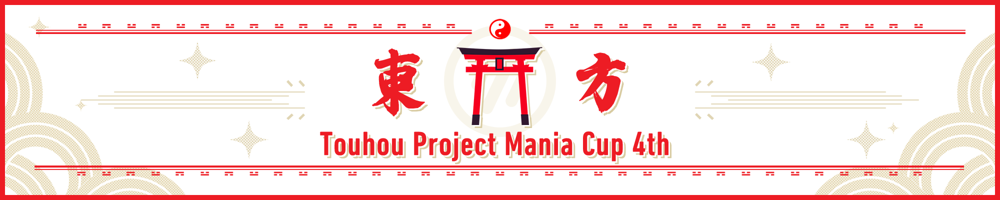

---
tags:
  - TMC
  - THMC
  - THMC 4th
  - THMC4th
---

# Touhou Project Mania Cup 4th

The **Touhou Project Mania Cup 4th** (***THMC 4th***) is a team-based 2v2 osu!mania 4K tournament hosted by ::{ flag=CN }:: [\[GB\]Sanae](https://osu.ppy.sh/users/11238501). The main theme of this tournament is the *Touhou Project*. The pool used for THMC 4th is 100% based on original and fan-made *Touhou* music. It is the fourth installment of the Touhou Project Mania Cup.

## Tournament schedule

| Event | Timestamp |
| --: | :-- |
| Registration phase | 2024-12-22 (00:00 UTC) / 2025-01-12 (24:00 UTC) |
| Qualifier showcase | 2025-01-19 (12:00 UTC) |
| Qualifier stage | 2025-01-20/2025-01-28 |
| Qualifier result | 2025-01-28 (04:00 UTC) |
| Group stage Week 1 | 2025-01-28/2025-02-09 |
| Group stage Week 2 | 2025-02-14/2025-02-16 |
| Round of 32 | 2025-02-21/2025-02-23 |
| Round of 16 | 2025-02-28/2025-03-02 |
| Quarterfinals | 2025-03-07/2025-03-09 |
| Semifinals | 2025-03-14/2025-03-16 |
| Finals | 2025-03-21/2025-03-23 |
| Grand Finals | 2025-03-28/2025-03-30 |

## Prizes

| Placing | Prize(s) |
| :-: | :-- |
|  | *TBD*, profile badge (pending) |
|  | *TBD* |
|  | *TBD* |

## Organisation

The Touhou Project Mania Cup 4th is run by various community members.

| Position | Member(s) |
| :-: | :-- |
| Coordinator | ::{ flag=CN }:: [[GB]Sanae](https://osu.ppy.sh/users/11238501), ::{ flag=CN }:: [YuEast 2018](https://osu.ppy.sh/users/13953619) |
| Consultant | ::{ flag=US }:: [akace100](https://osu.ppy.sh/users/9308128), ::{ flag=CN }:: [cdwcgt](https://osu.ppy.sh/users/14721101), ::{ flag=US }:: [EpsilonMaiagare](https://osu.ppy.sh/users/3855052), ::{ flag=US }:: [ERA trooperr](https://osu.ppy.sh/users/32028459) |
| Referee | ::{ flag=CN }:: [[GB]ChickenGold](https://osu.ppy.sh/users/16586663), ::{ flag=CN }:: [[GB]GanyuAngel](https://osu.ppy.sh/users/27233308), ::{ flag=CN }:: [[GB]Sanae](https://osu.ppy.sh/users/11238501), ::{ flag=VN }:: [[LS]Sagirium](https://osu.ppy.sh/users/16530364), ::{ flag=US }:: [affirmedcheese](https://osu.ppy.sh/users/21002718), ::{ flag=US }:: [akace100](https://osu.ppy.sh/users/9308128), ::{ flag=US }:: [Dynascape](https://osu.ppy.sh/users/8784587), ::{ flag=US }:: [ERA trooperr](https://osu.ppy.sh/users/32028459), ::{ flag=US }:: [ILUVPUERTORICO](https://osu.ppy.sh/users/27484367), ::{ flag=CL }:: [Isita](https://osu.ppy.sh/users/13973026), ::{ flag=DE }:: [Iskas](https://osu.ppy.sh/users/16816551), ::{ flag=BR }:: [Konohana Lucia](https://osu.ppy.sh/users/8642224), ::{ flag=SE }:: [Logg45vs](https://osu.ppy.sh/users/8684540), ::{ flag=CN }:: [MidRed](https://osu.ppy.sh/users/17641994), ::{ flag=RU }:: [normanzerga](https://osu.ppy.sh/users/9887673), ::{ flag=PH }:: [normiplier](https://osu.ppy.sh/users/10069850), ::{ flag=IN }:: [Pilot_BFFRI](https://osu.ppy.sh/users/27266540), ::{ flag=CN }:: [Rush_FTK](https://osu.ppy.sh/users/3046856), ::{ flag=CN }:: [YuEast 2018](https://osu.ppy.sh/users/13953619) |
| Streamer | ::{ flag=CN }:: [[GB]ChickenGold](https://osu.ppy.sh/users/16586663), ::{ flag=US }:: [affirmedcheese](https://osu.ppy.sh/users/21002718), ::{ flag=DE }:: [Iskas](https://osu.ppy.sh/users/16816551), ::{ flag=SE }:: [Logg45vs](https://osu.ppy.sh/users/8684540), ::{ flag=CN }:: [MidRed](https://osu.ppy.sh/users/17641994), ::{ flag=CN }:: [Rush_FTK](https://osu.ppy.sh/users/3046856), ::{ flag=CN }:: [YuEast 2018](https://osu.ppy.sh/users/13953619) |
| Commentator | ::{ flag=US }:: [Dynascape](https://osu.ppy.sh/users/8784587), ::{ flag=GB }:: [epic man 2](https://osu.ppy.sh/users/14566000), ::{ flag=CN }:: [Rush_FTK](https://osu.ppy.sh/users/3046856) |
| Mappool selector | *TBA* |
| Mappool playtester | ::{ flag=KR }:: [11Bit](https://osu.ppy.sh/users/14804526), ::{ flag=CN }:: [[Crz]raber](https://osu.ppy.sh/users/6753592), ::{ flag=CN }:: [[Crz]Reimu](https://osu.ppy.sh/users/14318312), ::{ flag=CN }:: [[GB]r3uz](https://osu.ppy.sh/users/27583184), ::{ flag=CN }:: [[GB]Reisen](https://osu.ppy.sh/users/8586018), ::{ flag=CN }:: [[GB]Sanae](https://osu.ppy.sh/users/11238501), ::{ flag=CN }:: [Hidden is fun](https://osu.ppy.sh/users/10449071), ::{ flag=IT }:: [Kiraz](https://osu.ppy.sh/users/3807675), ::{ flag=SG }:: [Koishi Komeijie](https://osu.ppy.sh/users/15763622), ::{ flag=VN }:: [Micleak](https://osu.ppy.sh/users/16140674), ::{ flag=CN }:: [MidRed](https://osu.ppy.sh/users/17641994), ::{ flag=KR }:: [Oceanus](https://osu.ppy.sh/users/9164100), ::{ flag=FR }:: [Paturages](https://osu.ppy.sh/users/1375479), ::{ flag=FR }:: [xc165543337](https://osu.ppy.sh/users/15246697), ::{ flag=CN }:: [Xu seventeen](https://osu.ppy.sh/users/8781662), ::{ flag=CN }:: [YuEast 2018](https://osu.ppy.sh/users/13953619) |
| Mapper | ::{ flag=US }:: [-mint-](https://osu.ppy.sh/users/8976576), ::{ flag=US }:: [0DZ0](https://osu.ppy.sh/users/28156707), ::{ flag=ID }:: [[Crz]Crysarlene](https://osu.ppy.sh/users/5492871), ::{ flag=TW }:: [[Crz]FolAH1217](https://osu.ppy.sh/users/6232458), ::{ flag=CN }:: [[Crz]Reimu](https://osu.ppy.sh/users/14318312), ::{ flag=CN }:: [[GB]Azukisan](https://osu.ppy.sh/users/5378805), ::{ flag=CN }:: [[GB]Reisen](https://osu.ppy.sh/users/8586018), ::{ flag=CN }:: [[GB]Sanae](https://osu.ppy.sh/users/11238501), ::{ flag=CN }:: [[GB]sherweifa](https://osu.ppy.sh/users/17457562), ::{ flag=CN }:: [[GB]V1do](https://osu.ppy.sh/users/17527968), ::{ flag=JP }:: [[GS]hina](https://osu.ppy.sh/users/20040607), ::{ flag=CN }:: [AelSan](https://osu.ppy.sh/users/14095291), ::{ flag=HK }:: [Alptraum](https://osu.ppy.sh/users/26496648), ::{ flag=BR }:: [AutotelicBrown](https://osu.ppy.sh/users/4238941), ::{ flag=CN }:: [Blue_Potion](https://osu.ppy.sh/users/13094831), ::{ flag=KR }:: [Castella](https://osu.ppy.sh/users/4810916), ::{ flag=CN }:: [cherrychou](https://osu.ppy.sh/users/7214023), ::{ flag=MY }:: [Critical_Star](https://osu.ppy.sh/users/3793196), ::{ flag=US }:: [elexire](https://osu.ppy.sh/users/9206093), ::{ flag=GB }:: [epic man 2](https://osu.ppy.sh/users/14566000), ::{ flag=US }:: [ERA trooperr](https://osu.ppy.sh/users/32028459), ::{ flag=CN }::[ExNeko](https://osu.ppy.sh/users/7590894), ::{ flag=ID }:: [eZmmR](https://osu.ppy.sh/users/8647138), ::{ flag=AU }:: [fvrex](https://osu.ppy.sh/users/11863699), ::{ flag=CN }:::[gzdongsheng](https://osu.ppy.sh/users/8660315), ::{ flag=CN }:: [Hidden is fun](https://osu.ppy.sh/users/10449071), ::{ flag=CN }:: [Hylotl](https://osu.ppy.sh/users/18270260), ::{ flag=PH }:: [Hytex](https://osu.ppy.sh/users/8536263), ::{ flag=US }:: [ImperialTrinity](https://osu.ppy.sh/users/5066305), ::{ flag=US }:: [KimMui](https://osu.ppy.sh/users/26090734), ::{ flag=IT }:: [Kiraz](https://osu.ppy.sh/users/3807675), ::{ flag=PE }:: [Miaurichesu](https://osu.ppy.sh/users/10055648), ::{ flag=VN }:: [Micleak](https://osu.ppy.sh/users/16140674), ::{ flag=TH }:: [MyZterioN-](https://osu.ppy.sh/users/8521723), ::{ flag=KR }:: [Nicknem_](https://osu.ppy.sh/users/16615040), ::{ flag=CN }:: [PORTTAYER](https://osu.ppy.sh/users/8790200), ::{ flag=CN }:: [RiceSS](https://osu.ppy.sh/users/8271436), ::{ flag=NL }:: [Saemitsu](https://osu.ppy.sh/users/14262789), ::{ flag=PH }:: [ScoliosisET](https://osu.ppy.sh/users/23604857), ::{ flag=TW }:: [Xinhong1003](https://osu.ppy.sh/users/19821902), ::{ flag=CN }:: [Xu seventeen](https://osu.ppy.sh/users/8781662), ::{ flag=CN }:: [Xzzj](https://osu.ppy.sh/users/26237858), ::{ flag=CN }:: [Ycloki](https://osu.ppy.sh/users/10861624), ::{ flag=CN }:: [YuEast 2018](https://osu.ppy.sh/users/13953619) |
| Statistician | ::{ flag=US }:: [EpsilonMaiagare](https://osu.ppy.sh/users/3855052), ::{ flag=CN }:: [Rush_FTK](https://osu.ppy.sh/users/3046856), ::{ flag=CN }:: [YuEast 2018](https://osu.ppy.sh/users/13953619) |
| Wiki editor | ::{ flag=US }:: [akace100](https://osu.ppy.sh/users/9308128), ::{ flag=CN }:: [Rush_FTK](https://osu.ppy.sh/users/3046856), ::{ flag=CN }:: [YuEast 2018](https://osu.ppy.sh/users/13953619) |
| Designer | ::{ flag=CN }:: [[GB]ChickenGold](https://osu.ppy.sh/users/16586663), ::{ flag=MY }:: [lous](https://osu.ppy.sh/users/6231292), ::{ flag=CN }:: [lovely_hyahya](https://osu.ppy.sh/users/10318380), ::{ flag=CN }:: [Sakura006](https://osu.ppy.sh/users/10365024), ::{ flag=CN }:: [YuEast 2018](https://osu.ppy.sh/users/13953619) |

## Links

- **[Information spreadsheet](https://docs.google.com/spreadsheets/d/11iFCHTWJLZhRDrtsDUjMx8hwKGWUYu0VR_x3SDgTOS0)**
- [Discussion thread](https://osu.ppy.sh/community/forums/topics/2015815)
- [THMC 4 Discord server](https://discord.gg/cAr5VHG7WX)
- [Livestream](https://www.twitch.tv/touhoumaniacup_official)
- [Challonge bracket](https://challonge.com/)
- [Liquipedia](https://liquipedia.net/osu/Touhou_Project_Mania_Cup/4)

<!--## Participants

## Groups 

## Podium

## Mappools-->

## Ruleset

The ruleset is primarily based on rulesets used in the [osu!mania 4K World Cup 2024](/wiki/Tournaments/MWC/2024_4K#ruleset) and [4 Digit osu!mania World Cup 2024](/wiki/Tournaments/4DM/2024#ruleset).

- Any general rules not shown below but listed in the reference tournament are still valid.

### Tournament rules

1. The Touhou Project Mania Cup 4th (THMC 4th) is a 2 versus 2 double-elimination team tournament played on the osu!mania game mode (4K variant).
2. If no referee is available at match time, the match will be postponed to a later time.
3. Players' scores will still count toward the team score, even if they fail.
4. Use of visual settings to alter background dim or disable beatmap elements like storyboards and skins is allowed.
   - Custom skin elements must not be used to alter core gameplay elements or mechanics.
5. If a game ends in a draw, it will be nullified and the beatmap replayed, called a *rematch*.
6. Teams may ask for a rematch if a team member encounters technical difficulties while playing.
   - "Lag spikes" are not considered a valid reason to nullify a beatmap.
   - If a rematch happens, the original roster for each team during that particular beatmap must remain the same. If that is not possible, e.g., by virtue of a technical issue, *both* teams will be allowed to swap rosters.
   - This rule is not to be abused. Referees may veto a rematch request if they find that this is the case.
7. Disconnects within 30 seconds or 25% of the beatmap length (whichever happens first) can be rematched, at the referee's discretion, as long as it's clearly communicated in the chatroom.
8. If a player disconnects, their scores will not be counted towards their team's total unless adequate proof of said score is provided. The following are considered acceptable proof:
   - Livestream clips or VODs from the player's point of view. The entirety of the play and the results screen must be clearly visible along with the affected player's score.
   - Replay files of the play, taken directly from the "Local scores" tab on the affected player's client (the timestamps must exactly match the time at which the game took place, as seen in the multiplayer match history).
   - Screenshots showing the affected player's score must be taken directly from within the game.
     - Screenshots from the results screen must clearly show the affected player's score. This is the preferred method.
     - Screenshots taken in-game at the time of disconnection may be accepted. Note that this method does not provide a one-to-one representation of that player's score. Using this method is not encouraged, and it may be denied at the referee's discretion if the information provided is not sufficient to determine the player's score.
     - All screenshots **MUST** be taken using the game itself; that is, they must be hosted on the `https://osu.ppy.sh/` domain (using `Shift` + `F12`). Any other form of screenshot will be denied.
     - Player scores may be derived from the official stream as a last resort in cases where the match is streamed.
9. If less than the minimum amount of required players are present at match time, the match can be postponed for up to 10 minutes. If after this period there are still not enough players for either team, a *win by default* will be declared for the side with the most members present.
   - The minimum number of players required is defined as the number needed to play a beatmap without any empty spots in the lobby (e.g., at least two participants must be present for the match to start).
   - In the off chance that both teams have the same amount of players (i.e., each team with 1 player present) but not enough to start the match, the match may be rescheduled to a different time; otherwise, a *win by default* will be declared to the team with the highest seed.
10. Players are expected to keep the match running fluently and without delays. Disrupting the match by foul play, insulting and provoking other players or staff, delaying the match, or other deliberate inappropriate misbehavior are strictly prohibited and will be punished accordingly.
11. The multiplayer chatrooms underlie the [osu! community rules](/wiki/Rules). All chat rules apply to the multiplayer chatrooms where the matches will take place.
    - Breaking the chat rules may result in a silence. Silenced players cannot participate in multiplayer matches and must be exchanged for the duration of the punishment.
12. Referees may allow, at their discretion, lower or higher tolerances for timers.
13. Tournament coordinators may request liveplays or recordings of individual players or teams at any point in the tournament without prior warning.
14. Tournament coordinators will be responsible for receiving and investigating any tournament-related complaints.
15. Tournament coordinators reserve the right to modify these rules at any moment. Any such changes will be announced in advance.
16. Penalties for violating the tournament rules include, but are not limited to:
    - Specific players will be excluded for one beatmap.
    - Specific players will be excluded for an entire match.
    - The match will be declared as forfeited or as a win by default for the other team.
    - Disqualification from the entire tournament.
    - A report will be submitted to the [Tournament Committee](/wiki/People/Tournament_Committee), which will result in disqualification from the current and future official tournaments until an appeal is made.

### Tournament registration

1. Please complete the [registration form](https://docs.google.com/forms/d/1tl-4NeWZIDI10-1Mkja8lT3DHEpIUB_PK2uqAHptVj8/) to register.
2. A team must have a minimum of 2 and a maximum of 4 players.
3. To ensure valid registrations, every prospective player will be manually checked via [tournament screening](/wiki/Tournaments/Official_support#tournament-screening).
   - If any member in a team is blacklisted by organisers or considered "suspicious" by the account support team, the whole team will be disqualified. **Blacklists in other tournaments will be considered as well.**
   - There are no rank requirements for this tournament, but players must not have violated the [osu! community rules](/wiki/Rules) within the last 12 months.
4. All successfully formed teams will be published after the registration phase.
   - A team should have at least 2 players registered to have the chance to play in the Qualifiers.
5. Tournament staff members are **not** allowed to play in the tournament, with the exception of commentators, statisticians, and streamers.
   - These staff members must not have access to any privileged data, such as Qualifiers score information or mappool details, before the mappool showcase.
6. All information about the tournament will ONLY be available on the [Discord server](https://discord.gg/cAr5VHG7WX). All captains are asked to join the server in the case of any issues that may arise.

### Stage instructions

#### Qualifier 

1. The Qualifiers Stage will happen in the first week of the tournament play. All registered players who were not screened out during screening are eligible to participate in the Qualifiers.
2. During Qualifiers, all teams will play the Qualifier pool in sequential order up to 2 times. The pool will have 6 stages, and they are as follows:
   - Stage 1: Early-Mid Game Rice Technical
   - Stage 2: Early-Mid Game LN Coordination
   - Stage 3: Mid Game LN Density
   - Stage 4: Mid Game Rice Jumpstream
   - Stage 5: Mid-Late Game Rice Technical
   - Stage 6: Mid-Late Game Hybrid
3. Each team must have 2 players participate in each map. They may be exchanged freely after a map has concluded.
4. Teams can skip any map in the second playthrough. An optional 5-minute break will be offered between the first and second playthrough of the mappool.
5. The following methods will be used in order for seeding, sorting through each ranking criteria in the case of equal rank:
   1. **Lower weighted rank sum**: The following formula will be used for each map: `Map rank = RANK(Team score) * Map weight`, where:
      - `RANK` is the function that ranks the current `Team score` against all team scores for the current map.
      - `Map weight` is the weight for the current map, as defined by the table below. 
      - `Team score` is the highest of the team total scores they get in all tries.
      - Then the following formula will be used to calculate `Final rank = SUM(Map rank)`, where a lower `Final rank` will have higher ranks.
   2. **Higher total score**: An exact formula will be used: `Total score = SUM(Team score)`, where:
      - `Team score` is the highest team total scores gained in all tries.
      - A higher `Total score` will have higher ranks.
   3. **Higher map score**: Higher team scores will receive higher ranks. Comparisons will be done from the last stage to the first stage in order until ties are broken.
   4. **Fewer total tries**: Teams that play fewer maps in the qualifier lobby will receive higher ranks.
   5. **Dice rolls**: If still tied, all tied team captains will gather in a multiplayer room, using `!roll`; higher results will get higher ranks. Roll again until breaking all ties.
6. The top 64 seeded teams will advance to the Group Stage.

The weights for the Qualifiers are as follows:

|  | Stage 1 | Stage 2 | Stage 3 | Stage 4 | Stage 5 | Stage 6 |
| --: | :-: | :-: | :-: | :-: | :-: | :-: |
| **Weight** | 1 | 1.01 | 1.2 | 1.21 | 1.4 | 1.41 |

#### Group Stage & Playoffs

1. Below are the win conditions and mappool format for each of the bracket stages:

| Round | Best of | Maps | Types |
| :-: | :-: | :-: | :-- |
| Group Stage | 7 | 13 | 6 rice, 3 LN, 3 hybrid, 1 tiebreaker |
| Round of 32 | 9 | 13 | 6 rice, 4 LN, 2 hybrid, 1 tiebreaker |
| Round of 16 | 9 | 13 | 6 rice, 4 LN, 2 hybrid, 1 tiebreaker |
| Quarterfinals | 11 | 15 | 7 rice, 4 LN, 3 hybrid, 1 tiebreaker |
| Semifinals | 11 | 15 | 7 rice, 4 LN, 3 hybrid, 1 tiebreaker |
| Finals | 13 | 17 | 8 rice, 5 LN, 3 hybrid, 1 tiebreaker |
| Grand Finals | 13 | 17 | 8 rice, 5 LN, 3 hybrid, 1 tiebreaker |

2. Each round will have its own mappool.
   - The Group Stage will last for 2 weeks and use the same mappools.
   - 2 rice maps, 1 LN map, and 1 of the HB maps in the group stage mappool will be made as `classic` picks, meaning they are reused from previous or other tournaments.
   - 1 rice map and 1 LN map in the other bracket stage mappools will be made as `X` picks, meaning they are more difficult than the other maps in the mappool.
3. The split double elimination format will be used in the group stage, meaning the top seed (`#1 ~ #16`) and high seed (`#17 ~ #32`) will start in the upper bracket, and the mid seed (`#33 ~ #48`) and low seed (`#49 ~ #64`) will start in the lower bracket.
   - If fewer than 70 teams play the qualifier, the group stage will use the standard double elimination format, meaning all teams will start in the upper bracket.
4. The top 2 teams will advance to a standard double elimination bracket stage, called `Playoffs`.
5. Teams that lose a match in the upper bracket move to the lower bracket; losing a match in the lower bracket will eliminate them until the final winner is determined.
6. Possible mod choices for all maps are Hidden, Fade In, Flashlight, and Mirror.

### Match instructions

1. A referee will create a multiplayer room 10 minutes before the scheduled match time.
   - The room settings are `Game mode: "osu!mania
"`, `Team mode: "Team Vs"` and `Score mode: "ScoreV2"`. The room name must follow the pattern of `THMC4 ({Stage}):
 ({Red Team}) VS ({Blue Team})`.
2. If less than 2 players from a team are present at match time, the match can be postponed for up to **10 minutes**. If there are still less than 2 players from a team, a *win by default* will be declared for the side with the most members present.
   - If both teams don’t have enough players to present and still have available staff and are not influenced by other match processes, the match can be rescheduled.
   - If a match cannot be rescheduled, the higher-seeded team will *win by default*.
3. Each captain must use `!roll` once in the match's chatroom.
   - The winner of the `!roll` team **picks** and **protects** first.
   - The loser of the `!roll` team **bans** first.
4. After the order is determined, the pick and ban phase will have the following steps:
   1. The team that wins the `!roll` protects a beatmap, followed by another team. They may not protect the same beatmap. Protected beatmaps may not be banned.
   2. The team that loses the `!roll` bans a map, and then the other team bans a map.
   3. If it's during the group stage, the team that loses the `!roll` bans the second map; after that, the winning team then bans a map.
   4. The team that wins the `!roll` picks the first map, followed by alternating picks for the remaining maps.
5. Teams will be allowed 2 minutes to pick a beatmap and 2 minutes to press the `Ready` button on their client. If a team takes more time than allotted for either action, the procedures adopted will be as follows:
   - For the first occurrence:
     - The team will receive a verbal warning from the referee, who may also choose to use the team's tactical timeout to allow them to make their pick.
     - If the team does not pick a map within 15 seconds from when the timer expires, the referee will apply the procedure for subsequent occurrences listed below, i.e., a random pick will be used for a pick timer, and the match will be forcefully started for a ready timer.
   - On subsequent occurrences:
     - For a pick timer: a random map will be chosen from the mappool using `!roll X`, where X is the number of beatmaps that were neither picked nor banned, excluding the tiebreaker.
     - For a ready timer: the referee will issue the `!mp start 10` command, regardless of how many players from each team are present in the lobby, using `!mp kick` on any extra players for each team, starting from the top (i.e., the first valid player combination for each team will be forced to play the pick). The results for such games are to be taken as is.
     - Repeat offenders may receive further sanctions from the coordinator.
6. Each team will receive only one timeout of 3 minutes, to be used as extra time to pick or ban a beatmap (tactical) or if a technical issue occurs (technical). *The timeout is optional.*
   - This timeout is automatically consumed when regular picking time runs out.
   - The tactical timeout may be called on a tiebreaker, provided that both teams' captains agree to it.
7. If players are unavailable for a rematch (e.g., technical issue or unavoidable player absence), the influenced team could replace those players while keeping the remaining players the same.

### Scheduling instructions

1. Teams need to pick an available lobby to play a qualifier match.
They could request an extra lobby before January 16, 23:59 UTC.
   - **A team that does not pick a lobby after the last lobby start will be considered disqualified.**
2. All bracket stages will be held between Saturday 0:00 and Sunday 23:59 (UTC).
   - Additional times may be available upon request.
3. **Reschedules will only be considered if both teams agree to a time and communicate it to the coordinator before Thursday at 23:59 UTC of the week the match is to take place.**
   - If a team needs to reschedule, the captain must submit their request in the reschedule channel at least 24 hours (48 hours recommended) before the match.
   - **Do not ask for a reschedule unless it is absolutely needed. The coordinator reserves the right to deny any rescheduling request.**
   - Late reschedule requests will not be accepted under any circumstances.
   - For emergency reschedules due to the unavailability of both teams, they may be handled on a case-by-case basis. Rescheduling approval is not guaranteed.
4. Captains are responsible for their team's availability.
