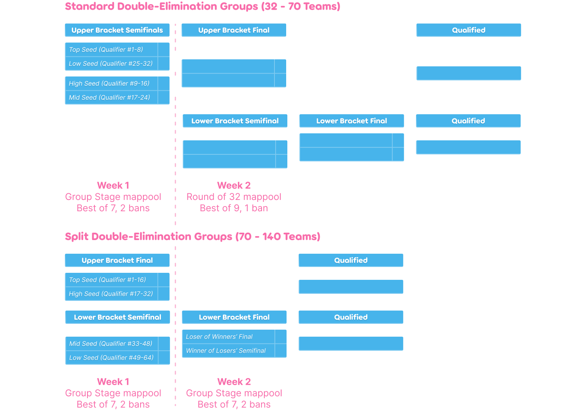

---
tags:
  - TMC
  - THMC
  - THMC4
  - THMC 4
  - THMC 4th
  - THMC4th
---

# Touhou Project Mania Cup 4th

The **Touhou Project Mania Cup 4th** (***THMC 4th***) is a team-based 2v2 osu!mania 4K tournament hosted by ::{ flag=CN }:: [\[GB\]Sanae](https://osu.ppy.sh/users/11238501) and ::{ flag=CN }:: [YuEast 2018](https://osu.ppy.sh/users/13953619). The main theme of this tournament is the *Touhou Project*. The pool used for THMC 4th is 100% based on original and fan-made *Touhou* music. It is the fourth instalment of the Touhou Project Mania Cup.

## Tournament schedule

| Event | Timestamp |
| --: | :-- |
| Registration phase | 2024-12-22 (00:00 UTC) / 2025-01-12 (24:00 UTC) |
| Qualifier showcase | 2025-01-19 (12:00 UTC) |
| Qualifier stage | 2025-01-20/2025-01-28 |
| Qualifier results | 2025-01-28 (04:00 UTC) |
| Group stage week 1 | 2025-01-28/2025-02-09 |
| Group stage week 2 | 2025-02-14/2025-02-16 |
| Round of 32 | 2025-02-21/2025-02-23 |
| Round of 16 | 2025-02-28/2025-03-02 |
| Quarterfinals | 2025-03-07/2025-03-09 |
| Semifinals | 2025-03-14/2025-03-16 |
| Finals | 2025-03-21/2025-03-23 |
| Grand Finals | 2025-03-28/2025-04-06 |

## Prizes

| Placing | Prize(s) |
| :-: | :-- |
|  | *TBD*, profile badge (pending) |
|  | *TBD*, profile badge (pending) |
|  | *TBD*, profile badge (pending) |

  

## Organisation

The Touhou Project Mania Cup 4th is run by various community members.

| Position | Member(s) |
| :-: | :-- |
| Coordinators | ::{ flag=CN }:: [Koyori Chan](https://osu.ppy.sh/users/11238501), ::{ flag=CN }:: [YuEast 2018](https://osu.ppy.sh/users/13953619) |
| Consultants | ::{ flag=US }:: [Akace100](https://osu.ppy.sh/users/9308128), ::{ flag=CN }:: [cdwcgt](https://osu.ppy.sh/users/14721101), ::{ flag=US }:: [EpsilonMaiagare](https://osu.ppy.sh/users/3855052), ::{ flag=US }:: [ERA trooperr](https://osu.ppy.sh/users/32028459) |
| Referees | ::{ flag=RU }:: [-Hindeko](https://osu.ppy.sh/users/14220803), ::{ flag=CN }:: [\[GB\]ChickenGold](https://osu.ppy.sh/users/16586663), ::{ flag=CN }:: [\[GB\]yobrevelc](https://osu.ppy.sh/users/14128407), ::{ flag=VN }:: [\[LS\]Sagirium](https://osu.ppy.sh/users/16530364), ::{ flag=US }:: [affirmedcheese](https://osu.ppy.sh/users/21002718), ::{ flag=US }:: [akace100](https://osu.ppy.sh/users/9308128), ::{ flag=CN }:: [CuteNatro](https://osu.ppy.sh/users/27233308), ::{ flag=KR }:: [Discord](https://osu.ppy.sh/users/16194858), ::{ flag=US }:: [Dynascape](https://osu.ppy.sh/users/8784587), ::{ flag=US }:: [EpsilonMaiagare](https://osu.ppy.sh/users/3855052), ::{ flag=US }:: [ERA trooperr](https://osu.ppy.sh/users/32028459), ::{ flag=US }:: [ILUVPUERTORICO](https://osu.ppy.sh/users/27484367), ::{ flag=TH }:: [Infinitstart](https://osu.ppy.sh/users/4026124), ::{ flag=CL }:: [Isita](https://osu.ppy.sh/users/13973026), ::{ flag=DE }:: [Iskas](https://osu.ppy.sh/users/16816551), ::{ flag=BR }:: [Konohana Lucia](https://osu.ppy.sh/users/8642224), ::{ flag=CN }:: [Koyori Chan](https://osu.ppy.sh/users/11238501), ::{ flag=SE }:: [Logg45vs](https://osu.ppy.sh/users/8684540), ::{ flag=CN }:: [MidRed](https://osu.ppy.sh/users/17641994), ::{ flag=RU }:: [normanzerga](https://osu.ppy.sh/users/9887673), ::{ flag=PH }:: [normiplier](https://osu.ppy.sh/users/10069850), ::{ flag=FR }:: [Paturages](https://osu.ppy.sh/users/1375479), ::{ flag=IN }:: [Pilot\_BFFRI](https://osu.ppy.sh/users/27266540), ::{ flag=VN }:: [Poity](https://osu.ppy.sh/users/17148657), ::{ flag=RU }:: [RobotSkin\_](https://osu.ppy.sh/users/13820038), ::{ flag=CN }:: [Rush\_FTK](https://osu.ppy.sh/users/3046856), ::{ flag=US }:: [SunApple](https://osu.ppy.sh/users/11817622), ::{ flag=CN }:: [YuEast 2018](https://osu.ppy.sh/users/13953619) |
| Streamer | ::{ flag=VN }:: [- Fubukiii](https://osu.ppy.sh/users/9931217), ::{ flag=RU }:: [-Hindeko](https://osu.ppy.sh/users/14220803), ::{ flag=CN }:: [\[GB\]ChickenGold](https://osu.ppy.sh/users/16586663), ::{ flag=CN }:: [\[GB\]yobrevelc](https://osu.ppy.sh/users/14128407), ::{ flag=US }:: [affirmedcheese](https://osu.ppy.sh/users/21002718), ::{ flag=CN }:: [aiyulu](https://osu.ppy.sh/users/189617), ::{ flag=US }:: [BlueCrystal004](https://osu.ppy.sh/users/4349974), ::{ flag=US }:: [EpsilonMaiagare](https://osu.ppy.sh/users/3855052), ::{ flag=DE }:: [Iskas](https://osu.ppy.sh/users/16816551), ::{ flag=SE }:: [Logg45vs](https://osu.ppy.sh/users/8684540), ::{ flag=CN }:: [MidRed](https://osu.ppy.sh/users/17641994), ::{ flag=RU }:: [RobotSkin\_](https://osu.ppy.sh/users/13820038), ::{ flag=CN }:: [Rush\_FTK](https://osu.ppy.sh/users/3046856), ::{ flag=US }:: [SunApple](https://osu.ppy.sh/users/11817622), ::{ flag=CN }:: [YuEast 2018](https://osu.ppy.sh/users/13953619) |
| Commentator | ::{ flag=VN }:: [- Fubukiii](https://osu.ppy.sh/users/9931217), ::{ flag=IE }:: [-Nightkore](https://osu.ppy.sh/users/26311862), ::{ flag=CN }:: [\[Crz\]Nickname](https://osu.ppy.sh/users/10817494), ::{ flag=CN }:: [\[GB\]Reisen](https://osu.ppy.sh/users/8586018), ::{ flag=CN }:: [\[GB\]V1do](https://osu.ppy.sh/users/17527968), ::{ flag=CN }:: [\[GB\]yobrevelc](https://osu.ppy.sh/users/14128407), ::{ flag=TW }:: [blacktea12](https://osu.ppy.sh/users/13389861), ::{ flag=CN }:: [Blue\_Potion](https://osu.ppy.sh/users/13094831), ::{ flag=US }:: [Dynascape](https://osu.ppy.sh/users/8784587), ::{ flag=GB }:: [epic man 2](https://osu.ppy.sh/users/14566000), ::{ flag=CA }:: [ERA Sunny](https://osu.ppy.sh/users/16468962), ::{ flag=PH }:: [Itawachi](https://osu.ppy.sh/users/12929973), ::{ flag=VN }:: [MashedPotato](https://osu.ppy.sh/users/10494860), ::{ flag=GB }:: [Nathanial](https://osu.ppy.sh/users/9169747), ::{ flag=US }:: [Nepijin](https://osu.ppy.sh/users/11734610), ::{ flag=FR }:: [Paturages](https://osu.ppy.sh/users/1375479), ::{ flag=AU }:: [PotassiumF](https://osu.ppy.sh/users/4247722), ::{ flag=CN }:: [Rush\_FTK](https://osu.ppy.sh/users/3046856), ::{ flag=PH }:: [Silhoueska Elze](https://osu.ppy.sh/users/11517895), ::{ flag=US }:: [Sparky](https://osu.ppy.sh/users/3187959), ::{ flag=US }:: [SunApple](https://osu.ppy.sh/users/11817622), ::{ flag=US }:: [xXDark\_MasterXx](https://osu.ppy.sh/users/11855686), ::{ flag=CN }:: [YuEast 2018](https://osu.ppy.sh/users/13953619) |
| Mappool playtester | ::{ flag=VN }:: [-Kita-](https://osu.ppy.sh/users/27175001), ::{ flag=US }:: [-mint-](https://osu.ppy.sh/users/8976576), ::{ flag=KR }:: [11Bit](https://osu.ppy.sh/users/14804526), ::{ flag=CN }:: [\[Crz\]raber](https://osu.ppy.sh/users/6753592), ::{ flag=CN }:: [\[Crz\]Reimu](https://osu.ppy.sh/users/14318312), ::{ flag=KR }:: [\[GB\]Oceanus](https://osu.ppy.sh/users/9164100), ::{ flag=CN }:: [\[GB\]r3uz](https://osu.ppy.sh/users/27583184), ::{ flag=CN }:: [\[GB\]Reisen](https://osu.ppy.sh/users/8586018), ::{ flag=CN }:: [AelSan](https://osu.ppy.sh/users/14095291), ::{ flag=MY }:: [cheewee10](https://osu.ppy.sh/users/4477497), ::{ flag=CN }:: [CuteNatro](https://osu.ppy.sh/users/27233308), ::{ flag=US }:: [ERA trooperr](https://osu.ppy.sh/users/32028459), ::{ flag=CN }:: [gzdongsheng](https://osu.ppy.sh/users/8660315), ::{ flag=CN }:: [Hidden is fun](https://osu.ppy.sh/users/10449071), ::{ flag=CN }:: [Hylotl](https://osu.ppy.sh/users/18270260), ::{ flag=US }:: [ImperialTrinity](https://osu.ppy.sh/users/5066305), ::{ flag=IT }:: [Kiraz](https://osu.ppy.sh/users/3807675), ::{ flag=SG }:: [Koishi Komeijie](https://osu.ppy.sh/users/15763622), ::{ flag=CN }:: [Koyori Chan](https://osu.ppy.sh/users/11238501), ::{ flag=CN }:: [MidRed](https://osu.ppy.sh/users/17641994), ::{ flag=CN }:: [My Angel Plana](https://osu.ppy.sh/users/13402917), ::{ flag=FR }:: [My Angel Rena](https://osu.ppy.sh/users/15246697), ::{ flag=CN }:: [Old Pigeon](https://osu.ppy.sh/users/26116770), ::{ flag=FR }:: [Paturages](https://osu.ppy.sh/users/1375479), ::{ flag=CN }:: [Xu seventeen](https://osu.ppy.sh/users/8781662), ::{ flag=CN }:: [YuEast 2018](https://osu.ppy.sh/users/13953619) |
| Mapper | ::{ flag=GB }:: [-Deepdive-](https://osu.ppy.sh/users/13338645), ::{ flag=VN }:: [-Kita-](https://osu.ppy.sh/users/27175001), ::{ flag=US }:: [-mint-](https://osu.ppy.sh/users/8976576), ::{ flag=US }:: [0DZ0](https://osu.ppy.sh/users/28156707), ::{ flag=ID }:: [\[Crz\]Crysarlene](https://osu.ppy.sh/users/5492871), ::{ flag=TW }:: [\[Crz\]FolAH1217](https://osu.ppy.sh/users/6232458), ::{ flag=CN }:: [\[Crz\]Reimu](https://osu.ppy.sh/users/14318312), ::{ flag=CN }:: [\[GB\]Azukisan](https://osu.ppy.sh/users/5378805), ::{ flag=KR }:: [\[GB\]Oceanus](https://osu.ppy.sh/users/9164100), ::{ flag=CN }:: [\[GB\]Reisen](https://osu.ppy.sh/users/8586018), ::{ flag=CN }:: [\[GB\]sherweifa](https://osu.ppy.sh/users/17457562), ::{ flag=JP }:: [\[GS\]hina](https://osu.ppy.sh/users/20040607), ::{ flag=CN }:: [AelSan](https://osu.ppy.sh/users/14095291), ::{ flag=HK }:: [Alptraum](https://osu.ppy.sh/users/26496648), ::{ flag=BR }:: [AutotelicBrown](https://osu.ppy.sh/users/4238941), ::{ flag=CN }:: [Blue\_Potion](https://osu.ppy.sh/users/13094831), ::{ flag=KR }:: [Castella](https://osu.ppy.sh/users/4810916), ::{ flag=CN }:: [cherrychou](https://osu.ppy.sh/users/7214023), ::{ flag=MY }:: [Critical\_Star](https://osu.ppy.sh/users/3793196), ::{ flag=US }:: [elexire](https://osu.ppy.sh/users/9206093), ::{ flag=GB }:: [epic man 2](https://osu.ppy.sh/users/14566000), ::{ flag=US }:: [ERA trooperr](https://osu.ppy.sh/users/32028459), ::{ flag=CN }:: [ExNeko](https://osu.ppy.sh/users/7590894), ::{ flag=ID }:: [eZmmR](https://osu.ppy.sh/users/8647138), ::{ flag=AU }:: [fvrex](https://osu.ppy.sh/users/11863699), ::{ flag=CN }:: [gzdongsheng](https://osu.ppy.sh/users/8660315), ::{ flag=CN }:: [Hidden is fun](https://osu.ppy.sh/users/10449071), ::{ flag=CN }:: [Hylotl](https://osu.ppy.sh/users/18270260), ::{ flag=PH }:: [Hytex](https://osu.ppy.sh/users/8536263), ::{ flag=US }:: [ImperialTrinity](https://osu.ppy.sh/users/5066305), ::{ flag=US }:: [KimMui](https://osu.ppy.sh/users/26090734), ::{ flag=IT }:: [Kiraz](https://osu.ppy.sh/users/3807675), ::{ flag=CN }:: [Koyori Chan](https://osu.ppy.sh/users/11238501), ::{ flag=PE }:: [Miaurichesu](https://osu.ppy.sh/users/10055648), ::{ flag=VN }:: [Micleak](https://osu.ppy.sh/users/16140674), ::{ flag=TH }:: [MyZterioN-](https://osu.ppy.sh/users/8521723), ::{ flag=KR }:: [Nicknem\_](https://osu.ppy.sh/users/16615040), ::{ flag=CN }:: [PORTTAYER](https://osu.ppy.sh/users/8790200), ::{ flag=CN }:: [RiceSS](https://osu.ppy.sh/users/8271436), ::{ flag=NL }:: [Saemitsu](https://osu.ppy.sh/users/14262789), ::{ flag=PH }:: [ScoliosisET](https://osu.ppy.sh/users/23604857), ::{ flag=ES }:: [Ska](https://osu.ppy.sh/users/10313023), ::{ flag=TW }:: [Usagi\_](https://osu.ppy.sh/users/16046205), ::{ flag=CN }:: [V1do-](https://osu.ppy.sh/users/17527968), ::{ flag=TW }:: [Xinhong1003](https://osu.ppy.sh/users/19821902), ::{ flag=CN }:: [Xu seventeen](https://osu.ppy.sh/users/8781662), ::{ flag=CN }:: [Xzzj](https://osu.ppy.sh/users/26237858), ::{ flag=CN }:: [Ycloki](https://osu.ppy.sh/users/10861624), ::{ flag=CN }:: [YuEast 2018](https://osu.ppy.sh/users/13953619) |
| Statistician | ::{ flag=US }:: [EpsilonMaiagare](https://osu.ppy.sh/users/3855052), ::{ flag=CN }:: [Rush\_FTK](https://osu.ppy.sh/users/3046856), ::{ flag=CN }:: [YuEast 2018](https://osu.ppy.sh/users/13953619) |
| Wiki | ::{ flag=US }:: [akace100](https://osu.ppy.sh/users/9308128), ::{ flag=CN }:: [Rush\_FTK](https://osu.ppy.sh/users/3046856), ::{ flag=CN }:: [YuEast 2018](https://osu.ppy.sh/users/13953619) |
| Designer | ::{ flag=CN }:: [\[GB\]ChickenGold](https://osu.ppy.sh/users/16586663), ::{ flag=CN }:: [AlexDunk](https://osu.ppy.sh/users/9194799), ::{ flag=CN }:: [cdwcgt](https://osu.ppy.sh/users/14721101), ::{ flag=AU }:: [Coppertine](https://osu.ppy.sh/users/7279762), ::{ flag=MY }:: [lous](https://osu.ppy.sh/users/6231292), ::{ flag=CN }:: [lovely\_hyahya](https://osu.ppy.sh/users/10318380), ::{ flag=CN }:: [RiceSS](https://osu.ppy.sh/users/8271436), ::{ flag=CN }:: [Rush\_FTK](https://osu.ppy.sh/users/3046856), ::{ flag=CN }:: [Sakura006](https://osu.ppy.sh/users/10365024), ::{ flag=CN }:: [YuEast 2018](https://osu.ppy.sh/users/13953619) |
| Musician | ::{ flag=CN }:: [cherrychou](https://osu.ppy.sh/users/7214023), ::{ flag=SG }:: [sugosugiii](https://osu.ppy.sh/users/15118952), ::{ flag=PH }:: [THE BEAT WIZARD](https://osu.ppy.sh/users/17529207) |

## Links

- **[Information spreadsheet](https://docs.google.com/spreadsheets/d/11iFCHTWJLZhRDrtsDUjMx8hwKGWUYu0VR_x3SDgTOS0)**
- [Discussion thread](https://osu.ppy.sh/community/forums/topics/2015815)
- [THMC 4 Discord server](https://discord.gg/cAr5VHG7WX)
- [Livestream](https://www.twitch.tv/touhoumaniacup_official)
- [Challonge bracket](https://challonge.com/THMC4)
- [Liquipedia](https://liquipedia.net/osu/Touhou_Project_Mania_Cup/4)
- [Vod collection (Youtube)](https://www.youtube.com/playlist?list=PLbDr4Al5SsJMaU6tI4IAElMBAjA6ezLes)
- Vod collection (Twitch)
  - [Qualifier](https://www.twitch.tv/collections/r4kDVUObIhiWlQ) 
  - [Group stage](https://www.twitch.tv/collections/UzdD8QkYHBhnSQ)
  - [Round of 32](https://www.twitch.tv/collections/ad7xc-k4JRgA3w)
  - [Round of 16](https://www.twitch.tv/collections/Edj5-4BmJxj1nQ)
  - [Quarterfinals](https://www.twitch.tv/collections/txoutiFOKRhxbQ)
  - [Semifinals](https://www.twitch.tv/collections/M8vf-QHSKxjtTA)
  - [Finals](https://www.twitch.tv/collections/72gZqZ-sLRhN6A)
  - [Grand Finals](https://www.twitch.tv/collections/5u6rIWyeMxilZQ)

## Participants

| Team | Members |
| :-: | :-- |
| **"OH MY DAYS (skylanders)"** | ::{ flag=GB }:: [Zoobin4](https://osu.ppy.sh/users/10055204), ::{ flag=GB }:: [--Dragon--](https://osu.ppy.sh/users/11924624), ::{ flag=GB }:: [TingMomentum](https://osu.ppy.sh/users/12489832), ::{ flag=GB }:: [MiniEgg\_23](https://osu.ppy.sh/users/25914360) |
| **\:bucket\:\:1217god\:\:scream\:** | ::{ flag=TW }:: [Kesrie](https://osu.ppy.sh/users/13631923), ::{ flag=TW }:: [Shice2566](https://osu.ppy.sh/users/16191180), ::{ flag=TW }:: [amano\_hina](https://osu.ppy.sh/users/19882148), ::{ flag=TW }:: [-Veloce-](https://osu.ppy.sh/users/23248427) |
| **Adrianlazer Fanboys** | ::{ flag=US }:: [Tonels](https://osu.ppy.sh/users/15179858), ::{ flag=BH }:: [Unitori-](https://osu.ppy.sh/users/15772814), ::{ flag=US }:: [Chicken Sammy](https://osu.ppy.sh/users/19862784), ::{ flag=AR }:: [Mahiru-No-Yo](https://osu.ppy.sh/users/24649329) |
| **AKatsuki** | ::{ flag=TW }:: [kissnolook](https://osu.ppy.sh/users/11608591), ::{ flag=TW }:: [\[ Kloc \]](https://osu.ppy.sh/users/11609084), ::{ flag=MO }:: [Ramchong](https://osu.ppy.sh/users/2342941), ::{ flag=TW }:: [\[Sick\]LooM](https://osu.ppy.sh/users/4694429) |
| **Backed lasagna** | ::{ flag=IT }:: [IL\_fefe](https://osu.ppy.sh/users/27543313), ::{ flag=IT }:: [Matty7281](https://osu.ppy.sh/users/31774010), ::{ flag=IT }:: [alexblablak](https://osu.ppy.sh/users/32167950), ::{ flag=IT }:: [mattyITA104](https://osu.ppy.sh/users/34831190) |
| **ball itchers** | ::{ flag=CH }:: [HongFanboy](https://osu.ppy.sh/users/16790509), ::{ flag=TR }:: [dumbidot](https://osu.ppy.sh/users/19664675), ::{ flag=CH }:: [senkhyu](https://osu.ppy.sh/users/25159471), ::{ flag=VN }:: [unluminated520](https://osu.ppy.sh/users/30243406) |
| **Bashame is goat** | ::{ flag=US }:: [Stillerzzy](https://osu.ppy.sh/users/21587761), ::{ flag=DE }:: [Cozieuwu](https://osu.ppy.sh/users/28638015) |
| **Benny Goodman** | ::{ flag=TH }:: [konkawe](https://osu.ppy.sh/users/15665805), ::{ flag=KR }:: [Buschan](https://osu.ppy.sh/users/16505281), ::{ flag=CZ }:: [grillroasted](https://osu.ppy.sh/users/18271627), ::{ flag=FR }:: [flowerful](https://osu.ppy.sh/users/18867523) |
| **Beta Sir Kojima** | ::{ flag=VN }:: [\[TCD\]HowToKenny](https://osu.ppy.sh/users/15814982), ::{ flag=VN }:: [\[TCD\] Yumi](https://osu.ppy.sh/users/28802275), ::{ flag=VN }:: [\[TCD\] TinPotMan](https://osu.ppy.sh/users/30327673), ::{ flag=VN }:: [\[TCD\] Meat](https://osu.ppy.sh/users/33501348) |
| **Blue-Haired Yuuka** | ::{ flag=TH }:: [MatchaLatte-](https://osu.ppy.sh/users/15944956), ::{ flag=TH }:: [SoSickSoSad](https://osu.ppy.sh/users/19089796), ::{ flag=KR }:: [\_Nepia\_](https://osu.ppy.sh/users/33670459) |
| **Cat Yumy** | ::{ flag=MY }:: [RhythmBoii](https://osu.ppy.sh/users/18484917), ::{ flag=PH }:: [BronyaZaychik\_](https://osu.ppy.sh/users/19690810), ::{ flag=ID }:: [\_yea](https://osu.ppy.sh/users/20834055), ::{ flag=ID }:: [My Angel Chen](https://osu.ppy.sh/users/24285111) |
| **Chodan** | ::{ flag=KR }:: [Naaaad](https://osu.ppy.sh/users/10344857), ::{ flag=KR }:: [ggeexx1](https://osu.ppy.sh/users/17494164), ::{ flag=KR }:: [Scitra](https://osu.ppy.sh/users/26140861), ::{ flag=KR }:: [PocaFanboy](https://osu.ppy.sh/users/6912079) |
| **cheewee10** | ::{ flag=MY }:: [JayLye](https://osu.ppy.sh/users/14892447), ::{ flag=MY }:: [ReJust](https://osu.ppy.sh/users/20670028), ::{ flag=MY }:: [Fuuneral](https://osu.ppy.sh/users/31042682), ::{ flag=MY }:: [Tosai\_](https://osu.ppy.sh/users/3760209) |
| **Chen_Xi and Chen_Xi's后宫团** | ::{ flag=CN }:: [nyamushi](https://osu.ppy.sh/users/17537004), ::{ flag=CN }:: [Chen\_Xi](https://osu.ppy.sh/users/24156840), ::{ flag=CN }:: [XLH](https://osu.ppy.sh/users/25519096), ::{ flag=JP }:: [--ATRI--](https://osu.ppy.sh/users/35810547) |
| **Chopped Chin Enthusiasts** | ::{ flag=PK }:: [nico-](https://osu.ppy.sh/users/15206217), ::{ flag=PK }:: [silencegfx](https://osu.ppy.sh/users/22058385), ::{ flag=PK }:: [Bpzyxl](https://osu.ppy.sh/users/23312307) |
| **Cino fan club** | ::{ flag=DE }:: [TsukiyaWhiskers](https://osu.ppy.sh/users/12598261), ::{ flag=DE }:: [ERA Sirbeyy](https://osu.ppy.sh/users/12917829), ::{ flag=DE }:: [Lotex09](https://osu.ppy.sh/users/14114899), ::{ flag=DE }:: [datnonameboi](https://osu.ppy.sh/users/14217761) |
| **copium inhalers** | ::{ flag=VN }:: [anhnhatbui](https://osu.ppy.sh/users/16346970), ::{ flag=PH }:: [Regretion](https://osu.ppy.sh/users/20327239), ::{ flag=VN }:: [LagNeon](https://osu.ppy.sh/users/26514272), ::{ flag=EG }:: [worstHDplayerr](https://osu.ppy.sh/users/30948823) |
| **cucumbers** | ::{ flag=RU }:: [Manipstire](https://osu.ppy.sh/users/11585213), ::{ flag=PH }:: [lyvet](https://osu.ppy.sh/users/18121419), ::{ flag=PH }:: [Plana\_](https://osu.ppy.sh/users/24776314), ::{ flag=KR }:: [Selitation](https://osu.ppy.sh/users/25311011) |
| **Doki Doki Osu Club** | ::{ flag=CN }:: [fofokii](https://osu.ppy.sh/users/20155160), ::{ flag=CN }:: [KitoriQAQ](https://osu.ppy.sh/users/28653364), ::{ flag=CN }:: [bili\_TYL](https://osu.ppy.sh/users/30993101), ::{ flag=CN }:: [Onimous](https://osu.ppy.sh/users/33841826) |
| **E=mc²** | ::{ flag=PH }:: [Silhoueska Elze](https://osu.ppy.sh/users/11517895), ::{ flag=TR }:: [hsod](https://osu.ppy.sh/users/15391485), ::{ flag=HK }:: [minatoaquafan69](https://osu.ppy.sh/users/18111392), ::{ flag=TH }:: [parponger](https://osu.ppy.sh/users/28098890) |
| **EL NACHO** | ::{ flag=BR }:: [zKuri](https://osu.ppy.sh/users/25445118), ::{ flag=BR }:: [paocompaoepaa](https://osu.ppy.sh/users/26253851), ::{ flag=BR }:: [MORDEST68](https://osu.ppy.sh/users/28527409), ::{ flag=BR }:: [player\_rithimim](https://osu.ppy.sh/users/34300315) |
| **Eerie Idiots in Space** | ::{ flag=FR }:: [DarkMew2](https://osu.ppy.sh/users/13921965), ::{ flag=US }:: [Eeriee](https://osu.ppy.sh/users/19133938), ::{ flag=SA }:: [Agenius569](https://osu.ppy.sh/users/31209758) |
| **FARTLANTIS** | ::{ flag=FR }:: [Valarian](https://osu.ppy.sh/users/18068852), ::{ flag=FR }:: [- Freexy -](https://osu.ppy.sh/users/18367195), ::{ flag=FR }:: [Deltune\_](https://osu.ppy.sh/users/24666793), ::{ flag=FR }:: [Wacxy10](https://osu.ppy.sh/users/33954745) |
| **File Archivers** | ::{ flag=CA }:: [XenoPenguino](https://osu.ppy.sh/users/12045254), ::{ flag=US }:: [Chordjack](https://osu.ppy.sh/users/23738691), ::{ flag=US }:: [cwutchy](https://osu.ppy.sh/users/29302505), ::{ flag=HK }:: [EuphX](https://osu.ppy.sh/users/33565100) |
| **filipinos kidnap indo et** | ::{ flag=PH }:: [EveIyn](https://osu.ppy.sh/users/14602990), ::{ flag=ID }:: [JustRoLmao](https://osu.ppy.sh/users/18814331), ::{ flag=PH }:: [Wallll](https://osu.ppy.sh/users/32985611), ::{ flag=PH }:: [MarkDLuffy](https://osu.ppy.sh/users/35049394) |
| **Fish⁴** | ::{ flag=JP }:: [yuukituk](https://osu.ppy.sh/users/11998955), ::{ flag=RO }:: [\[LS\]Khu](https://osu.ppy.sh/users/12712916), ::{ flag=TH }:: [Achino](https://osu.ppy.sh/users/13349388), ::{ flag=VN }:: [\[Zekken\]](https://osu.ppy.sh/users/8321730) |
| **fpt wifi users:** | ::{ flag=VN }:: [\[TCD\] Kaito](https://osu.ppy.sh/users/23367146), ::{ flag=VN }:: [PhobiaTheNoob](https://osu.ppy.sh/users/25343608), ::{ flag=VN }:: [ndglol](https://osu.ppy.sh/users/32338421) |
| **fuma fumos** | ::{ flag=MX }:: [IWateh](https://osu.ppy.sh/users/16296036), ::{ flag=MX }:: [Shadow\_GM](https://osu.ppy.sh/users/19554046), ::{ flag=MX }:: [\[DT\] Lun1x](https://osu.ppy.sh/users/20578625), ::{ flag=MX }:: [Darkhechiser](https://osu.ppy.sh/users/23392961) |
| **Fun** | ::{ flag=VN }:: [\[TCD\] Shocked](https://osu.ppy.sh/users/26586428), ::{ flag=VN }:: [datvippro17](https://osu.ppy.sh/users/31022119), ::{ flag=RO }:: [l3sssss](https://osu.ppy.sh/users/35576403), ::{ flag=US }:: [Apmpm](https://osu.ppy.sh/users/36538383) |
| **Girlfriend ASMR** | ::{ flag=US }:: [Nepijin](https://osu.ppy.sh/users/11734610), ::{ flag=US }:: [TristanJacob11](https://osu.ppy.sh/users/11817838), ::{ flag=US }:: [PeachMarrow](https://osu.ppy.sh/users/15926730), ::{ flag=US }:: [invadey](https://osu.ppy.sh/users/17753122) |
| **Girls Band Cry** | ::{ flag=CN }:: [LiangFenFan](https://osu.ppy.sh/users/15183087), ::{ flag=CN }:: [\[Crz\]Namia](https://osu.ppy.sh/users/21102581), ::{ flag=CN }:: [\[GB\]ParasolTree](https://osu.ppy.sh/users/27552902), ::{ flag=CN }:: [\[Crz\]Riko](https://osu.ppy.sh/users/7928981) |
| **GOOOOOOOOOOAAAAAAAAAAAAL** | ::{ flag=RU }:: [Flyfin](https://osu.ppy.sh/users/18733696), ::{ flag=RU }:: [Waring0](https://osu.ppy.sh/users/24972284), ::{ flag=RU }:: [ZefliN](https://osu.ppy.sh/users/27455673), ::{ flag=RU }:: [kloofhi](https://osu.ppy.sh/users/29627572) |
| **Gravity Coil** | ::{ flag=ID }:: [Reyi](https://osu.ppy.sh/users/13385865), ::{ flag=US }:: [ERA Dev](https://osu.ppy.sh/users/16407268), ::{ flag=ID }:: [adihza](https://osu.ppy.sh/users/18309106), ::{ flag=KR }:: [Poca](https://osu.ppy.sh/users/8581031) |
| **Help me, P3pp3RINNNNNN** | ::{ flag=JP }:: [inoheya](https://osu.ppy.sh/users/15756183), ::{ flag=JP }:: [yoshyap](https://osu.ppy.sh/users/16608860), ::{ flag=JP }:: [daihuku4649](https://osu.ppy.sh/users/16663490), ::{ flag=JP }:: [P3pp3R\_](https://osu.ppy.sh/users/24094198) |
| **Karlsruhe** | ::{ flag=DE }:: [-Vid](https://osu.ppy.sh/users/8105655), ::{ flag=DE }:: [ababa](https://osu.ppy.sh/users/8599070) |
| **kingg!** | ::{ flag=VN }:: [MashedPotato](https://osu.ppy.sh/users/10494860), ::{ flag=VN }:: [Rxizuna](https://osu.ppy.sh/users/16055641), ::{ flag=VN }:: [Natsumi100](https://osu.ppy.sh/users/16923930), ::{ flag=VN }:: [Just P](https://osu.ppy.sh/users/21292740) |
| **Les Goats** | ::{ flag=FR }:: [sevenRobs](https://osu.ppy.sh/users/36512703) |
| **Lil Yeat** | ::{ flag=US }:: [Ninjezra](https://osu.ppy.sh/users/18116840), ::{ flag=US }:: [TB Parakeet](https://osu.ppy.sh/users/23223822) |
| **Lucky Star** | ::{ flag=CA }:: [robrt](https://osu.ppy.sh/users/11467559), ::{ flag=FR }:: [Babibelbleu](https://osu.ppy.sh/users/16892459), ::{ flag=PE }:: [Ancuw](https://osu.ppy.sh/users/18342820), ::{ flag=FR }:: [azertyghjkbjkj](https://osu.ppy.sh/users/30113994) |
| **Mahjong Soul Official** | ::{ flag=CN }:: [\[Crz\]Nickname](https://osu.ppy.sh/users/10817494), ::{ flag=TH }:: [--Pavin--](https://osu.ppy.sh/users/12046267), ::{ flag=HK }:: [koshepen](https://osu.ppy.sh/users/17115114), ::{ flag=CN }:: [DawnX](https://osu.ppy.sh/users/8534840) |
| **mannheim** | ::{ flag=DE }:: [-lion](https://osu.ppy.sh/users/24270105), ::{ flag=DE }:: [Peti](https://osu.ppy.sh/users/6221425) |
| **Mewing Bwas** | ::{ flag=DE }:: [Maexchenoo9](https://osu.ppy.sh/users/26623832), ::{ flag=VN }:: [Lennyskdae9\_alt](https://osu.ppy.sh/users/30094124), ::{ flag=VN }:: [Rip\_MsCr7](https://osu.ppy.sh/users/33675196), ::{ flag=DE }:: [Keanu](https://osu.ppy.sh/users/34551887) |
| **MISERICORDIA** | ::{ flag=BR }:: [Dog Hero](https://osu.ppy.sh/users/32527184), ::{ flag=BR }:: [Sabion](https://osu.ppy.sh/users/33392004), ::{ flag=BR }:: [leo\_zm](https://osu.ppy.sh/users/33437752) |
| **Mr Beajek's winter ARC** | ::{ flag=PL }:: [bagjettka](https://osu.ppy.sh/users/18338179), ::{ flag=PL }:: [tajjj](https://osu.ppy.sh/users/18687002), ::{ flag=PL }:: [malza](https://osu.ppy.sh/users/19141228), ::{ flag=PL }:: [klobuck](https://osu.ppy.sh/users/29379793) |
| **Mystia's Izakaya Patrons** | ::{ flag=CA }:: [Verdon](https://osu.ppy.sh/users/14196373), ::{ flag=HK }:: [pofnkul](https://osu.ppy.sh/users/23717210), ::{ flag=GB }:: [\_Squiddy\_](https://osu.ppy.sh/users/24227505), ::{ flag=GB }:: [WandrYondr](https://osu.ppy.sh/users/25750653) |
| **Never gonna give you up** | ::{ flag=FR }:: [CatFR](https://osu.ppy.sh/users/32609369), ::{ flag=FR }:: [\_MLB\_\_0](https://osu.ppy.sh/users/34476527), ::{ flag=JP }:: [\[TCD\] yukim-](https://osu.ppy.sh/users/34771499) |
| **Odysseus** | ::{ flag=PH }:: [MowseChow](https://osu.ppy.sh/users/11341964), ::{ flag=CA }:: [\[LS\]Nemesis](https://osu.ppy.sh/users/20544648), ::{ flag=SG }:: [Big noob lol](https://osu.ppy.sh/users/21591349), ::{ flag=US }:: [manwelcchii](https://osu.ppy.sh/users/26690747) |
| **PLAY TOUHOU LUNA NIGHTS** | ::{ flag=SG }:: [McButt](https://osu.ppy.sh/users/18018708), ::{ flag=HK }:: [RyanWong1216](https://osu.ppy.sh/users/19030562), ::{ flag=BG }:: [-Deno-](https://osu.ppy.sh/users/21798971), ::{ flag=US }:: [MoltenLead](https://osu.ppy.sh/users/22310025) |
| **Retirados y Peligrosos** | ::{ flag=CL }:: [myucchii](https://osu.ppy.sh/users/10072733), ::{ flag=BR }:: [LeMarcinho](https://osu.ppy.sh/users/13347579), ::{ flag=BR }:: [fefedk](https://osu.ppy.sh/users/18943504), ::{ flag=CL }:: [MyAngelKokomi](https://osu.ppy.sh/users/8880797) |
| **rip king von** | ::{ flag=US }:: [KingQbert](https://osu.ppy.sh/users/12656796), ::{ flag=US }:: [Coach](https://osu.ppy.sh/users/13125084), ::{ flag=US }:: [logann](https://osu.ppy.sh/users/24675802), ::{ flag=US }:: [TrickyPugster](https://osu.ppy.sh/users/8082362) |
| **Saataa Andagii!!!** | ::{ flag=VN }:: [suppnoob](https://osu.ppy.sh/users/17532748), ::{ flag=US }:: [Seitora](https://osu.ppy.sh/users/18473578), ::{ flag=VN }:: [\[TCD\]\_Chunneko\_](https://osu.ppy.sh/users/34592371), ::{ flag=SG }:: [random2171](https://osu.ppy.sh/users/35988112) |
| **Scarlet's Gate and Blade** | ::{ flag=ID }:: [EterEnvy](https://osu.ppy.sh/users/13762505), ::{ flag=ID }:: [SakuyaIz](https://osu.ppy.sh/users/14708166) |
| **shreimu (reimu shrimp)** | ::{ flag=US }:: [AstalFanBoy](https://osu.ppy.sh/users/15513303), ::{ flag=US }:: [moths](https://osu.ppy.sh/users/17244618), ::{ flag=US }:: [f4fgoodgirlasmr](https://osu.ppy.sh/users/23501956), ::{ flag=US }:: [ZnowFanGirl](https://osu.ppy.sh/users/32151196) |
| **SiurekEradicators** | ::{ flag=PL }:: [sapcus](https://osu.ppy.sh/users/15774876), ::{ flag=PL }:: [Seaz](https://osu.ppy.sh/users/17722474), ::{ flag=PL }:: [Murtaj](https://osu.ppy.sh/users/18962055), ::{ flag=PL }:: [dejwidwunasty](https://osu.ppy.sh/users/36490235) |
| **sosunchiki** | ::{ flag=AR }:: [Lazaro023](https://osu.ppy.sh/users/19671250), ::{ flag=RU }:: [Padshiy\_Angel](https://osu.ppy.sh/users/22209554), ::{ flag=CL }:: [Hinobara](https://osu.ppy.sh/users/8538906) |
| **spicy chicken sandwich** | ::{ flag=PE }:: [dendro\_](https://osu.ppy.sh/users/17152485), ::{ flag=US }:: [Tevelkin](https://osu.ppy.sh/users/18508394), ::{ flag=VN }:: [BC1\_CI9](https://osu.ppy.sh/users/25923595) |
| **spongebob water** | ::{ flag=US }:: [Fubusan](https://osu.ppy.sh/users/12429489), ::{ flag=US }:: [Hello\_Son](https://osu.ppy.sh/users/17308009), ::{ flag=US }:: [beta carotene](https://osu.ppy.sh/users/22839620), ::{ flag=US }:: [clairpis](https://osu.ppy.sh/users/35157637) |
| **sprite cranberry** | ::{ flag=PH }:: [Akatsumi Chan](https://osu.ppy.sh/users/11306351), ::{ flag=PH }:: [- Shikimori -](https://osu.ppy.sh/users/14429772), ::{ flag=GB }:: [AGuyCalledJeff](https://osu.ppy.sh/users/18750025), ::{ flag=IT }:: [antony88fayah](https://osu.ppy.sh/users/20656485) |
| **steamhappy** | ::{ flag=JP }:: [7\_mlya](https://osu.ppy.sh/users/19758287), ::{ flag=JP }:: [Jinkiii](https://osu.ppy.sh/users/22440246), ::{ flag=JP }:: [Ayakatfan](https://osu.ppy.sh/users/31233628), ::{ flag=JP }:: [shimizu778](https://osu.ppy.sh/users/35261150) |
| **Team CatTaiL** | ::{ flag=CA }:: [Tsumikiyuzu](https://osu.ppy.sh/users/15288539), ::{ flag=CN }:: [ME1KO N3KO](https://osu.ppy.sh/users/17572282), ::{ flag=CN }:: [\[GB\]QAQlingjiu](https://osu.ppy.sh/users/27288518), ::{ flag=CN }:: [\[GB\]Frozen moon](https://osu.ppy.sh/users/8999766) |
| **Team Name is my team name** | ::{ flag=TH }:: [ZNLX](https://osu.ppy.sh/users/30510355), ::{ flag=TH }:: [MaiPai](https://osu.ppy.sh/users/35304133), ::{ flag=TH }:: [Ferbigott](https://osu.ppy.sh/users/35661531) |
| **team saucisse** | ::{ flag=FR }:: [Jerem\[Monkey\]](https://osu.ppy.sh/users/13431947), ::{ flag=FR }:: [ssiizz\_](https://osu.ppy.sh/users/16487992), ::{ flag=FR }:: [- Stay -](https://osu.ppy.sh/users/19910862), ::{ flag=FR }:: [Simca\_](https://osu.ppy.sh/users/9718775) |
| **the** | ::{ flag=AR }:: [EteChmess](https://osu.ppy.sh/users/16233256), ::{ flag=GB }:: [NPCarl](https://osu.ppy.sh/users/17997776), ::{ flag=GB }:: [Pulsing](https://osu.ppy.sh/users/19141386), ::{ flag=ES }:: [GDNoob25xd](https://osu.ppy.sh/users/36326427) |
| **The Boys** | ::{ flag=TH }:: [Kaify](https://osu.ppy.sh/users/10728432), ::{ flag=SG }:: [AdamAckerville](https://osu.ppy.sh/users/12297375), ::{ flag=TH }:: [keep gambling](https://osu.ppy.sh/users/19401891), ::{ flag=TH }:: [ZeroKungz](https://osu.ppy.sh/users/23155757) |
| **The Chen Enjoyers** | ::{ flag=US }:: [z2a](https://osu.ppy.sh/users/12542173), ::{ flag=US }:: [\[LS\]Mari](https://osu.ppy.sh/users/15270411), ::{ flag=CA }:: [ERA Mystiik](https://osu.ppy.sh/users/17242265) |
| **The Clones** | ::{ flag=PH }:: [Silicosis 4](https://osu.ppy.sh/users/14174524), ::{ flag=US }:: [Silicosis 3](https://osu.ppy.sh/users/15072846), ::{ flag=PH }:: [Silicosis](https://osu.ppy.sh/users/15548876), ::{ flag=PH }:: [Silicosis 2](https://osu.ppy.sh/users/18560307) |
| **The Cunny Hoshicons** | ::{ flag=VN }:: [XxZenkaixX](https://osu.ppy.sh/users/12248396), ::{ flag=VN }:: [minerfantasy](https://osu.ppy.sh/users/26888822), ::{ flag=VN }:: [sunlikeba](https://osu.ppy.sh/users/36639028), ::{ flag=VN }:: [Lo Dit Huyen Bi](https://osu.ppy.sh/users/36854873) |
| **the malaysians + 1 indo** | ::{ flag=MY }:: [worstlnplayer](https://osu.ppy.sh/users/24446642), ::{ flag=MY }:: [Duckys](https://osu.ppy.sh/users/28845808), ::{ flag=MY }:: [\[MY\] VASD](https://osu.ppy.sh/users/29929002), ::{ flag=ID }:: [yeedinobro](https://osu.ppy.sh/users/33683529) |
| **The Rewinders** | ::{ flag=VN }:: [RantabFanboy](https://osu.ppy.sh/users/16005504), ::{ flag=CZ }:: [ERA Yuh](https://osu.ppy.sh/users/16978354), ::{ flag=VN }:: [HoanChan](https://osu.ppy.sh/users/26623075), ::{ flag=VN }:: [Kurokami\_Fbk](https://osu.ppy.sh/users/32221678) |
| **The Weas Bunny's** | ::{ flag=CL }:: [UQU](https://osu.ppy.sh/users/11012279), ::{ flag=CL }:: [b3njvv2](https://osu.ppy.sh/users/23291631), ::{ flag=CO }:: [robertokpro](https://osu.ppy.sh/users/24237864) |
| **Tito Bambino ft Randy** | ::{ flag=MX }:: [-DylanOsu-](https://osu.ppy.sh/users/25638723), ::{ flag=MX }:: [-Mizuu-](https://osu.ppy.sh/users/26234317) |
| **TOHOK** | ::{ flag=ID }:: [Violet-](https://osu.ppy.sh/users/13274715), ::{ flag=ID }:: [\[GB\]Xenotia-](https://osu.ppy.sh/users/13865224), ::{ flag=ID }:: [ARDHANA](https://osu.ppy.sh/users/29169697), ::{ flag=ID }:: [MightyTech](https://osu.ppy.sh/users/34454156) |
| **toilet driver** | ::{ flag=TW }:: [yuishi2501004](https://osu.ppy.sh/users/18511152), ::{ flag=MO }:: [-remu-](https://osu.ppy.sh/users/19081163), ::{ flag=TW }:: [ereosu](https://osu.ppy.sh/users/27891923), ::{ flag=HK }:: [a202f](https://osu.ppy.sh/users/33869170) |
| **Ton 618** | ::{ flag=IT }:: [ERA Veryi](https://osu.ppy.sh/users/13878539), ::{ flag=IT }:: [\[SPNG\]Sib3riaN](https://osu.ppy.sh/users/17768545), ::{ flag=IT }:: [angela202133](https://osu.ppy.sh/users/27540621), ::{ flag=IT }:: [\[SPNG\] Sim0](https://osu.ppy.sh/users/3262821) |
| **TOUHOU SAIKOU!!!!!!!!!!** | ::{ flag=VN }:: [veriff](https://osu.ppy.sh/users/24494842), ::{ flag=MY }:: [SMALLWAI](https://osu.ppy.sh/users/26804593), ::{ flag=VN }:: [--Glitchy--](https://osu.ppy.sh/users/30644569) |
| **una familia de 10** | ::{ flag=MX }:: [tochi](https://osu.ppy.sh/users/13875577), ::{ flag=MX }:: [happergamer](https://osu.ppy.sh/users/15513319), ::{ flag=MX }:: [Nabo](https://osu.ppy.sh/users/17692747) |
| **Vexgoats** | ::{ flag=US }:: [funigaming](https://osu.ppy.sh/users/21689262), ::{ flag=US }:: [Joao Felix](https://osu.ppy.sh/users/22562387) |
| **vivid/stasis** | ::{ flag=JP }:: [yoppy-yugen](https://osu.ppy.sh/users/11799103), ::{ flag=JP }:: [\[Crz\]yomogi237](https://osu.ppy.sh/users/28571440), ::{ flag=JP }:: [MSMS33](https://osu.ppy.sh/users/32901596), ::{ flag=JP }:: [Fuyuneel](https://osu.ppy.sh/users/33801604) |
| **VultureSEA** | ::{ flag=CN }:: [Lzq12345](https://osu.ppy.sh/users/15012640), ::{ flag=PH }:: [Wally Labrador](https://osu.ppy.sh/users/31926173), ::{ flag=PH }:: [Adrianne12y](https://osu.ppy.sh/users/33861283) |
| **Wait this isnt ref reg** | ::{ flag=US }:: [- Sky -](https://osu.ppy.sh/users/15255368), ::{ flag=PE }:: [ERA Xuste](https://osu.ppy.sh/users/17989444), ::{ flag=US }:: [cyger](https://osu.ppy.sh/users/20020441) |
| **Wattle wattlers** | ::{ flag=AR }:: [TitaniumYT](https://osu.ppy.sh/users/25359840), ::{ flag=NZ }:: [Skrippzls](https://osu.ppy.sh/users/36448359) |
| **WAWDH** | ::{ flag=IT }:: [Nico69\_](https://osu.ppy.sh/users/18298478), ::{ flag=IT }:: [sefoo](https://osu.ppy.sh/users/34482175) |
| **WE HATE FEMBOYS@!!!!!** | ::{ flag=FI }:: [Tomskuu](https://osu.ppy.sh/users/14943370), ::{ flag=US }:: [murlaffedges](https://osu.ppy.sh/users/15740032), ::{ flag=LV }:: [treeidk](https://osu.ppy.sh/users/18887843) |
| **WE LUV かめりあ** | ::{ flag=RO }:: [Mich\_](https://osu.ppy.sh/users/11784492), ::{ flag=RO }:: [Bei](https://osu.ppy.sh/users/14039549), ::{ flag=RO }:: [Kiirbo](https://osu.ppy.sh/users/14985143), ::{ flag=IT }:: [Kenza](https://osu.ppy.sh/users/33611159) |
| **we washed** | ::{ flag=NL }:: [onto199](https://osu.ppy.sh/users/18951819), ::{ flag=MX }:: [6od](https://osu.ppy.sh/users/9699842) |
| **Xinghui** | ::{ flag=US }:: [Patchy\_K](https://osu.ppy.sh/users/17540082), ::{ flag=US }:: [Kaiyune](https://osu.ppy.sh/users/34592110) |
| **γ HEBO3MOӜHO** | ::{ flag=KG }:: [Omagari Hare](https://osu.ppy.sh/users/15591024), ::{ flag=RU }:: [Omega\_A](https://osu.ppy.sh/users/18133675), ::{ flag=RU }:: [Dominus1539](https://osu.ppy.sh/users/32745213), ::{ flag=RU }:: [33675880](https://osu.ppy.sh/users/33675880) |
| **大图书馆** | ::{ flag=CN }:: [Ibaraki hoshika](https://osu.ppy.sh/users/29278807), ::{ flag=CN }:: [Cuccurry](https://osu.ppy.sh/users/31747350) |
| **古老的元神** | ::{ flag=ES }:: [\[AR\]lv3plane](https://osu.ppy.sh/users/15964029), ::{ flag=CN }:: [-KoiKokoro-](https://osu.ppy.sh/users/17037854), ::{ flag=CN }:: [Aevli26](https://osu.ppy.sh/users/25520572), ::{ flag=CN }:: [USMAYO](https://osu.ppy.sh/users/25822690) |
| **古明地三鲜与八云紫的狂想四重奏** | ::{ flag=CN }:: [\[Crz\]rebellion](https://osu.ppy.sh/users/15625432), ::{ flag=CN }:: [WingsOfRain](https://osu.ppy.sh/users/27029245), ::{ flag=CN }:: [ruler](https://osu.ppy.sh/users/31497468), ::{ flag=JP }:: [Chen-Yakumo](https://osu.ppy.sh/users/32922855) |
| **那咋了** | ::{ flag=CN }:: [qlchedan](https://osu.ppy.sh/users/15522107), ::{ flag=CN }:: [Mrkkm](https://osu.ppy.sh/users/16262342), ::{ flag=CN }:: [Shimaaji](https://osu.ppy.sh/users/21444043), ::{ flag=CN }:: [2580697339](https://osu.ppy.sh/users/6311072) |
| **企鹅** | ::{ flag=CN }:: [PaperPlane](https://osu.ppy.sh/users/20763941), ::{ flag=CN }:: [zzzz\_\_](https://osu.ppy.sh/users/21795375), ::{ flag=CN }:: [G1NYA](https://osu.ppy.sh/users/31767575), ::{ flag=CN }:: [Hiyashinsu104](https://osu.ppy.sh/users/31817843) |
| **我的哈基米观崩溃了** | ::{ flag=CN }:: [\[Crz\]xz1z1z](https://osu.ppy.sh/users/10500832), ::{ flag=CN }:: [lolol233](https://osu.ppy.sh/users/11375105), ::{ flag=CN }:: [Crystal](https://osu.ppy.sh/users/1646397), ::{ flag=CN }:: [FenggeTGOB](https://osu.ppy.sh/users/35928532) |
| **有点弱，，** | ::{ flag=AU }:: [nick-haoran](https://osu.ppy.sh/users/29944863), ::{ flag=CN }:: [Idontknowwhathi](https://osu.ppy.sh/users/32379983), ::{ flag=CN }:: [WOEM2436](https://osu.ppy.sh/users/36120676), ::{ flag=CN }:: [FoaMelt1](https://osu.ppy.sh/users/36570108) |
| **原来你也玩malody** | ::{ flag=CN }:: [SDBnkaf](https://osu.ppy.sh/users/24630617), ::{ flag=CN }:: [Caaaat712](https://osu.ppy.sh/users/31886971), ::{ flag=CN }:: [verysour](https://osu.ppy.sh/users/32358269), ::{ flag=CN }:: [Endless fare](https://osu.ppy.sh/users/8580156) |

## Groups

|  | Top seed | High seed | Mid seed | Low seed |
| :-: | :-: | :-: | :-: | :-: |
| **Group A** | Gravity Coil | The Clones | the | 原来你也玩malody |
| **Group B** | Mahjong Soul Official | fuma fumos | Cat Yumy | 我的哈基米观崩溃了 |
| **Group C** | cucumbers | the malaysians + 1 indo | WE LUV かめりあ | PLAY TOUHOU LUNA NIGHTS |
| **Group D** | Girlfriend ASMR | Adrianlazer Fanboys | Lucky Star | Doki Doki Osu Club |
| **Group E** | Retirados y Peligrosos | Ton 618 | Team CatTaiL | The Chen Enjoyers |
| **Group F** | \:bucket\:\:1217god\:\:scream\: | EL NACHO | GOOOOOOOOOOAAAAAAAAAAAAL | Saataa Andagii!!! |
| **Group G** | "OH MY DAYS (skylanders)" | spicy chicken sandwich | toilet driver | sprite cranberry |
| **Group H** | Mr Beajek's winter ARC | shreimu (reimu shrimp) | 古明地三鲜与八云紫的狂想四重奏 | 企鹅 |
| **Group I** | 有点弱，， | Help me, P3pp3RINNNNNN | TOHOK | fpt wifi users: |
| **Group J** | spongebob water | Mystia's Izakaya Patrons | team saucisse | 古老的元神 |
| **Group K** | Chodan | Eerie Idiots in Space | The Rewinders | filipinos kidnap indo et |
| **Group L** | vivid/stasis | kingg! | Cino fan club | File Archivers |
| **Group M** | E=mc² | Odysseus | steamhappy | 那咋了 |
| **Group N** | cheewee10 | The Boys | AKatsuki | Blue-Haired Yuuka |
| **Group O** | Benny Goodman | ball itchers | una familia de 10 | WE HATE FEMBOYS@!!!!! |
| **Group P** | Girls Band Cry | Fish⁴ | rip king von | copium inhalers |

## Podium

## Mappools

### Grand Finals

**[Download the mappack here! (193 MB)](https://drive.google.com/file/d/1R3N2wbpOJvo660JF0b6uO5ZSVH0a4Lv4/)**\
[View the showcase VOD here](https://youtu.be/6DawOk_cl5I&list=PLbDr4Al5SsJMaU6tI4IAElMBAjA6ezLes)\
[View the showcase VOD (Chinese commentary) here](https://youtu.be/XBMgm_3cV5I)

- Rice
  1. [BUTAOTOME - Imanarabe (ScoliosisET) \[Satort 1.05x (184bpm) OD8\]](https://osu.ppy.sh/beatmapsets/2347645#mania/5050754)
  2. [UNDEAD CORPORATION - Flowering Night Fever (Miaurichesu, Yuiesta) \[PSYCHOBREAK\]](https://osu.ppy.sh/beatmapsets/2347963#mania/5050622)
  3. [Xenoglossy - Suigetsu Kyouka Koubou Issen (\[GS\]hina) \[Mirage 1.2x (276bpm)\]](https://osu.ppy.sh/beatmapsets/2347694#mania/5049719)
  4. [pocotan - ClownTanz (Cut Ver.) (AutotelicBrown) \[ClownJacks 1.05x (168bpm)\]](https://osu.ppy.sh/beatmapsets/2347700#mania/5049743)
  5. [UNDEAD CORPORATION - Bloodthirsty Nightmare Lullaby (epic man 2) \[Phantom Of The Opera\]](https://osu.ppy.sh/beatmapsets/2347709#mania/5049753)
  6. [IOSYS - Bow Down, You Ignorant Fools! - The Princess' Insane All Night Hourai Live - (0DZ0) \[Kaguya-sama\]](https://osu.ppy.sh/beatmapsets/2347713#mania/5049765)
  7. [IOSYS - RE\:Usatei (Yuiesta) \[Usa / 1.05\]](https://osu.ppy.sh/beatmapsets/2347687#mania/5049704)
- Rice (Extreme)
  1. [Unlucky Morpheus - Danzai wa Amaneku Ningen no Moto ni (Ska) \[1.1\]](https://osu.ppy.sh/beatmapsets/2347862#mania/5050235)
- Hybrid
  1. [Diao Ye Zong feat. Meramipop - Unprivileged Access (Cut Ver.) (V1do-) \[Withering...\]](https://osu.ppy.sh/beatmapsets/2347719#mania/5049791)
  2. [beatMARIO - Saishuu Kichiku Imouto Flandre-S (Camellia Remix) (-mint-) \[Calamity at the Scarlet Mansion\]](https://osu.ppy.sh/beatmapsets/2342737#mania/5058169)
  3. [Rolling Contact - Falling Fireworks (\[Crz\]FolAH1217) \[.BURST\]](https://osu.ppy.sh/beatmapsets/2347730#mania/5049829)
- Long Note
  1. [Meramipop feat. Studio "Syrup Comfiture" - Zillion Lights (Yuiesta) \[Stellar\]](https://osu.ppy.sh/beatmapsets/2347686#mania/5049702)
  2. [katagiri - Buta Musou (Yuiesta) \[THMC Musou / 1.1\]](https://osu.ppy.sh/beatmapsets/2347688#mania/5049706)
  3. [Kommisar - Native Faith (Chiptune ver.) (\[GB\]Reisen, Yuiesta) \[LN YOUNGER\]](https://osu.ppy.sh/beatmapsets/2347671#mania/5049677)
  4. [FELT - Lies in Reality (Yuiesta, Micleak) \[Look straight at everything you see.\]](https://osu.ppy.sh/beatmapsets/2347692#mania/5049714)
- Long Note (Extreme)
  1. [Laur - Absolute Queen (\[Crz\]Crysarlene) \[Absolute Maker (Extended Ver.)\]](https://osu.ppy.sh/beatmapsets/2347811#mania/5050088)
- Tiebreaker
  1. **[sugosugiii & THE BEAT WIZARD - Between Collapse and Rebuild\: A Scarlet Tale of Chaos and Hope (ImperialTrinity, gzdongsheng, Koyori Chan, AelSan, V1do-, \[GS\]hina, Alptraum) \[Interweaving Phantasm\]](https://osu.ppy.sh/beatmapsets/2347752#mania/5049881)**

### Finals

**[Download the mappack here! (236 MB)](https://drive.google.com/file/d/155uwQ4-_siNtXb0HvSeS2UDi3AWTE3O2/)**\
[View the showcase VOD here](https://www.youtube.com/watch?v=BJwF8EMJtj4&list=PLbDr4Al5SsJMaU6tI4IAElMBAjA6ezLes)\
[View the showcase VOD (Chinese commentary) here](https://www.bilibili.com/video/BV19iXuY9EYa/)

- Rice
  1. [EastNewSound feat. Chata - Sound of Carnation (\[GS\]hina) \[Echo (THMC4 Edit)\]](https://osu.ppy.sh/beatmapsets/2340245#mania/5027483)
  2. [Halozy - Don't let you down (YuEast 2018) \[drive up! (cut)\]](https://osu.ppy.sh/beatmapsets/2340499#mania/5028421)
  3. [DJKurara - Crazy Aliens (\[GS\]hina) \[Chimera (Edit)\]](https://osu.ppy.sh/beatmapsets/2340241#mania/5027469)
  4. [MONO - Fantasmagoria (\[GB\]Oceanus) \[Phangasm 1.05x (163bpm)\]](https://osu.ppy.sh/beatmapsets/2340227#mania/5027429)
  5. [NJK Record - Search for the butterfly (Alptraum) \[edit 1.15x (184bpm) OD8\]](https://osu.ppy.sh/beatmapsets/2340381#mania/5028154)
  6. [miso-nicomi records - Heavenly Net Breaking World (KimMui) \[0.95x\]](https://osu.ppy.sh/beatmapsets/2340507#mania/5029862)
  7. [chocofan - Flandol (YuEast 2018, 0DZ0) \[Rising Flan!\]](https://osu.ppy.sh/beatmapsets/2340523#mania/5028483)
- Rice (Extreme)
  1. [Litchee - Fleur De Neige (ImperialTrinity) \[Nacreous Iridescence 1.05x\]](https://osu.ppy.sh/beatmapsets/2340193#mania/5027235)
- Hybrid
  1. [Kobaryo - Destructive Little Sister (\[GB\]Reisen) \[CS' Catastrophic\]](https://osu.ppy.sh/beatmapsets/2340182#mania/5027189)
  2. [ZUN - Voyage 1969 (Ycloki) \[Oneiric Odyssey (edit)\]](https://osu.ppy.sh/beatmapsets/2340562#mania/5028572)
  3. [NormalM - Karakasa Scramble (Saemitsu) \[Tsukumogami\]](https://osu.ppy.sh/beatmapsets/2340242#mania/5027474)
- Long Note
  1. [TAMAONSEN - Tairin no Soul (\[GB\]Reisen) \[Timing no Soul\]](https://osu.ppy.sh/beatmapsets/2340183#mania/5027190)
  2. [P\*Light feat. mow\*2 - Homeneko Sensation (Long Ver.) (Xu seventeen) \[Super Nyeeco(216bpm)\]](https://osu.ppy.sh/beatmapsets/2340544#mania/5028532)
  3. [Demetori - Native Faith \~ Memory of a Free Festival (Castella) \[Phantasm (cut)\]](https://osu.ppy.sh/beatmapsets/2340470#mania/5028373)
  4. [Takamachi Walk - A Desire to Disappear (ImperialTrinity) \[Forget Me Not (cut)\]](https://osu.ppy.sh/beatmapsets/2340196#mania/5027260)
- Long Note (Extreme)
  1. [Demetori - Last Remote \~ Type A Personality (Castella) \[Requiem of Koishi od7\]](https://osu.ppy.sh/beatmapsets/2048331#mania/4276650)
- Tiebreaker
  1. **[Kurokotei - Scattered Faith (cherrychou, \[GB\]Reisen, Ycloki, YuEast 2018, AelSan, \[GS\]hina, Alptraum, ERA trooperr) \[#2025 Most Unbelievable TB#\]](https://osu.ppy.sh/beatmapsets/2340498#mania/5028420)**

### Semifinals

**[Download the mappack here! (134M)](https://drive.google.com/file/d/1YYszI1Ui_XQ7wxZql9vpBE2m_p7mxCJh/)**\
[View the showcase VOD here](https://youtu.be/TdJ31_oWYz4&list=PLbDr4Al5SsJMaU6tI4IAElMBAjA6ezLes)\
[View the showcase VOD (Chinese commentary) here](https://www.bilibili.com/video/BV1L5QLYgEu1/)

- Rice
  1. [Diao ye zong - Seiren 'Uruwashi no Ventra' (Cut ver.) (Hylotl) \[UFO Romance!?\]](https://osu.ppy.sh/beatmapsets/2337247#mania/5018267)
  2. [Shinigiwa Satellite - Taishoku Reality (\[GB\]Kita-) \[Lost\]](https://osu.ppy.sh/beatmapsets/2337391#mania/5018690)
  3. [Asomosphere - Cross Commander Circuit (PORTTAYER) \[Triangle Chase (edit) 1.05x\]](https://osu.ppy.sh/beatmapsets/2337111#mania/5018935)
  4. [SmileDemon - Doomtempo (\[GB\]Azukisan) \[DoomLotus 150bpm edit\]](https://osu.ppy.sh/beatmapsets/2337108#mania/5017844)
  5. [SOUND HOLIC feat. Nana Takahashi - No Life Queen (elexire) \[cut\]](https://osu.ppy.sh/beatmapsets/2176951#mania/4597090)
  6. [Uten-Kekkoh - SYOUZYOSAKUSOUTYU (Nicknem\_) \[Egoist (THMC edit)\]](https://osu.ppy.sh/beatmapsets/2337473#mania/5018946)
- Rice (Extreme)
  1. [Xenon - 63HiiraossHuikgoeH53 (cut ver.) (ScoliosisET) \[Gensokyo Daydream 1.05x (189bpm)\]](https://osu.ppy.sh/beatmapsets/2337459#mania/5018927)
- Hybrid
  1. [S.S.H. - Genshi no Yoru \~ Ghostly Eyes (\[GB\]Reisen, Xu seventeen) \[Ei Yoru no Mukui. // co. Xu seventeen 1.05x\]](https://osu.ppy.sh/beatmapsets/2337121#mania/5017868)
  2. [Spacelectro feat. setsunann - Luv the world \[DJ Raisei Remix\] (Cut Ver.) (gzdongsheng) \[Phantom\]](https://osu.ppy.sh/beatmapsets/2337373#mania/5018650)
  3. [Amane - Neuro Circuit (PORTTAYER) \[Crazy Bass Dancers\]](https://osu.ppy.sh/beatmapsets/2337109#mania/5017847)
- Long Note
  1. [BUTAOTOME - Mesen (\[GB\]Reisen) \[roslaunch ittsui\_no\_kamikemono touhou.launch\]](https://osu.ppy.sh/beatmapsets/2337122#mania/5017870)
  2. [Sawawa - Taketori Hishou \~Lunatic Princess (MyZterioN-) \[nisemono 1.05x\]](https://osu.ppy.sh/beatmapsets/2337199#mania/5018089)
  3. [dBu - Majotachi no Butoukai \~ Magus (Castella) \[Nightmare\]](https://osu.ppy.sh/beatmapsets/2337323#mania/5018527)
- Long Note (Extreme)
  1. [ALiCE'S EMOTiON - Ghostly Parapara Ship (Hardcore Edit) (V1do-) \[Let's enjoy the Parapara Night! (Cut ver.)\]](https://osu.ppy.sh/beatmapsets/2337396#mania/5018706)
- Tiebreaker
  1. **[HAGISOPH - Beyond the Millennium (Blue\_Potion, V1do-) \[Lunatic Eternity (w/ Blue\_Potion)\]](https://osu.ppy.sh/beatmapsets/2337397#mania/5018707)**

### Quarterfinals

**[Download the mappack here! (169 MB)](https://drive.google.com/file/d/1b8xUcLGy1Fq2IxFwSER2x9H1YtuxhqUa/)**\
[View the showcase VOD here](https://www.youtube.com/watch?v=TKvcAkk8-H4&list=PLbDr4Al5SsJMaU6tI4IAElMBAjA6ezLes)\
[View the showcase VOD (Chinese commentary) here](https://www.bilibili.com/video/BV1W59BYxEfs)

- Rice
  1. [ShinRa-Bansho - Sanyousei SAY YA!!! (Cut Ver.) (YuEast 2018) \[Say! Ya! / 1.05\]](https://osu.ppy.sh/beatmapsets/2333478#mania/5007634)
  2. [Sally - Ennb\~Abyss Flames (RiceSS) \[ennb style (thmc ver.)\]](https://osu.ppy.sh/beatmapsets/2333538#mania/5007768)
  3. [LeaF - Calamity Fortune (extended cut ver.) (\[GB\]Oceanus) \[Collapse(Cut) x1.15\]](https://osu.ppy.sh/beatmapsets/2333528#mania/5007744)
  4. [Ganeme - See you again... (Blue\_Potion) \[Immersion 1.0x\]](https://osu.ppy.sh/beatmapsets/2333482#mania/5007653)
  5. [FELT - Summer Fever (Cut Ver.) (epic man 2) \[2hu diff name goes here\]](https://osu.ppy.sh/beatmapsets/2333365#mania/5007276)
  6. [para Dot. - Colored garden (Ycloki) \[Obscured Eden 1.05x (158bpm) OD8\]](https://osu.ppy.sh/beatmapsets/2333498#mania/5007687)
- Rice (Extreme)
  1. [nachi - Tsuioku Summer Night (ELEMENTAS Remix) (Alptraum) \[none \[1.05x Rate\]\]](https://osu.ppy.sh/beatmapsets/2333455#mania/5007542)
- Hybrid
  1. [Spacelectro feat. Momokami - DANCING FOX!!! (Cut Ver.) (YuEast 2018) \[dancing fish!!!\]](https://osu.ppy.sh/beatmapsets/2333480#mania/5007637)
  2. [Para Dot. - Kage-Tech (Usagi\_) \[Werewolf\]](https://osu.ppy.sh/beatmapsets/2333496#mania/5007680)
  3. [cYsmix - Abandoned Shrine Party (\[Crz\]FolAH1217) \[Midnight gaming +\]](https://osu.ppy.sh/beatmapsets/2333495#mania/5007678)
- Long Note
  1. [Nuruhachi - Doll Judgment -Glittering Magic- (Xu seventeen) \[Kinju Eishou\]](https://osu.ppy.sh/beatmapsets/2333448#mania/5007508)
  2. [Houshou Marine - Hoihoi\_Gensou Holoism (Cut Ver.) (Koyori Chan, YuEast 2018) \[Lunatic\]](https://osu.ppy.sh/beatmapsets/2333460#mania/5007554)
  3. [xi-on - The Concealed Four Seasons (Castella) \[Chromatic Sound\]](https://osu.ppy.sh/beatmapsets/2333486#mania/5007664)
- Long Note (Extreme)
  1. [K2 SOUND - Fairy stage (ExNeko, YuEast 2018) \[LN\]](https://osu.ppy.sh/beatmapsets/2333465#mania/5007580)
- Tiebreaker
  1. **[Diao ye zong feat. Meramipop - Shinkirou (YuEast 2018) \[Hana.\]](https://osu.ppy.sh/beatmapsets/2333476#mania/5007631)**

### Round of 16

**[Download the mappack here! (148 MB)](https://drive.google.com/file/d/1tZHPcVBLblsgGm4iHPUR_6hNfneVkEOk/)**\
[View the showcase VOD here](https://www.youtube.com/watch?v=K4o2j2zd-yQ&list=PLbDr4Al5SsJMaU6tI4IAElMBAjA6ezLes)\
[View the showcase VOD (Chinese commentary) here](https://www.bilibili.com/video/BV1DgPhe3E9D)

- Rice
  1. [Foreground Eclipse - You May Not Want To Hear This But (Ycloki) \[I am here screaming, yelling and crying.\]](https://osu.ppy.sh/beatmapsets/2329601#mania/4996397)
  2. [FELT - New World (Kiraz) \[Reborn 1.13x (220bpm)\]](https://osu.ppy.sh/beatmapsets/2329538#mania/4996122)
  3. [Tomohiko Togashi feat. Kano - Kimi to Iu Tokuiten (Cut Ver.) (Blue\_Potion) \[Singular 1.05x\]](https://osu.ppy.sh/beatmapsets/2329583#mania/4996291)
  4. [NJK Record - Spring Of Dreams (Cut Ver.) (Miaurichesu) \[Memories 1.1x\]](https://osu.ppy.sh/beatmapsets/2147028#mania/4522577)
  5. [DJ suslik - Made In China (Blue\_Potion, YuEast 2018) \[Save Your Soul (w/ YuEast 2018) 1.0x\]](https://osu.ppy.sh/beatmapsets/2329589#mania/4996318)
- Rice (Extreme)
  1. [Akatsuki Records - Rock 'n' Rock 'n' Beat (ImperialTrinity) \[Bang! Bang!\]](https://osu.ppy.sh/beatmapsets/2329599#mania/4996381)
- Hybrid
  1. [Morimori Atsushi - Toono Gensou Monogatari (MRM REMIX) (V1do-) \[Illusional\]](https://osu.ppy.sh/beatmapsets/2329573#mania/4996270)
  2. [Tokyo Active NEETs - Akahoshi Mizeraburu \~ Hai yi Hen (Game Ver.) (AelSan) \[Master 1.1x (176bpm)\]](https://osu.ppy.sh/beatmapsets/2329582#mania/4996289)
- Long Note
  1. [Floating Cloud - Road to the moon (Castella) \[Happy End\]](https://osu.ppy.sh/beatmapsets/2329584#mania/4996292)
  2. [Yuma Mizonokuchi feat. Ai Ohsera - Princess Lily (Xinhong1003) \[Blooming\]](https://osu.ppy.sh/beatmapsets/2329588#mania/4996312)
  3. [ccy - Another Apple (YuEast 2018) \[YuEast's 2025 LN Ver.\]](https://osu.ppy.sh/beatmapsets/1612762#mania/4996395)
- Long Note (Extreme)
  1. [marasy - Re\:Unknown X (cherrychou) \[Lunatic (edit)\]](https://osu.ppy.sh/beatmapsets/2279360#mania/4996380)
- Tiebreaker
  1. **[Para Dot. - Hyper banquet (gzdongsheng) \[514nm\]](https://osu.ppy.sh/beatmapsets/2329595#mania/4996354)**

### Round of 32

**[Download the mappack here! (116 MB)](https://drive.google.com/file/d/1Bhg8Jd9zVSsKXutnsJY3we2shktkKHJR/)**\
[View the showcase VOD here](https://www.youtube.com/watch?v=nANJIH8VJvA&list=PLbDr4Al5SsJMaU6tI4IAElMBAjA6ezLes)\
[View the showcase VOD (Chinese commentary) here](https://www.bilibili.com/video/BV1b7QaYGEQP)

- Rice
  1. [senya - Yozakura ni Kimi wo Kakushite (Xzzj) \[1.05 cut edited by YuEast 2018\]](https://osu.ppy.sh/beatmapsets/1844571#mania/4983634)
  2. [IOSYS - Chantikku San-Yousei no Itazura Daisensou (YuEast 2018) \[Ya! / 1.10\]](https://osu.ppy.sh/beatmapsets/2326028#mania/4986112)
  3. [Chiyoko - Alice's Mad Tea Party (ERA trooperr) \[Trickster's Spell 1.25x\]](https://osu.ppy.sh/beatmapsets/2325599#mania/4985569)
  4. [ShinRa-Bansho - Vodka niwa Tonic (Cut Ver.) (AelSan, \[Crz\]Reimu) \[Alcoholism (w/ Reimu)\]](https://osu.ppy.sh/beatmapsets/2325598#mania/4984994)
  5. [Down - Ekoro (YuEast 2018, epic man 2) \[YuEast's \[RO32 RC WC +Classic\]\]](https://osu.ppy.sh/beatmapsets/2023038#mania/4984986)
- Rice (Extreme)
  1. [A-One feat. Shihori - Magic Girl !! (elexire) \[yup\]](https://osu.ppy.sh/beatmapsets/2325600#mania/4985002)
- Hybrid
  1. [BUTAOTOME - Towa no Maigo (fvrex) \[Gastronomic Alchemy\]](https://osu.ppy.sh/beatmapsets/2325603#mania/4985013)
  2. [Shibayan feat. yana - Oznei Haman wa Mou Iranai (Cut Ver.) (\[GB\]Reisen) \[YuEast & Micleak's Gulp2\]](https://osu.ppy.sh/beatmapsets/2325617#mania/4985048)
- Long Note
  1. [An - artcore JINJA (\[GB\]Reisen) \[coordination JINJA\]](https://osu.ppy.sh/beatmapsets/2325618#mania/4985049)
  2. [Halozy - Paranoid Lost (Cut Ver.) (YuEast 2018) \[I'm lost in the starry autumn sky.\]](https://osu.ppy.sh/beatmapsets/2326029#mania/4986115)
  3. [Akatsuki Records - Adieu, to this Lively Graveyard (Castella) \[Zombie\]](https://osu.ppy.sh/beatmapsets/2325613#mania/4985039)
- Long Note (Extreme)
  1. [Akatsuki Records - Necromantic (Cut Ver.) (PORTTAYER) \[WakuwakuDokidoki\]](https://osu.ppy.sh/beatmapsets/2135171#mania/4985037)
- Tiebreaker
  1. **[JAKAZiD & nora2r - Heian no Alien (Night Striker Mix) (PORTTAYER) \[Speed Up X\]](https://osu.ppy.sh/beatmapsets/2325616#mania/4985046)**

### Group stage

**[Download the mappack here! (70 MB)](https://drive.google.com/file/d/1-IhujJ4Fsbri2VT4X-i7fMjXuqn-Pk3d/)**\
[View the showcase VOD here](https://www.youtube.com/watch?v=G8oefVm9HRE&list=PLbDr4Al5SsJMaU6tI4IAElMBAjA6ezLes)\
[View the showcase VOD (Chinese commentary) here](https://www.bilibili.com/video/BV1cnFaeSEmU/?t=4390)

- Rice
  1. [KISIDA KYODAN & THE AKEBOSI ROCKETS - Akebosi Rocket (\[GB\]Reisen) \[PORTTAYER's Retrospective x1.1\]](https://osu.ppy.sh/beatmapsets/2314529#mania/4953189)
  2. [Akiyama Uni - Azakeri no Yuugi (V1do-) \[Joy\]](https://osu.ppy.sh/beatmapsets/2314758#mania/4953772)
  3. [Shibayan feat. 3L - Maigo no Echo (ScoliosisET) \[You are the most important person to me... (nerf ver.)\]](https://osu.ppy.sh/beatmapsets/2314830#mania/4954410)
  4. [Jane Remover - me (Cut Ver.) (YuEast 2018) \[u\]](https://osu.ppy.sh/beatmapsets/2314980#mania/4954292)
- Rice (Classic)
  1. [EastNewSound - Hana wa gensou no Hate ni (PORTTAYER) \[Phantasmagoria x1.15\]](https://osu.ppy.sh/beatmapsets/2002645#mania/4164636)
  2. [Hachimitsu Lemon - far away (YuEast 2018) \[Nocturne\]](https://osu.ppy.sh/beatmapsets/1661860#mania/4954291)
- Hybrid
  1. [Yuuhei Satellite - Hatenaki Kaze no Kiseki sae \~Ha\~ (Cut ver.) (\[Crz\]Reimu) \[Kochiya Sanae\]](https://osu.ppy.sh/beatmapsets/2314987#mania/4954309)
  2. [TAMAONSEN - 66 Ondo (YuEast 2018) \[66\]](https://osu.ppy.sh/beatmapsets/2314979#mania/4954289)
- Hybrid (Classic)
  1. [ARM - Water Lily (elexire)\[elexire's Lotus (cut) 1.15x\]](https://osu.ppy.sh/beatmapsets/2044117#mania/4266315)
- Long Note
  1. [MISATO - Necro Fantasia (Cut Ver.) (eZmmR) \[Cherry Blossom\]](https://osu.ppy.sh/beatmapsets/2314982#mania/4954302)
  2. [Chocofan - LUCKY CAT (\[Crz\]FolAH1217) \[UNLUCKY LN\]](https://osu.ppy.sh/beatmapsets/2314978#mania/4954287)
- Long Note (Classic)
  1. [Camellia - werewolf howls. (lemonguy) \[LNFINITE.\]](https://osu.ppy.sh/beatmapsets/1435835#mania/2954313)
- Tiebreaker
  1. **[Spacelectro feat. momogami - Colorless (\[Crz\]FolAH1217, Koyori Chan, YuEast 2018, V1do-) \[Colorful\]](https://osu.ppy.sh/beatmapsets/2314977#mania/4954286)**

### Qualifiers

**[Download the mappack here! (30 MB)](https://drive.google.com/file/d/1-G2a4Azp-V6DXjdfw1PlNtroJGPhHso6/)**\
[View the showcase VOD here](https://www.youtube.com/watch?v=dBhtKsWFjHc&list=PLbDr4Al5SsJMaU6tI4IAElMBAjA6ezLes)\
[View the showcase VOD (Chinese commentary) here](https://www.bilibili.com/video/BV1aHw1eVEKE)

1. [Sasara Yuuna - Oreore Shuugetsu \~Wriggle de Pikokyon\~ (Cut Ver.) (AutotelicBrown) \[Stage 1\: Fool Moon\]](https://osu.ppy.sh/beatmapsets/2310392#mania/4942637)
2. [Matsumoto Sara - Ito Hakanaki Hikari no Gotoku (Sped Up & Cut Ver.) (MyZterioN-, Hytex, Koyori Chan, fvrex, YuEast 2018) \[Stage 2\: Sakura Tears\]](https://osu.ppy.sh/beatmapsets/2310371#mania/4942587)
3. [sawawa - Seventh Doll (Hylotl) \[Stage 3\: Alice Crisis\]](https://osu.ppy.sh/beatmapsets/2310413#mania/4942674)
4. [Pizuya's Cell - Nano Probe (PORTTAYER) \[Stage 4\: Setsuna\]](https://osu.ppy.sh/beatmapsets/2310402#mania/4942651)
5. [Rolling Contact - Tyto Alba (YuEast 2018) \[Stage 5\: Rocking\]](https://osu.ppy.sh/beatmapsets/2310393#mania/4942638)
6. [IneSim - HOLOGRAPHIC XHERRY BLOSSOM (Sped Up Ver.) (AelSan) \[Stage 6\: Color\]](https://osu.ppy.sh/beatmapsets/2310386#mania/4942617)

## Match results

### Grand Finals

Detailed statistics for this round can be found [here](https://docs.google.com/spreadsheets/d/1tTs2Bhj8WgFcukOzrqpz8T2z6-C3dIo7FjZiZNSZ1cM/).

Saturday, 5 April 2025:

| Team A |  |  | Team B | Match Link | VOD Link |
| --: | :-: | :-: | :-- | :-- | :-- |
| Girlfriend ASMR | 5 | **7** | **Gravity Coil** | [#1](https://osu.ppy.sh/community/matches/117696729) | [#1](https://www.youtube.com/watch?v=UjLZ4xFvnoQ&list=PLbDr4Al5SsJMaU6tI4IAElMBAjA6ezLes), [#2](https://www.bilibili.com/video/BV1aSRzY5EY4) |

Sunday, 6 April 2025:

| Team A |  |  | Team B | Match Link | VOD Link |
| --: | :-: | :-: | :-- | :-- | :-- |
| **Mahjong Soul Official** | **7** | 6 | Gravity Coil | [#1](https://osu.ppy.sh/community/matches/117709010) | [#1](https://www.youtube.com/watch?v=XfOLUyeHvVM&list=PLbDr4Al5SsJMaU6tI4IAElMBAjA6ezLes), [#2](https://www.bilibili.com/video/BV1FSRmY7Ev6) |

### Finals

Detailed statistics for this round can be found [here](https://docs.google.com/spreadsheets/d/1TtP_e_msAag8sS7YnKfiiV0jUvLcwofw_yMQGT1Hjmw/).

Saturday, 22 March 2025:

| Team A |  |  | Team B | Match Link | VOD Link |
| --: | :-: | :-: | :-- | :-- | :-- |
| **Chodan** | **7** | 3 | Retirados y Peligrosos | [#1](https://osu.ppy.sh/community/matches/117557860) | [#1](https://www.youtube.com/watch?v=awt3FwYCL5U&list=PLbDr4Al5SsJMaU6tI4IAElMBAjA6ezLes), [#2](https://www.bilibili.com/video/BV1ieXaYsEMd) |

Sunday, 23 March 2025:

| Team A |  |  | Team B | Match Link | VOD Link |
| --: | :-: | :-: | :-- | :-- | :-- |
| **Girlfriend ASMR** | **7** | 2 | Girls Band Cry | [#1](https://osu.ppy.sh/community/matches/117566675) | [#1](https://www.youtube.com/watch?v=63ltmoWxC1Y&list=PLbDr4Al5SsJMaU6tI4IAElMBAjA6ezLes), [#2](https://www.bilibili.com/video/BV1BtXaYbE36) |
| Gravity Coil | 5 | **7** | **Mahjong Soul Official** | [#1](https://osu.ppy.sh/community/matches/117568314) | [#1](https://www.youtube.com/watch?v=NbuOA893Cmk&list=PLbDr4Al5SsJMaU6tI4IAElMBAjA6ezLes), [#2](https://www.bilibili.com/video/BV1JzokYiEK2) |
| **Girlfriend ASMR** | **7** | 5 | Chodan | [#1](https://osu.ppy.sh/community/matches/117570977) | [#1](https://www.youtube.com/watch?v=SjIHoFPAQlQ&list=PLbDr4Al5SsJMaU6tI4IAElMBAjA6ezLes), [#2](https://www.bilibili.com/video/BV1A8okYkEZu) |

### Semifinals

Detailed statistics for this round can be found [here](https://docs.google.com/spreadsheets/d/1kYc9QmF0v8g7YegL5ODZr4U143UUnsWQ2f5t_8bojec/).

Saturday, 15 March 2025:

| Team A |  |  | Team B | Match Link | VOD Link |
| --: | :-: | :-: | :-- | :-- | :-- |
| cucumbers | 4 | **6** | **\:bucket\:\:1217god\:\:scream\:** | [#1](https://osu.ppy.sh/community/matches/117484887) | [#1](https://www.youtube.com/watch?v=6PMG1bj-L30&list=PLbDr4Al5SsJMaU6tI4IAElMBAjA6ezLes), [#2](https://www.bilibili.com/video/BV1iZQbY7ECQ) |
| 有点弱，， | 4 | **6** | **Girls Band Cry** | [#1](https://osu.ppy.sh/community/matches/117485256) | [#1](https://www.youtube.com/watch?v=OBI0eSlD5bE&list=PLbDr4Al5SsJMaU6tI4IAElMBAjA6ezLes), [#2](https://www.bilibili.com/video/BV1stQaYvENc) |
| vivid/stasis | 1 | **6** | **Retirados y Peligrosos** | [#1](https://osu.ppy.sh/community/matches/117486421) | [#1](https://www.youtube.com/watch?v=IyAO0r9jgkw&list=PLbDr4Al5SsJMaU6tI4IAElMBAjA6ezLes), [#2](https://www.bilibili.com/video/BV1Z6QaY4EQC) |
| Mr Beajek's winter ARC | 4 | **6** | **Benny Goodman** | [#1](https://osu.ppy.sh/community/matches/117487177) | [#1](https://www.youtube.com/watch?v=vpC1dKG2t2A&list=PLbDr4Al5SsJMaU6tI4IAElMBAjA6ezLes), [#2](https://www.bilibili.com/video/BV1L2QaYpEwa) |

Sunday, 16 March 2025:

| Team A |  |  | Team B | Match Link | VOD Link |
| --: | :-: | :-: | :-- | :-- | :-- |
| **Gravity Coil** | **6** | 1 | Chodan | [#1](https://osu.ppy.sh/community/matches/117495395) | [#1](https://www.youtube.com/watch?v=tBQbAXpuzzU&list=PLbDr4Al5SsJMaU6tI4IAElMBAjA6ezLes), [#2](https://www.bilibili.com/video/BV18LQaYCEgr) |
| \:bucket\:\:1217god\:\:scream\: | 4 | **6** | **Girls Band Cry** | [#1](https://osu.ppy.sh/community/matches/117495760) | [#1](https://www.youtube.com/watch?v=ZroqJjklQW0&list=PLbDr4Al5SsJMaU6tI4IAElMBAjA6ezLes), [#2](https://www.bilibili.com/video/BV1neQaYhEfA) |
| **Mahjong Soul Official** | **6** | 2 | Girlfriend ASMR | [#1](https://osu.ppy.sh/community/matches/117496074) | [#1](https://www.youtube.com/watch?v=bXa_8XV0-Rk&list=PLbDr4Al5SsJMaU6tI4IAElMBAjA6ezLes), [#2](https://www.bilibili.com/video/BV1GDQaYSEY2) |
| **Retirados y Peligrosos** | **6** | 5 | Benny Goodman | [#1](https://osu.ppy.sh/community/matches/117499434) | [#1](https://www.youtube.com/watch?v=rUU5GHy2fiQ&list=PLbDr4Al5SsJMaU6tI4IAElMBAjA6ezLes), [#2](https://www.bilibili.com/video/BV1q3QBY6EjW) |

### Quarterfinals

Detailed statistics for this round can be found [here](https://docs.google.com/spreadsheets/d/1tYzf446Jbqvukc9PiqquBhQHDB-rr7JKIGVhIBjfyog/).

Saturday, 8 March 2025:

| Team A |  |  | Team B | Match link | VOD link |
| --: | :-: | :-: | :-- | :-- | :-- |
| **Adrianlazer Fanboys** | **6** | 0 | Help me, P3pp3RINNNNNN | [#1](https://osu.ppy.sh/community/matches/117411429) | [#1](https://www.youtube.com/watch?v=EH4mx-CSSD4&list=PLbDr4Al5SsJMaU6tI4IAElMBAjA6ezLes), [#2](https://www.bilibili.com/video/BV1GkRGYNEAp) |
| cheewee10 | 3 | **6** | **shreimu (reimu shrimp)** | [#1](https://osu.ppy.sh/community/matches/117411461) | [#1](https://www.youtube.com/watch?v=Y-C5Nsyii6c&list=PLbDr4Al5SsJMaU6tI4IAElMBAjA6ezLes), [#2](https://www.bilibili.com/video/BV1N9RGYoE2D) |
| **\:bucket\:\:1217god\:\:scream\:** | **6** | 0 | fuma fumos | [#1](https://osu.ppy.sh/community/matches/117411860) | [#1](https://www.youtube.com/watch?v=38dLpHBfNDE&list=PLbDr4Al5SsJMaU6tI4IAElMBAjA6ezLes), [#2](https://www.bilibili.com/video/BV1T9R5YvE9M) |
| **Gravity Coil** | **6** | 0 | 有点弱，， | [#1](https://osu.ppy.sh/community/matches/117414475) | [#1](https://www.youtube.com/watch?v=OEAZcrvETN8&list=PLbDr4Al5SsJMaU6tI4IAElMBAjA6ezLes), [#2](https://www.bilibili.com/video/BV1CHR5Y4Exq) |
| **Benny Goodman** | **6** | -1 | Eerie Idiots in Space | *win by default* |  |
| **Girls Band Cry** | **6** | 0 | kingg! | [#1](https://osu.ppy.sh/community/matches/117414934) | [#1](https://www.youtube.com/watch?v=MyOCqh6qwLA&list=PLbDr4Al5SsJMaU6tI4IAElMBAjA6ezLes), [#2](https://www.bilibili.com/video/BV1LeRGY6ESC) |
| **Mahjong Soul Official** | **6** | 1 | Mr Beajek's winter ARC | [#1](https://osu.ppy.sh/community/matches/117415103) | [#1](https://www.youtube.com/watch?v=MUkicTBw_Mo&list=PLbDr4Al5SsJMaU6tI4IAElMBAjA6ezLes), [#2](https://www.bilibili.com/video/BV1ntR5YpEk8) |
| **"OH MY DAYS (skylanders)"** | **6** | 0 | the malaysians + 1 indo | [#1](https://osu.ppy.sh/community/matches/117415526) | [#1](https://www.youtube.com/watch?v=ABSVYCd06ME&list=PLbDr4Al5SsJMaU6tI4IAElMBAjA6ezLes), [#2](https://www.bilibili.com/video/BV19ERVYzEEM) |
| **spongebob water** | **6** | 3 | E=mc² | [#1](https://osu.ppy.sh/community/matches/117416172) | [#1](https://www.youtube.com/watch?v=565x5y4Fweg&list=PLbDr4Al5SsJMaU6tI4IAElMBAjA6ezLes), [#2](https://www.bilibili.com/video/BV1TQRGYFE9m) |

Sunday, 9 March 2025:

| Team A |  |  | Team B | Match link | VOD link |
| --: | :-: | :-: | :-- | :-- | :-- |
| **Retirados y Peligrosos** | **6** | 0 | The Clones | [#1](https://osu.ppy.sh/community/matches/117423465) | [#1](https://www.youtube.com/watch?v=SkAj7zy8RC8&list=PLbDr4Al5SsJMaU6tI4IAElMBAjA6ezLes), [#2](https://www.bilibili.com/video/BV1YzRGYTE8W) |
| **\:bucket\:\:1217god\:\:scream\:** | **6** | 0 | shreimu (reimu shrimp) | [#1](https://osu.ppy.sh/community/matches/117423589) | [#1](https://www.youtube.com/watch?v=aXSGyTl1t-g&list=PLbDr4Al5SsJMaU6tI4IAElMBAjA6ezLes), [#2](https://www.bilibili.com/video/BV1uDR5YqEkY) |
| spongebob water | 4 | **6** | **Girls Band Cry** | [#1](https://osu.ppy.sh/community/matches/117424400) | [#1](https://www.youtube.com/watch?v=_YZrC7XCIDY&list=PLbDr4Al5SsJMaU6tI4IAElMBAjA6ezLes), [#2](https://www.bilibili.com/video/BV1T9R5YvEXL) |
| **Girlfriend ASMR** | **6** | 1 | vivid/stasis | [#1](https://osu.ppy.sh/community/matches/117424431) | [#1](https://www.youtube.com/watch?v=utcTEQK5-hU&list=PLbDr4Al5SsJMaU6tI4IAElMBAjA6ezLes), [#2](https://www.bilibili.com/video/BV1i9RVY1ECb) |
| "OH MY DAYS (skylanders)" | 4 | **6** | **Benny Goodman** | [#1](https://osu.ppy.sh/community/matches/117427509) | [#1](https://www.youtube.com/watch?v=ZXFW24ieo6k&list=PLbDr4Al5SsJMaU6tI4IAElMBAjA6ezLes), [#2](https://www.bilibili.com/video/BV1JSRVYJEB9) |
| cucumbers | 4 | **6** | **Chodan** | [#1](https://osu.ppy.sh/community/matches/117428012) | [#1](https://www.youtube.com/watch?v=-QtT9C1sdpc&list=PLbDr4Al5SsJMaU6tI4IAElMBAjA6ezLes), [#2](https://www.bilibili.com/video/BV16hR5YnEwN) |
| **Retirados y Peligrosos** | **6** | 3 | Adrianlazer Fanboys | [#1](https://osu.ppy.sh/community/matches/117432667) | [#1](https://www.youtube.com/watch?v=1IAf0HYkYE4&list=PLbDr4Al5SsJMaU6tI4IAElMBAjA6ezLes), [#2](https://www.bilibili.com/video/BV14ERjYTED7) |

### Round of 16

Detailed statistics for this round can be found [here](https://docs.google.com/spreadsheets/d/1tSzYeCi46o7niwK0_PRhtXsEFiXSTCmU_OIy-Qk7k3w/).

Saturday, 1 March 2025:

| Team A |  |  | Team B | Match link | VOD link |
| --: | :-: | :-: | :-- | :-- | :-- |
| \:bucket\:\:1217god\:\:scream\: | 4 | **5** | **vivid/stasis** | [#1](https://osu.ppy.sh/community/matches/117342097) | [#1](https://www.youtube.com/watch?v=FxYx3boeS8s&list=PLbDr4Al5SsJMaU6tI4IAElMBAjA6ezLes), [#2](https://www.bilibili.com/video/BV1199LY8EMg) |
| "OH MY DAYS (skylanders)" | 4 | **5** | **有点弱，，** | [#1](https://osu.ppy.sh/community/matches/117342655) | [#1](https://www.youtube.com/watch?v=UDTSxqsIyxs&list=PLbDr4Al5SsJMaU6tI4IAElMBAjA6ezLes), [#2](https://www.bilibili.com/video/BV1w89HY3ETt) |
| **Mahjong Soul Official** | **5** | 1 | Girls Band Cry | [#1](https://osu.ppy.sh/community/matches/117342696) | [#1](https://www.youtube.com/watch?v=cG0Ft9_Oh-s&list=PLbDr4Al5SsJMaU6tI4IAElMBAjA6ezLes), [#2](https://www.bilibili.com/video/BV1aR9vYhEbR) |
| Odysseus | 1 | **5** | **the malaysians + 1 indo** | [#1](https://osu.ppy.sh/community/matches/117343263) | [#1](https://www.youtube.com/watch?v=Y93mmQI4Q8s&list=PLbDr4Al5SsJMaU6tI4IAElMBAjA6ezLes), [#2](https://www.bilibili.com/video/BV18p9jY6E1S) |
| Mystia's Izakaya Patrons | 0 | **5** | **shreimu (reimu shrimp)** | [#1](https://osu.ppy.sh/community/matches/117349261) | [#1](https://www.youtube.com/watch?v=141P4FsYkHw&list=PLbDr4Al5SsJMaU6tI4IAElMBAjA6ezLes), [#2](https://www.bilibili.com/video/BV12D9LYaEvC) |

Sunday, 2 March 2025:

| Team A |  |  | Team B | Match link | VOD link |
| --: | :-: | :-: | :-- | :-- | :-- |
| **Girlfriend ASMR** | **5** | 0 | cheewee10 | [#1](https://osu.ppy.sh/community/matches/117352489) | [#1](https://www.youtube.com/watch?v=TL_VPCNLAxQ&list=PLbDr4Al5SsJMaU6tI4IAElMBAjA6ezLes), [#2](https://www.bilibili.com/video/BV1TS9LYPEyD) |
| **Gravity Coil** | **5** | 0 | Benny Goodman | [#1](https://osu.ppy.sh/community/matches/117354315) | [#1](https://www.youtube.com/watch?v=N00MmKfxslw&list=PLbDr4Al5SsJMaU6tI4IAElMBAjA6ezLes), [#2](https://www.bilibili.com/video/BV1wF9jY4EFp) |
| ball itchers | 2 | **5** | **The Clones** | [#1](https://osu.ppy.sh/community/matches/117354498) | [#1](https://www.youtube.com/watch?v=rRvesU89oAk&list=PLbDr4Al5SsJMaU6tI4IAElMBAjA6ezLes), [#2](https://www.bilibili.com/video/BV1Q59vYZE3e) |
| **Help me, P3pp3RINNNNNN** | **5** | 2 | sprite cranberry | [#1](https://osu.ppy.sh/community/matches/117354636) | [#1](https://www.youtube.com/watch?v=9L9030LMP8s&list=PLbDr4Al5SsJMaU6tI4IAElMBAjA6ezLes), [#2](https://www.bilibili.com/video/BV1kZ9LYoEgS) |
| **kingg!** | **5** | -1 | GOOOOOOOOOOAAAAAAAAAAAAL | *win by default* |  |
| The Boys | -1 | **5** | **E=mc²** | *win by default* |  |
| **cucumbers** | **5** | 2 | Adrianlazer Fanboys | [#1](https://osu.ppy.sh/community/matches/117356697) | [#1](https://www.youtube.com/watch?v=ZQ_G_Cba4-8&list=PLbDr4Al5SsJMaU6tI4IAElMBAjA6ezLes), [#2](https://www.bilibili.com/video/BV1xy9eYJEpt) |
| Fish⁴ | 1 | **5** | **fuma fumos** | [#1](https://osu.ppy.sh/community/matches/117356981) | [#1](https://www.youtube.com/watch?v=rufqWv84soM&list=PLbDr4Al5SsJMaU6tI4IAElMBAjA6ezLes), [#2](https://www.bilibili.com/video/BV18s9jYuEAb) |
| Retirados y Peligrosos | 4 | **5** | **Chodan** | [#1](https://osu.ppy.sh/community/matches/117356986) | [#1](https://www.youtube.com/watch?v=WkhCVGxVRYo&list=PLbDr4Al5SsJMaU6tI4IAElMBAjA6ezLes), [#2](https://www.bilibili.com/video/BV1sz9EYqEib) |
| **Eerie Idiots in Space** | **5** | 0 | The Chen Enjoyers | [#1](https://osu.ppy.sh/community/matches/117359667) | [#1](https://www.youtube.com/watch?v=D342RM0uhZE&list=PLbDr4Al5SsJMaU6tI4IAElMBAjA6ezLes), [#2](https://www.bilibili.com/video/BV1Tm9LYvEan) |
| **Mr Beajek's winter ARC** | **5** | 4 | spongebob water | [#1](https://osu.ppy.sh/community/matches/117360657) | [#1](https://www.youtube.com/watch?v=KGfuVgsItN4&list=PLbDr4Al5SsJMaU6tI4IAElMBAjA6ezLes), [#2](https://www.bilibili.com/video/BV16A9jYWEKM) |

### Round of 32

Detailed statistics for this round can be found [here](https://docs.google.com/spreadsheets/d/1BaXBtkVWm37aqD-NzjpMJSFjATpzLvKhEYid7enO9O4/).

Friday, 21 February 2025:

| Team A |  |  | Team B | Match link | VOD link |
| --: | :-: | :-: | :-- | :-- | :-- |
| **有点弱，，** | **5** | 2 | shreimu (reimu shrimp) | [#1](https://osu.ppy.sh/community/matches/117248769) | [#1](https://www.youtube.com/watch?v=YSH8I1PMofE&list=PLbDr4Al5SsJMaU6tI4IAElMBAjA6ezLes), [#2](https://www.bilibili.com/video/BV1BsADezEBm) |

Saturday, 22 February 2025:

| Team A |  |  | Team B | Match link | VOD link |
| --: | :-: | :-: | :-- | :-- | :-- |
| **Mahjong Soul Official** | **5** | 0 | ball itchers | [#1](https://osu.ppy.sh/community/matches/117265242) | [#1](https://www.youtube.com/watch?v=gpwRBrQExsw&list=PLbDr4Al5SsJMaU6tI4IAElMBAjA6ezLes), [#2](https://www.bilibili.com/video/BV1v8ADeKEaA) |
| **Mr Beajek's winter ARC** | **5** | 3 | Help me, P3pp3RINNNNNN | [#1](https://osu.ppy.sh/community/matches/117265292) | [#1](https://www.youtube.com/watch?v=9GndLRG0c94&list=PLbDr4Al5SsJMaU6tI4IAElMBAjA6ezLes), [#2](https://www.bilibili.com/video/BV14mADe9E77) |
| **\:bucket\:\:1217god\:\:scream\:** | **5** | 3 | Eerie Idiots in Space | [#1](https://osu.ppy.sh/community/matches/117265968) | [#1](https://www.youtube.com/watch?v=5se2T-lcl54&list=PLbDr4Al5SsJMaU6tI4IAElMBAjA6ezLes), [#2](https://www.bilibili.com/video/BV11uADeSEhz) |
| E=mc² | 1 | **5** | **Adrianlazer Fanboys** | [#1](https://osu.ppy.sh/community/matches/117266904) | [#1](https://www.youtube.com/watch?v=2M2W7O-TLLs&list=PLbDr4Al5SsJMaU6tI4IAElMBAjA6ezLes), [#2](https://www.bilibili.com/video/BV1y3ADeEEt4) |
| **spongebob water** | **5** | 0 | sprite cranberry | [#1](https://osu.ppy.sh/community/matches/117271596) | [#1](https://www.youtube.com/watch?v=bkvnV0lBuUI&list=PLbDr4Al5SsJMaU6tI4IAElMBAjA6ezLes), [#2](https://www.bilibili.com/video/BV1vhADevEFr) |

Sunday, 23 February 2025:

| Team A |  |  | Team B | Match link | VOD link |
| --: | :-: | :-: | :-- | :-- | :-- |
| **Girlfriend ASMR** | **5** | 0 | Odysseus | [#1](https://osu.ppy.sh/community/matches/117274542) | [#1](https://www.youtube.com/watch?v=1PbpvkEayE0&list=PLbDr4Al5SsJMaU6tI4IAElMBAjA6ezLes), [#2](https://www.bilibili.com/video/BV1Z4ADeMEVD) |
| **vivid/stasis** | **5** | -1 | The Chen Enjoyers | *win by default* |  |
| **Gravity Coil** | **5** | 0 | Fish⁴ | [#1](https://osu.ppy.sh/community/matches/117278929) | [#1](https://www.youtube.com/watch?v=9bW7pEjTwiY&list=PLbDr4Al5SsJMaU6tI4IAElMBAjA6ezLes), [#2](https://www.bilibili.com/video/BV1bDAReMECL) |
| **cheewee10** | **5** | 3 | the malaysians + 1 indo | [#1](https://osu.ppy.sh/community/matches/117279443) | [#1](https://www.youtube.com/watch?v=_UEOqH91S00&list=PLbDr4Al5SsJMaU6tI4IAElMBAjA6ezLes), [#2](https://www.bilibili.com/video/BV1ynAReZEAH) |
| **Girls Band Cry** | **5** | 1 | The Clones | [#1](https://osu.ppy.sh/community/matches/117279783) | [#1](https://www.youtube.com/watch?v=pRjSQfI81fY&list=PLbDr4Al5SsJMaU6tI4IAElMBAjA6ezLes), [#2](https://www.bilibili.com/video/BV1DAP4e8Eya) |
| **Benny Goodman** | **5** | 0 | fuma fumos | [#1](https://osu.ppy.sh/community/matches/117280045) | [#1](https://www.youtube.com/watch?v=SyF_V1M1KeM&list=PLbDr4Al5SsJMaU6tI4IAElMBAjA6ezLes), [#2](https://www.bilibili.com/video/BV1erARe5Ekw) |
| **cucumbers** | **5** | 0 | The Boys | [#1](https://osu.ppy.sh/community/matches/117280318) | [#1](https://www.youtube.com/watch?v=63J64wtpsW8&list=PLbDr4Al5SsJMaU6tI4IAElMBAjA6ezLes), [#2](https://www.bilibili.com/video/BV1yjP4eDEUH) |
| **Chodan** | **5** | 0 | GOOOOOOOOOOAAAAAAAAAAAAL | [#1](https://osu.ppy.sh/community/matches/117280861) | [#1](https://www.youtube.com/watch?v=gk7O8jF1f0o&list=PLbDr4Al5SsJMaU6tI4IAElMBAjA6ezLes), [#2](https://www.bilibili.com/video/BV1vBARejEb2) |
| **Retirados y Peligrosos** | **5** | 3 | kingg! | [#1](https://osu.ppy.sh/community/matches/117281560) | [#1](https://www.youtube.com/watch?v=AuDo361x_PM&list=PLbDr4Al5SsJMaU6tI4IAElMBAjA6ezLes), [#2](https://www.bilibili.com/video/BV11FAdewEpJ) |
| **"OH MY DAYS (skylanders)"** | **5** | 0 | Mystia's Izakaya Patrons | [#1](https://osu.ppy.sh/community/matches/117284598) | [#1](https://www.youtube.com/watch?v=5W7qBJcKNmE&list=PLbDr4Al5SsJMaU6tI4IAElMBAjA6ezLes), [#2](https://www.bilibili.com/video/BV1KVP4e9E49) |

### Group stage

Detailed statistics for this round can be found [here](https://docs.google.com/spreadsheets/d/1jRznW72hD7aBuK5SVqSl9C2Va6KKTfx8wI8nLPhS0c4/).

Friday, 7 February 2025:

| Team A |  |  | Team B | Match link | VOD link |
| --: | :-: | :-: | :-- | :-- | :-- |
| **cheewee10** | **4** | 1 | The Boys | [#1](https://osu.ppy.sh/community/matches/117088978) | [#1](https://www.youtube.com/watch?v=aTQIi_PH9zI&list=PLbDr4Al5SsJMaU6tI4IAElMBAjA6ezLes), [#2](https://www.bilibili.com/video/BV1ocNNeLELi) |
| Blue-Haired Yuuka | 2 | **4** | **AKatsuki** | [#1](https://osu.ppy.sh/community/matches/117088961) | [#1](https://www.youtube.com/watch?v=tH13rRulG1A&list=PLbDr4Al5SsJMaU6tI4IAElMBAjA6ezLes), [#2](https://www.bilibili.com/video/BV1EdNPeSEdp) |

Saturday, 8 February 2025:

| Team A |  |  | Team B | Match link | VOD link |
| --: | :-: | :-: | :-- | :-- | :-- |
| copium inhalers | -1 | **4** | **rip king von** | [#1](https://osu.ppy.sh/community/matches/117096558) | [#1](https://www.youtube.com/watch?v=1xGhH6PBOgI&list=PLbDr4Al5SsJMaU6tI4IAElMBAjA6ezLes), [#2](https://www.bilibili.com/video/BV1jmNDekEJ4) |
| filipinos kidnap indo et | 0 | **4** | **The Rewinders** | [#1](https://osu.ppy.sh/community/matches/117100425) | [#1](https://www.youtube.com/watch?v=4k0Cw6YXGII&list=PLbDr4Al5SsJMaU6tI4IAElMBAjA6ezLes), [#2](https://www.bilibili.com/video/BV1dmNDerEQV) |
| **Benny Goodman** | **4** | 2 | ball itchers | [#1](https://osu.ppy.sh/community/matches/117100390) | [#1](https://www.youtube.com/watch?v=dZLZKbisyRQ&list=PLbDr4Al5SsJMaU6tI4IAElMBAjA6ezLes), [#2](https://www.bilibili.com/video/BV1KjNdeMEur) |
| fpt wifi users: | -1 | **4** | **TOHOK** | *win by default* |  |
| 我的哈基米观崩溃了 | 0 | **4** | **Cat Yumy** | [#1](https://osu.ppy.sh/community/matches/117101077) | [#1](https://www.youtube.com/watch?v=DisBTV7aDQI&list=PLbDr4Al5SsJMaU6tI4IAElMBAjA6ezLes), [#2](https://www.bilibili.com/video/BV1T9NyeVErf) |
| 古老的元神 | 0 | **4** | **team saucisse** | [#1](https://osu.ppy.sh/community/matches/117101135) | [#1](https://www.youtube.com/watch?v=8rYX9pcHVKc&list=PLbDr4Al5SsJMaU6tI4IAElMBAjA6ezLes), [#2](https://www.bilibili.com/video/BV1LmNDerE7M) |
| **sprite cranberry** | **4** | 2 | toilet driver | [#1](https://osu.ppy.sh/community/matches/117101804) | [#1](https://www.youtube.com/watch?v=KymIFyOyfTI&list=PLbDr4Al5SsJMaU6tI4IAElMBAjA6ezLes), [#2](https://www.bilibili.com/video/BV1LmNDerE9L) |
| 企鹅 | 1 | **4** | **古明地三鲜与八云紫的狂想四重奏** | [#1](https://osu.ppy.sh/community/matches/117101839) | [#1](https://www.youtube.com/watch?v=xG4LbuXal8U&list=PLbDr4Al5SsJMaU6tI4IAElMBAjA6ezLes), [#2](https://www.bilibili.com/video/BV1tQNyeyEsB) |
| **vivid/stasis** | **4** | 1 | kingg! | [#1](https://osu.ppy.sh/community/matches/117101855) | [#1](https://www.youtube.com/watch?v=MIFOaTy5hVM&list=PLbDr4Al5SsJMaU6tI4IAElMBAjA6ezLes), [#2](https://www.bilibili.com/video/BV1vZNRenEMe) |
| **cucumbers** | **4** | 1 | the malaysians + 1 indo | [#1](https://osu.ppy.sh/community/matches/117102548) | [#1](https://www.youtube.com/watch?v=HNG3HIFN9zk&list=PLbDr4Al5SsJMaU6tI4IAElMBAjA6ezLes), [#2](https://www.bilibili.com/video/BV17SNRedEfk) |
| **\:bucket\:\:1217god\:\:scream\:** | **4** | 1 | EL NACHO | [#1](https://osu.ppy.sh/community/matches/117102649) | [#1](https://www.youtube.com/watch?v=GoBN12loXhc&list=PLbDr4Al5SsJMaU6tI4IAElMBAjA6ezLes), [#2](https://www.bilibili.com/video/BV1GrNyeHEXa) |
| **E=mc²** | **4** | 1 | Odysseus | [#1](https://osu.ppy.sh/community/matches/117102646) | [#1](https://www.youtube.com/watch?v=hKXLSWTp_jI&list=PLbDr4Al5SsJMaU6tI4IAElMBAjA6ezLes), [#2](https://www.bilibili.com/video/BV1LmNDerECk) |
| 原来你也玩malody | 1 | **4** | **the** | [#1](https://osu.ppy.sh/community/matches/117103340) | [#1](https://www.youtube.com/watch?v=ekvNgtphb8A&list=PLbDr4Al5SsJMaU6tI4IAElMBAjA6ezLes), [#2](https://www.bilibili.com/video/BV1RFNvetEwW) |
| Doki Doki Osu Club | 0 | **4** | **Lucky Star** | [#1](https://osu.ppy.sh/community/matches/117103422) | [#1](https://www.youtube.com/watch?v=2I9i_k4Po9o&list=PLbDr4Al5SsJMaU6tI4IAElMBAjA6ezLes), [#2](https://www.bilibili.com/video/BV1T9NyeVE2a) |
| **Chodan** | **4** | 1 | Eerie Idiots in Space | [#1](https://osu.ppy.sh/community/matches/117103430) | [#1](https://www.youtube.com/watch?v=h5sp64b1z9E&list=PLbDr4Al5SsJMaU6tI4IAElMBAjA6ezLes), [#2](https://www.bilibili.com/video/BV1LmNDerEU8) |
| **PLAY TOUHOU LUNA NIGHTS** | **4** | 2 | WE LUV かめりあ | [#1](https://osu.ppy.sh/community/matches/117103935) | [#1](https://www.youtube.com/watch?v=EiDCKC5w1KE&list=PLbDr4Al5SsJMaU6tI4IAElMBAjA6ezLes), [#2](https://www.bilibili.com/video/BV1TQNyeyEY6) |
| Saataa Andagii!!! | 1 | **4** | **GOOOOOOOOOOAAAAAAAAAAAAL** | [#1](https://osu.ppy.sh/community/matches/117104348) | [#1](https://www.youtube.com/watch?v=EOmYGR9ygAM&list=PLbDr4Al5SsJMaU6tI4IAElMBAjA6ezLes), [#2](https://www.bilibili.com/video/BV15mNDerE93) |
| **spongebob water** | **4** | 1 | Mystia's Izakaya Patrons | [#1](https://osu.ppy.sh/community/matches/117107630) | [#1](https://www.youtube.com/watch?v=teRKpppIZo8&list=PLbDr4Al5SsJMaU6tI4IAElMBAjA6ezLes), [#2](https://www.bilibili.com/video/BV1dRNRepEGH) |
| **Mr Beajek's winter ARC** | **4** | 1 | shreimu (reimu shrimp) | [#1](https://osu.ppy.sh/community/matches/117108921) | [#1](https://www.youtube.com/watch?v=p785fmrMEFo&list=PLbDr4Al5SsJMaU6tI4IAElMBAjA6ezLes), [#2](https://www.bilibili.com/video/BV18TNde5EAS) |

Sunday, 9 February 2025:

| Team A |  |  | Team B | Match link | VOD link |
| --: | :-: | :-: | :-- | :-- | :-- |
| **The Chen Enjoyers** | **4** | 0 | Team CatTaiL | [#1](https://osu.ppy.sh/community/matches/117111955) | [#1](https://www.youtube.com/watch?v=7_6PJgk--OI&list=PLbDr4Al5SsJMaU6tI4IAElMBAjA6ezLes), [#2](https://www.bilibili.com/video/BV1x5NdezEb5) |
| **有点弱，，** | **4** | 0 | Help me, P3pp3RINNNNNN | [#1](https://osu.ppy.sh/community/matches/117115301) | [#1](https://www.youtube.com/watch?v=m4KIdGG7evo&list=PLbDr4Al5SsJMaU6tI4IAElMBAjA6ezLes), [#2](https://www.bilibili.com/video/BV17YNde4ESA) |
| 那咋了 | 3 | **4** | **steamhappy** | [#1](https://osu.ppy.sh/community/matches/117115234) | [#1](https://www.youtube.com/watch?v=hfziFwtjmgQ&list=PLbDr4Al5SsJMaU6tI4IAElMBAjA6ezLes), [#2](https://www.bilibili.com/video/BV1YTNUecECp) |
| **Gravity Coil** | **4** | 0 | The Clones | [#1](https://osu.ppy.sh/community/matches/117116149) | [#1](https://www.youtube.com/watch?v=2nXAItXAbuc&list=PLbDr4Al5SsJMaU6tI4IAElMBAjA6ezLes), [#2](https://www.bilibili.com/video/BV1MMNdeCEUd) |
| **Girls Band Cry** | **4** | 2 | Fish⁴ | [#1](https://osu.ppy.sh/community/matches/117117481) | [#1](https://www.youtube.com/watch?v=WC8bKUDUH-4&list=PLbDr4Al5SsJMaU6tI4IAElMBAjA6ezLes), [#2](https://www.bilibili.com/video/BV1MgNdeGEpZ) |
| **Mahjong Soul Official** | **4** | 1 | fuma fumos | [#1](https://osu.ppy.sh/community/matches/117118397) | [#1](https://www.youtube.com/watch?v=eV2vD0vEFro&list=PLbDr4Al5SsJMaU6tI4IAElMBAjA6ezLes), [#2](https://www.bilibili.com/video/BV1KVNdegEBE) |
| **"OH MY DAYS (skylanders)"** | **4** | 0 | spicy chicken sandwich | [#1](https://osu.ppy.sh/community/matches/117118787) | [#1](https://www.youtube.com/watch?v=wYSCEYwCVDo&list=PLbDr4Al5SsJMaU6tI4IAElMBAjA6ezLes), [#2](https://www.bilibili.com/video/BV1GcNdeEE4K) |
| File Archivers | 0 | **4** | **Cino fan club** | [#1](https://osu.ppy.sh/community/matches/117120297) | [#1](https://www.youtube.com/watch?v=OeMacjslL84&list=PLbDr4Al5SsJMaU6tI4IAElMBAjA6ezLes), [#2](https://www.bilibili.com/video/BV1EUNRe4EZs) |
| **Girlfriend ASMR** | **4** | 0 | Adrianlazer Fanboys | [#1](https://osu.ppy.sh/community/matches/117121145) | [#1](https://www.youtube.com/watch?v=Hrq2zrv5hWw&list=PLbDr4Al5SsJMaU6tI4IAElMBAjA6ezLes), [#2](https://www.bilibili.com/video/BV16bNdeFEEQ) |
| **Retirados y Peligrosos** | **4** | -1 | Ton 618 | *win by default* |  |
| WE HATE FEMBOYS@!!!!! | 3 | **4** | **una familia de 10** | [#1](https://osu.ppy.sh/community/matches/117121125) | [#1](https://www.youtube.com/watch?v=2qNqre5IVuk&list=PLbDr4Al5SsJMaU6tI4IAElMBAjA6ezLes), [#2](https://www.bilibili.com/video/BV1A9K5eRE2P) |

Saturday, 15 February 2025:

| Team A |  |  | Team B | Match link | VOD link |
| --: | :-: | :-: | :-- | :-- | :-- |
| **Help me, P3pp3RINNNNNN** | **4** | 3 | TOHOK | [#1](https://osu.ppy.sh/community/matches/117182128) | [#1](https://www.youtube.com/watch?v=gWj86gSpL6c&list=PLbDr4Al5SsJMaU6tI4IAElMBAjA6ezLes), [#2](https://www.bilibili.com/video/BV1VPA3eDEP2) |
| **Eerie Idiots in Space** | **4** | 3 | The Rewinders | [#1](https://osu.ppy.sh/community/matches/117183701) | [#1](https://www.youtube.com/watch?v=NH3yflcC4Tk&list=PLbDr4Al5SsJMaU6tI4IAElMBAjA6ezLes), [#2](https://www.bilibili.com/video/BV1LZAgeRETN) |
| **kingg!** | **4** | 2 | Cino fan club | [#1](https://osu.ppy.sh/community/matches/117184179) | [#1](https://www.youtube.com/watch?v=LZWp64tDVBo&list=PLbDr4Al5SsJMaU6tI4IAElMBAjA6ezLes), [#2](https://www.bilibili.com/video/BV1zDAge8EBb) |
| **Adrianlazer Fanboys** | **4** | 2 | Lucky Star | [#1](https://osu.ppy.sh/community/matches/117184837) | [#1](https://www.youtube.com/watch?v=57dZLX--JBw&list=PLbDr4Al5SsJMaU6tI4IAElMBAjA6ezLes), [#2](https://www.bilibili.com/video/BV1orAVeAESq) |
| **ball itchers** | **4** | 0 | una familia de 10 | [#1](https://osu.ppy.sh/community/matches/117187486) | [#1](https://www.youtube.com/watch?v=VB2B0mtiUuc&list=PLbDr4Al5SsJMaU6tI4IAElMBAjA6ezLes), [#2](https://www.bilibili.com/video/BV1FYAVezEYL) |
| **Mystia's Izakaya Patrons** | **4** | 1 | team saucisse | [#1](https://osu.ppy.sh/community/matches/117189191) | [#1](https://www.youtube.com/watch?v=iUTAoEcdT84&list=PLbDr4Al5SsJMaU6tI4IAElMBAjA6ezLes), [#2](https://www.bilibili.com/video/BV1gHwReNEVm) |
| Ton 618 | -1 | **4** | **The Chen Enjoyers** | [*win by default*](https://osu.ppy.sh/community/matches/117190850) |  |

Sunday, 16 February 2025:

| Team A |  |  | Team B | Match link | VOD link |
| --: | :-: | :-: | :-- | :-- | :-- |
| **shreimu (reimu shrimp)** | **4** | 3 | 古明地三鲜与八云紫的狂想四重奏 | [#1](https://osu.ppy.sh/community/matches/117193998) | [#1](https://www.youtube.com/watch?v=ETzAVc9rN3U&list=PLbDr4Al5SsJMaU6tI4IAElMBAjA6ezLes), [#2](https://www.bilibili.com/video/BV1fiAVeiExs) |
| **fuma fumos** | **4** | 2 | Cat Yumy | [#1](https://osu.ppy.sh/community/matches/117195250) | [#1](https://www.youtube.com/watch?v=v6yRuNQYYvo&list=PLbDr4Al5SsJMaU6tI4IAElMBAjA6ezLes), [#2](https://www.bilibili.com/video/BV1XVwRezE5P) |
| **The Clones** | **4** | 1 | the | [#1](https://osu.ppy.sh/community/matches/117197769) | [#1](https://www.youtube.com/watch?v=6CJB7GNEm3Q&list=PLbDr4Al5SsJMaU6tI4IAElMBAjA6ezLes), [#2](https://www.bilibili.com/video/BV1imwRejEtQ) |
| **The Boys** | **4** | 2 | AKatsuki | [#1](https://osu.ppy.sh/community/matches/117198032) | [#1](https://www.youtube.com/watch?v=CuseECpxVUM&list=PLbDr4Al5SsJMaU6tI4IAElMBAjA6ezLes), [#2](https://www.bilibili.com/video/BV1c9wQe1EE5) |
| spicy chicken sandwich | 0 | **4** | **sprite cranberry** | [#1](https://osu.ppy.sh/community/matches/117198518) | [#1](https://www.youtube.com/watch?v=lLrm0CY4rgY&list=PLbDr4Al5SsJMaU6tI4IAElMBAjA6ezLes), [#2](https://www.bilibili.com/video/BV16zwReQEGh) |
| **the malaysians + 1 indo** | **4** | 0 | PLAY TOUHOU LUNA NIGHTS | [#1](https://osu.ppy.sh/community/matches/117198843) | [#1](https://www.youtube.com/watch?v=VD4CWidNHR0&list=PLbDr4Al5SsJMaU6tI4IAElMBAjA6ezLes), [#2](https://www.bilibili.com/video/BV1BkwReSE2z) |
| **Fish⁴** | **4** | -1 | rip king von | [*win by default*](https://osu.ppy.sh/community/matches/117198858) |  |
| **Odysseus** | **4** | 1 | steamhappy | [#1](https://osu.ppy.sh/community/matches/117199666) | [#1](https://www.youtube.com/watch?v=wtBbMGz1Wis&list=PLbDr4Al5SsJMaU6tI4IAElMBAjA6ezLes), [#2](https://www.bilibili.com/video/BV1iUwRe1EE5) |
| EL NACHO | 2 | **4** | **GOOOOOOOOOOAAAAAAAAAAAAL** | [#1](https://osu.ppy.sh/community/matches/117201107) | [#1](https://www.youtube.com/watch?v=Zz1EUfuX-Bo&list=PLbDr4Al5SsJMaU6tI4IAElMBAjA6ezLes), [#2](https://www.bilibili.com/video/BV1DEwReKE1x) |

### Qualifiers

The final standings for the Qualifier stage can be found in the following [spreadsheet](https://docs.google.com/spreadsheets/d/1cBt4-AlZlLyU8ET0QF9VBcsLjyg_y2bdDERu7pqI88g).\
[View the Qualifier seed reveal VOD here](https://www.twitch.tv/videos/2365762630).

| Seed | Team | Rating[^qualifiers-seeding] |
| :-: | :-- | --: |
| #1 | Gravity Coil | 11.27 |
| #2 | Mahjong Soul Official | 35.55 |
| #3 | Girlfriend ASMR | 42.26 |
| #4 | cucumbers | 52.99 |
| #5 | Retirados y Peligrosos | 57.4 |
| #6 | \:bucket\:\:1217god\:\:scream\: | 62.61 |
| #7 | Mr Beajek's winter ARC | 65.03 |
| #8 | "OH MY DAYS (skylanders)" | 65.4 |
| #9 | 有点弱，， | 77.48 |
| #10 | spongebob water | 86.05 |
| #11 | vivid/stasis | 88.49 |
| #12 | Chodan | 99.88 |
| #13 | E=mc² | 110.27 |
| #14 | cheewee10 | 111.98 |
| #15 | Girls Band Cry | 123.87 |
| #16 | Benny Goodman | 136.31 |
| #17 | fuma fumos | 141.37 |
| #18 | The Clones | 145.34 |
| #19 | the malaysians + 1 indo | 146.21 |
| #20 | Adrianlazer Fanboys | 156.69 |
| #21 | EL NACHO | 157.52 |
| #22 | Ton 618 | 157.72 |
| #23 | spicy chicken sandwich | 164.3 |
| #24 | shreimu (reimu shrimp) | 167.5 |
| #25 | Mystia's Izakaya Patrons | 191.66 |
| #26 | Help me, P3pp3RINNNNNN | 193.02 |
| #27 | Eerie Idiots in Space | 195.25 |
| #28 | kingg! | 199.03 |
| #29 | The Boys | 201.07 |
| #30 | Odysseus | 201.59 |
| #31 | ball itchers | 205.4 |
| #32 | Fish⁴ | 215.94 |
| #33 | the | 222.23 |
| #34 | Cat Yumy | 226.7 |
| #35 | Lucky Star | 235.95 |
| #36 | WE LUV かめりあ | 268.19 |
| #37 | Team CatTaiL | 272.93 |
| #38 | GOOOOOOOOOOAAAAAAAAAAAAL | 274.62 |
| #39 | 古明地三鲜与八云紫的狂想四重奏 | 286.34 |
| #40 | toilet driver | 297.29 |
| #41 | TOHOK | 298.67 |
| #42 | team saucisse | 303.89 |
| #43 | Cino fan club | 320.34 |
| #44 | The Rewinders | 332.04 |
| #45 | steamhappy | 339.64 |
| #46 | AKatsuki | 339.68 |
| #47 | rip king von | 344.89 |
| #48 | una familia de 10 | 347.2 |
| #49 | 我的哈基米观崩溃了 | 348.12 |
| #50 | 原来你也玩malody | 348.21 |
| #51 | PLAY TOUHOU LUNA NIGHTS | 348.23 |
| #52 | Doki Doki Osu Club | 373.5 |
| #53 | Saataa Andagii!!! | 378.67 |
| #54 | The Chen Enjoyers | 383.27 |
| #55 | sprite cranberry | 384.97 |
| #56 | 企鹅 | 392.63 |
| #57 | 古老的元神 | 393.33 |
| #58 | fpt wifi users: | 408.08 |
| #59 | filipinos kidnap indo et | 414.24 |
| #60 | File Archivers | 440.98 |
| #61 | Blue-Haired Yuuka | 442.28 |
| #62 | 那咋了 | 443.04 |
| #63 | WE HATE FEMBOYS@!!!!! | 449.1 |
| #64 | copium inhalers | 457.9 |
| #65 | γ HEBO3MOӜHO | 474.04 |
| #66 | The Cunny Hoshicons | 476.52 |
| #67 | Chen_Xi and Chen_Xi's后宫团 | 481.09 |
| #68 | VultureSEA | 481.2 |
| #69 | sosunchiki | 485.05 |
| #70 | Chopped Chin Enthusiasts | 489.23 |
| #71 | Beta Sir Kojima | 494.82 |
| #72 | Wait this isnt ref reg | 502.24 |
| #73 | Bashame is goat | 516.06 |
| #74 | TOUHOU SAIKOU!!!!!!!!!! | 521.12 |
| #75 | we washed | 527.49 |
| #76 | Mewing Bwas | 531.98 |
| #77 | Fun | 555.69 |
| #78 | 大图书馆 | 557.52 |
| #79 | Scarlet's Gate and Blade | 571.76 |
| #80 | Vexgoats | 576.79 |
| #81 | WAWDH | 584.63 |

## Ruleset

The ruleset is primarily based on rulesets used in the [osu!mania 4K World Cup 2024](/wiki/Tournaments/MWC/2024_4K#ruleset) and [4 Digit osu!mania World Cup 2024](/wiki/Tournaments/4DM/2024#ruleset).

- Any general rules not shown below but listed in the reference tournament are still valid.

### Tournament rules

1. The Touhou Project Mania Cup 4th (THMC 4th) is a 2 versus 2 double-elimination team tournament played on the osu!mania game mode (4K variant).
2. If no referee is available at match time, the match will be postponed to a later time.
3. Players' scores will still count toward the team score, even if they fail.
4. Use of visual settings to alter background dim or disable beatmap elements like storyboards and skins is allowed.
   - Custom skin elements must not be used to alter core gameplay elements or mechanics.
5. If a game ends in a draw, it will be nullified and the beatmap replayed. This is called a *rematch*.
6. Teams may ask for a rematch if a team member encounters technical difficulties while playing.
   - "Lag spikes" are not considered a valid reason to nullify a beatmap.
   - If a rematch happens, the original roster for each team during that particular beatmap must remain the same. If that is not possible, e.g., by virtue of a technical issue, *both* teams will be allowed to swap rosters.
   - This rule is not to be abused. Referees may veto a rematch request if they find that this is the case.
7. Disconnects within 30 seconds or 25% of the beatmap length (whichever happens first) can be rematched, at the referee's discretion, as long as it is clearly communicated in the chatroom.
8. If a player disconnects, their scores will not be counted towards their team's total unless adequate proof of said score is provided. The following are considered acceptable proof:
   - Livestream clips or VODs from the player's point of view. The entirety of the play and the results screen must be clearly visible along with the affected player's score.
   - Replay files of the play, taken directly from the "Local scores" tab on the affected player's client (the timestamps must exactly match the time at which the game took place, as seen in the multiplayer match history).
   - Screenshots showing the affected player's score must be taken directly from within the game.
     - Screenshots from the results screen must clearly show the affected player's score. This is the preferred method.
     - Screenshots taken in-game at the time of disconnection may be accepted. Note that this method does not provide a one-to-one representation of that player's score. Using this method is not encouraged, and it may be denied at the referee's discretion if the information provided is not sufficient to determine the player's score.
     - All screenshots **MUST** be taken using the game itself; that is, they must be hosted on the `https://osu.ppy.sh/` domain (using `Shift` + `F12`). Any other form of screenshot will be denied.
     - Player scores may be derived from the official stream as a last resort in cases where the match is streamed.
9. If less than the minimum amount of required players are present at match time, the match can be postponed for up to 10 minutes. If after this period there are still not enough players for either team, a *win by default* will be declared for the side with the most members present.
   - The minimum number of players required is defined as the number needed to play a beatmap without any empty spots in the lobby (e.g., at least two participants must be present for the match to start).
   - In the off chance that both teams have the same amount of players (i.e., each team with 1 player present) but not enough to start the match, the match may be rescheduled to a different time. Otherwise, a *win by default* will be declared to the team with the highest seed.
10. Players are expected to keep the match running fluently and without delays. Disrupting the match by foul play, insulting and provoking other players or staff, delaying the match, and other deliberate inappropriate misbehaviour are strictly prohibited and will be punished accordingly.
11. The multiplayer chatrooms underlie the [osu! community rules](/wiki/Rules). All chat rules apply to the multiplayer chatrooms where the matches will take place.
    - Breaking the chat rules may result in a silence. Silenced players cannot participate in multiplayer matches and must be exchanged for the duration of the punishment.
12. Referees may allow, at their discretion, lower or higher tolerances for timers.
13. Tournament coordinators may request liveplays or recordings of individual players or teams at any point in the tournament without prior warning.
14. Tournament coordinators will be responsible for receiving and investigating any tournament-related complaints.
15. Tournament coordinators reserve the right to modify these rules at any moment. Any such changes will be announced in advance.
16. Penalties for violating the tournament rules include, but are not limited to:
    - Specific players will be excluded for one beatmap.
    - Specific players will be excluded for an entire match.
    - The match will be declared as forfeited or as a win by default for the other team.
    - Disqualification from the entire tournament.
    - A report will be submitted to the [Tournament Committee](/wiki/People/Tournament_Committee), which will result in disqualification from the current and future official tournaments until an appeal is made.

### Tournament registration

1. Please complete the [registration form](https://docs.google.com/forms/d/1tl-4NeWZIDI10-1Mkja8lT3DHEpIUB_PK2uqAHptVj8/) to register.
2. A team must have a minimum of 2 and a maximum of 4 players.
3. To ensure valid registrations, every prospective player will be manually checked via [tournament screening](/wiki/Tournaments/Official_support#tournament-screening).
   - If any member in a team is blacklisted by organisers or considered "suspicious" by the account support team, the whole team will be disqualified. **Blacklists in other tournaments will be considered as well.**
   - There are no rank requirements for this tournament, but players must not have violated the [osu! community rules](/wiki/Rules) within the last 12 months.
4. All successfully formed teams will be published after the registration phase.
   - A team should have at least 2 players registered to have the chance to play in the Qualifiers.
5. Tournament staff members are **not** allowed to play in the tournament, with the exception of commentators, statisticians, and streamers.
   - These staff members must not have access to any privileged data, such as Qualifier score information or mappool details, before the mappool showcase.
6. All information about the tournament will ONLY be available on the [Discord server](https://discord.com/invite/cAr5VHG7WX). All captains are asked to join the server in the case of any issues that may arise.

### Stage instructions

#### Qualifiers

1. The Qualifier Stage will happen in the first week of the tournament play. All registered players who were not screened out during screening are eligible to participate in the Qualifiers.
2. During Qualifiers, all teams will play the Qualifier pool in sequential order up to 2 times. The pool will have 6 stages, and they are as follows:
   - Stage 1: Early mid-game rice technical
   - Stage 2: Early mid-game LN coordination
   - Stage 3: Mid-game LN density
   - Stage 4: Mid-game rice jumpstream
   - Stage 5: Mid late-game rice technical
   - Stage 6: Mid late-game hybrid
3. Each team must have 2 players participate in each map. They may be exchanged freely after a map has concluded.
4. Teams can skip any map in the second playthrough. An optional 5-minute break will be offered between the first and second playthrough of the mappool.
5. The following methods will be used in order for seeding, sorting through each criterion in the case of equal rank:
   1. **Lower-weighted rank sum**: The following formula will be used for each map: `Map rank = RANK(Team score) * Map weight`, where:
      - `RANK` is the function that ranks the current `Team score` against all team scores for the current map.
      - `Map weight` is the weight for the current map, as defined by the table below.
      - `Team score` is the highest of the team total scores they get in all tries.
      - Then the following formula will be used to calculate `Final rank = SUM(Map rank)`, where a lower `Final rank` will have higher ranks.
   2. **Higher total score**: An exact formula will be used: `Total score = SUM(Team score)`, where:
      - `Team score` is the highest team total scores gained in all tries.
      - A higher `Total score` will have higher ranks.
   3. **Higher map score**: Higher team scores will receive higher ranks. Comparisons will be done from the last stage to the first stage in order until ties are broken.
   4. **Fewer total tries**: Teams that play fewer maps in the Qualifier lobby will receive higher ranks.
   5. **Dice rolls**: If still tied, all tied team captains will gather in a multiplayer room, using `!roll`; higher results will get higher ranks. Roll again until all ties are broken.
6. The top 64 seeded teams will advance to the Group Stage.

The weights for the Qualifiers are as follows:

|  | Stage 1 | Stage 2 | Stage 3 | Stage 4 | Stage 5 | Stage 6 |
| --: | :-: | :-: | :-: | :-: | :-: | :-: |
| **Weight** | 1 | 1.01 | 1.2 | 1.21 | 1.4 | 1.41 |

#### Group Stage & Playoffs

1. Below are the win conditions and mappool format for each of the bracket stages:

| Round | Best of | Maps | Types |
| :-: | :-: | :-: | :-- |
| Group Stage | 7 | 13 | 6 rice, 3 LN, 3 hybrid, 1 tiebreaker |
| Round of 32 | 9 | 13 | 6 rice, 4 LN, 2 hybrid, 1 tiebreaker |
| Round of 16 | 9 | 13 | 6 rice, 4 LN, 2 hybrid, 1 tiebreaker |
| Quarterfinals | 11 | 15 | 7 rice, 4 LN, 3 hybrid, 1 tiebreaker |
| Semifinals | 11 | 15 | 7 rice, 4 LN, 3 hybrid, 1 tiebreaker |
| Finals | 13 | 17 | 8 rice, 5 LN, 3 hybrid, 1 tiebreaker |
| Grand Finals | 13 | 17 | 8 rice, 5 LN, 3 hybrid, 1 tiebreaker |

2. Each round will have its own mappool, where the match format will be determined by the mappool that each stage uses.
   - 2 RC maps, 1 LN map, and 1 of the HB maps in the Group Stage mappool will be made as *classic* picks; picks which have been reused from previous or other tournaments.
   - 1 RC map and 1 LN map in the other bracket stage mappools will be made as *X* picks; picks that are more difficult than usual in the mappool.
3. The Group Stage format will be determined by the amount of teams who play in the Qualifier stage. Each group will contain a team from the top seeds (#1 – #16), high seeds (#17 – #32), mid seeds (#33 – #48) and low seeds (#49 – #64), where each group will play a mini double-elimination bracket.
   - If 140+ teams play in the Qualifier stage, the format will be *TBD* (a future announcement will be made regarding this circumstance).
   - If 70–140 teams play in the Qualifier stage, a split double-elimination format will be used in the Group Stage, where 64 teams will split into 16 groups. In each group, the top and high seeds will start in the upper bracket while the mid and low seeds will start in the lower bracket.
     - The Group Stage will last for 2 weeks.
   - If 32–70 teams play in the Qualifier stage, the Group Stage will use a standard double-elimination format, where 32 teams split into 8 groups. All teams will start in the upper bracket.
     - In the Winners' Semifinals of the Group Stage, the Group Stage mappool will be used.
     - In the Winners' Finals, Losers' Semifinals and Losers' Finals of the Group Stage, the Round of 32 mappool will be used.
   - If fewer than 32 teams play in the Qualifier stage, the Group Stage will be cancelled and all teams will automatically advance into the Playoff bracket.
4. The 2 teams (from the upper and lower bracket) that win their Group Stage Finals will advance to the *Playoffs* bracket; a standard double-elimination bracket stage.
5. Teams that lose a match in the upper bracket move to the lower bracket; losing a match in the lower bracket will eliminate the team. This continues until the final winner is determined.
6. Possible mod choices for all maps are Hidden, Fade In, Flashlight, and Mirror.

### Match instructions

1. A referee will create a multiplayer room 10 minutes before the scheduled match time.
   - The room settings are `Game mode: "osu!mania"`, `Team mode: "Team Vs"` and `Score mode: "ScoreV2"`. The room name must follow the pattern of `THMC4 ({Stage}): ({Red Team}) VS ({Blue Team})`.
2. If less than 2 players from a team are present at match time, the match can be postponed for up to **10 minutes**. If there are still less than 2 players from a team, a *win by default* will be declared for the side with the most members present.
   - If both teams do not have enough players to present, there is still available staff, and the match is not influenced by other match processes, the match can be rescheduled.
   - If a match cannot be rescheduled, the higher-seeded team will *win by default*.
3. Each captain must use `!roll` once in the match's chatroom.
   - The winner of the `!roll` team **picks** and **protects** first.
   - The loser of the `!roll` team **bans** first.
4. After the order is determined, the pick and ban phase will have the following steps:
   1. The team that wins the `!roll` protects a beatmap, followed by another team. They may not protect the same beatmap. Protected beatmaps may not be banned.
   2. The team that loses the `!roll` bans a map, and then the other team bans a map.
   3. If it is during the Group Stage, the team that loses the `!roll` bans the second map; after that, the winning team then bans a map.
   4. The team that wins the `!roll` picks the first map, followed by alternating picks for the remaining maps.
5. Teams will be allowed 2 minutes to pick a beatmap and 2 minutes to press the `Ready` button on their client. If a team takes more time than allotted for either action, the procedures adopted will be as follows:
   - For the first occurrence:
     - The team will receive a verbal warning from the referee, who may also choose to use the team's tactical timeout to allow them to make their pick.
     - If the team does not pick a map within 15 seconds from when the timer expires, the referee will apply the procedure for subsequent occurrences listed below, i.e., a random pick will be used for a pick timer, and the match will be forcefully started for a ready timer.
   - On subsequent occurrences:
     - For a pick timer: a random map will be chosen from the mappool using `!roll X`, where X is the number of beatmaps that were neither picked nor banned, excluding the tiebreaker.
     - For a ready timer: the referee will issue the `!mp start 10` command, regardless of how many players from each team are present in the lobby, using `!mp kick` on any extra players for each team, starting from the top (i.e., the first valid player combination for each team will be forced to play the pick). The results for such games are to be taken as is.
     - Repeat offenders may receive further sanctions from the coordinator.
6. Each team will receive only one timeout of 3 minutes, to be used as extra time to pick or ban a beatmap (tactical) or if a technical issue occurs (technical). *The timeout is optional.*
   - This timeout is automatically consumed when regular picking time runs out.
   - The tactical timeout may be called on a tiebreaker, provided that both teams' captains agree to it.
7. If players are unavailable for a rematch (e.g., technical issue or unavoidable player absence), the influenced team may replace those players while keeping the remaining players the same.

### Scheduling instructions

1. Teams need to pick an available lobby to play a Qualifier match.
   - Teams may request an extra lobby before January 16, 23:59 UTC.
   - **A team that does not pick a lobby after the last lobby starts will be considered disqualified.**
2. All bracket stages will be held between Saturday 00:00 and Sunday 23:59 (UTC).
   - Additional times may be available upon request.
3. **Reschedules will only be considered if both teams agree to a time and communicate it to the coordinator before Thursday at 23:59 UTC of the week the match is to take place.**
   - If a team needs to reschedule, the captain must submit their request in the reschedule channel at least 24 hours (48 hours recommended) before the match.
   - **Do not ask for a reschedule unless it is absolutely needed. The coordinator reserves the right to deny any rescheduling request.**
   - Late reschedule requests will not be accepted under any circumstances.
   - For emergency reschedules due to the unavailability of both teams, they may be handled on a case-by-case basis. Rescheduling approval is not guaranteed.
4. Captains are responsible for their team's availability.

## Notes

[^qualifiers-seeding]: Used as the main seeding method
