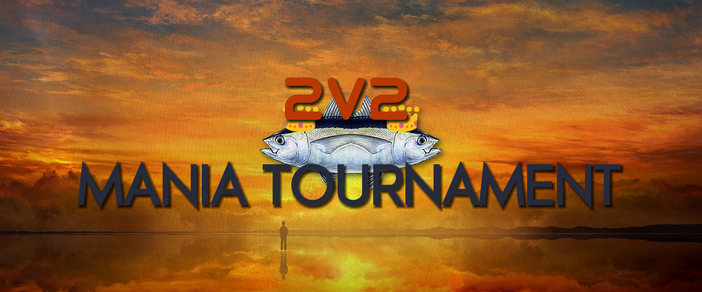

---
tags:
  - 2v2 thonking Mania Tournament
  - 2TMT
---

# 2v2 :thonking: Mania Tournament

The **2v2 :thonking: Mania Tournament** (***2TMT***) was a 2v2 team-based osu!mania tournament hosted by ::{ flag=MY }:: ::Stupid Idiot::{ user-id=8355574 }. It was the second instalment of the :thonking: Mania Tournament.

## Tournament schedule

| Event | Timestamp |
| --: | :-- |
| Registration phase | 2018-10-11/2018-11-03 |
| Live drawings | 2018-11-03 (13:00 UTC) |
| Qualifiers | 2018-11-10/2018-11-11 |
| Round of 32 | 2018-11-17/2018-11-18 |
| Round of 16 | 2018-11-24/2018-11-25 |
| Quarterfinals | 2018-12-01/2018-12-02 |
| Semifinals | 2018-12-08/2018-12-09 |
| Finals | 2018-12-15/2018-12-16 |
| Grand Finals | 2018-12-22/2018-12-23 |

## Prizes

| Placing | Prize(s) |
| :-: | :-- |
|  | 1 month of osu!supporter |

## Organisation

The 2v2 :thonking: Mania Tournament was run by various osu! community members.

| Position | Member(s) |
| :-- | :-- |
| Manager | ::{ flag=MY }:: ::Stupid Idiot::{ user-id=8355574 } |
| Mappool selector | ::{ flag=MY }:: ::cheewee10::{ user-id=4477497 }, ::{ flag=SG }:: ::Raveille::{ user-id=1388767 }, ::{ flag=ID }:: ::RemFanGirl::{ user-id=5767941 } |
| Commentator | ::{ flag=MY }:: ::cheewee10::{ user-id=4477497 }, ::{ flag=SG }:: ::Raveille::{ user-id=1388767 }, ::{ flag=ID }:: ::RemFanGirl::{ user-id=5767941 }, ::{ flag=PH }:: ::vincent4399::{ user-id=9764388 }, ::{ flag=ID }:: ::\[Crz\]Crysarlene::{ user-id=5492871 }, ::{ flag=AR }:: ::juankristal::{ user-id=443656 }, ::{ flag=AU }:: ::PotassiumF::{ user-id=4247722 }, ::{ flag=PH }:: ::LohaWarpe::{ user-id=8560810 }, ::{ flag=SG }:: ::Polytetral::{ user-id=8612061 } |
| Streamer | ::{ flag=MY }:: ::Bedwyr Aorta::{ user-id=10875855 }, ::{ flag=PH }:: ::LohaWarpe::{ user-id=8560810 }, ::{ flag=CA }:: ::Sinaeb::{ user-id=1576095 } |
| Designer | ::{ flag=MY }:: ::Xeious::{ user-id=5357146 } |
| Statistician | ::{ flag=VN }:: ::steve\_04\_::{ user-id=10852911 } |
| Referee | ::{ flag=FR }:: ::Kasumii-sama::{ user-id=6177263 }, ::{ flag=MY }:: ::Bedwyr Aorta::{ user-id=10875855 }, ::{ flag=VN }:: ::steve\_04\_::{ user-id=10852911 }, ::{ flag=PL }:: ::Kondi::{ user-id=7382321 }, ::{ flag=PL }:: ::Baziu::{ user-id=7192659 }, ::{ flag=US }:: ::R-2E-054::{ user-id=3625265 }, ::{ flag=ID }:: ::chouyaa::{ user-id=8404646 }, ::{ flag=HK }:: ::zero2snow::{ user-id=7751516 } |
| Wiki editor | ::{ flag=ID }:: ::fajar13k::{ user-id=7100002 } |

## Links

- [Discussion thread](https://osu.ppy.sh/community/forums/topics/814983)
- [TMT Discord server](https://discord.gg/CPRBtBR)
- [TMT Challonge brackets](https://challonge.com/2tmt)
- [Livestream](https://www.twitch.tv/thonkingtourney)
- **[Statistics sheet](https://docs.google.com/spreadsheets/d/e/2PACX-1vTQ0UHEZ55LqAnlE6TEZJyYWzttoeh4hour4weugiQu6aO06kdk3N6rQMZi-ksvi7ZDOF4dEFypizp8/pubhtml)**

## Participants

| Team | Members |
| :-- | :-- |
| **PolytETral** | ::{ flag=CA }:: **::Sinaeb::{ user-id=1576095 }**, ::{ flag=BE }:: ::NightNarumi::{ user-id=4381142 }, ::{ flag=DK }:: ::tailsdk::{ user-id=6751666 }, ::{ flag=RU }:: ::YaLTeR::{ user-id=3910006 } |
| **KABITE BOIZ and baltz** | ::{ flag=PH }:: **::zgaj::{ user-id=6908508 }**, ::{ flag=PH }:: ::GTXCZE::{ user-id=9209185 }, ::{ flag=PH }:: ::nathan10::{ user-id=6152404 }, ::{ flag=PH }:: ::Baltz::{ user-id=6083463 } |
| **SUOMI PERKELE** | ::{ flag=FI }:: **::Camopoltergeist::{ user-id=8132964 }**, ::{ flag=FI }:: ::princesswell::{ user-id=4789005 }, ::{ flag=FI }:: ::CunuTriggeredMe::{ user-id=3386886 } |
| **La pancit bois** | ::{ flag=SG }:: **::Polytetral::{ user-id=8612061 }**, ::{ flag=PH }:: ::SurfChu85::{ user-id=4469895 }, ::{ flag=PH }:: ::arge-::{ user-id=9919550 }, ::{ flag=SG }:: ::Cute Doggo::{ user-id=7288030 } |
| **Henmenumai** | ::{ flag=TH }:: **::gandam080::{ user-id=6332756 }**, ::{ flag=TH }:: ::Trillerspec::{ user-id=8324386 } |
| **3 argentos y medio** | ::{ flag=AR }:: **::juankristal::{ user-id=443656 }**, ::{ flag=AR }:: ::bubshish::{ user-id=7110363 }, ::{ flag=CL }:: ::WalterToro::{ user-id=5281416 }, ::{ flag=AR }:: ::jLuyalb::{ user-id=7093698 } |
| **fucking weebs** | ::{ flag=AU }:: **::PotassiumF::{ user-id=4247722 }**, ::{ flag=AU }:: ::ryuzah::{ user-id=2289344 }, ::{ flag=AU }:: ::-Xenovia-::{ user-id=5259743 }, ::{ flag=AU }:: ::No-Fail::{ user-id=7207775 } |
| **we don't know** | ::{ flag=US }:: **::Poke\_player::{ user-id=6502279 }**, ::{ flag=CA }:: ::XxStability98Xx::{ user-id=6701738 } |
| **Team Loli** | ::{ flag=MY }:: **::\[MY\]Kibitz::{ user-id=7418493 }**, ::{ flag=ID }:: ::\_Riku1602::{ user-id=6918271 }, ::{ flag=MY }:: ::Kiriyalow::{ user-id=6363947 }, ::{ flag=MY }:: ::KosukeSaitooo::{ user-id=6966879 } |
| **nmsl** | ::{ flag=CN }:: **::hans1999::{ user-id=6679329 }**, ::{ flag=CN }:: ::yin xiaosong::{ user-id=10226286 }, ::{ flag=CN }:: ::Crystal::{ user-id=1646397 }, ::{ flag=CN }:: ::Tofu1222::{ user-id=6089608 } |
| **Lamp memes aren't funny** | ::{ flag=ID }:: **::Fyl::{ user-id=10069307 }**, ::{ flag=ID }:: ::liykun::{ user-id=9500057 }, ::{ flag=ID }:: ::2ndlegend::{ user-id=7621604 } |
| **Eternal Meme** | ::{ flag=ID }:: **::Vikry::{ user-id=7123812 }**, ::{ flag=ID }:: ::Nero-::{ user-id=13094324 } |
| **7k Masterrace** | ::{ flag=ID }:: **::Halsy::{ user-id=6551704 }**, ::{ flag=ID }:: ::-ExRazor::{ user-id=6807769 } |
| **Queue** | ::{ flag=ID }:: **::Eternal\_Stream::{ user-id=10259156 }**, ::{ flag=ID }:: ::dhimas arya::{ user-id=7108145 } |
| **Sleepy Doggo OwO** | ::{ flag=ID }:: **::SayoriFanGirl::{ user-id=4569035 }**, ::{ flag=ID }:: ::AnGga881::{ user-id=7810042 } |
| **PepeHands** | ::{ flag=PH }:: **::windrush123::{ user-id=9087181 }**, ::{ flag=PH }:: ::Arccat::{ user-id=4848294 }, ::{ flag=PH }:: ::Mk3605::{ user-id=8416824 } |
| **Fanklub Mariusza Pudzianowskiego** | ::{ flag=PL }:: **::Kamikaze::{ user-id=2124783 }**, ::{ flag=PL }:: ::Miq::{ user-id=2424440 }, ::{ flag=PL }:: ::Nick Wilde::{ user-id=8550320 }, ::{ flag=PL }:: ::Triksu::{ user-id=7233032 } |
| **Pizza Time** | ::{ flag=IT }:: **::-extradoge-::{ user-id=9135468 }**, ::{ flag=IT }:: ::BadIsTheNewGod::{ user-id=5245132 }, ::{ flag=PH }:: ::Shiyui-::{ user-id=9374607 }, ::{ flag=IT }:: ::Tantuz::{ user-id=7794657 } |
| **NOOBinACC** | ::{ flag=TH }:: **::- K U M A -::{ user-id=11622143 }**, ::{ flag=TH }:: ::IceLnwKung::{ user-id=4213753 }, ::{ flag=TH }:: ::Rinne Sama::{ user-id=10078676 } |
| **Tojas Team** | ::{ flag=MX }:: **::\[OSC\]Amagai::{ user-id=9658070 }**, ::{ flag=MX }:: ::- Astaroth -::{ user-id=10629411 }, ::{ flag=CO }:: ::Juanfer1::{ user-id=9708368 } |
| **La secta de Stratos** | ::{ flag=VE }:: **::Edvo::{ user-id=8301758 }**, ::{ flag=VE }:: ::\[\_Chichinya\_\]::{ user-id=2140739 } |
| **TBD 2.0** | ::{ flag=NL }:: **::2fast4you98::{ user-id=5183940 }**, ::{ flag=NL }:: ::Boots::{ user-id=2827823 }, ::{ flag=NL }:: ::Freek::{ user-id=9630674 }, ::{ flag=NL }:: ::Redenor::{ user-id=6964358 } |
| **Crawling in my skin** | ::{ flag=CO }:: **::LoliXn-::{ user-id=5597043 }**, ::{ flag=CO }:: ::Temoote::{ user-id=10326318 }, ::{ flag=CO }:: ::KyolyXn-::{ user-id=6864656 }, ::{ flag=CO }:: ::DarkGunner::{ user-id=9828143 } |
| **Couil #1** | ::{ flag=SE }:: **::Craty::{ user-id=3918056 }**, ::{ flag=SE }:: ::\[- Koliwan -\]::{ user-id=7746055 } |
| **Accu Rassie** | ::{ flag=FR }:: **::Adri::{ user-id=4579132 }**, ::{ flag=FR }:: ::Kyzoid::{ user-id=4089441 }, ::{ flag=FR }:: ::Tantei B::{ user-id=6063108 }, ::{ flag=FR }:: ::polo2000::{ user-id=10169467 } |
| **The EH Team** | ::{ flag=CA }:: **::Trainer Red::{ user-id=3151220 }**, ::{ flag=CA }:: ::Chieftots::{ user-id=4992345 }, ::{ flag=CA }:: ::Xala::{ user-id=7508113 }, ::{ flag=CA }:: ::Kengy::{ user-id=8864630 } |
| **UKhile** | ::{ flag=GB }:: **::Bubblefan::{ user-id=8946085 }**, ::{ flag=GB }:: ::Insp1r3::{ user-id=7131254 }, ::{ flag=CL }:: ::Makis3\_Kurisu::{ user-id=6376358 } |
| **RIL** | ::{ flag=PE }:: **::DaZeRo5::{ user-id=6114633 }**, ::{ flag=EC }:: ::MG8::{ user-id=8324458 }, ::{ flag=AR }:: ::DUELODER::{ user-id=8224116 } |
| **Bongos** | ::{ flag=US }:: **::Dragolord::{ user-id=7439226 }**, ::{ flag=US }:: ::Eryyy::{ user-id=9872668 }, ::{ flag=US }:: ::Ecal::{ user-id=8384260 }, ::{ flag=US }:: ::NejiDragneel::{ user-id=9013523 } |
| **Chamelfornikowo** | ::{ flag=CL }:: **::Chamelforito::{ user-id=6288548 }**, ::{ flag=CL }:: ::-Nikoskidrow-::{ user-id=2808224 } |
| **Late Night Afro Bakers** | ::{ flag=US }:: **::afrono::{ user-id=1320102 }**, ::{ flag=US }:: ::DarthSkrill::{ user-id=8051422 } |
| **rip la prostata** | ::{ flag=PE }:: **::Kien io::{ user-id=10055648 }**, ::{ flag=PE }:: ::zcristhianlx::{ user-id=9744385 } |
| **Piki's zone** | ::{ flag=CO }:: **::Cansta::{ user-id=9303412 }**, ::{ flag=TW }:: ::murorachi::{ user-id=8682905 } |

## Podium

This competition has come to an end and resulted in the following podium:

| Placing | Team |
| :-: | :-- |
|  | **La pancit bois** (::{ flag=SG }:: **::Polytetral::{ user-id=8612061 }**, ::{ flag=PH }:: ::SurfChu85::{ user-id=4469895 }, ::{ flag=PH }:: ::arge-::{ user-id=9919550 }, ::{ flag=SG }:: ::Cute Doggo::{ user-id=7288030 }) |
|  | **3 argentos y medio** (::{ flag=AR }:: **::juankristal::{ user-id=443656 }**, ::{ flag=AR }:: ::bubshish::{ user-id=7110363 }, ::{ flag=CL }:: ::WalterToro::{ user-id=5281416 }, ::{ flag=AR }:: ::jLuyalb::{ user-id=7093698 }) |
|  | **PolytETral** (::{ flag=CA }:: **::Sinaeb::{ user-id=1576095 }**, ::{ flag=BE }:: ::NightNarumi::{ user-id=4381142 }, ::{ flag=DK }:: ::tailsdk::{ user-id=6751666 }, ::{ flag=RU }:: ::YaLTeR::{ user-id=3910006 }) |

## Mappools

### Grand Finals

**[Download the mappack here! (94 MB)](http://www.mediafire.com/file/2adgf33nba2x39b/2TMT+GF.zip)**

- FreeMod
  1. [Omoi - Snow Drive (frolica) \[Felicity \[11\]\]](https://osu.ppy.sh/beatmapsets/480013#mania/1024856)
  2. [The Flashbulb - Maybe All This Time I Was Wrong (riktoi) \[Regret\]](https://osu.ppy.sh/beatmapsets/808778#mania/1697205)
  3. [MAX COVERI - RUNNING IN THE 90'S (-Kamikaze-) \[MULTI-LANE STREAMING 0.9x\]](https://osu.ppy.sh/beatmapsets/614240#mania/1295826)
  4. [-45 - Total Eclipse of the Sun (RemFanGirl) \[Rem's Apocalyptic sign\]](https://osu.ppy.sh/beatmapsets/753100#mania/1653024)
  5. [VerseQuence - Wilt (Guilhermeziat) \[Unweave\]](https://osu.ppy.sh/beatmapsets/592501#mania/1253611)
  6. [Se-U-Ra - LOSHAXI (Elekton) \[alonewithi\]](https://osu.ppy.sh/beatmapsets/790524#mania/1658712)
  7. [xi - Valhalla (cheewee10) \[Eternal\]](https://osu.ppy.sh/beatmapsets/894479#mania/1869150)
  8. [Memme - Uranium (tailsdk) \[Radioactive Noodles\]](https://osu.ppy.sh/beatmapsets/872940#mania/1824765)
  9. [Hatsuki Yura - Dancer of Saramandora (Raveille) \[Sprites\]](https://osu.ppy.sh/beatmapsets/836808#mania/1752295)
  10. [Umeboshi Chazuke - Owari to Hajimari no Oto (K a b i -) \[Turrim's Dongjin Again\]](https://osu.ppy.sh/beatmapsets/893829#mania/1867926)
  11. [xi - Zephyros (TheToaphster) \[Typhoon\]](https://osu.ppy.sh/beatmapsets/612409#mania/1292405)
  12. [Lime - 8bit Adventurer (Daikyi) \[Blast Off!\]](https://osu.ppy.sh/beatmapsets/575327#mania/1218334)
  13. [Camellia - {albus} (eyes) \[{redo}\]](https://osu.ppy.sh/beatmapsets/767146#mania/1853992)
  14. [sakuzyo - Black Lair (RemFangirl) \[Depths\]](https://osu.ppy.sh/beatmapsets/892746#mania/1866053)
  15. [Puru - Grimheart (zero2snow) \[unstable\]](https://osu.ppy.sh/beatmapsets/706388#mania/1493706)
- Tiebreaker
  1. **[Camellia - Introduction / Quicksand (Curiossity) \[Confined\]](https://osu.ppy.sh/beatmapsets/794638#mania/1669050)**

### Finals

**[Download the mappack here! (131 MB)](https://www.mediafire.com/file/ol2o368x5dzz47t/2TMT+Finals.zip)**

- FreeMod
  1. [JINDOU. - Kaisei Joshou Hallelujah (Shoegazer) \[Extra\]](https://osu.ppy.sh/beatmapsets/710997#mania/1503114)
  2. [Megurine Luka - Of Amnesia (Vortex-) \[Of Loss\]](https://osu.ppy.sh/beatmapsets/729251#mania/1539362)
  3. [Betwixt & Between - So Sweet Bitter Days (Lynessa) \[x1.2\]](https://osu.ppy.sh/beatmapsets/845652#mania/1768706)
  4. [Gekikara Mania - Deublithick (RemFangirl) \[Thicc Jack 1.1x\]](https://osu.ppy.sh/beatmapsets/781026#mania/1640455)
  5. [wa. - Immortal Singularity (Elekton) \[deus\]](https://osu.ppy.sh/beatmapsets/739563#mania/1560453)
  6. [The Ghost of 3.13 - Empty Days Of Summer (Phil) \[Dismal\]](https://osu.ppy.sh/beatmapsets/499834#mania/1063666)
  7. [DJ Sharpnel - Gate Openerz (\[Crz\]Crysarlene, RemFanGirl) \[Serene Observation\]](https://osu.ppy.sh/beatmapsets/889239#mania/1858614)
  8. [C-Show - On the FM (Raspberriel) \[107.1 MHz\]](https://osu.ppy.sh/beatmapsets/696787#mania/1475857)
  9. [IOSYS - Ringo's Tea Party (TheToaphster) \[Spooked\]](https://osu.ppy.sh/beatmapsets/638838#mania/1355027)
  10. [void - Anguished Unmaking (LovelySerenade) \[Vindication\]](https://osu.ppy.sh/beatmapsets/728509#mania/1538044)
  11. [Sakuzyo - Toy's 3 minutes war (Halogen-) \[Speedy Trinket\]](https://osu.ppy.sh/beatmapsets/846442#mania/1770280)
  12. [Frums - theyaremanycolors (Vortex-) \[emotions\]](https://osu.ppy.sh/beatmapsets/829383#mania/1737654)
  13. [Kyou1110 vs Takuya Namba - 'Alice in Wonderland' crazy apple could not live in real life (Kamikaze) \[Distressed\]](https://osu.ppy.sh/beatmapsets/745471#mania/1643708)
  14. [Silentroom - NULCTRL (Janko) \[SILENT\]](https://osu.ppy.sh/beatmapsets/874723#mania/1828104)
  15. [Daisuke Tanabe - Ghost (PotassiumF) \[disorienting\]](https://osu.ppy.sh/beatmapsets/780635#mania/1639702)
- Tiebreaker
  1. **[AAAA - Hoshi o Kakeru Adventure - we are forever friends! \[Long ver.\] (Eclipse-) \[generic diffname\]](https://osu.ppy.sh/beatmapsets/759341#mania/1596986)**

### Semifinals

**[Download the mappack here! (79 MB)](http://www.mediafire.com/file/un3z1e1y8levdr1/2TMT+SF.zip)**

- FreeMod
  1. [Remo Prototype\[CV: Hanamori Yumiri\] - Sendan Life (Hestiaaa) \[Hard-\[Short\]\]](https://osu.ppy.sh/beatmapsets/429911#mania/927549)
  2. [Dragonforce - Storming The Burning Fields (IcyWorld) \[Hard\]](https://osu.ppy.sh/beatmapsets/661719#mania/1400798)
  3. [LeaF - Wizdomiot (AutotelicBrown) \[Hard(dance-single)\]](https://osu.ppy.sh/beatmapsets/393713#mania/856829)
  4. [Joji - SLOW DANCING IN THE DARK (Shoegazer) \[ballads\]](https://osu.ppy.sh/beatmapsets/869760#mania/1817675)
  5. [Drop - HAMELN (XeoStyle) \[magikxD\]](https://osu.ppy.sh/beatmapsets/562347#mania/1188966)
  6. [Memme - Hellfire (scissorsf) \[La Inferno\]](https://osu.ppy.sh/beatmapsets/635334#mania/1348132)
  7. [Pastel\*Palettes - Yura-Yura Ring-Dong-Dance (Razzy) \[My Confidante\]](https://osu.ppy.sh/beatmapsets/870166#mania/1818485)
  8. [PROTODOME - Greatest Hat (Gekido-) \[chalLeNge\]](https://osu.ppy.sh/beatmapsets/840500#mania/1759313)
  9. [Mayumi Morinaga - dreamin' feat. Ryu\* (+VOX Mix) (\_underjoy) \[UJCHAN!!\]](https://osu.ppy.sh/beatmapsets/885179#mania/1850115)
  10. [kanone feat. Sennzai - Flower, snow and Drum'n'bass. (Raveille) \[So Energetic\]](https://osu.ppy.sh/beatmapsets/884566#mania/1848891)
  11. [taiyo - Skyflare!!!! (PiraTom) \[VERMILLION\]](https://osu.ppy.sh/beatmapsets/628432#mania/1324925)
  12. [C418 - Sweden (Couil) \[sphere\]](https://osu.ppy.sh/beatmapsets/815908#mania/1711121)
  13. [Lockyn - Lockout (IceDynamix) \[sv\]](https://osu.ppy.sh/beatmapsets/843730#mania/1765165)
- Tiebreaker
  1. **[Camellia feat. Nanahira - EDM Jumpers ({E+H}DM Reboot) (Gekido-) \[{L+E}MON Reboot\]](https://osu.ppy.sh/beatmapsets/805341#mania/1690577)**

### Quarterfinals

**[Download the mappack here! (58 MB)](https://www.mediafire.com/file/zw687w6ph5thdw2/2TMT+QF.zip)**

- FreeMod
  1. [DJ YOSHITAKA - FLOWER (Raveille) \[Air Blossom\]](https://osu.ppy.sh/beatmapsets/869803#mania/1817772)
  2. [naotyu- feat. Eri Sasaki - Candy Tall Woman (Raveille) \[Syrup\]](https://osu.ppy.sh/beatmapsets/772698#mania/1624238)
  3. [ELISA - ebullient future (souzirou1000) \[LN\]](https://osu.ppy.sh/beatmapsets/601088#mania/1269921)
  4. [Camellia - Towards the Horizon (Couil) \[incandescence\]](https://osu.ppy.sh/beatmapsets/719100#mania/1518610)
  5. [Yooh - Knock The Gate (short Ver.) (ALEFY) \[Extra \[Fantastic SV\]\]](https://osu.ppy.sh/beatmapsets/797589#mania/1675081)
  6. [E-Type - Here I Go Again (Jole) \[where u going though\]](https://osu.ppy.sh/beatmapsets/433032#mania/933589)
  7. [Drumcorps - Down (Civilization) \[Arrest\]](https://osu.ppy.sh/beatmapsets/837338#mania/1753264)
  8. [KOTOKO - Wing my Way (arpia97) \[Jack my Way\]](https://osu.ppy.sh/beatmapsets/794615#mania/1669001)
  9. [Billx & Ostralopitek - ORACLE (Wh1teh) \[Marathon\]](https://osu.ppy.sh/beatmapsets/427758#mania/923394)
  10. [AAAA Chazuke - Hop Step Adventure\* (Dreamwalker) \[Insane\]](https://osu.ppy.sh/beatmapsets/574576#mania/1216879)
  11. [SickStrophe - Pop Up Tha Bass (Cokiiplay) \[Jump\]](https://osu.ppy.sh/beatmapsets/615707#mania/1298710)
- Tiebreaker
  1. **[Camellia - Primitive Pump (Dragolord) \[Ancient\]](https://osu.ppy.sh/beatmapsets/853247#mania/1827280)**

### Round of 16

**[Download the mappack here! (84 MB)](http://www.mediafire.com/file/biq1sxy1oiu2cdx/2TMT+RO16.zip)**

- FreeMod
  1. [carryYellow Claw & Flux Pavilion - Catch Me (andreymc) \[Hard\]](https://osu.ppy.sh/beatmapsets/700716#mania/1483360)
  2. [ZYTOKINE - DESIRE DREAM feat, itori - FELT Remix (\_underjoy) \[Insane Side B\]](https://osu.ppy.sh/beatmapsets/836634#mania/1761189)
  3. [Kero Kero Bonito - Flamingo (RemFangirl) \[lndifference\]](https://osu.ppy.sh/beatmapsets/767418#mania/1613146)
  4. [Gems Pack 14 - LN Master 6th (gemboyong) \[\[12\] S.I.D Sound - Pink Gold\]](https://osu.ppy.sh/beatmapsets/597080#mania/1263203)
  5. [succducc - me & u (Shoegazer) \[yume\]](https://osu.ppy.sh/beatmapsets/781107#mania/1640584)
  6. [OutPhase - Quasar (RemFangirl) \[HSMP 5 (217bpm)\]](https://osu.ppy.sh/beatmapsets/879970#mania/1840170)
  7. [stereoberry - ametsuchi (Civilization) \[petrichor\]](https://osu.ppy.sh/beatmapsets/671311#mania/1419426)
  8. [sirokuma - Apollo11 (Elekton) \[lunarian stream\]](https://osu.ppy.sh/beatmapsets/769539#mania/1618073)
  9. [Chroma - Pon-Pon Pompoko Dai-Sen-Saw! (PiraTom) \[Pira's EXHAUST\]](https://osu.ppy.sh/beatmapsets/351531#mania/775625)
  10. [Vospi - roboposition!! (arviejhay) \[4K HD\]](https://osu.ppy.sh/beatmapsets/164310#mania/400180)
  11. [brothel. - timmy. (Nick Wilde) \[notitle.\]](https://osu.ppy.sh/beatmapsets/697911#mania/1478256)
- Tiebreaker
  1. **[Chroma - Hoshi ga Furanai Machi (Guilhermeziat) \[Shooting Stars\]](https://osu.ppy.sh/beatmapsets/749408#mania/1578514)**

### Round of 32

**[Download the mappack here! (131 MB)](https://www.mediafire.com/file/ol2o368x5dzz47t/2TMT+Finals.zip)**

- FreeMod
  1. [senya - Koborezu no Negaigoto (souzirou1000) \[LN\]](https://osu.ppy.sh/beatmapsets/713607#mania/1513326)
  2. [Hideki Sakamoto - Lifelight (Raveille) \[Compass\]](https://osu.ppy.sh/beatmapsets/873914#mania/1826667)
  3. [Yuzuki - Dear You (Vocal Version) (RemFangirl) \[Distant\]](https://osu.ppy.sh/beatmapsets/763326#mania/1605032)
  4. [chunbaiP - Akari (RemFangirl) \[Gleam\]](https://osu.ppy.sh/beatmapsets/876330#mania/1831518)
  5. [subplaid - Jeg onskerikke a skade deg (Hydria) \[Hard\]](https://osu.ppy.sh/beatmapsets/516286#mania/1097159)
  6. [Tennyson - L'oiseau qui danse (Valedict) \[Parakeet\]](https://osu.ppy.sh/beatmapsets/481501#mania/1027614)
  7. [Kuroneko Dungeon - Ryoushi no Umi no Lindwurm (Hydria) \[Hydria's Insane\]](https://osu.ppy.sh/beatmapsets/453900#mania/973289)
  8. [Oskar Schuster - Fjarlaegur (Cypix Remix) (TheToaphster) \[Isolation\]](https://osu.ppy.sh/beatmapsets/824249#mania/1727090)
  9. [Redemptive - Adrenaline (Nick Wilde) \[insane\]](https://osu.ppy.sh/beatmapsets/837456#mania/1772478)
- Tiebreaker
  1. **[PrototypeRaptor - Color Galaxy (Parachor) \[Andromeda\]](https://osu.ppy.sh/beatmapsets/490702#mania/1045834)**

### Qualifiers

**[Download the mappack here! (29 MB)](http://www.mediafire.com/file/2tqt35qnr3ouru6/2TMT+Qualifiers.zip)**

- FreeMod
  1. [Woodkid - Run Boy Run (RemFangirl) \[Stage 1 : Getaway\]](https://osu.ppy.sh/beatmapsets/873415#mania/1825724)
  2. [Dido - White Flag (RemFangirl) \[Stage 2 : Patience\]](https://osu.ppy.sh/beatmapsets/873417#mania/1825728)
  3. [Mr. Fantastic - Usual Groove (Raveille) \[Stage 3 : Rhythm\]](https://osu.ppy.sh/beatmapsets/873411#mania/1825720)
  4. [Fractal Dreamers - Celestial Horizon (cheewee10) \[Stage 4 : Illusion\]](https://osu.ppy.sh/beatmapsets/873409#mania/1825718)
  5. [A4paper - Ultranova (Raveille) \[Stage 5: Nimble\]](https://osu.ppy.sh/beatmapsets/873412#mania/1825721)

## Match results

### Grand Finals

Friday, 21 December 2018:

| Team 1 |  |  | Team 2 | Match link |
| --: | :-: | :-: | :-- | :-- |
| PolytETral | 1 | **7** | **La pancit bois** | [#1](https://osu.ppy.sh/community/matches/48251480) |

Saturday, 22 December 2018:

| Team 1 |  |  | Team 2 | Match link |
| --: | :-: | :-: | :-- | :-- |
| 3 argentos y medio | 1 | **7** | **La pancit bois** | [#1](https://osu.ppy.sh/community/matches/48280054) |
| **La pancit bois** | **7** | 4 | 3 argentos y medio | [#1](https://osu.ppy.sh/community/matches/48282582) |

### Finals

Saturday, 15 December 2018:

| Team 1 |  |  | Team 2 | Match link |
| --: | :-: | :-: | :-- | :-- |
| **3 argentos y medio** | **6** | 0 | Team Loli | *win by default* |

Sunday, 16 December 2018:

| Team 1 |  |  | Team 2 | Match link |
| --: | :-: | :-: | :-- | :-- |
| **nmsl** | **6** | 5 | fucking weebs | [#1](https://osu.ppy.sh/community/matches/48134025) |
| KABITE BOIZ and baltz | 0 | **6** | **Fanklub Mariusza Pudzianowskiego** | *win by default* |
| **La pancit bois** | **6** | 1 | Fanklub Mariusza Pudzianowskiego | [#1](https://osu.ppy.sh/community/matches/48140066) |
| **PolytETral** | **6** | 0 | nmsl | [#1](https://osu.ppy.sh/community/matches/48142893) |

### Semifinals

Friday, 7 December 2018:

| Team 1 |  |  | Team 2 | Match link |
| --: | :-: | :-: | :-- | :-- |
| **3 Argentos y Medio** | **6** | 4 | La pancit bois | [#1](https://osu.ppy.sh/community/matches/47938858) |

Saturday, 8 December 2018:

| Team 1 |  |  | Team 2 | Match link |
| --: | :-: | :-: | :-- | :-- |
| **Team Loli** | **6** | 0 | PolytETral | [#1](https://osu.ppy.sh/community/matches/47962270) |
| **SUOMI PERKELE** | **6** | 3 | La secta de Stratos | [#1](https://osu.ppy.sh/community/matches/47968602) |
| **Accu Rassie** | **6** | 1 | TBD 2.0 | [#1](https://osu.ppy.sh/community/matches/47970344) |
| **we don't know** | **6** | 5 | Late Night Afro Bakers | [#1](https://osu.ppy.sh/community/matches/47971830) |
| Bongos | 0 | **6** | **RIL** | [#1](https://osu.ppy.sh/community/matches/47976639) |

Sunday, 9 December 2018:

| Team 1 |  |  | Team 2 | Match link |
| --: | :-: | :-: | :-- | :-- |
| **fucking weebs** | **6** | 1 | Bongos | [#1](https://osu.ppy.sh/community/matches/47981472) |
| **nmsl** | **6** | 1 | we don't know | [#1](https://osu.ppy.sh/community/matches/47981964) |
| **KABITE BOIZ and baltz** | **6** | 1 | SUOMI PERKELE | [#1](https://osu.ppy.sh/community/matches/47987510) |
| **Fanklub Mariusza Pudzianowskiego** | **6** | 2 | Accu Rassie | [#1](https://osu.ppy.sh/community/matches/47996734) |

### Quarterfinals

Saturday, 1 December 2018:

| Team 1 |  |  | Team 2 | Match link |
| --: | :-: | :-: | :-- | :-- |
| **Team Loli** | **5** | 0 | Fanklub Mariusza Pudzianowskiego | [#1](https://osu.ppy.sh/community/matches/47801175) |
| **PolytETral** | **5** | 2 | KABITE BOIZ and baltz | [#1](https://osu.ppy.sh/community/matches/47803037) |
| **La secta de Stratos** | **5** | 1 | Lamp memes aren't funny | [#1](https://osu.ppy.sh/community/matches/47804724), [#2](https://osu.ppy.sh/community/matches/47806487) |
| Crawling in my skin | 2 | **5** | **SUOMI PERKELE** | [#1](https://osu.ppy.sh/community/matches/47812496) |
| **we don't know** | **5** | 1 | Couil #1 | [#1](https://osu.ppy.sh/community/matches/47812498) |
| **RIL** | **5** | 0 | The EH Team | [#1](https://osu.ppy.sh/community/matches/47816331) |
| **Bongos** | **5** | 0 | Trip la prostata | [#1](https://osu.ppy.sh/community/matches/47817949) |

Sunday, 2 December 2018:

| Team 1 |  |  | Team 2 | Match link |
| --: | :-: | :-: | :-- | :-- |
| **3 argentos y medio** | **5** | 3 | fucking weebs | [#1](https://osu.ppy.sh/community/matches/47821527), [#2](https://osu.ppy.sh/community/matches/47822286) |
| **Late Night Afro Bakers** | **5** | 3 | Queue | [#1](https://osu.ppy.sh/community/matches/47826149) |
| **La pancit bois** | **5** | 3 | nmsl | [#1](https://osu.ppy.sh/community/matches/47826319) |
| **Accu Rassie** | **5** | 3 | Pizza Time | [#1](https://osu.ppy.sh/community/matches/47833825) |
| **TBD 2.0** | **5** | 0 | UKhile | *win by default* |

### Round of 16

Saturday, 24 November 2018:

| Team 1 |  |  | Team 2 | Match link |
| --: | :-: | :-: | :-- | :-- |
| Henmenumai | 0 | **5** | **The EH Team** | *win by default* |
| 7k Masterrace | 0 | **5** | **Lamp memes aren't funny** | *win by default* |
| **Queue** | **5** | 0 | NOOBinACC | *win by default* |
| **La pancit bois** | **5** | 1 | La secta de Stratos | [#1](https://osu.ppy.sh/community/matches/47645695) |
| Eternal Meme | 0 | **5** | **Pizza Time** | [#1](https://osu.ppy.sh/community/matches/47647884) |
| **UKhile** | **5** | 0 | Chamelfornikowo | *win by default* |
| Tojas Team | 0 | **5** | **rip la prostata** | *win by default* |

Sunday, 25 November 2018:

| Team 1 |  |  | Team 2 | Match link |
| --: | :-: | :-: | :-- | :-- |
| **nmsl** | **5** | 0 | Crawling in my skin | [#1](https://osu.ppy.sh/community/matches/47664183) |
| **Team Loli** | **5** | 4 | RIL | [#1](https://osu.ppy.sh/community/matches/47665948) |
| **KABITE BOIZ and baltz** | **5** | 1 | we don't know | [#1](https://osu.ppy.sh/community/matches/47667776) |
| Accu Rassie | 4 | **5** | **fucking weebs** | [#1](https://osu.ppy.sh/community/matches/47670741) |
| **PolytETral** | **5** | 0 | Late Night Afro Bakers | [#1](https://osu.ppy.sh/community/matches/47678130) |
| **Fanklub Mariusza Pudzianowskiego** | **5** | 0 | Bongos | [#1](https://osu.ppy.sh/community/matches/47682206) |
| **3 argentos y medio** | **5** | 0 | TBD 2.0 | [#1](https://osu.ppy.sh/community/matches/47682380) |

### Round of 32

Saturday, 17 November 2018:

| Team 1 |  |  | Team 2 | Match link |
| --: | :-: | :-: | :-- | :-- |
| **La pancit bois** | **4** | 0 | Tojas Team | *win by default* |
| **nmsl** | **4** | 0 | Henmenumai | *win by default* |
| **fucking weebs** | **4** | 0 | NOOBinACC | *win by default* |
| **Fanklub Mariusza Pudzianowskiego** | **4** | 0 | 7k Masterrace | *win by default* |
| **TBD 2.0** | **4** | 1 | Couli #1 | [#1](https://osu.ppy.sh/community/matches/47488316) |
| Pizza Time | 3 | **4** | **Late Night Afro Bakers** | [#1](https://osu.ppy.sh/community/matches/47490127) |
| **Bongos** | **4** | 0 | Lamp memes aren't funny | [#1](https://osu.ppy.sh/community/matches/47491636) |
| **Crawling in my skin** | **4** | 3 | The EH team | [#1](https://osu.ppy.sh/community/matches/47498279) |
| **La secta de Stratos** | **4** | 0 | rip la prostata | *win by default* |

Sunday, 18 November 2018:

| Team 1 |  |  | Team 2 | Match link |
| --: | :-: | :-: | :-- | :-- |
| **KABITE BOIZ and Baltz** | **4** | 0 | UKhile | *win by default* |
| **Accu Rassie** | **4** | 2 | Queue | [#1](https://osu.ppy.sh/community/matches/47517673) |
| **PolytETral** | **4** | 1 | Eternal Meme | [#1](https://osu.ppy.sh/community/matches/47519437) |
| **RIL** | **4** | 2 | SUOMI PERKELE | [#1](https://osu.ppy.sh/community/matches/47521803) |
| **we don't know** | **4** | 0 | Chamelfornikowo | *win by default* |

### Qualifiers

Detailed results for this round can be found via this [link](https://docs.google.com/spreadsheets/d/e/2PACX-1vTQ0UHEZ55LqAnlE6TEZJyYWzttoeh4hour4weugiQu6aO06kdk3N6rQMZi-ksvi7ZDOF4dEFypizp8/pubhtml#).

## Ruleset

### General rules

- Round of 32 will be played as BO7.
- Round of 16 and Quarterfinals will be played as BO9.
- Semifinals will be played as BO11.
- Finals and Grand Finals will be played as BO13.
- Players and Staff members must respect each other.
- Players and Staff members that misbehave will be warned, if the misbehaving continues they will be removed from the tournaments.
- Teams that fail to respect the rules will be placed on a blacklist blocking them from participating in other tournaments hosted by :thonking: and affiliates.

### Qualification stage

- The qualification stage will be used to seed teams into 4 categories, Top seed, High seed, Low seed, and No seed.
- The mappool consist of 5 maps that are going to be played twice.
- Only two team members are allowed to play a map at a time, and members can swap in and out between maps.
- The **best team** attempt of each map will be used to calculate the Total Score of teams.
- Teams ranked 33rd and below will be eliminated.
- If there is less than 32 teams, the tournament will continue with defaults, where the highest ranked teams get priority for this privilege (e.g. #1 and #2 will get a default to RO16 if there are only 30 teams).
- Teams will be organized into lobbies based on the timezones they put on the Form. The players inside the lobby are not facing each other, as their Total Score is what is used for the seeding.

### Double elimination stage

The Double Elimination stages will proceed as follow:

- The referee will create the room 15 minutes prior to the match time and invite the teams.
- When both teams are in the room, the match will start on the scheduled time.
- If a player/team is missing, a 10 minutes timer will be created, and the incomplete team will lose by default if the timer runs out.
- If both teams are incomplete after the timer, the team with more members will win by default (e.g. 1v0). Should there be no players online for either team, both teams are to reschedule to a time within the week to play, else eliminated.
- When the match starts, both team representatives will do a `!roll` to determine the match order, the team with the highest roll will get first warmup, second ban and first pick.
- The warmup must be downloadable with osu!direct, 4 keys and be no longer than 5 minutes.
- After the warmups, teams will have 1 ban of any map (excluding Tiebreaker).
- After bans, teams will pick maps alternating with each other until on player reach the required amount of points to win the match.
- If both teams are at match point, the Tiebreaker will be played.
