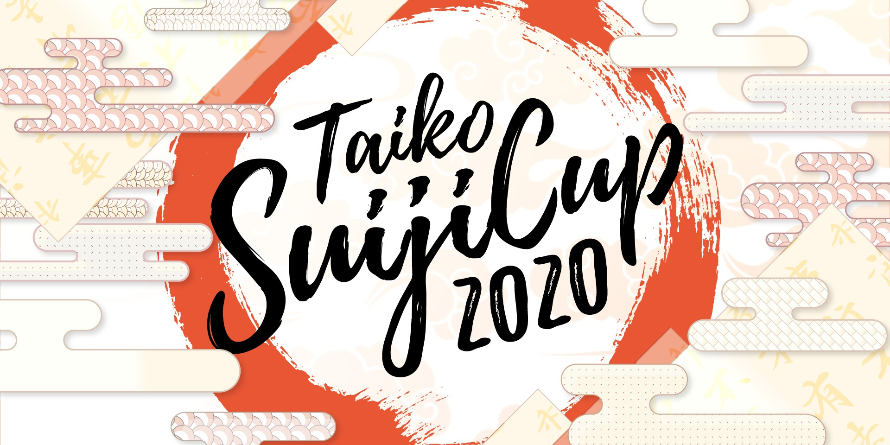

---
tags:
  - TSC
  - TSC2020
---

# Taiko Suiji Cup 2020

The **Taiko Suiji Cup 2020** (***TSC 2020***) was an international three-on-three double-elimination osu!taiko tournament hosted by ::{ flag=FR }:: [Kasumii-sama](https://osu.ppy.sh/users/6177263). Each participant registered individually and was assigned to a random team. This was the second instalment of the Taiko Suiji Cup.

## Tournament schedule

| Event | Timestamp |
| --: | :-- |
| Registration phase | 2020-01-10/2020-02-09 |
| Live drawings | 2020-02-17 (20:00 UTC) |
| Qualifiers | 2020-02-22/2020-02-23 |
| Round of 32 | 2020-02-28/2020-03-01 |
| Round of 16 | 2020-03-07/2020-03-08 |
| Quarterfinals | 2020-03-14/2020-03-15 |
| Semifinals | 2020-03-21/2020-03-22 |
| Finals | 2020-03-28/2020-03-29 |
| Grand Finals | 2020-04-04 |

## Prizes

| Placing | Prize(s) |
| :-: | :-- |
|  | Unique profile badge |

## Organisation

The Taiko Suiji Cup 2020 was run by various community members.

| Position | Member(s) |
| :-- | :-- |
| Organizer | ::{ flag=FR }:: [Kasumii-sama](https://osu.ppy.sh/users/6177263) |
| Mappool selector | ::{ flag=TW }:: [-\[ ix Ishida xi \]-](https://osu.ppy.sh/users/242910), ::{ flag=KR }:: [BamgoeSN](https://osu.ppy.sh/users/1152851), ::{ flag=KR }:: [Konpaku Sariel](https://osu.ppy.sh/users/533502), ::{ flag=KR }:: [Piel](https://osu.ppy.sh/users/8917069) |
| Referee | ::{ flag=HK }:: [Akali393394](https://osu.ppy.sh/users/9686628), ::{ flag=BR }:: [AnonX32](https://osu.ppy.sh/users/2730270), ::{ flag=KR }:: [BamgoeSN](https://osu.ppy.sh/users/1152851), ::{ flag=DE }:: [Capu](https://osu.ppy.sh/users/2474015), ::{ flag=RU }:: [-dragon67](https://osu.ppy.sh/users/4328734), ::{ flag=DE }:: [GDLenny](https://osu.ppy.sh/users/8406711), ::{ flag=AU }:: [ill onion](https://osu.ppy.sh/users/8306102), ::{ flag=US }:: [JDrago14](https://osu.ppy.sh/users/7690078), ::{ flag=CL }:: [-Kazu-](https://osu.ppy.sh/users/920861), ::{ flag=FR }:: [Mimir](https://osu.ppy.sh/users/7382734), ::{ flag=FR }:: [Satsukel](https://osu.ppy.sh/users/9066390), ::{ flag=DE }:: [Sayira](https://osu.ppy.sh/users/7253958), ::{ flag=MY }:: [Stupid Idiot](https://osu.ppy.sh/users/8355574), ::{ flag=FR }:: [TLQ\_Yoshii](https://osu.ppy.sh/users/7157133) |
| Commentator | ::{ flag=AU }:: [AmateurMonkeyYT](https://osu.ppy.sh/users/8379046), ::{ flag=BR }:: [AnonX32](https://osu.ppy.sh/users/2730270), ::{ flag=AU }:: [Beat43210](https://osu.ppy.sh/users/5664171), ::{ flag=US }:: [Binsu](https://osu.ppy.sh/users/6236911), ::{ flag=DE }:: [Drecksackblase](https://osu.ppy.sh/users/6278008), ::{ flag=EC }:: [Gamelan4](https://osu.ppy.sh/users/9856910), ::{ flag=DE }:: [Heam](https://osu.ppy.sh/users/4705120), ::{ flag=US }:: [JM-](https://osu.ppy.sh/users/10629673), ::{ flag=DE }:: [Mew](https://osu.ppy.sh/users/2345156), ::{ flag=US }:: [Mister Boo](https://osu.ppy.sh/users/2598555), ::{ flag=DE }:: [QEpicAce](https://osu.ppy.sh/users/9489153), ::{ flag=SE }:: [Raphalge](https://osu.ppy.sh/users/3918650), ::{ flag=NZ }:: [Sparxe](https://osu.ppy.sh/users/5750235), ::{ flag=GB }:: [Teezel](https://osu.ppy.sh/users/7528639), ::{ flag=AR }:: [Vaf](https://osu.ppy.sh/users/12589048) |
| Streamer | ::{ flag=BR }:: [AnonX32](https://osu.ppy.sh/users/2730270), ::{ flag=US }:: [ITotallyGetThat](https://osu.ppy.sh/users/8770622), ::{ flag=NL }:: [oliebol](https://osu.ppy.sh/users/2756335), ::{ flag=DE }:: [Sayira](https://osu.ppy.sh/users/7253958) |
| Designer | ::{ flag=KR }:: [POCARI SWEAT](https://osu.ppy.sh/users/5082685) |
| Statistician | ::{ flag=PL }:: [Acrith](https://osu.ppy.sh/users/389880) |
| Developer | ::{ flag=DE }:: [hallowatcher](https://osu.ppy.sh/users/1874761), ::{ flag=FR }:: [ThePooN](https://osu.ppy.sh/users/718454) |
| Wiki editor | ::{ flag=ID }:: [fajar13k](https://osu.ppy.sh/users/7100002) |

## Links

- [Discussion thread](https://osu.ppy.sh/community/forums/topics/1008498)
- [TSC Discord server](https://discord.gg/yV3bDTC)
- [Livestream](https://twitch.tv/osutaikolive)
- [Challonge brackets](https://challonge.com/TSCosu2020)
- [Pick'em predictions website](https://pickem.hwc.hr/tournaments/24) hosted by ::{ flag=DE }:: [hallowatcher](https://osu.ppy.sh/users/1874761)
- **[Statistics sheet](https://docs.google.com/spreadsheets/d/1wRgZE_xq50KLqYQA7t027CW3nIRrIn7hiY3iTapK4V8/edit?usp=sharing)**

## Participants

| Team | Members |
| :-- | :-- |
| **🍘** | ::{ flag=RU }:: **[pavlukivan](https://osu.ppy.sh/users/8321579)**, ::{ flag=SE }:: [Nurend](https://osu.ppy.sh/users/9905079), ::{ flag=CO }:: [Xoretra](https://osu.ppy.sh/users/4940698), ::{ flag=RU }:: [cloudfags](https://osu.ppy.sh/users/5285786), ::{ flag=US }:: [Sanic06](https://osu.ppy.sh/users/6894424), ::{ flag=NL }:: [Krekker](https://osu.ppy.sh/users/8265940) |
| **1** | ::{ flag=UA }:: **[Don Omar](https://osu.ppy.sh/users/689414)**, ::{ flag=JP }:: [owatanimal](https://osu.ppy.sh/users/5769293), ::{ flag=US }:: [giyokon](https://osu.ppy.sh/users/10852632), ::{ flag=RU }:: [Dayzeek](https://osu.ppy.sh/users/5009970), ::{ flag=DE }:: [DeVastatoR015](https://osu.ppy.sh/users/14415208), ::{ flag=MY }:: [imnoobatosuosu](https://osu.ppy.sh/users/12086753) |
| **4:3 gang** | ::{ flag=DE }:: **[frz](https://osu.ppy.sh/users/6956922)**, ::{ flag=BR }:: [Ppus](https://osu.ppy.sh/users/5918857), ::{ flag=FR }:: [Chernobog](https://osu.ppy.sh/users/3317042), ::{ flag=MX }:: [Ammy](https://osu.ppy.sh/users/4183406), ::{ flag=ES }:: [Penvoltio](https://osu.ppy.sh/users/8849448), ::{ flag=US }:: [Mister Boo](https://osu.ppy.sh/users/2598555) |
| **6th Sense** | ::{ flag=PH }:: **[Pochacco](https://osu.ppy.sh/users/2927742)**, ::{ flag=US }:: [Whulf](https://osu.ppy.sh/users/11601107), ::{ flag=KR }:: [Ozu](https://osu.ppy.sh/users/980092), ::{ flag=JP }:: [Ku\_Ren](https://osu.ppy.sh/users/2535243), ::{ flag=PL }:: [Sadownik](https://osu.ppy.sh/users/884838), ::{ flag=BR }:: [K4L1](https://osu.ppy.sh/users/11334594) |
| **#TeamTrees** | ::{ flag=NZ }:: **[Sparxe](https://osu.ppy.sh/users/5750235)**, ::{ flag=RU }:: [Naninub](https://osu.ppy.sh/users/8188876), ::{ flag=RU }:: [Nozdormu](https://osu.ppy.sh/users/7169208), ::{ flag=MX }:: [ZaveryK](https://osu.ppy.sh/users/10913397), ::{ flag=SK }:: [Ayumi-chan](https://osu.ppy.sh/users/6269547), ::{ flag=TW }:: [ryan940618](https://osu.ppy.sh/users/8369908) |
| **Aggressive Banana** | ::{ flag=FR }:: **[BananaW](https://osu.ppy.sh/users/9298106)**, ::{ flag=HK }:: [Faputa](https://osu.ppy.sh/users/845733), ::{ flag=PL }:: [Agresywny Arbuz](https://osu.ppy.sh/users/7056658), ::{ flag=AU }:: [Tsubasa2](https://osu.ppy.sh/users/6835183), ::{ flag=CN }:: [ensan71714](https://osu.ppy.sh/users/2062410), ::{ flag=SG }:: [uchuuj1n](https://osu.ppy.sh/users/9140302) |
| **bacon** | ::{ flag=IT }:: **[D3kuu](https://osu.ppy.sh/users/7807444)**, ::{ flag=SG }:: [Blerargh](https://osu.ppy.sh/users/7609510), ::{ flag=PH }:: [Niro-](https://osu.ppy.sh/users/6443899), ::{ flag=US }:: [Etholux](https://osu.ppy.sh/users/8593837), ::{ flag=CA }:: [SMG3](https://osu.ppy.sh/users/7189946), ::{ flag=GB }:: [Doomsday](https://osu.ppy.sh/users/18983) |
| **beat laser** | ::{ flag=CA }:: **[vladyushko](https://osu.ppy.sh/users/4908773)**, ::{ flag=US }:: [-Electro-](https://osu.ppy.sh/users/3251373), ::{ flag=CA }:: [Player-](https://osu.ppy.sh/users/3724819), ::{ flag=NL }:: [jesse-98](https://osu.ppy.sh/users/502722), ::{ flag=ES }:: [Nara\_NB](https://osu.ppy.sh/users/3593992), ::{ flag=US }:: [ChivaJam](https://osu.ppy.sh/users/10764969) |
| **BlackJack** | ::{ flag=JP }:: **[uone](https://osu.ppy.sh/users/5321719)**, ::{ flag=AR }:: [Jintsuu](https://osu.ppy.sh/users/7165127), ::{ flag=RU }:: [greenyoyo](https://osu.ppy.sh/users/1581472), ::{ flag=TW }:: [josh716](https://osu.ppy.sh/users/1947720), ::{ flag=PL }:: [C O L L A P S E](https://osu.ppy.sh/users/12042993), ::{ flag=ES }:: [forcegk](https://osu.ppy.sh/users/8566580) |
| **Break4** | ::{ flag=EC }:: **[Gamelan4](https://osu.ppy.sh/users/9856910)**, ::{ flag=FR }:: [Romainnoda](https://osu.ppy.sh/users/8814218), ::{ flag=AR }:: [BossPlays](https://osu.ppy.sh/users/7341471), ::{ flag=GR }:: [KostPer](https://osu.ppy.sh/users/10584732), ::{ flag=US }:: [Ethaaaan](https://osu.ppy.sh/users/9536977), ::{ flag=AR }:: [Atreevete](https://osu.ppy.sh/users/2615199) |
| **bruh** | ::{ flag=DE }:: **[Mew](https://osu.ppy.sh/users/2345156)**, ::{ flag=US }:: [cheese salad](https://osu.ppy.sh/users/6349821), ::{ flag=GB }:: [Metzo](https://osu.ppy.sh/users/10633982), ::{ flag=JP }:: [shougi\_55](https://osu.ppy.sh/users/10151766), ::{ flag=US }:: [Carlohman1](https://osu.ppy.sh/users/12212290), ::{ flag=MD }:: [OldFriend](https://osu.ppy.sh/users/6412103) |
| **chocobo** | ::{ flag=JP }:: **[Six b0xes](https://osu.ppy.sh/users/8303357)**, ::{ flag=US }:: [closed](https://osu.ppy.sh/users/5116922), ::{ flag=RU }:: [Den4ik228](https://osu.ppy.sh/users/7115174), ::{ flag=KR }:: [POCARI SWEAT](https://osu.ppy.sh/users/5082685), ::{ flag=IT }:: [Dani24f](https://osu.ppy.sh/users/9264007), ::{ flag=DE }:: [Nwolf](https://osu.ppy.sh/users/1910766) |
| **Donjinshi** | ::{ flag=MY }:: **[\[Zeth\]](https://osu.ppy.sh/users/9912966)**, ::{ flag=VE }:: [\[\_Chichinya\_\]](https://osu.ppy.sh/users/2140739), ::{ flag=IT }:: [A-40](https://osu.ppy.sh/users/14510301), ::{ flag=JP }:: [maguro869](https://osu.ppy.sh/users/4733750), ::{ flag=FR }:: [Ladybug](https://osu.ppy.sh/users/4833654), ::{ flag=DE }:: [Sayira](https://osu.ppy.sh/users/7253958) |
| **Froot Loopy** | ::{ flag=US }:: **[Loopy542](https://osu.ppy.sh/users/5468461)**, ::{ flag=BR }:: [Coryn](https://osu.ppy.sh/users/2828556), ::{ flag=US }:: [Miniature Lamp](https://osu.ppy.sh/users/9821194), ::{ flag=GB }:: [Daniels](https://osu.ppy.sh/users/12439209), ::{ flag=BR }:: [caaiomc](https://osu.ppy.sh/users/5206883), ::{ flag=FR }:: [Ladylag](https://osu.ppy.sh/users/2812098) |
| **Geki Force** | ::{ flag=CN }:: **[kknegative](https://osu.ppy.sh/users/2349769)**, ::{ flag=IT }:: [coed](https://osu.ppy.sh/users/3716665), ::{ flag=ID }:: [-ToMuchFun-](https://osu.ppy.sh/users/5341110), ::{ flag=EE }:: [Kizma](https://osu.ppy.sh/users/8325847), ::{ flag=RU }:: [Starger](https://osu.ppy.sh/users/3398715), ::{ flag=BR }:: [RubyKorosawa](https://osu.ppy.sh/users/14886954) |
| **ham sandwich xviii** | ::{ flag=BR }:: **[Foxeru](https://osu.ppy.sh/users/7479684)**, ::{ flag=ES }:: [Maitgon](https://osu.ppy.sh/users/4875451), ::{ flag=US }:: [Bathym-](https://osu.ppy.sh/users/10674189), ::{ flag=DE }:: [Nepuri](https://osu.ppy.sh/users/6637817), ::{ flag=IT }:: [\[-\_deadshock\_-\]](https://osu.ppy.sh/users/8127849), ::{ flag=US }:: [Quibby](https://osu.ppy.sh/users/11936599) |
| **HolyWeebs** | ::{ flag=US }:: **[Catgirl](https://osu.ppy.sh/users/2771995)**, ::{ flag=US }:: [HoopWheat](https://osu.ppy.sh/users/12177903), ::{ flag=TW }:: [KaEDe1106](https://osu.ppy.sh/users/13122339), ::{ flag=NL }:: [StrijkIjzer](https://osu.ppy.sh/users/4130926), ::{ flag=FR }:: [Mokip](https://osu.ppy.sh/users/11404841), ::{ flag=TW }:: [GOD82028](https://osu.ppy.sh/users/12702107) |
| **IHATETAIKO** | ::{ flag=US }:: **[Backfire](https://osu.ppy.sh/users/263110)**, ::{ flag=KR }:: [ILOVEMARISA](https://osu.ppy.sh/users/8767392), ::{ flag=BR }:: [Skull Kid](https://osu.ppy.sh/users/3044264), ::{ flag=JP }:: [Saikoro](https://osu.ppy.sh/users/741819), ::{ flag=US }:: [kb131313](https://osu.ppy.sh/users/11229259), ::{ flag=ID }:: [ImChro](https://osu.ppy.sh/users/7280717) |
| **plz Jeff** | ::{ flag=PL }:: **[bernard351](https://osu.ppy.sh/users/9511518)**, ::{ flag=JP }:: [Noko\_BSF](https://osu.ppy.sh/users/3811831), ::{ flag=PL }:: [Tetsurio](https://osu.ppy.sh/users/2044810), ::{ flag=IT }:: [\[\_LordEnder\_\]](https://osu.ppy.sh/users/4609767), ::{ flag=US }:: [Swovine](https://osu.ppy.sh/users/6666316), ::{ flag=MY }:: [Bedwyr Aorta](https://osu.ppy.sh/users/10875855) |
| **Ronaldo Gaming** | ::{ flag=SE }:: **[Raphalge](https://osu.ppy.sh/users/3918650)**, ::{ flag=DE }:: [Drecksackblase](https://osu.ppy.sh/users/6278008), ::{ flag=CN }:: [Ookura Risona](https://osu.ppy.sh/users/2073644), ::{ flag=FI }:: [vodnanen](https://osu.ppy.sh/users/10335557), ::{ flag=US }:: [JM-](https://osu.ppy.sh/users/10629673), ::{ flag=US }:: [ThatTaikoGuy](https://osu.ppy.sh/users/4640844) |
| **Six Leaf Clover** | ::{ flag=ID }:: **[Mikurio](https://osu.ppy.sh/users/10734140)**, ::{ flag=CH }:: [MC2BP](https://osu.ppy.sh/users/11296097), ::{ flag=PH }:: [jmeh07](https://osu.ppy.sh/users/2852269), ::{ flag=US }:: [Obama Taichou](https://osu.ppy.sh/users/3220847), ::{ flag=JP }:: [Culisz](https://osu.ppy.sh/users/1211264), ::{ flag=DE }:: [Heam](https://osu.ppy.sh/users/4705120) |
| **Six Spinning Monkeys** | ::{ flag=ES }:: **[RuinedChicken](https://osu.ppy.sh/users/7983713)**, ::{ flag=DE }:: [Zetera](https://osu.ppy.sh/users/587737), ::{ flag=VE }:: [Colorojo12](https://osu.ppy.sh/users/5136821), ::{ flag=CA }:: [kazelone](https://osu.ppy.sh/users/2310786), ::{ flag=US }:: [-Kale](https://osu.ppy.sh/users/4630368), ::{ flag=GB }:: [SayonaraGames](https://osu.ppy.sh/users/8484987) |
| **Spaghetti Protectors** | ::{ flag=IT }:: **[Ikkun](https://osu.ppy.sh/users/1059945)**, ::{ flag=TW }:: [kolishimona](https://osu.ppy.sh/users/3811626), ::{ flag=AU }:: [Beat43210](https://osu.ppy.sh/users/5664171), ::{ flag=PL }:: [Wolfgang](https://osu.ppy.sh/users/7184324), ::{ flag=PL }:: [esemoka57](https://osu.ppy.sh/users/2272413), ::{ flag=ID }:: [Volta](https://osu.ppy.sh/users/4154071) |
| **sunglasses emoji** | ::{ flag=FR }:: **[Yona](https://osu.ppy.sh/users/7930622)**, ::{ flag=US }:: [Das](https://osu.ppy.sh/users/3165416), ::{ flag=RU }:: [Akonine](https://osu.ppy.sh/users/7774222), ::{ flag=VE }:: [Nutellitah](https://osu.ppy.sh/users/10613075), ::{ flag=FI }:: [YERTI](https://osu.ppy.sh/users/1490757), ::{ flag=PL }:: [Finite](https://osu.ppy.sh/users/5385806) |
| **t.** | ::{ flag=PL }:: **[Deroo](https://osu.ppy.sh/users/8360475)**, ::{ flag=FR }:: [Ectomic](https://osu.ppy.sh/users/4069690), ::{ flag=BR }:: [HiroK](https://osu.ppy.sh/users/4050738), ::{ flag=BG }:: [Makou](https://osu.ppy.sh/users/901896), ::{ flag=ID }:: [WhiteSnowAngel](https://osu.ppy.sh/users/3866964), ::{ flag=FR }:: [Aciitm1](https://osu.ppy.sh/users/11253595) |
| **Team 5** | ::{ flag=CL }:: **[Ulqui](https://osu.ppy.sh/users/1263669)**, ::{ flag=JP }:: [kvgyubh](https://osu.ppy.sh/users/8244404), ::{ flag=CL }:: [Aisha](https://osu.ppy.sh/users/2192669), ::{ flag=AT }:: [animexamera](https://osu.ppy.sh/users/7511357), ::{ flag=HK }:: [Brown918](https://osu.ppy.sh/users/9805760), ::{ flag=US }:: [Binsu](https://osu.ppy.sh/users/6236911) |
| **Team 6** | ::{ flag=US }:: **[3san](https://osu.ppy.sh/users/8050850)**, ::{ flag=ID }:: [apaajaboleh10](https://osu.ppy.sh/users/5151647), ::{ flag=MX }:: [Iojioji](https://osu.ppy.sh/users/1346121), ::{ flag=FR }:: [Briesmas](https://osu.ppy.sh/users/2865172), ::{ flag=US }:: [DiggyDogg](https://osu.ppy.sh/users/5014664), ::{ flag=US }:: [MjIsMaster](https://osu.ppy.sh/users/9922896) |
| **Team 26** | ::{ flag=CA }:: **[rubies87](https://osu.ppy.sh/users/4949934)**, ::{ flag=HK }:: [MTDex](https://osu.ppy.sh/users/9468283), ::{ flag=US }:: [\_knots](https://osu.ppy.sh/users/4407678), ::{ flag=ES }:: [LZD](https://osu.ppy.sh/users/224335), ::{ flag=DE }:: [QEpicAce](https://osu.ppy.sh/users/9489153), ::{ flag=AU }:: [- Heatwave -](https://osu.ppy.sh/users/4166621) |
| **THANOS OBAMA** | ::{ flag=FI }:: **[duski](https://osu.ppy.sh/users/6506484)**, ::{ flag=US }:: [R J](https://osu.ppy.sh/users/6490509), ::{ flag=BR }:: [Lazarento](https://osu.ppy.sh/users/3224958), ::{ flag=HK }:: [JarvisGaming](https://osu.ppy.sh/users/8601048), ::{ flag=FR }:: [Panda\_0ne](https://osu.ppy.sh/users/11216472), ::{ flag=PL }:: [\_demo](https://osu.ppy.sh/users/3556891) |
| **The Shitmissers ft. zkane2** | ::{ flag=CL }:: **[Catulus](https://osu.ppy.sh/users/6276709)**, ::{ flag=JP }:: [zkane2](https://osu.ppy.sh/users/6359835), ::{ flag=ID }:: [Naverlyn](https://osu.ppy.sh/users/14324722), ::{ flag=ES }:: [naliem](https://osu.ppy.sh/users/3252709), ::{ flag=CR }:: [Hotman](https://osu.ppy.sh/users/7902082), ::{ flag=FR }:: [Gintoki8](https://osu.ppy.sh/users/2239411) |
| **The winner is the winner** | ::{ flag=PL }:: **[Acrith](https://osu.ppy.sh/users/389880)**, ::{ flag=AR }:: [Axer](https://osu.ppy.sh/users/7299864), ::{ flag=US }:: [driodx](https://osu.ppy.sh/users/9709548), ::{ flag=CA }:: [beary605](https://osu.ppy.sh/users/2198070), ::{ flag=ES }:: [Lunako](https://osu.ppy.sh/users/2041945), ::{ flag=US }:: [Num5119](https://osu.ppy.sh/users/5198060) |
| **Worldwide Bongo** | ::{ flag=RU }:: **[TwinT](https://osu.ppy.sh/users/9976154)**, ::{ flag=NL }:: [Hypello](https://osu.ppy.sh/users/1594036), ::{ flag=BR }:: [Kyoumo](https://osu.ppy.sh/users/8145223), ::{ flag=PT }:: [Yumi\_Hideaki](https://osu.ppy.sh/users/10081162), ::{ flag=HK }:: [LDator](https://osu.ppy.sh/users/9534414), ::{ flag=US }:: [Yujki](https://osu.ppy.sh/users/14987094) |

## Podium

This competition has come to an end and resulted in the following podium:

| Placing | Team |
| :-: | :-- |
|  | **The Shitmissers ft. zkane2** (::{ flag=CL }:: **[Catulus](https://osu.ppy.sh/users/6276709)**, ::{ flag=JP }:: [zkane2](https://osu.ppy.sh/users/6359835), ::{ flag=ID }:: [Naverlyn](https://osu.ppy.sh/users/14324722), ::{ flag=ES }:: [naliem](https://osu.ppy.sh/users/3252709), ::{ flag=CR }:: [Hotman](https://osu.ppy.sh/users/7902082), ::{ flag=FR }:: [Gintoki8](https://osu.ppy.sh/users/2239411)) |
|  | **#TeamTrees** (::{ flag=NZ }:: **[Sparxe](https://osu.ppy.sh/users/5750235)**, ::{ flag=RU }:: [Naninub](https://osu.ppy.sh/users/8188876), ::{ flag=RU }:: [Nozdormu](https://osu.ppy.sh/users/7169208), ::{ flag=MX }:: [ZaveryK](https://osu.ppy.sh/users/10913397), ::{ flag=SK }:: [Ayumi-chan](https://osu.ppy.sh/users/6269547), ::{ flag=TW }:: [ryan940618](https://osu.ppy.sh/users/8369908)) |
|  | **Worldwide Bongo** (::{ flag=RU }:: **[TwinT](https://osu.ppy.sh/users/9976154)**, ::{ flag=NL }:: [Hypello](https://osu.ppy.sh/users/1594036), ::{ flag=BR }:: [Kyoumo](https://osu.ppy.sh/users/8145223), ::{ flag=PT }:: [Yumi\_Hideaki](https://osu.ppy.sh/users/10081162), ::{ flag=HK }:: [LDator](https://osu.ppy.sh/users/9534414), ::{ flag=US }:: [Yujki](https://osu.ppy.sh/users/14987094)) |

## Mappools

### Grand Finals

**[Download the mappack here! (75 MB)](https://mega.nz/#!c1dj3Y7C!ui7a0oGxH_Apeze70ObF9vV0yjpQ55TZzmBABuhlpJQ)**

#### Mappool A

- NoMod
  1. [sakuzyo - StrayedCatz (D o t) \[.'s Taiko\]](https://osu.ppy.sh/beatmapsets/772767#taiko/1624338)
  2. [Kobaryo - Vicious Heroism (Harry\_TW\_ada) \[Yuemiao's Inner Oni\]](https://osu.ppy.sh/beatmapsets/951022#taiko/2193691)
  3. [98shiki SenkaiKikanju - (Foot/Mash)core (applerss) \[(Inner/Foot)oni\]](https://osu.ppy.sh/beatmapsets/1090566#taiko/2279880)
  4. [SHIKI - Pure Ruby (Konpaku Sariel) \[Scarlet\]](https://osu.ppy.sh/beatmapsets/1123527#taiko/2347774)
- Hidden
  1. [lapix - Kill The Beat (HiroK) \[Inner Oni\]](https://osu.ppy.sh/beatmapsets/986572#taiko/2063920)
  2. [7\_7 - Waga Na ha Gorori (7\_7) \[43213444223 hassha\~\]](https://osu.ppy.sh/beatmapsets/833150#taiko/1745206)
- HardRock
  1. [SON OF KICK - Hours ft. Lady Leshurr & Paigey Cakey (Irreversible) \[Nwolf's Oni\]](https://osu.ppy.sh/beatmapsets/274111#taiko/667471)
  2. [REDALiCE - Dead or Die (Konpaku Sariel) \[nyan\]](https://osu.ppy.sh/beatmapsets/1117942#taiko/2366161)
- FreeMod
  1. [Rairyu - ra'am (glalucard) \[Taiko\]](https://osu.ppy.sh/beatmapsets/224900#taiko/524961)
  2. [Eity - M1R4CL3 M1M1K4 (7_7) \[M1R4CL3 PE2\]](https://osu.ppy.sh/beatmapsets/742391#taiko/1571153)

#### Mappool B

- Challenge
  1. [Rissyuu feat.Choko - Punai Punai Gensou \~Punai Punai in Wonderland\~ (KitajimaYN) \[7oni\]](https://osu.ppy.sh/beatmapsets/1048939#taiko/2196403)
  2. [The Flashbulb - Ninedump (Arrival) \[tasuke's Perilous\]](https://osu.ppy.sh/beatmapsets/984361#taiko/2059692)
- DoubleTime
  1. [P\*Light - NINJA IS DEAD IIDX ver. (Tofu1222) \[aabc's Oni\]](https://osu.ppy.sh/beatmapsets/590032#taiko/1689752)
- Easy
  1. [sakuraburst - serotonin (tasuke912) \[C10H12N2O\]](https://osu.ppy.sh/beatmapsets/786779#taiko/1651498)
- Hidden+HardRock
  1. [uma vs. Morimori Atsushi - Kibou no Hoshi ha Seishou ni Noboru (uma vs. Morimori Atsushi Remix) (Ozu) \[Inner Oni\]](https://osu.ppy.sh/beatmapsets/1121012#taiko/2342312)
- Tiebreaker
  1. **[Gram VS Camellia - Ragnarok (yassu-) \[Hell Oni\]](https://osu.ppy.sh/beatmapsets/812048#taiko/1703338)**

### Finals

**[Download the mappack here! (77 MB)](https://mega.nz/#!k4kRVQCa!yeoJbBg4fqfMBBg_Qr439iE4SrrEkJK8afHeuJ5teVg)**

#### Mappool A

- NoMod
  1. [katagiri - Urushi (EJ\_\_) \[\_\_\_\]](https://osu.ppy.sh/beatmapsets/1112437#taiko/2359199)
  2. [BlackY - Euryale (glalucard) \[Oni\]](https://osu.ppy.sh/beatmapsets/68333#taiko/197824)
  3. [Kano - Sukisuki Zecchoushou (asuasu\_yura) \[Oni\]](https://osu.ppy.sh/beatmapsets/701907#taiko/1485323)
  4. [t+pazolite - Ka wa Taredoki no Yuuwaku (ekumea1123) \[Inner Oni\]](https://osu.ppy.sh/beatmapsets/749335#taiko/1578366)
- Hidden
  1. [D.E.V. - Kikyo City (D.E.V.remix) (Charlotte) \[Poke\]](https://osu.ppy.sh/beatmapsets/317702#taiko/707700)
  2. [Nana Mizuki - Nageki no Hana(Slax Remix) -Speed Up ver.- (KitajimaYN) \[Lament\]](https://osu.ppy.sh/beatmapsets/1017622#taiko/2129775)
- HardRock
  1. [Yu_Asahina - Ongaku -resolve- (-xNaCLx-) \[xN.taiCLx\]](https://osu.ppy.sh/beatmapsets/239082#taiko/552827)
  2. [Lime - Chronomia (Idealism) \[Temporal Oni\]](https://osu.ppy.sh/beatmapsets/931291#taiko/1944649)
- FreeMod
  1. [I.O - Lv.0 (\[ TNTlealu \]) \[Inner Oni\]](https://osu.ppy.sh/beatmapsets/946156#taiko/1975661)
  2. [Yunomi feat. nicamoq - Robotic Girl (Srav3R Remix) (HEKUSODASU) \[KUSOni\]](https://osu.ppy.sh/beatmapsets/926306#taiko/1934886)

#### Mappool B

- Challenge
  1. [cosMo@BousouP - UltraHardAttacks of OddMusiK(cosmobsp-style) (tasuke912) \[Oni\]](https://osu.ppy.sh/beatmapsets/304074#taiko/681296)
  2. [Remo Prototype[CV: Hanamori Yumiri] - Sendan Life (katagiri Bootleg) (Elfin) \[Prototype\]](https://osu.ppy.sh/beatmapsets/1088771#taiko/2276486)
- DoubleTime
  1. [Onodera Kosaki (Hanazawa Kana) - Recover Decoration (tasuke912) \[Oni\]](https://osu.ppy.sh/beatmapsets/303463#taiko/680075)
- Easy
  1. [Camellia feat. Nanahira - Super-Slow-Internet-san (POCARI SWEAT) \[osoiyo -\_-\]](https://osu.ppy.sh/beatmapsets/1100578#taiko/2299451)
- Hidden+HardRock
  1. [Nota - Ice Festival (Marm) \[HiroK's Inner Oni\]](https://osu.ppy.sh/beatmapsets/727434#taiko/1535797)
- Tiebreaker
  1. **[USAO - Psychedelic Machine (HEKUSODASU) \[HEKiciting KTYN Machine Oni\]](https://osu.ppy.sh/beatmapsets/999278#taiko/2089980)**

### Semifinals

**[Download the mappack here! (77 MB)](https://mega.nz/#!twMWCIYY!xq_NirEU7Y3zCzEUXlj4hgF7ebmXY2pMRDV1MmvxBNc)**

#### Mappool A

- NoMod
  1. [SOUND HOLIC - Kowasareta Omamori (aabc271) \[Inner Oni++\]](https://osu.ppy.sh/beatmapsets/390789#taiko/851776)
  2. [sak - Inherited World (maziari1105) \[Oni\]](https://osu.ppy.sh/beatmapsets/675268#taiko/1428549)
  3. [xi - .357 Magnum (glalucard) \[Taiko\]](https://osu.ppy.sh/beatmapsets/89315#taiko/242880)
  4. [ARuFa - Boku no yume,Mechakuso mugenwaki (kitafuma) \[Mugen Dream\]](https://osu.ppy.sh/beatmapsets/1013147#taiko/2120688)
- Hidden
  1. [Kikuo - Gangu Kyou Sou Kyoku -Shuuen- (Ulqui) \[Inner Oni\]](https://osu.ppy.sh/beatmapsets/927341#taiko/1937061)
  2. [NIKITA - SCARY BANQUET (YOUTAEES) \[YOUTA‘s Taiko\]](https://osu.ppy.sh/beatmapsets/379125#taiko/834153)
- HardRock
  1. [Chito(CV:Inori Minase),Yuuri(CV:Yurika Kubo) - More One Night (Assertive Hardcore Bootleg) (Shallty) \[uone's tour\]](https://osu.ppy.sh/beatmapsets/709073#taiko/1909656)
  2. [DJ YOSHITAKA meets dj TAKA - Triple Counter (uone) \[Inner Oni\]](https://osu.ppy.sh/beatmapsets/678445#taiko/1434526)
- FreeMod
  1. [brz1128 - TRICKY TRIPPER (KitajimaYN) \[Offensive\]](https://osu.ppy.sh/beatmapsets/837824#taiko/1754178)
  2. [lapix - Future Raver feat. Numb'n'dub (Arrival) \[Inner Oni\]](https://osu.ppy.sh/beatmapsets/963997#taiko/2018209)

#### Mappool B

- Challenge
  1. [siqlo - pars/ey (HEKUSODASU) \[HEKUSO\]](https://osu.ppy.sh/beatmapsets/1063808#taiko/2227425)
  2. [t+pazolite - Good Night, Bad Luck (7\_7) \[Oni\]](https://osu.ppy.sh/beatmapsets/649105#taiko/1375226)
- DoubleTime
  1. [TAKU1175 feat.Kanata.N - Din Don Dan (Fusion Remix) (maziari1105) \[Oni\]](https://osu.ppy.sh/beatmapsets/609906#taiko/1287911)
- Easy
  1. [tarolabo - eth ken (\_yu68) \[Inner Oni\]](https://osu.ppy.sh/beatmapsets/530937#taiko/1125322)
- Hidden+HardRock
  1. [t+pazolite - CENSORED!! (KitajimaYN) \[Inner Oni\]](https://osu.ppy.sh/beatmapsets/476520#taiko/1017812)
- Tiebreaker
  1. **[HyuN - Ignis Heart (Konpaku Sariel) \[Ifrit\]](https://osu.ppy.sh/beatmapsets/1125510#taiko/2351641)**

### Quarterfinals

**[Download the mappack here! (72 MB)](https://mega.nz/#!rQ1HmYIL!pIYy7A9OPPcGAUvi4tjUMaKQmv66-fLHYIYlCPmBU2M)**

#### Mappool A

- NoMod
  1. [Chroma - Collapse (MMzz) \[Inner Oni\]](https://osu.ppy.sh/beatmapsets/691352#taiko/1463029)
  2. [ZYTOKINE feat. nachi - NEWBORN CRYING (komasy) \[Inner Oni\]](https://osu.ppy.sh/beatmapsets/663137#taiko/1403676)
  3. [HARI KARI - MIRROR FRAGMENT (D3kuu) \[INNER ONI\]](https://osu.ppy.sh/beatmapsets/971297#taiko/2034220)
  4. [2go Aniki - Cutting the music (nyanmi-1828) \[I/nner Oni\]](https://osu.ppy.sh/beatmapsets/756214#taiko/1592330)
- Hidden
  1. [CROOVE - Black Market (Hoshikuz) \[S.Nagi's Oni\]](https://osu.ppy.sh/beatmapsets/950586#taiko/1985208)
  2. [EBIMAYO - GOODRAGE (EdamaMe411) \[TJBC#5\]](https://osu.ppy.sh/beatmapsets/690007#taiko/1460443)
- HardRock
  1. [Nekomata Gekidan - AsiaN distractive (TKS) \[Inner Oni\]](https://osu.ppy.sh/beatmapsets/672802#taiko/1422127)
  2. [t+pazolite - Our Wrenally (ll-oscar) \[ll-taiko\]](https://osu.ppy.sh/beatmapsets/783004#taiko/1644040)
- FreeMod
  1. [K.Rekii - Potato Chips (KyouRekii87) \[Inner Oni\]](https://osu.ppy.sh/beatmapsets/871750#taiko/1847848)
  2. [Ryu\* feat. Seiryu - Geki (AO-Infinity MIX) (Arrival) \[Inner Oni\]](https://osu.ppy.sh/beatmapsets/649197#taiko/1375425)

#### Mappool B

- Challenge
  1. [Sonata Arctica - Revontulet (\_WWWWWW\_WWWWWW\_) \[Daitatsujin\]](https://osu.ppy.sh/beatmapsets/764052#taiko/1606606)
  2. [Yuu Koito(CV:Yuuki Takada) & Touko Nanami(CV:Minako Kotobuki) - Hectopascal (Ange;art remix) (yyyyyyyyyyypetu) \[yagate petu ni naru\]](https://osu.ppy.sh/beatmapsets/994716#taiko/2079967)
- DoubleTime
  1. [MAK & SAK feat. XANA - Indecent (Nightcore Mix) (Hanjamon) \[Oni\]](https://osu.ppy.sh/beatmapsets/620305#taiko/1307700)
- Easy
  1. [El Dipy - El Porron (ARGENTINE DREAM) \[TrolloCat's Extremo\]](https://osu.ppy.sh/beatmapsets/850670#taiko/1778470)
- Hidden+HardRock
  1. [YURiCa - Amatsu Kitsune (Kyuukai) \[Charlotte's Inner Oni\]](https://osu.ppy.sh/beatmapsets/716642#taiko/1521524)
- Tiebreaker
  1. **[Dustvoxx, Laur - FireLight (yea) \[Cosmic Minds\]](https://osu.ppy.sh/beatmapsets/978134#taiko/2047037)**

### Round of 16

**[Download the mappack here! (73 MB)](https://mega.nz/#!91FHGC6S!MfKL-G27r3UBCsU7tmVSuy0_hYd51nu1RKD0iDwCfH4)**

#### Mappool A

- NoMod
  1. [iNO - Suishoku Komachi Melancholia (Yales) \[Inner Oni\]](https://osu.ppy.sh/beatmapsets/802680#taiko/1684845)
  2. [Renard - Terminal (nold_1702) \[mint's Inner Oni\]](https://osu.ppy.sh/beatmapsets/102282#taiko/291218)
  3. [TAROLIN - world.\[NOT\].excuse(nxc); (applerss) \[world.runExecution();\]](https://osu.ppy.sh/beatmapsets/724063#taiko/1528896)
  4. [jippusu - Heisei Kataku Rhythm (HelloSCV) \[S-Nagi's Inner Oni\]](https://osu.ppy.sh/beatmapsets/71720#taiko/207134)
- Hidden
  1. [Araragi Tsukihi (CV: Iguchi Yuka) - Platinum Disco (TV Size) (Konpaku Sariel) \[Platinum\]](https://osu.ppy.sh/beatmapsets/1117943#taiko/2335270)
  2. [Mitsudomoe Cast - Waga Na wa Shougakusei (TV Size) (Charlotte) \[Yuni's Inner Oni\]](https://osu.ppy.sh/beatmapsets/273709#taiko/1175214)
- HardRock
  1. [MASAYOSHI IIMORI - Hella Deep (Trapmaniac) \[Oni\]](https://osu.ppy.sh/beatmapsets/795073#taiko/1669852)
  2. [BlackY - JEHANNEDARC (komasy) \[ONI\]](https://osu.ppy.sh/beatmapsets/633361#taiko/1344288)
- FreeMod
  1. [Sota Fujimori - polygon (Fallmorph) \[Inner Oni\]](https://osu.ppy.sh/beatmapsets/721297#taiko/1673979)
  2. [Minamotoya fear.Kuroa\* - Hana Kagerou (lepidopodus) \[lepidon! - Oni\]](https://osu.ppy.sh/beatmapsets/303952#taiko/681083)

#### Mappool B

- Challenge
  1. [Pa's Lam System - If (hoku-4625) \[FREEDOM\]](https://osu.ppy.sh/beatmapsets/769769#taiko/1618520)
  2. [Kano - Walk This Way! (ll-oscar) \[Inner Oni\]](https://osu.ppy.sh/beatmapsets/517814#taiko/1100178)
- DoubleTime
  1. [MYTH & ROID - L.L.L. (Devli) \[Muzukashii\]](https://osu.ppy.sh/beatmapsets/505696#taiko/1100976)
- Easy
  1. [U-ske feat.nanahira - Galaxy Traveler (ercs) \[mikkusu\]](https://osu.ppy.sh/beatmapsets/354619#taiko/781086)
- Hidden+HardRock
  1. [OISHII - UP UP MT. CAKE (hikikochan) \[Inner Oni\]](https://osu.ppy.sh/beatmapsets/682598#taiko/1443522)
- Tiebreaker
  1. **[Camellia - I Can Fly In The Universe (KTYN) \[Inner Oni (for Suiji 2020)\]](https://osu.ppy.sh/beatmapsets/924267#taiko/2332799)**

### Round of 32

**[Download the mappack here! (69 MB)](https://mega.nz/#!dgcUnCBD!m-XwVABg9xzZNnpBSl9BVSQlAAZhdAtucA0EeoNOFu4)**

#### Mappool A

- NoMod
  1. [Tomita Miyu, Onishi Saori, Ohzora Naomi, Hanazawa Kana - Gabriel Drop Kick (Okoratu) \[Nardo's Inner Oni\]](https://osu.ppy.sh/beatmapsets/572809#taiko/1342248)
  2. [yak\_won - Lucid (soulfear) \[lepidon! - Taiko Oni\]](https://osu.ppy.sh/beatmapsets/15898#taiko/58041)
  3. [FELT - New World (Nao Tomori) \[Inner Oni\]](https://osu.ppy.sh/beatmapsets/782955#taiko/1659378)
  4. [BlackY vs. Yooh - HAVOX (Arrival) \[Unmei's Oni\]](https://osu.ppy.sh/beatmapsets/553741#taiko/1172533)
- Hidden
  1. [IOSYS - Endless Tewi-ma Park (Kurosanyan) \[Taiko Oni\]](https://osu.ppy.sh/beatmapsets/48874#taiko/153393)
  2. [toby fox - Spider Dance (OzzyOzrock) \[Oni\]](https://osu.ppy.sh/beatmapsets/373414#taiko/818079)
- HardRock
  1. [gekidan hitotose - a e i u e o ao!! (yyyyyyyyyyypetu) \[uone note\]](https://osu.ppy.sh/beatmapsets/597000#taiko/1279274)
  2. [Agnete Kjolsrud - Get Jinxed (Hanjamon) \[Inner Oni\]](https://osu.ppy.sh/beatmapsets/122279#taiko/944742)
- FreeMod
  1. [bbn - Identic Conflict (Flower) \[Taiko Oni\]](https://osu.ppy.sh/beatmapsets/49188#taiko/176435)
  2. [Mizuki Nana - Vitalization (TV Size) (Flower) \[Oni\]](https://osu.ppy.sh/beatmapsets/102803#taiko/279373)

#### Mappool B

- Challenge
  1. [sakuzyo - Imprinting (Nofool) \[7 t h's Inner Oni\]](https://osu.ppy.sh/beatmapsets/371217#taiko/813387)
  2. [doth - Toy Boxxxx (Sayaka-) \[Oni\]](https://osu.ppy.sh/beatmapsets/380854#taiko/833267)
- DoubleTime
  1. [Kobaryo - New Game Plus (Nepuri) \[Muzukashii\]](https://osu.ppy.sh/beatmapsets/797710#taiko/1678939)
- Easy
  1. [toby fox - Battle Against a True Hero (S a n d) \[Inner Oni\]](https://osu.ppy.sh/beatmapsets/371182#taiko/813300)
- Hidden+HardRock
  1. [Megpoid GUMI - Poker Face (NatsumeRin) \[Taiko Joker\]](https://osu.ppy.sh/beatmapsets/24782#taiko/84803)
- Tiebreaker
  1. **[DystopiaGround - AugoEidEs (happy30) \[lepidon! - Taiko Oni\]](https://osu.ppy.sh/beatmapsets/24611#taiko/97949)**

### Qualifiers

**[Download the mappack here! (20 MB)](https://mega.nz/#!Yk8gUK5T!VF4NngnEoQnDWY8BgSAdFO-osnuW2yKul8QMkH9M-D8)**

- NoMod
  1. [Camellia - Dyscontrolled Galaxy (ll-oscar) \[ll-taiko\]](https://osu.ppy.sh/beatmapsets/691807#taiko/1463929)
  2. [Falcom Sound Team jdk - Ernst (Pheon) \[Oni\]](https://osu.ppy.sh/beatmapsets/65379#taiko/191565)
- Hidden
  1. [Kanawo - Kohaku no Yume (Surono) \[Oni\]](https://osu.ppy.sh/beatmapsets/411705#taiko/905752)
- HardRock
  1. [Cascada - Dangerous (Nightcore Mix) (Dark_Ai) \[Firce777's Taiko\]](https://osu.ppy.sh/beatmapsets/24340#taiko/86994)
- Challenge
  1. [Doma Umaru \[CV:Tanaka Aimi\] - Kakushinteki\*Metamaruphose! (Chiswell) \[UMR Oni\]](https://osu.ppy.sh/beatmapsets/345189#taiko/762526)

## Match results

### Grand Finals

Saturday, 4 April 2020:

| Team 1 |  |  | Team 2 | Match link |
| --: | :-: | :-: | :-- | :-- |
| #TeamTrees | 1 | **7** | **The Shitmissers ft. zkane2** | [#1](https://osu.ppy.sh/community/matches/59983428) |
| **The Shitmissers ft. zkane2** | **0** | -1 | #TeamTrees | *win by default* |

### Finals

Saturday, 28 March 2020:

| Team 1 |  |  | Team 2 | Match link |
| --: | :-: | :-: | :-- | :-- |
| 🍘 | 6 | **7** | **The Shitmissers ft. zkane2** | [#1](https://osu.ppy.sh/community/matches/59705551) |
| **#TeamTrees** | **7** | 2 | Worldwide Bongo | [#1](https://osu.ppy.sh/community/matches/59709552) |

Sunday, 29 March 2020:

| Team 1 |  |  | Team 2 | Match link |
| --: | :-: | :-: | :-- | :-- |
| Worldwide Bongo | 1 | **7** | **The Shitmissers ft. zkane2** | [#1](https://osu.ppy.sh/community/matches/59744805) |

### Semifinals

Saturday, 21 March 2020:

| Team 1 |  |  | Team 2 | Match link |
| --: | :-: | :-: | :-- | :-- |
| sunglasses emoji | 0 | **7** | **The Shitmissers ft. zkane2** | [#1](https://osu.ppy.sh/community/matches/59437426) |
| Spaghetti Protectors | 3 | **7** | **🍘** | [#1](https://osu.ppy.sh/community/matches/59437520) |
| **#TeamTrees** | **7** | 1 | plz Jeff | [#1](https://osu.ppy.sh/community/matches/59439076) |
| Team 26 | 5 | **7** | **Worldwide Bongo** | [#1](https://osu.ppy.sh/community/matches/59444956) |

Sunday, 22 March 2020:

| Team 1 |  |  | Team 2 | Match link |
| --: | :-: | :-: | :-- | :-- |
| plz Jeff | 3 | **7** | **The Shitmissers ft. zkane2** | [#1](https://osu.ppy.sh/community/matches/59478648) |
| Team 26 | 2 | **7** | **Rice Cracker** | [#1](https://osu.ppy.sh/community/matches/59482449) |

### Quarterfinals

Saturday, 14 March 2020:

| Team 1 |  |  | Team 2 | Match link |
| --: | :-: | :-: | :-- | :-- |
| **Worldwide Bongo** | **6** | 3 | sunglasses emoji | [#1](https://osu.ppy.sh/community/matches/59181424) |
| **4:3 gang** | **6** | 0 | IHATETAIKO | [#1](https://osu.ppy.sh/community/matches/59182774) |
| **plz Jeff** | **6** | 4 | Spaghetti Protectors | [#1](https://osu.ppy.sh/community/matches/59182763) |
| 🍘 | 5 | **6** | **#TeamTrees** | [#1](https://osu.ppy.sh/community/matches/59186591) |
| Break4 | -1 | **0** | **t.** | *win by default* |
| Team 5 | 3 | **6** | **Team 26** | [#1](https://osu.ppy.sh/community/matches/59188509) |
| The winner is the winner | 2 | **6** | **The Shitmissers ft. zkane2** | [#1](https://osu.ppy.sh/community/matches/59188366) |

Sunday, 15 March 2020:

| Team 1 |  |  | Team 2 | Match link |
| --: | :-: | :-: | :-- | :-- |
| Team 6 | 3 | **6** | **chocobo** | [#1](https://osu.ppy.sh/community/matches/59208231) |
| **sunglasses emoji** | **0** | -1 | 4:3 gang | *win by default* |
| **Spaghetti Protectors** | **6** | 3 | t. | [#1](https://osu.ppy.sh/community/matches/59219832) |
| Team 5 | -1 | **0** | **The Shitmissers ft. zkane2** | *win by default* |
| **Rice Cracker** | **6** | 2 | chocobo | [#1](https://osu.ppy.sh/community/matches/59225333) |

### Round of 16

Saturday, 7 March 2020:

| Team 1 |  |  | Team 2 | Match link |
| --: | :-: | :-: | :-- | :-- |
| **Spaghetti Protectors** | **5** | 4 | 4:3 gang | [#1](https://osu.ppy.sh/community/matches/58990563) |
| **plz Jeff** | **5** | 1 | IHATETAIKO | [#1](https://osu.ppy.sh/community/matches/58995567) |
| **🍘** | **5** | 3 | ham sandwich xviii | [#1](https://osu.ppy.sh/community/matches/58997221) |
| chocobo | 4 | **5** | **Team 5** | [#1](https://osu.ppy.sh/community/matches/58997265) |
| ham sandwich xviii | 2 | **5** | **The Shitmissers ft. zkane2** | [#1](https://osu.ppy.sh/community/matches/58999928) |
| **Team 26** | **5** | 2 | beat laser | [#1](https://osu.ppy.sh/community/matches/59000866) |
| Break4 | 2 | **5** | **sunglasses emoji** | [#1](https://osu.ppy.sh/community/matches/59000883) |

Sunday, 8 March 2020:

| Team 1 |  |  | Team 2 | Match link |
| --: | :-: | :-: | :-- | :-- |
| Beat Laser | 2 | **5** | **Team 6** | [#1](https://osu.ppy.sh/community/matches/59014798) |
| **chocobo** | **5** | 2 | Donjinshi | [#1](https://osu.ppy.sh/community/matches/59017370) |
| **IHATETAIKO** | **5** | 0 | Froot Loopy | [#1](https://osu.ppy.sh/community/matches/59019275) |
| **4:3 gang** | **5** | 2 | Geki Force | [#1](https://osu.ppy.sh/community/matches/59023138) |
| **Worldwide Bongo** | **5** | 2 | t. | [#1](https://osu.ppy.sh/community/matches/59025665) |
| **#TeamTrees** | **5** | 4 | bruh | [#1](https://osu.ppy.sh/community/matches/59028999) |
| bruh | 4 | **5** | **The winner is the winner** | [#1](https://osu.ppy.sh/community/matches/59033459) |
| **Break4** | **5** | 3 | Ronaldo Gaming | [#1](https://osu.ppy.sh/community/matches/59035868) |

### Round of 32

Friday, 28 February 2020:

| Team 1 |  |  | Team 2 | Match link |
| --: | :-: | :-: | :-- | :-- |
| bacon | 0 | **5** | **beat laser** | [#1](https://osu.ppy.sh/community/matches/58799641) |

Saturday, 29 February 2020:

| Team 1 |  |  | Team 2 | Match link |
| --: | :-: | :-: | :-- | :-- |
| **sunglasses emoji** | **5** | 0 | The Shitmissers ft. zkane2 | [#1](https://osu.ppy.sh/community/matches/58801435) |
| **IHATETAIKO** | **5** | 4 | Team 6 | [#1](https://osu.ppy.sh/community/matches/58804703) |
| **Team 26** | **5** | 1 | Froot Loopy | [#1](https://osu.ppy.sh/community/matches/58807137) |
| **Break4** | **5** | 3 | 6th Sense | [#1](https://osu.ppy.sh/community/matches/58813736) |
| **Spaghetti Protectors** | **5** | 0 | BlackJack | [#1](https://osu.ppy.sh/community/matches/58812419) |
| **chocobo** | **5** | 4 | 1 | [#1](https://osu.ppy.sh/community/matches/58813847) |
| **4:3 gang** | **5** | 2 | Donjinshi | [#1](https://osu.ppy.sh/community/matches/58814987) |
| Geki Force | 4 | **5** | **Team 5** | [#1](https://osu.ppy.sh/community/matches/58815022) |
| **#TeamTrees** | **5** | 1 | HolyWeebs | [#1](https://osu.ppy.sh/community/matches/58815019) |
| **🍘** | **0** | -1 | THANOS OBAMA | *win by default* |
| **plz Jeff** | **0** | -1 | Aggressive Banana | *win by default* |
| **Worldwide Bongo** | **5** | 1 | Six Leaf Clover | [#1](https://osu.ppy.sh/community/matches/58820875) |
| Ronaldo Gaming | 1 | **5** | **ham sandwich xviii** | [#1](https://osu.ppy.sh/community/matches/58824518) |
| **bruh** | **5** | 3 | Six Spinning Monkeys | [#1](https://osu.ppy.sh/community/matches/58827808) |

Sunday, 1 March 2020:

| Team 1 |  |  | Team 2 | Match link |
| --: | :-: | :-: | :-- | :-- |
| **Froot Loopy** | **0** | -1 | bacon | *win by default* |
| **t.** | **5** | 1 | The winner is the winner | [#1](https://osu.ppy.sh/community/matches/58834316) |
| Aggressive Banana | 1 | **5** | **Team 6** | [#1](https://osu.ppy.sh/community/matches/58836161) |
| 1 | 0 | **5** | **Geki Force** | [#1](https://osu.ppy.sh/community/matches/58843278) |
| 6th Sense | 3 | **5** | **The Shitmissers ft. zkane2** | [#1](https://osu.ppy.sh/community/matches/58849480) |
| BlackJack | -1 | **0** | **Donjinshi** | *win by default* |
| HolyWeebs | 2 | **5** | **Six Spinning Monkeys** | [#1](https://osu.ppy.sh/community/matches/58852715) |
| Six Leaf Clover | 3 | **5** | **The winner is the winner** | [#1](https://osu.ppy.sh/community/matches/58854310) |
| THANOS OBAMA | -1 | **0** | **Ronaldo Gaming** | *win by default* |

### Qualifiers

More detailed qualifiers results can be accessed via this [spreadsheet](https://docs.google.com/spreadsheets/d/1atC4Ym2qwmt8s-nRkbkWlQRYHKPauuTBVeeAP3vSmk8/edit#gid=0)

| Seed | Team | Average |
| --: | :-- | --: |
| #1 | 🍘 | 4.2 |
| #2 | chocobo | 9.2 |
| #3 | Worldwide Bongo | 9.8 |
| #4 | plz Jeff | 10 |
| #5 | Spaghetti Protectors | 10.6 |
| #6 | Break4 | 11.2 |
| #7 | Team 26 | 11.6 |
| #8 | #TeamTrees | 11.8 |
| #9 | bruh | 12 |
| #10 | bacon | 12.6 |
| #11 | sunglasses emoji | 13 |
| #12 | 4:3 gang | 13.4 |
| #13 | IHATETAIKO | 14.2 |
| #14 | t. | 15 |
| #15 | Geki Force | 15.6 |
| #16 | Ronaldo Gaming | 15.8 |
| #17 | ham sandwich xviii | 16.4 |
| #18 | Team 5 | 16.6 |
| #19 | The winner is the winner | 17.2 |
| #19 | Team 6 | 17.2 |
| #21 | Donjinshi | 17.6 |
| #22 | The Shitmissers ft. zkane2 | 18.2 |
| #23 | Beat Laser | 19 |
| #24 | Six Spinning Monkeys | 19.4 |
| #25 | HolyWeebs | 19.8 |
| #26 | Froot Loopy | 22 |
| #27 | 6th Sense | 22.2 |
| #28 | BlackJack | 25 |
| #28 | Aggressive Banana | 25 |
| #28 | Six Leaf Clover | 25 |
| #31 | 1 | 26.2 |
| #32 | THANOS OBAMA | 31.2 |

Average was determined by `Σ position earned when playing the qualifiers mappool / 5`

## Ruleset

### General rules

1. Taiko Suiji Cup 2020 is an international **3 vs 3** double-elimination bracket osu!taiko tournament consisting of 32 teams.
2. There will be **no rank limit** and the **top 192 players** based on rank will be accepted.
3. The tournament will use **ScoreV2** as the scoring system.
4. Players will sign up **individually** and will be assigned to a **random** team.
5. There will be **6 players** per team, each consisting of 2 A seed players, 2 B seed players, and 2 C seed players.
6. Players will be seeded by rank.
7. Teams will be seeded by rank they get after the qualifiers stage.
8. Teams will be given **5 days to come up with a team name and the captain**. Failure to submit a team name will result in an assigned team name chosen by the staff. Failure to submit a captain will result in the highest rank player being made captain by default.
9. If a player in the team is inactive or unresponsive before the tournament start date, players who were closest to making the cut will be used for back-ups after you contact a Staff Member.
10. The Mappool will contain 16 maps. The format is as follows:
    - Mappool A will contain 4 NoMod, 2 Hidden, 2 HardRock, 2 FreeMod maps.
    - Mappool B will contain 2 Challenge Maps, 1 DoubleTime, 1 Easy Mod, 1 Hidden+HardRock, and the Tiebreaker.
    - Any maps from Mappool B **is not bannable**.
    - Challenge bracket is map that contains unusual pattern, unconventional timing, high bpm speed, and will be played under NoMod.
11. The Qualifiers Mappool however will have only one pool instead of two. It will contain 2 NoMod maps. 1 Hidden map, 1 HardRock map, and 1 Challenge map. Maps will be all played in the qualifier lobby, and **are not bannable**.
12. One player from each seed **must play** at the same time in the 3v3 setting. This means (ABC) vs. (ABC). NOT (AAB) vs. (ABB)
13. **C's may play in place of B's, and B's in place of A's** only in situations where the players cannot be active (i.e. emergencies, vacation, etc).
14. All match times are in **UTC**.
15. No staff members are allowed to play other than streamer, commentator, and graphic designer.

### Match regulations

1. The match lobby will be created by the referee, and the team captains of both teams will be invited. The captain is then responsible for inviting the rest of their team. If the captain of a team is not online, the referee will invite any other player from respective team, and invited player will be responsible for inviting their team.
2. Teams have a 15 minute grace period to have at least 3 players available to play the match. If **15 minutes pass and a team does not have enough players to play** the match, the other team will receive a win by default.
3. Once all players have joined the lobby, captains will be asked to do a `!roll` command
   - The winner of the roll will have the first warmup, first ban, and first pick.
4. Warmup maps will be allowed for the entirety of the tournament. Each team may select one warmup pick and warmups may not exceed **4:30** total length.
5. The referee can give host to the players for warmups only. The referee will have host for the entire match after warmups. A team will select a map by naming the map in the multiplayer chat, and the referee will select it.
6. Each team is allowed to ban 1 map from Mappool A. Mappool B maps may not be allowed to be banned at any time.
7. Teams have 3 minutes to select a map
   - If they fail to choose in the allotted time, the map choice will pass to the other team. This will have no effect on the order of picks afterward.
8. There is no restriction on map selection order and may select any available map at any time regardless of mod.
9. On FreeMod picks, at least one player from each team must use either Hidden, Hard Rock, or both.
10. Hidden and HardRock are allowed, but not required on Tiebreakers.
11. Only one of each seed is allowed to play in the lobby at any given time, so each team can only have 1 A seed, 1 B seed, and 1 C seed.
12. Once the map choice is locked in, players will have 3 minutes to ready up. The referee will start the match when all players are ready. If the 3 minute timer ends, the referee will force an `!mp start 15` command, and the match will start with whoever is in the lobby.
13. The winner of a map is determined by which team ends with a higher score.
14. In the case of a disconnection, a rematch will only be played if the disconnection occurred within the first 30 seconds of the map. This can be judged by the mp link. If a player disconnects after 30 seconds of the map have passed, their score will not be counted.
