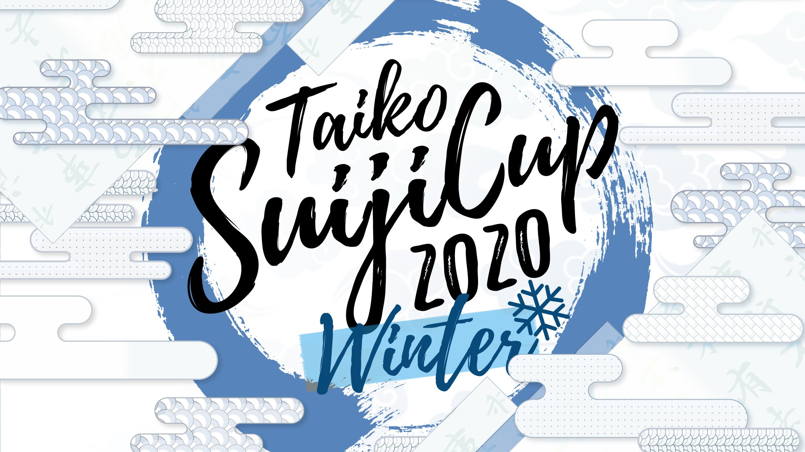

---
tags:
  - TSCW
  - TSCW2020
---

# Taiko Suiji Cup Winter 2020

The **Taiko Suiji Cup Winter 2020** (***TSCW 2020***) was an international four-on-four double-elimination osu!taiko tournament hosted by ::{ flag=FR }:: [Kasumii-sama](https://osu.ppy.sh/users/6177263). Each participant registered individually and was assigned to a random team. This was the third instalment of the Taiko Suiji Cup.

## Tournament schedule

| Event | Timestamp |
| --: | :-- |
| Registration phase | 2020-10-24/2020-11-08 |
| Live drawings | 2020-11-15 (18:00 UTC) |
| Qualifiers | 2020-11-21/2020-11-22 |
| Round of 16 | 2020-11-28/2020-11-29 |
| Quarterfinals | 2020-12-05/2020-12-06 |
| Semifinals | 2020-12-12/2020-12-13 |
| Finals | 2020-12-19/2020-12-20 |
| Grand Finals | 2020-12-26 |

## Prizes

| Placing | Prize |
| :-: | :-- |
|  | Unique profile badge, exclusive userpage banner |

## Organisation

The Taiko Suiji Cup Winter 2020 was run by various community members.

| Position | Member(s) |
| :-- | :-- |
| Organizer | ::{ flag=FR }:: [Kasumii-sama](https://osu.ppy.sh/users/6177263) |
| Mappool selector | ::{ flag=DE }:: [Drecksackblase](https://osu.ppy.sh/users/6278008), ::{ flag=KR }:: [POCARI SWEAT](https://osu.ppy.sh/users/5082685), ::{ flag=DE }:: [Greenshell](https://osu.ppy.sh/users/8693851) |
| Referee | ::{ flag=FR }:: [Aidown](https://osu.ppy.sh/users/1522146), ::{ flag=HK }:: [Akali393394](https://osu.ppy.sh/users/9686628), ::{ flag=BR }:: [AnonX32](https://osu.ppy.sh/users/2730270), ::{ flag=FR }:: [Kasumii-sama](https://osu.ppy.sh/users/6177263), ::{ flag=SG }:: [Spartric](https://osu.ppy.sh/users/7740442), ::{ flag=NL }:: [TaikoMom](https://osu.ppy.sh/users/9086438) |
| Streamer | ::{ flag=BR }:: [AnonX32](https://osu.ppy.sh/users/2730270), ::{ flag=FR }:: [Kasumii-sama](https://osu.ppy.sh/users/6177263), ::{ flag=US }:: [Mister Boo](https://osu.ppy.sh/users/2598555), ::{ flag=DE }:: [Sayira](https://osu.ppy.sh/users/7253958), ::{ flag=SG }:: [Spartric](https://osu.ppy.sh/users/7740442) |
| Commentator | ::{ flag=BR }:: [AnonX32](https://osu.ppy.sh/users/2730270), ::{ flag=GB }:: [B0tch3d](https://osu.ppy.sh/users/9864847), ::{ flag=AU }:: [Beat43210](https://osu.ppy.sh/users/5664171), ::{ flag=DE }:: [Heam](https://osu.ppy.sh/users/4705120), ::{ flag=CA }:: [janitore](https://osu.ppy.sh/users/3307897), ::{ flag=US }:: [JM-](https://osu.ppy.sh/users/10629673), ::{ flag=US }:: [kb131313](https://osu.ppy.sh/users/11229259), ::{ flag=US }:: [Mister Boo](https://osu.ppy.sh/users/2598555), ::{ flag=DE }:: [QEpicAce](https://osu.ppy.sh/users/9489153), ::{ flag=AR }:: [Vaf](https://osu.ppy.sh/users/12589048) |
| Designer | ::{ flag=KR }:: [POCARI SWEAT](https://osu.ppy.sh/users/5082685) |
| Statistician | ::{ flag=SG }:: [KyuF](https://osu.ppy.sh/users/4971343) |
| Developer | ::{ flag=FR }:: [ThePooN](https://osu.ppy.sh/users/718454) |
| Wiki editor | ::{ flag=ID }:: [fajar13k](https://osu.ppy.sh/users/7100002) |

## Links

- [Discussion thread](https://osu.ppy.sh/community/forums/topics/1168559)
- [TSC Discord server](https://discord.gg/yV3bDTC)
- [Livestream](https://twitch.tv/osutaikolive)
- [Challonge bracket](https://challonge.com/TSCW2020)
- **[Statistics sheet](https://docs.google.com/spreadsheets/d/1C22WC447FxO4FPeb2GnP934m_89EzNjLLKfsMPnuobE/edit?usp=sharing)**

## Participants

| Team | Members |
| :-- | :-- |
| **💪👶KF🆑'sMcSpicy.osz** | ::{ flag=DE }:: **[QEpicAce](https://osu.ppy.sh/users/9489153)**, ::{ flag=JP }:: [C-light](https://osu.ppy.sh/users/7955738), ::{ flag=MY }:: [Jerry](https://osu.ppy.sh/users/605973), ::{ flag=KR }:: [Laby](https://osu.ppy.sh/users/9085164), ::{ flag=MX }:: [Mennock](https://osu.ppy.sh/users/854580), ::{ flag=US }:: [Mister Boo](https://osu.ppy.sh/users/2598555), ::{ flag=RU }:: [Naninub](https://osu.ppy.sh/users/8188876), ::{ flag=GB }:: [Teezel](https://osu.ppy.sh/users/7528639) |
| **AAAAAAAAAAAA United Co.™** | ::{ flag=MY }:: **[\[Zeth\]](https://osu.ppy.sh/users/9912966)**, ::{ flag=US }:: [Ethaaaan](https://osu.ppy.sh/users/9536977), ::{ flag=HK }:: [Faputa](https://osu.ppy.sh/users/845733), ::{ flag=JP }:: [Ku\_Ren](https://osu.ppy.sh/users/2535243), ::{ flag=IT }:: [LordEnder](https://osu.ppy.sh/users/4609767), ::{ flag=FI }:: [MEGAMELA](https://osu.ppy.sh/users/13613362), ::{ flag=JP }:: [Noko\_BSF](https://osu.ppy.sh/users/3811831), ::{ flag=DE }:: [xMrtn-](https://osu.ppy.sh/users/866297) |
| **buy my album** | ::{ flag=DE }:: **[Sayira](https://osu.ppy.sh/users/7253958)**, ::{ flag=IT }:: [A-40](https://osu.ppy.sh/users/14510301), ::{ flag=FR }:: [-Akitai-](https://osu.ppy.sh/users/8897643), ::{ flag=RU }:: [cloudfags](https://osu.ppy.sh/users/5285786), ::{ flag=GB }:: [hammygames](https://osu.ppy.sh/users/12232503), ::{ flag=DE }:: [Mew](https://osu.ppy.sh/users/2345156), ::{ flag=CR }:: [puijela](https://osu.ppy.sh/users/12687433), ::{ flag=DE }:: [tiamus](https://osu.ppy.sh/users/515277) |
| **E** | ::{ flag=NL }:: **[Hypello](https://osu.ppy.sh/users/1594036)**, ::{ flag=US }:: [3san](https://osu.ppy.sh/users/8050850), ::{ flag=US }:: [9\_9](https://osu.ppy.sh/users/7700831), ::{ flag=US }:: [Etholux](https://osu.ppy.sh/users/8593837), ::{ flag=CA }:: [Nanners](https://osu.ppy.sh/users/459886), ::{ flag=MD }:: [OldFriend](https://osu.ppy.sh/users/6412103), ::{ flag=FR }:: [Ranshi](https://osu.ppy.sh/users/6680785), ::{ flag=JP }:: [uone](https://osu.ppy.sh/users/5321719) |
| **emoe peppy** | ::{ flag=BR }:: **[Kyoumo](https://osu.ppy.sh/users/8145223)**, ::{ flag=MY }:: [cdhsausageboy](https://osu.ppy.sh/users/2403621), ::{ flag=GR }:: [Genjuro](https://osu.ppy.sh/users/3196091), ::{ flag=ID }:: [Mikurio](https://osu.ppy.sh/users/10734140), ::{ flag=DE }:: [Minekuchi](https://osu.ppy.sh/users/9584873), ::{ flag=BR }:: [Ppus](https://osu.ppy.sh/users/5918857), ::{ flag=BR }:: [roko100789](https://osu.ppy.sh/users/3224958), ::{ flag=ID }:: [Volta](https://osu.ppy.sh/users/4154071) |
| **Fuck Kasumii, fullhomo** | ::{ flag=BR }:: **[HiroK](https://osu.ppy.sh/users/4050738)**, ::{ flag=BR }:: [FurryBoujee](https://osu.ppy.sh/users/12630336), ::{ flag=DE }:: [Gtrafh](https://osu.ppy.sh/users/9950122), ::{ flag=JP }:: [KuroKuroKuro](https://osu.ppy.sh/users/11931563), ::{ flag=MX }:: [Iojioji](https://osu.ppy.sh/users/1346121), ::{ flag=CN }:: [N a N a](https://osu.ppy.sh/users/11341131), ::{ flag=AU }:: [Tsubasa2](https://osu.ppy.sh/users/6835183), ::{ flag=MY }:: [Xeltic Rival](https://osu.ppy.sh/users/7500364) |
| **Genjureh** | ::{ flag=CR }:: **[Hotman](https://osu.ppy.sh/users/7902082)**, ::{ flag=AR }:: [Axer](https://osu.ppy.sh/users/7299864), ::{ flag=CA }:: [beary605](https://osu.ppy.sh/users/2198070), ::{ flag=SG }:: [Blerargh](https://osu.ppy.sh/users/7609510), ::{ flag=FR }:: [Chernobog](https://osu.ppy.sh/users/3317042), ::{ flag=NL }:: [Cookie\_Tree](https://osu.ppy.sh/users/502722), ::{ flag=CL }:: [Ulqui](https://osu.ppy.sh/users/1263669), ::{ flag=ID }:: [WhiteSnowAngel](https://osu.ppy.sh/users/3866964) |
| **Ice Cold Tea(m)** | ::{ flag=EC }:: **[Gamelan4](https://osu.ppy.sh/users/9856910)**, ::{ flag=SG }:: [awdse22](https://osu.ppy.sh/users/8743513), ::{ flag=IT }:: [D3kuu](https://osu.ppy.sh/users/7807444), ::{ flag=US }:: [driodx](https://osu.ppy.sh/users/9709548), ::{ flag=MY }:: [growATMfarmz](https://osu.ppy.sh/users/12273160), ::{ flag=KR }:: [Jonah](https://osu.ppy.sh/users/5509009), ::{ flag=RU }:: [night\_flower](https://osu.ppy.sh/users/11574707), ::{ flag=JP }:: [Saikoro](https://osu.ppy.sh/users/741819), ::{ flag=DK }:: [Tsukani](https://osu.ppy.sh/users/5146144) |
| **Nicholas Cage Fan Club 3.0** | ::{ flag=US }:: **[R J](https://osu.ppy.sh/users/6490509)**, ::{ flag=US }:: [Backfire](https://osu.ppy.sh/users/263110), ::{ flag=CL }:: [Catulus](https://osu.ppy.sh/users/6276709), ::{ flag=TH }:: [ConieSan](https://osu.ppy.sh/users/2035344), ::{ flag=KR }:: [GoZaRaNi](https://osu.ppy.sh/users/2879608), ::{ flag=CN }:: [Ookura Risona](https://osu.ppy.sh/users/2073644), ::{ flag=PH }:: [Pochacco](https://osu.ppy.sh/users/2927742), ::{ flag=TW }:: [X a v y](https://osu.ppy.sh/users/3738344) |
| **Pacman is watching** | ::{ flag=BR }:: **[Skull Kid](https://osu.ppy.sh/users/3044264)**, ::{ flag=AR }:: [Atreevete](https://osu.ppy.sh/users/2615199), ::{ flag=GB }:: [Daniels](https://osu.ppy.sh/users/12439209), ::{ flag=IT }:: [Friggy-chan](https://osu.ppy.sh/users/6306704), ::{ flag=US }:: [HoopWheat](https://osu.ppy.sh/users/12177903), ::{ flag=BG }:: [Makou](https://osu.ppy.sh/users/901896), ::{ flag=AU }:: [r1chyy](https://osu.ppy.sh/users/11499467), ::{ flag=FI }:: [syysmyrsky](https://osu.ppy.sh/users/9421030) |
| **Rhuzerve** | ::{ flag=RU }:: **[TwinT](https://osu.ppy.sh/users/9976154)**, ::{ flag=HK }:: [Brown918](https://osu.ppy.sh/users/9805760), ::{ flag=JP }:: [Grape\_Tea](https://osu.ppy.sh/users/9540073), ::{ flag=ID }:: [Kaemz](https://osu.ppy.sh/users/8494233), ::{ flag=JP }:: [Six b0xes](https://osu.ppy.sh/users/8303357), ::{ flag=FI }:: [vodnanen](https://osu.ppy.sh/users/10335557), ::{ flag=AR }:: [warning dark](https://osu.ppy.sh/users/5040981), ::{ flag=TW }:: [Yuemiao](https://osu.ppy.sh/users/4493348) |
| **Shamirin Fangirls** | ::{ flag=BR }:: **[Foxeru](https://osu.ppy.sh/users/7479684)**, ::{ flag=US }:: [cheese salad](https://osu.ppy.sh/users/6349821), ::{ flag=US }:: [closed](https://osu.ppy.sh/users/5116922), ::{ flag=HK }:: [LDator](https://osu.ppy.sh/users/9534414), ::{ flag=AR }:: [Patocho](https://osu.ppy.sh/users/9964420), ::{ flag=SG }:: [Prehistoria](https://osu.ppy.sh/users/8364237), ::{ flag=JP }:: [Shamirin\_mzk](https://osu.ppy.sh/users/11325757), ::{ flag=PL }:: [Tetsurio](https://osu.ppy.sh/users/2044810) |
| **Strawberry Eggnog** | ::{ flag=DE }:: **[\[TaikoTori\]](https://osu.ppy.sh/users/1074143)**, ::{ flag=MX }:: [\_Yuukii](https://osu.ppy.sh/users/4588852), ::{ flag=US }:: [AuroraPhasmata](https://osu.ppy.sh/users/13664116), ::{ flag=CN }:: [Flandre sca](https://osu.ppy.sh/users/10324309), ::{ flag=DE }:: [frz](https://osu.ppy.sh/users/6956922), ::{ flag=SG }:: [Lunasaa](https://osu.ppy.sh/users/3769280), ::{ flag=KZ }:: [Lynerrr](https://osu.ppy.sh/users/14254867), ::{ flag=JP }:: [syaron105](https://osu.ppy.sh/users/8741695) |
| **succi cup gravure shoot** | ::{ flag=CA }:: **[janitore](https://osu.ppy.sh/users/3307897)**, ::{ flag=CN }:: [A New Beginning](https://osu.ppy.sh/users/2349769), ::{ flag=FR }:: [BigNounours](https://osu.ppy.sh/users/11632258), ::{ flag=BR }:: [Coryn](https://osu.ppy.sh/users/2828556), ::{ flag=FI }:: [gevbiivi5](https://osu.ppy.sh/users/7140680), ::{ flag=BR }:: [Gustav0eiji](https://osu.ppy.sh/users/215127), ::{ flag=MO }:: [Michaelonl](https://osu.ppy.sh/users/12480076), ::{ flag=US }:: [Obama Taichou](https://osu.ppy.sh/users/3220847) |
| **xi** | ::{ flag=US }:: **[Loopy542](https://osu.ppy.sh/users/5468461)**, ::{ flag=UA }:: [Don Omar](https://osu.ppy.sh/users/689414), ::{ flag=FI }:: [duski](https://osu.ppy.sh/users/6506484), ::{ flag=FR }:: [Gintoki8](https://osu.ppy.sh/users/2239411), ::{ flag=GR }:: [KostPer](https://osu.ppy.sh/users/10584732), ::{ flag=JP }:: [nyanmi-1828](https://osu.ppy.sh/users/6866480), ::{ flag=US }:: [osutaiko](https://osu.ppy.sh/users/4640844), ::{ flag=FI }:: [YERTI](https://osu.ppy.sh/users/1490757) |
| **Yet Unnamed Suiji Team** | ::{ flag=IT }:: **[Ikkun](https://osu.ppy.sh/users/1059945)**, ::{ flag=HK }:: [Cynplytholowazy](https://osu.ppy.sh/users/3901754), ::{ flag=RU }:: [Dayzeek](https://osu.ppy.sh/users/5009970), ::{ flag=DE }:: [Mikalodo](https://osu.ppy.sh/users/8498207), ::{ flag=TH }:: [Ponamis](https://osu.ppy.sh/users/7897892), ::{ flag=TW }:: [ryan940618](https://osu.ppy.sh/users/8369908), ::{ flag=RU }:: [Starger](https://osu.ppy.sh/users/3398715), ::{ flag=FR }:: [Yona](https://osu.ppy.sh/users/7930622) |

## Podium

This competition has come to an end and resulted in the following podium:

| Placing | Team |
| :-: | :-- |
|  | **AAAAAAAAAAAA United Co.™** (::{ flag=MY }:: **[\[Zeth\]](https://osu.ppy.sh/users/9912966)**, ::{ flag=US }:: [Ethaaaan](https://osu.ppy.sh/users/9536977), ::{ flag=HK }:: [Faputa](https://osu.ppy.sh/users/845733), ::{ flag=JP }:: [Ku\_Ren](https://osu.ppy.sh/users/2535243), ::{ flag=IT }:: [LordEnder](https://osu.ppy.sh/users/4609767), ::{ flag=FI }:: [MEGAMELA](https://osu.ppy.sh/users/13613362), ::{ flag=JP }:: [Noko\_BSF](https://osu.ppy.sh/users/3811831), ::{ flag=DE }:: [xMrtn-](https://osu.ppy.sh/users/866297)) |
|  | **E** (::{ flag=NL }:: **[Hypello](https://osu.ppy.sh/users/1594036)**, ::{ flag=US }:: [3san](https://osu.ppy.sh/users/8050850), ::{ flag=US }:: [9\_9](https://osu.ppy.sh/users/7700831), ::{ flag=US }:: [Etholux](https://osu.ppy.sh/users/8593837), ::{ flag=CA }:: [Nanners](https://osu.ppy.sh/users/459886), ::{ flag=MD }:: [OldFriend](https://osu.ppy.sh/users/6412103), ::{ flag=FR }:: [Ranshi](https://osu.ppy.sh/users/6680785), ::{ flag=JP }:: [uone](https://osu.ppy.sh/users/5321719)) |
|  | **Yet Unnamed Suiji Team** (::{ flag=IT }:: **[Ikkun](https://osu.ppy.sh/users/1059945)**, ::{ flag=HK }:: [Cynplytholowazy](https://osu.ppy.sh/users/3901754), ::{ flag=RU }:: [Dayzeek](https://osu.ppy.sh/users/5009970), ::{ flag=DE }:: [Mikalodo](https://osu.ppy.sh/users/8498207), ::{ flag=TH }:: [Ponamis](https://osu.ppy.sh/users/7897892), ::{ flag=TW }:: [ryan940618](https://osu.ppy.sh/users/8369908), ::{ flag=RU }:: [Starger](https://osu.ppy.sh/users/3398715), ::{ flag=FR }:: [Yona](https://osu.ppy.sh/users/7930622)) |

## Mappools

### Grand Finals

**[Download the mappack here! (81 MB)](https://mega.nz/file/Zo9AlCpB#cRZ1JO_bPddG-leYYZxRUT8Nef7GBGT5jZCBtPwfSWE)**

#### Mappool A

- NoMod
  1. [7\_7 - Hololive ga bpm200 de Hukkireta (7\_7) \[7oni\]](https://osu.ppy.sh/beatmapsets/1184153#taiko/2471375)
  2. [Terminal 11 - Sparkle Downer (Xay) \[Sparkle Doni\]](https://osu.ppy.sh/beatmapsets/1128293#taiko/2357293)
  3. [7\_7 - Oni-chan? (7\_7) \[Oni\]](https://osu.ppy.sh/beatmapsets/916830#taiko/1914804)
  4. [AAAA Chazuke - Myosotis no Hanataba (asuasu\_yura) \[Myosotis\]](https://osu.ppy.sh/beatmapsets/608718#taiko/1285520)
- Hidden
  1. [MYUKKE. - The 89's Momentum (Ozu) \[DAsh\]](https://osu.ppy.sh/beatmapsets/1120537#taiko/2341378)
  2. [Mili - String Theocracy (Vitas2222) \[Jazzy Morning\]](https://osu.ppy.sh/beatmapsets/1271772#taiko/2642820)
- HardRock
  1. [E.G.G. - OK I'm blue rat (Genjuro) \[DREAM's Daitatsujin\]](https://osu.ppy.sh/beatmapsets/1184988#taiko/2520232)
  2. [Morimori Atsushi - Tits or get the fuck out!! (ManP) \[Hell Oni\]](https://osu.ppy.sh/beatmapsets/334489#taiko/744166)
- FreeMod
  1. [lapix - Carry Me Away (Extended Mix) (goheegy) \[Oni\]](https://osu.ppy.sh/beatmapsets/814923#taiko/1709045)
  2. [Nekomata Master - Life is Beautiful (namaniku) \[Glorious World\]](https://osu.ppy.sh/beatmapsets/929862#taiko/1942010)

#### Mappool B

- Challenge
  1. [Frums - Turnstile Jumper (maziari1105) \[Over Speed\]](https://osu.ppy.sh/beatmapsets/990672#taiko/2072124)
  2. [Marblue - The Disease Called Love (Maru Ian) \[-\[ ix Pandemic xi \]-\]](https://osu.ppy.sh/beatmapsets/944997#taiko/1995175)
- DoubleTime
  1. [Tennyson - your face tastes like my happy place / Pancake Feet (yenmaster) \[T^T\]](https://osu.ppy.sh/beatmapsets/1245751#taiko/2589450)
- Easy
  1. [MARETU - Koukatsu (nananass) \[.\]](https://osu.ppy.sh/beatmapsets/894505#taiko/1869191)
- Hidden+HardRock
  1. [xi - Fiat Lux (Labyr) \[Inner Oni\]](https://osu.ppy.sh/beatmapsets/394952#taiko/859530)
- Tiebreaker
  1. **[goreshit - there are no angels here. (DarkVortex) \[Relentless Oni\]](https://osu.ppy.sh/beatmapsets/936265#taiko/1955952)**

### Finals

**[Download the mappack here! (102 MB)](https://mega.nz/file/l0EQGDbJ#7yxz-H7Hw_hU_Vk-bXLillPOQEpz7FkYeViBvElVhPA)**

#### Mappool A

- NoMod
  1. [Evile - Thrasher (Zetera) \[Berserk Suijin Oni\]](https://osu.ppy.sh/beatmapsets/636806#taiko/2737982)
  2. [Nightmare - Boulafacet (Zetera) \[Majin Oni\]](https://osu.ppy.sh/beatmapsets/636206#taiko/1350019)
  3. [Last Alliance - Hekireki (le gagoguigo3) \[Myckoll & Ulqui's Inner Oni\]](https://osu.ppy.sh/beatmapsets/463291#taiko/1234897)
  4. [NIWASHI - Playing with Ruby (goheegy) \[Oni\]](https://osu.ppy.sh/beatmapsets/835717#taiko/1750288)
- Hidden
  1. [sasakure.UK - Brionac of Steel-flash feat. Perio (HiroK) \[Inner Oni\]](https://osu.ppy.sh/beatmapsets/827210#taiko/1733423)
  2. [Ishikawa Jun - 6-3 (7\_7) \[Ripple Star\]](https://osu.ppy.sh/beatmapsets/1118386#taiko/2336023)
- HardRock
  1. [sasakure.UK - Xlo (D o t) \[.'s Taiko\]](https://osu.ppy.sh/beatmapsets/941191#taiko/1965552)
  2. [Veil Of Maya - Mikasa (Y O U T A) \[Power\]](https://osu.ppy.sh/beatmapsets/623105#taiko/1313383)
- FreeMod
  1. [goreshit - Bad Habits (SKSalt) \[Inner Oni\]](https://osu.ppy.sh/beatmapsets/450569#taiko/966645)
  2. [Calliope Mori - Excuse My Rudeness, But Could You Please RIP? (7\_7 Remix) (KTYN) \[WHAT'CHA DON'T KNOW?\]](https://osu.ppy.sh/beatmapsets/1279725#taiko/2658428)

#### Mappool B

- Challenge
  1. [awc - oto (Raphalge) \[Inner Oni\]](https://osu.ppy.sh/beatmapsets/902119#taiko/2658434)
  2. [ICE - L (NewibornCLivee) \[N.taiCL\]](https://osu.ppy.sh/beatmapsets/225871#taiko/526907)
- DoubleTime
  1. [BAND-MAID - DICE (-Tenshi-) \[Inner Oni\]](https://osu.ppy.sh/beatmapsets/1121118#taiko/2342551)
- Easy
  1. [Mimiorijinaru - Atonement Compilation (S a n d) \[Atonement III - Cain\]](https://osu.ppy.sh/beatmapsets/415552#taiko/900430)
- Hidden+HardRock
  1. [uno feat. Chiyoko (IOSYS) - Twin Rocket (4sbet1) \[Inner Oni-\]](https://osu.ppy.sh/beatmapsets/1100457#taiko/2311147)
- Tiebreaker
  1. **[Ouroboros - Black Hole Generator (Raiden) \[Shallow Depths\]](https://osu.ppy.sh/beatmapsets/1213038#taiko/2524705)**

### Semifinals

**[Download the mappack here! (83 MB)](https://mega.nz/file/k591xCbT#GihHcb-Pch7E81-kEz-6HKEziqfYdjYAnRwsOsIlLKc)**

#### Mappool A

- NoMod
  1. [Harunaba - Ghost Mask(7\_7's French) (KTYN) \[Truth\]](https://osu.ppy.sh/beatmapsets/1167725#taiko/2436321)
  2. [The Flashbulb - Autumn Insomnia Jam Session (Loopy542) \[Drum Solo\]](https://osu.ppy.sh/beatmapsets/975058#taiko/2040870)
  3. [Snail's House - Balloons (KinomiCandy) \[plastic thoughts\]](https://osu.ppy.sh/beatmapsets/586316#taiko/1241741)
  4. [Nekomata Master - Journey (BabySnakes) \[Inner Oni (Finished)\]](https://osu.ppy.sh/beatmapsets/961119#taiko/2012118)
- Hidden
  1. [Silentroom - F1055 (HiroK) \[Genjuro's Inner Oni\]](https://osu.ppy.sh/beatmapsets/1224716#taiko/2548622)
  2. [Rica Matumoto - Mezase Pokemon Master -20th Anniversary- (Y O U T A) \[Taiko Oni\]](https://osu.ppy.sh/beatmapsets/636213#taiko/1350032)
- HardRock
  1. [K A Z M A S A - RTCMON (Ozu) \[\(^o^)/\]](https://osu.ppy.sh/beatmapsets/1129408#taiko/2359409)
  2. [sasakure.UK - Jack-the-Ripper (Sayaka-) \[Collab Inner Oni\]](https://osu.ppy.sh/beatmapsets/210979#taiko/496238)
- FreeMod
  1. [HyuN - Fuyu no Hime (Charlotte) \[Snow Princess\]](https://osu.ppy.sh/beatmapsets/1202956#taiko/2505171)
  2. [Celldweller - Good L\_ck (Yo\_'re F\_cked) (Greenshell) \[Get O\_tta Here!\]](https://osu.ppy.sh/beatmapsets/1216701#taiko/2531620)

#### Mappool B

- Challenge
  1. [DM Ashura - deltaMAX (Sayaka-) \[Oni\]](https://osu.ppy.sh/beatmapsets/437153#taiko/941375)
  2. [MiddleIsland - Frailness (Skull Kid) \[Masterpiece\]](https://osu.ppy.sh/beatmapsets/1307688#taiko/2711072)
- DoubleTime
  1. [Pocket Mirror Sound Team - Midnight Striken Clock \~ Glass Slipper (Rhytoly) \[Oni\]](https://osu.ppy.sh/beatmapsets/925760#taiko/1933722)
- Easy
  1. [Frederic Chopin - Etude Op. 10-4 (DukeDukeDura) \[0.80sv\]](https://osu.ppy.sh/beatmapsets/607568#taiko/1284991)
- Hidden+HardRock
  1. [PHQUASE - Plain Asia -PHQ remix- (kanpakyin) \[Roger's Inner Oni\]](https://osu.ppy.sh/beatmapsets/322149#taiko/2234914)
- Tiebreaker
  1. **[DJ TOTTO - DORNWALD \~Der Junge im Kafig\~ (Felt7z) \[Heretic\]](https://osu.ppy.sh/beatmapsets/1086707#taiko/2272472)**

### Quarterfinals

**[Download the mappack here! (98 MB)](https://mega.nz/file/sh1TEIKD#-AE21iSd8oalHUD3o6OvnqGM60aAEhmBO-Frkw32gjY)**

#### Mappool A

- NoMod
  1. [sky\_delta Feat.Kanata.N - Crystal Clear and Nothing (yassu-) \[Inner Oni (long ver)\]](https://osu.ppy.sh/beatmapsets/858136#taiko/1800886)
  2. [tarolabo - Zeitmesser (nananass) \[Zeitmesser\]](https://osu.ppy.sh/beatmapsets/710147#taiko/1501144)
  3. [Kuroneko Dungeon - Ryoushi no Umi no Lindwurm (nyanmi-1828) \[Inner Oni\]](https://osu.ppy.sh/beatmapsets/540102#taiko/1145309)
  4. [xi - Go Beyond!! -Jazzy mix- (frukoyurdakul) \[Don't Hold Back\]](https://osu.ppy.sh/beatmapsets/742399#taiko/1565915)
- Hidden
  1. [cosMo@Bousou-P - neu BSP style (Bass) \[31's TAIKO\]](https://osu.ppy.sh/beatmapsets/50670#taiko/155964)
  2. [paraoka - boot (rickyboi) \[inaba's Taiko\]](https://osu.ppy.sh/beatmapsets/50131#taiko/157233)
- HardRock
  1. [Yonezu Kenshi - Flamingo (ToYou Bootleg) (Suisei) \[PTSD\]](https://osu.ppy.sh/beatmapsets/1306418#taiko/2708688)
  2. [Fire EX. - Shattered Dreams (qoot8123) \[Inner Oni\]](https://osu.ppy.sh/beatmapsets/287251#taiko/648184)
- FreeMod
  1. [Zeami vs Tatsh - Seija no Ibuki (Lost The Lights) \[Inner Oni\]](https://osu.ppy.sh/beatmapsets/1269341#taiko/2637849)
  2. [tarolabo - B a r o q u e (ZTH) \[Inner Oni\]](https://osu.ppy.sh/beatmapsets/1247605#taiko/2601603)

#### Mappool B

- Challenge
  1. [Kikuo - Shikabane no Odori (-\[ix ishida xi\]-) \[Ishida no Odori\]](https://osu.ppy.sh/beatmapsets/226664#taiko/528430)
  2. [MOSAIC.WAV - Chousai Kenbo Sengen (Cihyaa) \[Coin's Taiko 1.15x (230bpm)\]](https://osu.ppy.sh/beatmapsets/469296#taiko/1003582)
- DoubleTime
  1. [HuMeR - Highcharge Divolt (\_Rise) \[Muzukashii\]](https://osu.ppy.sh/beatmapsets/479612#taiko/1024127)
- Easy
  1. [DECO\*27 - Tsumi to Batsu (Cihyaa) \[Coin's Taiko\]](https://osu.ppy.sh/beatmapsets/345191#taiko/762382)
- Hidden+HardRock
  1. [Hatsune Miku - Recommended Spell (val0108) \[Ono's Taiko Oni\]](https://osu.ppy.sh/beatmapsets/28864#taiko/97927)
- Tiebreaker
  1. **[Camellia - fastest crash (Camellia's "paroxysmal" Hitech Remix) (Sansheng) \["recrudescence" Energetic Oni\]](https://osu.ppy.sh/beatmapsets/846799#taiko/1770948)**

### Round of 16

**[Download the mappack here! (75 MB)](https://mega.nz/file/h5dkiJLB#AjFUWhCBejETwpf7qZqCXMwA9TycAm1syVvtXX60TZQ)**

#### Mappool A

- NoMod
  1. [Eve - Last Dance (Skull Kid) \[Rupture\]](https://osu.ppy.sh/beatmapsets/1079752#taiko/2259013)
  2. [Vospi - We Met Dat Night (Nwolf) \[Inner Oni\]](https://osu.ppy.sh/beatmapsets/437130#taiko/941332)
  3. [Nanahoshi Kangengakudan - Meikaruza (Tenkoi) \[Inner Oni\]](https://osu.ppy.sh/beatmapsets/545816#taiko/1156291)
  4. [Hommarju - Crazy Jackpot (Lno) \[Crazy Oni\]](https://osu.ppy.sh/beatmapsets/744408#taiko/1569566)
- Hidden
  1. [sasakure.UK - Epitorica no Matsuri (tasuke912) \[Inner Oni\]](https://osu.ppy.sh/beatmapsets/511420#taiko/1087169)
  2. [Kano - Yuudachi no Ribbon (Sotarks) \[Chromoxx' Inner Oni\]](https://osu.ppy.sh/beatmapsets/556174#taiko/1242099)
- HardRock
  1. [DJ TOTTO - chaplet (Nwolf) \[INNER ONI\]](https://osu.ppy.sh/beatmapsets/246705#taiko/568217)
  2. [7\_7 - Hongik Univ. Station (french) (7\_7) \[oni\]](https://osu.ppy.sh/beatmapsets/1061089#taiko/2221529)
- FreeMod
  1. [Orange Lounge - Les filles balancent (Zetera) \[Inner Oni\]](https://osu.ppy.sh/beatmapsets/684224#taiko/1448035)
  2. [sky\_delta - Midnight City Warfare (Taka030) \[Midnight Oni\]](https://osu.ppy.sh/beatmapsets/976845#taiko/2044635)

#### Mappool B

- Challenge
  1. [Sound Souler vs. litmus\* - Two Phace (POCARI SWEAT) \[POCARI vs. Ozu (Suiji Edit)\]](https://osu.ppy.sh/beatmapsets/1136965#taiko/2708786)
  2. [Akiyama Uni - Odoru Mizushibuki (Metzo) \[Inner Oni\]](https://osu.ppy.sh/beatmapsets/1173557#taiko/2448587)
- DoubleTime
  1. [Eve - Tokyo Ghetto (Raphalge) \[Inner Oni\]](https://osu.ppy.sh/beatmapsets/811439#taiko/1702170)
- Easy
  1. [Nintendo - Coconut Mall (maziari1105) \[Oni\]](https://osu.ppy.sh/beatmapsets/688524#taiko/1457049)
- Hidden+HardRock
  1. [Two Door Cinema Club - Undercover Martyn (goheegy) \[Inner Oni\]](https://osu.ppy.sh/beatmapsets/944748#taiko/1972951)
- Tiebreaker
  1. **[OSTER project - Violet Rose (Cychloryn) \[Purple Oni\]](https://osu.ppy.sh/beatmapsets/1041417#taiko/2176601)**

### Qualifiers

**[Download the mappack here! (26 MB)](https://mega.nz/file/c4VmyT7S#nLxmxtZlEwbxRoeHIjnfQql3n_tW-Zi3l7ECp0_A9vo)**

- NoMod
  1. [Hommarju - Beat Juggling Mix (Ney) \[Inner Oni\]](https://osu.ppy.sh/beatmapsets/987578#taiko/2065896)
  2. [TUYU - Anoyo-iki no Bus ni Notte Saraba. (POCARI SWEAT) \[bye bye.\]](https://osu.ppy.sh/beatmapsets/1210752#taiko/2520532)
- Hidden
  1. [BEMANI Sound Team "Nekomata Gekidan" - Afterimage d'automne (\_DUSK\_) \[Inner Oni\]](https://osu.ppy.sh/beatmapsets/1258274#taiko/2615625)
- HardRock
  1. [Pa's Lam System - I'm Coming (Mtell Futurecore Bootleg) (goheegy) \[Oni\]](https://osu.ppy.sh/beatmapsets/1062501#taiko/2225015)
- Challenge
  1. [8284 - Connaextion (Nwolf) \[-- --- .-. ... .\]](https://osu.ppy.sh/beatmapsets/660649#taiko/1398838)

## Match results

### Grand Finals

Saturday, 26 December 2020:

| Team 1 |  |  | Team 2 | Match link |
| --: | :-: | :-: | :-- | :-- |
| **AAAAAAAAAAAA United Co.™** | **7** | 4 | E | [#1](https://osu.ppy.sh/community/matches/72242932) |

### Finals

Saturday, 19 December 2020:

| Team 1 |  |  | Team 2 | Match link |
| --: | :-: | :-: | :-- | :-- |
| Ice Cold Tea(m) | 5 | **7** | **E** | [#1](https://osu.ppy.sh/community/matches/71840537) |
| **AAAAAAAAAAAA United Co.™** | **7** | 4 | Yet Unnamed Suiji Team | [#1](https://osu.ppy.sh/community/matches/71850609) |

Sunday, 20 December 2020:

| Team 1 |  |  | Team 2 | Match link |
| --: | :-: | :-: | :-- | :-- |
| Yet Unnamed Suiji Team | 0 | **7** | **E** | [#1](https://osu.ppy.sh/community/matches/71893171) |

### Semifinals

Saturday, 12 December 2020:

| Team 1 |  |  | Team 2 | Match link |
| --: | :-: | :-: | :-- | :-- |
| **AAAAAAAAAAAA United Co.™** | **7** | 0 | 💪👶KF🆑'sMcSpicy.osz | [#1](https://osu.ppy.sh/community/matches/71425232) |
| emoe peppy | 0 | **7** | **Ice Cold Tea(m)** | [#1](https://osu.ppy.sh/community/matches/71428295) |
| **succi cup gravure shoot** | **7** | 3 | Shamirin Fangirls | [#1](https://osu.ppy.sh/community/matches/71428552) |
| E | 6 | **7** | **Yet Unnamed Suiji Team** | [#1](https://osu.ppy.sh/community/matches/71445385) |

Sunday, 13 December 2020:

| Team 1 |  |  | Team 2 | Match link |
| --: | :-: | :-: | :-- | :-- |
| **E** | **7** | 5 | succi cup gravure shoot | [#1](https://osu.ppy.sh/community/matches/71487538) |
| 💪👶KF🆑'sMcSpicy.osz | 2 | **7** | **Ice Cold Tea(m)** | [#1](https://osu.ppy.sh/community/matches/71490084) |

### Quarterfinals

Saturday, 5 December 2020:

| Team 1 |  |  | Team 2 | Match link |
| --: | :-: | :-: | :-- | :-- |
| **AAAAAAAAAAAA United Co.™** | **6** | 2 | Strawberry Eggnog | [#1](https://osu.ppy.sh/community/matches/71014612) |
| succi cup gravure shoot | 3 | **6** | **💪👶KF🆑'sMcSpicy.osz** | [#1](https://osu.ppy.sh/community/matches/71017212) |
| **E** | **6** | 2 | Rhuzerve | [#1](https://osu.ppy.sh/community/matches/71046066) |

Sunday, 6 December 2020:

| Team 1 |  |  | Team 2 | Match link |
| --: | :-: | :-: | :-- | :-- |
| **Yet Unnamed Suiji Team** | **6** | 4 | emoe peppy | [#1](https://osu.ppy.sh/community/matches/71078914) |
| Strawberry Eggnog | 4 | **6** | **Shamirin Fangirls** | [#1](https://osu.ppy.sh/community/matches/71081916) |
| **emoe peppy** | **6** | 3 | Firetruck Kasumii fullhomo | [#1](https://osu.ppy.sh/community/matches/71083128) |
| Rhuzerve | 3 | **6** | **Ice Cold Tea(m)** | [#1](https://osu.ppy.sh/community/matches/71083438) |
| **succi cup gravure shoot** | **6** | 1 | Genjureh | [#1](https://osu.ppy.sh/community/matches/71085996) |

### Round of 16

Saturday, 28 November 2020:

| Team 1 |  |  | Team 2 | Match link |
| --: | :-: | :-: | :-- | :-- |
| **E** | **5** | 1 | Pacman is watching | [#1](https://osu.ppy.sh/community/matches/70590765) |
| **AAAAAAAAAAAA United Co.™** | **5** | 0 | xi | [#1](https://osu.ppy.sh/community/matches/70608855) |
| **Strawberry eggnog** | **5** | 4 | Fuck Kasumii, fullhomo | [#1](https://osu.ppy.sh/community/matches/70611569) |
| **emoe peppy** | **5** | 2 | buy my album | [#1](https://osu.ppy.sh/community/matches/70614181) |
| Ice Cold Tea(m) | 4 | **5** | **succi cup gravure shoot** | [#1](https://osu.ppy.sh/community/matches/70614458) |
| **Rhuzerve** | **5** | 2 | Genjureh | [#1](https://osu.ppy.sh/community/matches/70618078) |
| **💪👶KF🆑'sMcSpicy.osz** | **5** | 1 | Nicholas Cage Fan Club 3.0 | [#1](https://osu.ppy.sh/community/matches/70620902) |

Sunday, 29 November 2020:

| Team 1 |  |  | Team 2 | Match link |
| --: | :-: | :-: | :-- | :-- |
| **Yet Unnamed Suiji Team** | **5** | 2 | Shamirin Fangirls | [#1](https://osu.ppy.sh/community/matches/70672578) |
| xi | 3 | **5** | **Fuck Kasumii, fullhomo** | [#1](https://osu.ppy.sh/community/matches/70674883) |
| Pacman is Watching | 1 | **5** | **Genjureh** | [#1](https://osu.ppy.sh/community/matches/70677832) |
| **Ice Cold Tea(m)** | **5** | 4 | Nicholas Cage Fan Club 3.0 | [#1](https://osu.ppy.sh/community/matches/70677887) |
| **Shamirin Fangirls** | **5** | 1 | buy my album | [#1](https://osu.ppy.sh/community/matches/70680949) |

### Qualifiers

More detailed qualifiers results can be accessed via this [spreadsheet](https://docs.google.com/spreadsheets/d/1OBetaYbVy9Friok9AaDxBW5IZgDd9pZny3D2r_OKvlM/edit#gid=2038944874)

| Seed | Team | Average |
| --: | :-- | --: |
| #1 | AAAAAAAAAAAA United Co.™ | 3.6 |
| #2 | E | 3.8 |
| #3 | Yet Unnamed Suiji Team | 4.2 |
| #4 | Ice Cold Tea(m) | 4.8 |
| #5 | 💪👶KF🆑'sMcSpicy.osz | 5.8 |
| #6 | emoe peppy | 6.2 |
| #7 | Rhuzerve | 7.2 |
| #8 | Strawberry Eggnog | 7.4 |
| #9 | Fuck Kasumii, fullhomo | 8.8 |
| #10 | Genjureh | 9.8 |
| #11 | buy my album | 10.2 |
| #12 | Nicholas Cage Fan Club 3.0 | 10.6 |
| #13 | succi cup gravure shoot | 12.6 |
| #14 | Shamirin Fangirls | 12.8 |
| #15 | Pacman is watching | 13.6 |
| #16 | xi | 14.6 |

Average was determined by `Σ position earned when playing the qualifiers mappool / 5`

## Ruleset

### General rules

1. Taiko Suiji Cup Winter 2020 is an international **4 vs 4** double-elimination bracket osu!taiko tournament consisting of 16 teams.
2. There will be **no rank limit** and the **top 128 players** based on rank will be accepted.
3. The tournament will use **ScoreV2** as the scoring system.
4. Players will sign up **individually** and will be assigned to a **random** team.
5. There will be **8 players** per team, each consisting of 2 A seed players, 2 B seed players, 2 C seed players, and 2 D seed players.
6. Players will be seeded by rank.
7. Teams will be seeded by rank they get after the qualifiers.
8. Teams will be given **5 days to come up with a team name and the captain**. Failure to submit a team name will result in an assigned team name chosen by the staff. Failure to submit a captain will result in the highest rank player being made captain by default.
9. If a player in the team is inactive or unresponsive before the tournament start date, players who were closest to making the cut will be used for back-ups after you contact a Staff Member.
10. The Mappool will contain 16 maps. The format is as follows:
    - Mappool A will contain 4 NoMod, 2 Hidden, 2 HardRock, 2 FreeMod maps.
    - Mappool B will contain 2 Challenge Maps, 1 DoubleTime, 1 Easy Mod, 1 Hidden+HardRock, and the Tiebreaker.
    - Any maps from Mappool B **is not bannable**.
    - Challenge bracket is map that contains unusual pattern, unconventional timing, high bpm speed, and will be played under NoMod.
11. The Qualifiers mappool however will have only one pool instead of two. It will contain 2 NoMod maps. 1 Hidden map, 1 HardRock map, and 1 Challenge map. Maps will be all played in the qualifier lobby, and **are not bannable**.
12. One player from each seed must play at the same time in the 4v4 setting. This means (ABCD) vs. (ABCD). NOT (AABC) vs. (ABBC)
13. **D's may place in place of C's, C's may play in place of B's, and B's in place of A's** only in situations where the players cannot be active (i.e. Emergencies, Vacation, etc)
14. All match times are in **UTC**.
15. **No staff members are allowed to play** other than streamer, commentator, and designer.

### Match regulations

1. The match lobby will be created by the referee, and the team captains of both teams will be invited. The captain is then responsible for inviting the rest of their team. If the captain of a team is not online, the referee will invite any other player from respective team, and invited player will be responsible for inviting their team.
2. Teams have a 15 minute grace period to have at least 3 players available to play the match. If **15 minutes pass and a team does not have enough players to play** the match, the other team will receive a win by default.
3. Once all players have joined the lobby, captains will be asked to do a `!roll` command
   - The winner of the roll will have the first warmup, first ban, and first pick.
4. Warmup maps will be allowed for the entirety of the tournament. Each team may select one warmup pick and warmups may not exceed **3:00** total length.
5. The referee can give host to the players for warmups only. The referee will have host for the entire match after warmups. A team will select a map by naming the map in the multiplayer chat, and the referee will select it.
6. Each team is allowed to ban 1 map from Mappool A. Mappool B maps may not be allowed to be banned at any time.
7. Teams have 2 minutes to select a map
   - If they fail to choose in the allotted time, the map choice will pass to the other team. This will have no effect on the order of picks afterward.
8. There is no restriction on map selection order and may select any available map at any time regardless of mod.
9. On FreeMod picks, at least one player from each team must use either Hidden, Hard Rock, or both.
10. Hidden and HardRock are allowed, but not required on Tiebreakers.
11. Only one of each seed is allowed to play in the lobby at any given time, so you can only have 1 A seed, 1 B seed, 1 C seed, and 1 D seed.
12. Once the map choice is locked in, players will have 2 minutes to ready up. The referee will start the match when all players are ready. If the 3 minute timer ends, the referee will force an `!mp start 15` command, and the match will start with whoever is in the lobby.
13. The winner of a map is determined by which team ends with a higher score.
14. In the case of a disconnection, a rematch will only be played if the disconnection occurred within the first 30 seconds of the map. This can be judged by the mp link. If a player disconnects after 30 seconds of the map have passed, their score will not be counted.
